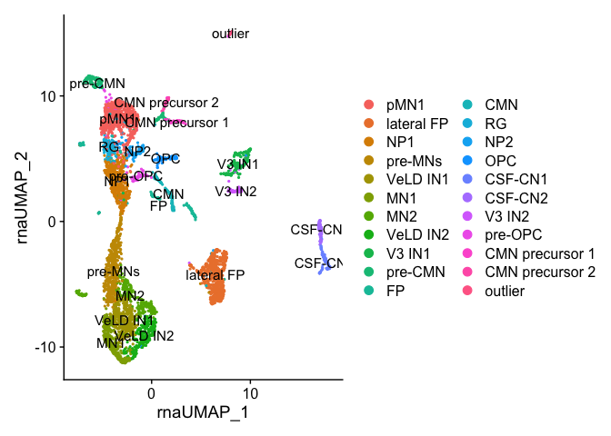
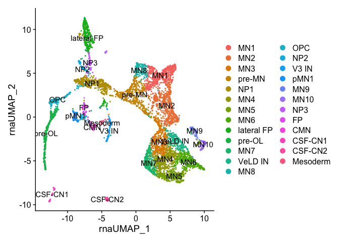
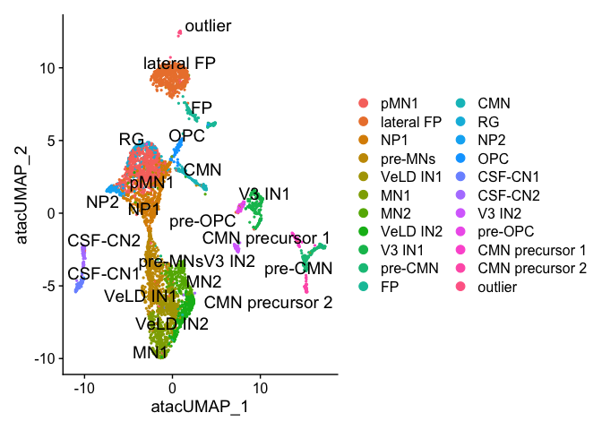
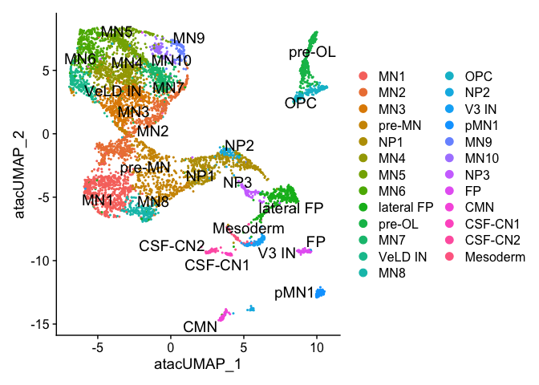
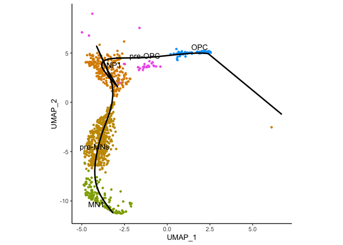

gsx2 figure 1
================

Install all packages

``` r
suppressPackageStartupMessages({
  install.packages("BiocManager")
  BiocManager::install("multtest")
  install.packages("Seurat")
  install.packages("patchwork")
  install.packages('gtools')
  if (!requireNamespace("BiocManager", quietly = TRUE))
    install.packages("BiocManager")
  if (!require(ReactomeGSA))
    BiocManager::install("ReactomeGSA")
  BiocManager::install('BSgenome.Drerio.UCSC.danRer11')
  BiocManager::install('SparseArray')
  install.packages('Signac')
  BiocManager::install('slingshot')
  BiocManager::install('SingleCellExperiment')
  install.packages("ggrepel")
  install.packages("dplyr")
  BiocManager::install('GenomeInfoDb')
  BiocManager::install('MatrixGenerics')
  BiocManager::install('matrixStats')
  BiocManager::install('DelayedMatrixStats')
})
```

    ## The following package(s) will be installed:
    ## - BiocManager [1.30.26]
    ## These packages will be installed into "~/Desktop/data/gsx2_paper_2025/renv/library/macos/R-4.4/x86_64-apple-darwin20".
    ## 
    ## # Installing packages --------------------------------------------------------
    ## - Installing BiocManager ...                    OK [linked from cache]
    ## Successfully installed 1 package in 14 milliseconds.

    ## 'getOption("repos")' replaces Bioconductor standard repositories, see
    ## 'help("repositories", package = "BiocManager")' for details.
    ## Replacement repositories:
    ##     CRAN: https://packagemanager.posit.co/cran/latest

    ## Bioconductor version 3.20 (BiocManager 1.30.26), R 4.4.0 (2024-04-24)

    ## Warning: package(s) not installed when version(s) same as or greater than current; use
    ##   `force = TRUE` to re-install: 'multtest'

    ## Installation paths not writeable, unable to update packages
    ##   path: /Users/kimarena16/Library/Caches/org.R-project.R/R/renv/sandbox/macos/R-4.4/x86_64-apple-darwin20/2edc1867
    ##   packages:
    ##     boot, class, cluster, foreign, KernSmooth, lattice, MASS, Matrix, nlme,
    ##     nnet, rpart, spatial, survival

    ## Old packages: 'later', 'RcppArmadillo', 'renv', 'XML'

    ## The following package(s) will be installed:
    ## - Seurat [5.3.0]
    ## These packages will be installed into "~/Desktop/data/gsx2_paper_2025/renv/library/macos/R-4.4/x86_64-apple-darwin20".
    ## 
    ## # Installing packages --------------------------------------------------------
    ## - Installing Seurat ...                         OK [linked from cache]
    ## Successfully installed 1 package in 9.5 milliseconds.
    ## The following package(s) will be installed:
    ## - patchwork [1.3.1]
    ## These packages will be installed into "~/Desktop/data/gsx2_paper_2025/renv/library/macos/R-4.4/x86_64-apple-darwin20".
    ## 
    ## # Installing packages --------------------------------------------------------
    ## - Installing patchwork ...                      OK [linked from cache]
    ## Successfully installed 1 package in 9.9 milliseconds.
    ## The following package(s) will be installed:
    ## - gtools [3.9.5]
    ## These packages will be installed into "~/Desktop/data/gsx2_paper_2025/renv/library/macos/R-4.4/x86_64-apple-darwin20".
    ## 
    ## # Installing packages --------------------------------------------------------
    ## - Installing gtools ...                         OK [linked from cache]
    ## Successfully installed 1 package in 11 milliseconds.

    ## Warning: package 'ReactomeGSA' was built under R version 4.4.1

    ## 'getOption("repos")' replaces Bioconductor standard repositories, see
    ## 'help("repositories", package = "BiocManager")' for details.
    ## Replacement repositories:
    ##     CRAN: https://packagemanager.posit.co/cran/latest

    ## Bioconductor version 3.20 (BiocManager 1.30.26), R 4.4.0 (2024-04-24)

    ## Warning: package(s) not installed when version(s) same as or greater than current; use
    ##   `force = TRUE` to re-install: 'BSgenome.Drerio.UCSC.danRer11'

    ## Installation paths not writeable, unable to update packages
    ##   path: /Users/kimarena16/Library/Caches/org.R-project.R/R/renv/sandbox/macos/R-4.4/x86_64-apple-darwin20/2edc1867
    ##   packages:
    ##     boot, class, cluster, foreign, KernSmooth, lattice, MASS, Matrix, nlme,
    ##     nnet, rpart, spatial, survival

    ## Old packages: 'later', 'RcppArmadillo', 'renv', 'XML'

    ## 'getOption("repos")' replaces Bioconductor standard repositories, see
    ## 'help("repositories", package = "BiocManager")' for details.
    ## Replacement repositories:
    ##     CRAN: https://packagemanager.posit.co/cran/latest

    ## Bioconductor version 3.20 (BiocManager 1.30.26), R 4.4.0 (2024-04-24)

    ## Warning: package(s) not installed when version(s) same as or greater than current; use
    ##   `force = TRUE` to re-install: 'SparseArray'

    ## Installation paths not writeable, unable to update packages
    ##   path: /Users/kimarena16/Library/Caches/org.R-project.R/R/renv/sandbox/macos/R-4.4/x86_64-apple-darwin20/2edc1867
    ##   packages:
    ##     boot, class, cluster, foreign, KernSmooth, lattice, MASS, Matrix, nlme,
    ##     nnet, rpart, spatial, survival

    ## Old packages: 'later', 'RcppArmadillo', 'renv', 'XML'

    ## The following package(s) will be installed:
    ## - Signac [1.15.0]
    ## These packages will be installed into "~/Desktop/data/gsx2_paper_2025/renv/library/macos/R-4.4/x86_64-apple-darwin20".
    ## 
    ## # Installing packages --------------------------------------------------------
    ## - Installing Signac ...                         OK [linked from cache]
    ## Successfully installed 1 package in 12 milliseconds.

    ## 'getOption("repos")' replaces Bioconductor standard repositories, see
    ## 'help("repositories", package = "BiocManager")' for details.
    ## Replacement repositories:
    ##     CRAN: https://packagemanager.posit.co/cran/latest

    ## Bioconductor version 3.20 (BiocManager 1.30.26), R 4.4.0 (2024-04-24)

    ## Warning: package(s) not installed when version(s) same as or greater than current; use
    ##   `force = TRUE` to re-install: 'slingshot'

    ## Installation paths not writeable, unable to update packages
    ##   path: /Users/kimarena16/Library/Caches/org.R-project.R/R/renv/sandbox/macos/R-4.4/x86_64-apple-darwin20/2edc1867
    ##   packages:
    ##     boot, class, cluster, foreign, KernSmooth, lattice, MASS, Matrix, nlme,
    ##     nnet, rpart, spatial, survival

    ## Old packages: 'later', 'RcppArmadillo', 'renv', 'XML'

    ## 'getOption("repos")' replaces Bioconductor standard repositories, see
    ## 'help("repositories", package = "BiocManager")' for details.
    ## Replacement repositories:
    ##     CRAN: https://packagemanager.posit.co/cran/latest

    ## Bioconductor version 3.20 (BiocManager 1.30.26), R 4.4.0 (2024-04-24)

    ## Warning: package(s) not installed when version(s) same as or greater than current; use
    ##   `force = TRUE` to re-install: 'SingleCellExperiment'

    ## Installation paths not writeable, unable to update packages
    ##   path: /Users/kimarena16/Library/Caches/org.R-project.R/R/renv/sandbox/macos/R-4.4/x86_64-apple-darwin20/2edc1867
    ##   packages:
    ##     boot, class, cluster, foreign, KernSmooth, lattice, MASS, Matrix, nlme,
    ##     nnet, rpart, spatial, survival

    ## Old packages: 'later', 'RcppArmadillo', 'renv', 'XML'

    ## The following package(s) will be installed:
    ## - ggrepel [0.9.6]
    ## These packages will be installed into "~/Desktop/data/gsx2_paper_2025/renv/library/macos/R-4.4/x86_64-apple-darwin20".
    ## 
    ## # Installing packages --------------------------------------------------------
    ## - Installing ggrepel ...                        OK [linked from cache]
    ## Successfully installed 1 package in 9.1 milliseconds.
    ## The following package(s) will be installed:
    ## - dplyr [1.1.4]
    ## These packages will be installed into "~/Desktop/data/gsx2_paper_2025/renv/library/macos/R-4.4/x86_64-apple-darwin20".
    ## 
    ## # Installing packages --------------------------------------------------------
    ## - Installing dplyr ...                          OK [linked from cache]
    ## Successfully installed 1 package in 10 milliseconds.

    ## 'getOption("repos")' replaces Bioconductor standard repositories, see
    ## 'help("repositories", package = "BiocManager")' for details.
    ## Replacement repositories:
    ##     CRAN: https://packagemanager.posit.co/cran/latest

    ## Bioconductor version 3.20 (BiocManager 1.30.26), R 4.4.0 (2024-04-24)

    ## Warning: package(s) not installed when version(s) same as or greater than current; use
    ##   `force = TRUE` to re-install: 'GenomeInfoDb'

    ## Installation paths not writeable, unable to update packages
    ##   path: /Users/kimarena16/Library/Caches/org.R-project.R/R/renv/sandbox/macos/R-4.4/x86_64-apple-darwin20/2edc1867
    ##   packages:
    ##     boot, class, cluster, foreign, KernSmooth, lattice, MASS, Matrix, nlme,
    ##     nnet, rpart, spatial, survival

    ## Old packages: 'later', 'RcppArmadillo', 'renv', 'XML'

    ## 'getOption("repos")' replaces Bioconductor standard repositories, see
    ## 'help("repositories", package = "BiocManager")' for details.
    ## Replacement repositories:
    ##     CRAN: https://packagemanager.posit.co/cran/latest

    ## Bioconductor version 3.20 (BiocManager 1.30.26), R 4.4.0 (2024-04-24)

    ## Warning: package(s) not installed when version(s) same as or greater than current; use
    ##   `force = TRUE` to re-install: 'MatrixGenerics'

    ## Installation paths not writeable, unable to update packages
    ##   path: /Users/kimarena16/Library/Caches/org.R-project.R/R/renv/sandbox/macos/R-4.4/x86_64-apple-darwin20/2edc1867
    ##   packages:
    ##     boot, class, cluster, foreign, KernSmooth, lattice, MASS, Matrix, nlme,
    ##     nnet, rpart, spatial, survival

    ## Old packages: 'later', 'RcppArmadillo', 'renv', 'XML'

    ## 'getOption("repos")' replaces Bioconductor standard repositories, see
    ## 'help("repositories", package = "BiocManager")' for details.
    ## Replacement repositories:
    ##     CRAN: https://packagemanager.posit.co/cran/latest

    ## Bioconductor version 3.20 (BiocManager 1.30.26), R 4.4.0 (2024-04-24)

    ## Warning: package(s) not installed when version(s) same as or greater than current; use
    ##   `force = TRUE` to re-install: 'matrixStats'

    ## Installation paths not writeable, unable to update packages
    ##   path: /Users/kimarena16/Library/Caches/org.R-project.R/R/renv/sandbox/macos/R-4.4/x86_64-apple-darwin20/2edc1867
    ##   packages:
    ##     boot, class, cluster, foreign, KernSmooth, lattice, MASS, Matrix, nlme,
    ##     nnet, rpart, spatial, survival

    ## Old packages: 'later', 'RcppArmadillo', 'renv', 'XML'

    ## 'getOption("repos")' replaces Bioconductor standard repositories, see
    ## 'help("repositories", package = "BiocManager")' for details.
    ## Replacement repositories:
    ##     CRAN: https://packagemanager.posit.co/cran/latest

    ## Bioconductor version 3.20 (BiocManager 1.30.26), R 4.4.0 (2024-04-24)

    ## Warning: package(s) not installed when version(s) same as or greater than current; use
    ##   `force = TRUE` to re-install: 'DelayedMatrixStats'

    ## Installation paths not writeable, unable to update packages
    ##   path: /Users/kimarena16/Library/Caches/org.R-project.R/R/renv/sandbox/macos/R-4.4/x86_64-apple-darwin20/2edc1867
    ##   packages:
    ##     boot, class, cluster, foreign, KernSmooth, lattice, MASS, Matrix, nlme,
    ##     nnet, rpart, spatial, survival

    ## Old packages: 'later', 'RcppArmadillo', 'renv', 'XML'

Load libraries

``` r
library(gtools)
library(Seurat)
```

    ## Loading required package: SeuratObject

    ## Loading required package: sp

    ## 
    ## Attaching package: 'SeuratObject'

    ## The following objects are masked from 'package:base':
    ## 
    ##     intersect, t

``` r
library(Signac)
library(ggplot2)
```

Create RNA UMAP for 36 hpf

``` r
olig2_36hpf <- readRDS("/Users/kimarena16/Desktop/data/olig2_36hpf.RDS")
DefaultAssay(olig2_36hpf) <- "SCT"
umap_plot_36hpf <- DimPlot(olig2_36hpf, label = TRUE) #label=false if you don't want labels on the plot
umap_plot_36hpf
```

<!-- -->

``` r
ggsave("36hpf_labeled_umap_2.pdf", plot = umap_plot_36hpf, width = 11, height = 7, dpi = 300, units = "in")
```

Create RNA UMAP for 48 hpf

``` r
olig2_48hpf <- readRDS("/Users/kimarena16/Desktop/data/olig2_48hpf.RDS")
DefaultAssay(olig2_48hpf) <- "SCT"
umap_plot_48hpf <- DimPlot(olig2_48hpf, label = TRUE) #label=false if you don't want labels on the plot
umap_plot_48hpf
```

<!-- -->

``` r
ggsave("48hpf_labeled_umap_2.pdf", plot = umap_plot_48hpf, width = 11, height = 7, dpi = 300, units = "in")
```

Create ATAC UMAP for 36 hpf

``` r
DefaultAssay(olig2_36hpf) <- "peaks"
ATAC_UMAP_36 <- DimPlot(olig2_36hpf, reduction = "umap.atac", label = TRUE, label.size = 5, repel = TRUE)
ATAC_UMAP_36
```

<!-- -->

``` r
ggsave(filename="36hpf_ATAC_UMAP.pdf",plot=ATAC_UMAP_36, width = 11, height = 7, dpi = 300, units = "in")
```

Creat ATAC UMAP for 48 hpf

``` r
DefaultAssay(olig2_48hpf) <- "peaks"
ATAC_UMAP_48 <- DimPlot(olig2_48hpf, reduction = "umap.atac", label = TRUE, label.size = 5, repel = TRUE)
ATAC_UMAP_48
```

<!-- -->

``` r
ggsave(filename="48hpf_ATAC_UMAP.pdf",plot=ATAC_UMAP_48, width = 11, height = 7, dpi = 300, units = "in")
```

Trajectory Analysis 36 hpf NP1-\>OPC and NP1-\>MN1

``` r
library(SingleCellExperiment)
```

    ## Warning: package 'SingleCellExperiment' was built under R version 4.4.1

    ## Loading required package: SummarizedExperiment

    ## Warning: package 'SummarizedExperiment' was built under R version 4.4.1

    ## Loading required package: MatrixGenerics

    ## Warning: package 'MatrixGenerics' was built under R version 4.4.2

    ## Loading required package: matrixStats

    ## 
    ## Attaching package: 'MatrixGenerics'

    ## The following objects are masked from 'package:matrixStats':
    ## 
    ##     colAlls, colAnyNAs, colAnys, colAvgsPerRowSet, colCollapse,
    ##     colCounts, colCummaxs, colCummins, colCumprods, colCumsums,
    ##     colDiffs, colIQRDiffs, colIQRs, colLogSumExps, colMadDiffs,
    ##     colMads, colMaxs, colMeans2, colMedians, colMins, colOrderStats,
    ##     colProds, colQuantiles, colRanges, colRanks, colSdDiffs, colSds,
    ##     colSums2, colTabulates, colVarDiffs, colVars, colWeightedMads,
    ##     colWeightedMeans, colWeightedMedians, colWeightedSds,
    ##     colWeightedVars, rowAlls, rowAnyNAs, rowAnys, rowAvgsPerColSet,
    ##     rowCollapse, rowCounts, rowCummaxs, rowCummins, rowCumprods,
    ##     rowCumsums, rowDiffs, rowIQRDiffs, rowIQRs, rowLogSumExps,
    ##     rowMadDiffs, rowMads, rowMaxs, rowMeans2, rowMedians, rowMins,
    ##     rowOrderStats, rowProds, rowQuantiles, rowRanges, rowRanks,
    ##     rowSdDiffs, rowSds, rowSums2, rowTabulates, rowVarDiffs, rowVars,
    ##     rowWeightedMads, rowWeightedMeans, rowWeightedMedians,
    ##     rowWeightedSds, rowWeightedVars

    ## Loading required package: GenomicRanges

    ## Warning: package 'GenomicRanges' was built under R version 4.4.1

    ## Loading required package: stats4

    ## Loading required package: BiocGenerics

    ## Warning: package 'BiocGenerics' was built under R version 4.4.1

    ## 
    ## Attaching package: 'BiocGenerics'

    ## The following object is masked from 'package:SeuratObject':
    ## 
    ##     intersect

    ## The following objects are masked from 'package:stats':
    ## 
    ##     IQR, mad, sd, var, xtabs

    ## The following objects are masked from 'package:base':
    ## 
    ##     anyDuplicated, aperm, append, as.data.frame, basename, cbind,
    ##     colnames, dirname, do.call, duplicated, eval, evalq, Filter, Find,
    ##     get, grep, grepl, intersect, is.unsorted, lapply, Map, mapply,
    ##     match, mget, order, paste, pmax, pmax.int, pmin, pmin.int,
    ##     Position, rank, rbind, Reduce, rownames, sapply, saveRDS, setdiff,
    ##     table, tapply, union, unique, unsplit, which.max, which.min

    ## Loading required package: S4Vectors

    ## Warning: package 'S4Vectors' was built under R version 4.4.1

    ## 
    ## Attaching package: 'S4Vectors'

    ## The following object is masked from 'package:utils':
    ## 
    ##     findMatches

    ## The following objects are masked from 'package:base':
    ## 
    ##     expand.grid, I, unname

    ## Loading required package: IRanges

    ## Warning: package 'IRanges' was built under R version 4.4.2

    ## 
    ## Attaching package: 'IRanges'

    ## The following object is masked from 'package:sp':
    ## 
    ##     %over%

    ## Loading required package: GenomeInfoDb

    ## Warning: package 'GenomeInfoDb' was built under R version 4.4.2

    ## Loading required package: Biobase

    ## Warning: package 'Biobase' was built under R version 4.4.1

    ## Welcome to Bioconductor
    ## 
    ##     Vignettes contain introductory material; view with
    ##     'browseVignettes()'. To cite Bioconductor, see
    ##     'citation("Biobase")', and for packages 'citation("pkgname")'.

    ## 
    ## Attaching package: 'Biobase'

    ## The following object is masked from 'package:MatrixGenerics':
    ## 
    ##     rowMedians

    ## The following objects are masked from 'package:matrixStats':
    ## 
    ##     anyMissing, rowMedians

    ## 
    ## Attaching package: 'SummarizedExperiment'

    ## The following object is masked from 'package:Seurat':
    ## 
    ##     Assays

    ## The following object is masked from 'package:SeuratObject':
    ## 
    ##     Assays

``` r
library(dplyr)
```

    ## 
    ## Attaching package: 'dplyr'

    ## The following object is masked from 'package:Biobase':
    ## 
    ##     combine

    ## The following objects are masked from 'package:GenomicRanges':
    ## 
    ##     intersect, setdiff, union

    ## The following object is masked from 'package:GenomeInfoDb':
    ## 
    ##     intersect

    ## The following objects are masked from 'package:IRanges':
    ## 
    ##     collapse, desc, intersect, setdiff, slice, union

    ## The following objects are masked from 'package:S4Vectors':
    ## 
    ##     first, intersect, rename, setdiff, setequal, union

    ## The following objects are masked from 'package:BiocGenerics':
    ## 
    ##     combine, intersect, setdiff, union

    ## The following object is masked from 'package:matrixStats':
    ## 
    ##     count

    ## The following objects are masked from 'package:stats':
    ## 
    ##     filter, lag

    ## The following objects are masked from 'package:base':
    ## 
    ##     intersect, setdiff, setequal, union

``` r
library(GenomicRanges)
library(slingshot)
```

    ## Warning: package 'slingshot' was built under R version 4.4.1

    ## Loading required package: princurve

    ## Loading required package: TrajectoryUtils

    ## Warning: package 'TrajectoryUtils' was built under R version 4.4.1

``` r
library(ggplot2)
library(ggrepel)

coords <- Embeddings(olig2_36hpf, "umap.rna")
umap_df <- as.data.frame(coords)
umap_df$cluster <- Idents(olig2_36hpf)
colnames(umap_df)[1:2] <- c("UMAP_1", "UMAP_2")

opc_lineage <- c("NP1","pre-OPC","OPC")
mn_lineage  <- c("NP1","pre-MNs","MN1")
traj_clusters <- c(opc_lineage, mn_lineage)

filter_lineage_cells <- function(lineage_clusters, umap_df, threshold_frac = 0.02, max_distance = 5){
  keep_cells <- c()
  for(cl in lineage_clusters){
    cl_coords <- umap_df[umap_df$cluster == cl, 1:2, drop = FALSE]
    center <- colMeans(cl_coords)
    distances <- sqrt(rowSums((cl_coords - center)^2))
    
    keep <- (distances < quantile(distances, probs = 1 - threshold_frac)) & (distances < max_distance)
    keep_cells <- c(keep_cells, rownames(cl_coords)[keep])
  }
  return(unique(keep_cells))
}

cells_opc <- filter_lineage_cells(opc_lineage, umap_df, threshold_frac = 0.02, max_distance = 5)
cells_mn  <- filter_lineage_cells(mn_lineage, umap_df, threshold_frac = 0.02, max_distance = 5)
cells_filtered <- unique(c(cells_opc, cells_mn))

umap_df_filtered <- umap_df[cells_filtered, ]
coords_filtered <- coords[cells_filtered, ]

run_lineage <- function(clusters_subset){
  sce <- SingleCellExperiment(
    assays = list(dummy = matrix(0, nrow = 1, ncol = nrow(coords_filtered))),
    colData = data.frame(cluster = umap_df_filtered$cluster),
    reducedDims = SimpleList(RNA_UMAP = coords_filtered)
  )
  sce <- sce[, sce$cluster %in% clusters_subset]
  sce$cluster <- factor(sce$cluster)
  
  sce <- slingshot(
    sce,
    clusterLabels = "cluster",
    reducedDim = "RNA_UMAP",
    start.clus = "NP1",
    stretch = 0,
    approx_points = 200
  )
  
  curve <- SlingshotDataSet(sce)@curves[[1]]
  df <- as.data.frame(curve$s)
  colnames(df) <- c("UMAP_1","UMAP_2")
  
  np1_coords <- coords_filtered[umap_df_filtered$cluster == "NP1", , drop = FALSE]
  np1_center <- colMeans(np1_coords)
  df[1, ] <- np1_center
  
  return(df)
}

df_opc <- run_lineage(opc_lineage)
```

    ## Warning in .check_reddim_names(x, value[[v]], withDimnames = TRUE, vname = sprintf("value[[%s]]", : non-NULL 'rownames(value[[1]])' should be the same as 'colnames(x)' for
    ## 'reducedDims<-'. This will be an error in the next release of
    ## Bioconductor.

``` r
df_mn  <- run_lineage(mn_lineage)
```

    ## Warning in .check_reddim_names(x, value[[v]], withDimnames = TRUE, vname = sprintf("value[[%s]]", : non-NULL 'rownames(value[[1]])' should be the same as 'colnames(x)' for
    ## 'reducedDims<-'. This will be an error in the next release of
    ## Bioconductor.

``` r
cluster_levels <- levels(Idents(olig2_36hpf))
seurat_colors <- scales::hue_pal()(length(cluster_levels))  # default Seurat colors
names(seurat_colors) <- cluster_levels

umap_df_filtered$color <- ifelse(
  umap_df_filtered$cluster %in% traj_clusters,
  as.character(umap_df_filtered$cluster),
  "Other"
)
plot_colors <- c(seurat_colors[traj_clusters], Other = "grey80")

label_df <- aggregate(cbind(UMAP_1, UMAP_2) ~ cluster, data = umap_df_filtered, FUN = mean)
label_df <- label_df[label_df$cluster %in% traj_clusters, ]

trajectory <- ggplot(umap_df_filtered, aes(x = UMAP_1, y = UMAP_2)) +
  geom_point(aes(color = color), size = 1) +
  geom_path(data = df_opc, aes(x = UMAP_1, y = UMAP_2), color = "black", size = 1) +
  geom_path(data = df_mn, aes(x = UMAP_1, y = UMAP_2), color = "black", size = 1) +
  scale_color_manual(values = plot_colors) +
  geom_text_repel(data = label_df, aes(label = cluster), size = 4) +
  theme_classic() +
  theme(aspect.ratio = 1, legend.position = "none")
```

    ## Warning: Using `size` aesthetic for lines was deprecated in ggplot2 3.4.0.
    ## ℹ Please use `linewidth` instead.
    ## This warning is displayed once every 8 hours.
    ## Call `lifecycle::last_lifecycle_warnings()` to see where this warning was
    ## generated.

``` r
trajectory
```

<!-- -->

``` r
ggsave(filename="36hpf_trajectory.pdf",plot=trajectory, width = 11, height = 7, dpi = 300, units = "in")
```
