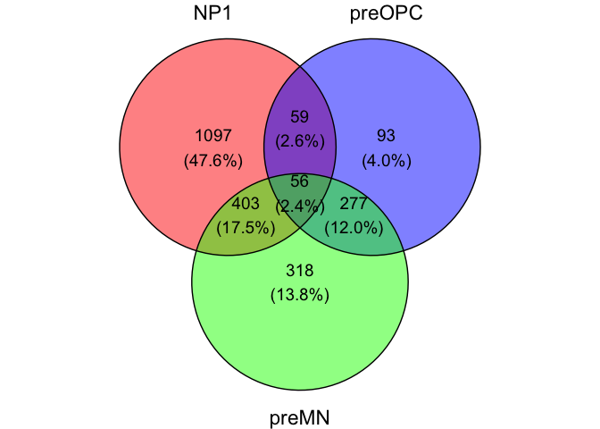
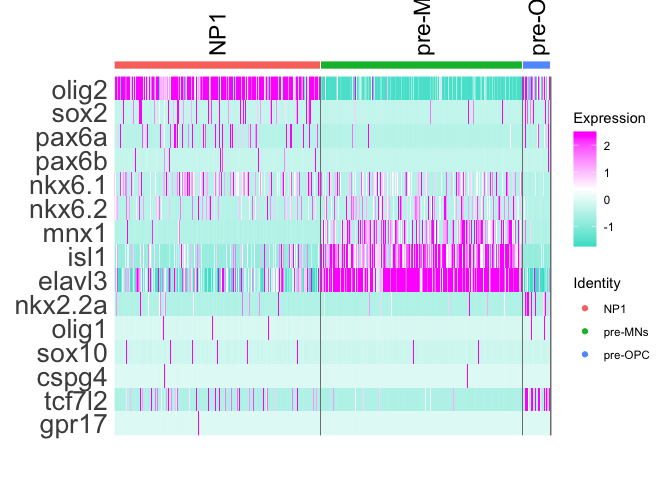
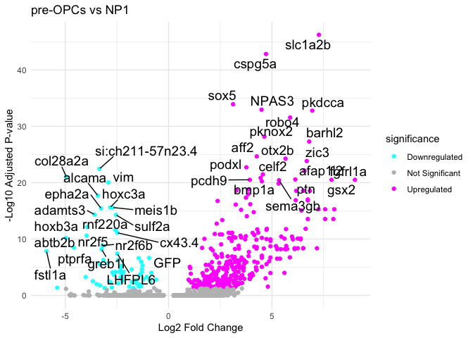
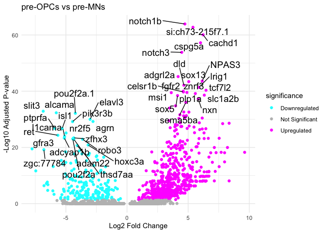
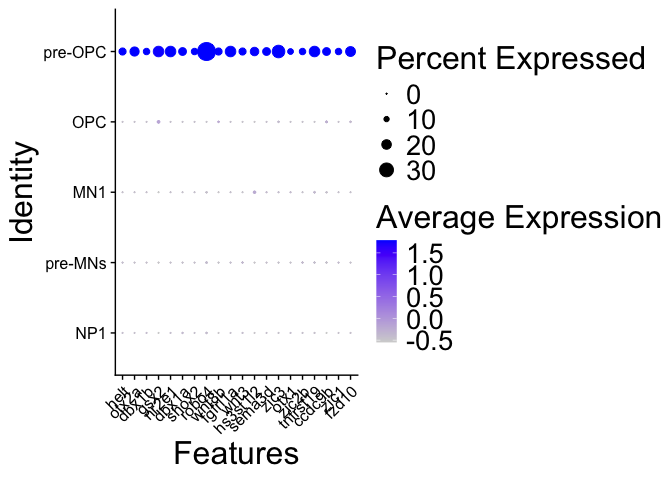
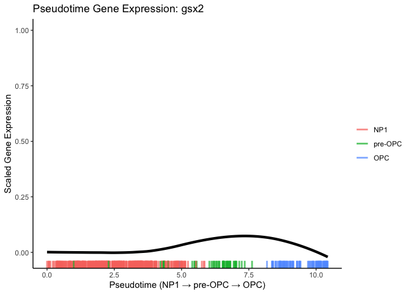

gsx2 figure 2
================

install packages

``` r
suppressPackageStartupMessages({
  install.packages("BiocManager")
  install.packages("Seurat")
  install.packages("Signac")
  install.packages('gtools')
  install.packages('ggplot2')
  install.packages('ggvenn')
  BiocManager::install('BSgenome.Drerio.UCSC.danRer11')
  BiocManager::install('SparseArray')
  install.packages('Signac')
  install.packages('scales')
  BiocManager::install('slingshot')
  BiocManager::install('SingleCellExperiment')
  install.packages("ggrepel")
  install.packages("dplyr")
  BiocManager::install('GenomeInfoDb')
  BiocManager::install('MatrixGenerics')
  BiocManager::install('matrixStats')
  BiocManager::install('DelayedMatrixStats')
})
```

    ## The following package(s) will be installed:
    ## - BiocManager [1.30.26]
    ## These packages will be installed into "~/Desktop/data/gsx2_paper_2025/renv/library/macos/R-4.4/x86_64-apple-darwin20".
    ## 
    ## # Installing packages --------------------------------------------------------
    ## - Installing BiocManager ...                    OK [linked from cache]
    ## Successfully installed 1 package in 11 milliseconds.
    ## The following package(s) will be installed:
    ## - Seurat [5.3.0]
    ## These packages will be installed into "~/Desktop/data/gsx2_paper_2025/renv/library/macos/R-4.4/x86_64-apple-darwin20".
    ## 
    ## # Installing packages --------------------------------------------------------
    ## - Installing Seurat ...                         OK [linked from cache]
    ## Successfully installed 1 package in 8.5 milliseconds.
    ## The following package(s) will be installed:
    ## - Signac [1.15.0]
    ## These packages will be installed into "~/Desktop/data/gsx2_paper_2025/renv/library/macos/R-4.4/x86_64-apple-darwin20".
    ## 
    ## # Installing packages --------------------------------------------------------
    ## - Installing Signac ...                         OK [linked from cache]
    ## Successfully installed 1 package in 9.3 milliseconds.
    ## The following package(s) will be installed:
    ## - gtools [3.9.5]
    ## These packages will be installed into "~/Desktop/data/gsx2_paper_2025/renv/library/macos/R-4.4/x86_64-apple-darwin20".
    ## 
    ## # Installing packages --------------------------------------------------------
    ## - Installing gtools ...                         OK [linked from cache]
    ## Successfully installed 1 package in 10 milliseconds.
    ## The following package(s) will be installed:
    ## - ggplot2 [3.5.2]
    ## These packages will be installed into "~/Desktop/data/gsx2_paper_2025/renv/library/macos/R-4.4/x86_64-apple-darwin20".
    ## 
    ## # Installing packages --------------------------------------------------------
    ## - Installing ggplot2 ...                        OK [linked from cache]
    ## Successfully installed 1 package in 9.1 milliseconds.
    ## The following package(s) will be installed:
    ## - ggvenn [0.1.10]
    ## These packages will be installed into "~/Desktop/data/gsx2_paper_2025/renv/library/macos/R-4.4/x86_64-apple-darwin20".
    ## 
    ## # Installing packages --------------------------------------------------------
    ## - Installing ggvenn ...                         OK [linked from cache]
    ## Successfully installed 1 package in 9.7 milliseconds.

    ## 'getOption("repos")' replaces Bioconductor standard repositories, see
    ## 'help("repositories", package = "BiocManager")' for details.
    ## Replacement repositories:
    ##     CRAN: https://packagemanager.posit.co/cran/latest

    ## Bioconductor version 3.20 (BiocManager 1.30.26), R 4.4.0 (2024-04-24)

    ## Warning: package(s) not installed when version(s) same as or greater than current; use
    ##   `force = TRUE` to re-install: 'BSgenome.Drerio.UCSC.danRer11'

    ## Installation paths not writeable, unable to update packages
    ##   path: /Users/kimarena16/Library/Caches/org.R-project.R/R/renv/sandbox/macos/R-4.4/x86_64-apple-darwin20/2edc1867
    ##   packages:
    ##     boot, class, cluster, foreign, KernSmooth, lattice, MASS, Matrix, nlme,
    ##     nnet, rpart, spatial, survival

    ## Old packages: 'later', 'RcppArmadillo', 'renv', 'XML'

    ## 'getOption("repos")' replaces Bioconductor standard repositories, see
    ## 'help("repositories", package = "BiocManager")' for details.
    ## Replacement repositories:
    ##     CRAN: https://packagemanager.posit.co/cran/latest

    ## Bioconductor version 3.20 (BiocManager 1.30.26), R 4.4.0 (2024-04-24)

    ## Warning: package(s) not installed when version(s) same as or greater than current; use
    ##   `force = TRUE` to re-install: 'SparseArray'

    ## Installation paths not writeable, unable to update packages
    ##   path: /Users/kimarena16/Library/Caches/org.R-project.R/R/renv/sandbox/macos/R-4.4/x86_64-apple-darwin20/2edc1867
    ##   packages:
    ##     boot, class, cluster, foreign, KernSmooth, lattice, MASS, Matrix, nlme,
    ##     nnet, rpart, spatial, survival

    ## Old packages: 'later', 'RcppArmadillo', 'renv', 'XML'

    ## The following package(s) will be installed:
    ## - Signac [1.15.0]
    ## These packages will be installed into "~/Desktop/data/gsx2_paper_2025/renv/library/macos/R-4.4/x86_64-apple-darwin20".
    ## 
    ## # Installing packages --------------------------------------------------------
    ## - Installing Signac ...                         OK [linked from cache]
    ## Successfully installed 1 package in 9.7 milliseconds.
    ## The following package(s) will be installed:
    ## - scales [1.4.0]
    ## These packages will be installed into "~/Desktop/data/gsx2_paper_2025/renv/library/macos/R-4.4/x86_64-apple-darwin20".
    ## 
    ## # Installing packages --------------------------------------------------------
    ## - Installing scales ...                         OK [linked from cache]
    ## Successfully installed 1 package in 9.9 milliseconds.

    ## 'getOption("repos")' replaces Bioconductor standard repositories, see
    ## 'help("repositories", package = "BiocManager")' for details.
    ## Replacement repositories:
    ##     CRAN: https://packagemanager.posit.co/cran/latest

    ## Bioconductor version 3.20 (BiocManager 1.30.26), R 4.4.0 (2024-04-24)

    ## Warning: package(s) not installed when version(s) same as or greater than current; use
    ##   `force = TRUE` to re-install: 'slingshot'

    ## Installation paths not writeable, unable to update packages
    ##   path: /Users/kimarena16/Library/Caches/org.R-project.R/R/renv/sandbox/macos/R-4.4/x86_64-apple-darwin20/2edc1867
    ##   packages:
    ##     boot, class, cluster, foreign, KernSmooth, lattice, MASS, Matrix, nlme,
    ##     nnet, rpart, spatial, survival

    ## Old packages: 'later', 'RcppArmadillo', 'renv', 'XML'

    ## 'getOption("repos")' replaces Bioconductor standard repositories, see
    ## 'help("repositories", package = "BiocManager")' for details.
    ## Replacement repositories:
    ##     CRAN: https://packagemanager.posit.co/cran/latest

    ## Bioconductor version 3.20 (BiocManager 1.30.26), R 4.4.0 (2024-04-24)

    ## Warning: package(s) not installed when version(s) same as or greater than current; use
    ##   `force = TRUE` to re-install: 'SingleCellExperiment'

    ## Installation paths not writeable, unable to update packages
    ##   path: /Users/kimarena16/Library/Caches/org.R-project.R/R/renv/sandbox/macos/R-4.4/x86_64-apple-darwin20/2edc1867
    ##   packages:
    ##     boot, class, cluster, foreign, KernSmooth, lattice, MASS, Matrix, nlme,
    ##     nnet, rpart, spatial, survival

    ## Old packages: 'later', 'RcppArmadillo', 'renv', 'XML'

    ## The following package(s) will be installed:
    ## - ggrepel [0.9.6]
    ## These packages will be installed into "~/Desktop/data/gsx2_paper_2025/renv/library/macos/R-4.4/x86_64-apple-darwin20".
    ## 
    ## # Installing packages --------------------------------------------------------
    ## - Installing ggrepel ...                        OK [linked from cache]
    ## Successfully installed 1 package in 8.8 milliseconds.
    ## The following package(s) will be installed:
    ## - dplyr [1.1.4]
    ## These packages will be installed into "~/Desktop/data/gsx2_paper_2025/renv/library/macos/R-4.4/x86_64-apple-darwin20".
    ## 
    ## # Installing packages --------------------------------------------------------
    ## - Installing dplyr ...                          OK [linked from cache]
    ## Successfully installed 1 package in 10 milliseconds.

    ## 'getOption("repos")' replaces Bioconductor standard repositories, see
    ## 'help("repositories", package = "BiocManager")' for details.
    ## Replacement repositories:
    ##     CRAN: https://packagemanager.posit.co/cran/latest

    ## Bioconductor version 3.20 (BiocManager 1.30.26), R 4.4.0 (2024-04-24)

    ## Warning: package(s) not installed when version(s) same as or greater than current; use
    ##   `force = TRUE` to re-install: 'GenomeInfoDb'

    ## Installation paths not writeable, unable to update packages
    ##   path: /Users/kimarena16/Library/Caches/org.R-project.R/R/renv/sandbox/macos/R-4.4/x86_64-apple-darwin20/2edc1867
    ##   packages:
    ##     boot, class, cluster, foreign, KernSmooth, lattice, MASS, Matrix, nlme,
    ##     nnet, rpart, spatial, survival

    ## Old packages: 'later', 'RcppArmadillo', 'renv', 'XML'

    ## 'getOption("repos")' replaces Bioconductor standard repositories, see
    ## 'help("repositories", package = "BiocManager")' for details.
    ## Replacement repositories:
    ##     CRAN: https://packagemanager.posit.co/cran/latest

    ## Bioconductor version 3.20 (BiocManager 1.30.26), R 4.4.0 (2024-04-24)

    ## Warning: package(s) not installed when version(s) same as or greater than current; use
    ##   `force = TRUE` to re-install: 'MatrixGenerics'

    ## Installation paths not writeable, unable to update packages
    ##   path: /Users/kimarena16/Library/Caches/org.R-project.R/R/renv/sandbox/macos/R-4.4/x86_64-apple-darwin20/2edc1867
    ##   packages:
    ##     boot, class, cluster, foreign, KernSmooth, lattice, MASS, Matrix, nlme,
    ##     nnet, rpart, spatial, survival

    ## Old packages: 'later', 'RcppArmadillo', 'renv', 'XML'

    ## 'getOption("repos")' replaces Bioconductor standard repositories, see
    ## 'help("repositories", package = "BiocManager")' for details.
    ## Replacement repositories:
    ##     CRAN: https://packagemanager.posit.co/cran/latest

    ## Bioconductor version 3.20 (BiocManager 1.30.26), R 4.4.0 (2024-04-24)

    ## Warning: package(s) not installed when version(s) same as or greater than current; use
    ##   `force = TRUE` to re-install: 'matrixStats'

    ## Installation paths not writeable, unable to update packages
    ##   path: /Users/kimarena16/Library/Caches/org.R-project.R/R/renv/sandbox/macos/R-4.4/x86_64-apple-darwin20/2edc1867
    ##   packages:
    ##     boot, class, cluster, foreign, KernSmooth, lattice, MASS, Matrix, nlme,
    ##     nnet, rpart, spatial, survival

    ## Old packages: 'later', 'RcppArmadillo', 'renv', 'XML'

    ## 'getOption("repos")' replaces Bioconductor standard repositories, see
    ## 'help("repositories", package = "BiocManager")' for details.
    ## Replacement repositories:
    ##     CRAN: https://packagemanager.posit.co/cran/latest

    ## Bioconductor version 3.20 (BiocManager 1.30.26), R 4.4.0 (2024-04-24)

    ## Warning: package(s) not installed when version(s) same as or greater than current; use
    ##   `force = TRUE` to re-install: 'DelayedMatrixStats'

    ## Installation paths not writeable, unable to update packages
    ##   path: /Users/kimarena16/Library/Caches/org.R-project.R/R/renv/sandbox/macos/R-4.4/x86_64-apple-darwin20/2edc1867
    ##   packages:
    ##     boot, class, cluster, foreign, KernSmooth, lattice, MASS, Matrix, nlme,
    ##     nnet, rpart, spatial, survival

    ## Old packages: 'later', 'RcppArmadillo', 'renv', 'XML'

Venn Diagram for Gene Expression

``` r
library(Seurat)
```

    ## Loading required package: SeuratObject

    ## Loading required package: sp

    ## 
    ## Attaching package: 'SeuratObject'

    ## The following objects are masked from 'package:base':
    ## 
    ##     intersect, t

``` r
library(ggplot2)
library(ggvenn)
```

    ## Loading required package: dplyr

    ## 
    ## Attaching package: 'dplyr'

    ## The following objects are masked from 'package:stats':
    ## 
    ##     filter, lag

    ## The following objects are masked from 'package:base':
    ## 
    ##     intersect, setdiff, setequal, union

    ## Loading required package: grid

``` r
library(Signac)
olig2_36hpf <- readRDS("/Users/kimarena16/Desktop/data/olig2_36hpf.RDS")
DefaultAssay(olig2_36hpf) <- "SCT"
clusters_of_interest <- c("NP1", "pre-OPC", "pre-MNs")
olig2_subset <- subset(olig2_36hpf, idents = clusters_of_interest)
de_genes_preOPC_vs_NP1 <- FindMarkers(olig2_subset, ident.1 = "pre-OPC", ident.2 = "NP1", test.use = "wilcox")
```

    ## Warning: The `slot` argument of `GetAssayData()` is deprecated as of SeuratObject 5.0.0.
    ## ℹ Please use the `layer` argument instead.
    ## ℹ The deprecated feature was likely used in the Seurat package.
    ##   Please report the issue at <https://github.com/satijalab/seurat/issues>.
    ## This warning is displayed once every 8 hours.
    ## Call `lifecycle::last_lifecycle_warnings()` to see where this warning was
    ## generated.

    ## Warning: `PackageCheck()` was deprecated in SeuratObject 5.0.0.
    ## ℹ Please use `rlang::check_installed()` instead.
    ## ℹ The deprecated feature was likely used in the Seurat package.
    ##   Please report the issue at <https://github.com/satijalab/seurat/issues>.
    ## This warning is displayed once every 8 hours.
    ## Call `lifecycle::last_lifecycle_warnings()` to see where this warning was
    ## generated.

    ## For a (much!) faster implementation of the Wilcoxon Rank Sum Test,
    ## (default method for FindMarkers) please install the presto package
    ## --------------------------------------------
    ## install.packages('devtools')
    ## devtools::install_github('immunogenomics/presto')
    ## --------------------------------------------
    ## After installation of presto, Seurat will automatically use the more 
    ## efficient implementation (no further action necessary).
    ## This message will be shown once per session

``` r
de_genes_preOPC_vs_preMN <- FindMarkers(olig2_subset, ident.1 = "pre-OPC", ident.2 = "pre-MNs", test.use = "wilcox")
de_genes_NP1_vs_preMN <- FindMarkers(olig2_subset, ident.1 = "NP1", ident.2 = "pre-MNs", test.use = "wilcox")

#Filter genes with adjusted p-value < 0.05
preopc_vs_np1_genes <- rownames(de_genes_preOPC_vs_NP1[de_genes_preOPC_vs_NP1$p_val_adj < 0.05, ])
preopc_vs_premn_genes <- rownames(de_genes_preOPC_vs_preMN[de_genes_preOPC_vs_preMN$p_val_adj < 0.05, ])
premn_vs_np1_genes <- rownames(de_genes_NP1_vs_preMN[de_genes_NP1_vs_preMN$p_val_adj < 0.05, ])

np1_genes <- setdiff(premn_vs_np1_genes, union(preopc_vs_np1_genes, preopc_vs_premn_genes))
preopc_genes <- setdiff(preopc_vs_np1_genes, union(premn_vs_np1_genes, preopc_vs_premn_genes))
premn_genes <- setdiff(preopc_vs_premn_genes, union(preopc_vs_np1_genes, premn_vs_np1_genes))

shared_np1_premn <- intersect(premn_vs_np1_genes, preopc_vs_np1_genes)
shared_np1_preopc <- intersect(preopc_vs_np1_genes, preopc_vs_premn_genes)
shared_premn_preopc <- intersect(preopc_vs_premn_genes, premn_vs_np1_genes)
shared_all <- Reduce(intersect, list(premn_vs_np1_genes, preopc_vs_np1_genes, preopc_vs_premn_genes))

gene_venn <- ggvenn(
  list(
    NP1 = premn_vs_np1_genes, 
    preOPC = preopc_vs_np1_genes, 
    preMN = preopc_vs_premn_genes
  ),
  fill_color = c("red", "blue", "green"),
  stroke_size = 0.5,
  text_size = 5
)
gene_venn
```

<!-- -->

``` r
ggsave("36hpf_gene_expression_venn_diagram.pdf", gene_venn, width = 6, height = 6, dpi = 300, units = 'in')
```

Heatmap for Progenitor, OPC, and Neuronal Markers in NP1, pre-OPC,
pre-MN

``` r
library(Seurat)
library(dplyr)
DefaultAssay(olig2_36hpf) <- "SCT"

progenitor_neuron_ol_genes <- c("olig2", "sox2", "pax6a", "pax6b", "nkx6.1", "nkx6.2", "neurog2", "mnx1", "isl1", "ngn2", "elavl3", "klf6", "nkx2.2a", "olig1", "sox10", "cspg4", "tcf7l2", "gpr17", "ng2")

clusters_of_interest <- c("NP1", "pre-OPC", "pre-MNs")
olig2_36hpf_subset <- subset(olig2_36hpf, idents = clusters_of_interest)

heatmap <- DoHeatmap(
  olig2_36hpf_subset, 
  features = progenitor_neuron_ol_genes, 
  cells = WhichCells(olig2_36hpf_subset, idents = clusters_of_interest),
  group.by = "ident",
  group.bar = TRUE,
  size = 6,
  angle = 90
) +
  scale_fill_gradientn(colors = c("turquoise", "white", "magenta")) +
  theme(axis.text.y = element_text(size = 20))
```

    ## Warning in DoHeatmap(olig2_36hpf_subset, features = progenitor_neuron_ol_genes,
    ## : The following features were omitted as they were not found in the scale.data
    ## slot for the SCT assay: ng2, klf6, ngn2, neurog2

    ## Scale for fill is already present.
    ## Adding another scale for fill, which will replace the existing scale.

``` r
print(heatmap)
```

<!-- -->

``` r
ggsave("36hpf_NP_MN_opc_genes_heatmap.png", heatmap, width = 10, height = 10, dpi = 300, units = 'in')
```

Differential Expression pre-OPC vs NP1

``` r
library(Seurat)
library(ggplot2)
library(ggrepel)
deg_results <- FindMarkers(olig2_36hpf, ident.1 = "pre-OPC", ident.2 = "NP1", 
                           logfc.threshold = 0.25, min.pct = 0.1)

deg_results$log_pval <- -log10(deg_results$p_val_adj)
deg_results$significance <- ifelse(deg_results$avg_log2FC > 0.5 & deg_results$p_val_adj < 0.05, 
                                   "Upregulated", 
                                   ifelse(deg_results$avg_log2FC < -0.5 & deg_results$p_val_adj < 0.05, 
                                          "Downregulated", "Not Significant"))

top_up_genes <- rownames(deg_results[deg_results$avg_log2FC > 0.5 & deg_results$p_val_adj < 0.05, ])[1:20]
top_down_genes <- rownames(deg_results[deg_results$avg_log2FC < -0.5 & deg_results$p_val_adj < 0.05, ])[1:20]
top_genes <- c(top_up_genes, top_down_genes)
label_data <- deg_results[rownames(deg_results) %in% top_genes, ]
label_data$gene <- rownames(label_data)
DEplot<- ggplot(deg_results, aes(x = avg_log2FC, y = log_pval)) + 
  geom_point(aes(color = significance)) + 
  scale_color_manual(values = c("Upregulated" = "magenta", "Downregulated" = "cyan", "Not Significant" = "grey")) +
  labs(title = "pre-OPCs vs NP1", x = "Log2 Fold Change", y = "-Log10 Adjusted P-value") +
  geom_text_repel(data = label_data, aes(label = gene), size = 5, max.overlaps = Inf) +  # Use 'gene' for labels
  theme_minimal()
DEplot
```

<!-- -->

``` r
ggsave(filename="36hpf_preOPCs_DEgenesvsNP1_volcano.pdf",plot=DEplot, width = 10, height = 10, dpi = 300, units = "in")
```

Differential Expression pre-OPC vs pre-MNs

``` r
library(Seurat)
library(ggplot2)
library(ggrepel)
deg_results <- FindMarkers(olig2_36hpf, ident.1 = "pre-OPC", ident.2 = "pre-MNs", 
                           logfc.threshold = 0.25, min.pct = 0.1)

deg_results$log_pval <- -log10(deg_results$p_val_adj)
deg_results$significance <- ifelse(deg_results$avg_log2FC > 0.5 & deg_results$p_val_adj < 0.05, 
                                   "Upregulated", 
                                   ifelse(deg_results$avg_log2FC < -0.5 & deg_results$p_val_adj < 0.05, 
                                          "Downregulated", "Not Significant"))

top_up_genes <- rownames(deg_results[deg_results$avg_log2FC > 0.5 & deg_results$p_val_adj < 0.05, ])[1:20]
top_down_genes <- rownames(deg_results[deg_results$avg_log2FC < -0.5 & deg_results$p_val_adj < 0.05, ])[1:20]
top_genes <- c(top_up_genes, top_down_genes)
label_data <- deg_results[rownames(deg_results) %in% top_genes, ]
label_data$gene <- rownames(label_data)
DEplot<- ggplot(deg_results, aes(x = avg_log2FC, y = log_pval)) + 
  geom_point(aes(color = significance)) + 
  scale_color_manual(values = c("Upregulated" = "magenta", "Downregulated" = "cyan", "Not Significant" = "grey")) +
  labs(title = "pre-OPCs vs pre-MNs", x = "Log2 Fold Change", y = "-Log10 Adjusted P-value") +
  geom_text_repel(data = label_data, aes(label = gene), size = 5, max.overlaps = Inf) +  # Use 'gene' for labels
  theme_minimal()
DEplot
```

<!-- -->

``` r
ggsave(filename="36hpf_preOPCs_DEgenesvspreMNs_volcano.pdf",plot=DEplot, width = 10, height = 10, dpi = 300, units = "in")
```

Top DE Genes in Pre-OPCs Dotplot

``` r
library(Seurat)
library(ggplot2)
DefaultAssay(olig2_36hpf) <- "SCT"
clusters_of_interest <- c("pre-OPC", "OPC", "NP1", "pre-MNs", "MN1")
olig2_36hpf_subset <- subset(olig2_36hpf, idents = clusters_of_interest)
top_genes_cluster <- FindMarkers(olig2_36hpf, ident.1 = "pre-OPC", only.pos = TRUE, min.pct = 0.1)
top_genes <- rownames(top_genes_cluster[order(top_genes_cluster$avg_log2FC, decreasing = TRUE), ])[1:20]
top_genes
```

    ##  [1] "helt"     "otx2a"    "dbx1b"    "gsx2"     "nr2e1"    "dbx1a"   
    ##  [7] "shox2"    "robo4"    "wnt8b"    "fgfrl1a"  "wnt3"     "hs3st1l2"
    ## [13] "sema3d"   "zic3"     "otx1"     "zic2b"    "tnfrsf19" "ccdc9b"  
    ## [19] "zic1"     "fzd10"

``` r
DP <- DotPlot(olig2_36hpf_subset, features = top_genes) + 
  theme(
    axis.text.x = element_text(angle = 45, hjust = 1),
    text = element_text(size = 24)
  )
DP
```

<!-- -->

``` r
ggsave(filename="36hpf_preOPC_topgenes.pdf",plot=DP, width = 10, height = 8, dpi = 300, units = "in")
```

Pseudotime Trajectory for gsx2 Expression from NP1-\>OPC

``` r
library(Seurat)
library(SingleCellExperiment)
```

    ## Warning: package 'SingleCellExperiment' was built under R version 4.4.1

    ## Loading required package: SummarizedExperiment

    ## Warning: package 'SummarizedExperiment' was built under R version 4.4.1

    ## Loading required package: MatrixGenerics

    ## Warning: package 'MatrixGenerics' was built under R version 4.4.2

    ## Loading required package: matrixStats

    ## 
    ## Attaching package: 'matrixStats'

    ## The following object is masked from 'package:dplyr':
    ## 
    ##     count

    ## 
    ## Attaching package: 'MatrixGenerics'

    ## The following objects are masked from 'package:matrixStats':
    ## 
    ##     colAlls, colAnyNAs, colAnys, colAvgsPerRowSet, colCollapse,
    ##     colCounts, colCummaxs, colCummins, colCumprods, colCumsums,
    ##     colDiffs, colIQRDiffs, colIQRs, colLogSumExps, colMadDiffs,
    ##     colMads, colMaxs, colMeans2, colMedians, colMins, colOrderStats,
    ##     colProds, colQuantiles, colRanges, colRanks, colSdDiffs, colSds,
    ##     colSums2, colTabulates, colVarDiffs, colVars, colWeightedMads,
    ##     colWeightedMeans, colWeightedMedians, colWeightedSds,
    ##     colWeightedVars, rowAlls, rowAnyNAs, rowAnys, rowAvgsPerColSet,
    ##     rowCollapse, rowCounts, rowCummaxs, rowCummins, rowCumprods,
    ##     rowCumsums, rowDiffs, rowIQRDiffs, rowIQRs, rowLogSumExps,
    ##     rowMadDiffs, rowMads, rowMaxs, rowMeans2, rowMedians, rowMins,
    ##     rowOrderStats, rowProds, rowQuantiles, rowRanges, rowRanks,
    ##     rowSdDiffs, rowSds, rowSums2, rowTabulates, rowVarDiffs, rowVars,
    ##     rowWeightedMads, rowWeightedMeans, rowWeightedMedians,
    ##     rowWeightedSds, rowWeightedVars

    ## Loading required package: GenomicRanges

    ## Warning: package 'GenomicRanges' was built under R version 4.4.1

    ## Loading required package: stats4

    ## Loading required package: BiocGenerics

    ## Warning: package 'BiocGenerics' was built under R version 4.4.1

    ## 
    ## Attaching package: 'BiocGenerics'

    ## The following objects are masked from 'package:dplyr':
    ## 
    ##     combine, intersect, setdiff, union

    ## The following object is masked from 'package:SeuratObject':
    ## 
    ##     intersect

    ## The following objects are masked from 'package:stats':
    ## 
    ##     IQR, mad, sd, var, xtabs

    ## The following objects are masked from 'package:base':
    ## 
    ##     anyDuplicated, aperm, append, as.data.frame, basename, cbind,
    ##     colnames, dirname, do.call, duplicated, eval, evalq, Filter, Find,
    ##     get, grep, grepl, intersect, is.unsorted, lapply, Map, mapply,
    ##     match, mget, order, paste, pmax, pmax.int, pmin, pmin.int,
    ##     Position, rank, rbind, Reduce, rownames, sapply, saveRDS, setdiff,
    ##     table, tapply, union, unique, unsplit, which.max, which.min

    ## Loading required package: S4Vectors

    ## Warning: package 'S4Vectors' was built under R version 4.4.1

    ## 
    ## Attaching package: 'S4Vectors'

    ## The following objects are masked from 'package:dplyr':
    ## 
    ##     first, rename

    ## The following object is masked from 'package:utils':
    ## 
    ##     findMatches

    ## The following objects are masked from 'package:base':
    ## 
    ##     expand.grid, I, unname

    ## Loading required package: IRanges

    ## Warning: package 'IRanges' was built under R version 4.4.2

    ## 
    ## Attaching package: 'IRanges'

    ## The following objects are masked from 'package:dplyr':
    ## 
    ##     collapse, desc, slice

    ## The following object is masked from 'package:sp':
    ## 
    ##     %over%

    ## Loading required package: GenomeInfoDb

    ## Warning: package 'GenomeInfoDb' was built under R version 4.4.2

    ## Loading required package: Biobase

    ## Warning: package 'Biobase' was built under R version 4.4.1

    ## Welcome to Bioconductor
    ## 
    ##     Vignettes contain introductory material; view with
    ##     'browseVignettes()'. To cite Bioconductor, see
    ##     'citation("Biobase")', and for packages 'citation("pkgname")'.

    ## 
    ## Attaching package: 'Biobase'

    ## The following object is masked from 'package:MatrixGenerics':
    ## 
    ##     rowMedians

    ## The following objects are masked from 'package:matrixStats':
    ## 
    ##     anyMissing, rowMedians

    ## 
    ## Attaching package: 'SummarizedExperiment'

    ## The following object is masked from 'package:Seurat':
    ## 
    ##     Assays

    ## The following object is masked from 'package:SeuratObject':
    ## 
    ##     Assays

``` r
library(slingshot)
```

    ## Warning: package 'slingshot' was built under R version 4.4.1

    ## Loading required package: princurve

    ## Loading required package: TrajectoryUtils

    ## Warning: package 'TrajectoryUtils' was built under R version 4.4.1

``` r
library(ggplot2)
library(scales)

embeddings <- Embeddings(olig2_36hpf, "umap.rna")   
clusters <- Idents(olig2_36hpf)                    

clusters_to_show <- c("NP1", "pre-OPC", "OPC")
cells_subset <- WhichCells(olig2_36hpf, idents = clusters_to_show)

embeddings_subset <- embeddings[cells_subset, ]
clusters_subset <- factor(clusters[cells_subset], levels = clusters_to_show)
keep_cells <- rownames(embeddings_subset)[
  embeddings_subset[,1] >= quantile(embeddings_subset[,1], 0.01) &
  embeddings_subset[,1] <= quantile(embeddings_subset[,1], 0.99) &
  embeddings_subset[,2] >= quantile(embeddings_subset[,2], 0.01) &
  embeddings_subset[,2] <= quantile(embeddings_subset[,2], 0.99)
]

embeddings_subset <- embeddings_subset[keep_cells, ]
clusters_subset <- clusters_subset[keep_cells]

sce_subset <- SingleCellExperiment(
  assays = list(dummy = matrix(0, nrow = 1, ncol = nrow(embeddings_subset))),
  colData = data.frame(cluster = clusters_subset),
  reducedDims = SimpleList(RNA_UMAP = embeddings_subset)
)

ss <- slingshot(
  sce_subset,
  clusterLabels = "cluster",
  reducedDim = "RNA_UMAP",
  start.clus = "NP1",
  stretch = 0
)

pseudotime <- slingPseudotime(ss)[, "Lineage1"]

gene_name <- "gsx2"
expr_mat <- GetAssayData(olig2_36hpf, assay = "SCT", slot = "data")
expr_gene <- expr_mat[gene_name, cells_subset]

common_cells <- intersect(names(expr_gene), names(pseudotime))

df <- data.frame(
  cell = common_cells,
  gene_expr = as.numeric(expr_gene[common_cells]),
  pseudotime = pseudotime[common_cells],
  cluster = clusters_subset[common_cells]
)

df$cluster <- factor(df$cluster, levels = clusters_to_show)

df$gene_expr_scaled <- scales::rescale(df$gene_expr)

cluster_colors <- setNames(scales::hue_pal()(length(clusters_to_show)), clusters_to_show)

p <- ggplot(df, aes(x = pseudotime, y = gene_expr_scaled)) +
  geom_smooth(color = "black", size = 1.5, se = FALSE) +  # black trajectory line
  geom_rug(aes(color = cluster), sides = "b", alpha = 0.7, size = 1) +
  scale_color_manual(values = cluster_colors) +
  labs(
    title = paste0("Pseudotime Gene Expression: ", gene_name),
    x = "Pseudotime (NP1 → pre-OPC → OPC)",
    y = "Scaled Gene Expression",
    color = "Cluster"
  ) +
  theme_classic() +
  theme(legend.title = element_blank())
```

    ## Warning: Using `size` aesthetic for lines was deprecated in ggplot2 3.4.0.
    ## ℹ Please use `linewidth` instead.
    ## This warning is displayed once every 8 hours.
    ## Call `lifecycle::last_lifecycle_warnings()` to see where this warning was
    ## generated.

``` r
# Print the plot
print(p)
```

    ## `geom_smooth()` using method = 'loess' and formula = 'y ~ x'

<!-- -->

``` r
ggsave(filename="36hpf_gsx2_expression_pseudotime_NP1_to_OPC.pdf",plot=p, width = 6, height = 3, dpi = 300, units = "in")
```

    ## `geom_smooth()` using method = 'loess' and formula = 'y ~ x'

    ## Warning in grid.Call.graphics(C_text, as.graphicsAnnot(x$label), x$x, x$y, :
    ## for 'Pseudotime (NP1 → pre-OPC → OPC)' in 'mbcsToSbcs': -> substituted for →
    ## (U+2192)

    ## Warning in grid.Call.graphics(C_text, as.graphicsAnnot(x$label), x$x, x$y, :
    ## for 'Pseudotime (NP1 → pre-OPC → OPC)' in 'mbcsToSbcs': -> substituted for →
    ## (U+2192)
