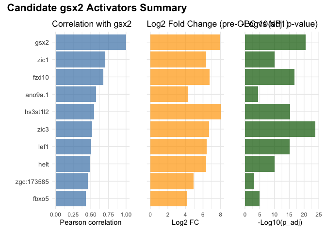
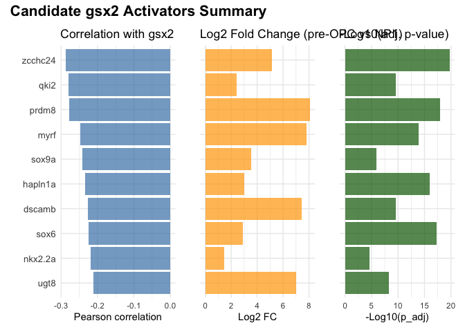
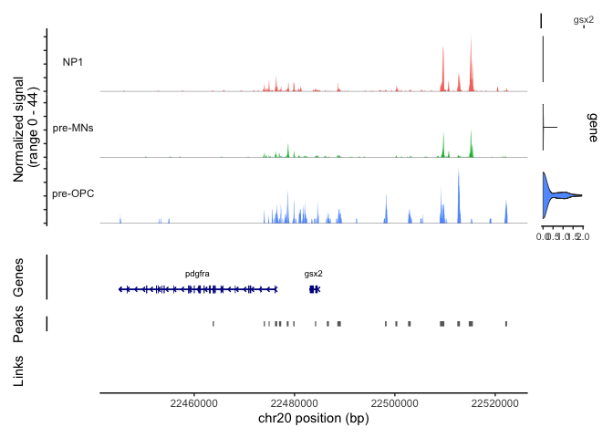
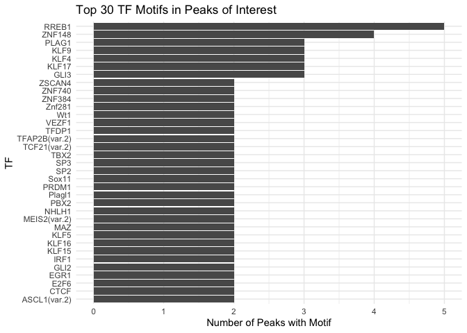
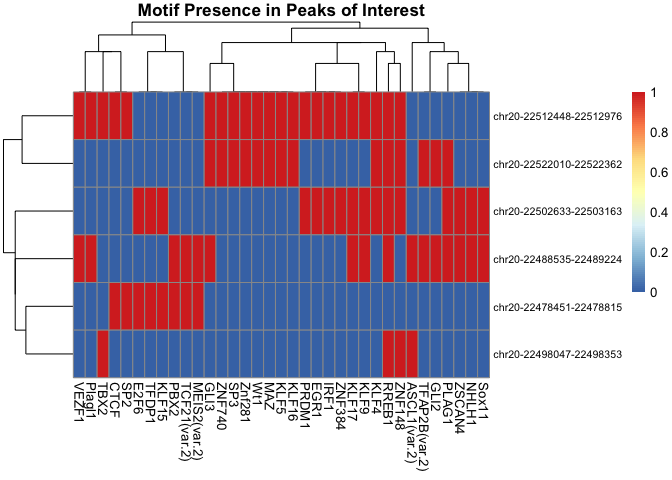
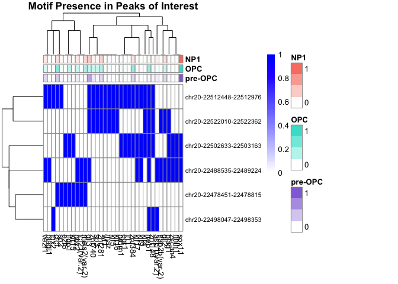
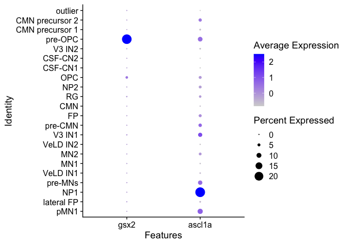

gsx2 figure 6
================

install packages

``` r
suppressPackageStartupMessages({
  install.packages("BiocManager")
  install.packages("Seurat")
  install.packages("Signac")
  install.packages("dplyr")
  install.packages("ggplot2")
  install.packages("patchwork")
  if (!requireNamespace("BiocManager", quietly = TRUE))
    install.packages("BiocManager")
  if (!require(ReactomeGSA))
    BiocManager::install("ReactomeGSA")
  BiocManager::install('BSgenome.Drerio.UCSC.danRer11')
  BiocManager::install('rtracklayer')
  BiocManager::install('stringr')
  BiocManager::install('pheatmap')
  install.packages("tidyverse")
  install.packages('Matrix')
  BiocManager::install('GenomeInfoDb')
  BiocManager::install('TFBSTools')
  BiocManager::install('JASPAR2020')
})
```

    ## The following package(s) will be installed:
    ## - BiocManager [1.30.26]
    ## These packages will be installed into "~/Desktop/data/gsx2_paper_2025/renv/library/macos/R-4.4/x86_64-apple-darwin20".
    ## 
    ## # Installing packages --------------------------------------------------------
    ## - Installing BiocManager ...                    OK [linked from cache]
    ## Successfully installed 1 package in 15 milliseconds.
    ## The following package(s) will be installed:
    ## - Seurat [5.3.0]
    ## These packages will be installed into "~/Desktop/data/gsx2_paper_2025/renv/library/macos/R-4.4/x86_64-apple-darwin20".
    ## 
    ## # Installing packages --------------------------------------------------------
    ## - Installing Seurat ...                         OK [linked from cache]
    ## Successfully installed 1 package in 12 milliseconds.
    ## The following package(s) will be installed:
    ## - Signac [1.15.0]
    ## These packages will be installed into "~/Desktop/data/gsx2_paper_2025/renv/library/macos/R-4.4/x86_64-apple-darwin20".
    ## 
    ## # Installing packages --------------------------------------------------------
    ## - Installing Signac ...                         OK [linked from cache]
    ## Successfully installed 1 package in 10 milliseconds.
    ## The following package(s) will be installed:
    ## - dplyr [1.1.4]
    ## These packages will be installed into "~/Desktop/data/gsx2_paper_2025/renv/library/macos/R-4.4/x86_64-apple-darwin20".
    ## 
    ## # Installing packages --------------------------------------------------------
    ## - Installing dplyr ...                          OK [linked from cache]
    ## Successfully installed 1 package in 10 milliseconds.
    ## The following package(s) will be installed:
    ## - ggplot2 [3.5.2]
    ## These packages will be installed into "~/Desktop/data/gsx2_paper_2025/renv/library/macos/R-4.4/x86_64-apple-darwin20".
    ## 
    ## # Installing packages --------------------------------------------------------
    ## - Installing ggplot2 ...                        OK [linked from cache]
    ## Successfully installed 1 package in 10 milliseconds.
    ## The following package(s) will be installed:
    ## - patchwork [1.3.1]
    ## These packages will be installed into "~/Desktop/data/gsx2_paper_2025/renv/library/macos/R-4.4/x86_64-apple-darwin20".
    ## 
    ## # Installing packages --------------------------------------------------------
    ## - Installing patchwork ...                      OK [linked from cache]
    ## Successfully installed 1 package in 11 milliseconds.

    ## Warning: package 'ReactomeGSA' was built under R version 4.4.1

    ## 'getOption("repos")' replaces Bioconductor standard repositories, see
    ## 'help("repositories", package = "BiocManager")' for details.
    ## Replacement repositories:
    ##     CRAN: https://packagemanager.posit.co/cran/latest

    ## Bioconductor version 3.20 (BiocManager 1.30.26), R 4.4.0 (2024-04-24)

    ## Warning: package(s) not installed when version(s) same as or greater than current; use
    ##   `force = TRUE` to re-install: 'BSgenome.Drerio.UCSC.danRer11'

    ## Installation paths not writeable, unable to update packages
    ##   path: /Users/kimarena16/Library/Caches/org.R-project.R/R/renv/sandbox/macos/R-4.4/x86_64-apple-darwin20/2edc1867
    ##   packages:
    ##     boot, class, cluster, foreign, KernSmooth, lattice, MASS, Matrix, nlme,
    ##     nnet, rpart, spatial, survival

    ## Old packages: 'later', 'RcppArmadillo', 'renv', 'XML'

    ## 'getOption("repos")' replaces Bioconductor standard repositories, see
    ## 'help("repositories", package = "BiocManager")' for details.
    ## Replacement repositories:
    ##     CRAN: https://packagemanager.posit.co/cran/latest

    ## Bioconductor version 3.20 (BiocManager 1.30.26), R 4.4.0 (2024-04-24)

    ## Warning: package(s) not installed when version(s) same as or greater than current; use
    ##   `force = TRUE` to re-install: 'rtracklayer'

    ## Installation paths not writeable, unable to update packages
    ##   path: /Users/kimarena16/Library/Caches/org.R-project.R/R/renv/sandbox/macos/R-4.4/x86_64-apple-darwin20/2edc1867
    ##   packages:
    ##     boot, class, cluster, foreign, KernSmooth, lattice, MASS, Matrix, nlme,
    ##     nnet, rpart, spatial, survival

    ## Old packages: 'later', 'RcppArmadillo', 'renv', 'XML'

    ## 'getOption("repos")' replaces Bioconductor standard repositories, see
    ## 'help("repositories", package = "BiocManager")' for details.
    ## Replacement repositories:
    ##     CRAN: https://packagemanager.posit.co/cran/latest

    ## Bioconductor version 3.20 (BiocManager 1.30.26), R 4.4.0 (2024-04-24)

    ## Warning: package(s) not installed when version(s) same as or greater than current; use
    ##   `force = TRUE` to re-install: 'stringr'

    ## Installation paths not writeable, unable to update packages
    ##   path: /Users/kimarena16/Library/Caches/org.R-project.R/R/renv/sandbox/macos/R-4.4/x86_64-apple-darwin20/2edc1867
    ##   packages:
    ##     boot, class, cluster, foreign, KernSmooth, lattice, MASS, Matrix, nlme,
    ##     nnet, rpart, spatial, survival

    ## Old packages: 'later', 'RcppArmadillo', 'renv', 'XML'

    ## 'getOption("repos")' replaces Bioconductor standard repositories, see
    ## 'help("repositories", package = "BiocManager")' for details.
    ## Replacement repositories:
    ##     CRAN: https://packagemanager.posit.co/cran/latest

    ## Bioconductor version 3.20 (BiocManager 1.30.26), R 4.4.0 (2024-04-24)

    ## Warning: package(s) not installed when version(s) same as or greater than current; use
    ##   `force = TRUE` to re-install: 'pheatmap'

    ## Installation paths not writeable, unable to update packages
    ##   path: /Users/kimarena16/Library/Caches/org.R-project.R/R/renv/sandbox/macos/R-4.4/x86_64-apple-darwin20/2edc1867
    ##   packages:
    ##     boot, class, cluster, foreign, KernSmooth, lattice, MASS, Matrix, nlme,
    ##     nnet, rpart, spatial, survival

    ## Old packages: 'later', 'RcppArmadillo', 'renv', 'XML'

    ## The following package(s) will be installed:
    ## - tidyverse [2.0.0]
    ## These packages will be installed into "~/Desktop/data/gsx2_paper_2025/renv/library/macos/R-4.4/x86_64-apple-darwin20".
    ## 
    ## # Installing packages --------------------------------------------------------
    ## - Installing tidyverse ...                      OK [linked from cache]
    ## Successfully installed 1 package in 11 milliseconds.
    ## The following package(s) will be installed:
    ## - Matrix [1.7-3]
    ## These packages will be installed into "~/Desktop/data/gsx2_paper_2025/renv/library/macos/R-4.4/x86_64-apple-darwin20".
    ## 
    ## # Installing packages --------------------------------------------------------
    ## - Installing Matrix ...                         OK [linked from cache]
    ## Successfully installed 1 package in 10 milliseconds.

    ## 'getOption("repos")' replaces Bioconductor standard repositories, see
    ## 'help("repositories", package = "BiocManager")' for details.
    ## Replacement repositories:
    ##     CRAN: https://packagemanager.posit.co/cran/latest

    ## Bioconductor version 3.20 (BiocManager 1.30.26), R 4.4.0 (2024-04-24)

    ## Warning: package(s) not installed when version(s) same as or greater than current; use
    ##   `force = TRUE` to re-install: 'GenomeInfoDb'

    ## Installation paths not writeable, unable to update packages
    ##   path: /Users/kimarena16/Library/Caches/org.R-project.R/R/renv/sandbox/macos/R-4.4/x86_64-apple-darwin20/2edc1867
    ##   packages:
    ##     boot, class, cluster, foreign, KernSmooth, lattice, MASS, Matrix, nlme,
    ##     nnet, rpart, spatial, survival

    ## Old packages: 'later', 'RcppArmadillo', 'renv', 'XML'

    ## 'getOption("repos")' replaces Bioconductor standard repositories, see
    ## 'help("repositories", package = "BiocManager")' for details.
    ## Replacement repositories:
    ##     CRAN: https://packagemanager.posit.co/cran/latest

    ## Bioconductor version 3.20 (BiocManager 1.30.26), R 4.4.0 (2024-04-24)

    ## Warning: package(s) not installed when version(s) same as or greater than current; use
    ##   `force = TRUE` to re-install: 'TFBSTools'

    ## Installation paths not writeable, unable to update packages
    ##   path: /Users/kimarena16/Library/Caches/org.R-project.R/R/renv/sandbox/macos/R-4.4/x86_64-apple-darwin20/2edc1867
    ##   packages:
    ##     boot, class, cluster, foreign, KernSmooth, lattice, MASS, Matrix, nlme,
    ##     nnet, rpart, spatial, survival

    ## Old packages: 'later', 'RcppArmadillo', 'renv', 'XML'

    ## 'getOption("repos")' replaces Bioconductor standard repositories, see
    ## 'help("repositories", package = "BiocManager")' for details.
    ## Replacement repositories:
    ##     CRAN: https://packagemanager.posit.co/cran/latest

    ## Bioconductor version 3.20 (BiocManager 1.30.26), R 4.4.0 (2024-04-24)

    ## Warning: package(s) not installed when version(s) same as or greater than current; use
    ##   `force = TRUE` to re-install: 'JASPAR2020'

    ## Installation paths not writeable, unable to update packages
    ##   path: /Users/kimarena16/Library/Caches/org.R-project.R/R/renv/sandbox/macos/R-4.4/x86_64-apple-darwin20/2edc1867
    ##   packages:
    ##     boot, class, cluster, foreign, KernSmooth, lattice, MASS, Matrix, nlme,
    ##     nnet, rpart, spatial, survival

    ## Old packages: 'later', 'RcppArmadillo', 'renv', 'XML'

Candidate NP1-\>pre-OPC activators

``` r
library(Seurat)
```

    ## Loading required package: SeuratObject

    ## Loading required package: sp

    ## 
    ## Attaching package: 'SeuratObject'

    ## The following objects are masked from 'package:base':
    ## 
    ##     intersect, t

``` r
library(Signac)
library(dplyr)
```

    ## 
    ## Attaching package: 'dplyr'

    ## The following objects are masked from 'package:stats':
    ## 
    ##     filter, lag

    ## The following objects are masked from 'package:base':
    ## 
    ##     intersect, setdiff, setequal, union

``` r
library(ggplot2)
olig2_36hpf <- readRDS("/Users/kimarena16/Desktop/data/olig2_36hpf.RDS")
clusters_of_interest <- subset(olig2_36hpf, idents = c("NP1", "pre-OPC"))
DefaultAssay(clusters_of_interest) <- "SCT"
all_de_genes <- FindMarkers(clusters_of_interest, 
                           ident.1 = "pre-OPC", 
                           ident.2 = "NP1",
                           logfc.threshold = 0.1,  
                           min.pct = 0.05,         
                           test.use = "wilcox")
```

    ## Warning: The `slot` argument of `GetAssayData()` is deprecated as of SeuratObject 5.0.0.
    ## ℹ Please use the `layer` argument instead.
    ## ℹ The deprecated feature was likely used in the Seurat package.
    ##   Please report the issue at <https://github.com/satijalab/seurat/issues>.
    ## This warning is displayed once every 8 hours.
    ## Call `lifecycle::last_lifecycle_warnings()` to see where this warning was
    ## generated.

    ## Warning: `PackageCheck()` was deprecated in SeuratObject 5.0.0.
    ## ℹ Please use `rlang::check_installed()` instead.
    ## ℹ The deprecated feature was likely used in the Seurat package.
    ##   Please report the issue at <https://github.com/satijalab/seurat/issues>.
    ## This warning is displayed once every 8 hours.
    ## Call `lifecycle::last_lifecycle_warnings()` to see where this warning was
    ## generated.

    ## For a (much!) faster implementation of the Wilcoxon Rank Sum Test,
    ## (default method for FindMarkers) please install the presto package
    ## --------------------------------------------
    ## install.packages('devtools')
    ## devtools::install_github('immunogenomics/presto')
    ## --------------------------------------------
    ## After installation of presto, Seurat will automatically use the more 
    ## efficient implementation (no further action necessary).
    ## This message will be shown once per session

``` r
upregulated_genes <- all_de_genes[all_de_genes$avg_log2FC > 0 & all_de_genes$p_val_adj < 0.05, ]
upregulated_genes <- upregulated_genes[order(upregulated_genes$avg_log2FC, decreasing = TRUE), ]

print(paste("Found", nrow(upregulated_genes), "upregulated genes in pre-OPC"))
```

    ## [1] "Found 397 upregulated genes in pre-OPC"

``` r
head(upregulated_genes, 20)
```

    ##                        p_val avg_log2FC pct.1 pct.2    p_val_adj
    ## fgfrl1a         1.615963e-25   9.014065 0.222 0.000 3.112182e-21
    ## lmx1bb          6.172830e-10   8.570458 0.079 0.000 1.188825e-05
    ## hs3st1l2        2.743010e-20   8.014065 0.175 0.000 5.282763e-16
    ## rapgefl1        1.485515e-18   7.970996 0.159 0.000 2.860953e-14
    ## gsx2            1.613923e-25   7.880798 0.222 0.000 3.108255e-21
    ## nav2a           2.741369e-20   7.570458 0.175 0.000 5.279602e-16
    ## sema3d          1.484991e-18   7.570458 0.159 0.000 2.859944e-14
    ## slc1a2b         3.012531e-51   7.272377 0.524 0.010 5.801834e-47
    ## zic2a           2.739430e-20   7.248530 0.175 0.000 5.275868e-16
    ## pcdh10a         2.237226e-13   7.174529 0.111 0.000 4.308674e-09
    ## apln            6.171998e-10   7.096527 0.079 0.000 1.188665e-05
    ## pkdcca          8.813698e-38   6.948970 0.365 0.004 1.697430e-33
    ## si:dkey-22o22.2 1.414807e-23   6.833493 0.222 0.002 2.724776e-19
    ## barhl2          2.626164e-32   6.801071 0.302 0.002 5.057729e-28
    ## fzd10           7.523111e-22   6.733957 0.206 0.002 1.448876e-17
    ## otx2a           4.982464e-22   6.733957 0.190 0.000 9.595727e-18
    ## ccdc9b          1.481127e-18   6.733957 0.159 0.000 2.852502e-14
    ## ush2a           6.172664e-10   6.733957 0.079 0.000 1.188793e-05
    ## zic3            7.462321e-29   6.681489 0.270 0.002 1.437168e-24
    ## wnt8b           7.961404e-17   6.627042 0.143 0.000 1.533287e-12

``` r
expr_data <- GetAssayData(clusters_of_interest, layer = "data")
gsx2_expr <- expr_data["gsx2", ]

correlations <- apply(expr_data, 1, function(gene_expr) {
  cor(gene_expr, gsx2_expr, use = "complete.obs")
})
```

    ## Warning in cor(gene_expr, gsx2_expr, use = "complete.obs"): the standard
    ## deviation is zero

    ## Warning in cor(gene_expr, gsx2_expr, use = "complete.obs"): the standard
    ## deviation is zero
    ## Warning in cor(gene_expr, gsx2_expr, use = "complete.obs"): the standard
    ## deviation is zero
    ## Warning in cor(gene_expr, gsx2_expr, use = "complete.obs"): the standard
    ## deviation is zero
    ## Warning in cor(gene_expr, gsx2_expr, use = "complete.obs"): the standard
    ## deviation is zero
    ## Warning in cor(gene_expr, gsx2_expr, use = "complete.obs"): the standard
    ## deviation is zero
    ## Warning in cor(gene_expr, gsx2_expr, use = "complete.obs"): the standard
    ## deviation is zero
    ## Warning in cor(gene_expr, gsx2_expr, use = "complete.obs"): the standard
    ## deviation is zero
    ## Warning in cor(gene_expr, gsx2_expr, use = "complete.obs"): the standard
    ## deviation is zero
    ## Warning in cor(gene_expr, gsx2_expr, use = "complete.obs"): the standard
    ## deviation is zero
    ## Warning in cor(gene_expr, gsx2_expr, use = "complete.obs"): the standard
    ## deviation is zero
    ## Warning in cor(gene_expr, gsx2_expr, use = "complete.obs"): the standard
    ## deviation is zero
    ## Warning in cor(gene_expr, gsx2_expr, use = "complete.obs"): the standard
    ## deviation is zero
    ## Warning in cor(gene_expr, gsx2_expr, use = "complete.obs"): the standard
    ## deviation is zero
    ## Warning in cor(gene_expr, gsx2_expr, use = "complete.obs"): the standard
    ## deviation is zero
    ## Warning in cor(gene_expr, gsx2_expr, use = "complete.obs"): the standard
    ## deviation is zero
    ## Warning in cor(gene_expr, gsx2_expr, use = "complete.obs"): the standard
    ## deviation is zero
    ## Warning in cor(gene_expr, gsx2_expr, use = "complete.obs"): the standard
    ## deviation is zero
    ## Warning in cor(gene_expr, gsx2_expr, use = "complete.obs"): the standard
    ## deviation is zero
    ## Warning in cor(gene_expr, gsx2_expr, use = "complete.obs"): the standard
    ## deviation is zero
    ## Warning in cor(gene_expr, gsx2_expr, use = "complete.obs"): the standard
    ## deviation is zero
    ## Warning in cor(gene_expr, gsx2_expr, use = "complete.obs"): the standard
    ## deviation is zero
    ## Warning in cor(gene_expr, gsx2_expr, use = "complete.obs"): the standard
    ## deviation is zero
    ## Warning in cor(gene_expr, gsx2_expr, use = "complete.obs"): the standard
    ## deviation is zero
    ## Warning in cor(gene_expr, gsx2_expr, use = "complete.obs"): the standard
    ## deviation is zero
    ## Warning in cor(gene_expr, gsx2_expr, use = "complete.obs"): the standard
    ## deviation is zero
    ## Warning in cor(gene_expr, gsx2_expr, use = "complete.obs"): the standard
    ## deviation is zero
    ## Warning in cor(gene_expr, gsx2_expr, use = "complete.obs"): the standard
    ## deviation is zero
    ## Warning in cor(gene_expr, gsx2_expr, use = "complete.obs"): the standard
    ## deviation is zero
    ## Warning in cor(gene_expr, gsx2_expr, use = "complete.obs"): the standard
    ## deviation is zero
    ## Warning in cor(gene_expr, gsx2_expr, use = "complete.obs"): the standard
    ## deviation is zero
    ## Warning in cor(gene_expr, gsx2_expr, use = "complete.obs"): the standard
    ## deviation is zero
    ## Warning in cor(gene_expr, gsx2_expr, use = "complete.obs"): the standard
    ## deviation is zero
    ## Warning in cor(gene_expr, gsx2_expr, use = "complete.obs"): the standard
    ## deviation is zero
    ## Warning in cor(gene_expr, gsx2_expr, use = "complete.obs"): the standard
    ## deviation is zero
    ## Warning in cor(gene_expr, gsx2_expr, use = "complete.obs"): the standard
    ## deviation is zero
    ## Warning in cor(gene_expr, gsx2_expr, use = "complete.obs"): the standard
    ## deviation is zero
    ## Warning in cor(gene_expr, gsx2_expr, use = "complete.obs"): the standard
    ## deviation is zero
    ## Warning in cor(gene_expr, gsx2_expr, use = "complete.obs"): the standard
    ## deviation is zero
    ## Warning in cor(gene_expr, gsx2_expr, use = "complete.obs"): the standard
    ## deviation is zero
    ## Warning in cor(gene_expr, gsx2_expr, use = "complete.obs"): the standard
    ## deviation is zero
    ## Warning in cor(gene_expr, gsx2_expr, use = "complete.obs"): the standard
    ## deviation is zero
    ## Warning in cor(gene_expr, gsx2_expr, use = "complete.obs"): the standard
    ## deviation is zero
    ## Warning in cor(gene_expr, gsx2_expr, use = "complete.obs"): the standard
    ## deviation is zero
    ## Warning in cor(gene_expr, gsx2_expr, use = "complete.obs"): the standard
    ## deviation is zero
    ## Warning in cor(gene_expr, gsx2_expr, use = "complete.obs"): the standard
    ## deviation is zero
    ## Warning in cor(gene_expr, gsx2_expr, use = "complete.obs"): the standard
    ## deviation is zero
    ## Warning in cor(gene_expr, gsx2_expr, use = "complete.obs"): the standard
    ## deviation is zero
    ## Warning in cor(gene_expr, gsx2_expr, use = "complete.obs"): the standard
    ## deviation is zero
    ## Warning in cor(gene_expr, gsx2_expr, use = "complete.obs"): the standard
    ## deviation is zero
    ## Warning in cor(gene_expr, gsx2_expr, use = "complete.obs"): the standard
    ## deviation is zero
    ## Warning in cor(gene_expr, gsx2_expr, use = "complete.obs"): the standard
    ## deviation is zero
    ## Warning in cor(gene_expr, gsx2_expr, use = "complete.obs"): the standard
    ## deviation is zero
    ## Warning in cor(gene_expr, gsx2_expr, use = "complete.obs"): the standard
    ## deviation is zero
    ## Warning in cor(gene_expr, gsx2_expr, use = "complete.obs"): the standard
    ## deviation is zero
    ## Warning in cor(gene_expr, gsx2_expr, use = "complete.obs"): the standard
    ## deviation is zero
    ## Warning in cor(gene_expr, gsx2_expr, use = "complete.obs"): the standard
    ## deviation is zero
    ## Warning in cor(gene_expr, gsx2_expr, use = "complete.obs"): the standard
    ## deviation is zero
    ## Warning in cor(gene_expr, gsx2_expr, use = "complete.obs"): the standard
    ## deviation is zero
    ## Warning in cor(gene_expr, gsx2_expr, use = "complete.obs"): the standard
    ## deviation is zero
    ## Warning in cor(gene_expr, gsx2_expr, use = "complete.obs"): the standard
    ## deviation is zero
    ## Warning in cor(gene_expr, gsx2_expr, use = "complete.obs"): the standard
    ## deviation is zero
    ## Warning in cor(gene_expr, gsx2_expr, use = "complete.obs"): the standard
    ## deviation is zero
    ## Warning in cor(gene_expr, gsx2_expr, use = "complete.obs"): the standard
    ## deviation is zero
    ## Warning in cor(gene_expr, gsx2_expr, use = "complete.obs"): the standard
    ## deviation is zero
    ## Warning in cor(gene_expr, gsx2_expr, use = "complete.obs"): the standard
    ## deviation is zero
    ## Warning in cor(gene_expr, gsx2_expr, use = "complete.obs"): the standard
    ## deviation is zero
    ## Warning in cor(gene_expr, gsx2_expr, use = "complete.obs"): the standard
    ## deviation is zero
    ## Warning in cor(gene_expr, gsx2_expr, use = "complete.obs"): the standard
    ## deviation is zero
    ## Warning in cor(gene_expr, gsx2_expr, use = "complete.obs"): the standard
    ## deviation is zero
    ## Warning in cor(gene_expr, gsx2_expr, use = "complete.obs"): the standard
    ## deviation is zero
    ## Warning in cor(gene_expr, gsx2_expr, use = "complete.obs"): the standard
    ## deviation is zero
    ## Warning in cor(gene_expr, gsx2_expr, use = "complete.obs"): the standard
    ## deviation is zero
    ## Warning in cor(gene_expr, gsx2_expr, use = "complete.obs"): the standard
    ## deviation is zero
    ## Warning in cor(gene_expr, gsx2_expr, use = "complete.obs"): the standard
    ## deviation is zero
    ## Warning in cor(gene_expr, gsx2_expr, use = "complete.obs"): the standard
    ## deviation is zero
    ## Warning in cor(gene_expr, gsx2_expr, use = "complete.obs"): the standard
    ## deviation is zero
    ## Warning in cor(gene_expr, gsx2_expr, use = "complete.obs"): the standard
    ## deviation is zero
    ## Warning in cor(gene_expr, gsx2_expr, use = "complete.obs"): the standard
    ## deviation is zero
    ## Warning in cor(gene_expr, gsx2_expr, use = "complete.obs"): the standard
    ## deviation is zero
    ## Warning in cor(gene_expr, gsx2_expr, use = "complete.obs"): the standard
    ## deviation is zero
    ## Warning in cor(gene_expr, gsx2_expr, use = "complete.obs"): the standard
    ## deviation is zero
    ## Warning in cor(gene_expr, gsx2_expr, use = "complete.obs"): the standard
    ## deviation is zero
    ## Warning in cor(gene_expr, gsx2_expr, use = "complete.obs"): the standard
    ## deviation is zero
    ## Warning in cor(gene_expr, gsx2_expr, use = "complete.obs"): the standard
    ## deviation is zero
    ## Warning in cor(gene_expr, gsx2_expr, use = "complete.obs"): the standard
    ## deviation is zero
    ## Warning in cor(gene_expr, gsx2_expr, use = "complete.obs"): the standard
    ## deviation is zero
    ## Warning in cor(gene_expr, gsx2_expr, use = "complete.obs"): the standard
    ## deviation is zero
    ## Warning in cor(gene_expr, gsx2_expr, use = "complete.obs"): the standard
    ## deviation is zero
    ## Warning in cor(gene_expr, gsx2_expr, use = "complete.obs"): the standard
    ## deviation is zero
    ## Warning in cor(gene_expr, gsx2_expr, use = "complete.obs"): the standard
    ## deviation is zero
    ## Warning in cor(gene_expr, gsx2_expr, use = "complete.obs"): the standard
    ## deviation is zero
    ## Warning in cor(gene_expr, gsx2_expr, use = "complete.obs"): the standard
    ## deviation is zero
    ## Warning in cor(gene_expr, gsx2_expr, use = "complete.obs"): the standard
    ## deviation is zero
    ## Warning in cor(gene_expr, gsx2_expr, use = "complete.obs"): the standard
    ## deviation is zero
    ## Warning in cor(gene_expr, gsx2_expr, use = "complete.obs"): the standard
    ## deviation is zero
    ## Warning in cor(gene_expr, gsx2_expr, use = "complete.obs"): the standard
    ## deviation is zero
    ## Warning in cor(gene_expr, gsx2_expr, use = "complete.obs"): the standard
    ## deviation is zero
    ## Warning in cor(gene_expr, gsx2_expr, use = "complete.obs"): the standard
    ## deviation is zero
    ## Warning in cor(gene_expr, gsx2_expr, use = "complete.obs"): the standard
    ## deviation is zero
    ## Warning in cor(gene_expr, gsx2_expr, use = "complete.obs"): the standard
    ## deviation is zero
    ## Warning in cor(gene_expr, gsx2_expr, use = "complete.obs"): the standard
    ## deviation is zero
    ## Warning in cor(gene_expr, gsx2_expr, use = "complete.obs"): the standard
    ## deviation is zero
    ## Warning in cor(gene_expr, gsx2_expr, use = "complete.obs"): the standard
    ## deviation is zero
    ## Warning in cor(gene_expr, gsx2_expr, use = "complete.obs"): the standard
    ## deviation is zero
    ## Warning in cor(gene_expr, gsx2_expr, use = "complete.obs"): the standard
    ## deviation is zero
    ## Warning in cor(gene_expr, gsx2_expr, use = "complete.obs"): the standard
    ## deviation is zero
    ## Warning in cor(gene_expr, gsx2_expr, use = "complete.obs"): the standard
    ## deviation is zero
    ## Warning in cor(gene_expr, gsx2_expr, use = "complete.obs"): the standard
    ## deviation is zero
    ## Warning in cor(gene_expr, gsx2_expr, use = "complete.obs"): the standard
    ## deviation is zero
    ## Warning in cor(gene_expr, gsx2_expr, use = "complete.obs"): the standard
    ## deviation is zero
    ## Warning in cor(gene_expr, gsx2_expr, use = "complete.obs"): the standard
    ## deviation is zero
    ## Warning in cor(gene_expr, gsx2_expr, use = "complete.obs"): the standard
    ## deviation is zero
    ## Warning in cor(gene_expr, gsx2_expr, use = "complete.obs"): the standard
    ## deviation is zero
    ## Warning in cor(gene_expr, gsx2_expr, use = "complete.obs"): the standard
    ## deviation is zero
    ## Warning in cor(gene_expr, gsx2_expr, use = "complete.obs"): the standard
    ## deviation is zero
    ## Warning in cor(gene_expr, gsx2_expr, use = "complete.obs"): the standard
    ## deviation is zero
    ## Warning in cor(gene_expr, gsx2_expr, use = "complete.obs"): the standard
    ## deviation is zero
    ## Warning in cor(gene_expr, gsx2_expr, use = "complete.obs"): the standard
    ## deviation is zero
    ## Warning in cor(gene_expr, gsx2_expr, use = "complete.obs"): the standard
    ## deviation is zero
    ## Warning in cor(gene_expr, gsx2_expr, use = "complete.obs"): the standard
    ## deviation is zero
    ## Warning in cor(gene_expr, gsx2_expr, use = "complete.obs"): the standard
    ## deviation is zero
    ## Warning in cor(gene_expr, gsx2_expr, use = "complete.obs"): the standard
    ## deviation is zero
    ## Warning in cor(gene_expr, gsx2_expr, use = "complete.obs"): the standard
    ## deviation is zero
    ## Warning in cor(gene_expr, gsx2_expr, use = "complete.obs"): the standard
    ## deviation is zero
    ## Warning in cor(gene_expr, gsx2_expr, use = "complete.obs"): the standard
    ## deviation is zero
    ## Warning in cor(gene_expr, gsx2_expr, use = "complete.obs"): the standard
    ## deviation is zero
    ## Warning in cor(gene_expr, gsx2_expr, use = "complete.obs"): the standard
    ## deviation is zero
    ## Warning in cor(gene_expr, gsx2_expr, use = "complete.obs"): the standard
    ## deviation is zero
    ## Warning in cor(gene_expr, gsx2_expr, use = "complete.obs"): the standard
    ## deviation is zero
    ## Warning in cor(gene_expr, gsx2_expr, use = "complete.obs"): the standard
    ## deviation is zero
    ## Warning in cor(gene_expr, gsx2_expr, use = "complete.obs"): the standard
    ## deviation is zero
    ## Warning in cor(gene_expr, gsx2_expr, use = "complete.obs"): the standard
    ## deviation is zero
    ## Warning in cor(gene_expr, gsx2_expr, use = "complete.obs"): the standard
    ## deviation is zero
    ## Warning in cor(gene_expr, gsx2_expr, use = "complete.obs"): the standard
    ## deviation is zero
    ## Warning in cor(gene_expr, gsx2_expr, use = "complete.obs"): the standard
    ## deviation is zero
    ## Warning in cor(gene_expr, gsx2_expr, use = "complete.obs"): the standard
    ## deviation is zero
    ## Warning in cor(gene_expr, gsx2_expr, use = "complete.obs"): the standard
    ## deviation is zero
    ## Warning in cor(gene_expr, gsx2_expr, use = "complete.obs"): the standard
    ## deviation is zero
    ## Warning in cor(gene_expr, gsx2_expr, use = "complete.obs"): the standard
    ## deviation is zero
    ## Warning in cor(gene_expr, gsx2_expr, use = "complete.obs"): the standard
    ## deviation is zero
    ## Warning in cor(gene_expr, gsx2_expr, use = "complete.obs"): the standard
    ## deviation is zero
    ## Warning in cor(gene_expr, gsx2_expr, use = "complete.obs"): the standard
    ## deviation is zero
    ## Warning in cor(gene_expr, gsx2_expr, use = "complete.obs"): the standard
    ## deviation is zero
    ## Warning in cor(gene_expr, gsx2_expr, use = "complete.obs"): the standard
    ## deviation is zero
    ## Warning in cor(gene_expr, gsx2_expr, use = "complete.obs"): the standard
    ## deviation is zero
    ## Warning in cor(gene_expr, gsx2_expr, use = "complete.obs"): the standard
    ## deviation is zero
    ## Warning in cor(gene_expr, gsx2_expr, use = "complete.obs"): the standard
    ## deviation is zero
    ## Warning in cor(gene_expr, gsx2_expr, use = "complete.obs"): the standard
    ## deviation is zero
    ## Warning in cor(gene_expr, gsx2_expr, use = "complete.obs"): the standard
    ## deviation is zero
    ## Warning in cor(gene_expr, gsx2_expr, use = "complete.obs"): the standard
    ## deviation is zero
    ## Warning in cor(gene_expr, gsx2_expr, use = "complete.obs"): the standard
    ## deviation is zero
    ## Warning in cor(gene_expr, gsx2_expr, use = "complete.obs"): the standard
    ## deviation is zero
    ## Warning in cor(gene_expr, gsx2_expr, use = "complete.obs"): the standard
    ## deviation is zero
    ## Warning in cor(gene_expr, gsx2_expr, use = "complete.obs"): the standard
    ## deviation is zero
    ## Warning in cor(gene_expr, gsx2_expr, use = "complete.obs"): the standard
    ## deviation is zero
    ## Warning in cor(gene_expr, gsx2_expr, use = "complete.obs"): the standard
    ## deviation is zero
    ## Warning in cor(gene_expr, gsx2_expr, use = "complete.obs"): the standard
    ## deviation is zero
    ## Warning in cor(gene_expr, gsx2_expr, use = "complete.obs"): the standard
    ## deviation is zero
    ## Warning in cor(gene_expr, gsx2_expr, use = "complete.obs"): the standard
    ## deviation is zero
    ## Warning in cor(gene_expr, gsx2_expr, use = "complete.obs"): the standard
    ## deviation is zero
    ## Warning in cor(gene_expr, gsx2_expr, use = "complete.obs"): the standard
    ## deviation is zero
    ## Warning in cor(gene_expr, gsx2_expr, use = "complete.obs"): the standard
    ## deviation is zero
    ## Warning in cor(gene_expr, gsx2_expr, use = "complete.obs"): the standard
    ## deviation is zero
    ## Warning in cor(gene_expr, gsx2_expr, use = "complete.obs"): the standard
    ## deviation is zero
    ## Warning in cor(gene_expr, gsx2_expr, use = "complete.obs"): the standard
    ## deviation is zero
    ## Warning in cor(gene_expr, gsx2_expr, use = "complete.obs"): the standard
    ## deviation is zero
    ## Warning in cor(gene_expr, gsx2_expr, use = "complete.obs"): the standard
    ## deviation is zero
    ## Warning in cor(gene_expr, gsx2_expr, use = "complete.obs"): the standard
    ## deviation is zero
    ## Warning in cor(gene_expr, gsx2_expr, use = "complete.obs"): the standard
    ## deviation is zero
    ## Warning in cor(gene_expr, gsx2_expr, use = "complete.obs"): the standard
    ## deviation is zero
    ## Warning in cor(gene_expr, gsx2_expr, use = "complete.obs"): the standard
    ## deviation is zero
    ## Warning in cor(gene_expr, gsx2_expr, use = "complete.obs"): the standard
    ## deviation is zero
    ## Warning in cor(gene_expr, gsx2_expr, use = "complete.obs"): the standard
    ## deviation is zero
    ## Warning in cor(gene_expr, gsx2_expr, use = "complete.obs"): the standard
    ## deviation is zero
    ## Warning in cor(gene_expr, gsx2_expr, use = "complete.obs"): the standard
    ## deviation is zero
    ## Warning in cor(gene_expr, gsx2_expr, use = "complete.obs"): the standard
    ## deviation is zero
    ## Warning in cor(gene_expr, gsx2_expr, use = "complete.obs"): the standard
    ## deviation is zero
    ## Warning in cor(gene_expr, gsx2_expr, use = "complete.obs"): the standard
    ## deviation is zero
    ## Warning in cor(gene_expr, gsx2_expr, use = "complete.obs"): the standard
    ## deviation is zero
    ## Warning in cor(gene_expr, gsx2_expr, use = "complete.obs"): the standard
    ## deviation is zero
    ## Warning in cor(gene_expr, gsx2_expr, use = "complete.obs"): the standard
    ## deviation is zero
    ## Warning in cor(gene_expr, gsx2_expr, use = "complete.obs"): the standard
    ## deviation is zero
    ## Warning in cor(gene_expr, gsx2_expr, use = "complete.obs"): the standard
    ## deviation is zero
    ## Warning in cor(gene_expr, gsx2_expr, use = "complete.obs"): the standard
    ## deviation is zero
    ## Warning in cor(gene_expr, gsx2_expr, use = "complete.obs"): the standard
    ## deviation is zero
    ## Warning in cor(gene_expr, gsx2_expr, use = "complete.obs"): the standard
    ## deviation is zero
    ## Warning in cor(gene_expr, gsx2_expr, use = "complete.obs"): the standard
    ## deviation is zero
    ## Warning in cor(gene_expr, gsx2_expr, use = "complete.obs"): the standard
    ## deviation is zero
    ## Warning in cor(gene_expr, gsx2_expr, use = "complete.obs"): the standard
    ## deviation is zero
    ## Warning in cor(gene_expr, gsx2_expr, use = "complete.obs"): the standard
    ## deviation is zero
    ## Warning in cor(gene_expr, gsx2_expr, use = "complete.obs"): the standard
    ## deviation is zero
    ## Warning in cor(gene_expr, gsx2_expr, use = "complete.obs"): the standard
    ## deviation is zero
    ## Warning in cor(gene_expr, gsx2_expr, use = "complete.obs"): the standard
    ## deviation is zero
    ## Warning in cor(gene_expr, gsx2_expr, use = "complete.obs"): the standard
    ## deviation is zero
    ## Warning in cor(gene_expr, gsx2_expr, use = "complete.obs"): the standard
    ## deviation is zero
    ## Warning in cor(gene_expr, gsx2_expr, use = "complete.obs"): the standard
    ## deviation is zero
    ## Warning in cor(gene_expr, gsx2_expr, use = "complete.obs"): the standard
    ## deviation is zero
    ## Warning in cor(gene_expr, gsx2_expr, use = "complete.obs"): the standard
    ## deviation is zero
    ## Warning in cor(gene_expr, gsx2_expr, use = "complete.obs"): the standard
    ## deviation is zero
    ## Warning in cor(gene_expr, gsx2_expr, use = "complete.obs"): the standard
    ## deviation is zero
    ## Warning in cor(gene_expr, gsx2_expr, use = "complete.obs"): the standard
    ## deviation is zero
    ## Warning in cor(gene_expr, gsx2_expr, use = "complete.obs"): the standard
    ## deviation is zero
    ## Warning in cor(gene_expr, gsx2_expr, use = "complete.obs"): the standard
    ## deviation is zero
    ## Warning in cor(gene_expr, gsx2_expr, use = "complete.obs"): the standard
    ## deviation is zero
    ## Warning in cor(gene_expr, gsx2_expr, use = "complete.obs"): the standard
    ## deviation is zero
    ## Warning in cor(gene_expr, gsx2_expr, use = "complete.obs"): the standard
    ## deviation is zero
    ## Warning in cor(gene_expr, gsx2_expr, use = "complete.obs"): the standard
    ## deviation is zero
    ## Warning in cor(gene_expr, gsx2_expr, use = "complete.obs"): the standard
    ## deviation is zero
    ## Warning in cor(gene_expr, gsx2_expr, use = "complete.obs"): the standard
    ## deviation is zero
    ## Warning in cor(gene_expr, gsx2_expr, use = "complete.obs"): the standard
    ## deviation is zero
    ## Warning in cor(gene_expr, gsx2_expr, use = "complete.obs"): the standard
    ## deviation is zero
    ## Warning in cor(gene_expr, gsx2_expr, use = "complete.obs"): the standard
    ## deviation is zero
    ## Warning in cor(gene_expr, gsx2_expr, use = "complete.obs"): the standard
    ## deviation is zero
    ## Warning in cor(gene_expr, gsx2_expr, use = "complete.obs"): the standard
    ## deviation is zero
    ## Warning in cor(gene_expr, gsx2_expr, use = "complete.obs"): the standard
    ## deviation is zero
    ## Warning in cor(gene_expr, gsx2_expr, use = "complete.obs"): the standard
    ## deviation is zero
    ## Warning in cor(gene_expr, gsx2_expr, use = "complete.obs"): the standard
    ## deviation is zero
    ## Warning in cor(gene_expr, gsx2_expr, use = "complete.obs"): the standard
    ## deviation is zero
    ## Warning in cor(gene_expr, gsx2_expr, use = "complete.obs"): the standard
    ## deviation is zero
    ## Warning in cor(gene_expr, gsx2_expr, use = "complete.obs"): the standard
    ## deviation is zero
    ## Warning in cor(gene_expr, gsx2_expr, use = "complete.obs"): the standard
    ## deviation is zero
    ## Warning in cor(gene_expr, gsx2_expr, use = "complete.obs"): the standard
    ## deviation is zero
    ## Warning in cor(gene_expr, gsx2_expr, use = "complete.obs"): the standard
    ## deviation is zero
    ## Warning in cor(gene_expr, gsx2_expr, use = "complete.obs"): the standard
    ## deviation is zero
    ## Warning in cor(gene_expr, gsx2_expr, use = "complete.obs"): the standard
    ## deviation is zero
    ## Warning in cor(gene_expr, gsx2_expr, use = "complete.obs"): the standard
    ## deviation is zero
    ## Warning in cor(gene_expr, gsx2_expr, use = "complete.obs"): the standard
    ## deviation is zero
    ## Warning in cor(gene_expr, gsx2_expr, use = "complete.obs"): the standard
    ## deviation is zero
    ## Warning in cor(gene_expr, gsx2_expr, use = "complete.obs"): the standard
    ## deviation is zero
    ## Warning in cor(gene_expr, gsx2_expr, use = "complete.obs"): the standard
    ## deviation is zero
    ## Warning in cor(gene_expr, gsx2_expr, use = "complete.obs"): the standard
    ## deviation is zero
    ## Warning in cor(gene_expr, gsx2_expr, use = "complete.obs"): the standard
    ## deviation is zero
    ## Warning in cor(gene_expr, gsx2_expr, use = "complete.obs"): the standard
    ## deviation is zero
    ## Warning in cor(gene_expr, gsx2_expr, use = "complete.obs"): the standard
    ## deviation is zero
    ## Warning in cor(gene_expr, gsx2_expr, use = "complete.obs"): the standard
    ## deviation is zero
    ## Warning in cor(gene_expr, gsx2_expr, use = "complete.obs"): the standard
    ## deviation is zero
    ## Warning in cor(gene_expr, gsx2_expr, use = "complete.obs"): the standard
    ## deviation is zero
    ## Warning in cor(gene_expr, gsx2_expr, use = "complete.obs"): the standard
    ## deviation is zero
    ## Warning in cor(gene_expr, gsx2_expr, use = "complete.obs"): the standard
    ## deviation is zero
    ## Warning in cor(gene_expr, gsx2_expr, use = "complete.obs"): the standard
    ## deviation is zero
    ## Warning in cor(gene_expr, gsx2_expr, use = "complete.obs"): the standard
    ## deviation is zero
    ## Warning in cor(gene_expr, gsx2_expr, use = "complete.obs"): the standard
    ## deviation is zero
    ## Warning in cor(gene_expr, gsx2_expr, use = "complete.obs"): the standard
    ## deviation is zero
    ## Warning in cor(gene_expr, gsx2_expr, use = "complete.obs"): the standard
    ## deviation is zero
    ## Warning in cor(gene_expr, gsx2_expr, use = "complete.obs"): the standard
    ## deviation is zero
    ## Warning in cor(gene_expr, gsx2_expr, use = "complete.obs"): the standard
    ## deviation is zero
    ## Warning in cor(gene_expr, gsx2_expr, use = "complete.obs"): the standard
    ## deviation is zero
    ## Warning in cor(gene_expr, gsx2_expr, use = "complete.obs"): the standard
    ## deviation is zero
    ## Warning in cor(gene_expr, gsx2_expr, use = "complete.obs"): the standard
    ## deviation is zero
    ## Warning in cor(gene_expr, gsx2_expr, use = "complete.obs"): the standard
    ## deviation is zero
    ## Warning in cor(gene_expr, gsx2_expr, use = "complete.obs"): the standard
    ## deviation is zero
    ## Warning in cor(gene_expr, gsx2_expr, use = "complete.obs"): the standard
    ## deviation is zero
    ## Warning in cor(gene_expr, gsx2_expr, use = "complete.obs"): the standard
    ## deviation is zero
    ## Warning in cor(gene_expr, gsx2_expr, use = "complete.obs"): the standard
    ## deviation is zero
    ## Warning in cor(gene_expr, gsx2_expr, use = "complete.obs"): the standard
    ## deviation is zero
    ## Warning in cor(gene_expr, gsx2_expr, use = "complete.obs"): the standard
    ## deviation is zero
    ## Warning in cor(gene_expr, gsx2_expr, use = "complete.obs"): the standard
    ## deviation is zero
    ## Warning in cor(gene_expr, gsx2_expr, use = "complete.obs"): the standard
    ## deviation is zero
    ## Warning in cor(gene_expr, gsx2_expr, use = "complete.obs"): the standard
    ## deviation is zero
    ## Warning in cor(gene_expr, gsx2_expr, use = "complete.obs"): the standard
    ## deviation is zero
    ## Warning in cor(gene_expr, gsx2_expr, use = "complete.obs"): the standard
    ## deviation is zero
    ## Warning in cor(gene_expr, gsx2_expr, use = "complete.obs"): the standard
    ## deviation is zero
    ## Warning in cor(gene_expr, gsx2_expr, use = "complete.obs"): the standard
    ## deviation is zero
    ## Warning in cor(gene_expr, gsx2_expr, use = "complete.obs"): the standard
    ## deviation is zero
    ## Warning in cor(gene_expr, gsx2_expr, use = "complete.obs"): the standard
    ## deviation is zero
    ## Warning in cor(gene_expr, gsx2_expr, use = "complete.obs"): the standard
    ## deviation is zero
    ## Warning in cor(gene_expr, gsx2_expr, use = "complete.obs"): the standard
    ## deviation is zero
    ## Warning in cor(gene_expr, gsx2_expr, use = "complete.obs"): the standard
    ## deviation is zero
    ## Warning in cor(gene_expr, gsx2_expr, use = "complete.obs"): the standard
    ## deviation is zero
    ## Warning in cor(gene_expr, gsx2_expr, use = "complete.obs"): the standard
    ## deviation is zero
    ## Warning in cor(gene_expr, gsx2_expr, use = "complete.obs"): the standard
    ## deviation is zero
    ## Warning in cor(gene_expr, gsx2_expr, use = "complete.obs"): the standard
    ## deviation is zero
    ## Warning in cor(gene_expr, gsx2_expr, use = "complete.obs"): the standard
    ## deviation is zero
    ## Warning in cor(gene_expr, gsx2_expr, use = "complete.obs"): the standard
    ## deviation is zero
    ## Warning in cor(gene_expr, gsx2_expr, use = "complete.obs"): the standard
    ## deviation is zero
    ## Warning in cor(gene_expr, gsx2_expr, use = "complete.obs"): the standard
    ## deviation is zero
    ## Warning in cor(gene_expr, gsx2_expr, use = "complete.obs"): the standard
    ## deviation is zero
    ## Warning in cor(gene_expr, gsx2_expr, use = "complete.obs"): the standard
    ## deviation is zero
    ## Warning in cor(gene_expr, gsx2_expr, use = "complete.obs"): the standard
    ## deviation is zero
    ## Warning in cor(gene_expr, gsx2_expr, use = "complete.obs"): the standard
    ## deviation is zero
    ## Warning in cor(gene_expr, gsx2_expr, use = "complete.obs"): the standard
    ## deviation is zero
    ## Warning in cor(gene_expr, gsx2_expr, use = "complete.obs"): the standard
    ## deviation is zero
    ## Warning in cor(gene_expr, gsx2_expr, use = "complete.obs"): the standard
    ## deviation is zero
    ## Warning in cor(gene_expr, gsx2_expr, use = "complete.obs"): the standard
    ## deviation is zero
    ## Warning in cor(gene_expr, gsx2_expr, use = "complete.obs"): the standard
    ## deviation is zero
    ## Warning in cor(gene_expr, gsx2_expr, use = "complete.obs"): the standard
    ## deviation is zero
    ## Warning in cor(gene_expr, gsx2_expr, use = "complete.obs"): the standard
    ## deviation is zero
    ## Warning in cor(gene_expr, gsx2_expr, use = "complete.obs"): the standard
    ## deviation is zero
    ## Warning in cor(gene_expr, gsx2_expr, use = "complete.obs"): the standard
    ## deviation is zero
    ## Warning in cor(gene_expr, gsx2_expr, use = "complete.obs"): the standard
    ## deviation is zero
    ## Warning in cor(gene_expr, gsx2_expr, use = "complete.obs"): the standard
    ## deviation is zero
    ## Warning in cor(gene_expr, gsx2_expr, use = "complete.obs"): the standard
    ## deviation is zero
    ## Warning in cor(gene_expr, gsx2_expr, use = "complete.obs"): the standard
    ## deviation is zero
    ## Warning in cor(gene_expr, gsx2_expr, use = "complete.obs"): the standard
    ## deviation is zero
    ## Warning in cor(gene_expr, gsx2_expr, use = "complete.obs"): the standard
    ## deviation is zero
    ## Warning in cor(gene_expr, gsx2_expr, use = "complete.obs"): the standard
    ## deviation is zero
    ## Warning in cor(gene_expr, gsx2_expr, use = "complete.obs"): the standard
    ## deviation is zero
    ## Warning in cor(gene_expr, gsx2_expr, use = "complete.obs"): the standard
    ## deviation is zero
    ## Warning in cor(gene_expr, gsx2_expr, use = "complete.obs"): the standard
    ## deviation is zero
    ## Warning in cor(gene_expr, gsx2_expr, use = "complete.obs"): the standard
    ## deviation is zero
    ## Warning in cor(gene_expr, gsx2_expr, use = "complete.obs"): the standard
    ## deviation is zero
    ## Warning in cor(gene_expr, gsx2_expr, use = "complete.obs"): the standard
    ## deviation is zero
    ## Warning in cor(gene_expr, gsx2_expr, use = "complete.obs"): the standard
    ## deviation is zero
    ## Warning in cor(gene_expr, gsx2_expr, use = "complete.obs"): the standard
    ## deviation is zero
    ## Warning in cor(gene_expr, gsx2_expr, use = "complete.obs"): the standard
    ## deviation is zero
    ## Warning in cor(gene_expr, gsx2_expr, use = "complete.obs"): the standard
    ## deviation is zero
    ## Warning in cor(gene_expr, gsx2_expr, use = "complete.obs"): the standard
    ## deviation is zero
    ## Warning in cor(gene_expr, gsx2_expr, use = "complete.obs"): the standard
    ## deviation is zero
    ## Warning in cor(gene_expr, gsx2_expr, use = "complete.obs"): the standard
    ## deviation is zero
    ## Warning in cor(gene_expr, gsx2_expr, use = "complete.obs"): the standard
    ## deviation is zero
    ## Warning in cor(gene_expr, gsx2_expr, use = "complete.obs"): the standard
    ## deviation is zero
    ## Warning in cor(gene_expr, gsx2_expr, use = "complete.obs"): the standard
    ## deviation is zero
    ## Warning in cor(gene_expr, gsx2_expr, use = "complete.obs"): the standard
    ## deviation is zero
    ## Warning in cor(gene_expr, gsx2_expr, use = "complete.obs"): the standard
    ## deviation is zero
    ## Warning in cor(gene_expr, gsx2_expr, use = "complete.obs"): the standard
    ## deviation is zero
    ## Warning in cor(gene_expr, gsx2_expr, use = "complete.obs"): the standard
    ## deviation is zero
    ## Warning in cor(gene_expr, gsx2_expr, use = "complete.obs"): the standard
    ## deviation is zero
    ## Warning in cor(gene_expr, gsx2_expr, use = "complete.obs"): the standard
    ## deviation is zero
    ## Warning in cor(gene_expr, gsx2_expr, use = "complete.obs"): the standard
    ## deviation is zero
    ## Warning in cor(gene_expr, gsx2_expr, use = "complete.obs"): the standard
    ## deviation is zero
    ## Warning in cor(gene_expr, gsx2_expr, use = "complete.obs"): the standard
    ## deviation is zero
    ## Warning in cor(gene_expr, gsx2_expr, use = "complete.obs"): the standard
    ## deviation is zero
    ## Warning in cor(gene_expr, gsx2_expr, use = "complete.obs"): the standard
    ## deviation is zero
    ## Warning in cor(gene_expr, gsx2_expr, use = "complete.obs"): the standard
    ## deviation is zero
    ## Warning in cor(gene_expr, gsx2_expr, use = "complete.obs"): the standard
    ## deviation is zero
    ## Warning in cor(gene_expr, gsx2_expr, use = "complete.obs"): the standard
    ## deviation is zero
    ## Warning in cor(gene_expr, gsx2_expr, use = "complete.obs"): the standard
    ## deviation is zero
    ## Warning in cor(gene_expr, gsx2_expr, use = "complete.obs"): the standard
    ## deviation is zero
    ## Warning in cor(gene_expr, gsx2_expr, use = "complete.obs"): the standard
    ## deviation is zero
    ## Warning in cor(gene_expr, gsx2_expr, use = "complete.obs"): the standard
    ## deviation is zero
    ## Warning in cor(gene_expr, gsx2_expr, use = "complete.obs"): the standard
    ## deviation is zero
    ## Warning in cor(gene_expr, gsx2_expr, use = "complete.obs"): the standard
    ## deviation is zero
    ## Warning in cor(gene_expr, gsx2_expr, use = "complete.obs"): the standard
    ## deviation is zero
    ## Warning in cor(gene_expr, gsx2_expr, use = "complete.obs"): the standard
    ## deviation is zero
    ## Warning in cor(gene_expr, gsx2_expr, use = "complete.obs"): the standard
    ## deviation is zero
    ## Warning in cor(gene_expr, gsx2_expr, use = "complete.obs"): the standard
    ## deviation is zero
    ## Warning in cor(gene_expr, gsx2_expr, use = "complete.obs"): the standard
    ## deviation is zero
    ## Warning in cor(gene_expr, gsx2_expr, use = "complete.obs"): the standard
    ## deviation is zero
    ## Warning in cor(gene_expr, gsx2_expr, use = "complete.obs"): the standard
    ## deviation is zero
    ## Warning in cor(gene_expr, gsx2_expr, use = "complete.obs"): the standard
    ## deviation is zero
    ## Warning in cor(gene_expr, gsx2_expr, use = "complete.obs"): the standard
    ## deviation is zero
    ## Warning in cor(gene_expr, gsx2_expr, use = "complete.obs"): the standard
    ## deviation is zero
    ## Warning in cor(gene_expr, gsx2_expr, use = "complete.obs"): the standard
    ## deviation is zero
    ## Warning in cor(gene_expr, gsx2_expr, use = "complete.obs"): the standard
    ## deviation is zero
    ## Warning in cor(gene_expr, gsx2_expr, use = "complete.obs"): the standard
    ## deviation is zero
    ## Warning in cor(gene_expr, gsx2_expr, use = "complete.obs"): the standard
    ## deviation is zero
    ## Warning in cor(gene_expr, gsx2_expr, use = "complete.obs"): the standard
    ## deviation is zero
    ## Warning in cor(gene_expr, gsx2_expr, use = "complete.obs"): the standard
    ## deviation is zero
    ## Warning in cor(gene_expr, gsx2_expr, use = "complete.obs"): the standard
    ## deviation is zero
    ## Warning in cor(gene_expr, gsx2_expr, use = "complete.obs"): the standard
    ## deviation is zero
    ## Warning in cor(gene_expr, gsx2_expr, use = "complete.obs"): the standard
    ## deviation is zero
    ## Warning in cor(gene_expr, gsx2_expr, use = "complete.obs"): the standard
    ## deviation is zero
    ## Warning in cor(gene_expr, gsx2_expr, use = "complete.obs"): the standard
    ## deviation is zero
    ## Warning in cor(gene_expr, gsx2_expr, use = "complete.obs"): the standard
    ## deviation is zero
    ## Warning in cor(gene_expr, gsx2_expr, use = "complete.obs"): the standard
    ## deviation is zero
    ## Warning in cor(gene_expr, gsx2_expr, use = "complete.obs"): the standard
    ## deviation is zero
    ## Warning in cor(gene_expr, gsx2_expr, use = "complete.obs"): the standard
    ## deviation is zero
    ## Warning in cor(gene_expr, gsx2_expr, use = "complete.obs"): the standard
    ## deviation is zero
    ## Warning in cor(gene_expr, gsx2_expr, use = "complete.obs"): the standard
    ## deviation is zero
    ## Warning in cor(gene_expr, gsx2_expr, use = "complete.obs"): the standard
    ## deviation is zero
    ## Warning in cor(gene_expr, gsx2_expr, use = "complete.obs"): the standard
    ## deviation is zero
    ## Warning in cor(gene_expr, gsx2_expr, use = "complete.obs"): the standard
    ## deviation is zero
    ## Warning in cor(gene_expr, gsx2_expr, use = "complete.obs"): the standard
    ## deviation is zero
    ## Warning in cor(gene_expr, gsx2_expr, use = "complete.obs"): the standard
    ## deviation is zero
    ## Warning in cor(gene_expr, gsx2_expr, use = "complete.obs"): the standard
    ## deviation is zero
    ## Warning in cor(gene_expr, gsx2_expr, use = "complete.obs"): the standard
    ## deviation is zero
    ## Warning in cor(gene_expr, gsx2_expr, use = "complete.obs"): the standard
    ## deviation is zero
    ## Warning in cor(gene_expr, gsx2_expr, use = "complete.obs"): the standard
    ## deviation is zero
    ## Warning in cor(gene_expr, gsx2_expr, use = "complete.obs"): the standard
    ## deviation is zero
    ## Warning in cor(gene_expr, gsx2_expr, use = "complete.obs"): the standard
    ## deviation is zero
    ## Warning in cor(gene_expr, gsx2_expr, use = "complete.obs"): the standard
    ## deviation is zero
    ## Warning in cor(gene_expr, gsx2_expr, use = "complete.obs"): the standard
    ## deviation is zero
    ## Warning in cor(gene_expr, gsx2_expr, use = "complete.obs"): the standard
    ## deviation is zero
    ## Warning in cor(gene_expr, gsx2_expr, use = "complete.obs"): the standard
    ## deviation is zero
    ## Warning in cor(gene_expr, gsx2_expr, use = "complete.obs"): the standard
    ## deviation is zero
    ## Warning in cor(gene_expr, gsx2_expr, use = "complete.obs"): the standard
    ## deviation is zero
    ## Warning in cor(gene_expr, gsx2_expr, use = "complete.obs"): the standard
    ## deviation is zero
    ## Warning in cor(gene_expr, gsx2_expr, use = "complete.obs"): the standard
    ## deviation is zero
    ## Warning in cor(gene_expr, gsx2_expr, use = "complete.obs"): the standard
    ## deviation is zero
    ## Warning in cor(gene_expr, gsx2_expr, use = "complete.obs"): the standard
    ## deviation is zero
    ## Warning in cor(gene_expr, gsx2_expr, use = "complete.obs"): the standard
    ## deviation is zero
    ## Warning in cor(gene_expr, gsx2_expr, use = "complete.obs"): the standard
    ## deviation is zero
    ## Warning in cor(gene_expr, gsx2_expr, use = "complete.obs"): the standard
    ## deviation is zero
    ## Warning in cor(gene_expr, gsx2_expr, use = "complete.obs"): the standard
    ## deviation is zero
    ## Warning in cor(gene_expr, gsx2_expr, use = "complete.obs"): the standard
    ## deviation is zero
    ## Warning in cor(gene_expr, gsx2_expr, use = "complete.obs"): the standard
    ## deviation is zero
    ## Warning in cor(gene_expr, gsx2_expr, use = "complete.obs"): the standard
    ## deviation is zero
    ## Warning in cor(gene_expr, gsx2_expr, use = "complete.obs"): the standard
    ## deviation is zero
    ## Warning in cor(gene_expr, gsx2_expr, use = "complete.obs"): the standard
    ## deviation is zero
    ## Warning in cor(gene_expr, gsx2_expr, use = "complete.obs"): the standard
    ## deviation is zero
    ## Warning in cor(gene_expr, gsx2_expr, use = "complete.obs"): the standard
    ## deviation is zero
    ## Warning in cor(gene_expr, gsx2_expr, use = "complete.obs"): the standard
    ## deviation is zero
    ## Warning in cor(gene_expr, gsx2_expr, use = "complete.obs"): the standard
    ## deviation is zero
    ## Warning in cor(gene_expr, gsx2_expr, use = "complete.obs"): the standard
    ## deviation is zero
    ## Warning in cor(gene_expr, gsx2_expr, use = "complete.obs"): the standard
    ## deviation is zero
    ## Warning in cor(gene_expr, gsx2_expr, use = "complete.obs"): the standard
    ## deviation is zero
    ## Warning in cor(gene_expr, gsx2_expr, use = "complete.obs"): the standard
    ## deviation is zero
    ## Warning in cor(gene_expr, gsx2_expr, use = "complete.obs"): the standard
    ## deviation is zero
    ## Warning in cor(gene_expr, gsx2_expr, use = "complete.obs"): the standard
    ## deviation is zero
    ## Warning in cor(gene_expr, gsx2_expr, use = "complete.obs"): the standard
    ## deviation is zero
    ## Warning in cor(gene_expr, gsx2_expr, use = "complete.obs"): the standard
    ## deviation is zero
    ## Warning in cor(gene_expr, gsx2_expr, use = "complete.obs"): the standard
    ## deviation is zero
    ## Warning in cor(gene_expr, gsx2_expr, use = "complete.obs"): the standard
    ## deviation is zero
    ## Warning in cor(gene_expr, gsx2_expr, use = "complete.obs"): the standard
    ## deviation is zero
    ## Warning in cor(gene_expr, gsx2_expr, use = "complete.obs"): the standard
    ## deviation is zero
    ## Warning in cor(gene_expr, gsx2_expr, use = "complete.obs"): the standard
    ## deviation is zero
    ## Warning in cor(gene_expr, gsx2_expr, use = "complete.obs"): the standard
    ## deviation is zero
    ## Warning in cor(gene_expr, gsx2_expr, use = "complete.obs"): the standard
    ## deviation is zero
    ## Warning in cor(gene_expr, gsx2_expr, use = "complete.obs"): the standard
    ## deviation is zero
    ## Warning in cor(gene_expr, gsx2_expr, use = "complete.obs"): the standard
    ## deviation is zero
    ## Warning in cor(gene_expr, gsx2_expr, use = "complete.obs"): the standard
    ## deviation is zero
    ## Warning in cor(gene_expr, gsx2_expr, use = "complete.obs"): the standard
    ## deviation is zero
    ## Warning in cor(gene_expr, gsx2_expr, use = "complete.obs"): the standard
    ## deviation is zero
    ## Warning in cor(gene_expr, gsx2_expr, use = "complete.obs"): the standard
    ## deviation is zero
    ## Warning in cor(gene_expr, gsx2_expr, use = "complete.obs"): the standard
    ## deviation is zero
    ## Warning in cor(gene_expr, gsx2_expr, use = "complete.obs"): the standard
    ## deviation is zero
    ## Warning in cor(gene_expr, gsx2_expr, use = "complete.obs"): the standard
    ## deviation is zero
    ## Warning in cor(gene_expr, gsx2_expr, use = "complete.obs"): the standard
    ## deviation is zero
    ## Warning in cor(gene_expr, gsx2_expr, use = "complete.obs"): the standard
    ## deviation is zero
    ## Warning in cor(gene_expr, gsx2_expr, use = "complete.obs"): the standard
    ## deviation is zero
    ## Warning in cor(gene_expr, gsx2_expr, use = "complete.obs"): the standard
    ## deviation is zero
    ## Warning in cor(gene_expr, gsx2_expr, use = "complete.obs"): the standard
    ## deviation is zero
    ## Warning in cor(gene_expr, gsx2_expr, use = "complete.obs"): the standard
    ## deviation is zero
    ## Warning in cor(gene_expr, gsx2_expr, use = "complete.obs"): the standard
    ## deviation is zero
    ## Warning in cor(gene_expr, gsx2_expr, use = "complete.obs"): the standard
    ## deviation is zero
    ## Warning in cor(gene_expr, gsx2_expr, use = "complete.obs"): the standard
    ## deviation is zero
    ## Warning in cor(gene_expr, gsx2_expr, use = "complete.obs"): the standard
    ## deviation is zero
    ## Warning in cor(gene_expr, gsx2_expr, use = "complete.obs"): the standard
    ## deviation is zero
    ## Warning in cor(gene_expr, gsx2_expr, use = "complete.obs"): the standard
    ## deviation is zero
    ## Warning in cor(gene_expr, gsx2_expr, use = "complete.obs"): the standard
    ## deviation is zero
    ## Warning in cor(gene_expr, gsx2_expr, use = "complete.obs"): the standard
    ## deviation is zero
    ## Warning in cor(gene_expr, gsx2_expr, use = "complete.obs"): the standard
    ## deviation is zero
    ## Warning in cor(gene_expr, gsx2_expr, use = "complete.obs"): the standard
    ## deviation is zero
    ## Warning in cor(gene_expr, gsx2_expr, use = "complete.obs"): the standard
    ## deviation is zero
    ## Warning in cor(gene_expr, gsx2_expr, use = "complete.obs"): the standard
    ## deviation is zero
    ## Warning in cor(gene_expr, gsx2_expr, use = "complete.obs"): the standard
    ## deviation is zero
    ## Warning in cor(gene_expr, gsx2_expr, use = "complete.obs"): the standard
    ## deviation is zero
    ## Warning in cor(gene_expr, gsx2_expr, use = "complete.obs"): the standard
    ## deviation is zero
    ## Warning in cor(gene_expr, gsx2_expr, use = "complete.obs"): the standard
    ## deviation is zero
    ## Warning in cor(gene_expr, gsx2_expr, use = "complete.obs"): the standard
    ## deviation is zero
    ## Warning in cor(gene_expr, gsx2_expr, use = "complete.obs"): the standard
    ## deviation is zero
    ## Warning in cor(gene_expr, gsx2_expr, use = "complete.obs"): the standard
    ## deviation is zero
    ## Warning in cor(gene_expr, gsx2_expr, use = "complete.obs"): the standard
    ## deviation is zero
    ## Warning in cor(gene_expr, gsx2_expr, use = "complete.obs"): the standard
    ## deviation is zero
    ## Warning in cor(gene_expr, gsx2_expr, use = "complete.obs"): the standard
    ## deviation is zero
    ## Warning in cor(gene_expr, gsx2_expr, use = "complete.obs"): the standard
    ## deviation is zero
    ## Warning in cor(gene_expr, gsx2_expr, use = "complete.obs"): the standard
    ## deviation is zero
    ## Warning in cor(gene_expr, gsx2_expr, use = "complete.obs"): the standard
    ## deviation is zero
    ## Warning in cor(gene_expr, gsx2_expr, use = "complete.obs"): the standard
    ## deviation is zero
    ## Warning in cor(gene_expr, gsx2_expr, use = "complete.obs"): the standard
    ## deviation is zero
    ## Warning in cor(gene_expr, gsx2_expr, use = "complete.obs"): the standard
    ## deviation is zero
    ## Warning in cor(gene_expr, gsx2_expr, use = "complete.obs"): the standard
    ## deviation is zero
    ## Warning in cor(gene_expr, gsx2_expr, use = "complete.obs"): the standard
    ## deviation is zero
    ## Warning in cor(gene_expr, gsx2_expr, use = "complete.obs"): the standard
    ## deviation is zero
    ## Warning in cor(gene_expr, gsx2_expr, use = "complete.obs"): the standard
    ## deviation is zero
    ## Warning in cor(gene_expr, gsx2_expr, use = "complete.obs"): the standard
    ## deviation is zero
    ## Warning in cor(gene_expr, gsx2_expr, use = "complete.obs"): the standard
    ## deviation is zero
    ## Warning in cor(gene_expr, gsx2_expr, use = "complete.obs"): the standard
    ## deviation is zero
    ## Warning in cor(gene_expr, gsx2_expr, use = "complete.obs"): the standard
    ## deviation is zero
    ## Warning in cor(gene_expr, gsx2_expr, use = "complete.obs"): the standard
    ## deviation is zero
    ## Warning in cor(gene_expr, gsx2_expr, use = "complete.obs"): the standard
    ## deviation is zero
    ## Warning in cor(gene_expr, gsx2_expr, use = "complete.obs"): the standard
    ## deviation is zero
    ## Warning in cor(gene_expr, gsx2_expr, use = "complete.obs"): the standard
    ## deviation is zero
    ## Warning in cor(gene_expr, gsx2_expr, use = "complete.obs"): the standard
    ## deviation is zero
    ## Warning in cor(gene_expr, gsx2_expr, use = "complete.obs"): the standard
    ## deviation is zero
    ## Warning in cor(gene_expr, gsx2_expr, use = "complete.obs"): the standard
    ## deviation is zero
    ## Warning in cor(gene_expr, gsx2_expr, use = "complete.obs"): the standard
    ## deviation is zero
    ## Warning in cor(gene_expr, gsx2_expr, use = "complete.obs"): the standard
    ## deviation is zero
    ## Warning in cor(gene_expr, gsx2_expr, use = "complete.obs"): the standard
    ## deviation is zero
    ## Warning in cor(gene_expr, gsx2_expr, use = "complete.obs"): the standard
    ## deviation is zero
    ## Warning in cor(gene_expr, gsx2_expr, use = "complete.obs"): the standard
    ## deviation is zero
    ## Warning in cor(gene_expr, gsx2_expr, use = "complete.obs"): the standard
    ## deviation is zero
    ## Warning in cor(gene_expr, gsx2_expr, use = "complete.obs"): the standard
    ## deviation is zero
    ## Warning in cor(gene_expr, gsx2_expr, use = "complete.obs"): the standard
    ## deviation is zero
    ## Warning in cor(gene_expr, gsx2_expr, use = "complete.obs"): the standard
    ## deviation is zero
    ## Warning in cor(gene_expr, gsx2_expr, use = "complete.obs"): the standard
    ## deviation is zero
    ## Warning in cor(gene_expr, gsx2_expr, use = "complete.obs"): the standard
    ## deviation is zero
    ## Warning in cor(gene_expr, gsx2_expr, use = "complete.obs"): the standard
    ## deviation is zero
    ## Warning in cor(gene_expr, gsx2_expr, use = "complete.obs"): the standard
    ## deviation is zero
    ## Warning in cor(gene_expr, gsx2_expr, use = "complete.obs"): the standard
    ## deviation is zero
    ## Warning in cor(gene_expr, gsx2_expr, use = "complete.obs"): the standard
    ## deviation is zero
    ## Warning in cor(gene_expr, gsx2_expr, use = "complete.obs"): the standard
    ## deviation is zero
    ## Warning in cor(gene_expr, gsx2_expr, use = "complete.obs"): the standard
    ## deviation is zero
    ## Warning in cor(gene_expr, gsx2_expr, use = "complete.obs"): the standard
    ## deviation is zero
    ## Warning in cor(gene_expr, gsx2_expr, use = "complete.obs"): the standard
    ## deviation is zero
    ## Warning in cor(gene_expr, gsx2_expr, use = "complete.obs"): the standard
    ## deviation is zero
    ## Warning in cor(gene_expr, gsx2_expr, use = "complete.obs"): the standard
    ## deviation is zero
    ## Warning in cor(gene_expr, gsx2_expr, use = "complete.obs"): the standard
    ## deviation is zero
    ## Warning in cor(gene_expr, gsx2_expr, use = "complete.obs"): the standard
    ## deviation is zero
    ## Warning in cor(gene_expr, gsx2_expr, use = "complete.obs"): the standard
    ## deviation is zero
    ## Warning in cor(gene_expr, gsx2_expr, use = "complete.obs"): the standard
    ## deviation is zero
    ## Warning in cor(gene_expr, gsx2_expr, use = "complete.obs"): the standard
    ## deviation is zero
    ## Warning in cor(gene_expr, gsx2_expr, use = "complete.obs"): the standard
    ## deviation is zero
    ## Warning in cor(gene_expr, gsx2_expr, use = "complete.obs"): the standard
    ## deviation is zero
    ## Warning in cor(gene_expr, gsx2_expr, use = "complete.obs"): the standard
    ## deviation is zero
    ## Warning in cor(gene_expr, gsx2_expr, use = "complete.obs"): the standard
    ## deviation is zero
    ## Warning in cor(gene_expr, gsx2_expr, use = "complete.obs"): the standard
    ## deviation is zero
    ## Warning in cor(gene_expr, gsx2_expr, use = "complete.obs"): the standard
    ## deviation is zero
    ## Warning in cor(gene_expr, gsx2_expr, use = "complete.obs"): the standard
    ## deviation is zero
    ## Warning in cor(gene_expr, gsx2_expr, use = "complete.obs"): the standard
    ## deviation is zero
    ## Warning in cor(gene_expr, gsx2_expr, use = "complete.obs"): the standard
    ## deviation is zero
    ## Warning in cor(gene_expr, gsx2_expr, use = "complete.obs"): the standard
    ## deviation is zero
    ## Warning in cor(gene_expr, gsx2_expr, use = "complete.obs"): the standard
    ## deviation is zero
    ## Warning in cor(gene_expr, gsx2_expr, use = "complete.obs"): the standard
    ## deviation is zero
    ## Warning in cor(gene_expr, gsx2_expr, use = "complete.obs"): the standard
    ## deviation is zero
    ## Warning in cor(gene_expr, gsx2_expr, use = "complete.obs"): the standard
    ## deviation is zero
    ## Warning in cor(gene_expr, gsx2_expr, use = "complete.obs"): the standard
    ## deviation is zero
    ## Warning in cor(gene_expr, gsx2_expr, use = "complete.obs"): the standard
    ## deviation is zero
    ## Warning in cor(gene_expr, gsx2_expr, use = "complete.obs"): the standard
    ## deviation is zero
    ## Warning in cor(gene_expr, gsx2_expr, use = "complete.obs"): the standard
    ## deviation is zero
    ## Warning in cor(gene_expr, gsx2_expr, use = "complete.obs"): the standard
    ## deviation is zero
    ## Warning in cor(gene_expr, gsx2_expr, use = "complete.obs"): the standard
    ## deviation is zero
    ## Warning in cor(gene_expr, gsx2_expr, use = "complete.obs"): the standard
    ## deviation is zero
    ## Warning in cor(gene_expr, gsx2_expr, use = "complete.obs"): the standard
    ## deviation is zero
    ## Warning in cor(gene_expr, gsx2_expr, use = "complete.obs"): the standard
    ## deviation is zero
    ## Warning in cor(gene_expr, gsx2_expr, use = "complete.obs"): the standard
    ## deviation is zero
    ## Warning in cor(gene_expr, gsx2_expr, use = "complete.obs"): the standard
    ## deviation is zero
    ## Warning in cor(gene_expr, gsx2_expr, use = "complete.obs"): the standard
    ## deviation is zero
    ## Warning in cor(gene_expr, gsx2_expr, use = "complete.obs"): the standard
    ## deviation is zero
    ## Warning in cor(gene_expr, gsx2_expr, use = "complete.obs"): the standard
    ## deviation is zero
    ## Warning in cor(gene_expr, gsx2_expr, use = "complete.obs"): the standard
    ## deviation is zero
    ## Warning in cor(gene_expr, gsx2_expr, use = "complete.obs"): the standard
    ## deviation is zero
    ## Warning in cor(gene_expr, gsx2_expr, use = "complete.obs"): the standard
    ## deviation is zero
    ## Warning in cor(gene_expr, gsx2_expr, use = "complete.obs"): the standard
    ## deviation is zero
    ## Warning in cor(gene_expr, gsx2_expr, use = "complete.obs"): the standard
    ## deviation is zero
    ## Warning in cor(gene_expr, gsx2_expr, use = "complete.obs"): the standard
    ## deviation is zero
    ## Warning in cor(gene_expr, gsx2_expr, use = "complete.obs"): the standard
    ## deviation is zero
    ## Warning in cor(gene_expr, gsx2_expr, use = "complete.obs"): the standard
    ## deviation is zero
    ## Warning in cor(gene_expr, gsx2_expr, use = "complete.obs"): the standard
    ## deviation is zero
    ## Warning in cor(gene_expr, gsx2_expr, use = "complete.obs"): the standard
    ## deviation is zero
    ## Warning in cor(gene_expr, gsx2_expr, use = "complete.obs"): the standard
    ## deviation is zero
    ## Warning in cor(gene_expr, gsx2_expr, use = "complete.obs"): the standard
    ## deviation is zero
    ## Warning in cor(gene_expr, gsx2_expr, use = "complete.obs"): the standard
    ## deviation is zero
    ## Warning in cor(gene_expr, gsx2_expr, use = "complete.obs"): the standard
    ## deviation is zero
    ## Warning in cor(gene_expr, gsx2_expr, use = "complete.obs"): the standard
    ## deviation is zero
    ## Warning in cor(gene_expr, gsx2_expr, use = "complete.obs"): the standard
    ## deviation is zero
    ## Warning in cor(gene_expr, gsx2_expr, use = "complete.obs"): the standard
    ## deviation is zero
    ## Warning in cor(gene_expr, gsx2_expr, use = "complete.obs"): the standard
    ## deviation is zero
    ## Warning in cor(gene_expr, gsx2_expr, use = "complete.obs"): the standard
    ## deviation is zero
    ## Warning in cor(gene_expr, gsx2_expr, use = "complete.obs"): the standard
    ## deviation is zero
    ## Warning in cor(gene_expr, gsx2_expr, use = "complete.obs"): the standard
    ## deviation is zero
    ## Warning in cor(gene_expr, gsx2_expr, use = "complete.obs"): the standard
    ## deviation is zero
    ## Warning in cor(gene_expr, gsx2_expr, use = "complete.obs"): the standard
    ## deviation is zero
    ## Warning in cor(gene_expr, gsx2_expr, use = "complete.obs"): the standard
    ## deviation is zero
    ## Warning in cor(gene_expr, gsx2_expr, use = "complete.obs"): the standard
    ## deviation is zero
    ## Warning in cor(gene_expr, gsx2_expr, use = "complete.obs"): the standard
    ## deviation is zero
    ## Warning in cor(gene_expr, gsx2_expr, use = "complete.obs"): the standard
    ## deviation is zero
    ## Warning in cor(gene_expr, gsx2_expr, use = "complete.obs"): the standard
    ## deviation is zero
    ## Warning in cor(gene_expr, gsx2_expr, use = "complete.obs"): the standard
    ## deviation is zero
    ## Warning in cor(gene_expr, gsx2_expr, use = "complete.obs"): the standard
    ## deviation is zero
    ## Warning in cor(gene_expr, gsx2_expr, use = "complete.obs"): the standard
    ## deviation is zero
    ## Warning in cor(gene_expr, gsx2_expr, use = "complete.obs"): the standard
    ## deviation is zero
    ## Warning in cor(gene_expr, gsx2_expr, use = "complete.obs"): the standard
    ## deviation is zero
    ## Warning in cor(gene_expr, gsx2_expr, use = "complete.obs"): the standard
    ## deviation is zero
    ## Warning in cor(gene_expr, gsx2_expr, use = "complete.obs"): the standard
    ## deviation is zero
    ## Warning in cor(gene_expr, gsx2_expr, use = "complete.obs"): the standard
    ## deviation is zero
    ## Warning in cor(gene_expr, gsx2_expr, use = "complete.obs"): the standard
    ## deviation is zero
    ## Warning in cor(gene_expr, gsx2_expr, use = "complete.obs"): the standard
    ## deviation is zero
    ## Warning in cor(gene_expr, gsx2_expr, use = "complete.obs"): the standard
    ## deviation is zero
    ## Warning in cor(gene_expr, gsx2_expr, use = "complete.obs"): the standard
    ## deviation is zero
    ## Warning in cor(gene_expr, gsx2_expr, use = "complete.obs"): the standard
    ## deviation is zero
    ## Warning in cor(gene_expr, gsx2_expr, use = "complete.obs"): the standard
    ## deviation is zero
    ## Warning in cor(gene_expr, gsx2_expr, use = "complete.obs"): the standard
    ## deviation is zero
    ## Warning in cor(gene_expr, gsx2_expr, use = "complete.obs"): the standard
    ## deviation is zero
    ## Warning in cor(gene_expr, gsx2_expr, use = "complete.obs"): the standard
    ## deviation is zero
    ## Warning in cor(gene_expr, gsx2_expr, use = "complete.obs"): the standard
    ## deviation is zero
    ## Warning in cor(gene_expr, gsx2_expr, use = "complete.obs"): the standard
    ## deviation is zero
    ## Warning in cor(gene_expr, gsx2_expr, use = "complete.obs"): the standard
    ## deviation is zero
    ## Warning in cor(gene_expr, gsx2_expr, use = "complete.obs"): the standard
    ## deviation is zero
    ## Warning in cor(gene_expr, gsx2_expr, use = "complete.obs"): the standard
    ## deviation is zero
    ## Warning in cor(gene_expr, gsx2_expr, use = "complete.obs"): the standard
    ## deviation is zero
    ## Warning in cor(gene_expr, gsx2_expr, use = "complete.obs"): the standard
    ## deviation is zero
    ## Warning in cor(gene_expr, gsx2_expr, use = "complete.obs"): the standard
    ## deviation is zero
    ## Warning in cor(gene_expr, gsx2_expr, use = "complete.obs"): the standard
    ## deviation is zero
    ## Warning in cor(gene_expr, gsx2_expr, use = "complete.obs"): the standard
    ## deviation is zero
    ## Warning in cor(gene_expr, gsx2_expr, use = "complete.obs"): the standard
    ## deviation is zero
    ## Warning in cor(gene_expr, gsx2_expr, use = "complete.obs"): the standard
    ## deviation is zero
    ## Warning in cor(gene_expr, gsx2_expr, use = "complete.obs"): the standard
    ## deviation is zero
    ## Warning in cor(gene_expr, gsx2_expr, use = "complete.obs"): the standard
    ## deviation is zero
    ## Warning in cor(gene_expr, gsx2_expr, use = "complete.obs"): the standard
    ## deviation is zero
    ## Warning in cor(gene_expr, gsx2_expr, use = "complete.obs"): the standard
    ## deviation is zero
    ## Warning in cor(gene_expr, gsx2_expr, use = "complete.obs"): the standard
    ## deviation is zero
    ## Warning in cor(gene_expr, gsx2_expr, use = "complete.obs"): the standard
    ## deviation is zero
    ## Warning in cor(gene_expr, gsx2_expr, use = "complete.obs"): the standard
    ## deviation is zero
    ## Warning in cor(gene_expr, gsx2_expr, use = "complete.obs"): the standard
    ## deviation is zero
    ## Warning in cor(gene_expr, gsx2_expr, use = "complete.obs"): the standard
    ## deviation is zero
    ## Warning in cor(gene_expr, gsx2_expr, use = "complete.obs"): the standard
    ## deviation is zero
    ## Warning in cor(gene_expr, gsx2_expr, use = "complete.obs"): the standard
    ## deviation is zero
    ## Warning in cor(gene_expr, gsx2_expr, use = "complete.obs"): the standard
    ## deviation is zero
    ## Warning in cor(gene_expr, gsx2_expr, use = "complete.obs"): the standard
    ## deviation is zero
    ## Warning in cor(gene_expr, gsx2_expr, use = "complete.obs"): the standard
    ## deviation is zero
    ## Warning in cor(gene_expr, gsx2_expr, use = "complete.obs"): the standard
    ## deviation is zero
    ## Warning in cor(gene_expr, gsx2_expr, use = "complete.obs"): the standard
    ## deviation is zero
    ## Warning in cor(gene_expr, gsx2_expr, use = "complete.obs"): the standard
    ## deviation is zero
    ## Warning in cor(gene_expr, gsx2_expr, use = "complete.obs"): the standard
    ## deviation is zero
    ## Warning in cor(gene_expr, gsx2_expr, use = "complete.obs"): the standard
    ## deviation is zero
    ## Warning in cor(gene_expr, gsx2_expr, use = "complete.obs"): the standard
    ## deviation is zero
    ## Warning in cor(gene_expr, gsx2_expr, use = "complete.obs"): the standard
    ## deviation is zero
    ## Warning in cor(gene_expr, gsx2_expr, use = "complete.obs"): the standard
    ## deviation is zero
    ## Warning in cor(gene_expr, gsx2_expr, use = "complete.obs"): the standard
    ## deviation is zero
    ## Warning in cor(gene_expr, gsx2_expr, use = "complete.obs"): the standard
    ## deviation is zero
    ## Warning in cor(gene_expr, gsx2_expr, use = "complete.obs"): the standard
    ## deviation is zero
    ## Warning in cor(gene_expr, gsx2_expr, use = "complete.obs"): the standard
    ## deviation is zero
    ## Warning in cor(gene_expr, gsx2_expr, use = "complete.obs"): the standard
    ## deviation is zero
    ## Warning in cor(gene_expr, gsx2_expr, use = "complete.obs"): the standard
    ## deviation is zero
    ## Warning in cor(gene_expr, gsx2_expr, use = "complete.obs"): the standard
    ## deviation is zero
    ## Warning in cor(gene_expr, gsx2_expr, use = "complete.obs"): the standard
    ## deviation is zero
    ## Warning in cor(gene_expr, gsx2_expr, use = "complete.obs"): the standard
    ## deviation is zero
    ## Warning in cor(gene_expr, gsx2_expr, use = "complete.obs"): the standard
    ## deviation is zero
    ## Warning in cor(gene_expr, gsx2_expr, use = "complete.obs"): the standard
    ## deviation is zero
    ## Warning in cor(gene_expr, gsx2_expr, use = "complete.obs"): the standard
    ## deviation is zero
    ## Warning in cor(gene_expr, gsx2_expr, use = "complete.obs"): the standard
    ## deviation is zero
    ## Warning in cor(gene_expr, gsx2_expr, use = "complete.obs"): the standard
    ## deviation is zero
    ## Warning in cor(gene_expr, gsx2_expr, use = "complete.obs"): the standard
    ## deviation is zero
    ## Warning in cor(gene_expr, gsx2_expr, use = "complete.obs"): the standard
    ## deviation is zero
    ## Warning in cor(gene_expr, gsx2_expr, use = "complete.obs"): the standard
    ## deviation is zero
    ## Warning in cor(gene_expr, gsx2_expr, use = "complete.obs"): the standard
    ## deviation is zero
    ## Warning in cor(gene_expr, gsx2_expr, use = "complete.obs"): the standard
    ## deviation is zero
    ## Warning in cor(gene_expr, gsx2_expr, use = "complete.obs"): the standard
    ## deviation is zero
    ## Warning in cor(gene_expr, gsx2_expr, use = "complete.obs"): the standard
    ## deviation is zero
    ## Warning in cor(gene_expr, gsx2_expr, use = "complete.obs"): the standard
    ## deviation is zero
    ## Warning in cor(gene_expr, gsx2_expr, use = "complete.obs"): the standard
    ## deviation is zero
    ## Warning in cor(gene_expr, gsx2_expr, use = "complete.obs"): the standard
    ## deviation is zero
    ## Warning in cor(gene_expr, gsx2_expr, use = "complete.obs"): the standard
    ## deviation is zero
    ## Warning in cor(gene_expr, gsx2_expr, use = "complete.obs"): the standard
    ## deviation is zero
    ## Warning in cor(gene_expr, gsx2_expr, use = "complete.obs"): the standard
    ## deviation is zero
    ## Warning in cor(gene_expr, gsx2_expr, use = "complete.obs"): the standard
    ## deviation is zero
    ## Warning in cor(gene_expr, gsx2_expr, use = "complete.obs"): the standard
    ## deviation is zero
    ## Warning in cor(gene_expr, gsx2_expr, use = "complete.obs"): the standard
    ## deviation is zero
    ## Warning in cor(gene_expr, gsx2_expr, use = "complete.obs"): the standard
    ## deviation is zero
    ## Warning in cor(gene_expr, gsx2_expr, use = "complete.obs"): the standard
    ## deviation is zero
    ## Warning in cor(gene_expr, gsx2_expr, use = "complete.obs"): the standard
    ## deviation is zero
    ## Warning in cor(gene_expr, gsx2_expr, use = "complete.obs"): the standard
    ## deviation is zero
    ## Warning in cor(gene_expr, gsx2_expr, use = "complete.obs"): the standard
    ## deviation is zero
    ## Warning in cor(gene_expr, gsx2_expr, use = "complete.obs"): the standard
    ## deviation is zero
    ## Warning in cor(gene_expr, gsx2_expr, use = "complete.obs"): the standard
    ## deviation is zero
    ## Warning in cor(gene_expr, gsx2_expr, use = "complete.obs"): the standard
    ## deviation is zero
    ## Warning in cor(gene_expr, gsx2_expr, use = "complete.obs"): the standard
    ## deviation is zero
    ## Warning in cor(gene_expr, gsx2_expr, use = "complete.obs"): the standard
    ## deviation is zero
    ## Warning in cor(gene_expr, gsx2_expr, use = "complete.obs"): the standard
    ## deviation is zero
    ## Warning in cor(gene_expr, gsx2_expr, use = "complete.obs"): the standard
    ## deviation is zero
    ## Warning in cor(gene_expr, gsx2_expr, use = "complete.obs"): the standard
    ## deviation is zero
    ## Warning in cor(gene_expr, gsx2_expr, use = "complete.obs"): the standard
    ## deviation is zero
    ## Warning in cor(gene_expr, gsx2_expr, use = "complete.obs"): the standard
    ## deviation is zero
    ## Warning in cor(gene_expr, gsx2_expr, use = "complete.obs"): the standard
    ## deviation is zero
    ## Warning in cor(gene_expr, gsx2_expr, use = "complete.obs"): the standard
    ## deviation is zero
    ## Warning in cor(gene_expr, gsx2_expr, use = "complete.obs"): the standard
    ## deviation is zero
    ## Warning in cor(gene_expr, gsx2_expr, use = "complete.obs"): the standard
    ## deviation is zero
    ## Warning in cor(gene_expr, gsx2_expr, use = "complete.obs"): the standard
    ## deviation is zero
    ## Warning in cor(gene_expr, gsx2_expr, use = "complete.obs"): the standard
    ## deviation is zero
    ## Warning in cor(gene_expr, gsx2_expr, use = "complete.obs"): the standard
    ## deviation is zero
    ## Warning in cor(gene_expr, gsx2_expr, use = "complete.obs"): the standard
    ## deviation is zero
    ## Warning in cor(gene_expr, gsx2_expr, use = "complete.obs"): the standard
    ## deviation is zero
    ## Warning in cor(gene_expr, gsx2_expr, use = "complete.obs"): the standard
    ## deviation is zero
    ## Warning in cor(gene_expr, gsx2_expr, use = "complete.obs"): the standard
    ## deviation is zero
    ## Warning in cor(gene_expr, gsx2_expr, use = "complete.obs"): the standard
    ## deviation is zero
    ## Warning in cor(gene_expr, gsx2_expr, use = "complete.obs"): the standard
    ## deviation is zero
    ## Warning in cor(gene_expr, gsx2_expr, use = "complete.obs"): the standard
    ## deviation is zero
    ## Warning in cor(gene_expr, gsx2_expr, use = "complete.obs"): the standard
    ## deviation is zero
    ## Warning in cor(gene_expr, gsx2_expr, use = "complete.obs"): the standard
    ## deviation is zero
    ## Warning in cor(gene_expr, gsx2_expr, use = "complete.obs"): the standard
    ## deviation is zero
    ## Warning in cor(gene_expr, gsx2_expr, use = "complete.obs"): the standard
    ## deviation is zero
    ## Warning in cor(gene_expr, gsx2_expr, use = "complete.obs"): the standard
    ## deviation is zero
    ## Warning in cor(gene_expr, gsx2_expr, use = "complete.obs"): the standard
    ## deviation is zero
    ## Warning in cor(gene_expr, gsx2_expr, use = "complete.obs"): the standard
    ## deviation is zero
    ## Warning in cor(gene_expr, gsx2_expr, use = "complete.obs"): the standard
    ## deviation is zero
    ## Warning in cor(gene_expr, gsx2_expr, use = "complete.obs"): the standard
    ## deviation is zero
    ## Warning in cor(gene_expr, gsx2_expr, use = "complete.obs"): the standard
    ## deviation is zero
    ## Warning in cor(gene_expr, gsx2_expr, use = "complete.obs"): the standard
    ## deviation is zero
    ## Warning in cor(gene_expr, gsx2_expr, use = "complete.obs"): the standard
    ## deviation is zero
    ## Warning in cor(gene_expr, gsx2_expr, use = "complete.obs"): the standard
    ## deviation is zero
    ## Warning in cor(gene_expr, gsx2_expr, use = "complete.obs"): the standard
    ## deviation is zero
    ## Warning in cor(gene_expr, gsx2_expr, use = "complete.obs"): the standard
    ## deviation is zero
    ## Warning in cor(gene_expr, gsx2_expr, use = "complete.obs"): the standard
    ## deviation is zero
    ## Warning in cor(gene_expr, gsx2_expr, use = "complete.obs"): the standard
    ## deviation is zero
    ## Warning in cor(gene_expr, gsx2_expr, use = "complete.obs"): the standard
    ## deviation is zero
    ## Warning in cor(gene_expr, gsx2_expr, use = "complete.obs"): the standard
    ## deviation is zero
    ## Warning in cor(gene_expr, gsx2_expr, use = "complete.obs"): the standard
    ## deviation is zero
    ## Warning in cor(gene_expr, gsx2_expr, use = "complete.obs"): the standard
    ## deviation is zero
    ## Warning in cor(gene_expr, gsx2_expr, use = "complete.obs"): the standard
    ## deviation is zero
    ## Warning in cor(gene_expr, gsx2_expr, use = "complete.obs"): the standard
    ## deviation is zero
    ## Warning in cor(gene_expr, gsx2_expr, use = "complete.obs"): the standard
    ## deviation is zero
    ## Warning in cor(gene_expr, gsx2_expr, use = "complete.obs"): the standard
    ## deviation is zero
    ## Warning in cor(gene_expr, gsx2_expr, use = "complete.obs"): the standard
    ## deviation is zero
    ## Warning in cor(gene_expr, gsx2_expr, use = "complete.obs"): the standard
    ## deviation is zero
    ## Warning in cor(gene_expr, gsx2_expr, use = "complete.obs"): the standard
    ## deviation is zero
    ## Warning in cor(gene_expr, gsx2_expr, use = "complete.obs"): the standard
    ## deviation is zero
    ## Warning in cor(gene_expr, gsx2_expr, use = "complete.obs"): the standard
    ## deviation is zero
    ## Warning in cor(gene_expr, gsx2_expr, use = "complete.obs"): the standard
    ## deviation is zero
    ## Warning in cor(gene_expr, gsx2_expr, use = "complete.obs"): the standard
    ## deviation is zero
    ## Warning in cor(gene_expr, gsx2_expr, use = "complete.obs"): the standard
    ## deviation is zero
    ## Warning in cor(gene_expr, gsx2_expr, use = "complete.obs"): the standard
    ## deviation is zero
    ## Warning in cor(gene_expr, gsx2_expr, use = "complete.obs"): the standard
    ## deviation is zero
    ## Warning in cor(gene_expr, gsx2_expr, use = "complete.obs"): the standard
    ## deviation is zero
    ## Warning in cor(gene_expr, gsx2_expr, use = "complete.obs"): the standard
    ## deviation is zero
    ## Warning in cor(gene_expr, gsx2_expr, use = "complete.obs"): the standard
    ## deviation is zero
    ## Warning in cor(gene_expr, gsx2_expr, use = "complete.obs"): the standard
    ## deviation is zero
    ## Warning in cor(gene_expr, gsx2_expr, use = "complete.obs"): the standard
    ## deviation is zero
    ## Warning in cor(gene_expr, gsx2_expr, use = "complete.obs"): the standard
    ## deviation is zero
    ## Warning in cor(gene_expr, gsx2_expr, use = "complete.obs"): the standard
    ## deviation is zero
    ## Warning in cor(gene_expr, gsx2_expr, use = "complete.obs"): the standard
    ## deviation is zero
    ## Warning in cor(gene_expr, gsx2_expr, use = "complete.obs"): the standard
    ## deviation is zero
    ## Warning in cor(gene_expr, gsx2_expr, use = "complete.obs"): the standard
    ## deviation is zero
    ## Warning in cor(gene_expr, gsx2_expr, use = "complete.obs"): the standard
    ## deviation is zero
    ## Warning in cor(gene_expr, gsx2_expr, use = "complete.obs"): the standard
    ## deviation is zero
    ## Warning in cor(gene_expr, gsx2_expr, use = "complete.obs"): the standard
    ## deviation is zero
    ## Warning in cor(gene_expr, gsx2_expr, use = "complete.obs"): the standard
    ## deviation is zero
    ## Warning in cor(gene_expr, gsx2_expr, use = "complete.obs"): the standard
    ## deviation is zero
    ## Warning in cor(gene_expr, gsx2_expr, use = "complete.obs"): the standard
    ## deviation is zero
    ## Warning in cor(gene_expr, gsx2_expr, use = "complete.obs"): the standard
    ## deviation is zero
    ## Warning in cor(gene_expr, gsx2_expr, use = "complete.obs"): the standard
    ## deviation is zero
    ## Warning in cor(gene_expr, gsx2_expr, use = "complete.obs"): the standard
    ## deviation is zero
    ## Warning in cor(gene_expr, gsx2_expr, use = "complete.obs"): the standard
    ## deviation is zero
    ## Warning in cor(gene_expr, gsx2_expr, use = "complete.obs"): the standard
    ## deviation is zero
    ## Warning in cor(gene_expr, gsx2_expr, use = "complete.obs"): the standard
    ## deviation is zero
    ## Warning in cor(gene_expr, gsx2_expr, use = "complete.obs"): the standard
    ## deviation is zero
    ## Warning in cor(gene_expr, gsx2_expr, use = "complete.obs"): the standard
    ## deviation is zero
    ## Warning in cor(gene_expr, gsx2_expr, use = "complete.obs"): the standard
    ## deviation is zero
    ## Warning in cor(gene_expr, gsx2_expr, use = "complete.obs"): the standard
    ## deviation is zero
    ## Warning in cor(gene_expr, gsx2_expr, use = "complete.obs"): the standard
    ## deviation is zero
    ## Warning in cor(gene_expr, gsx2_expr, use = "complete.obs"): the standard
    ## deviation is zero
    ## Warning in cor(gene_expr, gsx2_expr, use = "complete.obs"): the standard
    ## deviation is zero
    ## Warning in cor(gene_expr, gsx2_expr, use = "complete.obs"): the standard
    ## deviation is zero
    ## Warning in cor(gene_expr, gsx2_expr, use = "complete.obs"): the standard
    ## deviation is zero
    ## Warning in cor(gene_expr, gsx2_expr, use = "complete.obs"): the standard
    ## deviation is zero
    ## Warning in cor(gene_expr, gsx2_expr, use = "complete.obs"): the standard
    ## deviation is zero
    ## Warning in cor(gene_expr, gsx2_expr, use = "complete.obs"): the standard
    ## deviation is zero
    ## Warning in cor(gene_expr, gsx2_expr, use = "complete.obs"): the standard
    ## deviation is zero
    ## Warning in cor(gene_expr, gsx2_expr, use = "complete.obs"): the standard
    ## deviation is zero
    ## Warning in cor(gene_expr, gsx2_expr, use = "complete.obs"): the standard
    ## deviation is zero
    ## Warning in cor(gene_expr, gsx2_expr, use = "complete.obs"): the standard
    ## deviation is zero
    ## Warning in cor(gene_expr, gsx2_expr, use = "complete.obs"): the standard
    ## deviation is zero
    ## Warning in cor(gene_expr, gsx2_expr, use = "complete.obs"): the standard
    ## deviation is zero
    ## Warning in cor(gene_expr, gsx2_expr, use = "complete.obs"): the standard
    ## deviation is zero
    ## Warning in cor(gene_expr, gsx2_expr, use = "complete.obs"): the standard
    ## deviation is zero
    ## Warning in cor(gene_expr, gsx2_expr, use = "complete.obs"): the standard
    ## deviation is zero
    ## Warning in cor(gene_expr, gsx2_expr, use = "complete.obs"): the standard
    ## deviation is zero
    ## Warning in cor(gene_expr, gsx2_expr, use = "complete.obs"): the standard
    ## deviation is zero
    ## Warning in cor(gene_expr, gsx2_expr, use = "complete.obs"): the standard
    ## deviation is zero
    ## Warning in cor(gene_expr, gsx2_expr, use = "complete.obs"): the standard
    ## deviation is zero
    ## Warning in cor(gene_expr, gsx2_expr, use = "complete.obs"): the standard
    ## deviation is zero
    ## Warning in cor(gene_expr, gsx2_expr, use = "complete.obs"): the standard
    ## deviation is zero
    ## Warning in cor(gene_expr, gsx2_expr, use = "complete.obs"): the standard
    ## deviation is zero
    ## Warning in cor(gene_expr, gsx2_expr, use = "complete.obs"): the standard
    ## deviation is zero
    ## Warning in cor(gene_expr, gsx2_expr, use = "complete.obs"): the standard
    ## deviation is zero
    ## Warning in cor(gene_expr, gsx2_expr, use = "complete.obs"): the standard
    ## deviation is zero
    ## Warning in cor(gene_expr, gsx2_expr, use = "complete.obs"): the standard
    ## deviation is zero
    ## Warning in cor(gene_expr, gsx2_expr, use = "complete.obs"): the standard
    ## deviation is zero
    ## Warning in cor(gene_expr, gsx2_expr, use = "complete.obs"): the standard
    ## deviation is zero
    ## Warning in cor(gene_expr, gsx2_expr, use = "complete.obs"): the standard
    ## deviation is zero
    ## Warning in cor(gene_expr, gsx2_expr, use = "complete.obs"): the standard
    ## deviation is zero
    ## Warning in cor(gene_expr, gsx2_expr, use = "complete.obs"): the standard
    ## deviation is zero
    ## Warning in cor(gene_expr, gsx2_expr, use = "complete.obs"): the standard
    ## deviation is zero
    ## Warning in cor(gene_expr, gsx2_expr, use = "complete.obs"): the standard
    ## deviation is zero
    ## Warning in cor(gene_expr, gsx2_expr, use = "complete.obs"): the standard
    ## deviation is zero
    ## Warning in cor(gene_expr, gsx2_expr, use = "complete.obs"): the standard
    ## deviation is zero
    ## Warning in cor(gene_expr, gsx2_expr, use = "complete.obs"): the standard
    ## deviation is zero
    ## Warning in cor(gene_expr, gsx2_expr, use = "complete.obs"): the standard
    ## deviation is zero
    ## Warning in cor(gene_expr, gsx2_expr, use = "complete.obs"): the standard
    ## deviation is zero
    ## Warning in cor(gene_expr, gsx2_expr, use = "complete.obs"): the standard
    ## deviation is zero
    ## Warning in cor(gene_expr, gsx2_expr, use = "complete.obs"): the standard
    ## deviation is zero
    ## Warning in cor(gene_expr, gsx2_expr, use = "complete.obs"): the standard
    ## deviation is zero
    ## Warning in cor(gene_expr, gsx2_expr, use = "complete.obs"): the standard
    ## deviation is zero
    ## Warning in cor(gene_expr, gsx2_expr, use = "complete.obs"): the standard
    ## deviation is zero
    ## Warning in cor(gene_expr, gsx2_expr, use = "complete.obs"): the standard
    ## deviation is zero
    ## Warning in cor(gene_expr, gsx2_expr, use = "complete.obs"): the standard
    ## deviation is zero
    ## Warning in cor(gene_expr, gsx2_expr, use = "complete.obs"): the standard
    ## deviation is zero
    ## Warning in cor(gene_expr, gsx2_expr, use = "complete.obs"): the standard
    ## deviation is zero
    ## Warning in cor(gene_expr, gsx2_expr, use = "complete.obs"): the standard
    ## deviation is zero
    ## Warning in cor(gene_expr, gsx2_expr, use = "complete.obs"): the standard
    ## deviation is zero
    ## Warning in cor(gene_expr, gsx2_expr, use = "complete.obs"): the standard
    ## deviation is zero
    ## Warning in cor(gene_expr, gsx2_expr, use = "complete.obs"): the standard
    ## deviation is zero
    ## Warning in cor(gene_expr, gsx2_expr, use = "complete.obs"): the standard
    ## deviation is zero
    ## Warning in cor(gene_expr, gsx2_expr, use = "complete.obs"): the standard
    ## deviation is zero
    ## Warning in cor(gene_expr, gsx2_expr, use = "complete.obs"): the standard
    ## deviation is zero
    ## Warning in cor(gene_expr, gsx2_expr, use = "complete.obs"): the standard
    ## deviation is zero
    ## Warning in cor(gene_expr, gsx2_expr, use = "complete.obs"): the standard
    ## deviation is zero
    ## Warning in cor(gene_expr, gsx2_expr, use = "complete.obs"): the standard
    ## deviation is zero
    ## Warning in cor(gene_expr, gsx2_expr, use = "complete.obs"): the standard
    ## deviation is zero
    ## Warning in cor(gene_expr, gsx2_expr, use = "complete.obs"): the standard
    ## deviation is zero
    ## Warning in cor(gene_expr, gsx2_expr, use = "complete.obs"): the standard
    ## deviation is zero
    ## Warning in cor(gene_expr, gsx2_expr, use = "complete.obs"): the standard
    ## deviation is zero
    ## Warning in cor(gene_expr, gsx2_expr, use = "complete.obs"): the standard
    ## deviation is zero
    ## Warning in cor(gene_expr, gsx2_expr, use = "complete.obs"): the standard
    ## deviation is zero
    ## Warning in cor(gene_expr, gsx2_expr, use = "complete.obs"): the standard
    ## deviation is zero
    ## Warning in cor(gene_expr, gsx2_expr, use = "complete.obs"): the standard
    ## deviation is zero
    ## Warning in cor(gene_expr, gsx2_expr, use = "complete.obs"): the standard
    ## deviation is zero
    ## Warning in cor(gene_expr, gsx2_expr, use = "complete.obs"): the standard
    ## deviation is zero
    ## Warning in cor(gene_expr, gsx2_expr, use = "complete.obs"): the standard
    ## deviation is zero
    ## Warning in cor(gene_expr, gsx2_expr, use = "complete.obs"): the standard
    ## deviation is zero
    ## Warning in cor(gene_expr, gsx2_expr, use = "complete.obs"): the standard
    ## deviation is zero
    ## Warning in cor(gene_expr, gsx2_expr, use = "complete.obs"): the standard
    ## deviation is zero
    ## Warning in cor(gene_expr, gsx2_expr, use = "complete.obs"): the standard
    ## deviation is zero
    ## Warning in cor(gene_expr, gsx2_expr, use = "complete.obs"): the standard
    ## deviation is zero
    ## Warning in cor(gene_expr, gsx2_expr, use = "complete.obs"): the standard
    ## deviation is zero
    ## Warning in cor(gene_expr, gsx2_expr, use = "complete.obs"): the standard
    ## deviation is zero
    ## Warning in cor(gene_expr, gsx2_expr, use = "complete.obs"): the standard
    ## deviation is zero
    ## Warning in cor(gene_expr, gsx2_expr, use = "complete.obs"): the standard
    ## deviation is zero
    ## Warning in cor(gene_expr, gsx2_expr, use = "complete.obs"): the standard
    ## deviation is zero
    ## Warning in cor(gene_expr, gsx2_expr, use = "complete.obs"): the standard
    ## deviation is zero
    ## Warning in cor(gene_expr, gsx2_expr, use = "complete.obs"): the standard
    ## deviation is zero
    ## Warning in cor(gene_expr, gsx2_expr, use = "complete.obs"): the standard
    ## deviation is zero
    ## Warning in cor(gene_expr, gsx2_expr, use = "complete.obs"): the standard
    ## deviation is zero
    ## Warning in cor(gene_expr, gsx2_expr, use = "complete.obs"): the standard
    ## deviation is zero
    ## Warning in cor(gene_expr, gsx2_expr, use = "complete.obs"): the standard
    ## deviation is zero
    ## Warning in cor(gene_expr, gsx2_expr, use = "complete.obs"): the standard
    ## deviation is zero
    ## Warning in cor(gene_expr, gsx2_expr, use = "complete.obs"): the standard
    ## deviation is zero
    ## Warning in cor(gene_expr, gsx2_expr, use = "complete.obs"): the standard
    ## deviation is zero
    ## Warning in cor(gene_expr, gsx2_expr, use = "complete.obs"): the standard
    ## deviation is zero
    ## Warning in cor(gene_expr, gsx2_expr, use = "complete.obs"): the standard
    ## deviation is zero
    ## Warning in cor(gene_expr, gsx2_expr, use = "complete.obs"): the standard
    ## deviation is zero
    ## Warning in cor(gene_expr, gsx2_expr, use = "complete.obs"): the standard
    ## deviation is zero
    ## Warning in cor(gene_expr, gsx2_expr, use = "complete.obs"): the standard
    ## deviation is zero
    ## Warning in cor(gene_expr, gsx2_expr, use = "complete.obs"): the standard
    ## deviation is zero
    ## Warning in cor(gene_expr, gsx2_expr, use = "complete.obs"): the standard
    ## deviation is zero
    ## Warning in cor(gene_expr, gsx2_expr, use = "complete.obs"): the standard
    ## deviation is zero
    ## Warning in cor(gene_expr, gsx2_expr, use = "complete.obs"): the standard
    ## deviation is zero
    ## Warning in cor(gene_expr, gsx2_expr, use = "complete.obs"): the standard
    ## deviation is zero
    ## Warning in cor(gene_expr, gsx2_expr, use = "complete.obs"): the standard
    ## deviation is zero
    ## Warning in cor(gene_expr, gsx2_expr, use = "complete.obs"): the standard
    ## deviation is zero
    ## Warning in cor(gene_expr, gsx2_expr, use = "complete.obs"): the standard
    ## deviation is zero
    ## Warning in cor(gene_expr, gsx2_expr, use = "complete.obs"): the standard
    ## deviation is zero
    ## Warning in cor(gene_expr, gsx2_expr, use = "complete.obs"): the standard
    ## deviation is zero
    ## Warning in cor(gene_expr, gsx2_expr, use = "complete.obs"): the standard
    ## deviation is zero
    ## Warning in cor(gene_expr, gsx2_expr, use = "complete.obs"): the standard
    ## deviation is zero
    ## Warning in cor(gene_expr, gsx2_expr, use = "complete.obs"): the standard
    ## deviation is zero
    ## Warning in cor(gene_expr, gsx2_expr, use = "complete.obs"): the standard
    ## deviation is zero
    ## Warning in cor(gene_expr, gsx2_expr, use = "complete.obs"): the standard
    ## deviation is zero
    ## Warning in cor(gene_expr, gsx2_expr, use = "complete.obs"): the standard
    ## deviation is zero
    ## Warning in cor(gene_expr, gsx2_expr, use = "complete.obs"): the standard
    ## deviation is zero
    ## Warning in cor(gene_expr, gsx2_expr, use = "complete.obs"): the standard
    ## deviation is zero
    ## Warning in cor(gene_expr, gsx2_expr, use = "complete.obs"): the standard
    ## deviation is zero
    ## Warning in cor(gene_expr, gsx2_expr, use = "complete.obs"): the standard
    ## deviation is zero
    ## Warning in cor(gene_expr, gsx2_expr, use = "complete.obs"): the standard
    ## deviation is zero
    ## Warning in cor(gene_expr, gsx2_expr, use = "complete.obs"): the standard
    ## deviation is zero
    ## Warning in cor(gene_expr, gsx2_expr, use = "complete.obs"): the standard
    ## deviation is zero
    ## Warning in cor(gene_expr, gsx2_expr, use = "complete.obs"): the standard
    ## deviation is zero
    ## Warning in cor(gene_expr, gsx2_expr, use = "complete.obs"): the standard
    ## deviation is zero
    ## Warning in cor(gene_expr, gsx2_expr, use = "complete.obs"): the standard
    ## deviation is zero
    ## Warning in cor(gene_expr, gsx2_expr, use = "complete.obs"): the standard
    ## deviation is zero
    ## Warning in cor(gene_expr, gsx2_expr, use = "complete.obs"): the standard
    ## deviation is zero
    ## Warning in cor(gene_expr, gsx2_expr, use = "complete.obs"): the standard
    ## deviation is zero
    ## Warning in cor(gene_expr, gsx2_expr, use = "complete.obs"): the standard
    ## deviation is zero
    ## Warning in cor(gene_expr, gsx2_expr, use = "complete.obs"): the standard
    ## deviation is zero
    ## Warning in cor(gene_expr, gsx2_expr, use = "complete.obs"): the standard
    ## deviation is zero
    ## Warning in cor(gene_expr, gsx2_expr, use = "complete.obs"): the standard
    ## deviation is zero
    ## Warning in cor(gene_expr, gsx2_expr, use = "complete.obs"): the standard
    ## deviation is zero
    ## Warning in cor(gene_expr, gsx2_expr, use = "complete.obs"): the standard
    ## deviation is zero
    ## Warning in cor(gene_expr, gsx2_expr, use = "complete.obs"): the standard
    ## deviation is zero
    ## Warning in cor(gene_expr, gsx2_expr, use = "complete.obs"): the standard
    ## deviation is zero
    ## Warning in cor(gene_expr, gsx2_expr, use = "complete.obs"): the standard
    ## deviation is zero
    ## Warning in cor(gene_expr, gsx2_expr, use = "complete.obs"): the standard
    ## deviation is zero
    ## Warning in cor(gene_expr, gsx2_expr, use = "complete.obs"): the standard
    ## deviation is zero
    ## Warning in cor(gene_expr, gsx2_expr, use = "complete.obs"): the standard
    ## deviation is zero
    ## Warning in cor(gene_expr, gsx2_expr, use = "complete.obs"): the standard
    ## deviation is zero
    ## Warning in cor(gene_expr, gsx2_expr, use = "complete.obs"): the standard
    ## deviation is zero
    ## Warning in cor(gene_expr, gsx2_expr, use = "complete.obs"): the standard
    ## deviation is zero
    ## Warning in cor(gene_expr, gsx2_expr, use = "complete.obs"): the standard
    ## deviation is zero
    ## Warning in cor(gene_expr, gsx2_expr, use = "complete.obs"): the standard
    ## deviation is zero
    ## Warning in cor(gene_expr, gsx2_expr, use = "complete.obs"): the standard
    ## deviation is zero
    ## Warning in cor(gene_expr, gsx2_expr, use = "complete.obs"): the standard
    ## deviation is zero
    ## Warning in cor(gene_expr, gsx2_expr, use = "complete.obs"): the standard
    ## deviation is zero
    ## Warning in cor(gene_expr, gsx2_expr, use = "complete.obs"): the standard
    ## deviation is zero
    ## Warning in cor(gene_expr, gsx2_expr, use = "complete.obs"): the standard
    ## deviation is zero
    ## Warning in cor(gene_expr, gsx2_expr, use = "complete.obs"): the standard
    ## deviation is zero
    ## Warning in cor(gene_expr, gsx2_expr, use = "complete.obs"): the standard
    ## deviation is zero
    ## Warning in cor(gene_expr, gsx2_expr, use = "complete.obs"): the standard
    ## deviation is zero
    ## Warning in cor(gene_expr, gsx2_expr, use = "complete.obs"): the standard
    ## deviation is zero
    ## Warning in cor(gene_expr, gsx2_expr, use = "complete.obs"): the standard
    ## deviation is zero
    ## Warning in cor(gene_expr, gsx2_expr, use = "complete.obs"): the standard
    ## deviation is zero
    ## Warning in cor(gene_expr, gsx2_expr, use = "complete.obs"): the standard
    ## deviation is zero
    ## Warning in cor(gene_expr, gsx2_expr, use = "complete.obs"): the standard
    ## deviation is zero
    ## Warning in cor(gene_expr, gsx2_expr, use = "complete.obs"): the standard
    ## deviation is zero
    ## Warning in cor(gene_expr, gsx2_expr, use = "complete.obs"): the standard
    ## deviation is zero
    ## Warning in cor(gene_expr, gsx2_expr, use = "complete.obs"): the standard
    ## deviation is zero
    ## Warning in cor(gene_expr, gsx2_expr, use = "complete.obs"): the standard
    ## deviation is zero
    ## Warning in cor(gene_expr, gsx2_expr, use = "complete.obs"): the standard
    ## deviation is zero
    ## Warning in cor(gene_expr, gsx2_expr, use = "complete.obs"): the standard
    ## deviation is zero
    ## Warning in cor(gene_expr, gsx2_expr, use = "complete.obs"): the standard
    ## deviation is zero
    ## Warning in cor(gene_expr, gsx2_expr, use = "complete.obs"): the standard
    ## deviation is zero
    ## Warning in cor(gene_expr, gsx2_expr, use = "complete.obs"): the standard
    ## deviation is zero
    ## Warning in cor(gene_expr, gsx2_expr, use = "complete.obs"): the standard
    ## deviation is zero
    ## Warning in cor(gene_expr, gsx2_expr, use = "complete.obs"): the standard
    ## deviation is zero
    ## Warning in cor(gene_expr, gsx2_expr, use = "complete.obs"): the standard
    ## deviation is zero
    ## Warning in cor(gene_expr, gsx2_expr, use = "complete.obs"): the standard
    ## deviation is zero
    ## Warning in cor(gene_expr, gsx2_expr, use = "complete.obs"): the standard
    ## deviation is zero
    ## Warning in cor(gene_expr, gsx2_expr, use = "complete.obs"): the standard
    ## deviation is zero
    ## Warning in cor(gene_expr, gsx2_expr, use = "complete.obs"): the standard
    ## deviation is zero
    ## Warning in cor(gene_expr, gsx2_expr, use = "complete.obs"): the standard
    ## deviation is zero
    ## Warning in cor(gene_expr, gsx2_expr, use = "complete.obs"): the standard
    ## deviation is zero
    ## Warning in cor(gene_expr, gsx2_expr, use = "complete.obs"): the standard
    ## deviation is zero
    ## Warning in cor(gene_expr, gsx2_expr, use = "complete.obs"): the standard
    ## deviation is zero
    ## Warning in cor(gene_expr, gsx2_expr, use = "complete.obs"): the standard
    ## deviation is zero
    ## Warning in cor(gene_expr, gsx2_expr, use = "complete.obs"): the standard
    ## deviation is zero
    ## Warning in cor(gene_expr, gsx2_expr, use = "complete.obs"): the standard
    ## deviation is zero
    ## Warning in cor(gene_expr, gsx2_expr, use = "complete.obs"): the standard
    ## deviation is zero
    ## Warning in cor(gene_expr, gsx2_expr, use = "complete.obs"): the standard
    ## deviation is zero
    ## Warning in cor(gene_expr, gsx2_expr, use = "complete.obs"): the standard
    ## deviation is zero
    ## Warning in cor(gene_expr, gsx2_expr, use = "complete.obs"): the standard
    ## deviation is zero
    ## Warning in cor(gene_expr, gsx2_expr, use = "complete.obs"): the standard
    ## deviation is zero
    ## Warning in cor(gene_expr, gsx2_expr, use = "complete.obs"): the standard
    ## deviation is zero
    ## Warning in cor(gene_expr, gsx2_expr, use = "complete.obs"): the standard
    ## deviation is zero
    ## Warning in cor(gene_expr, gsx2_expr, use = "complete.obs"): the standard
    ## deviation is zero
    ## Warning in cor(gene_expr, gsx2_expr, use = "complete.obs"): the standard
    ## deviation is zero
    ## Warning in cor(gene_expr, gsx2_expr, use = "complete.obs"): the standard
    ## deviation is zero
    ## Warning in cor(gene_expr, gsx2_expr, use = "complete.obs"): the standard
    ## deviation is zero
    ## Warning in cor(gene_expr, gsx2_expr, use = "complete.obs"): the standard
    ## deviation is zero
    ## Warning in cor(gene_expr, gsx2_expr, use = "complete.obs"): the standard
    ## deviation is zero
    ## Warning in cor(gene_expr, gsx2_expr, use = "complete.obs"): the standard
    ## deviation is zero
    ## Warning in cor(gene_expr, gsx2_expr, use = "complete.obs"): the standard
    ## deviation is zero
    ## Warning in cor(gene_expr, gsx2_expr, use = "complete.obs"): the standard
    ## deviation is zero
    ## Warning in cor(gene_expr, gsx2_expr, use = "complete.obs"): the standard
    ## deviation is zero
    ## Warning in cor(gene_expr, gsx2_expr, use = "complete.obs"): the standard
    ## deviation is zero
    ## Warning in cor(gene_expr, gsx2_expr, use = "complete.obs"): the standard
    ## deviation is zero
    ## Warning in cor(gene_expr, gsx2_expr, use = "complete.obs"): the standard
    ## deviation is zero
    ## Warning in cor(gene_expr, gsx2_expr, use = "complete.obs"): the standard
    ## deviation is zero
    ## Warning in cor(gene_expr, gsx2_expr, use = "complete.obs"): the standard
    ## deviation is zero
    ## Warning in cor(gene_expr, gsx2_expr, use = "complete.obs"): the standard
    ## deviation is zero
    ## Warning in cor(gene_expr, gsx2_expr, use = "complete.obs"): the standard
    ## deviation is zero
    ## Warning in cor(gene_expr, gsx2_expr, use = "complete.obs"): the standard
    ## deviation is zero
    ## Warning in cor(gene_expr, gsx2_expr, use = "complete.obs"): the standard
    ## deviation is zero
    ## Warning in cor(gene_expr, gsx2_expr, use = "complete.obs"): the standard
    ## deviation is zero
    ## Warning in cor(gene_expr, gsx2_expr, use = "complete.obs"): the standard
    ## deviation is zero
    ## Warning in cor(gene_expr, gsx2_expr, use = "complete.obs"): the standard
    ## deviation is zero
    ## Warning in cor(gene_expr, gsx2_expr, use = "complete.obs"): the standard
    ## deviation is zero
    ## Warning in cor(gene_expr, gsx2_expr, use = "complete.obs"): the standard
    ## deviation is zero
    ## Warning in cor(gene_expr, gsx2_expr, use = "complete.obs"): the standard
    ## deviation is zero
    ## Warning in cor(gene_expr, gsx2_expr, use = "complete.obs"): the standard
    ## deviation is zero
    ## Warning in cor(gene_expr, gsx2_expr, use = "complete.obs"): the standard
    ## deviation is zero
    ## Warning in cor(gene_expr, gsx2_expr, use = "complete.obs"): the standard
    ## deviation is zero
    ## Warning in cor(gene_expr, gsx2_expr, use = "complete.obs"): the standard
    ## deviation is zero
    ## Warning in cor(gene_expr, gsx2_expr, use = "complete.obs"): the standard
    ## deviation is zero
    ## Warning in cor(gene_expr, gsx2_expr, use = "complete.obs"): the standard
    ## deviation is zero
    ## Warning in cor(gene_expr, gsx2_expr, use = "complete.obs"): the standard
    ## deviation is zero
    ## Warning in cor(gene_expr, gsx2_expr, use = "complete.obs"): the standard
    ## deviation is zero
    ## Warning in cor(gene_expr, gsx2_expr, use = "complete.obs"): the standard
    ## deviation is zero
    ## Warning in cor(gene_expr, gsx2_expr, use = "complete.obs"): the standard
    ## deviation is zero
    ## Warning in cor(gene_expr, gsx2_expr, use = "complete.obs"): the standard
    ## deviation is zero
    ## Warning in cor(gene_expr, gsx2_expr, use = "complete.obs"): the standard
    ## deviation is zero
    ## Warning in cor(gene_expr, gsx2_expr, use = "complete.obs"): the standard
    ## deviation is zero
    ## Warning in cor(gene_expr, gsx2_expr, use = "complete.obs"): the standard
    ## deviation is zero
    ## Warning in cor(gene_expr, gsx2_expr, use = "complete.obs"): the standard
    ## deviation is zero
    ## Warning in cor(gene_expr, gsx2_expr, use = "complete.obs"): the standard
    ## deviation is zero
    ## Warning in cor(gene_expr, gsx2_expr, use = "complete.obs"): the standard
    ## deviation is zero
    ## Warning in cor(gene_expr, gsx2_expr, use = "complete.obs"): the standard
    ## deviation is zero
    ## Warning in cor(gene_expr, gsx2_expr, use = "complete.obs"): the standard
    ## deviation is zero
    ## Warning in cor(gene_expr, gsx2_expr, use = "complete.obs"): the standard
    ## deviation is zero
    ## Warning in cor(gene_expr, gsx2_expr, use = "complete.obs"): the standard
    ## deviation is zero
    ## Warning in cor(gene_expr, gsx2_expr, use = "complete.obs"): the standard
    ## deviation is zero
    ## Warning in cor(gene_expr, gsx2_expr, use = "complete.obs"): the standard
    ## deviation is zero
    ## Warning in cor(gene_expr, gsx2_expr, use = "complete.obs"): the standard
    ## deviation is zero
    ## Warning in cor(gene_expr, gsx2_expr, use = "complete.obs"): the standard
    ## deviation is zero
    ## Warning in cor(gene_expr, gsx2_expr, use = "complete.obs"): the standard
    ## deviation is zero
    ## Warning in cor(gene_expr, gsx2_expr, use = "complete.obs"): the standard
    ## deviation is zero
    ## Warning in cor(gene_expr, gsx2_expr, use = "complete.obs"): the standard
    ## deviation is zero
    ## Warning in cor(gene_expr, gsx2_expr, use = "complete.obs"): the standard
    ## deviation is zero
    ## Warning in cor(gene_expr, gsx2_expr, use = "complete.obs"): the standard
    ## deviation is zero
    ## Warning in cor(gene_expr, gsx2_expr, use = "complete.obs"): the standard
    ## deviation is zero
    ## Warning in cor(gene_expr, gsx2_expr, use = "complete.obs"): the standard
    ## deviation is zero
    ## Warning in cor(gene_expr, gsx2_expr, use = "complete.obs"): the standard
    ## deviation is zero
    ## Warning in cor(gene_expr, gsx2_expr, use = "complete.obs"): the standard
    ## deviation is zero
    ## Warning in cor(gene_expr, gsx2_expr, use = "complete.obs"): the standard
    ## deviation is zero
    ## Warning in cor(gene_expr, gsx2_expr, use = "complete.obs"): the standard
    ## deviation is zero
    ## Warning in cor(gene_expr, gsx2_expr, use = "complete.obs"): the standard
    ## deviation is zero
    ## Warning in cor(gene_expr, gsx2_expr, use = "complete.obs"): the standard
    ## deviation is zero
    ## Warning in cor(gene_expr, gsx2_expr, use = "complete.obs"): the standard
    ## deviation is zero
    ## Warning in cor(gene_expr, gsx2_expr, use = "complete.obs"): the standard
    ## deviation is zero
    ## Warning in cor(gene_expr, gsx2_expr, use = "complete.obs"): the standard
    ## deviation is zero
    ## Warning in cor(gene_expr, gsx2_expr, use = "complete.obs"): the standard
    ## deviation is zero
    ## Warning in cor(gene_expr, gsx2_expr, use = "complete.obs"): the standard
    ## deviation is zero
    ## Warning in cor(gene_expr, gsx2_expr, use = "complete.obs"): the standard
    ## deviation is zero
    ## Warning in cor(gene_expr, gsx2_expr, use = "complete.obs"): the standard
    ## deviation is zero
    ## Warning in cor(gene_expr, gsx2_expr, use = "complete.obs"): the standard
    ## deviation is zero
    ## Warning in cor(gene_expr, gsx2_expr, use = "complete.obs"): the standard
    ## deviation is zero
    ## Warning in cor(gene_expr, gsx2_expr, use = "complete.obs"): the standard
    ## deviation is zero
    ## Warning in cor(gene_expr, gsx2_expr, use = "complete.obs"): the standard
    ## deviation is zero
    ## Warning in cor(gene_expr, gsx2_expr, use = "complete.obs"): the standard
    ## deviation is zero
    ## Warning in cor(gene_expr, gsx2_expr, use = "complete.obs"): the standard
    ## deviation is zero
    ## Warning in cor(gene_expr, gsx2_expr, use = "complete.obs"): the standard
    ## deviation is zero
    ## Warning in cor(gene_expr, gsx2_expr, use = "complete.obs"): the standard
    ## deviation is zero
    ## Warning in cor(gene_expr, gsx2_expr, use = "complete.obs"): the standard
    ## deviation is zero
    ## Warning in cor(gene_expr, gsx2_expr, use = "complete.obs"): the standard
    ## deviation is zero
    ## Warning in cor(gene_expr, gsx2_expr, use = "complete.obs"): the standard
    ## deviation is zero
    ## Warning in cor(gene_expr, gsx2_expr, use = "complete.obs"): the standard
    ## deviation is zero
    ## Warning in cor(gene_expr, gsx2_expr, use = "complete.obs"): the standard
    ## deviation is zero
    ## Warning in cor(gene_expr, gsx2_expr, use = "complete.obs"): the standard
    ## deviation is zero
    ## Warning in cor(gene_expr, gsx2_expr, use = "complete.obs"): the standard
    ## deviation is zero
    ## Warning in cor(gene_expr, gsx2_expr, use = "complete.obs"): the standard
    ## deviation is zero
    ## Warning in cor(gene_expr, gsx2_expr, use = "complete.obs"): the standard
    ## deviation is zero
    ## Warning in cor(gene_expr, gsx2_expr, use = "complete.obs"): the standard
    ## deviation is zero
    ## Warning in cor(gene_expr, gsx2_expr, use = "complete.obs"): the standard
    ## deviation is zero
    ## Warning in cor(gene_expr, gsx2_expr, use = "complete.obs"): the standard
    ## deviation is zero
    ## Warning in cor(gene_expr, gsx2_expr, use = "complete.obs"): the standard
    ## deviation is zero
    ## Warning in cor(gene_expr, gsx2_expr, use = "complete.obs"): the standard
    ## deviation is zero
    ## Warning in cor(gene_expr, gsx2_expr, use = "complete.obs"): the standard
    ## deviation is zero
    ## Warning in cor(gene_expr, gsx2_expr, use = "complete.obs"): the standard
    ## deviation is zero
    ## Warning in cor(gene_expr, gsx2_expr, use = "complete.obs"): the standard
    ## deviation is zero
    ## Warning in cor(gene_expr, gsx2_expr, use = "complete.obs"): the standard
    ## deviation is zero
    ## Warning in cor(gene_expr, gsx2_expr, use = "complete.obs"): the standard
    ## deviation is zero
    ## Warning in cor(gene_expr, gsx2_expr, use = "complete.obs"): the standard
    ## deviation is zero
    ## Warning in cor(gene_expr, gsx2_expr, use = "complete.obs"): the standard
    ## deviation is zero
    ## Warning in cor(gene_expr, gsx2_expr, use = "complete.obs"): the standard
    ## deviation is zero
    ## Warning in cor(gene_expr, gsx2_expr, use = "complete.obs"): the standard
    ## deviation is zero
    ## Warning in cor(gene_expr, gsx2_expr, use = "complete.obs"): the standard
    ## deviation is zero
    ## Warning in cor(gene_expr, gsx2_expr, use = "complete.obs"): the standard
    ## deviation is zero
    ## Warning in cor(gene_expr, gsx2_expr, use = "complete.obs"): the standard
    ## deviation is zero
    ## Warning in cor(gene_expr, gsx2_expr, use = "complete.obs"): the standard
    ## deviation is zero
    ## Warning in cor(gene_expr, gsx2_expr, use = "complete.obs"): the standard
    ## deviation is zero
    ## Warning in cor(gene_expr, gsx2_expr, use = "complete.obs"): the standard
    ## deviation is zero
    ## Warning in cor(gene_expr, gsx2_expr, use = "complete.obs"): the standard
    ## deviation is zero
    ## Warning in cor(gene_expr, gsx2_expr, use = "complete.obs"): the standard
    ## deviation is zero
    ## Warning in cor(gene_expr, gsx2_expr, use = "complete.obs"): the standard
    ## deviation is zero
    ## Warning in cor(gene_expr, gsx2_expr, use = "complete.obs"): the standard
    ## deviation is zero
    ## Warning in cor(gene_expr, gsx2_expr, use = "complete.obs"): the standard
    ## deviation is zero
    ## Warning in cor(gene_expr, gsx2_expr, use = "complete.obs"): the standard
    ## deviation is zero
    ## Warning in cor(gene_expr, gsx2_expr, use = "complete.obs"): the standard
    ## deviation is zero
    ## Warning in cor(gene_expr, gsx2_expr, use = "complete.obs"): the standard
    ## deviation is zero
    ## Warning in cor(gene_expr, gsx2_expr, use = "complete.obs"): the standard
    ## deviation is zero
    ## Warning in cor(gene_expr, gsx2_expr, use = "complete.obs"): the standard
    ## deviation is zero
    ## Warning in cor(gene_expr, gsx2_expr, use = "complete.obs"): the standard
    ## deviation is zero
    ## Warning in cor(gene_expr, gsx2_expr, use = "complete.obs"): the standard
    ## deviation is zero
    ## Warning in cor(gene_expr, gsx2_expr, use = "complete.obs"): the standard
    ## deviation is zero
    ## Warning in cor(gene_expr, gsx2_expr, use = "complete.obs"): the standard
    ## deviation is zero
    ## Warning in cor(gene_expr, gsx2_expr, use = "complete.obs"): the standard
    ## deviation is zero
    ## Warning in cor(gene_expr, gsx2_expr, use = "complete.obs"): the standard
    ## deviation is zero
    ## Warning in cor(gene_expr, gsx2_expr, use = "complete.obs"): the standard
    ## deviation is zero
    ## Warning in cor(gene_expr, gsx2_expr, use = "complete.obs"): the standard
    ## deviation is zero
    ## Warning in cor(gene_expr, gsx2_expr, use = "complete.obs"): the standard
    ## deviation is zero
    ## Warning in cor(gene_expr, gsx2_expr, use = "complete.obs"): the standard
    ## deviation is zero
    ## Warning in cor(gene_expr, gsx2_expr, use = "complete.obs"): the standard
    ## deviation is zero
    ## Warning in cor(gene_expr, gsx2_expr, use = "complete.obs"): the standard
    ## deviation is zero
    ## Warning in cor(gene_expr, gsx2_expr, use = "complete.obs"): the standard
    ## deviation is zero
    ## Warning in cor(gene_expr, gsx2_expr, use = "complete.obs"): the standard
    ## deviation is zero
    ## Warning in cor(gene_expr, gsx2_expr, use = "complete.obs"): the standard
    ## deviation is zero
    ## Warning in cor(gene_expr, gsx2_expr, use = "complete.obs"): the standard
    ## deviation is zero
    ## Warning in cor(gene_expr, gsx2_expr, use = "complete.obs"): the standard
    ## deviation is zero
    ## Warning in cor(gene_expr, gsx2_expr, use = "complete.obs"): the standard
    ## deviation is zero
    ## Warning in cor(gene_expr, gsx2_expr, use = "complete.obs"): the standard
    ## deviation is zero
    ## Warning in cor(gene_expr, gsx2_expr, use = "complete.obs"): the standard
    ## deviation is zero
    ## Warning in cor(gene_expr, gsx2_expr, use = "complete.obs"): the standard
    ## deviation is zero
    ## Warning in cor(gene_expr, gsx2_expr, use = "complete.obs"): the standard
    ## deviation is zero
    ## Warning in cor(gene_expr, gsx2_expr, use = "complete.obs"): the standard
    ## deviation is zero
    ## Warning in cor(gene_expr, gsx2_expr, use = "complete.obs"): the standard
    ## deviation is zero
    ## Warning in cor(gene_expr, gsx2_expr, use = "complete.obs"): the standard
    ## deviation is zero
    ## Warning in cor(gene_expr, gsx2_expr, use = "complete.obs"): the standard
    ## deviation is zero
    ## Warning in cor(gene_expr, gsx2_expr, use = "complete.obs"): the standard
    ## deviation is zero
    ## Warning in cor(gene_expr, gsx2_expr, use = "complete.obs"): the standard
    ## deviation is zero
    ## Warning in cor(gene_expr, gsx2_expr, use = "complete.obs"): the standard
    ## deviation is zero
    ## Warning in cor(gene_expr, gsx2_expr, use = "complete.obs"): the standard
    ## deviation is zero
    ## Warning in cor(gene_expr, gsx2_expr, use = "complete.obs"): the standard
    ## deviation is zero
    ## Warning in cor(gene_expr, gsx2_expr, use = "complete.obs"): the standard
    ## deviation is zero
    ## Warning in cor(gene_expr, gsx2_expr, use = "complete.obs"): the standard
    ## deviation is zero
    ## Warning in cor(gene_expr, gsx2_expr, use = "complete.obs"): the standard
    ## deviation is zero
    ## Warning in cor(gene_expr, gsx2_expr, use = "complete.obs"): the standard
    ## deviation is zero
    ## Warning in cor(gene_expr, gsx2_expr, use = "complete.obs"): the standard
    ## deviation is zero
    ## Warning in cor(gene_expr, gsx2_expr, use = "complete.obs"): the standard
    ## deviation is zero
    ## Warning in cor(gene_expr, gsx2_expr, use = "complete.obs"): the standard
    ## deviation is zero
    ## Warning in cor(gene_expr, gsx2_expr, use = "complete.obs"): the standard
    ## deviation is zero
    ## Warning in cor(gene_expr, gsx2_expr, use = "complete.obs"): the standard
    ## deviation is zero
    ## Warning in cor(gene_expr, gsx2_expr, use = "complete.obs"): the standard
    ## deviation is zero
    ## Warning in cor(gene_expr, gsx2_expr, use = "complete.obs"): the standard
    ## deviation is zero
    ## Warning in cor(gene_expr, gsx2_expr, use = "complete.obs"): the standard
    ## deviation is zero
    ## Warning in cor(gene_expr, gsx2_expr, use = "complete.obs"): the standard
    ## deviation is zero
    ## Warning in cor(gene_expr, gsx2_expr, use = "complete.obs"): the standard
    ## deviation is zero
    ## Warning in cor(gene_expr, gsx2_expr, use = "complete.obs"): the standard
    ## deviation is zero
    ## Warning in cor(gene_expr, gsx2_expr, use = "complete.obs"): the standard
    ## deviation is zero
    ## Warning in cor(gene_expr, gsx2_expr, use = "complete.obs"): the standard
    ## deviation is zero
    ## Warning in cor(gene_expr, gsx2_expr, use = "complete.obs"): the standard
    ## deviation is zero
    ## Warning in cor(gene_expr, gsx2_expr, use = "complete.obs"): the standard
    ## deviation is zero
    ## Warning in cor(gene_expr, gsx2_expr, use = "complete.obs"): the standard
    ## deviation is zero
    ## Warning in cor(gene_expr, gsx2_expr, use = "complete.obs"): the standard
    ## deviation is zero
    ## Warning in cor(gene_expr, gsx2_expr, use = "complete.obs"): the standard
    ## deviation is zero
    ## Warning in cor(gene_expr, gsx2_expr, use = "complete.obs"): the standard
    ## deviation is zero
    ## Warning in cor(gene_expr, gsx2_expr, use = "complete.obs"): the standard
    ## deviation is zero
    ## Warning in cor(gene_expr, gsx2_expr, use = "complete.obs"): the standard
    ## deviation is zero
    ## Warning in cor(gene_expr, gsx2_expr, use = "complete.obs"): the standard
    ## deviation is zero
    ## Warning in cor(gene_expr, gsx2_expr, use = "complete.obs"): the standard
    ## deviation is zero
    ## Warning in cor(gene_expr, gsx2_expr, use = "complete.obs"): the standard
    ## deviation is zero
    ## Warning in cor(gene_expr, gsx2_expr, use = "complete.obs"): the standard
    ## deviation is zero
    ## Warning in cor(gene_expr, gsx2_expr, use = "complete.obs"): the standard
    ## deviation is zero
    ## Warning in cor(gene_expr, gsx2_expr, use = "complete.obs"): the standard
    ## deviation is zero
    ## Warning in cor(gene_expr, gsx2_expr, use = "complete.obs"): the standard
    ## deviation is zero
    ## Warning in cor(gene_expr, gsx2_expr, use = "complete.obs"): the standard
    ## deviation is zero
    ## Warning in cor(gene_expr, gsx2_expr, use = "complete.obs"): the standard
    ## deviation is zero
    ## Warning in cor(gene_expr, gsx2_expr, use = "complete.obs"): the standard
    ## deviation is zero
    ## Warning in cor(gene_expr, gsx2_expr, use = "complete.obs"): the standard
    ## deviation is zero
    ## Warning in cor(gene_expr, gsx2_expr, use = "complete.obs"): the standard
    ## deviation is zero
    ## Warning in cor(gene_expr, gsx2_expr, use = "complete.obs"): the standard
    ## deviation is zero
    ## Warning in cor(gene_expr, gsx2_expr, use = "complete.obs"): the standard
    ## deviation is zero
    ## Warning in cor(gene_expr, gsx2_expr, use = "complete.obs"): the standard
    ## deviation is zero
    ## Warning in cor(gene_expr, gsx2_expr, use = "complete.obs"): the standard
    ## deviation is zero
    ## Warning in cor(gene_expr, gsx2_expr, use = "complete.obs"): the standard
    ## deviation is zero
    ## Warning in cor(gene_expr, gsx2_expr, use = "complete.obs"): the standard
    ## deviation is zero
    ## Warning in cor(gene_expr, gsx2_expr, use = "complete.obs"): the standard
    ## deviation is zero
    ## Warning in cor(gene_expr, gsx2_expr, use = "complete.obs"): the standard
    ## deviation is zero
    ## Warning in cor(gene_expr, gsx2_expr, use = "complete.obs"): the standard
    ## deviation is zero
    ## Warning in cor(gene_expr, gsx2_expr, use = "complete.obs"): the standard
    ## deviation is zero
    ## Warning in cor(gene_expr, gsx2_expr, use = "complete.obs"): the standard
    ## deviation is zero
    ## Warning in cor(gene_expr, gsx2_expr, use = "complete.obs"): the standard
    ## deviation is zero
    ## Warning in cor(gene_expr, gsx2_expr, use = "complete.obs"): the standard
    ## deviation is zero
    ## Warning in cor(gene_expr, gsx2_expr, use = "complete.obs"): the standard
    ## deviation is zero
    ## Warning in cor(gene_expr, gsx2_expr, use = "complete.obs"): the standard
    ## deviation is zero
    ## Warning in cor(gene_expr, gsx2_expr, use = "complete.obs"): the standard
    ## deviation is zero
    ## Warning in cor(gene_expr, gsx2_expr, use = "complete.obs"): the standard
    ## deviation is zero
    ## Warning in cor(gene_expr, gsx2_expr, use = "complete.obs"): the standard
    ## deviation is zero
    ## Warning in cor(gene_expr, gsx2_expr, use = "complete.obs"): the standard
    ## deviation is zero
    ## Warning in cor(gene_expr, gsx2_expr, use = "complete.obs"): the standard
    ## deviation is zero
    ## Warning in cor(gene_expr, gsx2_expr, use = "complete.obs"): the standard
    ## deviation is zero
    ## Warning in cor(gene_expr, gsx2_expr, use = "complete.obs"): the standard
    ## deviation is zero
    ## Warning in cor(gene_expr, gsx2_expr, use = "complete.obs"): the standard
    ## deviation is zero
    ## Warning in cor(gene_expr, gsx2_expr, use = "complete.obs"): the standard
    ## deviation is zero
    ## Warning in cor(gene_expr, gsx2_expr, use = "complete.obs"): the standard
    ## deviation is zero
    ## Warning in cor(gene_expr, gsx2_expr, use = "complete.obs"): the standard
    ## deviation is zero
    ## Warning in cor(gene_expr, gsx2_expr, use = "complete.obs"): the standard
    ## deviation is zero
    ## Warning in cor(gene_expr, gsx2_expr, use = "complete.obs"): the standard
    ## deviation is zero
    ## Warning in cor(gene_expr, gsx2_expr, use = "complete.obs"): the standard
    ## deviation is zero
    ## Warning in cor(gene_expr, gsx2_expr, use = "complete.obs"): the standard
    ## deviation is zero
    ## Warning in cor(gene_expr, gsx2_expr, use = "complete.obs"): the standard
    ## deviation is zero
    ## Warning in cor(gene_expr, gsx2_expr, use = "complete.obs"): the standard
    ## deviation is zero
    ## Warning in cor(gene_expr, gsx2_expr, use = "complete.obs"): the standard
    ## deviation is zero
    ## Warning in cor(gene_expr, gsx2_expr, use = "complete.obs"): the standard
    ## deviation is zero
    ## Warning in cor(gene_expr, gsx2_expr, use = "complete.obs"): the standard
    ## deviation is zero
    ## Warning in cor(gene_expr, gsx2_expr, use = "complete.obs"): the standard
    ## deviation is zero
    ## Warning in cor(gene_expr, gsx2_expr, use = "complete.obs"): the standard
    ## deviation is zero
    ## Warning in cor(gene_expr, gsx2_expr, use = "complete.obs"): the standard
    ## deviation is zero
    ## Warning in cor(gene_expr, gsx2_expr, use = "complete.obs"): the standard
    ## deviation is zero
    ## Warning in cor(gene_expr, gsx2_expr, use = "complete.obs"): the standard
    ## deviation is zero
    ## Warning in cor(gene_expr, gsx2_expr, use = "complete.obs"): the standard
    ## deviation is zero
    ## Warning in cor(gene_expr, gsx2_expr, use = "complete.obs"): the standard
    ## deviation is zero
    ## Warning in cor(gene_expr, gsx2_expr, use = "complete.obs"): the standard
    ## deviation is zero
    ## Warning in cor(gene_expr, gsx2_expr, use = "complete.obs"): the standard
    ## deviation is zero
    ## Warning in cor(gene_expr, gsx2_expr, use = "complete.obs"): the standard
    ## deviation is zero
    ## Warning in cor(gene_expr, gsx2_expr, use = "complete.obs"): the standard
    ## deviation is zero
    ## Warning in cor(gene_expr, gsx2_expr, use = "complete.obs"): the standard
    ## deviation is zero
    ## Warning in cor(gene_expr, gsx2_expr, use = "complete.obs"): the standard
    ## deviation is zero
    ## Warning in cor(gene_expr, gsx2_expr, use = "complete.obs"): the standard
    ## deviation is zero
    ## Warning in cor(gene_expr, gsx2_expr, use = "complete.obs"): the standard
    ## deviation is zero
    ## Warning in cor(gene_expr, gsx2_expr, use = "complete.obs"): the standard
    ## deviation is zero
    ## Warning in cor(gene_expr, gsx2_expr, use = "complete.obs"): the standard
    ## deviation is zero
    ## Warning in cor(gene_expr, gsx2_expr, use = "complete.obs"): the standard
    ## deviation is zero
    ## Warning in cor(gene_expr, gsx2_expr, use = "complete.obs"): the standard
    ## deviation is zero
    ## Warning in cor(gene_expr, gsx2_expr, use = "complete.obs"): the standard
    ## deviation is zero
    ## Warning in cor(gene_expr, gsx2_expr, use = "complete.obs"): the standard
    ## deviation is zero
    ## Warning in cor(gene_expr, gsx2_expr, use = "complete.obs"): the standard
    ## deviation is zero
    ## Warning in cor(gene_expr, gsx2_expr, use = "complete.obs"): the standard
    ## deviation is zero
    ## Warning in cor(gene_expr, gsx2_expr, use = "complete.obs"): the standard
    ## deviation is zero
    ## Warning in cor(gene_expr, gsx2_expr, use = "complete.obs"): the standard
    ## deviation is zero
    ## Warning in cor(gene_expr, gsx2_expr, use = "complete.obs"): the standard
    ## deviation is zero
    ## Warning in cor(gene_expr, gsx2_expr, use = "complete.obs"): the standard
    ## deviation is zero
    ## Warning in cor(gene_expr, gsx2_expr, use = "complete.obs"): the standard
    ## deviation is zero
    ## Warning in cor(gene_expr, gsx2_expr, use = "complete.obs"): the standard
    ## deviation is zero
    ## Warning in cor(gene_expr, gsx2_expr, use = "complete.obs"): the standard
    ## deviation is zero
    ## Warning in cor(gene_expr, gsx2_expr, use = "complete.obs"): the standard
    ## deviation is zero
    ## Warning in cor(gene_expr, gsx2_expr, use = "complete.obs"): the standard
    ## deviation is zero
    ## Warning in cor(gene_expr, gsx2_expr, use = "complete.obs"): the standard
    ## deviation is zero
    ## Warning in cor(gene_expr, gsx2_expr, use = "complete.obs"): the standard
    ## deviation is zero
    ## Warning in cor(gene_expr, gsx2_expr, use = "complete.obs"): the standard
    ## deviation is zero
    ## Warning in cor(gene_expr, gsx2_expr, use = "complete.obs"): the standard
    ## deviation is zero
    ## Warning in cor(gene_expr, gsx2_expr, use = "complete.obs"): the standard
    ## deviation is zero
    ## Warning in cor(gene_expr, gsx2_expr, use = "complete.obs"): the standard
    ## deviation is zero
    ## Warning in cor(gene_expr, gsx2_expr, use = "complete.obs"): the standard
    ## deviation is zero
    ## Warning in cor(gene_expr, gsx2_expr, use = "complete.obs"): the standard
    ## deviation is zero
    ## Warning in cor(gene_expr, gsx2_expr, use = "complete.obs"): the standard
    ## deviation is zero
    ## Warning in cor(gene_expr, gsx2_expr, use = "complete.obs"): the standard
    ## deviation is zero
    ## Warning in cor(gene_expr, gsx2_expr, use = "complete.obs"): the standard
    ## deviation is zero
    ## Warning in cor(gene_expr, gsx2_expr, use = "complete.obs"): the standard
    ## deviation is zero
    ## Warning in cor(gene_expr, gsx2_expr, use = "complete.obs"): the standard
    ## deviation is zero
    ## Warning in cor(gene_expr, gsx2_expr, use = "complete.obs"): the standard
    ## deviation is zero
    ## Warning in cor(gene_expr, gsx2_expr, use = "complete.obs"): the standard
    ## deviation is zero
    ## Warning in cor(gene_expr, gsx2_expr, use = "complete.obs"): the standard
    ## deviation is zero
    ## Warning in cor(gene_expr, gsx2_expr, use = "complete.obs"): the standard
    ## deviation is zero
    ## Warning in cor(gene_expr, gsx2_expr, use = "complete.obs"): the standard
    ## deviation is zero
    ## Warning in cor(gene_expr, gsx2_expr, use = "complete.obs"): the standard
    ## deviation is zero
    ## Warning in cor(gene_expr, gsx2_expr, use = "complete.obs"): the standard
    ## deviation is zero
    ## Warning in cor(gene_expr, gsx2_expr, use = "complete.obs"): the standard
    ## deviation is zero
    ## Warning in cor(gene_expr, gsx2_expr, use = "complete.obs"): the standard
    ## deviation is zero
    ## Warning in cor(gene_expr, gsx2_expr, use = "complete.obs"): the standard
    ## deviation is zero
    ## Warning in cor(gene_expr, gsx2_expr, use = "complete.obs"): the standard
    ## deviation is zero
    ## Warning in cor(gene_expr, gsx2_expr, use = "complete.obs"): the standard
    ## deviation is zero
    ## Warning in cor(gene_expr, gsx2_expr, use = "complete.obs"): the standard
    ## deviation is zero
    ## Warning in cor(gene_expr, gsx2_expr, use = "complete.obs"): the standard
    ## deviation is zero
    ## Warning in cor(gene_expr, gsx2_expr, use = "complete.obs"): the standard
    ## deviation is zero
    ## Warning in cor(gene_expr, gsx2_expr, use = "complete.obs"): the standard
    ## deviation is zero
    ## Warning in cor(gene_expr, gsx2_expr, use = "complete.obs"): the standard
    ## deviation is zero
    ## Warning in cor(gene_expr, gsx2_expr, use = "complete.obs"): the standard
    ## deviation is zero
    ## Warning in cor(gene_expr, gsx2_expr, use = "complete.obs"): the standard
    ## deviation is zero
    ## Warning in cor(gene_expr, gsx2_expr, use = "complete.obs"): the standard
    ## deviation is zero
    ## Warning in cor(gene_expr, gsx2_expr, use = "complete.obs"): the standard
    ## deviation is zero
    ## Warning in cor(gene_expr, gsx2_expr, use = "complete.obs"): the standard
    ## deviation is zero
    ## Warning in cor(gene_expr, gsx2_expr, use = "complete.obs"): the standard
    ## deviation is zero
    ## Warning in cor(gene_expr, gsx2_expr, use = "complete.obs"): the standard
    ## deviation is zero
    ## Warning in cor(gene_expr, gsx2_expr, use = "complete.obs"): the standard
    ## deviation is zero
    ## Warning in cor(gene_expr, gsx2_expr, use = "complete.obs"): the standard
    ## deviation is zero
    ## Warning in cor(gene_expr, gsx2_expr, use = "complete.obs"): the standard
    ## deviation is zero
    ## Warning in cor(gene_expr, gsx2_expr, use = "complete.obs"): the standard
    ## deviation is zero
    ## Warning in cor(gene_expr, gsx2_expr, use = "complete.obs"): the standard
    ## deviation is zero
    ## Warning in cor(gene_expr, gsx2_expr, use = "complete.obs"): the standard
    ## deviation is zero
    ## Warning in cor(gene_expr, gsx2_expr, use = "complete.obs"): the standard
    ## deviation is zero
    ## Warning in cor(gene_expr, gsx2_expr, use = "complete.obs"): the standard
    ## deviation is zero
    ## Warning in cor(gene_expr, gsx2_expr, use = "complete.obs"): the standard
    ## deviation is zero
    ## Warning in cor(gene_expr, gsx2_expr, use = "complete.obs"): the standard
    ## deviation is zero
    ## Warning in cor(gene_expr, gsx2_expr, use = "complete.obs"): the standard
    ## deviation is zero
    ## Warning in cor(gene_expr, gsx2_expr, use = "complete.obs"): the standard
    ## deviation is zero
    ## Warning in cor(gene_expr, gsx2_expr, use = "complete.obs"): the standard
    ## deviation is zero
    ## Warning in cor(gene_expr, gsx2_expr, use = "complete.obs"): the standard
    ## deviation is zero
    ## Warning in cor(gene_expr, gsx2_expr, use = "complete.obs"): the standard
    ## deviation is zero
    ## Warning in cor(gene_expr, gsx2_expr, use = "complete.obs"): the standard
    ## deviation is zero
    ## Warning in cor(gene_expr, gsx2_expr, use = "complete.obs"): the standard
    ## deviation is zero
    ## Warning in cor(gene_expr, gsx2_expr, use = "complete.obs"): the standard
    ## deviation is zero
    ## Warning in cor(gene_expr, gsx2_expr, use = "complete.obs"): the standard
    ## deviation is zero
    ## Warning in cor(gene_expr, gsx2_expr, use = "complete.obs"): the standard
    ## deviation is zero
    ## Warning in cor(gene_expr, gsx2_expr, use = "complete.obs"): the standard
    ## deviation is zero
    ## Warning in cor(gene_expr, gsx2_expr, use = "complete.obs"): the standard
    ## deviation is zero
    ## Warning in cor(gene_expr, gsx2_expr, use = "complete.obs"): the standard
    ## deviation is zero
    ## Warning in cor(gene_expr, gsx2_expr, use = "complete.obs"): the standard
    ## deviation is zero
    ## Warning in cor(gene_expr, gsx2_expr, use = "complete.obs"): the standard
    ## deviation is zero
    ## Warning in cor(gene_expr, gsx2_expr, use = "complete.obs"): the standard
    ## deviation is zero
    ## Warning in cor(gene_expr, gsx2_expr, use = "complete.obs"): the standard
    ## deviation is zero
    ## Warning in cor(gene_expr, gsx2_expr, use = "complete.obs"): the standard
    ## deviation is zero
    ## Warning in cor(gene_expr, gsx2_expr, use = "complete.obs"): the standard
    ## deviation is zero
    ## Warning in cor(gene_expr, gsx2_expr, use = "complete.obs"): the standard
    ## deviation is zero
    ## Warning in cor(gene_expr, gsx2_expr, use = "complete.obs"): the standard
    ## deviation is zero
    ## Warning in cor(gene_expr, gsx2_expr, use = "complete.obs"): the standard
    ## deviation is zero
    ## Warning in cor(gene_expr, gsx2_expr, use = "complete.obs"): the standard
    ## deviation is zero
    ## Warning in cor(gene_expr, gsx2_expr, use = "complete.obs"): the standard
    ## deviation is zero
    ## Warning in cor(gene_expr, gsx2_expr, use = "complete.obs"): the standard
    ## deviation is zero
    ## Warning in cor(gene_expr, gsx2_expr, use = "complete.obs"): the standard
    ## deviation is zero
    ## Warning in cor(gene_expr, gsx2_expr, use = "complete.obs"): the standard
    ## deviation is zero
    ## Warning in cor(gene_expr, gsx2_expr, use = "complete.obs"): the standard
    ## deviation is zero
    ## Warning in cor(gene_expr, gsx2_expr, use = "complete.obs"): the standard
    ## deviation is zero
    ## Warning in cor(gene_expr, gsx2_expr, use = "complete.obs"): the standard
    ## deviation is zero
    ## Warning in cor(gene_expr, gsx2_expr, use = "complete.obs"): the standard
    ## deviation is zero
    ## Warning in cor(gene_expr, gsx2_expr, use = "complete.obs"): the standard
    ## deviation is zero
    ## Warning in cor(gene_expr, gsx2_expr, use = "complete.obs"): the standard
    ## deviation is zero
    ## Warning in cor(gene_expr, gsx2_expr, use = "complete.obs"): the standard
    ## deviation is zero
    ## Warning in cor(gene_expr, gsx2_expr, use = "complete.obs"): the standard
    ## deviation is zero
    ## Warning in cor(gene_expr, gsx2_expr, use = "complete.obs"): the standard
    ## deviation is zero
    ## Warning in cor(gene_expr, gsx2_expr, use = "complete.obs"): the standard
    ## deviation is zero
    ## Warning in cor(gene_expr, gsx2_expr, use = "complete.obs"): the standard
    ## deviation is zero
    ## Warning in cor(gene_expr, gsx2_expr, use = "complete.obs"): the standard
    ## deviation is zero
    ## Warning in cor(gene_expr, gsx2_expr, use = "complete.obs"): the standard
    ## deviation is zero
    ## Warning in cor(gene_expr, gsx2_expr, use = "complete.obs"): the standard
    ## deviation is zero
    ## Warning in cor(gene_expr, gsx2_expr, use = "complete.obs"): the standard
    ## deviation is zero
    ## Warning in cor(gene_expr, gsx2_expr, use = "complete.obs"): the standard
    ## deviation is zero
    ## Warning in cor(gene_expr, gsx2_expr, use = "complete.obs"): the standard
    ## deviation is zero
    ## Warning in cor(gene_expr, gsx2_expr, use = "complete.obs"): the standard
    ## deviation is zero
    ## Warning in cor(gene_expr, gsx2_expr, use = "complete.obs"): the standard
    ## deviation is zero
    ## Warning in cor(gene_expr, gsx2_expr, use = "complete.obs"): the standard
    ## deviation is zero
    ## Warning in cor(gene_expr, gsx2_expr, use = "complete.obs"): the standard
    ## deviation is zero
    ## Warning in cor(gene_expr, gsx2_expr, use = "complete.obs"): the standard
    ## deviation is zero
    ## Warning in cor(gene_expr, gsx2_expr, use = "complete.obs"): the standard
    ## deviation is zero
    ## Warning in cor(gene_expr, gsx2_expr, use = "complete.obs"): the standard
    ## deviation is zero
    ## Warning in cor(gene_expr, gsx2_expr, use = "complete.obs"): the standard
    ## deviation is zero
    ## Warning in cor(gene_expr, gsx2_expr, use = "complete.obs"): the standard
    ## deviation is zero
    ## Warning in cor(gene_expr, gsx2_expr, use = "complete.obs"): the standard
    ## deviation is zero
    ## Warning in cor(gene_expr, gsx2_expr, use = "complete.obs"): the standard
    ## deviation is zero
    ## Warning in cor(gene_expr, gsx2_expr, use = "complete.obs"): the standard
    ## deviation is zero
    ## Warning in cor(gene_expr, gsx2_expr, use = "complete.obs"): the standard
    ## deviation is zero
    ## Warning in cor(gene_expr, gsx2_expr, use = "complete.obs"): the standard
    ## deviation is zero
    ## Warning in cor(gene_expr, gsx2_expr, use = "complete.obs"): the standard
    ## deviation is zero
    ## Warning in cor(gene_expr, gsx2_expr, use = "complete.obs"): the standard
    ## deviation is zero
    ## Warning in cor(gene_expr, gsx2_expr, use = "complete.obs"): the standard
    ## deviation is zero
    ## Warning in cor(gene_expr, gsx2_expr, use = "complete.obs"): the standard
    ## deviation is zero
    ## Warning in cor(gene_expr, gsx2_expr, use = "complete.obs"): the standard
    ## deviation is zero
    ## Warning in cor(gene_expr, gsx2_expr, use = "complete.obs"): the standard
    ## deviation is zero
    ## Warning in cor(gene_expr, gsx2_expr, use = "complete.obs"): the standard
    ## deviation is zero
    ## Warning in cor(gene_expr, gsx2_expr, use = "complete.obs"): the standard
    ## deviation is zero
    ## Warning in cor(gene_expr, gsx2_expr, use = "complete.obs"): the standard
    ## deviation is zero
    ## Warning in cor(gene_expr, gsx2_expr, use = "complete.obs"): the standard
    ## deviation is zero
    ## Warning in cor(gene_expr, gsx2_expr, use = "complete.obs"): the standard
    ## deviation is zero
    ## Warning in cor(gene_expr, gsx2_expr, use = "complete.obs"): the standard
    ## deviation is zero
    ## Warning in cor(gene_expr, gsx2_expr, use = "complete.obs"): the standard
    ## deviation is zero
    ## Warning in cor(gene_expr, gsx2_expr, use = "complete.obs"): the standard
    ## deviation is zero
    ## Warning in cor(gene_expr, gsx2_expr, use = "complete.obs"): the standard
    ## deviation is zero
    ## Warning in cor(gene_expr, gsx2_expr, use = "complete.obs"): the standard
    ## deviation is zero
    ## Warning in cor(gene_expr, gsx2_expr, use = "complete.obs"): the standard
    ## deviation is zero
    ## Warning in cor(gene_expr, gsx2_expr, use = "complete.obs"): the standard
    ## deviation is zero
    ## Warning in cor(gene_expr, gsx2_expr, use = "complete.obs"): the standard
    ## deviation is zero
    ## Warning in cor(gene_expr, gsx2_expr, use = "complete.obs"): the standard
    ## deviation is zero
    ## Warning in cor(gene_expr, gsx2_expr, use = "complete.obs"): the standard
    ## deviation is zero
    ## Warning in cor(gene_expr, gsx2_expr, use = "complete.obs"): the standard
    ## deviation is zero
    ## Warning in cor(gene_expr, gsx2_expr, use = "complete.obs"): the standard
    ## deviation is zero
    ## Warning in cor(gene_expr, gsx2_expr, use = "complete.obs"): the standard
    ## deviation is zero
    ## Warning in cor(gene_expr, gsx2_expr, use = "complete.obs"): the standard
    ## deviation is zero
    ## Warning in cor(gene_expr, gsx2_expr, use = "complete.obs"): the standard
    ## deviation is zero
    ## Warning in cor(gene_expr, gsx2_expr, use = "complete.obs"): the standard
    ## deviation is zero
    ## Warning in cor(gene_expr, gsx2_expr, use = "complete.obs"): the standard
    ## deviation is zero
    ## Warning in cor(gene_expr, gsx2_expr, use = "complete.obs"): the standard
    ## deviation is zero
    ## Warning in cor(gene_expr, gsx2_expr, use = "complete.obs"): the standard
    ## deviation is zero
    ## Warning in cor(gene_expr, gsx2_expr, use = "complete.obs"): the standard
    ## deviation is zero
    ## Warning in cor(gene_expr, gsx2_expr, use = "complete.obs"): the standard
    ## deviation is zero
    ## Warning in cor(gene_expr, gsx2_expr, use = "complete.obs"): the standard
    ## deviation is zero
    ## Warning in cor(gene_expr, gsx2_expr, use = "complete.obs"): the standard
    ## deviation is zero
    ## Warning in cor(gene_expr, gsx2_expr, use = "complete.obs"): the standard
    ## deviation is zero
    ## Warning in cor(gene_expr, gsx2_expr, use = "complete.obs"): the standard
    ## deviation is zero
    ## Warning in cor(gene_expr, gsx2_expr, use = "complete.obs"): the standard
    ## deviation is zero
    ## Warning in cor(gene_expr, gsx2_expr, use = "complete.obs"): the standard
    ## deviation is zero
    ## Warning in cor(gene_expr, gsx2_expr, use = "complete.obs"): the standard
    ## deviation is zero
    ## Warning in cor(gene_expr, gsx2_expr, use = "complete.obs"): the standard
    ## deviation is zero
    ## Warning in cor(gene_expr, gsx2_expr, use = "complete.obs"): the standard
    ## deviation is zero
    ## Warning in cor(gene_expr, gsx2_expr, use = "complete.obs"): the standard
    ## deviation is zero
    ## Warning in cor(gene_expr, gsx2_expr, use = "complete.obs"): the standard
    ## deviation is zero
    ## Warning in cor(gene_expr, gsx2_expr, use = "complete.obs"): the standard
    ## deviation is zero
    ## Warning in cor(gene_expr, gsx2_expr, use = "complete.obs"): the standard
    ## deviation is zero
    ## Warning in cor(gene_expr, gsx2_expr, use = "complete.obs"): the standard
    ## deviation is zero
    ## Warning in cor(gene_expr, gsx2_expr, use = "complete.obs"): the standard
    ## deviation is zero
    ## Warning in cor(gene_expr, gsx2_expr, use = "complete.obs"): the standard
    ## deviation is zero
    ## Warning in cor(gene_expr, gsx2_expr, use = "complete.obs"): the standard
    ## deviation is zero
    ## Warning in cor(gene_expr, gsx2_expr, use = "complete.obs"): the standard
    ## deviation is zero
    ## Warning in cor(gene_expr, gsx2_expr, use = "complete.obs"): the standard
    ## deviation is zero
    ## Warning in cor(gene_expr, gsx2_expr, use = "complete.obs"): the standard
    ## deviation is zero
    ## Warning in cor(gene_expr, gsx2_expr, use = "complete.obs"): the standard
    ## deviation is zero
    ## Warning in cor(gene_expr, gsx2_expr, use = "complete.obs"): the standard
    ## deviation is zero
    ## Warning in cor(gene_expr, gsx2_expr, use = "complete.obs"): the standard
    ## deviation is zero
    ## Warning in cor(gene_expr, gsx2_expr, use = "complete.obs"): the standard
    ## deviation is zero
    ## Warning in cor(gene_expr, gsx2_expr, use = "complete.obs"): the standard
    ## deviation is zero
    ## Warning in cor(gene_expr, gsx2_expr, use = "complete.obs"): the standard
    ## deviation is zero
    ## Warning in cor(gene_expr, gsx2_expr, use = "complete.obs"): the standard
    ## deviation is zero
    ## Warning in cor(gene_expr, gsx2_expr, use = "complete.obs"): the standard
    ## deviation is zero
    ## Warning in cor(gene_expr, gsx2_expr, use = "complete.obs"): the standard
    ## deviation is zero
    ## Warning in cor(gene_expr, gsx2_expr, use = "complete.obs"): the standard
    ## deviation is zero
    ## Warning in cor(gene_expr, gsx2_expr, use = "complete.obs"): the standard
    ## deviation is zero
    ## Warning in cor(gene_expr, gsx2_expr, use = "complete.obs"): the standard
    ## deviation is zero
    ## Warning in cor(gene_expr, gsx2_expr, use = "complete.obs"): the standard
    ## deviation is zero
    ## Warning in cor(gene_expr, gsx2_expr, use = "complete.obs"): the standard
    ## deviation is zero
    ## Warning in cor(gene_expr, gsx2_expr, use = "complete.obs"): the standard
    ## deviation is zero
    ## Warning in cor(gene_expr, gsx2_expr, use = "complete.obs"): the standard
    ## deviation is zero
    ## Warning in cor(gene_expr, gsx2_expr, use = "complete.obs"): the standard
    ## deviation is zero
    ## Warning in cor(gene_expr, gsx2_expr, use = "complete.obs"): the standard
    ## deviation is zero
    ## Warning in cor(gene_expr, gsx2_expr, use = "complete.obs"): the standard
    ## deviation is zero
    ## Warning in cor(gene_expr, gsx2_expr, use = "complete.obs"): the standard
    ## deviation is zero
    ## Warning in cor(gene_expr, gsx2_expr, use = "complete.obs"): the standard
    ## deviation is zero
    ## Warning in cor(gene_expr, gsx2_expr, use = "complete.obs"): the standard
    ## deviation is zero
    ## Warning in cor(gene_expr, gsx2_expr, use = "complete.obs"): the standard
    ## deviation is zero
    ## Warning in cor(gene_expr, gsx2_expr, use = "complete.obs"): the standard
    ## deviation is zero
    ## Warning in cor(gene_expr, gsx2_expr, use = "complete.obs"): the standard
    ## deviation is zero
    ## Warning in cor(gene_expr, gsx2_expr, use = "complete.obs"): the standard
    ## deviation is zero
    ## Warning in cor(gene_expr, gsx2_expr, use = "complete.obs"): the standard
    ## deviation is zero
    ## Warning in cor(gene_expr, gsx2_expr, use = "complete.obs"): the standard
    ## deviation is zero
    ## Warning in cor(gene_expr, gsx2_expr, use = "complete.obs"): the standard
    ## deviation is zero
    ## Warning in cor(gene_expr, gsx2_expr, use = "complete.obs"): the standard
    ## deviation is zero
    ## Warning in cor(gene_expr, gsx2_expr, use = "complete.obs"): the standard
    ## deviation is zero
    ## Warning in cor(gene_expr, gsx2_expr, use = "complete.obs"): the standard
    ## deviation is zero
    ## Warning in cor(gene_expr, gsx2_expr, use = "complete.obs"): the standard
    ## deviation is zero
    ## Warning in cor(gene_expr, gsx2_expr, use = "complete.obs"): the standard
    ## deviation is zero
    ## Warning in cor(gene_expr, gsx2_expr, use = "complete.obs"): the standard
    ## deviation is zero
    ## Warning in cor(gene_expr, gsx2_expr, use = "complete.obs"): the standard
    ## deviation is zero
    ## Warning in cor(gene_expr, gsx2_expr, use = "complete.obs"): the standard
    ## deviation is zero
    ## Warning in cor(gene_expr, gsx2_expr, use = "complete.obs"): the standard
    ## deviation is zero
    ## Warning in cor(gene_expr, gsx2_expr, use = "complete.obs"): the standard
    ## deviation is zero
    ## Warning in cor(gene_expr, gsx2_expr, use = "complete.obs"): the standard
    ## deviation is zero
    ## Warning in cor(gene_expr, gsx2_expr, use = "complete.obs"): the standard
    ## deviation is zero
    ## Warning in cor(gene_expr, gsx2_expr, use = "complete.obs"): the standard
    ## deviation is zero
    ## Warning in cor(gene_expr, gsx2_expr, use = "complete.obs"): the standard
    ## deviation is zero
    ## Warning in cor(gene_expr, gsx2_expr, use = "complete.obs"): the standard
    ## deviation is zero
    ## Warning in cor(gene_expr, gsx2_expr, use = "complete.obs"): the standard
    ## deviation is zero
    ## Warning in cor(gene_expr, gsx2_expr, use = "complete.obs"): the standard
    ## deviation is zero
    ## Warning in cor(gene_expr, gsx2_expr, use = "complete.obs"): the standard
    ## deviation is zero
    ## Warning in cor(gene_expr, gsx2_expr, use = "complete.obs"): the standard
    ## deviation is zero
    ## Warning in cor(gene_expr, gsx2_expr, use = "complete.obs"): the standard
    ## deviation is zero
    ## Warning in cor(gene_expr, gsx2_expr, use = "complete.obs"): the standard
    ## deviation is zero
    ## Warning in cor(gene_expr, gsx2_expr, use = "complete.obs"): the standard
    ## deviation is zero
    ## Warning in cor(gene_expr, gsx2_expr, use = "complete.obs"): the standard
    ## deviation is zero
    ## Warning in cor(gene_expr, gsx2_expr, use = "complete.obs"): the standard
    ## deviation is zero
    ## Warning in cor(gene_expr, gsx2_expr, use = "complete.obs"): the standard
    ## deviation is zero
    ## Warning in cor(gene_expr, gsx2_expr, use = "complete.obs"): the standard
    ## deviation is zero
    ## Warning in cor(gene_expr, gsx2_expr, use = "complete.obs"): the standard
    ## deviation is zero
    ## Warning in cor(gene_expr, gsx2_expr, use = "complete.obs"): the standard
    ## deviation is zero
    ## Warning in cor(gene_expr, gsx2_expr, use = "complete.obs"): the standard
    ## deviation is zero
    ## Warning in cor(gene_expr, gsx2_expr, use = "complete.obs"): the standard
    ## deviation is zero
    ## Warning in cor(gene_expr, gsx2_expr, use = "complete.obs"): the standard
    ## deviation is zero
    ## Warning in cor(gene_expr, gsx2_expr, use = "complete.obs"): the standard
    ## deviation is zero
    ## Warning in cor(gene_expr, gsx2_expr, use = "complete.obs"): the standard
    ## deviation is zero
    ## Warning in cor(gene_expr, gsx2_expr, use = "complete.obs"): the standard
    ## deviation is zero
    ## Warning in cor(gene_expr, gsx2_expr, use = "complete.obs"): the standard
    ## deviation is zero
    ## Warning in cor(gene_expr, gsx2_expr, use = "complete.obs"): the standard
    ## deviation is zero
    ## Warning in cor(gene_expr, gsx2_expr, use = "complete.obs"): the standard
    ## deviation is zero
    ## Warning in cor(gene_expr, gsx2_expr, use = "complete.obs"): the standard
    ## deviation is zero
    ## Warning in cor(gene_expr, gsx2_expr, use = "complete.obs"): the standard
    ## deviation is zero
    ## Warning in cor(gene_expr, gsx2_expr, use = "complete.obs"): the standard
    ## deviation is zero
    ## Warning in cor(gene_expr, gsx2_expr, use = "complete.obs"): the standard
    ## deviation is zero
    ## Warning in cor(gene_expr, gsx2_expr, use = "complete.obs"): the standard
    ## deviation is zero
    ## Warning in cor(gene_expr, gsx2_expr, use = "complete.obs"): the standard
    ## deviation is zero
    ## Warning in cor(gene_expr, gsx2_expr, use = "complete.obs"): the standard
    ## deviation is zero
    ## Warning in cor(gene_expr, gsx2_expr, use = "complete.obs"): the standard
    ## deviation is zero
    ## Warning in cor(gene_expr, gsx2_expr, use = "complete.obs"): the standard
    ## deviation is zero
    ## Warning in cor(gene_expr, gsx2_expr, use = "complete.obs"): the standard
    ## deviation is zero
    ## Warning in cor(gene_expr, gsx2_expr, use = "complete.obs"): the standard
    ## deviation is zero
    ## Warning in cor(gene_expr, gsx2_expr, use = "complete.obs"): the standard
    ## deviation is zero
    ## Warning in cor(gene_expr, gsx2_expr, use = "complete.obs"): the standard
    ## deviation is zero
    ## Warning in cor(gene_expr, gsx2_expr, use = "complete.obs"): the standard
    ## deviation is zero
    ## Warning in cor(gene_expr, gsx2_expr, use = "complete.obs"): the standard
    ## deviation is zero
    ## Warning in cor(gene_expr, gsx2_expr, use = "complete.obs"): the standard
    ## deviation is zero
    ## Warning in cor(gene_expr, gsx2_expr, use = "complete.obs"): the standard
    ## deviation is zero
    ## Warning in cor(gene_expr, gsx2_expr, use = "complete.obs"): the standard
    ## deviation is zero
    ## Warning in cor(gene_expr, gsx2_expr, use = "complete.obs"): the standard
    ## deviation is zero
    ## Warning in cor(gene_expr, gsx2_expr, use = "complete.obs"): the standard
    ## deviation is zero
    ## Warning in cor(gene_expr, gsx2_expr, use = "complete.obs"): the standard
    ## deviation is zero
    ## Warning in cor(gene_expr, gsx2_expr, use = "complete.obs"): the standard
    ## deviation is zero
    ## Warning in cor(gene_expr, gsx2_expr, use = "complete.obs"): the standard
    ## deviation is zero
    ## Warning in cor(gene_expr, gsx2_expr, use = "complete.obs"): the standard
    ## deviation is zero
    ## Warning in cor(gene_expr, gsx2_expr, use = "complete.obs"): the standard
    ## deviation is zero
    ## Warning in cor(gene_expr, gsx2_expr, use = "complete.obs"): the standard
    ## deviation is zero
    ## Warning in cor(gene_expr, gsx2_expr, use = "complete.obs"): the standard
    ## deviation is zero
    ## Warning in cor(gene_expr, gsx2_expr, use = "complete.obs"): the standard
    ## deviation is zero
    ## Warning in cor(gene_expr, gsx2_expr, use = "complete.obs"): the standard
    ## deviation is zero
    ## Warning in cor(gene_expr, gsx2_expr, use = "complete.obs"): the standard
    ## deviation is zero
    ## Warning in cor(gene_expr, gsx2_expr, use = "complete.obs"): the standard
    ## deviation is zero
    ## Warning in cor(gene_expr, gsx2_expr, use = "complete.obs"): the standard
    ## deviation is zero
    ## Warning in cor(gene_expr, gsx2_expr, use = "complete.obs"): the standard
    ## deviation is zero
    ## Warning in cor(gene_expr, gsx2_expr, use = "complete.obs"): the standard
    ## deviation is zero
    ## Warning in cor(gene_expr, gsx2_expr, use = "complete.obs"): the standard
    ## deviation is zero
    ## Warning in cor(gene_expr, gsx2_expr, use = "complete.obs"): the standard
    ## deviation is zero
    ## Warning in cor(gene_expr, gsx2_expr, use = "complete.obs"): the standard
    ## deviation is zero
    ## Warning in cor(gene_expr, gsx2_expr, use = "complete.obs"): the standard
    ## deviation is zero
    ## Warning in cor(gene_expr, gsx2_expr, use = "complete.obs"): the standard
    ## deviation is zero
    ## Warning in cor(gene_expr, gsx2_expr, use = "complete.obs"): the standard
    ## deviation is zero
    ## Warning in cor(gene_expr, gsx2_expr, use = "complete.obs"): the standard
    ## deviation is zero
    ## Warning in cor(gene_expr, gsx2_expr, use = "complete.obs"): the standard
    ## deviation is zero
    ## Warning in cor(gene_expr, gsx2_expr, use = "complete.obs"): the standard
    ## deviation is zero
    ## Warning in cor(gene_expr, gsx2_expr, use = "complete.obs"): the standard
    ## deviation is zero
    ## Warning in cor(gene_expr, gsx2_expr, use = "complete.obs"): the standard
    ## deviation is zero
    ## Warning in cor(gene_expr, gsx2_expr, use = "complete.obs"): the standard
    ## deviation is zero
    ## Warning in cor(gene_expr, gsx2_expr, use = "complete.obs"): the standard
    ## deviation is zero
    ## Warning in cor(gene_expr, gsx2_expr, use = "complete.obs"): the standard
    ## deviation is zero
    ## Warning in cor(gene_expr, gsx2_expr, use = "complete.obs"): the standard
    ## deviation is zero
    ## Warning in cor(gene_expr, gsx2_expr, use = "complete.obs"): the standard
    ## deviation is zero
    ## Warning in cor(gene_expr, gsx2_expr, use = "complete.obs"): the standard
    ## deviation is zero
    ## Warning in cor(gene_expr, gsx2_expr, use = "complete.obs"): the standard
    ## deviation is zero
    ## Warning in cor(gene_expr, gsx2_expr, use = "complete.obs"): the standard
    ## deviation is zero
    ## Warning in cor(gene_expr, gsx2_expr, use = "complete.obs"): the standard
    ## deviation is zero
    ## Warning in cor(gene_expr, gsx2_expr, use = "complete.obs"): the standard
    ## deviation is zero
    ## Warning in cor(gene_expr, gsx2_expr, use = "complete.obs"): the standard
    ## deviation is zero
    ## Warning in cor(gene_expr, gsx2_expr, use = "complete.obs"): the standard
    ## deviation is zero
    ## Warning in cor(gene_expr, gsx2_expr, use = "complete.obs"): the standard
    ## deviation is zero
    ## Warning in cor(gene_expr, gsx2_expr, use = "complete.obs"): the standard
    ## deviation is zero
    ## Warning in cor(gene_expr, gsx2_expr, use = "complete.obs"): the standard
    ## deviation is zero
    ## Warning in cor(gene_expr, gsx2_expr, use = "complete.obs"): the standard
    ## deviation is zero
    ## Warning in cor(gene_expr, gsx2_expr, use = "complete.obs"): the standard
    ## deviation is zero
    ## Warning in cor(gene_expr, gsx2_expr, use = "complete.obs"): the standard
    ## deviation is zero
    ## Warning in cor(gene_expr, gsx2_expr, use = "complete.obs"): the standard
    ## deviation is zero
    ## Warning in cor(gene_expr, gsx2_expr, use = "complete.obs"): the standard
    ## deviation is zero
    ## Warning in cor(gene_expr, gsx2_expr, use = "complete.obs"): the standard
    ## deviation is zero
    ## Warning in cor(gene_expr, gsx2_expr, use = "complete.obs"): the standard
    ## deviation is zero
    ## Warning in cor(gene_expr, gsx2_expr, use = "complete.obs"): the standard
    ## deviation is zero
    ## Warning in cor(gene_expr, gsx2_expr, use = "complete.obs"): the standard
    ## deviation is zero
    ## Warning in cor(gene_expr, gsx2_expr, use = "complete.obs"): the standard
    ## deviation is zero
    ## Warning in cor(gene_expr, gsx2_expr, use = "complete.obs"): the standard
    ## deviation is zero
    ## Warning in cor(gene_expr, gsx2_expr, use = "complete.obs"): the standard
    ## deviation is zero
    ## Warning in cor(gene_expr, gsx2_expr, use = "complete.obs"): the standard
    ## deviation is zero
    ## Warning in cor(gene_expr, gsx2_expr, use = "complete.obs"): the standard
    ## deviation is zero
    ## Warning in cor(gene_expr, gsx2_expr, use = "complete.obs"): the standard
    ## deviation is zero
    ## Warning in cor(gene_expr, gsx2_expr, use = "complete.obs"): the standard
    ## deviation is zero
    ## Warning in cor(gene_expr, gsx2_expr, use = "complete.obs"): the standard
    ## deviation is zero
    ## Warning in cor(gene_expr, gsx2_expr, use = "complete.obs"): the standard
    ## deviation is zero
    ## Warning in cor(gene_expr, gsx2_expr, use = "complete.obs"): the standard
    ## deviation is zero
    ## Warning in cor(gene_expr, gsx2_expr, use = "complete.obs"): the standard
    ## deviation is zero
    ## Warning in cor(gene_expr, gsx2_expr, use = "complete.obs"): the standard
    ## deviation is zero
    ## Warning in cor(gene_expr, gsx2_expr, use = "complete.obs"): the standard
    ## deviation is zero
    ## Warning in cor(gene_expr, gsx2_expr, use = "complete.obs"): the standard
    ## deviation is zero
    ## Warning in cor(gene_expr, gsx2_expr, use = "complete.obs"): the standard
    ## deviation is zero
    ## Warning in cor(gene_expr, gsx2_expr, use = "complete.obs"): the standard
    ## deviation is zero
    ## Warning in cor(gene_expr, gsx2_expr, use = "complete.obs"): the standard
    ## deviation is zero
    ## Warning in cor(gene_expr, gsx2_expr, use = "complete.obs"): the standard
    ## deviation is zero
    ## Warning in cor(gene_expr, gsx2_expr, use = "complete.obs"): the standard
    ## deviation is zero
    ## Warning in cor(gene_expr, gsx2_expr, use = "complete.obs"): the standard
    ## deviation is zero
    ## Warning in cor(gene_expr, gsx2_expr, use = "complete.obs"): the standard
    ## deviation is zero
    ## Warning in cor(gene_expr, gsx2_expr, use = "complete.obs"): the standard
    ## deviation is zero
    ## Warning in cor(gene_expr, gsx2_expr, use = "complete.obs"): the standard
    ## deviation is zero
    ## Warning in cor(gene_expr, gsx2_expr, use = "complete.obs"): the standard
    ## deviation is zero
    ## Warning in cor(gene_expr, gsx2_expr, use = "complete.obs"): the standard
    ## deviation is zero
    ## Warning in cor(gene_expr, gsx2_expr, use = "complete.obs"): the standard
    ## deviation is zero
    ## Warning in cor(gene_expr, gsx2_expr, use = "complete.obs"): the standard
    ## deviation is zero
    ## Warning in cor(gene_expr, gsx2_expr, use = "complete.obs"): the standard
    ## deviation is zero
    ## Warning in cor(gene_expr, gsx2_expr, use = "complete.obs"): the standard
    ## deviation is zero
    ## Warning in cor(gene_expr, gsx2_expr, use = "complete.obs"): the standard
    ## deviation is zero
    ## Warning in cor(gene_expr, gsx2_expr, use = "complete.obs"): the standard
    ## deviation is zero
    ## Warning in cor(gene_expr, gsx2_expr, use = "complete.obs"): the standard
    ## deviation is zero
    ## Warning in cor(gene_expr, gsx2_expr, use = "complete.obs"): the standard
    ## deviation is zero
    ## Warning in cor(gene_expr, gsx2_expr, use = "complete.obs"): the standard
    ## deviation is zero
    ## Warning in cor(gene_expr, gsx2_expr, use = "complete.obs"): the standard
    ## deviation is zero
    ## Warning in cor(gene_expr, gsx2_expr, use = "complete.obs"): the standard
    ## deviation is zero
    ## Warning in cor(gene_expr, gsx2_expr, use = "complete.obs"): the standard
    ## deviation is zero
    ## Warning in cor(gene_expr, gsx2_expr, use = "complete.obs"): the standard
    ## deviation is zero
    ## Warning in cor(gene_expr, gsx2_expr, use = "complete.obs"): the standard
    ## deviation is zero
    ## Warning in cor(gene_expr, gsx2_expr, use = "complete.obs"): the standard
    ## deviation is zero
    ## Warning in cor(gene_expr, gsx2_expr, use = "complete.obs"): the standard
    ## deviation is zero
    ## Warning in cor(gene_expr, gsx2_expr, use = "complete.obs"): the standard
    ## deviation is zero
    ## Warning in cor(gene_expr, gsx2_expr, use = "complete.obs"): the standard
    ## deviation is zero
    ## Warning in cor(gene_expr, gsx2_expr, use = "complete.obs"): the standard
    ## deviation is zero
    ## Warning in cor(gene_expr, gsx2_expr, use = "complete.obs"): the standard
    ## deviation is zero
    ## Warning in cor(gene_expr, gsx2_expr, use = "complete.obs"): the standard
    ## deviation is zero
    ## Warning in cor(gene_expr, gsx2_expr, use = "complete.obs"): the standard
    ## deviation is zero
    ## Warning in cor(gene_expr, gsx2_expr, use = "complete.obs"): the standard
    ## deviation is zero
    ## Warning in cor(gene_expr, gsx2_expr, use = "complete.obs"): the standard
    ## deviation is zero
    ## Warning in cor(gene_expr, gsx2_expr, use = "complete.obs"): the standard
    ## deviation is zero
    ## Warning in cor(gene_expr, gsx2_expr, use = "complete.obs"): the standard
    ## deviation is zero
    ## Warning in cor(gene_expr, gsx2_expr, use = "complete.obs"): the standard
    ## deviation is zero
    ## Warning in cor(gene_expr, gsx2_expr, use = "complete.obs"): the standard
    ## deviation is zero
    ## Warning in cor(gene_expr, gsx2_expr, use = "complete.obs"): the standard
    ## deviation is zero
    ## Warning in cor(gene_expr, gsx2_expr, use = "complete.obs"): the standard
    ## deviation is zero
    ## Warning in cor(gene_expr, gsx2_expr, use = "complete.obs"): the standard
    ## deviation is zero
    ## Warning in cor(gene_expr, gsx2_expr, use = "complete.obs"): the standard
    ## deviation is zero
    ## Warning in cor(gene_expr, gsx2_expr, use = "complete.obs"): the standard
    ## deviation is zero
    ## Warning in cor(gene_expr, gsx2_expr, use = "complete.obs"): the standard
    ## deviation is zero
    ## Warning in cor(gene_expr, gsx2_expr, use = "complete.obs"): the standard
    ## deviation is zero
    ## Warning in cor(gene_expr, gsx2_expr, use = "complete.obs"): the standard
    ## deviation is zero
    ## Warning in cor(gene_expr, gsx2_expr, use = "complete.obs"): the standard
    ## deviation is zero
    ## Warning in cor(gene_expr, gsx2_expr, use = "complete.obs"): the standard
    ## deviation is zero
    ## Warning in cor(gene_expr, gsx2_expr, use = "complete.obs"): the standard
    ## deviation is zero
    ## Warning in cor(gene_expr, gsx2_expr, use = "complete.obs"): the standard
    ## deviation is zero
    ## Warning in cor(gene_expr, gsx2_expr, use = "complete.obs"): the standard
    ## deviation is zero
    ## Warning in cor(gene_expr, gsx2_expr, use = "complete.obs"): the standard
    ## deviation is zero
    ## Warning in cor(gene_expr, gsx2_expr, use = "complete.obs"): the standard
    ## deviation is zero
    ## Warning in cor(gene_expr, gsx2_expr, use = "complete.obs"): the standard
    ## deviation is zero
    ## Warning in cor(gene_expr, gsx2_expr, use = "complete.obs"): the standard
    ## deviation is zero
    ## Warning in cor(gene_expr, gsx2_expr, use = "complete.obs"): the standard
    ## deviation is zero
    ## Warning in cor(gene_expr, gsx2_expr, use = "complete.obs"): the standard
    ## deviation is zero
    ## Warning in cor(gene_expr, gsx2_expr, use = "complete.obs"): the standard
    ## deviation is zero
    ## Warning in cor(gene_expr, gsx2_expr, use = "complete.obs"): the standard
    ## deviation is zero
    ## Warning in cor(gene_expr, gsx2_expr, use = "complete.obs"): the standard
    ## deviation is zero
    ## Warning in cor(gene_expr, gsx2_expr, use = "complete.obs"): the standard
    ## deviation is zero
    ## Warning in cor(gene_expr, gsx2_expr, use = "complete.obs"): the standard
    ## deviation is zero
    ## Warning in cor(gene_expr, gsx2_expr, use = "complete.obs"): the standard
    ## deviation is zero
    ## Warning in cor(gene_expr, gsx2_expr, use = "complete.obs"): the standard
    ## deviation is zero
    ## Warning in cor(gene_expr, gsx2_expr, use = "complete.obs"): the standard
    ## deviation is zero
    ## Warning in cor(gene_expr, gsx2_expr, use = "complete.obs"): the standard
    ## deviation is zero
    ## Warning in cor(gene_expr, gsx2_expr, use = "complete.obs"): the standard
    ## deviation is zero
    ## Warning in cor(gene_expr, gsx2_expr, use = "complete.obs"): the standard
    ## deviation is zero
    ## Warning in cor(gene_expr, gsx2_expr, use = "complete.obs"): the standard
    ## deviation is zero
    ## Warning in cor(gene_expr, gsx2_expr, use = "complete.obs"): the standard
    ## deviation is zero
    ## Warning in cor(gene_expr, gsx2_expr, use = "complete.obs"): the standard
    ## deviation is zero
    ## Warning in cor(gene_expr, gsx2_expr, use = "complete.obs"): the standard
    ## deviation is zero
    ## Warning in cor(gene_expr, gsx2_expr, use = "complete.obs"): the standard
    ## deviation is zero
    ## Warning in cor(gene_expr, gsx2_expr, use = "complete.obs"): the standard
    ## deviation is zero
    ## Warning in cor(gene_expr, gsx2_expr, use = "complete.obs"): the standard
    ## deviation is zero
    ## Warning in cor(gene_expr, gsx2_expr, use = "complete.obs"): the standard
    ## deviation is zero
    ## Warning in cor(gene_expr, gsx2_expr, use = "complete.obs"): the standard
    ## deviation is zero
    ## Warning in cor(gene_expr, gsx2_expr, use = "complete.obs"): the standard
    ## deviation is zero
    ## Warning in cor(gene_expr, gsx2_expr, use = "complete.obs"): the standard
    ## deviation is zero
    ## Warning in cor(gene_expr, gsx2_expr, use = "complete.obs"): the standard
    ## deviation is zero
    ## Warning in cor(gene_expr, gsx2_expr, use = "complete.obs"): the standard
    ## deviation is zero
    ## Warning in cor(gene_expr, gsx2_expr, use = "complete.obs"): the standard
    ## deviation is zero
    ## Warning in cor(gene_expr, gsx2_expr, use = "complete.obs"): the standard
    ## deviation is zero
    ## Warning in cor(gene_expr, gsx2_expr, use = "complete.obs"): the standard
    ## deviation is zero
    ## Warning in cor(gene_expr, gsx2_expr, use = "complete.obs"): the standard
    ## deviation is zero
    ## Warning in cor(gene_expr, gsx2_expr, use = "complete.obs"): the standard
    ## deviation is zero
    ## Warning in cor(gene_expr, gsx2_expr, use = "complete.obs"): the standard
    ## deviation is zero
    ## Warning in cor(gene_expr, gsx2_expr, use = "complete.obs"): the standard
    ## deviation is zero
    ## Warning in cor(gene_expr, gsx2_expr, use = "complete.obs"): the standard
    ## deviation is zero
    ## Warning in cor(gene_expr, gsx2_expr, use = "complete.obs"): the standard
    ## deviation is zero
    ## Warning in cor(gene_expr, gsx2_expr, use = "complete.obs"): the standard
    ## deviation is zero
    ## Warning in cor(gene_expr, gsx2_expr, use = "complete.obs"): the standard
    ## deviation is zero
    ## Warning in cor(gene_expr, gsx2_expr, use = "complete.obs"): the standard
    ## deviation is zero
    ## Warning in cor(gene_expr, gsx2_expr, use = "complete.obs"): the standard
    ## deviation is zero
    ## Warning in cor(gene_expr, gsx2_expr, use = "complete.obs"): the standard
    ## deviation is zero
    ## Warning in cor(gene_expr, gsx2_expr, use = "complete.obs"): the standard
    ## deviation is zero
    ## Warning in cor(gene_expr, gsx2_expr, use = "complete.obs"): the standard
    ## deviation is zero
    ## Warning in cor(gene_expr, gsx2_expr, use = "complete.obs"): the standard
    ## deviation is zero
    ## Warning in cor(gene_expr, gsx2_expr, use = "complete.obs"): the standard
    ## deviation is zero
    ## Warning in cor(gene_expr, gsx2_expr, use = "complete.obs"): the standard
    ## deviation is zero
    ## Warning in cor(gene_expr, gsx2_expr, use = "complete.obs"): the standard
    ## deviation is zero
    ## Warning in cor(gene_expr, gsx2_expr, use = "complete.obs"): the standard
    ## deviation is zero
    ## Warning in cor(gene_expr, gsx2_expr, use = "complete.obs"): the standard
    ## deviation is zero
    ## Warning in cor(gene_expr, gsx2_expr, use = "complete.obs"): the standard
    ## deviation is zero
    ## Warning in cor(gene_expr, gsx2_expr, use = "complete.obs"): the standard
    ## deviation is zero
    ## Warning in cor(gene_expr, gsx2_expr, use = "complete.obs"): the standard
    ## deviation is zero
    ## Warning in cor(gene_expr, gsx2_expr, use = "complete.obs"): the standard
    ## deviation is zero
    ## Warning in cor(gene_expr, gsx2_expr, use = "complete.obs"): the standard
    ## deviation is zero
    ## Warning in cor(gene_expr, gsx2_expr, use = "complete.obs"): the standard
    ## deviation is zero
    ## Warning in cor(gene_expr, gsx2_expr, use = "complete.obs"): the standard
    ## deviation is zero
    ## Warning in cor(gene_expr, gsx2_expr, use = "complete.obs"): the standard
    ## deviation is zero
    ## Warning in cor(gene_expr, gsx2_expr, use = "complete.obs"): the standard
    ## deviation is zero
    ## Warning in cor(gene_expr, gsx2_expr, use = "complete.obs"): the standard
    ## deviation is zero
    ## Warning in cor(gene_expr, gsx2_expr, use = "complete.obs"): the standard
    ## deviation is zero
    ## Warning in cor(gene_expr, gsx2_expr, use = "complete.obs"): the standard
    ## deviation is zero
    ## Warning in cor(gene_expr, gsx2_expr, use = "complete.obs"): the standard
    ## deviation is zero
    ## Warning in cor(gene_expr, gsx2_expr, use = "complete.obs"): the standard
    ## deviation is zero
    ## Warning in cor(gene_expr, gsx2_expr, use = "complete.obs"): the standard
    ## deviation is zero
    ## Warning in cor(gene_expr, gsx2_expr, use = "complete.obs"): the standard
    ## deviation is zero
    ## Warning in cor(gene_expr, gsx2_expr, use = "complete.obs"): the standard
    ## deviation is zero
    ## Warning in cor(gene_expr, gsx2_expr, use = "complete.obs"): the standard
    ## deviation is zero
    ## Warning in cor(gene_expr, gsx2_expr, use = "complete.obs"): the standard
    ## deviation is zero
    ## Warning in cor(gene_expr, gsx2_expr, use = "complete.obs"): the standard
    ## deviation is zero
    ## Warning in cor(gene_expr, gsx2_expr, use = "complete.obs"): the standard
    ## deviation is zero
    ## Warning in cor(gene_expr, gsx2_expr, use = "complete.obs"): the standard
    ## deviation is zero
    ## Warning in cor(gene_expr, gsx2_expr, use = "complete.obs"): the standard
    ## deviation is zero
    ## Warning in cor(gene_expr, gsx2_expr, use = "complete.obs"): the standard
    ## deviation is zero
    ## Warning in cor(gene_expr, gsx2_expr, use = "complete.obs"): the standard
    ## deviation is zero
    ## Warning in cor(gene_expr, gsx2_expr, use = "complete.obs"): the standard
    ## deviation is zero
    ## Warning in cor(gene_expr, gsx2_expr, use = "complete.obs"): the standard
    ## deviation is zero
    ## Warning in cor(gene_expr, gsx2_expr, use = "complete.obs"): the standard
    ## deviation is zero
    ## Warning in cor(gene_expr, gsx2_expr, use = "complete.obs"): the standard
    ## deviation is zero
    ## Warning in cor(gene_expr, gsx2_expr, use = "complete.obs"): the standard
    ## deviation is zero
    ## Warning in cor(gene_expr, gsx2_expr, use = "complete.obs"): the standard
    ## deviation is zero
    ## Warning in cor(gene_expr, gsx2_expr, use = "complete.obs"): the standard
    ## deviation is zero
    ## Warning in cor(gene_expr, gsx2_expr, use = "complete.obs"): the standard
    ## deviation is zero
    ## Warning in cor(gene_expr, gsx2_expr, use = "complete.obs"): the standard
    ## deviation is zero
    ## Warning in cor(gene_expr, gsx2_expr, use = "complete.obs"): the standard
    ## deviation is zero
    ## Warning in cor(gene_expr, gsx2_expr, use = "complete.obs"): the standard
    ## deviation is zero
    ## Warning in cor(gene_expr, gsx2_expr, use = "complete.obs"): the standard
    ## deviation is zero
    ## Warning in cor(gene_expr, gsx2_expr, use = "complete.obs"): the standard
    ## deviation is zero
    ## Warning in cor(gene_expr, gsx2_expr, use = "complete.obs"): the standard
    ## deviation is zero
    ## Warning in cor(gene_expr, gsx2_expr, use = "complete.obs"): the standard
    ## deviation is zero
    ## Warning in cor(gene_expr, gsx2_expr, use = "complete.obs"): the standard
    ## deviation is zero
    ## Warning in cor(gene_expr, gsx2_expr, use = "complete.obs"): the standard
    ## deviation is zero
    ## Warning in cor(gene_expr, gsx2_expr, use = "complete.obs"): the standard
    ## deviation is zero
    ## Warning in cor(gene_expr, gsx2_expr, use = "complete.obs"): the standard
    ## deviation is zero
    ## Warning in cor(gene_expr, gsx2_expr, use = "complete.obs"): the standard
    ## deviation is zero
    ## Warning in cor(gene_expr, gsx2_expr, use = "complete.obs"): the standard
    ## deviation is zero
    ## Warning in cor(gene_expr, gsx2_expr, use = "complete.obs"): the standard
    ## deviation is zero
    ## Warning in cor(gene_expr, gsx2_expr, use = "complete.obs"): the standard
    ## deviation is zero
    ## Warning in cor(gene_expr, gsx2_expr, use = "complete.obs"): the standard
    ## deviation is zero
    ## Warning in cor(gene_expr, gsx2_expr, use = "complete.obs"): the standard
    ## deviation is zero
    ## Warning in cor(gene_expr, gsx2_expr, use = "complete.obs"): the standard
    ## deviation is zero
    ## Warning in cor(gene_expr, gsx2_expr, use = "complete.obs"): the standard
    ## deviation is zero
    ## Warning in cor(gene_expr, gsx2_expr, use = "complete.obs"): the standard
    ## deviation is zero
    ## Warning in cor(gene_expr, gsx2_expr, use = "complete.obs"): the standard
    ## deviation is zero
    ## Warning in cor(gene_expr, gsx2_expr, use = "complete.obs"): the standard
    ## deviation is zero
    ## Warning in cor(gene_expr, gsx2_expr, use = "complete.obs"): the standard
    ## deviation is zero
    ## Warning in cor(gene_expr, gsx2_expr, use = "complete.obs"): the standard
    ## deviation is zero
    ## Warning in cor(gene_expr, gsx2_expr, use = "complete.obs"): the standard
    ## deviation is zero
    ## Warning in cor(gene_expr, gsx2_expr, use = "complete.obs"): the standard
    ## deviation is zero
    ## Warning in cor(gene_expr, gsx2_expr, use = "complete.obs"): the standard
    ## deviation is zero
    ## Warning in cor(gene_expr, gsx2_expr, use = "complete.obs"): the standard
    ## deviation is zero
    ## Warning in cor(gene_expr, gsx2_expr, use = "complete.obs"): the standard
    ## deviation is zero
    ## Warning in cor(gene_expr, gsx2_expr, use = "complete.obs"): the standard
    ## deviation is zero
    ## Warning in cor(gene_expr, gsx2_expr, use = "complete.obs"): the standard
    ## deviation is zero
    ## Warning in cor(gene_expr, gsx2_expr, use = "complete.obs"): the standard
    ## deviation is zero
    ## Warning in cor(gene_expr, gsx2_expr, use = "complete.obs"): the standard
    ## deviation is zero
    ## Warning in cor(gene_expr, gsx2_expr, use = "complete.obs"): the standard
    ## deviation is zero
    ## Warning in cor(gene_expr, gsx2_expr, use = "complete.obs"): the standard
    ## deviation is zero
    ## Warning in cor(gene_expr, gsx2_expr, use = "complete.obs"): the standard
    ## deviation is zero
    ## Warning in cor(gene_expr, gsx2_expr, use = "complete.obs"): the standard
    ## deviation is zero
    ## Warning in cor(gene_expr, gsx2_expr, use = "complete.obs"): the standard
    ## deviation is zero
    ## Warning in cor(gene_expr, gsx2_expr, use = "complete.obs"): the standard
    ## deviation is zero
    ## Warning in cor(gene_expr, gsx2_expr, use = "complete.obs"): the standard
    ## deviation is zero
    ## Warning in cor(gene_expr, gsx2_expr, use = "complete.obs"): the standard
    ## deviation is zero
    ## Warning in cor(gene_expr, gsx2_expr, use = "complete.obs"): the standard
    ## deviation is zero
    ## Warning in cor(gene_expr, gsx2_expr, use = "complete.obs"): the standard
    ## deviation is zero
    ## Warning in cor(gene_expr, gsx2_expr, use = "complete.obs"): the standard
    ## deviation is zero
    ## Warning in cor(gene_expr, gsx2_expr, use = "complete.obs"): the standard
    ## deviation is zero
    ## Warning in cor(gene_expr, gsx2_expr, use = "complete.obs"): the standard
    ## deviation is zero
    ## Warning in cor(gene_expr, gsx2_expr, use = "complete.obs"): the standard
    ## deviation is zero
    ## Warning in cor(gene_expr, gsx2_expr, use = "complete.obs"): the standard
    ## deviation is zero
    ## Warning in cor(gene_expr, gsx2_expr, use = "complete.obs"): the standard
    ## deviation is zero
    ## Warning in cor(gene_expr, gsx2_expr, use = "complete.obs"): the standard
    ## deviation is zero
    ## Warning in cor(gene_expr, gsx2_expr, use = "complete.obs"): the standard
    ## deviation is zero
    ## Warning in cor(gene_expr, gsx2_expr, use = "complete.obs"): the standard
    ## deviation is zero
    ## Warning in cor(gene_expr, gsx2_expr, use = "complete.obs"): the standard
    ## deviation is zero
    ## Warning in cor(gene_expr, gsx2_expr, use = "complete.obs"): the standard
    ## deviation is zero
    ## Warning in cor(gene_expr, gsx2_expr, use = "complete.obs"): the standard
    ## deviation is zero
    ## Warning in cor(gene_expr, gsx2_expr, use = "complete.obs"): the standard
    ## deviation is zero
    ## Warning in cor(gene_expr, gsx2_expr, use = "complete.obs"): the standard
    ## deviation is zero
    ## Warning in cor(gene_expr, gsx2_expr, use = "complete.obs"): the standard
    ## deviation is zero
    ## Warning in cor(gene_expr, gsx2_expr, use = "complete.obs"): the standard
    ## deviation is zero
    ## Warning in cor(gene_expr, gsx2_expr, use = "complete.obs"): the standard
    ## deviation is zero
    ## Warning in cor(gene_expr, gsx2_expr, use = "complete.obs"): the standard
    ## deviation is zero
    ## Warning in cor(gene_expr, gsx2_expr, use = "complete.obs"): the standard
    ## deviation is zero
    ## Warning in cor(gene_expr, gsx2_expr, use = "complete.obs"): the standard
    ## deviation is zero
    ## Warning in cor(gene_expr, gsx2_expr, use = "complete.obs"): the standard
    ## deviation is zero
    ## Warning in cor(gene_expr, gsx2_expr, use = "complete.obs"): the standard
    ## deviation is zero
    ## Warning in cor(gene_expr, gsx2_expr, use = "complete.obs"): the standard
    ## deviation is zero
    ## Warning in cor(gene_expr, gsx2_expr, use = "complete.obs"): the standard
    ## deviation is zero
    ## Warning in cor(gene_expr, gsx2_expr, use = "complete.obs"): the standard
    ## deviation is zero
    ## Warning in cor(gene_expr, gsx2_expr, use = "complete.obs"): the standard
    ## deviation is zero
    ## Warning in cor(gene_expr, gsx2_expr, use = "complete.obs"): the standard
    ## deviation is zero
    ## Warning in cor(gene_expr, gsx2_expr, use = "complete.obs"): the standard
    ## deviation is zero
    ## Warning in cor(gene_expr, gsx2_expr, use = "complete.obs"): the standard
    ## deviation is zero
    ## Warning in cor(gene_expr, gsx2_expr, use = "complete.obs"): the standard
    ## deviation is zero
    ## Warning in cor(gene_expr, gsx2_expr, use = "complete.obs"): the standard
    ## deviation is zero
    ## Warning in cor(gene_expr, gsx2_expr, use = "complete.obs"): the standard
    ## deviation is zero
    ## Warning in cor(gene_expr, gsx2_expr, use = "complete.obs"): the standard
    ## deviation is zero
    ## Warning in cor(gene_expr, gsx2_expr, use = "complete.obs"): the standard
    ## deviation is zero
    ## Warning in cor(gene_expr, gsx2_expr, use = "complete.obs"): the standard
    ## deviation is zero
    ## Warning in cor(gene_expr, gsx2_expr, use = "complete.obs"): the standard
    ## deviation is zero
    ## Warning in cor(gene_expr, gsx2_expr, use = "complete.obs"): the standard
    ## deviation is zero
    ## Warning in cor(gene_expr, gsx2_expr, use = "complete.obs"): the standard
    ## deviation is zero
    ## Warning in cor(gene_expr, gsx2_expr, use = "complete.obs"): the standard
    ## deviation is zero
    ## Warning in cor(gene_expr, gsx2_expr, use = "complete.obs"): the standard
    ## deviation is zero
    ## Warning in cor(gene_expr, gsx2_expr, use = "complete.obs"): the standard
    ## deviation is zero
    ## Warning in cor(gene_expr, gsx2_expr, use = "complete.obs"): the standard
    ## deviation is zero
    ## Warning in cor(gene_expr, gsx2_expr, use = "complete.obs"): the standard
    ## deviation is zero
    ## Warning in cor(gene_expr, gsx2_expr, use = "complete.obs"): the standard
    ## deviation is zero
    ## Warning in cor(gene_expr, gsx2_expr, use = "complete.obs"): the standard
    ## deviation is zero
    ## Warning in cor(gene_expr, gsx2_expr, use = "complete.obs"): the standard
    ## deviation is zero
    ## Warning in cor(gene_expr, gsx2_expr, use = "complete.obs"): the standard
    ## deviation is zero
    ## Warning in cor(gene_expr, gsx2_expr, use = "complete.obs"): the standard
    ## deviation is zero
    ## Warning in cor(gene_expr, gsx2_expr, use = "complete.obs"): the standard
    ## deviation is zero
    ## Warning in cor(gene_expr, gsx2_expr, use = "complete.obs"): the standard
    ## deviation is zero
    ## Warning in cor(gene_expr, gsx2_expr, use = "complete.obs"): the standard
    ## deviation is zero
    ## Warning in cor(gene_expr, gsx2_expr, use = "complete.obs"): the standard
    ## deviation is zero
    ## Warning in cor(gene_expr, gsx2_expr, use = "complete.obs"): the standard
    ## deviation is zero
    ## Warning in cor(gene_expr, gsx2_expr, use = "complete.obs"): the standard
    ## deviation is zero
    ## Warning in cor(gene_expr, gsx2_expr, use = "complete.obs"): the standard
    ## deviation is zero
    ## Warning in cor(gene_expr, gsx2_expr, use = "complete.obs"): the standard
    ## deviation is zero
    ## Warning in cor(gene_expr, gsx2_expr, use = "complete.obs"): the standard
    ## deviation is zero
    ## Warning in cor(gene_expr, gsx2_expr, use = "complete.obs"): the standard
    ## deviation is zero
    ## Warning in cor(gene_expr, gsx2_expr, use = "complete.obs"): the standard
    ## deviation is zero
    ## Warning in cor(gene_expr, gsx2_expr, use = "complete.obs"): the standard
    ## deviation is zero
    ## Warning in cor(gene_expr, gsx2_expr, use = "complete.obs"): the standard
    ## deviation is zero
    ## Warning in cor(gene_expr, gsx2_expr, use = "complete.obs"): the standard
    ## deviation is zero
    ## Warning in cor(gene_expr, gsx2_expr, use = "complete.obs"): the standard
    ## deviation is zero
    ## Warning in cor(gene_expr, gsx2_expr, use = "complete.obs"): the standard
    ## deviation is zero
    ## Warning in cor(gene_expr, gsx2_expr, use = "complete.obs"): the standard
    ## deviation is zero
    ## Warning in cor(gene_expr, gsx2_expr, use = "complete.obs"): the standard
    ## deviation is zero
    ## Warning in cor(gene_expr, gsx2_expr, use = "complete.obs"): the standard
    ## deviation is zero
    ## Warning in cor(gene_expr, gsx2_expr, use = "complete.obs"): the standard
    ## deviation is zero
    ## Warning in cor(gene_expr, gsx2_expr, use = "complete.obs"): the standard
    ## deviation is zero
    ## Warning in cor(gene_expr, gsx2_expr, use = "complete.obs"): the standard
    ## deviation is zero
    ## Warning in cor(gene_expr, gsx2_expr, use = "complete.obs"): the standard
    ## deviation is zero
    ## Warning in cor(gene_expr, gsx2_expr, use = "complete.obs"): the standard
    ## deviation is zero
    ## Warning in cor(gene_expr, gsx2_expr, use = "complete.obs"): the standard
    ## deviation is zero
    ## Warning in cor(gene_expr, gsx2_expr, use = "complete.obs"): the standard
    ## deviation is zero
    ## Warning in cor(gene_expr, gsx2_expr, use = "complete.obs"): the standard
    ## deviation is zero
    ## Warning in cor(gene_expr, gsx2_expr, use = "complete.obs"): the standard
    ## deviation is zero
    ## Warning in cor(gene_expr, gsx2_expr, use = "complete.obs"): the standard
    ## deviation is zero
    ## Warning in cor(gene_expr, gsx2_expr, use = "complete.obs"): the standard
    ## deviation is zero
    ## Warning in cor(gene_expr, gsx2_expr, use = "complete.obs"): the standard
    ## deviation is zero
    ## Warning in cor(gene_expr, gsx2_expr, use = "complete.obs"): the standard
    ## deviation is zero
    ## Warning in cor(gene_expr, gsx2_expr, use = "complete.obs"): the standard
    ## deviation is zero
    ## Warning in cor(gene_expr, gsx2_expr, use = "complete.obs"): the standard
    ## deviation is zero
    ## Warning in cor(gene_expr, gsx2_expr, use = "complete.obs"): the standard
    ## deviation is zero
    ## Warning in cor(gene_expr, gsx2_expr, use = "complete.obs"): the standard
    ## deviation is zero
    ## Warning in cor(gene_expr, gsx2_expr, use = "complete.obs"): the standard
    ## deviation is zero
    ## Warning in cor(gene_expr, gsx2_expr, use = "complete.obs"): the standard
    ## deviation is zero
    ## Warning in cor(gene_expr, gsx2_expr, use = "complete.obs"): the standard
    ## deviation is zero
    ## Warning in cor(gene_expr, gsx2_expr, use = "complete.obs"): the standard
    ## deviation is zero
    ## Warning in cor(gene_expr, gsx2_expr, use = "complete.obs"): the standard
    ## deviation is zero
    ## Warning in cor(gene_expr, gsx2_expr, use = "complete.obs"): the standard
    ## deviation is zero
    ## Warning in cor(gene_expr, gsx2_expr, use = "complete.obs"): the standard
    ## deviation is zero
    ## Warning in cor(gene_expr, gsx2_expr, use = "complete.obs"): the standard
    ## deviation is zero
    ## Warning in cor(gene_expr, gsx2_expr, use = "complete.obs"): the standard
    ## deviation is zero
    ## Warning in cor(gene_expr, gsx2_expr, use = "complete.obs"): the standard
    ## deviation is zero
    ## Warning in cor(gene_expr, gsx2_expr, use = "complete.obs"): the standard
    ## deviation is zero
    ## Warning in cor(gene_expr, gsx2_expr, use = "complete.obs"): the standard
    ## deviation is zero
    ## Warning in cor(gene_expr, gsx2_expr, use = "complete.obs"): the standard
    ## deviation is zero
    ## Warning in cor(gene_expr, gsx2_expr, use = "complete.obs"): the standard
    ## deviation is zero
    ## Warning in cor(gene_expr, gsx2_expr, use = "complete.obs"): the standard
    ## deviation is zero
    ## Warning in cor(gene_expr, gsx2_expr, use = "complete.obs"): the standard
    ## deviation is zero
    ## Warning in cor(gene_expr, gsx2_expr, use = "complete.obs"): the standard
    ## deviation is zero
    ## Warning in cor(gene_expr, gsx2_expr, use = "complete.obs"): the standard
    ## deviation is zero
    ## Warning in cor(gene_expr, gsx2_expr, use = "complete.obs"): the standard
    ## deviation is zero
    ## Warning in cor(gene_expr, gsx2_expr, use = "complete.obs"): the standard
    ## deviation is zero
    ## Warning in cor(gene_expr, gsx2_expr, use = "complete.obs"): the standard
    ## deviation is zero
    ## Warning in cor(gene_expr, gsx2_expr, use = "complete.obs"): the standard
    ## deviation is zero
    ## Warning in cor(gene_expr, gsx2_expr, use = "complete.obs"): the standard
    ## deviation is zero
    ## Warning in cor(gene_expr, gsx2_expr, use = "complete.obs"): the standard
    ## deviation is zero
    ## Warning in cor(gene_expr, gsx2_expr, use = "complete.obs"): the standard
    ## deviation is zero
    ## Warning in cor(gene_expr, gsx2_expr, use = "complete.obs"): the standard
    ## deviation is zero
    ## Warning in cor(gene_expr, gsx2_expr, use = "complete.obs"): the standard
    ## deviation is zero
    ## Warning in cor(gene_expr, gsx2_expr, use = "complete.obs"): the standard
    ## deviation is zero
    ## Warning in cor(gene_expr, gsx2_expr, use = "complete.obs"): the standard
    ## deviation is zero
    ## Warning in cor(gene_expr, gsx2_expr, use = "complete.obs"): the standard
    ## deviation is zero
    ## Warning in cor(gene_expr, gsx2_expr, use = "complete.obs"): the standard
    ## deviation is zero
    ## Warning in cor(gene_expr, gsx2_expr, use = "complete.obs"): the standard
    ## deviation is zero
    ## Warning in cor(gene_expr, gsx2_expr, use = "complete.obs"): the standard
    ## deviation is zero
    ## Warning in cor(gene_expr, gsx2_expr, use = "complete.obs"): the standard
    ## deviation is zero
    ## Warning in cor(gene_expr, gsx2_expr, use = "complete.obs"): the standard
    ## deviation is zero
    ## Warning in cor(gene_expr, gsx2_expr, use = "complete.obs"): the standard
    ## deviation is zero
    ## Warning in cor(gene_expr, gsx2_expr, use = "complete.obs"): the standard
    ## deviation is zero
    ## Warning in cor(gene_expr, gsx2_expr, use = "complete.obs"): the standard
    ## deviation is zero
    ## Warning in cor(gene_expr, gsx2_expr, use = "complete.obs"): the standard
    ## deviation is zero
    ## Warning in cor(gene_expr, gsx2_expr, use = "complete.obs"): the standard
    ## deviation is zero
    ## Warning in cor(gene_expr, gsx2_expr, use = "complete.obs"): the standard
    ## deviation is zero
    ## Warning in cor(gene_expr, gsx2_expr, use = "complete.obs"): the standard
    ## deviation is zero
    ## Warning in cor(gene_expr, gsx2_expr, use = "complete.obs"): the standard
    ## deviation is zero
    ## Warning in cor(gene_expr, gsx2_expr, use = "complete.obs"): the standard
    ## deviation is zero
    ## Warning in cor(gene_expr, gsx2_expr, use = "complete.obs"): the standard
    ## deviation is zero
    ## Warning in cor(gene_expr, gsx2_expr, use = "complete.obs"): the standard
    ## deviation is zero
    ## Warning in cor(gene_expr, gsx2_expr, use = "complete.obs"): the standard
    ## deviation is zero
    ## Warning in cor(gene_expr, gsx2_expr, use = "complete.obs"): the standard
    ## deviation is zero
    ## Warning in cor(gene_expr, gsx2_expr, use = "complete.obs"): the standard
    ## deviation is zero
    ## Warning in cor(gene_expr, gsx2_expr, use = "complete.obs"): the standard
    ## deviation is zero
    ## Warning in cor(gene_expr, gsx2_expr, use = "complete.obs"): the standard
    ## deviation is zero
    ## Warning in cor(gene_expr, gsx2_expr, use = "complete.obs"): the standard
    ## deviation is zero
    ## Warning in cor(gene_expr, gsx2_expr, use = "complete.obs"): the standard
    ## deviation is zero
    ## Warning in cor(gene_expr, gsx2_expr, use = "complete.obs"): the standard
    ## deviation is zero
    ## Warning in cor(gene_expr, gsx2_expr, use = "complete.obs"): the standard
    ## deviation is zero
    ## Warning in cor(gene_expr, gsx2_expr, use = "complete.obs"): the standard
    ## deviation is zero
    ## Warning in cor(gene_expr, gsx2_expr, use = "complete.obs"): the standard
    ## deviation is zero
    ## Warning in cor(gene_expr, gsx2_expr, use = "complete.obs"): the standard
    ## deviation is zero
    ## Warning in cor(gene_expr, gsx2_expr, use = "complete.obs"): the standard
    ## deviation is zero
    ## Warning in cor(gene_expr, gsx2_expr, use = "complete.obs"): the standard
    ## deviation is zero
    ## Warning in cor(gene_expr, gsx2_expr, use = "complete.obs"): the standard
    ## deviation is zero
    ## Warning in cor(gene_expr, gsx2_expr, use = "complete.obs"): the standard
    ## deviation is zero
    ## Warning in cor(gene_expr, gsx2_expr, use = "complete.obs"): the standard
    ## deviation is zero
    ## Warning in cor(gene_expr, gsx2_expr, use = "complete.obs"): the standard
    ## deviation is zero
    ## Warning in cor(gene_expr, gsx2_expr, use = "complete.obs"): the standard
    ## deviation is zero
    ## Warning in cor(gene_expr, gsx2_expr, use = "complete.obs"): the standard
    ## deviation is zero
    ## Warning in cor(gene_expr, gsx2_expr, use = "complete.obs"): the standard
    ## deviation is zero
    ## Warning in cor(gene_expr, gsx2_expr, use = "complete.obs"): the standard
    ## deviation is zero
    ## Warning in cor(gene_expr, gsx2_expr, use = "complete.obs"): the standard
    ## deviation is zero
    ## Warning in cor(gene_expr, gsx2_expr, use = "complete.obs"): the standard
    ## deviation is zero
    ## Warning in cor(gene_expr, gsx2_expr, use = "complete.obs"): the standard
    ## deviation is zero
    ## Warning in cor(gene_expr, gsx2_expr, use = "complete.obs"): the standard
    ## deviation is zero
    ## Warning in cor(gene_expr, gsx2_expr, use = "complete.obs"): the standard
    ## deviation is zero
    ## Warning in cor(gene_expr, gsx2_expr, use = "complete.obs"): the standard
    ## deviation is zero
    ## Warning in cor(gene_expr, gsx2_expr, use = "complete.obs"): the standard
    ## deviation is zero
    ## Warning in cor(gene_expr, gsx2_expr, use = "complete.obs"): the standard
    ## deviation is zero
    ## Warning in cor(gene_expr, gsx2_expr, use = "complete.obs"): the standard
    ## deviation is zero
    ## Warning in cor(gene_expr, gsx2_expr, use = "complete.obs"): the standard
    ## deviation is zero
    ## Warning in cor(gene_expr, gsx2_expr, use = "complete.obs"): the standard
    ## deviation is zero
    ## Warning in cor(gene_expr, gsx2_expr, use = "complete.obs"): the standard
    ## deviation is zero
    ## Warning in cor(gene_expr, gsx2_expr, use = "complete.obs"): the standard
    ## deviation is zero
    ## Warning in cor(gene_expr, gsx2_expr, use = "complete.obs"): the standard
    ## deviation is zero
    ## Warning in cor(gene_expr, gsx2_expr, use = "complete.obs"): the standard
    ## deviation is zero
    ## Warning in cor(gene_expr, gsx2_expr, use = "complete.obs"): the standard
    ## deviation is zero
    ## Warning in cor(gene_expr, gsx2_expr, use = "complete.obs"): the standard
    ## deviation is zero
    ## Warning in cor(gene_expr, gsx2_expr, use = "complete.obs"): the standard
    ## deviation is zero
    ## Warning in cor(gene_expr, gsx2_expr, use = "complete.obs"): the standard
    ## deviation is zero
    ## Warning in cor(gene_expr, gsx2_expr, use = "complete.obs"): the standard
    ## deviation is zero
    ## Warning in cor(gene_expr, gsx2_expr, use = "complete.obs"): the standard
    ## deviation is zero
    ## Warning in cor(gene_expr, gsx2_expr, use = "complete.obs"): the standard
    ## deviation is zero
    ## Warning in cor(gene_expr, gsx2_expr, use = "complete.obs"): the standard
    ## deviation is zero
    ## Warning in cor(gene_expr, gsx2_expr, use = "complete.obs"): the standard
    ## deviation is zero
    ## Warning in cor(gene_expr, gsx2_expr, use = "complete.obs"): the standard
    ## deviation is zero
    ## Warning in cor(gene_expr, gsx2_expr, use = "complete.obs"): the standard
    ## deviation is zero
    ## Warning in cor(gene_expr, gsx2_expr, use = "complete.obs"): the standard
    ## deviation is zero
    ## Warning in cor(gene_expr, gsx2_expr, use = "complete.obs"): the standard
    ## deviation is zero
    ## Warning in cor(gene_expr, gsx2_expr, use = "complete.obs"): the standard
    ## deviation is zero
    ## Warning in cor(gene_expr, gsx2_expr, use = "complete.obs"): the standard
    ## deviation is zero
    ## Warning in cor(gene_expr, gsx2_expr, use = "complete.obs"): the standard
    ## deviation is zero
    ## Warning in cor(gene_expr, gsx2_expr, use = "complete.obs"): the standard
    ## deviation is zero
    ## Warning in cor(gene_expr, gsx2_expr, use = "complete.obs"): the standard
    ## deviation is zero
    ## Warning in cor(gene_expr, gsx2_expr, use = "complete.obs"): the standard
    ## deviation is zero
    ## Warning in cor(gene_expr, gsx2_expr, use = "complete.obs"): the standard
    ## deviation is zero
    ## Warning in cor(gene_expr, gsx2_expr, use = "complete.obs"): the standard
    ## deviation is zero
    ## Warning in cor(gene_expr, gsx2_expr, use = "complete.obs"): the standard
    ## deviation is zero
    ## Warning in cor(gene_expr, gsx2_expr, use = "complete.obs"): the standard
    ## deviation is zero
    ## Warning in cor(gene_expr, gsx2_expr, use = "complete.obs"): the standard
    ## deviation is zero
    ## Warning in cor(gene_expr, gsx2_expr, use = "complete.obs"): the standard
    ## deviation is zero
    ## Warning in cor(gene_expr, gsx2_expr, use = "complete.obs"): the standard
    ## deviation is zero
    ## Warning in cor(gene_expr, gsx2_expr, use = "complete.obs"): the standard
    ## deviation is zero
    ## Warning in cor(gene_expr, gsx2_expr, use = "complete.obs"): the standard
    ## deviation is zero
    ## Warning in cor(gene_expr, gsx2_expr, use = "complete.obs"): the standard
    ## deviation is zero
    ## Warning in cor(gene_expr, gsx2_expr, use = "complete.obs"): the standard
    ## deviation is zero
    ## Warning in cor(gene_expr, gsx2_expr, use = "complete.obs"): the standard
    ## deviation is zero
    ## Warning in cor(gene_expr, gsx2_expr, use = "complete.obs"): the standard
    ## deviation is zero
    ## Warning in cor(gene_expr, gsx2_expr, use = "complete.obs"): the standard
    ## deviation is zero
    ## Warning in cor(gene_expr, gsx2_expr, use = "complete.obs"): the standard
    ## deviation is zero
    ## Warning in cor(gene_expr, gsx2_expr, use = "complete.obs"): the standard
    ## deviation is zero
    ## Warning in cor(gene_expr, gsx2_expr, use = "complete.obs"): the standard
    ## deviation is zero
    ## Warning in cor(gene_expr, gsx2_expr, use = "complete.obs"): the standard
    ## deviation is zero
    ## Warning in cor(gene_expr, gsx2_expr, use = "complete.obs"): the standard
    ## deviation is zero
    ## Warning in cor(gene_expr, gsx2_expr, use = "complete.obs"): the standard
    ## deviation is zero
    ## Warning in cor(gene_expr, gsx2_expr, use = "complete.obs"): the standard
    ## deviation is zero
    ## Warning in cor(gene_expr, gsx2_expr, use = "complete.obs"): the standard
    ## deviation is zero
    ## Warning in cor(gene_expr, gsx2_expr, use = "complete.obs"): the standard
    ## deviation is zero
    ## Warning in cor(gene_expr, gsx2_expr, use = "complete.obs"): the standard
    ## deviation is zero
    ## Warning in cor(gene_expr, gsx2_expr, use = "complete.obs"): the standard
    ## deviation is zero
    ## Warning in cor(gene_expr, gsx2_expr, use = "complete.obs"): the standard
    ## deviation is zero
    ## Warning in cor(gene_expr, gsx2_expr, use = "complete.obs"): the standard
    ## deviation is zero
    ## Warning in cor(gene_expr, gsx2_expr, use = "complete.obs"): the standard
    ## deviation is zero
    ## Warning in cor(gene_expr, gsx2_expr, use = "complete.obs"): the standard
    ## deviation is zero
    ## Warning in cor(gene_expr, gsx2_expr, use = "complete.obs"): the standard
    ## deviation is zero
    ## Warning in cor(gene_expr, gsx2_expr, use = "complete.obs"): the standard
    ## deviation is zero
    ## Warning in cor(gene_expr, gsx2_expr, use = "complete.obs"): the standard
    ## deviation is zero
    ## Warning in cor(gene_expr, gsx2_expr, use = "complete.obs"): the standard
    ## deviation is zero
    ## Warning in cor(gene_expr, gsx2_expr, use = "complete.obs"): the standard
    ## deviation is zero
    ## Warning in cor(gene_expr, gsx2_expr, use = "complete.obs"): the standard
    ## deviation is zero
    ## Warning in cor(gene_expr, gsx2_expr, use = "complete.obs"): the standard
    ## deviation is zero
    ## Warning in cor(gene_expr, gsx2_expr, use = "complete.obs"): the standard
    ## deviation is zero
    ## Warning in cor(gene_expr, gsx2_expr, use = "complete.obs"): the standard
    ## deviation is zero
    ## Warning in cor(gene_expr, gsx2_expr, use = "complete.obs"): the standard
    ## deviation is zero
    ## Warning in cor(gene_expr, gsx2_expr, use = "complete.obs"): the standard
    ## deviation is zero
    ## Warning in cor(gene_expr, gsx2_expr, use = "complete.obs"): the standard
    ## deviation is zero
    ## Warning in cor(gene_expr, gsx2_expr, use = "complete.obs"): the standard
    ## deviation is zero
    ## Warning in cor(gene_expr, gsx2_expr, use = "complete.obs"): the standard
    ## deviation is zero
    ## Warning in cor(gene_expr, gsx2_expr, use = "complete.obs"): the standard
    ## deviation is zero
    ## Warning in cor(gene_expr, gsx2_expr, use = "complete.obs"): the standard
    ## deviation is zero
    ## Warning in cor(gene_expr, gsx2_expr, use = "complete.obs"): the standard
    ## deviation is zero
    ## Warning in cor(gene_expr, gsx2_expr, use = "complete.obs"): the standard
    ## deviation is zero
    ## Warning in cor(gene_expr, gsx2_expr, use = "complete.obs"): the standard
    ## deviation is zero
    ## Warning in cor(gene_expr, gsx2_expr, use = "complete.obs"): the standard
    ## deviation is zero
    ## Warning in cor(gene_expr, gsx2_expr, use = "complete.obs"): the standard
    ## deviation is zero
    ## Warning in cor(gene_expr, gsx2_expr, use = "complete.obs"): the standard
    ## deviation is zero
    ## Warning in cor(gene_expr, gsx2_expr, use = "complete.obs"): the standard
    ## deviation is zero
    ## Warning in cor(gene_expr, gsx2_expr, use = "complete.obs"): the standard
    ## deviation is zero
    ## Warning in cor(gene_expr, gsx2_expr, use = "complete.obs"): the standard
    ## deviation is zero
    ## Warning in cor(gene_expr, gsx2_expr, use = "complete.obs"): the standard
    ## deviation is zero
    ## Warning in cor(gene_expr, gsx2_expr, use = "complete.obs"): the standard
    ## deviation is zero
    ## Warning in cor(gene_expr, gsx2_expr, use = "complete.obs"): the standard
    ## deviation is zero
    ## Warning in cor(gene_expr, gsx2_expr, use = "complete.obs"): the standard
    ## deviation is zero
    ## Warning in cor(gene_expr, gsx2_expr, use = "complete.obs"): the standard
    ## deviation is zero
    ## Warning in cor(gene_expr, gsx2_expr, use = "complete.obs"): the standard
    ## deviation is zero
    ## Warning in cor(gene_expr, gsx2_expr, use = "complete.obs"): the standard
    ## deviation is zero
    ## Warning in cor(gene_expr, gsx2_expr, use = "complete.obs"): the standard
    ## deviation is zero
    ## Warning in cor(gene_expr, gsx2_expr, use = "complete.obs"): the standard
    ## deviation is zero
    ## Warning in cor(gene_expr, gsx2_expr, use = "complete.obs"): the standard
    ## deviation is zero
    ## Warning in cor(gene_expr, gsx2_expr, use = "complete.obs"): the standard
    ## deviation is zero
    ## Warning in cor(gene_expr, gsx2_expr, use = "complete.obs"): the standard
    ## deviation is zero
    ## Warning in cor(gene_expr, gsx2_expr, use = "complete.obs"): the standard
    ## deviation is zero
    ## Warning in cor(gene_expr, gsx2_expr, use = "complete.obs"): the standard
    ## deviation is zero
    ## Warning in cor(gene_expr, gsx2_expr, use = "complete.obs"): the standard
    ## deviation is zero
    ## Warning in cor(gene_expr, gsx2_expr, use = "complete.obs"): the standard
    ## deviation is zero
    ## Warning in cor(gene_expr, gsx2_expr, use = "complete.obs"): the standard
    ## deviation is zero
    ## Warning in cor(gene_expr, gsx2_expr, use = "complete.obs"): the standard
    ## deviation is zero
    ## Warning in cor(gene_expr, gsx2_expr, use = "complete.obs"): the standard
    ## deviation is zero
    ## Warning in cor(gene_expr, gsx2_expr, use = "complete.obs"): the standard
    ## deviation is zero
    ## Warning in cor(gene_expr, gsx2_expr, use = "complete.obs"): the standard
    ## deviation is zero
    ## Warning in cor(gene_expr, gsx2_expr, use = "complete.obs"): the standard
    ## deviation is zero
    ## Warning in cor(gene_expr, gsx2_expr, use = "complete.obs"): the standard
    ## deviation is zero
    ## Warning in cor(gene_expr, gsx2_expr, use = "complete.obs"): the standard
    ## deviation is zero
    ## Warning in cor(gene_expr, gsx2_expr, use = "complete.obs"): the standard
    ## deviation is zero
    ## Warning in cor(gene_expr, gsx2_expr, use = "complete.obs"): the standard
    ## deviation is zero
    ## Warning in cor(gene_expr, gsx2_expr, use = "complete.obs"): the standard
    ## deviation is zero
    ## Warning in cor(gene_expr, gsx2_expr, use = "complete.obs"): the standard
    ## deviation is zero
    ## Warning in cor(gene_expr, gsx2_expr, use = "complete.obs"): the standard
    ## deviation is zero
    ## Warning in cor(gene_expr, gsx2_expr, use = "complete.obs"): the standard
    ## deviation is zero
    ## Warning in cor(gene_expr, gsx2_expr, use = "complete.obs"): the standard
    ## deviation is zero
    ## Warning in cor(gene_expr, gsx2_expr, use = "complete.obs"): the standard
    ## deviation is zero
    ## Warning in cor(gene_expr, gsx2_expr, use = "complete.obs"): the standard
    ## deviation is zero
    ## Warning in cor(gene_expr, gsx2_expr, use = "complete.obs"): the standard
    ## deviation is zero
    ## Warning in cor(gene_expr, gsx2_expr, use = "complete.obs"): the standard
    ## deviation is zero
    ## Warning in cor(gene_expr, gsx2_expr, use = "complete.obs"): the standard
    ## deviation is zero
    ## Warning in cor(gene_expr, gsx2_expr, use = "complete.obs"): the standard
    ## deviation is zero
    ## Warning in cor(gene_expr, gsx2_expr, use = "complete.obs"): the standard
    ## deviation is zero
    ## Warning in cor(gene_expr, gsx2_expr, use = "complete.obs"): the standard
    ## deviation is zero
    ## Warning in cor(gene_expr, gsx2_expr, use = "complete.obs"): the standard
    ## deviation is zero
    ## Warning in cor(gene_expr, gsx2_expr, use = "complete.obs"): the standard
    ## deviation is zero
    ## Warning in cor(gene_expr, gsx2_expr, use = "complete.obs"): the standard
    ## deviation is zero
    ## Warning in cor(gene_expr, gsx2_expr, use = "complete.obs"): the standard
    ## deviation is zero
    ## Warning in cor(gene_expr, gsx2_expr, use = "complete.obs"): the standard
    ## deviation is zero
    ## Warning in cor(gene_expr, gsx2_expr, use = "complete.obs"): the standard
    ## deviation is zero
    ## Warning in cor(gene_expr, gsx2_expr, use = "complete.obs"): the standard
    ## deviation is zero
    ## Warning in cor(gene_expr, gsx2_expr, use = "complete.obs"): the standard
    ## deviation is zero
    ## Warning in cor(gene_expr, gsx2_expr, use = "complete.obs"): the standard
    ## deviation is zero
    ## Warning in cor(gene_expr, gsx2_expr, use = "complete.obs"): the standard
    ## deviation is zero
    ## Warning in cor(gene_expr, gsx2_expr, use = "complete.obs"): the standard
    ## deviation is zero
    ## Warning in cor(gene_expr, gsx2_expr, use = "complete.obs"): the standard
    ## deviation is zero
    ## Warning in cor(gene_expr, gsx2_expr, use = "complete.obs"): the standard
    ## deviation is zero
    ## Warning in cor(gene_expr, gsx2_expr, use = "complete.obs"): the standard
    ## deviation is zero
    ## Warning in cor(gene_expr, gsx2_expr, use = "complete.obs"): the standard
    ## deviation is zero
    ## Warning in cor(gene_expr, gsx2_expr, use = "complete.obs"): the standard
    ## deviation is zero
    ## Warning in cor(gene_expr, gsx2_expr, use = "complete.obs"): the standard
    ## deviation is zero
    ## Warning in cor(gene_expr, gsx2_expr, use = "complete.obs"): the standard
    ## deviation is zero
    ## Warning in cor(gene_expr, gsx2_expr, use = "complete.obs"): the standard
    ## deviation is zero
    ## Warning in cor(gene_expr, gsx2_expr, use = "complete.obs"): the standard
    ## deviation is zero
    ## Warning in cor(gene_expr, gsx2_expr, use = "complete.obs"): the standard
    ## deviation is zero
    ## Warning in cor(gene_expr, gsx2_expr, use = "complete.obs"): the standard
    ## deviation is zero
    ## Warning in cor(gene_expr, gsx2_expr, use = "complete.obs"): the standard
    ## deviation is zero
    ## Warning in cor(gene_expr, gsx2_expr, use = "complete.obs"): the standard
    ## deviation is zero
    ## Warning in cor(gene_expr, gsx2_expr, use = "complete.obs"): the standard
    ## deviation is zero
    ## Warning in cor(gene_expr, gsx2_expr, use = "complete.obs"): the standard
    ## deviation is zero
    ## Warning in cor(gene_expr, gsx2_expr, use = "complete.obs"): the standard
    ## deviation is zero
    ## Warning in cor(gene_expr, gsx2_expr, use = "complete.obs"): the standard
    ## deviation is zero
    ## Warning in cor(gene_expr, gsx2_expr, use = "complete.obs"): the standard
    ## deviation is zero
    ## Warning in cor(gene_expr, gsx2_expr, use = "complete.obs"): the standard
    ## deviation is zero
    ## Warning in cor(gene_expr, gsx2_expr, use = "complete.obs"): the standard
    ## deviation is zero
    ## Warning in cor(gene_expr, gsx2_expr, use = "complete.obs"): the standard
    ## deviation is zero
    ## Warning in cor(gene_expr, gsx2_expr, use = "complete.obs"): the standard
    ## deviation is zero
    ## Warning in cor(gene_expr, gsx2_expr, use = "complete.obs"): the standard
    ## deviation is zero
    ## Warning in cor(gene_expr, gsx2_expr, use = "complete.obs"): the standard
    ## deviation is zero
    ## Warning in cor(gene_expr, gsx2_expr, use = "complete.obs"): the standard
    ## deviation is zero
    ## Warning in cor(gene_expr, gsx2_expr, use = "complete.obs"): the standard
    ## deviation is zero
    ## Warning in cor(gene_expr, gsx2_expr, use = "complete.obs"): the standard
    ## deviation is zero
    ## Warning in cor(gene_expr, gsx2_expr, use = "complete.obs"): the standard
    ## deviation is zero
    ## Warning in cor(gene_expr, gsx2_expr, use = "complete.obs"): the standard
    ## deviation is zero
    ## Warning in cor(gene_expr, gsx2_expr, use = "complete.obs"): the standard
    ## deviation is zero
    ## Warning in cor(gene_expr, gsx2_expr, use = "complete.obs"): the standard
    ## deviation is zero
    ## Warning in cor(gene_expr, gsx2_expr, use = "complete.obs"): the standard
    ## deviation is zero
    ## Warning in cor(gene_expr, gsx2_expr, use = "complete.obs"): the standard
    ## deviation is zero
    ## Warning in cor(gene_expr, gsx2_expr, use = "complete.obs"): the standard
    ## deviation is zero
    ## Warning in cor(gene_expr, gsx2_expr, use = "complete.obs"): the standard
    ## deviation is zero
    ## Warning in cor(gene_expr, gsx2_expr, use = "complete.obs"): the standard
    ## deviation is zero
    ## Warning in cor(gene_expr, gsx2_expr, use = "complete.obs"): the standard
    ## deviation is zero
    ## Warning in cor(gene_expr, gsx2_expr, use = "complete.obs"): the standard
    ## deviation is zero
    ## Warning in cor(gene_expr, gsx2_expr, use = "complete.obs"): the standard
    ## deviation is zero
    ## Warning in cor(gene_expr, gsx2_expr, use = "complete.obs"): the standard
    ## deviation is zero
    ## Warning in cor(gene_expr, gsx2_expr, use = "complete.obs"): the standard
    ## deviation is zero
    ## Warning in cor(gene_expr, gsx2_expr, use = "complete.obs"): the standard
    ## deviation is zero
    ## Warning in cor(gene_expr, gsx2_expr, use = "complete.obs"): the standard
    ## deviation is zero
    ## Warning in cor(gene_expr, gsx2_expr, use = "complete.obs"): the standard
    ## deviation is zero
    ## Warning in cor(gene_expr, gsx2_expr, use = "complete.obs"): the standard
    ## deviation is zero
    ## Warning in cor(gene_expr, gsx2_expr, use = "complete.obs"): the standard
    ## deviation is zero
    ## Warning in cor(gene_expr, gsx2_expr, use = "complete.obs"): the standard
    ## deviation is zero
    ## Warning in cor(gene_expr, gsx2_expr, use = "complete.obs"): the standard
    ## deviation is zero
    ## Warning in cor(gene_expr, gsx2_expr, use = "complete.obs"): the standard
    ## deviation is zero
    ## Warning in cor(gene_expr, gsx2_expr, use = "complete.obs"): the standard
    ## deviation is zero
    ## Warning in cor(gene_expr, gsx2_expr, use = "complete.obs"): the standard
    ## deviation is zero
    ## Warning in cor(gene_expr, gsx2_expr, use = "complete.obs"): the standard
    ## deviation is zero
    ## Warning in cor(gene_expr, gsx2_expr, use = "complete.obs"): the standard
    ## deviation is zero
    ## Warning in cor(gene_expr, gsx2_expr, use = "complete.obs"): the standard
    ## deviation is zero
    ## Warning in cor(gene_expr, gsx2_expr, use = "complete.obs"): the standard
    ## deviation is zero
    ## Warning in cor(gene_expr, gsx2_expr, use = "complete.obs"): the standard
    ## deviation is zero
    ## Warning in cor(gene_expr, gsx2_expr, use = "complete.obs"): the standard
    ## deviation is zero
    ## Warning in cor(gene_expr, gsx2_expr, use = "complete.obs"): the standard
    ## deviation is zero
    ## Warning in cor(gene_expr, gsx2_expr, use = "complete.obs"): the standard
    ## deviation is zero
    ## Warning in cor(gene_expr, gsx2_expr, use = "complete.obs"): the standard
    ## deviation is zero
    ## Warning in cor(gene_expr, gsx2_expr, use = "complete.obs"): the standard
    ## deviation is zero
    ## Warning in cor(gene_expr, gsx2_expr, use = "complete.obs"): the standard
    ## deviation is zero
    ## Warning in cor(gene_expr, gsx2_expr, use = "complete.obs"): the standard
    ## deviation is zero
    ## Warning in cor(gene_expr, gsx2_expr, use = "complete.obs"): the standard
    ## deviation is zero
    ## Warning in cor(gene_expr, gsx2_expr, use = "complete.obs"): the standard
    ## deviation is zero
    ## Warning in cor(gene_expr, gsx2_expr, use = "complete.obs"): the standard
    ## deviation is zero
    ## Warning in cor(gene_expr, gsx2_expr, use = "complete.obs"): the standard
    ## deviation is zero
    ## Warning in cor(gene_expr, gsx2_expr, use = "complete.obs"): the standard
    ## deviation is zero
    ## Warning in cor(gene_expr, gsx2_expr, use = "complete.obs"): the standard
    ## deviation is zero
    ## Warning in cor(gene_expr, gsx2_expr, use = "complete.obs"): the standard
    ## deviation is zero
    ## Warning in cor(gene_expr, gsx2_expr, use = "complete.obs"): the standard
    ## deviation is zero
    ## Warning in cor(gene_expr, gsx2_expr, use = "complete.obs"): the standard
    ## deviation is zero
    ## Warning in cor(gene_expr, gsx2_expr, use = "complete.obs"): the standard
    ## deviation is zero
    ## Warning in cor(gene_expr, gsx2_expr, use = "complete.obs"): the standard
    ## deviation is zero
    ## Warning in cor(gene_expr, gsx2_expr, use = "complete.obs"): the standard
    ## deviation is zero
    ## Warning in cor(gene_expr, gsx2_expr, use = "complete.obs"): the standard
    ## deviation is zero
    ## Warning in cor(gene_expr, gsx2_expr, use = "complete.obs"): the standard
    ## deviation is zero
    ## Warning in cor(gene_expr, gsx2_expr, use = "complete.obs"): the standard
    ## deviation is zero
    ## Warning in cor(gene_expr, gsx2_expr, use = "complete.obs"): the standard
    ## deviation is zero
    ## Warning in cor(gene_expr, gsx2_expr, use = "complete.obs"): the standard
    ## deviation is zero
    ## Warning in cor(gene_expr, gsx2_expr, use = "complete.obs"): the standard
    ## deviation is zero
    ## Warning in cor(gene_expr, gsx2_expr, use = "complete.obs"): the standard
    ## deviation is zero
    ## Warning in cor(gene_expr, gsx2_expr, use = "complete.obs"): the standard
    ## deviation is zero
    ## Warning in cor(gene_expr, gsx2_expr, use = "complete.obs"): the standard
    ## deviation is zero
    ## Warning in cor(gene_expr, gsx2_expr, use = "complete.obs"): the standard
    ## deviation is zero
    ## Warning in cor(gene_expr, gsx2_expr, use = "complete.obs"): the standard
    ## deviation is zero
    ## Warning in cor(gene_expr, gsx2_expr, use = "complete.obs"): the standard
    ## deviation is zero
    ## Warning in cor(gene_expr, gsx2_expr, use = "complete.obs"): the standard
    ## deviation is zero
    ## Warning in cor(gene_expr, gsx2_expr, use = "complete.obs"): the standard
    ## deviation is zero
    ## Warning in cor(gene_expr, gsx2_expr, use = "complete.obs"): the standard
    ## deviation is zero
    ## Warning in cor(gene_expr, gsx2_expr, use = "complete.obs"): the standard
    ## deviation is zero
    ## Warning in cor(gene_expr, gsx2_expr, use = "complete.obs"): the standard
    ## deviation is zero
    ## Warning in cor(gene_expr, gsx2_expr, use = "complete.obs"): the standard
    ## deviation is zero
    ## Warning in cor(gene_expr, gsx2_expr, use = "complete.obs"): the standard
    ## deviation is zero
    ## Warning in cor(gene_expr, gsx2_expr, use = "complete.obs"): the standard
    ## deviation is zero
    ## Warning in cor(gene_expr, gsx2_expr, use = "complete.obs"): the standard
    ## deviation is zero
    ## Warning in cor(gene_expr, gsx2_expr, use = "complete.obs"): the standard
    ## deviation is zero
    ## Warning in cor(gene_expr, gsx2_expr, use = "complete.obs"): the standard
    ## deviation is zero
    ## Warning in cor(gene_expr, gsx2_expr, use = "complete.obs"): the standard
    ## deviation is zero
    ## Warning in cor(gene_expr, gsx2_expr, use = "complete.obs"): the standard
    ## deviation is zero
    ## Warning in cor(gene_expr, gsx2_expr, use = "complete.obs"): the standard
    ## deviation is zero
    ## Warning in cor(gene_expr, gsx2_expr, use = "complete.obs"): the standard
    ## deviation is zero
    ## Warning in cor(gene_expr, gsx2_expr, use = "complete.obs"): the standard
    ## deviation is zero
    ## Warning in cor(gene_expr, gsx2_expr, use = "complete.obs"): the standard
    ## deviation is zero
    ## Warning in cor(gene_expr, gsx2_expr, use = "complete.obs"): the standard
    ## deviation is zero
    ## Warning in cor(gene_expr, gsx2_expr, use = "complete.obs"): the standard
    ## deviation is zero
    ## Warning in cor(gene_expr, gsx2_expr, use = "complete.obs"): the standard
    ## deviation is zero
    ## Warning in cor(gene_expr, gsx2_expr, use = "complete.obs"): the standard
    ## deviation is zero
    ## Warning in cor(gene_expr, gsx2_expr, use = "complete.obs"): the standard
    ## deviation is zero
    ## Warning in cor(gene_expr, gsx2_expr, use = "complete.obs"): the standard
    ## deviation is zero
    ## Warning in cor(gene_expr, gsx2_expr, use = "complete.obs"): the standard
    ## deviation is zero
    ## Warning in cor(gene_expr, gsx2_expr, use = "complete.obs"): the standard
    ## deviation is zero
    ## Warning in cor(gene_expr, gsx2_expr, use = "complete.obs"): the standard
    ## deviation is zero
    ## Warning in cor(gene_expr, gsx2_expr, use = "complete.obs"): the standard
    ## deviation is zero
    ## Warning in cor(gene_expr, gsx2_expr, use = "complete.obs"): the standard
    ## deviation is zero
    ## Warning in cor(gene_expr, gsx2_expr, use = "complete.obs"): the standard
    ## deviation is zero
    ## Warning in cor(gene_expr, gsx2_expr, use = "complete.obs"): the standard
    ## deviation is zero
    ## Warning in cor(gene_expr, gsx2_expr, use = "complete.obs"): the standard
    ## deviation is zero
    ## Warning in cor(gene_expr, gsx2_expr, use = "complete.obs"): the standard
    ## deviation is zero
    ## Warning in cor(gene_expr, gsx2_expr, use = "complete.obs"): the standard
    ## deviation is zero
    ## Warning in cor(gene_expr, gsx2_expr, use = "complete.obs"): the standard
    ## deviation is zero
    ## Warning in cor(gene_expr, gsx2_expr, use = "complete.obs"): the standard
    ## deviation is zero
    ## Warning in cor(gene_expr, gsx2_expr, use = "complete.obs"): the standard
    ## deviation is zero
    ## Warning in cor(gene_expr, gsx2_expr, use = "complete.obs"): the standard
    ## deviation is zero
    ## Warning in cor(gene_expr, gsx2_expr, use = "complete.obs"): the standard
    ## deviation is zero
    ## Warning in cor(gene_expr, gsx2_expr, use = "complete.obs"): the standard
    ## deviation is zero
    ## Warning in cor(gene_expr, gsx2_expr, use = "complete.obs"): the standard
    ## deviation is zero
    ## Warning in cor(gene_expr, gsx2_expr, use = "complete.obs"): the standard
    ## deviation is zero
    ## Warning in cor(gene_expr, gsx2_expr, use = "complete.obs"): the standard
    ## deviation is zero
    ## Warning in cor(gene_expr, gsx2_expr, use = "complete.obs"): the standard
    ## deviation is zero
    ## Warning in cor(gene_expr, gsx2_expr, use = "complete.obs"): the standard
    ## deviation is zero
    ## Warning in cor(gene_expr, gsx2_expr, use = "complete.obs"): the standard
    ## deviation is zero
    ## Warning in cor(gene_expr, gsx2_expr, use = "complete.obs"): the standard
    ## deviation is zero
    ## Warning in cor(gene_expr, gsx2_expr, use = "complete.obs"): the standard
    ## deviation is zero
    ## Warning in cor(gene_expr, gsx2_expr, use = "complete.obs"): the standard
    ## deviation is zero
    ## Warning in cor(gene_expr, gsx2_expr, use = "complete.obs"): the standard
    ## deviation is zero
    ## Warning in cor(gene_expr, gsx2_expr, use = "complete.obs"): the standard
    ## deviation is zero
    ## Warning in cor(gene_expr, gsx2_expr, use = "complete.obs"): the standard
    ## deviation is zero
    ## Warning in cor(gene_expr, gsx2_expr, use = "complete.obs"): the standard
    ## deviation is zero
    ## Warning in cor(gene_expr, gsx2_expr, use = "complete.obs"): the standard
    ## deviation is zero
    ## Warning in cor(gene_expr, gsx2_expr, use = "complete.obs"): the standard
    ## deviation is zero
    ## Warning in cor(gene_expr, gsx2_expr, use = "complete.obs"): the standard
    ## deviation is zero
    ## Warning in cor(gene_expr, gsx2_expr, use = "complete.obs"): the standard
    ## deviation is zero
    ## Warning in cor(gene_expr, gsx2_expr, use = "complete.obs"): the standard
    ## deviation is zero
    ## Warning in cor(gene_expr, gsx2_expr, use = "complete.obs"): the standard
    ## deviation is zero
    ## Warning in cor(gene_expr, gsx2_expr, use = "complete.obs"): the standard
    ## deviation is zero
    ## Warning in cor(gene_expr, gsx2_expr, use = "complete.obs"): the standard
    ## deviation is zero
    ## Warning in cor(gene_expr, gsx2_expr, use = "complete.obs"): the standard
    ## deviation is zero
    ## Warning in cor(gene_expr, gsx2_expr, use = "complete.obs"): the standard
    ## deviation is zero
    ## Warning in cor(gene_expr, gsx2_expr, use = "complete.obs"): the standard
    ## deviation is zero
    ## Warning in cor(gene_expr, gsx2_expr, use = "complete.obs"): the standard
    ## deviation is zero
    ## Warning in cor(gene_expr, gsx2_expr, use = "complete.obs"): the standard
    ## deviation is zero
    ## Warning in cor(gene_expr, gsx2_expr, use = "complete.obs"): the standard
    ## deviation is zero
    ## Warning in cor(gene_expr, gsx2_expr, use = "complete.obs"): the standard
    ## deviation is zero
    ## Warning in cor(gene_expr, gsx2_expr, use = "complete.obs"): the standard
    ## deviation is zero
    ## Warning in cor(gene_expr, gsx2_expr, use = "complete.obs"): the standard
    ## deviation is zero
    ## Warning in cor(gene_expr, gsx2_expr, use = "complete.obs"): the standard
    ## deviation is zero
    ## Warning in cor(gene_expr, gsx2_expr, use = "complete.obs"): the standard
    ## deviation is zero
    ## Warning in cor(gene_expr, gsx2_expr, use = "complete.obs"): the standard
    ## deviation is zero
    ## Warning in cor(gene_expr, gsx2_expr, use = "complete.obs"): the standard
    ## deviation is zero
    ## Warning in cor(gene_expr, gsx2_expr, use = "complete.obs"): the standard
    ## deviation is zero
    ## Warning in cor(gene_expr, gsx2_expr, use = "complete.obs"): the standard
    ## deviation is zero
    ## Warning in cor(gene_expr, gsx2_expr, use = "complete.obs"): the standard
    ## deviation is zero
    ## Warning in cor(gene_expr, gsx2_expr, use = "complete.obs"): the standard
    ## deviation is zero
    ## Warning in cor(gene_expr, gsx2_expr, use = "complete.obs"): the standard
    ## deviation is zero
    ## Warning in cor(gene_expr, gsx2_expr, use = "complete.obs"): the standard
    ## deviation is zero
    ## Warning in cor(gene_expr, gsx2_expr, use = "complete.obs"): the standard
    ## deviation is zero
    ## Warning in cor(gene_expr, gsx2_expr, use = "complete.obs"): the standard
    ## deviation is zero
    ## Warning in cor(gene_expr, gsx2_expr, use = "complete.obs"): the standard
    ## deviation is zero
    ## Warning in cor(gene_expr, gsx2_expr, use = "complete.obs"): the standard
    ## deviation is zero
    ## Warning in cor(gene_expr, gsx2_expr, use = "complete.obs"): the standard
    ## deviation is zero
    ## Warning in cor(gene_expr, gsx2_expr, use = "complete.obs"): the standard
    ## deviation is zero
    ## Warning in cor(gene_expr, gsx2_expr, use = "complete.obs"): the standard
    ## deviation is zero
    ## Warning in cor(gene_expr, gsx2_expr, use = "complete.obs"): the standard
    ## deviation is zero
    ## Warning in cor(gene_expr, gsx2_expr, use = "complete.obs"): the standard
    ## deviation is zero
    ## Warning in cor(gene_expr, gsx2_expr, use = "complete.obs"): the standard
    ## deviation is zero
    ## Warning in cor(gene_expr, gsx2_expr, use = "complete.obs"): the standard
    ## deviation is zero
    ## Warning in cor(gene_expr, gsx2_expr, use = "complete.obs"): the standard
    ## deviation is zero
    ## Warning in cor(gene_expr, gsx2_expr, use = "complete.obs"): the standard
    ## deviation is zero
    ## Warning in cor(gene_expr, gsx2_expr, use = "complete.obs"): the standard
    ## deviation is zero
    ## Warning in cor(gene_expr, gsx2_expr, use = "complete.obs"): the standard
    ## deviation is zero
    ## Warning in cor(gene_expr, gsx2_expr, use = "complete.obs"): the standard
    ## deviation is zero
    ## Warning in cor(gene_expr, gsx2_expr, use = "complete.obs"): the standard
    ## deviation is zero
    ## Warning in cor(gene_expr, gsx2_expr, use = "complete.obs"): the standard
    ## deviation is zero
    ## Warning in cor(gene_expr, gsx2_expr, use = "complete.obs"): the standard
    ## deviation is zero
    ## Warning in cor(gene_expr, gsx2_expr, use = "complete.obs"): the standard
    ## deviation is zero
    ## Warning in cor(gene_expr, gsx2_expr, use = "complete.obs"): the standard
    ## deviation is zero
    ## Warning in cor(gene_expr, gsx2_expr, use = "complete.obs"): the standard
    ## deviation is zero
    ## Warning in cor(gene_expr, gsx2_expr, use = "complete.obs"): the standard
    ## deviation is zero
    ## Warning in cor(gene_expr, gsx2_expr, use = "complete.obs"): the standard
    ## deviation is zero
    ## Warning in cor(gene_expr, gsx2_expr, use = "complete.obs"): the standard
    ## deviation is zero
    ## Warning in cor(gene_expr, gsx2_expr, use = "complete.obs"): the standard
    ## deviation is zero
    ## Warning in cor(gene_expr, gsx2_expr, use = "complete.obs"): the standard
    ## deviation is zero
    ## Warning in cor(gene_expr, gsx2_expr, use = "complete.obs"): the standard
    ## deviation is zero
    ## Warning in cor(gene_expr, gsx2_expr, use = "complete.obs"): the standard
    ## deviation is zero
    ## Warning in cor(gene_expr, gsx2_expr, use = "complete.obs"): the standard
    ## deviation is zero
    ## Warning in cor(gene_expr, gsx2_expr, use = "complete.obs"): the standard
    ## deviation is zero
    ## Warning in cor(gene_expr, gsx2_expr, use = "complete.obs"): the standard
    ## deviation is zero
    ## Warning in cor(gene_expr, gsx2_expr, use = "complete.obs"): the standard
    ## deviation is zero
    ## Warning in cor(gene_expr, gsx2_expr, use = "complete.obs"): the standard
    ## deviation is zero
    ## Warning in cor(gene_expr, gsx2_expr, use = "complete.obs"): the standard
    ## deviation is zero
    ## Warning in cor(gene_expr, gsx2_expr, use = "complete.obs"): the standard
    ## deviation is zero
    ## Warning in cor(gene_expr, gsx2_expr, use = "complete.obs"): the standard
    ## deviation is zero
    ## Warning in cor(gene_expr, gsx2_expr, use = "complete.obs"): the standard
    ## deviation is zero
    ## Warning in cor(gene_expr, gsx2_expr, use = "complete.obs"): the standard
    ## deviation is zero
    ## Warning in cor(gene_expr, gsx2_expr, use = "complete.obs"): the standard
    ## deviation is zero
    ## Warning in cor(gene_expr, gsx2_expr, use = "complete.obs"): the standard
    ## deviation is zero
    ## Warning in cor(gene_expr, gsx2_expr, use = "complete.obs"): the standard
    ## deviation is zero
    ## Warning in cor(gene_expr, gsx2_expr, use = "complete.obs"): the standard
    ## deviation is zero
    ## Warning in cor(gene_expr, gsx2_expr, use = "complete.obs"): the standard
    ## deviation is zero
    ## Warning in cor(gene_expr, gsx2_expr, use = "complete.obs"): the standard
    ## deviation is zero
    ## Warning in cor(gene_expr, gsx2_expr, use = "complete.obs"): the standard
    ## deviation is zero
    ## Warning in cor(gene_expr, gsx2_expr, use = "complete.obs"): the standard
    ## deviation is zero
    ## Warning in cor(gene_expr, gsx2_expr, use = "complete.obs"): the standard
    ## deviation is zero
    ## Warning in cor(gene_expr, gsx2_expr, use = "complete.obs"): the standard
    ## deviation is zero
    ## Warning in cor(gene_expr, gsx2_expr, use = "complete.obs"): the standard
    ## deviation is zero
    ## Warning in cor(gene_expr, gsx2_expr, use = "complete.obs"): the standard
    ## deviation is zero
    ## Warning in cor(gene_expr, gsx2_expr, use = "complete.obs"): the standard
    ## deviation is zero
    ## Warning in cor(gene_expr, gsx2_expr, use = "complete.obs"): the standard
    ## deviation is zero
    ## Warning in cor(gene_expr, gsx2_expr, use = "complete.obs"): the standard
    ## deviation is zero
    ## Warning in cor(gene_expr, gsx2_expr, use = "complete.obs"): the standard
    ## deviation is zero
    ## Warning in cor(gene_expr, gsx2_expr, use = "complete.obs"): the standard
    ## deviation is zero
    ## Warning in cor(gene_expr, gsx2_expr, use = "complete.obs"): the standard
    ## deviation is zero
    ## Warning in cor(gene_expr, gsx2_expr, use = "complete.obs"): the standard
    ## deviation is zero
    ## Warning in cor(gene_expr, gsx2_expr, use = "complete.obs"): the standard
    ## deviation is zero
    ## Warning in cor(gene_expr, gsx2_expr, use = "complete.obs"): the standard
    ## deviation is zero
    ## Warning in cor(gene_expr, gsx2_expr, use = "complete.obs"): the standard
    ## deviation is zero
    ## Warning in cor(gene_expr, gsx2_expr, use = "complete.obs"): the standard
    ## deviation is zero
    ## Warning in cor(gene_expr, gsx2_expr, use = "complete.obs"): the standard
    ## deviation is zero
    ## Warning in cor(gene_expr, gsx2_expr, use = "complete.obs"): the standard
    ## deviation is zero
    ## Warning in cor(gene_expr, gsx2_expr, use = "complete.obs"): the standard
    ## deviation is zero
    ## Warning in cor(gene_expr, gsx2_expr, use = "complete.obs"): the standard
    ## deviation is zero
    ## Warning in cor(gene_expr, gsx2_expr, use = "complete.obs"): the standard
    ## deviation is zero
    ## Warning in cor(gene_expr, gsx2_expr, use = "complete.obs"): the standard
    ## deviation is zero
    ## Warning in cor(gene_expr, gsx2_expr, use = "complete.obs"): the standard
    ## deviation is zero
    ## Warning in cor(gene_expr, gsx2_expr, use = "complete.obs"): the standard
    ## deviation is zero
    ## Warning in cor(gene_expr, gsx2_expr, use = "complete.obs"): the standard
    ## deviation is zero
    ## Warning in cor(gene_expr, gsx2_expr, use = "complete.obs"): the standard
    ## deviation is zero
    ## Warning in cor(gene_expr, gsx2_expr, use = "complete.obs"): the standard
    ## deviation is zero
    ## Warning in cor(gene_expr, gsx2_expr, use = "complete.obs"): the standard
    ## deviation is zero
    ## Warning in cor(gene_expr, gsx2_expr, use = "complete.obs"): the standard
    ## deviation is zero
    ## Warning in cor(gene_expr, gsx2_expr, use = "complete.obs"): the standard
    ## deviation is zero
    ## Warning in cor(gene_expr, gsx2_expr, use = "complete.obs"): the standard
    ## deviation is zero
    ## Warning in cor(gene_expr, gsx2_expr, use = "complete.obs"): the standard
    ## deviation is zero
    ## Warning in cor(gene_expr, gsx2_expr, use = "complete.obs"): the standard
    ## deviation is zero
    ## Warning in cor(gene_expr, gsx2_expr, use = "complete.obs"): the standard
    ## deviation is zero
    ## Warning in cor(gene_expr, gsx2_expr, use = "complete.obs"): the standard
    ## deviation is zero
    ## Warning in cor(gene_expr, gsx2_expr, use = "complete.obs"): the standard
    ## deviation is zero
    ## Warning in cor(gene_expr, gsx2_expr, use = "complete.obs"): the standard
    ## deviation is zero
    ## Warning in cor(gene_expr, gsx2_expr, use = "complete.obs"): the standard
    ## deviation is zero
    ## Warning in cor(gene_expr, gsx2_expr, use = "complete.obs"): the standard
    ## deviation is zero
    ## Warning in cor(gene_expr, gsx2_expr, use = "complete.obs"): the standard
    ## deviation is zero
    ## Warning in cor(gene_expr, gsx2_expr, use = "complete.obs"): the standard
    ## deviation is zero
    ## Warning in cor(gene_expr, gsx2_expr, use = "complete.obs"): the standard
    ## deviation is zero
    ## Warning in cor(gene_expr, gsx2_expr, use = "complete.obs"): the standard
    ## deviation is zero
    ## Warning in cor(gene_expr, gsx2_expr, use = "complete.obs"): the standard
    ## deviation is zero
    ## Warning in cor(gene_expr, gsx2_expr, use = "complete.obs"): the standard
    ## deviation is zero
    ## Warning in cor(gene_expr, gsx2_expr, use = "complete.obs"): the standard
    ## deviation is zero
    ## Warning in cor(gene_expr, gsx2_expr, use = "complete.obs"): the standard
    ## deviation is zero
    ## Warning in cor(gene_expr, gsx2_expr, use = "complete.obs"): the standard
    ## deviation is zero
    ## Warning in cor(gene_expr, gsx2_expr, use = "complete.obs"): the standard
    ## deviation is zero
    ## Warning in cor(gene_expr, gsx2_expr, use = "complete.obs"): the standard
    ## deviation is zero
    ## Warning in cor(gene_expr, gsx2_expr, use = "complete.obs"): the standard
    ## deviation is zero
    ## Warning in cor(gene_expr, gsx2_expr, use = "complete.obs"): the standard
    ## deviation is zero
    ## Warning in cor(gene_expr, gsx2_expr, use = "complete.obs"): the standard
    ## deviation is zero
    ## Warning in cor(gene_expr, gsx2_expr, use = "complete.obs"): the standard
    ## deviation is zero
    ## Warning in cor(gene_expr, gsx2_expr, use = "complete.obs"): the standard
    ## deviation is zero
    ## Warning in cor(gene_expr, gsx2_expr, use = "complete.obs"): the standard
    ## deviation is zero
    ## Warning in cor(gene_expr, gsx2_expr, use = "complete.obs"): the standard
    ## deviation is zero
    ## Warning in cor(gene_expr, gsx2_expr, use = "complete.obs"): the standard
    ## deviation is zero
    ## Warning in cor(gene_expr, gsx2_expr, use = "complete.obs"): the standard
    ## deviation is zero
    ## Warning in cor(gene_expr, gsx2_expr, use = "complete.obs"): the standard
    ## deviation is zero
    ## Warning in cor(gene_expr, gsx2_expr, use = "complete.obs"): the standard
    ## deviation is zero
    ## Warning in cor(gene_expr, gsx2_expr, use = "complete.obs"): the standard
    ## deviation is zero
    ## Warning in cor(gene_expr, gsx2_expr, use = "complete.obs"): the standard
    ## deviation is zero
    ## Warning in cor(gene_expr, gsx2_expr, use = "complete.obs"): the standard
    ## deviation is zero
    ## Warning in cor(gene_expr, gsx2_expr, use = "complete.obs"): the standard
    ## deviation is zero
    ## Warning in cor(gene_expr, gsx2_expr, use = "complete.obs"): the standard
    ## deviation is zero
    ## Warning in cor(gene_expr, gsx2_expr, use = "complete.obs"): the standard
    ## deviation is zero
    ## Warning in cor(gene_expr, gsx2_expr, use = "complete.obs"): the standard
    ## deviation is zero
    ## Warning in cor(gene_expr, gsx2_expr, use = "complete.obs"): the standard
    ## deviation is zero
    ## Warning in cor(gene_expr, gsx2_expr, use = "complete.obs"): the standard
    ## deviation is zero
    ## Warning in cor(gene_expr, gsx2_expr, use = "complete.obs"): the standard
    ## deviation is zero
    ## Warning in cor(gene_expr, gsx2_expr, use = "complete.obs"): the standard
    ## deviation is zero
    ## Warning in cor(gene_expr, gsx2_expr, use = "complete.obs"): the standard
    ## deviation is zero
    ## Warning in cor(gene_expr, gsx2_expr, use = "complete.obs"): the standard
    ## deviation is zero
    ## Warning in cor(gene_expr, gsx2_expr, use = "complete.obs"): the standard
    ## deviation is zero
    ## Warning in cor(gene_expr, gsx2_expr, use = "complete.obs"): the standard
    ## deviation is zero
    ## Warning in cor(gene_expr, gsx2_expr, use = "complete.obs"): the standard
    ## deviation is zero
    ## Warning in cor(gene_expr, gsx2_expr, use = "complete.obs"): the standard
    ## deviation is zero
    ## Warning in cor(gene_expr, gsx2_expr, use = "complete.obs"): the standard
    ## deviation is zero
    ## Warning in cor(gene_expr, gsx2_expr, use = "complete.obs"): the standard
    ## deviation is zero
    ## Warning in cor(gene_expr, gsx2_expr, use = "complete.obs"): the standard
    ## deviation is zero
    ## Warning in cor(gene_expr, gsx2_expr, use = "complete.obs"): the standard
    ## deviation is zero
    ## Warning in cor(gene_expr, gsx2_expr, use = "complete.obs"): the standard
    ## deviation is zero
    ## Warning in cor(gene_expr, gsx2_expr, use = "complete.obs"): the standard
    ## deviation is zero
    ## Warning in cor(gene_expr, gsx2_expr, use = "complete.obs"): the standard
    ## deviation is zero
    ## Warning in cor(gene_expr, gsx2_expr, use = "complete.obs"): the standard
    ## deviation is zero
    ## Warning in cor(gene_expr, gsx2_expr, use = "complete.obs"): the standard
    ## deviation is zero
    ## Warning in cor(gene_expr, gsx2_expr, use = "complete.obs"): the standard
    ## deviation is zero
    ## Warning in cor(gene_expr, gsx2_expr, use = "complete.obs"): the standard
    ## deviation is zero
    ## Warning in cor(gene_expr, gsx2_expr, use = "complete.obs"): the standard
    ## deviation is zero
    ## Warning in cor(gene_expr, gsx2_expr, use = "complete.obs"): the standard
    ## deviation is zero
    ## Warning in cor(gene_expr, gsx2_expr, use = "complete.obs"): the standard
    ## deviation is zero
    ## Warning in cor(gene_expr, gsx2_expr, use = "complete.obs"): the standard
    ## deviation is zero
    ## Warning in cor(gene_expr, gsx2_expr, use = "complete.obs"): the standard
    ## deviation is zero
    ## Warning in cor(gene_expr, gsx2_expr, use = "complete.obs"): the standard
    ## deviation is zero
    ## Warning in cor(gene_expr, gsx2_expr, use = "complete.obs"): the standard
    ## deviation is zero
    ## Warning in cor(gene_expr, gsx2_expr, use = "complete.obs"): the standard
    ## deviation is zero
    ## Warning in cor(gene_expr, gsx2_expr, use = "complete.obs"): the standard
    ## deviation is zero
    ## Warning in cor(gene_expr, gsx2_expr, use = "complete.obs"): the standard
    ## deviation is zero
    ## Warning in cor(gene_expr, gsx2_expr, use = "complete.obs"): the standard
    ## deviation is zero
    ## Warning in cor(gene_expr, gsx2_expr, use = "complete.obs"): the standard
    ## deviation is zero
    ## Warning in cor(gene_expr, gsx2_expr, use = "complete.obs"): the standard
    ## deviation is zero
    ## Warning in cor(gene_expr, gsx2_expr, use = "complete.obs"): the standard
    ## deviation is zero
    ## Warning in cor(gene_expr, gsx2_expr, use = "complete.obs"): the standard
    ## deviation is zero
    ## Warning in cor(gene_expr, gsx2_expr, use = "complete.obs"): the standard
    ## deviation is zero
    ## Warning in cor(gene_expr, gsx2_expr, use = "complete.obs"): the standard
    ## deviation is zero
    ## Warning in cor(gene_expr, gsx2_expr, use = "complete.obs"): the standard
    ## deviation is zero
    ## Warning in cor(gene_expr, gsx2_expr, use = "complete.obs"): the standard
    ## deviation is zero
    ## Warning in cor(gene_expr, gsx2_expr, use = "complete.obs"): the standard
    ## deviation is zero
    ## Warning in cor(gene_expr, gsx2_expr, use = "complete.obs"): the standard
    ## deviation is zero
    ## Warning in cor(gene_expr, gsx2_expr, use = "complete.obs"): the standard
    ## deviation is zero
    ## Warning in cor(gene_expr, gsx2_expr, use = "complete.obs"): the standard
    ## deviation is zero
    ## Warning in cor(gene_expr, gsx2_expr, use = "complete.obs"): the standard
    ## deviation is zero
    ## Warning in cor(gene_expr, gsx2_expr, use = "complete.obs"): the standard
    ## deviation is zero
    ## Warning in cor(gene_expr, gsx2_expr, use = "complete.obs"): the standard
    ## deviation is zero
    ## Warning in cor(gene_expr, gsx2_expr, use = "complete.obs"): the standard
    ## deviation is zero
    ## Warning in cor(gene_expr, gsx2_expr, use = "complete.obs"): the standard
    ## deviation is zero
    ## Warning in cor(gene_expr, gsx2_expr, use = "complete.obs"): the standard
    ## deviation is zero
    ## Warning in cor(gene_expr, gsx2_expr, use = "complete.obs"): the standard
    ## deviation is zero
    ## Warning in cor(gene_expr, gsx2_expr, use = "complete.obs"): the standard
    ## deviation is zero
    ## Warning in cor(gene_expr, gsx2_expr, use = "complete.obs"): the standard
    ## deviation is zero
    ## Warning in cor(gene_expr, gsx2_expr, use = "complete.obs"): the standard
    ## deviation is zero
    ## Warning in cor(gene_expr, gsx2_expr, use = "complete.obs"): the standard
    ## deviation is zero
    ## Warning in cor(gene_expr, gsx2_expr, use = "complete.obs"): the standard
    ## deviation is zero
    ## Warning in cor(gene_expr, gsx2_expr, use = "complete.obs"): the standard
    ## deviation is zero
    ## Warning in cor(gene_expr, gsx2_expr, use = "complete.obs"): the standard
    ## deviation is zero
    ## Warning in cor(gene_expr, gsx2_expr, use = "complete.obs"): the standard
    ## deviation is zero
    ## Warning in cor(gene_expr, gsx2_expr, use = "complete.obs"): the standard
    ## deviation is zero
    ## Warning in cor(gene_expr, gsx2_expr, use = "complete.obs"): the standard
    ## deviation is zero
    ## Warning in cor(gene_expr, gsx2_expr, use = "complete.obs"): the standard
    ## deviation is zero
    ## Warning in cor(gene_expr, gsx2_expr, use = "complete.obs"): the standard
    ## deviation is zero
    ## Warning in cor(gene_expr, gsx2_expr, use = "complete.obs"): the standard
    ## deviation is zero
    ## Warning in cor(gene_expr, gsx2_expr, use = "complete.obs"): the standard
    ## deviation is zero
    ## Warning in cor(gene_expr, gsx2_expr, use = "complete.obs"): the standard
    ## deviation is zero
    ## Warning in cor(gene_expr, gsx2_expr, use = "complete.obs"): the standard
    ## deviation is zero
    ## Warning in cor(gene_expr, gsx2_expr, use = "complete.obs"): the standard
    ## deviation is zero
    ## Warning in cor(gene_expr, gsx2_expr, use = "complete.obs"): the standard
    ## deviation is zero
    ## Warning in cor(gene_expr, gsx2_expr, use = "complete.obs"): the standard
    ## deviation is zero
    ## Warning in cor(gene_expr, gsx2_expr, use = "complete.obs"): the standard
    ## deviation is zero
    ## Warning in cor(gene_expr, gsx2_expr, use = "complete.obs"): the standard
    ## deviation is zero
    ## Warning in cor(gene_expr, gsx2_expr, use = "complete.obs"): the standard
    ## deviation is zero
    ## Warning in cor(gene_expr, gsx2_expr, use = "complete.obs"): the standard
    ## deviation is zero
    ## Warning in cor(gene_expr, gsx2_expr, use = "complete.obs"): the standard
    ## deviation is zero
    ## Warning in cor(gene_expr, gsx2_expr, use = "complete.obs"): the standard
    ## deviation is zero
    ## Warning in cor(gene_expr, gsx2_expr, use = "complete.obs"): the standard
    ## deviation is zero
    ## Warning in cor(gene_expr, gsx2_expr, use = "complete.obs"): the standard
    ## deviation is zero
    ## Warning in cor(gene_expr, gsx2_expr, use = "complete.obs"): the standard
    ## deviation is zero
    ## Warning in cor(gene_expr, gsx2_expr, use = "complete.obs"): the standard
    ## deviation is zero
    ## Warning in cor(gene_expr, gsx2_expr, use = "complete.obs"): the standard
    ## deviation is zero
    ## Warning in cor(gene_expr, gsx2_expr, use = "complete.obs"): the standard
    ## deviation is zero
    ## Warning in cor(gene_expr, gsx2_expr, use = "complete.obs"): the standard
    ## deviation is zero
    ## Warning in cor(gene_expr, gsx2_expr, use = "complete.obs"): the standard
    ## deviation is zero
    ## Warning in cor(gene_expr, gsx2_expr, use = "complete.obs"): the standard
    ## deviation is zero
    ## Warning in cor(gene_expr, gsx2_expr, use = "complete.obs"): the standard
    ## deviation is zero
    ## Warning in cor(gene_expr, gsx2_expr, use = "complete.obs"): the standard
    ## deviation is zero
    ## Warning in cor(gene_expr, gsx2_expr, use = "complete.obs"): the standard
    ## deviation is zero
    ## Warning in cor(gene_expr, gsx2_expr, use = "complete.obs"): the standard
    ## deviation is zero
    ## Warning in cor(gene_expr, gsx2_expr, use = "complete.obs"): the standard
    ## deviation is zero
    ## Warning in cor(gene_expr, gsx2_expr, use = "complete.obs"): the standard
    ## deviation is zero
    ## Warning in cor(gene_expr, gsx2_expr, use = "complete.obs"): the standard
    ## deviation is zero
    ## Warning in cor(gene_expr, gsx2_expr, use = "complete.obs"): the standard
    ## deviation is zero
    ## Warning in cor(gene_expr, gsx2_expr, use = "complete.obs"): the standard
    ## deviation is zero
    ## Warning in cor(gene_expr, gsx2_expr, use = "complete.obs"): the standard
    ## deviation is zero
    ## Warning in cor(gene_expr, gsx2_expr, use = "complete.obs"): the standard
    ## deviation is zero
    ## Warning in cor(gene_expr, gsx2_expr, use = "complete.obs"): the standard
    ## deviation is zero
    ## Warning in cor(gene_expr, gsx2_expr, use = "complete.obs"): the standard
    ## deviation is zero
    ## Warning in cor(gene_expr, gsx2_expr, use = "complete.obs"): the standard
    ## deviation is zero
    ## Warning in cor(gene_expr, gsx2_expr, use = "complete.obs"): the standard
    ## deviation is zero
    ## Warning in cor(gene_expr, gsx2_expr, use = "complete.obs"): the standard
    ## deviation is zero
    ## Warning in cor(gene_expr, gsx2_expr, use = "complete.obs"): the standard
    ## deviation is zero
    ## Warning in cor(gene_expr, gsx2_expr, use = "complete.obs"): the standard
    ## deviation is zero
    ## Warning in cor(gene_expr, gsx2_expr, use = "complete.obs"): the standard
    ## deviation is zero
    ## Warning in cor(gene_expr, gsx2_expr, use = "complete.obs"): the standard
    ## deviation is zero
    ## Warning in cor(gene_expr, gsx2_expr, use = "complete.obs"): the standard
    ## deviation is zero
    ## Warning in cor(gene_expr, gsx2_expr, use = "complete.obs"): the standard
    ## deviation is zero
    ## Warning in cor(gene_expr, gsx2_expr, use = "complete.obs"): the standard
    ## deviation is zero
    ## Warning in cor(gene_expr, gsx2_expr, use = "complete.obs"): the standard
    ## deviation is zero
    ## Warning in cor(gene_expr, gsx2_expr, use = "complete.obs"): the standard
    ## deviation is zero
    ## Warning in cor(gene_expr, gsx2_expr, use = "complete.obs"): the standard
    ## deviation is zero
    ## Warning in cor(gene_expr, gsx2_expr, use = "complete.obs"): the standard
    ## deviation is zero
    ## Warning in cor(gene_expr, gsx2_expr, use = "complete.obs"): the standard
    ## deviation is zero
    ## Warning in cor(gene_expr, gsx2_expr, use = "complete.obs"): the standard
    ## deviation is zero
    ## Warning in cor(gene_expr, gsx2_expr, use = "complete.obs"): the standard
    ## deviation is zero
    ## Warning in cor(gene_expr, gsx2_expr, use = "complete.obs"): the standard
    ## deviation is zero
    ## Warning in cor(gene_expr, gsx2_expr, use = "complete.obs"): the standard
    ## deviation is zero
    ## Warning in cor(gene_expr, gsx2_expr, use = "complete.obs"): the standard
    ## deviation is zero
    ## Warning in cor(gene_expr, gsx2_expr, use = "complete.obs"): the standard
    ## deviation is zero
    ## Warning in cor(gene_expr, gsx2_expr, use = "complete.obs"): the standard
    ## deviation is zero
    ## Warning in cor(gene_expr, gsx2_expr, use = "complete.obs"): the standard
    ## deviation is zero
    ## Warning in cor(gene_expr, gsx2_expr, use = "complete.obs"): the standard
    ## deviation is zero
    ## Warning in cor(gene_expr, gsx2_expr, use = "complete.obs"): the standard
    ## deviation is zero
    ## Warning in cor(gene_expr, gsx2_expr, use = "complete.obs"): the standard
    ## deviation is zero
    ## Warning in cor(gene_expr, gsx2_expr, use = "complete.obs"): the standard
    ## deviation is zero
    ## Warning in cor(gene_expr, gsx2_expr, use = "complete.obs"): the standard
    ## deviation is zero
    ## Warning in cor(gene_expr, gsx2_expr, use = "complete.obs"): the standard
    ## deviation is zero
    ## Warning in cor(gene_expr, gsx2_expr, use = "complete.obs"): the standard
    ## deviation is zero
    ## Warning in cor(gene_expr, gsx2_expr, use = "complete.obs"): the standard
    ## deviation is zero
    ## Warning in cor(gene_expr, gsx2_expr, use = "complete.obs"): the standard
    ## deviation is zero
    ## Warning in cor(gene_expr, gsx2_expr, use = "complete.obs"): the standard
    ## deviation is zero
    ## Warning in cor(gene_expr, gsx2_expr, use = "complete.obs"): the standard
    ## deviation is zero
    ## Warning in cor(gene_expr, gsx2_expr, use = "complete.obs"): the standard
    ## deviation is zero
    ## Warning in cor(gene_expr, gsx2_expr, use = "complete.obs"): the standard
    ## deviation is zero
    ## Warning in cor(gene_expr, gsx2_expr, use = "complete.obs"): the standard
    ## deviation is zero
    ## Warning in cor(gene_expr, gsx2_expr, use = "complete.obs"): the standard
    ## deviation is zero
    ## Warning in cor(gene_expr, gsx2_expr, use = "complete.obs"): the standard
    ## deviation is zero
    ## Warning in cor(gene_expr, gsx2_expr, use = "complete.obs"): the standard
    ## deviation is zero
    ## Warning in cor(gene_expr, gsx2_expr, use = "complete.obs"): the standard
    ## deviation is zero
    ## Warning in cor(gene_expr, gsx2_expr, use = "complete.obs"): the standard
    ## deviation is zero
    ## Warning in cor(gene_expr, gsx2_expr, use = "complete.obs"): the standard
    ## deviation is zero
    ## Warning in cor(gene_expr, gsx2_expr, use = "complete.obs"): the standard
    ## deviation is zero
    ## Warning in cor(gene_expr, gsx2_expr, use = "complete.obs"): the standard
    ## deviation is zero
    ## Warning in cor(gene_expr, gsx2_expr, use = "complete.obs"): the standard
    ## deviation is zero
    ## Warning in cor(gene_expr, gsx2_expr, use = "complete.obs"): the standard
    ## deviation is zero
    ## Warning in cor(gene_expr, gsx2_expr, use = "complete.obs"): the standard
    ## deviation is zero
    ## Warning in cor(gene_expr, gsx2_expr, use = "complete.obs"): the standard
    ## deviation is zero
    ## Warning in cor(gene_expr, gsx2_expr, use = "complete.obs"): the standard
    ## deviation is zero
    ## Warning in cor(gene_expr, gsx2_expr, use = "complete.obs"): the standard
    ## deviation is zero
    ## Warning in cor(gene_expr, gsx2_expr, use = "complete.obs"): the standard
    ## deviation is zero
    ## Warning in cor(gene_expr, gsx2_expr, use = "complete.obs"): the standard
    ## deviation is zero
    ## Warning in cor(gene_expr, gsx2_expr, use = "complete.obs"): the standard
    ## deviation is zero
    ## Warning in cor(gene_expr, gsx2_expr, use = "complete.obs"): the standard
    ## deviation is zero
    ## Warning in cor(gene_expr, gsx2_expr, use = "complete.obs"): the standard
    ## deviation is zero
    ## Warning in cor(gene_expr, gsx2_expr, use = "complete.obs"): the standard
    ## deviation is zero
    ## Warning in cor(gene_expr, gsx2_expr, use = "complete.obs"): the standard
    ## deviation is zero
    ## Warning in cor(gene_expr, gsx2_expr, use = "complete.obs"): the standard
    ## deviation is zero
    ## Warning in cor(gene_expr, gsx2_expr, use = "complete.obs"): the standard
    ## deviation is zero
    ## Warning in cor(gene_expr, gsx2_expr, use = "complete.obs"): the standard
    ## deviation is zero
    ## Warning in cor(gene_expr, gsx2_expr, use = "complete.obs"): the standard
    ## deviation is zero
    ## Warning in cor(gene_expr, gsx2_expr, use = "complete.obs"): the standard
    ## deviation is zero
    ## Warning in cor(gene_expr, gsx2_expr, use = "complete.obs"): the standard
    ## deviation is zero
    ## Warning in cor(gene_expr, gsx2_expr, use = "complete.obs"): the standard
    ## deviation is zero
    ## Warning in cor(gene_expr, gsx2_expr, use = "complete.obs"): the standard
    ## deviation is zero
    ## Warning in cor(gene_expr, gsx2_expr, use = "complete.obs"): the standard
    ## deviation is zero
    ## Warning in cor(gene_expr, gsx2_expr, use = "complete.obs"): the standard
    ## deviation is zero
    ## Warning in cor(gene_expr, gsx2_expr, use = "complete.obs"): the standard
    ## deviation is zero
    ## Warning in cor(gene_expr, gsx2_expr, use = "complete.obs"): the standard
    ## deviation is zero
    ## Warning in cor(gene_expr, gsx2_expr, use = "complete.obs"): the standard
    ## deviation is zero
    ## Warning in cor(gene_expr, gsx2_expr, use = "complete.obs"): the standard
    ## deviation is zero
    ## Warning in cor(gene_expr, gsx2_expr, use = "complete.obs"): the standard
    ## deviation is zero
    ## Warning in cor(gene_expr, gsx2_expr, use = "complete.obs"): the standard
    ## deviation is zero
    ## Warning in cor(gene_expr, gsx2_expr, use = "complete.obs"): the standard
    ## deviation is zero
    ## Warning in cor(gene_expr, gsx2_expr, use = "complete.obs"): the standard
    ## deviation is zero
    ## Warning in cor(gene_expr, gsx2_expr, use = "complete.obs"): the standard
    ## deviation is zero
    ## Warning in cor(gene_expr, gsx2_expr, use = "complete.obs"): the standard
    ## deviation is zero
    ## Warning in cor(gene_expr, gsx2_expr, use = "complete.obs"): the standard
    ## deviation is zero
    ## Warning in cor(gene_expr, gsx2_expr, use = "complete.obs"): the standard
    ## deviation is zero
    ## Warning in cor(gene_expr, gsx2_expr, use = "complete.obs"): the standard
    ## deviation is zero
    ## Warning in cor(gene_expr, gsx2_expr, use = "complete.obs"): the standard
    ## deviation is zero
    ## Warning in cor(gene_expr, gsx2_expr, use = "complete.obs"): the standard
    ## deviation is zero
    ## Warning in cor(gene_expr, gsx2_expr, use = "complete.obs"): the standard
    ## deviation is zero
    ## Warning in cor(gene_expr, gsx2_expr, use = "complete.obs"): the standard
    ## deviation is zero
    ## Warning in cor(gene_expr, gsx2_expr, use = "complete.obs"): the standard
    ## deviation is zero
    ## Warning in cor(gene_expr, gsx2_expr, use = "complete.obs"): the standard
    ## deviation is zero
    ## Warning in cor(gene_expr, gsx2_expr, use = "complete.obs"): the standard
    ## deviation is zero
    ## Warning in cor(gene_expr, gsx2_expr, use = "complete.obs"): the standard
    ## deviation is zero
    ## Warning in cor(gene_expr, gsx2_expr, use = "complete.obs"): the standard
    ## deviation is zero
    ## Warning in cor(gene_expr, gsx2_expr, use = "complete.obs"): the standard
    ## deviation is zero
    ## Warning in cor(gene_expr, gsx2_expr, use = "complete.obs"): the standard
    ## deviation is zero
    ## Warning in cor(gene_expr, gsx2_expr, use = "complete.obs"): the standard
    ## deviation is zero
    ## Warning in cor(gene_expr, gsx2_expr, use = "complete.obs"): the standard
    ## deviation is zero
    ## Warning in cor(gene_expr, gsx2_expr, use = "complete.obs"): the standard
    ## deviation is zero
    ## Warning in cor(gene_expr, gsx2_expr, use = "complete.obs"): the standard
    ## deviation is zero
    ## Warning in cor(gene_expr, gsx2_expr, use = "complete.obs"): the standard
    ## deviation is zero
    ## Warning in cor(gene_expr, gsx2_expr, use = "complete.obs"): the standard
    ## deviation is zero
    ## Warning in cor(gene_expr, gsx2_expr, use = "complete.obs"): the standard
    ## deviation is zero
    ## Warning in cor(gene_expr, gsx2_expr, use = "complete.obs"): the standard
    ## deviation is zero
    ## Warning in cor(gene_expr, gsx2_expr, use = "complete.obs"): the standard
    ## deviation is zero
    ## Warning in cor(gene_expr, gsx2_expr, use = "complete.obs"): the standard
    ## deviation is zero
    ## Warning in cor(gene_expr, gsx2_expr, use = "complete.obs"): the standard
    ## deviation is zero
    ## Warning in cor(gene_expr, gsx2_expr, use = "complete.obs"): the standard
    ## deviation is zero
    ## Warning in cor(gene_expr, gsx2_expr, use = "complete.obs"): the standard
    ## deviation is zero
    ## Warning in cor(gene_expr, gsx2_expr, use = "complete.obs"): the standard
    ## deviation is zero
    ## Warning in cor(gene_expr, gsx2_expr, use = "complete.obs"): the standard
    ## deviation is zero
    ## Warning in cor(gene_expr, gsx2_expr, use = "complete.obs"): the standard
    ## deviation is zero
    ## Warning in cor(gene_expr, gsx2_expr, use = "complete.obs"): the standard
    ## deviation is zero
    ## Warning in cor(gene_expr, gsx2_expr, use = "complete.obs"): the standard
    ## deviation is zero
    ## Warning in cor(gene_expr, gsx2_expr, use = "complete.obs"): the standard
    ## deviation is zero
    ## Warning in cor(gene_expr, gsx2_expr, use = "complete.obs"): the standard
    ## deviation is zero
    ## Warning in cor(gene_expr, gsx2_expr, use = "complete.obs"): the standard
    ## deviation is zero
    ## Warning in cor(gene_expr, gsx2_expr, use = "complete.obs"): the standard
    ## deviation is zero
    ## Warning in cor(gene_expr, gsx2_expr, use = "complete.obs"): the standard
    ## deviation is zero
    ## Warning in cor(gene_expr, gsx2_expr, use = "complete.obs"): the standard
    ## deviation is zero
    ## Warning in cor(gene_expr, gsx2_expr, use = "complete.obs"): the standard
    ## deviation is zero
    ## Warning in cor(gene_expr, gsx2_expr, use = "complete.obs"): the standard
    ## deviation is zero
    ## Warning in cor(gene_expr, gsx2_expr, use = "complete.obs"): the standard
    ## deviation is zero
    ## Warning in cor(gene_expr, gsx2_expr, use = "complete.obs"): the standard
    ## deviation is zero
    ## Warning in cor(gene_expr, gsx2_expr, use = "complete.obs"): the standard
    ## deviation is zero
    ## Warning in cor(gene_expr, gsx2_expr, use = "complete.obs"): the standard
    ## deviation is zero
    ## Warning in cor(gene_expr, gsx2_expr, use = "complete.obs"): the standard
    ## deviation is zero
    ## Warning in cor(gene_expr, gsx2_expr, use = "complete.obs"): the standard
    ## deviation is zero
    ## Warning in cor(gene_expr, gsx2_expr, use = "complete.obs"): the standard
    ## deviation is zero
    ## Warning in cor(gene_expr, gsx2_expr, use = "complete.obs"): the standard
    ## deviation is zero
    ## Warning in cor(gene_expr, gsx2_expr, use = "complete.obs"): the standard
    ## deviation is zero
    ## Warning in cor(gene_expr, gsx2_expr, use = "complete.obs"): the standard
    ## deviation is zero
    ## Warning in cor(gene_expr, gsx2_expr, use = "complete.obs"): the standard
    ## deviation is zero
    ## Warning in cor(gene_expr, gsx2_expr, use = "complete.obs"): the standard
    ## deviation is zero
    ## Warning in cor(gene_expr, gsx2_expr, use = "complete.obs"): the standard
    ## deviation is zero
    ## Warning in cor(gene_expr, gsx2_expr, use = "complete.obs"): the standard
    ## deviation is zero
    ## Warning in cor(gene_expr, gsx2_expr, use = "complete.obs"): the standard
    ## deviation is zero
    ## Warning in cor(gene_expr, gsx2_expr, use = "complete.obs"): the standard
    ## deviation is zero
    ## Warning in cor(gene_expr, gsx2_expr, use = "complete.obs"): the standard
    ## deviation is zero
    ## Warning in cor(gene_expr, gsx2_expr, use = "complete.obs"): the standard
    ## deviation is zero
    ## Warning in cor(gene_expr, gsx2_expr, use = "complete.obs"): the standard
    ## deviation is zero
    ## Warning in cor(gene_expr, gsx2_expr, use = "complete.obs"): the standard
    ## deviation is zero
    ## Warning in cor(gene_expr, gsx2_expr, use = "complete.obs"): the standard
    ## deviation is zero
    ## Warning in cor(gene_expr, gsx2_expr, use = "complete.obs"): the standard
    ## deviation is zero
    ## Warning in cor(gene_expr, gsx2_expr, use = "complete.obs"): the standard
    ## deviation is zero
    ## Warning in cor(gene_expr, gsx2_expr, use = "complete.obs"): the standard
    ## deviation is zero
    ## Warning in cor(gene_expr, gsx2_expr, use = "complete.obs"): the standard
    ## deviation is zero
    ## Warning in cor(gene_expr, gsx2_expr, use = "complete.obs"): the standard
    ## deviation is zero
    ## Warning in cor(gene_expr, gsx2_expr, use = "complete.obs"): the standard
    ## deviation is zero
    ## Warning in cor(gene_expr, gsx2_expr, use = "complete.obs"): the standard
    ## deviation is zero
    ## Warning in cor(gene_expr, gsx2_expr, use = "complete.obs"): the standard
    ## deviation is zero
    ## Warning in cor(gene_expr, gsx2_expr, use = "complete.obs"): the standard
    ## deviation is zero
    ## Warning in cor(gene_expr, gsx2_expr, use = "complete.obs"): the standard
    ## deviation is zero
    ## Warning in cor(gene_expr, gsx2_expr, use = "complete.obs"): the standard
    ## deviation is zero
    ## Warning in cor(gene_expr, gsx2_expr, use = "complete.obs"): the standard
    ## deviation is zero
    ## Warning in cor(gene_expr, gsx2_expr, use = "complete.obs"): the standard
    ## deviation is zero
    ## Warning in cor(gene_expr, gsx2_expr, use = "complete.obs"): the standard
    ## deviation is zero
    ## Warning in cor(gene_expr, gsx2_expr, use = "complete.obs"): the standard
    ## deviation is zero
    ## Warning in cor(gene_expr, gsx2_expr, use = "complete.obs"): the standard
    ## deviation is zero
    ## Warning in cor(gene_expr, gsx2_expr, use = "complete.obs"): the standard
    ## deviation is zero
    ## Warning in cor(gene_expr, gsx2_expr, use = "complete.obs"): the standard
    ## deviation is zero
    ## Warning in cor(gene_expr, gsx2_expr, use = "complete.obs"): the standard
    ## deviation is zero
    ## Warning in cor(gene_expr, gsx2_expr, use = "complete.obs"): the standard
    ## deviation is zero
    ## Warning in cor(gene_expr, gsx2_expr, use = "complete.obs"): the standard
    ## deviation is zero
    ## Warning in cor(gene_expr, gsx2_expr, use = "complete.obs"): the standard
    ## deviation is zero
    ## Warning in cor(gene_expr, gsx2_expr, use = "complete.obs"): the standard
    ## deviation is zero
    ## Warning in cor(gene_expr, gsx2_expr, use = "complete.obs"): the standard
    ## deviation is zero
    ## Warning in cor(gene_expr, gsx2_expr, use = "complete.obs"): the standard
    ## deviation is zero
    ## Warning in cor(gene_expr, gsx2_expr, use = "complete.obs"): the standard
    ## deviation is zero
    ## Warning in cor(gene_expr, gsx2_expr, use = "complete.obs"): the standard
    ## deviation is zero
    ## Warning in cor(gene_expr, gsx2_expr, use = "complete.obs"): the standard
    ## deviation is zero
    ## Warning in cor(gene_expr, gsx2_expr, use = "complete.obs"): the standard
    ## deviation is zero
    ## Warning in cor(gene_expr, gsx2_expr, use = "complete.obs"): the standard
    ## deviation is zero
    ## Warning in cor(gene_expr, gsx2_expr, use = "complete.obs"): the standard
    ## deviation is zero
    ## Warning in cor(gene_expr, gsx2_expr, use = "complete.obs"): the standard
    ## deviation is zero
    ## Warning in cor(gene_expr, gsx2_expr, use = "complete.obs"): the standard
    ## deviation is zero
    ## Warning in cor(gene_expr, gsx2_expr, use = "complete.obs"): the standard
    ## deviation is zero
    ## Warning in cor(gene_expr, gsx2_expr, use = "complete.obs"): the standard
    ## deviation is zero
    ## Warning in cor(gene_expr, gsx2_expr, use = "complete.obs"): the standard
    ## deviation is zero
    ## Warning in cor(gene_expr, gsx2_expr, use = "complete.obs"): the standard
    ## deviation is zero
    ## Warning in cor(gene_expr, gsx2_expr, use = "complete.obs"): the standard
    ## deviation is zero
    ## Warning in cor(gene_expr, gsx2_expr, use = "complete.obs"): the standard
    ## deviation is zero
    ## Warning in cor(gene_expr, gsx2_expr, use = "complete.obs"): the standard
    ## deviation is zero
    ## Warning in cor(gene_expr, gsx2_expr, use = "complete.obs"): the standard
    ## deviation is zero
    ## Warning in cor(gene_expr, gsx2_expr, use = "complete.obs"): the standard
    ## deviation is zero
    ## Warning in cor(gene_expr, gsx2_expr, use = "complete.obs"): the standard
    ## deviation is zero
    ## Warning in cor(gene_expr, gsx2_expr, use = "complete.obs"): the standard
    ## deviation is zero
    ## Warning in cor(gene_expr, gsx2_expr, use = "complete.obs"): the standard
    ## deviation is zero
    ## Warning in cor(gene_expr, gsx2_expr, use = "complete.obs"): the standard
    ## deviation is zero
    ## Warning in cor(gene_expr, gsx2_expr, use = "complete.obs"): the standard
    ## deviation is zero
    ## Warning in cor(gene_expr, gsx2_expr, use = "complete.obs"): the standard
    ## deviation is zero
    ## Warning in cor(gene_expr, gsx2_expr, use = "complete.obs"): the standard
    ## deviation is zero
    ## Warning in cor(gene_expr, gsx2_expr, use = "complete.obs"): the standard
    ## deviation is zero
    ## Warning in cor(gene_expr, gsx2_expr, use = "complete.obs"): the standard
    ## deviation is zero
    ## Warning in cor(gene_expr, gsx2_expr, use = "complete.obs"): the standard
    ## deviation is zero
    ## Warning in cor(gene_expr, gsx2_expr, use = "complete.obs"): the standard
    ## deviation is zero
    ## Warning in cor(gene_expr, gsx2_expr, use = "complete.obs"): the standard
    ## deviation is zero
    ## Warning in cor(gene_expr, gsx2_expr, use = "complete.obs"): the standard
    ## deviation is zero
    ## Warning in cor(gene_expr, gsx2_expr, use = "complete.obs"): the standard
    ## deviation is zero
    ## Warning in cor(gene_expr, gsx2_expr, use = "complete.obs"): the standard
    ## deviation is zero
    ## Warning in cor(gene_expr, gsx2_expr, use = "complete.obs"): the standard
    ## deviation is zero
    ## Warning in cor(gene_expr, gsx2_expr, use = "complete.obs"): the standard
    ## deviation is zero
    ## Warning in cor(gene_expr, gsx2_expr, use = "complete.obs"): the standard
    ## deviation is zero
    ## Warning in cor(gene_expr, gsx2_expr, use = "complete.obs"): the standard
    ## deviation is zero
    ## Warning in cor(gene_expr, gsx2_expr, use = "complete.obs"): the standard
    ## deviation is zero
    ## Warning in cor(gene_expr, gsx2_expr, use = "complete.obs"): the standard
    ## deviation is zero
    ## Warning in cor(gene_expr, gsx2_expr, use = "complete.obs"): the standard
    ## deviation is zero
    ## Warning in cor(gene_expr, gsx2_expr, use = "complete.obs"): the standard
    ## deviation is zero
    ## Warning in cor(gene_expr, gsx2_expr, use = "complete.obs"): the standard
    ## deviation is zero
    ## Warning in cor(gene_expr, gsx2_expr, use = "complete.obs"): the standard
    ## deviation is zero
    ## Warning in cor(gene_expr, gsx2_expr, use = "complete.obs"): the standard
    ## deviation is zero
    ## Warning in cor(gene_expr, gsx2_expr, use = "complete.obs"): the standard
    ## deviation is zero
    ## Warning in cor(gene_expr, gsx2_expr, use = "complete.obs"): the standard
    ## deviation is zero
    ## Warning in cor(gene_expr, gsx2_expr, use = "complete.obs"): the standard
    ## deviation is zero
    ## Warning in cor(gene_expr, gsx2_expr, use = "complete.obs"): the standard
    ## deviation is zero
    ## Warning in cor(gene_expr, gsx2_expr, use = "complete.obs"): the standard
    ## deviation is zero
    ## Warning in cor(gene_expr, gsx2_expr, use = "complete.obs"): the standard
    ## deviation is zero
    ## Warning in cor(gene_expr, gsx2_expr, use = "complete.obs"): the standard
    ## deviation is zero
    ## Warning in cor(gene_expr, gsx2_expr, use = "complete.obs"): the standard
    ## deviation is zero
    ## Warning in cor(gene_expr, gsx2_expr, use = "complete.obs"): the standard
    ## deviation is zero
    ## Warning in cor(gene_expr, gsx2_expr, use = "complete.obs"): the standard
    ## deviation is zero
    ## Warning in cor(gene_expr, gsx2_expr, use = "complete.obs"): the standard
    ## deviation is zero
    ## Warning in cor(gene_expr, gsx2_expr, use = "complete.obs"): the standard
    ## deviation is zero
    ## Warning in cor(gene_expr, gsx2_expr, use = "complete.obs"): the standard
    ## deviation is zero
    ## Warning in cor(gene_expr, gsx2_expr, use = "complete.obs"): the standard
    ## deviation is zero
    ## Warning in cor(gene_expr, gsx2_expr, use = "complete.obs"): the standard
    ## deviation is zero
    ## Warning in cor(gene_expr, gsx2_expr, use = "complete.obs"): the standard
    ## deviation is zero
    ## Warning in cor(gene_expr, gsx2_expr, use = "complete.obs"): the standard
    ## deviation is zero
    ## Warning in cor(gene_expr, gsx2_expr, use = "complete.obs"): the standard
    ## deviation is zero
    ## Warning in cor(gene_expr, gsx2_expr, use = "complete.obs"): the standard
    ## deviation is zero
    ## Warning in cor(gene_expr, gsx2_expr, use = "complete.obs"): the standard
    ## deviation is zero
    ## Warning in cor(gene_expr, gsx2_expr, use = "complete.obs"): the standard
    ## deviation is zero
    ## Warning in cor(gene_expr, gsx2_expr, use = "complete.obs"): the standard
    ## deviation is zero
    ## Warning in cor(gene_expr, gsx2_expr, use = "complete.obs"): the standard
    ## deviation is zero
    ## Warning in cor(gene_expr, gsx2_expr, use = "complete.obs"): the standard
    ## deviation is zero
    ## Warning in cor(gene_expr, gsx2_expr, use = "complete.obs"): the standard
    ## deviation is zero
    ## Warning in cor(gene_expr, gsx2_expr, use = "complete.obs"): the standard
    ## deviation is zero
    ## Warning in cor(gene_expr, gsx2_expr, use = "complete.obs"): the standard
    ## deviation is zero
    ## Warning in cor(gene_expr, gsx2_expr, use = "complete.obs"): the standard
    ## deviation is zero
    ## Warning in cor(gene_expr, gsx2_expr, use = "complete.obs"): the standard
    ## deviation is zero
    ## Warning in cor(gene_expr, gsx2_expr, use = "complete.obs"): the standard
    ## deviation is zero
    ## Warning in cor(gene_expr, gsx2_expr, use = "complete.obs"): the standard
    ## deviation is zero
    ## Warning in cor(gene_expr, gsx2_expr, use = "complete.obs"): the standard
    ## deviation is zero
    ## Warning in cor(gene_expr, gsx2_expr, use = "complete.obs"): the standard
    ## deviation is zero
    ## Warning in cor(gene_expr, gsx2_expr, use = "complete.obs"): the standard
    ## deviation is zero
    ## Warning in cor(gene_expr, gsx2_expr, use = "complete.obs"): the standard
    ## deviation is zero
    ## Warning in cor(gene_expr, gsx2_expr, use = "complete.obs"): the standard
    ## deviation is zero
    ## Warning in cor(gene_expr, gsx2_expr, use = "complete.obs"): the standard
    ## deviation is zero
    ## Warning in cor(gene_expr, gsx2_expr, use = "complete.obs"): the standard
    ## deviation is zero
    ## Warning in cor(gene_expr, gsx2_expr, use = "complete.obs"): the standard
    ## deviation is zero
    ## Warning in cor(gene_expr, gsx2_expr, use = "complete.obs"): the standard
    ## deviation is zero
    ## Warning in cor(gene_expr, gsx2_expr, use = "complete.obs"): the standard
    ## deviation is zero
    ## Warning in cor(gene_expr, gsx2_expr, use = "complete.obs"): the standard
    ## deviation is zero
    ## Warning in cor(gene_expr, gsx2_expr, use = "complete.obs"): the standard
    ## deviation is zero
    ## Warning in cor(gene_expr, gsx2_expr, use = "complete.obs"): the standard
    ## deviation is zero
    ## Warning in cor(gene_expr, gsx2_expr, use = "complete.obs"): the standard
    ## deviation is zero
    ## Warning in cor(gene_expr, gsx2_expr, use = "complete.obs"): the standard
    ## deviation is zero
    ## Warning in cor(gene_expr, gsx2_expr, use = "complete.obs"): the standard
    ## deviation is zero
    ## Warning in cor(gene_expr, gsx2_expr, use = "complete.obs"): the standard
    ## deviation is zero
    ## Warning in cor(gene_expr, gsx2_expr, use = "complete.obs"): the standard
    ## deviation is zero
    ## Warning in cor(gene_expr, gsx2_expr, use = "complete.obs"): the standard
    ## deviation is zero
    ## Warning in cor(gene_expr, gsx2_expr, use = "complete.obs"): the standard
    ## deviation is zero
    ## Warning in cor(gene_expr, gsx2_expr, use = "complete.obs"): the standard
    ## deviation is zero
    ## Warning in cor(gene_expr, gsx2_expr, use = "complete.obs"): the standard
    ## deviation is zero
    ## Warning in cor(gene_expr, gsx2_expr, use = "complete.obs"): the standard
    ## deviation is zero
    ## Warning in cor(gene_expr, gsx2_expr, use = "complete.obs"): the standard
    ## deviation is zero
    ## Warning in cor(gene_expr, gsx2_expr, use = "complete.obs"): the standard
    ## deviation is zero
    ## Warning in cor(gene_expr, gsx2_expr, use = "complete.obs"): the standard
    ## deviation is zero
    ## Warning in cor(gene_expr, gsx2_expr, use = "complete.obs"): the standard
    ## deviation is zero
    ## Warning in cor(gene_expr, gsx2_expr, use = "complete.obs"): the standard
    ## deviation is zero
    ## Warning in cor(gene_expr, gsx2_expr, use = "complete.obs"): the standard
    ## deviation is zero
    ## Warning in cor(gene_expr, gsx2_expr, use = "complete.obs"): the standard
    ## deviation is zero
    ## Warning in cor(gene_expr, gsx2_expr, use = "complete.obs"): the standard
    ## deviation is zero
    ## Warning in cor(gene_expr, gsx2_expr, use = "complete.obs"): the standard
    ## deviation is zero
    ## Warning in cor(gene_expr, gsx2_expr, use = "complete.obs"): the standard
    ## deviation is zero
    ## Warning in cor(gene_expr, gsx2_expr, use = "complete.obs"): the standard
    ## deviation is zero
    ## Warning in cor(gene_expr, gsx2_expr, use = "complete.obs"): the standard
    ## deviation is zero
    ## Warning in cor(gene_expr, gsx2_expr, use = "complete.obs"): the standard
    ## deviation is zero
    ## Warning in cor(gene_expr, gsx2_expr, use = "complete.obs"): the standard
    ## deviation is zero
    ## Warning in cor(gene_expr, gsx2_expr, use = "complete.obs"): the standard
    ## deviation is zero
    ## Warning in cor(gene_expr, gsx2_expr, use = "complete.obs"): the standard
    ## deviation is zero
    ## Warning in cor(gene_expr, gsx2_expr, use = "complete.obs"): the standard
    ## deviation is zero
    ## Warning in cor(gene_expr, gsx2_expr, use = "complete.obs"): the standard
    ## deviation is zero
    ## Warning in cor(gene_expr, gsx2_expr, use = "complete.obs"): the standard
    ## deviation is zero
    ## Warning in cor(gene_expr, gsx2_expr, use = "complete.obs"): the standard
    ## deviation is zero
    ## Warning in cor(gene_expr, gsx2_expr, use = "complete.obs"): the standard
    ## deviation is zero
    ## Warning in cor(gene_expr, gsx2_expr, use = "complete.obs"): the standard
    ## deviation is zero
    ## Warning in cor(gene_expr, gsx2_expr, use = "complete.obs"): the standard
    ## deviation is zero
    ## Warning in cor(gene_expr, gsx2_expr, use = "complete.obs"): the standard
    ## deviation is zero
    ## Warning in cor(gene_expr, gsx2_expr, use = "complete.obs"): the standard
    ## deviation is zero
    ## Warning in cor(gene_expr, gsx2_expr, use = "complete.obs"): the standard
    ## deviation is zero
    ## Warning in cor(gene_expr, gsx2_expr, use = "complete.obs"): the standard
    ## deviation is zero
    ## Warning in cor(gene_expr, gsx2_expr, use = "complete.obs"): the standard
    ## deviation is zero
    ## Warning in cor(gene_expr, gsx2_expr, use = "complete.obs"): the standard
    ## deviation is zero
    ## Warning in cor(gene_expr, gsx2_expr, use = "complete.obs"): the standard
    ## deviation is zero
    ## Warning in cor(gene_expr, gsx2_expr, use = "complete.obs"): the standard
    ## deviation is zero
    ## Warning in cor(gene_expr, gsx2_expr, use = "complete.obs"): the standard
    ## deviation is zero
    ## Warning in cor(gene_expr, gsx2_expr, use = "complete.obs"): the standard
    ## deviation is zero
    ## Warning in cor(gene_expr, gsx2_expr, use = "complete.obs"): the standard
    ## deviation is zero
    ## Warning in cor(gene_expr, gsx2_expr, use = "complete.obs"): the standard
    ## deviation is zero
    ## Warning in cor(gene_expr, gsx2_expr, use = "complete.obs"): the standard
    ## deviation is zero
    ## Warning in cor(gene_expr, gsx2_expr, use = "complete.obs"): the standard
    ## deviation is zero
    ## Warning in cor(gene_expr, gsx2_expr, use = "complete.obs"): the standard
    ## deviation is zero
    ## Warning in cor(gene_expr, gsx2_expr, use = "complete.obs"): the standard
    ## deviation is zero
    ## Warning in cor(gene_expr, gsx2_expr, use = "complete.obs"): the standard
    ## deviation is zero
    ## Warning in cor(gene_expr, gsx2_expr, use = "complete.obs"): the standard
    ## deviation is zero
    ## Warning in cor(gene_expr, gsx2_expr, use = "complete.obs"): the standard
    ## deviation is zero
    ## Warning in cor(gene_expr, gsx2_expr, use = "complete.obs"): the standard
    ## deviation is zero
    ## Warning in cor(gene_expr, gsx2_expr, use = "complete.obs"): the standard
    ## deviation is zero
    ## Warning in cor(gene_expr, gsx2_expr, use = "complete.obs"): the standard
    ## deviation is zero
    ## Warning in cor(gene_expr, gsx2_expr, use = "complete.obs"): the standard
    ## deviation is zero
    ## Warning in cor(gene_expr, gsx2_expr, use = "complete.obs"): the standard
    ## deviation is zero
    ## Warning in cor(gene_expr, gsx2_expr, use = "complete.obs"): the standard
    ## deviation is zero
    ## Warning in cor(gene_expr, gsx2_expr, use = "complete.obs"): the standard
    ## deviation is zero
    ## Warning in cor(gene_expr, gsx2_expr, use = "complete.obs"): the standard
    ## deviation is zero
    ## Warning in cor(gene_expr, gsx2_expr, use = "complete.obs"): the standard
    ## deviation is zero
    ## Warning in cor(gene_expr, gsx2_expr, use = "complete.obs"): the standard
    ## deviation is zero
    ## Warning in cor(gene_expr, gsx2_expr, use = "complete.obs"): the standard
    ## deviation is zero
    ## Warning in cor(gene_expr, gsx2_expr, use = "complete.obs"): the standard
    ## deviation is zero
    ## Warning in cor(gene_expr, gsx2_expr, use = "complete.obs"): the standard
    ## deviation is zero
    ## Warning in cor(gene_expr, gsx2_expr, use = "complete.obs"): the standard
    ## deviation is zero
    ## Warning in cor(gene_expr, gsx2_expr, use = "complete.obs"): the standard
    ## deviation is zero
    ## Warning in cor(gene_expr, gsx2_expr, use = "complete.obs"): the standard
    ## deviation is zero
    ## Warning in cor(gene_expr, gsx2_expr, use = "complete.obs"): the standard
    ## deviation is zero
    ## Warning in cor(gene_expr, gsx2_expr, use = "complete.obs"): the standard
    ## deviation is zero
    ## Warning in cor(gene_expr, gsx2_expr, use = "complete.obs"): the standard
    ## deviation is zero
    ## Warning in cor(gene_expr, gsx2_expr, use = "complete.obs"): the standard
    ## deviation is zero
    ## Warning in cor(gene_expr, gsx2_expr, use = "complete.obs"): the standard
    ## deviation is zero
    ## Warning in cor(gene_expr, gsx2_expr, use = "complete.obs"): the standard
    ## deviation is zero
    ## Warning in cor(gene_expr, gsx2_expr, use = "complete.obs"): the standard
    ## deviation is zero
    ## Warning in cor(gene_expr, gsx2_expr, use = "complete.obs"): the standard
    ## deviation is zero
    ## Warning in cor(gene_expr, gsx2_expr, use = "complete.obs"): the standard
    ## deviation is zero
    ## Warning in cor(gene_expr, gsx2_expr, use = "complete.obs"): the standard
    ## deviation is zero
    ## Warning in cor(gene_expr, gsx2_expr, use = "complete.obs"): the standard
    ## deviation is zero
    ## Warning in cor(gene_expr, gsx2_expr, use = "complete.obs"): the standard
    ## deviation is zero
    ## Warning in cor(gene_expr, gsx2_expr, use = "complete.obs"): the standard
    ## deviation is zero
    ## Warning in cor(gene_expr, gsx2_expr, use = "complete.obs"): the standard
    ## deviation is zero
    ## Warning in cor(gene_expr, gsx2_expr, use = "complete.obs"): the standard
    ## deviation is zero
    ## Warning in cor(gene_expr, gsx2_expr, use = "complete.obs"): the standard
    ## deviation is zero
    ## Warning in cor(gene_expr, gsx2_expr, use = "complete.obs"): the standard
    ## deviation is zero
    ## Warning in cor(gene_expr, gsx2_expr, use = "complete.obs"): the standard
    ## deviation is zero
    ## Warning in cor(gene_expr, gsx2_expr, use = "complete.obs"): the standard
    ## deviation is zero
    ## Warning in cor(gene_expr, gsx2_expr, use = "complete.obs"): the standard
    ## deviation is zero
    ## Warning in cor(gene_expr, gsx2_expr, use = "complete.obs"): the standard
    ## deviation is zero
    ## Warning in cor(gene_expr, gsx2_expr, use = "complete.obs"): the standard
    ## deviation is zero
    ## Warning in cor(gene_expr, gsx2_expr, use = "complete.obs"): the standard
    ## deviation is zero
    ## Warning in cor(gene_expr, gsx2_expr, use = "complete.obs"): the standard
    ## deviation is zero
    ## Warning in cor(gene_expr, gsx2_expr, use = "complete.obs"): the standard
    ## deviation is zero
    ## Warning in cor(gene_expr, gsx2_expr, use = "complete.obs"): the standard
    ## deviation is zero
    ## Warning in cor(gene_expr, gsx2_expr, use = "complete.obs"): the standard
    ## deviation is zero
    ## Warning in cor(gene_expr, gsx2_expr, use = "complete.obs"): the standard
    ## deviation is zero
    ## Warning in cor(gene_expr, gsx2_expr, use = "complete.obs"): the standard
    ## deviation is zero
    ## Warning in cor(gene_expr, gsx2_expr, use = "complete.obs"): the standard
    ## deviation is zero
    ## Warning in cor(gene_expr, gsx2_expr, use = "complete.obs"): the standard
    ## deviation is zero
    ## Warning in cor(gene_expr, gsx2_expr, use = "complete.obs"): the standard
    ## deviation is zero
    ## Warning in cor(gene_expr, gsx2_expr, use = "complete.obs"): the standard
    ## deviation is zero
    ## Warning in cor(gene_expr, gsx2_expr, use = "complete.obs"): the standard
    ## deviation is zero
    ## Warning in cor(gene_expr, gsx2_expr, use = "complete.obs"): the standard
    ## deviation is zero
    ## Warning in cor(gene_expr, gsx2_expr, use = "complete.obs"): the standard
    ## deviation is zero
    ## Warning in cor(gene_expr, gsx2_expr, use = "complete.obs"): the standard
    ## deviation is zero
    ## Warning in cor(gene_expr, gsx2_expr, use = "complete.obs"): the standard
    ## deviation is zero
    ## Warning in cor(gene_expr, gsx2_expr, use = "complete.obs"): the standard
    ## deviation is zero
    ## Warning in cor(gene_expr, gsx2_expr, use = "complete.obs"): the standard
    ## deviation is zero
    ## Warning in cor(gene_expr, gsx2_expr, use = "complete.obs"): the standard
    ## deviation is zero
    ## Warning in cor(gene_expr, gsx2_expr, use = "complete.obs"): the standard
    ## deviation is zero
    ## Warning in cor(gene_expr, gsx2_expr, use = "complete.obs"): the standard
    ## deviation is zero
    ## Warning in cor(gene_expr, gsx2_expr, use = "complete.obs"): the standard
    ## deviation is zero
    ## Warning in cor(gene_expr, gsx2_expr, use = "complete.obs"): the standard
    ## deviation is zero
    ## Warning in cor(gene_expr, gsx2_expr, use = "complete.obs"): the standard
    ## deviation is zero
    ## Warning in cor(gene_expr, gsx2_expr, use = "complete.obs"): the standard
    ## deviation is zero
    ## Warning in cor(gene_expr, gsx2_expr, use = "complete.obs"): the standard
    ## deviation is zero
    ## Warning in cor(gene_expr, gsx2_expr, use = "complete.obs"): the standard
    ## deviation is zero
    ## Warning in cor(gene_expr, gsx2_expr, use = "complete.obs"): the standard
    ## deviation is zero
    ## Warning in cor(gene_expr, gsx2_expr, use = "complete.obs"): the standard
    ## deviation is zero
    ## Warning in cor(gene_expr, gsx2_expr, use = "complete.obs"): the standard
    ## deviation is zero
    ## Warning in cor(gene_expr, gsx2_expr, use = "complete.obs"): the standard
    ## deviation is zero
    ## Warning in cor(gene_expr, gsx2_expr, use = "complete.obs"): the standard
    ## deviation is zero
    ## Warning in cor(gene_expr, gsx2_expr, use = "complete.obs"): the standard
    ## deviation is zero
    ## Warning in cor(gene_expr, gsx2_expr, use = "complete.obs"): the standard
    ## deviation is zero
    ## Warning in cor(gene_expr, gsx2_expr, use = "complete.obs"): the standard
    ## deviation is zero
    ## Warning in cor(gene_expr, gsx2_expr, use = "complete.obs"): the standard
    ## deviation is zero
    ## Warning in cor(gene_expr, gsx2_expr, use = "complete.obs"): the standard
    ## deviation is zero
    ## Warning in cor(gene_expr, gsx2_expr, use = "complete.obs"): the standard
    ## deviation is zero
    ## Warning in cor(gene_expr, gsx2_expr, use = "complete.obs"): the standard
    ## deviation is zero
    ## Warning in cor(gene_expr, gsx2_expr, use = "complete.obs"): the standard
    ## deviation is zero
    ## Warning in cor(gene_expr, gsx2_expr, use = "complete.obs"): the standard
    ## deviation is zero
    ## Warning in cor(gene_expr, gsx2_expr, use = "complete.obs"): the standard
    ## deviation is zero
    ## Warning in cor(gene_expr, gsx2_expr, use = "complete.obs"): the standard
    ## deviation is zero
    ## Warning in cor(gene_expr, gsx2_expr, use = "complete.obs"): the standard
    ## deviation is zero
    ## Warning in cor(gene_expr, gsx2_expr, use = "complete.obs"): the standard
    ## deviation is zero
    ## Warning in cor(gene_expr, gsx2_expr, use = "complete.obs"): the standard
    ## deviation is zero
    ## Warning in cor(gene_expr, gsx2_expr, use = "complete.obs"): the standard
    ## deviation is zero
    ## Warning in cor(gene_expr, gsx2_expr, use = "complete.obs"): the standard
    ## deviation is zero
    ## Warning in cor(gene_expr, gsx2_expr, use = "complete.obs"): the standard
    ## deviation is zero
    ## Warning in cor(gene_expr, gsx2_expr, use = "complete.obs"): the standard
    ## deviation is zero
    ## Warning in cor(gene_expr, gsx2_expr, use = "complete.obs"): the standard
    ## deviation is zero
    ## Warning in cor(gene_expr, gsx2_expr, use = "complete.obs"): the standard
    ## deviation is zero
    ## Warning in cor(gene_expr, gsx2_expr, use = "complete.obs"): the standard
    ## deviation is zero
    ## Warning in cor(gene_expr, gsx2_expr, use = "complete.obs"): the standard
    ## deviation is zero
    ## Warning in cor(gene_expr, gsx2_expr, use = "complete.obs"): the standard
    ## deviation is zero
    ## Warning in cor(gene_expr, gsx2_expr, use = "complete.obs"): the standard
    ## deviation is zero
    ## Warning in cor(gene_expr, gsx2_expr, use = "complete.obs"): the standard
    ## deviation is zero
    ## Warning in cor(gene_expr, gsx2_expr, use = "complete.obs"): the standard
    ## deviation is zero
    ## Warning in cor(gene_expr, gsx2_expr, use = "complete.obs"): the standard
    ## deviation is zero
    ## Warning in cor(gene_expr, gsx2_expr, use = "complete.obs"): the standard
    ## deviation is zero
    ## Warning in cor(gene_expr, gsx2_expr, use = "complete.obs"): the standard
    ## deviation is zero
    ## Warning in cor(gene_expr, gsx2_expr, use = "complete.obs"): the standard
    ## deviation is zero
    ## Warning in cor(gene_expr, gsx2_expr, use = "complete.obs"): the standard
    ## deviation is zero
    ## Warning in cor(gene_expr, gsx2_expr, use = "complete.obs"): the standard
    ## deviation is zero
    ## Warning in cor(gene_expr, gsx2_expr, use = "complete.obs"): the standard
    ## deviation is zero
    ## Warning in cor(gene_expr, gsx2_expr, use = "complete.obs"): the standard
    ## deviation is zero
    ## Warning in cor(gene_expr, gsx2_expr, use = "complete.obs"): the standard
    ## deviation is zero
    ## Warning in cor(gene_expr, gsx2_expr, use = "complete.obs"): the standard
    ## deviation is zero
    ## Warning in cor(gene_expr, gsx2_expr, use = "complete.obs"): the standard
    ## deviation is zero
    ## Warning in cor(gene_expr, gsx2_expr, use = "complete.obs"): the standard
    ## deviation is zero
    ## Warning in cor(gene_expr, gsx2_expr, use = "complete.obs"): the standard
    ## deviation is zero
    ## Warning in cor(gene_expr, gsx2_expr, use = "complete.obs"): the standard
    ## deviation is zero
    ## Warning in cor(gene_expr, gsx2_expr, use = "complete.obs"): the standard
    ## deviation is zero
    ## Warning in cor(gene_expr, gsx2_expr, use = "complete.obs"): the standard
    ## deviation is zero
    ## Warning in cor(gene_expr, gsx2_expr, use = "complete.obs"): the standard
    ## deviation is zero
    ## Warning in cor(gene_expr, gsx2_expr, use = "complete.obs"): the standard
    ## deviation is zero
    ## Warning in cor(gene_expr, gsx2_expr, use = "complete.obs"): the standard
    ## deviation is zero
    ## Warning in cor(gene_expr, gsx2_expr, use = "complete.obs"): the standard
    ## deviation is zero
    ## Warning in cor(gene_expr, gsx2_expr, use = "complete.obs"): the standard
    ## deviation is zero
    ## Warning in cor(gene_expr, gsx2_expr, use = "complete.obs"): the standard
    ## deviation is zero
    ## Warning in cor(gene_expr, gsx2_expr, use = "complete.obs"): the standard
    ## deviation is zero
    ## Warning in cor(gene_expr, gsx2_expr, use = "complete.obs"): the standard
    ## deviation is zero
    ## Warning in cor(gene_expr, gsx2_expr, use = "complete.obs"): the standard
    ## deviation is zero
    ## Warning in cor(gene_expr, gsx2_expr, use = "complete.obs"): the standard
    ## deviation is zero
    ## Warning in cor(gene_expr, gsx2_expr, use = "complete.obs"): the standard
    ## deviation is zero
    ## Warning in cor(gene_expr, gsx2_expr, use = "complete.obs"): the standard
    ## deviation is zero
    ## Warning in cor(gene_expr, gsx2_expr, use = "complete.obs"): the standard
    ## deviation is zero
    ## Warning in cor(gene_expr, gsx2_expr, use = "complete.obs"): the standard
    ## deviation is zero
    ## Warning in cor(gene_expr, gsx2_expr, use = "complete.obs"): the standard
    ## deviation is zero
    ## Warning in cor(gene_expr, gsx2_expr, use = "complete.obs"): the standard
    ## deviation is zero
    ## Warning in cor(gene_expr, gsx2_expr, use = "complete.obs"): the standard
    ## deviation is zero
    ## Warning in cor(gene_expr, gsx2_expr, use = "complete.obs"): the standard
    ## deviation is zero
    ## Warning in cor(gene_expr, gsx2_expr, use = "complete.obs"): the standard
    ## deviation is zero
    ## Warning in cor(gene_expr, gsx2_expr, use = "complete.obs"): the standard
    ## deviation is zero
    ## Warning in cor(gene_expr, gsx2_expr, use = "complete.obs"): the standard
    ## deviation is zero
    ## Warning in cor(gene_expr, gsx2_expr, use = "complete.obs"): the standard
    ## deviation is zero
    ## Warning in cor(gene_expr, gsx2_expr, use = "complete.obs"): the standard
    ## deviation is zero
    ## Warning in cor(gene_expr, gsx2_expr, use = "complete.obs"): the standard
    ## deviation is zero
    ## Warning in cor(gene_expr, gsx2_expr, use = "complete.obs"): the standard
    ## deviation is zero
    ## Warning in cor(gene_expr, gsx2_expr, use = "complete.obs"): the standard
    ## deviation is zero
    ## Warning in cor(gene_expr, gsx2_expr, use = "complete.obs"): the standard
    ## deviation is zero
    ## Warning in cor(gene_expr, gsx2_expr, use = "complete.obs"): the standard
    ## deviation is zero
    ## Warning in cor(gene_expr, gsx2_expr, use = "complete.obs"): the standard
    ## deviation is zero
    ## Warning in cor(gene_expr, gsx2_expr, use = "complete.obs"): the standard
    ## deviation is zero
    ## Warning in cor(gene_expr, gsx2_expr, use = "complete.obs"): the standard
    ## deviation is zero
    ## Warning in cor(gene_expr, gsx2_expr, use = "complete.obs"): the standard
    ## deviation is zero
    ## Warning in cor(gene_expr, gsx2_expr, use = "complete.obs"): the standard
    ## deviation is zero
    ## Warning in cor(gene_expr, gsx2_expr, use = "complete.obs"): the standard
    ## deviation is zero
    ## Warning in cor(gene_expr, gsx2_expr, use = "complete.obs"): the standard
    ## deviation is zero
    ## Warning in cor(gene_expr, gsx2_expr, use = "complete.obs"): the standard
    ## deviation is zero
    ## Warning in cor(gene_expr, gsx2_expr, use = "complete.obs"): the standard
    ## deviation is zero
    ## Warning in cor(gene_expr, gsx2_expr, use = "complete.obs"): the standard
    ## deviation is zero
    ## Warning in cor(gene_expr, gsx2_expr, use = "complete.obs"): the standard
    ## deviation is zero
    ## Warning in cor(gene_expr, gsx2_expr, use = "complete.obs"): the standard
    ## deviation is zero
    ## Warning in cor(gene_expr, gsx2_expr, use = "complete.obs"): the standard
    ## deviation is zero
    ## Warning in cor(gene_expr, gsx2_expr, use = "complete.obs"): the standard
    ## deviation is zero
    ## Warning in cor(gene_expr, gsx2_expr, use = "complete.obs"): the standard
    ## deviation is zero
    ## Warning in cor(gene_expr, gsx2_expr, use = "complete.obs"): the standard
    ## deviation is zero
    ## Warning in cor(gene_expr, gsx2_expr, use = "complete.obs"): the standard
    ## deviation is zero
    ## Warning in cor(gene_expr, gsx2_expr, use = "complete.obs"): the standard
    ## deviation is zero
    ## Warning in cor(gene_expr, gsx2_expr, use = "complete.obs"): the standard
    ## deviation is zero
    ## Warning in cor(gene_expr, gsx2_expr, use = "complete.obs"): the standard
    ## deviation is zero
    ## Warning in cor(gene_expr, gsx2_expr, use = "complete.obs"): the standard
    ## deviation is zero
    ## Warning in cor(gene_expr, gsx2_expr, use = "complete.obs"): the standard
    ## deviation is zero
    ## Warning in cor(gene_expr, gsx2_expr, use = "complete.obs"): the standard
    ## deviation is zero
    ## Warning in cor(gene_expr, gsx2_expr, use = "complete.obs"): the standard
    ## deviation is zero
    ## Warning in cor(gene_expr, gsx2_expr, use = "complete.obs"): the standard
    ## deviation is zero
    ## Warning in cor(gene_expr, gsx2_expr, use = "complete.obs"): the standard
    ## deviation is zero
    ## Warning in cor(gene_expr, gsx2_expr, use = "complete.obs"): the standard
    ## deviation is zero
    ## Warning in cor(gene_expr, gsx2_expr, use = "complete.obs"): the standard
    ## deviation is zero
    ## Warning in cor(gene_expr, gsx2_expr, use = "complete.obs"): the standard
    ## deviation is zero
    ## Warning in cor(gene_expr, gsx2_expr, use = "complete.obs"): the standard
    ## deviation is zero
    ## Warning in cor(gene_expr, gsx2_expr, use = "complete.obs"): the standard
    ## deviation is zero
    ## Warning in cor(gene_expr, gsx2_expr, use = "complete.obs"): the standard
    ## deviation is zero
    ## Warning in cor(gene_expr, gsx2_expr, use = "complete.obs"): the standard
    ## deviation is zero
    ## Warning in cor(gene_expr, gsx2_expr, use = "complete.obs"): the standard
    ## deviation is zero
    ## Warning in cor(gene_expr, gsx2_expr, use = "complete.obs"): the standard
    ## deviation is zero
    ## Warning in cor(gene_expr, gsx2_expr, use = "complete.obs"): the standard
    ## deviation is zero
    ## Warning in cor(gene_expr, gsx2_expr, use = "complete.obs"): the standard
    ## deviation is zero
    ## Warning in cor(gene_expr, gsx2_expr, use = "complete.obs"): the standard
    ## deviation is zero
    ## Warning in cor(gene_expr, gsx2_expr, use = "complete.obs"): the standard
    ## deviation is zero
    ## Warning in cor(gene_expr, gsx2_expr, use = "complete.obs"): the standard
    ## deviation is zero
    ## Warning in cor(gene_expr, gsx2_expr, use = "complete.obs"): the standard
    ## deviation is zero
    ## Warning in cor(gene_expr, gsx2_expr, use = "complete.obs"): the standard
    ## deviation is zero
    ## Warning in cor(gene_expr, gsx2_expr, use = "complete.obs"): the standard
    ## deviation is zero
    ## Warning in cor(gene_expr, gsx2_expr, use = "complete.obs"): the standard
    ## deviation is zero
    ## Warning in cor(gene_expr, gsx2_expr, use = "complete.obs"): the standard
    ## deviation is zero
    ## Warning in cor(gene_expr, gsx2_expr, use = "complete.obs"): the standard
    ## deviation is zero
    ## Warning in cor(gene_expr, gsx2_expr, use = "complete.obs"): the standard
    ## deviation is zero
    ## Warning in cor(gene_expr, gsx2_expr, use = "complete.obs"): the standard
    ## deviation is zero
    ## Warning in cor(gene_expr, gsx2_expr, use = "complete.obs"): the standard
    ## deviation is zero
    ## Warning in cor(gene_expr, gsx2_expr, use = "complete.obs"): the standard
    ## deviation is zero
    ## Warning in cor(gene_expr, gsx2_expr, use = "complete.obs"): the standard
    ## deviation is zero
    ## Warning in cor(gene_expr, gsx2_expr, use = "complete.obs"): the standard
    ## deviation is zero
    ## Warning in cor(gene_expr, gsx2_expr, use = "complete.obs"): the standard
    ## deviation is zero
    ## Warning in cor(gene_expr, gsx2_expr, use = "complete.obs"): the standard
    ## deviation is zero
    ## Warning in cor(gene_expr, gsx2_expr, use = "complete.obs"): the standard
    ## deviation is zero
    ## Warning in cor(gene_expr, gsx2_expr, use = "complete.obs"): the standard
    ## deviation is zero
    ## Warning in cor(gene_expr, gsx2_expr, use = "complete.obs"): the standard
    ## deviation is zero
    ## Warning in cor(gene_expr, gsx2_expr, use = "complete.obs"): the standard
    ## deviation is zero
    ## Warning in cor(gene_expr, gsx2_expr, use = "complete.obs"): the standard
    ## deviation is zero
    ## Warning in cor(gene_expr, gsx2_expr, use = "complete.obs"): the standard
    ## deviation is zero
    ## Warning in cor(gene_expr, gsx2_expr, use = "complete.obs"): the standard
    ## deviation is zero
    ## Warning in cor(gene_expr, gsx2_expr, use = "complete.obs"): the standard
    ## deviation is zero
    ## Warning in cor(gene_expr, gsx2_expr, use = "complete.obs"): the standard
    ## deviation is zero
    ## Warning in cor(gene_expr, gsx2_expr, use = "complete.obs"): the standard
    ## deviation is zero
    ## Warning in cor(gene_expr, gsx2_expr, use = "complete.obs"): the standard
    ## deviation is zero
    ## Warning in cor(gene_expr, gsx2_expr, use = "complete.obs"): the standard
    ## deviation is zero
    ## Warning in cor(gene_expr, gsx2_expr, use = "complete.obs"): the standard
    ## deviation is zero
    ## Warning in cor(gene_expr, gsx2_expr, use = "complete.obs"): the standard
    ## deviation is zero
    ## Warning in cor(gene_expr, gsx2_expr, use = "complete.obs"): the standard
    ## deviation is zero
    ## Warning in cor(gene_expr, gsx2_expr, use = "complete.obs"): the standard
    ## deviation is zero
    ## Warning in cor(gene_expr, gsx2_expr, use = "complete.obs"): the standard
    ## deviation is zero
    ## Warning in cor(gene_expr, gsx2_expr, use = "complete.obs"): the standard
    ## deviation is zero
    ## Warning in cor(gene_expr, gsx2_expr, use = "complete.obs"): the standard
    ## deviation is zero
    ## Warning in cor(gene_expr, gsx2_expr, use = "complete.obs"): the standard
    ## deviation is zero
    ## Warning in cor(gene_expr, gsx2_expr, use = "complete.obs"): the standard
    ## deviation is zero
    ## Warning in cor(gene_expr, gsx2_expr, use = "complete.obs"): the standard
    ## deviation is zero
    ## Warning in cor(gene_expr, gsx2_expr, use = "complete.obs"): the standard
    ## deviation is zero
    ## Warning in cor(gene_expr, gsx2_expr, use = "complete.obs"): the standard
    ## deviation is zero
    ## Warning in cor(gene_expr, gsx2_expr, use = "complete.obs"): the standard
    ## deviation is zero
    ## Warning in cor(gene_expr, gsx2_expr, use = "complete.obs"): the standard
    ## deviation is zero
    ## Warning in cor(gene_expr, gsx2_expr, use = "complete.obs"): the standard
    ## deviation is zero
    ## Warning in cor(gene_expr, gsx2_expr, use = "complete.obs"): the standard
    ## deviation is zero
    ## Warning in cor(gene_expr, gsx2_expr, use = "complete.obs"): the standard
    ## deviation is zero
    ## Warning in cor(gene_expr, gsx2_expr, use = "complete.obs"): the standard
    ## deviation is zero
    ## Warning in cor(gene_expr, gsx2_expr, use = "complete.obs"): the standard
    ## deviation is zero
    ## Warning in cor(gene_expr, gsx2_expr, use = "complete.obs"): the standard
    ## deviation is zero
    ## Warning in cor(gene_expr, gsx2_expr, use = "complete.obs"): the standard
    ## deviation is zero
    ## Warning in cor(gene_expr, gsx2_expr, use = "complete.obs"): the standard
    ## deviation is zero
    ## Warning in cor(gene_expr, gsx2_expr, use = "complete.obs"): the standard
    ## deviation is zero
    ## Warning in cor(gene_expr, gsx2_expr, use = "complete.obs"): the standard
    ## deviation is zero
    ## Warning in cor(gene_expr, gsx2_expr, use = "complete.obs"): the standard
    ## deviation is zero
    ## Warning in cor(gene_expr, gsx2_expr, use = "complete.obs"): the standard
    ## deviation is zero
    ## Warning in cor(gene_expr, gsx2_expr, use = "complete.obs"): the standard
    ## deviation is zero
    ## Warning in cor(gene_expr, gsx2_expr, use = "complete.obs"): the standard
    ## deviation is zero
    ## Warning in cor(gene_expr, gsx2_expr, use = "complete.obs"): the standard
    ## deviation is zero
    ## Warning in cor(gene_expr, gsx2_expr, use = "complete.obs"): the standard
    ## deviation is zero
    ## Warning in cor(gene_expr, gsx2_expr, use = "complete.obs"): the standard
    ## deviation is zero
    ## Warning in cor(gene_expr, gsx2_expr, use = "complete.obs"): the standard
    ## deviation is zero
    ## Warning in cor(gene_expr, gsx2_expr, use = "complete.obs"): the standard
    ## deviation is zero
    ## Warning in cor(gene_expr, gsx2_expr, use = "complete.obs"): the standard
    ## deviation is zero
    ## Warning in cor(gene_expr, gsx2_expr, use = "complete.obs"): the standard
    ## deviation is zero
    ## Warning in cor(gene_expr, gsx2_expr, use = "complete.obs"): the standard
    ## deviation is zero
    ## Warning in cor(gene_expr, gsx2_expr, use = "complete.obs"): the standard
    ## deviation is zero
    ## Warning in cor(gene_expr, gsx2_expr, use = "complete.obs"): the standard
    ## deviation is zero
    ## Warning in cor(gene_expr, gsx2_expr, use = "complete.obs"): the standard
    ## deviation is zero
    ## Warning in cor(gene_expr, gsx2_expr, use = "complete.obs"): the standard
    ## deviation is zero
    ## Warning in cor(gene_expr, gsx2_expr, use = "complete.obs"): the standard
    ## deviation is zero
    ## Warning in cor(gene_expr, gsx2_expr, use = "complete.obs"): the standard
    ## deviation is zero
    ## Warning in cor(gene_expr, gsx2_expr, use = "complete.obs"): the standard
    ## deviation is zero
    ## Warning in cor(gene_expr, gsx2_expr, use = "complete.obs"): the standard
    ## deviation is zero
    ## Warning in cor(gene_expr, gsx2_expr, use = "complete.obs"): the standard
    ## deviation is zero
    ## Warning in cor(gene_expr, gsx2_expr, use = "complete.obs"): the standard
    ## deviation is zero
    ## Warning in cor(gene_expr, gsx2_expr, use = "complete.obs"): the standard
    ## deviation is zero
    ## Warning in cor(gene_expr, gsx2_expr, use = "complete.obs"): the standard
    ## deviation is zero
    ## Warning in cor(gene_expr, gsx2_expr, use = "complete.obs"): the standard
    ## deviation is zero
    ## Warning in cor(gene_expr, gsx2_expr, use = "complete.obs"): the standard
    ## deviation is zero
    ## Warning in cor(gene_expr, gsx2_expr, use = "complete.obs"): the standard
    ## deviation is zero
    ## Warning in cor(gene_expr, gsx2_expr, use = "complete.obs"): the standard
    ## deviation is zero
    ## Warning in cor(gene_expr, gsx2_expr, use = "complete.obs"): the standard
    ## deviation is zero
    ## Warning in cor(gene_expr, gsx2_expr, use = "complete.obs"): the standard
    ## deviation is zero
    ## Warning in cor(gene_expr, gsx2_expr, use = "complete.obs"): the standard
    ## deviation is zero
    ## Warning in cor(gene_expr, gsx2_expr, use = "complete.obs"): the standard
    ## deviation is zero
    ## Warning in cor(gene_expr, gsx2_expr, use = "complete.obs"): the standard
    ## deviation is zero
    ## Warning in cor(gene_expr, gsx2_expr, use = "complete.obs"): the standard
    ## deviation is zero
    ## Warning in cor(gene_expr, gsx2_expr, use = "complete.obs"): the standard
    ## deviation is zero
    ## Warning in cor(gene_expr, gsx2_expr, use = "complete.obs"): the standard
    ## deviation is zero
    ## Warning in cor(gene_expr, gsx2_expr, use = "complete.obs"): the standard
    ## deviation is zero
    ## Warning in cor(gene_expr, gsx2_expr, use = "complete.obs"): the standard
    ## deviation is zero
    ## Warning in cor(gene_expr, gsx2_expr, use = "complete.obs"): the standard
    ## deviation is zero
    ## Warning in cor(gene_expr, gsx2_expr, use = "complete.obs"): the standard
    ## deviation is zero
    ## Warning in cor(gene_expr, gsx2_expr, use = "complete.obs"): the standard
    ## deviation is zero
    ## Warning in cor(gene_expr, gsx2_expr, use = "complete.obs"): the standard
    ## deviation is zero
    ## Warning in cor(gene_expr, gsx2_expr, use = "complete.obs"): the standard
    ## deviation is zero
    ## Warning in cor(gene_expr, gsx2_expr, use = "complete.obs"): the standard
    ## deviation is zero
    ## Warning in cor(gene_expr, gsx2_expr, use = "complete.obs"): the standard
    ## deviation is zero
    ## Warning in cor(gene_expr, gsx2_expr, use = "complete.obs"): the standard
    ## deviation is zero
    ## Warning in cor(gene_expr, gsx2_expr, use = "complete.obs"): the standard
    ## deviation is zero
    ## Warning in cor(gene_expr, gsx2_expr, use = "complete.obs"): the standard
    ## deviation is zero
    ## Warning in cor(gene_expr, gsx2_expr, use = "complete.obs"): the standard
    ## deviation is zero
    ## Warning in cor(gene_expr, gsx2_expr, use = "complete.obs"): the standard
    ## deviation is zero
    ## Warning in cor(gene_expr, gsx2_expr, use = "complete.obs"): the standard
    ## deviation is zero
    ## Warning in cor(gene_expr, gsx2_expr, use = "complete.obs"): the standard
    ## deviation is zero
    ## Warning in cor(gene_expr, gsx2_expr, use = "complete.obs"): the standard
    ## deviation is zero
    ## Warning in cor(gene_expr, gsx2_expr, use = "complete.obs"): the standard
    ## deviation is zero
    ## Warning in cor(gene_expr, gsx2_expr, use = "complete.obs"): the standard
    ## deviation is zero
    ## Warning in cor(gene_expr, gsx2_expr, use = "complete.obs"): the standard
    ## deviation is zero
    ## Warning in cor(gene_expr, gsx2_expr, use = "complete.obs"): the standard
    ## deviation is zero
    ## Warning in cor(gene_expr, gsx2_expr, use = "complete.obs"): the standard
    ## deviation is zero
    ## Warning in cor(gene_expr, gsx2_expr, use = "complete.obs"): the standard
    ## deviation is zero
    ## Warning in cor(gene_expr, gsx2_expr, use = "complete.obs"): the standard
    ## deviation is zero
    ## Warning in cor(gene_expr, gsx2_expr, use = "complete.obs"): the standard
    ## deviation is zero
    ## Warning in cor(gene_expr, gsx2_expr, use = "complete.obs"): the standard
    ## deviation is zero
    ## Warning in cor(gene_expr, gsx2_expr, use = "complete.obs"): the standard
    ## deviation is zero
    ## Warning in cor(gene_expr, gsx2_expr, use = "complete.obs"): the standard
    ## deviation is zero
    ## Warning in cor(gene_expr, gsx2_expr, use = "complete.obs"): the standard
    ## deviation is zero
    ## Warning in cor(gene_expr, gsx2_expr, use = "complete.obs"): the standard
    ## deviation is zero
    ## Warning in cor(gene_expr, gsx2_expr, use = "complete.obs"): the standard
    ## deviation is zero
    ## Warning in cor(gene_expr, gsx2_expr, use = "complete.obs"): the standard
    ## deviation is zero
    ## Warning in cor(gene_expr, gsx2_expr, use = "complete.obs"): the standard
    ## deviation is zero
    ## Warning in cor(gene_expr, gsx2_expr, use = "complete.obs"): the standard
    ## deviation is zero
    ## Warning in cor(gene_expr, gsx2_expr, use = "complete.obs"): the standard
    ## deviation is zero
    ## Warning in cor(gene_expr, gsx2_expr, use = "complete.obs"): the standard
    ## deviation is zero
    ## Warning in cor(gene_expr, gsx2_expr, use = "complete.obs"): the standard
    ## deviation is zero
    ## Warning in cor(gene_expr, gsx2_expr, use = "complete.obs"): the standard
    ## deviation is zero
    ## Warning in cor(gene_expr, gsx2_expr, use = "complete.obs"): the standard
    ## deviation is zero
    ## Warning in cor(gene_expr, gsx2_expr, use = "complete.obs"): the standard
    ## deviation is zero
    ## Warning in cor(gene_expr, gsx2_expr, use = "complete.obs"): the standard
    ## deviation is zero
    ## Warning in cor(gene_expr, gsx2_expr, use = "complete.obs"): the standard
    ## deviation is zero
    ## Warning in cor(gene_expr, gsx2_expr, use = "complete.obs"): the standard
    ## deviation is zero
    ## Warning in cor(gene_expr, gsx2_expr, use = "complete.obs"): the standard
    ## deviation is zero
    ## Warning in cor(gene_expr, gsx2_expr, use = "complete.obs"): the standard
    ## deviation is zero
    ## Warning in cor(gene_expr, gsx2_expr, use = "complete.obs"): the standard
    ## deviation is zero
    ## Warning in cor(gene_expr, gsx2_expr, use = "complete.obs"): the standard
    ## deviation is zero
    ## Warning in cor(gene_expr, gsx2_expr, use = "complete.obs"): the standard
    ## deviation is zero
    ## Warning in cor(gene_expr, gsx2_expr, use = "complete.obs"): the standard
    ## deviation is zero
    ## Warning in cor(gene_expr, gsx2_expr, use = "complete.obs"): the standard
    ## deviation is zero
    ## Warning in cor(gene_expr, gsx2_expr, use = "complete.obs"): the standard
    ## deviation is zero
    ## Warning in cor(gene_expr, gsx2_expr, use = "complete.obs"): the standard
    ## deviation is zero
    ## Warning in cor(gene_expr, gsx2_expr, use = "complete.obs"): the standard
    ## deviation is zero
    ## Warning in cor(gene_expr, gsx2_expr, use = "complete.obs"): the standard
    ## deviation is zero
    ## Warning in cor(gene_expr, gsx2_expr, use = "complete.obs"): the standard
    ## deviation is zero
    ## Warning in cor(gene_expr, gsx2_expr, use = "complete.obs"): the standard
    ## deviation is zero
    ## Warning in cor(gene_expr, gsx2_expr, use = "complete.obs"): the standard
    ## deviation is zero
    ## Warning in cor(gene_expr, gsx2_expr, use = "complete.obs"): the standard
    ## deviation is zero
    ## Warning in cor(gene_expr, gsx2_expr, use = "complete.obs"): the standard
    ## deviation is zero
    ## Warning in cor(gene_expr, gsx2_expr, use = "complete.obs"): the standard
    ## deviation is zero
    ## Warning in cor(gene_expr, gsx2_expr, use = "complete.obs"): the standard
    ## deviation is zero
    ## Warning in cor(gene_expr, gsx2_expr, use = "complete.obs"): the standard
    ## deviation is zero
    ## Warning in cor(gene_expr, gsx2_expr, use = "complete.obs"): the standard
    ## deviation is zero
    ## Warning in cor(gene_expr, gsx2_expr, use = "complete.obs"): the standard
    ## deviation is zero
    ## Warning in cor(gene_expr, gsx2_expr, use = "complete.obs"): the standard
    ## deviation is zero
    ## Warning in cor(gene_expr, gsx2_expr, use = "complete.obs"): the standard
    ## deviation is zero
    ## Warning in cor(gene_expr, gsx2_expr, use = "complete.obs"): the standard
    ## deviation is zero
    ## Warning in cor(gene_expr, gsx2_expr, use = "complete.obs"): the standard
    ## deviation is zero
    ## Warning in cor(gene_expr, gsx2_expr, use = "complete.obs"): the standard
    ## deviation is zero
    ## Warning in cor(gene_expr, gsx2_expr, use = "complete.obs"): the standard
    ## deviation is zero
    ## Warning in cor(gene_expr, gsx2_expr, use = "complete.obs"): the standard
    ## deviation is zero
    ## Warning in cor(gene_expr, gsx2_expr, use = "complete.obs"): the standard
    ## deviation is zero
    ## Warning in cor(gene_expr, gsx2_expr, use = "complete.obs"): the standard
    ## deviation is zero
    ## Warning in cor(gene_expr, gsx2_expr, use = "complete.obs"): the standard
    ## deviation is zero
    ## Warning in cor(gene_expr, gsx2_expr, use = "complete.obs"): the standard
    ## deviation is zero
    ## Warning in cor(gene_expr, gsx2_expr, use = "complete.obs"): the standard
    ## deviation is zero
    ## Warning in cor(gene_expr, gsx2_expr, use = "complete.obs"): the standard
    ## deviation is zero
    ## Warning in cor(gene_expr, gsx2_expr, use = "complete.obs"): the standard
    ## deviation is zero
    ## Warning in cor(gene_expr, gsx2_expr, use = "complete.obs"): the standard
    ## deviation is zero
    ## Warning in cor(gene_expr, gsx2_expr, use = "complete.obs"): the standard
    ## deviation is zero
    ## Warning in cor(gene_expr, gsx2_expr, use = "complete.obs"): the standard
    ## deviation is zero
    ## Warning in cor(gene_expr, gsx2_expr, use = "complete.obs"): the standard
    ## deviation is zero
    ## Warning in cor(gene_expr, gsx2_expr, use = "complete.obs"): the standard
    ## deviation is zero
    ## Warning in cor(gene_expr, gsx2_expr, use = "complete.obs"): the standard
    ## deviation is zero
    ## Warning in cor(gene_expr, gsx2_expr, use = "complete.obs"): the standard
    ## deviation is zero
    ## Warning in cor(gene_expr, gsx2_expr, use = "complete.obs"): the standard
    ## deviation is zero
    ## Warning in cor(gene_expr, gsx2_expr, use = "complete.obs"): the standard
    ## deviation is zero
    ## Warning in cor(gene_expr, gsx2_expr, use = "complete.obs"): the standard
    ## deviation is zero
    ## Warning in cor(gene_expr, gsx2_expr, use = "complete.obs"): the standard
    ## deviation is zero
    ## Warning in cor(gene_expr, gsx2_expr, use = "complete.obs"): the standard
    ## deviation is zero
    ## Warning in cor(gene_expr, gsx2_expr, use = "complete.obs"): the standard
    ## deviation is zero
    ## Warning in cor(gene_expr, gsx2_expr, use = "complete.obs"): the standard
    ## deviation is zero
    ## Warning in cor(gene_expr, gsx2_expr, use = "complete.obs"): the standard
    ## deviation is zero
    ## Warning in cor(gene_expr, gsx2_expr, use = "complete.obs"): the standard
    ## deviation is zero
    ## Warning in cor(gene_expr, gsx2_expr, use = "complete.obs"): the standard
    ## deviation is zero
    ## Warning in cor(gene_expr, gsx2_expr, use = "complete.obs"): the standard
    ## deviation is zero
    ## Warning in cor(gene_expr, gsx2_expr, use = "complete.obs"): the standard
    ## deviation is zero
    ## Warning in cor(gene_expr, gsx2_expr, use = "complete.obs"): the standard
    ## deviation is zero
    ## Warning in cor(gene_expr, gsx2_expr, use = "complete.obs"): the standard
    ## deviation is zero
    ## Warning in cor(gene_expr, gsx2_expr, use = "complete.obs"): the standard
    ## deviation is zero
    ## Warning in cor(gene_expr, gsx2_expr, use = "complete.obs"): the standard
    ## deviation is zero
    ## Warning in cor(gene_expr, gsx2_expr, use = "complete.obs"): the standard
    ## deviation is zero
    ## Warning in cor(gene_expr, gsx2_expr, use = "complete.obs"): the standard
    ## deviation is zero
    ## Warning in cor(gene_expr, gsx2_expr, use = "complete.obs"): the standard
    ## deviation is zero
    ## Warning in cor(gene_expr, gsx2_expr, use = "complete.obs"): the standard
    ## deviation is zero
    ## Warning in cor(gene_expr, gsx2_expr, use = "complete.obs"): the standard
    ## deviation is zero
    ## Warning in cor(gene_expr, gsx2_expr, use = "complete.obs"): the standard
    ## deviation is zero
    ## Warning in cor(gene_expr, gsx2_expr, use = "complete.obs"): the standard
    ## deviation is zero
    ## Warning in cor(gene_expr, gsx2_expr, use = "complete.obs"): the standard
    ## deviation is zero
    ## Warning in cor(gene_expr, gsx2_expr, use = "complete.obs"): the standard
    ## deviation is zero
    ## Warning in cor(gene_expr, gsx2_expr, use = "complete.obs"): the standard
    ## deviation is zero
    ## Warning in cor(gene_expr, gsx2_expr, use = "complete.obs"): the standard
    ## deviation is zero
    ## Warning in cor(gene_expr, gsx2_expr, use = "complete.obs"): the standard
    ## deviation is zero
    ## Warning in cor(gene_expr, gsx2_expr, use = "complete.obs"): the standard
    ## deviation is zero
    ## Warning in cor(gene_expr, gsx2_expr, use = "complete.obs"): the standard
    ## deviation is zero
    ## Warning in cor(gene_expr, gsx2_expr, use = "complete.obs"): the standard
    ## deviation is zero
    ## Warning in cor(gene_expr, gsx2_expr, use = "complete.obs"): the standard
    ## deviation is zero
    ## Warning in cor(gene_expr, gsx2_expr, use = "complete.obs"): the standard
    ## deviation is zero
    ## Warning in cor(gene_expr, gsx2_expr, use = "complete.obs"): the standard
    ## deviation is zero
    ## Warning in cor(gene_expr, gsx2_expr, use = "complete.obs"): the standard
    ## deviation is zero
    ## Warning in cor(gene_expr, gsx2_expr, use = "complete.obs"): the standard
    ## deviation is zero
    ## Warning in cor(gene_expr, gsx2_expr, use = "complete.obs"): the standard
    ## deviation is zero
    ## Warning in cor(gene_expr, gsx2_expr, use = "complete.obs"): the standard
    ## deviation is zero
    ## Warning in cor(gene_expr, gsx2_expr, use = "complete.obs"): the standard
    ## deviation is zero
    ## Warning in cor(gene_expr, gsx2_expr, use = "complete.obs"): the standard
    ## deviation is zero
    ## Warning in cor(gene_expr, gsx2_expr, use = "complete.obs"): the standard
    ## deviation is zero
    ## Warning in cor(gene_expr, gsx2_expr, use = "complete.obs"): the standard
    ## deviation is zero
    ## Warning in cor(gene_expr, gsx2_expr, use = "complete.obs"): the standard
    ## deviation is zero
    ## Warning in cor(gene_expr, gsx2_expr, use = "complete.obs"): the standard
    ## deviation is zero
    ## Warning in cor(gene_expr, gsx2_expr, use = "complete.obs"): the standard
    ## deviation is zero
    ## Warning in cor(gene_expr, gsx2_expr, use = "complete.obs"): the standard
    ## deviation is zero
    ## Warning in cor(gene_expr, gsx2_expr, use = "complete.obs"): the standard
    ## deviation is zero
    ## Warning in cor(gene_expr, gsx2_expr, use = "complete.obs"): the standard
    ## deviation is zero
    ## Warning in cor(gene_expr, gsx2_expr, use = "complete.obs"): the standard
    ## deviation is zero
    ## Warning in cor(gene_expr, gsx2_expr, use = "complete.obs"): the standard
    ## deviation is zero
    ## Warning in cor(gene_expr, gsx2_expr, use = "complete.obs"): the standard
    ## deviation is zero
    ## Warning in cor(gene_expr, gsx2_expr, use = "complete.obs"): the standard
    ## deviation is zero
    ## Warning in cor(gene_expr, gsx2_expr, use = "complete.obs"): the standard
    ## deviation is zero
    ## Warning in cor(gene_expr, gsx2_expr, use = "complete.obs"): the standard
    ## deviation is zero
    ## Warning in cor(gene_expr, gsx2_expr, use = "complete.obs"): the standard
    ## deviation is zero
    ## Warning in cor(gene_expr, gsx2_expr, use = "complete.obs"): the standard
    ## deviation is zero
    ## Warning in cor(gene_expr, gsx2_expr, use = "complete.obs"): the standard
    ## deviation is zero
    ## Warning in cor(gene_expr, gsx2_expr, use = "complete.obs"): the standard
    ## deviation is zero
    ## Warning in cor(gene_expr, gsx2_expr, use = "complete.obs"): the standard
    ## deviation is zero
    ## Warning in cor(gene_expr, gsx2_expr, use = "complete.obs"): the standard
    ## deviation is zero
    ## Warning in cor(gene_expr, gsx2_expr, use = "complete.obs"): the standard
    ## deviation is zero
    ## Warning in cor(gene_expr, gsx2_expr, use = "complete.obs"): the standard
    ## deviation is zero
    ## Warning in cor(gene_expr, gsx2_expr, use = "complete.obs"): the standard
    ## deviation is zero
    ## Warning in cor(gene_expr, gsx2_expr, use = "complete.obs"): the standard
    ## deviation is zero
    ## Warning in cor(gene_expr, gsx2_expr, use = "complete.obs"): the standard
    ## deviation is zero
    ## Warning in cor(gene_expr, gsx2_expr, use = "complete.obs"): the standard
    ## deviation is zero
    ## Warning in cor(gene_expr, gsx2_expr, use = "complete.obs"): the standard
    ## deviation is zero
    ## Warning in cor(gene_expr, gsx2_expr, use = "complete.obs"): the standard
    ## deviation is zero
    ## Warning in cor(gene_expr, gsx2_expr, use = "complete.obs"): the standard
    ## deviation is zero
    ## Warning in cor(gene_expr, gsx2_expr, use = "complete.obs"): the standard
    ## deviation is zero
    ## Warning in cor(gene_expr, gsx2_expr, use = "complete.obs"): the standard
    ## deviation is zero
    ## Warning in cor(gene_expr, gsx2_expr, use = "complete.obs"): the standard
    ## deviation is zero
    ## Warning in cor(gene_expr, gsx2_expr, use = "complete.obs"): the standard
    ## deviation is zero
    ## Warning in cor(gene_expr, gsx2_expr, use = "complete.obs"): the standard
    ## deviation is zero
    ## Warning in cor(gene_expr, gsx2_expr, use = "complete.obs"): the standard
    ## deviation is zero
    ## Warning in cor(gene_expr, gsx2_expr, use = "complete.obs"): the standard
    ## deviation is zero
    ## Warning in cor(gene_expr, gsx2_expr, use = "complete.obs"): the standard
    ## deviation is zero
    ## Warning in cor(gene_expr, gsx2_expr, use = "complete.obs"): the standard
    ## deviation is zero
    ## Warning in cor(gene_expr, gsx2_expr, use = "complete.obs"): the standard
    ## deviation is zero
    ## Warning in cor(gene_expr, gsx2_expr, use = "complete.obs"): the standard
    ## deviation is zero
    ## Warning in cor(gene_expr, gsx2_expr, use = "complete.obs"): the standard
    ## deviation is zero
    ## Warning in cor(gene_expr, gsx2_expr, use = "complete.obs"): the standard
    ## deviation is zero
    ## Warning in cor(gene_expr, gsx2_expr, use = "complete.obs"): the standard
    ## deviation is zero
    ## Warning in cor(gene_expr, gsx2_expr, use = "complete.obs"): the standard
    ## deviation is zero
    ## Warning in cor(gene_expr, gsx2_expr, use = "complete.obs"): the standard
    ## deviation is zero
    ## Warning in cor(gene_expr, gsx2_expr, use = "complete.obs"): the standard
    ## deviation is zero
    ## Warning in cor(gene_expr, gsx2_expr, use = "complete.obs"): the standard
    ## deviation is zero
    ## Warning in cor(gene_expr, gsx2_expr, use = "complete.obs"): the standard
    ## deviation is zero
    ## Warning in cor(gene_expr, gsx2_expr, use = "complete.obs"): the standard
    ## deviation is zero
    ## Warning in cor(gene_expr, gsx2_expr, use = "complete.obs"): the standard
    ## deviation is zero
    ## Warning in cor(gene_expr, gsx2_expr, use = "complete.obs"): the standard
    ## deviation is zero
    ## Warning in cor(gene_expr, gsx2_expr, use = "complete.obs"): the standard
    ## deviation is zero
    ## Warning in cor(gene_expr, gsx2_expr, use = "complete.obs"): the standard
    ## deviation is zero
    ## Warning in cor(gene_expr, gsx2_expr, use = "complete.obs"): the standard
    ## deviation is zero
    ## Warning in cor(gene_expr, gsx2_expr, use = "complete.obs"): the standard
    ## deviation is zero
    ## Warning in cor(gene_expr, gsx2_expr, use = "complete.obs"): the standard
    ## deviation is zero
    ## Warning in cor(gene_expr, gsx2_expr, use = "complete.obs"): the standard
    ## deviation is zero
    ## Warning in cor(gene_expr, gsx2_expr, use = "complete.obs"): the standard
    ## deviation is zero
    ## Warning in cor(gene_expr, gsx2_expr, use = "complete.obs"): the standard
    ## deviation is zero
    ## Warning in cor(gene_expr, gsx2_expr, use = "complete.obs"): the standard
    ## deviation is zero
    ## Warning in cor(gene_expr, gsx2_expr, use = "complete.obs"): the standard
    ## deviation is zero
    ## Warning in cor(gene_expr, gsx2_expr, use = "complete.obs"): the standard
    ## deviation is zero
    ## Warning in cor(gene_expr, gsx2_expr, use = "complete.obs"): the standard
    ## deviation is zero
    ## Warning in cor(gene_expr, gsx2_expr, use = "complete.obs"): the standard
    ## deviation is zero
    ## Warning in cor(gene_expr, gsx2_expr, use = "complete.obs"): the standard
    ## deviation is zero
    ## Warning in cor(gene_expr, gsx2_expr, use = "complete.obs"): the standard
    ## deviation is zero
    ## Warning in cor(gene_expr, gsx2_expr, use = "complete.obs"): the standard
    ## deviation is zero
    ## Warning in cor(gene_expr, gsx2_expr, use = "complete.obs"): the standard
    ## deviation is zero
    ## Warning in cor(gene_expr, gsx2_expr, use = "complete.obs"): the standard
    ## deviation is zero
    ## Warning in cor(gene_expr, gsx2_expr, use = "complete.obs"): the standard
    ## deviation is zero
    ## Warning in cor(gene_expr, gsx2_expr, use = "complete.obs"): the standard
    ## deviation is zero
    ## Warning in cor(gene_expr, gsx2_expr, use = "complete.obs"): the standard
    ## deviation is zero
    ## Warning in cor(gene_expr, gsx2_expr, use = "complete.obs"): the standard
    ## deviation is zero
    ## Warning in cor(gene_expr, gsx2_expr, use = "complete.obs"): the standard
    ## deviation is zero
    ## Warning in cor(gene_expr, gsx2_expr, use = "complete.obs"): the standard
    ## deviation is zero
    ## Warning in cor(gene_expr, gsx2_expr, use = "complete.obs"): the standard
    ## deviation is zero
    ## Warning in cor(gene_expr, gsx2_expr, use = "complete.obs"): the standard
    ## deviation is zero
    ## Warning in cor(gene_expr, gsx2_expr, use = "complete.obs"): the standard
    ## deviation is zero
    ## Warning in cor(gene_expr, gsx2_expr, use = "complete.obs"): the standard
    ## deviation is zero
    ## Warning in cor(gene_expr, gsx2_expr, use = "complete.obs"): the standard
    ## deviation is zero
    ## Warning in cor(gene_expr, gsx2_expr, use = "complete.obs"): the standard
    ## deviation is zero
    ## Warning in cor(gene_expr, gsx2_expr, use = "complete.obs"): the standard
    ## deviation is zero
    ## Warning in cor(gene_expr, gsx2_expr, use = "complete.obs"): the standard
    ## deviation is zero
    ## Warning in cor(gene_expr, gsx2_expr, use = "complete.obs"): the standard
    ## deviation is zero
    ## Warning in cor(gene_expr, gsx2_expr, use = "complete.obs"): the standard
    ## deviation is zero
    ## Warning in cor(gene_expr, gsx2_expr, use = "complete.obs"): the standard
    ## deviation is zero
    ## Warning in cor(gene_expr, gsx2_expr, use = "complete.obs"): the standard
    ## deviation is zero
    ## Warning in cor(gene_expr, gsx2_expr, use = "complete.obs"): the standard
    ## deviation is zero
    ## Warning in cor(gene_expr, gsx2_expr, use = "complete.obs"): the standard
    ## deviation is zero
    ## Warning in cor(gene_expr, gsx2_expr, use = "complete.obs"): the standard
    ## deviation is zero
    ## Warning in cor(gene_expr, gsx2_expr, use = "complete.obs"): the standard
    ## deviation is zero
    ## Warning in cor(gene_expr, gsx2_expr, use = "complete.obs"): the standard
    ## deviation is zero
    ## Warning in cor(gene_expr, gsx2_expr, use = "complete.obs"): the standard
    ## deviation is zero
    ## Warning in cor(gene_expr, gsx2_expr, use = "complete.obs"): the standard
    ## deviation is zero
    ## Warning in cor(gene_expr, gsx2_expr, use = "complete.obs"): the standard
    ## deviation is zero
    ## Warning in cor(gene_expr, gsx2_expr, use = "complete.obs"): the standard
    ## deviation is zero
    ## Warning in cor(gene_expr, gsx2_expr, use = "complete.obs"): the standard
    ## deviation is zero
    ## Warning in cor(gene_expr, gsx2_expr, use = "complete.obs"): the standard
    ## deviation is zero
    ## Warning in cor(gene_expr, gsx2_expr, use = "complete.obs"): the standard
    ## deviation is zero
    ## Warning in cor(gene_expr, gsx2_expr, use = "complete.obs"): the standard
    ## deviation is zero
    ## Warning in cor(gene_expr, gsx2_expr, use = "complete.obs"): the standard
    ## deviation is zero
    ## Warning in cor(gene_expr, gsx2_expr, use = "complete.obs"): the standard
    ## deviation is zero
    ## Warning in cor(gene_expr, gsx2_expr, use = "complete.obs"): the standard
    ## deviation is zero
    ## Warning in cor(gene_expr, gsx2_expr, use = "complete.obs"): the standard
    ## deviation is zero
    ## Warning in cor(gene_expr, gsx2_expr, use = "complete.obs"): the standard
    ## deviation is zero
    ## Warning in cor(gene_expr, gsx2_expr, use = "complete.obs"): the standard
    ## deviation is zero
    ## Warning in cor(gene_expr, gsx2_expr, use = "complete.obs"): the standard
    ## deviation is zero
    ## Warning in cor(gene_expr, gsx2_expr, use = "complete.obs"): the standard
    ## deviation is zero
    ## Warning in cor(gene_expr, gsx2_expr, use = "complete.obs"): the standard
    ## deviation is zero
    ## Warning in cor(gene_expr, gsx2_expr, use = "complete.obs"): the standard
    ## deviation is zero
    ## Warning in cor(gene_expr, gsx2_expr, use = "complete.obs"): the standard
    ## deviation is zero
    ## Warning in cor(gene_expr, gsx2_expr, use = "complete.obs"): the standard
    ## deviation is zero
    ## Warning in cor(gene_expr, gsx2_expr, use = "complete.obs"): the standard
    ## deviation is zero
    ## Warning in cor(gene_expr, gsx2_expr, use = "complete.obs"): the standard
    ## deviation is zero
    ## Warning in cor(gene_expr, gsx2_expr, use = "complete.obs"): the standard
    ## deviation is zero
    ## Warning in cor(gene_expr, gsx2_expr, use = "complete.obs"): the standard
    ## deviation is zero
    ## Warning in cor(gene_expr, gsx2_expr, use = "complete.obs"): the standard
    ## deviation is zero
    ## Warning in cor(gene_expr, gsx2_expr, use = "complete.obs"): the standard
    ## deviation is zero
    ## Warning in cor(gene_expr, gsx2_expr, use = "complete.obs"): the standard
    ## deviation is zero
    ## Warning in cor(gene_expr, gsx2_expr, use = "complete.obs"): the standard
    ## deviation is zero
    ## Warning in cor(gene_expr, gsx2_expr, use = "complete.obs"): the standard
    ## deviation is zero
    ## Warning in cor(gene_expr, gsx2_expr, use = "complete.obs"): the standard
    ## deviation is zero
    ## Warning in cor(gene_expr, gsx2_expr, use = "complete.obs"): the standard
    ## deviation is zero
    ## Warning in cor(gene_expr, gsx2_expr, use = "complete.obs"): the standard
    ## deviation is zero
    ## Warning in cor(gene_expr, gsx2_expr, use = "complete.obs"): the standard
    ## deviation is zero
    ## Warning in cor(gene_expr, gsx2_expr, use = "complete.obs"): the standard
    ## deviation is zero
    ## Warning in cor(gene_expr, gsx2_expr, use = "complete.obs"): the standard
    ## deviation is zero
    ## Warning in cor(gene_expr, gsx2_expr, use = "complete.obs"): the standard
    ## deviation is zero
    ## Warning in cor(gene_expr, gsx2_expr, use = "complete.obs"): the standard
    ## deviation is zero
    ## Warning in cor(gene_expr, gsx2_expr, use = "complete.obs"): the standard
    ## deviation is zero
    ## Warning in cor(gene_expr, gsx2_expr, use = "complete.obs"): the standard
    ## deviation is zero
    ## Warning in cor(gene_expr, gsx2_expr, use = "complete.obs"): the standard
    ## deviation is zero
    ## Warning in cor(gene_expr, gsx2_expr, use = "complete.obs"): the standard
    ## deviation is zero
    ## Warning in cor(gene_expr, gsx2_expr, use = "complete.obs"): the standard
    ## deviation is zero
    ## Warning in cor(gene_expr, gsx2_expr, use = "complete.obs"): the standard
    ## deviation is zero
    ## Warning in cor(gene_expr, gsx2_expr, use = "complete.obs"): the standard
    ## deviation is zero
    ## Warning in cor(gene_expr, gsx2_expr, use = "complete.obs"): the standard
    ## deviation is zero
    ## Warning in cor(gene_expr, gsx2_expr, use = "complete.obs"): the standard
    ## deviation is zero
    ## Warning in cor(gene_expr, gsx2_expr, use = "complete.obs"): the standard
    ## deviation is zero
    ## Warning in cor(gene_expr, gsx2_expr, use = "complete.obs"): the standard
    ## deviation is zero
    ## Warning in cor(gene_expr, gsx2_expr, use = "complete.obs"): the standard
    ## deviation is zero
    ## Warning in cor(gene_expr, gsx2_expr, use = "complete.obs"): the standard
    ## deviation is zero
    ## Warning in cor(gene_expr, gsx2_expr, use = "complete.obs"): the standard
    ## deviation is zero
    ## Warning in cor(gene_expr, gsx2_expr, use = "complete.obs"): the standard
    ## deviation is zero
    ## Warning in cor(gene_expr, gsx2_expr, use = "complete.obs"): the standard
    ## deviation is zero
    ## Warning in cor(gene_expr, gsx2_expr, use = "complete.obs"): the standard
    ## deviation is zero
    ## Warning in cor(gene_expr, gsx2_expr, use = "complete.obs"): the standard
    ## deviation is zero
    ## Warning in cor(gene_expr, gsx2_expr, use = "complete.obs"): the standard
    ## deviation is zero
    ## Warning in cor(gene_expr, gsx2_expr, use = "complete.obs"): the standard
    ## deviation is zero
    ## Warning in cor(gene_expr, gsx2_expr, use = "complete.obs"): the standard
    ## deviation is zero
    ## Warning in cor(gene_expr, gsx2_expr, use = "complete.obs"): the standard
    ## deviation is zero
    ## Warning in cor(gene_expr, gsx2_expr, use = "complete.obs"): the standard
    ## deviation is zero
    ## Warning in cor(gene_expr, gsx2_expr, use = "complete.obs"): the standard
    ## deviation is zero
    ## Warning in cor(gene_expr, gsx2_expr, use = "complete.obs"): the standard
    ## deviation is zero
    ## Warning in cor(gene_expr, gsx2_expr, use = "complete.obs"): the standard
    ## deviation is zero
    ## Warning in cor(gene_expr, gsx2_expr, use = "complete.obs"): the standard
    ## deviation is zero
    ## Warning in cor(gene_expr, gsx2_expr, use = "complete.obs"): the standard
    ## deviation is zero
    ## Warning in cor(gene_expr, gsx2_expr, use = "complete.obs"): the standard
    ## deviation is zero
    ## Warning in cor(gene_expr, gsx2_expr, use = "complete.obs"): the standard
    ## deviation is zero
    ## Warning in cor(gene_expr, gsx2_expr, use = "complete.obs"): the standard
    ## deviation is zero
    ## Warning in cor(gene_expr, gsx2_expr, use = "complete.obs"): the standard
    ## deviation is zero
    ## Warning in cor(gene_expr, gsx2_expr, use = "complete.obs"): the standard
    ## deviation is zero
    ## Warning in cor(gene_expr, gsx2_expr, use = "complete.obs"): the standard
    ## deviation is zero
    ## Warning in cor(gene_expr, gsx2_expr, use = "complete.obs"): the standard
    ## deviation is zero
    ## Warning in cor(gene_expr, gsx2_expr, use = "complete.obs"): the standard
    ## deviation is zero
    ## Warning in cor(gene_expr, gsx2_expr, use = "complete.obs"): the standard
    ## deviation is zero
    ## Warning in cor(gene_expr, gsx2_expr, use = "complete.obs"): the standard
    ## deviation is zero
    ## Warning in cor(gene_expr, gsx2_expr, use = "complete.obs"): the standard
    ## deviation is zero
    ## Warning in cor(gene_expr, gsx2_expr, use = "complete.obs"): the standard
    ## deviation is zero
    ## Warning in cor(gene_expr, gsx2_expr, use = "complete.obs"): the standard
    ## deviation is zero
    ## Warning in cor(gene_expr, gsx2_expr, use = "complete.obs"): the standard
    ## deviation is zero
    ## Warning in cor(gene_expr, gsx2_expr, use = "complete.obs"): the standard
    ## deviation is zero
    ## Warning in cor(gene_expr, gsx2_expr, use = "complete.obs"): the standard
    ## deviation is zero
    ## Warning in cor(gene_expr, gsx2_expr, use = "complete.obs"): the standard
    ## deviation is zero
    ## Warning in cor(gene_expr, gsx2_expr, use = "complete.obs"): the standard
    ## deviation is zero
    ## Warning in cor(gene_expr, gsx2_expr, use = "complete.obs"): the standard
    ## deviation is zero
    ## Warning in cor(gene_expr, gsx2_expr, use = "complete.obs"): the standard
    ## deviation is zero
    ## Warning in cor(gene_expr, gsx2_expr, use = "complete.obs"): the standard
    ## deviation is zero
    ## Warning in cor(gene_expr, gsx2_expr, use = "complete.obs"): the standard
    ## deviation is zero
    ## Warning in cor(gene_expr, gsx2_expr, use = "complete.obs"): the standard
    ## deviation is zero
    ## Warning in cor(gene_expr, gsx2_expr, use = "complete.obs"): the standard
    ## deviation is zero
    ## Warning in cor(gene_expr, gsx2_expr, use = "complete.obs"): the standard
    ## deviation is zero
    ## Warning in cor(gene_expr, gsx2_expr, use = "complete.obs"): the standard
    ## deviation is zero
    ## Warning in cor(gene_expr, gsx2_expr, use = "complete.obs"): the standard
    ## deviation is zero
    ## Warning in cor(gene_expr, gsx2_expr, use = "complete.obs"): the standard
    ## deviation is zero
    ## Warning in cor(gene_expr, gsx2_expr, use = "complete.obs"): the standard
    ## deviation is zero
    ## Warning in cor(gene_expr, gsx2_expr, use = "complete.obs"): the standard
    ## deviation is zero
    ## Warning in cor(gene_expr, gsx2_expr, use = "complete.obs"): the standard
    ## deviation is zero
    ## Warning in cor(gene_expr, gsx2_expr, use = "complete.obs"): the standard
    ## deviation is zero
    ## Warning in cor(gene_expr, gsx2_expr, use = "complete.obs"): the standard
    ## deviation is zero
    ## Warning in cor(gene_expr, gsx2_expr, use = "complete.obs"): the standard
    ## deviation is zero
    ## Warning in cor(gene_expr, gsx2_expr, use = "complete.obs"): the standard
    ## deviation is zero
    ## Warning in cor(gene_expr, gsx2_expr, use = "complete.obs"): the standard
    ## deviation is zero
    ## Warning in cor(gene_expr, gsx2_expr, use = "complete.obs"): the standard
    ## deviation is zero
    ## Warning in cor(gene_expr, gsx2_expr, use = "complete.obs"): the standard
    ## deviation is zero
    ## Warning in cor(gene_expr, gsx2_expr, use = "complete.obs"): the standard
    ## deviation is zero
    ## Warning in cor(gene_expr, gsx2_expr, use = "complete.obs"): the standard
    ## deviation is zero
    ## Warning in cor(gene_expr, gsx2_expr, use = "complete.obs"): the standard
    ## deviation is zero
    ## Warning in cor(gene_expr, gsx2_expr, use = "complete.obs"): the standard
    ## deviation is zero
    ## Warning in cor(gene_expr, gsx2_expr, use = "complete.obs"): the standard
    ## deviation is zero
    ## Warning in cor(gene_expr, gsx2_expr, use = "complete.obs"): the standard
    ## deviation is zero
    ## Warning in cor(gene_expr, gsx2_expr, use = "complete.obs"): the standard
    ## deviation is zero
    ## Warning in cor(gene_expr, gsx2_expr, use = "complete.obs"): the standard
    ## deviation is zero
    ## Warning in cor(gene_expr, gsx2_expr, use = "complete.obs"): the standard
    ## deviation is zero
    ## Warning in cor(gene_expr, gsx2_expr, use = "complete.obs"): the standard
    ## deviation is zero
    ## Warning in cor(gene_expr, gsx2_expr, use = "complete.obs"): the standard
    ## deviation is zero
    ## Warning in cor(gene_expr, gsx2_expr, use = "complete.obs"): the standard
    ## deviation is zero
    ## Warning in cor(gene_expr, gsx2_expr, use = "complete.obs"): the standard
    ## deviation is zero
    ## Warning in cor(gene_expr, gsx2_expr, use = "complete.obs"): the standard
    ## deviation is zero
    ## Warning in cor(gene_expr, gsx2_expr, use = "complete.obs"): the standard
    ## deviation is zero
    ## Warning in cor(gene_expr, gsx2_expr, use = "complete.obs"): the standard
    ## deviation is zero
    ## Warning in cor(gene_expr, gsx2_expr, use = "complete.obs"): the standard
    ## deviation is zero
    ## Warning in cor(gene_expr, gsx2_expr, use = "complete.obs"): the standard
    ## deviation is zero
    ## Warning in cor(gene_expr, gsx2_expr, use = "complete.obs"): the standard
    ## deviation is zero
    ## Warning in cor(gene_expr, gsx2_expr, use = "complete.obs"): the standard
    ## deviation is zero
    ## Warning in cor(gene_expr, gsx2_expr, use = "complete.obs"): the standard
    ## deviation is zero
    ## Warning in cor(gene_expr, gsx2_expr, use = "complete.obs"): the standard
    ## deviation is zero
    ## Warning in cor(gene_expr, gsx2_expr, use = "complete.obs"): the standard
    ## deviation is zero
    ## Warning in cor(gene_expr, gsx2_expr, use = "complete.obs"): the standard
    ## deviation is zero
    ## Warning in cor(gene_expr, gsx2_expr, use = "complete.obs"): the standard
    ## deviation is zero
    ## Warning in cor(gene_expr, gsx2_expr, use = "complete.obs"): the standard
    ## deviation is zero
    ## Warning in cor(gene_expr, gsx2_expr, use = "complete.obs"): the standard
    ## deviation is zero
    ## Warning in cor(gene_expr, gsx2_expr, use = "complete.obs"): the standard
    ## deviation is zero
    ## Warning in cor(gene_expr, gsx2_expr, use = "complete.obs"): the standard
    ## deviation is zero
    ## Warning in cor(gene_expr, gsx2_expr, use = "complete.obs"): the standard
    ## deviation is zero
    ## Warning in cor(gene_expr, gsx2_expr, use = "complete.obs"): the standard
    ## deviation is zero
    ## Warning in cor(gene_expr, gsx2_expr, use = "complete.obs"): the standard
    ## deviation is zero
    ## Warning in cor(gene_expr, gsx2_expr, use = "complete.obs"): the standard
    ## deviation is zero
    ## Warning in cor(gene_expr, gsx2_expr, use = "complete.obs"): the standard
    ## deviation is zero
    ## Warning in cor(gene_expr, gsx2_expr, use = "complete.obs"): the standard
    ## deviation is zero
    ## Warning in cor(gene_expr, gsx2_expr, use = "complete.obs"): the standard
    ## deviation is zero
    ## Warning in cor(gene_expr, gsx2_expr, use = "complete.obs"): the standard
    ## deviation is zero
    ## Warning in cor(gene_expr, gsx2_expr, use = "complete.obs"): the standard
    ## deviation is zero
    ## Warning in cor(gene_expr, gsx2_expr, use = "complete.obs"): the standard
    ## deviation is zero
    ## Warning in cor(gene_expr, gsx2_expr, use = "complete.obs"): the standard
    ## deviation is zero
    ## Warning in cor(gene_expr, gsx2_expr, use = "complete.obs"): the standard
    ## deviation is zero
    ## Warning in cor(gene_expr, gsx2_expr, use = "complete.obs"): the standard
    ## deviation is zero
    ## Warning in cor(gene_expr, gsx2_expr, use = "complete.obs"): the standard
    ## deviation is zero
    ## Warning in cor(gene_expr, gsx2_expr, use = "complete.obs"): the standard
    ## deviation is zero
    ## Warning in cor(gene_expr, gsx2_expr, use = "complete.obs"): the standard
    ## deviation is zero
    ## Warning in cor(gene_expr, gsx2_expr, use = "complete.obs"): the standard
    ## deviation is zero
    ## Warning in cor(gene_expr, gsx2_expr, use = "complete.obs"): the standard
    ## deviation is zero
    ## Warning in cor(gene_expr, gsx2_expr, use = "complete.obs"): the standard
    ## deviation is zero
    ## Warning in cor(gene_expr, gsx2_expr, use = "complete.obs"): the standard
    ## deviation is zero
    ## Warning in cor(gene_expr, gsx2_expr, use = "complete.obs"): the standard
    ## deviation is zero
    ## Warning in cor(gene_expr, gsx2_expr, use = "complete.obs"): the standard
    ## deviation is zero
    ## Warning in cor(gene_expr, gsx2_expr, use = "complete.obs"): the standard
    ## deviation is zero
    ## Warning in cor(gene_expr, gsx2_expr, use = "complete.obs"): the standard
    ## deviation is zero
    ## Warning in cor(gene_expr, gsx2_expr, use = "complete.obs"): the standard
    ## deviation is zero
    ## Warning in cor(gene_expr, gsx2_expr, use = "complete.obs"): the standard
    ## deviation is zero
    ## Warning in cor(gene_expr, gsx2_expr, use = "complete.obs"): the standard
    ## deviation is zero
    ## Warning in cor(gene_expr, gsx2_expr, use = "complete.obs"): the standard
    ## deviation is zero
    ## Warning in cor(gene_expr, gsx2_expr, use = "complete.obs"): the standard
    ## deviation is zero
    ## Warning in cor(gene_expr, gsx2_expr, use = "complete.obs"): the standard
    ## deviation is zero
    ## Warning in cor(gene_expr, gsx2_expr, use = "complete.obs"): the standard
    ## deviation is zero
    ## Warning in cor(gene_expr, gsx2_expr, use = "complete.obs"): the standard
    ## deviation is zero
    ## Warning in cor(gene_expr, gsx2_expr, use = "complete.obs"): the standard
    ## deviation is zero
    ## Warning in cor(gene_expr, gsx2_expr, use = "complete.obs"): the standard
    ## deviation is zero
    ## Warning in cor(gene_expr, gsx2_expr, use = "complete.obs"): the standard
    ## deviation is zero
    ## Warning in cor(gene_expr, gsx2_expr, use = "complete.obs"): the standard
    ## deviation is zero
    ## Warning in cor(gene_expr, gsx2_expr, use = "complete.obs"): the standard
    ## deviation is zero
    ## Warning in cor(gene_expr, gsx2_expr, use = "complete.obs"): the standard
    ## deviation is zero
    ## Warning in cor(gene_expr, gsx2_expr, use = "complete.obs"): the standard
    ## deviation is zero
    ## Warning in cor(gene_expr, gsx2_expr, use = "complete.obs"): the standard
    ## deviation is zero
    ## Warning in cor(gene_expr, gsx2_expr, use = "complete.obs"): the standard
    ## deviation is zero
    ## Warning in cor(gene_expr, gsx2_expr, use = "complete.obs"): the standard
    ## deviation is zero
    ## Warning in cor(gene_expr, gsx2_expr, use = "complete.obs"): the standard
    ## deviation is zero
    ## Warning in cor(gene_expr, gsx2_expr, use = "complete.obs"): the standard
    ## deviation is zero
    ## Warning in cor(gene_expr, gsx2_expr, use = "complete.obs"): the standard
    ## deviation is zero
    ## Warning in cor(gene_expr, gsx2_expr, use = "complete.obs"): the standard
    ## deviation is zero
    ## Warning in cor(gene_expr, gsx2_expr, use = "complete.obs"): the standard
    ## deviation is zero
    ## Warning in cor(gene_expr, gsx2_expr, use = "complete.obs"): the standard
    ## deviation is zero
    ## Warning in cor(gene_expr, gsx2_expr, use = "complete.obs"): the standard
    ## deviation is zero
    ## Warning in cor(gene_expr, gsx2_expr, use = "complete.obs"): the standard
    ## deviation is zero
    ## Warning in cor(gene_expr, gsx2_expr, use = "complete.obs"): the standard
    ## deviation is zero
    ## Warning in cor(gene_expr, gsx2_expr, use = "complete.obs"): the standard
    ## deviation is zero
    ## Warning in cor(gene_expr, gsx2_expr, use = "complete.obs"): the standard
    ## deviation is zero
    ## Warning in cor(gene_expr, gsx2_expr, use = "complete.obs"): the standard
    ## deviation is zero
    ## Warning in cor(gene_expr, gsx2_expr, use = "complete.obs"): the standard
    ## deviation is zero
    ## Warning in cor(gene_expr, gsx2_expr, use = "complete.obs"): the standard
    ## deviation is zero
    ## Warning in cor(gene_expr, gsx2_expr, use = "complete.obs"): the standard
    ## deviation is zero
    ## Warning in cor(gene_expr, gsx2_expr, use = "complete.obs"): the standard
    ## deviation is zero
    ## Warning in cor(gene_expr, gsx2_expr, use = "complete.obs"): the standard
    ## deviation is zero
    ## Warning in cor(gene_expr, gsx2_expr, use = "complete.obs"): the standard
    ## deviation is zero
    ## Warning in cor(gene_expr, gsx2_expr, use = "complete.obs"): the standard
    ## deviation is zero
    ## Warning in cor(gene_expr, gsx2_expr, use = "complete.obs"): the standard
    ## deviation is zero
    ## Warning in cor(gene_expr, gsx2_expr, use = "complete.obs"): the standard
    ## deviation is zero
    ## Warning in cor(gene_expr, gsx2_expr, use = "complete.obs"): the standard
    ## deviation is zero
    ## Warning in cor(gene_expr, gsx2_expr, use = "complete.obs"): the standard
    ## deviation is zero
    ## Warning in cor(gene_expr, gsx2_expr, use = "complete.obs"): the standard
    ## deviation is zero
    ## Warning in cor(gene_expr, gsx2_expr, use = "complete.obs"): the standard
    ## deviation is zero
    ## Warning in cor(gene_expr, gsx2_expr, use = "complete.obs"): the standard
    ## deviation is zero
    ## Warning in cor(gene_expr, gsx2_expr, use = "complete.obs"): the standard
    ## deviation is zero
    ## Warning in cor(gene_expr, gsx2_expr, use = "complete.obs"): the standard
    ## deviation is zero
    ## Warning in cor(gene_expr, gsx2_expr, use = "complete.obs"): the standard
    ## deviation is zero
    ## Warning in cor(gene_expr, gsx2_expr, use = "complete.obs"): the standard
    ## deviation is zero
    ## Warning in cor(gene_expr, gsx2_expr, use = "complete.obs"): the standard
    ## deviation is zero
    ## Warning in cor(gene_expr, gsx2_expr, use = "complete.obs"): the standard
    ## deviation is zero
    ## Warning in cor(gene_expr, gsx2_expr, use = "complete.obs"): the standard
    ## deviation is zero
    ## Warning in cor(gene_expr, gsx2_expr, use = "complete.obs"): the standard
    ## deviation is zero
    ## Warning in cor(gene_expr, gsx2_expr, use = "complete.obs"): the standard
    ## deviation is zero
    ## Warning in cor(gene_expr, gsx2_expr, use = "complete.obs"): the standard
    ## deviation is zero
    ## Warning in cor(gene_expr, gsx2_expr, use = "complete.obs"): the standard
    ## deviation is zero
    ## Warning in cor(gene_expr, gsx2_expr, use = "complete.obs"): the standard
    ## deviation is zero
    ## Warning in cor(gene_expr, gsx2_expr, use = "complete.obs"): the standard
    ## deviation is zero
    ## Warning in cor(gene_expr, gsx2_expr, use = "complete.obs"): the standard
    ## deviation is zero
    ## Warning in cor(gene_expr, gsx2_expr, use = "complete.obs"): the standard
    ## deviation is zero
    ## Warning in cor(gene_expr, gsx2_expr, use = "complete.obs"): the standard
    ## deviation is zero
    ## Warning in cor(gene_expr, gsx2_expr, use = "complete.obs"): the standard
    ## deviation is zero
    ## Warning in cor(gene_expr, gsx2_expr, use = "complete.obs"): the standard
    ## deviation is zero
    ## Warning in cor(gene_expr, gsx2_expr, use = "complete.obs"): the standard
    ## deviation is zero
    ## Warning in cor(gene_expr, gsx2_expr, use = "complete.obs"): the standard
    ## deviation is zero
    ## Warning in cor(gene_expr, gsx2_expr, use = "complete.obs"): the standard
    ## deviation is zero
    ## Warning in cor(gene_expr, gsx2_expr, use = "complete.obs"): the standard
    ## deviation is zero
    ## Warning in cor(gene_expr, gsx2_expr, use = "complete.obs"): the standard
    ## deviation is zero
    ## Warning in cor(gene_expr, gsx2_expr, use = "complete.obs"): the standard
    ## deviation is zero
    ## Warning in cor(gene_expr, gsx2_expr, use = "complete.obs"): the standard
    ## deviation is zero
    ## Warning in cor(gene_expr, gsx2_expr, use = "complete.obs"): the standard
    ## deviation is zero
    ## Warning in cor(gene_expr, gsx2_expr, use = "complete.obs"): the standard
    ## deviation is zero
    ## Warning in cor(gene_expr, gsx2_expr, use = "complete.obs"): the standard
    ## deviation is zero
    ## Warning in cor(gene_expr, gsx2_expr, use = "complete.obs"): the standard
    ## deviation is zero
    ## Warning in cor(gene_expr, gsx2_expr, use = "complete.obs"): the standard
    ## deviation is zero
    ## Warning in cor(gene_expr, gsx2_expr, use = "complete.obs"): the standard
    ## deviation is zero
    ## Warning in cor(gene_expr, gsx2_expr, use = "complete.obs"): the standard
    ## deviation is zero
    ## Warning in cor(gene_expr, gsx2_expr, use = "complete.obs"): the standard
    ## deviation is zero
    ## Warning in cor(gene_expr, gsx2_expr, use = "complete.obs"): the standard
    ## deviation is zero
    ## Warning in cor(gene_expr, gsx2_expr, use = "complete.obs"): the standard
    ## deviation is zero
    ## Warning in cor(gene_expr, gsx2_expr, use = "complete.obs"): the standard
    ## deviation is zero
    ## Warning in cor(gene_expr, gsx2_expr, use = "complete.obs"): the standard
    ## deviation is zero
    ## Warning in cor(gene_expr, gsx2_expr, use = "complete.obs"): the standard
    ## deviation is zero
    ## Warning in cor(gene_expr, gsx2_expr, use = "complete.obs"): the standard
    ## deviation is zero
    ## Warning in cor(gene_expr, gsx2_expr, use = "complete.obs"): the standard
    ## deviation is zero
    ## Warning in cor(gene_expr, gsx2_expr, use = "complete.obs"): the standard
    ## deviation is zero
    ## Warning in cor(gene_expr, gsx2_expr, use = "complete.obs"): the standard
    ## deviation is zero
    ## Warning in cor(gene_expr, gsx2_expr, use = "complete.obs"): the standard
    ## deviation is zero
    ## Warning in cor(gene_expr, gsx2_expr, use = "complete.obs"): the standard
    ## deviation is zero
    ## Warning in cor(gene_expr, gsx2_expr, use = "complete.obs"): the standard
    ## deviation is zero
    ## Warning in cor(gene_expr, gsx2_expr, use = "complete.obs"): the standard
    ## deviation is zero
    ## Warning in cor(gene_expr, gsx2_expr, use = "complete.obs"): the standard
    ## deviation is zero
    ## Warning in cor(gene_expr, gsx2_expr, use = "complete.obs"): the standard
    ## deviation is zero
    ## Warning in cor(gene_expr, gsx2_expr, use = "complete.obs"): the standard
    ## deviation is zero
    ## Warning in cor(gene_expr, gsx2_expr, use = "complete.obs"): the standard
    ## deviation is zero
    ## Warning in cor(gene_expr, gsx2_expr, use = "complete.obs"): the standard
    ## deviation is zero
    ## Warning in cor(gene_expr, gsx2_expr, use = "complete.obs"): the standard
    ## deviation is zero
    ## Warning in cor(gene_expr, gsx2_expr, use = "complete.obs"): the standard
    ## deviation is zero
    ## Warning in cor(gene_expr, gsx2_expr, use = "complete.obs"): the standard
    ## deviation is zero
    ## Warning in cor(gene_expr, gsx2_expr, use = "complete.obs"): the standard
    ## deviation is zero
    ## Warning in cor(gene_expr, gsx2_expr, use = "complete.obs"): the standard
    ## deviation is zero
    ## Warning in cor(gene_expr, gsx2_expr, use = "complete.obs"): the standard
    ## deviation is zero
    ## Warning in cor(gene_expr, gsx2_expr, use = "complete.obs"): the standard
    ## deviation is zero
    ## Warning in cor(gene_expr, gsx2_expr, use = "complete.obs"): the standard
    ## deviation is zero
    ## Warning in cor(gene_expr, gsx2_expr, use = "complete.obs"): the standard
    ## deviation is zero
    ## Warning in cor(gene_expr, gsx2_expr, use = "complete.obs"): the standard
    ## deviation is zero
    ## Warning in cor(gene_expr, gsx2_expr, use = "complete.obs"): the standard
    ## deviation is zero
    ## Warning in cor(gene_expr, gsx2_expr, use = "complete.obs"): the standard
    ## deviation is zero
    ## Warning in cor(gene_expr, gsx2_expr, use = "complete.obs"): the standard
    ## deviation is zero
    ## Warning in cor(gene_expr, gsx2_expr, use = "complete.obs"): the standard
    ## deviation is zero
    ## Warning in cor(gene_expr, gsx2_expr, use = "complete.obs"): the standard
    ## deviation is zero
    ## Warning in cor(gene_expr, gsx2_expr, use = "complete.obs"): the standard
    ## deviation is zero
    ## Warning in cor(gene_expr, gsx2_expr, use = "complete.obs"): the standard
    ## deviation is zero
    ## Warning in cor(gene_expr, gsx2_expr, use = "complete.obs"): the standard
    ## deviation is zero
    ## Warning in cor(gene_expr, gsx2_expr, use = "complete.obs"): the standard
    ## deviation is zero
    ## Warning in cor(gene_expr, gsx2_expr, use = "complete.obs"): the standard
    ## deviation is zero
    ## Warning in cor(gene_expr, gsx2_expr, use = "complete.obs"): the standard
    ## deviation is zero
    ## Warning in cor(gene_expr, gsx2_expr, use = "complete.obs"): the standard
    ## deviation is zero
    ## Warning in cor(gene_expr, gsx2_expr, use = "complete.obs"): the standard
    ## deviation is zero
    ## Warning in cor(gene_expr, gsx2_expr, use = "complete.obs"): the standard
    ## deviation is zero
    ## Warning in cor(gene_expr, gsx2_expr, use = "complete.obs"): the standard
    ## deviation is zero
    ## Warning in cor(gene_expr, gsx2_expr, use = "complete.obs"): the standard
    ## deviation is zero
    ## Warning in cor(gene_expr, gsx2_expr, use = "complete.obs"): the standard
    ## deviation is zero
    ## Warning in cor(gene_expr, gsx2_expr, use = "complete.obs"): the standard
    ## deviation is zero
    ## Warning in cor(gene_expr, gsx2_expr, use = "complete.obs"): the standard
    ## deviation is zero
    ## Warning in cor(gene_expr, gsx2_expr, use = "complete.obs"): the standard
    ## deviation is zero
    ## Warning in cor(gene_expr, gsx2_expr, use = "complete.obs"): the standard
    ## deviation is zero
    ## Warning in cor(gene_expr, gsx2_expr, use = "complete.obs"): the standard
    ## deviation is zero
    ## Warning in cor(gene_expr, gsx2_expr, use = "complete.obs"): the standard
    ## deviation is zero
    ## Warning in cor(gene_expr, gsx2_expr, use = "complete.obs"): the standard
    ## deviation is zero
    ## Warning in cor(gene_expr, gsx2_expr, use = "complete.obs"): the standard
    ## deviation is zero
    ## Warning in cor(gene_expr, gsx2_expr, use = "complete.obs"): the standard
    ## deviation is zero
    ## Warning in cor(gene_expr, gsx2_expr, use = "complete.obs"): the standard
    ## deviation is zero
    ## Warning in cor(gene_expr, gsx2_expr, use = "complete.obs"): the standard
    ## deviation is zero
    ## Warning in cor(gene_expr, gsx2_expr, use = "complete.obs"): the standard
    ## deviation is zero
    ## Warning in cor(gene_expr, gsx2_expr, use = "complete.obs"): the standard
    ## deviation is zero
    ## Warning in cor(gene_expr, gsx2_expr, use = "complete.obs"): the standard
    ## deviation is zero
    ## Warning in cor(gene_expr, gsx2_expr, use = "complete.obs"): the standard
    ## deviation is zero
    ## Warning in cor(gene_expr, gsx2_expr, use = "complete.obs"): the standard
    ## deviation is zero
    ## Warning in cor(gene_expr, gsx2_expr, use = "complete.obs"): the standard
    ## deviation is zero
    ## Warning in cor(gene_expr, gsx2_expr, use = "complete.obs"): the standard
    ## deviation is zero
    ## Warning in cor(gene_expr, gsx2_expr, use = "complete.obs"): the standard
    ## deviation is zero
    ## Warning in cor(gene_expr, gsx2_expr, use = "complete.obs"): the standard
    ## deviation is zero
    ## Warning in cor(gene_expr, gsx2_expr, use = "complete.obs"): the standard
    ## deviation is zero
    ## Warning in cor(gene_expr, gsx2_expr, use = "complete.obs"): the standard
    ## deviation is zero
    ## Warning in cor(gene_expr, gsx2_expr, use = "complete.obs"): the standard
    ## deviation is zero
    ## Warning in cor(gene_expr, gsx2_expr, use = "complete.obs"): the standard
    ## deviation is zero
    ## Warning in cor(gene_expr, gsx2_expr, use = "complete.obs"): the standard
    ## deviation is zero
    ## Warning in cor(gene_expr, gsx2_expr, use = "complete.obs"): the standard
    ## deviation is zero
    ## Warning in cor(gene_expr, gsx2_expr, use = "complete.obs"): the standard
    ## deviation is zero
    ## Warning in cor(gene_expr, gsx2_expr, use = "complete.obs"): the standard
    ## deviation is zero
    ## Warning in cor(gene_expr, gsx2_expr, use = "complete.obs"): the standard
    ## deviation is zero
    ## Warning in cor(gene_expr, gsx2_expr, use = "complete.obs"): the standard
    ## deviation is zero
    ## Warning in cor(gene_expr, gsx2_expr, use = "complete.obs"): the standard
    ## deviation is zero
    ## Warning in cor(gene_expr, gsx2_expr, use = "complete.obs"): the standard
    ## deviation is zero
    ## Warning in cor(gene_expr, gsx2_expr, use = "complete.obs"): the standard
    ## deviation is zero
    ## Warning in cor(gene_expr, gsx2_expr, use = "complete.obs"): the standard
    ## deviation is zero
    ## Warning in cor(gene_expr, gsx2_expr, use = "complete.obs"): the standard
    ## deviation is zero
    ## Warning in cor(gene_expr, gsx2_expr, use = "complete.obs"): the standard
    ## deviation is zero
    ## Warning in cor(gene_expr, gsx2_expr, use = "complete.obs"): the standard
    ## deviation is zero
    ## Warning in cor(gene_expr, gsx2_expr, use = "complete.obs"): the standard
    ## deviation is zero
    ## Warning in cor(gene_expr, gsx2_expr, use = "complete.obs"): the standard
    ## deviation is zero
    ## Warning in cor(gene_expr, gsx2_expr, use = "complete.obs"): the standard
    ## deviation is zero
    ## Warning in cor(gene_expr, gsx2_expr, use = "complete.obs"): the standard
    ## deviation is zero
    ## Warning in cor(gene_expr, gsx2_expr, use = "complete.obs"): the standard
    ## deviation is zero
    ## Warning in cor(gene_expr, gsx2_expr, use = "complete.obs"): the standard
    ## deviation is zero
    ## Warning in cor(gene_expr, gsx2_expr, use = "complete.obs"): the standard
    ## deviation is zero
    ## Warning in cor(gene_expr, gsx2_expr, use = "complete.obs"): the standard
    ## deviation is zero
    ## Warning in cor(gene_expr, gsx2_expr, use = "complete.obs"): the standard
    ## deviation is zero
    ## Warning in cor(gene_expr, gsx2_expr, use = "complete.obs"): the standard
    ## deviation is zero
    ## Warning in cor(gene_expr, gsx2_expr, use = "complete.obs"): the standard
    ## deviation is zero
    ## Warning in cor(gene_expr, gsx2_expr, use = "complete.obs"): the standard
    ## deviation is zero
    ## Warning in cor(gene_expr, gsx2_expr, use = "complete.obs"): the standard
    ## deviation is zero
    ## Warning in cor(gene_expr, gsx2_expr, use = "complete.obs"): the standard
    ## deviation is zero
    ## Warning in cor(gene_expr, gsx2_expr, use = "complete.obs"): the standard
    ## deviation is zero
    ## Warning in cor(gene_expr, gsx2_expr, use = "complete.obs"): the standard
    ## deviation is zero
    ## Warning in cor(gene_expr, gsx2_expr, use = "complete.obs"): the standard
    ## deviation is zero
    ## Warning in cor(gene_expr, gsx2_expr, use = "complete.obs"): the standard
    ## deviation is zero
    ## Warning in cor(gene_expr, gsx2_expr, use = "complete.obs"): the standard
    ## deviation is zero
    ## Warning in cor(gene_expr, gsx2_expr, use = "complete.obs"): the standard
    ## deviation is zero
    ## Warning in cor(gene_expr, gsx2_expr, use = "complete.obs"): the standard
    ## deviation is zero
    ## Warning in cor(gene_expr, gsx2_expr, use = "complete.obs"): the standard
    ## deviation is zero
    ## Warning in cor(gene_expr, gsx2_expr, use = "complete.obs"): the standard
    ## deviation is zero
    ## Warning in cor(gene_expr, gsx2_expr, use = "complete.obs"): the standard
    ## deviation is zero
    ## Warning in cor(gene_expr, gsx2_expr, use = "complete.obs"): the standard
    ## deviation is zero
    ## Warning in cor(gene_expr, gsx2_expr, use = "complete.obs"): the standard
    ## deviation is zero
    ## Warning in cor(gene_expr, gsx2_expr, use = "complete.obs"): the standard
    ## deviation is zero
    ## Warning in cor(gene_expr, gsx2_expr, use = "complete.obs"): the standard
    ## deviation is zero
    ## Warning in cor(gene_expr, gsx2_expr, use = "complete.obs"): the standard
    ## deviation is zero
    ## Warning in cor(gene_expr, gsx2_expr, use = "complete.obs"): the standard
    ## deviation is zero
    ## Warning in cor(gene_expr, gsx2_expr, use = "complete.obs"): the standard
    ## deviation is zero
    ## Warning in cor(gene_expr, gsx2_expr, use = "complete.obs"): the standard
    ## deviation is zero
    ## Warning in cor(gene_expr, gsx2_expr, use = "complete.obs"): the standard
    ## deviation is zero
    ## Warning in cor(gene_expr, gsx2_expr, use = "complete.obs"): the standard
    ## deviation is zero
    ## Warning in cor(gene_expr, gsx2_expr, use = "complete.obs"): the standard
    ## deviation is zero
    ## Warning in cor(gene_expr, gsx2_expr, use = "complete.obs"): the standard
    ## deviation is zero
    ## Warning in cor(gene_expr, gsx2_expr, use = "complete.obs"): the standard
    ## deviation is zero
    ## Warning in cor(gene_expr, gsx2_expr, use = "complete.obs"): the standard
    ## deviation is zero
    ## Warning in cor(gene_expr, gsx2_expr, use = "complete.obs"): the standard
    ## deviation is zero
    ## Warning in cor(gene_expr, gsx2_expr, use = "complete.obs"): the standard
    ## deviation is zero
    ## Warning in cor(gene_expr, gsx2_expr, use = "complete.obs"): the standard
    ## deviation is zero
    ## Warning in cor(gene_expr, gsx2_expr, use = "complete.obs"): the standard
    ## deviation is zero
    ## Warning in cor(gene_expr, gsx2_expr, use = "complete.obs"): the standard
    ## deviation is zero
    ## Warning in cor(gene_expr, gsx2_expr, use = "complete.obs"): the standard
    ## deviation is zero
    ## Warning in cor(gene_expr, gsx2_expr, use = "complete.obs"): the standard
    ## deviation is zero
    ## Warning in cor(gene_expr, gsx2_expr, use = "complete.obs"): the standard
    ## deviation is zero
    ## Warning in cor(gene_expr, gsx2_expr, use = "complete.obs"): the standard
    ## deviation is zero
    ## Warning in cor(gene_expr, gsx2_expr, use = "complete.obs"): the standard
    ## deviation is zero
    ## Warning in cor(gene_expr, gsx2_expr, use = "complete.obs"): the standard
    ## deviation is zero
    ## Warning in cor(gene_expr, gsx2_expr, use = "complete.obs"): the standard
    ## deviation is zero
    ## Warning in cor(gene_expr, gsx2_expr, use = "complete.obs"): the standard
    ## deviation is zero
    ## Warning in cor(gene_expr, gsx2_expr, use = "complete.obs"): the standard
    ## deviation is zero
    ## Warning in cor(gene_expr, gsx2_expr, use = "complete.obs"): the standard
    ## deviation is zero
    ## Warning in cor(gene_expr, gsx2_expr, use = "complete.obs"): the standard
    ## deviation is zero
    ## Warning in cor(gene_expr, gsx2_expr, use = "complete.obs"): the standard
    ## deviation is zero
    ## Warning in cor(gene_expr, gsx2_expr, use = "complete.obs"): the standard
    ## deviation is zero
    ## Warning in cor(gene_expr, gsx2_expr, use = "complete.obs"): the standard
    ## deviation is zero
    ## Warning in cor(gene_expr, gsx2_expr, use = "complete.obs"): the standard
    ## deviation is zero
    ## Warning in cor(gene_expr, gsx2_expr, use = "complete.obs"): the standard
    ## deviation is zero
    ## Warning in cor(gene_expr, gsx2_expr, use = "complete.obs"): the standard
    ## deviation is zero
    ## Warning in cor(gene_expr, gsx2_expr, use = "complete.obs"): the standard
    ## deviation is zero
    ## Warning in cor(gene_expr, gsx2_expr, use = "complete.obs"): the standard
    ## deviation is zero
    ## Warning in cor(gene_expr, gsx2_expr, use = "complete.obs"): the standard
    ## deviation is zero
    ## Warning in cor(gene_expr, gsx2_expr, use = "complete.obs"): the standard
    ## deviation is zero
    ## Warning in cor(gene_expr, gsx2_expr, use = "complete.obs"): the standard
    ## deviation is zero
    ## Warning in cor(gene_expr, gsx2_expr, use = "complete.obs"): the standard
    ## deviation is zero
    ## Warning in cor(gene_expr, gsx2_expr, use = "complete.obs"): the standard
    ## deviation is zero
    ## Warning in cor(gene_expr, gsx2_expr, use = "complete.obs"): the standard
    ## deviation is zero
    ## Warning in cor(gene_expr, gsx2_expr, use = "complete.obs"): the standard
    ## deviation is zero
    ## Warning in cor(gene_expr, gsx2_expr, use = "complete.obs"): the standard
    ## deviation is zero
    ## Warning in cor(gene_expr, gsx2_expr, use = "complete.obs"): the standard
    ## deviation is zero
    ## Warning in cor(gene_expr, gsx2_expr, use = "complete.obs"): the standard
    ## deviation is zero
    ## Warning in cor(gene_expr, gsx2_expr, use = "complete.obs"): the standard
    ## deviation is zero
    ## Warning in cor(gene_expr, gsx2_expr, use = "complete.obs"): the standard
    ## deviation is zero
    ## Warning in cor(gene_expr, gsx2_expr, use = "complete.obs"): the standard
    ## deviation is zero
    ## Warning in cor(gene_expr, gsx2_expr, use = "complete.obs"): the standard
    ## deviation is zero
    ## Warning in cor(gene_expr, gsx2_expr, use = "complete.obs"): the standard
    ## deviation is zero
    ## Warning in cor(gene_expr, gsx2_expr, use = "complete.obs"): the standard
    ## deviation is zero
    ## Warning in cor(gene_expr, gsx2_expr, use = "complete.obs"): the standard
    ## deviation is zero
    ## Warning in cor(gene_expr, gsx2_expr, use = "complete.obs"): the standard
    ## deviation is zero
    ## Warning in cor(gene_expr, gsx2_expr, use = "complete.obs"): the standard
    ## deviation is zero
    ## Warning in cor(gene_expr, gsx2_expr, use = "complete.obs"): the standard
    ## deviation is zero
    ## Warning in cor(gene_expr, gsx2_expr, use = "complete.obs"): the standard
    ## deviation is zero
    ## Warning in cor(gene_expr, gsx2_expr, use = "complete.obs"): the standard
    ## deviation is zero
    ## Warning in cor(gene_expr, gsx2_expr, use = "complete.obs"): the standard
    ## deviation is zero
    ## Warning in cor(gene_expr, gsx2_expr, use = "complete.obs"): the standard
    ## deviation is zero
    ## Warning in cor(gene_expr, gsx2_expr, use = "complete.obs"): the standard
    ## deviation is zero
    ## Warning in cor(gene_expr, gsx2_expr, use = "complete.obs"): the standard
    ## deviation is zero
    ## Warning in cor(gene_expr, gsx2_expr, use = "complete.obs"): the standard
    ## deviation is zero
    ## Warning in cor(gene_expr, gsx2_expr, use = "complete.obs"): the standard
    ## deviation is zero
    ## Warning in cor(gene_expr, gsx2_expr, use = "complete.obs"): the standard
    ## deviation is zero
    ## Warning in cor(gene_expr, gsx2_expr, use = "complete.obs"): the standard
    ## deviation is zero
    ## Warning in cor(gene_expr, gsx2_expr, use = "complete.obs"): the standard
    ## deviation is zero
    ## Warning in cor(gene_expr, gsx2_expr, use = "complete.obs"): the standard
    ## deviation is zero
    ## Warning in cor(gene_expr, gsx2_expr, use = "complete.obs"): the standard
    ## deviation is zero
    ## Warning in cor(gene_expr, gsx2_expr, use = "complete.obs"): the standard
    ## deviation is zero
    ## Warning in cor(gene_expr, gsx2_expr, use = "complete.obs"): the standard
    ## deviation is zero
    ## Warning in cor(gene_expr, gsx2_expr, use = "complete.obs"): the standard
    ## deviation is zero
    ## Warning in cor(gene_expr, gsx2_expr, use = "complete.obs"): the standard
    ## deviation is zero
    ## Warning in cor(gene_expr, gsx2_expr, use = "complete.obs"): the standard
    ## deviation is zero
    ## Warning in cor(gene_expr, gsx2_expr, use = "complete.obs"): the standard
    ## deviation is zero
    ## Warning in cor(gene_expr, gsx2_expr, use = "complete.obs"): the standard
    ## deviation is zero
    ## Warning in cor(gene_expr, gsx2_expr, use = "complete.obs"): the standard
    ## deviation is zero
    ## Warning in cor(gene_expr, gsx2_expr, use = "complete.obs"): the standard
    ## deviation is zero
    ## Warning in cor(gene_expr, gsx2_expr, use = "complete.obs"): the standard
    ## deviation is zero
    ## Warning in cor(gene_expr, gsx2_expr, use = "complete.obs"): the standard
    ## deviation is zero
    ## Warning in cor(gene_expr, gsx2_expr, use = "complete.obs"): the standard
    ## deviation is zero
    ## Warning in cor(gene_expr, gsx2_expr, use = "complete.obs"): the standard
    ## deviation is zero
    ## Warning in cor(gene_expr, gsx2_expr, use = "complete.obs"): the standard
    ## deviation is zero
    ## Warning in cor(gene_expr, gsx2_expr, use = "complete.obs"): the standard
    ## deviation is zero
    ## Warning in cor(gene_expr, gsx2_expr, use = "complete.obs"): the standard
    ## deviation is zero
    ## Warning in cor(gene_expr, gsx2_expr, use = "complete.obs"): the standard
    ## deviation is zero
    ## Warning in cor(gene_expr, gsx2_expr, use = "complete.obs"): the standard
    ## deviation is zero
    ## Warning in cor(gene_expr, gsx2_expr, use = "complete.obs"): the standard
    ## deviation is zero
    ## Warning in cor(gene_expr, gsx2_expr, use = "complete.obs"): the standard
    ## deviation is zero
    ## Warning in cor(gene_expr, gsx2_expr, use = "complete.obs"): the standard
    ## deviation is zero
    ## Warning in cor(gene_expr, gsx2_expr, use = "complete.obs"): the standard
    ## deviation is zero
    ## Warning in cor(gene_expr, gsx2_expr, use = "complete.obs"): the standard
    ## deviation is zero
    ## Warning in cor(gene_expr, gsx2_expr, use = "complete.obs"): the standard
    ## deviation is zero
    ## Warning in cor(gene_expr, gsx2_expr, use = "complete.obs"): the standard
    ## deviation is zero
    ## Warning in cor(gene_expr, gsx2_expr, use = "complete.obs"): the standard
    ## deviation is zero
    ## Warning in cor(gene_expr, gsx2_expr, use = "complete.obs"): the standard
    ## deviation is zero
    ## Warning in cor(gene_expr, gsx2_expr, use = "complete.obs"): the standard
    ## deviation is zero
    ## Warning in cor(gene_expr, gsx2_expr, use = "complete.obs"): the standard
    ## deviation is zero
    ## Warning in cor(gene_expr, gsx2_expr, use = "complete.obs"): the standard
    ## deviation is zero
    ## Warning in cor(gene_expr, gsx2_expr, use = "complete.obs"): the standard
    ## deviation is zero
    ## Warning in cor(gene_expr, gsx2_expr, use = "complete.obs"): the standard
    ## deviation is zero
    ## Warning in cor(gene_expr, gsx2_expr, use = "complete.obs"): the standard
    ## deviation is zero
    ## Warning in cor(gene_expr, gsx2_expr, use = "complete.obs"): the standard
    ## deviation is zero
    ## Warning in cor(gene_expr, gsx2_expr, use = "complete.obs"): the standard
    ## deviation is zero
    ## Warning in cor(gene_expr, gsx2_expr, use = "complete.obs"): the standard
    ## deviation is zero
    ## Warning in cor(gene_expr, gsx2_expr, use = "complete.obs"): the standard
    ## deviation is zero
    ## Warning in cor(gene_expr, gsx2_expr, use = "complete.obs"): the standard
    ## deviation is zero
    ## Warning in cor(gene_expr, gsx2_expr, use = "complete.obs"): the standard
    ## deviation is zero
    ## Warning in cor(gene_expr, gsx2_expr, use = "complete.obs"): the standard
    ## deviation is zero
    ## Warning in cor(gene_expr, gsx2_expr, use = "complete.obs"): the standard
    ## deviation is zero
    ## Warning in cor(gene_expr, gsx2_expr, use = "complete.obs"): the standard
    ## deviation is zero
    ## Warning in cor(gene_expr, gsx2_expr, use = "complete.obs"): the standard
    ## deviation is zero
    ## Warning in cor(gene_expr, gsx2_expr, use = "complete.obs"): the standard
    ## deviation is zero
    ## Warning in cor(gene_expr, gsx2_expr, use = "complete.obs"): the standard
    ## deviation is zero
    ## Warning in cor(gene_expr, gsx2_expr, use = "complete.obs"): the standard
    ## deviation is zero
    ## Warning in cor(gene_expr, gsx2_expr, use = "complete.obs"): the standard
    ## deviation is zero
    ## Warning in cor(gene_expr, gsx2_expr, use = "complete.obs"): the standard
    ## deviation is zero
    ## Warning in cor(gene_expr, gsx2_expr, use = "complete.obs"): the standard
    ## deviation is zero
    ## Warning in cor(gene_expr, gsx2_expr, use = "complete.obs"): the standard
    ## deviation is zero
    ## Warning in cor(gene_expr, gsx2_expr, use = "complete.obs"): the standard
    ## deviation is zero
    ## Warning in cor(gene_expr, gsx2_expr, use = "complete.obs"): the standard
    ## deviation is zero
    ## Warning in cor(gene_expr, gsx2_expr, use = "complete.obs"): the standard
    ## deviation is zero
    ## Warning in cor(gene_expr, gsx2_expr, use = "complete.obs"): the standard
    ## deviation is zero
    ## Warning in cor(gene_expr, gsx2_expr, use = "complete.obs"): the standard
    ## deviation is zero
    ## Warning in cor(gene_expr, gsx2_expr, use = "complete.obs"): the standard
    ## deviation is zero
    ## Warning in cor(gene_expr, gsx2_expr, use = "complete.obs"): the standard
    ## deviation is zero
    ## Warning in cor(gene_expr, gsx2_expr, use = "complete.obs"): the standard
    ## deviation is zero
    ## Warning in cor(gene_expr, gsx2_expr, use = "complete.obs"): the standard
    ## deviation is zero
    ## Warning in cor(gene_expr, gsx2_expr, use = "complete.obs"): the standard
    ## deviation is zero
    ## Warning in cor(gene_expr, gsx2_expr, use = "complete.obs"): the standard
    ## deviation is zero
    ## Warning in cor(gene_expr, gsx2_expr, use = "complete.obs"): the standard
    ## deviation is zero
    ## Warning in cor(gene_expr, gsx2_expr, use = "complete.obs"): the standard
    ## deviation is zero
    ## Warning in cor(gene_expr, gsx2_expr, use = "complete.obs"): the standard
    ## deviation is zero
    ## Warning in cor(gene_expr, gsx2_expr, use = "complete.obs"): the standard
    ## deviation is zero
    ## Warning in cor(gene_expr, gsx2_expr, use = "complete.obs"): the standard
    ## deviation is zero
    ## Warning in cor(gene_expr, gsx2_expr, use = "complete.obs"): the standard
    ## deviation is zero
    ## Warning in cor(gene_expr, gsx2_expr, use = "complete.obs"): the standard
    ## deviation is zero
    ## Warning in cor(gene_expr, gsx2_expr, use = "complete.obs"): the standard
    ## deviation is zero
    ## Warning in cor(gene_expr, gsx2_expr, use = "complete.obs"): the standard
    ## deviation is zero
    ## Warning in cor(gene_expr, gsx2_expr, use = "complete.obs"): the standard
    ## deviation is zero
    ## Warning in cor(gene_expr, gsx2_expr, use = "complete.obs"): the standard
    ## deviation is zero
    ## Warning in cor(gene_expr, gsx2_expr, use = "complete.obs"): the standard
    ## deviation is zero
    ## Warning in cor(gene_expr, gsx2_expr, use = "complete.obs"): the standard
    ## deviation is zero
    ## Warning in cor(gene_expr, gsx2_expr, use = "complete.obs"): the standard
    ## deviation is zero
    ## Warning in cor(gene_expr, gsx2_expr, use = "complete.obs"): the standard
    ## deviation is zero
    ## Warning in cor(gene_expr, gsx2_expr, use = "complete.obs"): the standard
    ## deviation is zero
    ## Warning in cor(gene_expr, gsx2_expr, use = "complete.obs"): the standard
    ## deviation is zero
    ## Warning in cor(gene_expr, gsx2_expr, use = "complete.obs"): the standard
    ## deviation is zero
    ## Warning in cor(gene_expr, gsx2_expr, use = "complete.obs"): the standard
    ## deviation is zero
    ## Warning in cor(gene_expr, gsx2_expr, use = "complete.obs"): the standard
    ## deviation is zero
    ## Warning in cor(gene_expr, gsx2_expr, use = "complete.obs"): the standard
    ## deviation is zero
    ## Warning in cor(gene_expr, gsx2_expr, use = "complete.obs"): the standard
    ## deviation is zero
    ## Warning in cor(gene_expr, gsx2_expr, use = "complete.obs"): the standard
    ## deviation is zero
    ## Warning in cor(gene_expr, gsx2_expr, use = "complete.obs"): the standard
    ## deviation is zero
    ## Warning in cor(gene_expr, gsx2_expr, use = "complete.obs"): the standard
    ## deviation is zero
    ## Warning in cor(gene_expr, gsx2_expr, use = "complete.obs"): the standard
    ## deviation is zero
    ## Warning in cor(gene_expr, gsx2_expr, use = "complete.obs"): the standard
    ## deviation is zero
    ## Warning in cor(gene_expr, gsx2_expr, use = "complete.obs"): the standard
    ## deviation is zero
    ## Warning in cor(gene_expr, gsx2_expr, use = "complete.obs"): the standard
    ## deviation is zero
    ## Warning in cor(gene_expr, gsx2_expr, use = "complete.obs"): the standard
    ## deviation is zero
    ## Warning in cor(gene_expr, gsx2_expr, use = "complete.obs"): the standard
    ## deviation is zero
    ## Warning in cor(gene_expr, gsx2_expr, use = "complete.obs"): the standard
    ## deviation is zero
    ## Warning in cor(gene_expr, gsx2_expr, use = "complete.obs"): the standard
    ## deviation is zero
    ## Warning in cor(gene_expr, gsx2_expr, use = "complete.obs"): the standard
    ## deviation is zero
    ## Warning in cor(gene_expr, gsx2_expr, use = "complete.obs"): the standard
    ## deviation is zero
    ## Warning in cor(gene_expr, gsx2_expr, use = "complete.obs"): the standard
    ## deviation is zero
    ## Warning in cor(gene_expr, gsx2_expr, use = "complete.obs"): the standard
    ## deviation is zero
    ## Warning in cor(gene_expr, gsx2_expr, use = "complete.obs"): the standard
    ## deviation is zero
    ## Warning in cor(gene_expr, gsx2_expr, use = "complete.obs"): the standard
    ## deviation is zero
    ## Warning in cor(gene_expr, gsx2_expr, use = "complete.obs"): the standard
    ## deviation is zero
    ## Warning in cor(gene_expr, gsx2_expr, use = "complete.obs"): the standard
    ## deviation is zero
    ## Warning in cor(gene_expr, gsx2_expr, use = "complete.obs"): the standard
    ## deviation is zero
    ## Warning in cor(gene_expr, gsx2_expr, use = "complete.obs"): the standard
    ## deviation is zero
    ## Warning in cor(gene_expr, gsx2_expr, use = "complete.obs"): the standard
    ## deviation is zero
    ## Warning in cor(gene_expr, gsx2_expr, use = "complete.obs"): the standard
    ## deviation is zero
    ## Warning in cor(gene_expr, gsx2_expr, use = "complete.obs"): the standard
    ## deviation is zero
    ## Warning in cor(gene_expr, gsx2_expr, use = "complete.obs"): the standard
    ## deviation is zero
    ## Warning in cor(gene_expr, gsx2_expr, use = "complete.obs"): the standard
    ## deviation is zero
    ## Warning in cor(gene_expr, gsx2_expr, use = "complete.obs"): the standard
    ## deviation is zero
    ## Warning in cor(gene_expr, gsx2_expr, use = "complete.obs"): the standard
    ## deviation is zero
    ## Warning in cor(gene_expr, gsx2_expr, use = "complete.obs"): the standard
    ## deviation is zero
    ## Warning in cor(gene_expr, gsx2_expr, use = "complete.obs"): the standard
    ## deviation is zero
    ## Warning in cor(gene_expr, gsx2_expr, use = "complete.obs"): the standard
    ## deviation is zero
    ## Warning in cor(gene_expr, gsx2_expr, use = "complete.obs"): the standard
    ## deviation is zero
    ## Warning in cor(gene_expr, gsx2_expr, use = "complete.obs"): the standard
    ## deviation is zero
    ## Warning in cor(gene_expr, gsx2_expr, use = "complete.obs"): the standard
    ## deviation is zero
    ## Warning in cor(gene_expr, gsx2_expr, use = "complete.obs"): the standard
    ## deviation is zero
    ## Warning in cor(gene_expr, gsx2_expr, use = "complete.obs"): the standard
    ## deviation is zero
    ## Warning in cor(gene_expr, gsx2_expr, use = "complete.obs"): the standard
    ## deviation is zero
    ## Warning in cor(gene_expr, gsx2_expr, use = "complete.obs"): the standard
    ## deviation is zero
    ## Warning in cor(gene_expr, gsx2_expr, use = "complete.obs"): the standard
    ## deviation is zero
    ## Warning in cor(gene_expr, gsx2_expr, use = "complete.obs"): the standard
    ## deviation is zero
    ## Warning in cor(gene_expr, gsx2_expr, use = "complete.obs"): the standard
    ## deviation is zero
    ## Warning in cor(gene_expr, gsx2_expr, use = "complete.obs"): the standard
    ## deviation is zero
    ## Warning in cor(gene_expr, gsx2_expr, use = "complete.obs"): the standard
    ## deviation is zero
    ## Warning in cor(gene_expr, gsx2_expr, use = "complete.obs"): the standard
    ## deviation is zero
    ## Warning in cor(gene_expr, gsx2_expr, use = "complete.obs"): the standard
    ## deviation is zero
    ## Warning in cor(gene_expr, gsx2_expr, use = "complete.obs"): the standard
    ## deviation is zero
    ## Warning in cor(gene_expr, gsx2_expr, use = "complete.obs"): the standard
    ## deviation is zero
    ## Warning in cor(gene_expr, gsx2_expr, use = "complete.obs"): the standard
    ## deviation is zero
    ## Warning in cor(gene_expr, gsx2_expr, use = "complete.obs"): the standard
    ## deviation is zero
    ## Warning in cor(gene_expr, gsx2_expr, use = "complete.obs"): the standard
    ## deviation is zero
    ## Warning in cor(gene_expr, gsx2_expr, use = "complete.obs"): the standard
    ## deviation is zero
    ## Warning in cor(gene_expr, gsx2_expr, use = "complete.obs"): the standard
    ## deviation is zero
    ## Warning in cor(gene_expr, gsx2_expr, use = "complete.obs"): the standard
    ## deviation is zero
    ## Warning in cor(gene_expr, gsx2_expr, use = "complete.obs"): the standard
    ## deviation is zero
    ## Warning in cor(gene_expr, gsx2_expr, use = "complete.obs"): the standard
    ## deviation is zero
    ## Warning in cor(gene_expr, gsx2_expr, use = "complete.obs"): the standard
    ## deviation is zero
    ## Warning in cor(gene_expr, gsx2_expr, use = "complete.obs"): the standard
    ## deviation is zero
    ## Warning in cor(gene_expr, gsx2_expr, use = "complete.obs"): the standard
    ## deviation is zero
    ## Warning in cor(gene_expr, gsx2_expr, use = "complete.obs"): the standard
    ## deviation is zero
    ## Warning in cor(gene_expr, gsx2_expr, use = "complete.obs"): the standard
    ## deviation is zero
    ## Warning in cor(gene_expr, gsx2_expr, use = "complete.obs"): the standard
    ## deviation is zero
    ## Warning in cor(gene_expr, gsx2_expr, use = "complete.obs"): the standard
    ## deviation is zero
    ## Warning in cor(gene_expr, gsx2_expr, use = "complete.obs"): the standard
    ## deviation is zero
    ## Warning in cor(gene_expr, gsx2_expr, use = "complete.obs"): the standard
    ## deviation is zero
    ## Warning in cor(gene_expr, gsx2_expr, use = "complete.obs"): the standard
    ## deviation is zero
    ## Warning in cor(gene_expr, gsx2_expr, use = "complete.obs"): the standard
    ## deviation is zero
    ## Warning in cor(gene_expr, gsx2_expr, use = "complete.obs"): the standard
    ## deviation is zero
    ## Warning in cor(gene_expr, gsx2_expr, use = "complete.obs"): the standard
    ## deviation is zero
    ## Warning in cor(gene_expr, gsx2_expr, use = "complete.obs"): the standard
    ## deviation is zero
    ## Warning in cor(gene_expr, gsx2_expr, use = "complete.obs"): the standard
    ## deviation is zero
    ## Warning in cor(gene_expr, gsx2_expr, use = "complete.obs"): the standard
    ## deviation is zero
    ## Warning in cor(gene_expr, gsx2_expr, use = "complete.obs"): the standard
    ## deviation is zero
    ## Warning in cor(gene_expr, gsx2_expr, use = "complete.obs"): the standard
    ## deviation is zero
    ## Warning in cor(gene_expr, gsx2_expr, use = "complete.obs"): the standard
    ## deviation is zero
    ## Warning in cor(gene_expr, gsx2_expr, use = "complete.obs"): the standard
    ## deviation is zero
    ## Warning in cor(gene_expr, gsx2_expr, use = "complete.obs"): the standard
    ## deviation is zero
    ## Warning in cor(gene_expr, gsx2_expr, use = "complete.obs"): the standard
    ## deviation is zero
    ## Warning in cor(gene_expr, gsx2_expr, use = "complete.obs"): the standard
    ## deviation is zero
    ## Warning in cor(gene_expr, gsx2_expr, use = "complete.obs"): the standard
    ## deviation is zero
    ## Warning in cor(gene_expr, gsx2_expr, use = "complete.obs"): the standard
    ## deviation is zero
    ## Warning in cor(gene_expr, gsx2_expr, use = "complete.obs"): the standard
    ## deviation is zero
    ## Warning in cor(gene_expr, gsx2_expr, use = "complete.obs"): the standard
    ## deviation is zero
    ## Warning in cor(gene_expr, gsx2_expr, use = "complete.obs"): the standard
    ## deviation is zero
    ## Warning in cor(gene_expr, gsx2_expr, use = "complete.obs"): the standard
    ## deviation is zero
    ## Warning in cor(gene_expr, gsx2_expr, use = "complete.obs"): the standard
    ## deviation is zero
    ## Warning in cor(gene_expr, gsx2_expr, use = "complete.obs"): the standard
    ## deviation is zero
    ## Warning in cor(gene_expr, gsx2_expr, use = "complete.obs"): the standard
    ## deviation is zero
    ## Warning in cor(gene_expr, gsx2_expr, use = "complete.obs"): the standard
    ## deviation is zero
    ## Warning in cor(gene_expr, gsx2_expr, use = "complete.obs"): the standard
    ## deviation is zero
    ## Warning in cor(gene_expr, gsx2_expr, use = "complete.obs"): the standard
    ## deviation is zero
    ## Warning in cor(gene_expr, gsx2_expr, use = "complete.obs"): the standard
    ## deviation is zero
    ## Warning in cor(gene_expr, gsx2_expr, use = "complete.obs"): the standard
    ## deviation is zero
    ## Warning in cor(gene_expr, gsx2_expr, use = "complete.obs"): the standard
    ## deviation is zero
    ## Warning in cor(gene_expr, gsx2_expr, use = "complete.obs"): the standard
    ## deviation is zero
    ## Warning in cor(gene_expr, gsx2_expr, use = "complete.obs"): the standard
    ## deviation is zero
    ## Warning in cor(gene_expr, gsx2_expr, use = "complete.obs"): the standard
    ## deviation is zero
    ## Warning in cor(gene_expr, gsx2_expr, use = "complete.obs"): the standard
    ## deviation is zero
    ## Warning in cor(gene_expr, gsx2_expr, use = "complete.obs"): the standard
    ## deviation is zero
    ## Warning in cor(gene_expr, gsx2_expr, use = "complete.obs"): the standard
    ## deviation is zero
    ## Warning in cor(gene_expr, gsx2_expr, use = "complete.obs"): the standard
    ## deviation is zero
    ## Warning in cor(gene_expr, gsx2_expr, use = "complete.obs"): the standard
    ## deviation is zero
    ## Warning in cor(gene_expr, gsx2_expr, use = "complete.obs"): the standard
    ## deviation is zero
    ## Warning in cor(gene_expr, gsx2_expr, use = "complete.obs"): the standard
    ## deviation is zero
    ## Warning in cor(gene_expr, gsx2_expr, use = "complete.obs"): the standard
    ## deviation is zero
    ## Warning in cor(gene_expr, gsx2_expr, use = "complete.obs"): the standard
    ## deviation is zero
    ## Warning in cor(gene_expr, gsx2_expr, use = "complete.obs"): the standard
    ## deviation is zero
    ## Warning in cor(gene_expr, gsx2_expr, use = "complete.obs"): the standard
    ## deviation is zero
    ## Warning in cor(gene_expr, gsx2_expr, use = "complete.obs"): the standard
    ## deviation is zero
    ## Warning in cor(gene_expr, gsx2_expr, use = "complete.obs"): the standard
    ## deviation is zero
    ## Warning in cor(gene_expr, gsx2_expr, use = "complete.obs"): the standard
    ## deviation is zero
    ## Warning in cor(gene_expr, gsx2_expr, use = "complete.obs"): the standard
    ## deviation is zero
    ## Warning in cor(gene_expr, gsx2_expr, use = "complete.obs"): the standard
    ## deviation is zero
    ## Warning in cor(gene_expr, gsx2_expr, use = "complete.obs"): the standard
    ## deviation is zero
    ## Warning in cor(gene_expr, gsx2_expr, use = "complete.obs"): the standard
    ## deviation is zero
    ## Warning in cor(gene_expr, gsx2_expr, use = "complete.obs"): the standard
    ## deviation is zero
    ## Warning in cor(gene_expr, gsx2_expr, use = "complete.obs"): the standard
    ## deviation is zero
    ## Warning in cor(gene_expr, gsx2_expr, use = "complete.obs"): the standard
    ## deviation is zero
    ## Warning in cor(gene_expr, gsx2_expr, use = "complete.obs"): the standard
    ## deviation is zero
    ## Warning in cor(gene_expr, gsx2_expr, use = "complete.obs"): the standard
    ## deviation is zero
    ## Warning in cor(gene_expr, gsx2_expr, use = "complete.obs"): the standard
    ## deviation is zero
    ## Warning in cor(gene_expr, gsx2_expr, use = "complete.obs"): the standard
    ## deviation is zero
    ## Warning in cor(gene_expr, gsx2_expr, use = "complete.obs"): the standard
    ## deviation is zero
    ## Warning in cor(gene_expr, gsx2_expr, use = "complete.obs"): the standard
    ## deviation is zero
    ## Warning in cor(gene_expr, gsx2_expr, use = "complete.obs"): the standard
    ## deviation is zero
    ## Warning in cor(gene_expr, gsx2_expr, use = "complete.obs"): the standard
    ## deviation is zero
    ## Warning in cor(gene_expr, gsx2_expr, use = "complete.obs"): the standard
    ## deviation is zero
    ## Warning in cor(gene_expr, gsx2_expr, use = "complete.obs"): the standard
    ## deviation is zero
    ## Warning in cor(gene_expr, gsx2_expr, use = "complete.obs"): the standard
    ## deviation is zero
    ## Warning in cor(gene_expr, gsx2_expr, use = "complete.obs"): the standard
    ## deviation is zero
    ## Warning in cor(gene_expr, gsx2_expr, use = "complete.obs"): the standard
    ## deviation is zero
    ## Warning in cor(gene_expr, gsx2_expr, use = "complete.obs"): the standard
    ## deviation is zero
    ## Warning in cor(gene_expr, gsx2_expr, use = "complete.obs"): the standard
    ## deviation is zero
    ## Warning in cor(gene_expr, gsx2_expr, use = "complete.obs"): the standard
    ## deviation is zero
    ## Warning in cor(gene_expr, gsx2_expr, use = "complete.obs"): the standard
    ## deviation is zero
    ## Warning in cor(gene_expr, gsx2_expr, use = "complete.obs"): the standard
    ## deviation is zero
    ## Warning in cor(gene_expr, gsx2_expr, use = "complete.obs"): the standard
    ## deviation is zero
    ## Warning in cor(gene_expr, gsx2_expr, use = "complete.obs"): the standard
    ## deviation is zero
    ## Warning in cor(gene_expr, gsx2_expr, use = "complete.obs"): the standard
    ## deviation is zero
    ## Warning in cor(gene_expr, gsx2_expr, use = "complete.obs"): the standard
    ## deviation is zero
    ## Warning in cor(gene_expr, gsx2_expr, use = "complete.obs"): the standard
    ## deviation is zero
    ## Warning in cor(gene_expr, gsx2_expr, use = "complete.obs"): the standard
    ## deviation is zero
    ## Warning in cor(gene_expr, gsx2_expr, use = "complete.obs"): the standard
    ## deviation is zero
    ## Warning in cor(gene_expr, gsx2_expr, use = "complete.obs"): the standard
    ## deviation is zero
    ## Warning in cor(gene_expr, gsx2_expr, use = "complete.obs"): the standard
    ## deviation is zero
    ## Warning in cor(gene_expr, gsx2_expr, use = "complete.obs"): the standard
    ## deviation is zero
    ## Warning in cor(gene_expr, gsx2_expr, use = "complete.obs"): the standard
    ## deviation is zero
    ## Warning in cor(gene_expr, gsx2_expr, use = "complete.obs"): the standard
    ## deviation is zero
    ## Warning in cor(gene_expr, gsx2_expr, use = "complete.obs"): the standard
    ## deviation is zero
    ## Warning in cor(gene_expr, gsx2_expr, use = "complete.obs"): the standard
    ## deviation is zero
    ## Warning in cor(gene_expr, gsx2_expr, use = "complete.obs"): the standard
    ## deviation is zero
    ## Warning in cor(gene_expr, gsx2_expr, use = "complete.obs"): the standard
    ## deviation is zero
    ## Warning in cor(gene_expr, gsx2_expr, use = "complete.obs"): the standard
    ## deviation is zero
    ## Warning in cor(gene_expr, gsx2_expr, use = "complete.obs"): the standard
    ## deviation is zero
    ## Warning in cor(gene_expr, gsx2_expr, use = "complete.obs"): the standard
    ## deviation is zero
    ## Warning in cor(gene_expr, gsx2_expr, use = "complete.obs"): the standard
    ## deviation is zero
    ## Warning in cor(gene_expr, gsx2_expr, use = "complete.obs"): the standard
    ## deviation is zero
    ## Warning in cor(gene_expr, gsx2_expr, use = "complete.obs"): the standard
    ## deviation is zero
    ## Warning in cor(gene_expr, gsx2_expr, use = "complete.obs"): the standard
    ## deviation is zero
    ## Warning in cor(gene_expr, gsx2_expr, use = "complete.obs"): the standard
    ## deviation is zero
    ## Warning in cor(gene_expr, gsx2_expr, use = "complete.obs"): the standard
    ## deviation is zero
    ## Warning in cor(gene_expr, gsx2_expr, use = "complete.obs"): the standard
    ## deviation is zero
    ## Warning in cor(gene_expr, gsx2_expr, use = "complete.obs"): the standard
    ## deviation is zero
    ## Warning in cor(gene_expr, gsx2_expr, use = "complete.obs"): the standard
    ## deviation is zero
    ## Warning in cor(gene_expr, gsx2_expr, use = "complete.obs"): the standard
    ## deviation is zero
    ## Warning in cor(gene_expr, gsx2_expr, use = "complete.obs"): the standard
    ## deviation is zero
    ## Warning in cor(gene_expr, gsx2_expr, use = "complete.obs"): the standard
    ## deviation is zero
    ## Warning in cor(gene_expr, gsx2_expr, use = "complete.obs"): the standard
    ## deviation is zero
    ## Warning in cor(gene_expr, gsx2_expr, use = "complete.obs"): the standard
    ## deviation is zero
    ## Warning in cor(gene_expr, gsx2_expr, use = "complete.obs"): the standard
    ## deviation is zero
    ## Warning in cor(gene_expr, gsx2_expr, use = "complete.obs"): the standard
    ## deviation is zero
    ## Warning in cor(gene_expr, gsx2_expr, use = "complete.obs"): the standard
    ## deviation is zero
    ## Warning in cor(gene_expr, gsx2_expr, use = "complete.obs"): the standard
    ## deviation is zero
    ## Warning in cor(gene_expr, gsx2_expr, use = "complete.obs"): the standard
    ## deviation is zero
    ## Warning in cor(gene_expr, gsx2_expr, use = "complete.obs"): the standard
    ## deviation is zero
    ## Warning in cor(gene_expr, gsx2_expr, use = "complete.obs"): the standard
    ## deviation is zero
    ## Warning in cor(gene_expr, gsx2_expr, use = "complete.obs"): the standard
    ## deviation is zero
    ## Warning in cor(gene_expr, gsx2_expr, use = "complete.obs"): the standard
    ## deviation is zero
    ## Warning in cor(gene_expr, gsx2_expr, use = "complete.obs"): the standard
    ## deviation is zero
    ## Warning in cor(gene_expr, gsx2_expr, use = "complete.obs"): the standard
    ## deviation is zero
    ## Warning in cor(gene_expr, gsx2_expr, use = "complete.obs"): the standard
    ## deviation is zero
    ## Warning in cor(gene_expr, gsx2_expr, use = "complete.obs"): the standard
    ## deviation is zero
    ## Warning in cor(gene_expr, gsx2_expr, use = "complete.obs"): the standard
    ## deviation is zero
    ## Warning in cor(gene_expr, gsx2_expr, use = "complete.obs"): the standard
    ## deviation is zero
    ## Warning in cor(gene_expr, gsx2_expr, use = "complete.obs"): the standard
    ## deviation is zero
    ## Warning in cor(gene_expr, gsx2_expr, use = "complete.obs"): the standard
    ## deviation is zero
    ## Warning in cor(gene_expr, gsx2_expr, use = "complete.obs"): the standard
    ## deviation is zero
    ## Warning in cor(gene_expr, gsx2_expr, use = "complete.obs"): the standard
    ## deviation is zero
    ## Warning in cor(gene_expr, gsx2_expr, use = "complete.obs"): the standard
    ## deviation is zero
    ## Warning in cor(gene_expr, gsx2_expr, use = "complete.obs"): the standard
    ## deviation is zero
    ## Warning in cor(gene_expr, gsx2_expr, use = "complete.obs"): the standard
    ## deviation is zero
    ## Warning in cor(gene_expr, gsx2_expr, use = "complete.obs"): the standard
    ## deviation is zero
    ## Warning in cor(gene_expr, gsx2_expr, use = "complete.obs"): the standard
    ## deviation is zero
    ## Warning in cor(gene_expr, gsx2_expr, use = "complete.obs"): the standard
    ## deviation is zero
    ## Warning in cor(gene_expr, gsx2_expr, use = "complete.obs"): the standard
    ## deviation is zero
    ## Warning in cor(gene_expr, gsx2_expr, use = "complete.obs"): the standard
    ## deviation is zero
    ## Warning in cor(gene_expr, gsx2_expr, use = "complete.obs"): the standard
    ## deviation is zero
    ## Warning in cor(gene_expr, gsx2_expr, use = "complete.obs"): the standard
    ## deviation is zero
    ## Warning in cor(gene_expr, gsx2_expr, use = "complete.obs"): the standard
    ## deviation is zero
    ## Warning in cor(gene_expr, gsx2_expr, use = "complete.obs"): the standard
    ## deviation is zero
    ## Warning in cor(gene_expr, gsx2_expr, use = "complete.obs"): the standard
    ## deviation is zero
    ## Warning in cor(gene_expr, gsx2_expr, use = "complete.obs"): the standard
    ## deviation is zero
    ## Warning in cor(gene_expr, gsx2_expr, use = "complete.obs"): the standard
    ## deviation is zero
    ## Warning in cor(gene_expr, gsx2_expr, use = "complete.obs"): the standard
    ## deviation is zero
    ## Warning in cor(gene_expr, gsx2_expr, use = "complete.obs"): the standard
    ## deviation is zero
    ## Warning in cor(gene_expr, gsx2_expr, use = "complete.obs"): the standard
    ## deviation is zero
    ## Warning in cor(gene_expr, gsx2_expr, use = "complete.obs"): the standard
    ## deviation is zero
    ## Warning in cor(gene_expr, gsx2_expr, use = "complete.obs"): the standard
    ## deviation is zero
    ## Warning in cor(gene_expr, gsx2_expr, use = "complete.obs"): the standard
    ## deviation is zero
    ## Warning in cor(gene_expr, gsx2_expr, use = "complete.obs"): the standard
    ## deviation is zero
    ## Warning in cor(gene_expr, gsx2_expr, use = "complete.obs"): the standard
    ## deviation is zero
    ## Warning in cor(gene_expr, gsx2_expr, use = "complete.obs"): the standard
    ## deviation is zero
    ## Warning in cor(gene_expr, gsx2_expr, use = "complete.obs"): the standard
    ## deviation is zero
    ## Warning in cor(gene_expr, gsx2_expr, use = "complete.obs"): the standard
    ## deviation is zero
    ## Warning in cor(gene_expr, gsx2_expr, use = "complete.obs"): the standard
    ## deviation is zero
    ## Warning in cor(gene_expr, gsx2_expr, use = "complete.obs"): the standard
    ## deviation is zero
    ## Warning in cor(gene_expr, gsx2_expr, use = "complete.obs"): the standard
    ## deviation is zero
    ## Warning in cor(gene_expr, gsx2_expr, use = "complete.obs"): the standard
    ## deviation is zero
    ## Warning in cor(gene_expr, gsx2_expr, use = "complete.obs"): the standard
    ## deviation is zero
    ## Warning in cor(gene_expr, gsx2_expr, use = "complete.obs"): the standard
    ## deviation is zero
    ## Warning in cor(gene_expr, gsx2_expr, use = "complete.obs"): the standard
    ## deviation is zero
    ## Warning in cor(gene_expr, gsx2_expr, use = "complete.obs"): the standard
    ## deviation is zero
    ## Warning in cor(gene_expr, gsx2_expr, use = "complete.obs"): the standard
    ## deviation is zero
    ## Warning in cor(gene_expr, gsx2_expr, use = "complete.obs"): the standard
    ## deviation is zero
    ## Warning in cor(gene_expr, gsx2_expr, use = "complete.obs"): the standard
    ## deviation is zero
    ## Warning in cor(gene_expr, gsx2_expr, use = "complete.obs"): the standard
    ## deviation is zero
    ## Warning in cor(gene_expr, gsx2_expr, use = "complete.obs"): the standard
    ## deviation is zero
    ## Warning in cor(gene_expr, gsx2_expr, use = "complete.obs"): the standard
    ## deviation is zero
    ## Warning in cor(gene_expr, gsx2_expr, use = "complete.obs"): the standard
    ## deviation is zero
    ## Warning in cor(gene_expr, gsx2_expr, use = "complete.obs"): the standard
    ## deviation is zero
    ## Warning in cor(gene_expr, gsx2_expr, use = "complete.obs"): the standard
    ## deviation is zero
    ## Warning in cor(gene_expr, gsx2_expr, use = "complete.obs"): the standard
    ## deviation is zero
    ## Warning in cor(gene_expr, gsx2_expr, use = "complete.obs"): the standard
    ## deviation is zero
    ## Warning in cor(gene_expr, gsx2_expr, use = "complete.obs"): the standard
    ## deviation is zero
    ## Warning in cor(gene_expr, gsx2_expr, use = "complete.obs"): the standard
    ## deviation is zero
    ## Warning in cor(gene_expr, gsx2_expr, use = "complete.obs"): the standard
    ## deviation is zero
    ## Warning in cor(gene_expr, gsx2_expr, use = "complete.obs"): the standard
    ## deviation is zero
    ## Warning in cor(gene_expr, gsx2_expr, use = "complete.obs"): the standard
    ## deviation is zero
    ## Warning in cor(gene_expr, gsx2_expr, use = "complete.obs"): the standard
    ## deviation is zero
    ## Warning in cor(gene_expr, gsx2_expr, use = "complete.obs"): the standard
    ## deviation is zero
    ## Warning in cor(gene_expr, gsx2_expr, use = "complete.obs"): the standard
    ## deviation is zero
    ## Warning in cor(gene_expr, gsx2_expr, use = "complete.obs"): the standard
    ## deviation is zero
    ## Warning in cor(gene_expr, gsx2_expr, use = "complete.obs"): the standard
    ## deviation is zero
    ## Warning in cor(gene_expr, gsx2_expr, use = "complete.obs"): the standard
    ## deviation is zero
    ## Warning in cor(gene_expr, gsx2_expr, use = "complete.obs"): the standard
    ## deviation is zero
    ## Warning in cor(gene_expr, gsx2_expr, use = "complete.obs"): the standard
    ## deviation is zero
    ## Warning in cor(gene_expr, gsx2_expr, use = "complete.obs"): the standard
    ## deviation is zero
    ## Warning in cor(gene_expr, gsx2_expr, use = "complete.obs"): the standard
    ## deviation is zero
    ## Warning in cor(gene_expr, gsx2_expr, use = "complete.obs"): the standard
    ## deviation is zero
    ## Warning in cor(gene_expr, gsx2_expr, use = "complete.obs"): the standard
    ## deviation is zero
    ## Warning in cor(gene_expr, gsx2_expr, use = "complete.obs"): the standard
    ## deviation is zero
    ## Warning in cor(gene_expr, gsx2_expr, use = "complete.obs"): the standard
    ## deviation is zero
    ## Warning in cor(gene_expr, gsx2_expr, use = "complete.obs"): the standard
    ## deviation is zero
    ## Warning in cor(gene_expr, gsx2_expr, use = "complete.obs"): the standard
    ## deviation is zero
    ## Warning in cor(gene_expr, gsx2_expr, use = "complete.obs"): the standard
    ## deviation is zero
    ## Warning in cor(gene_expr, gsx2_expr, use = "complete.obs"): the standard
    ## deviation is zero
    ## Warning in cor(gene_expr, gsx2_expr, use = "complete.obs"): the standard
    ## deviation is zero
    ## Warning in cor(gene_expr, gsx2_expr, use = "complete.obs"): the standard
    ## deviation is zero
    ## Warning in cor(gene_expr, gsx2_expr, use = "complete.obs"): the standard
    ## deviation is zero
    ## Warning in cor(gene_expr, gsx2_expr, use = "complete.obs"): the standard
    ## deviation is zero
    ## Warning in cor(gene_expr, gsx2_expr, use = "complete.obs"): the standard
    ## deviation is zero
    ## Warning in cor(gene_expr, gsx2_expr, use = "complete.obs"): the standard
    ## deviation is zero
    ## Warning in cor(gene_expr, gsx2_expr, use = "complete.obs"): the standard
    ## deviation is zero
    ## Warning in cor(gene_expr, gsx2_expr, use = "complete.obs"): the standard
    ## deviation is zero
    ## Warning in cor(gene_expr, gsx2_expr, use = "complete.obs"): the standard
    ## deviation is zero
    ## Warning in cor(gene_expr, gsx2_expr, use = "complete.obs"): the standard
    ## deviation is zero
    ## Warning in cor(gene_expr, gsx2_expr, use = "complete.obs"): the standard
    ## deviation is zero
    ## Warning in cor(gene_expr, gsx2_expr, use = "complete.obs"): the standard
    ## deviation is zero
    ## Warning in cor(gene_expr, gsx2_expr, use = "complete.obs"): the standard
    ## deviation is zero
    ## Warning in cor(gene_expr, gsx2_expr, use = "complete.obs"): the standard
    ## deviation is zero
    ## Warning in cor(gene_expr, gsx2_expr, use = "complete.obs"): the standard
    ## deviation is zero
    ## Warning in cor(gene_expr, gsx2_expr, use = "complete.obs"): the standard
    ## deviation is zero
    ## Warning in cor(gene_expr, gsx2_expr, use = "complete.obs"): the standard
    ## deviation is zero
    ## Warning in cor(gene_expr, gsx2_expr, use = "complete.obs"): the standard
    ## deviation is zero
    ## Warning in cor(gene_expr, gsx2_expr, use = "complete.obs"): the standard
    ## deviation is zero
    ## Warning in cor(gene_expr, gsx2_expr, use = "complete.obs"): the standard
    ## deviation is zero
    ## Warning in cor(gene_expr, gsx2_expr, use = "complete.obs"): the standard
    ## deviation is zero
    ## Warning in cor(gene_expr, gsx2_expr, use = "complete.obs"): the standard
    ## deviation is zero
    ## Warning in cor(gene_expr, gsx2_expr, use = "complete.obs"): the standard
    ## deviation is zero
    ## Warning in cor(gene_expr, gsx2_expr, use = "complete.obs"): the standard
    ## deviation is zero
    ## Warning in cor(gene_expr, gsx2_expr, use = "complete.obs"): the standard
    ## deviation is zero
    ## Warning in cor(gene_expr, gsx2_expr, use = "complete.obs"): the standard
    ## deviation is zero
    ## Warning in cor(gene_expr, gsx2_expr, use = "complete.obs"): the standard
    ## deviation is zero
    ## Warning in cor(gene_expr, gsx2_expr, use = "complete.obs"): the standard
    ## deviation is zero
    ## Warning in cor(gene_expr, gsx2_expr, use = "complete.obs"): the standard
    ## deviation is zero
    ## Warning in cor(gene_expr, gsx2_expr, use = "complete.obs"): the standard
    ## deviation is zero
    ## Warning in cor(gene_expr, gsx2_expr, use = "complete.obs"): the standard
    ## deviation is zero
    ## Warning in cor(gene_expr, gsx2_expr, use = "complete.obs"): the standard
    ## deviation is zero
    ## Warning in cor(gene_expr, gsx2_expr, use = "complete.obs"): the standard
    ## deviation is zero
    ## Warning in cor(gene_expr, gsx2_expr, use = "complete.obs"): the standard
    ## deviation is zero
    ## Warning in cor(gene_expr, gsx2_expr, use = "complete.obs"): the standard
    ## deviation is zero
    ## Warning in cor(gene_expr, gsx2_expr, use = "complete.obs"): the standard
    ## deviation is zero
    ## Warning in cor(gene_expr, gsx2_expr, use = "complete.obs"): the standard
    ## deviation is zero
    ## Warning in cor(gene_expr, gsx2_expr, use = "complete.obs"): the standard
    ## deviation is zero
    ## Warning in cor(gene_expr, gsx2_expr, use = "complete.obs"): the standard
    ## deviation is zero
    ## Warning in cor(gene_expr, gsx2_expr, use = "complete.obs"): the standard
    ## deviation is zero
    ## Warning in cor(gene_expr, gsx2_expr, use = "complete.obs"): the standard
    ## deviation is zero
    ## Warning in cor(gene_expr, gsx2_expr, use = "complete.obs"): the standard
    ## deviation is zero
    ## Warning in cor(gene_expr, gsx2_expr, use = "complete.obs"): the standard
    ## deviation is zero
    ## Warning in cor(gene_expr, gsx2_expr, use = "complete.obs"): the standard
    ## deviation is zero
    ## Warning in cor(gene_expr, gsx2_expr, use = "complete.obs"): the standard
    ## deviation is zero
    ## Warning in cor(gene_expr, gsx2_expr, use = "complete.obs"): the standard
    ## deviation is zero
    ## Warning in cor(gene_expr, gsx2_expr, use = "complete.obs"): the standard
    ## deviation is zero
    ## Warning in cor(gene_expr, gsx2_expr, use = "complete.obs"): the standard
    ## deviation is zero
    ## Warning in cor(gene_expr, gsx2_expr, use = "complete.obs"): the standard
    ## deviation is zero
    ## Warning in cor(gene_expr, gsx2_expr, use = "complete.obs"): the standard
    ## deviation is zero
    ## Warning in cor(gene_expr, gsx2_expr, use = "complete.obs"): the standard
    ## deviation is zero
    ## Warning in cor(gene_expr, gsx2_expr, use = "complete.obs"): the standard
    ## deviation is zero
    ## Warning in cor(gene_expr, gsx2_expr, use = "complete.obs"): the standard
    ## deviation is zero
    ## Warning in cor(gene_expr, gsx2_expr, use = "complete.obs"): the standard
    ## deviation is zero
    ## Warning in cor(gene_expr, gsx2_expr, use = "complete.obs"): the standard
    ## deviation is zero
    ## Warning in cor(gene_expr, gsx2_expr, use = "complete.obs"): the standard
    ## deviation is zero
    ## Warning in cor(gene_expr, gsx2_expr, use = "complete.obs"): the standard
    ## deviation is zero
    ## Warning in cor(gene_expr, gsx2_expr, use = "complete.obs"): the standard
    ## deviation is zero
    ## Warning in cor(gene_expr, gsx2_expr, use = "complete.obs"): the standard
    ## deviation is zero
    ## Warning in cor(gene_expr, gsx2_expr, use = "complete.obs"): the standard
    ## deviation is zero
    ## Warning in cor(gene_expr, gsx2_expr, use = "complete.obs"): the standard
    ## deviation is zero
    ## Warning in cor(gene_expr, gsx2_expr, use = "complete.obs"): the standard
    ## deviation is zero
    ## Warning in cor(gene_expr, gsx2_expr, use = "complete.obs"): the standard
    ## deviation is zero
    ## Warning in cor(gene_expr, gsx2_expr, use = "complete.obs"): the standard
    ## deviation is zero
    ## Warning in cor(gene_expr, gsx2_expr, use = "complete.obs"): the standard
    ## deviation is zero
    ## Warning in cor(gene_expr, gsx2_expr, use = "complete.obs"): the standard
    ## deviation is zero
    ## Warning in cor(gene_expr, gsx2_expr, use = "complete.obs"): the standard
    ## deviation is zero
    ## Warning in cor(gene_expr, gsx2_expr, use = "complete.obs"): the standard
    ## deviation is zero
    ## Warning in cor(gene_expr, gsx2_expr, use = "complete.obs"): the standard
    ## deviation is zero
    ## Warning in cor(gene_expr, gsx2_expr, use = "complete.obs"): the standard
    ## deviation is zero
    ## Warning in cor(gene_expr, gsx2_expr, use = "complete.obs"): the standard
    ## deviation is zero
    ## Warning in cor(gene_expr, gsx2_expr, use = "complete.obs"): the standard
    ## deviation is zero
    ## Warning in cor(gene_expr, gsx2_expr, use = "complete.obs"): the standard
    ## deviation is zero
    ## Warning in cor(gene_expr, gsx2_expr, use = "complete.obs"): the standard
    ## deviation is zero
    ## Warning in cor(gene_expr, gsx2_expr, use = "complete.obs"): the standard
    ## deviation is zero
    ## Warning in cor(gene_expr, gsx2_expr, use = "complete.obs"): the standard
    ## deviation is zero
    ## Warning in cor(gene_expr, gsx2_expr, use = "complete.obs"): the standard
    ## deviation is zero
    ## Warning in cor(gene_expr, gsx2_expr, use = "complete.obs"): the standard
    ## deviation is zero
    ## Warning in cor(gene_expr, gsx2_expr, use = "complete.obs"): the standard
    ## deviation is zero
    ## Warning in cor(gene_expr, gsx2_expr, use = "complete.obs"): the standard
    ## deviation is zero
    ## Warning in cor(gene_expr, gsx2_expr, use = "complete.obs"): the standard
    ## deviation is zero
    ## Warning in cor(gene_expr, gsx2_expr, use = "complete.obs"): the standard
    ## deviation is zero
    ## Warning in cor(gene_expr, gsx2_expr, use = "complete.obs"): the standard
    ## deviation is zero
    ## Warning in cor(gene_expr, gsx2_expr, use = "complete.obs"): the standard
    ## deviation is zero
    ## Warning in cor(gene_expr, gsx2_expr, use = "complete.obs"): the standard
    ## deviation is zero
    ## Warning in cor(gene_expr, gsx2_expr, use = "complete.obs"): the standard
    ## deviation is zero
    ## Warning in cor(gene_expr, gsx2_expr, use = "complete.obs"): the standard
    ## deviation is zero
    ## Warning in cor(gene_expr, gsx2_expr, use = "complete.obs"): the standard
    ## deviation is zero
    ## Warning in cor(gene_expr, gsx2_expr, use = "complete.obs"): the standard
    ## deviation is zero
    ## Warning in cor(gene_expr, gsx2_expr, use = "complete.obs"): the standard
    ## deviation is zero
    ## Warning in cor(gene_expr, gsx2_expr, use = "complete.obs"): the standard
    ## deviation is zero
    ## Warning in cor(gene_expr, gsx2_expr, use = "complete.obs"): the standard
    ## deviation is zero
    ## Warning in cor(gene_expr, gsx2_expr, use = "complete.obs"): the standard
    ## deviation is zero
    ## Warning in cor(gene_expr, gsx2_expr, use = "complete.obs"): the standard
    ## deviation is zero
    ## Warning in cor(gene_expr, gsx2_expr, use = "complete.obs"): the standard
    ## deviation is zero
    ## Warning in cor(gene_expr, gsx2_expr, use = "complete.obs"): the standard
    ## deviation is zero
    ## Warning in cor(gene_expr, gsx2_expr, use = "complete.obs"): the standard
    ## deviation is zero
    ## Warning in cor(gene_expr, gsx2_expr, use = "complete.obs"): the standard
    ## deviation is zero
    ## Warning in cor(gene_expr, gsx2_expr, use = "complete.obs"): the standard
    ## deviation is zero
    ## Warning in cor(gene_expr, gsx2_expr, use = "complete.obs"): the standard
    ## deviation is zero
    ## Warning in cor(gene_expr, gsx2_expr, use = "complete.obs"): the standard
    ## deviation is zero
    ## Warning in cor(gene_expr, gsx2_expr, use = "complete.obs"): the standard
    ## deviation is zero
    ## Warning in cor(gene_expr, gsx2_expr, use = "complete.obs"): the standard
    ## deviation is zero
    ## Warning in cor(gene_expr, gsx2_expr, use = "complete.obs"): the standard
    ## deviation is zero
    ## Warning in cor(gene_expr, gsx2_expr, use = "complete.obs"): the standard
    ## deviation is zero
    ## Warning in cor(gene_expr, gsx2_expr, use = "complete.obs"): the standard
    ## deviation is zero
    ## Warning in cor(gene_expr, gsx2_expr, use = "complete.obs"): the standard
    ## deviation is zero
    ## Warning in cor(gene_expr, gsx2_expr, use = "complete.obs"): the standard
    ## deviation is zero
    ## Warning in cor(gene_expr, gsx2_expr, use = "complete.obs"): the standard
    ## deviation is zero
    ## Warning in cor(gene_expr, gsx2_expr, use = "complete.obs"): the standard
    ## deviation is zero
    ## Warning in cor(gene_expr, gsx2_expr, use = "complete.obs"): the standard
    ## deviation is zero
    ## Warning in cor(gene_expr, gsx2_expr, use = "complete.obs"): the standard
    ## deviation is zero
    ## Warning in cor(gene_expr, gsx2_expr, use = "complete.obs"): the standard
    ## deviation is zero
    ## Warning in cor(gene_expr, gsx2_expr, use = "complete.obs"): the standard
    ## deviation is zero
    ## Warning in cor(gene_expr, gsx2_expr, use = "complete.obs"): the standard
    ## deviation is zero
    ## Warning in cor(gene_expr, gsx2_expr, use = "complete.obs"): the standard
    ## deviation is zero
    ## Warning in cor(gene_expr, gsx2_expr, use = "complete.obs"): the standard
    ## deviation is zero
    ## Warning in cor(gene_expr, gsx2_expr, use = "complete.obs"): the standard
    ## deviation is zero
    ## Warning in cor(gene_expr, gsx2_expr, use = "complete.obs"): the standard
    ## deviation is zero
    ## Warning in cor(gene_expr, gsx2_expr, use = "complete.obs"): the standard
    ## deviation is zero
    ## Warning in cor(gene_expr, gsx2_expr, use = "complete.obs"): the standard
    ## deviation is zero
    ## Warning in cor(gene_expr, gsx2_expr, use = "complete.obs"): the standard
    ## deviation is zero
    ## Warning in cor(gene_expr, gsx2_expr, use = "complete.obs"): the standard
    ## deviation is zero
    ## Warning in cor(gene_expr, gsx2_expr, use = "complete.obs"): the standard
    ## deviation is zero
    ## Warning in cor(gene_expr, gsx2_expr, use = "complete.obs"): the standard
    ## deviation is zero
    ## Warning in cor(gene_expr, gsx2_expr, use = "complete.obs"): the standard
    ## deviation is zero
    ## Warning in cor(gene_expr, gsx2_expr, use = "complete.obs"): the standard
    ## deviation is zero
    ## Warning in cor(gene_expr, gsx2_expr, use = "complete.obs"): the standard
    ## deviation is zero
    ## Warning in cor(gene_expr, gsx2_expr, use = "complete.obs"): the standard
    ## deviation is zero
    ## Warning in cor(gene_expr, gsx2_expr, use = "complete.obs"): the standard
    ## deviation is zero
    ## Warning in cor(gene_expr, gsx2_expr, use = "complete.obs"): the standard
    ## deviation is zero
    ## Warning in cor(gene_expr, gsx2_expr, use = "complete.obs"): the standard
    ## deviation is zero
    ## Warning in cor(gene_expr, gsx2_expr, use = "complete.obs"): the standard
    ## deviation is zero
    ## Warning in cor(gene_expr, gsx2_expr, use = "complete.obs"): the standard
    ## deviation is zero
    ## Warning in cor(gene_expr, gsx2_expr, use = "complete.obs"): the standard
    ## deviation is zero
    ## Warning in cor(gene_expr, gsx2_expr, use = "complete.obs"): the standard
    ## deviation is zero
    ## Warning in cor(gene_expr, gsx2_expr, use = "complete.obs"): the standard
    ## deviation is zero
    ## Warning in cor(gene_expr, gsx2_expr, use = "complete.obs"): the standard
    ## deviation is zero
    ## Warning in cor(gene_expr, gsx2_expr, use = "complete.obs"): the standard
    ## deviation is zero
    ## Warning in cor(gene_expr, gsx2_expr, use = "complete.obs"): the standard
    ## deviation is zero
    ## Warning in cor(gene_expr, gsx2_expr, use = "complete.obs"): the standard
    ## deviation is zero
    ## Warning in cor(gene_expr, gsx2_expr, use = "complete.obs"): the standard
    ## deviation is zero
    ## Warning in cor(gene_expr, gsx2_expr, use = "complete.obs"): the standard
    ## deviation is zero
    ## Warning in cor(gene_expr, gsx2_expr, use = "complete.obs"): the standard
    ## deviation is zero
    ## Warning in cor(gene_expr, gsx2_expr, use = "complete.obs"): the standard
    ## deviation is zero
    ## Warning in cor(gene_expr, gsx2_expr, use = "complete.obs"): the standard
    ## deviation is zero
    ## Warning in cor(gene_expr, gsx2_expr, use = "complete.obs"): the standard
    ## deviation is zero
    ## Warning in cor(gene_expr, gsx2_expr, use = "complete.obs"): the standard
    ## deviation is zero
    ## Warning in cor(gene_expr, gsx2_expr, use = "complete.obs"): the standard
    ## deviation is zero
    ## Warning in cor(gene_expr, gsx2_expr, use = "complete.obs"): the standard
    ## deviation is zero
    ## Warning in cor(gene_expr, gsx2_expr, use = "complete.obs"): the standard
    ## deviation is zero
    ## Warning in cor(gene_expr, gsx2_expr, use = "complete.obs"): the standard
    ## deviation is zero
    ## Warning in cor(gene_expr, gsx2_expr, use = "complete.obs"): the standard
    ## deviation is zero
    ## Warning in cor(gene_expr, gsx2_expr, use = "complete.obs"): the standard
    ## deviation is zero
    ## Warning in cor(gene_expr, gsx2_expr, use = "complete.obs"): the standard
    ## deviation is zero
    ## Warning in cor(gene_expr, gsx2_expr, use = "complete.obs"): the standard
    ## deviation is zero
    ## Warning in cor(gene_expr, gsx2_expr, use = "complete.obs"): the standard
    ## deviation is zero
    ## Warning in cor(gene_expr, gsx2_expr, use = "complete.obs"): the standard
    ## deviation is zero
    ## Warning in cor(gene_expr, gsx2_expr, use = "complete.obs"): the standard
    ## deviation is zero
    ## Warning in cor(gene_expr, gsx2_expr, use = "complete.obs"): the standard
    ## deviation is zero
    ## Warning in cor(gene_expr, gsx2_expr, use = "complete.obs"): the standard
    ## deviation is zero
    ## Warning in cor(gene_expr, gsx2_expr, use = "complete.obs"): the standard
    ## deviation is zero
    ## Warning in cor(gene_expr, gsx2_expr, use = "complete.obs"): the standard
    ## deviation is zero
    ## Warning in cor(gene_expr, gsx2_expr, use = "complete.obs"): the standard
    ## deviation is zero
    ## Warning in cor(gene_expr, gsx2_expr, use = "complete.obs"): the standard
    ## deviation is zero
    ## Warning in cor(gene_expr, gsx2_expr, use = "complete.obs"): the standard
    ## deviation is zero
    ## Warning in cor(gene_expr, gsx2_expr, use = "complete.obs"): the standard
    ## deviation is zero
    ## Warning in cor(gene_expr, gsx2_expr, use = "complete.obs"): the standard
    ## deviation is zero
    ## Warning in cor(gene_expr, gsx2_expr, use = "complete.obs"): the standard
    ## deviation is zero
    ## Warning in cor(gene_expr, gsx2_expr, use = "complete.obs"): the standard
    ## deviation is zero
    ## Warning in cor(gene_expr, gsx2_expr, use = "complete.obs"): the standard
    ## deviation is zero
    ## Warning in cor(gene_expr, gsx2_expr, use = "complete.obs"): the standard
    ## deviation is zero
    ## Warning in cor(gene_expr, gsx2_expr, use = "complete.obs"): the standard
    ## deviation is zero
    ## Warning in cor(gene_expr, gsx2_expr, use = "complete.obs"): the standard
    ## deviation is zero
    ## Warning in cor(gene_expr, gsx2_expr, use = "complete.obs"): the standard
    ## deviation is zero
    ## Warning in cor(gene_expr, gsx2_expr, use = "complete.obs"): the standard
    ## deviation is zero
    ## Warning in cor(gene_expr, gsx2_expr, use = "complete.obs"): the standard
    ## deviation is zero
    ## Warning in cor(gene_expr, gsx2_expr, use = "complete.obs"): the standard
    ## deviation is zero
    ## Warning in cor(gene_expr, gsx2_expr, use = "complete.obs"): the standard
    ## deviation is zero
    ## Warning in cor(gene_expr, gsx2_expr, use = "complete.obs"): the standard
    ## deviation is zero
    ## Warning in cor(gene_expr, gsx2_expr, use = "complete.obs"): the standard
    ## deviation is zero
    ## Warning in cor(gene_expr, gsx2_expr, use = "complete.obs"): the standard
    ## deviation is zero
    ## Warning in cor(gene_expr, gsx2_expr, use = "complete.obs"): the standard
    ## deviation is zero
    ## Warning in cor(gene_expr, gsx2_expr, use = "complete.obs"): the standard
    ## deviation is zero
    ## Warning in cor(gene_expr, gsx2_expr, use = "complete.obs"): the standard
    ## deviation is zero
    ## Warning in cor(gene_expr, gsx2_expr, use = "complete.obs"): the standard
    ## deviation is zero
    ## Warning in cor(gene_expr, gsx2_expr, use = "complete.obs"): the standard
    ## deviation is zero
    ## Warning in cor(gene_expr, gsx2_expr, use = "complete.obs"): the standard
    ## deviation is zero
    ## Warning in cor(gene_expr, gsx2_expr, use = "complete.obs"): the standard
    ## deviation is zero
    ## Warning in cor(gene_expr, gsx2_expr, use = "complete.obs"): the standard
    ## deviation is zero
    ## Warning in cor(gene_expr, gsx2_expr, use = "complete.obs"): the standard
    ## deviation is zero
    ## Warning in cor(gene_expr, gsx2_expr, use = "complete.obs"): the standard
    ## deviation is zero
    ## Warning in cor(gene_expr, gsx2_expr, use = "complete.obs"): the standard
    ## deviation is zero
    ## Warning in cor(gene_expr, gsx2_expr, use = "complete.obs"): the standard
    ## deviation is zero
    ## Warning in cor(gene_expr, gsx2_expr, use = "complete.obs"): the standard
    ## deviation is zero
    ## Warning in cor(gene_expr, gsx2_expr, use = "complete.obs"): the standard
    ## deviation is zero
    ## Warning in cor(gene_expr, gsx2_expr, use = "complete.obs"): the standard
    ## deviation is zero
    ## Warning in cor(gene_expr, gsx2_expr, use = "complete.obs"): the standard
    ## deviation is zero
    ## Warning in cor(gene_expr, gsx2_expr, use = "complete.obs"): the standard
    ## deviation is zero
    ## Warning in cor(gene_expr, gsx2_expr, use = "complete.obs"): the standard
    ## deviation is zero
    ## Warning in cor(gene_expr, gsx2_expr, use = "complete.obs"): the standard
    ## deviation is zero
    ## Warning in cor(gene_expr, gsx2_expr, use = "complete.obs"): the standard
    ## deviation is zero
    ## Warning in cor(gene_expr, gsx2_expr, use = "complete.obs"): the standard
    ## deviation is zero
    ## Warning in cor(gene_expr, gsx2_expr, use = "complete.obs"): the standard
    ## deviation is zero
    ## Warning in cor(gene_expr, gsx2_expr, use = "complete.obs"): the standard
    ## deviation is zero
    ## Warning in cor(gene_expr, gsx2_expr, use = "complete.obs"): the standard
    ## deviation is zero
    ## Warning in cor(gene_expr, gsx2_expr, use = "complete.obs"): the standard
    ## deviation is zero
    ## Warning in cor(gene_expr, gsx2_expr, use = "complete.obs"): the standard
    ## deviation is zero
    ## Warning in cor(gene_expr, gsx2_expr, use = "complete.obs"): the standard
    ## deviation is zero
    ## Warning in cor(gene_expr, gsx2_expr, use = "complete.obs"): the standard
    ## deviation is zero
    ## Warning in cor(gene_expr, gsx2_expr, use = "complete.obs"): the standard
    ## deviation is zero
    ## Warning in cor(gene_expr, gsx2_expr, use = "complete.obs"): the standard
    ## deviation is zero
    ## Warning in cor(gene_expr, gsx2_expr, use = "complete.obs"): the standard
    ## deviation is zero
    ## Warning in cor(gene_expr, gsx2_expr, use = "complete.obs"): the standard
    ## deviation is zero
    ## Warning in cor(gene_expr, gsx2_expr, use = "complete.obs"): the standard
    ## deviation is zero
    ## Warning in cor(gene_expr, gsx2_expr, use = "complete.obs"): the standard
    ## deviation is zero
    ## Warning in cor(gene_expr, gsx2_expr, use = "complete.obs"): the standard
    ## deviation is zero
    ## Warning in cor(gene_expr, gsx2_expr, use = "complete.obs"): the standard
    ## deviation is zero
    ## Warning in cor(gene_expr, gsx2_expr, use = "complete.obs"): the standard
    ## deviation is zero
    ## Warning in cor(gene_expr, gsx2_expr, use = "complete.obs"): the standard
    ## deviation is zero
    ## Warning in cor(gene_expr, gsx2_expr, use = "complete.obs"): the standard
    ## deviation is zero
    ## Warning in cor(gene_expr, gsx2_expr, use = "complete.obs"): the standard
    ## deviation is zero
    ## Warning in cor(gene_expr, gsx2_expr, use = "complete.obs"): the standard
    ## deviation is zero
    ## Warning in cor(gene_expr, gsx2_expr, use = "complete.obs"): the standard
    ## deviation is zero
    ## Warning in cor(gene_expr, gsx2_expr, use = "complete.obs"): the standard
    ## deviation is zero
    ## Warning in cor(gene_expr, gsx2_expr, use = "complete.obs"): the standard
    ## deviation is zero
    ## Warning in cor(gene_expr, gsx2_expr, use = "complete.obs"): the standard
    ## deviation is zero
    ## Warning in cor(gene_expr, gsx2_expr, use = "complete.obs"): the standard
    ## deviation is zero
    ## Warning in cor(gene_expr, gsx2_expr, use = "complete.obs"): the standard
    ## deviation is zero
    ## Warning in cor(gene_expr, gsx2_expr, use = "complete.obs"): the standard
    ## deviation is zero
    ## Warning in cor(gene_expr, gsx2_expr, use = "complete.obs"): the standard
    ## deviation is zero
    ## Warning in cor(gene_expr, gsx2_expr, use = "complete.obs"): the standard
    ## deviation is zero
    ## Warning in cor(gene_expr, gsx2_expr, use = "complete.obs"): the standard
    ## deviation is zero
    ## Warning in cor(gene_expr, gsx2_expr, use = "complete.obs"): the standard
    ## deviation is zero
    ## Warning in cor(gene_expr, gsx2_expr, use = "complete.obs"): the standard
    ## deviation is zero
    ## Warning in cor(gene_expr, gsx2_expr, use = "complete.obs"): the standard
    ## deviation is zero
    ## Warning in cor(gene_expr, gsx2_expr, use = "complete.obs"): the standard
    ## deviation is zero
    ## Warning in cor(gene_expr, gsx2_expr, use = "complete.obs"): the standard
    ## deviation is zero
    ## Warning in cor(gene_expr, gsx2_expr, use = "complete.obs"): the standard
    ## deviation is zero
    ## Warning in cor(gene_expr, gsx2_expr, use = "complete.obs"): the standard
    ## deviation is zero
    ## Warning in cor(gene_expr, gsx2_expr, use = "complete.obs"): the standard
    ## deviation is zero
    ## Warning in cor(gene_expr, gsx2_expr, use = "complete.obs"): the standard
    ## deviation is zero
    ## Warning in cor(gene_expr, gsx2_expr, use = "complete.obs"): the standard
    ## deviation is zero
    ## Warning in cor(gene_expr, gsx2_expr, use = "complete.obs"): the standard
    ## deviation is zero
    ## Warning in cor(gene_expr, gsx2_expr, use = "complete.obs"): the standard
    ## deviation is zero
    ## Warning in cor(gene_expr, gsx2_expr, use = "complete.obs"): the standard
    ## deviation is zero
    ## Warning in cor(gene_expr, gsx2_expr, use = "complete.obs"): the standard
    ## deviation is zero
    ## Warning in cor(gene_expr, gsx2_expr, use = "complete.obs"): the standard
    ## deviation is zero
    ## Warning in cor(gene_expr, gsx2_expr, use = "complete.obs"): the standard
    ## deviation is zero
    ## Warning in cor(gene_expr, gsx2_expr, use = "complete.obs"): the standard
    ## deviation is zero
    ## Warning in cor(gene_expr, gsx2_expr, use = "complete.obs"): the standard
    ## deviation is zero
    ## Warning in cor(gene_expr, gsx2_expr, use = "complete.obs"): the standard
    ## deviation is zero
    ## Warning in cor(gene_expr, gsx2_expr, use = "complete.obs"): the standard
    ## deviation is zero
    ## Warning in cor(gene_expr, gsx2_expr, use = "complete.obs"): the standard
    ## deviation is zero
    ## Warning in cor(gene_expr, gsx2_expr, use = "complete.obs"): the standard
    ## deviation is zero
    ## Warning in cor(gene_expr, gsx2_expr, use = "complete.obs"): the standard
    ## deviation is zero
    ## Warning in cor(gene_expr, gsx2_expr, use = "complete.obs"): the standard
    ## deviation is zero
    ## Warning in cor(gene_expr, gsx2_expr, use = "complete.obs"): the standard
    ## deviation is zero
    ## Warning in cor(gene_expr, gsx2_expr, use = "complete.obs"): the standard
    ## deviation is zero

``` r
correlations <- correlations[!is.na(correlations)]
correlations <- sort(correlations, decreasing = TRUE)

top_positive_corr <- head(correlations[correlations > 0], 30)
print(top_positive_corr)
```

    ##                 gsx2                 zic1                fzd10 
    ##            1.0000000            0.7045822            0.6746575 
    ##              ano9a.1             hs3st1l2           CU457819.4 
    ##            0.5756684            0.5489090            0.5248066 
    ##                 zic3                 lef1                 helt 
    ##            0.5208777            0.5057203            0.4863901 
    ##    si:ch211-66k16.28               nkx2.1           zgc:194930 
    ##            0.4606510            0.4586090            0.4586090 
    ##               cyp2u1                nrsn1                 mcm9 
    ##            0.4586090            0.4586090            0.4586090 
    ##                crb2b           CT025875.1            zgc:85722 
    ##            0.4586090            0.4586090            0.4586090 
    ##                pacc1              sertad4                 arxb 
    ##            0.4586090            0.4586090            0.4586090 
    ##           zgc:173585                fbxo5                tenm3 
    ##            0.4545003            0.4321270            0.4303964 
    ##        si:dkey-3p4.7                brca2 si:ch211-113a14.22.1 
    ##            0.4111068            0.4100483            0.4065226 
    ##                 lnx1               pdgfra             slc7a10b 
    ##            0.4041574            0.3901891            0.3899840

``` r
potential_regulators <- intersect(
  names(top_positive_corr)[top_positive_corr > 0.3],  
  rownames(upregulated_genes)[upregulated_genes$avg_log2FC > 0.2]  
)

print("Potential regulatory candidates (upregulated + correlated):")
```

    ## [1] "Potential regulatory candidates (upregulated + correlated):"

``` r
print(potential_regulators)
```

    ##  [1] "gsx2"       "zic1"       "fzd10"      "ano9a.1"    "hs3st1l2"  
    ##  [6] "zic3"       "lef1"       "helt"       "zgc:173585" "fbxo5"     
    ## [11] "tenm3"      "lnx1"       "slc7a10b"

``` r
if(length(potential_regulators) > 0) {
  candidate_summary <- data.frame(
    gene = potential_regulators,
    correlation = correlations[potential_regulators],
    log2FC = upregulated_genes[potential_regulators, "avg_log2FC"],
    p_val_adj = upregulated_genes[potential_regulators, "p_val_adj"]
  )
  candidate_summary <- candidate_summary[order(candidate_summary$correlation, decreasing = TRUE), ]
  print(candidate_summary)
}
```

    ##                  gene correlation   log2FC    p_val_adj
    ## gsx2             gsx2   1.0000000 7.880798 3.108255e-21
    ## zic1             zic1   0.7045822 6.386034 8.153999e-11
    ## fzd10           fzd10   0.6746575 6.733957 1.448876e-17
    ## ano9a.1       ano9a.1   0.5756684 4.248530 3.151748e-05
    ## hs3st1l2     hs3st1l2   0.5489090 8.014065 5.282763e-16
    ## zic3             zic3   0.5208777 6.681489 1.437168e-24
    ## lef1             lef1   0.5057203 6.429102 8.319336e-16
    ## helt             helt   0.4863901 6.386034 1.112079e-10
    ## zgc:173585 zgc:173585   0.4545003 4.926602 6.980975e-04
    ## fbxo5           fbxo5   0.4321270 4.226162 1.032493e-05
    ## tenm3           tenm3   0.4303964 3.742805 4.450967e-18
    ## lnx1             lnx1   0.4041574 5.429102 6.332073e-09
    ## slc7a10b     slc7a10b   0.3899840 4.511564 7.167565e-04

``` r
create_candidate_summary_plot <- function(candidate_summary, max_genes = 10) {
  
  plot_data <- head(candidate_summary, max_genes)
  plot_data$gene <- factor(plot_data$gene, levels = rev(plot_data$gene))
  
  p1 <- ggplot(plot_data, aes(x = gene, y = correlation)) +
    geom_col(fill = "steelblue", alpha = 0.7) +
    coord_flip() +
    labs(title = "Correlation with gsx2", y = "Pearson correlation", x = "") +
    theme_minimal() +
    theme(axis.text.y = element_text(size = 10))
  
  p2 <- ggplot(plot_data, aes(x = gene, y = log2FC)) +
    geom_col(fill = "orange", alpha = 0.7) +
    coord_flip() +
    labs(title = "Log2 Fold Change (pre-OPC vs NP1)", y = "Log2 FC", x = "") +
    theme_minimal() +
    theme(axis.text.y = element_blank(),
          axis.ticks.y = element_blank())
  
  plot_data$neg_log_p <- -log10(plot_data$p_val_adj)
  p3 <- ggplot(plot_data, aes(x = gene, y = neg_log_p)) +
    geom_col(fill = "darkgreen", alpha = 0.7) +
    coord_flip() +
    labs(title = "-Log10(adj. p-value)", y = "-Log10(p_adj)", x = "") +
    theme_minimal() +
    theme(axis.text.y = element_blank(),
          axis.ticks.y = element_blank())
  
  combined <- p1 | p2 | p3
  combined + plot_annotation(title = "Candidate gsx2 Activators Summary",
                            theme = theme(plot.title = element_text(size = 16, face = "bold")))
}
library(patchwork)

if(exists("candidate_summary") && nrow(candidate_summary) > 0) {
  summary_plot <- create_candidate_summary_plot(candidate_summary)
  print(summary_plot)
}
```

<!-- -->

``` r
pdf("gsx2_candidates_summary_hq.pdf", 
    width = 18, height = 10,  
    pointsize = 12,           
    colormodel = "rgb")       
print(summary_plot)
dev.off()
```

    ## quartz_off_screen 
    ##                 2

``` r
cat("High-quality summary plot saved as 'gsx2_candidates_summary_hq.pdf'\n")
```

    ## High-quality summary plot saved as 'gsx2_candidates_summary_hq.pdf'

Candidate repressors pre-OPC-\>OPC

``` r
library(Seurat)
library(Signac)
library(dplyr)
library(ggplot2)
library(patchwork)

clusters_of_interest <- subset(olig2_36hpf, idents = c("pre-OPC", "OPC"))
DefaultAssay(clusters_of_interest) <- "SCT"

all_de_genes <- FindMarkers(
  clusters_of_interest, 
  ident.1 = "OPC",      
  ident.2 = "pre-OPC",
  logfc.threshold = 0.1,
  min.pct = 0.05,
  test.use = "wilcox"
)

upregulated_genes <- all_de_genes[
  all_de_genes$avg_log2FC > 0 & all_de_genes$p_val_adj < 0.05, 
]
upregulated_genes <- upregulated_genes[order(upregulated_genes$avg_log2FC, decreasing = TRUE), ]

print(paste("Found", nrow(upregulated_genes), "genes upregulated in OPC compared to pre-OPC"))
```

    ## [1] "Found 106 genes upregulated in OPC compared to pre-OPC"

``` r
expr_data <- GetAssayData(clusters_of_interest, slot = "data")
gsx2_expr <- expr_data["gsx2", ]

correlations <- apply(expr_data, 1, function(gene_expr) {
  cor(gene_expr, gsx2_expr, use = "complete.obs")
})
```

    ## Warning in cor(gene_expr, gsx2_expr, use = "complete.obs"): the standard
    ## deviation is zero
    ## Warning in cor(gene_expr, gsx2_expr, use = "complete.obs"): the standard
    ## deviation is zero
    ## Warning in cor(gene_expr, gsx2_expr, use = "complete.obs"): the standard
    ## deviation is zero
    ## Warning in cor(gene_expr, gsx2_expr, use = "complete.obs"): the standard
    ## deviation is zero
    ## Warning in cor(gene_expr, gsx2_expr, use = "complete.obs"): the standard
    ## deviation is zero
    ## Warning in cor(gene_expr, gsx2_expr, use = "complete.obs"): the standard
    ## deviation is zero
    ## Warning in cor(gene_expr, gsx2_expr, use = "complete.obs"): the standard
    ## deviation is zero
    ## Warning in cor(gene_expr, gsx2_expr, use = "complete.obs"): the standard
    ## deviation is zero
    ## Warning in cor(gene_expr, gsx2_expr, use = "complete.obs"): the standard
    ## deviation is zero
    ## Warning in cor(gene_expr, gsx2_expr, use = "complete.obs"): the standard
    ## deviation is zero
    ## Warning in cor(gene_expr, gsx2_expr, use = "complete.obs"): the standard
    ## deviation is zero
    ## Warning in cor(gene_expr, gsx2_expr, use = "complete.obs"): the standard
    ## deviation is zero
    ## Warning in cor(gene_expr, gsx2_expr, use = "complete.obs"): the standard
    ## deviation is zero
    ## Warning in cor(gene_expr, gsx2_expr, use = "complete.obs"): the standard
    ## deviation is zero
    ## Warning in cor(gene_expr, gsx2_expr, use = "complete.obs"): the standard
    ## deviation is zero
    ## Warning in cor(gene_expr, gsx2_expr, use = "complete.obs"): the standard
    ## deviation is zero
    ## Warning in cor(gene_expr, gsx2_expr, use = "complete.obs"): the standard
    ## deviation is zero
    ## Warning in cor(gene_expr, gsx2_expr, use = "complete.obs"): the standard
    ## deviation is zero
    ## Warning in cor(gene_expr, gsx2_expr, use = "complete.obs"): the standard
    ## deviation is zero
    ## Warning in cor(gene_expr, gsx2_expr, use = "complete.obs"): the standard
    ## deviation is zero
    ## Warning in cor(gene_expr, gsx2_expr, use = "complete.obs"): the standard
    ## deviation is zero
    ## Warning in cor(gene_expr, gsx2_expr, use = "complete.obs"): the standard
    ## deviation is zero
    ## Warning in cor(gene_expr, gsx2_expr, use = "complete.obs"): the standard
    ## deviation is zero
    ## Warning in cor(gene_expr, gsx2_expr, use = "complete.obs"): the standard
    ## deviation is zero
    ## Warning in cor(gene_expr, gsx2_expr, use = "complete.obs"): the standard
    ## deviation is zero
    ## Warning in cor(gene_expr, gsx2_expr, use = "complete.obs"): the standard
    ## deviation is zero
    ## Warning in cor(gene_expr, gsx2_expr, use = "complete.obs"): the standard
    ## deviation is zero
    ## Warning in cor(gene_expr, gsx2_expr, use = "complete.obs"): the standard
    ## deviation is zero
    ## Warning in cor(gene_expr, gsx2_expr, use = "complete.obs"): the standard
    ## deviation is zero
    ## Warning in cor(gene_expr, gsx2_expr, use = "complete.obs"): the standard
    ## deviation is zero
    ## Warning in cor(gene_expr, gsx2_expr, use = "complete.obs"): the standard
    ## deviation is zero
    ## Warning in cor(gene_expr, gsx2_expr, use = "complete.obs"): the standard
    ## deviation is zero
    ## Warning in cor(gene_expr, gsx2_expr, use = "complete.obs"): the standard
    ## deviation is zero
    ## Warning in cor(gene_expr, gsx2_expr, use = "complete.obs"): the standard
    ## deviation is zero
    ## Warning in cor(gene_expr, gsx2_expr, use = "complete.obs"): the standard
    ## deviation is zero
    ## Warning in cor(gene_expr, gsx2_expr, use = "complete.obs"): the standard
    ## deviation is zero
    ## Warning in cor(gene_expr, gsx2_expr, use = "complete.obs"): the standard
    ## deviation is zero
    ## Warning in cor(gene_expr, gsx2_expr, use = "complete.obs"): the standard
    ## deviation is zero
    ## Warning in cor(gene_expr, gsx2_expr, use = "complete.obs"): the standard
    ## deviation is zero
    ## Warning in cor(gene_expr, gsx2_expr, use = "complete.obs"): the standard
    ## deviation is zero
    ## Warning in cor(gene_expr, gsx2_expr, use = "complete.obs"): the standard
    ## deviation is zero
    ## Warning in cor(gene_expr, gsx2_expr, use = "complete.obs"): the standard
    ## deviation is zero
    ## Warning in cor(gene_expr, gsx2_expr, use = "complete.obs"): the standard
    ## deviation is zero
    ## Warning in cor(gene_expr, gsx2_expr, use = "complete.obs"): the standard
    ## deviation is zero
    ## Warning in cor(gene_expr, gsx2_expr, use = "complete.obs"): the standard
    ## deviation is zero
    ## Warning in cor(gene_expr, gsx2_expr, use = "complete.obs"): the standard
    ## deviation is zero
    ## Warning in cor(gene_expr, gsx2_expr, use = "complete.obs"): the standard
    ## deviation is zero
    ## Warning in cor(gene_expr, gsx2_expr, use = "complete.obs"): the standard
    ## deviation is zero
    ## Warning in cor(gene_expr, gsx2_expr, use = "complete.obs"): the standard
    ## deviation is zero
    ## Warning in cor(gene_expr, gsx2_expr, use = "complete.obs"): the standard
    ## deviation is zero
    ## Warning in cor(gene_expr, gsx2_expr, use = "complete.obs"): the standard
    ## deviation is zero
    ## Warning in cor(gene_expr, gsx2_expr, use = "complete.obs"): the standard
    ## deviation is zero
    ## Warning in cor(gene_expr, gsx2_expr, use = "complete.obs"): the standard
    ## deviation is zero
    ## Warning in cor(gene_expr, gsx2_expr, use = "complete.obs"): the standard
    ## deviation is zero
    ## Warning in cor(gene_expr, gsx2_expr, use = "complete.obs"): the standard
    ## deviation is zero
    ## Warning in cor(gene_expr, gsx2_expr, use = "complete.obs"): the standard
    ## deviation is zero
    ## Warning in cor(gene_expr, gsx2_expr, use = "complete.obs"): the standard
    ## deviation is zero
    ## Warning in cor(gene_expr, gsx2_expr, use = "complete.obs"): the standard
    ## deviation is zero
    ## Warning in cor(gene_expr, gsx2_expr, use = "complete.obs"): the standard
    ## deviation is zero
    ## Warning in cor(gene_expr, gsx2_expr, use = "complete.obs"): the standard
    ## deviation is zero
    ## Warning in cor(gene_expr, gsx2_expr, use = "complete.obs"): the standard
    ## deviation is zero
    ## Warning in cor(gene_expr, gsx2_expr, use = "complete.obs"): the standard
    ## deviation is zero
    ## Warning in cor(gene_expr, gsx2_expr, use = "complete.obs"): the standard
    ## deviation is zero
    ## Warning in cor(gene_expr, gsx2_expr, use = "complete.obs"): the standard
    ## deviation is zero
    ## Warning in cor(gene_expr, gsx2_expr, use = "complete.obs"): the standard
    ## deviation is zero
    ## Warning in cor(gene_expr, gsx2_expr, use = "complete.obs"): the standard
    ## deviation is zero
    ## Warning in cor(gene_expr, gsx2_expr, use = "complete.obs"): the standard
    ## deviation is zero
    ## Warning in cor(gene_expr, gsx2_expr, use = "complete.obs"): the standard
    ## deviation is zero
    ## Warning in cor(gene_expr, gsx2_expr, use = "complete.obs"): the standard
    ## deviation is zero
    ## Warning in cor(gene_expr, gsx2_expr, use = "complete.obs"): the standard
    ## deviation is zero
    ## Warning in cor(gene_expr, gsx2_expr, use = "complete.obs"): the standard
    ## deviation is zero
    ## Warning in cor(gene_expr, gsx2_expr, use = "complete.obs"): the standard
    ## deviation is zero
    ## Warning in cor(gene_expr, gsx2_expr, use = "complete.obs"): the standard
    ## deviation is zero
    ## Warning in cor(gene_expr, gsx2_expr, use = "complete.obs"): the standard
    ## deviation is zero
    ## Warning in cor(gene_expr, gsx2_expr, use = "complete.obs"): the standard
    ## deviation is zero
    ## Warning in cor(gene_expr, gsx2_expr, use = "complete.obs"): the standard
    ## deviation is zero
    ## Warning in cor(gene_expr, gsx2_expr, use = "complete.obs"): the standard
    ## deviation is zero
    ## Warning in cor(gene_expr, gsx2_expr, use = "complete.obs"): the standard
    ## deviation is zero
    ## Warning in cor(gene_expr, gsx2_expr, use = "complete.obs"): the standard
    ## deviation is zero
    ## Warning in cor(gene_expr, gsx2_expr, use = "complete.obs"): the standard
    ## deviation is zero
    ## Warning in cor(gene_expr, gsx2_expr, use = "complete.obs"): the standard
    ## deviation is zero
    ## Warning in cor(gene_expr, gsx2_expr, use = "complete.obs"): the standard
    ## deviation is zero
    ## Warning in cor(gene_expr, gsx2_expr, use = "complete.obs"): the standard
    ## deviation is zero
    ## Warning in cor(gene_expr, gsx2_expr, use = "complete.obs"): the standard
    ## deviation is zero
    ## Warning in cor(gene_expr, gsx2_expr, use = "complete.obs"): the standard
    ## deviation is zero
    ## Warning in cor(gene_expr, gsx2_expr, use = "complete.obs"): the standard
    ## deviation is zero
    ## Warning in cor(gene_expr, gsx2_expr, use = "complete.obs"): the standard
    ## deviation is zero
    ## Warning in cor(gene_expr, gsx2_expr, use = "complete.obs"): the standard
    ## deviation is zero
    ## Warning in cor(gene_expr, gsx2_expr, use = "complete.obs"): the standard
    ## deviation is zero
    ## Warning in cor(gene_expr, gsx2_expr, use = "complete.obs"): the standard
    ## deviation is zero
    ## Warning in cor(gene_expr, gsx2_expr, use = "complete.obs"): the standard
    ## deviation is zero
    ## Warning in cor(gene_expr, gsx2_expr, use = "complete.obs"): the standard
    ## deviation is zero
    ## Warning in cor(gene_expr, gsx2_expr, use = "complete.obs"): the standard
    ## deviation is zero
    ## Warning in cor(gene_expr, gsx2_expr, use = "complete.obs"): the standard
    ## deviation is zero
    ## Warning in cor(gene_expr, gsx2_expr, use = "complete.obs"): the standard
    ## deviation is zero
    ## Warning in cor(gene_expr, gsx2_expr, use = "complete.obs"): the standard
    ## deviation is zero
    ## Warning in cor(gene_expr, gsx2_expr, use = "complete.obs"): the standard
    ## deviation is zero
    ## Warning in cor(gene_expr, gsx2_expr, use = "complete.obs"): the standard
    ## deviation is zero
    ## Warning in cor(gene_expr, gsx2_expr, use = "complete.obs"): the standard
    ## deviation is zero
    ## Warning in cor(gene_expr, gsx2_expr, use = "complete.obs"): the standard
    ## deviation is zero
    ## Warning in cor(gene_expr, gsx2_expr, use = "complete.obs"): the standard
    ## deviation is zero
    ## Warning in cor(gene_expr, gsx2_expr, use = "complete.obs"): the standard
    ## deviation is zero
    ## Warning in cor(gene_expr, gsx2_expr, use = "complete.obs"): the standard
    ## deviation is zero
    ## Warning in cor(gene_expr, gsx2_expr, use = "complete.obs"): the standard
    ## deviation is zero
    ## Warning in cor(gene_expr, gsx2_expr, use = "complete.obs"): the standard
    ## deviation is zero
    ## Warning in cor(gene_expr, gsx2_expr, use = "complete.obs"): the standard
    ## deviation is zero
    ## Warning in cor(gene_expr, gsx2_expr, use = "complete.obs"): the standard
    ## deviation is zero
    ## Warning in cor(gene_expr, gsx2_expr, use = "complete.obs"): the standard
    ## deviation is zero
    ## Warning in cor(gene_expr, gsx2_expr, use = "complete.obs"): the standard
    ## deviation is zero
    ## Warning in cor(gene_expr, gsx2_expr, use = "complete.obs"): the standard
    ## deviation is zero
    ## Warning in cor(gene_expr, gsx2_expr, use = "complete.obs"): the standard
    ## deviation is zero
    ## Warning in cor(gene_expr, gsx2_expr, use = "complete.obs"): the standard
    ## deviation is zero
    ## Warning in cor(gene_expr, gsx2_expr, use = "complete.obs"): the standard
    ## deviation is zero
    ## Warning in cor(gene_expr, gsx2_expr, use = "complete.obs"): the standard
    ## deviation is zero
    ## Warning in cor(gene_expr, gsx2_expr, use = "complete.obs"): the standard
    ## deviation is zero
    ## Warning in cor(gene_expr, gsx2_expr, use = "complete.obs"): the standard
    ## deviation is zero
    ## Warning in cor(gene_expr, gsx2_expr, use = "complete.obs"): the standard
    ## deviation is zero
    ## Warning in cor(gene_expr, gsx2_expr, use = "complete.obs"): the standard
    ## deviation is zero
    ## Warning in cor(gene_expr, gsx2_expr, use = "complete.obs"): the standard
    ## deviation is zero
    ## Warning in cor(gene_expr, gsx2_expr, use = "complete.obs"): the standard
    ## deviation is zero
    ## Warning in cor(gene_expr, gsx2_expr, use = "complete.obs"): the standard
    ## deviation is zero
    ## Warning in cor(gene_expr, gsx2_expr, use = "complete.obs"): the standard
    ## deviation is zero
    ## Warning in cor(gene_expr, gsx2_expr, use = "complete.obs"): the standard
    ## deviation is zero
    ## Warning in cor(gene_expr, gsx2_expr, use = "complete.obs"): the standard
    ## deviation is zero
    ## Warning in cor(gene_expr, gsx2_expr, use = "complete.obs"): the standard
    ## deviation is zero
    ## Warning in cor(gene_expr, gsx2_expr, use = "complete.obs"): the standard
    ## deviation is zero
    ## Warning in cor(gene_expr, gsx2_expr, use = "complete.obs"): the standard
    ## deviation is zero
    ## Warning in cor(gene_expr, gsx2_expr, use = "complete.obs"): the standard
    ## deviation is zero
    ## Warning in cor(gene_expr, gsx2_expr, use = "complete.obs"): the standard
    ## deviation is zero
    ## Warning in cor(gene_expr, gsx2_expr, use = "complete.obs"): the standard
    ## deviation is zero
    ## Warning in cor(gene_expr, gsx2_expr, use = "complete.obs"): the standard
    ## deviation is zero
    ## Warning in cor(gene_expr, gsx2_expr, use = "complete.obs"): the standard
    ## deviation is zero
    ## Warning in cor(gene_expr, gsx2_expr, use = "complete.obs"): the standard
    ## deviation is zero
    ## Warning in cor(gene_expr, gsx2_expr, use = "complete.obs"): the standard
    ## deviation is zero
    ## Warning in cor(gene_expr, gsx2_expr, use = "complete.obs"): the standard
    ## deviation is zero
    ## Warning in cor(gene_expr, gsx2_expr, use = "complete.obs"): the standard
    ## deviation is zero
    ## Warning in cor(gene_expr, gsx2_expr, use = "complete.obs"): the standard
    ## deviation is zero
    ## Warning in cor(gene_expr, gsx2_expr, use = "complete.obs"): the standard
    ## deviation is zero
    ## Warning in cor(gene_expr, gsx2_expr, use = "complete.obs"): the standard
    ## deviation is zero
    ## Warning in cor(gene_expr, gsx2_expr, use = "complete.obs"): the standard
    ## deviation is zero
    ## Warning in cor(gene_expr, gsx2_expr, use = "complete.obs"): the standard
    ## deviation is zero
    ## Warning in cor(gene_expr, gsx2_expr, use = "complete.obs"): the standard
    ## deviation is zero
    ## Warning in cor(gene_expr, gsx2_expr, use = "complete.obs"): the standard
    ## deviation is zero
    ## Warning in cor(gene_expr, gsx2_expr, use = "complete.obs"): the standard
    ## deviation is zero
    ## Warning in cor(gene_expr, gsx2_expr, use = "complete.obs"): the standard
    ## deviation is zero
    ## Warning in cor(gene_expr, gsx2_expr, use = "complete.obs"): the standard
    ## deviation is zero
    ## Warning in cor(gene_expr, gsx2_expr, use = "complete.obs"): the standard
    ## deviation is zero
    ## Warning in cor(gene_expr, gsx2_expr, use = "complete.obs"): the standard
    ## deviation is zero
    ## Warning in cor(gene_expr, gsx2_expr, use = "complete.obs"): the standard
    ## deviation is zero
    ## Warning in cor(gene_expr, gsx2_expr, use = "complete.obs"): the standard
    ## deviation is zero
    ## Warning in cor(gene_expr, gsx2_expr, use = "complete.obs"): the standard
    ## deviation is zero
    ## Warning in cor(gene_expr, gsx2_expr, use = "complete.obs"): the standard
    ## deviation is zero
    ## Warning in cor(gene_expr, gsx2_expr, use = "complete.obs"): the standard
    ## deviation is zero
    ## Warning in cor(gene_expr, gsx2_expr, use = "complete.obs"): the standard
    ## deviation is zero
    ## Warning in cor(gene_expr, gsx2_expr, use = "complete.obs"): the standard
    ## deviation is zero
    ## Warning in cor(gene_expr, gsx2_expr, use = "complete.obs"): the standard
    ## deviation is zero
    ## Warning in cor(gene_expr, gsx2_expr, use = "complete.obs"): the standard
    ## deviation is zero
    ## Warning in cor(gene_expr, gsx2_expr, use = "complete.obs"): the standard
    ## deviation is zero
    ## Warning in cor(gene_expr, gsx2_expr, use = "complete.obs"): the standard
    ## deviation is zero
    ## Warning in cor(gene_expr, gsx2_expr, use = "complete.obs"): the standard
    ## deviation is zero
    ## Warning in cor(gene_expr, gsx2_expr, use = "complete.obs"): the standard
    ## deviation is zero
    ## Warning in cor(gene_expr, gsx2_expr, use = "complete.obs"): the standard
    ## deviation is zero
    ## Warning in cor(gene_expr, gsx2_expr, use = "complete.obs"): the standard
    ## deviation is zero
    ## Warning in cor(gene_expr, gsx2_expr, use = "complete.obs"): the standard
    ## deviation is zero
    ## Warning in cor(gene_expr, gsx2_expr, use = "complete.obs"): the standard
    ## deviation is zero
    ## Warning in cor(gene_expr, gsx2_expr, use = "complete.obs"): the standard
    ## deviation is zero
    ## Warning in cor(gene_expr, gsx2_expr, use = "complete.obs"): the standard
    ## deviation is zero
    ## Warning in cor(gene_expr, gsx2_expr, use = "complete.obs"): the standard
    ## deviation is zero
    ## Warning in cor(gene_expr, gsx2_expr, use = "complete.obs"): the standard
    ## deviation is zero
    ## Warning in cor(gene_expr, gsx2_expr, use = "complete.obs"): the standard
    ## deviation is zero
    ## Warning in cor(gene_expr, gsx2_expr, use = "complete.obs"): the standard
    ## deviation is zero
    ## Warning in cor(gene_expr, gsx2_expr, use = "complete.obs"): the standard
    ## deviation is zero
    ## Warning in cor(gene_expr, gsx2_expr, use = "complete.obs"): the standard
    ## deviation is zero
    ## Warning in cor(gene_expr, gsx2_expr, use = "complete.obs"): the standard
    ## deviation is zero
    ## Warning in cor(gene_expr, gsx2_expr, use = "complete.obs"): the standard
    ## deviation is zero
    ## Warning in cor(gene_expr, gsx2_expr, use = "complete.obs"): the standard
    ## deviation is zero
    ## Warning in cor(gene_expr, gsx2_expr, use = "complete.obs"): the standard
    ## deviation is zero
    ## Warning in cor(gene_expr, gsx2_expr, use = "complete.obs"): the standard
    ## deviation is zero
    ## Warning in cor(gene_expr, gsx2_expr, use = "complete.obs"): the standard
    ## deviation is zero
    ## Warning in cor(gene_expr, gsx2_expr, use = "complete.obs"): the standard
    ## deviation is zero
    ## Warning in cor(gene_expr, gsx2_expr, use = "complete.obs"): the standard
    ## deviation is zero
    ## Warning in cor(gene_expr, gsx2_expr, use = "complete.obs"): the standard
    ## deviation is zero
    ## Warning in cor(gene_expr, gsx2_expr, use = "complete.obs"): the standard
    ## deviation is zero
    ## Warning in cor(gene_expr, gsx2_expr, use = "complete.obs"): the standard
    ## deviation is zero
    ## Warning in cor(gene_expr, gsx2_expr, use = "complete.obs"): the standard
    ## deviation is zero
    ## Warning in cor(gene_expr, gsx2_expr, use = "complete.obs"): the standard
    ## deviation is zero
    ## Warning in cor(gene_expr, gsx2_expr, use = "complete.obs"): the standard
    ## deviation is zero
    ## Warning in cor(gene_expr, gsx2_expr, use = "complete.obs"): the standard
    ## deviation is zero
    ## Warning in cor(gene_expr, gsx2_expr, use = "complete.obs"): the standard
    ## deviation is zero
    ## Warning in cor(gene_expr, gsx2_expr, use = "complete.obs"): the standard
    ## deviation is zero
    ## Warning in cor(gene_expr, gsx2_expr, use = "complete.obs"): the standard
    ## deviation is zero
    ## Warning in cor(gene_expr, gsx2_expr, use = "complete.obs"): the standard
    ## deviation is zero
    ## Warning in cor(gene_expr, gsx2_expr, use = "complete.obs"): the standard
    ## deviation is zero
    ## Warning in cor(gene_expr, gsx2_expr, use = "complete.obs"): the standard
    ## deviation is zero
    ## Warning in cor(gene_expr, gsx2_expr, use = "complete.obs"): the standard
    ## deviation is zero
    ## Warning in cor(gene_expr, gsx2_expr, use = "complete.obs"): the standard
    ## deviation is zero
    ## Warning in cor(gene_expr, gsx2_expr, use = "complete.obs"): the standard
    ## deviation is zero
    ## Warning in cor(gene_expr, gsx2_expr, use = "complete.obs"): the standard
    ## deviation is zero
    ## Warning in cor(gene_expr, gsx2_expr, use = "complete.obs"): the standard
    ## deviation is zero
    ## Warning in cor(gene_expr, gsx2_expr, use = "complete.obs"): the standard
    ## deviation is zero
    ## Warning in cor(gene_expr, gsx2_expr, use = "complete.obs"): the standard
    ## deviation is zero
    ## Warning in cor(gene_expr, gsx2_expr, use = "complete.obs"): the standard
    ## deviation is zero
    ## Warning in cor(gene_expr, gsx2_expr, use = "complete.obs"): the standard
    ## deviation is zero
    ## Warning in cor(gene_expr, gsx2_expr, use = "complete.obs"): the standard
    ## deviation is zero
    ## Warning in cor(gene_expr, gsx2_expr, use = "complete.obs"): the standard
    ## deviation is zero
    ## Warning in cor(gene_expr, gsx2_expr, use = "complete.obs"): the standard
    ## deviation is zero
    ## Warning in cor(gene_expr, gsx2_expr, use = "complete.obs"): the standard
    ## deviation is zero
    ## Warning in cor(gene_expr, gsx2_expr, use = "complete.obs"): the standard
    ## deviation is zero
    ## Warning in cor(gene_expr, gsx2_expr, use = "complete.obs"): the standard
    ## deviation is zero
    ## Warning in cor(gene_expr, gsx2_expr, use = "complete.obs"): the standard
    ## deviation is zero
    ## Warning in cor(gene_expr, gsx2_expr, use = "complete.obs"): the standard
    ## deviation is zero
    ## Warning in cor(gene_expr, gsx2_expr, use = "complete.obs"): the standard
    ## deviation is zero
    ## Warning in cor(gene_expr, gsx2_expr, use = "complete.obs"): the standard
    ## deviation is zero
    ## Warning in cor(gene_expr, gsx2_expr, use = "complete.obs"): the standard
    ## deviation is zero
    ## Warning in cor(gene_expr, gsx2_expr, use = "complete.obs"): the standard
    ## deviation is zero
    ## Warning in cor(gene_expr, gsx2_expr, use = "complete.obs"): the standard
    ## deviation is zero
    ## Warning in cor(gene_expr, gsx2_expr, use = "complete.obs"): the standard
    ## deviation is zero
    ## Warning in cor(gene_expr, gsx2_expr, use = "complete.obs"): the standard
    ## deviation is zero
    ## Warning in cor(gene_expr, gsx2_expr, use = "complete.obs"): the standard
    ## deviation is zero
    ## Warning in cor(gene_expr, gsx2_expr, use = "complete.obs"): the standard
    ## deviation is zero
    ## Warning in cor(gene_expr, gsx2_expr, use = "complete.obs"): the standard
    ## deviation is zero
    ## Warning in cor(gene_expr, gsx2_expr, use = "complete.obs"): the standard
    ## deviation is zero
    ## Warning in cor(gene_expr, gsx2_expr, use = "complete.obs"): the standard
    ## deviation is zero
    ## Warning in cor(gene_expr, gsx2_expr, use = "complete.obs"): the standard
    ## deviation is zero
    ## Warning in cor(gene_expr, gsx2_expr, use = "complete.obs"): the standard
    ## deviation is zero
    ## Warning in cor(gene_expr, gsx2_expr, use = "complete.obs"): the standard
    ## deviation is zero
    ## Warning in cor(gene_expr, gsx2_expr, use = "complete.obs"): the standard
    ## deviation is zero
    ## Warning in cor(gene_expr, gsx2_expr, use = "complete.obs"): the standard
    ## deviation is zero
    ## Warning in cor(gene_expr, gsx2_expr, use = "complete.obs"): the standard
    ## deviation is zero
    ## Warning in cor(gene_expr, gsx2_expr, use = "complete.obs"): the standard
    ## deviation is zero
    ## Warning in cor(gene_expr, gsx2_expr, use = "complete.obs"): the standard
    ## deviation is zero
    ## Warning in cor(gene_expr, gsx2_expr, use = "complete.obs"): the standard
    ## deviation is zero
    ## Warning in cor(gene_expr, gsx2_expr, use = "complete.obs"): the standard
    ## deviation is zero
    ## Warning in cor(gene_expr, gsx2_expr, use = "complete.obs"): the standard
    ## deviation is zero
    ## Warning in cor(gene_expr, gsx2_expr, use = "complete.obs"): the standard
    ## deviation is zero
    ## Warning in cor(gene_expr, gsx2_expr, use = "complete.obs"): the standard
    ## deviation is zero
    ## Warning in cor(gene_expr, gsx2_expr, use = "complete.obs"): the standard
    ## deviation is zero
    ## Warning in cor(gene_expr, gsx2_expr, use = "complete.obs"): the standard
    ## deviation is zero
    ## Warning in cor(gene_expr, gsx2_expr, use = "complete.obs"): the standard
    ## deviation is zero
    ## Warning in cor(gene_expr, gsx2_expr, use = "complete.obs"): the standard
    ## deviation is zero
    ## Warning in cor(gene_expr, gsx2_expr, use = "complete.obs"): the standard
    ## deviation is zero
    ## Warning in cor(gene_expr, gsx2_expr, use = "complete.obs"): the standard
    ## deviation is zero
    ## Warning in cor(gene_expr, gsx2_expr, use = "complete.obs"): the standard
    ## deviation is zero
    ## Warning in cor(gene_expr, gsx2_expr, use = "complete.obs"): the standard
    ## deviation is zero
    ## Warning in cor(gene_expr, gsx2_expr, use = "complete.obs"): the standard
    ## deviation is zero
    ## Warning in cor(gene_expr, gsx2_expr, use = "complete.obs"): the standard
    ## deviation is zero
    ## Warning in cor(gene_expr, gsx2_expr, use = "complete.obs"): the standard
    ## deviation is zero
    ## Warning in cor(gene_expr, gsx2_expr, use = "complete.obs"): the standard
    ## deviation is zero
    ## Warning in cor(gene_expr, gsx2_expr, use = "complete.obs"): the standard
    ## deviation is zero
    ## Warning in cor(gene_expr, gsx2_expr, use = "complete.obs"): the standard
    ## deviation is zero
    ## Warning in cor(gene_expr, gsx2_expr, use = "complete.obs"): the standard
    ## deviation is zero
    ## Warning in cor(gene_expr, gsx2_expr, use = "complete.obs"): the standard
    ## deviation is zero
    ## Warning in cor(gene_expr, gsx2_expr, use = "complete.obs"): the standard
    ## deviation is zero
    ## Warning in cor(gene_expr, gsx2_expr, use = "complete.obs"): the standard
    ## deviation is zero
    ## Warning in cor(gene_expr, gsx2_expr, use = "complete.obs"): the standard
    ## deviation is zero
    ## Warning in cor(gene_expr, gsx2_expr, use = "complete.obs"): the standard
    ## deviation is zero
    ## Warning in cor(gene_expr, gsx2_expr, use = "complete.obs"): the standard
    ## deviation is zero
    ## Warning in cor(gene_expr, gsx2_expr, use = "complete.obs"): the standard
    ## deviation is zero
    ## Warning in cor(gene_expr, gsx2_expr, use = "complete.obs"): the standard
    ## deviation is zero
    ## Warning in cor(gene_expr, gsx2_expr, use = "complete.obs"): the standard
    ## deviation is zero
    ## Warning in cor(gene_expr, gsx2_expr, use = "complete.obs"): the standard
    ## deviation is zero
    ## Warning in cor(gene_expr, gsx2_expr, use = "complete.obs"): the standard
    ## deviation is zero
    ## Warning in cor(gene_expr, gsx2_expr, use = "complete.obs"): the standard
    ## deviation is zero
    ## Warning in cor(gene_expr, gsx2_expr, use = "complete.obs"): the standard
    ## deviation is zero
    ## Warning in cor(gene_expr, gsx2_expr, use = "complete.obs"): the standard
    ## deviation is zero
    ## Warning in cor(gene_expr, gsx2_expr, use = "complete.obs"): the standard
    ## deviation is zero
    ## Warning in cor(gene_expr, gsx2_expr, use = "complete.obs"): the standard
    ## deviation is zero
    ## Warning in cor(gene_expr, gsx2_expr, use = "complete.obs"): the standard
    ## deviation is zero
    ## Warning in cor(gene_expr, gsx2_expr, use = "complete.obs"): the standard
    ## deviation is zero
    ## Warning in cor(gene_expr, gsx2_expr, use = "complete.obs"): the standard
    ## deviation is zero
    ## Warning in cor(gene_expr, gsx2_expr, use = "complete.obs"): the standard
    ## deviation is zero
    ## Warning in cor(gene_expr, gsx2_expr, use = "complete.obs"): the standard
    ## deviation is zero
    ## Warning in cor(gene_expr, gsx2_expr, use = "complete.obs"): the standard
    ## deviation is zero
    ## Warning in cor(gene_expr, gsx2_expr, use = "complete.obs"): the standard
    ## deviation is zero
    ## Warning in cor(gene_expr, gsx2_expr, use = "complete.obs"): the standard
    ## deviation is zero
    ## Warning in cor(gene_expr, gsx2_expr, use = "complete.obs"): the standard
    ## deviation is zero
    ## Warning in cor(gene_expr, gsx2_expr, use = "complete.obs"): the standard
    ## deviation is zero
    ## Warning in cor(gene_expr, gsx2_expr, use = "complete.obs"): the standard
    ## deviation is zero
    ## Warning in cor(gene_expr, gsx2_expr, use = "complete.obs"): the standard
    ## deviation is zero
    ## Warning in cor(gene_expr, gsx2_expr, use = "complete.obs"): the standard
    ## deviation is zero
    ## Warning in cor(gene_expr, gsx2_expr, use = "complete.obs"): the standard
    ## deviation is zero
    ## Warning in cor(gene_expr, gsx2_expr, use = "complete.obs"): the standard
    ## deviation is zero
    ## Warning in cor(gene_expr, gsx2_expr, use = "complete.obs"): the standard
    ## deviation is zero
    ## Warning in cor(gene_expr, gsx2_expr, use = "complete.obs"): the standard
    ## deviation is zero
    ## Warning in cor(gene_expr, gsx2_expr, use = "complete.obs"): the standard
    ## deviation is zero
    ## Warning in cor(gene_expr, gsx2_expr, use = "complete.obs"): the standard
    ## deviation is zero
    ## Warning in cor(gene_expr, gsx2_expr, use = "complete.obs"): the standard
    ## deviation is zero
    ## Warning in cor(gene_expr, gsx2_expr, use = "complete.obs"): the standard
    ## deviation is zero
    ## Warning in cor(gene_expr, gsx2_expr, use = "complete.obs"): the standard
    ## deviation is zero
    ## Warning in cor(gene_expr, gsx2_expr, use = "complete.obs"): the standard
    ## deviation is zero
    ## Warning in cor(gene_expr, gsx2_expr, use = "complete.obs"): the standard
    ## deviation is zero
    ## Warning in cor(gene_expr, gsx2_expr, use = "complete.obs"): the standard
    ## deviation is zero
    ## Warning in cor(gene_expr, gsx2_expr, use = "complete.obs"): the standard
    ## deviation is zero
    ## Warning in cor(gene_expr, gsx2_expr, use = "complete.obs"): the standard
    ## deviation is zero
    ## Warning in cor(gene_expr, gsx2_expr, use = "complete.obs"): the standard
    ## deviation is zero
    ## Warning in cor(gene_expr, gsx2_expr, use = "complete.obs"): the standard
    ## deviation is zero
    ## Warning in cor(gene_expr, gsx2_expr, use = "complete.obs"): the standard
    ## deviation is zero
    ## Warning in cor(gene_expr, gsx2_expr, use = "complete.obs"): the standard
    ## deviation is zero
    ## Warning in cor(gene_expr, gsx2_expr, use = "complete.obs"): the standard
    ## deviation is zero
    ## Warning in cor(gene_expr, gsx2_expr, use = "complete.obs"): the standard
    ## deviation is zero
    ## Warning in cor(gene_expr, gsx2_expr, use = "complete.obs"): the standard
    ## deviation is zero
    ## Warning in cor(gene_expr, gsx2_expr, use = "complete.obs"): the standard
    ## deviation is zero
    ## Warning in cor(gene_expr, gsx2_expr, use = "complete.obs"): the standard
    ## deviation is zero
    ## Warning in cor(gene_expr, gsx2_expr, use = "complete.obs"): the standard
    ## deviation is zero
    ## Warning in cor(gene_expr, gsx2_expr, use = "complete.obs"): the standard
    ## deviation is zero
    ## Warning in cor(gene_expr, gsx2_expr, use = "complete.obs"): the standard
    ## deviation is zero
    ## Warning in cor(gene_expr, gsx2_expr, use = "complete.obs"): the standard
    ## deviation is zero
    ## Warning in cor(gene_expr, gsx2_expr, use = "complete.obs"): the standard
    ## deviation is zero
    ## Warning in cor(gene_expr, gsx2_expr, use = "complete.obs"): the standard
    ## deviation is zero
    ## Warning in cor(gene_expr, gsx2_expr, use = "complete.obs"): the standard
    ## deviation is zero
    ## Warning in cor(gene_expr, gsx2_expr, use = "complete.obs"): the standard
    ## deviation is zero
    ## Warning in cor(gene_expr, gsx2_expr, use = "complete.obs"): the standard
    ## deviation is zero
    ## Warning in cor(gene_expr, gsx2_expr, use = "complete.obs"): the standard
    ## deviation is zero
    ## Warning in cor(gene_expr, gsx2_expr, use = "complete.obs"): the standard
    ## deviation is zero
    ## Warning in cor(gene_expr, gsx2_expr, use = "complete.obs"): the standard
    ## deviation is zero
    ## Warning in cor(gene_expr, gsx2_expr, use = "complete.obs"): the standard
    ## deviation is zero
    ## Warning in cor(gene_expr, gsx2_expr, use = "complete.obs"): the standard
    ## deviation is zero
    ## Warning in cor(gene_expr, gsx2_expr, use = "complete.obs"): the standard
    ## deviation is zero
    ## Warning in cor(gene_expr, gsx2_expr, use = "complete.obs"): the standard
    ## deviation is zero
    ## Warning in cor(gene_expr, gsx2_expr, use = "complete.obs"): the standard
    ## deviation is zero
    ## Warning in cor(gene_expr, gsx2_expr, use = "complete.obs"): the standard
    ## deviation is zero
    ## Warning in cor(gene_expr, gsx2_expr, use = "complete.obs"): the standard
    ## deviation is zero
    ## Warning in cor(gene_expr, gsx2_expr, use = "complete.obs"): the standard
    ## deviation is zero
    ## Warning in cor(gene_expr, gsx2_expr, use = "complete.obs"): the standard
    ## deviation is zero
    ## Warning in cor(gene_expr, gsx2_expr, use = "complete.obs"): the standard
    ## deviation is zero
    ## Warning in cor(gene_expr, gsx2_expr, use = "complete.obs"): the standard
    ## deviation is zero
    ## Warning in cor(gene_expr, gsx2_expr, use = "complete.obs"): the standard
    ## deviation is zero
    ## Warning in cor(gene_expr, gsx2_expr, use = "complete.obs"): the standard
    ## deviation is zero
    ## Warning in cor(gene_expr, gsx2_expr, use = "complete.obs"): the standard
    ## deviation is zero
    ## Warning in cor(gene_expr, gsx2_expr, use = "complete.obs"): the standard
    ## deviation is zero
    ## Warning in cor(gene_expr, gsx2_expr, use = "complete.obs"): the standard
    ## deviation is zero
    ## Warning in cor(gene_expr, gsx2_expr, use = "complete.obs"): the standard
    ## deviation is zero
    ## Warning in cor(gene_expr, gsx2_expr, use = "complete.obs"): the standard
    ## deviation is zero
    ## Warning in cor(gene_expr, gsx2_expr, use = "complete.obs"): the standard
    ## deviation is zero
    ## Warning in cor(gene_expr, gsx2_expr, use = "complete.obs"): the standard
    ## deviation is zero
    ## Warning in cor(gene_expr, gsx2_expr, use = "complete.obs"): the standard
    ## deviation is zero
    ## Warning in cor(gene_expr, gsx2_expr, use = "complete.obs"): the standard
    ## deviation is zero
    ## Warning in cor(gene_expr, gsx2_expr, use = "complete.obs"): the standard
    ## deviation is zero
    ## Warning in cor(gene_expr, gsx2_expr, use = "complete.obs"): the standard
    ## deviation is zero
    ## Warning in cor(gene_expr, gsx2_expr, use = "complete.obs"): the standard
    ## deviation is zero
    ## Warning in cor(gene_expr, gsx2_expr, use = "complete.obs"): the standard
    ## deviation is zero
    ## Warning in cor(gene_expr, gsx2_expr, use = "complete.obs"): the standard
    ## deviation is zero
    ## Warning in cor(gene_expr, gsx2_expr, use = "complete.obs"): the standard
    ## deviation is zero
    ## Warning in cor(gene_expr, gsx2_expr, use = "complete.obs"): the standard
    ## deviation is zero
    ## Warning in cor(gene_expr, gsx2_expr, use = "complete.obs"): the standard
    ## deviation is zero
    ## Warning in cor(gene_expr, gsx2_expr, use = "complete.obs"): the standard
    ## deviation is zero
    ## Warning in cor(gene_expr, gsx2_expr, use = "complete.obs"): the standard
    ## deviation is zero
    ## Warning in cor(gene_expr, gsx2_expr, use = "complete.obs"): the standard
    ## deviation is zero
    ## Warning in cor(gene_expr, gsx2_expr, use = "complete.obs"): the standard
    ## deviation is zero
    ## Warning in cor(gene_expr, gsx2_expr, use = "complete.obs"): the standard
    ## deviation is zero
    ## Warning in cor(gene_expr, gsx2_expr, use = "complete.obs"): the standard
    ## deviation is zero
    ## Warning in cor(gene_expr, gsx2_expr, use = "complete.obs"): the standard
    ## deviation is zero
    ## Warning in cor(gene_expr, gsx2_expr, use = "complete.obs"): the standard
    ## deviation is zero
    ## Warning in cor(gene_expr, gsx2_expr, use = "complete.obs"): the standard
    ## deviation is zero
    ## Warning in cor(gene_expr, gsx2_expr, use = "complete.obs"): the standard
    ## deviation is zero
    ## Warning in cor(gene_expr, gsx2_expr, use = "complete.obs"): the standard
    ## deviation is zero
    ## Warning in cor(gene_expr, gsx2_expr, use = "complete.obs"): the standard
    ## deviation is zero
    ## Warning in cor(gene_expr, gsx2_expr, use = "complete.obs"): the standard
    ## deviation is zero
    ## Warning in cor(gene_expr, gsx2_expr, use = "complete.obs"): the standard
    ## deviation is zero
    ## Warning in cor(gene_expr, gsx2_expr, use = "complete.obs"): the standard
    ## deviation is zero
    ## Warning in cor(gene_expr, gsx2_expr, use = "complete.obs"): the standard
    ## deviation is zero
    ## Warning in cor(gene_expr, gsx2_expr, use = "complete.obs"): the standard
    ## deviation is zero
    ## Warning in cor(gene_expr, gsx2_expr, use = "complete.obs"): the standard
    ## deviation is zero
    ## Warning in cor(gene_expr, gsx2_expr, use = "complete.obs"): the standard
    ## deviation is zero
    ## Warning in cor(gene_expr, gsx2_expr, use = "complete.obs"): the standard
    ## deviation is zero
    ## Warning in cor(gene_expr, gsx2_expr, use = "complete.obs"): the standard
    ## deviation is zero
    ## Warning in cor(gene_expr, gsx2_expr, use = "complete.obs"): the standard
    ## deviation is zero
    ## Warning in cor(gene_expr, gsx2_expr, use = "complete.obs"): the standard
    ## deviation is zero
    ## Warning in cor(gene_expr, gsx2_expr, use = "complete.obs"): the standard
    ## deviation is zero
    ## Warning in cor(gene_expr, gsx2_expr, use = "complete.obs"): the standard
    ## deviation is zero
    ## Warning in cor(gene_expr, gsx2_expr, use = "complete.obs"): the standard
    ## deviation is zero
    ## Warning in cor(gene_expr, gsx2_expr, use = "complete.obs"): the standard
    ## deviation is zero
    ## Warning in cor(gene_expr, gsx2_expr, use = "complete.obs"): the standard
    ## deviation is zero
    ## Warning in cor(gene_expr, gsx2_expr, use = "complete.obs"): the standard
    ## deviation is zero
    ## Warning in cor(gene_expr, gsx2_expr, use = "complete.obs"): the standard
    ## deviation is zero
    ## Warning in cor(gene_expr, gsx2_expr, use = "complete.obs"): the standard
    ## deviation is zero
    ## Warning in cor(gene_expr, gsx2_expr, use = "complete.obs"): the standard
    ## deviation is zero
    ## Warning in cor(gene_expr, gsx2_expr, use = "complete.obs"): the standard
    ## deviation is zero
    ## Warning in cor(gene_expr, gsx2_expr, use = "complete.obs"): the standard
    ## deviation is zero
    ## Warning in cor(gene_expr, gsx2_expr, use = "complete.obs"): the standard
    ## deviation is zero
    ## Warning in cor(gene_expr, gsx2_expr, use = "complete.obs"): the standard
    ## deviation is zero
    ## Warning in cor(gene_expr, gsx2_expr, use = "complete.obs"): the standard
    ## deviation is zero
    ## Warning in cor(gene_expr, gsx2_expr, use = "complete.obs"): the standard
    ## deviation is zero
    ## Warning in cor(gene_expr, gsx2_expr, use = "complete.obs"): the standard
    ## deviation is zero
    ## Warning in cor(gene_expr, gsx2_expr, use = "complete.obs"): the standard
    ## deviation is zero
    ## Warning in cor(gene_expr, gsx2_expr, use = "complete.obs"): the standard
    ## deviation is zero
    ## Warning in cor(gene_expr, gsx2_expr, use = "complete.obs"): the standard
    ## deviation is zero
    ## Warning in cor(gene_expr, gsx2_expr, use = "complete.obs"): the standard
    ## deviation is zero
    ## Warning in cor(gene_expr, gsx2_expr, use = "complete.obs"): the standard
    ## deviation is zero
    ## Warning in cor(gene_expr, gsx2_expr, use = "complete.obs"): the standard
    ## deviation is zero
    ## Warning in cor(gene_expr, gsx2_expr, use = "complete.obs"): the standard
    ## deviation is zero
    ## Warning in cor(gene_expr, gsx2_expr, use = "complete.obs"): the standard
    ## deviation is zero
    ## Warning in cor(gene_expr, gsx2_expr, use = "complete.obs"): the standard
    ## deviation is zero
    ## Warning in cor(gene_expr, gsx2_expr, use = "complete.obs"): the standard
    ## deviation is zero
    ## Warning in cor(gene_expr, gsx2_expr, use = "complete.obs"): the standard
    ## deviation is zero
    ## Warning in cor(gene_expr, gsx2_expr, use = "complete.obs"): the standard
    ## deviation is zero
    ## Warning in cor(gene_expr, gsx2_expr, use = "complete.obs"): the standard
    ## deviation is zero
    ## Warning in cor(gene_expr, gsx2_expr, use = "complete.obs"): the standard
    ## deviation is zero
    ## Warning in cor(gene_expr, gsx2_expr, use = "complete.obs"): the standard
    ## deviation is zero
    ## Warning in cor(gene_expr, gsx2_expr, use = "complete.obs"): the standard
    ## deviation is zero
    ## Warning in cor(gene_expr, gsx2_expr, use = "complete.obs"): the standard
    ## deviation is zero
    ## Warning in cor(gene_expr, gsx2_expr, use = "complete.obs"): the standard
    ## deviation is zero
    ## Warning in cor(gene_expr, gsx2_expr, use = "complete.obs"): the standard
    ## deviation is zero
    ## Warning in cor(gene_expr, gsx2_expr, use = "complete.obs"): the standard
    ## deviation is zero
    ## Warning in cor(gene_expr, gsx2_expr, use = "complete.obs"): the standard
    ## deviation is zero
    ## Warning in cor(gene_expr, gsx2_expr, use = "complete.obs"): the standard
    ## deviation is zero
    ## Warning in cor(gene_expr, gsx2_expr, use = "complete.obs"): the standard
    ## deviation is zero
    ## Warning in cor(gene_expr, gsx2_expr, use = "complete.obs"): the standard
    ## deviation is zero
    ## Warning in cor(gene_expr, gsx2_expr, use = "complete.obs"): the standard
    ## deviation is zero
    ## Warning in cor(gene_expr, gsx2_expr, use = "complete.obs"): the standard
    ## deviation is zero
    ## Warning in cor(gene_expr, gsx2_expr, use = "complete.obs"): the standard
    ## deviation is zero
    ## Warning in cor(gene_expr, gsx2_expr, use = "complete.obs"): the standard
    ## deviation is zero
    ## Warning in cor(gene_expr, gsx2_expr, use = "complete.obs"): the standard
    ## deviation is zero
    ## Warning in cor(gene_expr, gsx2_expr, use = "complete.obs"): the standard
    ## deviation is zero
    ## Warning in cor(gene_expr, gsx2_expr, use = "complete.obs"): the standard
    ## deviation is zero
    ## Warning in cor(gene_expr, gsx2_expr, use = "complete.obs"): the standard
    ## deviation is zero
    ## Warning in cor(gene_expr, gsx2_expr, use = "complete.obs"): the standard
    ## deviation is zero
    ## Warning in cor(gene_expr, gsx2_expr, use = "complete.obs"): the standard
    ## deviation is zero
    ## Warning in cor(gene_expr, gsx2_expr, use = "complete.obs"): the standard
    ## deviation is zero
    ## Warning in cor(gene_expr, gsx2_expr, use = "complete.obs"): the standard
    ## deviation is zero
    ## Warning in cor(gene_expr, gsx2_expr, use = "complete.obs"): the standard
    ## deviation is zero
    ## Warning in cor(gene_expr, gsx2_expr, use = "complete.obs"): the standard
    ## deviation is zero
    ## Warning in cor(gene_expr, gsx2_expr, use = "complete.obs"): the standard
    ## deviation is zero
    ## Warning in cor(gene_expr, gsx2_expr, use = "complete.obs"): the standard
    ## deviation is zero
    ## Warning in cor(gene_expr, gsx2_expr, use = "complete.obs"): the standard
    ## deviation is zero
    ## Warning in cor(gene_expr, gsx2_expr, use = "complete.obs"): the standard
    ## deviation is zero
    ## Warning in cor(gene_expr, gsx2_expr, use = "complete.obs"): the standard
    ## deviation is zero
    ## Warning in cor(gene_expr, gsx2_expr, use = "complete.obs"): the standard
    ## deviation is zero
    ## Warning in cor(gene_expr, gsx2_expr, use = "complete.obs"): the standard
    ## deviation is zero
    ## Warning in cor(gene_expr, gsx2_expr, use = "complete.obs"): the standard
    ## deviation is zero
    ## Warning in cor(gene_expr, gsx2_expr, use = "complete.obs"): the standard
    ## deviation is zero
    ## Warning in cor(gene_expr, gsx2_expr, use = "complete.obs"): the standard
    ## deviation is zero
    ## Warning in cor(gene_expr, gsx2_expr, use = "complete.obs"): the standard
    ## deviation is zero
    ## Warning in cor(gene_expr, gsx2_expr, use = "complete.obs"): the standard
    ## deviation is zero
    ## Warning in cor(gene_expr, gsx2_expr, use = "complete.obs"): the standard
    ## deviation is zero
    ## Warning in cor(gene_expr, gsx2_expr, use = "complete.obs"): the standard
    ## deviation is zero
    ## Warning in cor(gene_expr, gsx2_expr, use = "complete.obs"): the standard
    ## deviation is zero
    ## Warning in cor(gene_expr, gsx2_expr, use = "complete.obs"): the standard
    ## deviation is zero
    ## Warning in cor(gene_expr, gsx2_expr, use = "complete.obs"): the standard
    ## deviation is zero
    ## Warning in cor(gene_expr, gsx2_expr, use = "complete.obs"): the standard
    ## deviation is zero
    ## Warning in cor(gene_expr, gsx2_expr, use = "complete.obs"): the standard
    ## deviation is zero
    ## Warning in cor(gene_expr, gsx2_expr, use = "complete.obs"): the standard
    ## deviation is zero
    ## Warning in cor(gene_expr, gsx2_expr, use = "complete.obs"): the standard
    ## deviation is zero
    ## Warning in cor(gene_expr, gsx2_expr, use = "complete.obs"): the standard
    ## deviation is zero
    ## Warning in cor(gene_expr, gsx2_expr, use = "complete.obs"): the standard
    ## deviation is zero
    ## Warning in cor(gene_expr, gsx2_expr, use = "complete.obs"): the standard
    ## deviation is zero
    ## Warning in cor(gene_expr, gsx2_expr, use = "complete.obs"): the standard
    ## deviation is zero
    ## Warning in cor(gene_expr, gsx2_expr, use = "complete.obs"): the standard
    ## deviation is zero
    ## Warning in cor(gene_expr, gsx2_expr, use = "complete.obs"): the standard
    ## deviation is zero
    ## Warning in cor(gene_expr, gsx2_expr, use = "complete.obs"): the standard
    ## deviation is zero
    ## Warning in cor(gene_expr, gsx2_expr, use = "complete.obs"): the standard
    ## deviation is zero
    ## Warning in cor(gene_expr, gsx2_expr, use = "complete.obs"): the standard
    ## deviation is zero
    ## Warning in cor(gene_expr, gsx2_expr, use = "complete.obs"): the standard
    ## deviation is zero
    ## Warning in cor(gene_expr, gsx2_expr, use = "complete.obs"): the standard
    ## deviation is zero
    ## Warning in cor(gene_expr, gsx2_expr, use = "complete.obs"): the standard
    ## deviation is zero
    ## Warning in cor(gene_expr, gsx2_expr, use = "complete.obs"): the standard
    ## deviation is zero
    ## Warning in cor(gene_expr, gsx2_expr, use = "complete.obs"): the standard
    ## deviation is zero
    ## Warning in cor(gene_expr, gsx2_expr, use = "complete.obs"): the standard
    ## deviation is zero
    ## Warning in cor(gene_expr, gsx2_expr, use = "complete.obs"): the standard
    ## deviation is zero
    ## Warning in cor(gene_expr, gsx2_expr, use = "complete.obs"): the standard
    ## deviation is zero
    ## Warning in cor(gene_expr, gsx2_expr, use = "complete.obs"): the standard
    ## deviation is zero
    ## Warning in cor(gene_expr, gsx2_expr, use = "complete.obs"): the standard
    ## deviation is zero
    ## Warning in cor(gene_expr, gsx2_expr, use = "complete.obs"): the standard
    ## deviation is zero
    ## Warning in cor(gene_expr, gsx2_expr, use = "complete.obs"): the standard
    ## deviation is zero
    ## Warning in cor(gene_expr, gsx2_expr, use = "complete.obs"): the standard
    ## deviation is zero
    ## Warning in cor(gene_expr, gsx2_expr, use = "complete.obs"): the standard
    ## deviation is zero
    ## Warning in cor(gene_expr, gsx2_expr, use = "complete.obs"): the standard
    ## deviation is zero
    ## Warning in cor(gene_expr, gsx2_expr, use = "complete.obs"): the standard
    ## deviation is zero
    ## Warning in cor(gene_expr, gsx2_expr, use = "complete.obs"): the standard
    ## deviation is zero
    ## Warning in cor(gene_expr, gsx2_expr, use = "complete.obs"): the standard
    ## deviation is zero
    ## Warning in cor(gene_expr, gsx2_expr, use = "complete.obs"): the standard
    ## deviation is zero
    ## Warning in cor(gene_expr, gsx2_expr, use = "complete.obs"): the standard
    ## deviation is zero
    ## Warning in cor(gene_expr, gsx2_expr, use = "complete.obs"): the standard
    ## deviation is zero
    ## Warning in cor(gene_expr, gsx2_expr, use = "complete.obs"): the standard
    ## deviation is zero
    ## Warning in cor(gene_expr, gsx2_expr, use = "complete.obs"): the standard
    ## deviation is zero
    ## Warning in cor(gene_expr, gsx2_expr, use = "complete.obs"): the standard
    ## deviation is zero
    ## Warning in cor(gene_expr, gsx2_expr, use = "complete.obs"): the standard
    ## deviation is zero
    ## Warning in cor(gene_expr, gsx2_expr, use = "complete.obs"): the standard
    ## deviation is zero
    ## Warning in cor(gene_expr, gsx2_expr, use = "complete.obs"): the standard
    ## deviation is zero
    ## Warning in cor(gene_expr, gsx2_expr, use = "complete.obs"): the standard
    ## deviation is zero
    ## Warning in cor(gene_expr, gsx2_expr, use = "complete.obs"): the standard
    ## deviation is zero
    ## Warning in cor(gene_expr, gsx2_expr, use = "complete.obs"): the standard
    ## deviation is zero
    ## Warning in cor(gene_expr, gsx2_expr, use = "complete.obs"): the standard
    ## deviation is zero
    ## Warning in cor(gene_expr, gsx2_expr, use = "complete.obs"): the standard
    ## deviation is zero
    ## Warning in cor(gene_expr, gsx2_expr, use = "complete.obs"): the standard
    ## deviation is zero
    ## Warning in cor(gene_expr, gsx2_expr, use = "complete.obs"): the standard
    ## deviation is zero
    ## Warning in cor(gene_expr, gsx2_expr, use = "complete.obs"): the standard
    ## deviation is zero
    ## Warning in cor(gene_expr, gsx2_expr, use = "complete.obs"): the standard
    ## deviation is zero
    ## Warning in cor(gene_expr, gsx2_expr, use = "complete.obs"): the standard
    ## deviation is zero
    ## Warning in cor(gene_expr, gsx2_expr, use = "complete.obs"): the standard
    ## deviation is zero
    ## Warning in cor(gene_expr, gsx2_expr, use = "complete.obs"): the standard
    ## deviation is zero
    ## Warning in cor(gene_expr, gsx2_expr, use = "complete.obs"): the standard
    ## deviation is zero
    ## Warning in cor(gene_expr, gsx2_expr, use = "complete.obs"): the standard
    ## deviation is zero
    ## Warning in cor(gene_expr, gsx2_expr, use = "complete.obs"): the standard
    ## deviation is zero
    ## Warning in cor(gene_expr, gsx2_expr, use = "complete.obs"): the standard
    ## deviation is zero
    ## Warning in cor(gene_expr, gsx2_expr, use = "complete.obs"): the standard
    ## deviation is zero
    ## Warning in cor(gene_expr, gsx2_expr, use = "complete.obs"): the standard
    ## deviation is zero
    ## Warning in cor(gene_expr, gsx2_expr, use = "complete.obs"): the standard
    ## deviation is zero
    ## Warning in cor(gene_expr, gsx2_expr, use = "complete.obs"): the standard
    ## deviation is zero
    ## Warning in cor(gene_expr, gsx2_expr, use = "complete.obs"): the standard
    ## deviation is zero
    ## Warning in cor(gene_expr, gsx2_expr, use = "complete.obs"): the standard
    ## deviation is zero
    ## Warning in cor(gene_expr, gsx2_expr, use = "complete.obs"): the standard
    ## deviation is zero
    ## Warning in cor(gene_expr, gsx2_expr, use = "complete.obs"): the standard
    ## deviation is zero
    ## Warning in cor(gene_expr, gsx2_expr, use = "complete.obs"): the standard
    ## deviation is zero
    ## Warning in cor(gene_expr, gsx2_expr, use = "complete.obs"): the standard
    ## deviation is zero
    ## Warning in cor(gene_expr, gsx2_expr, use = "complete.obs"): the standard
    ## deviation is zero
    ## Warning in cor(gene_expr, gsx2_expr, use = "complete.obs"): the standard
    ## deviation is zero
    ## Warning in cor(gene_expr, gsx2_expr, use = "complete.obs"): the standard
    ## deviation is zero
    ## Warning in cor(gene_expr, gsx2_expr, use = "complete.obs"): the standard
    ## deviation is zero
    ## Warning in cor(gene_expr, gsx2_expr, use = "complete.obs"): the standard
    ## deviation is zero
    ## Warning in cor(gene_expr, gsx2_expr, use = "complete.obs"): the standard
    ## deviation is zero
    ## Warning in cor(gene_expr, gsx2_expr, use = "complete.obs"): the standard
    ## deviation is zero
    ## Warning in cor(gene_expr, gsx2_expr, use = "complete.obs"): the standard
    ## deviation is zero
    ## Warning in cor(gene_expr, gsx2_expr, use = "complete.obs"): the standard
    ## deviation is zero
    ## Warning in cor(gene_expr, gsx2_expr, use = "complete.obs"): the standard
    ## deviation is zero
    ## Warning in cor(gene_expr, gsx2_expr, use = "complete.obs"): the standard
    ## deviation is zero
    ## Warning in cor(gene_expr, gsx2_expr, use = "complete.obs"): the standard
    ## deviation is zero
    ## Warning in cor(gene_expr, gsx2_expr, use = "complete.obs"): the standard
    ## deviation is zero
    ## Warning in cor(gene_expr, gsx2_expr, use = "complete.obs"): the standard
    ## deviation is zero
    ## Warning in cor(gene_expr, gsx2_expr, use = "complete.obs"): the standard
    ## deviation is zero
    ## Warning in cor(gene_expr, gsx2_expr, use = "complete.obs"): the standard
    ## deviation is zero
    ## Warning in cor(gene_expr, gsx2_expr, use = "complete.obs"): the standard
    ## deviation is zero
    ## Warning in cor(gene_expr, gsx2_expr, use = "complete.obs"): the standard
    ## deviation is zero
    ## Warning in cor(gene_expr, gsx2_expr, use = "complete.obs"): the standard
    ## deviation is zero
    ## Warning in cor(gene_expr, gsx2_expr, use = "complete.obs"): the standard
    ## deviation is zero
    ## Warning in cor(gene_expr, gsx2_expr, use = "complete.obs"): the standard
    ## deviation is zero
    ## Warning in cor(gene_expr, gsx2_expr, use = "complete.obs"): the standard
    ## deviation is zero
    ## Warning in cor(gene_expr, gsx2_expr, use = "complete.obs"): the standard
    ## deviation is zero
    ## Warning in cor(gene_expr, gsx2_expr, use = "complete.obs"): the standard
    ## deviation is zero
    ## Warning in cor(gene_expr, gsx2_expr, use = "complete.obs"): the standard
    ## deviation is zero
    ## Warning in cor(gene_expr, gsx2_expr, use = "complete.obs"): the standard
    ## deviation is zero
    ## Warning in cor(gene_expr, gsx2_expr, use = "complete.obs"): the standard
    ## deviation is zero
    ## Warning in cor(gene_expr, gsx2_expr, use = "complete.obs"): the standard
    ## deviation is zero
    ## Warning in cor(gene_expr, gsx2_expr, use = "complete.obs"): the standard
    ## deviation is zero
    ## Warning in cor(gene_expr, gsx2_expr, use = "complete.obs"): the standard
    ## deviation is zero
    ## Warning in cor(gene_expr, gsx2_expr, use = "complete.obs"): the standard
    ## deviation is zero
    ## Warning in cor(gene_expr, gsx2_expr, use = "complete.obs"): the standard
    ## deviation is zero
    ## Warning in cor(gene_expr, gsx2_expr, use = "complete.obs"): the standard
    ## deviation is zero
    ## Warning in cor(gene_expr, gsx2_expr, use = "complete.obs"): the standard
    ## deviation is zero
    ## Warning in cor(gene_expr, gsx2_expr, use = "complete.obs"): the standard
    ## deviation is zero
    ## Warning in cor(gene_expr, gsx2_expr, use = "complete.obs"): the standard
    ## deviation is zero
    ## Warning in cor(gene_expr, gsx2_expr, use = "complete.obs"): the standard
    ## deviation is zero
    ## Warning in cor(gene_expr, gsx2_expr, use = "complete.obs"): the standard
    ## deviation is zero
    ## Warning in cor(gene_expr, gsx2_expr, use = "complete.obs"): the standard
    ## deviation is zero
    ## Warning in cor(gene_expr, gsx2_expr, use = "complete.obs"): the standard
    ## deviation is zero
    ## Warning in cor(gene_expr, gsx2_expr, use = "complete.obs"): the standard
    ## deviation is zero
    ## Warning in cor(gene_expr, gsx2_expr, use = "complete.obs"): the standard
    ## deviation is zero
    ## Warning in cor(gene_expr, gsx2_expr, use = "complete.obs"): the standard
    ## deviation is zero
    ## Warning in cor(gene_expr, gsx2_expr, use = "complete.obs"): the standard
    ## deviation is zero
    ## Warning in cor(gene_expr, gsx2_expr, use = "complete.obs"): the standard
    ## deviation is zero
    ## Warning in cor(gene_expr, gsx2_expr, use = "complete.obs"): the standard
    ## deviation is zero
    ## Warning in cor(gene_expr, gsx2_expr, use = "complete.obs"): the standard
    ## deviation is zero
    ## Warning in cor(gene_expr, gsx2_expr, use = "complete.obs"): the standard
    ## deviation is zero
    ## Warning in cor(gene_expr, gsx2_expr, use = "complete.obs"): the standard
    ## deviation is zero
    ## Warning in cor(gene_expr, gsx2_expr, use = "complete.obs"): the standard
    ## deviation is zero
    ## Warning in cor(gene_expr, gsx2_expr, use = "complete.obs"): the standard
    ## deviation is zero
    ## Warning in cor(gene_expr, gsx2_expr, use = "complete.obs"): the standard
    ## deviation is zero
    ## Warning in cor(gene_expr, gsx2_expr, use = "complete.obs"): the standard
    ## deviation is zero
    ## Warning in cor(gene_expr, gsx2_expr, use = "complete.obs"): the standard
    ## deviation is zero
    ## Warning in cor(gene_expr, gsx2_expr, use = "complete.obs"): the standard
    ## deviation is zero
    ## Warning in cor(gene_expr, gsx2_expr, use = "complete.obs"): the standard
    ## deviation is zero
    ## Warning in cor(gene_expr, gsx2_expr, use = "complete.obs"): the standard
    ## deviation is zero
    ## Warning in cor(gene_expr, gsx2_expr, use = "complete.obs"): the standard
    ## deviation is zero
    ## Warning in cor(gene_expr, gsx2_expr, use = "complete.obs"): the standard
    ## deviation is zero
    ## Warning in cor(gene_expr, gsx2_expr, use = "complete.obs"): the standard
    ## deviation is zero
    ## Warning in cor(gene_expr, gsx2_expr, use = "complete.obs"): the standard
    ## deviation is zero
    ## Warning in cor(gene_expr, gsx2_expr, use = "complete.obs"): the standard
    ## deviation is zero
    ## Warning in cor(gene_expr, gsx2_expr, use = "complete.obs"): the standard
    ## deviation is zero
    ## Warning in cor(gene_expr, gsx2_expr, use = "complete.obs"): the standard
    ## deviation is zero
    ## Warning in cor(gene_expr, gsx2_expr, use = "complete.obs"): the standard
    ## deviation is zero
    ## Warning in cor(gene_expr, gsx2_expr, use = "complete.obs"): the standard
    ## deviation is zero
    ## Warning in cor(gene_expr, gsx2_expr, use = "complete.obs"): the standard
    ## deviation is zero
    ## Warning in cor(gene_expr, gsx2_expr, use = "complete.obs"): the standard
    ## deviation is zero
    ## Warning in cor(gene_expr, gsx2_expr, use = "complete.obs"): the standard
    ## deviation is zero
    ## Warning in cor(gene_expr, gsx2_expr, use = "complete.obs"): the standard
    ## deviation is zero
    ## Warning in cor(gene_expr, gsx2_expr, use = "complete.obs"): the standard
    ## deviation is zero
    ## Warning in cor(gene_expr, gsx2_expr, use = "complete.obs"): the standard
    ## deviation is zero
    ## Warning in cor(gene_expr, gsx2_expr, use = "complete.obs"): the standard
    ## deviation is zero
    ## Warning in cor(gene_expr, gsx2_expr, use = "complete.obs"): the standard
    ## deviation is zero
    ## Warning in cor(gene_expr, gsx2_expr, use = "complete.obs"): the standard
    ## deviation is zero
    ## Warning in cor(gene_expr, gsx2_expr, use = "complete.obs"): the standard
    ## deviation is zero
    ## Warning in cor(gene_expr, gsx2_expr, use = "complete.obs"): the standard
    ## deviation is zero
    ## Warning in cor(gene_expr, gsx2_expr, use = "complete.obs"): the standard
    ## deviation is zero
    ## Warning in cor(gene_expr, gsx2_expr, use = "complete.obs"): the standard
    ## deviation is zero
    ## Warning in cor(gene_expr, gsx2_expr, use = "complete.obs"): the standard
    ## deviation is zero
    ## Warning in cor(gene_expr, gsx2_expr, use = "complete.obs"): the standard
    ## deviation is zero
    ## Warning in cor(gene_expr, gsx2_expr, use = "complete.obs"): the standard
    ## deviation is zero
    ## Warning in cor(gene_expr, gsx2_expr, use = "complete.obs"): the standard
    ## deviation is zero
    ## Warning in cor(gene_expr, gsx2_expr, use = "complete.obs"): the standard
    ## deviation is zero
    ## Warning in cor(gene_expr, gsx2_expr, use = "complete.obs"): the standard
    ## deviation is zero
    ## Warning in cor(gene_expr, gsx2_expr, use = "complete.obs"): the standard
    ## deviation is zero
    ## Warning in cor(gene_expr, gsx2_expr, use = "complete.obs"): the standard
    ## deviation is zero
    ## Warning in cor(gene_expr, gsx2_expr, use = "complete.obs"): the standard
    ## deviation is zero
    ## Warning in cor(gene_expr, gsx2_expr, use = "complete.obs"): the standard
    ## deviation is zero
    ## Warning in cor(gene_expr, gsx2_expr, use = "complete.obs"): the standard
    ## deviation is zero
    ## Warning in cor(gene_expr, gsx2_expr, use = "complete.obs"): the standard
    ## deviation is zero
    ## Warning in cor(gene_expr, gsx2_expr, use = "complete.obs"): the standard
    ## deviation is zero
    ## Warning in cor(gene_expr, gsx2_expr, use = "complete.obs"): the standard
    ## deviation is zero
    ## Warning in cor(gene_expr, gsx2_expr, use = "complete.obs"): the standard
    ## deviation is zero
    ## Warning in cor(gene_expr, gsx2_expr, use = "complete.obs"): the standard
    ## deviation is zero
    ## Warning in cor(gene_expr, gsx2_expr, use = "complete.obs"): the standard
    ## deviation is zero
    ## Warning in cor(gene_expr, gsx2_expr, use = "complete.obs"): the standard
    ## deviation is zero
    ## Warning in cor(gene_expr, gsx2_expr, use = "complete.obs"): the standard
    ## deviation is zero
    ## Warning in cor(gene_expr, gsx2_expr, use = "complete.obs"): the standard
    ## deviation is zero
    ## Warning in cor(gene_expr, gsx2_expr, use = "complete.obs"): the standard
    ## deviation is zero
    ## Warning in cor(gene_expr, gsx2_expr, use = "complete.obs"): the standard
    ## deviation is zero
    ## Warning in cor(gene_expr, gsx2_expr, use = "complete.obs"): the standard
    ## deviation is zero
    ## Warning in cor(gene_expr, gsx2_expr, use = "complete.obs"): the standard
    ## deviation is zero
    ## Warning in cor(gene_expr, gsx2_expr, use = "complete.obs"): the standard
    ## deviation is zero
    ## Warning in cor(gene_expr, gsx2_expr, use = "complete.obs"): the standard
    ## deviation is zero
    ## Warning in cor(gene_expr, gsx2_expr, use = "complete.obs"): the standard
    ## deviation is zero
    ## Warning in cor(gene_expr, gsx2_expr, use = "complete.obs"): the standard
    ## deviation is zero
    ## Warning in cor(gene_expr, gsx2_expr, use = "complete.obs"): the standard
    ## deviation is zero
    ## Warning in cor(gene_expr, gsx2_expr, use = "complete.obs"): the standard
    ## deviation is zero
    ## Warning in cor(gene_expr, gsx2_expr, use = "complete.obs"): the standard
    ## deviation is zero
    ## Warning in cor(gene_expr, gsx2_expr, use = "complete.obs"): the standard
    ## deviation is zero
    ## Warning in cor(gene_expr, gsx2_expr, use = "complete.obs"): the standard
    ## deviation is zero
    ## Warning in cor(gene_expr, gsx2_expr, use = "complete.obs"): the standard
    ## deviation is zero
    ## Warning in cor(gene_expr, gsx2_expr, use = "complete.obs"): the standard
    ## deviation is zero
    ## Warning in cor(gene_expr, gsx2_expr, use = "complete.obs"): the standard
    ## deviation is zero
    ## Warning in cor(gene_expr, gsx2_expr, use = "complete.obs"): the standard
    ## deviation is zero
    ## Warning in cor(gene_expr, gsx2_expr, use = "complete.obs"): the standard
    ## deviation is zero
    ## Warning in cor(gene_expr, gsx2_expr, use = "complete.obs"): the standard
    ## deviation is zero
    ## Warning in cor(gene_expr, gsx2_expr, use = "complete.obs"): the standard
    ## deviation is zero
    ## Warning in cor(gene_expr, gsx2_expr, use = "complete.obs"): the standard
    ## deviation is zero
    ## Warning in cor(gene_expr, gsx2_expr, use = "complete.obs"): the standard
    ## deviation is zero
    ## Warning in cor(gene_expr, gsx2_expr, use = "complete.obs"): the standard
    ## deviation is zero
    ## Warning in cor(gene_expr, gsx2_expr, use = "complete.obs"): the standard
    ## deviation is zero
    ## Warning in cor(gene_expr, gsx2_expr, use = "complete.obs"): the standard
    ## deviation is zero
    ## Warning in cor(gene_expr, gsx2_expr, use = "complete.obs"): the standard
    ## deviation is zero
    ## Warning in cor(gene_expr, gsx2_expr, use = "complete.obs"): the standard
    ## deviation is zero
    ## Warning in cor(gene_expr, gsx2_expr, use = "complete.obs"): the standard
    ## deviation is zero
    ## Warning in cor(gene_expr, gsx2_expr, use = "complete.obs"): the standard
    ## deviation is zero
    ## Warning in cor(gene_expr, gsx2_expr, use = "complete.obs"): the standard
    ## deviation is zero
    ## Warning in cor(gene_expr, gsx2_expr, use = "complete.obs"): the standard
    ## deviation is zero
    ## Warning in cor(gene_expr, gsx2_expr, use = "complete.obs"): the standard
    ## deviation is zero
    ## Warning in cor(gene_expr, gsx2_expr, use = "complete.obs"): the standard
    ## deviation is zero
    ## Warning in cor(gene_expr, gsx2_expr, use = "complete.obs"): the standard
    ## deviation is zero
    ## Warning in cor(gene_expr, gsx2_expr, use = "complete.obs"): the standard
    ## deviation is zero
    ## Warning in cor(gene_expr, gsx2_expr, use = "complete.obs"): the standard
    ## deviation is zero
    ## Warning in cor(gene_expr, gsx2_expr, use = "complete.obs"): the standard
    ## deviation is zero
    ## Warning in cor(gene_expr, gsx2_expr, use = "complete.obs"): the standard
    ## deviation is zero
    ## Warning in cor(gene_expr, gsx2_expr, use = "complete.obs"): the standard
    ## deviation is zero
    ## Warning in cor(gene_expr, gsx2_expr, use = "complete.obs"): the standard
    ## deviation is zero
    ## Warning in cor(gene_expr, gsx2_expr, use = "complete.obs"): the standard
    ## deviation is zero
    ## Warning in cor(gene_expr, gsx2_expr, use = "complete.obs"): the standard
    ## deviation is zero
    ## Warning in cor(gene_expr, gsx2_expr, use = "complete.obs"): the standard
    ## deviation is zero
    ## Warning in cor(gene_expr, gsx2_expr, use = "complete.obs"): the standard
    ## deviation is zero
    ## Warning in cor(gene_expr, gsx2_expr, use = "complete.obs"): the standard
    ## deviation is zero
    ## Warning in cor(gene_expr, gsx2_expr, use = "complete.obs"): the standard
    ## deviation is zero
    ## Warning in cor(gene_expr, gsx2_expr, use = "complete.obs"): the standard
    ## deviation is zero
    ## Warning in cor(gene_expr, gsx2_expr, use = "complete.obs"): the standard
    ## deviation is zero
    ## Warning in cor(gene_expr, gsx2_expr, use = "complete.obs"): the standard
    ## deviation is zero
    ## Warning in cor(gene_expr, gsx2_expr, use = "complete.obs"): the standard
    ## deviation is zero
    ## Warning in cor(gene_expr, gsx2_expr, use = "complete.obs"): the standard
    ## deviation is zero
    ## Warning in cor(gene_expr, gsx2_expr, use = "complete.obs"): the standard
    ## deviation is zero
    ## Warning in cor(gene_expr, gsx2_expr, use = "complete.obs"): the standard
    ## deviation is zero
    ## Warning in cor(gene_expr, gsx2_expr, use = "complete.obs"): the standard
    ## deviation is zero
    ## Warning in cor(gene_expr, gsx2_expr, use = "complete.obs"): the standard
    ## deviation is zero
    ## Warning in cor(gene_expr, gsx2_expr, use = "complete.obs"): the standard
    ## deviation is zero
    ## Warning in cor(gene_expr, gsx2_expr, use = "complete.obs"): the standard
    ## deviation is zero
    ## Warning in cor(gene_expr, gsx2_expr, use = "complete.obs"): the standard
    ## deviation is zero
    ## Warning in cor(gene_expr, gsx2_expr, use = "complete.obs"): the standard
    ## deviation is zero
    ## Warning in cor(gene_expr, gsx2_expr, use = "complete.obs"): the standard
    ## deviation is zero
    ## Warning in cor(gene_expr, gsx2_expr, use = "complete.obs"): the standard
    ## deviation is zero
    ## Warning in cor(gene_expr, gsx2_expr, use = "complete.obs"): the standard
    ## deviation is zero
    ## Warning in cor(gene_expr, gsx2_expr, use = "complete.obs"): the standard
    ## deviation is zero
    ## Warning in cor(gene_expr, gsx2_expr, use = "complete.obs"): the standard
    ## deviation is zero
    ## Warning in cor(gene_expr, gsx2_expr, use = "complete.obs"): the standard
    ## deviation is zero
    ## Warning in cor(gene_expr, gsx2_expr, use = "complete.obs"): the standard
    ## deviation is zero
    ## Warning in cor(gene_expr, gsx2_expr, use = "complete.obs"): the standard
    ## deviation is zero
    ## Warning in cor(gene_expr, gsx2_expr, use = "complete.obs"): the standard
    ## deviation is zero
    ## Warning in cor(gene_expr, gsx2_expr, use = "complete.obs"): the standard
    ## deviation is zero
    ## Warning in cor(gene_expr, gsx2_expr, use = "complete.obs"): the standard
    ## deviation is zero
    ## Warning in cor(gene_expr, gsx2_expr, use = "complete.obs"): the standard
    ## deviation is zero
    ## Warning in cor(gene_expr, gsx2_expr, use = "complete.obs"): the standard
    ## deviation is zero
    ## Warning in cor(gene_expr, gsx2_expr, use = "complete.obs"): the standard
    ## deviation is zero
    ## Warning in cor(gene_expr, gsx2_expr, use = "complete.obs"): the standard
    ## deviation is zero
    ## Warning in cor(gene_expr, gsx2_expr, use = "complete.obs"): the standard
    ## deviation is zero
    ## Warning in cor(gene_expr, gsx2_expr, use = "complete.obs"): the standard
    ## deviation is zero
    ## Warning in cor(gene_expr, gsx2_expr, use = "complete.obs"): the standard
    ## deviation is zero
    ## Warning in cor(gene_expr, gsx2_expr, use = "complete.obs"): the standard
    ## deviation is zero
    ## Warning in cor(gene_expr, gsx2_expr, use = "complete.obs"): the standard
    ## deviation is zero
    ## Warning in cor(gene_expr, gsx2_expr, use = "complete.obs"): the standard
    ## deviation is zero
    ## Warning in cor(gene_expr, gsx2_expr, use = "complete.obs"): the standard
    ## deviation is zero
    ## Warning in cor(gene_expr, gsx2_expr, use = "complete.obs"): the standard
    ## deviation is zero
    ## Warning in cor(gene_expr, gsx2_expr, use = "complete.obs"): the standard
    ## deviation is zero
    ## Warning in cor(gene_expr, gsx2_expr, use = "complete.obs"): the standard
    ## deviation is zero
    ## Warning in cor(gene_expr, gsx2_expr, use = "complete.obs"): the standard
    ## deviation is zero
    ## Warning in cor(gene_expr, gsx2_expr, use = "complete.obs"): the standard
    ## deviation is zero
    ## Warning in cor(gene_expr, gsx2_expr, use = "complete.obs"): the standard
    ## deviation is zero
    ## Warning in cor(gene_expr, gsx2_expr, use = "complete.obs"): the standard
    ## deviation is zero
    ## Warning in cor(gene_expr, gsx2_expr, use = "complete.obs"): the standard
    ## deviation is zero
    ## Warning in cor(gene_expr, gsx2_expr, use = "complete.obs"): the standard
    ## deviation is zero
    ## Warning in cor(gene_expr, gsx2_expr, use = "complete.obs"): the standard
    ## deviation is zero
    ## Warning in cor(gene_expr, gsx2_expr, use = "complete.obs"): the standard
    ## deviation is zero
    ## Warning in cor(gene_expr, gsx2_expr, use = "complete.obs"): the standard
    ## deviation is zero
    ## Warning in cor(gene_expr, gsx2_expr, use = "complete.obs"): the standard
    ## deviation is zero
    ## Warning in cor(gene_expr, gsx2_expr, use = "complete.obs"): the standard
    ## deviation is zero
    ## Warning in cor(gene_expr, gsx2_expr, use = "complete.obs"): the standard
    ## deviation is zero
    ## Warning in cor(gene_expr, gsx2_expr, use = "complete.obs"): the standard
    ## deviation is zero
    ## Warning in cor(gene_expr, gsx2_expr, use = "complete.obs"): the standard
    ## deviation is zero
    ## Warning in cor(gene_expr, gsx2_expr, use = "complete.obs"): the standard
    ## deviation is zero
    ## Warning in cor(gene_expr, gsx2_expr, use = "complete.obs"): the standard
    ## deviation is zero
    ## Warning in cor(gene_expr, gsx2_expr, use = "complete.obs"): the standard
    ## deviation is zero
    ## Warning in cor(gene_expr, gsx2_expr, use = "complete.obs"): the standard
    ## deviation is zero
    ## Warning in cor(gene_expr, gsx2_expr, use = "complete.obs"): the standard
    ## deviation is zero
    ## Warning in cor(gene_expr, gsx2_expr, use = "complete.obs"): the standard
    ## deviation is zero
    ## Warning in cor(gene_expr, gsx2_expr, use = "complete.obs"): the standard
    ## deviation is zero
    ## Warning in cor(gene_expr, gsx2_expr, use = "complete.obs"): the standard
    ## deviation is zero
    ## Warning in cor(gene_expr, gsx2_expr, use = "complete.obs"): the standard
    ## deviation is zero
    ## Warning in cor(gene_expr, gsx2_expr, use = "complete.obs"): the standard
    ## deviation is zero
    ## Warning in cor(gene_expr, gsx2_expr, use = "complete.obs"): the standard
    ## deviation is zero
    ## Warning in cor(gene_expr, gsx2_expr, use = "complete.obs"): the standard
    ## deviation is zero
    ## Warning in cor(gene_expr, gsx2_expr, use = "complete.obs"): the standard
    ## deviation is zero
    ## Warning in cor(gene_expr, gsx2_expr, use = "complete.obs"): the standard
    ## deviation is zero
    ## Warning in cor(gene_expr, gsx2_expr, use = "complete.obs"): the standard
    ## deviation is zero
    ## Warning in cor(gene_expr, gsx2_expr, use = "complete.obs"): the standard
    ## deviation is zero
    ## Warning in cor(gene_expr, gsx2_expr, use = "complete.obs"): the standard
    ## deviation is zero
    ## Warning in cor(gene_expr, gsx2_expr, use = "complete.obs"): the standard
    ## deviation is zero
    ## Warning in cor(gene_expr, gsx2_expr, use = "complete.obs"): the standard
    ## deviation is zero
    ## Warning in cor(gene_expr, gsx2_expr, use = "complete.obs"): the standard
    ## deviation is zero
    ## Warning in cor(gene_expr, gsx2_expr, use = "complete.obs"): the standard
    ## deviation is zero
    ## Warning in cor(gene_expr, gsx2_expr, use = "complete.obs"): the standard
    ## deviation is zero
    ## Warning in cor(gene_expr, gsx2_expr, use = "complete.obs"): the standard
    ## deviation is zero
    ## Warning in cor(gene_expr, gsx2_expr, use = "complete.obs"): the standard
    ## deviation is zero
    ## Warning in cor(gene_expr, gsx2_expr, use = "complete.obs"): the standard
    ## deviation is zero
    ## Warning in cor(gene_expr, gsx2_expr, use = "complete.obs"): the standard
    ## deviation is zero
    ## Warning in cor(gene_expr, gsx2_expr, use = "complete.obs"): the standard
    ## deviation is zero
    ## Warning in cor(gene_expr, gsx2_expr, use = "complete.obs"): the standard
    ## deviation is zero
    ## Warning in cor(gene_expr, gsx2_expr, use = "complete.obs"): the standard
    ## deviation is zero
    ## Warning in cor(gene_expr, gsx2_expr, use = "complete.obs"): the standard
    ## deviation is zero
    ## Warning in cor(gene_expr, gsx2_expr, use = "complete.obs"): the standard
    ## deviation is zero
    ## Warning in cor(gene_expr, gsx2_expr, use = "complete.obs"): the standard
    ## deviation is zero
    ## Warning in cor(gene_expr, gsx2_expr, use = "complete.obs"): the standard
    ## deviation is zero
    ## Warning in cor(gene_expr, gsx2_expr, use = "complete.obs"): the standard
    ## deviation is zero
    ## Warning in cor(gene_expr, gsx2_expr, use = "complete.obs"): the standard
    ## deviation is zero
    ## Warning in cor(gene_expr, gsx2_expr, use = "complete.obs"): the standard
    ## deviation is zero
    ## Warning in cor(gene_expr, gsx2_expr, use = "complete.obs"): the standard
    ## deviation is zero
    ## Warning in cor(gene_expr, gsx2_expr, use = "complete.obs"): the standard
    ## deviation is zero
    ## Warning in cor(gene_expr, gsx2_expr, use = "complete.obs"): the standard
    ## deviation is zero
    ## Warning in cor(gene_expr, gsx2_expr, use = "complete.obs"): the standard
    ## deviation is zero
    ## Warning in cor(gene_expr, gsx2_expr, use = "complete.obs"): the standard
    ## deviation is zero
    ## Warning in cor(gene_expr, gsx2_expr, use = "complete.obs"): the standard
    ## deviation is zero
    ## Warning in cor(gene_expr, gsx2_expr, use = "complete.obs"): the standard
    ## deviation is zero
    ## Warning in cor(gene_expr, gsx2_expr, use = "complete.obs"): the standard
    ## deviation is zero
    ## Warning in cor(gene_expr, gsx2_expr, use = "complete.obs"): the standard
    ## deviation is zero
    ## Warning in cor(gene_expr, gsx2_expr, use = "complete.obs"): the standard
    ## deviation is zero
    ## Warning in cor(gene_expr, gsx2_expr, use = "complete.obs"): the standard
    ## deviation is zero
    ## Warning in cor(gene_expr, gsx2_expr, use = "complete.obs"): the standard
    ## deviation is zero
    ## Warning in cor(gene_expr, gsx2_expr, use = "complete.obs"): the standard
    ## deviation is zero
    ## Warning in cor(gene_expr, gsx2_expr, use = "complete.obs"): the standard
    ## deviation is zero
    ## Warning in cor(gene_expr, gsx2_expr, use = "complete.obs"): the standard
    ## deviation is zero
    ## Warning in cor(gene_expr, gsx2_expr, use = "complete.obs"): the standard
    ## deviation is zero
    ## Warning in cor(gene_expr, gsx2_expr, use = "complete.obs"): the standard
    ## deviation is zero
    ## Warning in cor(gene_expr, gsx2_expr, use = "complete.obs"): the standard
    ## deviation is zero
    ## Warning in cor(gene_expr, gsx2_expr, use = "complete.obs"): the standard
    ## deviation is zero
    ## Warning in cor(gene_expr, gsx2_expr, use = "complete.obs"): the standard
    ## deviation is zero
    ## Warning in cor(gene_expr, gsx2_expr, use = "complete.obs"): the standard
    ## deviation is zero
    ## Warning in cor(gene_expr, gsx2_expr, use = "complete.obs"): the standard
    ## deviation is zero
    ## Warning in cor(gene_expr, gsx2_expr, use = "complete.obs"): the standard
    ## deviation is zero
    ## Warning in cor(gene_expr, gsx2_expr, use = "complete.obs"): the standard
    ## deviation is zero
    ## Warning in cor(gene_expr, gsx2_expr, use = "complete.obs"): the standard
    ## deviation is zero
    ## Warning in cor(gene_expr, gsx2_expr, use = "complete.obs"): the standard
    ## deviation is zero
    ## Warning in cor(gene_expr, gsx2_expr, use = "complete.obs"): the standard
    ## deviation is zero
    ## Warning in cor(gene_expr, gsx2_expr, use = "complete.obs"): the standard
    ## deviation is zero
    ## Warning in cor(gene_expr, gsx2_expr, use = "complete.obs"): the standard
    ## deviation is zero
    ## Warning in cor(gene_expr, gsx2_expr, use = "complete.obs"): the standard
    ## deviation is zero
    ## Warning in cor(gene_expr, gsx2_expr, use = "complete.obs"): the standard
    ## deviation is zero
    ## Warning in cor(gene_expr, gsx2_expr, use = "complete.obs"): the standard
    ## deviation is zero
    ## Warning in cor(gene_expr, gsx2_expr, use = "complete.obs"): the standard
    ## deviation is zero
    ## Warning in cor(gene_expr, gsx2_expr, use = "complete.obs"): the standard
    ## deviation is zero
    ## Warning in cor(gene_expr, gsx2_expr, use = "complete.obs"): the standard
    ## deviation is zero
    ## Warning in cor(gene_expr, gsx2_expr, use = "complete.obs"): the standard
    ## deviation is zero
    ## Warning in cor(gene_expr, gsx2_expr, use = "complete.obs"): the standard
    ## deviation is zero
    ## Warning in cor(gene_expr, gsx2_expr, use = "complete.obs"): the standard
    ## deviation is zero
    ## Warning in cor(gene_expr, gsx2_expr, use = "complete.obs"): the standard
    ## deviation is zero
    ## Warning in cor(gene_expr, gsx2_expr, use = "complete.obs"): the standard
    ## deviation is zero
    ## Warning in cor(gene_expr, gsx2_expr, use = "complete.obs"): the standard
    ## deviation is zero
    ## Warning in cor(gene_expr, gsx2_expr, use = "complete.obs"): the standard
    ## deviation is zero
    ## Warning in cor(gene_expr, gsx2_expr, use = "complete.obs"): the standard
    ## deviation is zero
    ## Warning in cor(gene_expr, gsx2_expr, use = "complete.obs"): the standard
    ## deviation is zero
    ## Warning in cor(gene_expr, gsx2_expr, use = "complete.obs"): the standard
    ## deviation is zero
    ## Warning in cor(gene_expr, gsx2_expr, use = "complete.obs"): the standard
    ## deviation is zero
    ## Warning in cor(gene_expr, gsx2_expr, use = "complete.obs"): the standard
    ## deviation is zero
    ## Warning in cor(gene_expr, gsx2_expr, use = "complete.obs"): the standard
    ## deviation is zero
    ## Warning in cor(gene_expr, gsx2_expr, use = "complete.obs"): the standard
    ## deviation is zero
    ## Warning in cor(gene_expr, gsx2_expr, use = "complete.obs"): the standard
    ## deviation is zero
    ## Warning in cor(gene_expr, gsx2_expr, use = "complete.obs"): the standard
    ## deviation is zero
    ## Warning in cor(gene_expr, gsx2_expr, use = "complete.obs"): the standard
    ## deviation is zero
    ## Warning in cor(gene_expr, gsx2_expr, use = "complete.obs"): the standard
    ## deviation is zero
    ## Warning in cor(gene_expr, gsx2_expr, use = "complete.obs"): the standard
    ## deviation is zero
    ## Warning in cor(gene_expr, gsx2_expr, use = "complete.obs"): the standard
    ## deviation is zero
    ## Warning in cor(gene_expr, gsx2_expr, use = "complete.obs"): the standard
    ## deviation is zero
    ## Warning in cor(gene_expr, gsx2_expr, use = "complete.obs"): the standard
    ## deviation is zero
    ## Warning in cor(gene_expr, gsx2_expr, use = "complete.obs"): the standard
    ## deviation is zero
    ## Warning in cor(gene_expr, gsx2_expr, use = "complete.obs"): the standard
    ## deviation is zero
    ## Warning in cor(gene_expr, gsx2_expr, use = "complete.obs"): the standard
    ## deviation is zero
    ## Warning in cor(gene_expr, gsx2_expr, use = "complete.obs"): the standard
    ## deviation is zero
    ## Warning in cor(gene_expr, gsx2_expr, use = "complete.obs"): the standard
    ## deviation is zero
    ## Warning in cor(gene_expr, gsx2_expr, use = "complete.obs"): the standard
    ## deviation is zero
    ## Warning in cor(gene_expr, gsx2_expr, use = "complete.obs"): the standard
    ## deviation is zero
    ## Warning in cor(gene_expr, gsx2_expr, use = "complete.obs"): the standard
    ## deviation is zero
    ## Warning in cor(gene_expr, gsx2_expr, use = "complete.obs"): the standard
    ## deviation is zero
    ## Warning in cor(gene_expr, gsx2_expr, use = "complete.obs"): the standard
    ## deviation is zero
    ## Warning in cor(gene_expr, gsx2_expr, use = "complete.obs"): the standard
    ## deviation is zero
    ## Warning in cor(gene_expr, gsx2_expr, use = "complete.obs"): the standard
    ## deviation is zero
    ## Warning in cor(gene_expr, gsx2_expr, use = "complete.obs"): the standard
    ## deviation is zero
    ## Warning in cor(gene_expr, gsx2_expr, use = "complete.obs"): the standard
    ## deviation is zero
    ## Warning in cor(gene_expr, gsx2_expr, use = "complete.obs"): the standard
    ## deviation is zero
    ## Warning in cor(gene_expr, gsx2_expr, use = "complete.obs"): the standard
    ## deviation is zero
    ## Warning in cor(gene_expr, gsx2_expr, use = "complete.obs"): the standard
    ## deviation is zero
    ## Warning in cor(gene_expr, gsx2_expr, use = "complete.obs"): the standard
    ## deviation is zero
    ## Warning in cor(gene_expr, gsx2_expr, use = "complete.obs"): the standard
    ## deviation is zero
    ## Warning in cor(gene_expr, gsx2_expr, use = "complete.obs"): the standard
    ## deviation is zero
    ## Warning in cor(gene_expr, gsx2_expr, use = "complete.obs"): the standard
    ## deviation is zero
    ## Warning in cor(gene_expr, gsx2_expr, use = "complete.obs"): the standard
    ## deviation is zero
    ## Warning in cor(gene_expr, gsx2_expr, use = "complete.obs"): the standard
    ## deviation is zero
    ## Warning in cor(gene_expr, gsx2_expr, use = "complete.obs"): the standard
    ## deviation is zero
    ## Warning in cor(gene_expr, gsx2_expr, use = "complete.obs"): the standard
    ## deviation is zero
    ## Warning in cor(gene_expr, gsx2_expr, use = "complete.obs"): the standard
    ## deviation is zero
    ## Warning in cor(gene_expr, gsx2_expr, use = "complete.obs"): the standard
    ## deviation is zero
    ## Warning in cor(gene_expr, gsx2_expr, use = "complete.obs"): the standard
    ## deviation is zero
    ## Warning in cor(gene_expr, gsx2_expr, use = "complete.obs"): the standard
    ## deviation is zero
    ## Warning in cor(gene_expr, gsx2_expr, use = "complete.obs"): the standard
    ## deviation is zero
    ## Warning in cor(gene_expr, gsx2_expr, use = "complete.obs"): the standard
    ## deviation is zero
    ## Warning in cor(gene_expr, gsx2_expr, use = "complete.obs"): the standard
    ## deviation is zero
    ## Warning in cor(gene_expr, gsx2_expr, use = "complete.obs"): the standard
    ## deviation is zero
    ## Warning in cor(gene_expr, gsx2_expr, use = "complete.obs"): the standard
    ## deviation is zero
    ## Warning in cor(gene_expr, gsx2_expr, use = "complete.obs"): the standard
    ## deviation is zero
    ## Warning in cor(gene_expr, gsx2_expr, use = "complete.obs"): the standard
    ## deviation is zero
    ## Warning in cor(gene_expr, gsx2_expr, use = "complete.obs"): the standard
    ## deviation is zero
    ## Warning in cor(gene_expr, gsx2_expr, use = "complete.obs"): the standard
    ## deviation is zero
    ## Warning in cor(gene_expr, gsx2_expr, use = "complete.obs"): the standard
    ## deviation is zero
    ## Warning in cor(gene_expr, gsx2_expr, use = "complete.obs"): the standard
    ## deviation is zero
    ## Warning in cor(gene_expr, gsx2_expr, use = "complete.obs"): the standard
    ## deviation is zero
    ## Warning in cor(gene_expr, gsx2_expr, use = "complete.obs"): the standard
    ## deviation is zero
    ## Warning in cor(gene_expr, gsx2_expr, use = "complete.obs"): the standard
    ## deviation is zero
    ## Warning in cor(gene_expr, gsx2_expr, use = "complete.obs"): the standard
    ## deviation is zero
    ## Warning in cor(gene_expr, gsx2_expr, use = "complete.obs"): the standard
    ## deviation is zero
    ## Warning in cor(gene_expr, gsx2_expr, use = "complete.obs"): the standard
    ## deviation is zero
    ## Warning in cor(gene_expr, gsx2_expr, use = "complete.obs"): the standard
    ## deviation is zero
    ## Warning in cor(gene_expr, gsx2_expr, use = "complete.obs"): the standard
    ## deviation is zero
    ## Warning in cor(gene_expr, gsx2_expr, use = "complete.obs"): the standard
    ## deviation is zero
    ## Warning in cor(gene_expr, gsx2_expr, use = "complete.obs"): the standard
    ## deviation is zero
    ## Warning in cor(gene_expr, gsx2_expr, use = "complete.obs"): the standard
    ## deviation is zero
    ## Warning in cor(gene_expr, gsx2_expr, use = "complete.obs"): the standard
    ## deviation is zero
    ## Warning in cor(gene_expr, gsx2_expr, use = "complete.obs"): the standard
    ## deviation is zero
    ## Warning in cor(gene_expr, gsx2_expr, use = "complete.obs"): the standard
    ## deviation is zero
    ## Warning in cor(gene_expr, gsx2_expr, use = "complete.obs"): the standard
    ## deviation is zero
    ## Warning in cor(gene_expr, gsx2_expr, use = "complete.obs"): the standard
    ## deviation is zero
    ## Warning in cor(gene_expr, gsx2_expr, use = "complete.obs"): the standard
    ## deviation is zero
    ## Warning in cor(gene_expr, gsx2_expr, use = "complete.obs"): the standard
    ## deviation is zero
    ## Warning in cor(gene_expr, gsx2_expr, use = "complete.obs"): the standard
    ## deviation is zero
    ## Warning in cor(gene_expr, gsx2_expr, use = "complete.obs"): the standard
    ## deviation is zero
    ## Warning in cor(gene_expr, gsx2_expr, use = "complete.obs"): the standard
    ## deviation is zero
    ## Warning in cor(gene_expr, gsx2_expr, use = "complete.obs"): the standard
    ## deviation is zero
    ## Warning in cor(gene_expr, gsx2_expr, use = "complete.obs"): the standard
    ## deviation is zero
    ## Warning in cor(gene_expr, gsx2_expr, use = "complete.obs"): the standard
    ## deviation is zero
    ## Warning in cor(gene_expr, gsx2_expr, use = "complete.obs"): the standard
    ## deviation is zero
    ## Warning in cor(gene_expr, gsx2_expr, use = "complete.obs"): the standard
    ## deviation is zero
    ## Warning in cor(gene_expr, gsx2_expr, use = "complete.obs"): the standard
    ## deviation is zero
    ## Warning in cor(gene_expr, gsx2_expr, use = "complete.obs"): the standard
    ## deviation is zero
    ## Warning in cor(gene_expr, gsx2_expr, use = "complete.obs"): the standard
    ## deviation is zero
    ## Warning in cor(gene_expr, gsx2_expr, use = "complete.obs"): the standard
    ## deviation is zero
    ## Warning in cor(gene_expr, gsx2_expr, use = "complete.obs"): the standard
    ## deviation is zero
    ## Warning in cor(gene_expr, gsx2_expr, use = "complete.obs"): the standard
    ## deviation is zero
    ## Warning in cor(gene_expr, gsx2_expr, use = "complete.obs"): the standard
    ## deviation is zero
    ## Warning in cor(gene_expr, gsx2_expr, use = "complete.obs"): the standard
    ## deviation is zero
    ## Warning in cor(gene_expr, gsx2_expr, use = "complete.obs"): the standard
    ## deviation is zero
    ## Warning in cor(gene_expr, gsx2_expr, use = "complete.obs"): the standard
    ## deviation is zero
    ## Warning in cor(gene_expr, gsx2_expr, use = "complete.obs"): the standard
    ## deviation is zero
    ## Warning in cor(gene_expr, gsx2_expr, use = "complete.obs"): the standard
    ## deviation is zero
    ## Warning in cor(gene_expr, gsx2_expr, use = "complete.obs"): the standard
    ## deviation is zero
    ## Warning in cor(gene_expr, gsx2_expr, use = "complete.obs"): the standard
    ## deviation is zero
    ## Warning in cor(gene_expr, gsx2_expr, use = "complete.obs"): the standard
    ## deviation is zero
    ## Warning in cor(gene_expr, gsx2_expr, use = "complete.obs"): the standard
    ## deviation is zero
    ## Warning in cor(gene_expr, gsx2_expr, use = "complete.obs"): the standard
    ## deviation is zero
    ## Warning in cor(gene_expr, gsx2_expr, use = "complete.obs"): the standard
    ## deviation is zero
    ## Warning in cor(gene_expr, gsx2_expr, use = "complete.obs"): the standard
    ## deviation is zero
    ## Warning in cor(gene_expr, gsx2_expr, use = "complete.obs"): the standard
    ## deviation is zero
    ## Warning in cor(gene_expr, gsx2_expr, use = "complete.obs"): the standard
    ## deviation is zero
    ## Warning in cor(gene_expr, gsx2_expr, use = "complete.obs"): the standard
    ## deviation is zero
    ## Warning in cor(gene_expr, gsx2_expr, use = "complete.obs"): the standard
    ## deviation is zero
    ## Warning in cor(gene_expr, gsx2_expr, use = "complete.obs"): the standard
    ## deviation is zero
    ## Warning in cor(gene_expr, gsx2_expr, use = "complete.obs"): the standard
    ## deviation is zero
    ## Warning in cor(gene_expr, gsx2_expr, use = "complete.obs"): the standard
    ## deviation is zero
    ## Warning in cor(gene_expr, gsx2_expr, use = "complete.obs"): the standard
    ## deviation is zero
    ## Warning in cor(gene_expr, gsx2_expr, use = "complete.obs"): the standard
    ## deviation is zero
    ## Warning in cor(gene_expr, gsx2_expr, use = "complete.obs"): the standard
    ## deviation is zero
    ## Warning in cor(gene_expr, gsx2_expr, use = "complete.obs"): the standard
    ## deviation is zero
    ## Warning in cor(gene_expr, gsx2_expr, use = "complete.obs"): the standard
    ## deviation is zero
    ## Warning in cor(gene_expr, gsx2_expr, use = "complete.obs"): the standard
    ## deviation is zero
    ## Warning in cor(gene_expr, gsx2_expr, use = "complete.obs"): the standard
    ## deviation is zero
    ## Warning in cor(gene_expr, gsx2_expr, use = "complete.obs"): the standard
    ## deviation is zero
    ## Warning in cor(gene_expr, gsx2_expr, use = "complete.obs"): the standard
    ## deviation is zero
    ## Warning in cor(gene_expr, gsx2_expr, use = "complete.obs"): the standard
    ## deviation is zero
    ## Warning in cor(gene_expr, gsx2_expr, use = "complete.obs"): the standard
    ## deviation is zero
    ## Warning in cor(gene_expr, gsx2_expr, use = "complete.obs"): the standard
    ## deviation is zero
    ## Warning in cor(gene_expr, gsx2_expr, use = "complete.obs"): the standard
    ## deviation is zero
    ## Warning in cor(gene_expr, gsx2_expr, use = "complete.obs"): the standard
    ## deviation is zero
    ## Warning in cor(gene_expr, gsx2_expr, use = "complete.obs"): the standard
    ## deviation is zero
    ## Warning in cor(gene_expr, gsx2_expr, use = "complete.obs"): the standard
    ## deviation is zero
    ## Warning in cor(gene_expr, gsx2_expr, use = "complete.obs"): the standard
    ## deviation is zero
    ## Warning in cor(gene_expr, gsx2_expr, use = "complete.obs"): the standard
    ## deviation is zero
    ## Warning in cor(gene_expr, gsx2_expr, use = "complete.obs"): the standard
    ## deviation is zero
    ## Warning in cor(gene_expr, gsx2_expr, use = "complete.obs"): the standard
    ## deviation is zero
    ## Warning in cor(gene_expr, gsx2_expr, use = "complete.obs"): the standard
    ## deviation is zero
    ## Warning in cor(gene_expr, gsx2_expr, use = "complete.obs"): the standard
    ## deviation is zero
    ## Warning in cor(gene_expr, gsx2_expr, use = "complete.obs"): the standard
    ## deviation is zero
    ## Warning in cor(gene_expr, gsx2_expr, use = "complete.obs"): the standard
    ## deviation is zero
    ## Warning in cor(gene_expr, gsx2_expr, use = "complete.obs"): the standard
    ## deviation is zero
    ## Warning in cor(gene_expr, gsx2_expr, use = "complete.obs"): the standard
    ## deviation is zero
    ## Warning in cor(gene_expr, gsx2_expr, use = "complete.obs"): the standard
    ## deviation is zero
    ## Warning in cor(gene_expr, gsx2_expr, use = "complete.obs"): the standard
    ## deviation is zero
    ## Warning in cor(gene_expr, gsx2_expr, use = "complete.obs"): the standard
    ## deviation is zero
    ## Warning in cor(gene_expr, gsx2_expr, use = "complete.obs"): the standard
    ## deviation is zero
    ## Warning in cor(gene_expr, gsx2_expr, use = "complete.obs"): the standard
    ## deviation is zero
    ## Warning in cor(gene_expr, gsx2_expr, use = "complete.obs"): the standard
    ## deviation is zero
    ## Warning in cor(gene_expr, gsx2_expr, use = "complete.obs"): the standard
    ## deviation is zero
    ## Warning in cor(gene_expr, gsx2_expr, use = "complete.obs"): the standard
    ## deviation is zero
    ## Warning in cor(gene_expr, gsx2_expr, use = "complete.obs"): the standard
    ## deviation is zero
    ## Warning in cor(gene_expr, gsx2_expr, use = "complete.obs"): the standard
    ## deviation is zero
    ## Warning in cor(gene_expr, gsx2_expr, use = "complete.obs"): the standard
    ## deviation is zero
    ## Warning in cor(gene_expr, gsx2_expr, use = "complete.obs"): the standard
    ## deviation is zero
    ## Warning in cor(gene_expr, gsx2_expr, use = "complete.obs"): the standard
    ## deviation is zero
    ## Warning in cor(gene_expr, gsx2_expr, use = "complete.obs"): the standard
    ## deviation is zero
    ## Warning in cor(gene_expr, gsx2_expr, use = "complete.obs"): the standard
    ## deviation is zero
    ## Warning in cor(gene_expr, gsx2_expr, use = "complete.obs"): the standard
    ## deviation is zero
    ## Warning in cor(gene_expr, gsx2_expr, use = "complete.obs"): the standard
    ## deviation is zero
    ## Warning in cor(gene_expr, gsx2_expr, use = "complete.obs"): the standard
    ## deviation is zero
    ## Warning in cor(gene_expr, gsx2_expr, use = "complete.obs"): the standard
    ## deviation is zero
    ## Warning in cor(gene_expr, gsx2_expr, use = "complete.obs"): the standard
    ## deviation is zero
    ## Warning in cor(gene_expr, gsx2_expr, use = "complete.obs"): the standard
    ## deviation is zero
    ## Warning in cor(gene_expr, gsx2_expr, use = "complete.obs"): the standard
    ## deviation is zero
    ## Warning in cor(gene_expr, gsx2_expr, use = "complete.obs"): the standard
    ## deviation is zero
    ## Warning in cor(gene_expr, gsx2_expr, use = "complete.obs"): the standard
    ## deviation is zero
    ## Warning in cor(gene_expr, gsx2_expr, use = "complete.obs"): the standard
    ## deviation is zero
    ## Warning in cor(gene_expr, gsx2_expr, use = "complete.obs"): the standard
    ## deviation is zero
    ## Warning in cor(gene_expr, gsx2_expr, use = "complete.obs"): the standard
    ## deviation is zero
    ## Warning in cor(gene_expr, gsx2_expr, use = "complete.obs"): the standard
    ## deviation is zero
    ## Warning in cor(gene_expr, gsx2_expr, use = "complete.obs"): the standard
    ## deviation is zero
    ## Warning in cor(gene_expr, gsx2_expr, use = "complete.obs"): the standard
    ## deviation is zero
    ## Warning in cor(gene_expr, gsx2_expr, use = "complete.obs"): the standard
    ## deviation is zero
    ## Warning in cor(gene_expr, gsx2_expr, use = "complete.obs"): the standard
    ## deviation is zero
    ## Warning in cor(gene_expr, gsx2_expr, use = "complete.obs"): the standard
    ## deviation is zero
    ## Warning in cor(gene_expr, gsx2_expr, use = "complete.obs"): the standard
    ## deviation is zero
    ## Warning in cor(gene_expr, gsx2_expr, use = "complete.obs"): the standard
    ## deviation is zero
    ## Warning in cor(gene_expr, gsx2_expr, use = "complete.obs"): the standard
    ## deviation is zero
    ## Warning in cor(gene_expr, gsx2_expr, use = "complete.obs"): the standard
    ## deviation is zero
    ## Warning in cor(gene_expr, gsx2_expr, use = "complete.obs"): the standard
    ## deviation is zero
    ## Warning in cor(gene_expr, gsx2_expr, use = "complete.obs"): the standard
    ## deviation is zero
    ## Warning in cor(gene_expr, gsx2_expr, use = "complete.obs"): the standard
    ## deviation is zero
    ## Warning in cor(gene_expr, gsx2_expr, use = "complete.obs"): the standard
    ## deviation is zero
    ## Warning in cor(gene_expr, gsx2_expr, use = "complete.obs"): the standard
    ## deviation is zero
    ## Warning in cor(gene_expr, gsx2_expr, use = "complete.obs"): the standard
    ## deviation is zero
    ## Warning in cor(gene_expr, gsx2_expr, use = "complete.obs"): the standard
    ## deviation is zero
    ## Warning in cor(gene_expr, gsx2_expr, use = "complete.obs"): the standard
    ## deviation is zero
    ## Warning in cor(gene_expr, gsx2_expr, use = "complete.obs"): the standard
    ## deviation is zero
    ## Warning in cor(gene_expr, gsx2_expr, use = "complete.obs"): the standard
    ## deviation is zero
    ## Warning in cor(gene_expr, gsx2_expr, use = "complete.obs"): the standard
    ## deviation is zero
    ## Warning in cor(gene_expr, gsx2_expr, use = "complete.obs"): the standard
    ## deviation is zero
    ## Warning in cor(gene_expr, gsx2_expr, use = "complete.obs"): the standard
    ## deviation is zero
    ## Warning in cor(gene_expr, gsx2_expr, use = "complete.obs"): the standard
    ## deviation is zero
    ## Warning in cor(gene_expr, gsx2_expr, use = "complete.obs"): the standard
    ## deviation is zero
    ## Warning in cor(gene_expr, gsx2_expr, use = "complete.obs"): the standard
    ## deviation is zero
    ## Warning in cor(gene_expr, gsx2_expr, use = "complete.obs"): the standard
    ## deviation is zero
    ## Warning in cor(gene_expr, gsx2_expr, use = "complete.obs"): the standard
    ## deviation is zero
    ## Warning in cor(gene_expr, gsx2_expr, use = "complete.obs"): the standard
    ## deviation is zero
    ## Warning in cor(gene_expr, gsx2_expr, use = "complete.obs"): the standard
    ## deviation is zero
    ## Warning in cor(gene_expr, gsx2_expr, use = "complete.obs"): the standard
    ## deviation is zero
    ## Warning in cor(gene_expr, gsx2_expr, use = "complete.obs"): the standard
    ## deviation is zero
    ## Warning in cor(gene_expr, gsx2_expr, use = "complete.obs"): the standard
    ## deviation is zero
    ## Warning in cor(gene_expr, gsx2_expr, use = "complete.obs"): the standard
    ## deviation is zero
    ## Warning in cor(gene_expr, gsx2_expr, use = "complete.obs"): the standard
    ## deviation is zero
    ## Warning in cor(gene_expr, gsx2_expr, use = "complete.obs"): the standard
    ## deviation is zero
    ## Warning in cor(gene_expr, gsx2_expr, use = "complete.obs"): the standard
    ## deviation is zero
    ## Warning in cor(gene_expr, gsx2_expr, use = "complete.obs"): the standard
    ## deviation is zero
    ## Warning in cor(gene_expr, gsx2_expr, use = "complete.obs"): the standard
    ## deviation is zero
    ## Warning in cor(gene_expr, gsx2_expr, use = "complete.obs"): the standard
    ## deviation is zero
    ## Warning in cor(gene_expr, gsx2_expr, use = "complete.obs"): the standard
    ## deviation is zero
    ## Warning in cor(gene_expr, gsx2_expr, use = "complete.obs"): the standard
    ## deviation is zero
    ## Warning in cor(gene_expr, gsx2_expr, use = "complete.obs"): the standard
    ## deviation is zero
    ## Warning in cor(gene_expr, gsx2_expr, use = "complete.obs"): the standard
    ## deviation is zero
    ## Warning in cor(gene_expr, gsx2_expr, use = "complete.obs"): the standard
    ## deviation is zero
    ## Warning in cor(gene_expr, gsx2_expr, use = "complete.obs"): the standard
    ## deviation is zero
    ## Warning in cor(gene_expr, gsx2_expr, use = "complete.obs"): the standard
    ## deviation is zero
    ## Warning in cor(gene_expr, gsx2_expr, use = "complete.obs"): the standard
    ## deviation is zero
    ## Warning in cor(gene_expr, gsx2_expr, use = "complete.obs"): the standard
    ## deviation is zero
    ## Warning in cor(gene_expr, gsx2_expr, use = "complete.obs"): the standard
    ## deviation is zero
    ## Warning in cor(gene_expr, gsx2_expr, use = "complete.obs"): the standard
    ## deviation is zero
    ## Warning in cor(gene_expr, gsx2_expr, use = "complete.obs"): the standard
    ## deviation is zero
    ## Warning in cor(gene_expr, gsx2_expr, use = "complete.obs"): the standard
    ## deviation is zero
    ## Warning in cor(gene_expr, gsx2_expr, use = "complete.obs"): the standard
    ## deviation is zero
    ## Warning in cor(gene_expr, gsx2_expr, use = "complete.obs"): the standard
    ## deviation is zero
    ## Warning in cor(gene_expr, gsx2_expr, use = "complete.obs"): the standard
    ## deviation is zero
    ## Warning in cor(gene_expr, gsx2_expr, use = "complete.obs"): the standard
    ## deviation is zero
    ## Warning in cor(gene_expr, gsx2_expr, use = "complete.obs"): the standard
    ## deviation is zero
    ## Warning in cor(gene_expr, gsx2_expr, use = "complete.obs"): the standard
    ## deviation is zero
    ## Warning in cor(gene_expr, gsx2_expr, use = "complete.obs"): the standard
    ## deviation is zero
    ## Warning in cor(gene_expr, gsx2_expr, use = "complete.obs"): the standard
    ## deviation is zero
    ## Warning in cor(gene_expr, gsx2_expr, use = "complete.obs"): the standard
    ## deviation is zero
    ## Warning in cor(gene_expr, gsx2_expr, use = "complete.obs"): the standard
    ## deviation is zero
    ## Warning in cor(gene_expr, gsx2_expr, use = "complete.obs"): the standard
    ## deviation is zero
    ## Warning in cor(gene_expr, gsx2_expr, use = "complete.obs"): the standard
    ## deviation is zero
    ## Warning in cor(gene_expr, gsx2_expr, use = "complete.obs"): the standard
    ## deviation is zero
    ## Warning in cor(gene_expr, gsx2_expr, use = "complete.obs"): the standard
    ## deviation is zero
    ## Warning in cor(gene_expr, gsx2_expr, use = "complete.obs"): the standard
    ## deviation is zero
    ## Warning in cor(gene_expr, gsx2_expr, use = "complete.obs"): the standard
    ## deviation is zero
    ## Warning in cor(gene_expr, gsx2_expr, use = "complete.obs"): the standard
    ## deviation is zero
    ## Warning in cor(gene_expr, gsx2_expr, use = "complete.obs"): the standard
    ## deviation is zero
    ## Warning in cor(gene_expr, gsx2_expr, use = "complete.obs"): the standard
    ## deviation is zero
    ## Warning in cor(gene_expr, gsx2_expr, use = "complete.obs"): the standard
    ## deviation is zero
    ## Warning in cor(gene_expr, gsx2_expr, use = "complete.obs"): the standard
    ## deviation is zero
    ## Warning in cor(gene_expr, gsx2_expr, use = "complete.obs"): the standard
    ## deviation is zero
    ## Warning in cor(gene_expr, gsx2_expr, use = "complete.obs"): the standard
    ## deviation is zero
    ## Warning in cor(gene_expr, gsx2_expr, use = "complete.obs"): the standard
    ## deviation is zero
    ## Warning in cor(gene_expr, gsx2_expr, use = "complete.obs"): the standard
    ## deviation is zero
    ## Warning in cor(gene_expr, gsx2_expr, use = "complete.obs"): the standard
    ## deviation is zero
    ## Warning in cor(gene_expr, gsx2_expr, use = "complete.obs"): the standard
    ## deviation is zero
    ## Warning in cor(gene_expr, gsx2_expr, use = "complete.obs"): the standard
    ## deviation is zero
    ## Warning in cor(gene_expr, gsx2_expr, use = "complete.obs"): the standard
    ## deviation is zero
    ## Warning in cor(gene_expr, gsx2_expr, use = "complete.obs"): the standard
    ## deviation is zero
    ## Warning in cor(gene_expr, gsx2_expr, use = "complete.obs"): the standard
    ## deviation is zero
    ## Warning in cor(gene_expr, gsx2_expr, use = "complete.obs"): the standard
    ## deviation is zero
    ## Warning in cor(gene_expr, gsx2_expr, use = "complete.obs"): the standard
    ## deviation is zero
    ## Warning in cor(gene_expr, gsx2_expr, use = "complete.obs"): the standard
    ## deviation is zero
    ## Warning in cor(gene_expr, gsx2_expr, use = "complete.obs"): the standard
    ## deviation is zero
    ## Warning in cor(gene_expr, gsx2_expr, use = "complete.obs"): the standard
    ## deviation is zero
    ## Warning in cor(gene_expr, gsx2_expr, use = "complete.obs"): the standard
    ## deviation is zero
    ## Warning in cor(gene_expr, gsx2_expr, use = "complete.obs"): the standard
    ## deviation is zero
    ## Warning in cor(gene_expr, gsx2_expr, use = "complete.obs"): the standard
    ## deviation is zero
    ## Warning in cor(gene_expr, gsx2_expr, use = "complete.obs"): the standard
    ## deviation is zero
    ## Warning in cor(gene_expr, gsx2_expr, use = "complete.obs"): the standard
    ## deviation is zero
    ## Warning in cor(gene_expr, gsx2_expr, use = "complete.obs"): the standard
    ## deviation is zero
    ## Warning in cor(gene_expr, gsx2_expr, use = "complete.obs"): the standard
    ## deviation is zero
    ## Warning in cor(gene_expr, gsx2_expr, use = "complete.obs"): the standard
    ## deviation is zero
    ## Warning in cor(gene_expr, gsx2_expr, use = "complete.obs"): the standard
    ## deviation is zero
    ## Warning in cor(gene_expr, gsx2_expr, use = "complete.obs"): the standard
    ## deviation is zero
    ## Warning in cor(gene_expr, gsx2_expr, use = "complete.obs"): the standard
    ## deviation is zero
    ## Warning in cor(gene_expr, gsx2_expr, use = "complete.obs"): the standard
    ## deviation is zero
    ## Warning in cor(gene_expr, gsx2_expr, use = "complete.obs"): the standard
    ## deviation is zero
    ## Warning in cor(gene_expr, gsx2_expr, use = "complete.obs"): the standard
    ## deviation is zero
    ## Warning in cor(gene_expr, gsx2_expr, use = "complete.obs"): the standard
    ## deviation is zero
    ## Warning in cor(gene_expr, gsx2_expr, use = "complete.obs"): the standard
    ## deviation is zero
    ## Warning in cor(gene_expr, gsx2_expr, use = "complete.obs"): the standard
    ## deviation is zero
    ## Warning in cor(gene_expr, gsx2_expr, use = "complete.obs"): the standard
    ## deviation is zero
    ## Warning in cor(gene_expr, gsx2_expr, use = "complete.obs"): the standard
    ## deviation is zero
    ## Warning in cor(gene_expr, gsx2_expr, use = "complete.obs"): the standard
    ## deviation is zero
    ## Warning in cor(gene_expr, gsx2_expr, use = "complete.obs"): the standard
    ## deviation is zero
    ## Warning in cor(gene_expr, gsx2_expr, use = "complete.obs"): the standard
    ## deviation is zero
    ## Warning in cor(gene_expr, gsx2_expr, use = "complete.obs"): the standard
    ## deviation is zero
    ## Warning in cor(gene_expr, gsx2_expr, use = "complete.obs"): the standard
    ## deviation is zero
    ## Warning in cor(gene_expr, gsx2_expr, use = "complete.obs"): the standard
    ## deviation is zero
    ## Warning in cor(gene_expr, gsx2_expr, use = "complete.obs"): the standard
    ## deviation is zero
    ## Warning in cor(gene_expr, gsx2_expr, use = "complete.obs"): the standard
    ## deviation is zero
    ## Warning in cor(gene_expr, gsx2_expr, use = "complete.obs"): the standard
    ## deviation is zero
    ## Warning in cor(gene_expr, gsx2_expr, use = "complete.obs"): the standard
    ## deviation is zero
    ## Warning in cor(gene_expr, gsx2_expr, use = "complete.obs"): the standard
    ## deviation is zero
    ## Warning in cor(gene_expr, gsx2_expr, use = "complete.obs"): the standard
    ## deviation is zero
    ## Warning in cor(gene_expr, gsx2_expr, use = "complete.obs"): the standard
    ## deviation is zero
    ## Warning in cor(gene_expr, gsx2_expr, use = "complete.obs"): the standard
    ## deviation is zero
    ## Warning in cor(gene_expr, gsx2_expr, use = "complete.obs"): the standard
    ## deviation is zero
    ## Warning in cor(gene_expr, gsx2_expr, use = "complete.obs"): the standard
    ## deviation is zero
    ## Warning in cor(gene_expr, gsx2_expr, use = "complete.obs"): the standard
    ## deviation is zero
    ## Warning in cor(gene_expr, gsx2_expr, use = "complete.obs"): the standard
    ## deviation is zero
    ## Warning in cor(gene_expr, gsx2_expr, use = "complete.obs"): the standard
    ## deviation is zero
    ## Warning in cor(gene_expr, gsx2_expr, use = "complete.obs"): the standard
    ## deviation is zero
    ## Warning in cor(gene_expr, gsx2_expr, use = "complete.obs"): the standard
    ## deviation is zero
    ## Warning in cor(gene_expr, gsx2_expr, use = "complete.obs"): the standard
    ## deviation is zero
    ## Warning in cor(gene_expr, gsx2_expr, use = "complete.obs"): the standard
    ## deviation is zero
    ## Warning in cor(gene_expr, gsx2_expr, use = "complete.obs"): the standard
    ## deviation is zero
    ## Warning in cor(gene_expr, gsx2_expr, use = "complete.obs"): the standard
    ## deviation is zero
    ## Warning in cor(gene_expr, gsx2_expr, use = "complete.obs"): the standard
    ## deviation is zero
    ## Warning in cor(gene_expr, gsx2_expr, use = "complete.obs"): the standard
    ## deviation is zero
    ## Warning in cor(gene_expr, gsx2_expr, use = "complete.obs"): the standard
    ## deviation is zero
    ## Warning in cor(gene_expr, gsx2_expr, use = "complete.obs"): the standard
    ## deviation is zero
    ## Warning in cor(gene_expr, gsx2_expr, use = "complete.obs"): the standard
    ## deviation is zero
    ## Warning in cor(gene_expr, gsx2_expr, use = "complete.obs"): the standard
    ## deviation is zero
    ## Warning in cor(gene_expr, gsx2_expr, use = "complete.obs"): the standard
    ## deviation is zero
    ## Warning in cor(gene_expr, gsx2_expr, use = "complete.obs"): the standard
    ## deviation is zero
    ## Warning in cor(gene_expr, gsx2_expr, use = "complete.obs"): the standard
    ## deviation is zero
    ## Warning in cor(gene_expr, gsx2_expr, use = "complete.obs"): the standard
    ## deviation is zero
    ## Warning in cor(gene_expr, gsx2_expr, use = "complete.obs"): the standard
    ## deviation is zero
    ## Warning in cor(gene_expr, gsx2_expr, use = "complete.obs"): the standard
    ## deviation is zero
    ## Warning in cor(gene_expr, gsx2_expr, use = "complete.obs"): the standard
    ## deviation is zero
    ## Warning in cor(gene_expr, gsx2_expr, use = "complete.obs"): the standard
    ## deviation is zero
    ## Warning in cor(gene_expr, gsx2_expr, use = "complete.obs"): the standard
    ## deviation is zero
    ## Warning in cor(gene_expr, gsx2_expr, use = "complete.obs"): the standard
    ## deviation is zero
    ## Warning in cor(gene_expr, gsx2_expr, use = "complete.obs"): the standard
    ## deviation is zero
    ## Warning in cor(gene_expr, gsx2_expr, use = "complete.obs"): the standard
    ## deviation is zero
    ## Warning in cor(gene_expr, gsx2_expr, use = "complete.obs"): the standard
    ## deviation is zero
    ## Warning in cor(gene_expr, gsx2_expr, use = "complete.obs"): the standard
    ## deviation is zero
    ## Warning in cor(gene_expr, gsx2_expr, use = "complete.obs"): the standard
    ## deviation is zero
    ## Warning in cor(gene_expr, gsx2_expr, use = "complete.obs"): the standard
    ## deviation is zero
    ## Warning in cor(gene_expr, gsx2_expr, use = "complete.obs"): the standard
    ## deviation is zero
    ## Warning in cor(gene_expr, gsx2_expr, use = "complete.obs"): the standard
    ## deviation is zero
    ## Warning in cor(gene_expr, gsx2_expr, use = "complete.obs"): the standard
    ## deviation is zero
    ## Warning in cor(gene_expr, gsx2_expr, use = "complete.obs"): the standard
    ## deviation is zero
    ## Warning in cor(gene_expr, gsx2_expr, use = "complete.obs"): the standard
    ## deviation is zero
    ## Warning in cor(gene_expr, gsx2_expr, use = "complete.obs"): the standard
    ## deviation is zero
    ## Warning in cor(gene_expr, gsx2_expr, use = "complete.obs"): the standard
    ## deviation is zero
    ## Warning in cor(gene_expr, gsx2_expr, use = "complete.obs"): the standard
    ## deviation is zero
    ## Warning in cor(gene_expr, gsx2_expr, use = "complete.obs"): the standard
    ## deviation is zero
    ## Warning in cor(gene_expr, gsx2_expr, use = "complete.obs"): the standard
    ## deviation is zero
    ## Warning in cor(gene_expr, gsx2_expr, use = "complete.obs"): the standard
    ## deviation is zero
    ## Warning in cor(gene_expr, gsx2_expr, use = "complete.obs"): the standard
    ## deviation is zero
    ## Warning in cor(gene_expr, gsx2_expr, use = "complete.obs"): the standard
    ## deviation is zero
    ## Warning in cor(gene_expr, gsx2_expr, use = "complete.obs"): the standard
    ## deviation is zero
    ## Warning in cor(gene_expr, gsx2_expr, use = "complete.obs"): the standard
    ## deviation is zero
    ## Warning in cor(gene_expr, gsx2_expr, use = "complete.obs"): the standard
    ## deviation is zero
    ## Warning in cor(gene_expr, gsx2_expr, use = "complete.obs"): the standard
    ## deviation is zero
    ## Warning in cor(gene_expr, gsx2_expr, use = "complete.obs"): the standard
    ## deviation is zero
    ## Warning in cor(gene_expr, gsx2_expr, use = "complete.obs"): the standard
    ## deviation is zero
    ## Warning in cor(gene_expr, gsx2_expr, use = "complete.obs"): the standard
    ## deviation is zero
    ## Warning in cor(gene_expr, gsx2_expr, use = "complete.obs"): the standard
    ## deviation is zero
    ## Warning in cor(gene_expr, gsx2_expr, use = "complete.obs"): the standard
    ## deviation is zero
    ## Warning in cor(gene_expr, gsx2_expr, use = "complete.obs"): the standard
    ## deviation is zero
    ## Warning in cor(gene_expr, gsx2_expr, use = "complete.obs"): the standard
    ## deviation is zero
    ## Warning in cor(gene_expr, gsx2_expr, use = "complete.obs"): the standard
    ## deviation is zero
    ## Warning in cor(gene_expr, gsx2_expr, use = "complete.obs"): the standard
    ## deviation is zero
    ## Warning in cor(gene_expr, gsx2_expr, use = "complete.obs"): the standard
    ## deviation is zero
    ## Warning in cor(gene_expr, gsx2_expr, use = "complete.obs"): the standard
    ## deviation is zero
    ## Warning in cor(gene_expr, gsx2_expr, use = "complete.obs"): the standard
    ## deviation is zero
    ## Warning in cor(gene_expr, gsx2_expr, use = "complete.obs"): the standard
    ## deviation is zero
    ## Warning in cor(gene_expr, gsx2_expr, use = "complete.obs"): the standard
    ## deviation is zero
    ## Warning in cor(gene_expr, gsx2_expr, use = "complete.obs"): the standard
    ## deviation is zero
    ## Warning in cor(gene_expr, gsx2_expr, use = "complete.obs"): the standard
    ## deviation is zero
    ## Warning in cor(gene_expr, gsx2_expr, use = "complete.obs"): the standard
    ## deviation is zero
    ## Warning in cor(gene_expr, gsx2_expr, use = "complete.obs"): the standard
    ## deviation is zero
    ## Warning in cor(gene_expr, gsx2_expr, use = "complete.obs"): the standard
    ## deviation is zero
    ## Warning in cor(gene_expr, gsx2_expr, use = "complete.obs"): the standard
    ## deviation is zero
    ## Warning in cor(gene_expr, gsx2_expr, use = "complete.obs"): the standard
    ## deviation is zero
    ## Warning in cor(gene_expr, gsx2_expr, use = "complete.obs"): the standard
    ## deviation is zero
    ## Warning in cor(gene_expr, gsx2_expr, use = "complete.obs"): the standard
    ## deviation is zero
    ## Warning in cor(gene_expr, gsx2_expr, use = "complete.obs"): the standard
    ## deviation is zero
    ## Warning in cor(gene_expr, gsx2_expr, use = "complete.obs"): the standard
    ## deviation is zero
    ## Warning in cor(gene_expr, gsx2_expr, use = "complete.obs"): the standard
    ## deviation is zero
    ## Warning in cor(gene_expr, gsx2_expr, use = "complete.obs"): the standard
    ## deviation is zero
    ## Warning in cor(gene_expr, gsx2_expr, use = "complete.obs"): the standard
    ## deviation is zero
    ## Warning in cor(gene_expr, gsx2_expr, use = "complete.obs"): the standard
    ## deviation is zero
    ## Warning in cor(gene_expr, gsx2_expr, use = "complete.obs"): the standard
    ## deviation is zero
    ## Warning in cor(gene_expr, gsx2_expr, use = "complete.obs"): the standard
    ## deviation is zero
    ## Warning in cor(gene_expr, gsx2_expr, use = "complete.obs"): the standard
    ## deviation is zero
    ## Warning in cor(gene_expr, gsx2_expr, use = "complete.obs"): the standard
    ## deviation is zero
    ## Warning in cor(gene_expr, gsx2_expr, use = "complete.obs"): the standard
    ## deviation is zero
    ## Warning in cor(gene_expr, gsx2_expr, use = "complete.obs"): the standard
    ## deviation is zero
    ## Warning in cor(gene_expr, gsx2_expr, use = "complete.obs"): the standard
    ## deviation is zero
    ## Warning in cor(gene_expr, gsx2_expr, use = "complete.obs"): the standard
    ## deviation is zero
    ## Warning in cor(gene_expr, gsx2_expr, use = "complete.obs"): the standard
    ## deviation is zero
    ## Warning in cor(gene_expr, gsx2_expr, use = "complete.obs"): the standard
    ## deviation is zero
    ## Warning in cor(gene_expr, gsx2_expr, use = "complete.obs"): the standard
    ## deviation is zero
    ## Warning in cor(gene_expr, gsx2_expr, use = "complete.obs"): the standard
    ## deviation is zero
    ## Warning in cor(gene_expr, gsx2_expr, use = "complete.obs"): the standard
    ## deviation is zero
    ## Warning in cor(gene_expr, gsx2_expr, use = "complete.obs"): the standard
    ## deviation is zero
    ## Warning in cor(gene_expr, gsx2_expr, use = "complete.obs"): the standard
    ## deviation is zero
    ## Warning in cor(gene_expr, gsx2_expr, use = "complete.obs"): the standard
    ## deviation is zero
    ## Warning in cor(gene_expr, gsx2_expr, use = "complete.obs"): the standard
    ## deviation is zero
    ## Warning in cor(gene_expr, gsx2_expr, use = "complete.obs"): the standard
    ## deviation is zero
    ## Warning in cor(gene_expr, gsx2_expr, use = "complete.obs"): the standard
    ## deviation is zero
    ## Warning in cor(gene_expr, gsx2_expr, use = "complete.obs"): the standard
    ## deviation is zero
    ## Warning in cor(gene_expr, gsx2_expr, use = "complete.obs"): the standard
    ## deviation is zero
    ## Warning in cor(gene_expr, gsx2_expr, use = "complete.obs"): the standard
    ## deviation is zero
    ## Warning in cor(gene_expr, gsx2_expr, use = "complete.obs"): the standard
    ## deviation is zero
    ## Warning in cor(gene_expr, gsx2_expr, use = "complete.obs"): the standard
    ## deviation is zero
    ## Warning in cor(gene_expr, gsx2_expr, use = "complete.obs"): the standard
    ## deviation is zero
    ## Warning in cor(gene_expr, gsx2_expr, use = "complete.obs"): the standard
    ## deviation is zero
    ## Warning in cor(gene_expr, gsx2_expr, use = "complete.obs"): the standard
    ## deviation is zero
    ## Warning in cor(gene_expr, gsx2_expr, use = "complete.obs"): the standard
    ## deviation is zero
    ## Warning in cor(gene_expr, gsx2_expr, use = "complete.obs"): the standard
    ## deviation is zero
    ## Warning in cor(gene_expr, gsx2_expr, use = "complete.obs"): the standard
    ## deviation is zero
    ## Warning in cor(gene_expr, gsx2_expr, use = "complete.obs"): the standard
    ## deviation is zero
    ## Warning in cor(gene_expr, gsx2_expr, use = "complete.obs"): the standard
    ## deviation is zero
    ## Warning in cor(gene_expr, gsx2_expr, use = "complete.obs"): the standard
    ## deviation is zero
    ## Warning in cor(gene_expr, gsx2_expr, use = "complete.obs"): the standard
    ## deviation is zero
    ## Warning in cor(gene_expr, gsx2_expr, use = "complete.obs"): the standard
    ## deviation is zero
    ## Warning in cor(gene_expr, gsx2_expr, use = "complete.obs"): the standard
    ## deviation is zero
    ## Warning in cor(gene_expr, gsx2_expr, use = "complete.obs"): the standard
    ## deviation is zero
    ## Warning in cor(gene_expr, gsx2_expr, use = "complete.obs"): the standard
    ## deviation is zero
    ## Warning in cor(gene_expr, gsx2_expr, use = "complete.obs"): the standard
    ## deviation is zero
    ## Warning in cor(gene_expr, gsx2_expr, use = "complete.obs"): the standard
    ## deviation is zero
    ## Warning in cor(gene_expr, gsx2_expr, use = "complete.obs"): the standard
    ## deviation is zero
    ## Warning in cor(gene_expr, gsx2_expr, use = "complete.obs"): the standard
    ## deviation is zero
    ## Warning in cor(gene_expr, gsx2_expr, use = "complete.obs"): the standard
    ## deviation is zero
    ## Warning in cor(gene_expr, gsx2_expr, use = "complete.obs"): the standard
    ## deviation is zero
    ## Warning in cor(gene_expr, gsx2_expr, use = "complete.obs"): the standard
    ## deviation is zero
    ## Warning in cor(gene_expr, gsx2_expr, use = "complete.obs"): the standard
    ## deviation is zero
    ## Warning in cor(gene_expr, gsx2_expr, use = "complete.obs"): the standard
    ## deviation is zero
    ## Warning in cor(gene_expr, gsx2_expr, use = "complete.obs"): the standard
    ## deviation is zero
    ## Warning in cor(gene_expr, gsx2_expr, use = "complete.obs"): the standard
    ## deviation is zero
    ## Warning in cor(gene_expr, gsx2_expr, use = "complete.obs"): the standard
    ## deviation is zero
    ## Warning in cor(gene_expr, gsx2_expr, use = "complete.obs"): the standard
    ## deviation is zero
    ## Warning in cor(gene_expr, gsx2_expr, use = "complete.obs"): the standard
    ## deviation is zero
    ## Warning in cor(gene_expr, gsx2_expr, use = "complete.obs"): the standard
    ## deviation is zero
    ## Warning in cor(gene_expr, gsx2_expr, use = "complete.obs"): the standard
    ## deviation is zero
    ## Warning in cor(gene_expr, gsx2_expr, use = "complete.obs"): the standard
    ## deviation is zero
    ## Warning in cor(gene_expr, gsx2_expr, use = "complete.obs"): the standard
    ## deviation is zero
    ## Warning in cor(gene_expr, gsx2_expr, use = "complete.obs"): the standard
    ## deviation is zero
    ## Warning in cor(gene_expr, gsx2_expr, use = "complete.obs"): the standard
    ## deviation is zero
    ## Warning in cor(gene_expr, gsx2_expr, use = "complete.obs"): the standard
    ## deviation is zero
    ## Warning in cor(gene_expr, gsx2_expr, use = "complete.obs"): the standard
    ## deviation is zero
    ## Warning in cor(gene_expr, gsx2_expr, use = "complete.obs"): the standard
    ## deviation is zero
    ## Warning in cor(gene_expr, gsx2_expr, use = "complete.obs"): the standard
    ## deviation is zero
    ## Warning in cor(gene_expr, gsx2_expr, use = "complete.obs"): the standard
    ## deviation is zero
    ## Warning in cor(gene_expr, gsx2_expr, use = "complete.obs"): the standard
    ## deviation is zero
    ## Warning in cor(gene_expr, gsx2_expr, use = "complete.obs"): the standard
    ## deviation is zero
    ## Warning in cor(gene_expr, gsx2_expr, use = "complete.obs"): the standard
    ## deviation is zero
    ## Warning in cor(gene_expr, gsx2_expr, use = "complete.obs"): the standard
    ## deviation is zero
    ## Warning in cor(gene_expr, gsx2_expr, use = "complete.obs"): the standard
    ## deviation is zero
    ## Warning in cor(gene_expr, gsx2_expr, use = "complete.obs"): the standard
    ## deviation is zero
    ## Warning in cor(gene_expr, gsx2_expr, use = "complete.obs"): the standard
    ## deviation is zero
    ## Warning in cor(gene_expr, gsx2_expr, use = "complete.obs"): the standard
    ## deviation is zero
    ## Warning in cor(gene_expr, gsx2_expr, use = "complete.obs"): the standard
    ## deviation is zero
    ## Warning in cor(gene_expr, gsx2_expr, use = "complete.obs"): the standard
    ## deviation is zero
    ## Warning in cor(gene_expr, gsx2_expr, use = "complete.obs"): the standard
    ## deviation is zero
    ## Warning in cor(gene_expr, gsx2_expr, use = "complete.obs"): the standard
    ## deviation is zero
    ## Warning in cor(gene_expr, gsx2_expr, use = "complete.obs"): the standard
    ## deviation is zero
    ## Warning in cor(gene_expr, gsx2_expr, use = "complete.obs"): the standard
    ## deviation is zero
    ## Warning in cor(gene_expr, gsx2_expr, use = "complete.obs"): the standard
    ## deviation is zero
    ## Warning in cor(gene_expr, gsx2_expr, use = "complete.obs"): the standard
    ## deviation is zero
    ## Warning in cor(gene_expr, gsx2_expr, use = "complete.obs"): the standard
    ## deviation is zero
    ## Warning in cor(gene_expr, gsx2_expr, use = "complete.obs"): the standard
    ## deviation is zero
    ## Warning in cor(gene_expr, gsx2_expr, use = "complete.obs"): the standard
    ## deviation is zero
    ## Warning in cor(gene_expr, gsx2_expr, use = "complete.obs"): the standard
    ## deviation is zero
    ## Warning in cor(gene_expr, gsx2_expr, use = "complete.obs"): the standard
    ## deviation is zero
    ## Warning in cor(gene_expr, gsx2_expr, use = "complete.obs"): the standard
    ## deviation is zero
    ## Warning in cor(gene_expr, gsx2_expr, use = "complete.obs"): the standard
    ## deviation is zero
    ## Warning in cor(gene_expr, gsx2_expr, use = "complete.obs"): the standard
    ## deviation is zero
    ## Warning in cor(gene_expr, gsx2_expr, use = "complete.obs"): the standard
    ## deviation is zero
    ## Warning in cor(gene_expr, gsx2_expr, use = "complete.obs"): the standard
    ## deviation is zero
    ## Warning in cor(gene_expr, gsx2_expr, use = "complete.obs"): the standard
    ## deviation is zero
    ## Warning in cor(gene_expr, gsx2_expr, use = "complete.obs"): the standard
    ## deviation is zero
    ## Warning in cor(gene_expr, gsx2_expr, use = "complete.obs"): the standard
    ## deviation is zero
    ## Warning in cor(gene_expr, gsx2_expr, use = "complete.obs"): the standard
    ## deviation is zero
    ## Warning in cor(gene_expr, gsx2_expr, use = "complete.obs"): the standard
    ## deviation is zero
    ## Warning in cor(gene_expr, gsx2_expr, use = "complete.obs"): the standard
    ## deviation is zero
    ## Warning in cor(gene_expr, gsx2_expr, use = "complete.obs"): the standard
    ## deviation is zero
    ## Warning in cor(gene_expr, gsx2_expr, use = "complete.obs"): the standard
    ## deviation is zero
    ## Warning in cor(gene_expr, gsx2_expr, use = "complete.obs"): the standard
    ## deviation is zero
    ## Warning in cor(gene_expr, gsx2_expr, use = "complete.obs"): the standard
    ## deviation is zero
    ## Warning in cor(gene_expr, gsx2_expr, use = "complete.obs"): the standard
    ## deviation is zero
    ## Warning in cor(gene_expr, gsx2_expr, use = "complete.obs"): the standard
    ## deviation is zero
    ## Warning in cor(gene_expr, gsx2_expr, use = "complete.obs"): the standard
    ## deviation is zero
    ## Warning in cor(gene_expr, gsx2_expr, use = "complete.obs"): the standard
    ## deviation is zero
    ## Warning in cor(gene_expr, gsx2_expr, use = "complete.obs"): the standard
    ## deviation is zero
    ## Warning in cor(gene_expr, gsx2_expr, use = "complete.obs"): the standard
    ## deviation is zero
    ## Warning in cor(gene_expr, gsx2_expr, use = "complete.obs"): the standard
    ## deviation is zero
    ## Warning in cor(gene_expr, gsx2_expr, use = "complete.obs"): the standard
    ## deviation is zero
    ## Warning in cor(gene_expr, gsx2_expr, use = "complete.obs"): the standard
    ## deviation is zero
    ## Warning in cor(gene_expr, gsx2_expr, use = "complete.obs"): the standard
    ## deviation is zero
    ## Warning in cor(gene_expr, gsx2_expr, use = "complete.obs"): the standard
    ## deviation is zero
    ## Warning in cor(gene_expr, gsx2_expr, use = "complete.obs"): the standard
    ## deviation is zero
    ## Warning in cor(gene_expr, gsx2_expr, use = "complete.obs"): the standard
    ## deviation is zero
    ## Warning in cor(gene_expr, gsx2_expr, use = "complete.obs"): the standard
    ## deviation is zero
    ## Warning in cor(gene_expr, gsx2_expr, use = "complete.obs"): the standard
    ## deviation is zero
    ## Warning in cor(gene_expr, gsx2_expr, use = "complete.obs"): the standard
    ## deviation is zero
    ## Warning in cor(gene_expr, gsx2_expr, use = "complete.obs"): the standard
    ## deviation is zero
    ## Warning in cor(gene_expr, gsx2_expr, use = "complete.obs"): the standard
    ## deviation is zero
    ## Warning in cor(gene_expr, gsx2_expr, use = "complete.obs"): the standard
    ## deviation is zero
    ## Warning in cor(gene_expr, gsx2_expr, use = "complete.obs"): the standard
    ## deviation is zero
    ## Warning in cor(gene_expr, gsx2_expr, use = "complete.obs"): the standard
    ## deviation is zero
    ## Warning in cor(gene_expr, gsx2_expr, use = "complete.obs"): the standard
    ## deviation is zero
    ## Warning in cor(gene_expr, gsx2_expr, use = "complete.obs"): the standard
    ## deviation is zero
    ## Warning in cor(gene_expr, gsx2_expr, use = "complete.obs"): the standard
    ## deviation is zero
    ## Warning in cor(gene_expr, gsx2_expr, use = "complete.obs"): the standard
    ## deviation is zero
    ## Warning in cor(gene_expr, gsx2_expr, use = "complete.obs"): the standard
    ## deviation is zero
    ## Warning in cor(gene_expr, gsx2_expr, use = "complete.obs"): the standard
    ## deviation is zero
    ## Warning in cor(gene_expr, gsx2_expr, use = "complete.obs"): the standard
    ## deviation is zero
    ## Warning in cor(gene_expr, gsx2_expr, use = "complete.obs"): the standard
    ## deviation is zero
    ## Warning in cor(gene_expr, gsx2_expr, use = "complete.obs"): the standard
    ## deviation is zero
    ## Warning in cor(gene_expr, gsx2_expr, use = "complete.obs"): the standard
    ## deviation is zero
    ## Warning in cor(gene_expr, gsx2_expr, use = "complete.obs"): the standard
    ## deviation is zero
    ## Warning in cor(gene_expr, gsx2_expr, use = "complete.obs"): the standard
    ## deviation is zero
    ## Warning in cor(gene_expr, gsx2_expr, use = "complete.obs"): the standard
    ## deviation is zero
    ## Warning in cor(gene_expr, gsx2_expr, use = "complete.obs"): the standard
    ## deviation is zero
    ## Warning in cor(gene_expr, gsx2_expr, use = "complete.obs"): the standard
    ## deviation is zero
    ## Warning in cor(gene_expr, gsx2_expr, use = "complete.obs"): the standard
    ## deviation is zero
    ## Warning in cor(gene_expr, gsx2_expr, use = "complete.obs"): the standard
    ## deviation is zero
    ## Warning in cor(gene_expr, gsx2_expr, use = "complete.obs"): the standard
    ## deviation is zero
    ## Warning in cor(gene_expr, gsx2_expr, use = "complete.obs"): the standard
    ## deviation is zero
    ## Warning in cor(gene_expr, gsx2_expr, use = "complete.obs"): the standard
    ## deviation is zero
    ## Warning in cor(gene_expr, gsx2_expr, use = "complete.obs"): the standard
    ## deviation is zero
    ## Warning in cor(gene_expr, gsx2_expr, use = "complete.obs"): the standard
    ## deviation is zero
    ## Warning in cor(gene_expr, gsx2_expr, use = "complete.obs"): the standard
    ## deviation is zero
    ## Warning in cor(gene_expr, gsx2_expr, use = "complete.obs"): the standard
    ## deviation is zero
    ## Warning in cor(gene_expr, gsx2_expr, use = "complete.obs"): the standard
    ## deviation is zero
    ## Warning in cor(gene_expr, gsx2_expr, use = "complete.obs"): the standard
    ## deviation is zero
    ## Warning in cor(gene_expr, gsx2_expr, use = "complete.obs"): the standard
    ## deviation is zero
    ## Warning in cor(gene_expr, gsx2_expr, use = "complete.obs"): the standard
    ## deviation is zero
    ## Warning in cor(gene_expr, gsx2_expr, use = "complete.obs"): the standard
    ## deviation is zero
    ## Warning in cor(gene_expr, gsx2_expr, use = "complete.obs"): the standard
    ## deviation is zero
    ## Warning in cor(gene_expr, gsx2_expr, use = "complete.obs"): the standard
    ## deviation is zero
    ## Warning in cor(gene_expr, gsx2_expr, use = "complete.obs"): the standard
    ## deviation is zero
    ## Warning in cor(gene_expr, gsx2_expr, use = "complete.obs"): the standard
    ## deviation is zero
    ## Warning in cor(gene_expr, gsx2_expr, use = "complete.obs"): the standard
    ## deviation is zero
    ## Warning in cor(gene_expr, gsx2_expr, use = "complete.obs"): the standard
    ## deviation is zero
    ## Warning in cor(gene_expr, gsx2_expr, use = "complete.obs"): the standard
    ## deviation is zero
    ## Warning in cor(gene_expr, gsx2_expr, use = "complete.obs"): the standard
    ## deviation is zero
    ## Warning in cor(gene_expr, gsx2_expr, use = "complete.obs"): the standard
    ## deviation is zero
    ## Warning in cor(gene_expr, gsx2_expr, use = "complete.obs"): the standard
    ## deviation is zero
    ## Warning in cor(gene_expr, gsx2_expr, use = "complete.obs"): the standard
    ## deviation is zero
    ## Warning in cor(gene_expr, gsx2_expr, use = "complete.obs"): the standard
    ## deviation is zero
    ## Warning in cor(gene_expr, gsx2_expr, use = "complete.obs"): the standard
    ## deviation is zero
    ## Warning in cor(gene_expr, gsx2_expr, use = "complete.obs"): the standard
    ## deviation is zero
    ## Warning in cor(gene_expr, gsx2_expr, use = "complete.obs"): the standard
    ## deviation is zero
    ## Warning in cor(gene_expr, gsx2_expr, use = "complete.obs"): the standard
    ## deviation is zero
    ## Warning in cor(gene_expr, gsx2_expr, use = "complete.obs"): the standard
    ## deviation is zero
    ## Warning in cor(gene_expr, gsx2_expr, use = "complete.obs"): the standard
    ## deviation is zero
    ## Warning in cor(gene_expr, gsx2_expr, use = "complete.obs"): the standard
    ## deviation is zero
    ## Warning in cor(gene_expr, gsx2_expr, use = "complete.obs"): the standard
    ## deviation is zero
    ## Warning in cor(gene_expr, gsx2_expr, use = "complete.obs"): the standard
    ## deviation is zero
    ## Warning in cor(gene_expr, gsx2_expr, use = "complete.obs"): the standard
    ## deviation is zero
    ## Warning in cor(gene_expr, gsx2_expr, use = "complete.obs"): the standard
    ## deviation is zero
    ## Warning in cor(gene_expr, gsx2_expr, use = "complete.obs"): the standard
    ## deviation is zero
    ## Warning in cor(gene_expr, gsx2_expr, use = "complete.obs"): the standard
    ## deviation is zero
    ## Warning in cor(gene_expr, gsx2_expr, use = "complete.obs"): the standard
    ## deviation is zero
    ## Warning in cor(gene_expr, gsx2_expr, use = "complete.obs"): the standard
    ## deviation is zero
    ## Warning in cor(gene_expr, gsx2_expr, use = "complete.obs"): the standard
    ## deviation is zero
    ## Warning in cor(gene_expr, gsx2_expr, use = "complete.obs"): the standard
    ## deviation is zero
    ## Warning in cor(gene_expr, gsx2_expr, use = "complete.obs"): the standard
    ## deviation is zero
    ## Warning in cor(gene_expr, gsx2_expr, use = "complete.obs"): the standard
    ## deviation is zero
    ## Warning in cor(gene_expr, gsx2_expr, use = "complete.obs"): the standard
    ## deviation is zero
    ## Warning in cor(gene_expr, gsx2_expr, use = "complete.obs"): the standard
    ## deviation is zero
    ## Warning in cor(gene_expr, gsx2_expr, use = "complete.obs"): the standard
    ## deviation is zero
    ## Warning in cor(gene_expr, gsx2_expr, use = "complete.obs"): the standard
    ## deviation is zero
    ## Warning in cor(gene_expr, gsx2_expr, use = "complete.obs"): the standard
    ## deviation is zero
    ## Warning in cor(gene_expr, gsx2_expr, use = "complete.obs"): the standard
    ## deviation is zero
    ## Warning in cor(gene_expr, gsx2_expr, use = "complete.obs"): the standard
    ## deviation is zero
    ## Warning in cor(gene_expr, gsx2_expr, use = "complete.obs"): the standard
    ## deviation is zero
    ## Warning in cor(gene_expr, gsx2_expr, use = "complete.obs"): the standard
    ## deviation is zero
    ## Warning in cor(gene_expr, gsx2_expr, use = "complete.obs"): the standard
    ## deviation is zero
    ## Warning in cor(gene_expr, gsx2_expr, use = "complete.obs"): the standard
    ## deviation is zero
    ## Warning in cor(gene_expr, gsx2_expr, use = "complete.obs"): the standard
    ## deviation is zero
    ## Warning in cor(gene_expr, gsx2_expr, use = "complete.obs"): the standard
    ## deviation is zero
    ## Warning in cor(gene_expr, gsx2_expr, use = "complete.obs"): the standard
    ## deviation is zero
    ## Warning in cor(gene_expr, gsx2_expr, use = "complete.obs"): the standard
    ## deviation is zero
    ## Warning in cor(gene_expr, gsx2_expr, use = "complete.obs"): the standard
    ## deviation is zero
    ## Warning in cor(gene_expr, gsx2_expr, use = "complete.obs"): the standard
    ## deviation is zero
    ## Warning in cor(gene_expr, gsx2_expr, use = "complete.obs"): the standard
    ## deviation is zero
    ## Warning in cor(gene_expr, gsx2_expr, use = "complete.obs"): the standard
    ## deviation is zero
    ## Warning in cor(gene_expr, gsx2_expr, use = "complete.obs"): the standard
    ## deviation is zero
    ## Warning in cor(gene_expr, gsx2_expr, use = "complete.obs"): the standard
    ## deviation is zero
    ## Warning in cor(gene_expr, gsx2_expr, use = "complete.obs"): the standard
    ## deviation is zero
    ## Warning in cor(gene_expr, gsx2_expr, use = "complete.obs"): the standard
    ## deviation is zero
    ## Warning in cor(gene_expr, gsx2_expr, use = "complete.obs"): the standard
    ## deviation is zero
    ## Warning in cor(gene_expr, gsx2_expr, use = "complete.obs"): the standard
    ## deviation is zero
    ## Warning in cor(gene_expr, gsx2_expr, use = "complete.obs"): the standard
    ## deviation is zero
    ## Warning in cor(gene_expr, gsx2_expr, use = "complete.obs"): the standard
    ## deviation is zero
    ## Warning in cor(gene_expr, gsx2_expr, use = "complete.obs"): the standard
    ## deviation is zero
    ## Warning in cor(gene_expr, gsx2_expr, use = "complete.obs"): the standard
    ## deviation is zero
    ## Warning in cor(gene_expr, gsx2_expr, use = "complete.obs"): the standard
    ## deviation is zero
    ## Warning in cor(gene_expr, gsx2_expr, use = "complete.obs"): the standard
    ## deviation is zero
    ## Warning in cor(gene_expr, gsx2_expr, use = "complete.obs"): the standard
    ## deviation is zero
    ## Warning in cor(gene_expr, gsx2_expr, use = "complete.obs"): the standard
    ## deviation is zero
    ## Warning in cor(gene_expr, gsx2_expr, use = "complete.obs"): the standard
    ## deviation is zero
    ## Warning in cor(gene_expr, gsx2_expr, use = "complete.obs"): the standard
    ## deviation is zero
    ## Warning in cor(gene_expr, gsx2_expr, use = "complete.obs"): the standard
    ## deviation is zero
    ## Warning in cor(gene_expr, gsx2_expr, use = "complete.obs"): the standard
    ## deviation is zero
    ## Warning in cor(gene_expr, gsx2_expr, use = "complete.obs"): the standard
    ## deviation is zero
    ## Warning in cor(gene_expr, gsx2_expr, use = "complete.obs"): the standard
    ## deviation is zero
    ## Warning in cor(gene_expr, gsx2_expr, use = "complete.obs"): the standard
    ## deviation is zero
    ## Warning in cor(gene_expr, gsx2_expr, use = "complete.obs"): the standard
    ## deviation is zero
    ## Warning in cor(gene_expr, gsx2_expr, use = "complete.obs"): the standard
    ## deviation is zero
    ## Warning in cor(gene_expr, gsx2_expr, use = "complete.obs"): the standard
    ## deviation is zero
    ## Warning in cor(gene_expr, gsx2_expr, use = "complete.obs"): the standard
    ## deviation is zero
    ## Warning in cor(gene_expr, gsx2_expr, use = "complete.obs"): the standard
    ## deviation is zero
    ## Warning in cor(gene_expr, gsx2_expr, use = "complete.obs"): the standard
    ## deviation is zero
    ## Warning in cor(gene_expr, gsx2_expr, use = "complete.obs"): the standard
    ## deviation is zero
    ## Warning in cor(gene_expr, gsx2_expr, use = "complete.obs"): the standard
    ## deviation is zero
    ## Warning in cor(gene_expr, gsx2_expr, use = "complete.obs"): the standard
    ## deviation is zero
    ## Warning in cor(gene_expr, gsx2_expr, use = "complete.obs"): the standard
    ## deviation is zero
    ## Warning in cor(gene_expr, gsx2_expr, use = "complete.obs"): the standard
    ## deviation is zero
    ## Warning in cor(gene_expr, gsx2_expr, use = "complete.obs"): the standard
    ## deviation is zero
    ## Warning in cor(gene_expr, gsx2_expr, use = "complete.obs"): the standard
    ## deviation is zero
    ## Warning in cor(gene_expr, gsx2_expr, use = "complete.obs"): the standard
    ## deviation is zero
    ## Warning in cor(gene_expr, gsx2_expr, use = "complete.obs"): the standard
    ## deviation is zero
    ## Warning in cor(gene_expr, gsx2_expr, use = "complete.obs"): the standard
    ## deviation is zero
    ## Warning in cor(gene_expr, gsx2_expr, use = "complete.obs"): the standard
    ## deviation is zero
    ## Warning in cor(gene_expr, gsx2_expr, use = "complete.obs"): the standard
    ## deviation is zero
    ## Warning in cor(gene_expr, gsx2_expr, use = "complete.obs"): the standard
    ## deviation is zero
    ## Warning in cor(gene_expr, gsx2_expr, use = "complete.obs"): the standard
    ## deviation is zero
    ## Warning in cor(gene_expr, gsx2_expr, use = "complete.obs"): the standard
    ## deviation is zero
    ## Warning in cor(gene_expr, gsx2_expr, use = "complete.obs"): the standard
    ## deviation is zero
    ## Warning in cor(gene_expr, gsx2_expr, use = "complete.obs"): the standard
    ## deviation is zero
    ## Warning in cor(gene_expr, gsx2_expr, use = "complete.obs"): the standard
    ## deviation is zero
    ## Warning in cor(gene_expr, gsx2_expr, use = "complete.obs"): the standard
    ## deviation is zero
    ## Warning in cor(gene_expr, gsx2_expr, use = "complete.obs"): the standard
    ## deviation is zero
    ## Warning in cor(gene_expr, gsx2_expr, use = "complete.obs"): the standard
    ## deviation is zero
    ## Warning in cor(gene_expr, gsx2_expr, use = "complete.obs"): the standard
    ## deviation is zero
    ## Warning in cor(gene_expr, gsx2_expr, use = "complete.obs"): the standard
    ## deviation is zero
    ## Warning in cor(gene_expr, gsx2_expr, use = "complete.obs"): the standard
    ## deviation is zero
    ## Warning in cor(gene_expr, gsx2_expr, use = "complete.obs"): the standard
    ## deviation is zero
    ## Warning in cor(gene_expr, gsx2_expr, use = "complete.obs"): the standard
    ## deviation is zero
    ## Warning in cor(gene_expr, gsx2_expr, use = "complete.obs"): the standard
    ## deviation is zero
    ## Warning in cor(gene_expr, gsx2_expr, use = "complete.obs"): the standard
    ## deviation is zero
    ## Warning in cor(gene_expr, gsx2_expr, use = "complete.obs"): the standard
    ## deviation is zero
    ## Warning in cor(gene_expr, gsx2_expr, use = "complete.obs"): the standard
    ## deviation is zero
    ## Warning in cor(gene_expr, gsx2_expr, use = "complete.obs"): the standard
    ## deviation is zero
    ## Warning in cor(gene_expr, gsx2_expr, use = "complete.obs"): the standard
    ## deviation is zero
    ## Warning in cor(gene_expr, gsx2_expr, use = "complete.obs"): the standard
    ## deviation is zero
    ## Warning in cor(gene_expr, gsx2_expr, use = "complete.obs"): the standard
    ## deviation is zero
    ## Warning in cor(gene_expr, gsx2_expr, use = "complete.obs"): the standard
    ## deviation is zero
    ## Warning in cor(gene_expr, gsx2_expr, use = "complete.obs"): the standard
    ## deviation is zero
    ## Warning in cor(gene_expr, gsx2_expr, use = "complete.obs"): the standard
    ## deviation is zero
    ## Warning in cor(gene_expr, gsx2_expr, use = "complete.obs"): the standard
    ## deviation is zero
    ## Warning in cor(gene_expr, gsx2_expr, use = "complete.obs"): the standard
    ## deviation is zero
    ## Warning in cor(gene_expr, gsx2_expr, use = "complete.obs"): the standard
    ## deviation is zero
    ## Warning in cor(gene_expr, gsx2_expr, use = "complete.obs"): the standard
    ## deviation is zero
    ## Warning in cor(gene_expr, gsx2_expr, use = "complete.obs"): the standard
    ## deviation is zero
    ## Warning in cor(gene_expr, gsx2_expr, use = "complete.obs"): the standard
    ## deviation is zero
    ## Warning in cor(gene_expr, gsx2_expr, use = "complete.obs"): the standard
    ## deviation is zero
    ## Warning in cor(gene_expr, gsx2_expr, use = "complete.obs"): the standard
    ## deviation is zero
    ## Warning in cor(gene_expr, gsx2_expr, use = "complete.obs"): the standard
    ## deviation is zero
    ## Warning in cor(gene_expr, gsx2_expr, use = "complete.obs"): the standard
    ## deviation is zero
    ## Warning in cor(gene_expr, gsx2_expr, use = "complete.obs"): the standard
    ## deviation is zero
    ## Warning in cor(gene_expr, gsx2_expr, use = "complete.obs"): the standard
    ## deviation is zero
    ## Warning in cor(gene_expr, gsx2_expr, use = "complete.obs"): the standard
    ## deviation is zero
    ## Warning in cor(gene_expr, gsx2_expr, use = "complete.obs"): the standard
    ## deviation is zero
    ## Warning in cor(gene_expr, gsx2_expr, use = "complete.obs"): the standard
    ## deviation is zero
    ## Warning in cor(gene_expr, gsx2_expr, use = "complete.obs"): the standard
    ## deviation is zero
    ## Warning in cor(gene_expr, gsx2_expr, use = "complete.obs"): the standard
    ## deviation is zero
    ## Warning in cor(gene_expr, gsx2_expr, use = "complete.obs"): the standard
    ## deviation is zero
    ## Warning in cor(gene_expr, gsx2_expr, use = "complete.obs"): the standard
    ## deviation is zero
    ## Warning in cor(gene_expr, gsx2_expr, use = "complete.obs"): the standard
    ## deviation is zero
    ## Warning in cor(gene_expr, gsx2_expr, use = "complete.obs"): the standard
    ## deviation is zero
    ## Warning in cor(gene_expr, gsx2_expr, use = "complete.obs"): the standard
    ## deviation is zero
    ## Warning in cor(gene_expr, gsx2_expr, use = "complete.obs"): the standard
    ## deviation is zero
    ## Warning in cor(gene_expr, gsx2_expr, use = "complete.obs"): the standard
    ## deviation is zero
    ## Warning in cor(gene_expr, gsx2_expr, use = "complete.obs"): the standard
    ## deviation is zero
    ## Warning in cor(gene_expr, gsx2_expr, use = "complete.obs"): the standard
    ## deviation is zero
    ## Warning in cor(gene_expr, gsx2_expr, use = "complete.obs"): the standard
    ## deviation is zero
    ## Warning in cor(gene_expr, gsx2_expr, use = "complete.obs"): the standard
    ## deviation is zero
    ## Warning in cor(gene_expr, gsx2_expr, use = "complete.obs"): the standard
    ## deviation is zero
    ## Warning in cor(gene_expr, gsx2_expr, use = "complete.obs"): the standard
    ## deviation is zero
    ## Warning in cor(gene_expr, gsx2_expr, use = "complete.obs"): the standard
    ## deviation is zero
    ## Warning in cor(gene_expr, gsx2_expr, use = "complete.obs"): the standard
    ## deviation is zero
    ## Warning in cor(gene_expr, gsx2_expr, use = "complete.obs"): the standard
    ## deviation is zero
    ## Warning in cor(gene_expr, gsx2_expr, use = "complete.obs"): the standard
    ## deviation is zero
    ## Warning in cor(gene_expr, gsx2_expr, use = "complete.obs"): the standard
    ## deviation is zero
    ## Warning in cor(gene_expr, gsx2_expr, use = "complete.obs"): the standard
    ## deviation is zero
    ## Warning in cor(gene_expr, gsx2_expr, use = "complete.obs"): the standard
    ## deviation is zero
    ## Warning in cor(gene_expr, gsx2_expr, use = "complete.obs"): the standard
    ## deviation is zero
    ## Warning in cor(gene_expr, gsx2_expr, use = "complete.obs"): the standard
    ## deviation is zero
    ## Warning in cor(gene_expr, gsx2_expr, use = "complete.obs"): the standard
    ## deviation is zero
    ## Warning in cor(gene_expr, gsx2_expr, use = "complete.obs"): the standard
    ## deviation is zero
    ## Warning in cor(gene_expr, gsx2_expr, use = "complete.obs"): the standard
    ## deviation is zero
    ## Warning in cor(gene_expr, gsx2_expr, use = "complete.obs"): the standard
    ## deviation is zero
    ## Warning in cor(gene_expr, gsx2_expr, use = "complete.obs"): the standard
    ## deviation is zero
    ## Warning in cor(gene_expr, gsx2_expr, use = "complete.obs"): the standard
    ## deviation is zero
    ## Warning in cor(gene_expr, gsx2_expr, use = "complete.obs"): the standard
    ## deviation is zero
    ## Warning in cor(gene_expr, gsx2_expr, use = "complete.obs"): the standard
    ## deviation is zero
    ## Warning in cor(gene_expr, gsx2_expr, use = "complete.obs"): the standard
    ## deviation is zero
    ## Warning in cor(gene_expr, gsx2_expr, use = "complete.obs"): the standard
    ## deviation is zero
    ## Warning in cor(gene_expr, gsx2_expr, use = "complete.obs"): the standard
    ## deviation is zero
    ## Warning in cor(gene_expr, gsx2_expr, use = "complete.obs"): the standard
    ## deviation is zero
    ## Warning in cor(gene_expr, gsx2_expr, use = "complete.obs"): the standard
    ## deviation is zero
    ## Warning in cor(gene_expr, gsx2_expr, use = "complete.obs"): the standard
    ## deviation is zero
    ## Warning in cor(gene_expr, gsx2_expr, use = "complete.obs"): the standard
    ## deviation is zero
    ## Warning in cor(gene_expr, gsx2_expr, use = "complete.obs"): the standard
    ## deviation is zero
    ## Warning in cor(gene_expr, gsx2_expr, use = "complete.obs"): the standard
    ## deviation is zero
    ## Warning in cor(gene_expr, gsx2_expr, use = "complete.obs"): the standard
    ## deviation is zero
    ## Warning in cor(gene_expr, gsx2_expr, use = "complete.obs"): the standard
    ## deviation is zero
    ## Warning in cor(gene_expr, gsx2_expr, use = "complete.obs"): the standard
    ## deviation is zero
    ## Warning in cor(gene_expr, gsx2_expr, use = "complete.obs"): the standard
    ## deviation is zero
    ## Warning in cor(gene_expr, gsx2_expr, use = "complete.obs"): the standard
    ## deviation is zero
    ## Warning in cor(gene_expr, gsx2_expr, use = "complete.obs"): the standard
    ## deviation is zero
    ## Warning in cor(gene_expr, gsx2_expr, use = "complete.obs"): the standard
    ## deviation is zero
    ## Warning in cor(gene_expr, gsx2_expr, use = "complete.obs"): the standard
    ## deviation is zero
    ## Warning in cor(gene_expr, gsx2_expr, use = "complete.obs"): the standard
    ## deviation is zero
    ## Warning in cor(gene_expr, gsx2_expr, use = "complete.obs"): the standard
    ## deviation is zero
    ## Warning in cor(gene_expr, gsx2_expr, use = "complete.obs"): the standard
    ## deviation is zero
    ## Warning in cor(gene_expr, gsx2_expr, use = "complete.obs"): the standard
    ## deviation is zero
    ## Warning in cor(gene_expr, gsx2_expr, use = "complete.obs"): the standard
    ## deviation is zero
    ## Warning in cor(gene_expr, gsx2_expr, use = "complete.obs"): the standard
    ## deviation is zero
    ## Warning in cor(gene_expr, gsx2_expr, use = "complete.obs"): the standard
    ## deviation is zero
    ## Warning in cor(gene_expr, gsx2_expr, use = "complete.obs"): the standard
    ## deviation is zero
    ## Warning in cor(gene_expr, gsx2_expr, use = "complete.obs"): the standard
    ## deviation is zero
    ## Warning in cor(gene_expr, gsx2_expr, use = "complete.obs"): the standard
    ## deviation is zero
    ## Warning in cor(gene_expr, gsx2_expr, use = "complete.obs"): the standard
    ## deviation is zero
    ## Warning in cor(gene_expr, gsx2_expr, use = "complete.obs"): the standard
    ## deviation is zero
    ## Warning in cor(gene_expr, gsx2_expr, use = "complete.obs"): the standard
    ## deviation is zero
    ## Warning in cor(gene_expr, gsx2_expr, use = "complete.obs"): the standard
    ## deviation is zero
    ## Warning in cor(gene_expr, gsx2_expr, use = "complete.obs"): the standard
    ## deviation is zero
    ## Warning in cor(gene_expr, gsx2_expr, use = "complete.obs"): the standard
    ## deviation is zero
    ## Warning in cor(gene_expr, gsx2_expr, use = "complete.obs"): the standard
    ## deviation is zero
    ## Warning in cor(gene_expr, gsx2_expr, use = "complete.obs"): the standard
    ## deviation is zero
    ## Warning in cor(gene_expr, gsx2_expr, use = "complete.obs"): the standard
    ## deviation is zero
    ## Warning in cor(gene_expr, gsx2_expr, use = "complete.obs"): the standard
    ## deviation is zero
    ## Warning in cor(gene_expr, gsx2_expr, use = "complete.obs"): the standard
    ## deviation is zero
    ## Warning in cor(gene_expr, gsx2_expr, use = "complete.obs"): the standard
    ## deviation is zero
    ## Warning in cor(gene_expr, gsx2_expr, use = "complete.obs"): the standard
    ## deviation is zero
    ## Warning in cor(gene_expr, gsx2_expr, use = "complete.obs"): the standard
    ## deviation is zero
    ## Warning in cor(gene_expr, gsx2_expr, use = "complete.obs"): the standard
    ## deviation is zero
    ## Warning in cor(gene_expr, gsx2_expr, use = "complete.obs"): the standard
    ## deviation is zero
    ## Warning in cor(gene_expr, gsx2_expr, use = "complete.obs"): the standard
    ## deviation is zero
    ## Warning in cor(gene_expr, gsx2_expr, use = "complete.obs"): the standard
    ## deviation is zero
    ## Warning in cor(gene_expr, gsx2_expr, use = "complete.obs"): the standard
    ## deviation is zero
    ## Warning in cor(gene_expr, gsx2_expr, use = "complete.obs"): the standard
    ## deviation is zero
    ## Warning in cor(gene_expr, gsx2_expr, use = "complete.obs"): the standard
    ## deviation is zero
    ## Warning in cor(gene_expr, gsx2_expr, use = "complete.obs"): the standard
    ## deviation is zero
    ## Warning in cor(gene_expr, gsx2_expr, use = "complete.obs"): the standard
    ## deviation is zero
    ## Warning in cor(gene_expr, gsx2_expr, use = "complete.obs"): the standard
    ## deviation is zero
    ## Warning in cor(gene_expr, gsx2_expr, use = "complete.obs"): the standard
    ## deviation is zero
    ## Warning in cor(gene_expr, gsx2_expr, use = "complete.obs"): the standard
    ## deviation is zero
    ## Warning in cor(gene_expr, gsx2_expr, use = "complete.obs"): the standard
    ## deviation is zero
    ## Warning in cor(gene_expr, gsx2_expr, use = "complete.obs"): the standard
    ## deviation is zero
    ## Warning in cor(gene_expr, gsx2_expr, use = "complete.obs"): the standard
    ## deviation is zero
    ## Warning in cor(gene_expr, gsx2_expr, use = "complete.obs"): the standard
    ## deviation is zero
    ## Warning in cor(gene_expr, gsx2_expr, use = "complete.obs"): the standard
    ## deviation is zero
    ## Warning in cor(gene_expr, gsx2_expr, use = "complete.obs"): the standard
    ## deviation is zero
    ## Warning in cor(gene_expr, gsx2_expr, use = "complete.obs"): the standard
    ## deviation is zero
    ## Warning in cor(gene_expr, gsx2_expr, use = "complete.obs"): the standard
    ## deviation is zero
    ## Warning in cor(gene_expr, gsx2_expr, use = "complete.obs"): the standard
    ## deviation is zero
    ## Warning in cor(gene_expr, gsx2_expr, use = "complete.obs"): the standard
    ## deviation is zero
    ## Warning in cor(gene_expr, gsx2_expr, use = "complete.obs"): the standard
    ## deviation is zero
    ## Warning in cor(gene_expr, gsx2_expr, use = "complete.obs"): the standard
    ## deviation is zero
    ## Warning in cor(gene_expr, gsx2_expr, use = "complete.obs"): the standard
    ## deviation is zero
    ## Warning in cor(gene_expr, gsx2_expr, use = "complete.obs"): the standard
    ## deviation is zero
    ## Warning in cor(gene_expr, gsx2_expr, use = "complete.obs"): the standard
    ## deviation is zero
    ## Warning in cor(gene_expr, gsx2_expr, use = "complete.obs"): the standard
    ## deviation is zero
    ## Warning in cor(gene_expr, gsx2_expr, use = "complete.obs"): the standard
    ## deviation is zero
    ## Warning in cor(gene_expr, gsx2_expr, use = "complete.obs"): the standard
    ## deviation is zero
    ## Warning in cor(gene_expr, gsx2_expr, use = "complete.obs"): the standard
    ## deviation is zero
    ## Warning in cor(gene_expr, gsx2_expr, use = "complete.obs"): the standard
    ## deviation is zero
    ## Warning in cor(gene_expr, gsx2_expr, use = "complete.obs"): the standard
    ## deviation is zero
    ## Warning in cor(gene_expr, gsx2_expr, use = "complete.obs"): the standard
    ## deviation is zero
    ## Warning in cor(gene_expr, gsx2_expr, use = "complete.obs"): the standard
    ## deviation is zero
    ## Warning in cor(gene_expr, gsx2_expr, use = "complete.obs"): the standard
    ## deviation is zero
    ## Warning in cor(gene_expr, gsx2_expr, use = "complete.obs"): the standard
    ## deviation is zero
    ## Warning in cor(gene_expr, gsx2_expr, use = "complete.obs"): the standard
    ## deviation is zero
    ## Warning in cor(gene_expr, gsx2_expr, use = "complete.obs"): the standard
    ## deviation is zero
    ## Warning in cor(gene_expr, gsx2_expr, use = "complete.obs"): the standard
    ## deviation is zero
    ## Warning in cor(gene_expr, gsx2_expr, use = "complete.obs"): the standard
    ## deviation is zero
    ## Warning in cor(gene_expr, gsx2_expr, use = "complete.obs"): the standard
    ## deviation is zero
    ## Warning in cor(gene_expr, gsx2_expr, use = "complete.obs"): the standard
    ## deviation is zero
    ## Warning in cor(gene_expr, gsx2_expr, use = "complete.obs"): the standard
    ## deviation is zero
    ## Warning in cor(gene_expr, gsx2_expr, use = "complete.obs"): the standard
    ## deviation is zero
    ## Warning in cor(gene_expr, gsx2_expr, use = "complete.obs"): the standard
    ## deviation is zero
    ## Warning in cor(gene_expr, gsx2_expr, use = "complete.obs"): the standard
    ## deviation is zero
    ## Warning in cor(gene_expr, gsx2_expr, use = "complete.obs"): the standard
    ## deviation is zero
    ## Warning in cor(gene_expr, gsx2_expr, use = "complete.obs"): the standard
    ## deviation is zero
    ## Warning in cor(gene_expr, gsx2_expr, use = "complete.obs"): the standard
    ## deviation is zero
    ## Warning in cor(gene_expr, gsx2_expr, use = "complete.obs"): the standard
    ## deviation is zero
    ## Warning in cor(gene_expr, gsx2_expr, use = "complete.obs"): the standard
    ## deviation is zero
    ## Warning in cor(gene_expr, gsx2_expr, use = "complete.obs"): the standard
    ## deviation is zero
    ## Warning in cor(gene_expr, gsx2_expr, use = "complete.obs"): the standard
    ## deviation is zero
    ## Warning in cor(gene_expr, gsx2_expr, use = "complete.obs"): the standard
    ## deviation is zero
    ## Warning in cor(gene_expr, gsx2_expr, use = "complete.obs"): the standard
    ## deviation is zero
    ## Warning in cor(gene_expr, gsx2_expr, use = "complete.obs"): the standard
    ## deviation is zero
    ## Warning in cor(gene_expr, gsx2_expr, use = "complete.obs"): the standard
    ## deviation is zero
    ## Warning in cor(gene_expr, gsx2_expr, use = "complete.obs"): the standard
    ## deviation is zero
    ## Warning in cor(gene_expr, gsx2_expr, use = "complete.obs"): the standard
    ## deviation is zero
    ## Warning in cor(gene_expr, gsx2_expr, use = "complete.obs"): the standard
    ## deviation is zero
    ## Warning in cor(gene_expr, gsx2_expr, use = "complete.obs"): the standard
    ## deviation is zero
    ## Warning in cor(gene_expr, gsx2_expr, use = "complete.obs"): the standard
    ## deviation is zero
    ## Warning in cor(gene_expr, gsx2_expr, use = "complete.obs"): the standard
    ## deviation is zero
    ## Warning in cor(gene_expr, gsx2_expr, use = "complete.obs"): the standard
    ## deviation is zero
    ## Warning in cor(gene_expr, gsx2_expr, use = "complete.obs"): the standard
    ## deviation is zero
    ## Warning in cor(gene_expr, gsx2_expr, use = "complete.obs"): the standard
    ## deviation is zero
    ## Warning in cor(gene_expr, gsx2_expr, use = "complete.obs"): the standard
    ## deviation is zero
    ## Warning in cor(gene_expr, gsx2_expr, use = "complete.obs"): the standard
    ## deviation is zero
    ## Warning in cor(gene_expr, gsx2_expr, use = "complete.obs"): the standard
    ## deviation is zero
    ## Warning in cor(gene_expr, gsx2_expr, use = "complete.obs"): the standard
    ## deviation is zero
    ## Warning in cor(gene_expr, gsx2_expr, use = "complete.obs"): the standard
    ## deviation is zero
    ## Warning in cor(gene_expr, gsx2_expr, use = "complete.obs"): the standard
    ## deviation is zero
    ## Warning in cor(gene_expr, gsx2_expr, use = "complete.obs"): the standard
    ## deviation is zero
    ## Warning in cor(gene_expr, gsx2_expr, use = "complete.obs"): the standard
    ## deviation is zero
    ## Warning in cor(gene_expr, gsx2_expr, use = "complete.obs"): the standard
    ## deviation is zero
    ## Warning in cor(gene_expr, gsx2_expr, use = "complete.obs"): the standard
    ## deviation is zero
    ## Warning in cor(gene_expr, gsx2_expr, use = "complete.obs"): the standard
    ## deviation is zero
    ## Warning in cor(gene_expr, gsx2_expr, use = "complete.obs"): the standard
    ## deviation is zero
    ## Warning in cor(gene_expr, gsx2_expr, use = "complete.obs"): the standard
    ## deviation is zero
    ## Warning in cor(gene_expr, gsx2_expr, use = "complete.obs"): the standard
    ## deviation is zero
    ## Warning in cor(gene_expr, gsx2_expr, use = "complete.obs"): the standard
    ## deviation is zero
    ## Warning in cor(gene_expr, gsx2_expr, use = "complete.obs"): the standard
    ## deviation is zero
    ## Warning in cor(gene_expr, gsx2_expr, use = "complete.obs"): the standard
    ## deviation is zero
    ## Warning in cor(gene_expr, gsx2_expr, use = "complete.obs"): the standard
    ## deviation is zero
    ## Warning in cor(gene_expr, gsx2_expr, use = "complete.obs"): the standard
    ## deviation is zero
    ## Warning in cor(gene_expr, gsx2_expr, use = "complete.obs"): the standard
    ## deviation is zero
    ## Warning in cor(gene_expr, gsx2_expr, use = "complete.obs"): the standard
    ## deviation is zero
    ## Warning in cor(gene_expr, gsx2_expr, use = "complete.obs"): the standard
    ## deviation is zero
    ## Warning in cor(gene_expr, gsx2_expr, use = "complete.obs"): the standard
    ## deviation is zero
    ## Warning in cor(gene_expr, gsx2_expr, use = "complete.obs"): the standard
    ## deviation is zero
    ## Warning in cor(gene_expr, gsx2_expr, use = "complete.obs"): the standard
    ## deviation is zero
    ## Warning in cor(gene_expr, gsx2_expr, use = "complete.obs"): the standard
    ## deviation is zero
    ## Warning in cor(gene_expr, gsx2_expr, use = "complete.obs"): the standard
    ## deviation is zero
    ## Warning in cor(gene_expr, gsx2_expr, use = "complete.obs"): the standard
    ## deviation is zero
    ## Warning in cor(gene_expr, gsx2_expr, use = "complete.obs"): the standard
    ## deviation is zero
    ## Warning in cor(gene_expr, gsx2_expr, use = "complete.obs"): the standard
    ## deviation is zero
    ## Warning in cor(gene_expr, gsx2_expr, use = "complete.obs"): the standard
    ## deviation is zero
    ## Warning in cor(gene_expr, gsx2_expr, use = "complete.obs"): the standard
    ## deviation is zero
    ## Warning in cor(gene_expr, gsx2_expr, use = "complete.obs"): the standard
    ## deviation is zero
    ## Warning in cor(gene_expr, gsx2_expr, use = "complete.obs"): the standard
    ## deviation is zero
    ## Warning in cor(gene_expr, gsx2_expr, use = "complete.obs"): the standard
    ## deviation is zero
    ## Warning in cor(gene_expr, gsx2_expr, use = "complete.obs"): the standard
    ## deviation is zero
    ## Warning in cor(gene_expr, gsx2_expr, use = "complete.obs"): the standard
    ## deviation is zero
    ## Warning in cor(gene_expr, gsx2_expr, use = "complete.obs"): the standard
    ## deviation is zero
    ## Warning in cor(gene_expr, gsx2_expr, use = "complete.obs"): the standard
    ## deviation is zero
    ## Warning in cor(gene_expr, gsx2_expr, use = "complete.obs"): the standard
    ## deviation is zero
    ## Warning in cor(gene_expr, gsx2_expr, use = "complete.obs"): the standard
    ## deviation is zero
    ## Warning in cor(gene_expr, gsx2_expr, use = "complete.obs"): the standard
    ## deviation is zero
    ## Warning in cor(gene_expr, gsx2_expr, use = "complete.obs"): the standard
    ## deviation is zero
    ## Warning in cor(gene_expr, gsx2_expr, use = "complete.obs"): the standard
    ## deviation is zero
    ## Warning in cor(gene_expr, gsx2_expr, use = "complete.obs"): the standard
    ## deviation is zero
    ## Warning in cor(gene_expr, gsx2_expr, use = "complete.obs"): the standard
    ## deviation is zero
    ## Warning in cor(gene_expr, gsx2_expr, use = "complete.obs"): the standard
    ## deviation is zero
    ## Warning in cor(gene_expr, gsx2_expr, use = "complete.obs"): the standard
    ## deviation is zero
    ## Warning in cor(gene_expr, gsx2_expr, use = "complete.obs"): the standard
    ## deviation is zero
    ## Warning in cor(gene_expr, gsx2_expr, use = "complete.obs"): the standard
    ## deviation is zero
    ## Warning in cor(gene_expr, gsx2_expr, use = "complete.obs"): the standard
    ## deviation is zero
    ## Warning in cor(gene_expr, gsx2_expr, use = "complete.obs"): the standard
    ## deviation is zero
    ## Warning in cor(gene_expr, gsx2_expr, use = "complete.obs"): the standard
    ## deviation is zero
    ## Warning in cor(gene_expr, gsx2_expr, use = "complete.obs"): the standard
    ## deviation is zero
    ## Warning in cor(gene_expr, gsx2_expr, use = "complete.obs"): the standard
    ## deviation is zero
    ## Warning in cor(gene_expr, gsx2_expr, use = "complete.obs"): the standard
    ## deviation is zero
    ## Warning in cor(gene_expr, gsx2_expr, use = "complete.obs"): the standard
    ## deviation is zero
    ## Warning in cor(gene_expr, gsx2_expr, use = "complete.obs"): the standard
    ## deviation is zero
    ## Warning in cor(gene_expr, gsx2_expr, use = "complete.obs"): the standard
    ## deviation is zero
    ## Warning in cor(gene_expr, gsx2_expr, use = "complete.obs"): the standard
    ## deviation is zero
    ## Warning in cor(gene_expr, gsx2_expr, use = "complete.obs"): the standard
    ## deviation is zero
    ## Warning in cor(gene_expr, gsx2_expr, use = "complete.obs"): the standard
    ## deviation is zero
    ## Warning in cor(gene_expr, gsx2_expr, use = "complete.obs"): the standard
    ## deviation is zero
    ## Warning in cor(gene_expr, gsx2_expr, use = "complete.obs"): the standard
    ## deviation is zero
    ## Warning in cor(gene_expr, gsx2_expr, use = "complete.obs"): the standard
    ## deviation is zero
    ## Warning in cor(gene_expr, gsx2_expr, use = "complete.obs"): the standard
    ## deviation is zero
    ## Warning in cor(gene_expr, gsx2_expr, use = "complete.obs"): the standard
    ## deviation is zero
    ## Warning in cor(gene_expr, gsx2_expr, use = "complete.obs"): the standard
    ## deviation is zero
    ## Warning in cor(gene_expr, gsx2_expr, use = "complete.obs"): the standard
    ## deviation is zero
    ## Warning in cor(gene_expr, gsx2_expr, use = "complete.obs"): the standard
    ## deviation is zero
    ## Warning in cor(gene_expr, gsx2_expr, use = "complete.obs"): the standard
    ## deviation is zero
    ## Warning in cor(gene_expr, gsx2_expr, use = "complete.obs"): the standard
    ## deviation is zero
    ## Warning in cor(gene_expr, gsx2_expr, use = "complete.obs"): the standard
    ## deviation is zero
    ## Warning in cor(gene_expr, gsx2_expr, use = "complete.obs"): the standard
    ## deviation is zero
    ## Warning in cor(gene_expr, gsx2_expr, use = "complete.obs"): the standard
    ## deviation is zero
    ## Warning in cor(gene_expr, gsx2_expr, use = "complete.obs"): the standard
    ## deviation is zero
    ## Warning in cor(gene_expr, gsx2_expr, use = "complete.obs"): the standard
    ## deviation is zero
    ## Warning in cor(gene_expr, gsx2_expr, use = "complete.obs"): the standard
    ## deviation is zero
    ## Warning in cor(gene_expr, gsx2_expr, use = "complete.obs"): the standard
    ## deviation is zero
    ## Warning in cor(gene_expr, gsx2_expr, use = "complete.obs"): the standard
    ## deviation is zero
    ## Warning in cor(gene_expr, gsx2_expr, use = "complete.obs"): the standard
    ## deviation is zero
    ## Warning in cor(gene_expr, gsx2_expr, use = "complete.obs"): the standard
    ## deviation is zero
    ## Warning in cor(gene_expr, gsx2_expr, use = "complete.obs"): the standard
    ## deviation is zero
    ## Warning in cor(gene_expr, gsx2_expr, use = "complete.obs"): the standard
    ## deviation is zero
    ## Warning in cor(gene_expr, gsx2_expr, use = "complete.obs"): the standard
    ## deviation is zero
    ## Warning in cor(gene_expr, gsx2_expr, use = "complete.obs"): the standard
    ## deviation is zero
    ## Warning in cor(gene_expr, gsx2_expr, use = "complete.obs"): the standard
    ## deviation is zero
    ## Warning in cor(gene_expr, gsx2_expr, use = "complete.obs"): the standard
    ## deviation is zero
    ## Warning in cor(gene_expr, gsx2_expr, use = "complete.obs"): the standard
    ## deviation is zero
    ## Warning in cor(gene_expr, gsx2_expr, use = "complete.obs"): the standard
    ## deviation is zero
    ## Warning in cor(gene_expr, gsx2_expr, use = "complete.obs"): the standard
    ## deviation is zero
    ## Warning in cor(gene_expr, gsx2_expr, use = "complete.obs"): the standard
    ## deviation is zero
    ## Warning in cor(gene_expr, gsx2_expr, use = "complete.obs"): the standard
    ## deviation is zero
    ## Warning in cor(gene_expr, gsx2_expr, use = "complete.obs"): the standard
    ## deviation is zero
    ## Warning in cor(gene_expr, gsx2_expr, use = "complete.obs"): the standard
    ## deviation is zero
    ## Warning in cor(gene_expr, gsx2_expr, use = "complete.obs"): the standard
    ## deviation is zero
    ## Warning in cor(gene_expr, gsx2_expr, use = "complete.obs"): the standard
    ## deviation is zero
    ## Warning in cor(gene_expr, gsx2_expr, use = "complete.obs"): the standard
    ## deviation is zero
    ## Warning in cor(gene_expr, gsx2_expr, use = "complete.obs"): the standard
    ## deviation is zero
    ## Warning in cor(gene_expr, gsx2_expr, use = "complete.obs"): the standard
    ## deviation is zero
    ## Warning in cor(gene_expr, gsx2_expr, use = "complete.obs"): the standard
    ## deviation is zero
    ## Warning in cor(gene_expr, gsx2_expr, use = "complete.obs"): the standard
    ## deviation is zero
    ## Warning in cor(gene_expr, gsx2_expr, use = "complete.obs"): the standard
    ## deviation is zero
    ## Warning in cor(gene_expr, gsx2_expr, use = "complete.obs"): the standard
    ## deviation is zero
    ## Warning in cor(gene_expr, gsx2_expr, use = "complete.obs"): the standard
    ## deviation is zero
    ## Warning in cor(gene_expr, gsx2_expr, use = "complete.obs"): the standard
    ## deviation is zero
    ## Warning in cor(gene_expr, gsx2_expr, use = "complete.obs"): the standard
    ## deviation is zero
    ## Warning in cor(gene_expr, gsx2_expr, use = "complete.obs"): the standard
    ## deviation is zero
    ## Warning in cor(gene_expr, gsx2_expr, use = "complete.obs"): the standard
    ## deviation is zero
    ## Warning in cor(gene_expr, gsx2_expr, use = "complete.obs"): the standard
    ## deviation is zero
    ## Warning in cor(gene_expr, gsx2_expr, use = "complete.obs"): the standard
    ## deviation is zero
    ## Warning in cor(gene_expr, gsx2_expr, use = "complete.obs"): the standard
    ## deviation is zero
    ## Warning in cor(gene_expr, gsx2_expr, use = "complete.obs"): the standard
    ## deviation is zero
    ## Warning in cor(gene_expr, gsx2_expr, use = "complete.obs"): the standard
    ## deviation is zero
    ## Warning in cor(gene_expr, gsx2_expr, use = "complete.obs"): the standard
    ## deviation is zero
    ## Warning in cor(gene_expr, gsx2_expr, use = "complete.obs"): the standard
    ## deviation is zero
    ## Warning in cor(gene_expr, gsx2_expr, use = "complete.obs"): the standard
    ## deviation is zero
    ## Warning in cor(gene_expr, gsx2_expr, use = "complete.obs"): the standard
    ## deviation is zero
    ## Warning in cor(gene_expr, gsx2_expr, use = "complete.obs"): the standard
    ## deviation is zero
    ## Warning in cor(gene_expr, gsx2_expr, use = "complete.obs"): the standard
    ## deviation is zero
    ## Warning in cor(gene_expr, gsx2_expr, use = "complete.obs"): the standard
    ## deviation is zero
    ## Warning in cor(gene_expr, gsx2_expr, use = "complete.obs"): the standard
    ## deviation is zero
    ## Warning in cor(gene_expr, gsx2_expr, use = "complete.obs"): the standard
    ## deviation is zero
    ## Warning in cor(gene_expr, gsx2_expr, use = "complete.obs"): the standard
    ## deviation is zero
    ## Warning in cor(gene_expr, gsx2_expr, use = "complete.obs"): the standard
    ## deviation is zero
    ## Warning in cor(gene_expr, gsx2_expr, use = "complete.obs"): the standard
    ## deviation is zero
    ## Warning in cor(gene_expr, gsx2_expr, use = "complete.obs"): the standard
    ## deviation is zero
    ## Warning in cor(gene_expr, gsx2_expr, use = "complete.obs"): the standard
    ## deviation is zero
    ## Warning in cor(gene_expr, gsx2_expr, use = "complete.obs"): the standard
    ## deviation is zero
    ## Warning in cor(gene_expr, gsx2_expr, use = "complete.obs"): the standard
    ## deviation is zero
    ## Warning in cor(gene_expr, gsx2_expr, use = "complete.obs"): the standard
    ## deviation is zero
    ## Warning in cor(gene_expr, gsx2_expr, use = "complete.obs"): the standard
    ## deviation is zero
    ## Warning in cor(gene_expr, gsx2_expr, use = "complete.obs"): the standard
    ## deviation is zero
    ## Warning in cor(gene_expr, gsx2_expr, use = "complete.obs"): the standard
    ## deviation is zero
    ## Warning in cor(gene_expr, gsx2_expr, use = "complete.obs"): the standard
    ## deviation is zero
    ## Warning in cor(gene_expr, gsx2_expr, use = "complete.obs"): the standard
    ## deviation is zero
    ## Warning in cor(gene_expr, gsx2_expr, use = "complete.obs"): the standard
    ## deviation is zero
    ## Warning in cor(gene_expr, gsx2_expr, use = "complete.obs"): the standard
    ## deviation is zero
    ## Warning in cor(gene_expr, gsx2_expr, use = "complete.obs"): the standard
    ## deviation is zero
    ## Warning in cor(gene_expr, gsx2_expr, use = "complete.obs"): the standard
    ## deviation is zero
    ## Warning in cor(gene_expr, gsx2_expr, use = "complete.obs"): the standard
    ## deviation is zero
    ## Warning in cor(gene_expr, gsx2_expr, use = "complete.obs"): the standard
    ## deviation is zero
    ## Warning in cor(gene_expr, gsx2_expr, use = "complete.obs"): the standard
    ## deviation is zero
    ## Warning in cor(gene_expr, gsx2_expr, use = "complete.obs"): the standard
    ## deviation is zero
    ## Warning in cor(gene_expr, gsx2_expr, use = "complete.obs"): the standard
    ## deviation is zero
    ## Warning in cor(gene_expr, gsx2_expr, use = "complete.obs"): the standard
    ## deviation is zero
    ## Warning in cor(gene_expr, gsx2_expr, use = "complete.obs"): the standard
    ## deviation is zero
    ## Warning in cor(gene_expr, gsx2_expr, use = "complete.obs"): the standard
    ## deviation is zero
    ## Warning in cor(gene_expr, gsx2_expr, use = "complete.obs"): the standard
    ## deviation is zero
    ## Warning in cor(gene_expr, gsx2_expr, use = "complete.obs"): the standard
    ## deviation is zero
    ## Warning in cor(gene_expr, gsx2_expr, use = "complete.obs"): the standard
    ## deviation is zero
    ## Warning in cor(gene_expr, gsx2_expr, use = "complete.obs"): the standard
    ## deviation is zero
    ## Warning in cor(gene_expr, gsx2_expr, use = "complete.obs"): the standard
    ## deviation is zero
    ## Warning in cor(gene_expr, gsx2_expr, use = "complete.obs"): the standard
    ## deviation is zero
    ## Warning in cor(gene_expr, gsx2_expr, use = "complete.obs"): the standard
    ## deviation is zero
    ## Warning in cor(gene_expr, gsx2_expr, use = "complete.obs"): the standard
    ## deviation is zero
    ## Warning in cor(gene_expr, gsx2_expr, use = "complete.obs"): the standard
    ## deviation is zero
    ## Warning in cor(gene_expr, gsx2_expr, use = "complete.obs"): the standard
    ## deviation is zero
    ## Warning in cor(gene_expr, gsx2_expr, use = "complete.obs"): the standard
    ## deviation is zero
    ## Warning in cor(gene_expr, gsx2_expr, use = "complete.obs"): the standard
    ## deviation is zero
    ## Warning in cor(gene_expr, gsx2_expr, use = "complete.obs"): the standard
    ## deviation is zero
    ## Warning in cor(gene_expr, gsx2_expr, use = "complete.obs"): the standard
    ## deviation is zero
    ## Warning in cor(gene_expr, gsx2_expr, use = "complete.obs"): the standard
    ## deviation is zero
    ## Warning in cor(gene_expr, gsx2_expr, use = "complete.obs"): the standard
    ## deviation is zero
    ## Warning in cor(gene_expr, gsx2_expr, use = "complete.obs"): the standard
    ## deviation is zero
    ## Warning in cor(gene_expr, gsx2_expr, use = "complete.obs"): the standard
    ## deviation is zero
    ## Warning in cor(gene_expr, gsx2_expr, use = "complete.obs"): the standard
    ## deviation is zero
    ## Warning in cor(gene_expr, gsx2_expr, use = "complete.obs"): the standard
    ## deviation is zero
    ## Warning in cor(gene_expr, gsx2_expr, use = "complete.obs"): the standard
    ## deviation is zero
    ## Warning in cor(gene_expr, gsx2_expr, use = "complete.obs"): the standard
    ## deviation is zero
    ## Warning in cor(gene_expr, gsx2_expr, use = "complete.obs"): the standard
    ## deviation is zero
    ## Warning in cor(gene_expr, gsx2_expr, use = "complete.obs"): the standard
    ## deviation is zero
    ## Warning in cor(gene_expr, gsx2_expr, use = "complete.obs"): the standard
    ## deviation is zero
    ## Warning in cor(gene_expr, gsx2_expr, use = "complete.obs"): the standard
    ## deviation is zero
    ## Warning in cor(gene_expr, gsx2_expr, use = "complete.obs"): the standard
    ## deviation is zero
    ## Warning in cor(gene_expr, gsx2_expr, use = "complete.obs"): the standard
    ## deviation is zero
    ## Warning in cor(gene_expr, gsx2_expr, use = "complete.obs"): the standard
    ## deviation is zero
    ## Warning in cor(gene_expr, gsx2_expr, use = "complete.obs"): the standard
    ## deviation is zero
    ## Warning in cor(gene_expr, gsx2_expr, use = "complete.obs"): the standard
    ## deviation is zero
    ## Warning in cor(gene_expr, gsx2_expr, use = "complete.obs"): the standard
    ## deviation is zero
    ## Warning in cor(gene_expr, gsx2_expr, use = "complete.obs"): the standard
    ## deviation is zero
    ## Warning in cor(gene_expr, gsx2_expr, use = "complete.obs"): the standard
    ## deviation is zero
    ## Warning in cor(gene_expr, gsx2_expr, use = "complete.obs"): the standard
    ## deviation is zero
    ## Warning in cor(gene_expr, gsx2_expr, use = "complete.obs"): the standard
    ## deviation is zero
    ## Warning in cor(gene_expr, gsx2_expr, use = "complete.obs"): the standard
    ## deviation is zero
    ## Warning in cor(gene_expr, gsx2_expr, use = "complete.obs"): the standard
    ## deviation is zero
    ## Warning in cor(gene_expr, gsx2_expr, use = "complete.obs"): the standard
    ## deviation is zero
    ## Warning in cor(gene_expr, gsx2_expr, use = "complete.obs"): the standard
    ## deviation is zero
    ## Warning in cor(gene_expr, gsx2_expr, use = "complete.obs"): the standard
    ## deviation is zero
    ## Warning in cor(gene_expr, gsx2_expr, use = "complete.obs"): the standard
    ## deviation is zero
    ## Warning in cor(gene_expr, gsx2_expr, use = "complete.obs"): the standard
    ## deviation is zero
    ## Warning in cor(gene_expr, gsx2_expr, use = "complete.obs"): the standard
    ## deviation is zero
    ## Warning in cor(gene_expr, gsx2_expr, use = "complete.obs"): the standard
    ## deviation is zero
    ## Warning in cor(gene_expr, gsx2_expr, use = "complete.obs"): the standard
    ## deviation is zero
    ## Warning in cor(gene_expr, gsx2_expr, use = "complete.obs"): the standard
    ## deviation is zero
    ## Warning in cor(gene_expr, gsx2_expr, use = "complete.obs"): the standard
    ## deviation is zero
    ## Warning in cor(gene_expr, gsx2_expr, use = "complete.obs"): the standard
    ## deviation is zero
    ## Warning in cor(gene_expr, gsx2_expr, use = "complete.obs"): the standard
    ## deviation is zero
    ## Warning in cor(gene_expr, gsx2_expr, use = "complete.obs"): the standard
    ## deviation is zero
    ## Warning in cor(gene_expr, gsx2_expr, use = "complete.obs"): the standard
    ## deviation is zero
    ## Warning in cor(gene_expr, gsx2_expr, use = "complete.obs"): the standard
    ## deviation is zero
    ## Warning in cor(gene_expr, gsx2_expr, use = "complete.obs"): the standard
    ## deviation is zero
    ## Warning in cor(gene_expr, gsx2_expr, use = "complete.obs"): the standard
    ## deviation is zero
    ## Warning in cor(gene_expr, gsx2_expr, use = "complete.obs"): the standard
    ## deviation is zero
    ## Warning in cor(gene_expr, gsx2_expr, use = "complete.obs"): the standard
    ## deviation is zero
    ## Warning in cor(gene_expr, gsx2_expr, use = "complete.obs"): the standard
    ## deviation is zero
    ## Warning in cor(gene_expr, gsx2_expr, use = "complete.obs"): the standard
    ## deviation is zero
    ## Warning in cor(gene_expr, gsx2_expr, use = "complete.obs"): the standard
    ## deviation is zero
    ## Warning in cor(gene_expr, gsx2_expr, use = "complete.obs"): the standard
    ## deviation is zero
    ## Warning in cor(gene_expr, gsx2_expr, use = "complete.obs"): the standard
    ## deviation is zero
    ## Warning in cor(gene_expr, gsx2_expr, use = "complete.obs"): the standard
    ## deviation is zero
    ## Warning in cor(gene_expr, gsx2_expr, use = "complete.obs"): the standard
    ## deviation is zero
    ## Warning in cor(gene_expr, gsx2_expr, use = "complete.obs"): the standard
    ## deviation is zero
    ## Warning in cor(gene_expr, gsx2_expr, use = "complete.obs"): the standard
    ## deviation is zero
    ## Warning in cor(gene_expr, gsx2_expr, use = "complete.obs"): the standard
    ## deviation is zero
    ## Warning in cor(gene_expr, gsx2_expr, use = "complete.obs"): the standard
    ## deviation is zero
    ## Warning in cor(gene_expr, gsx2_expr, use = "complete.obs"): the standard
    ## deviation is zero
    ## Warning in cor(gene_expr, gsx2_expr, use = "complete.obs"): the standard
    ## deviation is zero
    ## Warning in cor(gene_expr, gsx2_expr, use = "complete.obs"): the standard
    ## deviation is zero
    ## Warning in cor(gene_expr, gsx2_expr, use = "complete.obs"): the standard
    ## deviation is zero
    ## Warning in cor(gene_expr, gsx2_expr, use = "complete.obs"): the standard
    ## deviation is zero
    ## Warning in cor(gene_expr, gsx2_expr, use = "complete.obs"): the standard
    ## deviation is zero
    ## Warning in cor(gene_expr, gsx2_expr, use = "complete.obs"): the standard
    ## deviation is zero
    ## Warning in cor(gene_expr, gsx2_expr, use = "complete.obs"): the standard
    ## deviation is zero
    ## Warning in cor(gene_expr, gsx2_expr, use = "complete.obs"): the standard
    ## deviation is zero
    ## Warning in cor(gene_expr, gsx2_expr, use = "complete.obs"): the standard
    ## deviation is zero
    ## Warning in cor(gene_expr, gsx2_expr, use = "complete.obs"): the standard
    ## deviation is zero
    ## Warning in cor(gene_expr, gsx2_expr, use = "complete.obs"): the standard
    ## deviation is zero
    ## Warning in cor(gene_expr, gsx2_expr, use = "complete.obs"): the standard
    ## deviation is zero
    ## Warning in cor(gene_expr, gsx2_expr, use = "complete.obs"): the standard
    ## deviation is zero
    ## Warning in cor(gene_expr, gsx2_expr, use = "complete.obs"): the standard
    ## deviation is zero
    ## Warning in cor(gene_expr, gsx2_expr, use = "complete.obs"): the standard
    ## deviation is zero
    ## Warning in cor(gene_expr, gsx2_expr, use = "complete.obs"): the standard
    ## deviation is zero
    ## Warning in cor(gene_expr, gsx2_expr, use = "complete.obs"): the standard
    ## deviation is zero
    ## Warning in cor(gene_expr, gsx2_expr, use = "complete.obs"): the standard
    ## deviation is zero
    ## Warning in cor(gene_expr, gsx2_expr, use = "complete.obs"): the standard
    ## deviation is zero
    ## Warning in cor(gene_expr, gsx2_expr, use = "complete.obs"): the standard
    ## deviation is zero
    ## Warning in cor(gene_expr, gsx2_expr, use = "complete.obs"): the standard
    ## deviation is zero
    ## Warning in cor(gene_expr, gsx2_expr, use = "complete.obs"): the standard
    ## deviation is zero
    ## Warning in cor(gene_expr, gsx2_expr, use = "complete.obs"): the standard
    ## deviation is zero
    ## Warning in cor(gene_expr, gsx2_expr, use = "complete.obs"): the standard
    ## deviation is zero
    ## Warning in cor(gene_expr, gsx2_expr, use = "complete.obs"): the standard
    ## deviation is zero
    ## Warning in cor(gene_expr, gsx2_expr, use = "complete.obs"): the standard
    ## deviation is zero
    ## Warning in cor(gene_expr, gsx2_expr, use = "complete.obs"): the standard
    ## deviation is zero
    ## Warning in cor(gene_expr, gsx2_expr, use = "complete.obs"): the standard
    ## deviation is zero
    ## Warning in cor(gene_expr, gsx2_expr, use = "complete.obs"): the standard
    ## deviation is zero
    ## Warning in cor(gene_expr, gsx2_expr, use = "complete.obs"): the standard
    ## deviation is zero
    ## Warning in cor(gene_expr, gsx2_expr, use = "complete.obs"): the standard
    ## deviation is zero
    ## Warning in cor(gene_expr, gsx2_expr, use = "complete.obs"): the standard
    ## deviation is zero
    ## Warning in cor(gene_expr, gsx2_expr, use = "complete.obs"): the standard
    ## deviation is zero
    ## Warning in cor(gene_expr, gsx2_expr, use = "complete.obs"): the standard
    ## deviation is zero
    ## Warning in cor(gene_expr, gsx2_expr, use = "complete.obs"): the standard
    ## deviation is zero
    ## Warning in cor(gene_expr, gsx2_expr, use = "complete.obs"): the standard
    ## deviation is zero
    ## Warning in cor(gene_expr, gsx2_expr, use = "complete.obs"): the standard
    ## deviation is zero
    ## Warning in cor(gene_expr, gsx2_expr, use = "complete.obs"): the standard
    ## deviation is zero
    ## Warning in cor(gene_expr, gsx2_expr, use = "complete.obs"): the standard
    ## deviation is zero
    ## Warning in cor(gene_expr, gsx2_expr, use = "complete.obs"): the standard
    ## deviation is zero
    ## Warning in cor(gene_expr, gsx2_expr, use = "complete.obs"): the standard
    ## deviation is zero
    ## Warning in cor(gene_expr, gsx2_expr, use = "complete.obs"): the standard
    ## deviation is zero
    ## Warning in cor(gene_expr, gsx2_expr, use = "complete.obs"): the standard
    ## deviation is zero
    ## Warning in cor(gene_expr, gsx2_expr, use = "complete.obs"): the standard
    ## deviation is zero
    ## Warning in cor(gene_expr, gsx2_expr, use = "complete.obs"): the standard
    ## deviation is zero
    ## Warning in cor(gene_expr, gsx2_expr, use = "complete.obs"): the standard
    ## deviation is zero
    ## Warning in cor(gene_expr, gsx2_expr, use = "complete.obs"): the standard
    ## deviation is zero
    ## Warning in cor(gene_expr, gsx2_expr, use = "complete.obs"): the standard
    ## deviation is zero
    ## Warning in cor(gene_expr, gsx2_expr, use = "complete.obs"): the standard
    ## deviation is zero
    ## Warning in cor(gene_expr, gsx2_expr, use = "complete.obs"): the standard
    ## deviation is zero
    ## Warning in cor(gene_expr, gsx2_expr, use = "complete.obs"): the standard
    ## deviation is zero
    ## Warning in cor(gene_expr, gsx2_expr, use = "complete.obs"): the standard
    ## deviation is zero
    ## Warning in cor(gene_expr, gsx2_expr, use = "complete.obs"): the standard
    ## deviation is zero
    ## Warning in cor(gene_expr, gsx2_expr, use = "complete.obs"): the standard
    ## deviation is zero
    ## Warning in cor(gene_expr, gsx2_expr, use = "complete.obs"): the standard
    ## deviation is zero
    ## Warning in cor(gene_expr, gsx2_expr, use = "complete.obs"): the standard
    ## deviation is zero
    ## Warning in cor(gene_expr, gsx2_expr, use = "complete.obs"): the standard
    ## deviation is zero
    ## Warning in cor(gene_expr, gsx2_expr, use = "complete.obs"): the standard
    ## deviation is zero
    ## Warning in cor(gene_expr, gsx2_expr, use = "complete.obs"): the standard
    ## deviation is zero
    ## Warning in cor(gene_expr, gsx2_expr, use = "complete.obs"): the standard
    ## deviation is zero
    ## Warning in cor(gene_expr, gsx2_expr, use = "complete.obs"): the standard
    ## deviation is zero
    ## Warning in cor(gene_expr, gsx2_expr, use = "complete.obs"): the standard
    ## deviation is zero
    ## Warning in cor(gene_expr, gsx2_expr, use = "complete.obs"): the standard
    ## deviation is zero
    ## Warning in cor(gene_expr, gsx2_expr, use = "complete.obs"): the standard
    ## deviation is zero
    ## Warning in cor(gene_expr, gsx2_expr, use = "complete.obs"): the standard
    ## deviation is zero
    ## Warning in cor(gene_expr, gsx2_expr, use = "complete.obs"): the standard
    ## deviation is zero
    ## Warning in cor(gene_expr, gsx2_expr, use = "complete.obs"): the standard
    ## deviation is zero
    ## Warning in cor(gene_expr, gsx2_expr, use = "complete.obs"): the standard
    ## deviation is zero
    ## Warning in cor(gene_expr, gsx2_expr, use = "complete.obs"): the standard
    ## deviation is zero
    ## Warning in cor(gene_expr, gsx2_expr, use = "complete.obs"): the standard
    ## deviation is zero
    ## Warning in cor(gene_expr, gsx2_expr, use = "complete.obs"): the standard
    ## deviation is zero
    ## Warning in cor(gene_expr, gsx2_expr, use = "complete.obs"): the standard
    ## deviation is zero
    ## Warning in cor(gene_expr, gsx2_expr, use = "complete.obs"): the standard
    ## deviation is zero
    ## Warning in cor(gene_expr, gsx2_expr, use = "complete.obs"): the standard
    ## deviation is zero
    ## Warning in cor(gene_expr, gsx2_expr, use = "complete.obs"): the standard
    ## deviation is zero
    ## Warning in cor(gene_expr, gsx2_expr, use = "complete.obs"): the standard
    ## deviation is zero
    ## Warning in cor(gene_expr, gsx2_expr, use = "complete.obs"): the standard
    ## deviation is zero
    ## Warning in cor(gene_expr, gsx2_expr, use = "complete.obs"): the standard
    ## deviation is zero
    ## Warning in cor(gene_expr, gsx2_expr, use = "complete.obs"): the standard
    ## deviation is zero
    ## Warning in cor(gene_expr, gsx2_expr, use = "complete.obs"): the standard
    ## deviation is zero
    ## Warning in cor(gene_expr, gsx2_expr, use = "complete.obs"): the standard
    ## deviation is zero
    ## Warning in cor(gene_expr, gsx2_expr, use = "complete.obs"): the standard
    ## deviation is zero
    ## Warning in cor(gene_expr, gsx2_expr, use = "complete.obs"): the standard
    ## deviation is zero
    ## Warning in cor(gene_expr, gsx2_expr, use = "complete.obs"): the standard
    ## deviation is zero
    ## Warning in cor(gene_expr, gsx2_expr, use = "complete.obs"): the standard
    ## deviation is zero
    ## Warning in cor(gene_expr, gsx2_expr, use = "complete.obs"): the standard
    ## deviation is zero
    ## Warning in cor(gene_expr, gsx2_expr, use = "complete.obs"): the standard
    ## deviation is zero
    ## Warning in cor(gene_expr, gsx2_expr, use = "complete.obs"): the standard
    ## deviation is zero
    ## Warning in cor(gene_expr, gsx2_expr, use = "complete.obs"): the standard
    ## deviation is zero
    ## Warning in cor(gene_expr, gsx2_expr, use = "complete.obs"): the standard
    ## deviation is zero
    ## Warning in cor(gene_expr, gsx2_expr, use = "complete.obs"): the standard
    ## deviation is zero
    ## Warning in cor(gene_expr, gsx2_expr, use = "complete.obs"): the standard
    ## deviation is zero
    ## Warning in cor(gene_expr, gsx2_expr, use = "complete.obs"): the standard
    ## deviation is zero
    ## Warning in cor(gene_expr, gsx2_expr, use = "complete.obs"): the standard
    ## deviation is zero
    ## Warning in cor(gene_expr, gsx2_expr, use = "complete.obs"): the standard
    ## deviation is zero
    ## Warning in cor(gene_expr, gsx2_expr, use = "complete.obs"): the standard
    ## deviation is zero
    ## Warning in cor(gene_expr, gsx2_expr, use = "complete.obs"): the standard
    ## deviation is zero
    ## Warning in cor(gene_expr, gsx2_expr, use = "complete.obs"): the standard
    ## deviation is zero
    ## Warning in cor(gene_expr, gsx2_expr, use = "complete.obs"): the standard
    ## deviation is zero
    ## Warning in cor(gene_expr, gsx2_expr, use = "complete.obs"): the standard
    ## deviation is zero
    ## Warning in cor(gene_expr, gsx2_expr, use = "complete.obs"): the standard
    ## deviation is zero
    ## Warning in cor(gene_expr, gsx2_expr, use = "complete.obs"): the standard
    ## deviation is zero
    ## Warning in cor(gene_expr, gsx2_expr, use = "complete.obs"): the standard
    ## deviation is zero
    ## Warning in cor(gene_expr, gsx2_expr, use = "complete.obs"): the standard
    ## deviation is zero
    ## Warning in cor(gene_expr, gsx2_expr, use = "complete.obs"): the standard
    ## deviation is zero
    ## Warning in cor(gene_expr, gsx2_expr, use = "complete.obs"): the standard
    ## deviation is zero
    ## Warning in cor(gene_expr, gsx2_expr, use = "complete.obs"): the standard
    ## deviation is zero
    ## Warning in cor(gene_expr, gsx2_expr, use = "complete.obs"): the standard
    ## deviation is zero
    ## Warning in cor(gene_expr, gsx2_expr, use = "complete.obs"): the standard
    ## deviation is zero
    ## Warning in cor(gene_expr, gsx2_expr, use = "complete.obs"): the standard
    ## deviation is zero
    ## Warning in cor(gene_expr, gsx2_expr, use = "complete.obs"): the standard
    ## deviation is zero
    ## Warning in cor(gene_expr, gsx2_expr, use = "complete.obs"): the standard
    ## deviation is zero
    ## Warning in cor(gene_expr, gsx2_expr, use = "complete.obs"): the standard
    ## deviation is zero
    ## Warning in cor(gene_expr, gsx2_expr, use = "complete.obs"): the standard
    ## deviation is zero
    ## Warning in cor(gene_expr, gsx2_expr, use = "complete.obs"): the standard
    ## deviation is zero
    ## Warning in cor(gene_expr, gsx2_expr, use = "complete.obs"): the standard
    ## deviation is zero
    ## Warning in cor(gene_expr, gsx2_expr, use = "complete.obs"): the standard
    ## deviation is zero
    ## Warning in cor(gene_expr, gsx2_expr, use = "complete.obs"): the standard
    ## deviation is zero
    ## Warning in cor(gene_expr, gsx2_expr, use = "complete.obs"): the standard
    ## deviation is zero
    ## Warning in cor(gene_expr, gsx2_expr, use = "complete.obs"): the standard
    ## deviation is zero
    ## Warning in cor(gene_expr, gsx2_expr, use = "complete.obs"): the standard
    ## deviation is zero
    ## Warning in cor(gene_expr, gsx2_expr, use = "complete.obs"): the standard
    ## deviation is zero
    ## Warning in cor(gene_expr, gsx2_expr, use = "complete.obs"): the standard
    ## deviation is zero
    ## Warning in cor(gene_expr, gsx2_expr, use = "complete.obs"): the standard
    ## deviation is zero
    ## Warning in cor(gene_expr, gsx2_expr, use = "complete.obs"): the standard
    ## deviation is zero
    ## Warning in cor(gene_expr, gsx2_expr, use = "complete.obs"): the standard
    ## deviation is zero
    ## Warning in cor(gene_expr, gsx2_expr, use = "complete.obs"): the standard
    ## deviation is zero
    ## Warning in cor(gene_expr, gsx2_expr, use = "complete.obs"): the standard
    ## deviation is zero
    ## Warning in cor(gene_expr, gsx2_expr, use = "complete.obs"): the standard
    ## deviation is zero
    ## Warning in cor(gene_expr, gsx2_expr, use = "complete.obs"): the standard
    ## deviation is zero
    ## Warning in cor(gene_expr, gsx2_expr, use = "complete.obs"): the standard
    ## deviation is zero
    ## Warning in cor(gene_expr, gsx2_expr, use = "complete.obs"): the standard
    ## deviation is zero
    ## Warning in cor(gene_expr, gsx2_expr, use = "complete.obs"): the standard
    ## deviation is zero
    ## Warning in cor(gene_expr, gsx2_expr, use = "complete.obs"): the standard
    ## deviation is zero
    ## Warning in cor(gene_expr, gsx2_expr, use = "complete.obs"): the standard
    ## deviation is zero
    ## Warning in cor(gene_expr, gsx2_expr, use = "complete.obs"): the standard
    ## deviation is zero
    ## Warning in cor(gene_expr, gsx2_expr, use = "complete.obs"): the standard
    ## deviation is zero
    ## Warning in cor(gene_expr, gsx2_expr, use = "complete.obs"): the standard
    ## deviation is zero
    ## Warning in cor(gene_expr, gsx2_expr, use = "complete.obs"): the standard
    ## deviation is zero
    ## Warning in cor(gene_expr, gsx2_expr, use = "complete.obs"): the standard
    ## deviation is zero
    ## Warning in cor(gene_expr, gsx2_expr, use = "complete.obs"): the standard
    ## deviation is zero
    ## Warning in cor(gene_expr, gsx2_expr, use = "complete.obs"): the standard
    ## deviation is zero
    ## Warning in cor(gene_expr, gsx2_expr, use = "complete.obs"): the standard
    ## deviation is zero
    ## Warning in cor(gene_expr, gsx2_expr, use = "complete.obs"): the standard
    ## deviation is zero
    ## Warning in cor(gene_expr, gsx2_expr, use = "complete.obs"): the standard
    ## deviation is zero
    ## Warning in cor(gene_expr, gsx2_expr, use = "complete.obs"): the standard
    ## deviation is zero
    ## Warning in cor(gene_expr, gsx2_expr, use = "complete.obs"): the standard
    ## deviation is zero
    ## Warning in cor(gene_expr, gsx2_expr, use = "complete.obs"): the standard
    ## deviation is zero
    ## Warning in cor(gene_expr, gsx2_expr, use = "complete.obs"): the standard
    ## deviation is zero
    ## Warning in cor(gene_expr, gsx2_expr, use = "complete.obs"): the standard
    ## deviation is zero
    ## Warning in cor(gene_expr, gsx2_expr, use = "complete.obs"): the standard
    ## deviation is zero
    ## Warning in cor(gene_expr, gsx2_expr, use = "complete.obs"): the standard
    ## deviation is zero
    ## Warning in cor(gene_expr, gsx2_expr, use = "complete.obs"): the standard
    ## deviation is zero
    ## Warning in cor(gene_expr, gsx2_expr, use = "complete.obs"): the standard
    ## deviation is zero
    ## Warning in cor(gene_expr, gsx2_expr, use = "complete.obs"): the standard
    ## deviation is zero
    ## Warning in cor(gene_expr, gsx2_expr, use = "complete.obs"): the standard
    ## deviation is zero
    ## Warning in cor(gene_expr, gsx2_expr, use = "complete.obs"): the standard
    ## deviation is zero
    ## Warning in cor(gene_expr, gsx2_expr, use = "complete.obs"): the standard
    ## deviation is zero
    ## Warning in cor(gene_expr, gsx2_expr, use = "complete.obs"): the standard
    ## deviation is zero
    ## Warning in cor(gene_expr, gsx2_expr, use = "complete.obs"): the standard
    ## deviation is zero
    ## Warning in cor(gene_expr, gsx2_expr, use = "complete.obs"): the standard
    ## deviation is zero
    ## Warning in cor(gene_expr, gsx2_expr, use = "complete.obs"): the standard
    ## deviation is zero
    ## Warning in cor(gene_expr, gsx2_expr, use = "complete.obs"): the standard
    ## deviation is zero
    ## Warning in cor(gene_expr, gsx2_expr, use = "complete.obs"): the standard
    ## deviation is zero
    ## Warning in cor(gene_expr, gsx2_expr, use = "complete.obs"): the standard
    ## deviation is zero
    ## Warning in cor(gene_expr, gsx2_expr, use = "complete.obs"): the standard
    ## deviation is zero
    ## Warning in cor(gene_expr, gsx2_expr, use = "complete.obs"): the standard
    ## deviation is zero
    ## Warning in cor(gene_expr, gsx2_expr, use = "complete.obs"): the standard
    ## deviation is zero
    ## Warning in cor(gene_expr, gsx2_expr, use = "complete.obs"): the standard
    ## deviation is zero
    ## Warning in cor(gene_expr, gsx2_expr, use = "complete.obs"): the standard
    ## deviation is zero
    ## Warning in cor(gene_expr, gsx2_expr, use = "complete.obs"): the standard
    ## deviation is zero
    ## Warning in cor(gene_expr, gsx2_expr, use = "complete.obs"): the standard
    ## deviation is zero
    ## Warning in cor(gene_expr, gsx2_expr, use = "complete.obs"): the standard
    ## deviation is zero
    ## Warning in cor(gene_expr, gsx2_expr, use = "complete.obs"): the standard
    ## deviation is zero
    ## Warning in cor(gene_expr, gsx2_expr, use = "complete.obs"): the standard
    ## deviation is zero
    ## Warning in cor(gene_expr, gsx2_expr, use = "complete.obs"): the standard
    ## deviation is zero
    ## Warning in cor(gene_expr, gsx2_expr, use = "complete.obs"): the standard
    ## deviation is zero
    ## Warning in cor(gene_expr, gsx2_expr, use = "complete.obs"): the standard
    ## deviation is zero
    ## Warning in cor(gene_expr, gsx2_expr, use = "complete.obs"): the standard
    ## deviation is zero
    ## Warning in cor(gene_expr, gsx2_expr, use = "complete.obs"): the standard
    ## deviation is zero
    ## Warning in cor(gene_expr, gsx2_expr, use = "complete.obs"): the standard
    ## deviation is zero
    ## Warning in cor(gene_expr, gsx2_expr, use = "complete.obs"): the standard
    ## deviation is zero
    ## Warning in cor(gene_expr, gsx2_expr, use = "complete.obs"): the standard
    ## deviation is zero
    ## Warning in cor(gene_expr, gsx2_expr, use = "complete.obs"): the standard
    ## deviation is zero
    ## Warning in cor(gene_expr, gsx2_expr, use = "complete.obs"): the standard
    ## deviation is zero
    ## Warning in cor(gene_expr, gsx2_expr, use = "complete.obs"): the standard
    ## deviation is zero
    ## Warning in cor(gene_expr, gsx2_expr, use = "complete.obs"): the standard
    ## deviation is zero
    ## Warning in cor(gene_expr, gsx2_expr, use = "complete.obs"): the standard
    ## deviation is zero
    ## Warning in cor(gene_expr, gsx2_expr, use = "complete.obs"): the standard
    ## deviation is zero
    ## Warning in cor(gene_expr, gsx2_expr, use = "complete.obs"): the standard
    ## deviation is zero
    ## Warning in cor(gene_expr, gsx2_expr, use = "complete.obs"): the standard
    ## deviation is zero
    ## Warning in cor(gene_expr, gsx2_expr, use = "complete.obs"): the standard
    ## deviation is zero
    ## Warning in cor(gene_expr, gsx2_expr, use = "complete.obs"): the standard
    ## deviation is zero
    ## Warning in cor(gene_expr, gsx2_expr, use = "complete.obs"): the standard
    ## deviation is zero
    ## Warning in cor(gene_expr, gsx2_expr, use = "complete.obs"): the standard
    ## deviation is zero
    ## Warning in cor(gene_expr, gsx2_expr, use = "complete.obs"): the standard
    ## deviation is zero
    ## Warning in cor(gene_expr, gsx2_expr, use = "complete.obs"): the standard
    ## deviation is zero
    ## Warning in cor(gene_expr, gsx2_expr, use = "complete.obs"): the standard
    ## deviation is zero
    ## Warning in cor(gene_expr, gsx2_expr, use = "complete.obs"): the standard
    ## deviation is zero
    ## Warning in cor(gene_expr, gsx2_expr, use = "complete.obs"): the standard
    ## deviation is zero
    ## Warning in cor(gene_expr, gsx2_expr, use = "complete.obs"): the standard
    ## deviation is zero
    ## Warning in cor(gene_expr, gsx2_expr, use = "complete.obs"): the standard
    ## deviation is zero
    ## Warning in cor(gene_expr, gsx2_expr, use = "complete.obs"): the standard
    ## deviation is zero
    ## Warning in cor(gene_expr, gsx2_expr, use = "complete.obs"): the standard
    ## deviation is zero
    ## Warning in cor(gene_expr, gsx2_expr, use = "complete.obs"): the standard
    ## deviation is zero
    ## Warning in cor(gene_expr, gsx2_expr, use = "complete.obs"): the standard
    ## deviation is zero
    ## Warning in cor(gene_expr, gsx2_expr, use = "complete.obs"): the standard
    ## deviation is zero
    ## Warning in cor(gene_expr, gsx2_expr, use = "complete.obs"): the standard
    ## deviation is zero
    ## Warning in cor(gene_expr, gsx2_expr, use = "complete.obs"): the standard
    ## deviation is zero
    ## Warning in cor(gene_expr, gsx2_expr, use = "complete.obs"): the standard
    ## deviation is zero
    ## Warning in cor(gene_expr, gsx2_expr, use = "complete.obs"): the standard
    ## deviation is zero
    ## Warning in cor(gene_expr, gsx2_expr, use = "complete.obs"): the standard
    ## deviation is zero
    ## Warning in cor(gene_expr, gsx2_expr, use = "complete.obs"): the standard
    ## deviation is zero
    ## Warning in cor(gene_expr, gsx2_expr, use = "complete.obs"): the standard
    ## deviation is zero
    ## Warning in cor(gene_expr, gsx2_expr, use = "complete.obs"): the standard
    ## deviation is zero
    ## Warning in cor(gene_expr, gsx2_expr, use = "complete.obs"): the standard
    ## deviation is zero
    ## Warning in cor(gene_expr, gsx2_expr, use = "complete.obs"): the standard
    ## deviation is zero
    ## Warning in cor(gene_expr, gsx2_expr, use = "complete.obs"): the standard
    ## deviation is zero
    ## Warning in cor(gene_expr, gsx2_expr, use = "complete.obs"): the standard
    ## deviation is zero
    ## Warning in cor(gene_expr, gsx2_expr, use = "complete.obs"): the standard
    ## deviation is zero
    ## Warning in cor(gene_expr, gsx2_expr, use = "complete.obs"): the standard
    ## deviation is zero
    ## Warning in cor(gene_expr, gsx2_expr, use = "complete.obs"): the standard
    ## deviation is zero
    ## Warning in cor(gene_expr, gsx2_expr, use = "complete.obs"): the standard
    ## deviation is zero
    ## Warning in cor(gene_expr, gsx2_expr, use = "complete.obs"): the standard
    ## deviation is zero
    ## Warning in cor(gene_expr, gsx2_expr, use = "complete.obs"): the standard
    ## deviation is zero
    ## Warning in cor(gene_expr, gsx2_expr, use = "complete.obs"): the standard
    ## deviation is zero
    ## Warning in cor(gene_expr, gsx2_expr, use = "complete.obs"): the standard
    ## deviation is zero
    ## Warning in cor(gene_expr, gsx2_expr, use = "complete.obs"): the standard
    ## deviation is zero
    ## Warning in cor(gene_expr, gsx2_expr, use = "complete.obs"): the standard
    ## deviation is zero
    ## Warning in cor(gene_expr, gsx2_expr, use = "complete.obs"): the standard
    ## deviation is zero
    ## Warning in cor(gene_expr, gsx2_expr, use = "complete.obs"): the standard
    ## deviation is zero
    ## Warning in cor(gene_expr, gsx2_expr, use = "complete.obs"): the standard
    ## deviation is zero
    ## Warning in cor(gene_expr, gsx2_expr, use = "complete.obs"): the standard
    ## deviation is zero
    ## Warning in cor(gene_expr, gsx2_expr, use = "complete.obs"): the standard
    ## deviation is zero
    ## Warning in cor(gene_expr, gsx2_expr, use = "complete.obs"): the standard
    ## deviation is zero
    ## Warning in cor(gene_expr, gsx2_expr, use = "complete.obs"): the standard
    ## deviation is zero
    ## Warning in cor(gene_expr, gsx2_expr, use = "complete.obs"): the standard
    ## deviation is zero
    ## Warning in cor(gene_expr, gsx2_expr, use = "complete.obs"): the standard
    ## deviation is zero
    ## Warning in cor(gene_expr, gsx2_expr, use = "complete.obs"): the standard
    ## deviation is zero
    ## Warning in cor(gene_expr, gsx2_expr, use = "complete.obs"): the standard
    ## deviation is zero
    ## Warning in cor(gene_expr, gsx2_expr, use = "complete.obs"): the standard
    ## deviation is zero
    ## Warning in cor(gene_expr, gsx2_expr, use = "complete.obs"): the standard
    ## deviation is zero
    ## Warning in cor(gene_expr, gsx2_expr, use = "complete.obs"): the standard
    ## deviation is zero
    ## Warning in cor(gene_expr, gsx2_expr, use = "complete.obs"): the standard
    ## deviation is zero
    ## Warning in cor(gene_expr, gsx2_expr, use = "complete.obs"): the standard
    ## deviation is zero
    ## Warning in cor(gene_expr, gsx2_expr, use = "complete.obs"): the standard
    ## deviation is zero
    ## Warning in cor(gene_expr, gsx2_expr, use = "complete.obs"): the standard
    ## deviation is zero
    ## Warning in cor(gene_expr, gsx2_expr, use = "complete.obs"): the standard
    ## deviation is zero
    ## Warning in cor(gene_expr, gsx2_expr, use = "complete.obs"): the standard
    ## deviation is zero
    ## Warning in cor(gene_expr, gsx2_expr, use = "complete.obs"): the standard
    ## deviation is zero
    ## Warning in cor(gene_expr, gsx2_expr, use = "complete.obs"): the standard
    ## deviation is zero
    ## Warning in cor(gene_expr, gsx2_expr, use = "complete.obs"): the standard
    ## deviation is zero
    ## Warning in cor(gene_expr, gsx2_expr, use = "complete.obs"): the standard
    ## deviation is zero
    ## Warning in cor(gene_expr, gsx2_expr, use = "complete.obs"): the standard
    ## deviation is zero
    ## Warning in cor(gene_expr, gsx2_expr, use = "complete.obs"): the standard
    ## deviation is zero
    ## Warning in cor(gene_expr, gsx2_expr, use = "complete.obs"): the standard
    ## deviation is zero
    ## Warning in cor(gene_expr, gsx2_expr, use = "complete.obs"): the standard
    ## deviation is zero
    ## Warning in cor(gene_expr, gsx2_expr, use = "complete.obs"): the standard
    ## deviation is zero
    ## Warning in cor(gene_expr, gsx2_expr, use = "complete.obs"): the standard
    ## deviation is zero
    ## Warning in cor(gene_expr, gsx2_expr, use = "complete.obs"): the standard
    ## deviation is zero
    ## Warning in cor(gene_expr, gsx2_expr, use = "complete.obs"): the standard
    ## deviation is zero
    ## Warning in cor(gene_expr, gsx2_expr, use = "complete.obs"): the standard
    ## deviation is zero
    ## Warning in cor(gene_expr, gsx2_expr, use = "complete.obs"): the standard
    ## deviation is zero
    ## Warning in cor(gene_expr, gsx2_expr, use = "complete.obs"): the standard
    ## deviation is zero
    ## Warning in cor(gene_expr, gsx2_expr, use = "complete.obs"): the standard
    ## deviation is zero
    ## Warning in cor(gene_expr, gsx2_expr, use = "complete.obs"): the standard
    ## deviation is zero
    ## Warning in cor(gene_expr, gsx2_expr, use = "complete.obs"): the standard
    ## deviation is zero
    ## Warning in cor(gene_expr, gsx2_expr, use = "complete.obs"): the standard
    ## deviation is zero
    ## Warning in cor(gene_expr, gsx2_expr, use = "complete.obs"): the standard
    ## deviation is zero
    ## Warning in cor(gene_expr, gsx2_expr, use = "complete.obs"): the standard
    ## deviation is zero
    ## Warning in cor(gene_expr, gsx2_expr, use = "complete.obs"): the standard
    ## deviation is zero
    ## Warning in cor(gene_expr, gsx2_expr, use = "complete.obs"): the standard
    ## deviation is zero
    ## Warning in cor(gene_expr, gsx2_expr, use = "complete.obs"): the standard
    ## deviation is zero
    ## Warning in cor(gene_expr, gsx2_expr, use = "complete.obs"): the standard
    ## deviation is zero
    ## Warning in cor(gene_expr, gsx2_expr, use = "complete.obs"): the standard
    ## deviation is zero
    ## Warning in cor(gene_expr, gsx2_expr, use = "complete.obs"): the standard
    ## deviation is zero
    ## Warning in cor(gene_expr, gsx2_expr, use = "complete.obs"): the standard
    ## deviation is zero
    ## Warning in cor(gene_expr, gsx2_expr, use = "complete.obs"): the standard
    ## deviation is zero
    ## Warning in cor(gene_expr, gsx2_expr, use = "complete.obs"): the standard
    ## deviation is zero
    ## Warning in cor(gene_expr, gsx2_expr, use = "complete.obs"): the standard
    ## deviation is zero
    ## Warning in cor(gene_expr, gsx2_expr, use = "complete.obs"): the standard
    ## deviation is zero
    ## Warning in cor(gene_expr, gsx2_expr, use = "complete.obs"): the standard
    ## deviation is zero
    ## Warning in cor(gene_expr, gsx2_expr, use = "complete.obs"): the standard
    ## deviation is zero
    ## Warning in cor(gene_expr, gsx2_expr, use = "complete.obs"): the standard
    ## deviation is zero
    ## Warning in cor(gene_expr, gsx2_expr, use = "complete.obs"): the standard
    ## deviation is zero
    ## Warning in cor(gene_expr, gsx2_expr, use = "complete.obs"): the standard
    ## deviation is zero
    ## Warning in cor(gene_expr, gsx2_expr, use = "complete.obs"): the standard
    ## deviation is zero
    ## Warning in cor(gene_expr, gsx2_expr, use = "complete.obs"): the standard
    ## deviation is zero
    ## Warning in cor(gene_expr, gsx2_expr, use = "complete.obs"): the standard
    ## deviation is zero
    ## Warning in cor(gene_expr, gsx2_expr, use = "complete.obs"): the standard
    ## deviation is zero
    ## Warning in cor(gene_expr, gsx2_expr, use = "complete.obs"): the standard
    ## deviation is zero
    ## Warning in cor(gene_expr, gsx2_expr, use = "complete.obs"): the standard
    ## deviation is zero
    ## Warning in cor(gene_expr, gsx2_expr, use = "complete.obs"): the standard
    ## deviation is zero
    ## Warning in cor(gene_expr, gsx2_expr, use = "complete.obs"): the standard
    ## deviation is zero
    ## Warning in cor(gene_expr, gsx2_expr, use = "complete.obs"): the standard
    ## deviation is zero
    ## Warning in cor(gene_expr, gsx2_expr, use = "complete.obs"): the standard
    ## deviation is zero
    ## Warning in cor(gene_expr, gsx2_expr, use = "complete.obs"): the standard
    ## deviation is zero
    ## Warning in cor(gene_expr, gsx2_expr, use = "complete.obs"): the standard
    ## deviation is zero
    ## Warning in cor(gene_expr, gsx2_expr, use = "complete.obs"): the standard
    ## deviation is zero
    ## Warning in cor(gene_expr, gsx2_expr, use = "complete.obs"): the standard
    ## deviation is zero
    ## Warning in cor(gene_expr, gsx2_expr, use = "complete.obs"): the standard
    ## deviation is zero
    ## Warning in cor(gene_expr, gsx2_expr, use = "complete.obs"): the standard
    ## deviation is zero
    ## Warning in cor(gene_expr, gsx2_expr, use = "complete.obs"): the standard
    ## deviation is zero
    ## Warning in cor(gene_expr, gsx2_expr, use = "complete.obs"): the standard
    ## deviation is zero
    ## Warning in cor(gene_expr, gsx2_expr, use = "complete.obs"): the standard
    ## deviation is zero
    ## Warning in cor(gene_expr, gsx2_expr, use = "complete.obs"): the standard
    ## deviation is zero
    ## Warning in cor(gene_expr, gsx2_expr, use = "complete.obs"): the standard
    ## deviation is zero
    ## Warning in cor(gene_expr, gsx2_expr, use = "complete.obs"): the standard
    ## deviation is zero
    ## Warning in cor(gene_expr, gsx2_expr, use = "complete.obs"): the standard
    ## deviation is zero
    ## Warning in cor(gene_expr, gsx2_expr, use = "complete.obs"): the standard
    ## deviation is zero
    ## Warning in cor(gene_expr, gsx2_expr, use = "complete.obs"): the standard
    ## deviation is zero
    ## Warning in cor(gene_expr, gsx2_expr, use = "complete.obs"): the standard
    ## deviation is zero
    ## Warning in cor(gene_expr, gsx2_expr, use = "complete.obs"): the standard
    ## deviation is zero
    ## Warning in cor(gene_expr, gsx2_expr, use = "complete.obs"): the standard
    ## deviation is zero
    ## Warning in cor(gene_expr, gsx2_expr, use = "complete.obs"): the standard
    ## deviation is zero
    ## Warning in cor(gene_expr, gsx2_expr, use = "complete.obs"): the standard
    ## deviation is zero
    ## Warning in cor(gene_expr, gsx2_expr, use = "complete.obs"): the standard
    ## deviation is zero
    ## Warning in cor(gene_expr, gsx2_expr, use = "complete.obs"): the standard
    ## deviation is zero
    ## Warning in cor(gene_expr, gsx2_expr, use = "complete.obs"): the standard
    ## deviation is zero
    ## Warning in cor(gene_expr, gsx2_expr, use = "complete.obs"): the standard
    ## deviation is zero
    ## Warning in cor(gene_expr, gsx2_expr, use = "complete.obs"): the standard
    ## deviation is zero
    ## Warning in cor(gene_expr, gsx2_expr, use = "complete.obs"): the standard
    ## deviation is zero
    ## Warning in cor(gene_expr, gsx2_expr, use = "complete.obs"): the standard
    ## deviation is zero
    ## Warning in cor(gene_expr, gsx2_expr, use = "complete.obs"): the standard
    ## deviation is zero
    ## Warning in cor(gene_expr, gsx2_expr, use = "complete.obs"): the standard
    ## deviation is zero
    ## Warning in cor(gene_expr, gsx2_expr, use = "complete.obs"): the standard
    ## deviation is zero
    ## Warning in cor(gene_expr, gsx2_expr, use = "complete.obs"): the standard
    ## deviation is zero
    ## Warning in cor(gene_expr, gsx2_expr, use = "complete.obs"): the standard
    ## deviation is zero
    ## Warning in cor(gene_expr, gsx2_expr, use = "complete.obs"): the standard
    ## deviation is zero
    ## Warning in cor(gene_expr, gsx2_expr, use = "complete.obs"): the standard
    ## deviation is zero
    ## Warning in cor(gene_expr, gsx2_expr, use = "complete.obs"): the standard
    ## deviation is zero
    ## Warning in cor(gene_expr, gsx2_expr, use = "complete.obs"): the standard
    ## deviation is zero
    ## Warning in cor(gene_expr, gsx2_expr, use = "complete.obs"): the standard
    ## deviation is zero
    ## Warning in cor(gene_expr, gsx2_expr, use = "complete.obs"): the standard
    ## deviation is zero
    ## Warning in cor(gene_expr, gsx2_expr, use = "complete.obs"): the standard
    ## deviation is zero
    ## Warning in cor(gene_expr, gsx2_expr, use = "complete.obs"): the standard
    ## deviation is zero
    ## Warning in cor(gene_expr, gsx2_expr, use = "complete.obs"): the standard
    ## deviation is zero
    ## Warning in cor(gene_expr, gsx2_expr, use = "complete.obs"): the standard
    ## deviation is zero
    ## Warning in cor(gene_expr, gsx2_expr, use = "complete.obs"): the standard
    ## deviation is zero
    ## Warning in cor(gene_expr, gsx2_expr, use = "complete.obs"): the standard
    ## deviation is zero
    ## Warning in cor(gene_expr, gsx2_expr, use = "complete.obs"): the standard
    ## deviation is zero
    ## Warning in cor(gene_expr, gsx2_expr, use = "complete.obs"): the standard
    ## deviation is zero
    ## Warning in cor(gene_expr, gsx2_expr, use = "complete.obs"): the standard
    ## deviation is zero
    ## Warning in cor(gene_expr, gsx2_expr, use = "complete.obs"): the standard
    ## deviation is zero
    ## Warning in cor(gene_expr, gsx2_expr, use = "complete.obs"): the standard
    ## deviation is zero
    ## Warning in cor(gene_expr, gsx2_expr, use = "complete.obs"): the standard
    ## deviation is zero
    ## Warning in cor(gene_expr, gsx2_expr, use = "complete.obs"): the standard
    ## deviation is zero
    ## Warning in cor(gene_expr, gsx2_expr, use = "complete.obs"): the standard
    ## deviation is zero
    ## Warning in cor(gene_expr, gsx2_expr, use = "complete.obs"): the standard
    ## deviation is zero
    ## Warning in cor(gene_expr, gsx2_expr, use = "complete.obs"): the standard
    ## deviation is zero
    ## Warning in cor(gene_expr, gsx2_expr, use = "complete.obs"): the standard
    ## deviation is zero
    ## Warning in cor(gene_expr, gsx2_expr, use = "complete.obs"): the standard
    ## deviation is zero
    ## Warning in cor(gene_expr, gsx2_expr, use = "complete.obs"): the standard
    ## deviation is zero
    ## Warning in cor(gene_expr, gsx2_expr, use = "complete.obs"): the standard
    ## deviation is zero
    ## Warning in cor(gene_expr, gsx2_expr, use = "complete.obs"): the standard
    ## deviation is zero
    ## Warning in cor(gene_expr, gsx2_expr, use = "complete.obs"): the standard
    ## deviation is zero
    ## Warning in cor(gene_expr, gsx2_expr, use = "complete.obs"): the standard
    ## deviation is zero
    ## Warning in cor(gene_expr, gsx2_expr, use = "complete.obs"): the standard
    ## deviation is zero
    ## Warning in cor(gene_expr, gsx2_expr, use = "complete.obs"): the standard
    ## deviation is zero
    ## Warning in cor(gene_expr, gsx2_expr, use = "complete.obs"): the standard
    ## deviation is zero
    ## Warning in cor(gene_expr, gsx2_expr, use = "complete.obs"): the standard
    ## deviation is zero
    ## Warning in cor(gene_expr, gsx2_expr, use = "complete.obs"): the standard
    ## deviation is zero
    ## Warning in cor(gene_expr, gsx2_expr, use = "complete.obs"): the standard
    ## deviation is zero
    ## Warning in cor(gene_expr, gsx2_expr, use = "complete.obs"): the standard
    ## deviation is zero
    ## Warning in cor(gene_expr, gsx2_expr, use = "complete.obs"): the standard
    ## deviation is zero
    ## Warning in cor(gene_expr, gsx2_expr, use = "complete.obs"): the standard
    ## deviation is zero
    ## Warning in cor(gene_expr, gsx2_expr, use = "complete.obs"): the standard
    ## deviation is zero
    ## Warning in cor(gene_expr, gsx2_expr, use = "complete.obs"): the standard
    ## deviation is zero
    ## Warning in cor(gene_expr, gsx2_expr, use = "complete.obs"): the standard
    ## deviation is zero
    ## Warning in cor(gene_expr, gsx2_expr, use = "complete.obs"): the standard
    ## deviation is zero
    ## Warning in cor(gene_expr, gsx2_expr, use = "complete.obs"): the standard
    ## deviation is zero
    ## Warning in cor(gene_expr, gsx2_expr, use = "complete.obs"): the standard
    ## deviation is zero
    ## Warning in cor(gene_expr, gsx2_expr, use = "complete.obs"): the standard
    ## deviation is zero
    ## Warning in cor(gene_expr, gsx2_expr, use = "complete.obs"): the standard
    ## deviation is zero
    ## Warning in cor(gene_expr, gsx2_expr, use = "complete.obs"): the standard
    ## deviation is zero
    ## Warning in cor(gene_expr, gsx2_expr, use = "complete.obs"): the standard
    ## deviation is zero
    ## Warning in cor(gene_expr, gsx2_expr, use = "complete.obs"): the standard
    ## deviation is zero
    ## Warning in cor(gene_expr, gsx2_expr, use = "complete.obs"): the standard
    ## deviation is zero
    ## Warning in cor(gene_expr, gsx2_expr, use = "complete.obs"): the standard
    ## deviation is zero
    ## Warning in cor(gene_expr, gsx2_expr, use = "complete.obs"): the standard
    ## deviation is zero
    ## Warning in cor(gene_expr, gsx2_expr, use = "complete.obs"): the standard
    ## deviation is zero
    ## Warning in cor(gene_expr, gsx2_expr, use = "complete.obs"): the standard
    ## deviation is zero
    ## Warning in cor(gene_expr, gsx2_expr, use = "complete.obs"): the standard
    ## deviation is zero
    ## Warning in cor(gene_expr, gsx2_expr, use = "complete.obs"): the standard
    ## deviation is zero
    ## Warning in cor(gene_expr, gsx2_expr, use = "complete.obs"): the standard
    ## deviation is zero
    ## Warning in cor(gene_expr, gsx2_expr, use = "complete.obs"): the standard
    ## deviation is zero
    ## Warning in cor(gene_expr, gsx2_expr, use = "complete.obs"): the standard
    ## deviation is zero
    ## Warning in cor(gene_expr, gsx2_expr, use = "complete.obs"): the standard
    ## deviation is zero
    ## Warning in cor(gene_expr, gsx2_expr, use = "complete.obs"): the standard
    ## deviation is zero
    ## Warning in cor(gene_expr, gsx2_expr, use = "complete.obs"): the standard
    ## deviation is zero
    ## Warning in cor(gene_expr, gsx2_expr, use = "complete.obs"): the standard
    ## deviation is zero
    ## Warning in cor(gene_expr, gsx2_expr, use = "complete.obs"): the standard
    ## deviation is zero
    ## Warning in cor(gene_expr, gsx2_expr, use = "complete.obs"): the standard
    ## deviation is zero
    ## Warning in cor(gene_expr, gsx2_expr, use = "complete.obs"): the standard
    ## deviation is zero
    ## Warning in cor(gene_expr, gsx2_expr, use = "complete.obs"): the standard
    ## deviation is zero
    ## Warning in cor(gene_expr, gsx2_expr, use = "complete.obs"): the standard
    ## deviation is zero
    ## Warning in cor(gene_expr, gsx2_expr, use = "complete.obs"): the standard
    ## deviation is zero
    ## Warning in cor(gene_expr, gsx2_expr, use = "complete.obs"): the standard
    ## deviation is zero
    ## Warning in cor(gene_expr, gsx2_expr, use = "complete.obs"): the standard
    ## deviation is zero
    ## Warning in cor(gene_expr, gsx2_expr, use = "complete.obs"): the standard
    ## deviation is zero
    ## Warning in cor(gene_expr, gsx2_expr, use = "complete.obs"): the standard
    ## deviation is zero
    ## Warning in cor(gene_expr, gsx2_expr, use = "complete.obs"): the standard
    ## deviation is zero
    ## Warning in cor(gene_expr, gsx2_expr, use = "complete.obs"): the standard
    ## deviation is zero
    ## Warning in cor(gene_expr, gsx2_expr, use = "complete.obs"): the standard
    ## deviation is zero
    ## Warning in cor(gene_expr, gsx2_expr, use = "complete.obs"): the standard
    ## deviation is zero
    ## Warning in cor(gene_expr, gsx2_expr, use = "complete.obs"): the standard
    ## deviation is zero
    ## Warning in cor(gene_expr, gsx2_expr, use = "complete.obs"): the standard
    ## deviation is zero
    ## Warning in cor(gene_expr, gsx2_expr, use = "complete.obs"): the standard
    ## deviation is zero
    ## Warning in cor(gene_expr, gsx2_expr, use = "complete.obs"): the standard
    ## deviation is zero
    ## Warning in cor(gene_expr, gsx2_expr, use = "complete.obs"): the standard
    ## deviation is zero
    ## Warning in cor(gene_expr, gsx2_expr, use = "complete.obs"): the standard
    ## deviation is zero
    ## Warning in cor(gene_expr, gsx2_expr, use = "complete.obs"): the standard
    ## deviation is zero
    ## Warning in cor(gene_expr, gsx2_expr, use = "complete.obs"): the standard
    ## deviation is zero
    ## Warning in cor(gene_expr, gsx2_expr, use = "complete.obs"): the standard
    ## deviation is zero
    ## Warning in cor(gene_expr, gsx2_expr, use = "complete.obs"): the standard
    ## deviation is zero
    ## Warning in cor(gene_expr, gsx2_expr, use = "complete.obs"): the standard
    ## deviation is zero
    ## Warning in cor(gene_expr, gsx2_expr, use = "complete.obs"): the standard
    ## deviation is zero
    ## Warning in cor(gene_expr, gsx2_expr, use = "complete.obs"): the standard
    ## deviation is zero
    ## Warning in cor(gene_expr, gsx2_expr, use = "complete.obs"): the standard
    ## deviation is zero
    ## Warning in cor(gene_expr, gsx2_expr, use = "complete.obs"): the standard
    ## deviation is zero
    ## Warning in cor(gene_expr, gsx2_expr, use = "complete.obs"): the standard
    ## deviation is zero
    ## Warning in cor(gene_expr, gsx2_expr, use = "complete.obs"): the standard
    ## deviation is zero
    ## Warning in cor(gene_expr, gsx2_expr, use = "complete.obs"): the standard
    ## deviation is zero
    ## Warning in cor(gene_expr, gsx2_expr, use = "complete.obs"): the standard
    ## deviation is zero
    ## Warning in cor(gene_expr, gsx2_expr, use = "complete.obs"): the standard
    ## deviation is zero
    ## Warning in cor(gene_expr, gsx2_expr, use = "complete.obs"): the standard
    ## deviation is zero
    ## Warning in cor(gene_expr, gsx2_expr, use = "complete.obs"): the standard
    ## deviation is zero
    ## Warning in cor(gene_expr, gsx2_expr, use = "complete.obs"): the standard
    ## deviation is zero
    ## Warning in cor(gene_expr, gsx2_expr, use = "complete.obs"): the standard
    ## deviation is zero
    ## Warning in cor(gene_expr, gsx2_expr, use = "complete.obs"): the standard
    ## deviation is zero
    ## Warning in cor(gene_expr, gsx2_expr, use = "complete.obs"): the standard
    ## deviation is zero
    ## Warning in cor(gene_expr, gsx2_expr, use = "complete.obs"): the standard
    ## deviation is zero
    ## Warning in cor(gene_expr, gsx2_expr, use = "complete.obs"): the standard
    ## deviation is zero
    ## Warning in cor(gene_expr, gsx2_expr, use = "complete.obs"): the standard
    ## deviation is zero
    ## Warning in cor(gene_expr, gsx2_expr, use = "complete.obs"): the standard
    ## deviation is zero
    ## Warning in cor(gene_expr, gsx2_expr, use = "complete.obs"): the standard
    ## deviation is zero
    ## Warning in cor(gene_expr, gsx2_expr, use = "complete.obs"): the standard
    ## deviation is zero
    ## Warning in cor(gene_expr, gsx2_expr, use = "complete.obs"): the standard
    ## deviation is zero
    ## Warning in cor(gene_expr, gsx2_expr, use = "complete.obs"): the standard
    ## deviation is zero
    ## Warning in cor(gene_expr, gsx2_expr, use = "complete.obs"): the standard
    ## deviation is zero
    ## Warning in cor(gene_expr, gsx2_expr, use = "complete.obs"): the standard
    ## deviation is zero
    ## Warning in cor(gene_expr, gsx2_expr, use = "complete.obs"): the standard
    ## deviation is zero
    ## Warning in cor(gene_expr, gsx2_expr, use = "complete.obs"): the standard
    ## deviation is zero
    ## Warning in cor(gene_expr, gsx2_expr, use = "complete.obs"): the standard
    ## deviation is zero
    ## Warning in cor(gene_expr, gsx2_expr, use = "complete.obs"): the standard
    ## deviation is zero
    ## Warning in cor(gene_expr, gsx2_expr, use = "complete.obs"): the standard
    ## deviation is zero
    ## Warning in cor(gene_expr, gsx2_expr, use = "complete.obs"): the standard
    ## deviation is zero
    ## Warning in cor(gene_expr, gsx2_expr, use = "complete.obs"): the standard
    ## deviation is zero
    ## Warning in cor(gene_expr, gsx2_expr, use = "complete.obs"): the standard
    ## deviation is zero
    ## Warning in cor(gene_expr, gsx2_expr, use = "complete.obs"): the standard
    ## deviation is zero
    ## Warning in cor(gene_expr, gsx2_expr, use = "complete.obs"): the standard
    ## deviation is zero
    ## Warning in cor(gene_expr, gsx2_expr, use = "complete.obs"): the standard
    ## deviation is zero
    ## Warning in cor(gene_expr, gsx2_expr, use = "complete.obs"): the standard
    ## deviation is zero
    ## Warning in cor(gene_expr, gsx2_expr, use = "complete.obs"): the standard
    ## deviation is zero
    ## Warning in cor(gene_expr, gsx2_expr, use = "complete.obs"): the standard
    ## deviation is zero
    ## Warning in cor(gene_expr, gsx2_expr, use = "complete.obs"): the standard
    ## deviation is zero
    ## Warning in cor(gene_expr, gsx2_expr, use = "complete.obs"): the standard
    ## deviation is zero
    ## Warning in cor(gene_expr, gsx2_expr, use = "complete.obs"): the standard
    ## deviation is zero
    ## Warning in cor(gene_expr, gsx2_expr, use = "complete.obs"): the standard
    ## deviation is zero
    ## Warning in cor(gene_expr, gsx2_expr, use = "complete.obs"): the standard
    ## deviation is zero
    ## Warning in cor(gene_expr, gsx2_expr, use = "complete.obs"): the standard
    ## deviation is zero
    ## Warning in cor(gene_expr, gsx2_expr, use = "complete.obs"): the standard
    ## deviation is zero
    ## Warning in cor(gene_expr, gsx2_expr, use = "complete.obs"): the standard
    ## deviation is zero
    ## Warning in cor(gene_expr, gsx2_expr, use = "complete.obs"): the standard
    ## deviation is zero
    ## Warning in cor(gene_expr, gsx2_expr, use = "complete.obs"): the standard
    ## deviation is zero
    ## Warning in cor(gene_expr, gsx2_expr, use = "complete.obs"): the standard
    ## deviation is zero
    ## Warning in cor(gene_expr, gsx2_expr, use = "complete.obs"): the standard
    ## deviation is zero
    ## Warning in cor(gene_expr, gsx2_expr, use = "complete.obs"): the standard
    ## deviation is zero
    ## Warning in cor(gene_expr, gsx2_expr, use = "complete.obs"): the standard
    ## deviation is zero
    ## Warning in cor(gene_expr, gsx2_expr, use = "complete.obs"): the standard
    ## deviation is zero
    ## Warning in cor(gene_expr, gsx2_expr, use = "complete.obs"): the standard
    ## deviation is zero
    ## Warning in cor(gene_expr, gsx2_expr, use = "complete.obs"): the standard
    ## deviation is zero
    ## Warning in cor(gene_expr, gsx2_expr, use = "complete.obs"): the standard
    ## deviation is zero
    ## Warning in cor(gene_expr, gsx2_expr, use = "complete.obs"): the standard
    ## deviation is zero
    ## Warning in cor(gene_expr, gsx2_expr, use = "complete.obs"): the standard
    ## deviation is zero
    ## Warning in cor(gene_expr, gsx2_expr, use = "complete.obs"): the standard
    ## deviation is zero
    ## Warning in cor(gene_expr, gsx2_expr, use = "complete.obs"): the standard
    ## deviation is zero
    ## Warning in cor(gene_expr, gsx2_expr, use = "complete.obs"): the standard
    ## deviation is zero
    ## Warning in cor(gene_expr, gsx2_expr, use = "complete.obs"): the standard
    ## deviation is zero
    ## Warning in cor(gene_expr, gsx2_expr, use = "complete.obs"): the standard
    ## deviation is zero
    ## Warning in cor(gene_expr, gsx2_expr, use = "complete.obs"): the standard
    ## deviation is zero
    ## Warning in cor(gene_expr, gsx2_expr, use = "complete.obs"): the standard
    ## deviation is zero
    ## Warning in cor(gene_expr, gsx2_expr, use = "complete.obs"): the standard
    ## deviation is zero
    ## Warning in cor(gene_expr, gsx2_expr, use = "complete.obs"): the standard
    ## deviation is zero
    ## Warning in cor(gene_expr, gsx2_expr, use = "complete.obs"): the standard
    ## deviation is zero
    ## Warning in cor(gene_expr, gsx2_expr, use = "complete.obs"): the standard
    ## deviation is zero
    ## Warning in cor(gene_expr, gsx2_expr, use = "complete.obs"): the standard
    ## deviation is zero
    ## Warning in cor(gene_expr, gsx2_expr, use = "complete.obs"): the standard
    ## deviation is zero
    ## Warning in cor(gene_expr, gsx2_expr, use = "complete.obs"): the standard
    ## deviation is zero
    ## Warning in cor(gene_expr, gsx2_expr, use = "complete.obs"): the standard
    ## deviation is zero
    ## Warning in cor(gene_expr, gsx2_expr, use = "complete.obs"): the standard
    ## deviation is zero
    ## Warning in cor(gene_expr, gsx2_expr, use = "complete.obs"): the standard
    ## deviation is zero
    ## Warning in cor(gene_expr, gsx2_expr, use = "complete.obs"): the standard
    ## deviation is zero
    ## Warning in cor(gene_expr, gsx2_expr, use = "complete.obs"): the standard
    ## deviation is zero
    ## Warning in cor(gene_expr, gsx2_expr, use = "complete.obs"): the standard
    ## deviation is zero
    ## Warning in cor(gene_expr, gsx2_expr, use = "complete.obs"): the standard
    ## deviation is zero
    ## Warning in cor(gene_expr, gsx2_expr, use = "complete.obs"): the standard
    ## deviation is zero
    ## Warning in cor(gene_expr, gsx2_expr, use = "complete.obs"): the standard
    ## deviation is zero
    ## Warning in cor(gene_expr, gsx2_expr, use = "complete.obs"): the standard
    ## deviation is zero
    ## Warning in cor(gene_expr, gsx2_expr, use = "complete.obs"): the standard
    ## deviation is zero
    ## Warning in cor(gene_expr, gsx2_expr, use = "complete.obs"): the standard
    ## deviation is zero
    ## Warning in cor(gene_expr, gsx2_expr, use = "complete.obs"): the standard
    ## deviation is zero
    ## Warning in cor(gene_expr, gsx2_expr, use = "complete.obs"): the standard
    ## deviation is zero
    ## Warning in cor(gene_expr, gsx2_expr, use = "complete.obs"): the standard
    ## deviation is zero
    ## Warning in cor(gene_expr, gsx2_expr, use = "complete.obs"): the standard
    ## deviation is zero
    ## Warning in cor(gene_expr, gsx2_expr, use = "complete.obs"): the standard
    ## deviation is zero
    ## Warning in cor(gene_expr, gsx2_expr, use = "complete.obs"): the standard
    ## deviation is zero
    ## Warning in cor(gene_expr, gsx2_expr, use = "complete.obs"): the standard
    ## deviation is zero
    ## Warning in cor(gene_expr, gsx2_expr, use = "complete.obs"): the standard
    ## deviation is zero
    ## Warning in cor(gene_expr, gsx2_expr, use = "complete.obs"): the standard
    ## deviation is zero
    ## Warning in cor(gene_expr, gsx2_expr, use = "complete.obs"): the standard
    ## deviation is zero
    ## Warning in cor(gene_expr, gsx2_expr, use = "complete.obs"): the standard
    ## deviation is zero
    ## Warning in cor(gene_expr, gsx2_expr, use = "complete.obs"): the standard
    ## deviation is zero
    ## Warning in cor(gene_expr, gsx2_expr, use = "complete.obs"): the standard
    ## deviation is zero
    ## Warning in cor(gene_expr, gsx2_expr, use = "complete.obs"): the standard
    ## deviation is zero
    ## Warning in cor(gene_expr, gsx2_expr, use = "complete.obs"): the standard
    ## deviation is zero
    ## Warning in cor(gene_expr, gsx2_expr, use = "complete.obs"): the standard
    ## deviation is zero
    ## Warning in cor(gene_expr, gsx2_expr, use = "complete.obs"): the standard
    ## deviation is zero
    ## Warning in cor(gene_expr, gsx2_expr, use = "complete.obs"): the standard
    ## deviation is zero
    ## Warning in cor(gene_expr, gsx2_expr, use = "complete.obs"): the standard
    ## deviation is zero
    ## Warning in cor(gene_expr, gsx2_expr, use = "complete.obs"): the standard
    ## deviation is zero
    ## Warning in cor(gene_expr, gsx2_expr, use = "complete.obs"): the standard
    ## deviation is zero
    ## Warning in cor(gene_expr, gsx2_expr, use = "complete.obs"): the standard
    ## deviation is zero
    ## Warning in cor(gene_expr, gsx2_expr, use = "complete.obs"): the standard
    ## deviation is zero
    ## Warning in cor(gene_expr, gsx2_expr, use = "complete.obs"): the standard
    ## deviation is zero
    ## Warning in cor(gene_expr, gsx2_expr, use = "complete.obs"): the standard
    ## deviation is zero
    ## Warning in cor(gene_expr, gsx2_expr, use = "complete.obs"): the standard
    ## deviation is zero
    ## Warning in cor(gene_expr, gsx2_expr, use = "complete.obs"): the standard
    ## deviation is zero
    ## Warning in cor(gene_expr, gsx2_expr, use = "complete.obs"): the standard
    ## deviation is zero
    ## Warning in cor(gene_expr, gsx2_expr, use = "complete.obs"): the standard
    ## deviation is zero
    ## Warning in cor(gene_expr, gsx2_expr, use = "complete.obs"): the standard
    ## deviation is zero
    ## Warning in cor(gene_expr, gsx2_expr, use = "complete.obs"): the standard
    ## deviation is zero
    ## Warning in cor(gene_expr, gsx2_expr, use = "complete.obs"): the standard
    ## deviation is zero
    ## Warning in cor(gene_expr, gsx2_expr, use = "complete.obs"): the standard
    ## deviation is zero
    ## Warning in cor(gene_expr, gsx2_expr, use = "complete.obs"): the standard
    ## deviation is zero
    ## Warning in cor(gene_expr, gsx2_expr, use = "complete.obs"): the standard
    ## deviation is zero
    ## Warning in cor(gene_expr, gsx2_expr, use = "complete.obs"): the standard
    ## deviation is zero
    ## Warning in cor(gene_expr, gsx2_expr, use = "complete.obs"): the standard
    ## deviation is zero
    ## Warning in cor(gene_expr, gsx2_expr, use = "complete.obs"): the standard
    ## deviation is zero
    ## Warning in cor(gene_expr, gsx2_expr, use = "complete.obs"): the standard
    ## deviation is zero
    ## Warning in cor(gene_expr, gsx2_expr, use = "complete.obs"): the standard
    ## deviation is zero
    ## Warning in cor(gene_expr, gsx2_expr, use = "complete.obs"): the standard
    ## deviation is zero
    ## Warning in cor(gene_expr, gsx2_expr, use = "complete.obs"): the standard
    ## deviation is zero
    ## Warning in cor(gene_expr, gsx2_expr, use = "complete.obs"): the standard
    ## deviation is zero
    ## Warning in cor(gene_expr, gsx2_expr, use = "complete.obs"): the standard
    ## deviation is zero
    ## Warning in cor(gene_expr, gsx2_expr, use = "complete.obs"): the standard
    ## deviation is zero
    ## Warning in cor(gene_expr, gsx2_expr, use = "complete.obs"): the standard
    ## deviation is zero
    ## Warning in cor(gene_expr, gsx2_expr, use = "complete.obs"): the standard
    ## deviation is zero
    ## Warning in cor(gene_expr, gsx2_expr, use = "complete.obs"): the standard
    ## deviation is zero
    ## Warning in cor(gene_expr, gsx2_expr, use = "complete.obs"): the standard
    ## deviation is zero
    ## Warning in cor(gene_expr, gsx2_expr, use = "complete.obs"): the standard
    ## deviation is zero
    ## Warning in cor(gene_expr, gsx2_expr, use = "complete.obs"): the standard
    ## deviation is zero
    ## Warning in cor(gene_expr, gsx2_expr, use = "complete.obs"): the standard
    ## deviation is zero
    ## Warning in cor(gene_expr, gsx2_expr, use = "complete.obs"): the standard
    ## deviation is zero
    ## Warning in cor(gene_expr, gsx2_expr, use = "complete.obs"): the standard
    ## deviation is zero
    ## Warning in cor(gene_expr, gsx2_expr, use = "complete.obs"): the standard
    ## deviation is zero
    ## Warning in cor(gene_expr, gsx2_expr, use = "complete.obs"): the standard
    ## deviation is zero
    ## Warning in cor(gene_expr, gsx2_expr, use = "complete.obs"): the standard
    ## deviation is zero
    ## Warning in cor(gene_expr, gsx2_expr, use = "complete.obs"): the standard
    ## deviation is zero
    ## Warning in cor(gene_expr, gsx2_expr, use = "complete.obs"): the standard
    ## deviation is zero
    ## Warning in cor(gene_expr, gsx2_expr, use = "complete.obs"): the standard
    ## deviation is zero
    ## Warning in cor(gene_expr, gsx2_expr, use = "complete.obs"): the standard
    ## deviation is zero
    ## Warning in cor(gene_expr, gsx2_expr, use = "complete.obs"): the standard
    ## deviation is zero
    ## Warning in cor(gene_expr, gsx2_expr, use = "complete.obs"): the standard
    ## deviation is zero
    ## Warning in cor(gene_expr, gsx2_expr, use = "complete.obs"): the standard
    ## deviation is zero
    ## Warning in cor(gene_expr, gsx2_expr, use = "complete.obs"): the standard
    ## deviation is zero
    ## Warning in cor(gene_expr, gsx2_expr, use = "complete.obs"): the standard
    ## deviation is zero
    ## Warning in cor(gene_expr, gsx2_expr, use = "complete.obs"): the standard
    ## deviation is zero
    ## Warning in cor(gene_expr, gsx2_expr, use = "complete.obs"): the standard
    ## deviation is zero
    ## Warning in cor(gene_expr, gsx2_expr, use = "complete.obs"): the standard
    ## deviation is zero
    ## Warning in cor(gene_expr, gsx2_expr, use = "complete.obs"): the standard
    ## deviation is zero
    ## Warning in cor(gene_expr, gsx2_expr, use = "complete.obs"): the standard
    ## deviation is zero
    ## Warning in cor(gene_expr, gsx2_expr, use = "complete.obs"): the standard
    ## deviation is zero
    ## Warning in cor(gene_expr, gsx2_expr, use = "complete.obs"): the standard
    ## deviation is zero
    ## Warning in cor(gene_expr, gsx2_expr, use = "complete.obs"): the standard
    ## deviation is zero
    ## Warning in cor(gene_expr, gsx2_expr, use = "complete.obs"): the standard
    ## deviation is zero
    ## Warning in cor(gene_expr, gsx2_expr, use = "complete.obs"): the standard
    ## deviation is zero
    ## Warning in cor(gene_expr, gsx2_expr, use = "complete.obs"): the standard
    ## deviation is zero
    ## Warning in cor(gene_expr, gsx2_expr, use = "complete.obs"): the standard
    ## deviation is zero
    ## Warning in cor(gene_expr, gsx2_expr, use = "complete.obs"): the standard
    ## deviation is zero
    ## Warning in cor(gene_expr, gsx2_expr, use = "complete.obs"): the standard
    ## deviation is zero
    ## Warning in cor(gene_expr, gsx2_expr, use = "complete.obs"): the standard
    ## deviation is zero
    ## Warning in cor(gene_expr, gsx2_expr, use = "complete.obs"): the standard
    ## deviation is zero
    ## Warning in cor(gene_expr, gsx2_expr, use = "complete.obs"): the standard
    ## deviation is zero
    ## Warning in cor(gene_expr, gsx2_expr, use = "complete.obs"): the standard
    ## deviation is zero
    ## Warning in cor(gene_expr, gsx2_expr, use = "complete.obs"): the standard
    ## deviation is zero
    ## Warning in cor(gene_expr, gsx2_expr, use = "complete.obs"): the standard
    ## deviation is zero
    ## Warning in cor(gene_expr, gsx2_expr, use = "complete.obs"): the standard
    ## deviation is zero
    ## Warning in cor(gene_expr, gsx2_expr, use = "complete.obs"): the standard
    ## deviation is zero
    ## Warning in cor(gene_expr, gsx2_expr, use = "complete.obs"): the standard
    ## deviation is zero
    ## Warning in cor(gene_expr, gsx2_expr, use = "complete.obs"): the standard
    ## deviation is zero
    ## Warning in cor(gene_expr, gsx2_expr, use = "complete.obs"): the standard
    ## deviation is zero
    ## Warning in cor(gene_expr, gsx2_expr, use = "complete.obs"): the standard
    ## deviation is zero
    ## Warning in cor(gene_expr, gsx2_expr, use = "complete.obs"): the standard
    ## deviation is zero
    ## Warning in cor(gene_expr, gsx2_expr, use = "complete.obs"): the standard
    ## deviation is zero
    ## Warning in cor(gene_expr, gsx2_expr, use = "complete.obs"): the standard
    ## deviation is zero
    ## Warning in cor(gene_expr, gsx2_expr, use = "complete.obs"): the standard
    ## deviation is zero
    ## Warning in cor(gene_expr, gsx2_expr, use = "complete.obs"): the standard
    ## deviation is zero
    ## Warning in cor(gene_expr, gsx2_expr, use = "complete.obs"): the standard
    ## deviation is zero
    ## Warning in cor(gene_expr, gsx2_expr, use = "complete.obs"): the standard
    ## deviation is zero
    ## Warning in cor(gene_expr, gsx2_expr, use = "complete.obs"): the standard
    ## deviation is zero
    ## Warning in cor(gene_expr, gsx2_expr, use = "complete.obs"): the standard
    ## deviation is zero
    ## Warning in cor(gene_expr, gsx2_expr, use = "complete.obs"): the standard
    ## deviation is zero
    ## Warning in cor(gene_expr, gsx2_expr, use = "complete.obs"): the standard
    ## deviation is zero
    ## Warning in cor(gene_expr, gsx2_expr, use = "complete.obs"): the standard
    ## deviation is zero
    ## Warning in cor(gene_expr, gsx2_expr, use = "complete.obs"): the standard
    ## deviation is zero
    ## Warning in cor(gene_expr, gsx2_expr, use = "complete.obs"): the standard
    ## deviation is zero
    ## Warning in cor(gene_expr, gsx2_expr, use = "complete.obs"): the standard
    ## deviation is zero
    ## Warning in cor(gene_expr, gsx2_expr, use = "complete.obs"): the standard
    ## deviation is zero
    ## Warning in cor(gene_expr, gsx2_expr, use = "complete.obs"): the standard
    ## deviation is zero
    ## Warning in cor(gene_expr, gsx2_expr, use = "complete.obs"): the standard
    ## deviation is zero
    ## Warning in cor(gene_expr, gsx2_expr, use = "complete.obs"): the standard
    ## deviation is zero
    ## Warning in cor(gene_expr, gsx2_expr, use = "complete.obs"): the standard
    ## deviation is zero
    ## Warning in cor(gene_expr, gsx2_expr, use = "complete.obs"): the standard
    ## deviation is zero
    ## Warning in cor(gene_expr, gsx2_expr, use = "complete.obs"): the standard
    ## deviation is zero
    ## Warning in cor(gene_expr, gsx2_expr, use = "complete.obs"): the standard
    ## deviation is zero
    ## Warning in cor(gene_expr, gsx2_expr, use = "complete.obs"): the standard
    ## deviation is zero
    ## Warning in cor(gene_expr, gsx2_expr, use = "complete.obs"): the standard
    ## deviation is zero
    ## Warning in cor(gene_expr, gsx2_expr, use = "complete.obs"): the standard
    ## deviation is zero
    ## Warning in cor(gene_expr, gsx2_expr, use = "complete.obs"): the standard
    ## deviation is zero
    ## Warning in cor(gene_expr, gsx2_expr, use = "complete.obs"): the standard
    ## deviation is zero
    ## Warning in cor(gene_expr, gsx2_expr, use = "complete.obs"): the standard
    ## deviation is zero
    ## Warning in cor(gene_expr, gsx2_expr, use = "complete.obs"): the standard
    ## deviation is zero
    ## Warning in cor(gene_expr, gsx2_expr, use = "complete.obs"): the standard
    ## deviation is zero
    ## Warning in cor(gene_expr, gsx2_expr, use = "complete.obs"): the standard
    ## deviation is zero
    ## Warning in cor(gene_expr, gsx2_expr, use = "complete.obs"): the standard
    ## deviation is zero
    ## Warning in cor(gene_expr, gsx2_expr, use = "complete.obs"): the standard
    ## deviation is zero
    ## Warning in cor(gene_expr, gsx2_expr, use = "complete.obs"): the standard
    ## deviation is zero
    ## Warning in cor(gene_expr, gsx2_expr, use = "complete.obs"): the standard
    ## deviation is zero
    ## Warning in cor(gene_expr, gsx2_expr, use = "complete.obs"): the standard
    ## deviation is zero
    ## Warning in cor(gene_expr, gsx2_expr, use = "complete.obs"): the standard
    ## deviation is zero
    ## Warning in cor(gene_expr, gsx2_expr, use = "complete.obs"): the standard
    ## deviation is zero
    ## Warning in cor(gene_expr, gsx2_expr, use = "complete.obs"): the standard
    ## deviation is zero
    ## Warning in cor(gene_expr, gsx2_expr, use = "complete.obs"): the standard
    ## deviation is zero
    ## Warning in cor(gene_expr, gsx2_expr, use = "complete.obs"): the standard
    ## deviation is zero
    ## Warning in cor(gene_expr, gsx2_expr, use = "complete.obs"): the standard
    ## deviation is zero
    ## Warning in cor(gene_expr, gsx2_expr, use = "complete.obs"): the standard
    ## deviation is zero
    ## Warning in cor(gene_expr, gsx2_expr, use = "complete.obs"): the standard
    ## deviation is zero
    ## Warning in cor(gene_expr, gsx2_expr, use = "complete.obs"): the standard
    ## deviation is zero
    ## Warning in cor(gene_expr, gsx2_expr, use = "complete.obs"): the standard
    ## deviation is zero
    ## Warning in cor(gene_expr, gsx2_expr, use = "complete.obs"): the standard
    ## deviation is zero
    ## Warning in cor(gene_expr, gsx2_expr, use = "complete.obs"): the standard
    ## deviation is zero
    ## Warning in cor(gene_expr, gsx2_expr, use = "complete.obs"): the standard
    ## deviation is zero
    ## Warning in cor(gene_expr, gsx2_expr, use = "complete.obs"): the standard
    ## deviation is zero
    ## Warning in cor(gene_expr, gsx2_expr, use = "complete.obs"): the standard
    ## deviation is zero
    ## Warning in cor(gene_expr, gsx2_expr, use = "complete.obs"): the standard
    ## deviation is zero
    ## Warning in cor(gene_expr, gsx2_expr, use = "complete.obs"): the standard
    ## deviation is zero
    ## Warning in cor(gene_expr, gsx2_expr, use = "complete.obs"): the standard
    ## deviation is zero
    ## Warning in cor(gene_expr, gsx2_expr, use = "complete.obs"): the standard
    ## deviation is zero
    ## Warning in cor(gene_expr, gsx2_expr, use = "complete.obs"): the standard
    ## deviation is zero
    ## Warning in cor(gene_expr, gsx2_expr, use = "complete.obs"): the standard
    ## deviation is zero
    ## Warning in cor(gene_expr, gsx2_expr, use = "complete.obs"): the standard
    ## deviation is zero
    ## Warning in cor(gene_expr, gsx2_expr, use = "complete.obs"): the standard
    ## deviation is zero
    ## Warning in cor(gene_expr, gsx2_expr, use = "complete.obs"): the standard
    ## deviation is zero
    ## Warning in cor(gene_expr, gsx2_expr, use = "complete.obs"): the standard
    ## deviation is zero
    ## Warning in cor(gene_expr, gsx2_expr, use = "complete.obs"): the standard
    ## deviation is zero
    ## Warning in cor(gene_expr, gsx2_expr, use = "complete.obs"): the standard
    ## deviation is zero
    ## Warning in cor(gene_expr, gsx2_expr, use = "complete.obs"): the standard
    ## deviation is zero
    ## Warning in cor(gene_expr, gsx2_expr, use = "complete.obs"): the standard
    ## deviation is zero
    ## Warning in cor(gene_expr, gsx2_expr, use = "complete.obs"): the standard
    ## deviation is zero
    ## Warning in cor(gene_expr, gsx2_expr, use = "complete.obs"): the standard
    ## deviation is zero
    ## Warning in cor(gene_expr, gsx2_expr, use = "complete.obs"): the standard
    ## deviation is zero
    ## Warning in cor(gene_expr, gsx2_expr, use = "complete.obs"): the standard
    ## deviation is zero
    ## Warning in cor(gene_expr, gsx2_expr, use = "complete.obs"): the standard
    ## deviation is zero
    ## Warning in cor(gene_expr, gsx2_expr, use = "complete.obs"): the standard
    ## deviation is zero
    ## Warning in cor(gene_expr, gsx2_expr, use = "complete.obs"): the standard
    ## deviation is zero
    ## Warning in cor(gene_expr, gsx2_expr, use = "complete.obs"): the standard
    ## deviation is zero
    ## Warning in cor(gene_expr, gsx2_expr, use = "complete.obs"): the standard
    ## deviation is zero
    ## Warning in cor(gene_expr, gsx2_expr, use = "complete.obs"): the standard
    ## deviation is zero
    ## Warning in cor(gene_expr, gsx2_expr, use = "complete.obs"): the standard
    ## deviation is zero
    ## Warning in cor(gene_expr, gsx2_expr, use = "complete.obs"): the standard
    ## deviation is zero
    ## Warning in cor(gene_expr, gsx2_expr, use = "complete.obs"): the standard
    ## deviation is zero
    ## Warning in cor(gene_expr, gsx2_expr, use = "complete.obs"): the standard
    ## deviation is zero
    ## Warning in cor(gene_expr, gsx2_expr, use = "complete.obs"): the standard
    ## deviation is zero
    ## Warning in cor(gene_expr, gsx2_expr, use = "complete.obs"): the standard
    ## deviation is zero
    ## Warning in cor(gene_expr, gsx2_expr, use = "complete.obs"): the standard
    ## deviation is zero
    ## Warning in cor(gene_expr, gsx2_expr, use = "complete.obs"): the standard
    ## deviation is zero
    ## Warning in cor(gene_expr, gsx2_expr, use = "complete.obs"): the standard
    ## deviation is zero
    ## Warning in cor(gene_expr, gsx2_expr, use = "complete.obs"): the standard
    ## deviation is zero
    ## Warning in cor(gene_expr, gsx2_expr, use = "complete.obs"): the standard
    ## deviation is zero
    ## Warning in cor(gene_expr, gsx2_expr, use = "complete.obs"): the standard
    ## deviation is zero
    ## Warning in cor(gene_expr, gsx2_expr, use = "complete.obs"): the standard
    ## deviation is zero
    ## Warning in cor(gene_expr, gsx2_expr, use = "complete.obs"): the standard
    ## deviation is zero
    ## Warning in cor(gene_expr, gsx2_expr, use = "complete.obs"): the standard
    ## deviation is zero
    ## Warning in cor(gene_expr, gsx2_expr, use = "complete.obs"): the standard
    ## deviation is zero
    ## Warning in cor(gene_expr, gsx2_expr, use = "complete.obs"): the standard
    ## deviation is zero
    ## Warning in cor(gene_expr, gsx2_expr, use = "complete.obs"): the standard
    ## deviation is zero
    ## Warning in cor(gene_expr, gsx2_expr, use = "complete.obs"): the standard
    ## deviation is zero
    ## Warning in cor(gene_expr, gsx2_expr, use = "complete.obs"): the standard
    ## deviation is zero
    ## Warning in cor(gene_expr, gsx2_expr, use = "complete.obs"): the standard
    ## deviation is zero
    ## Warning in cor(gene_expr, gsx2_expr, use = "complete.obs"): the standard
    ## deviation is zero
    ## Warning in cor(gene_expr, gsx2_expr, use = "complete.obs"): the standard
    ## deviation is zero
    ## Warning in cor(gene_expr, gsx2_expr, use = "complete.obs"): the standard
    ## deviation is zero
    ## Warning in cor(gene_expr, gsx2_expr, use = "complete.obs"): the standard
    ## deviation is zero
    ## Warning in cor(gene_expr, gsx2_expr, use = "complete.obs"): the standard
    ## deviation is zero
    ## Warning in cor(gene_expr, gsx2_expr, use = "complete.obs"): the standard
    ## deviation is zero
    ## Warning in cor(gene_expr, gsx2_expr, use = "complete.obs"): the standard
    ## deviation is zero
    ## Warning in cor(gene_expr, gsx2_expr, use = "complete.obs"): the standard
    ## deviation is zero
    ## Warning in cor(gene_expr, gsx2_expr, use = "complete.obs"): the standard
    ## deviation is zero
    ## Warning in cor(gene_expr, gsx2_expr, use = "complete.obs"): the standard
    ## deviation is zero
    ## Warning in cor(gene_expr, gsx2_expr, use = "complete.obs"): the standard
    ## deviation is zero
    ## Warning in cor(gene_expr, gsx2_expr, use = "complete.obs"): the standard
    ## deviation is zero
    ## Warning in cor(gene_expr, gsx2_expr, use = "complete.obs"): the standard
    ## deviation is zero
    ## Warning in cor(gene_expr, gsx2_expr, use = "complete.obs"): the standard
    ## deviation is zero
    ## Warning in cor(gene_expr, gsx2_expr, use = "complete.obs"): the standard
    ## deviation is zero
    ## Warning in cor(gene_expr, gsx2_expr, use = "complete.obs"): the standard
    ## deviation is zero
    ## Warning in cor(gene_expr, gsx2_expr, use = "complete.obs"): the standard
    ## deviation is zero
    ## Warning in cor(gene_expr, gsx2_expr, use = "complete.obs"): the standard
    ## deviation is zero
    ## Warning in cor(gene_expr, gsx2_expr, use = "complete.obs"): the standard
    ## deviation is zero
    ## Warning in cor(gene_expr, gsx2_expr, use = "complete.obs"): the standard
    ## deviation is zero
    ## Warning in cor(gene_expr, gsx2_expr, use = "complete.obs"): the standard
    ## deviation is zero
    ## Warning in cor(gene_expr, gsx2_expr, use = "complete.obs"): the standard
    ## deviation is zero
    ## Warning in cor(gene_expr, gsx2_expr, use = "complete.obs"): the standard
    ## deviation is zero
    ## Warning in cor(gene_expr, gsx2_expr, use = "complete.obs"): the standard
    ## deviation is zero
    ## Warning in cor(gene_expr, gsx2_expr, use = "complete.obs"): the standard
    ## deviation is zero
    ## Warning in cor(gene_expr, gsx2_expr, use = "complete.obs"): the standard
    ## deviation is zero
    ## Warning in cor(gene_expr, gsx2_expr, use = "complete.obs"): the standard
    ## deviation is zero
    ## Warning in cor(gene_expr, gsx2_expr, use = "complete.obs"): the standard
    ## deviation is zero
    ## Warning in cor(gene_expr, gsx2_expr, use = "complete.obs"): the standard
    ## deviation is zero
    ## Warning in cor(gene_expr, gsx2_expr, use = "complete.obs"): the standard
    ## deviation is zero
    ## Warning in cor(gene_expr, gsx2_expr, use = "complete.obs"): the standard
    ## deviation is zero
    ## Warning in cor(gene_expr, gsx2_expr, use = "complete.obs"): the standard
    ## deviation is zero
    ## Warning in cor(gene_expr, gsx2_expr, use = "complete.obs"): the standard
    ## deviation is zero
    ## Warning in cor(gene_expr, gsx2_expr, use = "complete.obs"): the standard
    ## deviation is zero
    ## Warning in cor(gene_expr, gsx2_expr, use = "complete.obs"): the standard
    ## deviation is zero
    ## Warning in cor(gene_expr, gsx2_expr, use = "complete.obs"): the standard
    ## deviation is zero
    ## Warning in cor(gene_expr, gsx2_expr, use = "complete.obs"): the standard
    ## deviation is zero
    ## Warning in cor(gene_expr, gsx2_expr, use = "complete.obs"): the standard
    ## deviation is zero
    ## Warning in cor(gene_expr, gsx2_expr, use = "complete.obs"): the standard
    ## deviation is zero
    ## Warning in cor(gene_expr, gsx2_expr, use = "complete.obs"): the standard
    ## deviation is zero
    ## Warning in cor(gene_expr, gsx2_expr, use = "complete.obs"): the standard
    ## deviation is zero
    ## Warning in cor(gene_expr, gsx2_expr, use = "complete.obs"): the standard
    ## deviation is zero
    ## Warning in cor(gene_expr, gsx2_expr, use = "complete.obs"): the standard
    ## deviation is zero
    ## Warning in cor(gene_expr, gsx2_expr, use = "complete.obs"): the standard
    ## deviation is zero
    ## Warning in cor(gene_expr, gsx2_expr, use = "complete.obs"): the standard
    ## deviation is zero
    ## Warning in cor(gene_expr, gsx2_expr, use = "complete.obs"): the standard
    ## deviation is zero
    ## Warning in cor(gene_expr, gsx2_expr, use = "complete.obs"): the standard
    ## deviation is zero
    ## Warning in cor(gene_expr, gsx2_expr, use = "complete.obs"): the standard
    ## deviation is zero
    ## Warning in cor(gene_expr, gsx2_expr, use = "complete.obs"): the standard
    ## deviation is zero
    ## Warning in cor(gene_expr, gsx2_expr, use = "complete.obs"): the standard
    ## deviation is zero
    ## Warning in cor(gene_expr, gsx2_expr, use = "complete.obs"): the standard
    ## deviation is zero
    ## Warning in cor(gene_expr, gsx2_expr, use = "complete.obs"): the standard
    ## deviation is zero
    ## Warning in cor(gene_expr, gsx2_expr, use = "complete.obs"): the standard
    ## deviation is zero
    ## Warning in cor(gene_expr, gsx2_expr, use = "complete.obs"): the standard
    ## deviation is zero
    ## Warning in cor(gene_expr, gsx2_expr, use = "complete.obs"): the standard
    ## deviation is zero
    ## Warning in cor(gene_expr, gsx2_expr, use = "complete.obs"): the standard
    ## deviation is zero
    ## Warning in cor(gene_expr, gsx2_expr, use = "complete.obs"): the standard
    ## deviation is zero
    ## Warning in cor(gene_expr, gsx2_expr, use = "complete.obs"): the standard
    ## deviation is zero
    ## Warning in cor(gene_expr, gsx2_expr, use = "complete.obs"): the standard
    ## deviation is zero
    ## Warning in cor(gene_expr, gsx2_expr, use = "complete.obs"): the standard
    ## deviation is zero
    ## Warning in cor(gene_expr, gsx2_expr, use = "complete.obs"): the standard
    ## deviation is zero
    ## Warning in cor(gene_expr, gsx2_expr, use = "complete.obs"): the standard
    ## deviation is zero
    ## Warning in cor(gene_expr, gsx2_expr, use = "complete.obs"): the standard
    ## deviation is zero
    ## Warning in cor(gene_expr, gsx2_expr, use = "complete.obs"): the standard
    ## deviation is zero
    ## Warning in cor(gene_expr, gsx2_expr, use = "complete.obs"): the standard
    ## deviation is zero
    ## Warning in cor(gene_expr, gsx2_expr, use = "complete.obs"): the standard
    ## deviation is zero
    ## Warning in cor(gene_expr, gsx2_expr, use = "complete.obs"): the standard
    ## deviation is zero
    ## Warning in cor(gene_expr, gsx2_expr, use = "complete.obs"): the standard
    ## deviation is zero
    ## Warning in cor(gene_expr, gsx2_expr, use = "complete.obs"): the standard
    ## deviation is zero
    ## Warning in cor(gene_expr, gsx2_expr, use = "complete.obs"): the standard
    ## deviation is zero
    ## Warning in cor(gene_expr, gsx2_expr, use = "complete.obs"): the standard
    ## deviation is zero
    ## Warning in cor(gene_expr, gsx2_expr, use = "complete.obs"): the standard
    ## deviation is zero
    ## Warning in cor(gene_expr, gsx2_expr, use = "complete.obs"): the standard
    ## deviation is zero
    ## Warning in cor(gene_expr, gsx2_expr, use = "complete.obs"): the standard
    ## deviation is zero
    ## Warning in cor(gene_expr, gsx2_expr, use = "complete.obs"): the standard
    ## deviation is zero
    ## Warning in cor(gene_expr, gsx2_expr, use = "complete.obs"): the standard
    ## deviation is zero
    ## Warning in cor(gene_expr, gsx2_expr, use = "complete.obs"): the standard
    ## deviation is zero
    ## Warning in cor(gene_expr, gsx2_expr, use = "complete.obs"): the standard
    ## deviation is zero
    ## Warning in cor(gene_expr, gsx2_expr, use = "complete.obs"): the standard
    ## deviation is zero
    ## Warning in cor(gene_expr, gsx2_expr, use = "complete.obs"): the standard
    ## deviation is zero
    ## Warning in cor(gene_expr, gsx2_expr, use = "complete.obs"): the standard
    ## deviation is zero
    ## Warning in cor(gene_expr, gsx2_expr, use = "complete.obs"): the standard
    ## deviation is zero
    ## Warning in cor(gene_expr, gsx2_expr, use = "complete.obs"): the standard
    ## deviation is zero
    ## Warning in cor(gene_expr, gsx2_expr, use = "complete.obs"): the standard
    ## deviation is zero
    ## Warning in cor(gene_expr, gsx2_expr, use = "complete.obs"): the standard
    ## deviation is zero
    ## Warning in cor(gene_expr, gsx2_expr, use = "complete.obs"): the standard
    ## deviation is zero
    ## Warning in cor(gene_expr, gsx2_expr, use = "complete.obs"): the standard
    ## deviation is zero
    ## Warning in cor(gene_expr, gsx2_expr, use = "complete.obs"): the standard
    ## deviation is zero
    ## Warning in cor(gene_expr, gsx2_expr, use = "complete.obs"): the standard
    ## deviation is zero
    ## Warning in cor(gene_expr, gsx2_expr, use = "complete.obs"): the standard
    ## deviation is zero
    ## Warning in cor(gene_expr, gsx2_expr, use = "complete.obs"): the standard
    ## deviation is zero
    ## Warning in cor(gene_expr, gsx2_expr, use = "complete.obs"): the standard
    ## deviation is zero
    ## Warning in cor(gene_expr, gsx2_expr, use = "complete.obs"): the standard
    ## deviation is zero
    ## Warning in cor(gene_expr, gsx2_expr, use = "complete.obs"): the standard
    ## deviation is zero
    ## Warning in cor(gene_expr, gsx2_expr, use = "complete.obs"): the standard
    ## deviation is zero
    ## Warning in cor(gene_expr, gsx2_expr, use = "complete.obs"): the standard
    ## deviation is zero
    ## Warning in cor(gene_expr, gsx2_expr, use = "complete.obs"): the standard
    ## deviation is zero
    ## Warning in cor(gene_expr, gsx2_expr, use = "complete.obs"): the standard
    ## deviation is zero
    ## Warning in cor(gene_expr, gsx2_expr, use = "complete.obs"): the standard
    ## deviation is zero
    ## Warning in cor(gene_expr, gsx2_expr, use = "complete.obs"): the standard
    ## deviation is zero
    ## Warning in cor(gene_expr, gsx2_expr, use = "complete.obs"): the standard
    ## deviation is zero
    ## Warning in cor(gene_expr, gsx2_expr, use = "complete.obs"): the standard
    ## deviation is zero
    ## Warning in cor(gene_expr, gsx2_expr, use = "complete.obs"): the standard
    ## deviation is zero
    ## Warning in cor(gene_expr, gsx2_expr, use = "complete.obs"): the standard
    ## deviation is zero
    ## Warning in cor(gene_expr, gsx2_expr, use = "complete.obs"): the standard
    ## deviation is zero
    ## Warning in cor(gene_expr, gsx2_expr, use = "complete.obs"): the standard
    ## deviation is zero
    ## Warning in cor(gene_expr, gsx2_expr, use = "complete.obs"): the standard
    ## deviation is zero
    ## Warning in cor(gene_expr, gsx2_expr, use = "complete.obs"): the standard
    ## deviation is zero
    ## Warning in cor(gene_expr, gsx2_expr, use = "complete.obs"): the standard
    ## deviation is zero
    ## Warning in cor(gene_expr, gsx2_expr, use = "complete.obs"): the standard
    ## deviation is zero
    ## Warning in cor(gene_expr, gsx2_expr, use = "complete.obs"): the standard
    ## deviation is zero
    ## Warning in cor(gene_expr, gsx2_expr, use = "complete.obs"): the standard
    ## deviation is zero
    ## Warning in cor(gene_expr, gsx2_expr, use = "complete.obs"): the standard
    ## deviation is zero
    ## Warning in cor(gene_expr, gsx2_expr, use = "complete.obs"): the standard
    ## deviation is zero
    ## Warning in cor(gene_expr, gsx2_expr, use = "complete.obs"): the standard
    ## deviation is zero
    ## Warning in cor(gene_expr, gsx2_expr, use = "complete.obs"): the standard
    ## deviation is zero
    ## Warning in cor(gene_expr, gsx2_expr, use = "complete.obs"): the standard
    ## deviation is zero
    ## Warning in cor(gene_expr, gsx2_expr, use = "complete.obs"): the standard
    ## deviation is zero
    ## Warning in cor(gene_expr, gsx2_expr, use = "complete.obs"): the standard
    ## deviation is zero
    ## Warning in cor(gene_expr, gsx2_expr, use = "complete.obs"): the standard
    ## deviation is zero
    ## Warning in cor(gene_expr, gsx2_expr, use = "complete.obs"): the standard
    ## deviation is zero
    ## Warning in cor(gene_expr, gsx2_expr, use = "complete.obs"): the standard
    ## deviation is zero
    ## Warning in cor(gene_expr, gsx2_expr, use = "complete.obs"): the standard
    ## deviation is zero
    ## Warning in cor(gene_expr, gsx2_expr, use = "complete.obs"): the standard
    ## deviation is zero
    ## Warning in cor(gene_expr, gsx2_expr, use = "complete.obs"): the standard
    ## deviation is zero
    ## Warning in cor(gene_expr, gsx2_expr, use = "complete.obs"): the standard
    ## deviation is zero
    ## Warning in cor(gene_expr, gsx2_expr, use = "complete.obs"): the standard
    ## deviation is zero
    ## Warning in cor(gene_expr, gsx2_expr, use = "complete.obs"): the standard
    ## deviation is zero
    ## Warning in cor(gene_expr, gsx2_expr, use = "complete.obs"): the standard
    ## deviation is zero
    ## Warning in cor(gene_expr, gsx2_expr, use = "complete.obs"): the standard
    ## deviation is zero
    ## Warning in cor(gene_expr, gsx2_expr, use = "complete.obs"): the standard
    ## deviation is zero
    ## Warning in cor(gene_expr, gsx2_expr, use = "complete.obs"): the standard
    ## deviation is zero
    ## Warning in cor(gene_expr, gsx2_expr, use = "complete.obs"): the standard
    ## deviation is zero
    ## Warning in cor(gene_expr, gsx2_expr, use = "complete.obs"): the standard
    ## deviation is zero
    ## Warning in cor(gene_expr, gsx2_expr, use = "complete.obs"): the standard
    ## deviation is zero
    ## Warning in cor(gene_expr, gsx2_expr, use = "complete.obs"): the standard
    ## deviation is zero
    ## Warning in cor(gene_expr, gsx2_expr, use = "complete.obs"): the standard
    ## deviation is zero
    ## Warning in cor(gene_expr, gsx2_expr, use = "complete.obs"): the standard
    ## deviation is zero
    ## Warning in cor(gene_expr, gsx2_expr, use = "complete.obs"): the standard
    ## deviation is zero
    ## Warning in cor(gene_expr, gsx2_expr, use = "complete.obs"): the standard
    ## deviation is zero
    ## Warning in cor(gene_expr, gsx2_expr, use = "complete.obs"): the standard
    ## deviation is zero
    ## Warning in cor(gene_expr, gsx2_expr, use = "complete.obs"): the standard
    ## deviation is zero
    ## Warning in cor(gene_expr, gsx2_expr, use = "complete.obs"): the standard
    ## deviation is zero
    ## Warning in cor(gene_expr, gsx2_expr, use = "complete.obs"): the standard
    ## deviation is zero
    ## Warning in cor(gene_expr, gsx2_expr, use = "complete.obs"): the standard
    ## deviation is zero
    ## Warning in cor(gene_expr, gsx2_expr, use = "complete.obs"): the standard
    ## deviation is zero
    ## Warning in cor(gene_expr, gsx2_expr, use = "complete.obs"): the standard
    ## deviation is zero
    ## Warning in cor(gene_expr, gsx2_expr, use = "complete.obs"): the standard
    ## deviation is zero
    ## Warning in cor(gene_expr, gsx2_expr, use = "complete.obs"): the standard
    ## deviation is zero
    ## Warning in cor(gene_expr, gsx2_expr, use = "complete.obs"): the standard
    ## deviation is zero
    ## Warning in cor(gene_expr, gsx2_expr, use = "complete.obs"): the standard
    ## deviation is zero
    ## Warning in cor(gene_expr, gsx2_expr, use = "complete.obs"): the standard
    ## deviation is zero
    ## Warning in cor(gene_expr, gsx2_expr, use = "complete.obs"): the standard
    ## deviation is zero
    ## Warning in cor(gene_expr, gsx2_expr, use = "complete.obs"): the standard
    ## deviation is zero
    ## Warning in cor(gene_expr, gsx2_expr, use = "complete.obs"): the standard
    ## deviation is zero
    ## Warning in cor(gene_expr, gsx2_expr, use = "complete.obs"): the standard
    ## deviation is zero
    ## Warning in cor(gene_expr, gsx2_expr, use = "complete.obs"): the standard
    ## deviation is zero
    ## Warning in cor(gene_expr, gsx2_expr, use = "complete.obs"): the standard
    ## deviation is zero
    ## Warning in cor(gene_expr, gsx2_expr, use = "complete.obs"): the standard
    ## deviation is zero
    ## Warning in cor(gene_expr, gsx2_expr, use = "complete.obs"): the standard
    ## deviation is zero
    ## Warning in cor(gene_expr, gsx2_expr, use = "complete.obs"): the standard
    ## deviation is zero
    ## Warning in cor(gene_expr, gsx2_expr, use = "complete.obs"): the standard
    ## deviation is zero
    ## Warning in cor(gene_expr, gsx2_expr, use = "complete.obs"): the standard
    ## deviation is zero
    ## Warning in cor(gene_expr, gsx2_expr, use = "complete.obs"): the standard
    ## deviation is zero
    ## Warning in cor(gene_expr, gsx2_expr, use = "complete.obs"): the standard
    ## deviation is zero
    ## Warning in cor(gene_expr, gsx2_expr, use = "complete.obs"): the standard
    ## deviation is zero
    ## Warning in cor(gene_expr, gsx2_expr, use = "complete.obs"): the standard
    ## deviation is zero
    ## Warning in cor(gene_expr, gsx2_expr, use = "complete.obs"): the standard
    ## deviation is zero
    ## Warning in cor(gene_expr, gsx2_expr, use = "complete.obs"): the standard
    ## deviation is zero
    ## Warning in cor(gene_expr, gsx2_expr, use = "complete.obs"): the standard
    ## deviation is zero
    ## Warning in cor(gene_expr, gsx2_expr, use = "complete.obs"): the standard
    ## deviation is zero
    ## Warning in cor(gene_expr, gsx2_expr, use = "complete.obs"): the standard
    ## deviation is zero
    ## Warning in cor(gene_expr, gsx2_expr, use = "complete.obs"): the standard
    ## deviation is zero
    ## Warning in cor(gene_expr, gsx2_expr, use = "complete.obs"): the standard
    ## deviation is zero
    ## Warning in cor(gene_expr, gsx2_expr, use = "complete.obs"): the standard
    ## deviation is zero
    ## Warning in cor(gene_expr, gsx2_expr, use = "complete.obs"): the standard
    ## deviation is zero
    ## Warning in cor(gene_expr, gsx2_expr, use = "complete.obs"): the standard
    ## deviation is zero
    ## Warning in cor(gene_expr, gsx2_expr, use = "complete.obs"): the standard
    ## deviation is zero
    ## Warning in cor(gene_expr, gsx2_expr, use = "complete.obs"): the standard
    ## deviation is zero
    ## Warning in cor(gene_expr, gsx2_expr, use = "complete.obs"): the standard
    ## deviation is zero
    ## Warning in cor(gene_expr, gsx2_expr, use = "complete.obs"): the standard
    ## deviation is zero
    ## Warning in cor(gene_expr, gsx2_expr, use = "complete.obs"): the standard
    ## deviation is zero
    ## Warning in cor(gene_expr, gsx2_expr, use = "complete.obs"): the standard
    ## deviation is zero
    ## Warning in cor(gene_expr, gsx2_expr, use = "complete.obs"): the standard
    ## deviation is zero
    ## Warning in cor(gene_expr, gsx2_expr, use = "complete.obs"): the standard
    ## deviation is zero
    ## Warning in cor(gene_expr, gsx2_expr, use = "complete.obs"): the standard
    ## deviation is zero
    ## Warning in cor(gene_expr, gsx2_expr, use = "complete.obs"): the standard
    ## deviation is zero
    ## Warning in cor(gene_expr, gsx2_expr, use = "complete.obs"): the standard
    ## deviation is zero
    ## Warning in cor(gene_expr, gsx2_expr, use = "complete.obs"): the standard
    ## deviation is zero
    ## Warning in cor(gene_expr, gsx2_expr, use = "complete.obs"): the standard
    ## deviation is zero
    ## Warning in cor(gene_expr, gsx2_expr, use = "complete.obs"): the standard
    ## deviation is zero
    ## Warning in cor(gene_expr, gsx2_expr, use = "complete.obs"): the standard
    ## deviation is zero
    ## Warning in cor(gene_expr, gsx2_expr, use = "complete.obs"): the standard
    ## deviation is zero
    ## Warning in cor(gene_expr, gsx2_expr, use = "complete.obs"): the standard
    ## deviation is zero
    ## Warning in cor(gene_expr, gsx2_expr, use = "complete.obs"): the standard
    ## deviation is zero
    ## Warning in cor(gene_expr, gsx2_expr, use = "complete.obs"): the standard
    ## deviation is zero
    ## Warning in cor(gene_expr, gsx2_expr, use = "complete.obs"): the standard
    ## deviation is zero
    ## Warning in cor(gene_expr, gsx2_expr, use = "complete.obs"): the standard
    ## deviation is zero
    ## Warning in cor(gene_expr, gsx2_expr, use = "complete.obs"): the standard
    ## deviation is zero
    ## Warning in cor(gene_expr, gsx2_expr, use = "complete.obs"): the standard
    ## deviation is zero
    ## Warning in cor(gene_expr, gsx2_expr, use = "complete.obs"): the standard
    ## deviation is zero
    ## Warning in cor(gene_expr, gsx2_expr, use = "complete.obs"): the standard
    ## deviation is zero
    ## Warning in cor(gene_expr, gsx2_expr, use = "complete.obs"): the standard
    ## deviation is zero
    ## Warning in cor(gene_expr, gsx2_expr, use = "complete.obs"): the standard
    ## deviation is zero
    ## Warning in cor(gene_expr, gsx2_expr, use = "complete.obs"): the standard
    ## deviation is zero
    ## Warning in cor(gene_expr, gsx2_expr, use = "complete.obs"): the standard
    ## deviation is zero
    ## Warning in cor(gene_expr, gsx2_expr, use = "complete.obs"): the standard
    ## deviation is zero
    ## Warning in cor(gene_expr, gsx2_expr, use = "complete.obs"): the standard
    ## deviation is zero
    ## Warning in cor(gene_expr, gsx2_expr, use = "complete.obs"): the standard
    ## deviation is zero
    ## Warning in cor(gene_expr, gsx2_expr, use = "complete.obs"): the standard
    ## deviation is zero
    ## Warning in cor(gene_expr, gsx2_expr, use = "complete.obs"): the standard
    ## deviation is zero
    ## Warning in cor(gene_expr, gsx2_expr, use = "complete.obs"): the standard
    ## deviation is zero
    ## Warning in cor(gene_expr, gsx2_expr, use = "complete.obs"): the standard
    ## deviation is zero
    ## Warning in cor(gene_expr, gsx2_expr, use = "complete.obs"): the standard
    ## deviation is zero
    ## Warning in cor(gene_expr, gsx2_expr, use = "complete.obs"): the standard
    ## deviation is zero
    ## Warning in cor(gene_expr, gsx2_expr, use = "complete.obs"): the standard
    ## deviation is zero
    ## Warning in cor(gene_expr, gsx2_expr, use = "complete.obs"): the standard
    ## deviation is zero
    ## Warning in cor(gene_expr, gsx2_expr, use = "complete.obs"): the standard
    ## deviation is zero
    ## Warning in cor(gene_expr, gsx2_expr, use = "complete.obs"): the standard
    ## deviation is zero
    ## Warning in cor(gene_expr, gsx2_expr, use = "complete.obs"): the standard
    ## deviation is zero
    ## Warning in cor(gene_expr, gsx2_expr, use = "complete.obs"): the standard
    ## deviation is zero
    ## Warning in cor(gene_expr, gsx2_expr, use = "complete.obs"): the standard
    ## deviation is zero
    ## Warning in cor(gene_expr, gsx2_expr, use = "complete.obs"): the standard
    ## deviation is zero
    ## Warning in cor(gene_expr, gsx2_expr, use = "complete.obs"): the standard
    ## deviation is zero
    ## Warning in cor(gene_expr, gsx2_expr, use = "complete.obs"): the standard
    ## deviation is zero
    ## Warning in cor(gene_expr, gsx2_expr, use = "complete.obs"): the standard
    ## deviation is zero
    ## Warning in cor(gene_expr, gsx2_expr, use = "complete.obs"): the standard
    ## deviation is zero
    ## Warning in cor(gene_expr, gsx2_expr, use = "complete.obs"): the standard
    ## deviation is zero
    ## Warning in cor(gene_expr, gsx2_expr, use = "complete.obs"): the standard
    ## deviation is zero
    ## Warning in cor(gene_expr, gsx2_expr, use = "complete.obs"): the standard
    ## deviation is zero
    ## Warning in cor(gene_expr, gsx2_expr, use = "complete.obs"): the standard
    ## deviation is zero
    ## Warning in cor(gene_expr, gsx2_expr, use = "complete.obs"): the standard
    ## deviation is zero
    ## Warning in cor(gene_expr, gsx2_expr, use = "complete.obs"): the standard
    ## deviation is zero
    ## Warning in cor(gene_expr, gsx2_expr, use = "complete.obs"): the standard
    ## deviation is zero
    ## Warning in cor(gene_expr, gsx2_expr, use = "complete.obs"): the standard
    ## deviation is zero
    ## Warning in cor(gene_expr, gsx2_expr, use = "complete.obs"): the standard
    ## deviation is zero
    ## Warning in cor(gene_expr, gsx2_expr, use = "complete.obs"): the standard
    ## deviation is zero
    ## Warning in cor(gene_expr, gsx2_expr, use = "complete.obs"): the standard
    ## deviation is zero
    ## Warning in cor(gene_expr, gsx2_expr, use = "complete.obs"): the standard
    ## deviation is zero
    ## Warning in cor(gene_expr, gsx2_expr, use = "complete.obs"): the standard
    ## deviation is zero
    ## Warning in cor(gene_expr, gsx2_expr, use = "complete.obs"): the standard
    ## deviation is zero
    ## Warning in cor(gene_expr, gsx2_expr, use = "complete.obs"): the standard
    ## deviation is zero
    ## Warning in cor(gene_expr, gsx2_expr, use = "complete.obs"): the standard
    ## deviation is zero
    ## Warning in cor(gene_expr, gsx2_expr, use = "complete.obs"): the standard
    ## deviation is zero
    ## Warning in cor(gene_expr, gsx2_expr, use = "complete.obs"): the standard
    ## deviation is zero
    ## Warning in cor(gene_expr, gsx2_expr, use = "complete.obs"): the standard
    ## deviation is zero
    ## Warning in cor(gene_expr, gsx2_expr, use = "complete.obs"): the standard
    ## deviation is zero
    ## Warning in cor(gene_expr, gsx2_expr, use = "complete.obs"): the standard
    ## deviation is zero
    ## Warning in cor(gene_expr, gsx2_expr, use = "complete.obs"): the standard
    ## deviation is zero
    ## Warning in cor(gene_expr, gsx2_expr, use = "complete.obs"): the standard
    ## deviation is zero
    ## Warning in cor(gene_expr, gsx2_expr, use = "complete.obs"): the standard
    ## deviation is zero
    ## Warning in cor(gene_expr, gsx2_expr, use = "complete.obs"): the standard
    ## deviation is zero
    ## Warning in cor(gene_expr, gsx2_expr, use = "complete.obs"): the standard
    ## deviation is zero
    ## Warning in cor(gene_expr, gsx2_expr, use = "complete.obs"): the standard
    ## deviation is zero
    ## Warning in cor(gene_expr, gsx2_expr, use = "complete.obs"): the standard
    ## deviation is zero
    ## Warning in cor(gene_expr, gsx2_expr, use = "complete.obs"): the standard
    ## deviation is zero
    ## Warning in cor(gene_expr, gsx2_expr, use = "complete.obs"): the standard
    ## deviation is zero
    ## Warning in cor(gene_expr, gsx2_expr, use = "complete.obs"): the standard
    ## deviation is zero
    ## Warning in cor(gene_expr, gsx2_expr, use = "complete.obs"): the standard
    ## deviation is zero
    ## Warning in cor(gene_expr, gsx2_expr, use = "complete.obs"): the standard
    ## deviation is zero
    ## Warning in cor(gene_expr, gsx2_expr, use = "complete.obs"): the standard
    ## deviation is zero
    ## Warning in cor(gene_expr, gsx2_expr, use = "complete.obs"): the standard
    ## deviation is zero
    ## Warning in cor(gene_expr, gsx2_expr, use = "complete.obs"): the standard
    ## deviation is zero
    ## Warning in cor(gene_expr, gsx2_expr, use = "complete.obs"): the standard
    ## deviation is zero
    ## Warning in cor(gene_expr, gsx2_expr, use = "complete.obs"): the standard
    ## deviation is zero
    ## Warning in cor(gene_expr, gsx2_expr, use = "complete.obs"): the standard
    ## deviation is zero
    ## Warning in cor(gene_expr, gsx2_expr, use = "complete.obs"): the standard
    ## deviation is zero
    ## Warning in cor(gene_expr, gsx2_expr, use = "complete.obs"): the standard
    ## deviation is zero
    ## Warning in cor(gene_expr, gsx2_expr, use = "complete.obs"): the standard
    ## deviation is zero
    ## Warning in cor(gene_expr, gsx2_expr, use = "complete.obs"): the standard
    ## deviation is zero
    ## Warning in cor(gene_expr, gsx2_expr, use = "complete.obs"): the standard
    ## deviation is zero
    ## Warning in cor(gene_expr, gsx2_expr, use = "complete.obs"): the standard
    ## deviation is zero
    ## Warning in cor(gene_expr, gsx2_expr, use = "complete.obs"): the standard
    ## deviation is zero
    ## Warning in cor(gene_expr, gsx2_expr, use = "complete.obs"): the standard
    ## deviation is zero
    ## Warning in cor(gene_expr, gsx2_expr, use = "complete.obs"): the standard
    ## deviation is zero
    ## Warning in cor(gene_expr, gsx2_expr, use = "complete.obs"): the standard
    ## deviation is zero
    ## Warning in cor(gene_expr, gsx2_expr, use = "complete.obs"): the standard
    ## deviation is zero
    ## Warning in cor(gene_expr, gsx2_expr, use = "complete.obs"): the standard
    ## deviation is zero
    ## Warning in cor(gene_expr, gsx2_expr, use = "complete.obs"): the standard
    ## deviation is zero
    ## Warning in cor(gene_expr, gsx2_expr, use = "complete.obs"): the standard
    ## deviation is zero
    ## Warning in cor(gene_expr, gsx2_expr, use = "complete.obs"): the standard
    ## deviation is zero
    ## Warning in cor(gene_expr, gsx2_expr, use = "complete.obs"): the standard
    ## deviation is zero
    ## Warning in cor(gene_expr, gsx2_expr, use = "complete.obs"): the standard
    ## deviation is zero
    ## Warning in cor(gene_expr, gsx2_expr, use = "complete.obs"): the standard
    ## deviation is zero
    ## Warning in cor(gene_expr, gsx2_expr, use = "complete.obs"): the standard
    ## deviation is zero
    ## Warning in cor(gene_expr, gsx2_expr, use = "complete.obs"): the standard
    ## deviation is zero
    ## Warning in cor(gene_expr, gsx2_expr, use = "complete.obs"): the standard
    ## deviation is zero
    ## Warning in cor(gene_expr, gsx2_expr, use = "complete.obs"): the standard
    ## deviation is zero
    ## Warning in cor(gene_expr, gsx2_expr, use = "complete.obs"): the standard
    ## deviation is zero
    ## Warning in cor(gene_expr, gsx2_expr, use = "complete.obs"): the standard
    ## deviation is zero
    ## Warning in cor(gene_expr, gsx2_expr, use = "complete.obs"): the standard
    ## deviation is zero
    ## Warning in cor(gene_expr, gsx2_expr, use = "complete.obs"): the standard
    ## deviation is zero
    ## Warning in cor(gene_expr, gsx2_expr, use = "complete.obs"): the standard
    ## deviation is zero
    ## Warning in cor(gene_expr, gsx2_expr, use = "complete.obs"): the standard
    ## deviation is zero
    ## Warning in cor(gene_expr, gsx2_expr, use = "complete.obs"): the standard
    ## deviation is zero
    ## Warning in cor(gene_expr, gsx2_expr, use = "complete.obs"): the standard
    ## deviation is zero
    ## Warning in cor(gene_expr, gsx2_expr, use = "complete.obs"): the standard
    ## deviation is zero
    ## Warning in cor(gene_expr, gsx2_expr, use = "complete.obs"): the standard
    ## deviation is zero
    ## Warning in cor(gene_expr, gsx2_expr, use = "complete.obs"): the standard
    ## deviation is zero
    ## Warning in cor(gene_expr, gsx2_expr, use = "complete.obs"): the standard
    ## deviation is zero
    ## Warning in cor(gene_expr, gsx2_expr, use = "complete.obs"): the standard
    ## deviation is zero
    ## Warning in cor(gene_expr, gsx2_expr, use = "complete.obs"): the standard
    ## deviation is zero
    ## Warning in cor(gene_expr, gsx2_expr, use = "complete.obs"): the standard
    ## deviation is zero
    ## Warning in cor(gene_expr, gsx2_expr, use = "complete.obs"): the standard
    ## deviation is zero
    ## Warning in cor(gene_expr, gsx2_expr, use = "complete.obs"): the standard
    ## deviation is zero
    ## Warning in cor(gene_expr, gsx2_expr, use = "complete.obs"): the standard
    ## deviation is zero
    ## Warning in cor(gene_expr, gsx2_expr, use = "complete.obs"): the standard
    ## deviation is zero
    ## Warning in cor(gene_expr, gsx2_expr, use = "complete.obs"): the standard
    ## deviation is zero
    ## Warning in cor(gene_expr, gsx2_expr, use = "complete.obs"): the standard
    ## deviation is zero
    ## Warning in cor(gene_expr, gsx2_expr, use = "complete.obs"): the standard
    ## deviation is zero
    ## Warning in cor(gene_expr, gsx2_expr, use = "complete.obs"): the standard
    ## deviation is zero
    ## Warning in cor(gene_expr, gsx2_expr, use = "complete.obs"): the standard
    ## deviation is zero
    ## Warning in cor(gene_expr, gsx2_expr, use = "complete.obs"): the standard
    ## deviation is zero
    ## Warning in cor(gene_expr, gsx2_expr, use = "complete.obs"): the standard
    ## deviation is zero
    ## Warning in cor(gene_expr, gsx2_expr, use = "complete.obs"): the standard
    ## deviation is zero
    ## Warning in cor(gene_expr, gsx2_expr, use = "complete.obs"): the standard
    ## deviation is zero
    ## Warning in cor(gene_expr, gsx2_expr, use = "complete.obs"): the standard
    ## deviation is zero
    ## Warning in cor(gene_expr, gsx2_expr, use = "complete.obs"): the standard
    ## deviation is zero
    ## Warning in cor(gene_expr, gsx2_expr, use = "complete.obs"): the standard
    ## deviation is zero
    ## Warning in cor(gene_expr, gsx2_expr, use = "complete.obs"): the standard
    ## deviation is zero
    ## Warning in cor(gene_expr, gsx2_expr, use = "complete.obs"): the standard
    ## deviation is zero
    ## Warning in cor(gene_expr, gsx2_expr, use = "complete.obs"): the standard
    ## deviation is zero
    ## Warning in cor(gene_expr, gsx2_expr, use = "complete.obs"): the standard
    ## deviation is zero
    ## Warning in cor(gene_expr, gsx2_expr, use = "complete.obs"): the standard
    ## deviation is zero
    ## Warning in cor(gene_expr, gsx2_expr, use = "complete.obs"): the standard
    ## deviation is zero
    ## Warning in cor(gene_expr, gsx2_expr, use = "complete.obs"): the standard
    ## deviation is zero
    ## Warning in cor(gene_expr, gsx2_expr, use = "complete.obs"): the standard
    ## deviation is zero
    ## Warning in cor(gene_expr, gsx2_expr, use = "complete.obs"): the standard
    ## deviation is zero
    ## Warning in cor(gene_expr, gsx2_expr, use = "complete.obs"): the standard
    ## deviation is zero
    ## Warning in cor(gene_expr, gsx2_expr, use = "complete.obs"): the standard
    ## deviation is zero
    ## Warning in cor(gene_expr, gsx2_expr, use = "complete.obs"): the standard
    ## deviation is zero
    ## Warning in cor(gene_expr, gsx2_expr, use = "complete.obs"): the standard
    ## deviation is zero
    ## Warning in cor(gene_expr, gsx2_expr, use = "complete.obs"): the standard
    ## deviation is zero
    ## Warning in cor(gene_expr, gsx2_expr, use = "complete.obs"): the standard
    ## deviation is zero
    ## Warning in cor(gene_expr, gsx2_expr, use = "complete.obs"): the standard
    ## deviation is zero
    ## Warning in cor(gene_expr, gsx2_expr, use = "complete.obs"): the standard
    ## deviation is zero
    ## Warning in cor(gene_expr, gsx2_expr, use = "complete.obs"): the standard
    ## deviation is zero
    ## Warning in cor(gene_expr, gsx2_expr, use = "complete.obs"): the standard
    ## deviation is zero
    ## Warning in cor(gene_expr, gsx2_expr, use = "complete.obs"): the standard
    ## deviation is zero
    ## Warning in cor(gene_expr, gsx2_expr, use = "complete.obs"): the standard
    ## deviation is zero
    ## Warning in cor(gene_expr, gsx2_expr, use = "complete.obs"): the standard
    ## deviation is zero
    ## Warning in cor(gene_expr, gsx2_expr, use = "complete.obs"): the standard
    ## deviation is zero
    ## Warning in cor(gene_expr, gsx2_expr, use = "complete.obs"): the standard
    ## deviation is zero
    ## Warning in cor(gene_expr, gsx2_expr, use = "complete.obs"): the standard
    ## deviation is zero
    ## Warning in cor(gene_expr, gsx2_expr, use = "complete.obs"): the standard
    ## deviation is zero
    ## Warning in cor(gene_expr, gsx2_expr, use = "complete.obs"): the standard
    ## deviation is zero
    ## Warning in cor(gene_expr, gsx2_expr, use = "complete.obs"): the standard
    ## deviation is zero
    ## Warning in cor(gene_expr, gsx2_expr, use = "complete.obs"): the standard
    ## deviation is zero
    ## Warning in cor(gene_expr, gsx2_expr, use = "complete.obs"): the standard
    ## deviation is zero
    ## Warning in cor(gene_expr, gsx2_expr, use = "complete.obs"): the standard
    ## deviation is zero
    ## Warning in cor(gene_expr, gsx2_expr, use = "complete.obs"): the standard
    ## deviation is zero
    ## Warning in cor(gene_expr, gsx2_expr, use = "complete.obs"): the standard
    ## deviation is zero
    ## Warning in cor(gene_expr, gsx2_expr, use = "complete.obs"): the standard
    ## deviation is zero
    ## Warning in cor(gene_expr, gsx2_expr, use = "complete.obs"): the standard
    ## deviation is zero
    ## Warning in cor(gene_expr, gsx2_expr, use = "complete.obs"): the standard
    ## deviation is zero
    ## Warning in cor(gene_expr, gsx2_expr, use = "complete.obs"): the standard
    ## deviation is zero
    ## Warning in cor(gene_expr, gsx2_expr, use = "complete.obs"): the standard
    ## deviation is zero
    ## Warning in cor(gene_expr, gsx2_expr, use = "complete.obs"): the standard
    ## deviation is zero
    ## Warning in cor(gene_expr, gsx2_expr, use = "complete.obs"): the standard
    ## deviation is zero
    ## Warning in cor(gene_expr, gsx2_expr, use = "complete.obs"): the standard
    ## deviation is zero
    ## Warning in cor(gene_expr, gsx2_expr, use = "complete.obs"): the standard
    ## deviation is zero
    ## Warning in cor(gene_expr, gsx2_expr, use = "complete.obs"): the standard
    ## deviation is zero
    ## Warning in cor(gene_expr, gsx2_expr, use = "complete.obs"): the standard
    ## deviation is zero
    ## Warning in cor(gene_expr, gsx2_expr, use = "complete.obs"): the standard
    ## deviation is zero
    ## Warning in cor(gene_expr, gsx2_expr, use = "complete.obs"): the standard
    ## deviation is zero
    ## Warning in cor(gene_expr, gsx2_expr, use = "complete.obs"): the standard
    ## deviation is zero
    ## Warning in cor(gene_expr, gsx2_expr, use = "complete.obs"): the standard
    ## deviation is zero
    ## Warning in cor(gene_expr, gsx2_expr, use = "complete.obs"): the standard
    ## deviation is zero
    ## Warning in cor(gene_expr, gsx2_expr, use = "complete.obs"): the standard
    ## deviation is zero
    ## Warning in cor(gene_expr, gsx2_expr, use = "complete.obs"): the standard
    ## deviation is zero
    ## Warning in cor(gene_expr, gsx2_expr, use = "complete.obs"): the standard
    ## deviation is zero
    ## Warning in cor(gene_expr, gsx2_expr, use = "complete.obs"): the standard
    ## deviation is zero
    ## Warning in cor(gene_expr, gsx2_expr, use = "complete.obs"): the standard
    ## deviation is zero
    ## Warning in cor(gene_expr, gsx2_expr, use = "complete.obs"): the standard
    ## deviation is zero
    ## Warning in cor(gene_expr, gsx2_expr, use = "complete.obs"): the standard
    ## deviation is zero
    ## Warning in cor(gene_expr, gsx2_expr, use = "complete.obs"): the standard
    ## deviation is zero
    ## Warning in cor(gene_expr, gsx2_expr, use = "complete.obs"): the standard
    ## deviation is zero
    ## Warning in cor(gene_expr, gsx2_expr, use = "complete.obs"): the standard
    ## deviation is zero
    ## Warning in cor(gene_expr, gsx2_expr, use = "complete.obs"): the standard
    ## deviation is zero
    ## Warning in cor(gene_expr, gsx2_expr, use = "complete.obs"): the standard
    ## deviation is zero
    ## Warning in cor(gene_expr, gsx2_expr, use = "complete.obs"): the standard
    ## deviation is zero
    ## Warning in cor(gene_expr, gsx2_expr, use = "complete.obs"): the standard
    ## deviation is zero
    ## Warning in cor(gene_expr, gsx2_expr, use = "complete.obs"): the standard
    ## deviation is zero
    ## Warning in cor(gene_expr, gsx2_expr, use = "complete.obs"): the standard
    ## deviation is zero
    ## Warning in cor(gene_expr, gsx2_expr, use = "complete.obs"): the standard
    ## deviation is zero
    ## Warning in cor(gene_expr, gsx2_expr, use = "complete.obs"): the standard
    ## deviation is zero
    ## Warning in cor(gene_expr, gsx2_expr, use = "complete.obs"): the standard
    ## deviation is zero
    ## Warning in cor(gene_expr, gsx2_expr, use = "complete.obs"): the standard
    ## deviation is zero
    ## Warning in cor(gene_expr, gsx2_expr, use = "complete.obs"): the standard
    ## deviation is zero
    ## Warning in cor(gene_expr, gsx2_expr, use = "complete.obs"): the standard
    ## deviation is zero
    ## Warning in cor(gene_expr, gsx2_expr, use = "complete.obs"): the standard
    ## deviation is zero
    ## Warning in cor(gene_expr, gsx2_expr, use = "complete.obs"): the standard
    ## deviation is zero
    ## Warning in cor(gene_expr, gsx2_expr, use = "complete.obs"): the standard
    ## deviation is zero
    ## Warning in cor(gene_expr, gsx2_expr, use = "complete.obs"): the standard
    ## deviation is zero
    ## Warning in cor(gene_expr, gsx2_expr, use = "complete.obs"): the standard
    ## deviation is zero
    ## Warning in cor(gene_expr, gsx2_expr, use = "complete.obs"): the standard
    ## deviation is zero
    ## Warning in cor(gene_expr, gsx2_expr, use = "complete.obs"): the standard
    ## deviation is zero
    ## Warning in cor(gene_expr, gsx2_expr, use = "complete.obs"): the standard
    ## deviation is zero
    ## Warning in cor(gene_expr, gsx2_expr, use = "complete.obs"): the standard
    ## deviation is zero
    ## Warning in cor(gene_expr, gsx2_expr, use = "complete.obs"): the standard
    ## deviation is zero
    ## Warning in cor(gene_expr, gsx2_expr, use = "complete.obs"): the standard
    ## deviation is zero
    ## Warning in cor(gene_expr, gsx2_expr, use = "complete.obs"): the standard
    ## deviation is zero
    ## Warning in cor(gene_expr, gsx2_expr, use = "complete.obs"): the standard
    ## deviation is zero
    ## Warning in cor(gene_expr, gsx2_expr, use = "complete.obs"): the standard
    ## deviation is zero
    ## Warning in cor(gene_expr, gsx2_expr, use = "complete.obs"): the standard
    ## deviation is zero
    ## Warning in cor(gene_expr, gsx2_expr, use = "complete.obs"): the standard
    ## deviation is zero
    ## Warning in cor(gene_expr, gsx2_expr, use = "complete.obs"): the standard
    ## deviation is zero
    ## Warning in cor(gene_expr, gsx2_expr, use = "complete.obs"): the standard
    ## deviation is zero
    ## Warning in cor(gene_expr, gsx2_expr, use = "complete.obs"): the standard
    ## deviation is zero
    ## Warning in cor(gene_expr, gsx2_expr, use = "complete.obs"): the standard
    ## deviation is zero
    ## Warning in cor(gene_expr, gsx2_expr, use = "complete.obs"): the standard
    ## deviation is zero
    ## Warning in cor(gene_expr, gsx2_expr, use = "complete.obs"): the standard
    ## deviation is zero
    ## Warning in cor(gene_expr, gsx2_expr, use = "complete.obs"): the standard
    ## deviation is zero
    ## Warning in cor(gene_expr, gsx2_expr, use = "complete.obs"): the standard
    ## deviation is zero
    ## Warning in cor(gene_expr, gsx2_expr, use = "complete.obs"): the standard
    ## deviation is zero
    ## Warning in cor(gene_expr, gsx2_expr, use = "complete.obs"): the standard
    ## deviation is zero
    ## Warning in cor(gene_expr, gsx2_expr, use = "complete.obs"): the standard
    ## deviation is zero
    ## Warning in cor(gene_expr, gsx2_expr, use = "complete.obs"): the standard
    ## deviation is zero
    ## Warning in cor(gene_expr, gsx2_expr, use = "complete.obs"): the standard
    ## deviation is zero
    ## Warning in cor(gene_expr, gsx2_expr, use = "complete.obs"): the standard
    ## deviation is zero
    ## Warning in cor(gene_expr, gsx2_expr, use = "complete.obs"): the standard
    ## deviation is zero
    ## Warning in cor(gene_expr, gsx2_expr, use = "complete.obs"): the standard
    ## deviation is zero
    ## Warning in cor(gene_expr, gsx2_expr, use = "complete.obs"): the standard
    ## deviation is zero
    ## Warning in cor(gene_expr, gsx2_expr, use = "complete.obs"): the standard
    ## deviation is zero
    ## Warning in cor(gene_expr, gsx2_expr, use = "complete.obs"): the standard
    ## deviation is zero
    ## Warning in cor(gene_expr, gsx2_expr, use = "complete.obs"): the standard
    ## deviation is zero
    ## Warning in cor(gene_expr, gsx2_expr, use = "complete.obs"): the standard
    ## deviation is zero
    ## Warning in cor(gene_expr, gsx2_expr, use = "complete.obs"): the standard
    ## deviation is zero
    ## Warning in cor(gene_expr, gsx2_expr, use = "complete.obs"): the standard
    ## deviation is zero
    ## Warning in cor(gene_expr, gsx2_expr, use = "complete.obs"): the standard
    ## deviation is zero
    ## Warning in cor(gene_expr, gsx2_expr, use = "complete.obs"): the standard
    ## deviation is zero
    ## Warning in cor(gene_expr, gsx2_expr, use = "complete.obs"): the standard
    ## deviation is zero
    ## Warning in cor(gene_expr, gsx2_expr, use = "complete.obs"): the standard
    ## deviation is zero
    ## Warning in cor(gene_expr, gsx2_expr, use = "complete.obs"): the standard
    ## deviation is zero
    ## Warning in cor(gene_expr, gsx2_expr, use = "complete.obs"): the standard
    ## deviation is zero
    ## Warning in cor(gene_expr, gsx2_expr, use = "complete.obs"): the standard
    ## deviation is zero
    ## Warning in cor(gene_expr, gsx2_expr, use = "complete.obs"): the standard
    ## deviation is zero
    ## Warning in cor(gene_expr, gsx2_expr, use = "complete.obs"): the standard
    ## deviation is zero
    ## Warning in cor(gene_expr, gsx2_expr, use = "complete.obs"): the standard
    ## deviation is zero
    ## Warning in cor(gene_expr, gsx2_expr, use = "complete.obs"): the standard
    ## deviation is zero
    ## Warning in cor(gene_expr, gsx2_expr, use = "complete.obs"): the standard
    ## deviation is zero
    ## Warning in cor(gene_expr, gsx2_expr, use = "complete.obs"): the standard
    ## deviation is zero
    ## Warning in cor(gene_expr, gsx2_expr, use = "complete.obs"): the standard
    ## deviation is zero
    ## Warning in cor(gene_expr, gsx2_expr, use = "complete.obs"): the standard
    ## deviation is zero
    ## Warning in cor(gene_expr, gsx2_expr, use = "complete.obs"): the standard
    ## deviation is zero
    ## Warning in cor(gene_expr, gsx2_expr, use = "complete.obs"): the standard
    ## deviation is zero
    ## Warning in cor(gene_expr, gsx2_expr, use = "complete.obs"): the standard
    ## deviation is zero
    ## Warning in cor(gene_expr, gsx2_expr, use = "complete.obs"): the standard
    ## deviation is zero
    ## Warning in cor(gene_expr, gsx2_expr, use = "complete.obs"): the standard
    ## deviation is zero
    ## Warning in cor(gene_expr, gsx2_expr, use = "complete.obs"): the standard
    ## deviation is zero
    ## Warning in cor(gene_expr, gsx2_expr, use = "complete.obs"): the standard
    ## deviation is zero
    ## Warning in cor(gene_expr, gsx2_expr, use = "complete.obs"): the standard
    ## deviation is zero
    ## Warning in cor(gene_expr, gsx2_expr, use = "complete.obs"): the standard
    ## deviation is zero
    ## Warning in cor(gene_expr, gsx2_expr, use = "complete.obs"): the standard
    ## deviation is zero
    ## Warning in cor(gene_expr, gsx2_expr, use = "complete.obs"): the standard
    ## deviation is zero
    ## Warning in cor(gene_expr, gsx2_expr, use = "complete.obs"): the standard
    ## deviation is zero
    ## Warning in cor(gene_expr, gsx2_expr, use = "complete.obs"): the standard
    ## deviation is zero
    ## Warning in cor(gene_expr, gsx2_expr, use = "complete.obs"): the standard
    ## deviation is zero
    ## Warning in cor(gene_expr, gsx2_expr, use = "complete.obs"): the standard
    ## deviation is zero
    ## Warning in cor(gene_expr, gsx2_expr, use = "complete.obs"): the standard
    ## deviation is zero
    ## Warning in cor(gene_expr, gsx2_expr, use = "complete.obs"): the standard
    ## deviation is zero
    ## Warning in cor(gene_expr, gsx2_expr, use = "complete.obs"): the standard
    ## deviation is zero
    ## Warning in cor(gene_expr, gsx2_expr, use = "complete.obs"): the standard
    ## deviation is zero
    ## Warning in cor(gene_expr, gsx2_expr, use = "complete.obs"): the standard
    ## deviation is zero
    ## Warning in cor(gene_expr, gsx2_expr, use = "complete.obs"): the standard
    ## deviation is zero
    ## Warning in cor(gene_expr, gsx2_expr, use = "complete.obs"): the standard
    ## deviation is zero
    ## Warning in cor(gene_expr, gsx2_expr, use = "complete.obs"): the standard
    ## deviation is zero
    ## Warning in cor(gene_expr, gsx2_expr, use = "complete.obs"): the standard
    ## deviation is zero
    ## Warning in cor(gene_expr, gsx2_expr, use = "complete.obs"): the standard
    ## deviation is zero
    ## Warning in cor(gene_expr, gsx2_expr, use = "complete.obs"): the standard
    ## deviation is zero
    ## Warning in cor(gene_expr, gsx2_expr, use = "complete.obs"): the standard
    ## deviation is zero
    ## Warning in cor(gene_expr, gsx2_expr, use = "complete.obs"): the standard
    ## deviation is zero
    ## Warning in cor(gene_expr, gsx2_expr, use = "complete.obs"): the standard
    ## deviation is zero
    ## Warning in cor(gene_expr, gsx2_expr, use = "complete.obs"): the standard
    ## deviation is zero
    ## Warning in cor(gene_expr, gsx2_expr, use = "complete.obs"): the standard
    ## deviation is zero
    ## Warning in cor(gene_expr, gsx2_expr, use = "complete.obs"): the standard
    ## deviation is zero
    ## Warning in cor(gene_expr, gsx2_expr, use = "complete.obs"): the standard
    ## deviation is zero
    ## Warning in cor(gene_expr, gsx2_expr, use = "complete.obs"): the standard
    ## deviation is zero
    ## Warning in cor(gene_expr, gsx2_expr, use = "complete.obs"): the standard
    ## deviation is zero
    ## Warning in cor(gene_expr, gsx2_expr, use = "complete.obs"): the standard
    ## deviation is zero
    ## Warning in cor(gene_expr, gsx2_expr, use = "complete.obs"): the standard
    ## deviation is zero
    ## Warning in cor(gene_expr, gsx2_expr, use = "complete.obs"): the standard
    ## deviation is zero
    ## Warning in cor(gene_expr, gsx2_expr, use = "complete.obs"): the standard
    ## deviation is zero
    ## Warning in cor(gene_expr, gsx2_expr, use = "complete.obs"): the standard
    ## deviation is zero
    ## Warning in cor(gene_expr, gsx2_expr, use = "complete.obs"): the standard
    ## deviation is zero
    ## Warning in cor(gene_expr, gsx2_expr, use = "complete.obs"): the standard
    ## deviation is zero
    ## Warning in cor(gene_expr, gsx2_expr, use = "complete.obs"): the standard
    ## deviation is zero
    ## Warning in cor(gene_expr, gsx2_expr, use = "complete.obs"): the standard
    ## deviation is zero
    ## Warning in cor(gene_expr, gsx2_expr, use = "complete.obs"): the standard
    ## deviation is zero
    ## Warning in cor(gene_expr, gsx2_expr, use = "complete.obs"): the standard
    ## deviation is zero
    ## Warning in cor(gene_expr, gsx2_expr, use = "complete.obs"): the standard
    ## deviation is zero
    ## Warning in cor(gene_expr, gsx2_expr, use = "complete.obs"): the standard
    ## deviation is zero
    ## Warning in cor(gene_expr, gsx2_expr, use = "complete.obs"): the standard
    ## deviation is zero
    ## Warning in cor(gene_expr, gsx2_expr, use = "complete.obs"): the standard
    ## deviation is zero
    ## Warning in cor(gene_expr, gsx2_expr, use = "complete.obs"): the standard
    ## deviation is zero
    ## Warning in cor(gene_expr, gsx2_expr, use = "complete.obs"): the standard
    ## deviation is zero
    ## Warning in cor(gene_expr, gsx2_expr, use = "complete.obs"): the standard
    ## deviation is zero
    ## Warning in cor(gene_expr, gsx2_expr, use = "complete.obs"): the standard
    ## deviation is zero
    ## Warning in cor(gene_expr, gsx2_expr, use = "complete.obs"): the standard
    ## deviation is zero
    ## Warning in cor(gene_expr, gsx2_expr, use = "complete.obs"): the standard
    ## deviation is zero
    ## Warning in cor(gene_expr, gsx2_expr, use = "complete.obs"): the standard
    ## deviation is zero
    ## Warning in cor(gene_expr, gsx2_expr, use = "complete.obs"): the standard
    ## deviation is zero
    ## Warning in cor(gene_expr, gsx2_expr, use = "complete.obs"): the standard
    ## deviation is zero
    ## Warning in cor(gene_expr, gsx2_expr, use = "complete.obs"): the standard
    ## deviation is zero
    ## Warning in cor(gene_expr, gsx2_expr, use = "complete.obs"): the standard
    ## deviation is zero
    ## Warning in cor(gene_expr, gsx2_expr, use = "complete.obs"): the standard
    ## deviation is zero
    ## Warning in cor(gene_expr, gsx2_expr, use = "complete.obs"): the standard
    ## deviation is zero
    ## Warning in cor(gene_expr, gsx2_expr, use = "complete.obs"): the standard
    ## deviation is zero
    ## Warning in cor(gene_expr, gsx2_expr, use = "complete.obs"): the standard
    ## deviation is zero
    ## Warning in cor(gene_expr, gsx2_expr, use = "complete.obs"): the standard
    ## deviation is zero
    ## Warning in cor(gene_expr, gsx2_expr, use = "complete.obs"): the standard
    ## deviation is zero
    ## Warning in cor(gene_expr, gsx2_expr, use = "complete.obs"): the standard
    ## deviation is zero
    ## Warning in cor(gene_expr, gsx2_expr, use = "complete.obs"): the standard
    ## deviation is zero
    ## Warning in cor(gene_expr, gsx2_expr, use = "complete.obs"): the standard
    ## deviation is zero
    ## Warning in cor(gene_expr, gsx2_expr, use = "complete.obs"): the standard
    ## deviation is zero
    ## Warning in cor(gene_expr, gsx2_expr, use = "complete.obs"): the standard
    ## deviation is zero
    ## Warning in cor(gene_expr, gsx2_expr, use = "complete.obs"): the standard
    ## deviation is zero
    ## Warning in cor(gene_expr, gsx2_expr, use = "complete.obs"): the standard
    ## deviation is zero
    ## Warning in cor(gene_expr, gsx2_expr, use = "complete.obs"): the standard
    ## deviation is zero
    ## Warning in cor(gene_expr, gsx2_expr, use = "complete.obs"): the standard
    ## deviation is zero
    ## Warning in cor(gene_expr, gsx2_expr, use = "complete.obs"): the standard
    ## deviation is zero
    ## Warning in cor(gene_expr, gsx2_expr, use = "complete.obs"): the standard
    ## deviation is zero
    ## Warning in cor(gene_expr, gsx2_expr, use = "complete.obs"): the standard
    ## deviation is zero
    ## Warning in cor(gene_expr, gsx2_expr, use = "complete.obs"): the standard
    ## deviation is zero
    ## Warning in cor(gene_expr, gsx2_expr, use = "complete.obs"): the standard
    ## deviation is zero
    ## Warning in cor(gene_expr, gsx2_expr, use = "complete.obs"): the standard
    ## deviation is zero
    ## Warning in cor(gene_expr, gsx2_expr, use = "complete.obs"): the standard
    ## deviation is zero
    ## Warning in cor(gene_expr, gsx2_expr, use = "complete.obs"): the standard
    ## deviation is zero
    ## Warning in cor(gene_expr, gsx2_expr, use = "complete.obs"): the standard
    ## deviation is zero
    ## Warning in cor(gene_expr, gsx2_expr, use = "complete.obs"): the standard
    ## deviation is zero
    ## Warning in cor(gene_expr, gsx2_expr, use = "complete.obs"): the standard
    ## deviation is zero
    ## Warning in cor(gene_expr, gsx2_expr, use = "complete.obs"): the standard
    ## deviation is zero
    ## Warning in cor(gene_expr, gsx2_expr, use = "complete.obs"): the standard
    ## deviation is zero
    ## Warning in cor(gene_expr, gsx2_expr, use = "complete.obs"): the standard
    ## deviation is zero
    ## Warning in cor(gene_expr, gsx2_expr, use = "complete.obs"): the standard
    ## deviation is zero
    ## Warning in cor(gene_expr, gsx2_expr, use = "complete.obs"): the standard
    ## deviation is zero
    ## Warning in cor(gene_expr, gsx2_expr, use = "complete.obs"): the standard
    ## deviation is zero
    ## Warning in cor(gene_expr, gsx2_expr, use = "complete.obs"): the standard
    ## deviation is zero
    ## Warning in cor(gene_expr, gsx2_expr, use = "complete.obs"): the standard
    ## deviation is zero
    ## Warning in cor(gene_expr, gsx2_expr, use = "complete.obs"): the standard
    ## deviation is zero
    ## Warning in cor(gene_expr, gsx2_expr, use = "complete.obs"): the standard
    ## deviation is zero
    ## Warning in cor(gene_expr, gsx2_expr, use = "complete.obs"): the standard
    ## deviation is zero
    ## Warning in cor(gene_expr, gsx2_expr, use = "complete.obs"): the standard
    ## deviation is zero
    ## Warning in cor(gene_expr, gsx2_expr, use = "complete.obs"): the standard
    ## deviation is zero
    ## Warning in cor(gene_expr, gsx2_expr, use = "complete.obs"): the standard
    ## deviation is zero
    ## Warning in cor(gene_expr, gsx2_expr, use = "complete.obs"): the standard
    ## deviation is zero
    ## Warning in cor(gene_expr, gsx2_expr, use = "complete.obs"): the standard
    ## deviation is zero
    ## Warning in cor(gene_expr, gsx2_expr, use = "complete.obs"): the standard
    ## deviation is zero
    ## Warning in cor(gene_expr, gsx2_expr, use = "complete.obs"): the standard
    ## deviation is zero
    ## Warning in cor(gene_expr, gsx2_expr, use = "complete.obs"): the standard
    ## deviation is zero
    ## Warning in cor(gene_expr, gsx2_expr, use = "complete.obs"): the standard
    ## deviation is zero
    ## Warning in cor(gene_expr, gsx2_expr, use = "complete.obs"): the standard
    ## deviation is zero
    ## Warning in cor(gene_expr, gsx2_expr, use = "complete.obs"): the standard
    ## deviation is zero
    ## Warning in cor(gene_expr, gsx2_expr, use = "complete.obs"): the standard
    ## deviation is zero
    ## Warning in cor(gene_expr, gsx2_expr, use = "complete.obs"): the standard
    ## deviation is zero
    ## Warning in cor(gene_expr, gsx2_expr, use = "complete.obs"): the standard
    ## deviation is zero
    ## Warning in cor(gene_expr, gsx2_expr, use = "complete.obs"): the standard
    ## deviation is zero
    ## Warning in cor(gene_expr, gsx2_expr, use = "complete.obs"): the standard
    ## deviation is zero
    ## Warning in cor(gene_expr, gsx2_expr, use = "complete.obs"): the standard
    ## deviation is zero
    ## Warning in cor(gene_expr, gsx2_expr, use = "complete.obs"): the standard
    ## deviation is zero
    ## Warning in cor(gene_expr, gsx2_expr, use = "complete.obs"): the standard
    ## deviation is zero
    ## Warning in cor(gene_expr, gsx2_expr, use = "complete.obs"): the standard
    ## deviation is zero
    ## Warning in cor(gene_expr, gsx2_expr, use = "complete.obs"): the standard
    ## deviation is zero
    ## Warning in cor(gene_expr, gsx2_expr, use = "complete.obs"): the standard
    ## deviation is zero
    ## Warning in cor(gene_expr, gsx2_expr, use = "complete.obs"): the standard
    ## deviation is zero
    ## Warning in cor(gene_expr, gsx2_expr, use = "complete.obs"): the standard
    ## deviation is zero
    ## Warning in cor(gene_expr, gsx2_expr, use = "complete.obs"): the standard
    ## deviation is zero
    ## Warning in cor(gene_expr, gsx2_expr, use = "complete.obs"): the standard
    ## deviation is zero
    ## Warning in cor(gene_expr, gsx2_expr, use = "complete.obs"): the standard
    ## deviation is zero
    ## Warning in cor(gene_expr, gsx2_expr, use = "complete.obs"): the standard
    ## deviation is zero
    ## Warning in cor(gene_expr, gsx2_expr, use = "complete.obs"): the standard
    ## deviation is zero
    ## Warning in cor(gene_expr, gsx2_expr, use = "complete.obs"): the standard
    ## deviation is zero
    ## Warning in cor(gene_expr, gsx2_expr, use = "complete.obs"): the standard
    ## deviation is zero
    ## Warning in cor(gene_expr, gsx2_expr, use = "complete.obs"): the standard
    ## deviation is zero
    ## Warning in cor(gene_expr, gsx2_expr, use = "complete.obs"): the standard
    ## deviation is zero
    ## Warning in cor(gene_expr, gsx2_expr, use = "complete.obs"): the standard
    ## deviation is zero
    ## Warning in cor(gene_expr, gsx2_expr, use = "complete.obs"): the standard
    ## deviation is zero
    ## Warning in cor(gene_expr, gsx2_expr, use = "complete.obs"): the standard
    ## deviation is zero
    ## Warning in cor(gene_expr, gsx2_expr, use = "complete.obs"): the standard
    ## deviation is zero
    ## Warning in cor(gene_expr, gsx2_expr, use = "complete.obs"): the standard
    ## deviation is zero
    ## Warning in cor(gene_expr, gsx2_expr, use = "complete.obs"): the standard
    ## deviation is zero
    ## Warning in cor(gene_expr, gsx2_expr, use = "complete.obs"): the standard
    ## deviation is zero
    ## Warning in cor(gene_expr, gsx2_expr, use = "complete.obs"): the standard
    ## deviation is zero
    ## Warning in cor(gene_expr, gsx2_expr, use = "complete.obs"): the standard
    ## deviation is zero
    ## Warning in cor(gene_expr, gsx2_expr, use = "complete.obs"): the standard
    ## deviation is zero
    ## Warning in cor(gene_expr, gsx2_expr, use = "complete.obs"): the standard
    ## deviation is zero
    ## Warning in cor(gene_expr, gsx2_expr, use = "complete.obs"): the standard
    ## deviation is zero
    ## Warning in cor(gene_expr, gsx2_expr, use = "complete.obs"): the standard
    ## deviation is zero
    ## Warning in cor(gene_expr, gsx2_expr, use = "complete.obs"): the standard
    ## deviation is zero
    ## Warning in cor(gene_expr, gsx2_expr, use = "complete.obs"): the standard
    ## deviation is zero
    ## Warning in cor(gene_expr, gsx2_expr, use = "complete.obs"): the standard
    ## deviation is zero
    ## Warning in cor(gene_expr, gsx2_expr, use = "complete.obs"): the standard
    ## deviation is zero
    ## Warning in cor(gene_expr, gsx2_expr, use = "complete.obs"): the standard
    ## deviation is zero
    ## Warning in cor(gene_expr, gsx2_expr, use = "complete.obs"): the standard
    ## deviation is zero
    ## Warning in cor(gene_expr, gsx2_expr, use = "complete.obs"): the standard
    ## deviation is zero
    ## Warning in cor(gene_expr, gsx2_expr, use = "complete.obs"): the standard
    ## deviation is zero
    ## Warning in cor(gene_expr, gsx2_expr, use = "complete.obs"): the standard
    ## deviation is zero
    ## Warning in cor(gene_expr, gsx2_expr, use = "complete.obs"): the standard
    ## deviation is zero
    ## Warning in cor(gene_expr, gsx2_expr, use = "complete.obs"): the standard
    ## deviation is zero
    ## Warning in cor(gene_expr, gsx2_expr, use = "complete.obs"): the standard
    ## deviation is zero
    ## Warning in cor(gene_expr, gsx2_expr, use = "complete.obs"): the standard
    ## deviation is zero
    ## Warning in cor(gene_expr, gsx2_expr, use = "complete.obs"): the standard
    ## deviation is zero
    ## Warning in cor(gene_expr, gsx2_expr, use = "complete.obs"): the standard
    ## deviation is zero
    ## Warning in cor(gene_expr, gsx2_expr, use = "complete.obs"): the standard
    ## deviation is zero
    ## Warning in cor(gene_expr, gsx2_expr, use = "complete.obs"): the standard
    ## deviation is zero
    ## Warning in cor(gene_expr, gsx2_expr, use = "complete.obs"): the standard
    ## deviation is zero
    ## Warning in cor(gene_expr, gsx2_expr, use = "complete.obs"): the standard
    ## deviation is zero
    ## Warning in cor(gene_expr, gsx2_expr, use = "complete.obs"): the standard
    ## deviation is zero
    ## Warning in cor(gene_expr, gsx2_expr, use = "complete.obs"): the standard
    ## deviation is zero
    ## Warning in cor(gene_expr, gsx2_expr, use = "complete.obs"): the standard
    ## deviation is zero
    ## Warning in cor(gene_expr, gsx2_expr, use = "complete.obs"): the standard
    ## deviation is zero
    ## Warning in cor(gene_expr, gsx2_expr, use = "complete.obs"): the standard
    ## deviation is zero
    ## Warning in cor(gene_expr, gsx2_expr, use = "complete.obs"): the standard
    ## deviation is zero
    ## Warning in cor(gene_expr, gsx2_expr, use = "complete.obs"): the standard
    ## deviation is zero
    ## Warning in cor(gene_expr, gsx2_expr, use = "complete.obs"): the standard
    ## deviation is zero
    ## Warning in cor(gene_expr, gsx2_expr, use = "complete.obs"): the standard
    ## deviation is zero
    ## Warning in cor(gene_expr, gsx2_expr, use = "complete.obs"): the standard
    ## deviation is zero
    ## Warning in cor(gene_expr, gsx2_expr, use = "complete.obs"): the standard
    ## deviation is zero
    ## Warning in cor(gene_expr, gsx2_expr, use = "complete.obs"): the standard
    ## deviation is zero
    ## Warning in cor(gene_expr, gsx2_expr, use = "complete.obs"): the standard
    ## deviation is zero
    ## Warning in cor(gene_expr, gsx2_expr, use = "complete.obs"): the standard
    ## deviation is zero
    ## Warning in cor(gene_expr, gsx2_expr, use = "complete.obs"): the standard
    ## deviation is zero
    ## Warning in cor(gene_expr, gsx2_expr, use = "complete.obs"): the standard
    ## deviation is zero
    ## Warning in cor(gene_expr, gsx2_expr, use = "complete.obs"): the standard
    ## deviation is zero
    ## Warning in cor(gene_expr, gsx2_expr, use = "complete.obs"): the standard
    ## deviation is zero
    ## Warning in cor(gene_expr, gsx2_expr, use = "complete.obs"): the standard
    ## deviation is zero
    ## Warning in cor(gene_expr, gsx2_expr, use = "complete.obs"): the standard
    ## deviation is zero
    ## Warning in cor(gene_expr, gsx2_expr, use = "complete.obs"): the standard
    ## deviation is zero
    ## Warning in cor(gene_expr, gsx2_expr, use = "complete.obs"): the standard
    ## deviation is zero
    ## Warning in cor(gene_expr, gsx2_expr, use = "complete.obs"): the standard
    ## deviation is zero
    ## Warning in cor(gene_expr, gsx2_expr, use = "complete.obs"): the standard
    ## deviation is zero
    ## Warning in cor(gene_expr, gsx2_expr, use = "complete.obs"): the standard
    ## deviation is zero
    ## Warning in cor(gene_expr, gsx2_expr, use = "complete.obs"): the standard
    ## deviation is zero
    ## Warning in cor(gene_expr, gsx2_expr, use = "complete.obs"): the standard
    ## deviation is zero
    ## Warning in cor(gene_expr, gsx2_expr, use = "complete.obs"): the standard
    ## deviation is zero
    ## Warning in cor(gene_expr, gsx2_expr, use = "complete.obs"): the standard
    ## deviation is zero
    ## Warning in cor(gene_expr, gsx2_expr, use = "complete.obs"): the standard
    ## deviation is zero
    ## Warning in cor(gene_expr, gsx2_expr, use = "complete.obs"): the standard
    ## deviation is zero
    ## Warning in cor(gene_expr, gsx2_expr, use = "complete.obs"): the standard
    ## deviation is zero
    ## Warning in cor(gene_expr, gsx2_expr, use = "complete.obs"): the standard
    ## deviation is zero
    ## Warning in cor(gene_expr, gsx2_expr, use = "complete.obs"): the standard
    ## deviation is zero
    ## Warning in cor(gene_expr, gsx2_expr, use = "complete.obs"): the standard
    ## deviation is zero
    ## Warning in cor(gene_expr, gsx2_expr, use = "complete.obs"): the standard
    ## deviation is zero
    ## Warning in cor(gene_expr, gsx2_expr, use = "complete.obs"): the standard
    ## deviation is zero
    ## Warning in cor(gene_expr, gsx2_expr, use = "complete.obs"): the standard
    ## deviation is zero
    ## Warning in cor(gene_expr, gsx2_expr, use = "complete.obs"): the standard
    ## deviation is zero
    ## Warning in cor(gene_expr, gsx2_expr, use = "complete.obs"): the standard
    ## deviation is zero
    ## Warning in cor(gene_expr, gsx2_expr, use = "complete.obs"): the standard
    ## deviation is zero
    ## Warning in cor(gene_expr, gsx2_expr, use = "complete.obs"): the standard
    ## deviation is zero
    ## Warning in cor(gene_expr, gsx2_expr, use = "complete.obs"): the standard
    ## deviation is zero
    ## Warning in cor(gene_expr, gsx2_expr, use = "complete.obs"): the standard
    ## deviation is zero
    ## Warning in cor(gene_expr, gsx2_expr, use = "complete.obs"): the standard
    ## deviation is zero
    ## Warning in cor(gene_expr, gsx2_expr, use = "complete.obs"): the standard
    ## deviation is zero
    ## Warning in cor(gene_expr, gsx2_expr, use = "complete.obs"): the standard
    ## deviation is zero
    ## Warning in cor(gene_expr, gsx2_expr, use = "complete.obs"): the standard
    ## deviation is zero
    ## Warning in cor(gene_expr, gsx2_expr, use = "complete.obs"): the standard
    ## deviation is zero
    ## Warning in cor(gene_expr, gsx2_expr, use = "complete.obs"): the standard
    ## deviation is zero
    ## Warning in cor(gene_expr, gsx2_expr, use = "complete.obs"): the standard
    ## deviation is zero
    ## Warning in cor(gene_expr, gsx2_expr, use = "complete.obs"): the standard
    ## deviation is zero
    ## Warning in cor(gene_expr, gsx2_expr, use = "complete.obs"): the standard
    ## deviation is zero
    ## Warning in cor(gene_expr, gsx2_expr, use = "complete.obs"): the standard
    ## deviation is zero
    ## Warning in cor(gene_expr, gsx2_expr, use = "complete.obs"): the standard
    ## deviation is zero
    ## Warning in cor(gene_expr, gsx2_expr, use = "complete.obs"): the standard
    ## deviation is zero
    ## Warning in cor(gene_expr, gsx2_expr, use = "complete.obs"): the standard
    ## deviation is zero
    ## Warning in cor(gene_expr, gsx2_expr, use = "complete.obs"): the standard
    ## deviation is zero
    ## Warning in cor(gene_expr, gsx2_expr, use = "complete.obs"): the standard
    ## deviation is zero
    ## Warning in cor(gene_expr, gsx2_expr, use = "complete.obs"): the standard
    ## deviation is zero
    ## Warning in cor(gene_expr, gsx2_expr, use = "complete.obs"): the standard
    ## deviation is zero
    ## Warning in cor(gene_expr, gsx2_expr, use = "complete.obs"): the standard
    ## deviation is zero
    ## Warning in cor(gene_expr, gsx2_expr, use = "complete.obs"): the standard
    ## deviation is zero
    ## Warning in cor(gene_expr, gsx2_expr, use = "complete.obs"): the standard
    ## deviation is zero
    ## Warning in cor(gene_expr, gsx2_expr, use = "complete.obs"): the standard
    ## deviation is zero
    ## Warning in cor(gene_expr, gsx2_expr, use = "complete.obs"): the standard
    ## deviation is zero
    ## Warning in cor(gene_expr, gsx2_expr, use = "complete.obs"): the standard
    ## deviation is zero
    ## Warning in cor(gene_expr, gsx2_expr, use = "complete.obs"): the standard
    ## deviation is zero
    ## Warning in cor(gene_expr, gsx2_expr, use = "complete.obs"): the standard
    ## deviation is zero
    ## Warning in cor(gene_expr, gsx2_expr, use = "complete.obs"): the standard
    ## deviation is zero
    ## Warning in cor(gene_expr, gsx2_expr, use = "complete.obs"): the standard
    ## deviation is zero
    ## Warning in cor(gene_expr, gsx2_expr, use = "complete.obs"): the standard
    ## deviation is zero
    ## Warning in cor(gene_expr, gsx2_expr, use = "complete.obs"): the standard
    ## deviation is zero
    ## Warning in cor(gene_expr, gsx2_expr, use = "complete.obs"): the standard
    ## deviation is zero
    ## Warning in cor(gene_expr, gsx2_expr, use = "complete.obs"): the standard
    ## deviation is zero
    ## Warning in cor(gene_expr, gsx2_expr, use = "complete.obs"): the standard
    ## deviation is zero
    ## Warning in cor(gene_expr, gsx2_expr, use = "complete.obs"): the standard
    ## deviation is zero
    ## Warning in cor(gene_expr, gsx2_expr, use = "complete.obs"): the standard
    ## deviation is zero
    ## Warning in cor(gene_expr, gsx2_expr, use = "complete.obs"): the standard
    ## deviation is zero
    ## Warning in cor(gene_expr, gsx2_expr, use = "complete.obs"): the standard
    ## deviation is zero
    ## Warning in cor(gene_expr, gsx2_expr, use = "complete.obs"): the standard
    ## deviation is zero
    ## Warning in cor(gene_expr, gsx2_expr, use = "complete.obs"): the standard
    ## deviation is zero
    ## Warning in cor(gene_expr, gsx2_expr, use = "complete.obs"): the standard
    ## deviation is zero
    ## Warning in cor(gene_expr, gsx2_expr, use = "complete.obs"): the standard
    ## deviation is zero
    ## Warning in cor(gene_expr, gsx2_expr, use = "complete.obs"): the standard
    ## deviation is zero
    ## Warning in cor(gene_expr, gsx2_expr, use = "complete.obs"): the standard
    ## deviation is zero
    ## Warning in cor(gene_expr, gsx2_expr, use = "complete.obs"): the standard
    ## deviation is zero
    ## Warning in cor(gene_expr, gsx2_expr, use = "complete.obs"): the standard
    ## deviation is zero
    ## Warning in cor(gene_expr, gsx2_expr, use = "complete.obs"): the standard
    ## deviation is zero
    ## Warning in cor(gene_expr, gsx2_expr, use = "complete.obs"): the standard
    ## deviation is zero
    ## Warning in cor(gene_expr, gsx2_expr, use = "complete.obs"): the standard
    ## deviation is zero
    ## Warning in cor(gene_expr, gsx2_expr, use = "complete.obs"): the standard
    ## deviation is zero
    ## Warning in cor(gene_expr, gsx2_expr, use = "complete.obs"): the standard
    ## deviation is zero
    ## Warning in cor(gene_expr, gsx2_expr, use = "complete.obs"): the standard
    ## deviation is zero
    ## Warning in cor(gene_expr, gsx2_expr, use = "complete.obs"): the standard
    ## deviation is zero
    ## Warning in cor(gene_expr, gsx2_expr, use = "complete.obs"): the standard
    ## deviation is zero
    ## Warning in cor(gene_expr, gsx2_expr, use = "complete.obs"): the standard
    ## deviation is zero
    ## Warning in cor(gene_expr, gsx2_expr, use = "complete.obs"): the standard
    ## deviation is zero
    ## Warning in cor(gene_expr, gsx2_expr, use = "complete.obs"): the standard
    ## deviation is zero
    ## Warning in cor(gene_expr, gsx2_expr, use = "complete.obs"): the standard
    ## deviation is zero
    ## Warning in cor(gene_expr, gsx2_expr, use = "complete.obs"): the standard
    ## deviation is zero
    ## Warning in cor(gene_expr, gsx2_expr, use = "complete.obs"): the standard
    ## deviation is zero
    ## Warning in cor(gene_expr, gsx2_expr, use = "complete.obs"): the standard
    ## deviation is zero
    ## Warning in cor(gene_expr, gsx2_expr, use = "complete.obs"): the standard
    ## deviation is zero
    ## Warning in cor(gene_expr, gsx2_expr, use = "complete.obs"): the standard
    ## deviation is zero
    ## Warning in cor(gene_expr, gsx2_expr, use = "complete.obs"): the standard
    ## deviation is zero
    ## Warning in cor(gene_expr, gsx2_expr, use = "complete.obs"): the standard
    ## deviation is zero
    ## Warning in cor(gene_expr, gsx2_expr, use = "complete.obs"): the standard
    ## deviation is zero
    ## Warning in cor(gene_expr, gsx2_expr, use = "complete.obs"): the standard
    ## deviation is zero
    ## Warning in cor(gene_expr, gsx2_expr, use = "complete.obs"): the standard
    ## deviation is zero
    ## Warning in cor(gene_expr, gsx2_expr, use = "complete.obs"): the standard
    ## deviation is zero
    ## Warning in cor(gene_expr, gsx2_expr, use = "complete.obs"): the standard
    ## deviation is zero
    ## Warning in cor(gene_expr, gsx2_expr, use = "complete.obs"): the standard
    ## deviation is zero
    ## Warning in cor(gene_expr, gsx2_expr, use = "complete.obs"): the standard
    ## deviation is zero
    ## Warning in cor(gene_expr, gsx2_expr, use = "complete.obs"): the standard
    ## deviation is zero
    ## Warning in cor(gene_expr, gsx2_expr, use = "complete.obs"): the standard
    ## deviation is zero
    ## Warning in cor(gene_expr, gsx2_expr, use = "complete.obs"): the standard
    ## deviation is zero
    ## Warning in cor(gene_expr, gsx2_expr, use = "complete.obs"): the standard
    ## deviation is zero
    ## Warning in cor(gene_expr, gsx2_expr, use = "complete.obs"): the standard
    ## deviation is zero
    ## Warning in cor(gene_expr, gsx2_expr, use = "complete.obs"): the standard
    ## deviation is zero
    ## Warning in cor(gene_expr, gsx2_expr, use = "complete.obs"): the standard
    ## deviation is zero
    ## Warning in cor(gene_expr, gsx2_expr, use = "complete.obs"): the standard
    ## deviation is zero
    ## Warning in cor(gene_expr, gsx2_expr, use = "complete.obs"): the standard
    ## deviation is zero
    ## Warning in cor(gene_expr, gsx2_expr, use = "complete.obs"): the standard
    ## deviation is zero
    ## Warning in cor(gene_expr, gsx2_expr, use = "complete.obs"): the standard
    ## deviation is zero
    ## Warning in cor(gene_expr, gsx2_expr, use = "complete.obs"): the standard
    ## deviation is zero
    ## Warning in cor(gene_expr, gsx2_expr, use = "complete.obs"): the standard
    ## deviation is zero
    ## Warning in cor(gene_expr, gsx2_expr, use = "complete.obs"): the standard
    ## deviation is zero
    ## Warning in cor(gene_expr, gsx2_expr, use = "complete.obs"): the standard
    ## deviation is zero
    ## Warning in cor(gene_expr, gsx2_expr, use = "complete.obs"): the standard
    ## deviation is zero
    ## Warning in cor(gene_expr, gsx2_expr, use = "complete.obs"): the standard
    ## deviation is zero
    ## Warning in cor(gene_expr, gsx2_expr, use = "complete.obs"): the standard
    ## deviation is zero
    ## Warning in cor(gene_expr, gsx2_expr, use = "complete.obs"): the standard
    ## deviation is zero
    ## Warning in cor(gene_expr, gsx2_expr, use = "complete.obs"): the standard
    ## deviation is zero
    ## Warning in cor(gene_expr, gsx2_expr, use = "complete.obs"): the standard
    ## deviation is zero
    ## Warning in cor(gene_expr, gsx2_expr, use = "complete.obs"): the standard
    ## deviation is zero
    ## Warning in cor(gene_expr, gsx2_expr, use = "complete.obs"): the standard
    ## deviation is zero
    ## Warning in cor(gene_expr, gsx2_expr, use = "complete.obs"): the standard
    ## deviation is zero
    ## Warning in cor(gene_expr, gsx2_expr, use = "complete.obs"): the standard
    ## deviation is zero
    ## Warning in cor(gene_expr, gsx2_expr, use = "complete.obs"): the standard
    ## deviation is zero
    ## Warning in cor(gene_expr, gsx2_expr, use = "complete.obs"): the standard
    ## deviation is zero
    ## Warning in cor(gene_expr, gsx2_expr, use = "complete.obs"): the standard
    ## deviation is zero
    ## Warning in cor(gene_expr, gsx2_expr, use = "complete.obs"): the standard
    ## deviation is zero
    ## Warning in cor(gene_expr, gsx2_expr, use = "complete.obs"): the standard
    ## deviation is zero
    ## Warning in cor(gene_expr, gsx2_expr, use = "complete.obs"): the standard
    ## deviation is zero
    ## Warning in cor(gene_expr, gsx2_expr, use = "complete.obs"): the standard
    ## deviation is zero
    ## Warning in cor(gene_expr, gsx2_expr, use = "complete.obs"): the standard
    ## deviation is zero
    ## Warning in cor(gene_expr, gsx2_expr, use = "complete.obs"): the standard
    ## deviation is zero
    ## Warning in cor(gene_expr, gsx2_expr, use = "complete.obs"): the standard
    ## deviation is zero
    ## Warning in cor(gene_expr, gsx2_expr, use = "complete.obs"): the standard
    ## deviation is zero
    ## Warning in cor(gene_expr, gsx2_expr, use = "complete.obs"): the standard
    ## deviation is zero
    ## Warning in cor(gene_expr, gsx2_expr, use = "complete.obs"): the standard
    ## deviation is zero
    ## Warning in cor(gene_expr, gsx2_expr, use = "complete.obs"): the standard
    ## deviation is zero
    ## Warning in cor(gene_expr, gsx2_expr, use = "complete.obs"): the standard
    ## deviation is zero
    ## Warning in cor(gene_expr, gsx2_expr, use = "complete.obs"): the standard
    ## deviation is zero
    ## Warning in cor(gene_expr, gsx2_expr, use = "complete.obs"): the standard
    ## deviation is zero
    ## Warning in cor(gene_expr, gsx2_expr, use = "complete.obs"): the standard
    ## deviation is zero
    ## Warning in cor(gene_expr, gsx2_expr, use = "complete.obs"): the standard
    ## deviation is zero
    ## Warning in cor(gene_expr, gsx2_expr, use = "complete.obs"): the standard
    ## deviation is zero
    ## Warning in cor(gene_expr, gsx2_expr, use = "complete.obs"): the standard
    ## deviation is zero
    ## Warning in cor(gene_expr, gsx2_expr, use = "complete.obs"): the standard
    ## deviation is zero
    ## Warning in cor(gene_expr, gsx2_expr, use = "complete.obs"): the standard
    ## deviation is zero
    ## Warning in cor(gene_expr, gsx2_expr, use = "complete.obs"): the standard
    ## deviation is zero
    ## Warning in cor(gene_expr, gsx2_expr, use = "complete.obs"): the standard
    ## deviation is zero
    ## Warning in cor(gene_expr, gsx2_expr, use = "complete.obs"): the standard
    ## deviation is zero
    ## Warning in cor(gene_expr, gsx2_expr, use = "complete.obs"): the standard
    ## deviation is zero
    ## Warning in cor(gene_expr, gsx2_expr, use = "complete.obs"): the standard
    ## deviation is zero
    ## Warning in cor(gene_expr, gsx2_expr, use = "complete.obs"): the standard
    ## deviation is zero
    ## Warning in cor(gene_expr, gsx2_expr, use = "complete.obs"): the standard
    ## deviation is zero
    ## Warning in cor(gene_expr, gsx2_expr, use = "complete.obs"): the standard
    ## deviation is zero
    ## Warning in cor(gene_expr, gsx2_expr, use = "complete.obs"): the standard
    ## deviation is zero
    ## Warning in cor(gene_expr, gsx2_expr, use = "complete.obs"): the standard
    ## deviation is zero
    ## Warning in cor(gene_expr, gsx2_expr, use = "complete.obs"): the standard
    ## deviation is zero
    ## Warning in cor(gene_expr, gsx2_expr, use = "complete.obs"): the standard
    ## deviation is zero
    ## Warning in cor(gene_expr, gsx2_expr, use = "complete.obs"): the standard
    ## deviation is zero
    ## Warning in cor(gene_expr, gsx2_expr, use = "complete.obs"): the standard
    ## deviation is zero
    ## Warning in cor(gene_expr, gsx2_expr, use = "complete.obs"): the standard
    ## deviation is zero
    ## Warning in cor(gene_expr, gsx2_expr, use = "complete.obs"): the standard
    ## deviation is zero
    ## Warning in cor(gene_expr, gsx2_expr, use = "complete.obs"): the standard
    ## deviation is zero
    ## Warning in cor(gene_expr, gsx2_expr, use = "complete.obs"): the standard
    ## deviation is zero
    ## Warning in cor(gene_expr, gsx2_expr, use = "complete.obs"): the standard
    ## deviation is zero
    ## Warning in cor(gene_expr, gsx2_expr, use = "complete.obs"): the standard
    ## deviation is zero
    ## Warning in cor(gene_expr, gsx2_expr, use = "complete.obs"): the standard
    ## deviation is zero
    ## Warning in cor(gene_expr, gsx2_expr, use = "complete.obs"): the standard
    ## deviation is zero
    ## Warning in cor(gene_expr, gsx2_expr, use = "complete.obs"): the standard
    ## deviation is zero
    ## Warning in cor(gene_expr, gsx2_expr, use = "complete.obs"): the standard
    ## deviation is zero
    ## Warning in cor(gene_expr, gsx2_expr, use = "complete.obs"): the standard
    ## deviation is zero
    ## Warning in cor(gene_expr, gsx2_expr, use = "complete.obs"): the standard
    ## deviation is zero
    ## Warning in cor(gene_expr, gsx2_expr, use = "complete.obs"): the standard
    ## deviation is zero
    ## Warning in cor(gene_expr, gsx2_expr, use = "complete.obs"): the standard
    ## deviation is zero
    ## Warning in cor(gene_expr, gsx2_expr, use = "complete.obs"): the standard
    ## deviation is zero
    ## Warning in cor(gene_expr, gsx2_expr, use = "complete.obs"): the standard
    ## deviation is zero
    ## Warning in cor(gene_expr, gsx2_expr, use = "complete.obs"): the standard
    ## deviation is zero
    ## Warning in cor(gene_expr, gsx2_expr, use = "complete.obs"): the standard
    ## deviation is zero
    ## Warning in cor(gene_expr, gsx2_expr, use = "complete.obs"): the standard
    ## deviation is zero
    ## Warning in cor(gene_expr, gsx2_expr, use = "complete.obs"): the standard
    ## deviation is zero
    ## Warning in cor(gene_expr, gsx2_expr, use = "complete.obs"): the standard
    ## deviation is zero
    ## Warning in cor(gene_expr, gsx2_expr, use = "complete.obs"): the standard
    ## deviation is zero
    ## Warning in cor(gene_expr, gsx2_expr, use = "complete.obs"): the standard
    ## deviation is zero
    ## Warning in cor(gene_expr, gsx2_expr, use = "complete.obs"): the standard
    ## deviation is zero
    ## Warning in cor(gene_expr, gsx2_expr, use = "complete.obs"): the standard
    ## deviation is zero
    ## Warning in cor(gene_expr, gsx2_expr, use = "complete.obs"): the standard
    ## deviation is zero
    ## Warning in cor(gene_expr, gsx2_expr, use = "complete.obs"): the standard
    ## deviation is zero
    ## Warning in cor(gene_expr, gsx2_expr, use = "complete.obs"): the standard
    ## deviation is zero
    ## Warning in cor(gene_expr, gsx2_expr, use = "complete.obs"): the standard
    ## deviation is zero
    ## Warning in cor(gene_expr, gsx2_expr, use = "complete.obs"): the standard
    ## deviation is zero
    ## Warning in cor(gene_expr, gsx2_expr, use = "complete.obs"): the standard
    ## deviation is zero
    ## Warning in cor(gene_expr, gsx2_expr, use = "complete.obs"): the standard
    ## deviation is zero
    ## Warning in cor(gene_expr, gsx2_expr, use = "complete.obs"): the standard
    ## deviation is zero
    ## Warning in cor(gene_expr, gsx2_expr, use = "complete.obs"): the standard
    ## deviation is zero
    ## Warning in cor(gene_expr, gsx2_expr, use = "complete.obs"): the standard
    ## deviation is zero
    ## Warning in cor(gene_expr, gsx2_expr, use = "complete.obs"): the standard
    ## deviation is zero
    ## Warning in cor(gene_expr, gsx2_expr, use = "complete.obs"): the standard
    ## deviation is zero
    ## Warning in cor(gene_expr, gsx2_expr, use = "complete.obs"): the standard
    ## deviation is zero
    ## Warning in cor(gene_expr, gsx2_expr, use = "complete.obs"): the standard
    ## deviation is zero
    ## Warning in cor(gene_expr, gsx2_expr, use = "complete.obs"): the standard
    ## deviation is zero
    ## Warning in cor(gene_expr, gsx2_expr, use = "complete.obs"): the standard
    ## deviation is zero
    ## Warning in cor(gene_expr, gsx2_expr, use = "complete.obs"): the standard
    ## deviation is zero
    ## Warning in cor(gene_expr, gsx2_expr, use = "complete.obs"): the standard
    ## deviation is zero
    ## Warning in cor(gene_expr, gsx2_expr, use = "complete.obs"): the standard
    ## deviation is zero
    ## Warning in cor(gene_expr, gsx2_expr, use = "complete.obs"): the standard
    ## deviation is zero
    ## Warning in cor(gene_expr, gsx2_expr, use = "complete.obs"): the standard
    ## deviation is zero
    ## Warning in cor(gene_expr, gsx2_expr, use = "complete.obs"): the standard
    ## deviation is zero
    ## Warning in cor(gene_expr, gsx2_expr, use = "complete.obs"): the standard
    ## deviation is zero
    ## Warning in cor(gene_expr, gsx2_expr, use = "complete.obs"): the standard
    ## deviation is zero
    ## Warning in cor(gene_expr, gsx2_expr, use = "complete.obs"): the standard
    ## deviation is zero
    ## Warning in cor(gene_expr, gsx2_expr, use = "complete.obs"): the standard
    ## deviation is zero
    ## Warning in cor(gene_expr, gsx2_expr, use = "complete.obs"): the standard
    ## deviation is zero
    ## Warning in cor(gene_expr, gsx2_expr, use = "complete.obs"): the standard
    ## deviation is zero
    ## Warning in cor(gene_expr, gsx2_expr, use = "complete.obs"): the standard
    ## deviation is zero
    ## Warning in cor(gene_expr, gsx2_expr, use = "complete.obs"): the standard
    ## deviation is zero
    ## Warning in cor(gene_expr, gsx2_expr, use = "complete.obs"): the standard
    ## deviation is zero
    ## Warning in cor(gene_expr, gsx2_expr, use = "complete.obs"): the standard
    ## deviation is zero
    ## Warning in cor(gene_expr, gsx2_expr, use = "complete.obs"): the standard
    ## deviation is zero
    ## Warning in cor(gene_expr, gsx2_expr, use = "complete.obs"): the standard
    ## deviation is zero
    ## Warning in cor(gene_expr, gsx2_expr, use = "complete.obs"): the standard
    ## deviation is zero
    ## Warning in cor(gene_expr, gsx2_expr, use = "complete.obs"): the standard
    ## deviation is zero
    ## Warning in cor(gene_expr, gsx2_expr, use = "complete.obs"): the standard
    ## deviation is zero
    ## Warning in cor(gene_expr, gsx2_expr, use = "complete.obs"): the standard
    ## deviation is zero
    ## Warning in cor(gene_expr, gsx2_expr, use = "complete.obs"): the standard
    ## deviation is zero
    ## Warning in cor(gene_expr, gsx2_expr, use = "complete.obs"): the standard
    ## deviation is zero
    ## Warning in cor(gene_expr, gsx2_expr, use = "complete.obs"): the standard
    ## deviation is zero
    ## Warning in cor(gene_expr, gsx2_expr, use = "complete.obs"): the standard
    ## deviation is zero
    ## Warning in cor(gene_expr, gsx2_expr, use = "complete.obs"): the standard
    ## deviation is zero
    ## Warning in cor(gene_expr, gsx2_expr, use = "complete.obs"): the standard
    ## deviation is zero
    ## Warning in cor(gene_expr, gsx2_expr, use = "complete.obs"): the standard
    ## deviation is zero
    ## Warning in cor(gene_expr, gsx2_expr, use = "complete.obs"): the standard
    ## deviation is zero
    ## Warning in cor(gene_expr, gsx2_expr, use = "complete.obs"): the standard
    ## deviation is zero
    ## Warning in cor(gene_expr, gsx2_expr, use = "complete.obs"): the standard
    ## deviation is zero
    ## Warning in cor(gene_expr, gsx2_expr, use = "complete.obs"): the standard
    ## deviation is zero
    ## Warning in cor(gene_expr, gsx2_expr, use = "complete.obs"): the standard
    ## deviation is zero
    ## Warning in cor(gene_expr, gsx2_expr, use = "complete.obs"): the standard
    ## deviation is zero
    ## Warning in cor(gene_expr, gsx2_expr, use = "complete.obs"): the standard
    ## deviation is zero
    ## Warning in cor(gene_expr, gsx2_expr, use = "complete.obs"): the standard
    ## deviation is zero
    ## Warning in cor(gene_expr, gsx2_expr, use = "complete.obs"): the standard
    ## deviation is zero
    ## Warning in cor(gene_expr, gsx2_expr, use = "complete.obs"): the standard
    ## deviation is zero
    ## Warning in cor(gene_expr, gsx2_expr, use = "complete.obs"): the standard
    ## deviation is zero
    ## Warning in cor(gene_expr, gsx2_expr, use = "complete.obs"): the standard
    ## deviation is zero
    ## Warning in cor(gene_expr, gsx2_expr, use = "complete.obs"): the standard
    ## deviation is zero
    ## Warning in cor(gene_expr, gsx2_expr, use = "complete.obs"): the standard
    ## deviation is zero
    ## Warning in cor(gene_expr, gsx2_expr, use = "complete.obs"): the standard
    ## deviation is zero
    ## Warning in cor(gene_expr, gsx2_expr, use = "complete.obs"): the standard
    ## deviation is zero
    ## Warning in cor(gene_expr, gsx2_expr, use = "complete.obs"): the standard
    ## deviation is zero
    ## Warning in cor(gene_expr, gsx2_expr, use = "complete.obs"): the standard
    ## deviation is zero
    ## Warning in cor(gene_expr, gsx2_expr, use = "complete.obs"): the standard
    ## deviation is zero
    ## Warning in cor(gene_expr, gsx2_expr, use = "complete.obs"): the standard
    ## deviation is zero
    ## Warning in cor(gene_expr, gsx2_expr, use = "complete.obs"): the standard
    ## deviation is zero
    ## Warning in cor(gene_expr, gsx2_expr, use = "complete.obs"): the standard
    ## deviation is zero
    ## Warning in cor(gene_expr, gsx2_expr, use = "complete.obs"): the standard
    ## deviation is zero
    ## Warning in cor(gene_expr, gsx2_expr, use = "complete.obs"): the standard
    ## deviation is zero
    ## Warning in cor(gene_expr, gsx2_expr, use = "complete.obs"): the standard
    ## deviation is zero
    ## Warning in cor(gene_expr, gsx2_expr, use = "complete.obs"): the standard
    ## deviation is zero
    ## Warning in cor(gene_expr, gsx2_expr, use = "complete.obs"): the standard
    ## deviation is zero
    ## Warning in cor(gene_expr, gsx2_expr, use = "complete.obs"): the standard
    ## deviation is zero
    ## Warning in cor(gene_expr, gsx2_expr, use = "complete.obs"): the standard
    ## deviation is zero
    ## Warning in cor(gene_expr, gsx2_expr, use = "complete.obs"): the standard
    ## deviation is zero
    ## Warning in cor(gene_expr, gsx2_expr, use = "complete.obs"): the standard
    ## deviation is zero
    ## Warning in cor(gene_expr, gsx2_expr, use = "complete.obs"): the standard
    ## deviation is zero
    ## Warning in cor(gene_expr, gsx2_expr, use = "complete.obs"): the standard
    ## deviation is zero
    ## Warning in cor(gene_expr, gsx2_expr, use = "complete.obs"): the standard
    ## deviation is zero
    ## Warning in cor(gene_expr, gsx2_expr, use = "complete.obs"): the standard
    ## deviation is zero
    ## Warning in cor(gene_expr, gsx2_expr, use = "complete.obs"): the standard
    ## deviation is zero
    ## Warning in cor(gene_expr, gsx2_expr, use = "complete.obs"): the standard
    ## deviation is zero
    ## Warning in cor(gene_expr, gsx2_expr, use = "complete.obs"): the standard
    ## deviation is zero
    ## Warning in cor(gene_expr, gsx2_expr, use = "complete.obs"): the standard
    ## deviation is zero
    ## Warning in cor(gene_expr, gsx2_expr, use = "complete.obs"): the standard
    ## deviation is zero
    ## Warning in cor(gene_expr, gsx2_expr, use = "complete.obs"): the standard
    ## deviation is zero
    ## Warning in cor(gene_expr, gsx2_expr, use = "complete.obs"): the standard
    ## deviation is zero
    ## Warning in cor(gene_expr, gsx2_expr, use = "complete.obs"): the standard
    ## deviation is zero
    ## Warning in cor(gene_expr, gsx2_expr, use = "complete.obs"): the standard
    ## deviation is zero
    ## Warning in cor(gene_expr, gsx2_expr, use = "complete.obs"): the standard
    ## deviation is zero
    ## Warning in cor(gene_expr, gsx2_expr, use = "complete.obs"): the standard
    ## deviation is zero
    ## Warning in cor(gene_expr, gsx2_expr, use = "complete.obs"): the standard
    ## deviation is zero
    ## Warning in cor(gene_expr, gsx2_expr, use = "complete.obs"): the standard
    ## deviation is zero
    ## Warning in cor(gene_expr, gsx2_expr, use = "complete.obs"): the standard
    ## deviation is zero
    ## Warning in cor(gene_expr, gsx2_expr, use = "complete.obs"): the standard
    ## deviation is zero
    ## Warning in cor(gene_expr, gsx2_expr, use = "complete.obs"): the standard
    ## deviation is zero
    ## Warning in cor(gene_expr, gsx2_expr, use = "complete.obs"): the standard
    ## deviation is zero
    ## Warning in cor(gene_expr, gsx2_expr, use = "complete.obs"): the standard
    ## deviation is zero
    ## Warning in cor(gene_expr, gsx2_expr, use = "complete.obs"): the standard
    ## deviation is zero
    ## Warning in cor(gene_expr, gsx2_expr, use = "complete.obs"): the standard
    ## deviation is zero
    ## Warning in cor(gene_expr, gsx2_expr, use = "complete.obs"): the standard
    ## deviation is zero
    ## Warning in cor(gene_expr, gsx2_expr, use = "complete.obs"): the standard
    ## deviation is zero
    ## Warning in cor(gene_expr, gsx2_expr, use = "complete.obs"): the standard
    ## deviation is zero
    ## Warning in cor(gene_expr, gsx2_expr, use = "complete.obs"): the standard
    ## deviation is zero
    ## Warning in cor(gene_expr, gsx2_expr, use = "complete.obs"): the standard
    ## deviation is zero
    ## Warning in cor(gene_expr, gsx2_expr, use = "complete.obs"): the standard
    ## deviation is zero
    ## Warning in cor(gene_expr, gsx2_expr, use = "complete.obs"): the standard
    ## deviation is zero
    ## Warning in cor(gene_expr, gsx2_expr, use = "complete.obs"): the standard
    ## deviation is zero
    ## Warning in cor(gene_expr, gsx2_expr, use = "complete.obs"): the standard
    ## deviation is zero
    ## Warning in cor(gene_expr, gsx2_expr, use = "complete.obs"): the standard
    ## deviation is zero
    ## Warning in cor(gene_expr, gsx2_expr, use = "complete.obs"): the standard
    ## deviation is zero
    ## Warning in cor(gene_expr, gsx2_expr, use = "complete.obs"): the standard
    ## deviation is zero
    ## Warning in cor(gene_expr, gsx2_expr, use = "complete.obs"): the standard
    ## deviation is zero
    ## Warning in cor(gene_expr, gsx2_expr, use = "complete.obs"): the standard
    ## deviation is zero
    ## Warning in cor(gene_expr, gsx2_expr, use = "complete.obs"): the standard
    ## deviation is zero
    ## Warning in cor(gene_expr, gsx2_expr, use = "complete.obs"): the standard
    ## deviation is zero
    ## Warning in cor(gene_expr, gsx2_expr, use = "complete.obs"): the standard
    ## deviation is zero
    ## Warning in cor(gene_expr, gsx2_expr, use = "complete.obs"): the standard
    ## deviation is zero
    ## Warning in cor(gene_expr, gsx2_expr, use = "complete.obs"): the standard
    ## deviation is zero
    ## Warning in cor(gene_expr, gsx2_expr, use = "complete.obs"): the standard
    ## deviation is zero
    ## Warning in cor(gene_expr, gsx2_expr, use = "complete.obs"): the standard
    ## deviation is zero
    ## Warning in cor(gene_expr, gsx2_expr, use = "complete.obs"): the standard
    ## deviation is zero
    ## Warning in cor(gene_expr, gsx2_expr, use = "complete.obs"): the standard
    ## deviation is zero
    ## Warning in cor(gene_expr, gsx2_expr, use = "complete.obs"): the standard
    ## deviation is zero
    ## Warning in cor(gene_expr, gsx2_expr, use = "complete.obs"): the standard
    ## deviation is zero
    ## Warning in cor(gene_expr, gsx2_expr, use = "complete.obs"): the standard
    ## deviation is zero
    ## Warning in cor(gene_expr, gsx2_expr, use = "complete.obs"): the standard
    ## deviation is zero
    ## Warning in cor(gene_expr, gsx2_expr, use = "complete.obs"): the standard
    ## deviation is zero
    ## Warning in cor(gene_expr, gsx2_expr, use = "complete.obs"): the standard
    ## deviation is zero
    ## Warning in cor(gene_expr, gsx2_expr, use = "complete.obs"): the standard
    ## deviation is zero
    ## Warning in cor(gene_expr, gsx2_expr, use = "complete.obs"): the standard
    ## deviation is zero
    ## Warning in cor(gene_expr, gsx2_expr, use = "complete.obs"): the standard
    ## deviation is zero
    ## Warning in cor(gene_expr, gsx2_expr, use = "complete.obs"): the standard
    ## deviation is zero
    ## Warning in cor(gene_expr, gsx2_expr, use = "complete.obs"): the standard
    ## deviation is zero
    ## Warning in cor(gene_expr, gsx2_expr, use = "complete.obs"): the standard
    ## deviation is zero
    ## Warning in cor(gene_expr, gsx2_expr, use = "complete.obs"): the standard
    ## deviation is zero
    ## Warning in cor(gene_expr, gsx2_expr, use = "complete.obs"): the standard
    ## deviation is zero
    ## Warning in cor(gene_expr, gsx2_expr, use = "complete.obs"): the standard
    ## deviation is zero
    ## Warning in cor(gene_expr, gsx2_expr, use = "complete.obs"): the standard
    ## deviation is zero
    ## Warning in cor(gene_expr, gsx2_expr, use = "complete.obs"): the standard
    ## deviation is zero
    ## Warning in cor(gene_expr, gsx2_expr, use = "complete.obs"): the standard
    ## deviation is zero
    ## Warning in cor(gene_expr, gsx2_expr, use = "complete.obs"): the standard
    ## deviation is zero
    ## Warning in cor(gene_expr, gsx2_expr, use = "complete.obs"): the standard
    ## deviation is zero
    ## Warning in cor(gene_expr, gsx2_expr, use = "complete.obs"): the standard
    ## deviation is zero
    ## Warning in cor(gene_expr, gsx2_expr, use = "complete.obs"): the standard
    ## deviation is zero
    ## Warning in cor(gene_expr, gsx2_expr, use = "complete.obs"): the standard
    ## deviation is zero
    ## Warning in cor(gene_expr, gsx2_expr, use = "complete.obs"): the standard
    ## deviation is zero
    ## Warning in cor(gene_expr, gsx2_expr, use = "complete.obs"): the standard
    ## deviation is zero
    ## Warning in cor(gene_expr, gsx2_expr, use = "complete.obs"): the standard
    ## deviation is zero
    ## Warning in cor(gene_expr, gsx2_expr, use = "complete.obs"): the standard
    ## deviation is zero
    ## Warning in cor(gene_expr, gsx2_expr, use = "complete.obs"): the standard
    ## deviation is zero
    ## Warning in cor(gene_expr, gsx2_expr, use = "complete.obs"): the standard
    ## deviation is zero
    ## Warning in cor(gene_expr, gsx2_expr, use = "complete.obs"): the standard
    ## deviation is zero
    ## Warning in cor(gene_expr, gsx2_expr, use = "complete.obs"): the standard
    ## deviation is zero
    ## Warning in cor(gene_expr, gsx2_expr, use = "complete.obs"): the standard
    ## deviation is zero
    ## Warning in cor(gene_expr, gsx2_expr, use = "complete.obs"): the standard
    ## deviation is zero
    ## Warning in cor(gene_expr, gsx2_expr, use = "complete.obs"): the standard
    ## deviation is zero
    ## Warning in cor(gene_expr, gsx2_expr, use = "complete.obs"): the standard
    ## deviation is zero
    ## Warning in cor(gene_expr, gsx2_expr, use = "complete.obs"): the standard
    ## deviation is zero
    ## Warning in cor(gene_expr, gsx2_expr, use = "complete.obs"): the standard
    ## deviation is zero
    ## Warning in cor(gene_expr, gsx2_expr, use = "complete.obs"): the standard
    ## deviation is zero
    ## Warning in cor(gene_expr, gsx2_expr, use = "complete.obs"): the standard
    ## deviation is zero
    ## Warning in cor(gene_expr, gsx2_expr, use = "complete.obs"): the standard
    ## deviation is zero
    ## Warning in cor(gene_expr, gsx2_expr, use = "complete.obs"): the standard
    ## deviation is zero
    ## Warning in cor(gene_expr, gsx2_expr, use = "complete.obs"): the standard
    ## deviation is zero
    ## Warning in cor(gene_expr, gsx2_expr, use = "complete.obs"): the standard
    ## deviation is zero
    ## Warning in cor(gene_expr, gsx2_expr, use = "complete.obs"): the standard
    ## deviation is zero
    ## Warning in cor(gene_expr, gsx2_expr, use = "complete.obs"): the standard
    ## deviation is zero
    ## Warning in cor(gene_expr, gsx2_expr, use = "complete.obs"): the standard
    ## deviation is zero
    ## Warning in cor(gene_expr, gsx2_expr, use = "complete.obs"): the standard
    ## deviation is zero
    ## Warning in cor(gene_expr, gsx2_expr, use = "complete.obs"): the standard
    ## deviation is zero
    ## Warning in cor(gene_expr, gsx2_expr, use = "complete.obs"): the standard
    ## deviation is zero
    ## Warning in cor(gene_expr, gsx2_expr, use = "complete.obs"): the standard
    ## deviation is zero
    ## Warning in cor(gene_expr, gsx2_expr, use = "complete.obs"): the standard
    ## deviation is zero
    ## Warning in cor(gene_expr, gsx2_expr, use = "complete.obs"): the standard
    ## deviation is zero
    ## Warning in cor(gene_expr, gsx2_expr, use = "complete.obs"): the standard
    ## deviation is zero
    ## Warning in cor(gene_expr, gsx2_expr, use = "complete.obs"): the standard
    ## deviation is zero
    ## Warning in cor(gene_expr, gsx2_expr, use = "complete.obs"): the standard
    ## deviation is zero
    ## Warning in cor(gene_expr, gsx2_expr, use = "complete.obs"): the standard
    ## deviation is zero
    ## Warning in cor(gene_expr, gsx2_expr, use = "complete.obs"): the standard
    ## deviation is zero
    ## Warning in cor(gene_expr, gsx2_expr, use = "complete.obs"): the standard
    ## deviation is zero
    ## Warning in cor(gene_expr, gsx2_expr, use = "complete.obs"): the standard
    ## deviation is zero
    ## Warning in cor(gene_expr, gsx2_expr, use = "complete.obs"): the standard
    ## deviation is zero
    ## Warning in cor(gene_expr, gsx2_expr, use = "complete.obs"): the standard
    ## deviation is zero
    ## Warning in cor(gene_expr, gsx2_expr, use = "complete.obs"): the standard
    ## deviation is zero
    ## Warning in cor(gene_expr, gsx2_expr, use = "complete.obs"): the standard
    ## deviation is zero
    ## Warning in cor(gene_expr, gsx2_expr, use = "complete.obs"): the standard
    ## deviation is zero
    ## Warning in cor(gene_expr, gsx2_expr, use = "complete.obs"): the standard
    ## deviation is zero
    ## Warning in cor(gene_expr, gsx2_expr, use = "complete.obs"): the standard
    ## deviation is zero
    ## Warning in cor(gene_expr, gsx2_expr, use = "complete.obs"): the standard
    ## deviation is zero
    ## Warning in cor(gene_expr, gsx2_expr, use = "complete.obs"): the standard
    ## deviation is zero
    ## Warning in cor(gene_expr, gsx2_expr, use = "complete.obs"): the standard
    ## deviation is zero
    ## Warning in cor(gene_expr, gsx2_expr, use = "complete.obs"): the standard
    ## deviation is zero
    ## Warning in cor(gene_expr, gsx2_expr, use = "complete.obs"): the standard
    ## deviation is zero
    ## Warning in cor(gene_expr, gsx2_expr, use = "complete.obs"): the standard
    ## deviation is zero
    ## Warning in cor(gene_expr, gsx2_expr, use = "complete.obs"): the standard
    ## deviation is zero
    ## Warning in cor(gene_expr, gsx2_expr, use = "complete.obs"): the standard
    ## deviation is zero
    ## Warning in cor(gene_expr, gsx2_expr, use = "complete.obs"): the standard
    ## deviation is zero
    ## Warning in cor(gene_expr, gsx2_expr, use = "complete.obs"): the standard
    ## deviation is zero
    ## Warning in cor(gene_expr, gsx2_expr, use = "complete.obs"): the standard
    ## deviation is zero
    ## Warning in cor(gene_expr, gsx2_expr, use = "complete.obs"): the standard
    ## deviation is zero
    ## Warning in cor(gene_expr, gsx2_expr, use = "complete.obs"): the standard
    ## deviation is zero
    ## Warning in cor(gene_expr, gsx2_expr, use = "complete.obs"): the standard
    ## deviation is zero
    ## Warning in cor(gene_expr, gsx2_expr, use = "complete.obs"): the standard
    ## deviation is zero
    ## Warning in cor(gene_expr, gsx2_expr, use = "complete.obs"): the standard
    ## deviation is zero
    ## Warning in cor(gene_expr, gsx2_expr, use = "complete.obs"): the standard
    ## deviation is zero
    ## Warning in cor(gene_expr, gsx2_expr, use = "complete.obs"): the standard
    ## deviation is zero
    ## Warning in cor(gene_expr, gsx2_expr, use = "complete.obs"): the standard
    ## deviation is zero
    ## Warning in cor(gene_expr, gsx2_expr, use = "complete.obs"): the standard
    ## deviation is zero
    ## Warning in cor(gene_expr, gsx2_expr, use = "complete.obs"): the standard
    ## deviation is zero
    ## Warning in cor(gene_expr, gsx2_expr, use = "complete.obs"): the standard
    ## deviation is zero
    ## Warning in cor(gene_expr, gsx2_expr, use = "complete.obs"): the standard
    ## deviation is zero
    ## Warning in cor(gene_expr, gsx2_expr, use = "complete.obs"): the standard
    ## deviation is zero
    ## Warning in cor(gene_expr, gsx2_expr, use = "complete.obs"): the standard
    ## deviation is zero
    ## Warning in cor(gene_expr, gsx2_expr, use = "complete.obs"): the standard
    ## deviation is zero
    ## Warning in cor(gene_expr, gsx2_expr, use = "complete.obs"): the standard
    ## deviation is zero
    ## Warning in cor(gene_expr, gsx2_expr, use = "complete.obs"): the standard
    ## deviation is zero
    ## Warning in cor(gene_expr, gsx2_expr, use = "complete.obs"): the standard
    ## deviation is zero
    ## Warning in cor(gene_expr, gsx2_expr, use = "complete.obs"): the standard
    ## deviation is zero
    ## Warning in cor(gene_expr, gsx2_expr, use = "complete.obs"): the standard
    ## deviation is zero
    ## Warning in cor(gene_expr, gsx2_expr, use = "complete.obs"): the standard
    ## deviation is zero
    ## Warning in cor(gene_expr, gsx2_expr, use = "complete.obs"): the standard
    ## deviation is zero
    ## Warning in cor(gene_expr, gsx2_expr, use = "complete.obs"): the standard
    ## deviation is zero
    ## Warning in cor(gene_expr, gsx2_expr, use = "complete.obs"): the standard
    ## deviation is zero
    ## Warning in cor(gene_expr, gsx2_expr, use = "complete.obs"): the standard
    ## deviation is zero
    ## Warning in cor(gene_expr, gsx2_expr, use = "complete.obs"): the standard
    ## deviation is zero
    ## Warning in cor(gene_expr, gsx2_expr, use = "complete.obs"): the standard
    ## deviation is zero
    ## Warning in cor(gene_expr, gsx2_expr, use = "complete.obs"): the standard
    ## deviation is zero
    ## Warning in cor(gene_expr, gsx2_expr, use = "complete.obs"): the standard
    ## deviation is zero
    ## Warning in cor(gene_expr, gsx2_expr, use = "complete.obs"): the standard
    ## deviation is zero
    ## Warning in cor(gene_expr, gsx2_expr, use = "complete.obs"): the standard
    ## deviation is zero
    ## Warning in cor(gene_expr, gsx2_expr, use = "complete.obs"): the standard
    ## deviation is zero
    ## Warning in cor(gene_expr, gsx2_expr, use = "complete.obs"): the standard
    ## deviation is zero
    ## Warning in cor(gene_expr, gsx2_expr, use = "complete.obs"): the standard
    ## deviation is zero
    ## Warning in cor(gene_expr, gsx2_expr, use = "complete.obs"): the standard
    ## deviation is zero
    ## Warning in cor(gene_expr, gsx2_expr, use = "complete.obs"): the standard
    ## deviation is zero
    ## Warning in cor(gene_expr, gsx2_expr, use = "complete.obs"): the standard
    ## deviation is zero
    ## Warning in cor(gene_expr, gsx2_expr, use = "complete.obs"): the standard
    ## deviation is zero
    ## Warning in cor(gene_expr, gsx2_expr, use = "complete.obs"): the standard
    ## deviation is zero
    ## Warning in cor(gene_expr, gsx2_expr, use = "complete.obs"): the standard
    ## deviation is zero
    ## Warning in cor(gene_expr, gsx2_expr, use = "complete.obs"): the standard
    ## deviation is zero
    ## Warning in cor(gene_expr, gsx2_expr, use = "complete.obs"): the standard
    ## deviation is zero
    ## Warning in cor(gene_expr, gsx2_expr, use = "complete.obs"): the standard
    ## deviation is zero
    ## Warning in cor(gene_expr, gsx2_expr, use = "complete.obs"): the standard
    ## deviation is zero
    ## Warning in cor(gene_expr, gsx2_expr, use = "complete.obs"): the standard
    ## deviation is zero
    ## Warning in cor(gene_expr, gsx2_expr, use = "complete.obs"): the standard
    ## deviation is zero
    ## Warning in cor(gene_expr, gsx2_expr, use = "complete.obs"): the standard
    ## deviation is zero
    ## Warning in cor(gene_expr, gsx2_expr, use = "complete.obs"): the standard
    ## deviation is zero
    ## Warning in cor(gene_expr, gsx2_expr, use = "complete.obs"): the standard
    ## deviation is zero
    ## Warning in cor(gene_expr, gsx2_expr, use = "complete.obs"): the standard
    ## deviation is zero
    ## Warning in cor(gene_expr, gsx2_expr, use = "complete.obs"): the standard
    ## deviation is zero
    ## Warning in cor(gene_expr, gsx2_expr, use = "complete.obs"): the standard
    ## deviation is zero
    ## Warning in cor(gene_expr, gsx2_expr, use = "complete.obs"): the standard
    ## deviation is zero
    ## Warning in cor(gene_expr, gsx2_expr, use = "complete.obs"): the standard
    ## deviation is zero
    ## Warning in cor(gene_expr, gsx2_expr, use = "complete.obs"): the standard
    ## deviation is zero
    ## Warning in cor(gene_expr, gsx2_expr, use = "complete.obs"): the standard
    ## deviation is zero
    ## Warning in cor(gene_expr, gsx2_expr, use = "complete.obs"): the standard
    ## deviation is zero
    ## Warning in cor(gene_expr, gsx2_expr, use = "complete.obs"): the standard
    ## deviation is zero
    ## Warning in cor(gene_expr, gsx2_expr, use = "complete.obs"): the standard
    ## deviation is zero
    ## Warning in cor(gene_expr, gsx2_expr, use = "complete.obs"): the standard
    ## deviation is zero
    ## Warning in cor(gene_expr, gsx2_expr, use = "complete.obs"): the standard
    ## deviation is zero
    ## Warning in cor(gene_expr, gsx2_expr, use = "complete.obs"): the standard
    ## deviation is zero
    ## Warning in cor(gene_expr, gsx2_expr, use = "complete.obs"): the standard
    ## deviation is zero
    ## Warning in cor(gene_expr, gsx2_expr, use = "complete.obs"): the standard
    ## deviation is zero
    ## Warning in cor(gene_expr, gsx2_expr, use = "complete.obs"): the standard
    ## deviation is zero
    ## Warning in cor(gene_expr, gsx2_expr, use = "complete.obs"): the standard
    ## deviation is zero
    ## Warning in cor(gene_expr, gsx2_expr, use = "complete.obs"): the standard
    ## deviation is zero
    ## Warning in cor(gene_expr, gsx2_expr, use = "complete.obs"): the standard
    ## deviation is zero
    ## Warning in cor(gene_expr, gsx2_expr, use = "complete.obs"): the standard
    ## deviation is zero
    ## Warning in cor(gene_expr, gsx2_expr, use = "complete.obs"): the standard
    ## deviation is zero
    ## Warning in cor(gene_expr, gsx2_expr, use = "complete.obs"): the standard
    ## deviation is zero
    ## Warning in cor(gene_expr, gsx2_expr, use = "complete.obs"): the standard
    ## deviation is zero
    ## Warning in cor(gene_expr, gsx2_expr, use = "complete.obs"): the standard
    ## deviation is zero
    ## Warning in cor(gene_expr, gsx2_expr, use = "complete.obs"): the standard
    ## deviation is zero
    ## Warning in cor(gene_expr, gsx2_expr, use = "complete.obs"): the standard
    ## deviation is zero
    ## Warning in cor(gene_expr, gsx2_expr, use = "complete.obs"): the standard
    ## deviation is zero
    ## Warning in cor(gene_expr, gsx2_expr, use = "complete.obs"): the standard
    ## deviation is zero
    ## Warning in cor(gene_expr, gsx2_expr, use = "complete.obs"): the standard
    ## deviation is zero
    ## Warning in cor(gene_expr, gsx2_expr, use = "complete.obs"): the standard
    ## deviation is zero
    ## Warning in cor(gene_expr, gsx2_expr, use = "complete.obs"): the standard
    ## deviation is zero
    ## Warning in cor(gene_expr, gsx2_expr, use = "complete.obs"): the standard
    ## deviation is zero
    ## Warning in cor(gene_expr, gsx2_expr, use = "complete.obs"): the standard
    ## deviation is zero
    ## Warning in cor(gene_expr, gsx2_expr, use = "complete.obs"): the standard
    ## deviation is zero
    ## Warning in cor(gene_expr, gsx2_expr, use = "complete.obs"): the standard
    ## deviation is zero
    ## Warning in cor(gene_expr, gsx2_expr, use = "complete.obs"): the standard
    ## deviation is zero
    ## Warning in cor(gene_expr, gsx2_expr, use = "complete.obs"): the standard
    ## deviation is zero
    ## Warning in cor(gene_expr, gsx2_expr, use = "complete.obs"): the standard
    ## deviation is zero
    ## Warning in cor(gene_expr, gsx2_expr, use = "complete.obs"): the standard
    ## deviation is zero
    ## Warning in cor(gene_expr, gsx2_expr, use = "complete.obs"): the standard
    ## deviation is zero
    ## Warning in cor(gene_expr, gsx2_expr, use = "complete.obs"): the standard
    ## deviation is zero
    ## Warning in cor(gene_expr, gsx2_expr, use = "complete.obs"): the standard
    ## deviation is zero
    ## Warning in cor(gene_expr, gsx2_expr, use = "complete.obs"): the standard
    ## deviation is zero
    ## Warning in cor(gene_expr, gsx2_expr, use = "complete.obs"): the standard
    ## deviation is zero
    ## Warning in cor(gene_expr, gsx2_expr, use = "complete.obs"): the standard
    ## deviation is zero
    ## Warning in cor(gene_expr, gsx2_expr, use = "complete.obs"): the standard
    ## deviation is zero
    ## Warning in cor(gene_expr, gsx2_expr, use = "complete.obs"): the standard
    ## deviation is zero
    ## Warning in cor(gene_expr, gsx2_expr, use = "complete.obs"): the standard
    ## deviation is zero
    ## Warning in cor(gene_expr, gsx2_expr, use = "complete.obs"): the standard
    ## deviation is zero
    ## Warning in cor(gene_expr, gsx2_expr, use = "complete.obs"): the standard
    ## deviation is zero
    ## Warning in cor(gene_expr, gsx2_expr, use = "complete.obs"): the standard
    ## deviation is zero
    ## Warning in cor(gene_expr, gsx2_expr, use = "complete.obs"): the standard
    ## deviation is zero
    ## Warning in cor(gene_expr, gsx2_expr, use = "complete.obs"): the standard
    ## deviation is zero
    ## Warning in cor(gene_expr, gsx2_expr, use = "complete.obs"): the standard
    ## deviation is zero
    ## Warning in cor(gene_expr, gsx2_expr, use = "complete.obs"): the standard
    ## deviation is zero
    ## Warning in cor(gene_expr, gsx2_expr, use = "complete.obs"): the standard
    ## deviation is zero
    ## Warning in cor(gene_expr, gsx2_expr, use = "complete.obs"): the standard
    ## deviation is zero
    ## Warning in cor(gene_expr, gsx2_expr, use = "complete.obs"): the standard
    ## deviation is zero
    ## Warning in cor(gene_expr, gsx2_expr, use = "complete.obs"): the standard
    ## deviation is zero
    ## Warning in cor(gene_expr, gsx2_expr, use = "complete.obs"): the standard
    ## deviation is zero
    ## Warning in cor(gene_expr, gsx2_expr, use = "complete.obs"): the standard
    ## deviation is zero
    ## Warning in cor(gene_expr, gsx2_expr, use = "complete.obs"): the standard
    ## deviation is zero
    ## Warning in cor(gene_expr, gsx2_expr, use = "complete.obs"): the standard
    ## deviation is zero
    ## Warning in cor(gene_expr, gsx2_expr, use = "complete.obs"): the standard
    ## deviation is zero
    ## Warning in cor(gene_expr, gsx2_expr, use = "complete.obs"): the standard
    ## deviation is zero
    ## Warning in cor(gene_expr, gsx2_expr, use = "complete.obs"): the standard
    ## deviation is zero
    ## Warning in cor(gene_expr, gsx2_expr, use = "complete.obs"): the standard
    ## deviation is zero
    ## Warning in cor(gene_expr, gsx2_expr, use = "complete.obs"): the standard
    ## deviation is zero
    ## Warning in cor(gene_expr, gsx2_expr, use = "complete.obs"): the standard
    ## deviation is zero
    ## Warning in cor(gene_expr, gsx2_expr, use = "complete.obs"): the standard
    ## deviation is zero
    ## Warning in cor(gene_expr, gsx2_expr, use = "complete.obs"): the standard
    ## deviation is zero
    ## Warning in cor(gene_expr, gsx2_expr, use = "complete.obs"): the standard
    ## deviation is zero
    ## Warning in cor(gene_expr, gsx2_expr, use = "complete.obs"): the standard
    ## deviation is zero
    ## Warning in cor(gene_expr, gsx2_expr, use = "complete.obs"): the standard
    ## deviation is zero
    ## Warning in cor(gene_expr, gsx2_expr, use = "complete.obs"): the standard
    ## deviation is zero
    ## Warning in cor(gene_expr, gsx2_expr, use = "complete.obs"): the standard
    ## deviation is zero
    ## Warning in cor(gene_expr, gsx2_expr, use = "complete.obs"): the standard
    ## deviation is zero
    ## Warning in cor(gene_expr, gsx2_expr, use = "complete.obs"): the standard
    ## deviation is zero
    ## Warning in cor(gene_expr, gsx2_expr, use = "complete.obs"): the standard
    ## deviation is zero
    ## Warning in cor(gene_expr, gsx2_expr, use = "complete.obs"): the standard
    ## deviation is zero
    ## Warning in cor(gene_expr, gsx2_expr, use = "complete.obs"): the standard
    ## deviation is zero
    ## Warning in cor(gene_expr, gsx2_expr, use = "complete.obs"): the standard
    ## deviation is zero
    ## Warning in cor(gene_expr, gsx2_expr, use = "complete.obs"): the standard
    ## deviation is zero
    ## Warning in cor(gene_expr, gsx2_expr, use = "complete.obs"): the standard
    ## deviation is zero
    ## Warning in cor(gene_expr, gsx2_expr, use = "complete.obs"): the standard
    ## deviation is zero
    ## Warning in cor(gene_expr, gsx2_expr, use = "complete.obs"): the standard
    ## deviation is zero
    ## Warning in cor(gene_expr, gsx2_expr, use = "complete.obs"): the standard
    ## deviation is zero
    ## Warning in cor(gene_expr, gsx2_expr, use = "complete.obs"): the standard
    ## deviation is zero
    ## Warning in cor(gene_expr, gsx2_expr, use = "complete.obs"): the standard
    ## deviation is zero
    ## Warning in cor(gene_expr, gsx2_expr, use = "complete.obs"): the standard
    ## deviation is zero
    ## Warning in cor(gene_expr, gsx2_expr, use = "complete.obs"): the standard
    ## deviation is zero
    ## Warning in cor(gene_expr, gsx2_expr, use = "complete.obs"): the standard
    ## deviation is zero
    ## Warning in cor(gene_expr, gsx2_expr, use = "complete.obs"): the standard
    ## deviation is zero
    ## Warning in cor(gene_expr, gsx2_expr, use = "complete.obs"): the standard
    ## deviation is zero
    ## Warning in cor(gene_expr, gsx2_expr, use = "complete.obs"): the standard
    ## deviation is zero
    ## Warning in cor(gene_expr, gsx2_expr, use = "complete.obs"): the standard
    ## deviation is zero
    ## Warning in cor(gene_expr, gsx2_expr, use = "complete.obs"): the standard
    ## deviation is zero
    ## Warning in cor(gene_expr, gsx2_expr, use = "complete.obs"): the standard
    ## deviation is zero
    ## Warning in cor(gene_expr, gsx2_expr, use = "complete.obs"): the standard
    ## deviation is zero
    ## Warning in cor(gene_expr, gsx2_expr, use = "complete.obs"): the standard
    ## deviation is zero
    ## Warning in cor(gene_expr, gsx2_expr, use = "complete.obs"): the standard
    ## deviation is zero
    ## Warning in cor(gene_expr, gsx2_expr, use = "complete.obs"): the standard
    ## deviation is zero
    ## Warning in cor(gene_expr, gsx2_expr, use = "complete.obs"): the standard
    ## deviation is zero
    ## Warning in cor(gene_expr, gsx2_expr, use = "complete.obs"): the standard
    ## deviation is zero
    ## Warning in cor(gene_expr, gsx2_expr, use = "complete.obs"): the standard
    ## deviation is zero
    ## Warning in cor(gene_expr, gsx2_expr, use = "complete.obs"): the standard
    ## deviation is zero
    ## Warning in cor(gene_expr, gsx2_expr, use = "complete.obs"): the standard
    ## deviation is zero
    ## Warning in cor(gene_expr, gsx2_expr, use = "complete.obs"): the standard
    ## deviation is zero
    ## Warning in cor(gene_expr, gsx2_expr, use = "complete.obs"): the standard
    ## deviation is zero
    ## Warning in cor(gene_expr, gsx2_expr, use = "complete.obs"): the standard
    ## deviation is zero
    ## Warning in cor(gene_expr, gsx2_expr, use = "complete.obs"): the standard
    ## deviation is zero
    ## Warning in cor(gene_expr, gsx2_expr, use = "complete.obs"): the standard
    ## deviation is zero
    ## Warning in cor(gene_expr, gsx2_expr, use = "complete.obs"): the standard
    ## deviation is zero
    ## Warning in cor(gene_expr, gsx2_expr, use = "complete.obs"): the standard
    ## deviation is zero
    ## Warning in cor(gene_expr, gsx2_expr, use = "complete.obs"): the standard
    ## deviation is zero
    ## Warning in cor(gene_expr, gsx2_expr, use = "complete.obs"): the standard
    ## deviation is zero
    ## Warning in cor(gene_expr, gsx2_expr, use = "complete.obs"): the standard
    ## deviation is zero
    ## Warning in cor(gene_expr, gsx2_expr, use = "complete.obs"): the standard
    ## deviation is zero
    ## Warning in cor(gene_expr, gsx2_expr, use = "complete.obs"): the standard
    ## deviation is zero
    ## Warning in cor(gene_expr, gsx2_expr, use = "complete.obs"): the standard
    ## deviation is zero
    ## Warning in cor(gene_expr, gsx2_expr, use = "complete.obs"): the standard
    ## deviation is zero
    ## Warning in cor(gene_expr, gsx2_expr, use = "complete.obs"): the standard
    ## deviation is zero
    ## Warning in cor(gene_expr, gsx2_expr, use = "complete.obs"): the standard
    ## deviation is zero
    ## Warning in cor(gene_expr, gsx2_expr, use = "complete.obs"): the standard
    ## deviation is zero
    ## Warning in cor(gene_expr, gsx2_expr, use = "complete.obs"): the standard
    ## deviation is zero
    ## Warning in cor(gene_expr, gsx2_expr, use = "complete.obs"): the standard
    ## deviation is zero
    ## Warning in cor(gene_expr, gsx2_expr, use = "complete.obs"): the standard
    ## deviation is zero
    ## Warning in cor(gene_expr, gsx2_expr, use = "complete.obs"): the standard
    ## deviation is zero
    ## Warning in cor(gene_expr, gsx2_expr, use = "complete.obs"): the standard
    ## deviation is zero
    ## Warning in cor(gene_expr, gsx2_expr, use = "complete.obs"): the standard
    ## deviation is zero
    ## Warning in cor(gene_expr, gsx2_expr, use = "complete.obs"): the standard
    ## deviation is zero
    ## Warning in cor(gene_expr, gsx2_expr, use = "complete.obs"): the standard
    ## deviation is zero
    ## Warning in cor(gene_expr, gsx2_expr, use = "complete.obs"): the standard
    ## deviation is zero
    ## Warning in cor(gene_expr, gsx2_expr, use = "complete.obs"): the standard
    ## deviation is zero
    ## Warning in cor(gene_expr, gsx2_expr, use = "complete.obs"): the standard
    ## deviation is zero
    ## Warning in cor(gene_expr, gsx2_expr, use = "complete.obs"): the standard
    ## deviation is zero
    ## Warning in cor(gene_expr, gsx2_expr, use = "complete.obs"): the standard
    ## deviation is zero
    ## Warning in cor(gene_expr, gsx2_expr, use = "complete.obs"): the standard
    ## deviation is zero
    ## Warning in cor(gene_expr, gsx2_expr, use = "complete.obs"): the standard
    ## deviation is zero
    ## Warning in cor(gene_expr, gsx2_expr, use = "complete.obs"): the standard
    ## deviation is zero
    ## Warning in cor(gene_expr, gsx2_expr, use = "complete.obs"): the standard
    ## deviation is zero
    ## Warning in cor(gene_expr, gsx2_expr, use = "complete.obs"): the standard
    ## deviation is zero
    ## Warning in cor(gene_expr, gsx2_expr, use = "complete.obs"): the standard
    ## deviation is zero
    ## Warning in cor(gene_expr, gsx2_expr, use = "complete.obs"): the standard
    ## deviation is zero
    ## Warning in cor(gene_expr, gsx2_expr, use = "complete.obs"): the standard
    ## deviation is zero
    ## Warning in cor(gene_expr, gsx2_expr, use = "complete.obs"): the standard
    ## deviation is zero
    ## Warning in cor(gene_expr, gsx2_expr, use = "complete.obs"): the standard
    ## deviation is zero
    ## Warning in cor(gene_expr, gsx2_expr, use = "complete.obs"): the standard
    ## deviation is zero
    ## Warning in cor(gene_expr, gsx2_expr, use = "complete.obs"): the standard
    ## deviation is zero
    ## Warning in cor(gene_expr, gsx2_expr, use = "complete.obs"): the standard
    ## deviation is zero
    ## Warning in cor(gene_expr, gsx2_expr, use = "complete.obs"): the standard
    ## deviation is zero
    ## Warning in cor(gene_expr, gsx2_expr, use = "complete.obs"): the standard
    ## deviation is zero
    ## Warning in cor(gene_expr, gsx2_expr, use = "complete.obs"): the standard
    ## deviation is zero
    ## Warning in cor(gene_expr, gsx2_expr, use = "complete.obs"): the standard
    ## deviation is zero
    ## Warning in cor(gene_expr, gsx2_expr, use = "complete.obs"): the standard
    ## deviation is zero
    ## Warning in cor(gene_expr, gsx2_expr, use = "complete.obs"): the standard
    ## deviation is zero
    ## Warning in cor(gene_expr, gsx2_expr, use = "complete.obs"): the standard
    ## deviation is zero
    ## Warning in cor(gene_expr, gsx2_expr, use = "complete.obs"): the standard
    ## deviation is zero
    ## Warning in cor(gene_expr, gsx2_expr, use = "complete.obs"): the standard
    ## deviation is zero
    ## Warning in cor(gene_expr, gsx2_expr, use = "complete.obs"): the standard
    ## deviation is zero
    ## Warning in cor(gene_expr, gsx2_expr, use = "complete.obs"): the standard
    ## deviation is zero
    ## Warning in cor(gene_expr, gsx2_expr, use = "complete.obs"): the standard
    ## deviation is zero
    ## Warning in cor(gene_expr, gsx2_expr, use = "complete.obs"): the standard
    ## deviation is zero
    ## Warning in cor(gene_expr, gsx2_expr, use = "complete.obs"): the standard
    ## deviation is zero
    ## Warning in cor(gene_expr, gsx2_expr, use = "complete.obs"): the standard
    ## deviation is zero
    ## Warning in cor(gene_expr, gsx2_expr, use = "complete.obs"): the standard
    ## deviation is zero
    ## Warning in cor(gene_expr, gsx2_expr, use = "complete.obs"): the standard
    ## deviation is zero
    ## Warning in cor(gene_expr, gsx2_expr, use = "complete.obs"): the standard
    ## deviation is zero
    ## Warning in cor(gene_expr, gsx2_expr, use = "complete.obs"): the standard
    ## deviation is zero
    ## Warning in cor(gene_expr, gsx2_expr, use = "complete.obs"): the standard
    ## deviation is zero
    ## Warning in cor(gene_expr, gsx2_expr, use = "complete.obs"): the standard
    ## deviation is zero
    ## Warning in cor(gene_expr, gsx2_expr, use = "complete.obs"): the standard
    ## deviation is zero
    ## Warning in cor(gene_expr, gsx2_expr, use = "complete.obs"): the standard
    ## deviation is zero
    ## Warning in cor(gene_expr, gsx2_expr, use = "complete.obs"): the standard
    ## deviation is zero
    ## Warning in cor(gene_expr, gsx2_expr, use = "complete.obs"): the standard
    ## deviation is zero
    ## Warning in cor(gene_expr, gsx2_expr, use = "complete.obs"): the standard
    ## deviation is zero
    ## Warning in cor(gene_expr, gsx2_expr, use = "complete.obs"): the standard
    ## deviation is zero
    ## Warning in cor(gene_expr, gsx2_expr, use = "complete.obs"): the standard
    ## deviation is zero
    ## Warning in cor(gene_expr, gsx2_expr, use = "complete.obs"): the standard
    ## deviation is zero
    ## Warning in cor(gene_expr, gsx2_expr, use = "complete.obs"): the standard
    ## deviation is zero
    ## Warning in cor(gene_expr, gsx2_expr, use = "complete.obs"): the standard
    ## deviation is zero
    ## Warning in cor(gene_expr, gsx2_expr, use = "complete.obs"): the standard
    ## deviation is zero
    ## Warning in cor(gene_expr, gsx2_expr, use = "complete.obs"): the standard
    ## deviation is zero
    ## Warning in cor(gene_expr, gsx2_expr, use = "complete.obs"): the standard
    ## deviation is zero
    ## Warning in cor(gene_expr, gsx2_expr, use = "complete.obs"): the standard
    ## deviation is zero
    ## Warning in cor(gene_expr, gsx2_expr, use = "complete.obs"): the standard
    ## deviation is zero
    ## Warning in cor(gene_expr, gsx2_expr, use = "complete.obs"): the standard
    ## deviation is zero
    ## Warning in cor(gene_expr, gsx2_expr, use = "complete.obs"): the standard
    ## deviation is zero
    ## Warning in cor(gene_expr, gsx2_expr, use = "complete.obs"): the standard
    ## deviation is zero
    ## Warning in cor(gene_expr, gsx2_expr, use = "complete.obs"): the standard
    ## deviation is zero
    ## Warning in cor(gene_expr, gsx2_expr, use = "complete.obs"): the standard
    ## deviation is zero
    ## Warning in cor(gene_expr, gsx2_expr, use = "complete.obs"): the standard
    ## deviation is zero
    ## Warning in cor(gene_expr, gsx2_expr, use = "complete.obs"): the standard
    ## deviation is zero
    ## Warning in cor(gene_expr, gsx2_expr, use = "complete.obs"): the standard
    ## deviation is zero
    ## Warning in cor(gene_expr, gsx2_expr, use = "complete.obs"): the standard
    ## deviation is zero
    ## Warning in cor(gene_expr, gsx2_expr, use = "complete.obs"): the standard
    ## deviation is zero
    ## Warning in cor(gene_expr, gsx2_expr, use = "complete.obs"): the standard
    ## deviation is zero
    ## Warning in cor(gene_expr, gsx2_expr, use = "complete.obs"): the standard
    ## deviation is zero
    ## Warning in cor(gene_expr, gsx2_expr, use = "complete.obs"): the standard
    ## deviation is zero
    ## Warning in cor(gene_expr, gsx2_expr, use = "complete.obs"): the standard
    ## deviation is zero
    ## Warning in cor(gene_expr, gsx2_expr, use = "complete.obs"): the standard
    ## deviation is zero
    ## Warning in cor(gene_expr, gsx2_expr, use = "complete.obs"): the standard
    ## deviation is zero
    ## Warning in cor(gene_expr, gsx2_expr, use = "complete.obs"): the standard
    ## deviation is zero
    ## Warning in cor(gene_expr, gsx2_expr, use = "complete.obs"): the standard
    ## deviation is zero
    ## Warning in cor(gene_expr, gsx2_expr, use = "complete.obs"): the standard
    ## deviation is zero
    ## Warning in cor(gene_expr, gsx2_expr, use = "complete.obs"): the standard
    ## deviation is zero
    ## Warning in cor(gene_expr, gsx2_expr, use = "complete.obs"): the standard
    ## deviation is zero
    ## Warning in cor(gene_expr, gsx2_expr, use = "complete.obs"): the standard
    ## deviation is zero
    ## Warning in cor(gene_expr, gsx2_expr, use = "complete.obs"): the standard
    ## deviation is zero
    ## Warning in cor(gene_expr, gsx2_expr, use = "complete.obs"): the standard
    ## deviation is zero
    ## Warning in cor(gene_expr, gsx2_expr, use = "complete.obs"): the standard
    ## deviation is zero
    ## Warning in cor(gene_expr, gsx2_expr, use = "complete.obs"): the standard
    ## deviation is zero
    ## Warning in cor(gene_expr, gsx2_expr, use = "complete.obs"): the standard
    ## deviation is zero
    ## Warning in cor(gene_expr, gsx2_expr, use = "complete.obs"): the standard
    ## deviation is zero
    ## Warning in cor(gene_expr, gsx2_expr, use = "complete.obs"): the standard
    ## deviation is zero
    ## Warning in cor(gene_expr, gsx2_expr, use = "complete.obs"): the standard
    ## deviation is zero
    ## Warning in cor(gene_expr, gsx2_expr, use = "complete.obs"): the standard
    ## deviation is zero
    ## Warning in cor(gene_expr, gsx2_expr, use = "complete.obs"): the standard
    ## deviation is zero
    ## Warning in cor(gene_expr, gsx2_expr, use = "complete.obs"): the standard
    ## deviation is zero
    ## Warning in cor(gene_expr, gsx2_expr, use = "complete.obs"): the standard
    ## deviation is zero
    ## Warning in cor(gene_expr, gsx2_expr, use = "complete.obs"): the standard
    ## deviation is zero
    ## Warning in cor(gene_expr, gsx2_expr, use = "complete.obs"): the standard
    ## deviation is zero
    ## Warning in cor(gene_expr, gsx2_expr, use = "complete.obs"): the standard
    ## deviation is zero
    ## Warning in cor(gene_expr, gsx2_expr, use = "complete.obs"): the standard
    ## deviation is zero
    ## Warning in cor(gene_expr, gsx2_expr, use = "complete.obs"): the standard
    ## deviation is zero
    ## Warning in cor(gene_expr, gsx2_expr, use = "complete.obs"): the standard
    ## deviation is zero
    ## Warning in cor(gene_expr, gsx2_expr, use = "complete.obs"): the standard
    ## deviation is zero
    ## Warning in cor(gene_expr, gsx2_expr, use = "complete.obs"): the standard
    ## deviation is zero
    ## Warning in cor(gene_expr, gsx2_expr, use = "complete.obs"): the standard
    ## deviation is zero
    ## Warning in cor(gene_expr, gsx2_expr, use = "complete.obs"): the standard
    ## deviation is zero
    ## Warning in cor(gene_expr, gsx2_expr, use = "complete.obs"): the standard
    ## deviation is zero
    ## Warning in cor(gene_expr, gsx2_expr, use = "complete.obs"): the standard
    ## deviation is zero
    ## Warning in cor(gene_expr, gsx2_expr, use = "complete.obs"): the standard
    ## deviation is zero
    ## Warning in cor(gene_expr, gsx2_expr, use = "complete.obs"): the standard
    ## deviation is zero
    ## Warning in cor(gene_expr, gsx2_expr, use = "complete.obs"): the standard
    ## deviation is zero
    ## Warning in cor(gene_expr, gsx2_expr, use = "complete.obs"): the standard
    ## deviation is zero
    ## Warning in cor(gene_expr, gsx2_expr, use = "complete.obs"): the standard
    ## deviation is zero
    ## Warning in cor(gene_expr, gsx2_expr, use = "complete.obs"): the standard
    ## deviation is zero
    ## Warning in cor(gene_expr, gsx2_expr, use = "complete.obs"): the standard
    ## deviation is zero
    ## Warning in cor(gene_expr, gsx2_expr, use = "complete.obs"): the standard
    ## deviation is zero
    ## Warning in cor(gene_expr, gsx2_expr, use = "complete.obs"): the standard
    ## deviation is zero
    ## Warning in cor(gene_expr, gsx2_expr, use = "complete.obs"): the standard
    ## deviation is zero
    ## Warning in cor(gene_expr, gsx2_expr, use = "complete.obs"): the standard
    ## deviation is zero
    ## Warning in cor(gene_expr, gsx2_expr, use = "complete.obs"): the standard
    ## deviation is zero
    ## Warning in cor(gene_expr, gsx2_expr, use = "complete.obs"): the standard
    ## deviation is zero
    ## Warning in cor(gene_expr, gsx2_expr, use = "complete.obs"): the standard
    ## deviation is zero
    ## Warning in cor(gene_expr, gsx2_expr, use = "complete.obs"): the standard
    ## deviation is zero
    ## Warning in cor(gene_expr, gsx2_expr, use = "complete.obs"): the standard
    ## deviation is zero
    ## Warning in cor(gene_expr, gsx2_expr, use = "complete.obs"): the standard
    ## deviation is zero
    ## Warning in cor(gene_expr, gsx2_expr, use = "complete.obs"): the standard
    ## deviation is zero
    ## Warning in cor(gene_expr, gsx2_expr, use = "complete.obs"): the standard
    ## deviation is zero
    ## Warning in cor(gene_expr, gsx2_expr, use = "complete.obs"): the standard
    ## deviation is zero
    ## Warning in cor(gene_expr, gsx2_expr, use = "complete.obs"): the standard
    ## deviation is zero
    ## Warning in cor(gene_expr, gsx2_expr, use = "complete.obs"): the standard
    ## deviation is zero
    ## Warning in cor(gene_expr, gsx2_expr, use = "complete.obs"): the standard
    ## deviation is zero
    ## Warning in cor(gene_expr, gsx2_expr, use = "complete.obs"): the standard
    ## deviation is zero
    ## Warning in cor(gene_expr, gsx2_expr, use = "complete.obs"): the standard
    ## deviation is zero
    ## Warning in cor(gene_expr, gsx2_expr, use = "complete.obs"): the standard
    ## deviation is zero
    ## Warning in cor(gene_expr, gsx2_expr, use = "complete.obs"): the standard
    ## deviation is zero
    ## Warning in cor(gene_expr, gsx2_expr, use = "complete.obs"): the standard
    ## deviation is zero
    ## Warning in cor(gene_expr, gsx2_expr, use = "complete.obs"): the standard
    ## deviation is zero
    ## Warning in cor(gene_expr, gsx2_expr, use = "complete.obs"): the standard
    ## deviation is zero
    ## Warning in cor(gene_expr, gsx2_expr, use = "complete.obs"): the standard
    ## deviation is zero
    ## Warning in cor(gene_expr, gsx2_expr, use = "complete.obs"): the standard
    ## deviation is zero
    ## Warning in cor(gene_expr, gsx2_expr, use = "complete.obs"): the standard
    ## deviation is zero
    ## Warning in cor(gene_expr, gsx2_expr, use = "complete.obs"): the standard
    ## deviation is zero
    ## Warning in cor(gene_expr, gsx2_expr, use = "complete.obs"): the standard
    ## deviation is zero
    ## Warning in cor(gene_expr, gsx2_expr, use = "complete.obs"): the standard
    ## deviation is zero
    ## Warning in cor(gene_expr, gsx2_expr, use = "complete.obs"): the standard
    ## deviation is zero
    ## Warning in cor(gene_expr, gsx2_expr, use = "complete.obs"): the standard
    ## deviation is zero
    ## Warning in cor(gene_expr, gsx2_expr, use = "complete.obs"): the standard
    ## deviation is zero
    ## Warning in cor(gene_expr, gsx2_expr, use = "complete.obs"): the standard
    ## deviation is zero
    ## Warning in cor(gene_expr, gsx2_expr, use = "complete.obs"): the standard
    ## deviation is zero
    ## Warning in cor(gene_expr, gsx2_expr, use = "complete.obs"): the standard
    ## deviation is zero
    ## Warning in cor(gene_expr, gsx2_expr, use = "complete.obs"): the standard
    ## deviation is zero
    ## Warning in cor(gene_expr, gsx2_expr, use = "complete.obs"): the standard
    ## deviation is zero
    ## Warning in cor(gene_expr, gsx2_expr, use = "complete.obs"): the standard
    ## deviation is zero
    ## Warning in cor(gene_expr, gsx2_expr, use = "complete.obs"): the standard
    ## deviation is zero
    ## Warning in cor(gene_expr, gsx2_expr, use = "complete.obs"): the standard
    ## deviation is zero
    ## Warning in cor(gene_expr, gsx2_expr, use = "complete.obs"): the standard
    ## deviation is zero
    ## Warning in cor(gene_expr, gsx2_expr, use = "complete.obs"): the standard
    ## deviation is zero
    ## Warning in cor(gene_expr, gsx2_expr, use = "complete.obs"): the standard
    ## deviation is zero
    ## Warning in cor(gene_expr, gsx2_expr, use = "complete.obs"): the standard
    ## deviation is zero
    ## Warning in cor(gene_expr, gsx2_expr, use = "complete.obs"): the standard
    ## deviation is zero
    ## Warning in cor(gene_expr, gsx2_expr, use = "complete.obs"): the standard
    ## deviation is zero
    ## Warning in cor(gene_expr, gsx2_expr, use = "complete.obs"): the standard
    ## deviation is zero
    ## Warning in cor(gene_expr, gsx2_expr, use = "complete.obs"): the standard
    ## deviation is zero
    ## Warning in cor(gene_expr, gsx2_expr, use = "complete.obs"): the standard
    ## deviation is zero
    ## Warning in cor(gene_expr, gsx2_expr, use = "complete.obs"): the standard
    ## deviation is zero
    ## Warning in cor(gene_expr, gsx2_expr, use = "complete.obs"): the standard
    ## deviation is zero
    ## Warning in cor(gene_expr, gsx2_expr, use = "complete.obs"): the standard
    ## deviation is zero
    ## Warning in cor(gene_expr, gsx2_expr, use = "complete.obs"): the standard
    ## deviation is zero
    ## Warning in cor(gene_expr, gsx2_expr, use = "complete.obs"): the standard
    ## deviation is zero
    ## Warning in cor(gene_expr, gsx2_expr, use = "complete.obs"): the standard
    ## deviation is zero
    ## Warning in cor(gene_expr, gsx2_expr, use = "complete.obs"): the standard
    ## deviation is zero
    ## Warning in cor(gene_expr, gsx2_expr, use = "complete.obs"): the standard
    ## deviation is zero
    ## Warning in cor(gene_expr, gsx2_expr, use = "complete.obs"): the standard
    ## deviation is zero
    ## Warning in cor(gene_expr, gsx2_expr, use = "complete.obs"): the standard
    ## deviation is zero
    ## Warning in cor(gene_expr, gsx2_expr, use = "complete.obs"): the standard
    ## deviation is zero
    ## Warning in cor(gene_expr, gsx2_expr, use = "complete.obs"): the standard
    ## deviation is zero
    ## Warning in cor(gene_expr, gsx2_expr, use = "complete.obs"): the standard
    ## deviation is zero
    ## Warning in cor(gene_expr, gsx2_expr, use = "complete.obs"): the standard
    ## deviation is zero
    ## Warning in cor(gene_expr, gsx2_expr, use = "complete.obs"): the standard
    ## deviation is zero
    ## Warning in cor(gene_expr, gsx2_expr, use = "complete.obs"): the standard
    ## deviation is zero
    ## Warning in cor(gene_expr, gsx2_expr, use = "complete.obs"): the standard
    ## deviation is zero
    ## Warning in cor(gene_expr, gsx2_expr, use = "complete.obs"): the standard
    ## deviation is zero
    ## Warning in cor(gene_expr, gsx2_expr, use = "complete.obs"): the standard
    ## deviation is zero
    ## Warning in cor(gene_expr, gsx2_expr, use = "complete.obs"): the standard
    ## deviation is zero
    ## Warning in cor(gene_expr, gsx2_expr, use = "complete.obs"): the standard
    ## deviation is zero
    ## Warning in cor(gene_expr, gsx2_expr, use = "complete.obs"): the standard
    ## deviation is zero
    ## Warning in cor(gene_expr, gsx2_expr, use = "complete.obs"): the standard
    ## deviation is zero
    ## Warning in cor(gene_expr, gsx2_expr, use = "complete.obs"): the standard
    ## deviation is zero
    ## Warning in cor(gene_expr, gsx2_expr, use = "complete.obs"): the standard
    ## deviation is zero
    ## Warning in cor(gene_expr, gsx2_expr, use = "complete.obs"): the standard
    ## deviation is zero
    ## Warning in cor(gene_expr, gsx2_expr, use = "complete.obs"): the standard
    ## deviation is zero
    ## Warning in cor(gene_expr, gsx2_expr, use = "complete.obs"): the standard
    ## deviation is zero
    ## Warning in cor(gene_expr, gsx2_expr, use = "complete.obs"): the standard
    ## deviation is zero
    ## Warning in cor(gene_expr, gsx2_expr, use = "complete.obs"): the standard
    ## deviation is zero
    ## Warning in cor(gene_expr, gsx2_expr, use = "complete.obs"): the standard
    ## deviation is zero
    ## Warning in cor(gene_expr, gsx2_expr, use = "complete.obs"): the standard
    ## deviation is zero
    ## Warning in cor(gene_expr, gsx2_expr, use = "complete.obs"): the standard
    ## deviation is zero
    ## Warning in cor(gene_expr, gsx2_expr, use = "complete.obs"): the standard
    ## deviation is zero
    ## Warning in cor(gene_expr, gsx2_expr, use = "complete.obs"): the standard
    ## deviation is zero
    ## Warning in cor(gene_expr, gsx2_expr, use = "complete.obs"): the standard
    ## deviation is zero
    ## Warning in cor(gene_expr, gsx2_expr, use = "complete.obs"): the standard
    ## deviation is zero
    ## Warning in cor(gene_expr, gsx2_expr, use = "complete.obs"): the standard
    ## deviation is zero
    ## Warning in cor(gene_expr, gsx2_expr, use = "complete.obs"): the standard
    ## deviation is zero
    ## Warning in cor(gene_expr, gsx2_expr, use = "complete.obs"): the standard
    ## deviation is zero
    ## Warning in cor(gene_expr, gsx2_expr, use = "complete.obs"): the standard
    ## deviation is zero
    ## Warning in cor(gene_expr, gsx2_expr, use = "complete.obs"): the standard
    ## deviation is zero
    ## Warning in cor(gene_expr, gsx2_expr, use = "complete.obs"): the standard
    ## deviation is zero
    ## Warning in cor(gene_expr, gsx2_expr, use = "complete.obs"): the standard
    ## deviation is zero
    ## Warning in cor(gene_expr, gsx2_expr, use = "complete.obs"): the standard
    ## deviation is zero
    ## Warning in cor(gene_expr, gsx2_expr, use = "complete.obs"): the standard
    ## deviation is zero
    ## Warning in cor(gene_expr, gsx2_expr, use = "complete.obs"): the standard
    ## deviation is zero
    ## Warning in cor(gene_expr, gsx2_expr, use = "complete.obs"): the standard
    ## deviation is zero
    ## Warning in cor(gene_expr, gsx2_expr, use = "complete.obs"): the standard
    ## deviation is zero
    ## Warning in cor(gene_expr, gsx2_expr, use = "complete.obs"): the standard
    ## deviation is zero
    ## Warning in cor(gene_expr, gsx2_expr, use = "complete.obs"): the standard
    ## deviation is zero
    ## Warning in cor(gene_expr, gsx2_expr, use = "complete.obs"): the standard
    ## deviation is zero
    ## Warning in cor(gene_expr, gsx2_expr, use = "complete.obs"): the standard
    ## deviation is zero
    ## Warning in cor(gene_expr, gsx2_expr, use = "complete.obs"): the standard
    ## deviation is zero
    ## Warning in cor(gene_expr, gsx2_expr, use = "complete.obs"): the standard
    ## deviation is zero
    ## Warning in cor(gene_expr, gsx2_expr, use = "complete.obs"): the standard
    ## deviation is zero
    ## Warning in cor(gene_expr, gsx2_expr, use = "complete.obs"): the standard
    ## deviation is zero
    ## Warning in cor(gene_expr, gsx2_expr, use = "complete.obs"): the standard
    ## deviation is zero
    ## Warning in cor(gene_expr, gsx2_expr, use = "complete.obs"): the standard
    ## deviation is zero
    ## Warning in cor(gene_expr, gsx2_expr, use = "complete.obs"): the standard
    ## deviation is zero
    ## Warning in cor(gene_expr, gsx2_expr, use = "complete.obs"): the standard
    ## deviation is zero
    ## Warning in cor(gene_expr, gsx2_expr, use = "complete.obs"): the standard
    ## deviation is zero
    ## Warning in cor(gene_expr, gsx2_expr, use = "complete.obs"): the standard
    ## deviation is zero
    ## Warning in cor(gene_expr, gsx2_expr, use = "complete.obs"): the standard
    ## deviation is zero
    ## Warning in cor(gene_expr, gsx2_expr, use = "complete.obs"): the standard
    ## deviation is zero
    ## Warning in cor(gene_expr, gsx2_expr, use = "complete.obs"): the standard
    ## deviation is zero
    ## Warning in cor(gene_expr, gsx2_expr, use = "complete.obs"): the standard
    ## deviation is zero
    ## Warning in cor(gene_expr, gsx2_expr, use = "complete.obs"): the standard
    ## deviation is zero
    ## Warning in cor(gene_expr, gsx2_expr, use = "complete.obs"): the standard
    ## deviation is zero
    ## Warning in cor(gene_expr, gsx2_expr, use = "complete.obs"): the standard
    ## deviation is zero
    ## Warning in cor(gene_expr, gsx2_expr, use = "complete.obs"): the standard
    ## deviation is zero
    ## Warning in cor(gene_expr, gsx2_expr, use = "complete.obs"): the standard
    ## deviation is zero
    ## Warning in cor(gene_expr, gsx2_expr, use = "complete.obs"): the standard
    ## deviation is zero
    ## Warning in cor(gene_expr, gsx2_expr, use = "complete.obs"): the standard
    ## deviation is zero
    ## Warning in cor(gene_expr, gsx2_expr, use = "complete.obs"): the standard
    ## deviation is zero
    ## Warning in cor(gene_expr, gsx2_expr, use = "complete.obs"): the standard
    ## deviation is zero
    ## Warning in cor(gene_expr, gsx2_expr, use = "complete.obs"): the standard
    ## deviation is zero
    ## Warning in cor(gene_expr, gsx2_expr, use = "complete.obs"): the standard
    ## deviation is zero
    ## Warning in cor(gene_expr, gsx2_expr, use = "complete.obs"): the standard
    ## deviation is zero
    ## Warning in cor(gene_expr, gsx2_expr, use = "complete.obs"): the standard
    ## deviation is zero
    ## Warning in cor(gene_expr, gsx2_expr, use = "complete.obs"): the standard
    ## deviation is zero
    ## Warning in cor(gene_expr, gsx2_expr, use = "complete.obs"): the standard
    ## deviation is zero
    ## Warning in cor(gene_expr, gsx2_expr, use = "complete.obs"): the standard
    ## deviation is zero
    ## Warning in cor(gene_expr, gsx2_expr, use = "complete.obs"): the standard
    ## deviation is zero
    ## Warning in cor(gene_expr, gsx2_expr, use = "complete.obs"): the standard
    ## deviation is zero
    ## Warning in cor(gene_expr, gsx2_expr, use = "complete.obs"): the standard
    ## deviation is zero
    ## Warning in cor(gene_expr, gsx2_expr, use = "complete.obs"): the standard
    ## deviation is zero
    ## Warning in cor(gene_expr, gsx2_expr, use = "complete.obs"): the standard
    ## deviation is zero
    ## Warning in cor(gene_expr, gsx2_expr, use = "complete.obs"): the standard
    ## deviation is zero
    ## Warning in cor(gene_expr, gsx2_expr, use = "complete.obs"): the standard
    ## deviation is zero
    ## Warning in cor(gene_expr, gsx2_expr, use = "complete.obs"): the standard
    ## deviation is zero
    ## Warning in cor(gene_expr, gsx2_expr, use = "complete.obs"): the standard
    ## deviation is zero
    ## Warning in cor(gene_expr, gsx2_expr, use = "complete.obs"): the standard
    ## deviation is zero
    ## Warning in cor(gene_expr, gsx2_expr, use = "complete.obs"): the standard
    ## deviation is zero
    ## Warning in cor(gene_expr, gsx2_expr, use = "complete.obs"): the standard
    ## deviation is zero
    ## Warning in cor(gene_expr, gsx2_expr, use = "complete.obs"): the standard
    ## deviation is zero
    ## Warning in cor(gene_expr, gsx2_expr, use = "complete.obs"): the standard
    ## deviation is zero
    ## Warning in cor(gene_expr, gsx2_expr, use = "complete.obs"): the standard
    ## deviation is zero
    ## Warning in cor(gene_expr, gsx2_expr, use = "complete.obs"): the standard
    ## deviation is zero
    ## Warning in cor(gene_expr, gsx2_expr, use = "complete.obs"): the standard
    ## deviation is zero
    ## Warning in cor(gene_expr, gsx2_expr, use = "complete.obs"): the standard
    ## deviation is zero
    ## Warning in cor(gene_expr, gsx2_expr, use = "complete.obs"): the standard
    ## deviation is zero
    ## Warning in cor(gene_expr, gsx2_expr, use = "complete.obs"): the standard
    ## deviation is zero
    ## Warning in cor(gene_expr, gsx2_expr, use = "complete.obs"): the standard
    ## deviation is zero
    ## Warning in cor(gene_expr, gsx2_expr, use = "complete.obs"): the standard
    ## deviation is zero
    ## Warning in cor(gene_expr, gsx2_expr, use = "complete.obs"): the standard
    ## deviation is zero
    ## Warning in cor(gene_expr, gsx2_expr, use = "complete.obs"): the standard
    ## deviation is zero
    ## Warning in cor(gene_expr, gsx2_expr, use = "complete.obs"): the standard
    ## deviation is zero
    ## Warning in cor(gene_expr, gsx2_expr, use = "complete.obs"): the standard
    ## deviation is zero
    ## Warning in cor(gene_expr, gsx2_expr, use = "complete.obs"): the standard
    ## deviation is zero
    ## Warning in cor(gene_expr, gsx2_expr, use = "complete.obs"): the standard
    ## deviation is zero
    ## Warning in cor(gene_expr, gsx2_expr, use = "complete.obs"): the standard
    ## deviation is zero
    ## Warning in cor(gene_expr, gsx2_expr, use = "complete.obs"): the standard
    ## deviation is zero
    ## Warning in cor(gene_expr, gsx2_expr, use = "complete.obs"): the standard
    ## deviation is zero
    ## Warning in cor(gene_expr, gsx2_expr, use = "complete.obs"): the standard
    ## deviation is zero
    ## Warning in cor(gene_expr, gsx2_expr, use = "complete.obs"): the standard
    ## deviation is zero
    ## Warning in cor(gene_expr, gsx2_expr, use = "complete.obs"): the standard
    ## deviation is zero
    ## Warning in cor(gene_expr, gsx2_expr, use = "complete.obs"): the standard
    ## deviation is zero
    ## Warning in cor(gene_expr, gsx2_expr, use = "complete.obs"): the standard
    ## deviation is zero
    ## Warning in cor(gene_expr, gsx2_expr, use = "complete.obs"): the standard
    ## deviation is zero
    ## Warning in cor(gene_expr, gsx2_expr, use = "complete.obs"): the standard
    ## deviation is zero
    ## Warning in cor(gene_expr, gsx2_expr, use = "complete.obs"): the standard
    ## deviation is zero
    ## Warning in cor(gene_expr, gsx2_expr, use = "complete.obs"): the standard
    ## deviation is zero
    ## Warning in cor(gene_expr, gsx2_expr, use = "complete.obs"): the standard
    ## deviation is zero
    ## Warning in cor(gene_expr, gsx2_expr, use = "complete.obs"): the standard
    ## deviation is zero
    ## Warning in cor(gene_expr, gsx2_expr, use = "complete.obs"): the standard
    ## deviation is zero
    ## Warning in cor(gene_expr, gsx2_expr, use = "complete.obs"): the standard
    ## deviation is zero
    ## Warning in cor(gene_expr, gsx2_expr, use = "complete.obs"): the standard
    ## deviation is zero
    ## Warning in cor(gene_expr, gsx2_expr, use = "complete.obs"): the standard
    ## deviation is zero
    ## Warning in cor(gene_expr, gsx2_expr, use = "complete.obs"): the standard
    ## deviation is zero
    ## Warning in cor(gene_expr, gsx2_expr, use = "complete.obs"): the standard
    ## deviation is zero
    ## Warning in cor(gene_expr, gsx2_expr, use = "complete.obs"): the standard
    ## deviation is zero
    ## Warning in cor(gene_expr, gsx2_expr, use = "complete.obs"): the standard
    ## deviation is zero
    ## Warning in cor(gene_expr, gsx2_expr, use = "complete.obs"): the standard
    ## deviation is zero
    ## Warning in cor(gene_expr, gsx2_expr, use = "complete.obs"): the standard
    ## deviation is zero
    ## Warning in cor(gene_expr, gsx2_expr, use = "complete.obs"): the standard
    ## deviation is zero
    ## Warning in cor(gene_expr, gsx2_expr, use = "complete.obs"): the standard
    ## deviation is zero
    ## Warning in cor(gene_expr, gsx2_expr, use = "complete.obs"): the standard
    ## deviation is zero
    ## Warning in cor(gene_expr, gsx2_expr, use = "complete.obs"): the standard
    ## deviation is zero
    ## Warning in cor(gene_expr, gsx2_expr, use = "complete.obs"): the standard
    ## deviation is zero
    ## Warning in cor(gene_expr, gsx2_expr, use = "complete.obs"): the standard
    ## deviation is zero
    ## Warning in cor(gene_expr, gsx2_expr, use = "complete.obs"): the standard
    ## deviation is zero
    ## Warning in cor(gene_expr, gsx2_expr, use = "complete.obs"): the standard
    ## deviation is zero
    ## Warning in cor(gene_expr, gsx2_expr, use = "complete.obs"): the standard
    ## deviation is zero
    ## Warning in cor(gene_expr, gsx2_expr, use = "complete.obs"): the standard
    ## deviation is zero
    ## Warning in cor(gene_expr, gsx2_expr, use = "complete.obs"): the standard
    ## deviation is zero
    ## Warning in cor(gene_expr, gsx2_expr, use = "complete.obs"): the standard
    ## deviation is zero
    ## Warning in cor(gene_expr, gsx2_expr, use = "complete.obs"): the standard
    ## deviation is zero
    ## Warning in cor(gene_expr, gsx2_expr, use = "complete.obs"): the standard
    ## deviation is zero
    ## Warning in cor(gene_expr, gsx2_expr, use = "complete.obs"): the standard
    ## deviation is zero
    ## Warning in cor(gene_expr, gsx2_expr, use = "complete.obs"): the standard
    ## deviation is zero
    ## Warning in cor(gene_expr, gsx2_expr, use = "complete.obs"): the standard
    ## deviation is zero
    ## Warning in cor(gene_expr, gsx2_expr, use = "complete.obs"): the standard
    ## deviation is zero
    ## Warning in cor(gene_expr, gsx2_expr, use = "complete.obs"): the standard
    ## deviation is zero
    ## Warning in cor(gene_expr, gsx2_expr, use = "complete.obs"): the standard
    ## deviation is zero
    ## Warning in cor(gene_expr, gsx2_expr, use = "complete.obs"): the standard
    ## deviation is zero
    ## Warning in cor(gene_expr, gsx2_expr, use = "complete.obs"): the standard
    ## deviation is zero
    ## Warning in cor(gene_expr, gsx2_expr, use = "complete.obs"): the standard
    ## deviation is zero
    ## Warning in cor(gene_expr, gsx2_expr, use = "complete.obs"): the standard
    ## deviation is zero
    ## Warning in cor(gene_expr, gsx2_expr, use = "complete.obs"): the standard
    ## deviation is zero
    ## Warning in cor(gene_expr, gsx2_expr, use = "complete.obs"): the standard
    ## deviation is zero
    ## Warning in cor(gene_expr, gsx2_expr, use = "complete.obs"): the standard
    ## deviation is zero
    ## Warning in cor(gene_expr, gsx2_expr, use = "complete.obs"): the standard
    ## deviation is zero
    ## Warning in cor(gene_expr, gsx2_expr, use = "complete.obs"): the standard
    ## deviation is zero
    ## Warning in cor(gene_expr, gsx2_expr, use = "complete.obs"): the standard
    ## deviation is zero
    ## Warning in cor(gene_expr, gsx2_expr, use = "complete.obs"): the standard
    ## deviation is zero
    ## Warning in cor(gene_expr, gsx2_expr, use = "complete.obs"): the standard
    ## deviation is zero
    ## Warning in cor(gene_expr, gsx2_expr, use = "complete.obs"): the standard
    ## deviation is zero
    ## Warning in cor(gene_expr, gsx2_expr, use = "complete.obs"): the standard
    ## deviation is zero
    ## Warning in cor(gene_expr, gsx2_expr, use = "complete.obs"): the standard
    ## deviation is zero
    ## Warning in cor(gene_expr, gsx2_expr, use = "complete.obs"): the standard
    ## deviation is zero
    ## Warning in cor(gene_expr, gsx2_expr, use = "complete.obs"): the standard
    ## deviation is zero
    ## Warning in cor(gene_expr, gsx2_expr, use = "complete.obs"): the standard
    ## deviation is zero
    ## Warning in cor(gene_expr, gsx2_expr, use = "complete.obs"): the standard
    ## deviation is zero
    ## Warning in cor(gene_expr, gsx2_expr, use = "complete.obs"): the standard
    ## deviation is zero
    ## Warning in cor(gene_expr, gsx2_expr, use = "complete.obs"): the standard
    ## deviation is zero
    ## Warning in cor(gene_expr, gsx2_expr, use = "complete.obs"): the standard
    ## deviation is zero
    ## Warning in cor(gene_expr, gsx2_expr, use = "complete.obs"): the standard
    ## deviation is zero
    ## Warning in cor(gene_expr, gsx2_expr, use = "complete.obs"): the standard
    ## deviation is zero
    ## Warning in cor(gene_expr, gsx2_expr, use = "complete.obs"): the standard
    ## deviation is zero
    ## Warning in cor(gene_expr, gsx2_expr, use = "complete.obs"): the standard
    ## deviation is zero
    ## Warning in cor(gene_expr, gsx2_expr, use = "complete.obs"): the standard
    ## deviation is zero
    ## Warning in cor(gene_expr, gsx2_expr, use = "complete.obs"): the standard
    ## deviation is zero
    ## Warning in cor(gene_expr, gsx2_expr, use = "complete.obs"): the standard
    ## deviation is zero
    ## Warning in cor(gene_expr, gsx2_expr, use = "complete.obs"): the standard
    ## deviation is zero
    ## Warning in cor(gene_expr, gsx2_expr, use = "complete.obs"): the standard
    ## deviation is zero
    ## Warning in cor(gene_expr, gsx2_expr, use = "complete.obs"): the standard
    ## deviation is zero
    ## Warning in cor(gene_expr, gsx2_expr, use = "complete.obs"): the standard
    ## deviation is zero
    ## Warning in cor(gene_expr, gsx2_expr, use = "complete.obs"): the standard
    ## deviation is zero
    ## Warning in cor(gene_expr, gsx2_expr, use = "complete.obs"): the standard
    ## deviation is zero
    ## Warning in cor(gene_expr, gsx2_expr, use = "complete.obs"): the standard
    ## deviation is zero
    ## Warning in cor(gene_expr, gsx2_expr, use = "complete.obs"): the standard
    ## deviation is zero
    ## Warning in cor(gene_expr, gsx2_expr, use = "complete.obs"): the standard
    ## deviation is zero
    ## Warning in cor(gene_expr, gsx2_expr, use = "complete.obs"): the standard
    ## deviation is zero
    ## Warning in cor(gene_expr, gsx2_expr, use = "complete.obs"): the standard
    ## deviation is zero
    ## Warning in cor(gene_expr, gsx2_expr, use = "complete.obs"): the standard
    ## deviation is zero
    ## Warning in cor(gene_expr, gsx2_expr, use = "complete.obs"): the standard
    ## deviation is zero
    ## Warning in cor(gene_expr, gsx2_expr, use = "complete.obs"): the standard
    ## deviation is zero
    ## Warning in cor(gene_expr, gsx2_expr, use = "complete.obs"): the standard
    ## deviation is zero
    ## Warning in cor(gene_expr, gsx2_expr, use = "complete.obs"): the standard
    ## deviation is zero
    ## Warning in cor(gene_expr, gsx2_expr, use = "complete.obs"): the standard
    ## deviation is zero
    ## Warning in cor(gene_expr, gsx2_expr, use = "complete.obs"): the standard
    ## deviation is zero
    ## Warning in cor(gene_expr, gsx2_expr, use = "complete.obs"): the standard
    ## deviation is zero
    ## Warning in cor(gene_expr, gsx2_expr, use = "complete.obs"): the standard
    ## deviation is zero
    ## Warning in cor(gene_expr, gsx2_expr, use = "complete.obs"): the standard
    ## deviation is zero
    ## Warning in cor(gene_expr, gsx2_expr, use = "complete.obs"): the standard
    ## deviation is zero
    ## Warning in cor(gene_expr, gsx2_expr, use = "complete.obs"): the standard
    ## deviation is zero
    ## Warning in cor(gene_expr, gsx2_expr, use = "complete.obs"): the standard
    ## deviation is zero
    ## Warning in cor(gene_expr, gsx2_expr, use = "complete.obs"): the standard
    ## deviation is zero
    ## Warning in cor(gene_expr, gsx2_expr, use = "complete.obs"): the standard
    ## deviation is zero
    ## Warning in cor(gene_expr, gsx2_expr, use = "complete.obs"): the standard
    ## deviation is zero
    ## Warning in cor(gene_expr, gsx2_expr, use = "complete.obs"): the standard
    ## deviation is zero
    ## Warning in cor(gene_expr, gsx2_expr, use = "complete.obs"): the standard
    ## deviation is zero
    ## Warning in cor(gene_expr, gsx2_expr, use = "complete.obs"): the standard
    ## deviation is zero
    ## Warning in cor(gene_expr, gsx2_expr, use = "complete.obs"): the standard
    ## deviation is zero
    ## Warning in cor(gene_expr, gsx2_expr, use = "complete.obs"): the standard
    ## deviation is zero
    ## Warning in cor(gene_expr, gsx2_expr, use = "complete.obs"): the standard
    ## deviation is zero
    ## Warning in cor(gene_expr, gsx2_expr, use = "complete.obs"): the standard
    ## deviation is zero
    ## Warning in cor(gene_expr, gsx2_expr, use = "complete.obs"): the standard
    ## deviation is zero
    ## Warning in cor(gene_expr, gsx2_expr, use = "complete.obs"): the standard
    ## deviation is zero
    ## Warning in cor(gene_expr, gsx2_expr, use = "complete.obs"): the standard
    ## deviation is zero
    ## Warning in cor(gene_expr, gsx2_expr, use = "complete.obs"): the standard
    ## deviation is zero
    ## Warning in cor(gene_expr, gsx2_expr, use = "complete.obs"): the standard
    ## deviation is zero
    ## Warning in cor(gene_expr, gsx2_expr, use = "complete.obs"): the standard
    ## deviation is zero
    ## Warning in cor(gene_expr, gsx2_expr, use = "complete.obs"): the standard
    ## deviation is zero
    ## Warning in cor(gene_expr, gsx2_expr, use = "complete.obs"): the standard
    ## deviation is zero
    ## Warning in cor(gene_expr, gsx2_expr, use = "complete.obs"): the standard
    ## deviation is zero
    ## Warning in cor(gene_expr, gsx2_expr, use = "complete.obs"): the standard
    ## deviation is zero
    ## Warning in cor(gene_expr, gsx2_expr, use = "complete.obs"): the standard
    ## deviation is zero
    ## Warning in cor(gene_expr, gsx2_expr, use = "complete.obs"): the standard
    ## deviation is zero
    ## Warning in cor(gene_expr, gsx2_expr, use = "complete.obs"): the standard
    ## deviation is zero
    ## Warning in cor(gene_expr, gsx2_expr, use = "complete.obs"): the standard
    ## deviation is zero
    ## Warning in cor(gene_expr, gsx2_expr, use = "complete.obs"): the standard
    ## deviation is zero
    ## Warning in cor(gene_expr, gsx2_expr, use = "complete.obs"): the standard
    ## deviation is zero
    ## Warning in cor(gene_expr, gsx2_expr, use = "complete.obs"): the standard
    ## deviation is zero
    ## Warning in cor(gene_expr, gsx2_expr, use = "complete.obs"): the standard
    ## deviation is zero
    ## Warning in cor(gene_expr, gsx2_expr, use = "complete.obs"): the standard
    ## deviation is zero
    ## Warning in cor(gene_expr, gsx2_expr, use = "complete.obs"): the standard
    ## deviation is zero
    ## Warning in cor(gene_expr, gsx2_expr, use = "complete.obs"): the standard
    ## deviation is zero
    ## Warning in cor(gene_expr, gsx2_expr, use = "complete.obs"): the standard
    ## deviation is zero
    ## Warning in cor(gene_expr, gsx2_expr, use = "complete.obs"): the standard
    ## deviation is zero
    ## Warning in cor(gene_expr, gsx2_expr, use = "complete.obs"): the standard
    ## deviation is zero
    ## Warning in cor(gene_expr, gsx2_expr, use = "complete.obs"): the standard
    ## deviation is zero
    ## Warning in cor(gene_expr, gsx2_expr, use = "complete.obs"): the standard
    ## deviation is zero
    ## Warning in cor(gene_expr, gsx2_expr, use = "complete.obs"): the standard
    ## deviation is zero
    ## Warning in cor(gene_expr, gsx2_expr, use = "complete.obs"): the standard
    ## deviation is zero
    ## Warning in cor(gene_expr, gsx2_expr, use = "complete.obs"): the standard
    ## deviation is zero
    ## Warning in cor(gene_expr, gsx2_expr, use = "complete.obs"): the standard
    ## deviation is zero
    ## Warning in cor(gene_expr, gsx2_expr, use = "complete.obs"): the standard
    ## deviation is zero
    ## Warning in cor(gene_expr, gsx2_expr, use = "complete.obs"): the standard
    ## deviation is zero
    ## Warning in cor(gene_expr, gsx2_expr, use = "complete.obs"): the standard
    ## deviation is zero
    ## Warning in cor(gene_expr, gsx2_expr, use = "complete.obs"): the standard
    ## deviation is zero
    ## Warning in cor(gene_expr, gsx2_expr, use = "complete.obs"): the standard
    ## deviation is zero
    ## Warning in cor(gene_expr, gsx2_expr, use = "complete.obs"): the standard
    ## deviation is zero
    ## Warning in cor(gene_expr, gsx2_expr, use = "complete.obs"): the standard
    ## deviation is zero
    ## Warning in cor(gene_expr, gsx2_expr, use = "complete.obs"): the standard
    ## deviation is zero
    ## Warning in cor(gene_expr, gsx2_expr, use = "complete.obs"): the standard
    ## deviation is zero
    ## Warning in cor(gene_expr, gsx2_expr, use = "complete.obs"): the standard
    ## deviation is zero
    ## Warning in cor(gene_expr, gsx2_expr, use = "complete.obs"): the standard
    ## deviation is zero
    ## Warning in cor(gene_expr, gsx2_expr, use = "complete.obs"): the standard
    ## deviation is zero
    ## Warning in cor(gene_expr, gsx2_expr, use = "complete.obs"): the standard
    ## deviation is zero
    ## Warning in cor(gene_expr, gsx2_expr, use = "complete.obs"): the standard
    ## deviation is zero
    ## Warning in cor(gene_expr, gsx2_expr, use = "complete.obs"): the standard
    ## deviation is zero
    ## Warning in cor(gene_expr, gsx2_expr, use = "complete.obs"): the standard
    ## deviation is zero
    ## Warning in cor(gene_expr, gsx2_expr, use = "complete.obs"): the standard
    ## deviation is zero
    ## Warning in cor(gene_expr, gsx2_expr, use = "complete.obs"): the standard
    ## deviation is zero
    ## Warning in cor(gene_expr, gsx2_expr, use = "complete.obs"): the standard
    ## deviation is zero
    ## Warning in cor(gene_expr, gsx2_expr, use = "complete.obs"): the standard
    ## deviation is zero
    ## Warning in cor(gene_expr, gsx2_expr, use = "complete.obs"): the standard
    ## deviation is zero
    ## Warning in cor(gene_expr, gsx2_expr, use = "complete.obs"): the standard
    ## deviation is zero
    ## Warning in cor(gene_expr, gsx2_expr, use = "complete.obs"): the standard
    ## deviation is zero
    ## Warning in cor(gene_expr, gsx2_expr, use = "complete.obs"): the standard
    ## deviation is zero
    ## Warning in cor(gene_expr, gsx2_expr, use = "complete.obs"): the standard
    ## deviation is zero
    ## Warning in cor(gene_expr, gsx2_expr, use = "complete.obs"): the standard
    ## deviation is zero
    ## Warning in cor(gene_expr, gsx2_expr, use = "complete.obs"): the standard
    ## deviation is zero
    ## Warning in cor(gene_expr, gsx2_expr, use = "complete.obs"): the standard
    ## deviation is zero
    ## Warning in cor(gene_expr, gsx2_expr, use = "complete.obs"): the standard
    ## deviation is zero
    ## Warning in cor(gene_expr, gsx2_expr, use = "complete.obs"): the standard
    ## deviation is zero
    ## Warning in cor(gene_expr, gsx2_expr, use = "complete.obs"): the standard
    ## deviation is zero
    ## Warning in cor(gene_expr, gsx2_expr, use = "complete.obs"): the standard
    ## deviation is zero
    ## Warning in cor(gene_expr, gsx2_expr, use = "complete.obs"): the standard
    ## deviation is zero
    ## Warning in cor(gene_expr, gsx2_expr, use = "complete.obs"): the standard
    ## deviation is zero
    ## Warning in cor(gene_expr, gsx2_expr, use = "complete.obs"): the standard
    ## deviation is zero
    ## Warning in cor(gene_expr, gsx2_expr, use = "complete.obs"): the standard
    ## deviation is zero
    ## Warning in cor(gene_expr, gsx2_expr, use = "complete.obs"): the standard
    ## deviation is zero
    ## Warning in cor(gene_expr, gsx2_expr, use = "complete.obs"): the standard
    ## deviation is zero
    ## Warning in cor(gene_expr, gsx2_expr, use = "complete.obs"): the standard
    ## deviation is zero
    ## Warning in cor(gene_expr, gsx2_expr, use = "complete.obs"): the standard
    ## deviation is zero
    ## Warning in cor(gene_expr, gsx2_expr, use = "complete.obs"): the standard
    ## deviation is zero
    ## Warning in cor(gene_expr, gsx2_expr, use = "complete.obs"): the standard
    ## deviation is zero
    ## Warning in cor(gene_expr, gsx2_expr, use = "complete.obs"): the standard
    ## deviation is zero
    ## Warning in cor(gene_expr, gsx2_expr, use = "complete.obs"): the standard
    ## deviation is zero
    ## Warning in cor(gene_expr, gsx2_expr, use = "complete.obs"): the standard
    ## deviation is zero
    ## Warning in cor(gene_expr, gsx2_expr, use = "complete.obs"): the standard
    ## deviation is zero
    ## Warning in cor(gene_expr, gsx2_expr, use = "complete.obs"): the standard
    ## deviation is zero
    ## Warning in cor(gene_expr, gsx2_expr, use = "complete.obs"): the standard
    ## deviation is zero
    ## Warning in cor(gene_expr, gsx2_expr, use = "complete.obs"): the standard
    ## deviation is zero
    ## Warning in cor(gene_expr, gsx2_expr, use = "complete.obs"): the standard
    ## deviation is zero
    ## Warning in cor(gene_expr, gsx2_expr, use = "complete.obs"): the standard
    ## deviation is zero
    ## Warning in cor(gene_expr, gsx2_expr, use = "complete.obs"): the standard
    ## deviation is zero
    ## Warning in cor(gene_expr, gsx2_expr, use = "complete.obs"): the standard
    ## deviation is zero
    ## Warning in cor(gene_expr, gsx2_expr, use = "complete.obs"): the standard
    ## deviation is zero
    ## Warning in cor(gene_expr, gsx2_expr, use = "complete.obs"): the standard
    ## deviation is zero
    ## Warning in cor(gene_expr, gsx2_expr, use = "complete.obs"): the standard
    ## deviation is zero
    ## Warning in cor(gene_expr, gsx2_expr, use = "complete.obs"): the standard
    ## deviation is zero
    ## Warning in cor(gene_expr, gsx2_expr, use = "complete.obs"): the standard
    ## deviation is zero
    ## Warning in cor(gene_expr, gsx2_expr, use = "complete.obs"): the standard
    ## deviation is zero
    ## Warning in cor(gene_expr, gsx2_expr, use = "complete.obs"): the standard
    ## deviation is zero
    ## Warning in cor(gene_expr, gsx2_expr, use = "complete.obs"): the standard
    ## deviation is zero
    ## Warning in cor(gene_expr, gsx2_expr, use = "complete.obs"): the standard
    ## deviation is zero
    ## Warning in cor(gene_expr, gsx2_expr, use = "complete.obs"): the standard
    ## deviation is zero
    ## Warning in cor(gene_expr, gsx2_expr, use = "complete.obs"): the standard
    ## deviation is zero
    ## Warning in cor(gene_expr, gsx2_expr, use = "complete.obs"): the standard
    ## deviation is zero
    ## Warning in cor(gene_expr, gsx2_expr, use = "complete.obs"): the standard
    ## deviation is zero
    ## Warning in cor(gene_expr, gsx2_expr, use = "complete.obs"): the standard
    ## deviation is zero
    ## Warning in cor(gene_expr, gsx2_expr, use = "complete.obs"): the standard
    ## deviation is zero
    ## Warning in cor(gene_expr, gsx2_expr, use = "complete.obs"): the standard
    ## deviation is zero
    ## Warning in cor(gene_expr, gsx2_expr, use = "complete.obs"): the standard
    ## deviation is zero
    ## Warning in cor(gene_expr, gsx2_expr, use = "complete.obs"): the standard
    ## deviation is zero
    ## Warning in cor(gene_expr, gsx2_expr, use = "complete.obs"): the standard
    ## deviation is zero
    ## Warning in cor(gene_expr, gsx2_expr, use = "complete.obs"): the standard
    ## deviation is zero
    ## Warning in cor(gene_expr, gsx2_expr, use = "complete.obs"): the standard
    ## deviation is zero
    ## Warning in cor(gene_expr, gsx2_expr, use = "complete.obs"): the standard
    ## deviation is zero
    ## Warning in cor(gene_expr, gsx2_expr, use = "complete.obs"): the standard
    ## deviation is zero
    ## Warning in cor(gene_expr, gsx2_expr, use = "complete.obs"): the standard
    ## deviation is zero
    ## Warning in cor(gene_expr, gsx2_expr, use = "complete.obs"): the standard
    ## deviation is zero
    ## Warning in cor(gene_expr, gsx2_expr, use = "complete.obs"): the standard
    ## deviation is zero
    ## Warning in cor(gene_expr, gsx2_expr, use = "complete.obs"): the standard
    ## deviation is zero
    ## Warning in cor(gene_expr, gsx2_expr, use = "complete.obs"): the standard
    ## deviation is zero
    ## Warning in cor(gene_expr, gsx2_expr, use = "complete.obs"): the standard
    ## deviation is zero
    ## Warning in cor(gene_expr, gsx2_expr, use = "complete.obs"): the standard
    ## deviation is zero
    ## Warning in cor(gene_expr, gsx2_expr, use = "complete.obs"): the standard
    ## deviation is zero
    ## Warning in cor(gene_expr, gsx2_expr, use = "complete.obs"): the standard
    ## deviation is zero
    ## Warning in cor(gene_expr, gsx2_expr, use = "complete.obs"): the standard
    ## deviation is zero
    ## Warning in cor(gene_expr, gsx2_expr, use = "complete.obs"): the standard
    ## deviation is zero
    ## Warning in cor(gene_expr, gsx2_expr, use = "complete.obs"): the standard
    ## deviation is zero
    ## Warning in cor(gene_expr, gsx2_expr, use = "complete.obs"): the standard
    ## deviation is zero
    ## Warning in cor(gene_expr, gsx2_expr, use = "complete.obs"): the standard
    ## deviation is zero
    ## Warning in cor(gene_expr, gsx2_expr, use = "complete.obs"): the standard
    ## deviation is zero
    ## Warning in cor(gene_expr, gsx2_expr, use = "complete.obs"): the standard
    ## deviation is zero
    ## Warning in cor(gene_expr, gsx2_expr, use = "complete.obs"): the standard
    ## deviation is zero
    ## Warning in cor(gene_expr, gsx2_expr, use = "complete.obs"): the standard
    ## deviation is zero
    ## Warning in cor(gene_expr, gsx2_expr, use = "complete.obs"): the standard
    ## deviation is zero
    ## Warning in cor(gene_expr, gsx2_expr, use = "complete.obs"): the standard
    ## deviation is zero
    ## Warning in cor(gene_expr, gsx2_expr, use = "complete.obs"): the standard
    ## deviation is zero
    ## Warning in cor(gene_expr, gsx2_expr, use = "complete.obs"): the standard
    ## deviation is zero
    ## Warning in cor(gene_expr, gsx2_expr, use = "complete.obs"): the standard
    ## deviation is zero
    ## Warning in cor(gene_expr, gsx2_expr, use = "complete.obs"): the standard
    ## deviation is zero
    ## Warning in cor(gene_expr, gsx2_expr, use = "complete.obs"): the standard
    ## deviation is zero
    ## Warning in cor(gene_expr, gsx2_expr, use = "complete.obs"): the standard
    ## deviation is zero
    ## Warning in cor(gene_expr, gsx2_expr, use = "complete.obs"): the standard
    ## deviation is zero
    ## Warning in cor(gene_expr, gsx2_expr, use = "complete.obs"): the standard
    ## deviation is zero
    ## Warning in cor(gene_expr, gsx2_expr, use = "complete.obs"): the standard
    ## deviation is zero
    ## Warning in cor(gene_expr, gsx2_expr, use = "complete.obs"): the standard
    ## deviation is zero
    ## Warning in cor(gene_expr, gsx2_expr, use = "complete.obs"): the standard
    ## deviation is zero
    ## Warning in cor(gene_expr, gsx2_expr, use = "complete.obs"): the standard
    ## deviation is zero
    ## Warning in cor(gene_expr, gsx2_expr, use = "complete.obs"): the standard
    ## deviation is zero
    ## Warning in cor(gene_expr, gsx2_expr, use = "complete.obs"): the standard
    ## deviation is zero
    ## Warning in cor(gene_expr, gsx2_expr, use = "complete.obs"): the standard
    ## deviation is zero
    ## Warning in cor(gene_expr, gsx2_expr, use = "complete.obs"): the standard
    ## deviation is zero
    ## Warning in cor(gene_expr, gsx2_expr, use = "complete.obs"): the standard
    ## deviation is zero
    ## Warning in cor(gene_expr, gsx2_expr, use = "complete.obs"): the standard
    ## deviation is zero
    ## Warning in cor(gene_expr, gsx2_expr, use = "complete.obs"): the standard
    ## deviation is zero
    ## Warning in cor(gene_expr, gsx2_expr, use = "complete.obs"): the standard
    ## deviation is zero
    ## Warning in cor(gene_expr, gsx2_expr, use = "complete.obs"): the standard
    ## deviation is zero
    ## Warning in cor(gene_expr, gsx2_expr, use = "complete.obs"): the standard
    ## deviation is zero
    ## Warning in cor(gene_expr, gsx2_expr, use = "complete.obs"): the standard
    ## deviation is zero
    ## Warning in cor(gene_expr, gsx2_expr, use = "complete.obs"): the standard
    ## deviation is zero
    ## Warning in cor(gene_expr, gsx2_expr, use = "complete.obs"): the standard
    ## deviation is zero
    ## Warning in cor(gene_expr, gsx2_expr, use = "complete.obs"): the standard
    ## deviation is zero
    ## Warning in cor(gene_expr, gsx2_expr, use = "complete.obs"): the standard
    ## deviation is zero
    ## Warning in cor(gene_expr, gsx2_expr, use = "complete.obs"): the standard
    ## deviation is zero
    ## Warning in cor(gene_expr, gsx2_expr, use = "complete.obs"): the standard
    ## deviation is zero
    ## Warning in cor(gene_expr, gsx2_expr, use = "complete.obs"): the standard
    ## deviation is zero
    ## Warning in cor(gene_expr, gsx2_expr, use = "complete.obs"): the standard
    ## deviation is zero
    ## Warning in cor(gene_expr, gsx2_expr, use = "complete.obs"): the standard
    ## deviation is zero
    ## Warning in cor(gene_expr, gsx2_expr, use = "complete.obs"): the standard
    ## deviation is zero
    ## Warning in cor(gene_expr, gsx2_expr, use = "complete.obs"): the standard
    ## deviation is zero
    ## Warning in cor(gene_expr, gsx2_expr, use = "complete.obs"): the standard
    ## deviation is zero
    ## Warning in cor(gene_expr, gsx2_expr, use = "complete.obs"): the standard
    ## deviation is zero
    ## Warning in cor(gene_expr, gsx2_expr, use = "complete.obs"): the standard
    ## deviation is zero
    ## Warning in cor(gene_expr, gsx2_expr, use = "complete.obs"): the standard
    ## deviation is zero
    ## Warning in cor(gene_expr, gsx2_expr, use = "complete.obs"): the standard
    ## deviation is zero
    ## Warning in cor(gene_expr, gsx2_expr, use = "complete.obs"): the standard
    ## deviation is zero
    ## Warning in cor(gene_expr, gsx2_expr, use = "complete.obs"): the standard
    ## deviation is zero
    ## Warning in cor(gene_expr, gsx2_expr, use = "complete.obs"): the standard
    ## deviation is zero
    ## Warning in cor(gene_expr, gsx2_expr, use = "complete.obs"): the standard
    ## deviation is zero
    ## Warning in cor(gene_expr, gsx2_expr, use = "complete.obs"): the standard
    ## deviation is zero
    ## Warning in cor(gene_expr, gsx2_expr, use = "complete.obs"): the standard
    ## deviation is zero
    ## Warning in cor(gene_expr, gsx2_expr, use = "complete.obs"): the standard
    ## deviation is zero
    ## Warning in cor(gene_expr, gsx2_expr, use = "complete.obs"): the standard
    ## deviation is zero
    ## Warning in cor(gene_expr, gsx2_expr, use = "complete.obs"): the standard
    ## deviation is zero
    ## Warning in cor(gene_expr, gsx2_expr, use = "complete.obs"): the standard
    ## deviation is zero
    ## Warning in cor(gene_expr, gsx2_expr, use = "complete.obs"): the standard
    ## deviation is zero
    ## Warning in cor(gene_expr, gsx2_expr, use = "complete.obs"): the standard
    ## deviation is zero
    ## Warning in cor(gene_expr, gsx2_expr, use = "complete.obs"): the standard
    ## deviation is zero
    ## Warning in cor(gene_expr, gsx2_expr, use = "complete.obs"): the standard
    ## deviation is zero
    ## Warning in cor(gene_expr, gsx2_expr, use = "complete.obs"): the standard
    ## deviation is zero
    ## Warning in cor(gene_expr, gsx2_expr, use = "complete.obs"): the standard
    ## deviation is zero
    ## Warning in cor(gene_expr, gsx2_expr, use = "complete.obs"): the standard
    ## deviation is zero
    ## Warning in cor(gene_expr, gsx2_expr, use = "complete.obs"): the standard
    ## deviation is zero
    ## Warning in cor(gene_expr, gsx2_expr, use = "complete.obs"): the standard
    ## deviation is zero
    ## Warning in cor(gene_expr, gsx2_expr, use = "complete.obs"): the standard
    ## deviation is zero
    ## Warning in cor(gene_expr, gsx2_expr, use = "complete.obs"): the standard
    ## deviation is zero
    ## Warning in cor(gene_expr, gsx2_expr, use = "complete.obs"): the standard
    ## deviation is zero
    ## Warning in cor(gene_expr, gsx2_expr, use = "complete.obs"): the standard
    ## deviation is zero
    ## Warning in cor(gene_expr, gsx2_expr, use = "complete.obs"): the standard
    ## deviation is zero
    ## Warning in cor(gene_expr, gsx2_expr, use = "complete.obs"): the standard
    ## deviation is zero
    ## Warning in cor(gene_expr, gsx2_expr, use = "complete.obs"): the standard
    ## deviation is zero
    ## Warning in cor(gene_expr, gsx2_expr, use = "complete.obs"): the standard
    ## deviation is zero
    ## Warning in cor(gene_expr, gsx2_expr, use = "complete.obs"): the standard
    ## deviation is zero
    ## Warning in cor(gene_expr, gsx2_expr, use = "complete.obs"): the standard
    ## deviation is zero
    ## Warning in cor(gene_expr, gsx2_expr, use = "complete.obs"): the standard
    ## deviation is zero
    ## Warning in cor(gene_expr, gsx2_expr, use = "complete.obs"): the standard
    ## deviation is zero
    ## Warning in cor(gene_expr, gsx2_expr, use = "complete.obs"): the standard
    ## deviation is zero
    ## Warning in cor(gene_expr, gsx2_expr, use = "complete.obs"): the standard
    ## deviation is zero
    ## Warning in cor(gene_expr, gsx2_expr, use = "complete.obs"): the standard
    ## deviation is zero
    ## Warning in cor(gene_expr, gsx2_expr, use = "complete.obs"): the standard
    ## deviation is zero
    ## Warning in cor(gene_expr, gsx2_expr, use = "complete.obs"): the standard
    ## deviation is zero
    ## Warning in cor(gene_expr, gsx2_expr, use = "complete.obs"): the standard
    ## deviation is zero
    ## Warning in cor(gene_expr, gsx2_expr, use = "complete.obs"): the standard
    ## deviation is zero
    ## Warning in cor(gene_expr, gsx2_expr, use = "complete.obs"): the standard
    ## deviation is zero
    ## Warning in cor(gene_expr, gsx2_expr, use = "complete.obs"): the standard
    ## deviation is zero
    ## Warning in cor(gene_expr, gsx2_expr, use = "complete.obs"): the standard
    ## deviation is zero
    ## Warning in cor(gene_expr, gsx2_expr, use = "complete.obs"): the standard
    ## deviation is zero
    ## Warning in cor(gene_expr, gsx2_expr, use = "complete.obs"): the standard
    ## deviation is zero
    ## Warning in cor(gene_expr, gsx2_expr, use = "complete.obs"): the standard
    ## deviation is zero
    ## Warning in cor(gene_expr, gsx2_expr, use = "complete.obs"): the standard
    ## deviation is zero
    ## Warning in cor(gene_expr, gsx2_expr, use = "complete.obs"): the standard
    ## deviation is zero
    ## Warning in cor(gene_expr, gsx2_expr, use = "complete.obs"): the standard
    ## deviation is zero
    ## Warning in cor(gene_expr, gsx2_expr, use = "complete.obs"): the standard
    ## deviation is zero
    ## Warning in cor(gene_expr, gsx2_expr, use = "complete.obs"): the standard
    ## deviation is zero
    ## Warning in cor(gene_expr, gsx2_expr, use = "complete.obs"): the standard
    ## deviation is zero
    ## Warning in cor(gene_expr, gsx2_expr, use = "complete.obs"): the standard
    ## deviation is zero
    ## Warning in cor(gene_expr, gsx2_expr, use = "complete.obs"): the standard
    ## deviation is zero
    ## Warning in cor(gene_expr, gsx2_expr, use = "complete.obs"): the standard
    ## deviation is zero
    ## Warning in cor(gene_expr, gsx2_expr, use = "complete.obs"): the standard
    ## deviation is zero
    ## Warning in cor(gene_expr, gsx2_expr, use = "complete.obs"): the standard
    ## deviation is zero
    ## Warning in cor(gene_expr, gsx2_expr, use = "complete.obs"): the standard
    ## deviation is zero
    ## Warning in cor(gene_expr, gsx2_expr, use = "complete.obs"): the standard
    ## deviation is zero
    ## Warning in cor(gene_expr, gsx2_expr, use = "complete.obs"): the standard
    ## deviation is zero
    ## Warning in cor(gene_expr, gsx2_expr, use = "complete.obs"): the standard
    ## deviation is zero
    ## Warning in cor(gene_expr, gsx2_expr, use = "complete.obs"): the standard
    ## deviation is zero
    ## Warning in cor(gene_expr, gsx2_expr, use = "complete.obs"): the standard
    ## deviation is zero
    ## Warning in cor(gene_expr, gsx2_expr, use = "complete.obs"): the standard
    ## deviation is zero
    ## Warning in cor(gene_expr, gsx2_expr, use = "complete.obs"): the standard
    ## deviation is zero
    ## Warning in cor(gene_expr, gsx2_expr, use = "complete.obs"): the standard
    ## deviation is zero
    ## Warning in cor(gene_expr, gsx2_expr, use = "complete.obs"): the standard
    ## deviation is zero
    ## Warning in cor(gene_expr, gsx2_expr, use = "complete.obs"): the standard
    ## deviation is zero
    ## Warning in cor(gene_expr, gsx2_expr, use = "complete.obs"): the standard
    ## deviation is zero
    ## Warning in cor(gene_expr, gsx2_expr, use = "complete.obs"): the standard
    ## deviation is zero
    ## Warning in cor(gene_expr, gsx2_expr, use = "complete.obs"): the standard
    ## deviation is zero
    ## Warning in cor(gene_expr, gsx2_expr, use = "complete.obs"): the standard
    ## deviation is zero
    ## Warning in cor(gene_expr, gsx2_expr, use = "complete.obs"): the standard
    ## deviation is zero
    ## Warning in cor(gene_expr, gsx2_expr, use = "complete.obs"): the standard
    ## deviation is zero
    ## Warning in cor(gene_expr, gsx2_expr, use = "complete.obs"): the standard
    ## deviation is zero
    ## Warning in cor(gene_expr, gsx2_expr, use = "complete.obs"): the standard
    ## deviation is zero
    ## Warning in cor(gene_expr, gsx2_expr, use = "complete.obs"): the standard
    ## deviation is zero
    ## Warning in cor(gene_expr, gsx2_expr, use = "complete.obs"): the standard
    ## deviation is zero
    ## Warning in cor(gene_expr, gsx2_expr, use = "complete.obs"): the standard
    ## deviation is zero
    ## Warning in cor(gene_expr, gsx2_expr, use = "complete.obs"): the standard
    ## deviation is zero
    ## Warning in cor(gene_expr, gsx2_expr, use = "complete.obs"): the standard
    ## deviation is zero
    ## Warning in cor(gene_expr, gsx2_expr, use = "complete.obs"): the standard
    ## deviation is zero
    ## Warning in cor(gene_expr, gsx2_expr, use = "complete.obs"): the standard
    ## deviation is zero
    ## Warning in cor(gene_expr, gsx2_expr, use = "complete.obs"): the standard
    ## deviation is zero
    ## Warning in cor(gene_expr, gsx2_expr, use = "complete.obs"): the standard
    ## deviation is zero
    ## Warning in cor(gene_expr, gsx2_expr, use = "complete.obs"): the standard
    ## deviation is zero
    ## Warning in cor(gene_expr, gsx2_expr, use = "complete.obs"): the standard
    ## deviation is zero
    ## Warning in cor(gene_expr, gsx2_expr, use = "complete.obs"): the standard
    ## deviation is zero
    ## Warning in cor(gene_expr, gsx2_expr, use = "complete.obs"): the standard
    ## deviation is zero
    ## Warning in cor(gene_expr, gsx2_expr, use = "complete.obs"): the standard
    ## deviation is zero
    ## Warning in cor(gene_expr, gsx2_expr, use = "complete.obs"): the standard
    ## deviation is zero
    ## Warning in cor(gene_expr, gsx2_expr, use = "complete.obs"): the standard
    ## deviation is zero
    ## Warning in cor(gene_expr, gsx2_expr, use = "complete.obs"): the standard
    ## deviation is zero
    ## Warning in cor(gene_expr, gsx2_expr, use = "complete.obs"): the standard
    ## deviation is zero
    ## Warning in cor(gene_expr, gsx2_expr, use = "complete.obs"): the standard
    ## deviation is zero
    ## Warning in cor(gene_expr, gsx2_expr, use = "complete.obs"): the standard
    ## deviation is zero
    ## Warning in cor(gene_expr, gsx2_expr, use = "complete.obs"): the standard
    ## deviation is zero
    ## Warning in cor(gene_expr, gsx2_expr, use = "complete.obs"): the standard
    ## deviation is zero
    ## Warning in cor(gene_expr, gsx2_expr, use = "complete.obs"): the standard
    ## deviation is zero
    ## Warning in cor(gene_expr, gsx2_expr, use = "complete.obs"): the standard
    ## deviation is zero
    ## Warning in cor(gene_expr, gsx2_expr, use = "complete.obs"): the standard
    ## deviation is zero
    ## Warning in cor(gene_expr, gsx2_expr, use = "complete.obs"): the standard
    ## deviation is zero
    ## Warning in cor(gene_expr, gsx2_expr, use = "complete.obs"): the standard
    ## deviation is zero
    ## Warning in cor(gene_expr, gsx2_expr, use = "complete.obs"): the standard
    ## deviation is zero
    ## Warning in cor(gene_expr, gsx2_expr, use = "complete.obs"): the standard
    ## deviation is zero
    ## Warning in cor(gene_expr, gsx2_expr, use = "complete.obs"): the standard
    ## deviation is zero
    ## Warning in cor(gene_expr, gsx2_expr, use = "complete.obs"): the standard
    ## deviation is zero
    ## Warning in cor(gene_expr, gsx2_expr, use = "complete.obs"): the standard
    ## deviation is zero
    ## Warning in cor(gene_expr, gsx2_expr, use = "complete.obs"): the standard
    ## deviation is zero
    ## Warning in cor(gene_expr, gsx2_expr, use = "complete.obs"): the standard
    ## deviation is zero
    ## Warning in cor(gene_expr, gsx2_expr, use = "complete.obs"): the standard
    ## deviation is zero
    ## Warning in cor(gene_expr, gsx2_expr, use = "complete.obs"): the standard
    ## deviation is zero
    ## Warning in cor(gene_expr, gsx2_expr, use = "complete.obs"): the standard
    ## deviation is zero
    ## Warning in cor(gene_expr, gsx2_expr, use = "complete.obs"): the standard
    ## deviation is zero
    ## Warning in cor(gene_expr, gsx2_expr, use = "complete.obs"): the standard
    ## deviation is zero
    ## Warning in cor(gene_expr, gsx2_expr, use = "complete.obs"): the standard
    ## deviation is zero
    ## Warning in cor(gene_expr, gsx2_expr, use = "complete.obs"): the standard
    ## deviation is zero
    ## Warning in cor(gene_expr, gsx2_expr, use = "complete.obs"): the standard
    ## deviation is zero
    ## Warning in cor(gene_expr, gsx2_expr, use = "complete.obs"): the standard
    ## deviation is zero
    ## Warning in cor(gene_expr, gsx2_expr, use = "complete.obs"): the standard
    ## deviation is zero
    ## Warning in cor(gene_expr, gsx2_expr, use = "complete.obs"): the standard
    ## deviation is zero
    ## Warning in cor(gene_expr, gsx2_expr, use = "complete.obs"): the standard
    ## deviation is zero
    ## Warning in cor(gene_expr, gsx2_expr, use = "complete.obs"): the standard
    ## deviation is zero
    ## Warning in cor(gene_expr, gsx2_expr, use = "complete.obs"): the standard
    ## deviation is zero
    ## Warning in cor(gene_expr, gsx2_expr, use = "complete.obs"): the standard
    ## deviation is zero
    ## Warning in cor(gene_expr, gsx2_expr, use = "complete.obs"): the standard
    ## deviation is zero
    ## Warning in cor(gene_expr, gsx2_expr, use = "complete.obs"): the standard
    ## deviation is zero
    ## Warning in cor(gene_expr, gsx2_expr, use = "complete.obs"): the standard
    ## deviation is zero
    ## Warning in cor(gene_expr, gsx2_expr, use = "complete.obs"): the standard
    ## deviation is zero
    ## Warning in cor(gene_expr, gsx2_expr, use = "complete.obs"): the standard
    ## deviation is zero
    ## Warning in cor(gene_expr, gsx2_expr, use = "complete.obs"): the standard
    ## deviation is zero
    ## Warning in cor(gene_expr, gsx2_expr, use = "complete.obs"): the standard
    ## deviation is zero
    ## Warning in cor(gene_expr, gsx2_expr, use = "complete.obs"): the standard
    ## deviation is zero
    ## Warning in cor(gene_expr, gsx2_expr, use = "complete.obs"): the standard
    ## deviation is zero
    ## Warning in cor(gene_expr, gsx2_expr, use = "complete.obs"): the standard
    ## deviation is zero
    ## Warning in cor(gene_expr, gsx2_expr, use = "complete.obs"): the standard
    ## deviation is zero
    ## Warning in cor(gene_expr, gsx2_expr, use = "complete.obs"): the standard
    ## deviation is zero
    ## Warning in cor(gene_expr, gsx2_expr, use = "complete.obs"): the standard
    ## deviation is zero
    ## Warning in cor(gene_expr, gsx2_expr, use = "complete.obs"): the standard
    ## deviation is zero
    ## Warning in cor(gene_expr, gsx2_expr, use = "complete.obs"): the standard
    ## deviation is zero
    ## Warning in cor(gene_expr, gsx2_expr, use = "complete.obs"): the standard
    ## deviation is zero
    ## Warning in cor(gene_expr, gsx2_expr, use = "complete.obs"): the standard
    ## deviation is zero
    ## Warning in cor(gene_expr, gsx2_expr, use = "complete.obs"): the standard
    ## deviation is zero
    ## Warning in cor(gene_expr, gsx2_expr, use = "complete.obs"): the standard
    ## deviation is zero
    ## Warning in cor(gene_expr, gsx2_expr, use = "complete.obs"): the standard
    ## deviation is zero
    ## Warning in cor(gene_expr, gsx2_expr, use = "complete.obs"): the standard
    ## deviation is zero
    ## Warning in cor(gene_expr, gsx2_expr, use = "complete.obs"): the standard
    ## deviation is zero
    ## Warning in cor(gene_expr, gsx2_expr, use = "complete.obs"): the standard
    ## deviation is zero
    ## Warning in cor(gene_expr, gsx2_expr, use = "complete.obs"): the standard
    ## deviation is zero
    ## Warning in cor(gene_expr, gsx2_expr, use = "complete.obs"): the standard
    ## deviation is zero
    ## Warning in cor(gene_expr, gsx2_expr, use = "complete.obs"): the standard
    ## deviation is zero
    ## Warning in cor(gene_expr, gsx2_expr, use = "complete.obs"): the standard
    ## deviation is zero
    ## Warning in cor(gene_expr, gsx2_expr, use = "complete.obs"): the standard
    ## deviation is zero
    ## Warning in cor(gene_expr, gsx2_expr, use = "complete.obs"): the standard
    ## deviation is zero
    ## Warning in cor(gene_expr, gsx2_expr, use = "complete.obs"): the standard
    ## deviation is zero
    ## Warning in cor(gene_expr, gsx2_expr, use = "complete.obs"): the standard
    ## deviation is zero
    ## Warning in cor(gene_expr, gsx2_expr, use = "complete.obs"): the standard
    ## deviation is zero
    ## Warning in cor(gene_expr, gsx2_expr, use = "complete.obs"): the standard
    ## deviation is zero
    ## Warning in cor(gene_expr, gsx2_expr, use = "complete.obs"): the standard
    ## deviation is zero
    ## Warning in cor(gene_expr, gsx2_expr, use = "complete.obs"): the standard
    ## deviation is zero
    ## Warning in cor(gene_expr, gsx2_expr, use = "complete.obs"): the standard
    ## deviation is zero
    ## Warning in cor(gene_expr, gsx2_expr, use = "complete.obs"): the standard
    ## deviation is zero
    ## Warning in cor(gene_expr, gsx2_expr, use = "complete.obs"): the standard
    ## deviation is zero
    ## Warning in cor(gene_expr, gsx2_expr, use = "complete.obs"): the standard
    ## deviation is zero
    ## Warning in cor(gene_expr, gsx2_expr, use = "complete.obs"): the standard
    ## deviation is zero
    ## Warning in cor(gene_expr, gsx2_expr, use = "complete.obs"): the standard
    ## deviation is zero
    ## Warning in cor(gene_expr, gsx2_expr, use = "complete.obs"): the standard
    ## deviation is zero
    ## Warning in cor(gene_expr, gsx2_expr, use = "complete.obs"): the standard
    ## deviation is zero
    ## Warning in cor(gene_expr, gsx2_expr, use = "complete.obs"): the standard
    ## deviation is zero
    ## Warning in cor(gene_expr, gsx2_expr, use = "complete.obs"): the standard
    ## deviation is zero
    ## Warning in cor(gene_expr, gsx2_expr, use = "complete.obs"): the standard
    ## deviation is zero
    ## Warning in cor(gene_expr, gsx2_expr, use = "complete.obs"): the standard
    ## deviation is zero
    ## Warning in cor(gene_expr, gsx2_expr, use = "complete.obs"): the standard
    ## deviation is zero
    ## Warning in cor(gene_expr, gsx2_expr, use = "complete.obs"): the standard
    ## deviation is zero
    ## Warning in cor(gene_expr, gsx2_expr, use = "complete.obs"): the standard
    ## deviation is zero
    ## Warning in cor(gene_expr, gsx2_expr, use = "complete.obs"): the standard
    ## deviation is zero
    ## Warning in cor(gene_expr, gsx2_expr, use = "complete.obs"): the standard
    ## deviation is zero
    ## Warning in cor(gene_expr, gsx2_expr, use = "complete.obs"): the standard
    ## deviation is zero
    ## Warning in cor(gene_expr, gsx2_expr, use = "complete.obs"): the standard
    ## deviation is zero
    ## Warning in cor(gene_expr, gsx2_expr, use = "complete.obs"): the standard
    ## deviation is zero
    ## Warning in cor(gene_expr, gsx2_expr, use = "complete.obs"): the standard
    ## deviation is zero
    ## Warning in cor(gene_expr, gsx2_expr, use = "complete.obs"): the standard
    ## deviation is zero
    ## Warning in cor(gene_expr, gsx2_expr, use = "complete.obs"): the standard
    ## deviation is zero
    ## Warning in cor(gene_expr, gsx2_expr, use = "complete.obs"): the standard
    ## deviation is zero
    ## Warning in cor(gene_expr, gsx2_expr, use = "complete.obs"): the standard
    ## deviation is zero
    ## Warning in cor(gene_expr, gsx2_expr, use = "complete.obs"): the standard
    ## deviation is zero
    ## Warning in cor(gene_expr, gsx2_expr, use = "complete.obs"): the standard
    ## deviation is zero
    ## Warning in cor(gene_expr, gsx2_expr, use = "complete.obs"): the standard
    ## deviation is zero
    ## Warning in cor(gene_expr, gsx2_expr, use = "complete.obs"): the standard
    ## deviation is zero
    ## Warning in cor(gene_expr, gsx2_expr, use = "complete.obs"): the standard
    ## deviation is zero
    ## Warning in cor(gene_expr, gsx2_expr, use = "complete.obs"): the standard
    ## deviation is zero
    ## Warning in cor(gene_expr, gsx2_expr, use = "complete.obs"): the standard
    ## deviation is zero
    ## Warning in cor(gene_expr, gsx2_expr, use = "complete.obs"): the standard
    ## deviation is zero
    ## Warning in cor(gene_expr, gsx2_expr, use = "complete.obs"): the standard
    ## deviation is zero
    ## Warning in cor(gene_expr, gsx2_expr, use = "complete.obs"): the standard
    ## deviation is zero
    ## Warning in cor(gene_expr, gsx2_expr, use = "complete.obs"): the standard
    ## deviation is zero
    ## Warning in cor(gene_expr, gsx2_expr, use = "complete.obs"): the standard
    ## deviation is zero
    ## Warning in cor(gene_expr, gsx2_expr, use = "complete.obs"): the standard
    ## deviation is zero
    ## Warning in cor(gene_expr, gsx2_expr, use = "complete.obs"): the standard
    ## deviation is zero
    ## Warning in cor(gene_expr, gsx2_expr, use = "complete.obs"): the standard
    ## deviation is zero
    ## Warning in cor(gene_expr, gsx2_expr, use = "complete.obs"): the standard
    ## deviation is zero
    ## Warning in cor(gene_expr, gsx2_expr, use = "complete.obs"): the standard
    ## deviation is zero
    ## Warning in cor(gene_expr, gsx2_expr, use = "complete.obs"): the standard
    ## deviation is zero
    ## Warning in cor(gene_expr, gsx2_expr, use = "complete.obs"): the standard
    ## deviation is zero
    ## Warning in cor(gene_expr, gsx2_expr, use = "complete.obs"): the standard
    ## deviation is zero
    ## Warning in cor(gene_expr, gsx2_expr, use = "complete.obs"): the standard
    ## deviation is zero
    ## Warning in cor(gene_expr, gsx2_expr, use = "complete.obs"): the standard
    ## deviation is zero
    ## Warning in cor(gene_expr, gsx2_expr, use = "complete.obs"): the standard
    ## deviation is zero
    ## Warning in cor(gene_expr, gsx2_expr, use = "complete.obs"): the standard
    ## deviation is zero
    ## Warning in cor(gene_expr, gsx2_expr, use = "complete.obs"): the standard
    ## deviation is zero
    ## Warning in cor(gene_expr, gsx2_expr, use = "complete.obs"): the standard
    ## deviation is zero
    ## Warning in cor(gene_expr, gsx2_expr, use = "complete.obs"): the standard
    ## deviation is zero
    ## Warning in cor(gene_expr, gsx2_expr, use = "complete.obs"): the standard
    ## deviation is zero
    ## Warning in cor(gene_expr, gsx2_expr, use = "complete.obs"): the standard
    ## deviation is zero
    ## Warning in cor(gene_expr, gsx2_expr, use = "complete.obs"): the standard
    ## deviation is zero
    ## Warning in cor(gene_expr, gsx2_expr, use = "complete.obs"): the standard
    ## deviation is zero
    ## Warning in cor(gene_expr, gsx2_expr, use = "complete.obs"): the standard
    ## deviation is zero
    ## Warning in cor(gene_expr, gsx2_expr, use = "complete.obs"): the standard
    ## deviation is zero
    ## Warning in cor(gene_expr, gsx2_expr, use = "complete.obs"): the standard
    ## deviation is zero
    ## Warning in cor(gene_expr, gsx2_expr, use = "complete.obs"): the standard
    ## deviation is zero
    ## Warning in cor(gene_expr, gsx2_expr, use = "complete.obs"): the standard
    ## deviation is zero
    ## Warning in cor(gene_expr, gsx2_expr, use = "complete.obs"): the standard
    ## deviation is zero
    ## Warning in cor(gene_expr, gsx2_expr, use = "complete.obs"): the standard
    ## deviation is zero
    ## Warning in cor(gene_expr, gsx2_expr, use = "complete.obs"): the standard
    ## deviation is zero
    ## Warning in cor(gene_expr, gsx2_expr, use = "complete.obs"): the standard
    ## deviation is zero
    ## Warning in cor(gene_expr, gsx2_expr, use = "complete.obs"): the standard
    ## deviation is zero
    ## Warning in cor(gene_expr, gsx2_expr, use = "complete.obs"): the standard
    ## deviation is zero
    ## Warning in cor(gene_expr, gsx2_expr, use = "complete.obs"): the standard
    ## deviation is zero
    ## Warning in cor(gene_expr, gsx2_expr, use = "complete.obs"): the standard
    ## deviation is zero
    ## Warning in cor(gene_expr, gsx2_expr, use = "complete.obs"): the standard
    ## deviation is zero
    ## Warning in cor(gene_expr, gsx2_expr, use = "complete.obs"): the standard
    ## deviation is zero
    ## Warning in cor(gene_expr, gsx2_expr, use = "complete.obs"): the standard
    ## deviation is zero
    ## Warning in cor(gene_expr, gsx2_expr, use = "complete.obs"): the standard
    ## deviation is zero
    ## Warning in cor(gene_expr, gsx2_expr, use = "complete.obs"): the standard
    ## deviation is zero
    ## Warning in cor(gene_expr, gsx2_expr, use = "complete.obs"): the standard
    ## deviation is zero
    ## Warning in cor(gene_expr, gsx2_expr, use = "complete.obs"): the standard
    ## deviation is zero
    ## Warning in cor(gene_expr, gsx2_expr, use = "complete.obs"): the standard
    ## deviation is zero
    ## Warning in cor(gene_expr, gsx2_expr, use = "complete.obs"): the standard
    ## deviation is zero
    ## Warning in cor(gene_expr, gsx2_expr, use = "complete.obs"): the standard
    ## deviation is zero
    ## Warning in cor(gene_expr, gsx2_expr, use = "complete.obs"): the standard
    ## deviation is zero
    ## Warning in cor(gene_expr, gsx2_expr, use = "complete.obs"): the standard
    ## deviation is zero
    ## Warning in cor(gene_expr, gsx2_expr, use = "complete.obs"): the standard
    ## deviation is zero
    ## Warning in cor(gene_expr, gsx2_expr, use = "complete.obs"): the standard
    ## deviation is zero
    ## Warning in cor(gene_expr, gsx2_expr, use = "complete.obs"): the standard
    ## deviation is zero
    ## Warning in cor(gene_expr, gsx2_expr, use = "complete.obs"): the standard
    ## deviation is zero
    ## Warning in cor(gene_expr, gsx2_expr, use = "complete.obs"): the standard
    ## deviation is zero
    ## Warning in cor(gene_expr, gsx2_expr, use = "complete.obs"): the standard
    ## deviation is zero
    ## Warning in cor(gene_expr, gsx2_expr, use = "complete.obs"): the standard
    ## deviation is zero
    ## Warning in cor(gene_expr, gsx2_expr, use = "complete.obs"): the standard
    ## deviation is zero
    ## Warning in cor(gene_expr, gsx2_expr, use = "complete.obs"): the standard
    ## deviation is zero
    ## Warning in cor(gene_expr, gsx2_expr, use = "complete.obs"): the standard
    ## deviation is zero
    ## Warning in cor(gene_expr, gsx2_expr, use = "complete.obs"): the standard
    ## deviation is zero
    ## Warning in cor(gene_expr, gsx2_expr, use = "complete.obs"): the standard
    ## deviation is zero
    ## Warning in cor(gene_expr, gsx2_expr, use = "complete.obs"): the standard
    ## deviation is zero
    ## Warning in cor(gene_expr, gsx2_expr, use = "complete.obs"): the standard
    ## deviation is zero
    ## Warning in cor(gene_expr, gsx2_expr, use = "complete.obs"): the standard
    ## deviation is zero
    ## Warning in cor(gene_expr, gsx2_expr, use = "complete.obs"): the standard
    ## deviation is zero
    ## Warning in cor(gene_expr, gsx2_expr, use = "complete.obs"): the standard
    ## deviation is zero
    ## Warning in cor(gene_expr, gsx2_expr, use = "complete.obs"): the standard
    ## deviation is zero
    ## Warning in cor(gene_expr, gsx2_expr, use = "complete.obs"): the standard
    ## deviation is zero
    ## Warning in cor(gene_expr, gsx2_expr, use = "complete.obs"): the standard
    ## deviation is zero
    ## Warning in cor(gene_expr, gsx2_expr, use = "complete.obs"): the standard
    ## deviation is zero
    ## Warning in cor(gene_expr, gsx2_expr, use = "complete.obs"): the standard
    ## deviation is zero
    ## Warning in cor(gene_expr, gsx2_expr, use = "complete.obs"): the standard
    ## deviation is zero
    ## Warning in cor(gene_expr, gsx2_expr, use = "complete.obs"): the standard
    ## deviation is zero
    ## Warning in cor(gene_expr, gsx2_expr, use = "complete.obs"): the standard
    ## deviation is zero
    ## Warning in cor(gene_expr, gsx2_expr, use = "complete.obs"): the standard
    ## deviation is zero
    ## Warning in cor(gene_expr, gsx2_expr, use = "complete.obs"): the standard
    ## deviation is zero
    ## Warning in cor(gene_expr, gsx2_expr, use = "complete.obs"): the standard
    ## deviation is zero
    ## Warning in cor(gene_expr, gsx2_expr, use = "complete.obs"): the standard
    ## deviation is zero
    ## Warning in cor(gene_expr, gsx2_expr, use = "complete.obs"): the standard
    ## deviation is zero
    ## Warning in cor(gene_expr, gsx2_expr, use = "complete.obs"): the standard
    ## deviation is zero
    ## Warning in cor(gene_expr, gsx2_expr, use = "complete.obs"): the standard
    ## deviation is zero
    ## Warning in cor(gene_expr, gsx2_expr, use = "complete.obs"): the standard
    ## deviation is zero
    ## Warning in cor(gene_expr, gsx2_expr, use = "complete.obs"): the standard
    ## deviation is zero
    ## Warning in cor(gene_expr, gsx2_expr, use = "complete.obs"): the standard
    ## deviation is zero
    ## Warning in cor(gene_expr, gsx2_expr, use = "complete.obs"): the standard
    ## deviation is zero
    ## Warning in cor(gene_expr, gsx2_expr, use = "complete.obs"): the standard
    ## deviation is zero
    ## Warning in cor(gene_expr, gsx2_expr, use = "complete.obs"): the standard
    ## deviation is zero
    ## Warning in cor(gene_expr, gsx2_expr, use = "complete.obs"): the standard
    ## deviation is zero
    ## Warning in cor(gene_expr, gsx2_expr, use = "complete.obs"): the standard
    ## deviation is zero
    ## Warning in cor(gene_expr, gsx2_expr, use = "complete.obs"): the standard
    ## deviation is zero
    ## Warning in cor(gene_expr, gsx2_expr, use = "complete.obs"): the standard
    ## deviation is zero
    ## Warning in cor(gene_expr, gsx2_expr, use = "complete.obs"): the standard
    ## deviation is zero
    ## Warning in cor(gene_expr, gsx2_expr, use = "complete.obs"): the standard
    ## deviation is zero
    ## Warning in cor(gene_expr, gsx2_expr, use = "complete.obs"): the standard
    ## deviation is zero
    ## Warning in cor(gene_expr, gsx2_expr, use = "complete.obs"): the standard
    ## deviation is zero
    ## Warning in cor(gene_expr, gsx2_expr, use = "complete.obs"): the standard
    ## deviation is zero
    ## Warning in cor(gene_expr, gsx2_expr, use = "complete.obs"): the standard
    ## deviation is zero
    ## Warning in cor(gene_expr, gsx2_expr, use = "complete.obs"): the standard
    ## deviation is zero
    ## Warning in cor(gene_expr, gsx2_expr, use = "complete.obs"): the standard
    ## deviation is zero
    ## Warning in cor(gene_expr, gsx2_expr, use = "complete.obs"): the standard
    ## deviation is zero
    ## Warning in cor(gene_expr, gsx2_expr, use = "complete.obs"): the standard
    ## deviation is zero
    ## Warning in cor(gene_expr, gsx2_expr, use = "complete.obs"): the standard
    ## deviation is zero
    ## Warning in cor(gene_expr, gsx2_expr, use = "complete.obs"): the standard
    ## deviation is zero
    ## Warning in cor(gene_expr, gsx2_expr, use = "complete.obs"): the standard
    ## deviation is zero
    ## Warning in cor(gene_expr, gsx2_expr, use = "complete.obs"): the standard
    ## deviation is zero
    ## Warning in cor(gene_expr, gsx2_expr, use = "complete.obs"): the standard
    ## deviation is zero
    ## Warning in cor(gene_expr, gsx2_expr, use = "complete.obs"): the standard
    ## deviation is zero
    ## Warning in cor(gene_expr, gsx2_expr, use = "complete.obs"): the standard
    ## deviation is zero
    ## Warning in cor(gene_expr, gsx2_expr, use = "complete.obs"): the standard
    ## deviation is zero
    ## Warning in cor(gene_expr, gsx2_expr, use = "complete.obs"): the standard
    ## deviation is zero
    ## Warning in cor(gene_expr, gsx2_expr, use = "complete.obs"): the standard
    ## deviation is zero
    ## Warning in cor(gene_expr, gsx2_expr, use = "complete.obs"): the standard
    ## deviation is zero
    ## Warning in cor(gene_expr, gsx2_expr, use = "complete.obs"): the standard
    ## deviation is zero
    ## Warning in cor(gene_expr, gsx2_expr, use = "complete.obs"): the standard
    ## deviation is zero
    ## Warning in cor(gene_expr, gsx2_expr, use = "complete.obs"): the standard
    ## deviation is zero
    ## Warning in cor(gene_expr, gsx2_expr, use = "complete.obs"): the standard
    ## deviation is zero
    ## Warning in cor(gene_expr, gsx2_expr, use = "complete.obs"): the standard
    ## deviation is zero
    ## Warning in cor(gene_expr, gsx2_expr, use = "complete.obs"): the standard
    ## deviation is zero
    ## Warning in cor(gene_expr, gsx2_expr, use = "complete.obs"): the standard
    ## deviation is zero
    ## Warning in cor(gene_expr, gsx2_expr, use = "complete.obs"): the standard
    ## deviation is zero
    ## Warning in cor(gene_expr, gsx2_expr, use = "complete.obs"): the standard
    ## deviation is zero
    ## Warning in cor(gene_expr, gsx2_expr, use = "complete.obs"): the standard
    ## deviation is zero
    ## Warning in cor(gene_expr, gsx2_expr, use = "complete.obs"): the standard
    ## deviation is zero
    ## Warning in cor(gene_expr, gsx2_expr, use = "complete.obs"): the standard
    ## deviation is zero
    ## Warning in cor(gene_expr, gsx2_expr, use = "complete.obs"): the standard
    ## deviation is zero
    ## Warning in cor(gene_expr, gsx2_expr, use = "complete.obs"): the standard
    ## deviation is zero
    ## Warning in cor(gene_expr, gsx2_expr, use = "complete.obs"): the standard
    ## deviation is zero
    ## Warning in cor(gene_expr, gsx2_expr, use = "complete.obs"): the standard
    ## deviation is zero
    ## Warning in cor(gene_expr, gsx2_expr, use = "complete.obs"): the standard
    ## deviation is zero
    ## Warning in cor(gene_expr, gsx2_expr, use = "complete.obs"): the standard
    ## deviation is zero
    ## Warning in cor(gene_expr, gsx2_expr, use = "complete.obs"): the standard
    ## deviation is zero
    ## Warning in cor(gene_expr, gsx2_expr, use = "complete.obs"): the standard
    ## deviation is zero
    ## Warning in cor(gene_expr, gsx2_expr, use = "complete.obs"): the standard
    ## deviation is zero
    ## Warning in cor(gene_expr, gsx2_expr, use = "complete.obs"): the standard
    ## deviation is zero
    ## Warning in cor(gene_expr, gsx2_expr, use = "complete.obs"): the standard
    ## deviation is zero
    ## Warning in cor(gene_expr, gsx2_expr, use = "complete.obs"): the standard
    ## deviation is zero
    ## Warning in cor(gene_expr, gsx2_expr, use = "complete.obs"): the standard
    ## deviation is zero
    ## Warning in cor(gene_expr, gsx2_expr, use = "complete.obs"): the standard
    ## deviation is zero
    ## Warning in cor(gene_expr, gsx2_expr, use = "complete.obs"): the standard
    ## deviation is zero
    ## Warning in cor(gene_expr, gsx2_expr, use = "complete.obs"): the standard
    ## deviation is zero
    ## Warning in cor(gene_expr, gsx2_expr, use = "complete.obs"): the standard
    ## deviation is zero
    ## Warning in cor(gene_expr, gsx2_expr, use = "complete.obs"): the standard
    ## deviation is zero
    ## Warning in cor(gene_expr, gsx2_expr, use = "complete.obs"): the standard
    ## deviation is zero
    ## Warning in cor(gene_expr, gsx2_expr, use = "complete.obs"): the standard
    ## deviation is zero
    ## Warning in cor(gene_expr, gsx2_expr, use = "complete.obs"): the standard
    ## deviation is zero
    ## Warning in cor(gene_expr, gsx2_expr, use = "complete.obs"): the standard
    ## deviation is zero
    ## Warning in cor(gene_expr, gsx2_expr, use = "complete.obs"): the standard
    ## deviation is zero
    ## Warning in cor(gene_expr, gsx2_expr, use = "complete.obs"): the standard
    ## deviation is zero
    ## Warning in cor(gene_expr, gsx2_expr, use = "complete.obs"): the standard
    ## deviation is zero
    ## Warning in cor(gene_expr, gsx2_expr, use = "complete.obs"): the standard
    ## deviation is zero
    ## Warning in cor(gene_expr, gsx2_expr, use = "complete.obs"): the standard
    ## deviation is zero
    ## Warning in cor(gene_expr, gsx2_expr, use = "complete.obs"): the standard
    ## deviation is zero
    ## Warning in cor(gene_expr, gsx2_expr, use = "complete.obs"): the standard
    ## deviation is zero
    ## Warning in cor(gene_expr, gsx2_expr, use = "complete.obs"): the standard
    ## deviation is zero
    ## Warning in cor(gene_expr, gsx2_expr, use = "complete.obs"): the standard
    ## deviation is zero
    ## Warning in cor(gene_expr, gsx2_expr, use = "complete.obs"): the standard
    ## deviation is zero
    ## Warning in cor(gene_expr, gsx2_expr, use = "complete.obs"): the standard
    ## deviation is zero
    ## Warning in cor(gene_expr, gsx2_expr, use = "complete.obs"): the standard
    ## deviation is zero
    ## Warning in cor(gene_expr, gsx2_expr, use = "complete.obs"): the standard
    ## deviation is zero
    ## Warning in cor(gene_expr, gsx2_expr, use = "complete.obs"): the standard
    ## deviation is zero
    ## Warning in cor(gene_expr, gsx2_expr, use = "complete.obs"): the standard
    ## deviation is zero
    ## Warning in cor(gene_expr, gsx2_expr, use = "complete.obs"): the standard
    ## deviation is zero
    ## Warning in cor(gene_expr, gsx2_expr, use = "complete.obs"): the standard
    ## deviation is zero
    ## Warning in cor(gene_expr, gsx2_expr, use = "complete.obs"): the standard
    ## deviation is zero
    ## Warning in cor(gene_expr, gsx2_expr, use = "complete.obs"): the standard
    ## deviation is zero
    ## Warning in cor(gene_expr, gsx2_expr, use = "complete.obs"): the standard
    ## deviation is zero
    ## Warning in cor(gene_expr, gsx2_expr, use = "complete.obs"): the standard
    ## deviation is zero
    ## Warning in cor(gene_expr, gsx2_expr, use = "complete.obs"): the standard
    ## deviation is zero
    ## Warning in cor(gene_expr, gsx2_expr, use = "complete.obs"): the standard
    ## deviation is zero
    ## Warning in cor(gene_expr, gsx2_expr, use = "complete.obs"): the standard
    ## deviation is zero
    ## Warning in cor(gene_expr, gsx2_expr, use = "complete.obs"): the standard
    ## deviation is zero
    ## Warning in cor(gene_expr, gsx2_expr, use = "complete.obs"): the standard
    ## deviation is zero
    ## Warning in cor(gene_expr, gsx2_expr, use = "complete.obs"): the standard
    ## deviation is zero
    ## Warning in cor(gene_expr, gsx2_expr, use = "complete.obs"): the standard
    ## deviation is zero
    ## Warning in cor(gene_expr, gsx2_expr, use = "complete.obs"): the standard
    ## deviation is zero
    ## Warning in cor(gene_expr, gsx2_expr, use = "complete.obs"): the standard
    ## deviation is zero
    ## Warning in cor(gene_expr, gsx2_expr, use = "complete.obs"): the standard
    ## deviation is zero
    ## Warning in cor(gene_expr, gsx2_expr, use = "complete.obs"): the standard
    ## deviation is zero
    ## Warning in cor(gene_expr, gsx2_expr, use = "complete.obs"): the standard
    ## deviation is zero
    ## Warning in cor(gene_expr, gsx2_expr, use = "complete.obs"): the standard
    ## deviation is zero
    ## Warning in cor(gene_expr, gsx2_expr, use = "complete.obs"): the standard
    ## deviation is zero
    ## Warning in cor(gene_expr, gsx2_expr, use = "complete.obs"): the standard
    ## deviation is zero
    ## Warning in cor(gene_expr, gsx2_expr, use = "complete.obs"): the standard
    ## deviation is zero
    ## Warning in cor(gene_expr, gsx2_expr, use = "complete.obs"): the standard
    ## deviation is zero
    ## Warning in cor(gene_expr, gsx2_expr, use = "complete.obs"): the standard
    ## deviation is zero
    ## Warning in cor(gene_expr, gsx2_expr, use = "complete.obs"): the standard
    ## deviation is zero
    ## Warning in cor(gene_expr, gsx2_expr, use = "complete.obs"): the standard
    ## deviation is zero
    ## Warning in cor(gene_expr, gsx2_expr, use = "complete.obs"): the standard
    ## deviation is zero
    ## Warning in cor(gene_expr, gsx2_expr, use = "complete.obs"): the standard
    ## deviation is zero
    ## Warning in cor(gene_expr, gsx2_expr, use = "complete.obs"): the standard
    ## deviation is zero
    ## Warning in cor(gene_expr, gsx2_expr, use = "complete.obs"): the standard
    ## deviation is zero
    ## Warning in cor(gene_expr, gsx2_expr, use = "complete.obs"): the standard
    ## deviation is zero
    ## Warning in cor(gene_expr, gsx2_expr, use = "complete.obs"): the standard
    ## deviation is zero
    ## Warning in cor(gene_expr, gsx2_expr, use = "complete.obs"): the standard
    ## deviation is zero
    ## Warning in cor(gene_expr, gsx2_expr, use = "complete.obs"): the standard
    ## deviation is zero
    ## Warning in cor(gene_expr, gsx2_expr, use = "complete.obs"): the standard
    ## deviation is zero
    ## Warning in cor(gene_expr, gsx2_expr, use = "complete.obs"): the standard
    ## deviation is zero
    ## Warning in cor(gene_expr, gsx2_expr, use = "complete.obs"): the standard
    ## deviation is zero
    ## Warning in cor(gene_expr, gsx2_expr, use = "complete.obs"): the standard
    ## deviation is zero
    ## Warning in cor(gene_expr, gsx2_expr, use = "complete.obs"): the standard
    ## deviation is zero
    ## Warning in cor(gene_expr, gsx2_expr, use = "complete.obs"): the standard
    ## deviation is zero
    ## Warning in cor(gene_expr, gsx2_expr, use = "complete.obs"): the standard
    ## deviation is zero
    ## Warning in cor(gene_expr, gsx2_expr, use = "complete.obs"): the standard
    ## deviation is zero
    ## Warning in cor(gene_expr, gsx2_expr, use = "complete.obs"): the standard
    ## deviation is zero
    ## Warning in cor(gene_expr, gsx2_expr, use = "complete.obs"): the standard
    ## deviation is zero
    ## Warning in cor(gene_expr, gsx2_expr, use = "complete.obs"): the standard
    ## deviation is zero
    ## Warning in cor(gene_expr, gsx2_expr, use = "complete.obs"): the standard
    ## deviation is zero
    ## Warning in cor(gene_expr, gsx2_expr, use = "complete.obs"): the standard
    ## deviation is zero
    ## Warning in cor(gene_expr, gsx2_expr, use = "complete.obs"): the standard
    ## deviation is zero
    ## Warning in cor(gene_expr, gsx2_expr, use = "complete.obs"): the standard
    ## deviation is zero
    ## Warning in cor(gene_expr, gsx2_expr, use = "complete.obs"): the standard
    ## deviation is zero
    ## Warning in cor(gene_expr, gsx2_expr, use = "complete.obs"): the standard
    ## deviation is zero
    ## Warning in cor(gene_expr, gsx2_expr, use = "complete.obs"): the standard
    ## deviation is zero
    ## Warning in cor(gene_expr, gsx2_expr, use = "complete.obs"): the standard
    ## deviation is zero
    ## Warning in cor(gene_expr, gsx2_expr, use = "complete.obs"): the standard
    ## deviation is zero
    ## Warning in cor(gene_expr, gsx2_expr, use = "complete.obs"): the standard
    ## deviation is zero
    ## Warning in cor(gene_expr, gsx2_expr, use = "complete.obs"): the standard
    ## deviation is zero
    ## Warning in cor(gene_expr, gsx2_expr, use = "complete.obs"): the standard
    ## deviation is zero
    ## Warning in cor(gene_expr, gsx2_expr, use = "complete.obs"): the standard
    ## deviation is zero
    ## Warning in cor(gene_expr, gsx2_expr, use = "complete.obs"): the standard
    ## deviation is zero
    ## Warning in cor(gene_expr, gsx2_expr, use = "complete.obs"): the standard
    ## deviation is zero
    ## Warning in cor(gene_expr, gsx2_expr, use = "complete.obs"): the standard
    ## deviation is zero
    ## Warning in cor(gene_expr, gsx2_expr, use = "complete.obs"): the standard
    ## deviation is zero
    ## Warning in cor(gene_expr, gsx2_expr, use = "complete.obs"): the standard
    ## deviation is zero
    ## Warning in cor(gene_expr, gsx2_expr, use = "complete.obs"): the standard
    ## deviation is zero
    ## Warning in cor(gene_expr, gsx2_expr, use = "complete.obs"): the standard
    ## deviation is zero
    ## Warning in cor(gene_expr, gsx2_expr, use = "complete.obs"): the standard
    ## deviation is zero
    ## Warning in cor(gene_expr, gsx2_expr, use = "complete.obs"): the standard
    ## deviation is zero
    ## Warning in cor(gene_expr, gsx2_expr, use = "complete.obs"): the standard
    ## deviation is zero
    ## Warning in cor(gene_expr, gsx2_expr, use = "complete.obs"): the standard
    ## deviation is zero
    ## Warning in cor(gene_expr, gsx2_expr, use = "complete.obs"): the standard
    ## deviation is zero
    ## Warning in cor(gene_expr, gsx2_expr, use = "complete.obs"): the standard
    ## deviation is zero
    ## Warning in cor(gene_expr, gsx2_expr, use = "complete.obs"): the standard
    ## deviation is zero
    ## Warning in cor(gene_expr, gsx2_expr, use = "complete.obs"): the standard
    ## deviation is zero
    ## Warning in cor(gene_expr, gsx2_expr, use = "complete.obs"): the standard
    ## deviation is zero
    ## Warning in cor(gene_expr, gsx2_expr, use = "complete.obs"): the standard
    ## deviation is zero
    ## Warning in cor(gene_expr, gsx2_expr, use = "complete.obs"): the standard
    ## deviation is zero
    ## Warning in cor(gene_expr, gsx2_expr, use = "complete.obs"): the standard
    ## deviation is zero
    ## Warning in cor(gene_expr, gsx2_expr, use = "complete.obs"): the standard
    ## deviation is zero
    ## Warning in cor(gene_expr, gsx2_expr, use = "complete.obs"): the standard
    ## deviation is zero
    ## Warning in cor(gene_expr, gsx2_expr, use = "complete.obs"): the standard
    ## deviation is zero
    ## Warning in cor(gene_expr, gsx2_expr, use = "complete.obs"): the standard
    ## deviation is zero
    ## Warning in cor(gene_expr, gsx2_expr, use = "complete.obs"): the standard
    ## deviation is zero
    ## Warning in cor(gene_expr, gsx2_expr, use = "complete.obs"): the standard
    ## deviation is zero
    ## Warning in cor(gene_expr, gsx2_expr, use = "complete.obs"): the standard
    ## deviation is zero
    ## Warning in cor(gene_expr, gsx2_expr, use = "complete.obs"): the standard
    ## deviation is zero
    ## Warning in cor(gene_expr, gsx2_expr, use = "complete.obs"): the standard
    ## deviation is zero
    ## Warning in cor(gene_expr, gsx2_expr, use = "complete.obs"): the standard
    ## deviation is zero
    ## Warning in cor(gene_expr, gsx2_expr, use = "complete.obs"): the standard
    ## deviation is zero
    ## Warning in cor(gene_expr, gsx2_expr, use = "complete.obs"): the standard
    ## deviation is zero
    ## Warning in cor(gene_expr, gsx2_expr, use = "complete.obs"): the standard
    ## deviation is zero
    ## Warning in cor(gene_expr, gsx2_expr, use = "complete.obs"): the standard
    ## deviation is zero
    ## Warning in cor(gene_expr, gsx2_expr, use = "complete.obs"): the standard
    ## deviation is zero
    ## Warning in cor(gene_expr, gsx2_expr, use = "complete.obs"): the standard
    ## deviation is zero
    ## Warning in cor(gene_expr, gsx2_expr, use = "complete.obs"): the standard
    ## deviation is zero
    ## Warning in cor(gene_expr, gsx2_expr, use = "complete.obs"): the standard
    ## deviation is zero
    ## Warning in cor(gene_expr, gsx2_expr, use = "complete.obs"): the standard
    ## deviation is zero
    ## Warning in cor(gene_expr, gsx2_expr, use = "complete.obs"): the standard
    ## deviation is zero
    ## Warning in cor(gene_expr, gsx2_expr, use = "complete.obs"): the standard
    ## deviation is zero
    ## Warning in cor(gene_expr, gsx2_expr, use = "complete.obs"): the standard
    ## deviation is zero
    ## Warning in cor(gene_expr, gsx2_expr, use = "complete.obs"): the standard
    ## deviation is zero
    ## Warning in cor(gene_expr, gsx2_expr, use = "complete.obs"): the standard
    ## deviation is zero
    ## Warning in cor(gene_expr, gsx2_expr, use = "complete.obs"): the standard
    ## deviation is zero
    ## Warning in cor(gene_expr, gsx2_expr, use = "complete.obs"): the standard
    ## deviation is zero
    ## Warning in cor(gene_expr, gsx2_expr, use = "complete.obs"): the standard
    ## deviation is zero
    ## Warning in cor(gene_expr, gsx2_expr, use = "complete.obs"): the standard
    ## deviation is zero
    ## Warning in cor(gene_expr, gsx2_expr, use = "complete.obs"): the standard
    ## deviation is zero
    ## Warning in cor(gene_expr, gsx2_expr, use = "complete.obs"): the standard
    ## deviation is zero
    ## Warning in cor(gene_expr, gsx2_expr, use = "complete.obs"): the standard
    ## deviation is zero
    ## Warning in cor(gene_expr, gsx2_expr, use = "complete.obs"): the standard
    ## deviation is zero
    ## Warning in cor(gene_expr, gsx2_expr, use = "complete.obs"): the standard
    ## deviation is zero
    ## Warning in cor(gene_expr, gsx2_expr, use = "complete.obs"): the standard
    ## deviation is zero
    ## Warning in cor(gene_expr, gsx2_expr, use = "complete.obs"): the standard
    ## deviation is zero
    ## Warning in cor(gene_expr, gsx2_expr, use = "complete.obs"): the standard
    ## deviation is zero
    ## Warning in cor(gene_expr, gsx2_expr, use = "complete.obs"): the standard
    ## deviation is zero
    ## Warning in cor(gene_expr, gsx2_expr, use = "complete.obs"): the standard
    ## deviation is zero
    ## Warning in cor(gene_expr, gsx2_expr, use = "complete.obs"): the standard
    ## deviation is zero
    ## Warning in cor(gene_expr, gsx2_expr, use = "complete.obs"): the standard
    ## deviation is zero
    ## Warning in cor(gene_expr, gsx2_expr, use = "complete.obs"): the standard
    ## deviation is zero
    ## Warning in cor(gene_expr, gsx2_expr, use = "complete.obs"): the standard
    ## deviation is zero
    ## Warning in cor(gene_expr, gsx2_expr, use = "complete.obs"): the standard
    ## deviation is zero
    ## Warning in cor(gene_expr, gsx2_expr, use = "complete.obs"): the standard
    ## deviation is zero
    ## Warning in cor(gene_expr, gsx2_expr, use = "complete.obs"): the standard
    ## deviation is zero
    ## Warning in cor(gene_expr, gsx2_expr, use = "complete.obs"): the standard
    ## deviation is zero
    ## Warning in cor(gene_expr, gsx2_expr, use = "complete.obs"): the standard
    ## deviation is zero
    ## Warning in cor(gene_expr, gsx2_expr, use = "complete.obs"): the standard
    ## deviation is zero
    ## Warning in cor(gene_expr, gsx2_expr, use = "complete.obs"): the standard
    ## deviation is zero
    ## Warning in cor(gene_expr, gsx2_expr, use = "complete.obs"): the standard
    ## deviation is zero
    ## Warning in cor(gene_expr, gsx2_expr, use = "complete.obs"): the standard
    ## deviation is zero
    ## Warning in cor(gene_expr, gsx2_expr, use = "complete.obs"): the standard
    ## deviation is zero
    ## Warning in cor(gene_expr, gsx2_expr, use = "complete.obs"): the standard
    ## deviation is zero
    ## Warning in cor(gene_expr, gsx2_expr, use = "complete.obs"): the standard
    ## deviation is zero
    ## Warning in cor(gene_expr, gsx2_expr, use = "complete.obs"): the standard
    ## deviation is zero
    ## Warning in cor(gene_expr, gsx2_expr, use = "complete.obs"): the standard
    ## deviation is zero
    ## Warning in cor(gene_expr, gsx2_expr, use = "complete.obs"): the standard
    ## deviation is zero
    ## Warning in cor(gene_expr, gsx2_expr, use = "complete.obs"): the standard
    ## deviation is zero
    ## Warning in cor(gene_expr, gsx2_expr, use = "complete.obs"): the standard
    ## deviation is zero
    ## Warning in cor(gene_expr, gsx2_expr, use = "complete.obs"): the standard
    ## deviation is zero
    ## Warning in cor(gene_expr, gsx2_expr, use = "complete.obs"): the standard
    ## deviation is zero
    ## Warning in cor(gene_expr, gsx2_expr, use = "complete.obs"): the standard
    ## deviation is zero
    ## Warning in cor(gene_expr, gsx2_expr, use = "complete.obs"): the standard
    ## deviation is zero
    ## Warning in cor(gene_expr, gsx2_expr, use = "complete.obs"): the standard
    ## deviation is zero
    ## Warning in cor(gene_expr, gsx2_expr, use = "complete.obs"): the standard
    ## deviation is zero
    ## Warning in cor(gene_expr, gsx2_expr, use = "complete.obs"): the standard
    ## deviation is zero
    ## Warning in cor(gene_expr, gsx2_expr, use = "complete.obs"): the standard
    ## deviation is zero
    ## Warning in cor(gene_expr, gsx2_expr, use = "complete.obs"): the standard
    ## deviation is zero
    ## Warning in cor(gene_expr, gsx2_expr, use = "complete.obs"): the standard
    ## deviation is zero
    ## Warning in cor(gene_expr, gsx2_expr, use = "complete.obs"): the standard
    ## deviation is zero
    ## Warning in cor(gene_expr, gsx2_expr, use = "complete.obs"): the standard
    ## deviation is zero
    ## Warning in cor(gene_expr, gsx2_expr, use = "complete.obs"): the standard
    ## deviation is zero
    ## Warning in cor(gene_expr, gsx2_expr, use = "complete.obs"): the standard
    ## deviation is zero
    ## Warning in cor(gene_expr, gsx2_expr, use = "complete.obs"): the standard
    ## deviation is zero
    ## Warning in cor(gene_expr, gsx2_expr, use = "complete.obs"): the standard
    ## deviation is zero
    ## Warning in cor(gene_expr, gsx2_expr, use = "complete.obs"): the standard
    ## deviation is zero
    ## Warning in cor(gene_expr, gsx2_expr, use = "complete.obs"): the standard
    ## deviation is zero
    ## Warning in cor(gene_expr, gsx2_expr, use = "complete.obs"): the standard
    ## deviation is zero
    ## Warning in cor(gene_expr, gsx2_expr, use = "complete.obs"): the standard
    ## deviation is zero
    ## Warning in cor(gene_expr, gsx2_expr, use = "complete.obs"): the standard
    ## deviation is zero
    ## Warning in cor(gene_expr, gsx2_expr, use = "complete.obs"): the standard
    ## deviation is zero
    ## Warning in cor(gene_expr, gsx2_expr, use = "complete.obs"): the standard
    ## deviation is zero
    ## Warning in cor(gene_expr, gsx2_expr, use = "complete.obs"): the standard
    ## deviation is zero
    ## Warning in cor(gene_expr, gsx2_expr, use = "complete.obs"): the standard
    ## deviation is zero
    ## Warning in cor(gene_expr, gsx2_expr, use = "complete.obs"): the standard
    ## deviation is zero
    ## Warning in cor(gene_expr, gsx2_expr, use = "complete.obs"): the standard
    ## deviation is zero
    ## Warning in cor(gene_expr, gsx2_expr, use = "complete.obs"): the standard
    ## deviation is zero
    ## Warning in cor(gene_expr, gsx2_expr, use = "complete.obs"): the standard
    ## deviation is zero
    ## Warning in cor(gene_expr, gsx2_expr, use = "complete.obs"): the standard
    ## deviation is zero
    ## Warning in cor(gene_expr, gsx2_expr, use = "complete.obs"): the standard
    ## deviation is zero
    ## Warning in cor(gene_expr, gsx2_expr, use = "complete.obs"): the standard
    ## deviation is zero
    ## Warning in cor(gene_expr, gsx2_expr, use = "complete.obs"): the standard
    ## deviation is zero
    ## Warning in cor(gene_expr, gsx2_expr, use = "complete.obs"): the standard
    ## deviation is zero
    ## Warning in cor(gene_expr, gsx2_expr, use = "complete.obs"): the standard
    ## deviation is zero
    ## Warning in cor(gene_expr, gsx2_expr, use = "complete.obs"): the standard
    ## deviation is zero
    ## Warning in cor(gene_expr, gsx2_expr, use = "complete.obs"): the standard
    ## deviation is zero
    ## Warning in cor(gene_expr, gsx2_expr, use = "complete.obs"): the standard
    ## deviation is zero
    ## Warning in cor(gene_expr, gsx2_expr, use = "complete.obs"): the standard
    ## deviation is zero
    ## Warning in cor(gene_expr, gsx2_expr, use = "complete.obs"): the standard
    ## deviation is zero
    ## Warning in cor(gene_expr, gsx2_expr, use = "complete.obs"): the standard
    ## deviation is zero
    ## Warning in cor(gene_expr, gsx2_expr, use = "complete.obs"): the standard
    ## deviation is zero
    ## Warning in cor(gene_expr, gsx2_expr, use = "complete.obs"): the standard
    ## deviation is zero
    ## Warning in cor(gene_expr, gsx2_expr, use = "complete.obs"): the standard
    ## deviation is zero
    ## Warning in cor(gene_expr, gsx2_expr, use = "complete.obs"): the standard
    ## deviation is zero
    ## Warning in cor(gene_expr, gsx2_expr, use = "complete.obs"): the standard
    ## deviation is zero
    ## Warning in cor(gene_expr, gsx2_expr, use = "complete.obs"): the standard
    ## deviation is zero
    ## Warning in cor(gene_expr, gsx2_expr, use = "complete.obs"): the standard
    ## deviation is zero
    ## Warning in cor(gene_expr, gsx2_expr, use = "complete.obs"): the standard
    ## deviation is zero
    ## Warning in cor(gene_expr, gsx2_expr, use = "complete.obs"): the standard
    ## deviation is zero
    ## Warning in cor(gene_expr, gsx2_expr, use = "complete.obs"): the standard
    ## deviation is zero
    ## Warning in cor(gene_expr, gsx2_expr, use = "complete.obs"): the standard
    ## deviation is zero
    ## Warning in cor(gene_expr, gsx2_expr, use = "complete.obs"): the standard
    ## deviation is zero
    ## Warning in cor(gene_expr, gsx2_expr, use = "complete.obs"): the standard
    ## deviation is zero
    ## Warning in cor(gene_expr, gsx2_expr, use = "complete.obs"): the standard
    ## deviation is zero
    ## Warning in cor(gene_expr, gsx2_expr, use = "complete.obs"): the standard
    ## deviation is zero
    ## Warning in cor(gene_expr, gsx2_expr, use = "complete.obs"): the standard
    ## deviation is zero
    ## Warning in cor(gene_expr, gsx2_expr, use = "complete.obs"): the standard
    ## deviation is zero
    ## Warning in cor(gene_expr, gsx2_expr, use = "complete.obs"): the standard
    ## deviation is zero
    ## Warning in cor(gene_expr, gsx2_expr, use = "complete.obs"): the standard
    ## deviation is zero
    ## Warning in cor(gene_expr, gsx2_expr, use = "complete.obs"): the standard
    ## deviation is zero
    ## Warning in cor(gene_expr, gsx2_expr, use = "complete.obs"): the standard
    ## deviation is zero
    ## Warning in cor(gene_expr, gsx2_expr, use = "complete.obs"): the standard
    ## deviation is zero
    ## Warning in cor(gene_expr, gsx2_expr, use = "complete.obs"): the standard
    ## deviation is zero
    ## Warning in cor(gene_expr, gsx2_expr, use = "complete.obs"): the standard
    ## deviation is zero
    ## Warning in cor(gene_expr, gsx2_expr, use = "complete.obs"): the standard
    ## deviation is zero
    ## Warning in cor(gene_expr, gsx2_expr, use = "complete.obs"): the standard
    ## deviation is zero
    ## Warning in cor(gene_expr, gsx2_expr, use = "complete.obs"): the standard
    ## deviation is zero
    ## Warning in cor(gene_expr, gsx2_expr, use = "complete.obs"): the standard
    ## deviation is zero
    ## Warning in cor(gene_expr, gsx2_expr, use = "complete.obs"): the standard
    ## deviation is zero
    ## Warning in cor(gene_expr, gsx2_expr, use = "complete.obs"): the standard
    ## deviation is zero
    ## Warning in cor(gene_expr, gsx2_expr, use = "complete.obs"): the standard
    ## deviation is zero
    ## Warning in cor(gene_expr, gsx2_expr, use = "complete.obs"): the standard
    ## deviation is zero
    ## Warning in cor(gene_expr, gsx2_expr, use = "complete.obs"): the standard
    ## deviation is zero
    ## Warning in cor(gene_expr, gsx2_expr, use = "complete.obs"): the standard
    ## deviation is zero
    ## Warning in cor(gene_expr, gsx2_expr, use = "complete.obs"): the standard
    ## deviation is zero
    ## Warning in cor(gene_expr, gsx2_expr, use = "complete.obs"): the standard
    ## deviation is zero
    ## Warning in cor(gene_expr, gsx2_expr, use = "complete.obs"): the standard
    ## deviation is zero
    ## Warning in cor(gene_expr, gsx2_expr, use = "complete.obs"): the standard
    ## deviation is zero
    ## Warning in cor(gene_expr, gsx2_expr, use = "complete.obs"): the standard
    ## deviation is zero
    ## Warning in cor(gene_expr, gsx2_expr, use = "complete.obs"): the standard
    ## deviation is zero
    ## Warning in cor(gene_expr, gsx2_expr, use = "complete.obs"): the standard
    ## deviation is zero
    ## Warning in cor(gene_expr, gsx2_expr, use = "complete.obs"): the standard
    ## deviation is zero
    ## Warning in cor(gene_expr, gsx2_expr, use = "complete.obs"): the standard
    ## deviation is zero
    ## Warning in cor(gene_expr, gsx2_expr, use = "complete.obs"): the standard
    ## deviation is zero
    ## Warning in cor(gene_expr, gsx2_expr, use = "complete.obs"): the standard
    ## deviation is zero
    ## Warning in cor(gene_expr, gsx2_expr, use = "complete.obs"): the standard
    ## deviation is zero
    ## Warning in cor(gene_expr, gsx2_expr, use = "complete.obs"): the standard
    ## deviation is zero
    ## Warning in cor(gene_expr, gsx2_expr, use = "complete.obs"): the standard
    ## deviation is zero
    ## Warning in cor(gene_expr, gsx2_expr, use = "complete.obs"): the standard
    ## deviation is zero
    ## Warning in cor(gene_expr, gsx2_expr, use = "complete.obs"): the standard
    ## deviation is zero
    ## Warning in cor(gene_expr, gsx2_expr, use = "complete.obs"): the standard
    ## deviation is zero
    ## Warning in cor(gene_expr, gsx2_expr, use = "complete.obs"): the standard
    ## deviation is zero
    ## Warning in cor(gene_expr, gsx2_expr, use = "complete.obs"): the standard
    ## deviation is zero
    ## Warning in cor(gene_expr, gsx2_expr, use = "complete.obs"): the standard
    ## deviation is zero
    ## Warning in cor(gene_expr, gsx2_expr, use = "complete.obs"): the standard
    ## deviation is zero
    ## Warning in cor(gene_expr, gsx2_expr, use = "complete.obs"): the standard
    ## deviation is zero
    ## Warning in cor(gene_expr, gsx2_expr, use = "complete.obs"): the standard
    ## deviation is zero
    ## Warning in cor(gene_expr, gsx2_expr, use = "complete.obs"): the standard
    ## deviation is zero
    ## Warning in cor(gene_expr, gsx2_expr, use = "complete.obs"): the standard
    ## deviation is zero
    ## Warning in cor(gene_expr, gsx2_expr, use = "complete.obs"): the standard
    ## deviation is zero
    ## Warning in cor(gene_expr, gsx2_expr, use = "complete.obs"): the standard
    ## deviation is zero
    ## Warning in cor(gene_expr, gsx2_expr, use = "complete.obs"): the standard
    ## deviation is zero
    ## Warning in cor(gene_expr, gsx2_expr, use = "complete.obs"): the standard
    ## deviation is zero
    ## Warning in cor(gene_expr, gsx2_expr, use = "complete.obs"): the standard
    ## deviation is zero
    ## Warning in cor(gene_expr, gsx2_expr, use = "complete.obs"): the standard
    ## deviation is zero
    ## Warning in cor(gene_expr, gsx2_expr, use = "complete.obs"): the standard
    ## deviation is zero
    ## Warning in cor(gene_expr, gsx2_expr, use = "complete.obs"): the standard
    ## deviation is zero
    ## Warning in cor(gene_expr, gsx2_expr, use = "complete.obs"): the standard
    ## deviation is zero
    ## Warning in cor(gene_expr, gsx2_expr, use = "complete.obs"): the standard
    ## deviation is zero
    ## Warning in cor(gene_expr, gsx2_expr, use = "complete.obs"): the standard
    ## deviation is zero
    ## Warning in cor(gene_expr, gsx2_expr, use = "complete.obs"): the standard
    ## deviation is zero
    ## Warning in cor(gene_expr, gsx2_expr, use = "complete.obs"): the standard
    ## deviation is zero
    ## Warning in cor(gene_expr, gsx2_expr, use = "complete.obs"): the standard
    ## deviation is zero
    ## Warning in cor(gene_expr, gsx2_expr, use = "complete.obs"): the standard
    ## deviation is zero
    ## Warning in cor(gene_expr, gsx2_expr, use = "complete.obs"): the standard
    ## deviation is zero
    ## Warning in cor(gene_expr, gsx2_expr, use = "complete.obs"): the standard
    ## deviation is zero
    ## Warning in cor(gene_expr, gsx2_expr, use = "complete.obs"): the standard
    ## deviation is zero
    ## Warning in cor(gene_expr, gsx2_expr, use = "complete.obs"): the standard
    ## deviation is zero
    ## Warning in cor(gene_expr, gsx2_expr, use = "complete.obs"): the standard
    ## deviation is zero
    ## Warning in cor(gene_expr, gsx2_expr, use = "complete.obs"): the standard
    ## deviation is zero
    ## Warning in cor(gene_expr, gsx2_expr, use = "complete.obs"): the standard
    ## deviation is zero
    ## Warning in cor(gene_expr, gsx2_expr, use = "complete.obs"): the standard
    ## deviation is zero
    ## Warning in cor(gene_expr, gsx2_expr, use = "complete.obs"): the standard
    ## deviation is zero
    ## Warning in cor(gene_expr, gsx2_expr, use = "complete.obs"): the standard
    ## deviation is zero
    ## Warning in cor(gene_expr, gsx2_expr, use = "complete.obs"): the standard
    ## deviation is zero
    ## Warning in cor(gene_expr, gsx2_expr, use = "complete.obs"): the standard
    ## deviation is zero
    ## Warning in cor(gene_expr, gsx2_expr, use = "complete.obs"): the standard
    ## deviation is zero
    ## Warning in cor(gene_expr, gsx2_expr, use = "complete.obs"): the standard
    ## deviation is zero
    ## Warning in cor(gene_expr, gsx2_expr, use = "complete.obs"): the standard
    ## deviation is zero
    ## Warning in cor(gene_expr, gsx2_expr, use = "complete.obs"): the standard
    ## deviation is zero
    ## Warning in cor(gene_expr, gsx2_expr, use = "complete.obs"): the standard
    ## deviation is zero
    ## Warning in cor(gene_expr, gsx2_expr, use = "complete.obs"): the standard
    ## deviation is zero
    ## Warning in cor(gene_expr, gsx2_expr, use = "complete.obs"): the standard
    ## deviation is zero
    ## Warning in cor(gene_expr, gsx2_expr, use = "complete.obs"): the standard
    ## deviation is zero
    ## Warning in cor(gene_expr, gsx2_expr, use = "complete.obs"): the standard
    ## deviation is zero
    ## Warning in cor(gene_expr, gsx2_expr, use = "complete.obs"): the standard
    ## deviation is zero
    ## Warning in cor(gene_expr, gsx2_expr, use = "complete.obs"): the standard
    ## deviation is zero
    ## Warning in cor(gene_expr, gsx2_expr, use = "complete.obs"): the standard
    ## deviation is zero
    ## Warning in cor(gene_expr, gsx2_expr, use = "complete.obs"): the standard
    ## deviation is zero
    ## Warning in cor(gene_expr, gsx2_expr, use = "complete.obs"): the standard
    ## deviation is zero
    ## Warning in cor(gene_expr, gsx2_expr, use = "complete.obs"): the standard
    ## deviation is zero
    ## Warning in cor(gene_expr, gsx2_expr, use = "complete.obs"): the standard
    ## deviation is zero
    ## Warning in cor(gene_expr, gsx2_expr, use = "complete.obs"): the standard
    ## deviation is zero
    ## Warning in cor(gene_expr, gsx2_expr, use = "complete.obs"): the standard
    ## deviation is zero
    ## Warning in cor(gene_expr, gsx2_expr, use = "complete.obs"): the standard
    ## deviation is zero
    ## Warning in cor(gene_expr, gsx2_expr, use = "complete.obs"): the standard
    ## deviation is zero
    ## Warning in cor(gene_expr, gsx2_expr, use = "complete.obs"): the standard
    ## deviation is zero
    ## Warning in cor(gene_expr, gsx2_expr, use = "complete.obs"): the standard
    ## deviation is zero
    ## Warning in cor(gene_expr, gsx2_expr, use = "complete.obs"): the standard
    ## deviation is zero
    ## Warning in cor(gene_expr, gsx2_expr, use = "complete.obs"): the standard
    ## deviation is zero
    ## Warning in cor(gene_expr, gsx2_expr, use = "complete.obs"): the standard
    ## deviation is zero
    ## Warning in cor(gene_expr, gsx2_expr, use = "complete.obs"): the standard
    ## deviation is zero
    ## Warning in cor(gene_expr, gsx2_expr, use = "complete.obs"): the standard
    ## deviation is zero
    ## Warning in cor(gene_expr, gsx2_expr, use = "complete.obs"): the standard
    ## deviation is zero
    ## Warning in cor(gene_expr, gsx2_expr, use = "complete.obs"): the standard
    ## deviation is zero
    ## Warning in cor(gene_expr, gsx2_expr, use = "complete.obs"): the standard
    ## deviation is zero
    ## Warning in cor(gene_expr, gsx2_expr, use = "complete.obs"): the standard
    ## deviation is zero
    ## Warning in cor(gene_expr, gsx2_expr, use = "complete.obs"): the standard
    ## deviation is zero
    ## Warning in cor(gene_expr, gsx2_expr, use = "complete.obs"): the standard
    ## deviation is zero
    ## Warning in cor(gene_expr, gsx2_expr, use = "complete.obs"): the standard
    ## deviation is zero
    ## Warning in cor(gene_expr, gsx2_expr, use = "complete.obs"): the standard
    ## deviation is zero
    ## Warning in cor(gene_expr, gsx2_expr, use = "complete.obs"): the standard
    ## deviation is zero
    ## Warning in cor(gene_expr, gsx2_expr, use = "complete.obs"): the standard
    ## deviation is zero
    ## Warning in cor(gene_expr, gsx2_expr, use = "complete.obs"): the standard
    ## deviation is zero
    ## Warning in cor(gene_expr, gsx2_expr, use = "complete.obs"): the standard
    ## deviation is zero
    ## Warning in cor(gene_expr, gsx2_expr, use = "complete.obs"): the standard
    ## deviation is zero
    ## Warning in cor(gene_expr, gsx2_expr, use = "complete.obs"): the standard
    ## deviation is zero
    ## Warning in cor(gene_expr, gsx2_expr, use = "complete.obs"): the standard
    ## deviation is zero
    ## Warning in cor(gene_expr, gsx2_expr, use = "complete.obs"): the standard
    ## deviation is zero
    ## Warning in cor(gene_expr, gsx2_expr, use = "complete.obs"): the standard
    ## deviation is zero
    ## Warning in cor(gene_expr, gsx2_expr, use = "complete.obs"): the standard
    ## deviation is zero
    ## Warning in cor(gene_expr, gsx2_expr, use = "complete.obs"): the standard
    ## deviation is zero
    ## Warning in cor(gene_expr, gsx2_expr, use = "complete.obs"): the standard
    ## deviation is zero
    ## Warning in cor(gene_expr, gsx2_expr, use = "complete.obs"): the standard
    ## deviation is zero
    ## Warning in cor(gene_expr, gsx2_expr, use = "complete.obs"): the standard
    ## deviation is zero
    ## Warning in cor(gene_expr, gsx2_expr, use = "complete.obs"): the standard
    ## deviation is zero
    ## Warning in cor(gene_expr, gsx2_expr, use = "complete.obs"): the standard
    ## deviation is zero
    ## Warning in cor(gene_expr, gsx2_expr, use = "complete.obs"): the standard
    ## deviation is zero
    ## Warning in cor(gene_expr, gsx2_expr, use = "complete.obs"): the standard
    ## deviation is zero
    ## Warning in cor(gene_expr, gsx2_expr, use = "complete.obs"): the standard
    ## deviation is zero
    ## Warning in cor(gene_expr, gsx2_expr, use = "complete.obs"): the standard
    ## deviation is zero
    ## Warning in cor(gene_expr, gsx2_expr, use = "complete.obs"): the standard
    ## deviation is zero
    ## Warning in cor(gene_expr, gsx2_expr, use = "complete.obs"): the standard
    ## deviation is zero
    ## Warning in cor(gene_expr, gsx2_expr, use = "complete.obs"): the standard
    ## deviation is zero
    ## Warning in cor(gene_expr, gsx2_expr, use = "complete.obs"): the standard
    ## deviation is zero
    ## Warning in cor(gene_expr, gsx2_expr, use = "complete.obs"): the standard
    ## deviation is zero
    ## Warning in cor(gene_expr, gsx2_expr, use = "complete.obs"): the standard
    ## deviation is zero
    ## Warning in cor(gene_expr, gsx2_expr, use = "complete.obs"): the standard
    ## deviation is zero
    ## Warning in cor(gene_expr, gsx2_expr, use = "complete.obs"): the standard
    ## deviation is zero
    ## Warning in cor(gene_expr, gsx2_expr, use = "complete.obs"): the standard
    ## deviation is zero
    ## Warning in cor(gene_expr, gsx2_expr, use = "complete.obs"): the standard
    ## deviation is zero
    ## Warning in cor(gene_expr, gsx2_expr, use = "complete.obs"): the standard
    ## deviation is zero
    ## Warning in cor(gene_expr, gsx2_expr, use = "complete.obs"): the standard
    ## deviation is zero
    ## Warning in cor(gene_expr, gsx2_expr, use = "complete.obs"): the standard
    ## deviation is zero
    ## Warning in cor(gene_expr, gsx2_expr, use = "complete.obs"): the standard
    ## deviation is zero
    ## Warning in cor(gene_expr, gsx2_expr, use = "complete.obs"): the standard
    ## deviation is zero
    ## Warning in cor(gene_expr, gsx2_expr, use = "complete.obs"): the standard
    ## deviation is zero
    ## Warning in cor(gene_expr, gsx2_expr, use = "complete.obs"): the standard
    ## deviation is zero
    ## Warning in cor(gene_expr, gsx2_expr, use = "complete.obs"): the standard
    ## deviation is zero
    ## Warning in cor(gene_expr, gsx2_expr, use = "complete.obs"): the standard
    ## deviation is zero
    ## Warning in cor(gene_expr, gsx2_expr, use = "complete.obs"): the standard
    ## deviation is zero
    ## Warning in cor(gene_expr, gsx2_expr, use = "complete.obs"): the standard
    ## deviation is zero
    ## Warning in cor(gene_expr, gsx2_expr, use = "complete.obs"): the standard
    ## deviation is zero
    ## Warning in cor(gene_expr, gsx2_expr, use = "complete.obs"): the standard
    ## deviation is zero
    ## Warning in cor(gene_expr, gsx2_expr, use = "complete.obs"): the standard
    ## deviation is zero
    ## Warning in cor(gene_expr, gsx2_expr, use = "complete.obs"): the standard
    ## deviation is zero
    ## Warning in cor(gene_expr, gsx2_expr, use = "complete.obs"): the standard
    ## deviation is zero
    ## Warning in cor(gene_expr, gsx2_expr, use = "complete.obs"): the standard
    ## deviation is zero
    ## Warning in cor(gene_expr, gsx2_expr, use = "complete.obs"): the standard
    ## deviation is zero
    ## Warning in cor(gene_expr, gsx2_expr, use = "complete.obs"): the standard
    ## deviation is zero
    ## Warning in cor(gene_expr, gsx2_expr, use = "complete.obs"): the standard
    ## deviation is zero
    ## Warning in cor(gene_expr, gsx2_expr, use = "complete.obs"): the standard
    ## deviation is zero
    ## Warning in cor(gene_expr, gsx2_expr, use = "complete.obs"): the standard
    ## deviation is zero
    ## Warning in cor(gene_expr, gsx2_expr, use = "complete.obs"): the standard
    ## deviation is zero
    ## Warning in cor(gene_expr, gsx2_expr, use = "complete.obs"): the standard
    ## deviation is zero
    ## Warning in cor(gene_expr, gsx2_expr, use = "complete.obs"): the standard
    ## deviation is zero
    ## Warning in cor(gene_expr, gsx2_expr, use = "complete.obs"): the standard
    ## deviation is zero
    ## Warning in cor(gene_expr, gsx2_expr, use = "complete.obs"): the standard
    ## deviation is zero
    ## Warning in cor(gene_expr, gsx2_expr, use = "complete.obs"): the standard
    ## deviation is zero
    ## Warning in cor(gene_expr, gsx2_expr, use = "complete.obs"): the standard
    ## deviation is zero
    ## Warning in cor(gene_expr, gsx2_expr, use = "complete.obs"): the standard
    ## deviation is zero
    ## Warning in cor(gene_expr, gsx2_expr, use = "complete.obs"): the standard
    ## deviation is zero
    ## Warning in cor(gene_expr, gsx2_expr, use = "complete.obs"): the standard
    ## deviation is zero
    ## Warning in cor(gene_expr, gsx2_expr, use = "complete.obs"): the standard
    ## deviation is zero
    ## Warning in cor(gene_expr, gsx2_expr, use = "complete.obs"): the standard
    ## deviation is zero
    ## Warning in cor(gene_expr, gsx2_expr, use = "complete.obs"): the standard
    ## deviation is zero
    ## Warning in cor(gene_expr, gsx2_expr, use = "complete.obs"): the standard
    ## deviation is zero
    ## Warning in cor(gene_expr, gsx2_expr, use = "complete.obs"): the standard
    ## deviation is zero
    ## Warning in cor(gene_expr, gsx2_expr, use = "complete.obs"): the standard
    ## deviation is zero
    ## Warning in cor(gene_expr, gsx2_expr, use = "complete.obs"): the standard
    ## deviation is zero
    ## Warning in cor(gene_expr, gsx2_expr, use = "complete.obs"): the standard
    ## deviation is zero
    ## Warning in cor(gene_expr, gsx2_expr, use = "complete.obs"): the standard
    ## deviation is zero
    ## Warning in cor(gene_expr, gsx2_expr, use = "complete.obs"): the standard
    ## deviation is zero
    ## Warning in cor(gene_expr, gsx2_expr, use = "complete.obs"): the standard
    ## deviation is zero
    ## Warning in cor(gene_expr, gsx2_expr, use = "complete.obs"): the standard
    ## deviation is zero
    ## Warning in cor(gene_expr, gsx2_expr, use = "complete.obs"): the standard
    ## deviation is zero
    ## Warning in cor(gene_expr, gsx2_expr, use = "complete.obs"): the standard
    ## deviation is zero
    ## Warning in cor(gene_expr, gsx2_expr, use = "complete.obs"): the standard
    ## deviation is zero
    ## Warning in cor(gene_expr, gsx2_expr, use = "complete.obs"): the standard
    ## deviation is zero
    ## Warning in cor(gene_expr, gsx2_expr, use = "complete.obs"): the standard
    ## deviation is zero
    ## Warning in cor(gene_expr, gsx2_expr, use = "complete.obs"): the standard
    ## deviation is zero
    ## Warning in cor(gene_expr, gsx2_expr, use = "complete.obs"): the standard
    ## deviation is zero
    ## Warning in cor(gene_expr, gsx2_expr, use = "complete.obs"): the standard
    ## deviation is zero
    ## Warning in cor(gene_expr, gsx2_expr, use = "complete.obs"): the standard
    ## deviation is zero
    ## Warning in cor(gene_expr, gsx2_expr, use = "complete.obs"): the standard
    ## deviation is zero
    ## Warning in cor(gene_expr, gsx2_expr, use = "complete.obs"): the standard
    ## deviation is zero
    ## Warning in cor(gene_expr, gsx2_expr, use = "complete.obs"): the standard
    ## deviation is zero
    ## Warning in cor(gene_expr, gsx2_expr, use = "complete.obs"): the standard
    ## deviation is zero
    ## Warning in cor(gene_expr, gsx2_expr, use = "complete.obs"): the standard
    ## deviation is zero
    ## Warning in cor(gene_expr, gsx2_expr, use = "complete.obs"): the standard
    ## deviation is zero
    ## Warning in cor(gene_expr, gsx2_expr, use = "complete.obs"): the standard
    ## deviation is zero
    ## Warning in cor(gene_expr, gsx2_expr, use = "complete.obs"): the standard
    ## deviation is zero
    ## Warning in cor(gene_expr, gsx2_expr, use = "complete.obs"): the standard
    ## deviation is zero
    ## Warning in cor(gene_expr, gsx2_expr, use = "complete.obs"): the standard
    ## deviation is zero
    ## Warning in cor(gene_expr, gsx2_expr, use = "complete.obs"): the standard
    ## deviation is zero
    ## Warning in cor(gene_expr, gsx2_expr, use = "complete.obs"): the standard
    ## deviation is zero
    ## Warning in cor(gene_expr, gsx2_expr, use = "complete.obs"): the standard
    ## deviation is zero
    ## Warning in cor(gene_expr, gsx2_expr, use = "complete.obs"): the standard
    ## deviation is zero
    ## Warning in cor(gene_expr, gsx2_expr, use = "complete.obs"): the standard
    ## deviation is zero
    ## Warning in cor(gene_expr, gsx2_expr, use = "complete.obs"): the standard
    ## deviation is zero
    ## Warning in cor(gene_expr, gsx2_expr, use = "complete.obs"): the standard
    ## deviation is zero
    ## Warning in cor(gene_expr, gsx2_expr, use = "complete.obs"): the standard
    ## deviation is zero
    ## Warning in cor(gene_expr, gsx2_expr, use = "complete.obs"): the standard
    ## deviation is zero
    ## Warning in cor(gene_expr, gsx2_expr, use = "complete.obs"): the standard
    ## deviation is zero
    ## Warning in cor(gene_expr, gsx2_expr, use = "complete.obs"): the standard
    ## deviation is zero
    ## Warning in cor(gene_expr, gsx2_expr, use = "complete.obs"): the standard
    ## deviation is zero
    ## Warning in cor(gene_expr, gsx2_expr, use = "complete.obs"): the standard
    ## deviation is zero
    ## Warning in cor(gene_expr, gsx2_expr, use = "complete.obs"): the standard
    ## deviation is zero
    ## Warning in cor(gene_expr, gsx2_expr, use = "complete.obs"): the standard
    ## deviation is zero
    ## Warning in cor(gene_expr, gsx2_expr, use = "complete.obs"): the standard
    ## deviation is zero
    ## Warning in cor(gene_expr, gsx2_expr, use = "complete.obs"): the standard
    ## deviation is zero
    ## Warning in cor(gene_expr, gsx2_expr, use = "complete.obs"): the standard
    ## deviation is zero
    ## Warning in cor(gene_expr, gsx2_expr, use = "complete.obs"): the standard
    ## deviation is zero
    ## Warning in cor(gene_expr, gsx2_expr, use = "complete.obs"): the standard
    ## deviation is zero
    ## Warning in cor(gene_expr, gsx2_expr, use = "complete.obs"): the standard
    ## deviation is zero
    ## Warning in cor(gene_expr, gsx2_expr, use = "complete.obs"): the standard
    ## deviation is zero
    ## Warning in cor(gene_expr, gsx2_expr, use = "complete.obs"): the standard
    ## deviation is zero
    ## Warning in cor(gene_expr, gsx2_expr, use = "complete.obs"): the standard
    ## deviation is zero
    ## Warning in cor(gene_expr, gsx2_expr, use = "complete.obs"): the standard
    ## deviation is zero
    ## Warning in cor(gene_expr, gsx2_expr, use = "complete.obs"): the standard
    ## deviation is zero
    ## Warning in cor(gene_expr, gsx2_expr, use = "complete.obs"): the standard
    ## deviation is zero
    ## Warning in cor(gene_expr, gsx2_expr, use = "complete.obs"): the standard
    ## deviation is zero
    ## Warning in cor(gene_expr, gsx2_expr, use = "complete.obs"): the standard
    ## deviation is zero
    ## Warning in cor(gene_expr, gsx2_expr, use = "complete.obs"): the standard
    ## deviation is zero
    ## Warning in cor(gene_expr, gsx2_expr, use = "complete.obs"): the standard
    ## deviation is zero
    ## Warning in cor(gene_expr, gsx2_expr, use = "complete.obs"): the standard
    ## deviation is zero
    ## Warning in cor(gene_expr, gsx2_expr, use = "complete.obs"): the standard
    ## deviation is zero
    ## Warning in cor(gene_expr, gsx2_expr, use = "complete.obs"): the standard
    ## deviation is zero
    ## Warning in cor(gene_expr, gsx2_expr, use = "complete.obs"): the standard
    ## deviation is zero
    ## Warning in cor(gene_expr, gsx2_expr, use = "complete.obs"): the standard
    ## deviation is zero
    ## Warning in cor(gene_expr, gsx2_expr, use = "complete.obs"): the standard
    ## deviation is zero
    ## Warning in cor(gene_expr, gsx2_expr, use = "complete.obs"): the standard
    ## deviation is zero
    ## Warning in cor(gene_expr, gsx2_expr, use = "complete.obs"): the standard
    ## deviation is zero
    ## Warning in cor(gene_expr, gsx2_expr, use = "complete.obs"): the standard
    ## deviation is zero
    ## Warning in cor(gene_expr, gsx2_expr, use = "complete.obs"): the standard
    ## deviation is zero
    ## Warning in cor(gene_expr, gsx2_expr, use = "complete.obs"): the standard
    ## deviation is zero
    ## Warning in cor(gene_expr, gsx2_expr, use = "complete.obs"): the standard
    ## deviation is zero
    ## Warning in cor(gene_expr, gsx2_expr, use = "complete.obs"): the standard
    ## deviation is zero
    ## Warning in cor(gene_expr, gsx2_expr, use = "complete.obs"): the standard
    ## deviation is zero
    ## Warning in cor(gene_expr, gsx2_expr, use = "complete.obs"): the standard
    ## deviation is zero
    ## Warning in cor(gene_expr, gsx2_expr, use = "complete.obs"): the standard
    ## deviation is zero
    ## Warning in cor(gene_expr, gsx2_expr, use = "complete.obs"): the standard
    ## deviation is zero
    ## Warning in cor(gene_expr, gsx2_expr, use = "complete.obs"): the standard
    ## deviation is zero
    ## Warning in cor(gene_expr, gsx2_expr, use = "complete.obs"): the standard
    ## deviation is zero
    ## Warning in cor(gene_expr, gsx2_expr, use = "complete.obs"): the standard
    ## deviation is zero
    ## Warning in cor(gene_expr, gsx2_expr, use = "complete.obs"): the standard
    ## deviation is zero
    ## Warning in cor(gene_expr, gsx2_expr, use = "complete.obs"): the standard
    ## deviation is zero
    ## Warning in cor(gene_expr, gsx2_expr, use = "complete.obs"): the standard
    ## deviation is zero
    ## Warning in cor(gene_expr, gsx2_expr, use = "complete.obs"): the standard
    ## deviation is zero
    ## Warning in cor(gene_expr, gsx2_expr, use = "complete.obs"): the standard
    ## deviation is zero
    ## Warning in cor(gene_expr, gsx2_expr, use = "complete.obs"): the standard
    ## deviation is zero
    ## Warning in cor(gene_expr, gsx2_expr, use = "complete.obs"): the standard
    ## deviation is zero
    ## Warning in cor(gene_expr, gsx2_expr, use = "complete.obs"): the standard
    ## deviation is zero
    ## Warning in cor(gene_expr, gsx2_expr, use = "complete.obs"): the standard
    ## deviation is zero
    ## Warning in cor(gene_expr, gsx2_expr, use = "complete.obs"): the standard
    ## deviation is zero
    ## Warning in cor(gene_expr, gsx2_expr, use = "complete.obs"): the standard
    ## deviation is zero
    ## Warning in cor(gene_expr, gsx2_expr, use = "complete.obs"): the standard
    ## deviation is zero
    ## Warning in cor(gene_expr, gsx2_expr, use = "complete.obs"): the standard
    ## deviation is zero
    ## Warning in cor(gene_expr, gsx2_expr, use = "complete.obs"): the standard
    ## deviation is zero
    ## Warning in cor(gene_expr, gsx2_expr, use = "complete.obs"): the standard
    ## deviation is zero
    ## Warning in cor(gene_expr, gsx2_expr, use = "complete.obs"): the standard
    ## deviation is zero
    ## Warning in cor(gene_expr, gsx2_expr, use = "complete.obs"): the standard
    ## deviation is zero
    ## Warning in cor(gene_expr, gsx2_expr, use = "complete.obs"): the standard
    ## deviation is zero
    ## Warning in cor(gene_expr, gsx2_expr, use = "complete.obs"): the standard
    ## deviation is zero
    ## Warning in cor(gene_expr, gsx2_expr, use = "complete.obs"): the standard
    ## deviation is zero
    ## Warning in cor(gene_expr, gsx2_expr, use = "complete.obs"): the standard
    ## deviation is zero
    ## Warning in cor(gene_expr, gsx2_expr, use = "complete.obs"): the standard
    ## deviation is zero
    ## Warning in cor(gene_expr, gsx2_expr, use = "complete.obs"): the standard
    ## deviation is zero
    ## Warning in cor(gene_expr, gsx2_expr, use = "complete.obs"): the standard
    ## deviation is zero
    ## Warning in cor(gene_expr, gsx2_expr, use = "complete.obs"): the standard
    ## deviation is zero
    ## Warning in cor(gene_expr, gsx2_expr, use = "complete.obs"): the standard
    ## deviation is zero
    ## Warning in cor(gene_expr, gsx2_expr, use = "complete.obs"): the standard
    ## deviation is zero
    ## Warning in cor(gene_expr, gsx2_expr, use = "complete.obs"): the standard
    ## deviation is zero
    ## Warning in cor(gene_expr, gsx2_expr, use = "complete.obs"): the standard
    ## deviation is zero
    ## Warning in cor(gene_expr, gsx2_expr, use = "complete.obs"): the standard
    ## deviation is zero
    ## Warning in cor(gene_expr, gsx2_expr, use = "complete.obs"): the standard
    ## deviation is zero
    ## Warning in cor(gene_expr, gsx2_expr, use = "complete.obs"): the standard
    ## deviation is zero
    ## Warning in cor(gene_expr, gsx2_expr, use = "complete.obs"): the standard
    ## deviation is zero
    ## Warning in cor(gene_expr, gsx2_expr, use = "complete.obs"): the standard
    ## deviation is zero
    ## Warning in cor(gene_expr, gsx2_expr, use = "complete.obs"): the standard
    ## deviation is zero
    ## Warning in cor(gene_expr, gsx2_expr, use = "complete.obs"): the standard
    ## deviation is zero
    ## Warning in cor(gene_expr, gsx2_expr, use = "complete.obs"): the standard
    ## deviation is zero
    ## Warning in cor(gene_expr, gsx2_expr, use = "complete.obs"): the standard
    ## deviation is zero
    ## Warning in cor(gene_expr, gsx2_expr, use = "complete.obs"): the standard
    ## deviation is zero
    ## Warning in cor(gene_expr, gsx2_expr, use = "complete.obs"): the standard
    ## deviation is zero
    ## Warning in cor(gene_expr, gsx2_expr, use = "complete.obs"): the standard
    ## deviation is zero
    ## Warning in cor(gene_expr, gsx2_expr, use = "complete.obs"): the standard
    ## deviation is zero
    ## Warning in cor(gene_expr, gsx2_expr, use = "complete.obs"): the standard
    ## deviation is zero
    ## Warning in cor(gene_expr, gsx2_expr, use = "complete.obs"): the standard
    ## deviation is zero
    ## Warning in cor(gene_expr, gsx2_expr, use = "complete.obs"): the standard
    ## deviation is zero
    ## Warning in cor(gene_expr, gsx2_expr, use = "complete.obs"): the standard
    ## deviation is zero
    ## Warning in cor(gene_expr, gsx2_expr, use = "complete.obs"): the standard
    ## deviation is zero
    ## Warning in cor(gene_expr, gsx2_expr, use = "complete.obs"): the standard
    ## deviation is zero
    ## Warning in cor(gene_expr, gsx2_expr, use = "complete.obs"): the standard
    ## deviation is zero
    ## Warning in cor(gene_expr, gsx2_expr, use = "complete.obs"): the standard
    ## deviation is zero
    ## Warning in cor(gene_expr, gsx2_expr, use = "complete.obs"): the standard
    ## deviation is zero
    ## Warning in cor(gene_expr, gsx2_expr, use = "complete.obs"): the standard
    ## deviation is zero
    ## Warning in cor(gene_expr, gsx2_expr, use = "complete.obs"): the standard
    ## deviation is zero
    ## Warning in cor(gene_expr, gsx2_expr, use = "complete.obs"): the standard
    ## deviation is zero
    ## Warning in cor(gene_expr, gsx2_expr, use = "complete.obs"): the standard
    ## deviation is zero
    ## Warning in cor(gene_expr, gsx2_expr, use = "complete.obs"): the standard
    ## deviation is zero
    ## Warning in cor(gene_expr, gsx2_expr, use = "complete.obs"): the standard
    ## deviation is zero
    ## Warning in cor(gene_expr, gsx2_expr, use = "complete.obs"): the standard
    ## deviation is zero
    ## Warning in cor(gene_expr, gsx2_expr, use = "complete.obs"): the standard
    ## deviation is zero
    ## Warning in cor(gene_expr, gsx2_expr, use = "complete.obs"): the standard
    ## deviation is zero
    ## Warning in cor(gene_expr, gsx2_expr, use = "complete.obs"): the standard
    ## deviation is zero
    ## Warning in cor(gene_expr, gsx2_expr, use = "complete.obs"): the standard
    ## deviation is zero
    ## Warning in cor(gene_expr, gsx2_expr, use = "complete.obs"): the standard
    ## deviation is zero
    ## Warning in cor(gene_expr, gsx2_expr, use = "complete.obs"): the standard
    ## deviation is zero
    ## Warning in cor(gene_expr, gsx2_expr, use = "complete.obs"): the standard
    ## deviation is zero
    ## Warning in cor(gene_expr, gsx2_expr, use = "complete.obs"): the standard
    ## deviation is zero
    ## Warning in cor(gene_expr, gsx2_expr, use = "complete.obs"): the standard
    ## deviation is zero
    ## Warning in cor(gene_expr, gsx2_expr, use = "complete.obs"): the standard
    ## deviation is zero
    ## Warning in cor(gene_expr, gsx2_expr, use = "complete.obs"): the standard
    ## deviation is zero
    ## Warning in cor(gene_expr, gsx2_expr, use = "complete.obs"): the standard
    ## deviation is zero
    ## Warning in cor(gene_expr, gsx2_expr, use = "complete.obs"): the standard
    ## deviation is zero
    ## Warning in cor(gene_expr, gsx2_expr, use = "complete.obs"): the standard
    ## deviation is zero
    ## Warning in cor(gene_expr, gsx2_expr, use = "complete.obs"): the standard
    ## deviation is zero
    ## Warning in cor(gene_expr, gsx2_expr, use = "complete.obs"): the standard
    ## deviation is zero
    ## Warning in cor(gene_expr, gsx2_expr, use = "complete.obs"): the standard
    ## deviation is zero
    ## Warning in cor(gene_expr, gsx2_expr, use = "complete.obs"): the standard
    ## deviation is zero
    ## Warning in cor(gene_expr, gsx2_expr, use = "complete.obs"): the standard
    ## deviation is zero
    ## Warning in cor(gene_expr, gsx2_expr, use = "complete.obs"): the standard
    ## deviation is zero
    ## Warning in cor(gene_expr, gsx2_expr, use = "complete.obs"): the standard
    ## deviation is zero
    ## Warning in cor(gene_expr, gsx2_expr, use = "complete.obs"): the standard
    ## deviation is zero
    ## Warning in cor(gene_expr, gsx2_expr, use = "complete.obs"): the standard
    ## deviation is zero
    ## Warning in cor(gene_expr, gsx2_expr, use = "complete.obs"): the standard
    ## deviation is zero
    ## Warning in cor(gene_expr, gsx2_expr, use = "complete.obs"): the standard
    ## deviation is zero
    ## Warning in cor(gene_expr, gsx2_expr, use = "complete.obs"): the standard
    ## deviation is zero
    ## Warning in cor(gene_expr, gsx2_expr, use = "complete.obs"): the standard
    ## deviation is zero
    ## Warning in cor(gene_expr, gsx2_expr, use = "complete.obs"): the standard
    ## deviation is zero
    ## Warning in cor(gene_expr, gsx2_expr, use = "complete.obs"): the standard
    ## deviation is zero
    ## Warning in cor(gene_expr, gsx2_expr, use = "complete.obs"): the standard
    ## deviation is zero
    ## Warning in cor(gene_expr, gsx2_expr, use = "complete.obs"): the standard
    ## deviation is zero
    ## Warning in cor(gene_expr, gsx2_expr, use = "complete.obs"): the standard
    ## deviation is zero
    ## Warning in cor(gene_expr, gsx2_expr, use = "complete.obs"): the standard
    ## deviation is zero
    ## Warning in cor(gene_expr, gsx2_expr, use = "complete.obs"): the standard
    ## deviation is zero
    ## Warning in cor(gene_expr, gsx2_expr, use = "complete.obs"): the standard
    ## deviation is zero
    ## Warning in cor(gene_expr, gsx2_expr, use = "complete.obs"): the standard
    ## deviation is zero
    ## Warning in cor(gene_expr, gsx2_expr, use = "complete.obs"): the standard
    ## deviation is zero
    ## Warning in cor(gene_expr, gsx2_expr, use = "complete.obs"): the standard
    ## deviation is zero
    ## Warning in cor(gene_expr, gsx2_expr, use = "complete.obs"): the standard
    ## deviation is zero
    ## Warning in cor(gene_expr, gsx2_expr, use = "complete.obs"): the standard
    ## deviation is zero
    ## Warning in cor(gene_expr, gsx2_expr, use = "complete.obs"): the standard
    ## deviation is zero
    ## Warning in cor(gene_expr, gsx2_expr, use = "complete.obs"): the standard
    ## deviation is zero
    ## Warning in cor(gene_expr, gsx2_expr, use = "complete.obs"): the standard
    ## deviation is zero
    ## Warning in cor(gene_expr, gsx2_expr, use = "complete.obs"): the standard
    ## deviation is zero
    ## Warning in cor(gene_expr, gsx2_expr, use = "complete.obs"): the standard
    ## deviation is zero
    ## Warning in cor(gene_expr, gsx2_expr, use = "complete.obs"): the standard
    ## deviation is zero
    ## Warning in cor(gene_expr, gsx2_expr, use = "complete.obs"): the standard
    ## deviation is zero
    ## Warning in cor(gene_expr, gsx2_expr, use = "complete.obs"): the standard
    ## deviation is zero
    ## Warning in cor(gene_expr, gsx2_expr, use = "complete.obs"): the standard
    ## deviation is zero
    ## Warning in cor(gene_expr, gsx2_expr, use = "complete.obs"): the standard
    ## deviation is zero
    ## Warning in cor(gene_expr, gsx2_expr, use = "complete.obs"): the standard
    ## deviation is zero
    ## Warning in cor(gene_expr, gsx2_expr, use = "complete.obs"): the standard
    ## deviation is zero
    ## Warning in cor(gene_expr, gsx2_expr, use = "complete.obs"): the standard
    ## deviation is zero
    ## Warning in cor(gene_expr, gsx2_expr, use = "complete.obs"): the standard
    ## deviation is zero
    ## Warning in cor(gene_expr, gsx2_expr, use = "complete.obs"): the standard
    ## deviation is zero
    ## Warning in cor(gene_expr, gsx2_expr, use = "complete.obs"): the standard
    ## deviation is zero
    ## Warning in cor(gene_expr, gsx2_expr, use = "complete.obs"): the standard
    ## deviation is zero
    ## Warning in cor(gene_expr, gsx2_expr, use = "complete.obs"): the standard
    ## deviation is zero
    ## Warning in cor(gene_expr, gsx2_expr, use = "complete.obs"): the standard
    ## deviation is zero
    ## Warning in cor(gene_expr, gsx2_expr, use = "complete.obs"): the standard
    ## deviation is zero
    ## Warning in cor(gene_expr, gsx2_expr, use = "complete.obs"): the standard
    ## deviation is zero
    ## Warning in cor(gene_expr, gsx2_expr, use = "complete.obs"): the standard
    ## deviation is zero
    ## Warning in cor(gene_expr, gsx2_expr, use = "complete.obs"): the standard
    ## deviation is zero
    ## Warning in cor(gene_expr, gsx2_expr, use = "complete.obs"): the standard
    ## deviation is zero
    ## Warning in cor(gene_expr, gsx2_expr, use = "complete.obs"): the standard
    ## deviation is zero
    ## Warning in cor(gene_expr, gsx2_expr, use = "complete.obs"): the standard
    ## deviation is zero
    ## Warning in cor(gene_expr, gsx2_expr, use = "complete.obs"): the standard
    ## deviation is zero
    ## Warning in cor(gene_expr, gsx2_expr, use = "complete.obs"): the standard
    ## deviation is zero
    ## Warning in cor(gene_expr, gsx2_expr, use = "complete.obs"): the standard
    ## deviation is zero
    ## Warning in cor(gene_expr, gsx2_expr, use = "complete.obs"): the standard
    ## deviation is zero
    ## Warning in cor(gene_expr, gsx2_expr, use = "complete.obs"): the standard
    ## deviation is zero
    ## Warning in cor(gene_expr, gsx2_expr, use = "complete.obs"): the standard
    ## deviation is zero
    ## Warning in cor(gene_expr, gsx2_expr, use = "complete.obs"): the standard
    ## deviation is zero
    ## Warning in cor(gene_expr, gsx2_expr, use = "complete.obs"): the standard
    ## deviation is zero
    ## Warning in cor(gene_expr, gsx2_expr, use = "complete.obs"): the standard
    ## deviation is zero
    ## Warning in cor(gene_expr, gsx2_expr, use = "complete.obs"): the standard
    ## deviation is zero
    ## Warning in cor(gene_expr, gsx2_expr, use = "complete.obs"): the standard
    ## deviation is zero
    ## Warning in cor(gene_expr, gsx2_expr, use = "complete.obs"): the standard
    ## deviation is zero
    ## Warning in cor(gene_expr, gsx2_expr, use = "complete.obs"): the standard
    ## deviation is zero
    ## Warning in cor(gene_expr, gsx2_expr, use = "complete.obs"): the standard
    ## deviation is zero
    ## Warning in cor(gene_expr, gsx2_expr, use = "complete.obs"): the standard
    ## deviation is zero
    ## Warning in cor(gene_expr, gsx2_expr, use = "complete.obs"): the standard
    ## deviation is zero
    ## Warning in cor(gene_expr, gsx2_expr, use = "complete.obs"): the standard
    ## deviation is zero
    ## Warning in cor(gene_expr, gsx2_expr, use = "complete.obs"): the standard
    ## deviation is zero
    ## Warning in cor(gene_expr, gsx2_expr, use = "complete.obs"): the standard
    ## deviation is zero
    ## Warning in cor(gene_expr, gsx2_expr, use = "complete.obs"): the standard
    ## deviation is zero
    ## Warning in cor(gene_expr, gsx2_expr, use = "complete.obs"): the standard
    ## deviation is zero
    ## Warning in cor(gene_expr, gsx2_expr, use = "complete.obs"): the standard
    ## deviation is zero
    ## Warning in cor(gene_expr, gsx2_expr, use = "complete.obs"): the standard
    ## deviation is zero
    ## Warning in cor(gene_expr, gsx2_expr, use = "complete.obs"): the standard
    ## deviation is zero
    ## Warning in cor(gene_expr, gsx2_expr, use = "complete.obs"): the standard
    ## deviation is zero
    ## Warning in cor(gene_expr, gsx2_expr, use = "complete.obs"): the standard
    ## deviation is zero
    ## Warning in cor(gene_expr, gsx2_expr, use = "complete.obs"): the standard
    ## deviation is zero
    ## Warning in cor(gene_expr, gsx2_expr, use = "complete.obs"): the standard
    ## deviation is zero
    ## Warning in cor(gene_expr, gsx2_expr, use = "complete.obs"): the standard
    ## deviation is zero
    ## Warning in cor(gene_expr, gsx2_expr, use = "complete.obs"): the standard
    ## deviation is zero
    ## Warning in cor(gene_expr, gsx2_expr, use = "complete.obs"): the standard
    ## deviation is zero
    ## Warning in cor(gene_expr, gsx2_expr, use = "complete.obs"): the standard
    ## deviation is zero
    ## Warning in cor(gene_expr, gsx2_expr, use = "complete.obs"): the standard
    ## deviation is zero
    ## Warning in cor(gene_expr, gsx2_expr, use = "complete.obs"): the standard
    ## deviation is zero
    ## Warning in cor(gene_expr, gsx2_expr, use = "complete.obs"): the standard
    ## deviation is zero
    ## Warning in cor(gene_expr, gsx2_expr, use = "complete.obs"): the standard
    ## deviation is zero
    ## Warning in cor(gene_expr, gsx2_expr, use = "complete.obs"): the standard
    ## deviation is zero
    ## Warning in cor(gene_expr, gsx2_expr, use = "complete.obs"): the standard
    ## deviation is zero
    ## Warning in cor(gene_expr, gsx2_expr, use = "complete.obs"): the standard
    ## deviation is zero
    ## Warning in cor(gene_expr, gsx2_expr, use = "complete.obs"): the standard
    ## deviation is zero
    ## Warning in cor(gene_expr, gsx2_expr, use = "complete.obs"): the standard
    ## deviation is zero
    ## Warning in cor(gene_expr, gsx2_expr, use = "complete.obs"): the standard
    ## deviation is zero
    ## Warning in cor(gene_expr, gsx2_expr, use = "complete.obs"): the standard
    ## deviation is zero
    ## Warning in cor(gene_expr, gsx2_expr, use = "complete.obs"): the standard
    ## deviation is zero
    ## Warning in cor(gene_expr, gsx2_expr, use = "complete.obs"): the standard
    ## deviation is zero
    ## Warning in cor(gene_expr, gsx2_expr, use = "complete.obs"): the standard
    ## deviation is zero
    ## Warning in cor(gene_expr, gsx2_expr, use = "complete.obs"): the standard
    ## deviation is zero
    ## Warning in cor(gene_expr, gsx2_expr, use = "complete.obs"): the standard
    ## deviation is zero
    ## Warning in cor(gene_expr, gsx2_expr, use = "complete.obs"): the standard
    ## deviation is zero
    ## Warning in cor(gene_expr, gsx2_expr, use = "complete.obs"): the standard
    ## deviation is zero
    ## Warning in cor(gene_expr, gsx2_expr, use = "complete.obs"): the standard
    ## deviation is zero
    ## Warning in cor(gene_expr, gsx2_expr, use = "complete.obs"): the standard
    ## deviation is zero
    ## Warning in cor(gene_expr, gsx2_expr, use = "complete.obs"): the standard
    ## deviation is zero
    ## Warning in cor(gene_expr, gsx2_expr, use = "complete.obs"): the standard
    ## deviation is zero
    ## Warning in cor(gene_expr, gsx2_expr, use = "complete.obs"): the standard
    ## deviation is zero
    ## Warning in cor(gene_expr, gsx2_expr, use = "complete.obs"): the standard
    ## deviation is zero
    ## Warning in cor(gene_expr, gsx2_expr, use = "complete.obs"): the standard
    ## deviation is zero
    ## Warning in cor(gene_expr, gsx2_expr, use = "complete.obs"): the standard
    ## deviation is zero
    ## Warning in cor(gene_expr, gsx2_expr, use = "complete.obs"): the standard
    ## deviation is zero
    ## Warning in cor(gene_expr, gsx2_expr, use = "complete.obs"): the standard
    ## deviation is zero
    ## Warning in cor(gene_expr, gsx2_expr, use = "complete.obs"): the standard
    ## deviation is zero
    ## Warning in cor(gene_expr, gsx2_expr, use = "complete.obs"): the standard
    ## deviation is zero
    ## Warning in cor(gene_expr, gsx2_expr, use = "complete.obs"): the standard
    ## deviation is zero
    ## Warning in cor(gene_expr, gsx2_expr, use = "complete.obs"): the standard
    ## deviation is zero
    ## Warning in cor(gene_expr, gsx2_expr, use = "complete.obs"): the standard
    ## deviation is zero
    ## Warning in cor(gene_expr, gsx2_expr, use = "complete.obs"): the standard
    ## deviation is zero
    ## Warning in cor(gene_expr, gsx2_expr, use = "complete.obs"): the standard
    ## deviation is zero
    ## Warning in cor(gene_expr, gsx2_expr, use = "complete.obs"): the standard
    ## deviation is zero
    ## Warning in cor(gene_expr, gsx2_expr, use = "complete.obs"): the standard
    ## deviation is zero
    ## Warning in cor(gene_expr, gsx2_expr, use = "complete.obs"): the standard
    ## deviation is zero
    ## Warning in cor(gene_expr, gsx2_expr, use = "complete.obs"): the standard
    ## deviation is zero
    ## Warning in cor(gene_expr, gsx2_expr, use = "complete.obs"): the standard
    ## deviation is zero
    ## Warning in cor(gene_expr, gsx2_expr, use = "complete.obs"): the standard
    ## deviation is zero
    ## Warning in cor(gene_expr, gsx2_expr, use = "complete.obs"): the standard
    ## deviation is zero
    ## Warning in cor(gene_expr, gsx2_expr, use = "complete.obs"): the standard
    ## deviation is zero
    ## Warning in cor(gene_expr, gsx2_expr, use = "complete.obs"): the standard
    ## deviation is zero
    ## Warning in cor(gene_expr, gsx2_expr, use = "complete.obs"): the standard
    ## deviation is zero
    ## Warning in cor(gene_expr, gsx2_expr, use = "complete.obs"): the standard
    ## deviation is zero
    ## Warning in cor(gene_expr, gsx2_expr, use = "complete.obs"): the standard
    ## deviation is zero

``` r
correlations <- correlations[!is.na(correlations)]
correlations <- sort(correlations)  

top_negative_corr <- head(correlations[correlations < 0], 30)

print("Top genes negatively correlated with gsx2:")
```

    ## [1] "Top genes negatively correlated with gsx2:"

``` r
print(top_negative_corr)
```

    ##          zcchc24             qki2            prdm8             myrf 
    ##       -0.2872802       -0.2802116       -0.2784273       -0.2462884 
    ##            sox9a          hapln1a           dscamb             sox6 
    ##       -0.2410194       -0.2335948       -0.2260049       -0.2237183 
    ##          serinc5          nkx2.2a            pfdn4             ugt8 
    ##       -0.2223675       -0.2194546       -0.2129510       -0.2119073 
    ##            fabp3            psma1             cdh4             sox5 
    ##       -0.2117095       -0.2104554       -0.2097082       -0.2095493 
    ##            etv5b             qkia            aatka           myo9aa 
    ##       -0.2084616       -0.2081649       -0.2046818       -0.2027423 
    ##             qkib            cltcb            egfra            cd82a 
    ##       -0.2025970       -0.2014178       -0.2009544       -0.1992055 
    ##           peli1b           rpl35a si:dkey-172h23.2            sox10 
    ##       -0.1990674       -0.1987579       -0.1985842       -0.1982626 
    ##            degs1          syngr2b 
    ##       -0.1919154       -0.1880471

``` r
potential_repressors <- intersect(
  names(top_negative_corr), 
  rownames(upregulated_genes)
)

print("Potential candidate repressors (upregulated in OPC + negatively correlated):")
```

    ## [1] "Potential candidate repressors (upregulated in OPC + negatively correlated):"

``` r
print(potential_repressors)
```

    ##  [1] "zcchc24"          "qki2"             "prdm8"            "myrf"            
    ##  [5] "sox9a"            "hapln1a"          "dscamb"           "sox6"            
    ##  [9] "nkx2.2a"          "ugt8"             "fabp3"            "sox5"            
    ## [13] "etv5b"            "qkia"             "aatka"            "myo9aa"          
    ## [17] "qkib"             "egfra"            "cd82a"            "peli1b"          
    ## [21] "si:dkey-172h23.2" "sox10"            "degs1"            "syngr2b"

``` r
if(length(potential_repressors) > 0) {
  candidate_summary <- data.frame(
    gene = potential_repressors,
    correlation = correlations[potential_repressors],
    log2FC = upregulated_genes[potential_repressors, "avg_log2FC"],
    p_val_adj = upregulated_genes[potential_repressors, "p_val_adj"]
  )
  candidate_summary <- candidate_summary[order(candidate_summary$correlation), ]
  print(candidate_summary)
}
```

    ##                              gene correlation   log2FC    p_val_adj
    ## zcchc24                   zcchc24  -0.2872802 5.153603 1.788807e-20
    ## qki2                         qki2  -0.2802116 2.423007 2.727102e-10
    ## prdm8                       prdm8  -0.2784273 8.078258 1.137353e-18
    ## myrf                         myrf  -0.2462884 7.805099 1.432060e-14
    ## sox9a                       sox9a  -0.2410194 3.533096 1.325758e-06
    ## hapln1a                   hapln1a  -0.2335948 2.995776 9.841488e-17
    ## dscamb                     dscamb  -0.2260049 7.420887 2.945944e-10
    ## sox6                         sox6  -0.2237183 2.912911 4.886788e-18
    ## nkx2.2a                   nkx2.2a  -0.2194546 1.446563 2.616510e-05
    ## ugt8                         ugt8  -0.2119073 7.023422 4.937058e-09
    ## fabp3                       fabp3  -0.2117095 1.550453 4.320515e-10
    ## sox5                         sox5  -0.2095493 1.215702 1.427218e-02
    ## etv5b                       etv5b  -0.2084616 2.868013 8.095740e-07
    ## qkia                         qkia  -0.2081649 3.296898 1.193725e-18
    ## aatka                       aatka  -0.2046818 5.333424 2.563589e-08
    ## myo9aa                     myo9aa  -0.2027423 3.523248 3.084940e-06
    ## qkib                         qkib  -0.2025970 1.476928 1.495642e-10
    ## egfra                       egfra  -0.2009544 4.414812 5.727705e-16
    ## cd82a                       cd82a  -0.1992055 2.027122 6.520846e-13
    ## peli1b                     peli1b  -0.1990674 1.358370 3.278074e-04
    ## si:dkey-172h23.2 si:dkey-172h23.2  -0.1985842 4.351346 3.393094e-05
    ## sox10                       sox10  -0.1982626 7.699746 1.225088e-15
    ## degs1                       degs1  -0.1919154 3.299208 1.393258e-04
    ## syngr2b                   syngr2b  -0.1880471 4.386535 2.305217e-09

``` r
if(exists("candidate_summary") && nrow(candidate_summary) > 0) {
  summary_plot <- create_candidate_summary_plot(candidate_summary)
  print(summary_plot)
}
```

<!-- -->

``` r
pdf("gsx2_repressor_candidates_summary_hq.pdf", 
    width = 18, height = 10,  # Larger size for better readability
    pointsize = 12,           # Font size
    colormodel = "rgb")       # Color model
print(summary_plot)
dev.off()
```

    ## quartz_off_screen 
    ##                 2

``` r
cat("High-quality summary plot saved as 'gsx2_candidates_summary_hq.pdf'\n")
```

    ## High-quality summary plot saved as 'gsx2_candidates_summary_hq.pdf'

linked peak plot gsx2

``` r
library(Signac)
library(Seurat)
library(ReactomeGSA)
library(BSgenome.Drerio.UCSC.danRer11)
```

    ## Loading required package: BSgenome

    ## Warning: package 'BSgenome' was built under R version 4.4.1

    ## Loading required package: BiocGenerics

    ## Warning: package 'BiocGenerics' was built under R version 4.4.1

    ## 
    ## Attaching package: 'BiocGenerics'

    ## The following objects are masked from 'package:dplyr':
    ## 
    ##     combine, intersect, setdiff, union

    ## The following object is masked from 'package:SeuratObject':
    ## 
    ##     intersect

    ## The following objects are masked from 'package:stats':
    ## 
    ##     IQR, mad, sd, var, xtabs

    ## The following objects are masked from 'package:base':
    ## 
    ##     anyDuplicated, aperm, append, as.data.frame, basename, cbind,
    ##     colnames, dirname, do.call, duplicated, eval, evalq, Filter, Find,
    ##     get, grep, grepl, intersect, is.unsorted, lapply, Map, mapply,
    ##     match, mget, order, paste, pmax, pmax.int, pmin, pmin.int,
    ##     Position, rank, rbind, Reduce, rownames, sapply, saveRDS, setdiff,
    ##     table, tapply, union, unique, unsplit, which.max, which.min

    ## Loading required package: S4Vectors

    ## Warning: package 'S4Vectors' was built under R version 4.4.1

    ## Loading required package: stats4

    ## 
    ## Attaching package: 'S4Vectors'

    ## The following objects are masked from 'package:dplyr':
    ## 
    ##     first, rename

    ## The following object is masked from 'package:utils':
    ## 
    ##     findMatches

    ## The following objects are masked from 'package:base':
    ## 
    ##     expand.grid, I, unname

    ## Loading required package: IRanges

    ## Warning: package 'IRanges' was built under R version 4.4.2

    ## 
    ## Attaching package: 'IRanges'

    ## The following objects are masked from 'package:dplyr':
    ## 
    ##     collapse, desc, slice

    ## The following object is masked from 'package:sp':
    ## 
    ##     %over%

    ## Loading required package: GenomeInfoDb

    ## Warning: package 'GenomeInfoDb' was built under R version 4.4.2

    ## Loading required package: GenomicRanges

    ## Warning: package 'GenomicRanges' was built under R version 4.4.1

    ## Loading required package: Biostrings

    ## Warning: package 'Biostrings' was built under R version 4.4.2

    ## Loading required package: XVector

    ## Warning: package 'XVector' was built under R version 4.4.1

    ## 
    ## Attaching package: 'Biostrings'

    ## The following object is masked from 'package:base':
    ## 
    ##     strsplit

    ## Loading required package: BiocIO

    ## Warning: package 'BiocIO' was built under R version 4.4.1

    ## Loading required package: rtracklayer

    ## Warning: package 'rtracklayer' was built under R version 4.4.1

    ## 
    ## Attaching package: 'rtracklayer'

    ## The following object is masked from 'package:BiocIO':
    ## 
    ##     FileForFormat

``` r
library(ggplot2)
DefaultAssay(olig2_36hpf) <- "peaks"
olig2_36hpf <- RegionStats(olig2_36hpf, genome = BSgenome.Drerio.UCSC.danRer11)
subset_clusters_36 <- subset(olig2_36hpf, idents = c("NP1", "pre-MNs", "pre-OPC"))

subset_clusters_36 <- LinkPeaks(
  object = subset_clusters_36,
  peak.assay = "peaks",
  expression.assay = "SCT",
  genes.use = c("gsx2")
)
```

    ## Testing 1 genes and 53119 peaks

``` r
olig2_36hpf@assays[["peaks"]]@fragments[[1]] <- UpdatePath(olig2_36hpf@assays[["peaks"]]@fragments[[1]], "/Users/kimarena16/Desktop/data/olig2_36hpf/atac_fragments.tsv.gz", verbose = TRUE)
link <- CoveragePlot(
  object = subset_clusters_36,
  region = "gsx2",
  features = "gsx2",
  expression.assay = "SCT",
  extend.upstream = 38000,
  extend.downstream = 38000
)
```

    ## Warning in LinkPlot(object = object[[assay[[1]]]], region = region): Please
    ## install ggforce to enable LinkPlot plotting: install.packages('ggforce')

``` r
link
```

    ## Warning: Removed 12 rows containing missing values or values outside the scale range
    ## (`geom_segment()`).

<!-- -->

``` r
ggsave(filename="gsx2_36hpf_subset.pdf",plot=link, width = 12, height = 8)
```

    ## Warning: Removed 12 rows containing missing values or values outside the scale range
    ## (`geom_segment()`).

TF motifs at gsx2 linked peaks

``` r
library(Seurat)
library(Signac)
library(Matrix)
```

    ## 
    ## Attaching package: 'Matrix'

    ## The following object is masked from 'package:S4Vectors':
    ## 
    ##     expand

``` r
library(dplyr)
library(tidyverse)
```

    ## ── Attaching core tidyverse packages ──────────────────────── tidyverse 2.0.0 ──
    ## ✔ forcats   1.0.0     ✔ stringr   1.5.1
    ## ✔ lubridate 1.9.4     ✔ tibble    3.3.0
    ## ✔ purrr     1.1.0     ✔ tidyr     1.3.1
    ## ✔ readr     2.1.5

    ## ── Conflicts ────────────────────────────────────────── tidyverse_conflicts() ──
    ## ✖ lubridate::%within%()    masks IRanges::%within%()
    ## ✖ Biostrings::collapse()   masks IRanges::collapse(), dplyr::collapse()
    ## ✖ BiocGenerics::combine()  masks dplyr::combine()
    ## ✖ purrr::compact()         masks XVector::compact()
    ## ✖ IRanges::desc()          masks dplyr::desc()
    ## ✖ tidyr::expand()          masks Matrix::expand(), S4Vectors::expand()
    ## ✖ dplyr::filter()          masks stats::filter()
    ## ✖ S4Vectors::first()       masks dplyr::first()
    ## ✖ dplyr::lag()             masks stats::lag()
    ## ✖ tidyr::pack()            masks Matrix::pack()
    ## ✖ BiocGenerics::Position() masks ggplot2::Position(), base::Position()
    ## ✖ purrr::reduce()          masks GenomicRanges::reduce(), IRanges::reduce(), Signac::reduce()
    ## ✖ S4Vectors::rename()      masks dplyr::rename()
    ## ✖ lubridate::second()      masks S4Vectors::second()
    ## ✖ lubridate::second<-()    masks S4Vectors::second<-()
    ## ✖ XVector::slice()         masks IRanges::slice(), dplyr::slice()
    ## ✖ tidyr::unpack()          masks Matrix::unpack()
    ## ℹ Use the conflicted package (<http://conflicted.r-lib.org/>) to force all conflicts to become errors

``` r
library(JASPAR2020)
library(TFBSTools)
```

    ## Warning: package 'TFBSTools' was built under R version 4.4.1

    ## 
    ## 
    ## Attaching package: 'TFBSTools'
    ## 
    ## The following object is masked from 'package:Matrix':
    ## 
    ##     Matrix

``` r
peaks_of_interest <- c(
  "chr20-22488535-22489224",
  "chr20-22522010-22522362",
  "chr20-22502633-22503163",
  "chr20-22512448-22512976",
  "chr20-22498047-22498353",
  "chr20-22478451-22478815"
)

motif_obj <- olig2_36hpf[["peaks"]]@motifs
motif_matrix <- motif_obj@data
motif_matrix_sub <- motif_obj@data[rownames(motif_obj@data) %in% peaks_of_interest, ]
motif_ids <- colnames(motif_matrix_sub)
opts <- list(collection = "CORE", tax_group = "vertebrates")
pfm_list <- getMatrixSet(JASPAR2020, opts)

jaspar_df <- data.frame(
  motif_id = names(pfm_list),
  tf_name = sapply(pfm_list, name),
  stringsAsFactors = FALSE
)
motif_ids <- colnames(motif_matrix_sub)
matched_tfs <- jaspar_df %>%
  filter(motif_id %in% motif_ids)
motif_hits_df <- as.matrix(motif_matrix_sub) %>%
  as.data.frame() %>%
  tibble::rownames_to_column("peak") %>%
  pivot_longer(cols = -peak, names_to = "motif_id", values_to = "present") %>%
  filter(present != 0)
motif_hits_df <- motif_hits_df %>%
  left_join(matched_tfs, by = "motif_id")
motif_hits_df <- motif_hits_df %>%
  filter(!is.na(tf_name))

head(motif_hits_df)
```

    ## # A tibble: 6 × 4
    ##   peak                    motif_id present tf_name 
    ##   <chr>                   <chr>    <lgl>   <chr>   
    ## 1 chr20-22478451-22478815 MA0059.1 TRUE    MAX::MYC
    ## 2 chr20-22478451-22478815 MA0139.1 TRUE    CTCF    
    ## 3 chr20-22478451-22478815 MA0480.1 TRUE    Foxo1   
    ## 4 chr20-22478451-22478815 MA0593.1 TRUE    FOXP2   
    ## 5 chr20-22478451-22478815 MA0611.1 TRUE    Dux     
    ## 6 chr20-22478451-22478815 MA0042.2 TRUE    FOXI1

``` r
top_motifs <- motif_hits_df %>%
  count(tf_name, sort = TRUE) %>%
  slice_max(n, n = 30)

ggplot(top_motifs, aes(x = reorder(tf_name, n), y = n)) +
  geom_col() +
  coord_flip() +
  labs(x = "TF", y = "Number of Peaks with Motif", title = "Top 30 TF Motifs in Peaks of Interest") +
  theme_minimal()
```

<!-- -->

``` r
library(rtracklayer)

gtf <- import("/Users/kimarena16/Desktop/data/multiomics 24/Danio_rerio.GRCz11.111.gtf")
gtf_genes <- unique(mcols(gtf)[, c("gene_name", "gene_id")])
head(gtf_genes)
```

    ## DataFrame with 6 rows and 2 columns
    ##          gene_name            gene_id
    ##        <character>        <character>
    ## 1       CR383668.1 ENSDARG00000103202
    ## 2         fgfr1op2 ENSDARG00000009657
    ## 3       AL845295.2 ENSDARG00000096472
    ## 4 si:dkey-21h14.12 ENSDARG00000096156
    ## 5 si:dkey-285e18.2 ENSDARG00000076160
    ## 6          znf1114 ENSDARG00000117163

``` r
library(dplyr)
library(stringr)

vertebrate_tfs <- unique(toupper(motif_hits_df$tf_name))

gtf_genes$gene_name_lower <- tolower(gtf_genes$gene_name)

mapping_list <- lapply(vertebrate_tfs, function(tf) {
  matched <- gtf_genes$gene_name[startsWith(gtf_genes$gene_name_lower, tolower(tf))]
  data.frame(tf_name = tf, zebrafish_genes = paste(matched, collapse = ";"))
})

mapping_df <- do.call(rbind, mapping_list)
head(mapping_df)
```

    ##    tf_name
    ## 1 MAX::MYC
    ## 2     CTCF
    ## 3    FOXO1
    ## 4    FOXP2
    ## 5      DUX
    ## 6    FOXI1
    ##                                                                                                                                                                                                                                                                                                                            zebrafish_genes
    ## 1               NA;NA;NA;NA;NA;NA;NA;NA;NA;NA;NA;NA;NA;NA;NA;NA;NA;NA;NA;NA;NA;NA;NA;NA;NA;NA;NA;NA;NA;NA;NA;NA;NA;NA;NA;NA;NA;NA;NA;NA;NA;NA;NA;NA;NA;NA;NA;NA;NA;NA;NA;NA;NA;NA;NA;NA;NA;NA;NA;NA;NA;NA;NA;NA;NA;NA;NA;NA;NA;NA;NA;NA;NA;NA;NA;NA;NA;NA;NA;NA;NA;NA;NA;NA;NA;NA;NA;NA;NA;NA;NA;NA;NA;NA;NA;NA;NA;NA;NA;NA;NA;NA;NA;NA;NA
    ## 2          NA;NA;NA;NA;NA;NA;NA;NA;NA;NA;NA;NA;NA;NA;NA;NA;NA;NA;NA;NA;NA;NA;NA;NA;NA;NA;NA;NA;NA;NA;NA;NA;NA;NA;NA;NA;NA;NA;NA;NA;NA;NA;NA;NA;NA;NA;NA;NA;NA;NA;NA;NA;ctcf;NA;NA;NA;NA;NA;NA;NA;NA;NA;NA;NA;NA;NA;NA;NA;NA;NA;NA;NA;NA;NA;NA;NA;NA;NA;NA;NA;NA;NA;NA;NA;NA;NA;NA;NA;NA;NA;NA;NA;NA;NA;NA;NA;NA;NA;NA;NA;NA;NA;NA;NA;NA;NA
    ## 3 NA;NA;NA;NA;NA;NA;NA;NA;NA;NA;NA;NA;NA;NA;NA;NA;NA;NA;NA;NA;NA;NA;NA;NA;NA;NA;NA;NA;NA;NA;NA;NA;NA;NA;NA;NA;NA;NA;NA;NA;NA;NA;NA;NA;NA;NA;NA;NA;NA;NA;NA;NA;NA;NA;NA;NA;NA;NA;NA;NA;NA;NA;NA;NA;NA;NA;NA;NA;foxo1a;NA;NA;NA;NA;NA;NA;NA;NA;NA;NA;NA;NA;NA;NA;NA;NA;NA;NA;NA;foxo1b;NA;NA;NA;NA;NA;NA;NA;NA;NA;NA;NA;NA;NA;NA;NA;NA;NA;NA
    ## 4         foxp2;NA;NA;NA;NA;NA;NA;NA;NA;NA;NA;NA;NA;NA;NA;NA;NA;NA;NA;NA;NA;NA;NA;NA;NA;NA;NA;NA;NA;NA;NA;NA;NA;NA;NA;NA;NA;NA;NA;NA;NA;NA;NA;NA;NA;NA;NA;NA;NA;NA;NA;NA;NA;NA;NA;NA;NA;NA;NA;NA;NA;NA;NA;NA;NA;NA;NA;NA;NA;NA;NA;NA;NA;NA;NA;NA;NA;NA;NA;NA;NA;NA;NA;NA;NA;NA;NA;NA;NA;NA;NA;NA;NA;NA;NA;NA;NA;NA;NA;NA;NA;NA;NA;NA;NA;NA
    ## 5               NA;NA;NA;NA;NA;NA;NA;NA;NA;NA;NA;NA;NA;NA;NA;NA;NA;NA;NA;NA;NA;NA;NA;NA;NA;NA;NA;NA;NA;NA;NA;NA;NA;NA;NA;NA;NA;NA;NA;NA;NA;NA;NA;NA;NA;NA;NA;NA;NA;NA;NA;NA;NA;NA;NA;NA;NA;NA;NA;NA;NA;NA;NA;NA;NA;NA;NA;NA;NA;NA;NA;NA;NA;NA;NA;NA;NA;NA;NA;NA;NA;NA;NA;NA;NA;NA;NA;NA;NA;NA;NA;NA;NA;NA;NA;NA;NA;NA;NA;NA;NA;NA;NA;NA;NA
    ## 6         NA;NA;NA;NA;NA;NA;NA;NA;NA;NA;NA;NA;NA;NA;NA;NA;NA;NA;NA;NA;NA;NA;NA;NA;NA;NA;NA;NA;NA;NA;NA;NA;NA;NA;NA;NA;NA;NA;NA;NA;NA;NA;NA;NA;NA;NA;NA;NA;NA;NA;NA;NA;NA;NA;NA;NA;NA;NA;NA;NA;NA;NA;NA;NA;foxi1;NA;NA;NA;NA;NA;NA;NA;NA;NA;NA;NA;NA;NA;NA;NA;NA;NA;NA;NA;NA;NA;NA;NA;NA;NA;NA;NA;NA;NA;NA;NA;NA;NA;NA;NA;NA;NA;NA;NA;NA;NA

``` r
motif_hits_df$tf_name_upper <- toupper(motif_hits_df$tf_name)

motif_hits_df <- motif_hits_df %>%
  left_join(mapping_df, by = c("tf_name_upper" = "tf_name"))
motif_hits_df$tf_name_clean <- toupper(gsub("\\s*\\(.*\\)$", "", motif_hits_df$tf_name))

top_tfs <- top_motifs$tf_name  

top_motif_ids <- unique(motif_hits_df %>% filter(tf_name %in% top_tfs) %>% pull(motif_id))

motif_mat_top <- motif_matrix_sub[, colnames(motif_matrix_sub) %in% top_motif_ids]

motif_id_to_tf <- motif_hits_df %>%
  filter(motif_id %in% colnames(motif_mat_top)) %>%
  distinct(motif_id, tf_name) %>%
  deframe()

colnames(motif_mat_top) <- motif_id_to_tf[colnames(motif_mat_top)]

library(pheatmap)

motif_mat_top_dense <- as.matrix(motif_mat_top)

motif_mat_top_dense <- as.matrix(motif_mat_top)

if (is.logical(motif_mat_top_dense)) {
  motif_mat_top_dense <- motif_mat_top_dense * 1
}

motif_mat_top_dense <- apply(motif_mat_top_dense, 2, function(x) as.numeric(as.character(x)))
rownames(motif_mat_top_dense) <- rownames(motif_mat_top)  # your peak names

pheatmap(
  motif_mat_top_dense,
  cluster_rows = TRUE,
  cluster_cols = TRUE,
  scale = "none",
  main = "Motif Presence in Peaks of Interest",
  fontsize_row = 8,
  fontsize_col = 10
)
```

<!-- -->

``` r
DefaultAssay(olig2_36hpf) <- "SCT"

tf_names         <- colnames(motif_mat_top_dense)
tf_names_lower   <- tolower(tf_names)
rna_genes_lower  <- tolower(rownames(olig2_36hpf[["SCT"]]))

tf_names_clean   <- gsub("\\s*\\(.*\\)$", "", tf_names_lower)

tf_to_paralogs <- lapply(tf_names_clean, function(tf) {
  paralogs <- rna_genes_lower[stringr::str_starts(rna_genes_lower, tf)]
  if (length(paralogs) == 0) return(NA)
  paralogs
})
names(tf_to_paralogs) <- tf_names_clean

clusters_of_interest <- c("pre-OPC", "OPC", "NP1")

expr_df <- data.frame(row.names = tf_names_lower)  # TFs as rows

for (cl in clusters_of_interest) {
  cl_cells <- WhichCells(olig2_36hpf, ident = cl)
  expr_mat <- GetAssayData(olig2_36hpf, assay = "SCT", layer = "data")[, cl_cells]

  avg_vec <- sapply(tf_names_clean, function(tf) {
    paralogs <- tf_to_paralogs[[tf]]
    if (is.null(paralogs) || all(is.na(paralogs))) return(0)
    genes_present <- paralogs[paralogs %in% rownames(expr_mat)]
    if (length(genes_present) == 0) return(0)
    mean(rowMeans(expr_mat[genes_present, , drop = FALSE]))
  })

  expr_df[[cl]] <- avg_vec
}

colnames(motif_mat_top_dense) <- tolower(colnames(motif_mat_top_dense))
common_tfs <- intersect(colnames(motif_mat_top_dense), rownames(expr_df))
motif_mat_filtered <- motif_mat_top_dense[, common_tfs]
expr_df_filtered <- expr_df[common_tfs, , drop = FALSE]

expr_df_filtered <- apply(expr_df_filtered, 2, function(x){
  rng <- range(x, na.rm = TRUE)
  if (diff(rng) == 0) return(rep(0, length(x)))
  (x - rng[1]) / (rng[2] - rng[1])
}) %>% as.data.frame()

pheatmap(
  motif_mat_filtered,
  cluster_rows  = TRUE,
  cluster_cols  = TRUE,
  scale         = "none",
  main          = "Motif Presence in Peaks of Interest",
  fontsize_row  = 8,
  fontsize_col  = 10,
  color         = colorRampPalette(c("white", "blue"))(50),
  annotation_col = expr_df_filtered,
  annotation_colors = list(
    `pre-OPC` = colorRampPalette(c("white", "mediumpurple"))(50),
    `OPC`     = colorRampPalette(c("white", "turquoise"))(50),
    `NP1`     = colorRampPalette(c("white", "salmon"))(50)
  )
)
```

<!-- -->

``` r
pdf("gsx2_top30_TFmotifs_heatmap_preOPC_OPC_NP1_express_.pdf", width=10, height=5)
pheatmap(
  motif_mat_filtered,
  cluster_rows  = TRUE,
  cluster_cols  = TRUE,
  scale         = "none",
  main          = "Motif Presence in Peaks of Interest",
  fontsize_row  = 8,
  fontsize_col  = 10,
  color         = colorRampPalette(c("white", "blue"))(50),
  annotation_col = expr_df_filtered,
  annotation_colors = list(
    `pre-OPC` = colorRampPalette(c("white", "mediumpurple"))(50),
    `OPC`     = colorRampPalette(c("white", "turquoise"))(50),
    `NP1`     = colorRampPalette(c("white", "salmon"))(50)
  )
)
```

<!-- -->

``` r
dev.off()
```

    ## pdf 
    ##   3

Dotplot Gsx2 and Ascl1a

``` r
library(Seurat)
library(ggplot2)
DefaultAssay(olig2_36hpf) <- "SCT"
genes_of_interest <- c("gsx2", "ascl1a")
dotplot<- DotPlot(olig2_36hpf, features = genes_of_interest)
dotplot
```

<!-- -->

``` r
ggsave(filename="36hpf_dotplot_gsx2_ascl1a.pdf",plot=dotplot, width = 9, height = 4.5, dpi = 300, units = "in")
```
