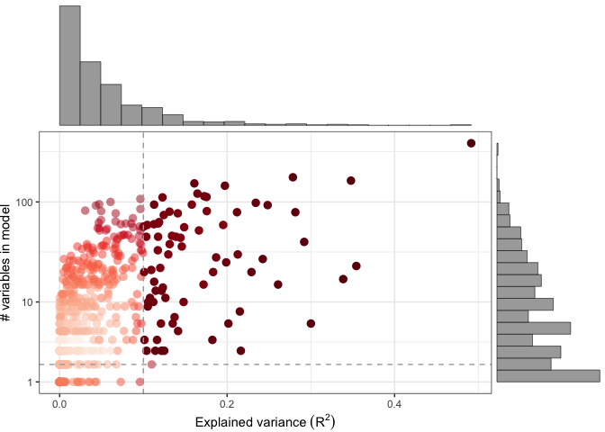
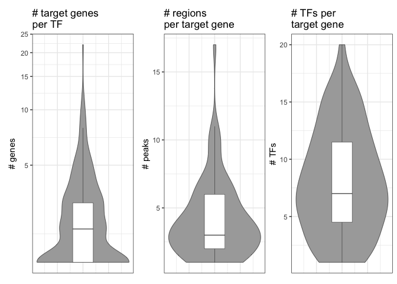
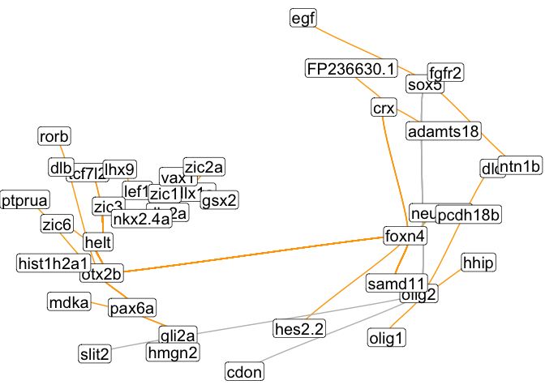
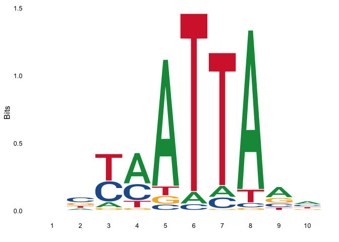
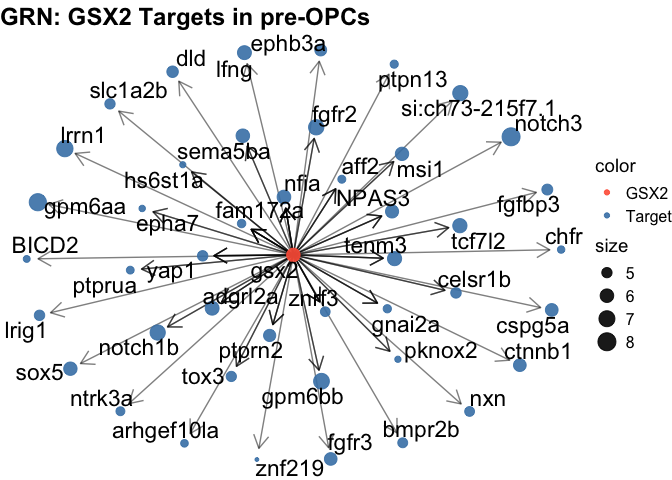
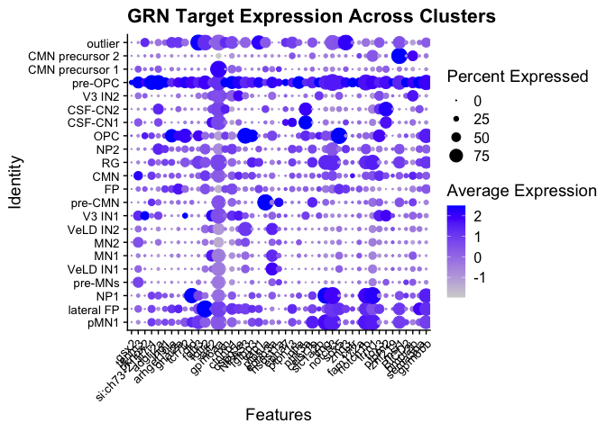
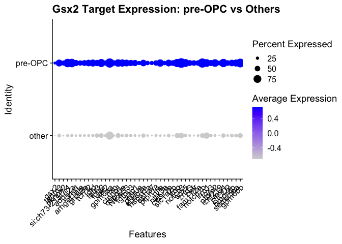
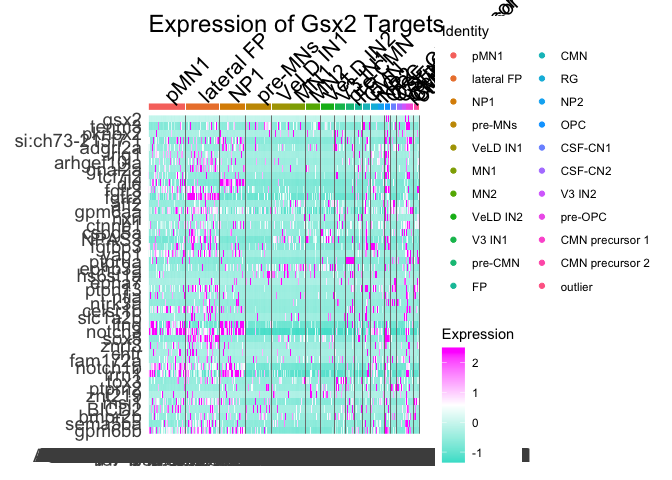

gsx2 figure 7
================

install packages

``` r
suppressPackageStartupMessages({
  install.packages("BiocManager")
  install.packages("Seurat")
  install.packages("Signac")
  install.packages("dplyr")
  install.packages("ggplot2")
  install.packages("ggsci")
  install.packages("ggraph")
  install.packages("ggseqlogo")
  install.packages("patchwork")
  if (!requireNamespace("BiocManager", quietly = TRUE))
    install.packages("BiocManager")
  if (!require(ReactomeGSA))
    BiocManager::install("ReactomeGSA")
  BiocManager::install('BSgenome.Drerio.UCSC.danRer11')
  BiocManager::install('rtracklayer')
  BiocManager::install('stringr')
  BiocManager::install('GenomicRanges')
  BiocManager::install('GenomeInfoDB')
  BiocManager::install('GenomicFeatures')
  install.packages("tidyverse")
  install.packages('Matrix')
  BiocManager::install('GenomeInfoDb')
  BiocManager::install('TFBSTools')
  BiocManager::install('JASPAR2020')
  install.packages("devtools")
  install.packages("doParallel")
  devtools::install_github('quadbio/Pando')
})
```

    ## The following package(s) will be installed:
    ## - BiocManager [1.30.26]
    ## These packages will be installed into "~/Desktop/data/gsx2_paper_2025/renv/library/macos/R-4.4/x86_64-apple-darwin20".
    ## 
    ## # Installing packages --------------------------------------------------------
    ## - Installing BiocManager ...                    OK [linked from cache]
    ## Successfully installed 1 package in 13 milliseconds.
    ## The following package(s) will be installed:
    ## - Seurat [5.3.0]
    ## These packages will be installed into "~/Desktop/data/gsx2_paper_2025/renv/library/macos/R-4.4/x86_64-apple-darwin20".
    ## 
    ## # Installing packages --------------------------------------------------------
    ## - Installing Seurat ...                         OK [linked from cache]
    ## Successfully installed 1 package in 24 milliseconds.
    ## The following package(s) will be installed:
    ## - Signac [1.15.0]
    ## These packages will be installed into "~/Desktop/data/gsx2_paper_2025/renv/library/macos/R-4.4/x86_64-apple-darwin20".
    ## 
    ## # Installing packages --------------------------------------------------------
    ## - Installing Signac ...                         OK [linked from cache]
    ## Successfully installed 1 package in 13 milliseconds.
    ## The following package(s) will be installed:
    ## - dplyr [1.1.4]
    ## These packages will be installed into "~/Desktop/data/gsx2_paper_2025/renv/library/macos/R-4.4/x86_64-apple-darwin20".
    ## 
    ## # Installing packages --------------------------------------------------------
    ## - Installing dplyr ...                          OK [linked from cache]
    ## Successfully installed 1 package in 12 milliseconds.
    ## The following package(s) will be installed:
    ## - ggplot2 [3.5.2]
    ## These packages will be installed into "~/Desktop/data/gsx2_paper_2025/renv/library/macos/R-4.4/x86_64-apple-darwin20".
    ## 
    ## # Installing packages --------------------------------------------------------
    ## - Installing ggplot2 ...                        OK [linked from cache]
    ## Successfully installed 1 package in 11 milliseconds.
    ## The following package(s) will be installed:
    ## - ggsci [3.2.0]
    ## These packages will be installed into "~/Desktop/data/gsx2_paper_2025/renv/library/macos/R-4.4/x86_64-apple-darwin20".
    ## 
    ## # Installing packages --------------------------------------------------------
    ## - Installing ggsci ...                          OK [linked from cache]
    ## Successfully installed 1 package in 12 milliseconds.
    ## The following package(s) will be installed:
    ## - ggraph [2.2.2]
    ## These packages will be installed into "~/Desktop/data/gsx2_paper_2025/renv/library/macos/R-4.4/x86_64-apple-darwin20".
    ## 
    ## # Installing packages --------------------------------------------------------
    ## - Installing ggraph ...                         OK [linked from cache]
    ## Successfully installed 1 package in 12 milliseconds.
    ## The following package(s) will be installed:
    ## - ggseqlogo [0.2]
    ## These packages will be installed into "~/Desktop/data/gsx2_paper_2025/renv/library/macos/R-4.4/x86_64-apple-darwin20".
    ## 
    ## # Installing packages --------------------------------------------------------
    ## - Installing ggseqlogo ...                      OK [linked from cache]
    ## Successfully installed 1 package in 12 milliseconds.
    ## The following package(s) will be installed:
    ## - patchwork [1.3.2]
    ## These packages will be installed into "~/Desktop/data/gsx2_paper_2025/renv/library/macos/R-4.4/x86_64-apple-darwin20".
    ## 
    ## # Installing packages --------------------------------------------------------
    ## - Installing patchwork ...                      OK [linked from cache]
    ## Successfully installed 1 package in 11 milliseconds.

    ## Warning: package 'ReactomeGSA' was built under R version 4.4.1

    ## 'getOption("repos")' replaces Bioconductor standard repositories, see
    ## 'help("repositories", package = "BiocManager")' for details.
    ## Replacement repositories:
    ##     CRAN: https://packagemanager.posit.co/cran/latest

    ## Bioconductor version 3.20 (BiocManager 1.30.26), R 4.4.0 (2024-04-24)

    ## Warning: package(s) not installed when version(s) same as or greater than current; use
    ##   `force = TRUE` to re-install: 'BSgenome.Drerio.UCSC.danRer11'

    ## Installation paths not writeable, unable to update packages
    ##   path: /Users/kimarena16/Library/Caches/org.R-project.R/R/renv/sandbox/macos/R-4.4/x86_64-apple-darwin20/2edc1867
    ##   packages:
    ##     boot, class, cluster, foreign, KernSmooth, lattice, MASS, Matrix, nlme,
    ##     nnet, rpart, spatial, survival

    ## Old packages: 'crosstalk', 'motifmatchr', 'renv', 'rprojroot'

    ## 'getOption("repos")' replaces Bioconductor standard repositories, see
    ## 'help("repositories", package = "BiocManager")' for details.
    ## Replacement repositories:
    ##     CRAN: https://packagemanager.posit.co/cran/latest

    ## Bioconductor version 3.20 (BiocManager 1.30.26), R 4.4.0 (2024-04-24)

    ## Warning: package(s) not installed when version(s) same as or greater than current; use
    ##   `force = TRUE` to re-install: 'rtracklayer'

    ## Installation paths not writeable, unable to update packages
    ##   path: /Users/kimarena16/Library/Caches/org.R-project.R/R/renv/sandbox/macos/R-4.4/x86_64-apple-darwin20/2edc1867
    ##   packages:
    ##     boot, class, cluster, foreign, KernSmooth, lattice, MASS, Matrix, nlme,
    ##     nnet, rpart, spatial, survival

    ## Old packages: 'crosstalk', 'motifmatchr', 'renv', 'rprojroot'

    ## 'getOption("repos")' replaces Bioconductor standard repositories, see
    ## 'help("repositories", package = "BiocManager")' for details.
    ## Replacement repositories:
    ##     CRAN: https://packagemanager.posit.co/cran/latest

    ## Bioconductor version 3.20 (BiocManager 1.30.26), R 4.4.0 (2024-04-24)

    ## Warning: package(s) not installed when version(s) same as or greater than current; use
    ##   `force = TRUE` to re-install: 'stringr'

    ## Installation paths not writeable, unable to update packages
    ##   path: /Users/kimarena16/Library/Caches/org.R-project.R/R/renv/sandbox/macos/R-4.4/x86_64-apple-darwin20/2edc1867
    ##   packages:
    ##     boot, class, cluster, foreign, KernSmooth, lattice, MASS, Matrix, nlme,
    ##     nnet, rpart, spatial, survival

    ## Old packages: 'crosstalk', 'motifmatchr', 'renv', 'rprojroot'

    ## 'getOption("repos")' replaces Bioconductor standard repositories, see
    ## 'help("repositories", package = "BiocManager")' for details.
    ## Replacement repositories:
    ##     CRAN: https://packagemanager.posit.co/cran/latest

    ## Bioconductor version 3.20 (BiocManager 1.30.26), R 4.4.0 (2024-04-24)

    ## Warning: package(s) not installed when version(s) same as or greater than current; use
    ##   `force = TRUE` to re-install: 'GenomicRanges'

    ## Installation paths not writeable, unable to update packages
    ##   path: /Users/kimarena16/Library/Caches/org.R-project.R/R/renv/sandbox/macos/R-4.4/x86_64-apple-darwin20/2edc1867
    ##   packages:
    ##     boot, class, cluster, foreign, KernSmooth, lattice, MASS, Matrix, nlme,
    ##     nnet, rpart, spatial, survival

    ## Old packages: 'crosstalk', 'motifmatchr', 'renv', 'rprojroot'

    ## 'getOption("repos")' replaces Bioconductor standard repositories, see
    ## 'help("repositories", package = "BiocManager")' for details.
    ## Replacement repositories:
    ##     CRAN: https://packagemanager.posit.co/cran/latest

    ## Bioconductor version 3.20 (BiocManager 1.30.26), R 4.4.0 (2024-04-24)

    ## Installing package(s) 'GenomeInfoDB'

    ## Warning: package 'GenomeInfoDB' is not available for Bioconductor version '3.20'
    ## 
    ## A version of this package for your version of R might be available elsewhere,
    ## see the ideas at
    ## https://cran.r-project.org/doc/manuals/r-patched/R-admin.html#Installing-packages

    ## Warning: Perhaps you meant 'GenomeInfoDb' ?

    ## Installation paths not writeable, unable to update packages
    ##   path: /Users/kimarena16/Library/Caches/org.R-project.R/R/renv/sandbox/macos/R-4.4/x86_64-apple-darwin20/2edc1867
    ##   packages:
    ##     boot, class, cluster, foreign, KernSmooth, lattice, MASS, Matrix, nlme,
    ##     nnet, rpart, spatial, survival

    ## Old packages: 'crosstalk', 'motifmatchr', 'renv', 'rprojroot'

    ## 'getOption("repos")' replaces Bioconductor standard repositories, see
    ## 'help("repositories", package = "BiocManager")' for details.
    ## Replacement repositories:
    ##     CRAN: https://packagemanager.posit.co/cran/latest

    ## Bioconductor version 3.20 (BiocManager 1.30.26), R 4.4.0 (2024-04-24)

    ## Installing package(s) 'GenomicFeatures'

    ## 
    ## The downloaded binary packages are in
    ##  /var/folders/s2/gwhf29rs4vsgnwn7v6m7qw780000gn/T//RtmpcQYHah/downloaded_packages

    ## Installation paths not writeable, unable to update packages
    ##   path: /Users/kimarena16/Library/Caches/org.R-project.R/R/renv/sandbox/macos/R-4.4/x86_64-apple-darwin20/2edc1867
    ##   packages:
    ##     boot, class, cluster, foreign, KernSmooth, lattice, MASS, Matrix, nlme,
    ##     nnet, rpart, spatial, survival

    ## Old packages: 'crosstalk', 'motifmatchr', 'renv', 'rprojroot'

    ## The following package(s) will be installed:
    ## - tidyverse [2.0.0]
    ## These packages will be installed into "~/Desktop/data/gsx2_paper_2025/renv/library/macos/R-4.4/x86_64-apple-darwin20".
    ## 
    ## # Installing packages --------------------------------------------------------
    ## - Installing tidyverse ...                      OK [linked from cache]
    ## Successfully installed 1 package in 14 milliseconds.
    ## The following package(s) will be installed:
    ## - Matrix [1.7-3]
    ## These packages will be installed into "~/Desktop/data/gsx2_paper_2025/renv/library/macos/R-4.4/x86_64-apple-darwin20".
    ## 
    ## # Installing packages --------------------------------------------------------
    ## - Installing Matrix ...                         OK [linked from cache]
    ## Successfully installed 1 package in 12 milliseconds.

    ## 'getOption("repos")' replaces Bioconductor standard repositories, see
    ## 'help("repositories", package = "BiocManager")' for details.
    ## Replacement repositories:
    ##     CRAN: https://packagemanager.posit.co/cran/latest

    ## Bioconductor version 3.20 (BiocManager 1.30.26), R 4.4.0 (2024-04-24)

    ## Warning: package(s) not installed when version(s) same as or greater than current; use
    ##   `force = TRUE` to re-install: 'GenomeInfoDb'

    ## Installation paths not writeable, unable to update packages
    ##   path: /Users/kimarena16/Library/Caches/org.R-project.R/R/renv/sandbox/macos/R-4.4/x86_64-apple-darwin20/2edc1867
    ##   packages:
    ##     boot, class, cluster, foreign, KernSmooth, lattice, MASS, Matrix, nlme,
    ##     nnet, rpart, spatial, survival

    ## Old packages: 'crosstalk', 'motifmatchr', 'renv', 'rprojroot'

    ## 'getOption("repos")' replaces Bioconductor standard repositories, see
    ## 'help("repositories", package = "BiocManager")' for details.
    ## Replacement repositories:
    ##     CRAN: https://packagemanager.posit.co/cran/latest

    ## Bioconductor version 3.20 (BiocManager 1.30.26), R 4.4.0 (2024-04-24)

    ## Warning: package(s) not installed when version(s) same as or greater than current; use
    ##   `force = TRUE` to re-install: 'TFBSTools'

    ## Installation paths not writeable, unable to update packages
    ##   path: /Users/kimarena16/Library/Caches/org.R-project.R/R/renv/sandbox/macos/R-4.4/x86_64-apple-darwin20/2edc1867
    ##   packages:
    ##     boot, class, cluster, foreign, KernSmooth, lattice, MASS, Matrix, nlme,
    ##     nnet, rpart, spatial, survival

    ## Old packages: 'crosstalk', 'motifmatchr', 'renv', 'rprojroot'

    ## 'getOption("repos")' replaces Bioconductor standard repositories, see
    ## 'help("repositories", package = "BiocManager")' for details.
    ## Replacement repositories:
    ##     CRAN: https://packagemanager.posit.co/cran/latest

    ## Bioconductor version 3.20 (BiocManager 1.30.26), R 4.4.0 (2024-04-24)

    ## Warning: package(s) not installed when version(s) same as or greater than current; use
    ##   `force = TRUE` to re-install: 'JASPAR2020'

    ## Installation paths not writeable, unable to update packages
    ##   path: /Users/kimarena16/Library/Caches/org.R-project.R/R/renv/sandbox/macos/R-4.4/x86_64-apple-darwin20/2edc1867
    ##   packages:
    ##     boot, class, cluster, foreign, KernSmooth, lattice, MASS, Matrix, nlme,
    ##     nnet, rpart, spatial, survival

    ## Old packages: 'crosstalk', 'motifmatchr', 'renv', 'rprojroot'

    ## The following package(s) will be installed:
    ## - devtools [2.4.5]
    ## These packages will be installed into "~/Desktop/data/gsx2_paper_2025/renv/library/macos/R-4.4/x86_64-apple-darwin20".
    ## 
    ## # Installing packages --------------------------------------------------------
    ## - Installing devtools ...                       OK [linked from cache]
    ## Successfully installed 1 package in 13 milliseconds.
    ## The following package(s) will be installed:
    ## - doParallel [1.0.17]
    ## These packages will be installed into "~/Desktop/data/gsx2_paper_2025/renv/library/macos/R-4.4/x86_64-apple-darwin20".
    ## 
    ## # Installing packages --------------------------------------------------------
    ## - Installing doParallel ...                     OK [linked from cache]
    ## Successfully installed 1 package in 12 milliseconds.

    ## Using GitHub PAT from the git credential store.

    ## Skipping install of 'Pando' from a github remote, the SHA1 (931c31bc) has not changed since last install.
    ##   Use `force = TRUE` to force installation

Pando: GRN centered around gsx2

``` r
library(Pando)
library(Seurat)
```

    ## Loading required package: SeuratObject

    ## Loading required package: sp

    ## 
    ## Attaching package: 'SeuratObject'

    ## The following objects are masked from 'package:Pando':
    ## 
    ##     LayerData, VariableFeatures

    ## The following objects are masked from 'package:base':
    ## 
    ##     intersect, t

    ## 
    ## Attaching package: 'Seurat'

    ## The following objects are masked from 'package:Pando':
    ## 
    ##     GetAssay, VariableFeatures

``` r
library(Signac)
library(patchwork)
library(tidyverse)
```

    ## ── Attaching core tidyverse packages ──────────────────────── tidyverse 2.0.0 ──
    ## ✔ dplyr     1.1.4     ✔ readr     2.1.5
    ## ✔ forcats   1.0.0     ✔ stringr   1.5.1
    ## ✔ ggplot2   3.5.2     ✔ tibble    3.3.0
    ## ✔ lubridate 1.9.4     ✔ tidyr     1.3.1
    ## ✔ purrr     1.1.0

    ## ── Conflicts ────────────────────────────────────────── tidyverse_conflicts() ──
    ## ✖ dplyr::filter() masks stats::filter()
    ## ✖ dplyr::lag()    masks stats::lag()
    ## ✖ purrr::reduce() masks Signac::reduce()
    ## ℹ Use the conflicted package (<http://conflicted.r-lib.org/>) to force all conflicts to become errors

``` r
library('BSgenome.Drerio.UCSC.danRer11')
```

    ## Loading required package: BSgenome

    ## Warning: package 'BSgenome' was built under R version 4.4.1

    ## Loading required package: BiocGenerics

    ## Warning: package 'BiocGenerics' was built under R version 4.4.1

    ## 
    ## Attaching package: 'BiocGenerics'
    ## 
    ## The following objects are masked from 'package:lubridate':
    ## 
    ##     intersect, setdiff, union
    ## 
    ## The following objects are masked from 'package:dplyr':
    ## 
    ##     combine, intersect, setdiff, union
    ## 
    ## The following object is masked from 'package:SeuratObject':
    ## 
    ##     intersect
    ## 
    ## The following objects are masked from 'package:stats':
    ## 
    ##     IQR, mad, sd, var, xtabs
    ## 
    ## The following objects are masked from 'package:base':
    ## 
    ##     anyDuplicated, aperm, append, as.data.frame, basename, cbind,
    ##     colnames, dirname, do.call, duplicated, eval, evalq, Filter, Find,
    ##     get, grep, grepl, intersect, is.unsorted, lapply, Map, mapply,
    ##     match, mget, order, paste, pmax, pmax.int, pmin, pmin.int,
    ##     Position, rank, rbind, Reduce, rownames, sapply, saveRDS, setdiff,
    ##     table, tapply, union, unique, unsplit, which.max, which.min
    ## 
    ## Loading required package: S4Vectors

    ## Warning: package 'S4Vectors' was built under R version 4.4.1

    ## Loading required package: stats4
    ## 
    ## Attaching package: 'S4Vectors'
    ## 
    ## The following objects are masked from 'package:lubridate':
    ## 
    ##     second, second<-
    ## 
    ## The following objects are masked from 'package:dplyr':
    ## 
    ##     first, rename
    ## 
    ## The following object is masked from 'package:tidyr':
    ## 
    ##     expand
    ## 
    ## The following object is masked from 'package:utils':
    ## 
    ##     findMatches
    ## 
    ## The following objects are masked from 'package:base':
    ## 
    ##     expand.grid, I, unname
    ## 
    ## Loading required package: IRanges

    ## Warning: package 'IRanges' was built under R version 4.4.2

    ## 
    ## Attaching package: 'IRanges'
    ## 
    ## The following object is masked from 'package:lubridate':
    ## 
    ##     %within%
    ## 
    ## The following objects are masked from 'package:dplyr':
    ## 
    ##     collapse, desc, slice
    ## 
    ## The following object is masked from 'package:purrr':
    ## 
    ##     reduce
    ## 
    ## The following object is masked from 'package:sp':
    ## 
    ##     %over%
    ## 
    ## Loading required package: GenomeInfoDb

    ## Warning: package 'GenomeInfoDb' was built under R version 4.4.2

    ## Loading required package: GenomicRanges

    ## Warning: package 'GenomicRanges' was built under R version 4.4.1

    ## Loading required package: Biostrings

    ## Warning: package 'Biostrings' was built under R version 4.4.2

    ## Loading required package: XVector

    ## Warning: package 'XVector' was built under R version 4.4.1

    ## 
    ## Attaching package: 'XVector'
    ## 
    ## The following object is masked from 'package:purrr':
    ## 
    ##     compact
    ## 
    ## 
    ## Attaching package: 'Biostrings'
    ## 
    ## The following object is masked from 'package:base':
    ## 
    ##     strsplit
    ## 
    ## Loading required package: BiocIO

    ## Warning: package 'BiocIO' was built under R version 4.4.1

    ## Loading required package: rtracklayer

    ## Warning: package 'rtracklayer' was built under R version 4.4.1

    ## 
    ## Attaching package: 'rtracklayer'
    ## 
    ## The following object is masked from 'package:BiocIO':
    ## 
    ##     FileForFormat

``` r
library(ggsci)

olig2_36hpf <- readRDS(file = "/Users/kimarena16/Desktop/data/olig2_36hpf.RDS")
DefaultAssay(olig2_36hpf) <- "RNA"
olig2_36hpf <- NormalizeData(olig2_36hpf)
```

    ## Normalizing layer: counts

``` r
olig2_36hpf <- FindVariableFeatures(olig2_36hpf, assay='RNA')
```

    ## Finding variable features for layer counts

``` r
olig2_36hpf <- ScaleData(olig2_36hpf, features = rownames(olig2_36hpf))
```

    ## Centering and scaling data matrix

``` r
DefaultAssay(olig2_36hpf) <- "peaks"
olig2_36hpf <- RegionStats(olig2_36hpf, genome = BSgenome.Drerio.UCSC.danRer11)
olig2_36hpf <- LinkPeaks(
 object = olig2_36hpf,
 peak.assay = "peaks",
 expression.assay = "RNA")
```

    ## Testing 17314 genes and 128712 peaks
    ## Found gene coordinates for 17307 genes

``` r
DefaultAssay(olig2_36hpf) <- "peaks"
Idents(olig2_36hpf) <- "wsnn_res.0.8"
da_peaks <- FindMarkers(
  object = olig2_36hpf,
  ident.1 = c('18'), #pre-OPC is cluster 18
  only.pos = TRUE,
  test.use = 'LR',
  min.pct = 0.05,
  latent.vars = 'nCount_peaks'
)
top.da.peak <- da_peaks[da_peaks$p_val < 0.005 & da_peaks$pct.1 > 0.2, ]
dim(da_peaks)
```

    ## [1] 13424     5

``` r
dim(top.da.peak)
```

    ## [1] 717   5

``` r
head(da_peaks)
```

    ##                                p_val avg_log2FC pct.1 pct.2    p_val_adj
    ## chr11-24945399-24945845 6.089710e-30   5.599781 0.365 0.008 9.202161e-25
    ## chr13-29987571-29987931 1.468173e-25   7.624416 0.238 0.001 2.218556e-20
    ## chr9-32760959-32761943  8.302205e-24   2.253480 0.667 0.177 1.254546e-18
    ## chr13-13503865-13504748 1.069182e-23   4.031105 0.413 0.026 1.615641e-18
    ## chr25-28186923-28187452 2.202711e-23   6.765713 0.238 0.002 3.328517e-18
    ## chr8-33372032-33372444  5.217951e-22   6.529894 0.238 0.003 7.884846e-17

``` r
da.gr <- StringToGRanges(rownames(da_peaks)) 
linked.gr <- StringToGRanges(Links(olig2_36hpf[['peaks']])$peak) 
da.gr
```

    ## GRanges object with 13424 ranges and 0 metadata columns:
    ##           seqnames            ranges strand
    ##              <Rle>         <IRanges>  <Rle>
    ##       [1]    chr11 24945399-24945845      *
    ##       [2]    chr13 29987571-29987931      *
    ##       [3]     chr9 32760959-32761943      *
    ##       [4]    chr13 13503865-13504748      *
    ##       [5]    chr25 28186923-28187452      *
    ##       ...      ...               ...    ...
    ##   [13420]    chr17 31638746-31640547      *
    ##   [13421]     chr6   9675557-9676173      *
    ##   [13422]    chr12 31090157-31091123      *
    ##   [13423]     chr9 16444707-16445831      *
    ##   [13424]    chr22     835544-835898      *
    ##   -------
    ##   seqinfo: 25 sequences from an unspecified genome; no seqlengths

``` r
linked.gr
```

    ## GRanges object with 49201 ranges and 0 metadata columns:
    ##           seqnames            ranges strand
    ##              <Rle>         <IRanges>  <Rle>
    ##       [1]     chr1     300622-301478      *
    ##       [2]     chr1     331980-332505      *
    ##       [3]     chr1       63867-64137      *
    ##       [4]     chr1       99511-99911      *
    ##       [5]     chr1     109351-109880      *
    ##       ...      ...               ...    ...
    ##   [49197]    chr25 37386819-37387018      *
    ##   [49198]    chr25 37396878-37397840      *
    ##   [49199]    chr25 37389826-37390448      *
    ##   [49200]    chr25 37422405-37422640      *
    ##   [49201]    chr25 37498465-37498951      *
    ##   -------
    ##   seqinfo: 25 sequences from an unspecified genome; no seqlengths

``` r
regionsOfInterest <- subsetByOverlaps(da.gr, linked.gr)
regionsOfInterest
```

    ## GRanges object with 4300 ranges and 0 metadata columns:
    ##          seqnames            ranges strand
    ##             <Rle>         <IRanges>  <Rle>
    ##      [1]    chr13 29987571-29987931      *
    ##      [2]     chr9 32760959-32761943      *
    ##      [3]    chr13 13503865-13504748      *
    ##      [4]    chr25 28186923-28187452      *
    ##      [5]     chr5 49943402-49944377      *
    ##      ...      ...               ...    ...
    ##   [4296]    chr12   7606471-7607686      *
    ##   [4297]    chr22 34428593-34429318      *
    ##   [4298]     chr4   4056948-4058109      *
    ##   [4299]    chr19 47275788-47276455      *
    ##   [4300]    chr22 15624220-15624769      *
    ##   -------
    ##   seqinfo: 25 sequences from an unspecified genome; no seqlengths

``` r
olig2_36hpf <- initiate_grn(
    olig2_36hpf,
    rna_assay = 'RNA',
    peak_assay = 'peaks',
    regions = regionsOfInterest
)

GetGRN(olig2_36hpf)
```

    ## A RegulatoryNetwork object 
    ## Candidate regions have not been scanned for motifs
    ## 
    ## No network has been inferred

``` r
data('motifs')
load("/Users/kimarena16/Desktop/data/motif2tf.dr.Rdata")
motifs2 <- motifs[names(motifs) %in% unique(motif2tf.dr$motif)]
```

    ## Loading required package: TFBSTools

    ## Warning: package 'TFBSTools' was built under R version 4.4.1

    ## 

``` r
olig2_36hpf <- find_motifs(
    olig2_36hpf, 
    pfm = motifs2, 
    motif_tfs = motif2tf.dr,
    genome = BSgenome.Drerio.UCSC.danRer11
)
```

    ## Adding TF info
    ## Building motif matrix
    ## Finding motif positions
    ## Creating Motif object

    ## Warning in CreateMotifObject(data = motif.matrix, positions = motif.positions,
    ## : Non-unique motif names supplied, making unique

``` r
regions <- NetworkRegions(olig2_36hpf)
regions@ranges
```

    ## GRanges object with 5089 ranges and 0 metadata columns:
    ##          seqnames            ranges strand
    ##             <Rle>         <IRanges>  <Rle>
    ##      [1]    chr13 29987571-29987931      *
    ##      [2]     chr9 32760959-32761943      *
    ##      [3]    chr13 13503865-13504748      *
    ##      [4]    chr25 28186923-28187452      *
    ##      [5]     chr5 49943402-49944377      *
    ##      ...      ...               ...    ...
    ##   [5085]    chr22 34428593-34429318      *
    ##   [5086]     chr4   4056948-4058109      *
    ##   [5087]    chr19 47275788-47275974      *
    ##   [5088]    chr19 47276298-47276455      *
    ##   [5089]    chr22 15624220-15624370      *
    ##   -------
    ##   seqinfo: 26 sequences from an unspecified genome; no seqlengths

``` r
regions@motifs@data[1:5,1:5]
```

    ## 5 x 5 sparse Matrix of class "lgCMatrix"
    ##                         M07783_2.00 M07784_2.00 M02651_2.00 M08707_2.00
    ## chr13-29987571-29987931           .           .           .           .
    ## chr9-32760959-32761943            .           .           |           .
    ## chr13-13503865-13504748           .           .           .           .
    ## chr25-28186923-28187452           .           .           |           .
    ## chr5-49943402-49944377            |           |           |           .
    ##                         M00116_2.00
    ## chr13-29987571-29987931           .
    ## chr9-32760959-32761943            .
    ## chr13-13503865-13504748           .
    ## chr25-28186923-28187452           .
    ## chr5-49943402-49944377            .

``` r
TFs <- NetworkTFs(olig2_36hpf)
head(TFs)
```

    ## 6 x 995 sparse Matrix of class "dgCMatrix"

    ##   [[ suppressing 995 column names 'msgn1', 'sim1b', 'e2f7' ... ]]

    ##                                                                                
    ## UN0305.1    . . . . . . . . . . . . . . . . . . . . . . . . . . . . . . . . . .
    ## UN0218.1    . . . . . . . . . . . . . . . . . . . . . . . . . . . . . . . . . .
    ## MA0752.1    . . . 1 . . . . . . . . . . . . . . . . . . . . . . . . . . . . . .
    ## MA1589.1    . . . 1 . . . . . . . . . . . . . . . . . . . . . . . . . . . . . .
    ## UN0336.1    . . . 1 . . . . . . . . . . . . . . . . . . . . . . . . . . . . . .
    ## M08716_2.00 . . . . . . . . . . . . . . . . . . . . . . . . . . . . . . . . . .
    ##                                                                                
    ## UN0305.1    . . . . . . . . . . . . . . . . . . . . . . . . . . . . . . . . . .
    ## UN0218.1    . . . . . . . . . . . . . . . . . . . . . . . . . . . . . . . . . .
    ## MA0752.1    . . . . . . . . . . . . . . . . . . . . . . . . . . . . . . . . . .
    ## MA1589.1    . . . . . . . . . . . . . . . . . . . . . . . . . . . . . . . . . .
    ## UN0336.1    . . . . . . . . . . . . . . . . . . . . . . . . . . . . . . . . . .
    ## M08716_2.00 . . . . . . . . . . . . . . . . . . . . . . . . . . . . . . . . . .
    ##                                                                                
    ## UN0305.1    . . . . . . . . . . . . . . . . . . . . . . . . . . . . . . . . . .
    ## UN0218.1    . . . . . . . . . . . . . . . . . . . . . . . . . . . . . . . . . .
    ## MA0752.1    . . . . . . . . . . . . . . . . . . . . . . . . . . . . . . . . . .
    ## MA1589.1    . . . . . . . . . . . . . . . . . . . . . . . . . . . . . . . . . .
    ## UN0336.1    . . . . . . . . . . . . . . . . . . . . . . . . . . . . . . . . . .
    ## M08716_2.00 . . . . . . . . . . . . . . . . . . . . . . . . . . . . . . . . . .
    ##                                                                                
    ## UN0305.1    . . . . . . . . . . . . . . . . . . . . . . . . . . . . . . . . . .
    ## UN0218.1    . . . . . . . . . . . . . . . . . . . . . . . . . . . . . . . . . .
    ## MA0752.1    . . . . . . . . . . . . . . . . . . . . . . . . . . . . . . . . . .
    ## MA1589.1    . . . . . . . . . . . . . . . . . . . . . . . . . . . . . . . . . .
    ## UN0336.1    . . . . . . . . . . . . . . . . . . . . . . . . . . . . . . . . . .
    ## M08716_2.00 . . . . . . . . . . . . . . . . . . . . . . . . . . . . . . . . . .
    ##                                                                                
    ## UN0305.1    . . . . . . . . . . . . . . . . . . . . . . . . . . . . . . . . . .
    ## UN0218.1    . . . . . . . . . . . . . . . . . . . . . . . . . . . . . 1 . . . .
    ## MA0752.1    . . . . . . . . . . . . . . . . . . . . . . . . . . . . . . . . . .
    ## MA1589.1    . . . . . . . . . . . . . . . . . . . . . . . . . . . . . . . . . .
    ## UN0336.1    . . . . . . . . . . . . . . . . . . . . . . . . . . . . . . . . . .
    ## M08716_2.00 . . . . . . . . . . . . . . . . . . . . . . . . . . . . . . . . . .
    ##                                                                                
    ## UN0305.1    . . . . . . . . . . . . . . . . . . . . . . . . . . . . . . . . . .
    ## UN0218.1    . . . . . . . . . . . . . . . . . . . . . . . . . . . . . . . . . .
    ## MA0752.1    . . . . . . . . . . . . . . . . . . . . . . . . . . . . . . . . . .
    ## MA1589.1    . . . . . . . . . . . . . . . . . . . . . . . . . . . . . . . . . .
    ## UN0336.1    . . . . . . . . . . . . . . . . . . . . . . . . . . . . . . . . . .
    ## M08716_2.00 . . . . . . . . . . . . . . . . . . . . . . . . . . . . . . . . . .
    ##                                                                                
    ## UN0305.1    . . . . . . . . . . . . . . . . . . . . . . . . . . . . . . . . . .
    ## UN0218.1    . . . . . . . . . . . . . . . . . . . . . . . . . . . . . . . . . .
    ## MA0752.1    . . . . . . . . . . . . . . . . . . . . . . . . . . . . . . . . . .
    ## MA1589.1    . . . . . . . . . . . . . . . . . . . . . . . . . . . . . . . . . .
    ## UN0336.1    . . . . . . . . . . . . . . . . . . . . . . . . . . . . . . . . . .
    ## M08716_2.00 . . . . . . . . . . . . . . . . . . . . . . . . . . . . . . . . . .
    ##                                                                                
    ## UN0305.1    . . . . . . . . . . . . . . . . . . . . . . . . . . . . . . . . . .
    ## UN0218.1    . . . . . . . . . . . . . . . . . . . . . . . . . . . . . . . . . .
    ## MA0752.1    . . . . . . . . . . . . . . . . . . . . . . . . . . . . . . . . . .
    ## MA1589.1    . . . . . . . . . . . . . . . . . . . . . . . . . . . . . . . . . .
    ## UN0336.1    . . . . . . . . . . . . . . . . . . . . . . . . . . . . . . . . . .
    ## M08716_2.00 . . . . . . . . . . . . . . . . . . . . . . . . . . . . . . . . . .
    ##                                                                                
    ## UN0305.1    . . . . . . . . . . . . . . . . . . . . . . . . . . . . . . . . . .
    ## UN0218.1    . . . . . . . . . . . . . . . . . . . . . . . . . . . . . . . . . .
    ## MA0752.1    . . . . . . . . . . . . . . . . . . . . . . . . . . . . . . . . . .
    ## MA1589.1    . . . . . . . . . . . . . . . . . . . . . . . . . . . . . . . . . .
    ## UN0336.1    . . . . . . . . . . . . . . . . . . . . . . . . . . . . . . . . . .
    ## M08716_2.00 . . . . . . . . . . . . . . . . . . . . . . . . . . . . . . . . . .
    ##                                                                                
    ## UN0305.1    . . . . . . . . . . . . . . . . . . . . . . . . . . . . . . . . . .
    ## UN0218.1    . . . . . . . . . . . . . . . . . . . . . . . . . . . . . . . . . .
    ## MA0752.1    . . . . . . . . . . . . . . . . . . . . . . . . . . . . . . . . . .
    ## MA1589.1    . . . . . . . . . . . . . . . . . . . . . . . . . . . . . . . . . .
    ## UN0336.1    . . . . . . . . . . . . . . . . . . . . . . . . . . . . . . . . . .
    ## M08716_2.00 . . . . . . . . . . . . . . . . . . . . . . . . . . . . . . . . . .
    ##                                                                                
    ## UN0305.1    . . . . . . . . . . . . . . . . . . . . . . . . . . . . . . . . . .
    ## UN0218.1    . . . . . . . . . . . . . . . . . . . . . . . . . . . 1 . . . . . .
    ## MA0752.1    . . . . . . . . . . . . . . . . . . . . . . . . . . . . . . . . . .
    ## MA1589.1    . . . . . . . . . . . . . . . . . . . . . . . . . . . . . . . . . .
    ## UN0336.1    . . . . . . . . . . . . . . . . . . . . . . . . . . . . . . . . . .
    ## M08716_2.00 . . . . . . . . . . . . . . . . . . . . 1 . . . . . . . . . . . . .
    ##                                                                                
    ## UN0305.1    . . . . . . . . . . . . . . . . . . . . . . . . . . . . . . . . . .
    ## UN0218.1    . . . . . . . . . . . . . . . 1 . . . . . . . . . . . . . . . . . .
    ## MA0752.1    . . . . . . . . . . . . . . . . . . . . . . . . . . . . . . . . . .
    ## MA1589.1    . . . . . . . . . . . . . . . . . . . . . . . . . . . . . . . . . .
    ## UN0336.1    . . . . . . . . . . . . . . . . . . . . . . . . . . . . . . . . . .
    ## M08716_2.00 . . . . . . . . . . . . . . . . . . . . . . . . . . . . . . . . . .
    ##                                                                                
    ## UN0305.1    . . . . . . . . . . . . . . . . . . . . . . . . . . . . . . . . . .
    ## UN0218.1    . . . . . . . . . . . . . . . . . . . 1 . . . . . . . . . . . . . .
    ## MA0752.1    . . . . . . . . . . . . . . . . . . . . . . . . . . . . . . . . . .
    ## MA1589.1    . . . . . . . . . . . . . . . . . . . . . . . . . . . . . . . . . .
    ## UN0336.1    . . . . . . . . . . . . . . . . . . . . . . . . . . . . . . . . . .
    ## M08716_2.00 . . . . . . . . . . . . . . . . . . . . . . . . . . . . . . . . . .
    ##                                                                                
    ## UN0305.1    . . . . . . . . . . . . . . . . . . . . . . . . . . . . . . . . . .
    ## UN0218.1    . . . . . . . . . . . . . . . . . . . . . . . . . . . . . . . . . .
    ## MA0752.1    . . . . . . . 1 . 1 . . . . . . . . . . . . . . . . . . . . . . . .
    ## MA1589.1    . . . . . . . . . . . . . . . . . . . . . . . . . . . . . . . . . .
    ## UN0336.1    . . . . . . . . . . . . . . . . . . . . . . . . . . . . . . . . . .
    ## M08716_2.00 . . . . . . . . . . . . . . . . . . . . . . . . . . . . . . . . . .
    ##                                                                                
    ## UN0305.1    . . . . . . . . . . . . . . . . . . . . . . . . . . . . . . . . . .
    ## UN0218.1    . . . . . . . . . . . . . . . . . . . . . . . . . . 1 . . . . . . .
    ## MA0752.1    . . . . . . . . . . . . . . . . . . . . . . . . . . . . . . . . . .
    ## MA1589.1    . . . . . . . . . . . . . . . . . . . . . . . . . . . . . . . . . .
    ## UN0336.1    . . . . . . . . . . . . . . . . . . . . . . . . . . . . . . . . . .
    ## M08716_2.00 . . . . . . . . . . . . . . . . . . . . . . . . . . . . . . . . . .
    ##                                                                                
    ## UN0305.1    . . . . . . . . . . . . . . . . . . . . . . . . . . . . . . . . . .
    ## UN0218.1    . . . . . . . . . . . . . . . . . . . . . . . . . . . . . . . . . .
    ## MA0752.1    . . . . . . . . . . . . . . . . . . . . . . . . . . . . . . . . . .
    ## MA1589.1    . . . . . . . . . . . . . . . . . . . . . . . . . . . . . . . . . .
    ## UN0336.1    . . . . . . . . . . . . . . . . . . . . . . . . . . . . . . . . . .
    ## M08716_2.00 . . . . . . . . . . . . . . . . . . . . . . . . . . . . . . . . . .
    ##                                                                                
    ## UN0305.1    . . . . . . . . . . . . . . . . . . . . . . . . . . . . . . . . . .
    ## UN0218.1    . . . . . . . . . . . . . . . . . . . . . . . . . . . . . . . . . .
    ## MA0752.1    . . . . . . . . . . . . . . . . . . . . . . . . . . . . . . . . . .
    ## MA1589.1    . . . . . . . . . . . . . . . . . . . . . . . . . . . . . . . . . .
    ## UN0336.1    . . . . . . . . . . . . . . . . . . . . . . . . . . . . . . . . . .
    ## M08716_2.00 . . . . . . . . . . . . . . . . . . . . . . . . . . . . . . . . . .
    ##                                                                                
    ## UN0305.1    . . . . . . . . . . . . . . . . . . . . . . . . . . . . . . . . . .
    ## UN0218.1    . . . . . . . . . . . 1 . . . . . . . . . . . . . . . . . . . . . .
    ## MA0752.1    . . . . . . . . . . . . . . . . . . . . . . . . . . . . . . . . . .
    ## MA1589.1    . . . . . . . . . . . . . . . . . . . . . . . . . . . . . . . . . .
    ## UN0336.1    . . . . . . . . . . . . . . . . . . . . . . . . . . . . . . . . . .
    ## M08716_2.00 . . . . . . . . . . . . . . . . . . . . . . . . . . . . . . . . . .
    ##                                                                                
    ## UN0305.1    . . . . . . . . . . . . . . . . . . . . . . . . . . . . . . . . . .
    ## UN0218.1    . . 1 . . . . . . . . . . . . . . . . . . . . . . . . . . . . . . .
    ## MA0752.1    . . . . . . . . . . . . . . . . . . . . . . . . . . . . . . . . . .
    ## MA1589.1    . . . . . . . . . . . . . . . . . . . . . . . . . . . . . . . . . .
    ## UN0336.1    . . . . . . . . . . . . . . . . . . . . . . . . . . . . . . . . . .
    ## M08716_2.00 . . . . . . . . . . . . . . . . . . . . . . . . . . . . . . . . . .
    ##                                                                                
    ## UN0305.1    . . . . . . . . . . . . . . . . . . . . . . . . . . . . . . . . . .
    ## UN0218.1    . . . . . . . . . . . . . . . . . . . . . . . . . . . . . . . . . .
    ## MA0752.1    . . . . . . . . . . . . . . . . . . . . . . . . . . . . . . . . . .
    ## MA1589.1    . . . . . . . . . . . . . . . . . . . . . . . . . . . . . . . . . .
    ## UN0336.1    . . . . . . . . . . . . . . . . . . . . . . . . . . . . . . . . . .
    ## M08716_2.00 . . . . . . . . . . . . . . . . . . . . . . . . . . . . . . . . . .
    ##                                                                                
    ## UN0305.1    . . . . . . . . . . . . . . . . . . . . . . . . . . . . . . . . . .
    ## UN0218.1    . . . . . . . . . . . . . . . . . . . . . . . . . . . . . . . . . .
    ## MA0752.1    . . . . . . . . . . . . . . . . . . . . . . . . . . . . . . . . . .
    ## MA1589.1    . . . . . . . . . . . . . . . . . . . . . . . . . . . . . . . . . .
    ## UN0336.1    . . . . . . . . . . . . . . . . . . . . . . . . . . . . . . . . . .
    ## M08716_2.00 . . . . . . . . . . . . . . . . . . . . . . . . . . . . . . . . . .
    ##                                                                                
    ## UN0305.1    . . . . . . . . . . . . . . . . . . . . . . . . . . . . . . . . . .
    ## UN0218.1    . . . . . . . . . . 1 . . . . . . . . . . . . . . . . . . . . . . .
    ## MA0752.1    . . . . . . . . . . . . . . . . . . . . . . . . . . . . . . . . . .
    ## MA1589.1    . . . . . . . . . . . . . . . . . . . . . . . . . . . . . . . . . .
    ## UN0336.1    . . . . . . . . . . . . . . . . . . . . . . . . . . . . . . . . . .
    ## M08716_2.00 . . . . . . . . . . . . . . . . . . . . . . . . . . . . . . . . . .
    ##                                                                                
    ## UN0305.1    . . . . . . . . . . . . . . . . . . . . . . . . . . . . . . . . . .
    ## UN0218.1    . . . . . . . . . . . . . . . . . . . . . . . . . . . . . . . . . .
    ## MA0752.1    . . . . . . . . . . . . . . . . . . . . . . . . . . . . . . . . . .
    ## MA1589.1    . . . . . . . . . . . . . . . . . . . . . . . . . . . . . . . . . .
    ## UN0336.1    . . . . . . . . . . . . . . . . . . . . . . . . . . . . . . . . . .
    ## M08716_2.00 . . . . . . . . . . . . . . . . . . . . . . . . . . . . . . . . . .
    ##                                                                                
    ## UN0305.1    . . . . . . . 1 . . . . . . . . . . . . . . . . . . . . . . . . . .
    ## UN0218.1    . . . . . . . . . . . . . . . . . . . . . . . . . . . . . . . . . .
    ## MA0752.1    . . . . . . . . . . . . . . . . . . . . . . . . . . . . . . . . . .
    ## MA1589.1    . . . . . . . . . . . . . . . . . . . . . . . . . . . . . . . . . .
    ## UN0336.1    . . . . . . . . . . . . . . . . . . . . . . . . . . . . . . . . . .
    ## M08716_2.00 . . . . . . . . . . . . . . . . . . . . . . . . . . . . . . . . . .
    ##                                                                                
    ## UN0305.1    . . . . . . . . . . . . . . . . . . . . . . . . . . . . . . . . . .
    ## UN0218.1    . . . . . . . . . . . . 1 . . . . . . . . . . . . . . . . . . . . .
    ## MA0752.1    . . . . . . . . . . . . . . . . . . . . . . . . . . . . . . . . . .
    ## MA1589.1    . . . . . . . . . . . . . . . . . . . . . . . . . . . . . . . . . .
    ## UN0336.1    . . . . . . . . . . . . . . . . . . . . . . . . . . . . . . . . . .
    ## M08716_2.00 . . . . . . . . . . . . . . . . . . . . . . . . . . . . . . . . . .
    ##                                                                                
    ## UN0305.1    . . . . . . . . . . . . . . . . . . . . . . . . . 1 . . . . . . . .
    ## UN0218.1    . . . . . . . . . . . . . . . . . . . . . . . . . . . . . . . . . .
    ## MA0752.1    . . . . . . . . . . . . . . . . . . . . . . . . . . . . . . . . . .
    ## MA1589.1    . . . . . . . . . . . . . . . . . . . . . . . . . . . . . . . . . .
    ## UN0336.1    . . . . . . . . . . . . . . . . . . . . . . . . . . . . . . . . . .
    ## M08716_2.00 . . . . . . . . . . . . . . . . . . . . . . . . . . . . . . . . . .
    ##                                                                                
    ## UN0305.1    . . . . . . . . . . . . . . . . . . . . . . . . . . . . . . . . . .
    ## UN0218.1    . . . . . . . . . . . . . . . . . . . . . . . . . . . . . . . . . .
    ## MA0752.1    . . . . . . . . . . . . . . . . . . . . . . . . . . . . . . . . . .
    ## MA1589.1    . . . . . . . . . . . . . . . . . . . . . . . . . . . . . . . . . .
    ## UN0336.1    . . . . . . . . . . . . . . . . . . . . . . . . . . . . . . . . . .
    ## M08716_2.00 . . . . . . . . . . . . . . . . . . . . . . . . . . . . . . . . . .
    ##                                                                                
    ## UN0305.1    . . . . . . . . . . . . . . . . . . . . . . . . . . . . . . . . . .
    ## UN0218.1    . . . . . . . 1 . . . . . . . . . . . . . . . . . . . . . . . . . .
    ## MA0752.1    . . . . . . . . . . . . . . . . . . . . . . . . . . . . . . . . . .
    ## MA1589.1    . . . . . . . . . . . . . . . . . . . . . . . . . . . . . . . . . .
    ## UN0336.1    . . . . . . . . . . . . . . . . . . . . . . . . . . . . . . . . . .
    ## M08716_2.00 . . . . . . . . . . . . . . . . . . . . . . . . . . . . 1 . . . . .
    ##                                                                                
    ## UN0305.1    . . . . . . . . . . . . . . . . . . . . . . . . . . . . . . . . . .
    ## UN0218.1    . . . . . . . . . . . . . . . . . . . . . . . . . . . . . . . . . .
    ## MA0752.1    . . . . . . . . . . . . . . . . . . . . . . . . . . . . . . . . . .
    ## MA1589.1    . . . . . . . . . . . . . . . . . . . . . . . . . . . . . . . . . .
    ## UN0336.1    . . . . . . . . . . . . . . . . . . . . . . . . . . . . . . . . . .
    ## M08716_2.00 . . . . . . . . . . . . . . . . . . . . . . . . . . . . . . . . . .
    ##                              
    ## UN0305.1    . . . . . . . . .
    ## UN0218.1    . . . . . . . . .
    ## MA0752.1    . . . . . . . . .
    ## MA1589.1    . . . . . . . . .
    ## UN0336.1    . . . . . . . . .
    ## M08716_2.00 . . . . . . . . .

``` r
library(doParallel)
```

    ## Loading required package: foreach
    ## 
    ## Attaching package: 'foreach'
    ## 
    ## The following objects are masked from 'package:purrr':
    ## 
    ##     accumulate, when
    ## 
    ## Loading required package: iterators
    ## Loading required package: parallel

``` r
registerDoParallel(4)

olig2_36hpf <- infer_grn(
    olig2_36hpf,
    peak_to_gene_method = 'Signac',
    parallel = TRUE
)
```

    ## 
    ## Attaching package: 'Matrix'
    ## 
    ## The following object is masked from 'package:TFBSTools':
    ## 
    ##     Matrix
    ## 
    ## The following object is masked from 'package:S4Vectors':
    ## 
    ##     expand
    ## 
    ## The following objects are masked from 'package:tidyr':
    ## 
    ##     expand, pack, unpack
    ## 
    ## Loaded glmnet 4.1-10
    ## Selecting candidate regulatory regions near genes
    ## Preparing model input
    ## Fitting models for 1962 target genes

``` r
GetGRN(olig2_36hpf)
```

    ## A RegulatoryNetwork object based on 995 transcription factors
    ## 
    ## 1 inferred network: glm_network

``` r
GetNetwork(olig2_36hpf)
```

    ## A Network object
    ## with 526 TFs and 549 target genes

``` r
coef(olig2_36hpf)
```

    ## # A tibble: 9,356 × 10
    ##    tf     target region term  estimate std_err statistic     pval     padj  corr
    ##    <chr>  <chr>  <chr>  <chr>    <dbl>   <dbl>     <dbl>    <dbl>    <dbl> <dbl>
    ##  1 zic5   sp9    chr9-… chr9…  0.393   0.0433      9.09  1.38e-19 2.56e-18 0.124
    ##  2 arxa   sp9    chr9-… chr9…  0.335   0.0274     12.2   9.28e-34 2.43e-32 0.256
    ##  3 sall1a rapge… chr9-… chr9…  0.00266 0.00512     0.520 6.03e- 1 8.11e- 1 0.104
    ##  4 mef2cb rapge… chr9-… chr9…  0.00985 0.0133      0.742 4.58e- 1 7.01e- 1 0.111
    ##  5 zfpm2a rapge… chr9-… chr9…  0.0783  0.0143      5.48  4.38e- 8 4.82e- 7 0.181
    ##  6 esr2b  rapge… chr9-… chr9…  0.0138  0.0332      0.417 6.77e- 1 8.58e- 1 0.243
    ##  7 zfpm1  rapge… chr9-… chr9…  0.00521 0.0104      0.500 6.17e- 1 8.21e- 1 0.249
    ##  8 fosb   rapge… chr9-… chr9…  0.106   0.0296      3.58  3.49e- 4 2.23e- 3 0.103
    ##  9 foxj1b rapge… chr9-… chr9…  0.0635  0.0238      2.66  7.77e- 3 3.41e- 2 0.125
    ## 10 zfpm2b rapge… chr9-… chr9… -0.0123  0.0141     -0.873 3.83e- 1 6.28e- 1 0.201
    ## # ℹ 9,346 more rows

``` r
pre_opc_targets <- coef(olig2_36hpf)

olig2_36hpf <- find_modules(
    olig2_36hpf, 
    p_thresh = 0.05,
    nvar_thresh = 2, 
    min_genes_per_module = 1, 
    rsq_thresh = 0.1
)
```

    ## Found 243 TF modules

``` r
modules <- NetworkModules(olig2_36hpf) 
modules@meta
```

    ## # A tibble: 605 × 9
    ##    tf     target  estimate n_regions n_genes n_tfs regions         pval     padj
    ##    <chr>  <chr>      <dbl>     <int>   <int> <int> <chr>          <dbl>    <dbl>
    ##  1 alx1   egf       0.506          3       1    16 chr14-3637… 2.47e- 7 2.53e- 6
    ##  2 alx4a  pdgfra    0.384          3       1     4 chr20-2247… 1.45e-62 5.80e-61
    ##  3 arid5b dld      -0.111         10       4    20 chr13-6083… 1.59e- 5 1.27e- 4
    ##  4 arid5b foxn4     0.0162         2       4     9 chr5-19395… 4.21e- 4 2.63e- 3
    ##  5 arid5b olig2    -0.0557        11       4    14 chr9-32786… 1.60e- 3 8.72e- 3
    ##  6 arid5b qkib      0.0662         5       4    16 chr13-3578… 4.58e- 3 2.17e- 2
    ##  7 arnt2  elavl3    0.0619         2       1    12 chr3-46818… 3.25e- 4 2.09e- 3
    ##  8 arxa   etv1      0.158          1       2     3 chr15-3412… 3.61e-40 1.05e-38
    ##  9 arxa   nkx2.4a   0.441          4       2     8 chr17-4203… 2.62e-53 9.11e-52
    ## 10 arxb   dlx1a     0.295          4       3     9 chr9-32879… 8.37e-11 1.15e- 9
    ## # ℹ 595 more rows

``` r
plot_gof(olig2_36hpf, point_size=3)
```

    ## Warning: Using alpha for a discrete variable is not advised.

<!-- -->

``` r
plot_module_metrics(olig2_36hpf)
```

<!-- -->

``` r
olig2_36hpf <- get_network_graph(olig2_36hpf)
```

    ## Computing gene-gene correlation
    ## Computing weighted regulatory factor
    ## Computing UMAP embedding
    ## Getting network graph

``` r
olig2_36hpf <- get_network_graph(
    olig2_36hpf,
    graph_name = 'full_graph',
)
```

    ## Computing gene-gene correlation
    ## Computing weighted regulatory factor
    ## Computing UMAP embedding
    ## Getting network graph

``` r
olig2_36hpf <- get_tf_network(olig2_36hpf, tf='gsx2', graph='full_graph', keep_all_edges = F)
```

    ## Getting shortest paths from TF
    ## Pruning graph

``` r
TF_GRN <- plot_tf_network(olig2_36hpf, tf='gsx2', edge_color = c(`-1` = 'gray', `1` = 'orange'),
    circular = T, graph= "full_graph",
    edge_width = 0.5, label_nodes = c("all"), color_edges = T, text_size = 15)
TF_GRN
```

<!-- -->

``` r
ggsave(filename="36hpf_preOPC_gsx2_GRN_circular.pdf",plot=TF_GRN, width = 10, height = 10)
```

Gsx2 motif logo

``` r
library(JASPAR2020)
library(TFBSTools)
library(ggseqlogo)

# Get the motif
pfm <- getMatrixByID(JASPAR2020, ID = "MA0893.1")

# Extract matrix from PFMatrix object
pfm_matrix <- matrix(unlist(pfm@profileMatrix), nrow = 4, byrow = FALSE)
rownames(pfm_matrix) <- c("A", "C", "G", "T")

# Plot logo in bits (information content)
ggseqlogo(pfm_matrix, method = "bits")
```

    ## Warning: The `<scale>` argument of `guides()` cannot be `FALSE`. Use "none" instead as
    ## of ggplot2 3.3.4.
    ## ℹ The deprecated feature was likely used in the ggseqlogo package.
    ##   Please report the issue at <https://github.com/omarwagih/ggseqlogo/issues>.
    ## This warning is displayed once every 8 hours.
    ## Call `lifecycle::last_lifecycle_warnings()` to see where this warning was
    ## generated.

<!-- -->

``` r
pdf("gsx2_motif_logo.pdf", width = 6, height = 4)  # Adjust size as needed
ggseqlogo(pfm_matrix, method = "bits")
dev.off()
```

    ## quartz_off_screen 
    ##                 2

predicted gsx2 targets

``` r
library(Signac)
library(Seurat)
library(JASPAR2020)
library(TFBSTools)
library(BSgenome.Drerio.UCSC.danRer11)
library(GenomicRanges)

olig2_36hpf <- readRDS(file = "/Users/kimarena16/Desktop/data/olig2_36hpf.RDS")
#1.Find peaks with gsx2 motif
pfm <- getMatrixSet(
  JASPAR2020,
  opts = list(tax_group = "vertebrates", all_versions = TRUE)
)

olig2_36hpf <- AddMotifs(
  object = olig2_36hpf,
  genome = BSgenome.Drerio.UCSC.danRer11,
  pfm = pfm
)
```

    ## Building motif matrix

    ## Finding motif positions

    ## Creating Motif object

    ## Warning in CreateMotifObject(data = motif.matrix, positions = motif.positions,
    ## : Non-unique motif names supplied, making unique

``` r
motif_obj <- olig2_36hpf[["peaks"]]@motifs

motif_names <- motif_obj@motif.names

gsx2_ids <- names(motif_names)[tolower(motif_names) %in% c("gsx2")]

motif_mat <- motif_obj@data

gsx2_peaks_logical <- rowSums(motif_mat[, gsx2_ids, drop = FALSE]) > 0

gsx2_peaks <- rownames(motif_mat)[gsx2_peaks_logical]

length(gsx2_peaks)
```

    ## [1] 9422

``` r
gsx2_peak_gr <- StringToGRanges(gsx2_peaks, sep = c("-", "-"))

#2. Filter for peaks accessible in pre-OPCs

library(Matrix)

preopc_cells <- WhichCells(olig2_36hpf, idents = "pre-OPC")

peak_access_mat <- GetAssayData(olig2_36hpf, assay = "peaks", layer = "data")
peaks_found <- gsx2_peaks %in% rownames(peak_access_mat)
gsx2_peaks_found <- gsx2_peaks[peaks_found]

peak_access_preopc <- peak_access_mat[gsx2_peaks_found, preopc_cells, drop = FALSE]

mean_access_preopc <- Matrix::rowMeans(peak_access_preopc)

accessible_peaks <- gsx2_peaks_found[mean_access_preopc > 0]

length(accessible_peaks)
```

    ## [1] 4882

``` r
head(accessible_peaks)
```

    ## [1] "chr1-410479-411576" "chr1-418422-419600" "chr1-493937-494655"
    ## [4] "chr1-532220-533295" "chr1-604940-606291" "chr1-655780-656948"

``` r
#3. Link peaks with gsx2 motifs that are accessible in pre-OPCs to genes

library(GenomeInfoDb)
library(GenomicFeatures)
```

    ## Warning: package 'GenomicFeatures' was built under R version 4.4.1

    ## Loading required package: AnnotationDbi

    ## Warning: package 'AnnotationDbi' was built under R version 4.4.1

    ## Loading required package: Biobase

    ## Warning: package 'Biobase' was built under R version 4.4.1

    ## Welcome to Bioconductor
    ## 
    ##     Vignettes contain introductory material; view with
    ##     'browseVignettes()'. To cite Bioconductor, see
    ##     'citation("Biobase")', and for packages 'citation("pkgname")'.

    ## 
    ## Attaching package: 'AnnotationDbi'

    ## The following object is masked from 'package:dplyr':
    ## 
    ##     select

``` r
library(rtracklayer)

gtf_file <- "/Users/kimarena16/Desktop/data/multiomics 24/Danio_rerio.GRCz11.111.gtf" 
gtf <- import(gtf_file)

genes_gr <- gtf[gtf$type == "gene"]
peak_gr <- StringToGRanges(accessible_peaks, sep = c("-", "-"))

seqlevelsStyle(peak_gr) <- "UCSC"
seqlevelsStyle(genes_gr) <- "UCSC"

nearest_hits <- distanceToNearest(peak_gr, genes_gr)
distances <- mcols(nearest_hits)$distance

valid_hits <- distances <= 50000
nearest_hits <- nearest_hits[valid_hits]
names(peak_gr) <- paste0(seqnames(peak_gr), "-", start(peak_gr), "-", end(peak_gr))

linked_peaks <- peak_gr[queryHits(nearest_hits)]
linked_genes <- genes_gr[subjectHits(nearest_hits)]

peak_gene_links <- data.frame(
  peak = names(linked_peaks),
  gene = linked_genes$gene_name,
  distance = distances[valid_hits],
  stringsAsFactors = FALSE
)

head(peak_gene_links)
```

    ##                 peak   gene distance
    ## 1 chr1-410479-411576  rasa3        0
    ## 2 chr1-418422-419600   tpp2        0
    ## 3 chr1-493937-494655  blzf1        0
    ## 4 chr1-532220-533295 mrpl39        0
    ## 5 chr1-604940-606291  jam2a        0
    ## 6 chr1-655780-656948   appa        0

``` r
table(seqnames(linked_peaks))
```

    ## 
    ##  chr1  chr2  chr3  chr4  chr5  chr6  chr7  chr8  chr9 chr10 chr11 chr12 chr13 
    ##   183   206   222   164   241   198   274   194   179   155   191   168   190 
    ## chr14 chr15 chr16 chr17 chr18 chr19 chr20 chr21 chr22 chr23 chr24 chr25 
    ##   176   175   203   189   143   190   176   177   144   197   139   154

``` r
unique(seqnames(genes_gr))
```

    ##   [1] chr4       chr7       chr5       chr3       chr6       chr2      
    ##   [7] chr1       chr9       chr16      chr20      chr8       chr17     
    ##  [13] chr14      chr13      chr18      chr12      chr19      chr15     
    ##  [19] chr23      chr21      chr11      chr10      chr24      chr22     
    ##  [25] chr25      chrM       KN149696.2 KN147651.2 KN149690.1 KN149686.1
    ##  [31] KN147652.2 KN149688.2 KN147636.1 KN149689.2 KN149695.1 KN150691.1
    ##  [37] KN147632.2 KN147637.2 KN149685.1 KN150214.1 KZ116066.1 KN149684.1
    ##  [43] KZ116064.1 KN150230.1 KN150608.1 KN150171.1 KN149682.1 KN149847.1
    ##  [49] KN150487.1 KN149948.1 KN149790.1 KN149778.1 KN150425.1 KN150326.1
    ##  [55] KN149698.1 KN150568.1 KN150158.1 KN150578.1 KN150605.1 KN149797.1
    ##  [61] KN149702.1 KN150603.1 KN149984.1 KN150258.1 KN149895.1 KN150432.1
    ##  [67] KN149826.1 KN150617.1 KN149932.1 KN149904.1 KN150196.1 KN150616.1
    ##  [73] KN150663.1 KN150630.1 KN150125.1 KN149968.1 KN150342.1 KN150529.1
    ##  [79] KN150646.1 KN150670.1 KN149912.1 KN150405.1 KN149998.1 KN150552.1
    ##  [85] KN149784.1 KN150455.1 KN150700.2 KN150131.1 KN149725.1 KN150000.1
    ##  [91] KN150176.1 KN150098.1 KN150677.1 KN150041.2 KN150709.1 KN149880.1
    ##  [97] KN150449.1 KN150477.1 KN150596.1 KN150241.1 KN149959.1 KN149813.1
    ## [103] KN149992.1 KN150030.1 KN150653.1 KN150170.1 KN150642.1 KN150118.1
    ## [109] KN150361.1 KN149859.1 KN150104.1 KN149884.1 KZ116011.1 KN149739.1
    ## [115] KN150265.1 KN149710.1 KN150173.1 KN150259.1 KN150351.1 KN150336.1
    ## [121] KN150479.1 KN150703.1 KN149717.1 KN149840.1 KN150335.1 KN150244.1
    ## [127] KN150708.1 KN150191.1 KN150570.1 KN149800.1 KN149697.1 KN150293.1
    ## [133] KN150172.1 KN150518.1 KN149749.1 KN149909.1 KN150505.1 KN150189.1
    ## [139] KN149680.1 KZ116065.1 KZ116044.1 KN150137.1 KN150306.1 KN150631.1
    ## [145] KN149782.1 KN150062.1 KN150400.1 KN149795.1 KZ116019.1 KN149989.1
    ## [151] KN150102.1 KZ116034.1 KN149996.1 KN150015.1 KN150127.1 KN149706.1
    ## [157] KN149843.1 KN150156.1 KN149946.1 KN150165.1 KN150698.1 KN150200.1
    ## [163] KN150240.1 KN150263.1 KN150042.1 KN150620.1 KN149753.1 KN150379.1
    ## [169] KN149943.1 KN150032.1 KN150066.1 KN149765.1 KN150572.1 KN149846.1
    ## [175] KN150120.1 KN150067.1 KN150343.1 KN150489.1 KN150699.1 KN149818.1
    ## [181] KN150285.1 KN150084.1 KN150324.1 KN150297.1 KN149855.1 KN150490.1
    ## [187] KN150562.1 KN150332.1 KN150645.1 KN149979.1 KN150334.1 KN150561.1
    ## [193] KZ115964.1 KZ115982.1 KN149779.1 KN150532.1 KN150521.1 KN150411.1
    ## [199] KN150527.1 KN149961.1 KN150636.1 KN150327.1 KN150019.2 KN149764.1
    ## [205] KN149955.1 KN150322.1 KN150353.1 KN150633.1 KZ116043.1 KN149715.1
    ## [211] KN150599.1 KN150589.1 KN150212.1 KN150115.1 KN150574.1 KN150654.1
    ## [217] KN149914.1 KZ115972.1 KN150652.1 KN150545.1 KN150328.1 KZ116008.1
    ## [223] KN150362.1 KN150141.1 KN150345.1 KN150683.1 KN149978.1 KZ116053.1
    ## [229] KN149936.1 KN149732.1 KN149803.1 KN150311.1 KN150008.1 KN150387.1
    ## [235] KN150071.1 KN150647.1 KZ116020.1 KN150550.1 KN150317.1 KN149861.1
    ## [241] KN150506.1 KZ116047.1 KN150679.1 KN149897.1 KN150680.1 KN150072.1
    ## [247] KN149793.1 KN150491.1 KN150193.1 KN150314.1 KN149883.1 KN150541.1
    ## [253] KN150128.1 KN150380.1 KN150090.1 KN149995.1 KN150665.1 KN149976.1
    ## [259] KN150287.1 KN149711.1 KZ115980.1 KZ115989.1 KN150164.1 KZ115969.1
    ## [265] KN149900.1 KZ116018.1 KN150162.1 KN150365.1 KZ115966.1 KN150155.1
    ## [271] KN149857.1 KN149816.1 KN149713.1 KN150412.1 KZ116002.1 KZ115962.1
    ## [277] KN150350.1 KN150614.1 KN150185.1 KN150013.1 KZ116023.1 KN149707.2
    ## [283] KZ116055.1 KN150355.1 KN149997.1 KN149950.1 KZ116046.1 KN149735.1
    ## [289] KN149729.1 KZ115963.1 KN149874.1 KN149951.1 KN149916.1 KZ115991.1
    ## [295] KN150039.1 KN150650.1 KZ115967.1 KN150470.1 KN150051.1 KN150086.1
    ## 300 Levels: chr1 chr2 chr3 chr4 chr5 chr6 chr7 chr8 chr9 chr10 chr11 ... KZ116066.1

``` r
unique(seqnames(peak_gr))
```

    ##  [1] chr1  chr10 chr11 chr12 chr13 chr14 chr15 chr16 chr17 chr18 chr19 chr2 
    ## [13] chr20 chr21 chr22 chr23 chr24 chr25 chr3  chr4  chr5  chr6  chr7  chr8 
    ## [25] chr9 
    ## 25 Levels: chr1 chr2 chr3 chr4 chr5 chr6 chr7 chr8 chr9 chr10 chr11 ... chr25

``` r
table(seqnames(peak_gr))
```

    ## 
    ##  chr1  chr2  chr3  chr4  chr5  chr6  chr7  chr8  chr9 chr10 chr11 chr12 chr13 
    ##   188   208   228   172   258   222   288   204   195   163   198   180   208 
    ## chr14 chr15 chr16 chr17 chr18 chr19 chr20 chr21 chr22 chr23 chr24 chr25 
    ##   185   178   210   199   165   200   190   179   150   205   151   158

``` r
table(is.na(mcols(genes_gr)$gene_name), seqnames(genes_gr))
```

    ##        
    ##         chr1 chr2 chr3 chr4 chr5 chr6 chr7 chr8 chr9 chr10 chr11 chr12 chr13
    ##   FALSE 1454 1612 1643 2379 1650 1289 1732 1274 1137  1154  1141  1011  1108
    ##   TRUE     2    9    3    1    4    5    6    4    4     5     3     5     3
    ##        
    ##         chr14 chr15 chr16 chr17 chr18 chr19 chr20 chr21 chr22 chr23 chr24 chr25
    ##   FALSE  1012  1193  1285  1119  1006  1165  1273  1130  1225  1097   845   983
    ##   TRUE      1     8     3     1    11     2     3     3     2     5     4     6
    ##        
    ##         chrM KN147632.2 KN147636.1 KN147637.2 KN147651.2 KN147652.2 KN149680.1
    ##   FALSE   37          2          8          4          9         17          1
    ##   TRUE     0          0          0          0          0          0          0
    ##        
    ##         KN149682.1 KN149684.1 KN149685.1 KN149686.1 KN149688.2 KN149689.2
    ##   FALSE          1          1          1          1         10          2
    ##   TRUE           0          0          0          0          0          0
    ##        
    ##         KN149690.1 KN149695.1 KN149696.2 KN149697.1 KN149698.1 KN149702.1
    ##   FALSE          3          2          7          2          4          1
    ##   TRUE           0          0          0          0          0          0
    ##        
    ##         KN149706.1 KN149707.2 KN149710.1 KN149711.1 KN149713.1 KN149715.1
    ##   FALSE          1          1          1          1          1          1
    ##   TRUE           0          0          0          0          0          0
    ##        
    ##         KN149717.1 KN149725.1 KN149729.1 KN149732.1 KN149735.1 KN149739.1
    ##   FALSE          1          1          1          1          1          2
    ##   TRUE           0          0          0          0          0          0
    ##        
    ##         KN149749.1 KN149753.1 KN149764.1 KN149765.1 KN149778.1 KN149779.1
    ##   FALSE          1          2          1          1          1          3
    ##   TRUE           0          0          0          0          0          0
    ##        
    ##         KN149782.1 KN149784.1 KN149790.1 KN149793.1 KN149795.1 KN149797.1
    ##   FALSE          2          2          5          1          3          2
    ##   TRUE           0          0          0          0          0          0
    ##        
    ##         KN149800.1 KN149803.1 KN149813.1 KN149816.1 KN149818.1 KN149826.1
    ##   FALSE          1          1          1          2          1          2
    ##   TRUE           0          0          0          0          0          0
    ##        
    ##         KN149840.1 KN149843.1 KN149846.1 KN149847.1 KN149855.1 KN149857.1
    ##   FALSE          1          1          1          1          2          1
    ##   TRUE           0          0          0          0          0          0
    ##        
    ##         KN149859.1 KN149861.1 KN149874.1 KN149880.1 KN149883.1 KN149884.1
    ##   FALSE          1          1          1          2          1          2
    ##   TRUE           0          0          0          0          0          0
    ##        
    ##         KN149895.1 KN149897.1 KN149900.1 KN149904.1 KN149909.1 KN149912.1
    ##   FALSE          2          2          1          1          2          3
    ##   TRUE           0          0          0          0          0          0
    ##        
    ##         KN149914.1 KN149916.1 KN149932.1 KN149936.1 KN149943.1 KN149946.1
    ##   FALSE          1          1          1          2          2          2
    ##   TRUE           0          0          0          0          0          0
    ##        
    ##         KN149948.1 KN149950.1 KN149951.1 KN149955.1 KN149959.1 KN149961.1
    ##   FALSE          4          1          1          1          3          1
    ##   TRUE           0          0          0          0          0          0
    ##        
    ##         KN149968.1 KN149976.1 KN149978.1 KN149979.1 KN149984.1 KN149989.1
    ##   FALSE          1          1          2          1          0          2
    ##   TRUE           0          0          0          0          1          0
    ##        
    ##         KN149992.1 KN149995.1 KN149996.1 KN149997.1 KN149998.1 KN150000.1
    ##   FALSE          1          1          1          1          2          2
    ##   TRUE           0          0          0          0          0          0
    ##        
    ##         KN150008.1 KN150013.1 KN150015.1 KN150019.2 KN150030.1 KN150032.1
    ##   FALSE          1          1          1          1          2          2
    ##   TRUE           0          0          0          0          0          0
    ##        
    ##         KN150039.1 KN150041.2 KN150042.1 KN150051.1 KN150062.1 KN150066.1
    ##   FALSE          1          1          1          1          1          1
    ##   TRUE           0          0          0          0          0          0
    ##        
    ##         KN150067.1 KN150071.1 KN150072.1 KN150084.1 KN150086.1 KN150090.1
    ##   FALSE          1          1          1          1          1          1
    ##   TRUE           0          0          0          0          0          0
    ##        
    ##         KN150098.1 KN150102.1 KN150104.1 KN150115.1 KN150118.1 KN150120.1
    ##   FALSE          1          2          2          2          1          1
    ##   TRUE           0          0          0          0          0          0
    ##        
    ##         KN150125.1 KN150127.1 KN150128.1 KN150131.1 KN150137.1 KN150141.1
    ##   FALSE          1          4          1          3          2          2
    ##   TRUE           0          0          0          0          0          0
    ##        
    ##         KN150155.1 KN150156.1 KN150158.1 KN150162.1 KN150164.1 KN150165.1
    ##   FALSE          1          1          2          1          1          3
    ##   TRUE           0          0          0          0          0          0
    ##        
    ##         KN150170.1 KN150171.1 KN150172.1 KN150173.1 KN150176.1 KN150185.1
    ##   FALSE          3          1          1          6          2          2
    ##   TRUE           0          0          0          0          0          0
    ##        
    ##         KN150189.1 KN150191.1 KN150193.1 KN150196.1 KN150200.1 KN150212.1
    ##   FALSE          1          1          1          1          1          2
    ##   TRUE           0          0          0          0          0          0
    ##        
    ##         KN150214.1 KN150230.1 KN150240.1 KN150241.1 KN150244.1 KN150258.1
    ##   FALSE          2          1          1          2          2          1
    ##   TRUE           0          0          0          0          0          0
    ##        
    ##         KN150259.1 KN150263.1 KN150265.1 KN150285.1 KN150287.1 KN150293.1
    ##   FALSE          2          1          2          2          1          1
    ##   TRUE           0          0          0          0          0          0
    ##        
    ##         KN150297.1 KN150306.1 KN150311.1 KN150314.1 KN150317.1 KN150322.1
    ##   FALSE          1          1          1          1          1          1
    ##   TRUE           0          0          0          0          0          0
    ##        
    ##         KN150324.1 KN150326.1 KN150327.1 KN150328.1 KN150332.1 KN150334.1
    ##   FALSE          1          2          1          1          1          0
    ##   TRUE           0          0          0          0          0          1
    ##        
    ##         KN150335.1 KN150336.1 KN150342.1 KN150343.1 KN150345.1 KN150350.1
    ##   FALSE          2          1          2          1          1          1
    ##   TRUE           0          0          0          0          0          0
    ##        
    ##         KN150351.1 KN150353.1 KN150355.1 KN150361.1 KN150362.1 KN150365.1
    ##   FALSE          5          1          2          2          1          2
    ##   TRUE           0          0          0          0          0          0
    ##        
    ##         KN150379.1 KN150380.1 KN150387.1 KN150400.1 KN150405.1 KN150411.1
    ##   FALSE          1          1          1          1          1          1
    ##   TRUE           0          0          0          0          0          0
    ##        
    ##         KN150412.1 KN150425.1 KN150432.1 KN150449.1 KN150455.1 KN150470.1
    ##   FALSE          1          3          1          3          1          1
    ##   TRUE           0          0          0          0          0          0
    ##        
    ##         KN150477.1 KN150479.1 KN150487.1 KN150489.1 KN150490.1 KN150491.1
    ##   FALSE          1          1          4          1          2          1
    ##   TRUE           0          0          0          0          0          0
    ##        
    ##         KN150505.1 KN150506.1 KN150518.1 KN150521.1 KN150527.1 KN150529.1
    ##   FALSE          2          1          1          1          1          1
    ##   TRUE           0          0          0          0          0          0
    ##        
    ##         KN150532.1 KN150541.1 KN150545.1 KN150550.1 KN150552.1 KN150561.1
    ##   FALSE          1          1          1          1          1          2
    ##   TRUE           0          0          0          0          0          0
    ##        
    ##         KN150562.1 KN150568.1 KN150570.1 KN150572.1 KN150574.1 KN150578.1
    ##   FALSE          1          1          1          1          1          2
    ##   TRUE           0          0          0          0          0          0
    ##        
    ##         KN150589.1 KN150596.1 KN150599.1 KN150603.1 KN150605.1 KN150608.1
    ##   FALSE          1          1          1          1          2          3
    ##   TRUE           0          0          0          0          0          0
    ##        
    ##         KN150614.1 KN150616.1 KN150617.1 KN150620.1 KN150630.1 KN150631.1
    ##   FALSE          2          2          1          1          1          3
    ##   TRUE           0          0          0          0          0          0
    ##        
    ##         KN150633.1 KN150636.1 KN150642.1 KN150645.1 KN150646.1 KN150647.1
    ##   FALSE          1          2          3          1          1          2
    ##   TRUE           0          0          0          0          0          0
    ##        
    ##         KN150650.1 KN150652.1 KN150653.1 KN150654.1 KN150663.1 KN150665.1
    ##   FALSE          1          1          3          1          2          9
    ##   TRUE           0          0          0          0          0          0
    ##        
    ##         KN150670.1 KN150677.1 KN150679.1 KN150680.1 KN150683.1 KN150691.1
    ##   FALSE          2          1          1          1          1          3
    ##   TRUE           0          0          0          0          0          0
    ##        
    ##         KN150698.1 KN150699.1 KN150700.2 KN150703.1 KN150708.1 KN150709.1
    ##   FALSE          2          3          1          5          3          1
    ##   TRUE           0          0          0          0          0          0
    ##        
    ##         KZ115962.1 KZ115963.1 KZ115964.1 KZ115966.1 KZ115967.1 KZ115969.1
    ##   FALSE          1          1          1          1          1          1
    ##   TRUE           0          0          0          0          0          0
    ##        
    ##         KZ115972.1 KZ115980.1 KZ115982.1 KZ115989.1 KZ115991.1 KZ116002.1
    ##   FALSE          2          2          1          1          1          1
    ##   TRUE           0          0          0          0          0          0
    ##        
    ##         KZ116008.1 KZ116011.1 KZ116018.1 KZ116019.1 KZ116020.1 KZ116023.1
    ##   FALSE          2          1          1          2          1          1
    ##   TRUE           0          0          0          0          0          0
    ##        
    ##         KZ116034.1 KZ116043.1 KZ116044.1 KZ116046.1 KZ116047.1 KZ116053.1
    ##   FALSE          5          1          2          1          1          1
    ##   TRUE           0          0          0          0          0          0
    ##        
    ##         KZ116055.1 KZ116064.1 KZ116065.1 KZ116066.1
    ##   FALSE          1          2          1          1
    ##   TRUE           0          0          0          0

``` r
#4. Of the genes that are linked to accessible peaks, which are expressed in pre-OPCs

expr_mat <- GetAssayData(olig2_36hpf, assay = "SCT", layer = "data")

genes_of_interest <- unique(peak_gene_links$gene)
genes_present <- genes_of_interest[genes_of_interest %in% rownames(expr_mat)]

expr_sub <- expr_mat[genes_present, preopc_cells, drop = FALSE]

avg_expr_preopc <- Matrix::rowMeans(expr_sub)

expressed_genes <- names(avg_expr_preopc[avg_expr_preopc > 0.1])

filtered_links <- peak_gene_links[peak_gene_links$gene %in% expressed_genes, ]
filtered_links
```

    ##                         peak              gene distance
    ## 6         chr1-655780-656948              appa        0
    ## 12      chr1-3135981-3136642             gpc5a        0
    ## 13      chr1-3222944-3223160             gpc5a        0
    ## 14      chr1-3243674-3244050             gpc5a        0
    ## 21      chr1-5350828-5351189            ndfip2     3299
    ## 22      chr1-5367433-5368107            ndfip2        0
    ## 31      chr1-7653432-7654255            efnb2b        0
    ## 36      chr1-9152769-9154141              plk1        0
    ## 39      chr1-9858171-9858701            mad1l1        0
    ## 44    chr1-11525572-11525997             sdk1b     5637
    ## 47    chr1-12749819-12750532           pcdh10a    12928
    ## 58    chr1-15226144-15227114            hgsnat        0
    ## 60    chr1-16538201-16539108            mtus1b     9624
    ## 61    chr1-16571301-16571838            mtus1b        0
    ## 62    chr1-17373918-17375393             fat1a     1528
    ## 66    chr1-18876817-18877178             rnf38        0
    ## 67    chr1-18923506-18924004             rnf38        0
    ## 68    chr1-18965479-18966845           limch1a        0
    ## 71    chr1-19537706-19538434              smc2        0
    ## 74    chr1-21308975-21309542             med28        0
    ## 78    chr1-22002354-22003299             dnah6        0
    ## 82    chr1-23776295-23776599             slit2     6749
    ## 83    chr1-23998662-23999035              lrba        0
    ## 84    chr1-24102851-24103815              lrba        0
    ## 85    chr1-24873129-24873736             fbxw7        0
    ## 86    chr1-25134397-25134776             fbxw7        0
    ## 87    chr1-25485298-25486608            arfip1        0
    ## 90    chr1-26398774-26399389              tet2        0
    ## 91    chr1-26662979-26664988            anp32b        0
    ## 92    chr1-28030390-28031993            chst10        0
    ## 94    chr1-29812777-29813288            tm9sf2        0
    ## 95    chr1-30492714-30493724          igf2bp2b        0
    ## 96    chr1-30504104-30504732          igf2bp2b        0
    ## 97    chr1-30657558-30658399             dachc        0
    ## 98    chr1-30680237-30680797             dachc        0
    ## 105   chr1-33667506-33668540            arl13b        0
    ## 108   chr1-36128591-36129552            znf827        0
    ## 111   chr1-38698633-38699427            gpm6ab        0
    ## 112   chr1-39465423-39466415             tenm3        0
    ## 113   chr1-39628113-39628755             tenm3        0
    ## 114   chr1-39694310-39694580             tenm3        0
    ## 115   chr1-39897108-39897403            stox2a      923
    ## 120   chr1-41497616-41498924             dtx4b        0
    ## 123   chr1-42530936-42531758            ctnna2        0
    ## 124   chr1-42602088-42602722            ctnna2        0
    ## 125   chr1-42662104-42663042            ctnna2        0
    ## 126   chr1-42724639-42725261            ctnna2        0
    ## 127   chr1-42751937-42752616            ctnna2        0
    ## 129   chr1-44573845-44574141             tmx2b        0
    ## 134   chr1-45565736-45566602            atf7ip     3456
    ## 135   chr1-45585015-45586198            atf7ip        0
    ## 136   chr1-45609101-45609515            atf7ip        0
    ## 137   chr1-45614222-45616597            atf7ip        0
    ## 153   chr1-50293620-50294147            aimp1a        0
    ## 155   chr1-50892069-50892649             otx2a    28616
    ## 156   chr1-50910995-50911586             otx2a     9679
    ## 157   chr1-50992045-50993119            mdh1aa     1155
    ## 160   chr1-51406968-51408168            actr2a        0
    ## 162   chr1-51886559-51887191             nfixa     8955
    ## 166   chr1-53684267-53685465             xpo1a        0
    ## 167   chr1-53714192-53715066              cct4        0
    ## 180   chr1-59045628-59047548              pin1    15054
    ## 181   chr1-59216746-59217559            akap8l      507
    ## 193    chr10-3174845-3175452            pi4kaa    11836
    ## 204    chr10-6382809-6383775        zgc:114200        0
    ## 209    chr10-8197509-8198139             mtrex        0
    ## 215  chr10-11140615-11141170             ptbp3     5150
    ## 217  chr10-11355712-11356259             cops4        0
    ## 219  chr10-13770481-13771012             cntfr        0
    ## 220  chr10-15254548-15256210             vldlr        0
    ## 221  chr10-15266602-15266890             vldlr        0
    ## 222  chr10-15592265-15592664             erbin        0
    ## 223  chr10-16035752-16036967             lmnb1        0
    ## 227  chr10-17267514-17268359              GNAZ        0
    ## 228  chr10-17437474-17437802             sppl3     3595
    ## 235  chr10-19033844-19034411            igsf9a        0
    ## 236  chr10-19036866-19037490            igsf9a        0
    ## 240  chr10-20915536-20916218            pcdh1a     4145
    ## 241  chr10-20925990-20926711            pcdh1a        0
    ## 252  chr10-25614522-25615236            tiam1a        0
    ## 253  chr10-25698652-25699796            scaf4a        0
    ## 254  chr10-26422540-26423436            dchs1b        0
    ## 258  chr10-27152436-27153345             cxadr        0
    ## 259  chr10-27274847-27275685            auts2a        0
    ## 260  chr10-27281292-27281685            auts2a        0
    ## 261  chr10-27313803-27314740            auts2a        0
    ## 262  chr10-27415122-27415996            auts2a        0
    ## 263  chr10-27424878-27425590            auts2a        0
    ## 264  chr10-27536989-27537587            auts2a        0
    ## 265  chr10-27649074-27649387            auts2a        0
    ## 268  chr10-28368362-28369622             cltca        0
    ## 269  chr10-28381607-28381892              btg3      678
    ## 271  chr10-28776086-28776461            alcama        0
    ## 272  chr10-28834045-28834481            alcama        0
    ## 274  chr10-29849907-29850320             hspa8        0
    ## 275  chr10-31045170-31045682            pknox2        0
    ## 276  chr10-31145375-31146074            pknox2        0
    ## 278  chr10-31390757-31391506             robo3        0
    ## 279  chr10-31437518-31438502             robo3        0
    ## 280  chr10-31562586-31563311             robo3        0
    ## 281  chr10-31742442-31743080              fez1        0
    ## 287  chr10-35613099-35613887              smg6        0
    ## 294  chr10-37611593-37612235             msi2a        0
    ## 295  chr10-37694626-37695001             msi2a        0
    ## 297  chr10-38177864-38178316             usp25        0
    ## 298  chr10-38244589-38245460             usp25      737
    ## 304  chr10-39083543-39084453     si:ch73-1a9.3        0
    ## 305  chr10-39084749-39085736     si:ch73-1a9.3        0
    ## 307  chr10-39783915-39784560          kirrel3a        0
    ## 308  chr10-39890696-39891596              smfn     1842
    ## 310  chr10-41399661-41400472             gpat4        0
    ## 312  chr10-41888590-41889321            kdm2bb        0
    ## 313  chr10-41897272-41897563            kdm2bb        0
    ## 317  chr10-42241963-42242617           tcf7l1a        0
    ## 318  chr10-42272412-42273197           tcf7l1a        0
    ## 320  chr10-42521487-42522326             actr1        0
    ## 324  chr10-43514694-43515644   si:ch73-215f7.1        0
    ## 325  chr10-43720998-43721727             cetn3        0
    ## 326  chr10-43769463-43770615           arrdc3b        0
    ## 337  chr10-45309721-45310353             zmiz2        0
    ## 338  chr10-45345088-45346200             ppiab        0
    ## 340      chr11-166289-167672              tegt      970
    ## 344    chr11-1043086-1043812           slc6a1b    18602
    ## 348    chr11-1521980-1522476            srsf6b        0
    ## 353    chr11-2429417-2431041            ube2v1      113
    ## 355    chr11-2762154-2763471            srpk1b        0
    ## 357    chr11-3906634-3908100              rpn1        0
    ## 361    chr11-4944823-4945370            ptprga     8593
    ## 362    chr11-4997517-4998195            ptprga        0
    ## 363    chr11-5020473-5020947            ptprga        0
    ## 364    chr11-5158124-5158505            ptprga        0
    ## 365    chr11-5175142-5175857            ptprga        0
    ## 366    chr11-5279289-5280033            ptprga        0
    ## 372    chr11-7308083-7308369              apc2        0
    ## 373    chr11-7312897-7313849              apc2        0
    ## 374    chr11-7432276-7432707           adgrl2a        0
    ## 375    chr11-7529572-7530045           adgrl2a        0
    ## 376    chr11-7559521-7560548           adgrl2a        0
    ## 377    chr11-8125265-8126919             ttll7        0
    ## 380    chr11-8557542-8558274          tbl1xr1a     7048
    ## 381    chr11-8773170-8773646   si:ch211-51h4.2        0
    ## 383  chr11-10404576-10405215              ect2        0
    ## 385  chr11-10850068-10851413            psmd14        0
    ## 389  chr11-12743790-12744969             rbb4l        0
    ## 396  chr11-15595814-15596133          cdk5rap1     8679
    ## 397  chr11-15874598-15875156            rap1ab        0
    ## 401  chr11-16179964-16180346             rab7a        0
    ## 402  chr11-16354900-16355988             lrig1        0
    ## 411  chr11-18664459-18665971             ncoa3        0
    ## 412  chr11-18872702-18873814            magi1b        0
    ## 413  chr11-18992227-18993172            magi1b        0
    ## 414  chr11-19028465-19028793            magi1b        0
    ## 417  chr11-20425870-20426466              cdh4        0
    ## 418  chr11-20770482-20771071              cdh4        0
    ## 419  chr11-21439518-21439845            srgap2        0
    ## 424  chr11-21922643-21923715             foxp4        0
    ## 425  chr11-21942431-21943781             foxp4        0
    ## 426  chr11-21959283-21959985             foxp4        0
    ## 427  chr11-21966286-21966646             foxp4        0
    ## 428  chr11-21971904-21973276             foxp4        0
    ## 429  chr11-21993829-21994187             foxp4        0
    ## 431  chr11-23035808-23036943            atp2b4        0
    ## 435  chr11-23776577-23776948            nfasca        0
    ## 436  chr11-23803596-23804023            nfasca        0
    ## 437  chr11-23817432-23818018            nfasca        0
    ## 438  chr11-23829952-23830193            nfasca        0
    ## 441  chr11-24188513-24189384             sox12        0
    ## 446  chr11-24953392-24953929            sulf2a        0
    ## 449  chr11-25554951-25556037             mbd1b     4034
    ## 450  chr11-25559903-25560425             mbd1b        0
    ## 453  chr11-26238861-26239358             foxj3        0
    ## 455  chr11-26803146-26803740           iqsec1b        0
    ## 457  chr11-27452495-27453268            wnt7aa    33315
    ## 458  chr11-27484607-27485568            wnt7aa     1015
    ## 461  chr11-28190382-28191275            ephb2b        0
    ## 462  chr11-28305751-28306782            ephb2b        0
    ## 466  chr11-29562846-29563638        arhgef10la        0
    ## 468  chr11-30120349-30120934             scml2        0
    ## 470  chr11-30508039-30508967           map4k3a        0
    ## 476  chr11-31479184-31479853           sipa1l2     5201
    ## 477  chr11-31506152-31507134           sipa1l2    32169
    ## 480  chr11-32702912-32703381            pcdh17        0
    ## 482  chr11-33817698-33818933            spoplb        0
    ## 485  chr11-34919044-34919309            gnai2a     2182
    ## 486  chr11-34933636-34934265            gnai2a        0
    ## 487  chr11-34961019-34961551            gnai2a        0
    ## 492  chr11-36340543-36341371            sort1a        0
    ## 495  chr11-36479773-36480289           ldlrad2        0
    ## 507  chr11-41966103-41966703              her2        0
    ## 508  chr11-41980445-41980911           her15.1     1047
    ## 509  chr11-42556096-42556771             rps23        0
    ## 527  chr11-45387800-45388851            srsf11        0
    ## 540    chr12-3977768-3979124            ppp4cb        0
    ## 542    chr12-5047588-5048364             kif22        0
    ## 549    chr12-8193959-8194385            arid5b        0
    ## 550    chr12-8739069-8739840           jmjd1cb        0
    ## 551    chr12-8763513-8764284           jmjd1cb        0
    ## 552    chr12-8808718-8809297           jmjd1cb        0
    ## 553    chr12-8822277-8823386            reep3b        0
    ## 554    chr12-8858359-8859291            reep3b        0
    ## 560  chr12-10443463-10443920            snu13b        0
    ## 561  chr12-10672306-10672548             med24        0
    ## 568  chr12-15272682-15273493              med1        0
    ## 571  chr12-17330160-17331454              rnls     6818
    ## 573  chr12-17984695-17985264             trrap        0
    ## 576  chr12-18717913-18718490            mrtfab        0
    ## 580  chr12-19184862-19185972           zc3h7bb        0
    ## 587  chr12-22255029-22256472              wnt3     2489
    ## 588  chr12-22267237-22267631              wnt3        0
    ## 590  chr12-25018129-25019198            socs5a    23957
    ## 592  chr12-25490983-25491315            ppm1bb     3738
    ## 594  chr12-25637208-25637437            prkcea     3042
    ## 595  chr12-25686748-25687529            prkcea        0
    ## 597  chr12-26739791-26740390             zeb1b     9883
    ## 598  chr12-26742368-26743356             zeb1b     6917
    ## 599  chr12-26814574-26814901             zeb1b        0
    ## 600  chr12-26822478-26823142             zeb1b        0
    ## 601  chr12-26848944-26849296             zeb1b        0
    ## 602  chr12-26876557-26877616            znf438        0
    ## 603  chr12-26881457-26881691            znf438        0
    ## 612  chr12-28846693-28848164 si:ch211-194k22.8        0
    ## 623  chr12-30788320-30789030          aldh18a1        0
    ## 624  chr12-30806280-30806709          aldh18a1        0
    ## 627  chr12-30997711-30997920            tcf7l2        0
    ## 628  chr12-31087514-31087746            tcf7l2        0
    ## 629  chr12-31234299-31234783             vti1a        0
    ## 640  chr12-33775052-33775593             llgl2        0
    ## 641  chr12-33925252-33925665            trim8b        0
    ## 643  chr12-34612184-34612712           bahcc1b        0
    ## 644  chr12-34618836-34619535           bahcc1b        0
    ## 645  chr12-34722337-34723456           bahcc1b        0
    ## 646  chr12-34737379-34737983           bahcc1b        0
    ## 647  chr12-34760097-34760363           bahcc1b     1622
    ## 650  chr12-34874247-34874856            bicral     1268
    ## 652  chr12-35830402-35830696        CU459056.1        0
    ## 653  chr12-35832494-35833495        CU459056.1     1868
    ## 662  chr12-42477046-42477564             ebf3a        0
    ## 663  chr12-42483491-42483865             ebf3a        0
    ## 664  chr12-42513865-42514901             ebf3a        0
    ## 675  chr12-44474963-44475238             dock1        0
    ## 676  chr12-44679412-44679925             dock1        0
    ## 677  chr12-45197670-45198516             bccip      631
    ## 683  chr12-46882865-46884070            fam53b        0
    ## 696  chr12-49150343-49151389              bub3        0
    ## 697  chr12-49151756-49151986              bub3      429
    ## 700      chr13-329261-330107             ddx21        0
    ## 703      chr13-637894-638984            slit1a        0
    ## 709    chr13-3118648-3119089            pkdcca        0
    ## 712    chr13-3718483-3719468              qkib        0
    ## 723    chr13-5537252-5537868            meis1b        0
    ## 724    chr13-5977760-5979155             phf10        0
    ## 725    chr13-6074049-6074711               dld      860
    ## 727    chr13-6219035-6220091             apmap        0
    ## 729    chr13-7606987-7607445              gbf1        0
    ## 730    chr13-7677797-7678992              gbf1        0
    ## 731    chr13-7766022-7767793         macroh2a2        0
    ## 739  chr13-11251850-11252642             akt3a        0
    ## 740  chr13-11373375-11373687             akt3a        0
    ## 741  chr13-11377415-11378516             akt3a        0
    ## 742  chr13-11378730-11379203             akt3a      374
    ## 743  chr13-11984410-11985039              npm3        0
    ## 746  chr13-13274288-13274958             fgfr3        0
    ## 756  chr13-17712011-17712462             vdac2     1833
    ## 757  chr13-17728784-17729563             vdac2        0
    ## 761  chr13-18853901-18854295            lzts2a        0
    ## 765  chr13-19730976-19732078           fam204a    34817
    ## 766  chr13-19747544-19748202           fam204a    18693
    ## 767  chr13-19799143-19799970           fam204a        0
    ## 769  chr13-19973161-19973607           atrnl1a        0
    ## 770  chr13-20091528-20091872           atrnl1a        0
    ## 771  chr13-20235176-20235654           atrnl1a        0
    ## 778  chr13-23524593-23525067             prim2        0
    ## 779  chr13-23547275-23548138             prim2        0
    ## 780  chr13-24401707-24402941            rab1ab        0
    ## 783  chr13-24908246-24910326             kat6b     1938
    ## 784  chr13-25046305-25047352              adka        0
    ## 785  chr13-25106393-25107081              adka        0
    ## 786  chr13-25130310-25131220              adka        0
    ## 791  chr13-25870222-25870976           bcl11aa        0
    ## 792  chr13-25908050-25908354           bcl11aa        0
    ## 801  chr13-28079828-28080609             smap1        0
    ## 802  chr13-28117581-28118325             smap1        0
    ## 803  chr13-28213815-28214829             smap1        0
    ## 807  chr13-28538944-28539762             fbxw4        0
    ## 809  chr13-28731728-28732821             ldb1a        0
    ## 815  chr13-30006135-30006422             wnt8b        0
    ## 818  chr13-30437800-30438367            zmiz1a        0
    ## 819  chr13-30465968-30466509            zmiz1a        0
    ## 820  chr13-30487140-30488128            zmiz1a        0
    ## 821  chr13-30495171-30495616            zmiz1a        0
    ## 823  chr13-30888363-30889049             ercc6        0
    ## 829  chr13-31434985-31435484             rtn1a        0
    ## 833  chr13-32898720-32899867            rock2a        0
    ## 839  chr13-34053186-34054299           macrod2        0
    ## 840  chr13-34118545-34119069           macrod2        0
    ## 841  chr13-34430895-34431318           macrod2        0
    ## 842  chr13-34541018-34542219           macrod2        0
    ## 844  chr13-35891858-35892408             tacc3        0
    ## 847  chr13-37465272-37466300          ppp2r5eb        0
    ## 849  chr13-38322371-38322968            adgrb3        0
    ## 859  chr13-42539143-42540080             btaf1     2182
    ## 863  chr13-45018961-45019297          khdrbs1a        0
    ## 868  chr13-45484714-45485701           tmem50a        0
    ## 869  chr13-46338835-46339248             fgfr2        0
    ## 870  chr13-46361901-46362469             fgfr2        0
    ## 871  chr13-46679217-46679915              ATE1        0
    ## 872  chr13-46712904-46713575          tmem63ba     4942
    ## 874  chr13-46941398-46942413             fbxo5        0
    ## 876  chr13-48392901-48393787           fbxo11a        0
    ## 889      chr14-245916-246642             aurkb        0
    ## 896    chr14-1123990-1125190            sec24b        0
    ## 909    chr14-4261645-4262481           frmpd1b        0
    ## 919    chr14-6961844-6963265          hnrnpaba        0
    ## 920    chr14-7140652-7141690              ctsf        0
    ## 921    chr14-7187475-7187860            stox2b        0
    ## 923    chr14-7693980-7694474              brd8     3219
    ## 925    chr14-7891559-7892753            ube2d2        0
    ## 928    chr14-9481231-9481908           st3gal5        0
    ## 930  chr14-10953792-10954497          zdhhc15b        0
    ## 931  chr14-11108755-11109549           nexmifb        0
    ## 933  chr14-12178489-12179156             hdac3        0
    ## 937  chr14-16470577-16470961              canx        0
    ## 943  chr14-20456385-20456819              aff2        0
    ## 944  chr14-20641423-20641837              aff2        0
    ## 945  chr14-20666757-20667407              aff2        0
    ## 946  chr14-21099613-21099922             rnf20     1269
    ## 949  chr14-21659678-21660833             kdm3b        0
    ## 952  chr14-22132070-22133036             ccng1        0
    ## 954  chr14-23687330-23688114            hspa4b        0
    ## 955  chr14-23716750-23717715            ndfip1        0
    ## 961  chr14-24640543-24641705             slit3        0
    ## 962  chr14-24643139-24643937             slit3        0
    ## 972  chr14-26677768-26678679           neurog1    24651
    ## 979  chr14-28492224-28492476            stag2b        0
    ## 982  chr14-30596295-30596751            mrpl11        0
    ## 984  chr14-30753281-30754013             yif1a        0
    ## 986  chr14-31086440-31087975            hs6st2        0
    ## 987  chr14-31137973-31138436              gpc4        0
    ## 989  chr14-31862138-31862867              rbmx        0
    ## 998  chr14-33350564-33351267             upf3b        0
    ## 1002 chr14-34966254-34967363           rnf145a        0
    ## 1003 chr14-34997032-34997519           rnf145a        0
    ## 1004 chr14-35101832-35102413             ebf3a        0
    ## 1005 chr14-35131254-35131843             ebf3a        0
    ## 1006 chr14-35189645-35190468             ebf3a        0
    ## 1009 chr14-36368205-36368626            gpm6aa        0
    ## 1012 chr14-37548548-37548920            pcdh1b        0
    ## 1013 chr14-37630931-37631806            pcdh1b        0
    ## 1014 chr14-37657544-37657860            pcdh1b        0
    ## 1015 chr14-37826977-37827562            pcdh1b        0
    ## 1017 chr14-38753811-38754453           csnk1a1     8523
    ## 1020 chr14-39512631-39512916            diaph2        0
    ## 1021 chr14-39540774-39541282            diaph2        0
    ## 1022 chr14-39789598-39790002            diaph2        0
    ## 1023 chr14-39841199-39841815            diaph2        0
    ## 1024 chr14-39861988-39862736            diaph2        0
    ## 1025 chr14-40299528-40300432            pcdh19      528
    ## 1026 chr14-40344321-40344763            pcdh19        0
    ## 1037 chr14-45603281-45603758 si:ch211-276i12.9        0
    ## 1042 chr14-47740220-47740778           rapgef2    39067
    ## 1043 chr14-47755220-47755599           rapgef2    24246
    ## 1044 chr14-47983193-47983573           rapgef2        0
    ## 1045 chr14-48045018-48045507              ppid        0
    ## 1050 chr14-49462336-49463308             dctn4        0
    ## 1056 chr14-50912989-50913752             rnf44     5016
    ## 1058 chr14-51842132-51842783             cplx2        0
    ## 1059 chr14-51850880-51851736             cplx2        0
    ## 1062 chr14-52480286-52480713            exosc3        0
    ## 1069   chr15-1371764-1373224            schip1        0
    ## 1070   chr15-1533585-1534787              smc4        0
    ## 1075   chr15-2243317-2244093             rsrc1        0
    ## 1080   chr15-3047581-3048197            fndc3a        0
    ## 1081   chr15-3079451-3080200            fndc3a      850
    ## 1085   chr15-3827732-3828288    CABZ01061591.1        0
    ## 1087   chr15-4527872-4528742             tfdp2        0
    ## 1088   chr15-4986913-4988505             spcs2        0
    ## 1093   chr15-6976274-6977137  si:ch73-311h14.2        0
    ## 1094   chr15-7175322-7176315            her8.2        0
    ## 1095   chr15-7181036-7181603            her8.2     2170
    ## 1097   chr15-8503567-8504454             npas1        0
    ## 1098   chr15-8580455-8581253         arhgap35a    23223
    ## 1099   chr15-8719885-8720150         arhgap35a        0
    ## 1100   chr15-8723424-8723750         arhgap35a        0
    ## 1101   chr15-8749698-8750491         arhgap35a        0
    ## 1105 chr15-10151656-10152297             tenm4        0
    ## 1106 chr15-10196320-10197131             tenm4        0
    ## 1107 chr15-10215697-10216049             tenm4        0
    ## 1108 chr15-10359903-10360458             tenm4        0
    ## 1115 chr15-14504148-14504837             numbl        0
    ## 1116 chr15-14515093-14515989             numbl        0
    ## 1119 chr15-16075515-16076666            srsf1a        0
    ## 1121 chr15-16281982-16282435               nxn        0
    ## 1124 chr15-17966186-17966795           phldb1b        0
    ## 1125 chr15-17973391-17973959           phldb1b        0
    ## 1126 chr15-18038649-18038988           phldb1b        0
    ## 1127 chr15-18093006-18093984           phldb1b     1848
    ## 1128 chr15-18327503-18328470           zbtb16b        0
    ## 1129 chr15-18360530-18361580           zbtb16b        0
    ## 1135 chr15-20056191-20057882            med13b     2760
    ## 1143 chr15-23720428-23721684             zc3h4        0
    ## 1165 chr15-28728943-28729971              blmh        0
    ## 1169 chr15-29727632-29728481        zgc:153372        0
    ## 1170 chr15-29745549-29746076        zgc:153372        0
    ## 1171 chr15-29812999-29813400        zgc:153372     3283
    ## 1173 chr15-30140799-30141217            nufip2     3018
    ## 1175 chr15-30476589-30477113             msi2b        0
    ## 1176 chr15-30831499-30832021             msi2b        0
    ## 1178 chr15-32072960-32073990            dchs1a        0
    ## 1179 chr15-32610625-32611017            frem2b    14469
    ## 1194 chr15-36969639-36970149          kirrel3l        0
    ## 1199 chr15-39459489-39460157             robo1        0
    ## 1200 chr15-39565757-39566335             robo1        0
    ## 1201 chr15-39715787-39716387             robo1        0
    ## 1203 chr15-40135550-40136490 si:ch211-281l24.3     1073
    ## 1204 chr15-40661578-40661954             fat3a     3355
    ## 1205 chr15-40665081-40666245             fat3a        0
    ## 1208 chr15-42040437-42040693            epha4l     1244
    ## 1209 chr15-42285533-42286541            scaf4b        0
    ## 1215 chr15-43473664-43474410             actn4        0
    ## 1222 chr15-44611478-44611859            gria4a        0
    ## 1228 chr15-46432193-46432700            igsf11        0
    ## 1242     chr16-582910-583114             irx2a    19177
    ## 1260   chr16-5142464-5143497               ttk        0
    ## 1261   chr16-5252234-5253185             plecb        0
    ## 1262   chr16-5513572-5514314             plecb    16097
    ## 1267   chr16-6242348-6242688            ctnnb1    36557
    ## 1271   chr16-6864165-6865498           arhgef2        0
    ## 1272   chr16-6885982-6886516           arhgef2        0
    ## 1276   chr16-7782505-7783313            trim71        0
    ## 1278   chr16-8097548-8098039             snrka        0
    ## 1279   chr16-8419767-8420631            grb10b        0
    ## 1280   chr16-8480696-8481516            grb10b        0
    ## 1281   chr16-9867692-9869407            ncalda        0
    ## 1282   chr16-9873953-9874780            ncalda        0
    ## 1283 chr16-10918065-10918646           pou2f2a        0
    ## 1292 chr16-14690794-14691202          col14a1a        0
    ## 1293 chr16-15071043-15071553            mrpl13        0
    ## 1296 chr16-16848696-16850140             myh14        0
    ## 1302 chr16-18531881-18532108             rxrbb     2725
    ## 1303 chr16-18534977-18536381             rxrbb        0
    ## 1304 chr16-18754314-18754949            fhod3b        0
    ## 1307 chr16-20496376-20497334              cpvl        0
    ## 1309 chr16-20869067-20870281          tax1bp1b        0
    ## 1310 chr16-20870802-20871360           hibadhb        0
    ## 1312 chr16-20918702-20919059          tax1bp1b        0
    ## 1313 chr16-20923604-20924052          tax1bp1b        0
    ## 1315 chr16-21614418-21615933              ddr1        0
    ## 1316 chr16-21628760-21629406              ddr1     7810
    ## 1317 chr16-21916848-21917447           setdb1b        0
    ## 1322 chr16-23532613-23533556              adar        0
    ## 1326 chr16-24611753-24613429            fxyd6l        0
    ## 1327 chr16-24631385-24632169            fxyd6l        0
    ## 1328 chr16-24856410-24857330   si:dkey-79d12.6        0
    ## 1332 chr16-25406896-25408272           jarid2a        0
    ## 1336 chr16-27232792-27233404            sec61b     1132
    ## 1341 chr16-29146000-29146576             mef2d        0
    ## 1347 chr16-30628705-30629107          ldlrad4b        0
    ## 1348 chr16-30717668-30718387            ptk2ab    17038
    ## 1349 chr16-30931449-30932636          slc45a4b        0
    ## 1352 chr16-32203953-32204587             rwdd1        0
    ## 1354 chr16-32671586-32672535             pnisr        0
    ## 1367 chr16-34283953-34285428          phactr4b        0
    ## 1368 chr16-34902453-34902700            ptprub    13461
    ## 1369 chr16-34977849-34978853            ptprub        0
    ## 1370 chr16-35113874-35114383            ptprub        0
    ## 1372 chr16-35337507-35338367   si:dkey-34d22.1     5125
    ## 1373 chr16-35371875-35372796   si:dkey-34d22.1        0
    ## 1375 chr16-37431570-37431958 si:ch211-208k15.1        0
    ## 1376 chr16-37542607-37543146           adgrb1a        0
    ## 1378 chr16-38118334-38119575             pogzb        0
    ## 1380 chr16-38707633-38708221              emc2        0
    ## 1381 chr16-38939540-38940857              eny2        0
    ## 1382 chr16-39459300-39459640             stt3b        0
    ## 1383 chr16-39863243-39863712             rbms3        0
    ## 1389 chr16-40739415-40739739   si:dkey-22o22.2        0
    ## 1390 chr16-40755487-40756643   si:dkey-22o22.2        0
    ## 1391 chr16-40857006-40857910   si:dkey-22o22.2    15642
    ## 1392 chr16-41014865-41015926               dek        0
    ## 1398 chr16-42331697-42332369            cspg5a        0
    ## 1403 chr16-43180285-43180987            adam22        0
    ## 1404 chr16-43188728-43189429            adam22        0
    ## 1405 chr16-43344403-43345282             psma2        0
    ## 1407 chr16-45041900-45042383           tmem147        0
    ## 1413 chr16-45921832-45922541             rbm8a        0
    ## 1419 chr16-47426136-47426739            sept7b        0
    ## 1420 chr16-48401725-48402591            eif3ha     1085
    ## 1421 chr16-48560410-48560874             ext1a        0
    ## 1426 chr16-51180144-51182161             hmgn2        0
    ## 1428 chr16-52923578-52924629              brd9     1509
    ## 1430 chr16-53415170-53415432            kif13a        0
    ## 1440 chr16-54828713-54830112           pabpc1a        0
    ## 1457   chr17-8569625-8571339             fzd3b        0
    ## 1458   chr17-8942839-8943672            psmc1a     1417
    ## 1459   chr17-9369928-9370700             NPAS3        0
    ## 1460   chr17-9536849-9537438             NPAS3        0
    ## 1461   chr17-9784277-9784713             NPAS3        0
    ## 1462   chr17-9994770-9995778              snx6        0
    ## 1464 chr17-10530606-10531211             tyro3        0
    ## 1467 chr17-11417429-11419306            arid4a        0
    ## 1468 chr17-11439080-11439940             psma3        0
    ## 1472 chr17-12248800-12250082            ahctf1        0
    ## 1475 chr17-12942305-12943727           nfkbiab        0
    ## 1476 chr17-13099101-13099835               pnn        0
    ## 1481 chr17-14704581-14705304           ptp4a2a        0
    ## 1484 chr17-15433122-15433653            fabp7a        0
    ## 1488 chr17-16801000-16801242             ston2        0
    ## 1494 chr17-18116718-18118033           bcl11ba        0
    ## 1513 chr17-22586995-22588800             birc6        0
    ## 1514 chr17-23286693-23287198            fgfbp3    11729
    ## 1517 chr17-24189191-24189406             ehbp1        0
    ## 1518 chr17-24250675-24251295             ehbp1        0
    ## 1519 chr17-24273425-24273858             ehbp1        0
    ## 1520 chr17-24293604-24294559             ehbp1        0
    ## 1523 chr17-24512434-24513272            peli1b        0
    ## 1533 chr17-26006796-26007416            grid1a        0
    ## 1534 chr17-26147000-26147199            grid1a        0
    ## 1540 chr17-27728458-27729000              qkia        0
    ## 1543 chr17-28669850-28670860            hectd1        0
    ## 1545 chr17-28721180-28722115             strn3        0
    ## 1560 chr17-31025696-31027022              eml1        0
    ## 1564 chr17-31638746-31640547            znf839        0
    ## 1567 chr17-31739051-31740495           arhgap5        0
    ## 1574 chr17-34052118-34052680             gphna        0
    ## 1581 chr17-37227781-37228789            hadhab        0
    ## 1583 chr17-37931787-37932950           plekhh1        0
    ## 1590 chr17-41539372-41540543          ralgapa2        0
    ## 1591 chr17-41958433-41958716               kiz    33337
    ## 1592 chr17-42079738-42080199           nkx2.4a    15047
    ## 1593 chr17-43012755-43013920             gskip        0
    ## 1599 chr17-44223861-44225337             otx2b    19321
    ## 1600 chr17-44239794-44240237             otx2b     4421
    ## 1612 chr17-49974779-49974993          col12a1a        0
    ## 1613 chr17-49978757-49979083          col12a1a        0
    ## 1631     chr18-301778-303221           lsm14ab        0
    ## 1636   chr18-2513506-2513879    CABZ01070631.2        0
    ## 1638   chr18-2837125-2838193           fam168a        0
    ## 1639   chr18-3037663-3038524              rps3        0
    ## 1643   chr18-3571996-3572815             serp1        0
    ## 1645   chr18-6071499-6072458  si:ch73-386h18.1        0
    ## 1646   chr18-6085999-6086779  si:ch73-386h18.1     2206
    ## 1652   chr18-8484243-8484628            FRMD4A    18741
    ## 1655   chr18-8993098-8993645              grm3        0
    ## 1659 chr18-12411388-12411748   si:ch211-1e14.1        0
    ## 1660 chr18-12478209-12478435             hipk2        0
    ## 1661 chr18-12541436-12541999             hipk2        0
    ## 1663 chr18-13030229-13030517           srgap1a        0
    ## 1664 chr18-13047796-13048906           srgap1a        0
    ## 1667 chr18-13203101-13204412             cotl1        0
    ## 1671 chr18-15367040-15367725              rfx4        0
    ## 1676 chr18-17543139-17543559             nup93        0
    ## 1679 chr18-17776799-17777043 si:ch211-216l23.2     1210
    ## 1681 chr18-18453715-18455103             siah1        0
    ## 1688 chr18-20271651-20273680             tle3a    14139
    ## 1689 chr18-20449802-20450231             kif23        0
    ## 1690 chr18-20458047-20458605             kif23        0
    ## 1693 chr18-21046086-21047751            igf1ra        0
    ## 1695 chr18-21120802-21121192             kmt5b      583
    ## 1697 chr18-22557716-22558553             bcar1        0
    ## 1698 chr18-22679701-22680939             bcar1        0
    ## 1703 chr18-23857542-23858018             nr2f2    10631
    ## 1704 chr18-24025023-24026016             nr2f2     2009
    ## 1711 chr18-26479435-26480011             FRMD5        0
    ## 1712 chr18-26523186-26523769             FRMD5        0
    ## 1713 chr18-26552343-26552901             FRMD5        0
    ## 1716 chr18-27732768-27733102          tspan18b        0
    ## 1719 chr18-30021120-30021628 si:ch211-220f16.2        0
    ## 1720 chr18-30411312-30412127              gse1        0
    ## 1721 chr18-30507686-30508193            cox4i1        0
    ## 1722 chr18-31280764-31281446              def8        0
    ## 1723 chr18-31600900-31602043             dhx36     8700
    ## 1725 chr18-33993614-33994305             plch1        0
    ## 1728 chr18-34611621-34612406            tiparp        0
    ## 1733 chr18-37319741-37320646              yap1        0
    ## 1734 chr18-37343187-37344162              yap1        0
    ## 1735 chr18-37353853-37354601              yap1        0
    ## 1736 chr18-37367231-37367610              yap1    11564
    ## 1740 chr18-38769293-38769493           fam214a     5090
    ## 1741 chr18-39106209-39107176           bcl2l10        0
    ## 1743 chr18-40794509-40795102             vaspb        0
    ## 1744 chr18-40854426-40854833             vaspb        0
    ## 1745 chr18-41560258-41562511             baz1b        0
    ## 1746 chr18-41596713-41597439             baz1b     5028
    ## 1751 chr18-45854224-45855247             abcc5     2602
    ## 1755 chr18-47623810-47624352           KIRREL3        0
    ## 1756 chr18-47656963-47657994           KIRREL3        0
    ## 1760 chr18-49002725-49004058        BX663503.3        0
    ## 1774       chr19-71647-72719            hnrnpr        0
    ## 1800   chr19-5283404-5284374 si:dkeyp-113d7.10     7560
    ## 1805   chr19-6252224-6253154           pou2f2a        0
    ## 1808   chr19-6734134-6734783            pvrl2l        0
    ## 1819   chr19-8867669-8868396            celf3a        0
    ## 1820   chr19-9211137-9212622            ndufv1        0
    ## 1825 chr19-11238201-11238844              ssr2        0
    ## 1828 chr19-12077825-12078697            rnf19a        0
    ## 1829 chr19-12406405-12406975             seh1l        0
    ## 1830 chr19-12606469-12606850          ldlrad4a        0
    ## 1832 chr19-13371833-13372819             lrp12     3018
    ## 1833 chr19-13410436-13411457             srsf4        0
    ## 1834 chr19-13779714-13780009            epb41a     5211
    ## 1835 chr19-13922196-13923214             stx12        0
    ## 1839 chr19-15440932-15441417            lin28a        0
    ## 1840 chr19-15442778-15443430            lin28a        0
    ## 1841 chr19-15464895-15465457            lin28a        0
    ## 1843 chr19-15802361-15802888           cited4a    48337
    ## 1844 chr19-15848501-15848873           cited4a     2352
    ## 1845 chr19-15897837-15898338           cited4a    42409
    ## 1846 chr19-16010319-16010970            ctps1a     4910
    ## 1847 chr19-16011233-16011839            ctps1a     4041
    ## 1848 chr19-16015861-16016373            ctps1a        0
    ## 1851 chr19-16244241-16244971            ptprua        0
    ## 1852 chr19-16382033-16382329            ptprua        0
    ## 1854 chr19-17774294-17775044             top2b        0
    ## 1855 chr19-18134974-18135904             cbx3a        0
    ## 1866 chr19-20778530-20778881            nutf2l        0
    ## 1868 chr19-21767161-21768535            znf516      699
    ## 1871 chr19-22043353-22044864            sall3b    17337
    ## 1872 chr19-22061966-22062890            sall3b        0
    ## 1873 chr19-22074209-22074875             atp9b        0
    ## 1874 chr19-23261637-23262025            grb10a    11814
    ## 1882 chr19-25981697-25982378           jarid2b        0
    ## 1883 chr19-26042216-26042845           jarid2b        0
    ## 1884 chr19-26062701-26063385           jarid2b        0
    ## 1885 chr19-26080978-26081456           jarid2b        0
    ## 1886 chr19-26114160-26114727           jarid2b        0
    ## 1888 chr19-26749726-26750016            prrc2a        0
    ## 1898 chr19-28784745-28785302             sox4a        0
    ## 1905 chr19-30810620-30811300             myclb        0
    ## 1906 chr19-30867011-30868438           mfsd2ab        0
    ## 1910 chr19-31628783-31629418            ripor2        0
    ## 1912 chr19-32085931-32086504              pag1        0
    ## 1913 chr19-32180854-32181269           fabp11a    11692
    ## 1917 chr19-32631363-32632318              hpca        0
    ## 1919 chr19-33905731-33906376             elmo1        0
    ## 1922 chr19-35103654-35104331            macf1a        0
    ## 1923 chr19-35305380-35305779            macf1a        0
    ## 1924 chr19-35324550-35324826            macf1a        0
    ## 1925 chr19-35491748-35492836           ptp4a2b        0
    ## 1931 chr19-38270384-38271466             phf14        0
    ## 1932 chr19-38313120-38313558             phf14        0
    ## 1942 chr19-41074903-41075609           ppp1r9a        0
    ## 1945 chr19-42324489-42324764            anp32e     3658
    ## 1946 chr19-42350423-42351159            anp32e     8607
    ## 1947 chr19-42432352-42433013             pogza        0
    ## 1948 chr19-42723008-42724413            clasp2        0
    ## 1962 chr19-47405500-47406210             psmb2        0
    ## 1970    chr2-1130201-1131390            polr2d      479
    ## 1980    chr2-2660057-2660256           serbp1b    17580
    ## 1981    chr2-2966469-2968286           pik3r3a        0
    ## 1982    chr2-3076661-3077148              arf1        0
    ## 1986    chr2-3822518-3823003              npc1      809
    ## 1987    chr2-3840440-3840793              npc1        0
    ## 1989    chr2-4084392-4085127              mib1        0
    ## 1996    chr2-5571592-5571923            mb21d2        0
    ## 2003    chr2-7799451-7801272          tbl1xr1b        0
    ## 2004    chr2-7927519-7928126            ephb3a        0
    ## 2009    chr2-9817906-9818772            ap2m1a        0
    ## 2012  chr2-11747419-11748503            greb1l        0
    ## 2015  chr2-12302216-12303319         arhgap21b        0
    ## 2017  chr2-13906349-13906922              cpdp      529
    ## 2018  chr2-13954759-13954958              cpdp    13841
    ## 2020  chr2-15047955-15049356             cnn3b        0
    ## 2023  chr2-16358430-16359163           arhgef4        0
    ## 2026  chr2-17367559-17368295          st3gal3b        0
    ## 2027  chr2-17780897-17781484            ptprfb        0
    ## 2028  chr2-17844532-17844923            ptprfb        0
    ## 2036  chr2-20850126-20850839              tpra        0
    ## 2041  chr2-21784615-21785392              chd7        0
    ## 2042  chr2-21826230-21827233             rab2a        0
    ## 2045  chr2-22007662-22008297               tox        0
    ## 2046  chr2-22030043-22031137               tox        0
    ## 2048  chr2-22352925-22353215           selenof      206
    ## 2055  chr2-24510742-24511241             rps28     1043
    ## 2056  chr2-24516434-24517079             rps28     6735
    ## 2057  chr2-25315455-25315947           fndc3ba        0
    ## 2058  chr2-25340491-25341029           fndc3ba        0
    ## 2059  chr2-25663183-25663622             tnika        0
    ## 2060  chr2-25714811-25715202             tnika        0
    ## 2061  chr2-25748678-25749120             tnika        0
    ## 2065  chr2-26655587-26657014              asph        0
    ## 2067  chr2-27506778-27507147            zswim5        0
    ## 2068  chr2-27547848-27548564            zswim5     3905
    ## 2081  chr2-30635358-30636420           ctnnd2b        0
    ## 2082  chr2-30658318-30659726           ctnnd2b        0
    ## 2084  chr2-31260560-31261121             clul1     9960
    ## 2085  chr2-31364926-31365279             clul1        0
    ## 2088  chr2-32305782-32306097            asap1a        0
    ## 2089  chr2-32325304-32325723            asap1a        0
    ## 2096  chr2-33495726-33496016           b4galt2        0
    ## 2097  chr2-33980698-33980970             ptch2        0
    ## 2104  chr2-35749783-35751234            rasal2        0
    ## 2105  chr2-35769558-35770427            rasal2        0
    ## 2106  chr2-35795006-35795595            rasal2        0
    ## 2111  chr2-37480271-37480811             sppl2        0
    ## 2113  chr2-38205784-38206403            acin1a        0
    ## 2114  chr2-38362653-38363339             prmt5        0
    ## 2118  chr2-41070645-41071336           hs6st1a        0
    ## 2119  chr2-41118318-41119067           hs6st1a        0
    ## 2121  chr2-43339462-43339955           pard3ab        0
    ## 2122  chr2-43382414-43383064           pard3ab        0
    ## 2151  chr2-52454825-52456344             chico        0
    ## 2155  chr2-54694460-54695369           ankrd12      672
    ## 2156  chr2-54956054-54956714            rnf126        0
    ## 2159  chr2-57333428-57333786             tcf3a        0
    ## 2162  chr2-57848488-57849109           plekhj1        0
    ## 2169  chr2-59589371-59589570        CU861477.1    23538
    ## 2177   chr20-1087152-1087550             rngtt        0
    ## 2183   chr20-2747951-2749649           syncrip     2565
    ## 2187   chr20-3318272-3319995           marcksa        0
    ## 2201   chr20-6205232-6205817           b4galt6     8242
    ## 2204   chr20-8492174-8492690             dab1a    48748
    ## 2212 chr20-16155635-16156692           ralgps2        0
    ## 2215 chr20-16639152-16640033          tmem30ab        0
    ## 2216 chr20-17700770-17702076              cdh2        0
    ## 2217 chr20-17749927-17750823              cdh2        0
    ## 2218 chr20-17779117-17779527              cdh2        0
    ## 2219 chr20-18702393-18703697              eif5        0
    ## 2220 chr20-18740440-18741175          fam167ab        0
    ## 2228 chr20-20726061-20726500        zgc:193541        0
    ## 2229 chr20-20742811-20743211         ppp1r13bb        0
    ## 2234 chr20-21410240-21410848             jag2b        0
    ## 2237 chr20-21877277-21877921            daam1b        0
    ## 2238 chr20-21906477-21906946            daam1b        0
    ## 2239 chr20-21986266-21987186            daam1b        0
    ## 2244 chr20-24080668-24081803            bach2b        0
    ## 2245 chr20-24182178-24183475            map3k7        0
    ## 2246 chr20-24216968-24217663            map3k7    33585
    ## 2248 chr20-24793917-24794121             epha7    22996
    ## 2249 chr20-24903115-24903842             epha7        0
    ## 2255 chr20-28351357-28352843             ino80        0
    ## 2256 chr20-28464619-28465302              dpf3        0
    ## 2257 chr20-28885355-28885753             susd6      236
    ## 2258 chr20-28922639-28923631             susd6        0
    ## 2259 chr20-28931310-28932082             susd6        0
    ## 2266 chr20-30725271-30726150            nhsl1b        0
    ## 2270 chr20-31479040-31479460            sash1a        0
    ## 2272 chr20-32451842-32452546             nr2e1     5435
    ## 2275 chr20-32513610-32513974             sec63        0
    ## 2280 chr20-34071327-34072609              tprb     1370
    ## 2281 chr20-34365927-34366865              swt1        0
    ## 2282 chr20-34769424-34770366              mcm3        0
    ## 2285 chr20-35245486-35246370             fzd3a        0
    ## 2287 chr20-35432095-35432563             sf3b6      628
    ## 2289 chr20-36561744-36562380              enah        0
    ## 2292 chr20-37300428-37301272              vta1        0
    ## 2298 chr20-39873904-39874711            nkain2        0
    ## 2299 chr20-40005068-40005784            nkain2        0
    ## 2300 chr20-40325608-40326962             clvs2     5717
    ## 2310 chr20-43896525-43896838            mark3b        0
    ## 2314 chr20-45712281-45712901            gpcpd1        0
    ## 2317 chr20-47537636-47538143            lin28b     5766
    ## 2320 chr20-48025700-48026244            gareml        0
    ## 2323 chr20-48484150-48486096            insm1a        0
    ## 2325 chr20-48603699-48604743            mgst3a        0
    ## 2327 chr20-49704478-49705419            COX7A2        0
    ## 2332 chr20-51197589-51198601          hsp90ab1        0
    ## 2346     chr21-410557-411281            rad23b      107
    ## 2365   chr21-3165719-3167571          hnrnpabb        0
    ## 2366   chr21-3400250-3400890             smad7    18568
    ## 2372   chr21-4847137-4848217           notch1a        0
    ## 2373   chr21-5006501-5007402           rnf165a        0
    ## 2377   chr21-5800599-5801167             ccng2        0
    ## 2379   chr21-5880394-5881224             rpl35        0
    ## 2380   chr21-5882192-5882681            uqcr10        0
    ## 2381   chr21-6640706-6641208            col5a1        0
    ## 2388   chr21-9561609-9562578            ptpn13        0
    ## 2400 chr21-13100539-13100906          fam219aa        0
    ## 2401 chr21-13122471-13123276          fam219aa        0
    ## 2402 chr21-13150508-13151759            sptan1        0
    ## 2403 chr21-13333149-13333951           snrpd3l     2118
    ## 2412 chr21-15094933-15095496            sfswap    30000
    ## 2413 chr21-15600749-15601527          smarcb1b        0
    ## 2416 chr21-17161592-17162291               bcr        0
    ## 2417 chr21-17199929-17200268               bcr        0
    ## 2419 chr21-17535085-17536327              stom     5306
    ## 2420 chr21-17540082-17540877              stom      756
    ## 2421 chr21-17743782-17744558             rxraa    23615
    ## 2422 chr21-17822631-17823600             rxraa        0
    ## 2425 chr21-18264543-18264911             brd3a     1407
    ## 2426 chr21-18999213-18999446             rpl17        0
    ## 2432 chr21-19547509-19548153             rai14        0
    ## 2433 chr21-19827707-19828598               nnt        0
    ## 2441 chr21-21511964-21512806          nectin3b        0
    ## 2446 chr21-22878283-22879378             pcf11        0
    ## 2447 chr21-23228244-23228724           zbtb16a        0
    ## 2448 chr21-23246903-23247381           zbtb16a        0
    ## 2449 chr21-23330947-23331742           zbtb16a        0
    ## 2450 chr21-23511520-23512057            ncam1a        0
    ## 2451 chr21-23608263-23609136            ncam1a        0
    ## 2452 chr21-23767967-23768532            ncam1a    21019
    ## 2453 chr21-24123189-24124105            cadm1a        0
    ## 2454 chr21-24235668-24236059            cadm1a        0
    ## 2455 chr21-24297720-24298432            cadm1a        0
    ## 2456 chr21-24321359-24321982            cadm1a        0
    ## 2457 chr21-24604618-24605079         arhgap32b        0
    ## 2458 chr21-24948643-24948929             jam3b    36040
    ## 2459 chr21-25070945-25071956           dixdc1b        0
    ## 2462 chr21-26465347-26465738            ankhd1        0
    ## 2464 chr21-26696768-26697724              gng3        0
    ## 2465 chr21-26768276-26768684              pcxa        0
    ## 2466 chr21-27265016-27265653            mark2a        0
    ## 2469 chr21-27691729-27692102            nrxn2a        0
    ## 2470 chr21-28957980-28959311            ppp3ca        0
    ## 2473 chr21-30126239-30126982             pfdn1        0
    ## 2474 chr21-30502442-30503028           slc7a3a        0
    ## 2481 chr21-32780172-32782204            cnot6a        0
    ## 2482 chr21-34032163-34033146           rnf145b        0
    ## 2484 chr21-34119230-34119965            hmgb3b        0
    ## 2485 chr21-34543427-34544014             dacha        0
    ## 2486 chr21-34587569-34588288             dacha        0
    ## 2487 chr21-34591323-34591578             dacha        0
    ## 2488 chr21-34629159-34629893             dacha        0
    ## 2491 chr21-35655688-35656424              sgcd        0
    ## 2495 chr21-36883115-36883884              dbn1        0
    ## 2496 chr21-37196407-37197008             fgfr4     1567
    ## 2500 chr21-37661364-37662121           ndfip1l        0
    ## 2508 chr21-40397989-40398809             nup98        0
    ## 2512 chr21-42716663-42717894          sh3pxd2b        0
    ## 2519 chr21-43718642-43719169              dkc1     2170
    ## 2523     chr22-505829-507630             dstyk        0
    ## 2544   chr22-2707370-2707872  si:dkey-20i20.15        0
    ## 2554   chr22-5332345-5333422             MYO9B        0
    ## 2572 chr22-10751832-10752685              lsm7        0
    ## 2574 chr22-11165581-11166079              bcor        0
    ## 2583 chr22-11972394-11973073             mgat5        0
    ## 2594 chr22-16505312-16506742              ier5     6158
    ## 2595 chr22-16577886-16578513              patj        0
    ## 2596 chr22-16723864-16724425              patj        0
    ## 2598 chr22-16894191-16895859              nfia        0
    ## 2599 chr22-16912110-16912481              nfia        0
    ## 2600 chr22-16962098-16962652              nfia        0
    ## 2601 chr22-16972150-16972823              nfia        0
    ## 2602 chr22-17033712-17034580              nfia        0
    ## 2604 chr22-17499341-17500447           rab11ba        0
    ## 2605 chr22-17596549-17597081             gpx4a        0
    ## 2609 chr22-18576015-18576640            cirbpb    29365
    ## 2610 chr22-18748242-18748842              midn        0
    ## 2611 chr22-18765789-18766038           atp5f1d       22
    ## 2614 chr22-20023008-20023388            celf5a    11403
    ## 2618 chr22-21602439-21603613             tle2a    14507
    ## 2619 chr22-21646591-21647429             tle2a        0
    ## 2623 chr22-23206383-23207384              nek7        0
    ## 2624 chr22-23373704-23375241           dennd1b        0
    ## 2634 chr22-29906114-29907115              smc3        0
    ## 2635 chr22-30046499-30047532             add3a        0
    ## 2636 chr22-30318368-30319021              mxi1    11552
    ## 2637 chr22-30844258-30844485   si:dkey-49n23.1        0
    ## 2639 chr22-31987088-31987333             dock3        0
    ## 2645 chr22-35192995-35194412              pfn2        0
    ## 2652 chr22-36689833-36690927               ncl        0
    ## 2661 chr22-37623160-37624409             psmd1     6624
    ## 2662 chr22-37630480-37631571             psmd1        0
    ## 2675   chr23-1240008-1240287              utrn        0
    ## 2682   chr23-4260123-4261303            srsf6a        0
    ## 2694   chr23-6725786-6726635             baz2a     3684
    ## 2695   chr23-6726945-6727895             baz2a     4843
    ## 2697   chr23-7618975-7619253            plagl2        0
    ## 2698   chr23-7691719-7692418            pofut1        0
    ## 2699   chr23-7807436-7808253             myt1b        0
    ## 2700   chr23-7811692-7812340             myt1b        0
    ## 2703   chr23-9230213-9231225             acss2        0
    ## 2704   chr23-9289503-9290078             acss2        0
    ## 2708   chr23-9966128-9966335           plxnb1a        0
    ## 2709   chr23-9971437-9971745           plxnb1a        0
    ## 2710 chr23-10673855-10674393            foxp1a        0
    ## 2711 chr23-11456966-11457221             chl1a     4653
    ## 2714 chr23-12833161-12833727            smc1al     6352
    ## 2717 chr23-14320130-14320843            nkain4        0
    ## 2720 chr23-15178537-15179209            sulf2b    24612
    ## 2744 chr23-20176510-20177668             usp19        0
    ## 2746 chr23-21259715-21260277              emc1     1035
    ## 2751 chr23-21993674-21994357           eif4g3b        0
    ## 2752 chr23-22334997-22335870           rap1gap        0
    ## 2753 chr23-22340961-22341576           rap1gap        0
    ## 2757 chr23-22744784-22745415             rerea    39959
    ## 2758 chr23-22804090-22804983             rerea        0
    ## 2759 chr23-22845267-22845919             rerea        0
    ## 2760 chr23-22860320-22862414             rerea        0
    ## 2761 chr23-22891539-22892340             rerea        0
    ## 2764 chr23-23353192-23354078              her9    45441
    ## 2765 chr23-23355832-23356821              her9    42698
    ## 2766 chr23-23416242-23416752              her9    14936
    ## 2767 chr23-23423976-23424668              her9    22670
    ## 2768 chr23-23436497-23438196              her9    35191
    ## 2770 chr23-24457255-24458653              spen        0
    ## 2774 chr23-25373346-25373908             fmnl3        0
    ## 2775 chr23-25596903-25597389            lrp1ab        0
    ## 2785 chr23-27145090-27145743  si:dkey-157g16.6        0
    ## 2786 chr23-27167216-27167499  si:dkey-157g16.6        0
    ## 2787 chr23-27230677-27231492  si:dkey-157g16.6        0
    ## 2788 chr23-27240567-27241666  si:dkey-157g16.6     4912
    ## 2795 chr23-28377235-28377679        zgc:153867        0
    ## 2802 chr23-29452963-29453383             kif1b        0
    ## 2808 chr23-30729743-30730991             asxl1        0
    ## 2812 chr23-32028055-32029415              tpx2        0
    ## 2815 chr23-32619043-32619835            plxna2        0
    ## 2819 chr23-34030210-34031259             sars1        0
    ## 2822 chr23-34320955-34322067           plxna1a        0
    ## 2823 chr23-34431137-34432239           plxna1a        0
    ## 2824 chr23-34442456-34443623           plxna1a        0
    ## 2825 chr23-34523412-34523849           plxna1a        0
    ## 2826 chr23-34540908-34541389           plxna1a        0
    ## 2831 chr23-35650422-35651299             ccnt1        0
    ## 2835 chr23-36142428-36143002            hoxc3a        0
    ## 2836 chr23-36417182-36418217           znf740b        0
    ## 2837 chr23-36922558-36922780            acap3a        0
    ## 2843 chr23-38374697-38375660             tshz2     3966
    ## 2844 chr23-38413149-38414070             tshz2        0
    ## 2852 chr23-41497760-41498090            scube3        0
    ## 2858 chr23-44378397-44379256            ephb4b        0
    ## 2864     chr24-161031-161429              reck        0
    ## 2870   chr24-1150794-1151475            itgb1a        0
    ## 2871   chr24-1187233-1188367             nrp1a        0
    ## 2872   chr24-1217222-1218022             nrp1a        0
    ## 2880   chr24-4111952-4112304             klf6a    29179
    ## 2881   chr24-4396674-4397232              ccny        0
    ## 2882   chr24-4410342-4410568              ccny        0
    ## 2883   chr24-4965421-4965862              zic1     4717
    ## 2889   chr24-9479357-9480014 si:ch211-285f17.1        0
    ## 2892 chr24-11569970-11570415              gli3        0
    ## 2893 chr24-11820817-11821662              gli3        0
    ## 2894 chr24-12133682-12134165            lztfl1        0
    ## 2896 chr24-14351795-14352520             ncoa2        0
    ## 2903 chr24-17344763-17345881              ezh2        0
    ## 2906 chr24-18983204-18983485             prex2        0
    ## 2907 chr24-19061188-19061646             prex2        0
    ## 2916 chr24-20907619-20908391  si:ch211-161h7.4        0
    ## 2918 chr24-21258275-21259401               boc        0
    ## 2920 chr24-21563199-21563669            wasf3b        0
    ## 2926 chr24-22473019-22473900           ctnnd2a        0
    ## 2927 chr24-22537238-22537834           ctnnd2a        0
    ## 2931 chr24-23229867-23230130             zfhx4    11313
    ## 2932 chr24-23295227-23296050             zfhx4        0
    ## 2946 chr24-27047663-27048299            dip2ca        0
    ## 2947 chr24-27614836-27615630               ek1        0
    ## 2948 chr24-27734267-27734655               ek1    19028
    ## 2949 chr24-27856341-27857120           hs6st1b        0
    ## 2950 chr24-28106911-28107483             bcl2a    29726
    ## 2952 chr24-28787664-28788061          col11a1a        0
    ## 2953 chr24-28934476-28935693             rnpc3        0
    ## 2964 chr24-31333679-31334827           fam168b        0
    ## 2971 chr24-34270710-34271224             agap3        0
    ## 2972 chr24-34374070-34374587             agap3    38804
    ## 2973 chr24-34967921-34968837            rb1cc1     1842
    ## 2974 chr24-35000377-35001251            rb1cc1        0
    ## 2977 chr24-35516678-35517760            ube2v2     4540
    ## 2985 chr24-37688064-37690034             h3f3d        0
    ## 2986 chr24-37825291-37825961            ift140        0
    ## 2993 chr24-39638010-39639077             luc7l        0
    ## 3002 chr24-41690062-41690667             lama1        0
    ## 3003        chr25-9368-10492            cntn1a     1519
    ## 3017   chr25-2773481-2773938             neo1b     2572
    ## 3018   chr25-2975871-2976081             neo1b        0
    ## 3019   chr25-3306511-3307837          slc25a3b        0
    ## 3021   chr25-3758864-3759842             thoc5        0
    ## 3027   chr25-5982964-5983845              ppib        0
    ## 3031   chr25-7434632-7435430             prc1a        0
    ## 3039   chr25-8745750-8746592            man2a2     3099
    ## 3040   chr25-8805588-8806259            furinb        0
    ## 3041   chr25-8851901-8852360            furinb        0
    ## 3044 chr25-10764217-10764727              lrp5        0
    ## 3045 chr25-11818039-11818888            ntrk3a        0
    ## 3051 chr25-14397773-14398942           ciapin1        0
    ## 3053 chr25-14752709-14753086            mpped2    13426
    ## 3054 chr25-14993953-14994403             pax6a    34637
    ## 3055 chr25-14994756-14995486             pax6a    33554
    ## 3059 chr25-15785561-15786075            spon1b        0
    ## 3060 chr25-15803668-15803867            spon1b     2833
    ## 3061 chr25-15815558-15816070            spon1b    14723
    ## 3062 chr25-16371720-16372364            tead1a        0
    ## 3063 chr25-16438974-16439786            tead1a     7374
    ## 3065 chr25-16906957-16907412         zgc:77158        0
    ## 3066 chr25-17011912-17012276            ccnd2a        0
    ## 3067 chr25-17300441-17301084            kdm7ab        0
    ## 3068 chr25-17404806-17405966              e2f4        0
    ## 3069 chr25-17414205-17414643              e2f4        0
    ## 3070 chr25-17861974-17862634           btbd10a        0
    ## 3071 chr25-18002307-18003555             tmtc3        0
    ## 3078 chr25-19753759-19754140           celsr1b        0
    ## 3079 chr25-19762882-19764155           celsr1b        0
    ## 3084 chr25-20715659-20716716            ergic2        0
    ## 3085 chr25-20871600-20871910            magi2b        0
    ## 3090 chr25-22057311-22058130  si:dkey-217l24.1        0
    ## 3097 chr25-26752574-26753350              usp3        0
    ## 3104 chr25-28424467-28424884           ptprz1a        0
    ## 3106 chr25-28667711-28668895             fnbp4        0
    ## 3107 chr25-28983331-28983565            arid3b     4391
    ## 3108 chr25-29007658-29008177            arid3b        0
    ## 3109 chr25-29060464-29062718            arid3b        0
    ## 3110 chr25-29073255-29074757            arid3b        0
    ## 3111 chr25-29079414-29080304            cox5aa        0
    ## 3115 chr25-30355621-30356556             pdia3        0
    ## 3117 chr25-31907037-31907802            eif3ja        0
    ## 3118 chr25-32029223-32029438             tjp1b     2097
    ## 3119 chr25-32136747-32137301             tjp1b        0
    ## 3121 chr25-32711498-32712415            scaper        0
    ## 3132 chr25-34510350-34510751             klf13        0
    ## 3133 chr25-34640790-34641764            rps27l        0
    ## 3140 chr25-35051233-35051898          hist2h3c        0
    ## 3154 chr25-37247771-37249469             glg1a        0
    ## 3155 chr25-37368676-37369499           slc1a2b        0
    ## 3159    chr3-1282147-1283425             tcf20        0
    ## 3169    chr3-5643189-5644222           ddx39ab        0
    ## 3172    chr3-5962127-5962737        BX284638.2        0
    ## 3173    chr3-5963372-5964655        BX284638.2        0
    ## 3174    chr3-6415434-6417491             jpt1b        0
    ## 3181    chr3-7129418-7130223        BX005085.3        0
    ## 3182    chr3-7138014-7138573        BX005085.3        0
    ## 3192  chr3-11843065-11843601             FOXK2    14858
    ## 3194  chr3-12584895-12585704              ccnf        0
    ## 3195  chr3-13203299-13204043              sun1        0
    ## 3197  chr3-14421499-14422015            tlcd4b        0
    ## 3203  chr3-15666631-15668111         zgc:66474        0
    ## 3212  chr3-19245417-19246709          smarca4a        0
    ## 3213  chr3-19914153-19916344              vat1        0
    ## 3214  chr3-19970038-19970828              vat1        0
    ## 3215  chr3-20062451-20064378              ubtf        0
    ## 3216  chr3-20117979-20118545         selenow2a        0
    ## 3221  chr3-21183644-21185108            taok2a        0
    ## 3224  chr3-22746316-22748228            tanc2a        0
    ## 3226  chr3-23406466-23407810          rapgefl1        0
    ## 3227  chr3-23416693-23417801          rapgefl1     8972
    ## 3228  chr3-23436223-23436596             casc3        0
    ## 3230  chr3-24049119-24050209             cbx1a        0
    ## 3233  chr3-24197389-24198851             atf4b        0
    ## 3237  chr3-25721728-25722718             ntn1b        0
    ## 3238  chr3-25806147-25806496             ntn1b        0
    ## 3242  chr3-26371231-26371586            rps15a    19574
    ## 3243  chr3-26505503-26506054             xylt1        0
    ## 3244  chr3-26787018-26788311            rab40c        0
    ## 3251  chr3-28598842-28599523            sept12        0
    ## 3257  chr3-29967412-29968556             bcat2        0
    ## 3260  chr3-30416972-30417518           lrrc4ba        0
    ## 3261  chr3-30438843-30440413           lrrc4ba     4826
    ## 3263  chr3-30889413-30889886           ppp1caa        0
    ## 3264  chr3-30908509-30909921           ppp1caa        0
    ## 3267  chr3-31924274-31925584           snrnp70        0
    ## 3269  chr3-32477605-32478542             scaf1        0
    ## 3272  chr3-32680923-32681996              kat8        0
    ## 3278  chr3-33097837-33098579             rarab        0
    ## 3279  chr3-33196283-33197536             rarab        0
    ## 3280  chr3-33236593-33237615             rarab        0
    ## 3302  chr3-38697154-38697642             mpp3a     4233
    ## 3305  chr3-39756175-39756887          cacna1ha     2242
    ## 3306  chr3-40034753-40035219             llgl1        0
    ## 3309  chr3-40406951-40407710            tnrc18        0
    ## 3310  chr3-40528130-40530004             actb2        0
    ## 3320  chr3-41913167-41913515              lfng     3983
    ## 3331  chr3-46763582-46764589            prkcsh        0
    ## 3332  chr3-46863504-46863887            elavl3    45502
    ## 3333  chr3-47322081-47322506            ppap2d        0
    ## 3334  chr3-47569908-47570657           adgrl1a        0
    ## 3335  chr3-47662875-47663252           adgrl1a        0
    ## 3342  chr3-53029335-53029585              pbx4        0
    ## 3344  chr3-53541449-53543132            notch3        0
    ## 3345  chr3-53772913-53774149           col5a3a        0
    ## 3347  chr3-54581697-54582375             eif3g        0
    ## 3349  chr3-55591587-55592127             axin2    35820
    ## 3350  chr3-55627460-55627744             axin2      203
    ## 3351  chr3-55900795-55902348            cep112        0
    ## 3356  chr3-57146130-57146827           bahcc1a        0
    ## 3364  chr3-59864003-59865229            mcrip1        0
    ## 3365  chr3-60096001-60097051           sec14l1        0
    ## 3369  chr3-60957094-60958441              helz        0
    ## 3375  chr3-62234355-62235232        BX470259.2        0
    ## 3378  chr3-62510636-62511439             sox9b     9601
    ## 3384      chr4-391159-391692            rpl18a        0
    ## 3401    chr4-2042611-2043083             cpsf6        0
    ## 3402    chr4-2058686-2059877            yeats4        0
    ## 3421    chr4-4833949-4834754           ptprz1b        0
    ## 3430    chr4-6840138-6840590            dock4b        0
    ## 3436    chr4-8111651-8112543             wnk1b        0
    ## 3437    chr4-8575130-8576692             wnt5b        0
    ## 3438    chr4-8660308-8660796             wnt5b        0
    ## 3444    chr4-9536184-9537097              lsm8        0
    ## 3459  chr4-14926393-14927065             psmc2        0
    ## 3461  chr4-15725210-15725945             exoc4        0
    ## 3462  chr4-16122988-16124917           atp2b1a        0
    ## 3463  chr4-16511788-16512403              btg1    23769
    ## 3464  chr4-16692725-16693285           dennd5b        0
    ## 3466  chr4-16875090-16876520             tmpoa        0
    ## 3468  chr4-16954760-16955134              sox5    27114
    ## 3472  chr4-17499451-17499951             recql        0
    ## 3481  chr4-19441373-19441764              snd1        0
    ## 3490  chr4-22450927-22451776             kmt2e        0
    ## 3491  chr4-22462948-22463992             kmt2e        0
    ## 3492  chr4-22749074-22749738            nup107        0
    ## 3493  chr4-23031485-23032234            magi2a        0
    ## 3495  chr4-23873139-23874097            usp6nl        0
    ## 3497  chr4-25100647-25101071              taf3        0
    ## 3501  chr4-27853192-27853803          tbc1d22a        0
    ## 3543      chr5-871868-872939             fubp3        0
    ## 3544    chr5-1054473-1055328            rnf185        0
    ## 3550    chr5-2459872-2460214              cita        0
    ## 3551    chr5-2721078-2722062             hspa5        0
    ## 3553    chr5-3127533-3128189           supt4h1        0
    ## 3555    chr5-4296965-4297582              srrt        0
    ## 3558    chr5-7613156-7613911           bmpr1ba        0
    ## 3570  chr5-14628905-14629504            sema4c        0
    ## 3571  chr5-15635242-15635984             srrm4    31889
    ## 3572  chr5-16000762-16001002             znrf3        0
    ## 3573  chr5-16046010-16046300             znrf3        0
    ## 3574  chr5-16098964-16099369             znrf3        0
    ## 3575  chr5-16104985-16105791             znrf3        0
    ## 3580  chr5-17682690-17683503            fbrsl1        0
    ## 3581  chr5-17782140-17782951              chfr        0
    ## 3584  chr5-19013130-19014716            ranbp1        0
    ## 3595  chr5-21123695-21124083          hs3st1l2        0
    ## 3596  chr5-21129951-21130287          hs3st1l2        0
    ## 3603  chr5-24128274-24129588 si:ch211-114c12.2        0
    ## 3609  chr5-26384648-26385243            arvcfb        0
    ## 3610  chr5-26483000-26483388            arvcfb        0
    ## 3611  chr5-26508376-26509462            arvcfb        0
    ## 3619  chr5-30092602-30092922            timm8b     2095
    ## 3624  chr5-30986061-30987878           ube2g1a        0
    ## 3634  chr5-32771089-32771433             ier5l    19811
    ## 3635  chr5-32782316-32782761             ier5l     8483
    ## 3643  chr5-35181589-35182006             fcho2        0
    ## 3649  chr5-36308410-36309338             efnb1        0
    ## 3650  chr5-36357784-36358669             efnb1    29095
    ## 3652  chr5-36691140-36692161               dlb     1697
    ## 3653  chr5-36701877-36703480               dlb      116
    ## 3670  chr5-41072620-41073479            golph3     9054
    ## 3673  chr5-41475424-41476956             pias2        0
    ## 3677  chr5-42091481-42092746               ubb        0
    ## 3680  chr5-43529742-43530785   si:dkey-40c11.2        0
    ## 3683  chr5-44233617-44233984            TMEM8B        0
    ## 3689  chr5-46531810-46533381           hapln1a    26107
    ## 3694  chr5-48683261-48684451            adgrv1        0
    ## 3695  chr5-48857062-48857480            adgrv1        0
    ## 3698  chr5-49773009-49773921           fam172a        0
    ## 3699  chr5-49877984-49878393           fam172a        0
    ## 3700  chr5-49935183-49935787           fam172a        0
    ## 3701  chr5-49972469-49973254           fam172a        0
    ## 3702  chr5-49976247-49976564           fam172a        0
    ## 3703  chr5-49982308-49983079           fam172a        0
    ## 3704  chr5-50134422-50134633  si:ch73-280o22.2        0
    ## 3716  chr5-54807747-54808614            pik3r1    15507
    ## 3720  chr5-57440741-57441208             prpf4     1062
    ## 3721  chr5-57554760-57556337              pisd    25816
    ## 3724  chr5-58812703-58813283         arhgef12b        0
    ## 3725  chr5-58887753-58888148             mcama        0
    ## 3726  chr5-58929552-58930230             mcama        0
    ## 3727  chr5-60590637-60591233          tmem132e        0
    ## 3729  chr5-61459042-61459711            polr2j        0
    ## 3730  chr5-61656868-61658028             ap2b1        0
    ## 3733  chr5-62287115-62287559    si:dkey-35m8.1        0
    ## 3740  chr5-64833353-64834163              lix1     2145
    ## 3747  chr5-65726081-65726852           notch1b        0
    ## 3748  chr5-65772309-65772658           notch1b        0
    ## 3756  chr5-67387292-67387619              ebf2     2495
    ## 3757  chr5-67424603-67424934              ebf2        0
    ## 3758  chr5-67615745-67616964            zbtb20        0
    ## 3761  chr5-68073874-68074748             spag7        0
    ## 3762  chr5-68376014-68376225            ephb4a    32120
    ## 3763  chr5-68478074-68478407            ephb4a        0
    ## 3764  chr5-68992293-68993007             ank1a        0
    ## 3769  chr5-69785830-69786530            kmt5ab        0
    ## 3780  chr5-72061014-72062485            PRRC2B     2367
    ## 3786      chr6-896108-897887             zeb2b        0
    ## 3787      chr6-909309-909756             zeb2b        0
    ## 3788    chr6-1198731-1199568            txnrd3    10981
    ## 3802    chr6-4102967-4103670           sema5bb        0
    ## 3805    chr6-4927553-4928394             pcdh9        0
    ## 3806    chr6-6257764-6258748             rtn4a        0
    ## 3809    chr6-6521718-6522358           bcl11ab        0
    ## 3812    chr6-7710804-7711972              rpsa        0
    ## 3815    chr6-8391161-8392194             ilf3a        0
    ## 3826  chr6-10911517-10912985             cycsb        0
    ## 3827  chr6-11396951-11398011             senp2        0
    ## 3831  chr6-12489665-12490511            stk24b        0
    ## 3833  chr6-12966929-12968594              mcm6        0
    ## 3835  chr6-14038743-14040482             etv5b        0
    ## 3836  chr6-14166292-14167125           inpp4ab     5758
    ## 3840  chr6-16039630-16040092             agap1     3225
    ## 3841  chr6-16162249-16163279             agap1        0
    ## 3842  chr6-16382509-16383318             agap1        0
    ## 3845  chr6-18980361-18981097            sept9b        0
    ## 3846  chr6-19693574-19694275              stx8        0
    ## 3849  chr6-22103951-22105563             DDX17        0
    ## 3850  chr6-22336896-22337490            uqcrc1        0
    ## 3852  chr6-23809009-23810131             glulb        0
    ## 3856  chr6-25194677-25195410            lrrc8c        0
    ## 3859  chr6-25899359-25900090             lmo4b    33645
    ## 3860  chr6-25936709-25937445             lmo4b        0
    ## 3861  chr6-25947252-25948534             lmo4b        0
    ## 3862  chr6-26056083-26056282           hs2st1b     7679
    ## 3864  chr6-26871482-26872408            hdlbpa     2430
    ## 3866  chr6-27249338-27249744            kif1aa        0
    ## 3869  chr6-28314053-28314592               lpp        0
    ## 3870  chr6-28480393-28480871               lpp        0
    ## 3872  chr6-29048619-29049172             evi5b        0
    ## 3875  chr6-29860734-29861433              dlg1        0
    ## 3877  chr6-30733012-30733286            sgip1a        0
    ## 3878  chr6-30817325-30817698            sgip1a        0
    ## 3882  chr6-32366473-32366805             dock7        0
    ## 3883  chr6-32970118-32970670        adcyap1r1a        0
    ## 3885  chr6-33505894-33507360           pik3r3b    29906
    ## 3886  chr6-33536682-33537338           pik3r3b        0
    ## 3888  chr6-34511898-34512858              lrp8        0
    ## 3889  chr6-34664203-34664592              lrp8        0
    ## 3891  chr6-36763837-36764561              opa1        0
    ## 3897  chr6-37752394-37753139             herc2        0
    ## 3904  chr6-39381353-39381919  si:dkey-195m11.8     2619
    ## 3913  chr6-41609028-41609463            srgap3        0
    ## 3915  chr6-42276400-42276936           tex264a        0
    ## 3916  chr6-42666282-42667831              rbm6        0
    ## 3919  chr6-43102417-43103350             lrrn1    10241
    ## 3921  chr6-43676741-43677634            foxp1b        0
    ## 3922  chr6-43808712-43809099            foxp1b        0
    ## 3923  chr6-43814478-43815153            foxp1b        0
    ## 3924  chr6-44027743-44028797             rybpb        0
    ## 3927  chr6-44271968-44272252           pdzrn3b        0
    ## 3928  chr6-44286729-44287259           pdzrn3b        0
    ## 3929  chr6-44341786-44342256           pdzrn3b        0
    ## 3930  chr6-44378356-44378919           pdzrn3b        0
    ## 3931  chr6-44379676-44380071           pdzrn3b        0
    ## 3932  chr6-44789486-44789757             chl1b    22686
    ## 3933  chr6-44803232-44803855             chl1b     8588
    ## 3934  chr6-44884292-44884961             chl1b        0
    ## 3935  chr6-44909683-44910552             chl1b        0
    ## 3937  chr6-45892596-45893149            epha2a        0
    ## 3938  chr6-45905602-45905943            epha2a        0
    ## 3939  chr6-45910436-45911328            epha2a     4689
    ## 3942  chr6-48346313-48346855           capza1a        0
    ## 3943  chr6-48347093-48347527           capza1a        0
    ## 3950  chr6-51659674-51660142              chd6        0
    ## 3953  chr6-52670158-52670724              sdc4        0
    ## 3954  chr6-53282110-53282760              rbm5        0
    ## 3968  chr6-57484692-57485522             snrpb        0
    ## 3970  chr6-57955215-57955825              tox2        0
    ## 3971  chr6-58031174-58031532              tox2        0
    ## 3972  chr6-58147992-58149429              tox2        0
    ## 3984    chr7-1457057-1457685              emc4        0
    ## 3985    chr7-1515079-1515479             nop10     6166
    ## 3987    chr7-1578574-1579285           supt16h        0
    ## 3989    chr7-4035140-4036874             ndrg2        0
    ## 3992    chr7-6451989-6452437           dusp19b        0
    ## 4002  chr7-10731043-10731652             arnt2        0
    ## 4004  chr7-12091248-12091941             mex3b    25579
    ## 4005  chr7-12908823-12910071           sh3gl3a        0
    ## 4006  chr7-12927693-12928744             fth1a        0
    ## 4009  chr7-14206496-14206749            furina        0
    ## 4011  chr7-15856813-15857286             pax6b    13869
    ## 4013  chr7-16618716-16619132              e2f8    20503
    ## 4017  chr7-17715885-17716831              rtn3        0
    ## 4018  chr7-17907642-17908446              mta2        0
    ## 4020  chr7-19330938-19332546            dock11        0
    ## 4022  chr7-19551254-19551631 si:ch211-212k18.5      749
    ## 4023  chr7-19558867-19560130 si:ch211-212k18.5       24
    ## 4030  chr7-21650092-21651001            kdm6ba        0
    ## 4035  chr7-23291970-23292304           htr2cl1        0
    ## 4037  chr7-24080656-24081819            acin1b        0
    ## 4039  chr7-24464410-24465202             nat8l        0
    ## 4042  chr7-24747780-24748952           shroom4        0
    ## 4043  chr7-24993777-24996536             rcor2        0
    ## 4044  chr7-25228823-25229113            exoc6b        0
    ## 4049  chr7-26497048-26498390            sox19b        0
    ## 4050  chr7-27315958-27316811              sox6        0
    ## 4051  chr7-27381223-27381584              sox6        0
    ## 4052  chr7-27421691-27422368              sox6        0
    ## 4063  chr7-28542611-28543525           dennd2b        0
    ## 4064  chr7-28721661-28722090          ccdc102a     2819
    ## 4068  chr7-29954213-29955414              tpma        0
    ## 4072  chr7-30465333-30465613           adam10a        0
    ## 4073  chr7-30492719-30493050           adam10a      457
    ## 4074  chr7-30536219-30537003            mindy2        0
    ## 4075  chr7-30580571-30580994            rnf111        0
    ## 4076  chr7-30623431-30624810            rnf111        0
    ## 4080  chr7-31337743-31339447             casc4        0
    ## 4081  chr7-31527138-31528209            igdcc3        0
    ## 4082  chr7-31757407-31758357            igdcc4        0
    ## 4083  chr7-31759123-31759826            igdcc4        0
    ## 4086  chr7-32445758-32446413              lgr4        0
    ## 4089  chr7-33015555-33015866             cd81a        0
    ## 4091  chr7-33344298-33344896            anp32a      727
    ## 4092  chr7-33349472-33351683            anp32a        0
    ## 4093  chr7-33353190-33353416            anp32a     1657
    ## 4094  chr7-33362159-33362760             glceb     9919
    ## 4095  chr7-33431526-33432051             glceb        0
    ## 4096  chr7-33446331-33446652             glceb     2330
    ## 4098  chr7-33678684-33680096             tle3b        0
    ## 4099  chr7-33867728-33869144             uacab        0
    ## 4100  chr7-33948589-33949391            pias1a        0
    ## 4102  chr7-34099096-34099770            smad3a     2890
    ## 4103  chr7-34162730-34164199            smad3a    13466
    ## 4106  chr7-34756797-34757092           plekhg4        0
    ## 4116  chr7-36352478-36353571               fto        0
    ## 4117  chr7-36374320-36374699               fto    15584
    ## 4118  chr7-36898742-36900078              tox3        0
    ## 4119  chr7-36934443-36935374              tox3        0
    ## 4124  chr7-38679573-38680560             psmc3        0
    ## 4126  chr7-38860297-38862145           phf21aa        0
    ## 4129  chr7-39909899-39910651            sorcs2        0
    ## 4130  chr7-40264946-40265623            ptprn2        0
    ## 4131  chr7-40309689-40309941            ptprn2        0
    ## 4132  chr7-40490466-40491727            ptprn2        0
    ## 4135  chr7-41222976-41223399             scrib        0
    ## 4136  chr7-41474032-41474785          smarcd3b        0
    ## 4137  chr7-41574557-41575636            plxdc2        0
    ## 4138  chr7-41626794-41627208            plxdc2        0
    ## 4139  chr7-41915514-41916420           dnaja2a        0
    ## 4148  chr7-44970400-44971082            ciao2b        0
    ## 4149  chr7-45400566-45401350           uqcrfs1        0
    ## 4152  chr7-46290976-46291687            znf536        0
    ## 4153  chr7-46310269-46310514            znf536        0
    ## 4154  chr7-46368571-46368821            znf536        0
    ## 4155  chr7-46509012-46509454            znf536        0
    ## 4156  chr7-46556808-46558011            znf536    41811
    ## 4166  chr7-48804418-48805980            cpt1aa        0
    ## 4167  chr7-49423398-49424016            brsk2b        0
    ## 4168  chr7-49480375-49480744            brsk2b        0
    ## 4169  chr7-49582748-49583450            brsk2b        0
    ## 4173  chr7-50272434-50273084         hsd17b12b        0
    ## 4176  chr7-51191230-51191434            col4a5        0
    ## 4177  chr7-51323656-51324194            usp12b      639
    ## 4179  chr7-52572590-52573689             tcf12        0
    ## 4180  chr7-52603631-52604038             tcf12        0
    ## 4181  chr7-52620145-52620548             tcf12        0
    ## 4184  chr7-53440719-53441567           znf609b        0
    ## 4193  chr7-56223849-56224796           ankrd11    29117
    ## 4194  chr7-56309658-56309977           ankrd11        0
    ## 4195  chr7-56317043-56317469           ankrd11        0
    ## 4196  chr7-56373649-56374450           ankrd11        0
    ## 4198  chr7-58101094-58101388             ank2b        0
    ## 4201  chr7-59167487-59167785              ostc     1295
    ## 4203  chr7-59347253-59348463            SEMA4F        0
    ## 4205  chr7-60396528-60397597         ppp1r14bb        0
    ## 4206  chr7-61644822-61645639             lrch4        0
    ## 4207  chr7-61682528-61683947             lrch4        0
    ## 4208  chr7-62059402-62060409             rbpjb    20046
    ## 4209  chr7-62066178-62066502             rbpjb    13953
    ## 4210  chr7-62140161-62140860             rbpjb        0
    ## 4212  chr7-63412667-63413680            pcdh7b        0
    ## 4213  chr7-63494304-63494691            pcdh7b        0
    ## 4214  chr7-63512079-63512509            pcdh7b        0
    ## 4215  chr7-64960404-64961799          sinhcafl       92
    ## 4216  chr7-64969715-64970141          sinhcafl        0
    ## 4217  chr7-65856310-65857079            tead1b        0
    ## 4218  chr7-65870762-65871413            tead1b        0
    ## 4219  chr7-65930206-65930632            tead1b     5384
    ## 4221  chr7-66953813-66954442              sbf2        0
    ## 4222  chr7-67467190-67468239             rpl13        0
    ## 4227  chr7-68264634-68266187             zfhx3        0
    ## 4228  chr7-68283860-68284933             zfhx3        0
    ## 4229  chr7-68309141-68309988             zfhx3        0
    ## 4236  chr7-69356166-69357754            ZNF821        0
    ## 4237  chr7-69373585-69374084            ZNF821        0
    ## 4242  chr7-71641845-71643369            smchd1        0
    ## 4244  chr7-72012160-72012871            ywhae2        0
    ## 4252  chr7-73587010-73587917            znf219     5896
    ## 4260    chr8-2654980-2656528          fam102aa        0
    ## 4261    chr8-2658643-2658848          fam102aa        0
    ## 4268    chr8-4238345-4239186             cux2b        0
    ## 4269    chr8-4295464-4295963             cux2b        0
    ## 4270    chr8-4882948-4883355            igsf9b        0
    ## 4274    chr8-8152493-8153602            plxnb3    12682
    ## 4275    chr8-8246777-8247035            plxnb3        0
    ## 4276    chr8-8445536-8446828             cdk16        0
    ## 4282    chr8-9199047-9199455            plxna3    23228
    ## 4283    chr8-9300256-9300612            plxna3        0
    ## 4284    chr8-9372128-9372595            plxna3        0
    ## 4285    chr8-9441347-9441871            plxna3        0
    ## 4286    chr8-9545690-9546363            plxna3        0
    ## 4292  chr8-11424448-11425135             tjp2b        0
    ## 4293  chr8-11616355-11616554            fnbp1a        0
    ## 4294  chr8-11621338-11622042            fnbp1a        0
    ## 4298  chr8-12134141-12134784           dab2ipa        0
    ## 4299  chr8-12199652-12199940           dab2ipa        0
    ## 4301  chr8-13064029-13065059           sap30bp        0
    ## 4302  chr8-13102258-13102783             itgb4     3976
    ## 4304  chr8-14934215-14934743              abl2        0
    ## 4305  chr8-15117088-15118080             bcar3        0
    ## 4306  chr8-15136349-15136550             bcar3        0
    ## 4307  chr8-15175876-15176498             bcar3        0
    ## 4311  chr8-16101021-16101795            elavl4        0
    ## 4313  chr8-16287104-16287387              faf1        0
    ## 4314  chr8-16419659-16420636            rnf11b     4085
    ## 4316  chr8-17166072-17166728            mrps36        0
    ## 4318  chr8-17443073-17443558              skia        0
    ## 4319  chr8-17727200-17728146             prkcz        0
    ## 4321  chr8-18025432-18025895            ssbp3b        0
    ## 4325  chr8-19503612-19504745           sec22bb        0
    ## 4329  chr8-20121432-20122280              rfx2        0
    ## 4330  chr8-20137419-20138704              rfx2        0
    ## 4337  chr8-21224207-21225424             cry3a        0
    ## 4338  chr8-22326256-22327763            lrrc47        0
    ## 4339  chr8-22355481-22356046        zgc:153631        0
    ## 4340  chr8-22369662-22370143        zgc:153631        0
    ## 4341  chr8-22541142-22542811             csde1        0
    ## 4343  chr8-23080096-23081786            ythdf1        0
    ## 4346  chr8-23355426-23356925           dnmt3ba        0
    ## 4347  chr8-23539320-23539885           sema3gb        0
    ## 4350  chr8-23775330-23776386            inavaa        0
    ## 4351  chr8-23860939-23862109            srpk1a        0
    ## 4355  chr8-25335631-25336375            atp5pb        0
    ## 4357  chr8-25485003-25485253             prex1        0
    ## 4358  chr8-25488298-25488693             prex1        0
    ## 4367  chr8-26866657-26869146            rimkla        0
    ## 4375  chr8-29013906-29014360             grid2        0
    ## 4376  chr8-29089414-29090057             grid2        0
    ## 4377  chr8-29969669-29970031             ptch1        0
    ## 4378  chr8-30049582-30050326             ptch1        0
    ## 4379  chr8-30061805-30062382             ptch1        0
    ## 4387  chr8-33943087-33943726             pbx3b        0
    ## 4388  chr8-33990929-33991432             pbx3b        0
    ## 4393  chr8-36617513-36618257             gpkow        0
    ## 4394  chr8-37225625-37226589            rbm39b     2021
    ## 4399  chr8-39593917-39594320              msi1    13145
    ## 4400  chr8-39606569-39607070              msi1      395
    ## 4403  chr8-40261161-40262117            kdm2ba        0
    ## 4405  chr8-41450076-41450476           arpc5la     3214
    ## 4406  chr8-43427513-43428266             ncor2        0
    ## 4407  chr8-43652155-43653261             ep400    15214
    ## 4408  chr8-43663357-43663782             ep400     4693
    ## 4412  chr8-45759100-45760336        CU137648.2        0
    ## 4413  chr8-45837128-45838457             ogdha        0
    ## 4416  chr8-46321256-46322157              mtor        0
    ## 4422  chr8-48247346-48248157  si:ch211-263k4.2     4348
    ## 4430  chr8-49793488-49794618            ntrk2a        0
    ## 4432  chr8-50819799-50820466              bin3        0
    ## 4433  chr8-50953320-50954123             UBL4A        0
    ## 4434  chr8-51533578-51534166            fgfr1a     9124
    ## 4436  chr8-51933183-51933841            cabin1        0
    ## 4438  chr8-52268135-52268685            ube2d4    15389
    ## 4445  chr8-53353799-53354475             BICD2        0
    ## 4456    chr9-2451968-2452896              chn1        0
    ## 4457    chr9-2475634-2476102              chn1        0
    ## 4462    chr9-3298687-3299333              hat1        0
    ## 4464    chr9-3541295-3542358             tlk1a     6170
    ## 4465    chr9-3609151-3609632             tlk1a        0
    ## 4475    chr9-7580145-7581165            ptprna        0
    ## 4479    chr9-8423946-8424691             irs2b     4547
    ## 4480    chr9-8447780-8449211             irs2b        0
    ## 4491  chr9-12809072-12809671           myo10l3        0
    ## 4492  chr9-12983960-12984639            bmpr2b        0
    ## 4493  chr9-13165445-13165872          fam117bb        0
    ## 4500  chr9-14510903-14511860             nrp2b     6068
    ## 4501  chr9-14518725-14519335             nrp2b    13890
    ## 4502  chr9-14598633-14599103           pard3bb        0
    ## 4503  chr9-14718636-14718983           pard3bb        0
    ## 4504  chr9-14769288-14769548           pard3bb        0
    ## 4505  chr9-14843892-14844546           pard3bb        0
    ## 4506  chr9-15027214-15027623           pard3bb        0
    ## 4507  chr9-15159902-15160882           pard3bb        0
    ## 4508  chr9-15173153-15173499           pard3bb        0
    ## 4509  chr9-16452985-16453213             epha3        0
    ## 4510  chr9-16490421-16491210             epha3        0
    ## 4514  chr9-18798457-18798961           tsc22d1        0
    ## 4515  chr9-20273494-20274377             igsf3        0
    ## 4516  chr9-20283929-20284231             igsf3        0
    ## 4517  chr9-20356564-20357457             igsf3        0
    ## 4519  chr9-20553797-20554783            man1a2        0
    ## 4523  chr9-21488245-21489141          mphosph8        0
    ## 4528  chr9-22952722-22953619   si:dkey-91i10.2        0
    ## 4543  chr9-25632461-25633127             zeb2a        0
    ## 4551  chr9-30053402-30054323            dcbld2        0
    ## 4553  chr9-30112275-30112995               tfg        0
    ## 4557  chr9-30999445-30999905             dachd        0
    ## 4558  chr9-31010239-31010756             dachd        0
    ## 4565  chr9-32328037-32328544             rftn2        0
    ## 4568  chr9-32686322-32686616             ercc1     2313
    ## 4571  chr9-33513574-33514123             caska        0
    ## 4572  chr9-33848419-33848863             kdm6a        0
    ## 4574  chr9-34289263-34290234             ildr2        0
    ## 4578  chr9-35544334-35544925             ncam2        0
    ## 4579  chr9-35901191-35901659           atp1a1b        0
    ## 4582  chr9-37098619-37099313             gli2a    42522
    ## 4583  chr9-37145869-37146391             gli2a        0
    ## 4584  chr9-37156168-37156952             gli2a        0
    ## 4585  chr9-37214123-37214563             gli2a        0
    ## 4587  chr9-37528786-37529788           sema5ba        0
    ## 4588  chr9-37585133-37585671           sema5ba        0
    ## 4589  chr9-37901389-37901870             adcy5        0
    ## 4591  chr9-38339048-38339932             ddx18        0
    ## 4592  chr9-39335161-39335722            erbb4b        0
    ## 4595  chr9-41822666-41823325          col18a1a        0
    ## 4596  chr9-41861685-41862388          col18a1a        0
    ## 4601  chr9-45984976-45985486             hdac4        0
    ## 4602  chr9-45998924-45999619             hdac4        0
    ## 4610  chr9-50591446-50592329              fign     7032
    ## 4611  chr9-50772316-50773297              fign    16646
    ## 4616  chr9-52315824-52316394            tanc1b        0
    ## 4626  chr9-54793778-54794401            gpm6bb        0
    ## 4627  chr9-54817701-54818106            gpm6bb        0

``` r
filtered_links$avg_expr_preopc <- avg_expr_preopc[filtered_links$gene]

print(head(filtered_links, 50))
```

    ##                       peak     gene distance avg_expr_preopc
    ## 6       chr1-655780-656948     appa        0       0.6857226
    ## 12    chr1-3135981-3136642    gpc5a        0       0.3904405
    ## 13    chr1-3222944-3223160    gpc5a        0       0.3904405
    ## 14    chr1-3243674-3244050    gpc5a        0       0.3904405
    ## 21    chr1-5350828-5351189   ndfip2     3299       0.1862125
    ## 22    chr1-5367433-5368107   ndfip2        0       0.1862125
    ## 31    chr1-7653432-7654255   efnb2b        0       0.1347428
    ## 36    chr1-9152769-9154141     plk1        0       0.2777731
    ## 39    chr1-9858171-9858701   mad1l1        0       0.1513359
    ## 44  chr1-11525572-11525997    sdk1b     5637       0.2340911
    ## 47  chr1-12749819-12750532  pcdh10a    12928       0.1228953
    ## 58  chr1-15226144-15227114   hgsnat        0       0.1687742
    ## 60  chr1-16538201-16539108   mtus1b     9624       0.2732067
    ## 61  chr1-16571301-16571838   mtus1b        0       0.2732067
    ## 62  chr1-17373918-17375393    fat1a     1528       0.8262570
    ## 66  chr1-18876817-18877178    rnf38        0       0.3174133
    ## 67  chr1-18923506-18924004    rnf38        0       0.3174133
    ## 68  chr1-18965479-18966845  limch1a        0       0.2750763
    ## 71  chr1-19537706-19538434     smc2        0       0.2256554
    ## 74  chr1-21308975-21309542    med28        0       0.1137625
    ## 78  chr1-22002354-22003299    dnah6        0       0.1054570
    ## 82  chr1-23776295-23776599    slit2     6749       0.2694148
    ## 83  chr1-23998662-23999035     lrba        0       0.2060976
    ## 84  chr1-24102851-24103815     lrba        0       0.2060976
    ## 85  chr1-24873129-24873736    fbxw7        0       0.7244685
    ## 86  chr1-25134397-25134776    fbxw7        0       0.7244685
    ## 87  chr1-25485298-25486608   arfip1        0       0.1091961
    ## 90  chr1-26398774-26399389     tet2        0       0.2657464
    ## 91  chr1-26662979-26664988   anp32b        0       0.2677952
    ## 92  chr1-28030390-28031993   chst10        0       0.1008906
    ## 94  chr1-29812777-29813288   tm9sf2        0       0.2320914
    ## 95  chr1-30492714-30493724 igf2bp2b        0       0.1797765
    ## 96  chr1-30504104-30504732 igf2bp2b        0       0.1797765
    ## 97  chr1-30657558-30658399    dachc        0       0.2437417
    ## 98  chr1-30680237-30680797    dachc        0       0.2437417
    ## 105 chr1-33667506-33668540   arl13b        0       0.1235432
    ## 108 chr1-36128591-36129552   znf827        0       0.4949438
    ## 111 chr1-38698633-38699427   gpm6ab        0       0.3736502
    ## 112 chr1-39465423-39466415    tenm3        0       1.2748001
    ## 113 chr1-39628113-39628755    tenm3        0       1.2748001
    ## 114 chr1-39694310-39694580    tenm3        0       1.2748001
    ## 115 chr1-39897108-39897403   stox2a      923       0.2096396
    ## 120 chr1-41497616-41498924    dtx4b        0       0.1403336
    ## 123 chr1-42530936-42531758   ctnna2        0       0.9736811
    ## 124 chr1-42602088-42602722   ctnna2        0       0.9736811
    ## 125 chr1-42662104-42663042   ctnna2        0       0.9736811
    ## 126 chr1-42724639-42725261   ctnna2        0       0.9736811
    ## 127 chr1-42751937-42752616   ctnna2        0       0.9736811
    ## 129 chr1-44573845-44574141    tmx2b        0       0.1776570
    ## 134 chr1-45565736-45566602   atf7ip     3456       0.5241588

``` r
top_links <- filtered_links[order(-filtered_links$avg_expr_preopc), ]

top_30_links <- head(top_links, 30)

print(top_30_links)
```

    ##                         peak          gene distance avg_expr_preopc
    ## 1426 chr16-51180144-51182161         hmgn2        0        2.508728
    ## 509  chr11-42556096-42556771         rps23        0        2.498021
    ## 3812    chr6-7710804-7711972          rpsa        0        2.458703
    ## 4222  chr7-67467190-67468239         rpl13        0        2.444841
    ## 304  chr10-39083543-39084453 si:ch73-1a9.3        0        2.386416
    ## 305  chr10-39084749-39085736 si:ch73-1a9.3        0        2.386416
    ## 2426 chr21-18999213-18999446         rpl17        0        2.342826
    ## 3384      chr4-391159-391692        rpl18a        0        2.271646
    ## 3242  chr3-26371231-26371586        rps15a    19574        2.235480
    ## 3310  chr3-40528130-40530004         actb2        0        2.126361
    ## 2379   chr21-5880394-5881224         rpl35        0        2.115559
    ## 863  chr13-45018961-45019297      khdrbs1a        0        2.086895
    ## 2332 chr20-51197589-51198601      hsp90ab1        0        2.060791
    ## 1639   chr18-3037663-3038524          rps3        0        2.042181
    ## 3344  chr3-53541449-53543132        notch3        0        1.979784
    ## 1009 chr14-36368205-36368626        gpm6aa        0        1.812561
    ## 2055  chr2-24510742-24511241         rps28     1043        1.794807
    ## 2056  chr2-24516434-24517079         rps28     6735        1.794807
    ## 2450 chr21-23511520-23512057        ncam1a        0        1.763843
    ## 2451 chr21-23608263-23609136        ncam1a        0        1.763843
    ## 2452 chr21-23767967-23768532        ncam1a    21019        1.763843
    ## 2609 chr22-18576015-18576640        cirbpb    29365        1.757710
    ## 3919  chr6-43102417-43103350         lrrn1    10241        1.642102
    ## 274  chr10-29849907-29850320         hspa8        0        1.620293
    ## 1484 chr17-15433122-15433653        fabp7a        0        1.616085
    ## 4626  chr9-54793778-54794401        gpm6bb        0        1.549696
    ## 4627  chr9-54817701-54818106        gpm6bb        0        1.549696
    ## 4089  chr7-33015555-33015866         cd81a        0        1.497293
    ## 869  chr13-46338835-46339248         fgfr2        0        1.466645
    ## 870  chr13-46361901-46362469         fgfr2        0        1.466645

``` r
cutoff <- quantile(filtered_links$avg_expr_preopc, 0.75)

top_quartile_links <- filtered_links[filtered_links$avg_expr_preopc > cutoff, ]
print(top_quartile_links)
```

    ##                         peak            gene distance avg_expr_preopc
    ## 6         chr1-655780-656948            appa        0       0.6857226
    ## 62    chr1-17373918-17375393           fat1a     1528       0.8262570
    ## 85    chr1-24873129-24873736           fbxw7        0       0.7244685
    ## 86    chr1-25134397-25134776           fbxw7        0       0.7244685
    ## 108   chr1-36128591-36129552          znf827        0       0.4949438
    ## 112   chr1-39465423-39466415           tenm3        0       1.2748001
    ## 113   chr1-39628113-39628755           tenm3        0       1.2748001
    ## 114   chr1-39694310-39694580           tenm3        0       1.2748001
    ## 123   chr1-42530936-42531758          ctnna2        0       0.9736811
    ## 124   chr1-42602088-42602722          ctnna2        0       0.9736811
    ## 125   chr1-42662104-42663042          ctnna2        0       0.9736811
    ## 126   chr1-42724639-42725261          ctnna2        0       0.9736811
    ## 127   chr1-42751937-42752616          ctnna2        0       0.9736811
    ## 134   chr1-45565736-45566602          atf7ip     3456       0.5241588
    ## 135   chr1-45585015-45586198          atf7ip        0       0.5241588
    ## 136   chr1-45609101-45609515          atf7ip        0       0.5241588
    ## 137   chr1-45614222-45616597          atf7ip        0       0.5241588
    ## 167   chr1-53714192-53715066            cct4        0       0.5600598
    ## 219  chr10-13770481-13771012           cntfr        0       0.8257425
    ## 223  chr10-16035752-16036967           lmnb1        0       0.4806003
    ## 259  chr10-27274847-27275685          auts2a        0       0.7047533
    ## 260  chr10-27281292-27281685          auts2a        0       0.7047533
    ## 261  chr10-27313803-27314740          auts2a        0       0.7047533
    ## 262  chr10-27415122-27415996          auts2a        0       0.7047533
    ## 263  chr10-27424878-27425590          auts2a        0       0.7047533
    ## 264  chr10-27536989-27537587          auts2a        0       0.7047533
    ## 265  chr10-27649074-27649387          auts2a        0       0.7047533
    ## 274  chr10-29849907-29850320           hspa8        0       1.6202933
    ## 275  chr10-31045170-31045682          pknox2        0       0.5233137
    ## 276  chr10-31145375-31146074          pknox2        0       0.5233137
    ## 304  chr10-39083543-39084453   si:ch73-1a9.3        0       2.3864163
    ## 305  chr10-39084749-39085736   si:ch73-1a9.3        0       2.3864163
    ## 317  chr10-42241963-42242617         tcf7l1a        0       0.4937222
    ## 318  chr10-42272412-42273197         tcf7l1a        0       0.4937222
    ## 324  chr10-43514694-43515644 si:ch73-215f7.1        0       1.4437042
    ## 338  chr10-45345088-45346200           ppiab        0       1.1414014
    ## 374    chr11-7432276-7432707         adgrl2a        0       1.2290268
    ## 375    chr11-7529572-7530045         adgrl2a        0       1.2290268
    ## 376    chr11-7559521-7560548         adgrl2a        0       1.2290268
    ## 380    chr11-8557542-8558274        tbl1xr1a     7048       0.9069597
    ## 402  chr11-16354900-16355988           lrig1        0       0.8039317
    ## 412  chr11-18872702-18873814          magi1b        0       0.8839540
    ## 413  chr11-18992227-18993172          magi1b        0       0.8839540
    ## 414  chr11-19028465-19028793          magi1b        0       0.8839540
    ## 424  chr11-21922643-21923715           foxp4        0       1.2756533
    ## 425  chr11-21942431-21943781           foxp4        0       1.2756533
    ## 426  chr11-21959283-21959985           foxp4        0       1.2756533
    ## 427  chr11-21966286-21966646           foxp4        0       1.2756533
    ## 428  chr11-21971904-21973276           foxp4        0       1.2756533
    ## 429  chr11-21993829-21994187           foxp4        0       1.2756533
    ## 461  chr11-28190382-28191275          ephb2b        0       0.8479915
    ## 462  chr11-28305751-28306782          ephb2b        0       0.8479915
    ## 466  chr11-29562846-29563638      arhgef10la        0       0.5883740
    ## 485  chr11-34919044-34919309          gnai2a     2182       0.6274963
    ## 486  chr11-34933636-34934265          gnai2a        0       0.6274963
    ## 487  chr11-34961019-34961551          gnai2a        0       0.6274963
    ## 508  chr11-41980445-41980911         her15.1     1047       0.4885078
    ## 509  chr11-42556096-42556771           rps23        0       2.4980207
    ## 550    chr12-8739069-8739840         jmjd1cb        0       0.5218421
    ## 551    chr12-8763513-8764284         jmjd1cb        0       0.5218421
    ## 552    chr12-8808718-8809297         jmjd1cb        0       0.5218421
    ## 627  chr12-30997711-30997920          tcf7l2        0       1.2918606
    ## 628  chr12-31087514-31087746          tcf7l2        0       1.2918606
    ## 643  chr12-34612184-34612712         bahcc1b        0       0.8473637
    ## 644  chr12-34618836-34619535         bahcc1b        0       0.8473637
    ## 645  chr12-34722337-34723456         bahcc1b        0       0.8473637
    ## 646  chr12-34737379-34737983         bahcc1b        0       0.8473637
    ## 647  chr12-34760097-34760363         bahcc1b     1622       0.8473637
    ## 712    chr13-3718483-3719468            qkib        0       1.2911236
    ## 725    chr13-6074049-6074711             dld      860       0.9196542
    ## 746  chr13-13274288-13274958           fgfr3        0       1.0608266
    ## 818  chr13-30437800-30438367          zmiz1a        0       0.8428010
    ## 819  chr13-30465968-30466509          zmiz1a        0       0.8428010
    ## 820  chr13-30487140-30488128          zmiz1a        0       0.8428010
    ## 821  chr13-30495171-30495616          zmiz1a        0       0.8428010
    ## 829  chr13-31434985-31435484           rtn1a        0       0.6420406
    ## 863  chr13-45018961-45019297        khdrbs1a        0       2.0868947
    ## 869  chr13-46338835-46339248           fgfr2        0       1.4666454
    ## 870  chr13-46361901-46362469           fgfr2        0       1.4666454
    ## 919    chr14-6961844-6963265        hnrnpaba        0       1.4581250
    ## 931  chr14-11108755-11109549         nexmifb        0       0.6283235
    ## 937  chr14-16470577-16470961            canx        0       0.7960733
    ## 943  chr14-20456385-20456819            aff2        0       0.6083892
    ## 944  chr14-20641423-20641837            aff2        0       0.6083892
    ## 945  chr14-20666757-20667407            aff2        0       0.6083892
    ## 1009 chr14-36368205-36368626          gpm6aa        0       1.8125608
    ## 1020 chr14-39512631-39512916          diaph2        0       0.7709029
    ## 1021 chr14-39540774-39541282          diaph2        0       0.7709029
    ## 1022 chr14-39789598-39790002          diaph2        0       0.7709029
    ## 1023 chr14-39841199-39841815          diaph2        0       0.7709029
    ## 1024 chr14-39861988-39862736          diaph2        0       0.7709029
    ## 1025 chr14-40299528-40300432          pcdh19      528       1.3873810
    ## 1026 chr14-40344321-40344763          pcdh19        0       1.3873810
    ## 1042 chr14-47740220-47740778         rapgef2    39067       0.7803253
    ## 1043 chr14-47755220-47755599         rapgef2    24246       0.7803253
    ## 1044 chr14-47983193-47983573         rapgef2        0       0.7803253
    ## 1087   chr15-4527872-4528742           tfdp2        0       0.5662986
    ## 1097   chr15-8503567-8504454           npas1        0       0.6166174
    ## 1098   chr15-8580455-8581253       arhgap35a    23223       0.7380411
    ## 1099   chr15-8719885-8720150       arhgap35a        0       0.7380411
    ## 1100   chr15-8723424-8723750       arhgap35a        0       0.7380411
    ## 1101   chr15-8749698-8750491       arhgap35a        0       0.7380411
    ## 1105 chr15-10151656-10152297           tenm4        0       0.8705487
    ## 1106 chr15-10196320-10197131           tenm4        0       0.8705487
    ## 1107 chr15-10215697-10216049           tenm4        0       0.8705487
    ## 1108 chr15-10359903-10360458           tenm4        0       0.8705487
    ## 1121 chr15-16281982-16282435             nxn        0       0.7475878
    ## 1165 chr15-28728943-28729971            blmh        0       0.6657140
    ## 1169 chr15-29727632-29728481      zgc:153372        0       0.6344537
    ## 1170 chr15-29745549-29746076      zgc:153372        0       0.6344537
    ## 1171 chr15-29812999-29813400      zgc:153372     3283       0.6344537
    ## 1199 chr15-39459489-39460157           robo1        0       0.8088187
    ## 1200 chr15-39565757-39566335           robo1        0       0.8088187
    ## 1201 chr15-39715787-39716387           robo1        0       0.8088187
    ## 1267   chr16-6242348-6242688          ctnnb1    36557       1.0681770
    ## 1281   chr16-9867692-9869407          ncalda        0       0.5069705
    ## 1282   chr16-9873953-9874780          ncalda        0       0.5069705
    ## 1382 chr16-39459300-39459640           stt3b        0       0.4785299
    ## 1398 chr16-42331697-42332369          cspg5a        0       1.0694552
    ## 1426 chr16-51180144-51182161           hmgn2        0       2.5087279
    ## 1440 chr16-54828713-54830112         pabpc1a        0       0.8110647
    ## 1459   chr17-9369928-9370700           NPAS3        0       1.1199902
    ## 1460   chr17-9536849-9537438           NPAS3        0       1.1199902
    ## 1461   chr17-9784277-9784713           NPAS3        0       1.1199902
    ## 1468 chr17-11439080-11439940           psma3        0       0.5491103
    ## 1484 chr17-15433122-15433653          fabp7a        0       1.6160849
    ## 1514 chr17-23286693-23287198          fgfbp3    11729       0.8520525
    ## 1540 chr17-27728458-27729000            qkia        0       0.6142971
    ## 1590 chr17-41539372-41540543        ralgapa2        0       0.5105125
    ## 1638   chr18-2837125-2838193         fam168a        0       0.7677034
    ## 1639   chr18-3037663-3038524            rps3        0       2.0421815
    ## 1671 chr18-15367040-15367725            rfx4        0       0.5590136
    ## 1703 chr18-23857542-23858018           nr2f2    10631       0.8903487
    ## 1704 chr18-24025023-24026016           nr2f2     2009       0.8903487
    ## 1721 chr18-30507686-30508193          cox4i1        0       0.7652271
    ## 1733 chr18-37319741-37320646            yap1        0       0.8031097
    ## 1734 chr18-37343187-37344162            yap1        0       0.8031097
    ## 1735 chr18-37353853-37354601            yap1        0       0.8031097
    ## 1736 chr18-37367231-37367610            yap1    11564       0.8031097
    ## 1825 chr19-11238201-11238844            ssr2        0       0.5255106
    ## 1830 chr19-12606469-12606850        ldlrad4a        0       0.6744032
    ## 1834 chr19-13779714-13780009          epb41a     5211       0.5403048
    ## 1851 chr19-16244241-16244971          ptprua        0       0.5982812
    ## 1852 chr19-16382033-16382329          ptprua        0       0.5982812
    ## 1854 chr19-17774294-17775044           top2b        0       0.8048042
    ## 1882 chr19-25981697-25982378         jarid2b        0       0.9816083
    ## 1883 chr19-26042216-26042845         jarid2b        0       0.9816083
    ## 1884 chr19-26062701-26063385         jarid2b        0       0.9816083
    ## 1885 chr19-26080978-26081456         jarid2b        0       0.9816083
    ## 1886 chr19-26114160-26114727         jarid2b        0       0.9816083
    ## 1922 chr19-35103654-35104331          macf1a        0       0.9293150
    ## 1923 chr19-35305380-35305779          macf1a        0       0.9293150
    ## 1924 chr19-35324550-35324826          macf1a        0       0.9293150
    ## 1989    chr2-4084392-4085127            mib1        0       0.6437130
    ## 2004    chr2-7927519-7928126          ephb3a        0       0.9606136
    ## 2015  chr2-12302216-12303319       arhgap21b        0       0.5509271
    ## 2027  chr2-17780897-17781484          ptprfb        0       1.3241055
    ## 2028  chr2-17844532-17844923          ptprfb        0       1.3241055
    ## 2041  chr2-21784615-21785392            chd7        0       0.8989531
    ## 2045  chr2-22007662-22008297             tox        0       1.2365133
    ## 2046  chr2-22030043-22031137             tox        0       1.2365133
    ## 2048  chr2-22352925-22353215         selenof      206       0.4717733
    ## 2055  chr2-24510742-24511241           rps28     1043       1.7948071
    ## 2056  chr2-24516434-24517079           rps28     6735       1.7948071
    ## 2067  chr2-27506778-27507147          zswim5        0       0.8010377
    ## 2068  chr2-27547848-27548564          zswim5     3905       0.8010377
    ## 2081  chr2-30635358-30636420         ctnnd2b        0       0.5268557
    ## 2082  chr2-30658318-30659726         ctnnd2b        0       0.5268557
    ## 2097  chr2-33980698-33980970           ptch2        0       0.6447374
    ## 2113  chr2-38205784-38206403          acin1a        0       0.5611586
    ## 2118  chr2-41070645-41071336         hs6st1a        0       0.5208666
    ## 2119  chr2-41118318-41119067         hs6st1a        0       0.5208666
    ## 2121  chr2-43339462-43339955         pard3ab        0       0.5391503
    ## 2122  chr2-43382414-43383064         pard3ab        0       0.5391503
    ## 2183   chr20-2747951-2749649         syncrip     2565       1.0314325
    ## 2216 chr20-17700770-17702076            cdh2        0       1.0539534
    ## 2217 chr20-17749927-17750823            cdh2        0       1.0539534
    ## 2218 chr20-17779117-17779527            cdh2        0       1.0539534
    ## 2244 chr20-24080668-24081803          bach2b        0       0.8518195
    ## 2248 chr20-24793917-24794121           epha7    22996       0.5301542
    ## 2249 chr20-24903115-24903842           epha7        0       0.5301542
    ## 2266 chr20-30725271-30726150          nhsl1b        0       0.4820719
    ## 2285 chr20-35245486-35246370           fzd3a        0       0.5024041
    ## 2332 chr20-51197589-51198601        hsp90ab1        0       2.0607910
    ## 2365   chr21-3165719-3167571        hnrnpabb        0       1.0524075
    ## 2372   chr21-4847137-4848217         notch1a        0       1.2856173
    ## 2373   chr21-5006501-5007402         rnf165a        0       0.9350060
    ## 2379   chr21-5880394-5881224           rpl35        0       2.1155586
    ## 2388   chr21-9561609-9562578          ptpn13        0       0.6189124
    ## 2426 chr21-18999213-18999446           rpl17        0       2.3428255
    ## 2447 chr21-23228244-23228724         zbtb16a        0       0.5653155
    ## 2448 chr21-23246903-23247381         zbtb16a        0       0.5653155
    ## 2449 chr21-23330947-23331742         zbtb16a        0       0.5653155
    ## 2450 chr21-23511520-23512057          ncam1a        0       1.7638429
    ## 2451 chr21-23608263-23609136          ncam1a        0       1.7638429
    ## 2452 chr21-23767967-23768532          ncam1a    21019       1.7638429
    ## 2458 chr21-24948643-24948929           jam3b    36040       0.6729808
    ## 2485 chr21-34543427-34544014           dacha        0       0.6192615
    ## 2486 chr21-34587569-34588288           dacha        0       0.6192615
    ## 2487 chr21-34591323-34591578           dacha        0       0.6192615
    ## 2488 chr21-34629159-34629893           dacha        0       0.6192615
    ## 2495 chr21-36883115-36883884            dbn1        0       0.5098117
    ## 2594 chr22-16505312-16506742            ier5     6158       0.6528457
    ## 2598 chr22-16894191-16895859            nfia        0       1.2014852
    ## 2599 chr22-16912110-16912481            nfia        0       1.2014852
    ## 2600 chr22-16962098-16962652            nfia        0       1.2014852
    ## 2601 chr22-16972150-16972823            nfia        0       1.2014852
    ## 2602 chr22-17033712-17034580            nfia        0       1.2014852
    ## 2609 chr22-18576015-18576640          cirbpb    29365       1.7577098
    ## 2610 chr22-18748242-18748842            midn        0       0.6131981
    ## 2618 chr22-21602439-21603613           tle2a    14507       0.6774171
    ## 2619 chr22-21646591-21647429           tle2a        0       0.6774171
    ## 2645 chr22-35192995-35194412            pfn2        0       0.7193776
    ## 2661 chr22-37623160-37624409           psmd1     6624       0.4699744
    ## 2662 chr22-37630480-37631571           psmd1        0       0.4699744
    ## 2699   chr23-7807436-7808253           myt1b        0       0.8584129
    ## 2700   chr23-7811692-7812340           myt1b        0       0.8584129
    ## 2708   chr23-9966128-9966335         plxnb1a        0       0.6559782
    ## 2709   chr23-9971437-9971745         plxnb1a        0       0.6559782
    ## 2714 chr23-12833161-12833727          smc1al     6352       0.8469166
    ## 2720 chr23-15178537-15179209          sulf2b    24612       0.7149016
    ## 2757 chr23-22744784-22745415           rerea    39959       0.6558104
    ## 2758 chr23-22804090-22804983           rerea        0       0.6558104
    ## 2759 chr23-22845267-22845919           rerea        0       0.6558104
    ## 2760 chr23-22860320-22862414           rerea        0       0.6558104
    ## 2761 chr23-22891539-22892340           rerea        0       0.6558104
    ## 2822 chr23-34320955-34322067         plxna1a        0       0.6699039
    ## 2823 chr23-34431137-34432239         plxna1a        0       0.6699039
    ## 2824 chr23-34442456-34443623         plxna1a        0       0.6699039
    ## 2825 chr23-34523412-34523849         plxna1a        0       0.6699039
    ## 2826 chr23-34540908-34541389         plxna1a        0       0.6699039
    ## 2892 chr24-11569970-11570415            gli3        0       0.5194481
    ## 2893 chr24-11820817-11821662            gli3        0       0.5194481
    ## 2896 chr24-14351795-14352520           ncoa2        0       0.5515751
    ## 2931 chr24-23229867-23230130           zfhx4    11313       0.6450647
    ## 2932 chr24-23295227-23296050           zfhx4        0       0.6450647
    ## 2947 chr24-27614836-27615630             ek1        0       0.5851828
    ## 2948 chr24-27734267-27734655             ek1    19028       0.5851828
    ## 2985 chr24-37688064-37690034           h3f3d        0       1.3631139
    ## 3019   chr25-3306511-3307837        slc25a3b        0       0.9447339
    ## 3027   chr25-5982964-5983845            ppib        0       1.0674517
    ## 3045 chr25-11818039-11818888          ntrk3a        0       0.6736656
    ## 3078 chr25-19753759-19754140         celsr1b        0       0.8157507
    ## 3079 chr25-19762882-19764155         celsr1b        0       0.8157507
    ## 3111 chr25-29079414-29080304          cox5aa        0       0.5397804
    ## 3115 chr25-30355621-30356556           pdia3        0       0.5980840
    ## 3155 chr25-37368676-37369499         slc1a2b        0       0.7967625
    ## 3169    chr3-5643189-5644222         ddx39ab        0       0.7686786
    ## 3172    chr3-5962127-5962737      BX284638.2        0       0.7876082
    ## 3173    chr3-5963372-5964655      BX284638.2        0       0.7876082
    ## 3174    chr3-6415434-6417491           jpt1b        0       0.5839341
    ## 3212  chr3-19245417-19246709        smarca4a        0       0.8606157
    ## 3237  chr3-25721728-25722718           ntn1b        0       0.5277452
    ## 3238  chr3-25806147-25806496           ntn1b        0       0.5277452
    ## 3242  chr3-26371231-26371586          rps15a    19574       2.2354802
    ## 3263  chr3-30889413-30889886         ppp1caa        0       0.4885078
    ## 3264  chr3-30908509-30909921         ppp1caa        0       0.4885078
    ## 3310  chr3-40528130-40530004           actb2        0       2.1263610
    ## 3320  chr3-41913167-41913515            lfng     3983       1.2428430
    ## 3331  chr3-46763582-46764589          prkcsh        0       0.5343867
    ## 3332  chr3-46863504-46863887          elavl3    45502       0.8773933
    ## 3334  chr3-47569908-47570657         adgrl1a        0       0.4802023
    ## 3335  chr3-47662875-47663252         adgrl1a        0       0.4802023
    ## 3342  chr3-53029335-53029585            pbx4        0       1.2056218
    ## 3344  chr3-53541449-53543132          notch3        0       1.9797839
    ## 3384      chr4-391159-391692          rpl18a        0       2.2716460
    ## 3463  chr4-16511788-16512403            btg1    23769       0.5532474
    ## 3468  chr4-16954760-16955134            sox5    27114       1.1636855
    ## 3481  chr4-19441373-19441764            snd1        0       0.6861206
    ## 3571  chr5-15635242-15635984           srrm4    31889       0.6083856
    ## 3572  chr5-16000762-16001002           znrf3        0       0.7379863
    ## 3573  chr5-16046010-16046300           znrf3        0       0.7379863
    ## 3574  chr5-16098964-16099369           znrf3        0       0.7379863
    ## 3575  chr5-16104985-16105791           znrf3        0       0.7379863
    ## 3580  chr5-17682690-17683503          fbrsl1        0       0.6647639
    ## 3581  chr5-17782140-17782951            chfr        0       0.5756286
    ## 3609  chr5-26384648-26385243          arvcfb        0       1.0213589
    ## 3610  chr5-26483000-26483388          arvcfb        0       1.0213589
    ## 3611  chr5-26508376-26509462          arvcfb        0       1.0213589
    ## 3652  chr5-36691140-36692161             dlb     1697       0.7660016
    ## 3653  chr5-36701877-36703480             dlb      116       0.7660016
    ## 3689  chr5-46531810-46533381         hapln1a    26107       0.7902493
    ## 3694  chr5-48683261-48684451          adgrv1        0       1.0723746
    ## 3695  chr5-48857062-48857480          adgrv1        0       1.0723746
    ## 3698  chr5-49773009-49773921         fam172a        0       0.6389494
    ## 3699  chr5-49877984-49878393         fam172a        0       0.6389494
    ## 3700  chr5-49935183-49935787         fam172a        0       0.6389494
    ## 3701  chr5-49972469-49973254         fam172a        0       0.6389494
    ## 3702  chr5-49976247-49976564         fam172a        0       0.6389494
    ## 3703  chr5-49982308-49983079         fam172a        0       0.6389494
    ## 3727  chr5-60590637-60591233        tmem132e        0       0.6854020
    ## 3733  chr5-62287115-62287559  si:dkey-35m8.1        0       0.5560639
    ## 3747  chr5-65726081-65726852         notch1b        0       1.4522870
    ## 3748  chr5-65772309-65772658         notch1b        0       1.4522870
    ## 3756  chr5-67387292-67387619            ebf2     2495       0.4987423
    ## 3757  chr5-67424603-67424934            ebf2        0       0.4987423
    ## 3809    chr6-6521718-6522358         bcl11ab        0       0.6799346
    ## 3812    chr6-7710804-7711972            rpsa        0       2.4587031
    ## 3840  chr6-16039630-16040092           agap1     3225       0.5297496
    ## 3841  chr6-16162249-16163279           agap1        0       0.5297496
    ## 3842  chr6-16382509-16383318           agap1        0       0.5297496
    ## 3849  chr6-22103951-22105563           DDX17        0       0.6027984
    ## 3888  chr6-34511898-34512858            lrp8        0       0.6930865
    ## 3889  chr6-34664203-34664592            lrp8        0       0.6930865
    ## 3913  chr6-41609028-41609463          srgap3        0       1.0298946
    ## 3919  chr6-43102417-43103350           lrrn1    10241       1.6421017
    ## 3953  chr6-52670158-52670724            sdc4        0       0.5281516
    ## 3968  chr6-57484692-57485522           snrpb        0       0.6744524
    ## 4002  chr7-10731043-10731652           arnt2        0       0.6904862
    ## 4006  chr7-12927693-12928744           fth1a        0       0.7319325
    ## 4030  chr7-21650092-21651001          kdm6ba        0       0.8486381
    ## 4039  chr7-24464410-24465202           nat8l        0       0.6366997
    ## 4050  chr7-27315958-27316811            sox6        0       0.6305550
    ## 4051  chr7-27381223-27381584            sox6        0       0.6305550
    ## 4052  chr7-27421691-27422368            sox6        0       0.6305550
    ## 4081  chr7-31527138-31528209          igdcc3        0       0.7596657
    ## 4089  chr7-33015555-33015866           cd81a        0       1.4972926
    ## 4091  chr7-33344298-33344896          anp32a      727       0.6022703
    ## 4092  chr7-33349472-33351683          anp32a        0       0.6022703
    ## 4093  chr7-33353190-33353416          anp32a     1657       0.6022703
    ## 4118  chr7-36898742-36900078            tox3        0       0.7869458
    ## 4119  chr7-36934443-36935374            tox3        0       0.7869458
    ## 4126  chr7-38860297-38862145         phf21aa        0       0.4874127
    ## 4130  chr7-40264946-40265623          ptprn2        0       1.0039913
    ## 4131  chr7-40309689-40309941          ptprn2        0       1.0039913
    ## 4132  chr7-40490466-40491727          ptprn2        0       1.0039913
    ## 4152  chr7-46290976-46291687          znf536        0       0.6516948
    ## 4153  chr7-46310269-46310514          znf536        0       0.6516948
    ## 4154  chr7-46368571-46368821          znf536        0       0.6516948
    ## 4155  chr7-46509012-46509454          znf536        0       0.6516948
    ## 4156  chr7-46556808-46558011          znf536    41811       0.6516948
    ## 4167  chr7-49423398-49424016          brsk2b        0       0.8441903
    ## 4168  chr7-49480375-49480744          brsk2b        0       0.8441903
    ## 4169  chr7-49582748-49583450          brsk2b        0       0.8441903
    ## 4184  chr7-53440719-53441567         znf609b        0       0.7220216
    ## 4193  chr7-56223849-56224796         ankrd11    29117       1.0216089
    ## 4194  chr7-56309658-56309977         ankrd11        0       1.0216089
    ## 4195  chr7-56317043-56317469         ankrd11        0       1.0216089
    ## 4196  chr7-56373649-56374450         ankrd11        0       1.0216089
    ## 4198  chr7-58101094-58101388           ank2b        0       0.4787271
    ## 4222  chr7-67467190-67468239           rpl13        0       2.4448408
    ## 4252  chr7-73587010-73587917          znf219     5896       0.4795722
    ## 4282    chr8-9199047-9199455          plxna3    23228       0.6302638
    ## 4283    chr8-9300256-9300612          plxna3        0       0.6302638
    ## 4284    chr8-9372128-9372595          plxna3        0       0.6302638
    ## 4285    chr8-9441347-9441871          plxna3        0       0.6302638
    ## 4286    chr8-9545690-9546363          plxna3        0       0.6302638
    ## 4329  chr8-20121432-20122280            rfx2        0       0.5237117
    ## 4330  chr8-20137419-20138704            rfx2        0       0.5237117
    ## 4341  chr8-22541142-22542811           csde1        0       0.4999045
    ## 4355  chr8-25335631-25336375          atp5pb        0       0.5659222
    ## 4377  chr8-29969669-29970031           ptch1        0       0.8095895
    ## 4378  chr8-30049582-30050326           ptch1        0       0.8095895
    ## 4379  chr8-30061805-30062382           ptch1        0       0.8095895
    ## 4399  chr8-39593917-39594320            msi1    13145       1.1561250
    ## 4400  chr8-39606569-39607070            msi1      395       1.1561250
    ## 4406  chr8-43427513-43428266           ncor2        0       0.6874723
    ## 4445  chr8-53353799-53354475           BICD2        0       0.5497583
    ## 4492  chr9-12983960-12984639          bmpr2b        0       0.7568275
    ## 4514  chr9-18798457-18798961         tsc22d1        0       0.4969926
    ## 4515  chr9-20273494-20274377           igsf3        0       0.6345508
    ## 4516  chr9-20283929-20284231           igsf3        0       0.6345508
    ## 4517  chr9-20356564-20357457           igsf3        0       0.6345508
    ## 4543  chr9-25632461-25633127           zeb2a        0       1.0307829
    ## 4557  chr9-30999445-30999905           dachd        0       0.6163420
    ## 4558  chr9-31010239-31010756           dachd        0       0.6163420
    ## 4579  chr9-35901191-35901659         atp1a1b        0       0.7624144
    ## 4587  chr9-37528786-37529788         sema5ba        0       1.1844985
    ## 4588  chr9-37585133-37585671         sema5ba        0       1.1844985
    ## 4626  chr9-54793778-54794401          gpm6bb        0       1.5496965
    ## 4627  chr9-54817701-54818106          gpm6bb        0       1.5496965

``` r
DefaultAssay(olig2_36hpf) <- "SCT"
de_preopc <- FindMarkers(
  object = olig2_36hpf,
  ident.1 = "pre-OPC",
  ident.2 = NULL,             
  min.pct = 0.1,             
  logfc.threshold = 0.25     
)
```

    ## Warning: The `slot` argument of `GetAssayData()` is deprecated as of SeuratObject 5.0.0.
    ## ℹ Please use the `layer` argument instead.
    ## ℹ The deprecated feature was likely used in the Seurat package.
    ##   Please report the issue at <https://github.com/satijalab/seurat/issues>.
    ## This warning is displayed once every 8 hours.
    ## Call `lifecycle::last_lifecycle_warnings()` to see where this warning was
    ## generated.

    ## Warning: `PackageCheck()` was deprecated in SeuratObject 5.0.0.
    ## ℹ Please use `rlang::check_installed()` instead.
    ## ℹ The deprecated feature was likely used in the Seurat package.
    ##   Please report the issue at <https://github.com/satijalab/seurat/issues>.
    ## This warning is displayed once every 8 hours.
    ## Call `lifecycle::last_lifecycle_warnings()` to see where this warning was
    ## generated.

    ## For a (much!) faster implementation of the Wilcoxon Rank Sum Test,
    ## (default method for FindMarkers) please install the presto package
    ## --------------------------------------------
    ## install.packages('devtools')
    ## devtools::install_github('immunogenomics/presto')
    ## --------------------------------------------
    ## After installation of presto, Seurat will automatically use the more 
    ## efficient implementation (no further action necessary).
    ## This message will be shown once per session

``` r
de_preopc
```

    ##                              p_val avg_log2FC pct.1 pct.2     p_val_adj
    ## otx2a                1.211115e-147  7.7108829 0.190 0.001 2.332486e-143
    ## gsx2                 1.633543e-145  7.2727618 0.222 0.002 3.146040e-141
    ## nr2e1                3.923866e-133  7.0139520 0.222 0.002 7.556974e-129
    ## robo4                5.525616e-124  6.2890212 0.397 0.012 1.064178e-119
    ## helt                  3.682678e-95  8.0999252 0.143 0.001  7.092469e-91
    ## dbx1a                 6.243263e-91  6.9453482 0.159 0.002  1.202390e-86
    ## dbx1b                 5.051071e-81  7.3409333 0.127 0.001  9.727859e-77
    ## zic3                  5.162203e-75  5.0496063 0.270 0.009  9.941886e-71
    ## shox2                 5.230389e-70  6.5473842 0.127 0.001  1.007321e-65
    ## wnt8b                 5.074258e-66  6.0190052 0.143 0.002  9.772514e-62
    ## barhl2                6.857999e-58  3.7961445 0.302 0.016  1.320782e-53
    ## fgfrl1a               7.958057e-47  5.9909909 0.222 0.011  1.532642e-42
    ## wnt3                  1.255108e-40  5.1781504 0.143 0.005  2.417213e-36
    ## zic2a                 1.445770e-40  4.3379308 0.175 0.008  2.784408e-36
    ## ank1a                 8.806520e-39  3.6657604 0.317 0.028  1.696048e-34
    ## tnfrsf19              2.340594e-37  4.8039924 0.222 0.014  4.507750e-33
    ## emx2                  9.295337e-37  4.2254561 0.127 0.004  1.790189e-32
    ## si:ch73-215f7.1       2.450083e-35  2.5677115 0.825 0.222  4.718614e-31
    ## ccdc9b                3.012608e-34  4.7474088 0.159 0.008  5.801982e-30
    ## zic1                  3.158342e-34  4.5149627 0.127 0.005  6.082652e-30
    ## nfia                  8.076266e-34  3.5548416 0.698 0.169  1.555408e-29
    ## pkdcca                1.086380e-33  3.7281877 0.365 0.043  2.092259e-29
    ## otx2b                 2.065979e-33  3.0167386 0.317 0.032  3.978869e-29
    ## otx1                  4.085802e-33  5.0410315 0.111 0.004  7.868847e-29
    ## cachd1                1.120754e-32  2.9486702 0.746 0.199  2.158460e-28
    ## axin2                 1.491972e-31  3.0919731 0.413 0.057  2.873388e-27
    ## sema3gb               4.188861e-31  3.6862973 0.270 0.025  8.067327e-27
    ## sema3d                8.296815e-31  5.0879526 0.159 0.009  1.597884e-26
    ## hs3st1l2              5.336866e-30  5.1429940 0.175 0.011  1.027827e-25
    ## adgrl2a               5.859988e-30  2.4652831 0.825 0.258  1.128575e-25
    ## slc1a2b               6.001329e-30  3.2019971 0.524 0.096  1.155796e-25
    ## lef1                  1.119435e-29  3.5986734 0.190 0.013  2.155919e-25
    ## fzd10                 6.892325e-28  4.4629554 0.206 0.017  1.327393e-23
    ## ptprn2                2.124081e-27  2.2119939 0.730 0.202  4.090767e-23
    ## ptn                   6.323966e-26  3.2854937 0.270 0.030  1.217933e-21
    ## podxl                 7.328489e-25  2.7477788 0.397 0.065  1.411394e-20
    ## irx2a                 5.210251e-24  3.8233577 0.159 0.011  1.003442e-19
    ## meis1b                2.255976e-23 -3.0815908 0.190 0.833  4.344784e-19
    ## fezf1                 5.107975e-23  4.0734530 0.111 0.006  9.837448e-19
    ## chfr                  5.297697e-23  2.5135322 0.508 0.113  1.020283e-18
    ## cspg5a                3.325261e-21  2.3257971 0.698 0.234  6.404120e-17
    ## pknox2                3.965812e-21  2.5191098 0.444 0.094  7.637757e-17
    ## zic2b                 5.426793e-21  4.8104186 0.127 0.008  1.045146e-16
    ## znf219                1.255411e-20  2.8299714 0.413 0.086  2.417797e-16
    ## sox5                  1.293019e-20  1.8154742 0.762 0.280  2.490226e-16
    ## tcf7l2                1.791502e-20  2.8606553 0.619 0.211  3.450253e-16
    ## alcama                2.200794e-20 -3.8076609 0.254 0.788  4.238509e-16
    ## lrig1                 4.411718e-20  2.7098147 0.556 0.163  8.496527e-16
    ## afap1l2               4.491469e-20  3.2693995 0.270 0.039  8.650119e-16
    ## lhx2b                 7.624896e-20  3.1044407 0.111 0.007  1.468479e-15
    ## hoxc3a                9.048838e-20 -2.8436579 0.238 0.799  1.742716e-15
    ## gpm6bb                1.185337e-19  1.7297939 0.857 0.434  2.282841e-15
    ## irx1a                 2.891336e-18  2.9775286 0.143 0.012  5.568424e-14
    ## nxn                   3.759516e-18  2.9195359 0.492 0.135  7.240451e-14
    ## kirrel3l              1.544433e-17  4.1818871 0.206 0.027  2.974424e-13
    ## dlx1a                 2.225093e-17  4.0908066 0.127 0.010  4.285307e-13
    ## bmpr1ba               3.182915e-17  2.8711065 0.206 0.027  6.129975e-13
    ## her4.1                1.500929e-16  2.1742648 0.603 0.209  2.890639e-12
    ## nfixa                 3.340034e-16  3.6181258 0.159 0.017  6.432572e-12
    ## notch3                4.803257e-16  1.2338893 0.952 0.520  9.250592e-12
    ## sema5ba               5.134479e-16  2.2403201 0.667 0.290  9.888492e-12
    ## hoxb3a                5.313595e-16 -3.7334920 0.095 0.639  1.023345e-11
    ## notch1b               6.625995e-16  1.2665962 0.905 0.411  1.276100e-11
    ## bmp1a                 8.736219e-16  2.5898675 0.302 0.059  1.682508e-11
    ## sox13                 1.303563e-15  2.0857872 0.635 0.249  2.510533e-11
    ## her4.2                1.718682e-15  1.6783279 0.698 0.269  3.310010e-11
    ## si:ch211-212k18.5     1.986853e-15  2.4381263 0.397 0.097  3.826480e-11
    ## si:dkey-22o22.2       2.431868e-15  2.9691164 0.222 0.035  4.683534e-11
    ## LO018022.1            2.577072e-15  2.4705686 0.365 0.084  4.963183e-11
    ## yap1                  2.980956e-15  2.2406789 0.571 0.206  5.741023e-11
    ## epha7                 4.030687e-15  3.1160956 0.349 0.083  7.762701e-11
    ## msi1                  4.449454e-15  1.4216876 0.810 0.376  8.569203e-11
    ## kat6b                 1.055319e-14  2.6248968 0.317 0.069  2.032440e-10
    ## ascl1b.1              1.106915e-14  2.7381903 0.222 0.035  2.131808e-10
    ## cnksr2a               1.461278e-14  3.4549380 0.143 0.016  2.814275e-10
    ## si:ch73-335l21.1      3.208482e-14  3.0786147 0.159 0.020  6.179215e-10
    ## znrf3                 5.956637e-14  2.2498528 0.540 0.191  1.147189e-09
    ## adamts18              8.307749e-14  3.2558298 0.127 0.013  1.599989e-09
    ## tph1b                 1.004611e-13  3.9180276 0.143 0.017  1.934781e-09
    ## masp1                 1.304687e-13  3.3089795 0.222 0.039  2.512696e-09
    ## tenm3                 1.418040e-13  2.5964163 0.651 0.310  2.731004e-09
    ## dld                   1.805754e-13  1.1827887 0.667 0.245  3.477702e-09
    ## slc1a3b               2.302965e-13  3.6319316 0.238 0.045  4.435279e-09
    ## CABZ01061591.1        4.558093e-13  3.0838598 0.222 0.040  8.778431e-09
    ## her15.2               6.305783e-13  1.7448612 0.714 0.338  1.214431e-08
    ## foxo6b                1.126637e-12  2.7917548 0.222 0.041  2.169790e-08
    ## fgfr2                 1.206873e-12  1.5604943 0.778 0.418  2.324316e-08
    ## dla                   2.115669e-12  1.4221344 0.714 0.326  4.074568e-08
    ## marcksl1a             3.065786e-12  1.0850754 0.937 0.745  5.904397e-08
    ## dachc                 3.474909e-12  2.5984518 0.222 0.042  6.692328e-08
    ## foxa1                 4.241544e-12  3.0879526 0.111 0.012  8.168789e-08
    ## ppap2d                4.740463e-12  2.4820012 0.317 0.080  9.129658e-08
    ## pcdh9                 7.851406e-12  2.1669868 0.333 0.088  1.512102e-07
    ## olig3                 9.239272e-12  2.4846989 0.175 0.028  1.779391e-07
    ## nedd9                 1.222944e-11  1.9784901 0.444 0.151  2.355268e-07
    ## sox19a                1.315377e-11  1.3946337 0.651 0.280  2.533284e-07
    ## wls                   1.376629e-11  2.1405288 0.397 0.123  2.651249e-07
    ## her2                  1.523262e-11  2.5342942 0.206 0.038  2.933650e-07
    ## wnt7bb                1.701293e-11  3.5473842 0.127 0.016  3.276520e-07
    ## BICD2                 2.555254e-11  1.6482431 0.508 0.184  4.921164e-07
    ## fam172a               3.175334e-11  1.9493317 0.508 0.195  6.115377e-07
    ## gnai2a                3.380504e-11  1.6885650 0.540 0.206  6.510512e-07
    ## her4.4                5.700255e-11  1.6073530 0.397 0.119  1.097812e-06
    ## plp1a                 7.843094e-11  1.6674607 0.683 0.340  1.510501e-06
    ## lrp4                  1.009627e-10  2.9035280 0.143 0.021  1.944441e-06
    ## hepacama              1.043560e-10  3.1957088 0.111 0.013  2.009791e-06
    ## nhsl2                 1.609765e-10  2.2429013 0.238 0.053  3.100247e-06
    ## tmeff1b               2.122056e-10 -1.6776041 0.397 0.740  4.086867e-06
    ## NPAS3                 2.268302e-10  1.5591839 0.635 0.311  4.368523e-06
    ## ctnnb1                2.381960e-10  1.6341465 0.714 0.423  4.587418e-06
    ## si:ch211-269k10.2     2.406041e-10  2.1593669 0.222 0.047  4.633794e-06
    ## neo1a                 2.452386e-10  1.2426016 0.746 0.405  4.723051e-06
    ## slit3                 2.680762e-10 -5.5329158 0.127 0.507  5.162879e-06
    ## kcnma1a               3.000370e-10 -3.6478598 0.032 0.454  5.778413e-06
    ## vim                   3.610918e-10 -1.9753537 0.397 0.726  6.954268e-06
    ## ptprfa                3.925109e-10 -4.2320713 0.048 0.455  7.559367e-06
    ## thsd7aa               7.013646e-10 -3.0972232 0.063 0.481  1.350758e-05
    ## hoxa4a                7.280798e-10 -2.4975648 0.127 0.535  1.402209e-05
    ## slitrk2               7.345260e-10  3.6606715 0.111 0.014  1.414624e-05
    ## acsl2                 9.146855e-10  2.0982356 0.286 0.078  1.761593e-05
    ## KIRREL3               1.791086e-09  2.1379933 0.317 0.097  3.449453e-05
    ## nr2f5                 1.858584e-09 -3.3443995 0.079 0.469  3.579447e-05
    ## si:ch211-57n23.4      2.425797e-09 -2.1074264 0.206 0.598  4.671842e-05
    ## cadm4                 2.457682e-09 -3.6624674 0.079 0.460  4.733250e-05
    ## pik3r3b               2.479451e-09 -2.8951178 0.222 0.571  4.775175e-05
    ## olig2                 2.961678e-09  0.9216754 0.857 0.494  5.703895e-05
    ## nin                   3.058402e-09  1.5884629 0.413 0.146  5.890176e-05
    ## col28a2a              3.469197e-09 -3.9224426 0.079 0.452  6.681326e-05
    ## gfra4a                4.665297e-09  3.2361034 0.111 0.016  8.984895e-05
    ## celsr1b               4.712305e-09  1.2418083 0.635 0.303  9.075428e-05
    ## rnf220a               8.149961e-09 -2.0524652 0.254 0.602  1.569601e-04
    ## fgfbp3                8.513183e-09  1.4663134 0.571 0.265  1.639554e-04
    ## bmpr2b                9.315624e-09  1.3549803 0.619 0.302  1.794096e-04
    ## slc29a1a              1.094741e-08  2.0469691 0.238 0.062  2.108362e-04
    ## amot                  1.234035e-08  2.2336766 0.190 0.042  2.376628e-04
    ## ephb3a                1.471773e-08  1.6234201 0.619 0.359  2.834487e-04
    ## aplp1                 1.530844e-08 -6.3578617 0.000 0.352  2.948252e-04
    ## btg2                  1.688984e-08  1.1968870 0.667 0.357  3.252814e-04
    ## lfng                  1.704291e-08  0.8697573 0.794 0.443  3.282294e-04
    ## si:ch1073-186i23.1    1.729738e-08  1.8692080 0.365 0.131  3.331302e-04
    ## hoxd3a                1.937647e-08 -2.3843382 0.111 0.480  3.731715e-04
    ## her4.2.1              2.074273e-08  1.2942726 0.603 0.277  3.994843e-04
    ## ntrk3a                2.133169e-08  2.1023829 0.381 0.146  4.108271e-04
    ## ripor2                2.318463e-08  1.8860876 0.286 0.087  4.465128e-04
    ## dscamb                2.508398e-08 -5.7570028 0.016 0.360  4.830924e-04
    ## ccnt2b                3.085441e-08  1.4326373 0.460 0.192  5.942252e-04
    ## plpp3                 4.153311e-08  1.2940023 0.444 0.176  7.998862e-04
    ## smfn                  4.466912e-08  2.6708673 0.127 0.022  8.602826e-04
    ## lrrn1                 4.619220e-08  1.3670509 0.746 0.580  8.896156e-04
    ## mdkb                  4.862767e-08  1.6208351 0.619 0.340  9.365204e-04
    ## atp1a3a               4.865532e-08 -4.3293725 0.016 0.357  9.370529e-04
    ## isl1                  5.343937e-08 -3.8143197 0.079 0.411  1.029189e-03
    ## sox9b                 5.386435e-08  1.6277985 0.365 0.132  1.037373e-03
    ## fam102aa              6.793838e-08  1.8953541 0.302 0.100  1.308425e-03
    ## agrn                  7.204185e-08 -1.5263682 0.746 0.880  1.387454e-03
    ## tox3                  7.306491e-08  1.4525960 0.571 0.296  1.407157e-03
    ## gpm6aa                8.139149e-08  0.9053892 0.905 0.783  1.567519e-03
    ## stx1b                 8.433561e-08 -3.3892537 0.048 0.385  1.624220e-03
    ## cdh7a                 1.174394e-07  2.4427165 0.190 0.046  2.261765e-03
    ## xpr1a                 1.440600e-07 -3.3986539 0.095 0.411  2.774452e-03
    ## tanc2a                1.463112e-07 -2.8586879 0.111 0.438  2.817807e-03
    ## slc16a9b              1.593646e-07  2.0302517 0.286 0.094  3.069203e-03
    ## ntn1a                 1.645013e-07 -1.0380046 0.397 0.715  3.168130e-03
    ## mcf2l2                1.659742e-07 -5.7982982 0.000 0.314  3.196497e-03
    ## cux2b                 1.869056e-07 -1.8024499 0.222 0.558  3.599615e-03
    ## dtx4a                 1.994987e-07  1.3761530 0.571 0.312  3.842145e-03
    ## ptpn13                2.056803e-07  1.5476119 0.492 0.226  3.961196e-03
    ## onecut1               2.065009e-07 -4.1397727 0.032 0.349  3.977000e-03
    ## ret                   2.258310e-07 -4.2497707 0.063 0.374  4.349280e-03
    ## meis2a.1              2.300870e-07 -3.4401759 0.063 0.379  4.431245e-03
    ## nfic                  2.305331e-07  2.0708791 0.238 0.070  4.439837e-03
    ## zfhx3                 2.343509e-07 -2.7683829 0.175 0.489  4.513364e-03
    ## arhgef10la            2.451219e-07  1.3513821 0.476 0.220  4.720803e-03
    ## si:ch211-232b12.5     2.652767e-07  2.3757904 0.127 0.024  5.108964e-03
    ## si:ch73-265d7.2       2.862182e-07 -4.8388376 0.016 0.326  5.512276e-03
    ## fgfr3                 2.968839e-07  1.5954057 0.587 0.366  5.717688e-03
    ## atp6v0cb              2.994578e-07 -3.0283914 0.095 0.408  5.767258e-03
    ## gadd45gb.1            3.174260e-07  1.2237961 0.587 0.308  6.113307e-03
    ## nsg2                  3.570956e-07 -5.7653570 0.000 0.301  6.877303e-03
    ## lhx5                  4.092850e-07  2.2619820 0.127 0.025  7.882419e-03
    ## fndc3bb               4.358620e-07  1.6536690 0.349 0.132  8.394267e-03
    ## amotl2a               4.802005e-07  1.9695579 0.270 0.090  9.248181e-03
    ## isl2a                 4.863917e-07 -4.1461027 0.048 0.348  9.367417e-03
    ## greb1l                5.794847e-07 -2.2386520 0.143 0.463  1.116030e-02
    ## rbfox1                6.678787e-07 -5.0249410 0.048 0.342  1.286268e-02
    ## cplx2                 7.223233e-07 -2.8265684 0.127 0.427  1.391122e-02
    ## dacha                 7.765554e-07 -1.4746106 0.540 0.708  1.495568e-02
    ## SAMD5                 8.066215e-07  1.6245521 0.333 0.130  1.553472e-02
    ## zgc:77158             8.196107e-07  2.2179616 0.127 0.025  1.578488e-02
    ## CABZ01048666.1        8.877484e-07  2.5785659 0.143 0.032  1.709715e-02
    ## evx1                  9.003599e-07 -2.9093369 0.063 0.363  1.734003e-02
    ## ptmaa                 9.254953e-07 -0.9519498 0.762 0.897  1.782411e-02
    ## kidins220a            1.003759e-06 -3.5275218 0.032 0.328  1.933140e-02
    ## islr2                 1.068509e-06 -4.0189077 0.111 0.392  2.057842e-02
    ## syt11a                1.141741e-06 -3.6468340 0.032 0.322  2.198879e-02
    ## aff2                  1.186025e-06  1.3638522 0.460 0.218  2.284166e-02
    ## runx1t1               1.222701e-06 -3.8249367 0.048 0.335  2.354799e-02
    ## abtb2b                1.247218e-06 -3.7194023 0.016 0.306  2.402016e-02
    ## kirrel1a              1.640814e-06  1.6856230 0.381 0.173  3.160043e-02
    ## ptprua                1.671954e-06  1.3308091 0.349 0.142  3.220015e-02
    ## plekha6               1.674356e-06 -2.8676313 0.032 0.327  3.224642e-02
    ## GFP                   1.818709e-06  0.7839181 0.984 0.865  3.502653e-02
    ## hs6st1a               1.994132e-06  1.7125134 0.381 0.171  3.840500e-02
    ## slf1                  2.059247e-06  2.3994855 0.111 0.021  3.965904e-02
    ## gfra3                 2.075104e-06 -6.1110504 0.000 0.270  3.996442e-02
    ## tmsb                  2.217881e-06 -1.6903726 0.333 0.605  4.271417e-02
    ## calm2a                2.593904e-06 -1.6188272 0.206 0.510  4.995601e-02
    ## acap3a                2.614451e-06  2.0763646 0.222 0.071  5.035171e-02
    ## osbp2                 2.710420e-06  2.2179616 0.127 0.027  5.219999e-02
    ## jagn1a                2.797062e-06 -3.7815711 0.016 0.289  5.386862e-02
    ## si:dkey-178k16.1      2.893549e-06 -3.9083283 0.032 0.304  5.572687e-02
    ## sez6b                 2.895580e-06 -5.3641950 0.016 0.283  5.576597e-02
    ## si:dkey-33c12.4       2.968592e-06  1.5412919 0.238 0.077  5.717211e-02
    ## flot1a                3.032033e-06 -3.0299659 0.048 0.326  5.839392e-02
    ## strbp                 3.196195e-06 -2.5680733 0.111 0.391  6.155551e-02
    ## fzd7a                 3.292365e-06  1.3536415 0.444 0.212  6.340766e-02
    ## ache                  3.463579e-06 -3.5410728 0.032 0.305  6.670506e-02
    ## dscama                3.517532e-06 -4.2767127 0.016 0.283  6.774415e-02
    ## mgat4b                3.807756e-06 -3.9648624 0.032 0.301  7.333357e-02
    ## rfx2                  3.894249e-06  1.1890890 0.460 0.220  7.499935e-02
    ## rarab                 3.910844e-06 -2.0139037 0.222 0.490  7.531894e-02
    ## pard3ab               4.087890e-06  1.1178410 0.492 0.247  7.872868e-02
    ## slc18a3a              4.142976e-06 -3.5474770 0.048 0.318  7.978957e-02
    ## ptch1                 4.200488e-06  0.9559079 0.635 0.352  8.089720e-02
    ## stmn2b                4.338496e-06 -4.3124094 0.032 0.294  8.355510e-02
    ## sncb                  4.453939e-06 -2.8320434 0.095 0.366  8.577841e-02
    ## metrn                 4.515598e-06  1.1762126 0.508 0.256  8.696591e-02
    ## gulp1a                5.213072e-06  2.0049050 0.143 0.035  1.003986e-01
    ## tyro3                 5.252430e-06  2.3409333 0.127 0.029  1.011566e-01
    ## pcbp4                 5.290835e-06 -3.0957204 0.079 0.348  1.018962e-01
    ## tnrc6a                5.494694e-06  0.8857343 0.746 0.496  1.058223e-01
    ## meis1a                5.506289e-06 -3.3774283 0.048 0.312  1.060456e-01
    ## rbfox3a               5.573867e-06 -3.5273891 0.063 0.330  1.073471e-01
    ## nrarpb                5.931988e-06  1.0478101 0.524 0.279  1.142442e-01
    ## scn8aa                6.116195e-06 -3.7019515 0.032 0.292  1.177918e-01
    ## gli3                  6.535172e-06  1.0255034 0.460 0.218  1.258609e-01
    ## zfp36l2               6.675949e-06  2.4216590 0.175 0.050  1.285721e-01
    ## lrp2a                 6.798534e-06  0.7176615 0.587 0.291  1.309330e-01
    ## lix1                  6.967174e-06  1.5781416 0.286 0.109  1.341808e-01
    ## aplp2                 7.197577e-06 -3.7345458 0.032 0.287  1.386181e-01
    ## adcyap1b              7.287129e-06 -3.3527278 0.079 0.340  1.403428e-01
    ## abhd6a                7.375062e-06  1.1659512 0.524 0.314  1.420363e-01
    ## her4.3                7.422141e-06  2.2981014 0.127 0.029  1.429430e-01
    ## tnpo2                 7.502272e-06  1.4546271 0.286 0.109  1.444863e-01
    ## efnb1                 7.633246e-06  1.8373083 0.222 0.073  1.470087e-01
    ## tenm4                 8.236988e-06 -0.9602681 0.571 0.757  1.586362e-01
    ## acvr2ba               8.856693e-06  1.3257076 0.381 0.177  1.705711e-01
    ## gatad2ab              9.486098e-06  1.1534498 0.492 0.251  1.826928e-01
    ## ppp3ca                9.644132e-06 -2.2815952 0.095 0.366  1.857363e-01
    ## znf536                9.944039e-06  0.8237059 0.508 0.258  1.915123e-01
    ## fgf13a                9.949721e-06 -4.1582482 0.016 0.265  1.916217e-01
    ## ank3a                 1.014407e-05 -2.2500240 0.079 0.356  1.953646e-01
    ## enox1                 1.016035e-05 -2.3597274 0.111 0.381  1.956783e-01
    ## atp5mc3a              1.103757e-05  1.1010886 0.556 0.324  2.125725e-01
    ## rtn1b                 1.113083e-05 -3.8110610 0.032 0.281  2.143686e-01
    ## elavl4                1.127993e-05 -2.9486893 0.111 0.368  2.172402e-01
    ## cdc25b                1.139764e-05  1.4740767 0.365 0.165  2.195071e-01
    ## syt2a                 1.153696e-05 -2.6582980 0.079 0.340  2.221902e-01
    ## gpc4                  1.155821e-05  1.6056146 0.349 0.162  2.225996e-01
    ## adamts3               1.185955e-05 -2.5502090 0.143 0.398  2.284031e-01
    ## notch1a               1.200791e-05  0.7514047 0.746 0.488  2.312604e-01
    ## arhgap21b             1.204130e-05  0.9025124 0.508 0.254  2.319034e-01
    ## msi2a                 1.303652e-05  1.6708673 0.127 0.030  2.510703e-01
    ## ank2b                 1.350288e-05 -1.3401749 0.397 0.633  2.600520e-01
    ## zeb2a                 1.399703e-05  0.6514173 0.730 0.445  2.695689e-01
    ## cadpsb                1.485270e-05 -5.2143748 0.000 0.234  2.860481e-01
    ## stxbp1a               1.487022e-05 -2.7137558 0.063 0.318  2.863855e-01
    ## foxp2                 1.556661e-05  1.5287204 0.127 0.030  2.997974e-01
    ## elavl3                1.671846e-05 -1.4001915 0.571 0.712  3.219808e-01
    ## plxna2                1.682698e-05 -1.2364681 0.159 0.429  3.240708e-01
    ## cacna1ab              1.761747e-05 -4.6184649 0.016 0.251  3.392949e-01
    ## dock6                 1.783243e-05  1.7345749 0.238 0.087  3.434347e-01
    ## bcl11ba               1.817284e-05  1.2763272 0.222 0.076  3.499907e-01
    ## phf21aa               1.853223e-05  1.1740279 0.444 0.229  3.569121e-01
    ## anks1b                1.886960e-05 -4.4887894 0.016 0.250  3.634097e-01
    ## cyth1b                1.887872e-05 -3.2535157 0.048 0.291  3.635853e-01
    ## nkx6.1                1.980643e-05 -2.2787670 0.095 0.350  3.814520e-01
    ## cntn2                 2.093749e-05 -3.4478530 0.079 0.322  4.032350e-01
    ## pcdh19                2.099219e-05  0.9907432 0.698 0.501  4.042886e-01
    ## mcama                 2.107927e-05  1.2207675 0.317 0.131  4.059656e-01
    ## rnf165a               2.131815e-05  1.1622661 0.635 0.424  4.105663e-01
    ## si:ch73-281n10.2      2.132470e-05  0.7460870 0.921 0.770  4.106923e-01
    ## nkx2.2a               2.133019e-05  1.2321155 0.429 0.206  4.107981e-01
    ## map4k5                2.213293e-05  1.7018942 0.206 0.069  4.262581e-01
    ## meis3                 2.296104e-05 -4.3377402 0.016 0.246  4.422067e-01
    ## pmepa1                2.408518e-05  1.9363594 0.238 0.090  4.638566e-01
    ## efnb2b                2.465945e-05  2.3529170 0.127 0.032  4.749163e-01
    ## adam22                2.475476e-05 -2.5481679 0.159 0.394  4.767519e-01
    ## rrp7a                 2.505154e-05  2.0879526 0.111 0.025  4.824677e-01
    ## mycb                  2.521466e-05  1.9086897 0.143 0.038  4.856091e-01
    ## mycn                  2.563194e-05  1.9035280 0.127 0.031  4.936455e-01
    ## tmem59l               2.567431e-05 -4.9457207 0.000 0.223  4.944616e-01
    ## hist1h2a11.4          2.653022e-05  1.4705686 0.206 0.069  5.109455e-01
    ## calm1a                2.676152e-05 -2.3509423 0.111 0.356  5.154001e-01
    ## pcsk5b                2.855299e-05  1.2610800 0.333 0.145  5.499020e-01
    ## gpm6ab                2.885647e-05 -1.5875641 0.302 0.533  5.557468e-01
    ## si:ch211-156b7.4      2.968388e-05  1.5981828 0.238 0.087  5.716819e-01
    ## pkd1b                 3.140630e-05 -3.1342934 0.048 0.284  6.048539e-01
    ## id3                   3.227932e-05  1.6886497 0.222 0.079  6.216674e-01
    ## l1cama                3.244530e-05 -3.0098401 0.095 0.331  6.248640e-01
    ## wfikkn2a              3.258133e-05  2.1942374 0.143 0.040  6.274838e-01
    ## cacna1bb              3.258436e-05 -3.5344321 0.016 0.245  6.275422e-01
    ## itgb5                 3.267069e-05  1.9289987 0.175 0.055  6.292048e-01
    ## glud1b                3.304041e-05 -2.2637228 0.095 0.338  6.363252e-01
    ## tjp1a                 3.350674e-05 -2.3694905 0.095 0.341  6.453063e-01
    ## hs3st3b1b             3.408646e-05  1.9927954 0.238 0.091  6.564712e-01
    ## fabp7a                3.484773e-05  1.2700899 0.746 0.608  6.711324e-01
    ## slc5a7a               3.485414e-05 -5.6062470 0.000 0.218  6.712558e-01
    ## dlg2                  3.578869e-05  2.1181621 0.222 0.084  6.892544e-01
    ## sipa1l1               3.610207e-05  1.4480084 0.317 0.139  6.952898e-01
    ## ntrk2a                3.665940e-05  3.5601202 0.111 0.027  7.060233e-01
    ## camta1b               3.699088e-05 -3.7052812 0.032 0.260  7.124074e-01
    ## slc38a3a              3.751107e-05  1.6979791 0.143 0.039  7.224256e-01
    ## pcdh10a               3.843593e-05  2.5846404 0.111 0.026  7.402375e-01
    ## phf20b                3.847896e-05  1.7259898 0.286 0.120  7.410663e-01
    ## hoxc10a               3.851760e-05 -3.4649784 0.048 0.275  7.418105e-01
    ## calm3a                3.859396e-05 -0.9053289 0.508 0.735  7.432811e-01
    ## si:dkey-49n23.1       3.932533e-05  2.3567007 0.143 0.041  7.573666e-01
    ## tead3b                4.068586e-05  1.2735886 0.317 0.137  7.835690e-01
    ## crtap                 4.207916e-05  1.3339486 0.222 0.078  8.104025e-01
    ## clstn1                4.326796e-05 -1.0774112 0.349 0.599  8.332977e-01
    ## nkx6.2                4.352248e-05 -2.9815582 0.063 0.291  8.381995e-01
    ## maml3                 4.419845e-05 -1.1946330 0.333 0.574  8.512180e-01
    ## si:dkey-153k10.9      4.426110e-05 -4.9179271 0.000 0.213  8.524246e-01
    ## sox19b                4.573468e-05  2.0261473 0.190 0.065  8.808042e-01
    ## ntrk3b                4.582152e-05 -2.7480021 0.048 0.279  8.824766e-01
    ## dock4b                4.614498e-05  1.5318269 0.317 0.144  8.887061e-01
    ## vav2                  4.846008e-05 -3.7042954 0.016 0.236  9.332926e-01
    ## iqsec3a               4.878590e-05 -3.2212137 0.032 0.257  9.395677e-01
    ## ttf1                  4.916773e-05  2.3111860 0.111 0.027  9.469213e-01
    ## plxnb3                4.990721e-05  1.3245893 0.349 0.165  9.611629e-01
    ## pcsk1nl               5.021803e-05 -4.3952219 0.016 0.231  9.671490e-01
    ## tshz1                 5.103702e-05 -1.4229672 0.270 0.523  9.829220e-01
    ## prdm8                 5.191159e-05 -4.8934850 0.000 0.210  9.997653e-01
    ## nup210                5.291983e-05  1.3276107 0.286 0.119  1.000000e+00
    ## fzd3b                 5.329002e-05  2.0347726 0.175 0.056  1.000000e+00
    ## gabrb4                5.687999e-05 -5.1452313 0.000 0.208  1.000000e+00
    ## acvr1ba               5.735852e-05  1.0539501 0.492 0.288  1.000000e+00
    ## ptk7a                 5.867060e-05  1.1847098 0.317 0.139  1.000000e+00
    ## snap25a               5.903873e-05 -3.7622816 0.032 0.248  1.000000e+00
    ## zfp36l1b              6.223487e-05  2.3496761 0.159 0.049  1.000000e+00
    ## isl2b                 6.336536e-05 -3.7829725 0.016 0.230  1.000000e+00
    ## myo10l3               6.454886e-05 -1.9169573 0.159 0.404  1.000000e+00
    ## ndrg4                 6.563668e-05 -4.8038311 0.000 0.205  1.000000e+00
    ## stxbp5a               6.604770e-05 -2.9599149 0.032 0.253  1.000000e+00
    ## rrp15                 6.615232e-05  2.1302989 0.111 0.027  1.000000e+00
    ## chata                 6.962142e-05 -3.8284698 0.032 0.246  1.000000e+00
    ## spock1                7.230863e-05 -2.3294815 0.079 0.311  1.000000e+00
    ## raraa                 7.629992e-05 -3.1780886 0.032 0.248  1.000000e+00
    ## nol4lb                7.665483e-05 -3.6500373 0.016 0.227  1.000000e+00
    ## si:ch73-21g5.7        7.880775e-05  0.6462461 0.635 0.386  1.000000e+00
    ## zbtb18                7.905368e-05  0.9909591 0.429 0.218  1.000000e+00
    ## pax6a                 7.921999e-05  0.8311957 0.333 0.146  1.000000e+00
    ## cdh4                  8.011397e-05  0.9699554 0.349 0.165  1.000000e+00
    ## sept12                8.173868e-05  1.1948431 0.381 0.187  1.000000e+00
    ## tsta3                 8.175003e-05  2.2016094 0.127 0.035  1.000000e+00
    ## kif22                 8.207821e-05  1.2267827 0.286 0.119  1.000000e+00
    ## lrch3                 8.383500e-05  1.2633038 0.302 0.134  1.000000e+00
    ## hapln1a               8.411721e-05 -1.2135369 0.619 0.764  1.000000e+00
    ## golga7ba              8.422917e-05 -2.5661138 0.063 0.287  1.000000e+00
    ## mmp17a                8.541118e-05 -5.7071277 0.000 0.200  1.000000e+00
    ## id4                   8.583729e-05 -3.3026724 0.016 0.226  1.000000e+00
    ## sall3a                8.893198e-05  2.1920331 0.111 0.028  1.000000e+00
    ## rnasekb               9.132271e-05 -1.7563365 0.175 0.411  1.000000e+00
    ## hoxb9a                9.379425e-05 -1.5915275 0.175 0.403  1.000000e+00
    ## efnb3b                9.560424e-05  0.9856045 0.540 0.326  1.000000e+00
    ## dkc1                  9.713115e-05  1.4493521 0.222 0.084  1.000000e+00
    ## recql                 1.014261e-04  1.1670778 0.254 0.102  1.000000e+00
    ## tnc                   1.023699e-04  1.2621424 0.524 0.315  1.000000e+00
    ## jarid2b               1.024076e-04  0.9486325 0.698 0.478  1.000000e+00
    ## thap12b               1.026509e-04  1.7559708 0.143 0.042  1.000000e+00
    ## pax6b                 1.042807e-04  1.5128872 0.190 0.067  1.000000e+00
    ## si:dkey-34e4.1        1.077218e-04  1.3006436 0.222 0.084  1.000000e+00
    ## ephb2b                1.077353e-04  1.2131328 0.603 0.398  1.000000e+00
    ## hoxa9a                1.109613e-04 -1.8616752 0.159 0.384  1.000000e+00
    ## prickle2b             1.162365e-04 -2.7235600 0.048 0.264  1.000000e+00
    ## gpsm1a                1.186902e-04  2.2619820 0.143 0.044  1.000000e+00
    ## acacb                 1.220439e-04  1.8331387 0.111 0.028  1.000000e+00
    ## hoxb8a                1.231141e-04 -2.7078657 0.079 0.296  1.000000e+00
    ## si:ch211-251b21.1     1.233422e-04 -1.1670384 0.175 0.414  1.000000e+00
    ## tcf7l1a               1.261299e-04  1.1202688 0.413 0.221  1.000000e+00
    ## cacna1ba              1.261694e-04 -4.8114043 0.000 0.192  1.000000e+00
    ## llgl1                 1.287564e-04  0.8289264 0.444 0.231  1.000000e+00
    ## kalrnb                1.292660e-04 -3.1747118 0.016 0.218  1.000000e+00
    ## her9                  1.299756e-04  2.6747093 0.143 0.043  1.000000e+00
    ## stmn1b                1.340003e-04 -2.2349510 0.206 0.408  1.000000e+00
    ## rasgrp3               1.397877e-04  1.8377260 0.143 0.043  1.000000e+00
    ## hoxa9b                1.407270e-04 -2.5126361 0.032 0.240  1.000000e+00
    ## lnx1                  1.412203e-04  1.7660245 0.127 0.036  1.000000e+00
    ## nexmifb               1.417765e-04  1.2500094 0.460 0.276  1.000000e+00
    ## robo3                 1.479672e-04 -1.8458651 0.302 0.502  1.000000e+00
    ## cacna1aa              1.505621e-04 -4.8941335 0.000 0.188  1.000000e+00
    ## pou2f2a.1             1.528322e-04 -2.0368401 0.333 0.523  1.000000e+00
    ## plxna4                1.581497e-04 -2.3218669 0.079 0.292  1.000000e+00
    ## rgs12b                1.594240e-04  1.6094667 0.190 0.069  1.000000e+00
    ## acap3b                1.603686e-04 -3.4039005 0.016 0.213  1.000000e+00
    ## adgrv1                1.605986e-04  0.7676567 0.714 0.492  1.000000e+00
    ## ptprfb                1.606592e-04  0.8056016 0.762 0.538  1.000000e+00
    ## tox                   1.652457e-04  0.6536513 0.841 0.628  1.000000e+00
    ## id1                   1.683985e-04  0.7031103 0.762 0.525  1.000000e+00
    ## pbx1b                 1.685647e-04 -3.0752778 0.063 0.267  1.000000e+00
    ## arhgap29b             1.691276e-04  1.9973500 0.175 0.062  1.000000e+00
    ## tp53i11b              1.694646e-04  1.6621236 0.127 0.036  1.000000e+00
    ## smo                   1.706005e-04  0.9875764 0.524 0.306  1.000000e+00
    ## fras1                 1.764693e-04 -2.3700557 0.111 0.320  1.000000e+00
    ## kcnn2                 1.783557e-04 -3.1104924 0.079 0.282  1.000000e+00
    ## utp23                 1.881998e-04  2.0070326 0.127 0.037  1.000000e+00
    ## dis3                  1.896684e-04  1.9844480 0.111 0.029  1.000000e+00
    ## scube3                1.946390e-04  1.1769435 0.333 0.164  1.000000e+00
    ## tshz3b                1.959380e-04 -3.2091721 0.048 0.245  1.000000e+00
    ## khdrbs1a              1.970504e-04  0.4095561 1.000 0.950  1.000000e+00
    ## lhx4                  2.000768e-04 -3.1206143 0.032 0.230  1.000000e+00
    ## zgc:77784             2.078157e-04 -4.3039744 0.016 0.206  1.000000e+00
    ## prmt1                 2.083073e-04  0.9393142 0.429 0.231  1.000000e+00
    ## mllt11                2.093721e-04 -2.6760142 0.032 0.231  1.000000e+00
    ## fabp11a               2.138160e-04  1.3976371 0.127 0.037  1.000000e+00
    ## uggt2                 2.150267e-04  1.3584583 0.317 0.155  1.000000e+00
    ## cwf19l1               2.182245e-04  1.6285210 0.127 0.036  1.000000e+00
    ## nrg1                  2.200351e-04 -4.8506914 0.000 0.180  1.000000e+00
    ## si:dkey-21c19.3       2.215740e-04  1.8007899 0.175 0.062  1.000000e+00
    ## ccnd2a                2.246837e-04  0.9815305 0.286 0.128  1.000000e+00
    ## ank3b.1               2.270535e-04 -3.8486853 0.016 0.202  1.000000e+00
    ## plekha5               2.284365e-04 -2.3454345 0.079 0.293  1.000000e+00
    ## lrrc47                2.356223e-04  1.6216346 0.175 0.062  1.000000e+00
    ## cd82a                 2.369742e-04  0.5170515 0.603 0.364  1.000000e+00
    ## csmd2                 2.371702e-04 -5.0147389 0.016 0.200  1.000000e+00
    ## ahcy                  2.449089e-04  1.0599908 0.429 0.246  1.000000e+00
    ## sox11a                2.469712e-04  1.2605450 0.635 0.477  1.000000e+00
    ## sat1b                 2.474344e-04  1.9171171 0.143 0.046  1.000000e+00
    ## snap91a               2.486413e-04 -2.5711243 0.048 0.247  1.000000e+00
    ## kcnn1a                2.523595e-04 -2.8359151 0.016 0.206  1.000000e+00
    ## kif5aa                2.571949e-04 -3.7439304 0.016 0.200  1.000000e+00
    ## apex1                 2.589784e-04  1.0683389 0.365 0.188  1.000000e+00
    ## usp3                  2.611150e-04  2.1099789 0.111 0.031  1.000000e+00
    ## kdm2ab                2.632417e-04  1.1439262 0.349 0.178  1.000000e+00
    ## kidins220b            2.677615e-04 -1.6714817 0.190 0.393  1.000000e+00
    ## gap43                 2.698293e-04 -2.5485988 0.079 0.283  1.000000e+00
    ## eif4a1a               2.704277e-04  0.8898871 0.587 0.402  1.000000e+00
    ## astn1                 2.754722e-04 -3.2065637 0.032 0.222  1.000000e+00
    ## cnn3b                 2.787498e-04  1.5161655 0.206 0.080  1.000000e+00
    ## dvl2                  2.804502e-04  1.4399606 0.190 0.071  1.000000e+00
    ## cdk6                  2.885227e-04  1.3976371 0.238 0.098  1.000000e+00
    ## txndc11               2.893205e-04  1.8815017 0.127 0.038  1.000000e+00
    ## zgc:113263            2.972155e-04  1.2684420 0.270 0.120  1.000000e+00
    ## taf15                 3.024908e-04  0.8313319 0.476 0.270  1.000000e+00
    ## ube2e3                3.057681e-04 -0.8897259 0.317 0.560  1.000000e+00
    ## tuba2                 3.076060e-04 -3.3316884 0.032 0.217  1.000000e+00
    ## casz1                 3.118386e-04 -3.5160109 0.032 0.219  1.000000e+00
    ## adam23a               3.122709e-04 -4.4291799 0.000 0.173  1.000000e+00
    ## nr2f6b                3.199312e-04 -1.8718236 0.127 0.336  1.000000e+00
    ## appb                  3.292707e-04 -1.0772372 0.302 0.525  1.000000e+00
    ## mtus2a                3.299630e-04 -4.8908878 0.000 0.172  1.000000e+00
    ## C7H4orf48             3.390987e-04 -1.3969141 0.143 0.371  1.000000e+00
    ## kif26ba               3.578608e-04 -4.4943605 0.016 0.192  1.000000e+00
    ## ssx2ipb               3.644193e-04 -1.9209004 0.063 0.267  1.000000e+00
    ## nifk                  3.655731e-04  1.8969852 0.111 0.031  1.000000e+00
    ## nectin3b              3.753419e-04 -1.6149139 0.190 0.406  1.000000e+00
    ## hhip                  3.783250e-04  1.1040953 0.413 0.224  1.000000e+00
    ## sv2ca                 3.797684e-04 -4.9064008 0.000 0.169  1.000000e+00
    ## chodl                 3.914171e-04 -4.9961310 0.000 0.168  1.000000e+00
    ## cxxc4                 3.930796e-04 -2.1717601 0.032 0.223  1.000000e+00
    ## clstn2                4.152265e-04 -2.7434724 0.063 0.257  1.000000e+00
    ## MAP3K13               4.188325e-04 -2.3098193 0.016 0.197  1.000000e+00
    ## fam131bb              4.264507e-04 -4.4896479 0.000 0.166  1.000000e+00
    ## rgma                  4.285757e-04  1.1234589 0.397 0.215  1.000000e+00
    ## ebf3a                 4.307511e-04 -1.8315938 0.159 0.365  1.000000e+00
    ## basp1                 4.437410e-04 -4.4407679 0.000 0.165  1.000000e+00
    ## tubb5                 4.614167e-04 -1.6592232 0.333 0.512  1.000000e+00
    ## pou2f2a               4.664237e-04 -2.3205304 0.127 0.319  1.000000e+00
    ## dennd1b               4.666708e-04  1.9190689 0.127 0.040  1.000000e+00
    ## ncalda                4.874080e-04  0.8347009 0.460 0.265  1.000000e+00
    ## mt-nd1                4.909203e-04  0.5993415 0.873 0.790  1.000000e+00
    ## st8sia5               4.946970e-04 -3.5452078 0.016 0.186  1.000000e+00
    ## SRCIN1                4.959624e-04 -4.6648082 0.000 0.163  1.000000e+00
    ## dnmt3ab               4.965738e-04 -2.1927798 0.127 0.315  1.000000e+00
    ## col4a5                5.029499e-04 -2.3951303 0.206 0.391  1.000000e+00
    ## erc2                  5.047048e-04 -4.3929294 0.000 0.163  1.000000e+00
    ## prtgb                 5.131422e-04 -1.6196854 0.111 0.315  1.000000e+00
    ## BX284696.1            5.260294e-04  1.8969852 0.111 0.032  1.000000e+00
    ## onecut3b              5.432338e-04 -4.9394508 0.000 0.161  1.000000e+00
    ## trim71                5.449187e-04 -1.2398992 0.238 0.450  1.000000e+00
    ## hoxb6b                5.487352e-04 -2.5214780 0.063 0.253  1.000000e+00
    ## ank2a                 5.522548e-04 -4.4836277 0.000 0.161  1.000000e+00
    ## dchs1a                5.532591e-04  1.5590438 0.175 0.066  1.000000e+00
    ## ppp1r9a               5.578315e-04  1.4181012 0.175 0.065  1.000000e+00
    ## tspan7                5.660469e-04  0.7451765 0.571 0.359  1.000000e+00
    ## gcdha                 5.732662e-04  1.8583393 0.111 0.032  1.000000e+00
    ## dnajc6                5.774095e-04 -3.5117912 0.016 0.183  1.000000e+00
    ## uhrf1                 5.792198e-04  1.2490246 0.222 0.093  1.000000e+00
    ## vamp2                 5.944575e-04 -2.2008086 0.032 0.211  1.000000e+00
    ## ptbp1a                6.034110e-04  1.4066964 0.270 0.131  1.000000e+00
    ## her12                 6.056171e-04  0.8650050 0.460 0.267  1.000000e+00
    ## mcm3                  6.159336e-04  1.1050331 0.159 0.056  1.000000e+00
    ## actb2                 6.163234e-04  0.3922992 0.984 0.945  1.000000e+00
    ## il1rapl1a             6.181741e-04  0.8870129 0.413 0.238  1.000000e+00
    ## kalrna                6.256443e-04 -2.0910517 0.095 0.284  1.000000e+00
    ## ddx10                 6.298124e-04  1.8679041 0.111 0.033  1.000000e+00
    ## skib                  6.314831e-04 -1.5114290 0.206 0.409  1.000000e+00
    ## celf4                 6.327541e-04 -2.8746806 0.063 0.250  1.000000e+00
    ## rpl7                  6.363876e-04  0.2664350 0.984 0.979  1.000000e+00
    ## si:dkey-280e21.3      6.464926e-04 -3.4862109 0.016 0.181  1.000000e+00
    ## chl1b                 6.622996e-04 -1.1977649 0.302 0.496  1.000000e+00
    ## lgals3a               6.648261e-04  1.7354901 0.159 0.058  1.000000e+00
    ## npr2                  6.668820e-04 -4.6364062 0.000 0.157  1.000000e+00
    ## mpp7a                 6.817758e-04  1.3437915 0.206 0.086  1.000000e+00
    ## grid1a                7.028340e-04  2.1229846 0.175 0.069  1.000000e+00
    ## AL929334.1            7.154908e-04  2.1199217 0.111 0.034  1.000000e+00
    ## sh2d3ca               7.305589e-04  1.1462294 0.254 0.117  1.000000e+00
    ## sox2                  7.374995e-04  1.1734316 0.302 0.153  1.000000e+00
    ## cadm3                 7.396376e-04 -1.4854614 0.222 0.414  1.000000e+00
    ## hmgb2a                7.416531e-04  0.4720096 0.810 0.686  1.000000e+00
    ## kifap3a               7.433245e-04 -3.3698014 0.016 0.178  1.000000e+00
    ## pard6a                7.491274e-04 -4.4793121 0.000 0.154  1.000000e+00
    ## zgc:92242             7.598827e-04  1.3240200 0.317 0.165  1.000000e+00
    ## lin28a                7.628388e-04 -1.4793576 0.111 0.318  1.000000e+00
    ## arl6ip1               7.664950e-04 -1.0975120 0.206 0.413  1.000000e+00
    ## ublcp1                7.869228e-04  1.4220701 0.143 0.049  1.000000e+00
    ## mt-nd2                7.899486e-04  0.7260013 0.810 0.713  1.000000e+00
    ## dnmbp                 7.924669e-04  1.0748742 0.413 0.249  1.000000e+00
    ## arglu1b               8.060094e-04  1.3013562 0.222 0.097  1.000000e+00
    ## ssr3                  8.150175e-04 -1.0753602 0.317 0.517  1.000000e+00
    ## gab2                  8.318578e-04 -2.3770572 0.095 0.275  1.000000e+00
    ## madd                  8.420361e-04 -2.2292838 0.079 0.257  1.000000e+00
    ## apba1a                8.544740e-04  1.9035280 0.159 0.060  1.000000e+00
    ## map7d2a               8.638858e-04 -3.5485072 0.016 0.175  1.000000e+00
    ## nsfa                  8.653093e-04 -4.1517544 0.000 0.151  1.000000e+00
    ## ywhah                 8.831228e-04 -1.7297664 0.159 0.344  1.000000e+00
    ## ppfia3                9.188369e-04 -2.4610444 0.032 0.201  1.000000e+00
    ## si:dkey-175g6.2       9.340724e-04 -3.3538598 0.016 0.175  1.000000e+00
    ## map1aa                9.345625e-04 -3.5033147 0.016 0.173  1.000000e+00
    ## tmed1b                9.417696e-04  2.0010833 0.159 0.061  1.000000e+00
    ## asic1c                9.564845e-04 -2.7478107 0.048 0.216  1.000000e+00
    ## atp1b2a               9.597286e-04 -1.4894762 0.159 0.355  1.000000e+00
    ## nvl                   9.656402e-04 -1.7762335 0.222 0.410  1.000000e+00
    ## tmtc1                 9.764031e-04 -3.2677322 0.032 0.193  1.000000e+00
    ## h2az2b                9.789662e-04  0.3947800 0.952 0.866  1.000000e+00
    ## cpsf3                 9.891042e-04  1.2858769 0.175 0.068  1.000000e+00
    ## rbbp4                 9.978444e-04  0.9066228 0.476 0.298  1.000000e+00
    ## exosc3                9.985097e-04  1.6341798 0.159 0.060  1.000000e+00
    ## si:ch211-263k4.2      1.004640e-03  1.0402892 0.159 0.059  1.000000e+00
    ## myo10l1               1.011241e-03 -3.6387300 0.016 0.171  1.000000e+00
    ## bsg                   1.011922e-03 -0.7352409 0.444 0.653  1.000000e+00
    ## mark3b                1.015802e-03  0.8713134 0.302 0.148  1.000000e+00
    ## gphnb                 1.021121e-03 -4.2308983 0.000 0.147  1.000000e+00
    ## caskin1               1.038374e-03 -3.1047138 0.032 0.192  1.000000e+00
    ## si:ch73-386h18.1      1.042017e-03 -1.0281550 0.206 0.419  1.000000e+00
    ## cadm1a                1.053358e-03 -1.2155727 0.286 0.483  1.000000e+00
    ## pcdh11.1              1.062019e-03 -1.8330277 0.111 0.297  1.000000e+00
    ## chga                  1.062811e-03 -4.3725964 0.000 0.147  1.000000e+00
    ## nt5dc2                1.087963e-03  1.0889173 0.190 0.076  1.000000e+00
    ## mbd3b                 1.089164e-03  0.7984700 0.603 0.407  1.000000e+00
    ## fthl27                1.097359e-03 -0.8848521 0.238 0.464  1.000000e+00
    ## ubtd2                 1.109550e-03 -2.3222096 0.032 0.198  1.000000e+00
    ## egf                   1.112223e-03 -3.0912025 0.048 0.213  1.000000e+00
    ## pbx3b                 1.113094e-03 -2.3241788 0.333 0.468  1.000000e+00
    ## nyap2a                1.117224e-03 -2.6050591 0.016 0.174  1.000000e+00
    ## unc5a                 1.117647e-03 -2.5496603 0.032 0.198  1.000000e+00
    ## rttn                  1.127950e-03  1.6319316 0.127 0.043  1.000000e+00
    ## brf1b                 1.134231e-03  1.2553502 0.254 0.122  1.000000e+00
    ## hoxb7a                1.144755e-03 -3.9937124 0.000 0.145  1.000000e+00
    ## si:dkey-12h9.6        1.169531e-03 -4.1818116 0.000 0.144  1.000000e+00
    ## ctps1a                1.177266e-03  1.0999252 0.222 0.097  1.000000e+00
    ## vezf1a                1.193184e-03  0.9958013 0.349 0.194  1.000000e+00
    ## pou6f2                1.196896e-03 -5.4584157 0.000 0.144  1.000000e+00
    ## arl4d                 1.201635e-03 -1.6157151 0.127 0.316  1.000000e+00
    ## si:dkey-71h2.2        1.204901e-03 -4.3224024 0.000 0.144  1.000000e+00
    ## si:dkey-35m8.1        1.208279e-03  1.0957202 0.397 0.242  1.000000e+00
    ## tmie                  1.228380e-03 -2.5947228 0.032 0.193  1.000000e+00
    ## mmp15b                1.230540e-03 -2.8298263 0.032 0.191  1.000000e+00
    ## si:ch211-168f7.5      1.232773e-03  1.6404936 0.190 0.081  1.000000e+00
    ## tuba8l3               1.233875e-03 -1.6917502 0.143 0.330  1.000000e+00
    ## api5                  1.236652e-03  1.1589448 0.365 0.209  1.000000e+00
    ## nrxn1a                1.240810e-03 -3.1201709 0.032 0.192  1.000000e+00
    ## hist1h4l.10           1.244814e-03  0.8869768 0.302 0.148  1.000000e+00
    ## kcnc3a                1.245302e-03 -2.0413304 0.032 0.199  1.000000e+00
    ## RIMBP2                1.250441e-03 -4.1188398 0.000 0.143  1.000000e+00
    ## unc5b                 1.281721e-03  1.8499928 0.175 0.071  1.000000e+00
    ## jam3b                 1.291652e-03  1.0577801 0.476 0.334  1.000000e+00
    ## her8.2                1.293294e-03  1.2777380 0.270 0.132  1.000000e+00
    ## kdm5ba                1.331051e-03 -2.2683993 0.016 0.171  1.000000e+00
    ## arhgap12b             1.343516e-03  0.8074444 0.413 0.237  1.000000e+00
    ## mtus1b                1.357873e-03  1.1277432 0.270 0.134  1.000000e+00
    ## ablim1a               1.359778e-03 -3.4584157 0.016 0.165  1.000000e+00
    ## ercc8                 1.365834e-03  1.4148845 0.159 0.060  1.000000e+00
    ## sod1                  1.369429e-03  1.1951831 0.254 0.123  1.000000e+00
    ## dlg5a                 1.373980e-03  0.8417518 0.413 0.249  1.000000e+00
    ## hsp90ab1              1.379295e-03 -0.3399142 0.984 0.991  1.000000e+00
    ## mapk11                1.380709e-03 -2.8006062 0.032 0.187  1.000000e+00
    ## zgc:113531            1.384357e-03 -2.7170584 0.095 0.260  1.000000e+00
    ## sv2a                  1.385389e-03 -2.7328066 0.048 0.208  1.000000e+00
    ## cad                   1.392094e-03  1.6468351 0.159 0.062  1.000000e+00
    ## tcea1                 1.396026e-03  0.6761694 0.349 0.179  1.000000e+00
    ## ptch2                 1.403452e-03  0.9448231 0.476 0.312  1.000000e+00
    ## map1b                 1.404495e-03 -4.2319248 0.000 0.140  1.000000e+00
    ## gli2a                 1.412508e-03  0.7534245 0.381 0.207  1.000000e+00
    ## ppp3cb                1.416778e-03 -4.1517544 0.000 0.140  1.000000e+00
    ## cblb                  1.430531e-03 -2.0645627 0.079 0.252  1.000000e+00
    ## abca3b                1.442029e-03 -2.2224536 0.032 0.193  1.000000e+00
    ## hoxb5a                1.442038e-03 -4.0021598 0.000 0.140  1.000000e+00
    ## cacul1                1.444915e-03  1.6970771 0.127 0.044  1.000000e+00
    ## klf7b                 1.458618e-03 -2.1374618 0.063 0.232  1.000000e+00
    ## zc3h11a               1.483633e-03  1.0901043 0.397 0.256  1.000000e+00
    ## zgc:100920            1.486463e-03 -1.8382386 0.095 0.269  1.000000e+00
    ## cacng2a               1.489139e-03 -3.0828829 0.016 0.166  1.000000e+00
    ## pdcl                  1.524454e-03 -1.1279848 0.079 0.262  1.000000e+00
    ## stmn2a                1.525486e-03 -2.1711487 0.048 0.212  1.000000e+00
    ## lypd6                 1.546121e-03 -3.4193015 0.016 0.162  1.000000e+00
    ## sypa                  1.547258e-03 -2.5857580 0.048 0.207  1.000000e+00
    ## col14a1a              1.553705e-03 -1.9201728 0.127 0.305  1.000000e+00
    ## inab                  1.560334e-03 -4.2216271 0.000 0.138  1.000000e+00
    ## kpnb1                 1.567748e-03  1.2572257 0.254 0.127  1.000000e+00
    ## C7H20orf27            1.568221e-03  1.7880508 0.111 0.036  1.000000e+00
    ## smc1al                1.573985e-03  0.5910874 0.683 0.507  1.000000e+00
    ## fam189a1              1.582636e-03 -2.2941801 0.079 0.249  1.000000e+00
    ## h2ax1                 1.588564e-03 -0.9440134 0.460 0.622  1.000000e+00
    ## nrp1a                 1.596492e-03 -2.4467335 0.143 0.307  1.000000e+00
    ## si:ch211-247j9.1      1.615183e-03 -2.8545619 0.048 0.204  1.000000e+00
    ## cntn4                 1.626085e-03 -5.3618526 0.000 0.137  1.000000e+00
    ## nrarpa                1.641167e-03  1.2043452 0.333 0.190  1.000000e+00
    ## pcdh11                1.652459e-03 -3.0553147 0.048 0.204  1.000000e+00
    ## tob1a                 1.660759e-03 -1.7773589 0.048 0.216  1.000000e+00
    ## mcm6                  1.719035e-03  1.2733768 0.175 0.072  1.000000e+00
    ## bcar1                 1.751269e-03 -1.0472169 0.175 0.360  1.000000e+00
    ## hoxa10b               1.777667e-03 -2.1907080 0.032 0.187  1.000000e+00
    ## slc4a7                1.782485e-03  1.3301535 0.206 0.092  1.000000e+00
    ## nid2a                 1.783749e-03  1.2217040 0.111 0.036  1.000000e+00
    ## CABZ01044053.1        1.799994e-03  1.2142289 0.190 0.080  1.000000e+00
    ## CU459056.1            1.842651e-03  1.6935549 0.127 0.045  1.000000e+00
    ## slc8a1b               1.856892e-03 -1.3562825 0.063 0.232  1.000000e+00
    ## ddx21                 1.865105e-03  1.2490925 0.222 0.104  1.000000e+00
    ## mtif3                 1.874180e-03  1.6048697 0.111 0.036  1.000000e+00
    ## kcnc2                 1.893987e-03  1.8628860 0.111 0.037  1.000000e+00
    ## top2a                 1.945710e-03  0.6865222 0.365 0.199  1.000000e+00
    ## si:dkey-102m7.3       1.949569e-03  1.7936103 0.111 0.037  1.000000e+00
    ## ttc9b                 1.995252e-03 -3.9419620 0.000 0.133  1.000000e+00
    ## atp2b3a               1.996871e-03 -4.0448392 0.000 0.133  1.000000e+00
    ## onecut2               2.003899e-03 -2.2623839 0.048 0.205  1.000000e+00
    ## ptprz1a               2.007852e-03  0.9511388 0.365 0.214  1.000000e+00
    ## mknk2b                2.031543e-03  1.0080671 0.365 0.211  1.000000e+00
    ## kif13a                2.076553e-03  1.5615423 0.159 0.064  1.000000e+00
    ## pik3r2                2.108068e-03  1.0509584 0.286 0.149  1.000000e+00
    ## apba2b                2.113293e-03 -1.7537309 0.175 0.338  1.000000e+00
    ## nop56                 2.132586e-03  0.8953541 0.349 0.199  1.000000e+00
    ## tpd52l2a              2.148859e-03  1.7791999 0.127 0.046  1.000000e+00
    ## fgd4a                 2.167090e-03  0.9933570 0.317 0.175  1.000000e+00
    ## klf7a                 2.188569e-03 -1.9129579 0.063 0.227  1.000000e+00
    ## celf2                 2.197076e-03  0.6232763 0.349 0.193  1.000000e+00
    ## dnmt3aa               2.211962e-03 -3.8148336 0.000 0.130  1.000000e+00
    ## plagl2                2.225691e-03  1.3473113 0.286 0.150  1.000000e+00
    ## dpysl2b               2.236273e-03 -1.2804722 0.143 0.316  1.000000e+00
    ## nhsl1b                2.238865e-03  0.7981266 0.429 0.263  1.000000e+00
    ## cx43.4                2.249050e-03 -1.1132060 0.302 0.486  1.000000e+00
    ## si:ch211-113a14.19    2.267568e-03  1.3030204 0.238 0.115  1.000000e+00
    ## dpysl3                2.279839e-03 -1.1448350 0.222 0.405  1.000000e+00
    ## nwd2                  2.297781e-03 -3.9809478 0.016 0.154  1.000000e+00
    ## hoxc8a                2.352510e-03 -2.7792325 0.016 0.156  1.000000e+00
    ## ccnd1                 2.352985e-03  0.7714996 0.429 0.249  1.000000e+00
    ## zdhhc20b              2.386848e-03  1.7621722 0.143 0.055  1.000000e+00
    ## arhgap32b             2.405601e-03  0.9976159 0.381 0.238  1.000000e+00
    ## nalcn                 2.405865e-03 -2.7306780 0.016 0.156  1.000000e+00
    ## sort1a                2.414176e-03  1.1347329 0.222 0.105  1.000000e+00
    ## spock3                2.420637e-03 -3.3214383 0.016 0.153  1.000000e+00
    ## ano9a.1               2.438728e-03  1.5970713 0.127 0.046  1.000000e+00
    ## kif20a                2.448693e-03  0.8833815 0.254 0.123  1.000000e+00
    ## pdap1a                2.462790e-03  1.1581009 0.286 0.145  1.000000e+00
    ## bambia                2.483199e-03 -3.0366387 0.016 0.155  1.000000e+00
    ## rtn4b                 2.496851e-03 -1.5509769 0.111 0.279  1.000000e+00
    ## add2                  2.513042e-03 -2.1957672 0.032 0.179  1.000000e+00
    ## si:dkey-108k21.14     2.531067e-03  1.7374553 0.159 0.066  1.000000e+00
    ## fam117bb              2.537000e-03  1.6190139 0.159 0.066  1.000000e+00
    ## ldlrad2               2.549638e-03 -1.3908885 0.159 0.339  1.000000e+00
    ## atp1b3b               2.549672e-03 -2.4827656 0.032 0.177  1.000000e+00
    ## ksr2                  2.550998e-03 -3.9089702 0.000 0.127  1.000000e+00
    ## ckmb                  2.578535e-03  1.5386913 0.286 0.150  1.000000e+00
    ## wu:fj59g11            2.613734e-03 -1.5092535 0.127 0.300  1.000000e+00
    ## nrp2b                 2.623705e-03 -2.0796024 0.111 0.274  1.000000e+00
    ## mfsd8                 2.674675e-03  1.6736605 0.111 0.038  1.000000e+00
    ## man1a1                2.702189e-03 -4.1690066 0.000 0.126  1.000000e+00
    ## vsnl1a                2.702233e-03 -4.1690066 0.000 0.126  1.000000e+00
    ## si:dkeyp-110a12.4     2.713338e-03 -1.0494537 0.175 0.359  1.000000e+00
    ## vgll4b                2.737359e-03  1.8440270 0.143 0.056  1.000000e+00
    ## hoxc6b                2.740639e-03 -1.6656265 0.127 0.293  1.000000e+00
    ## dagla                 2.750645e-03 -2.6784257 0.016 0.153  1.000000e+00
    ## myo18ab               2.775826e-03 -1.0564187 0.143 0.337  1.000000e+00
    ## phyhiplb              2.831482e-03 -3.3892537 0.016 0.149  1.000000e+00
    ## zeb2b                 2.843731e-03  0.8900658 0.302 0.161  1.000000e+00
    ## si:dkey-28b4.8        2.849914e-03 -2.1495833 0.063 0.214  1.000000e+00
    ## adam19b               2.865544e-03 -3.4879304 0.016 0.149  1.000000e+00
    ## CR354435.2            2.868717e-03  1.7609889 0.111 0.038  1.000000e+00
    ## tfdp2                 2.878743e-03  0.6066001 0.508 0.314  1.000000e+00
    ## gria2a                2.882290e-03 -3.8659793 0.000 0.124  1.000000e+00
    ## ngfra                 2.903068e-03 -2.1652991 0.032 0.178  1.000000e+00
    ## nfya                  2.914079e-03  0.9241453 0.317 0.176  1.000000e+00
    ## cldn19                2.917452e-03 -1.5559036 0.079 0.245  1.000000e+00
    ## LHFPL6                2.929848e-03 -1.2987591 0.222 0.399  1.000000e+00
    ## rgl1                  2.967312e-03  1.2413225 0.270 0.143  1.000000e+00
    ## kif26ab               2.978274e-03 -2.6765711 0.063 0.214  1.000000e+00
    ## prim2                 3.011444e-03  1.2675415 0.190 0.084  1.000000e+00
    ## pdzd2                 3.014838e-03 -2.4832829 0.032 0.175  1.000000e+00
    ## itm2ba                3.027851e-03  0.8592606 0.460 0.307  1.000000e+00
    ## ddx3xb                3.047850e-03  0.8047941 0.429 0.262  1.000000e+00
    ## nat8l                 3.066278e-03  0.7930714 0.540 0.360  1.000000e+00
    ## gtf2f2a               3.070903e-03 -2.9318908 0.016 0.148  1.000000e+00
    ## AL935186.10           3.072135e-03 -0.5908225 0.333 0.533  1.000000e+00
    ## dnmt3bb.2             3.096266e-03  1.5292911 0.127 0.047  1.000000e+00
    ## cct3                  3.146438e-03  0.6974207 0.556 0.406  1.000000e+00
    ## ppfia4                3.175192e-03 -2.7726641 0.016 0.149  1.000000e+00
    ## amph                  3.182017e-03 -3.1539222 0.016 0.147  1.000000e+00
    ## pleca                 3.205611e-03 -1.7249413 0.206 0.375  1.000000e+00
    ## pkd1a                 3.213858e-03  1.6708673 0.127 0.048  1.000000e+00
    ## tob1b                 3.228547e-03 -2.2091721 0.032 0.173  1.000000e+00
    ## srsf6b                3.254912e-03  1.0337506 0.333 0.191  1.000000e+00
    ## ildr2                 3.272075e-03  0.9415646 0.333 0.189  1.000000e+00
    ## robo1                 3.327020e-03  0.6475452 0.587 0.405  1.000000e+00
    ## banp                  3.349277e-03  1.2852894 0.175 0.076  1.000000e+00
    ## tuba8l                3.375469e-03  0.8318977 0.444 0.274  1.000000e+00
    ## glrbb                 3.411629e-03 -3.8856796 0.000 0.120  1.000000e+00
    ## pacrg                 3.421216e-03 -1.4505009 0.048 0.202  1.000000e+00
    ## nrxn3a                3.422027e-03 -6.0780393 0.000 0.120  1.000000e+00
    ## si:dkey-40m6.8        3.422280e-03 -3.1775559 0.016 0.145  1.000000e+00
    ## leng1                 3.453333e-03  1.3428131 0.127 0.047  1.000000e+00
    ## tubb4b                3.481821e-03  0.5713663 0.810 0.763  1.000000e+00
    ## CU633775.2            3.507815e-03 -3.8162030 0.000 0.120  1.000000e+00
    ## nr2f2                 3.533730e-03  0.2721156 0.683 0.464  1.000000e+00
    ## nuf2                  3.578850e-03  1.5082267 0.175 0.078  1.000000e+00
    ## alcamb                3.592325e-03 -1.5435764 0.286 0.444  1.000000e+00
    ## scg3                  3.595968e-03 -2.4540240 0.048 0.193  1.000000e+00
    ## pofut1                3.609242e-03  1.8017745 0.111 0.039  1.000000e+00
    ## si:dkey-28b4.7        3.629326e-03 -1.1772514 0.095 0.259  1.000000e+00
    ## dnm1a                 3.634535e-03 -3.2683993 0.016 0.144  1.000000e+00
    ## hspa8                 3.685694e-03 -0.3975996 0.968 0.966  1.000000e+00
    ## hmga2                 3.711864e-03  0.9995998 0.222 0.108  1.000000e+00
    ## slc29a4               3.734281e-03 -3.1625612 0.016 0.143  1.000000e+00
    ## prph                  3.746059e-03 -2.7367169 0.032 0.167  1.000000e+00
    ## npas1                 3.753101e-03  0.4162401 0.524 0.331  1.000000e+00
    ## trit1                 3.769045e-03  1.0242350 0.190 0.085  1.000000e+00
    ## cnksr2b               3.808583e-03 -2.0896934 0.048 0.191  1.000000e+00
    ## caly                  3.810860e-03 -3.6541271 0.000 0.118  1.000000e+00
    ## hoxa11b               3.888531e-03 -2.2994120 0.063 0.207  1.000000e+00
    ## FP236812.1            3.919341e-03  0.7805630 0.302 0.160  1.000000e+00
    ## cplx2l                3.957003e-03 -2.9643684 0.016 0.144  1.000000e+00
    ## nusap1                3.988352e-03  0.9734953 0.286 0.156  1.000000e+00
    ## rcc2                  4.023666e-03  0.7669484 0.476 0.323  1.000000e+00
    ## canx                  4.025335e-03  0.5701043 0.635 0.474  1.000000e+00
    ## hoxb5b                4.031247e-03 -2.2951626 0.016 0.146  1.000000e+00
    ## sh3pxd2aa             4.032320e-03 -3.7815711 0.000 0.117  1.000000e+00
    ## si:ch211-183d21.1     4.032528e-03  1.9613487 0.111 0.041  1.000000e+00
    ## dmxl2                 4.038218e-03 -2.5955206 0.048 0.183  1.000000e+00
    ## crip2l                4.082915e-03 -3.0212845 0.016 0.141  1.000000e+00
    ## zgc:173552.4          4.113798e-03  1.8749589 0.111 0.040  1.000000e+00
    ## cdyl                  4.125236e-03  1.8331387 0.111 0.040  1.000000e+00
    ## mnx1                  4.125819e-03 -1.8677814 0.079 0.231  1.000000e+00
    ## htr2cl1               4.130001e-03  0.9247222 0.206 0.097  1.000000e+00
    ## CR382300.2            4.144004e-03 -3.6449086 0.000 0.116  1.000000e+00
    ## ca16b                 4.174255e-03 -2.8506914 0.032 0.164  1.000000e+00
    ## hira                  4.178075e-03  1.0190052 0.238 0.120  1.000000e+00
    ## mut                   4.226757e-03  1.4112475 0.143 0.058  1.000000e+00
    ## ran                   4.244379e-03  0.5201162 0.810 0.780  1.000000e+00
    ## rrm2.1                4.270035e-03  1.1232326 0.413 0.264  1.000000e+00
    ## clstn3                4.304607e-03 -3.8175712 0.000 0.115  1.000000e+00
    ## onecutl               4.319071e-03 -2.5526210 0.016 0.143  1.000000e+00
    ## chst11                4.383415e-03 -3.7843725 0.000 0.115  1.000000e+00
    ## ywhag2                4.407745e-03 -2.6223842 0.048 0.182  1.000000e+00
    ## trnau1apb             4.434518e-03  0.8626356 0.222 0.106  1.000000e+00
    ## bcam                  4.487425e-03 -2.1595766 0.079 0.227  1.000000e+00
    ## hes6                  4.498338e-03  0.7061133 0.460 0.307  1.000000e+00
    ## tmem108               4.500968e-03 -2.6153218 0.032 0.164  1.000000e+00
    ## gareml                4.507150e-03  1.7991914 0.127 0.049  1.000000e+00
    ## si:dkey-177p2.6       4.528379e-03  1.1153242 0.222 0.111  1.000000e+00
    ## plxnb1b               4.542271e-03  0.8432421 0.381 0.232  1.000000e+00
    ## gapvd1                4.583267e-03  1.0686765 0.333 0.197  1.000000e+00
    ## gdf11                 4.596259e-03 -0.7249338 0.349 0.519  1.000000e+00
    ## dlc                   4.598111e-03  1.3125668 0.127 0.049  1.000000e+00
    ## spire1a               4.613985e-03 -1.4446099 0.048 0.191  1.000000e+00
    ## ncor2                 4.633775e-03 -0.6882191 0.524 0.693  1.000000e+00
    ## rbfox2                4.672894e-03 -1.1713199 0.238 0.396  1.000000e+00
    ## zfpm1                 4.675401e-03  1.2686766 0.159 0.067  1.000000e+00
    ## gng3                  4.699556e-03 -1.3749878 0.095 0.255  1.000000e+00
    ## b4galt2               4.723076e-03 -1.5246527 0.127 0.283  1.000000e+00
    ## l1camb                4.759298e-03 -3.0680155 0.016 0.138  1.000000e+00
    ## sgcd                  4.771366e-03  1.4304215 0.127 0.049  1.000000e+00
    ## iqgap3                4.822254e-03  1.3925661 0.127 0.049  1.000000e+00
    ## epb41a                4.850487e-03 -0.7254549 0.444 0.601  1.000000e+00
    ## tp53inp2              4.890296e-03 -1.1938503 0.270 0.420  1.000000e+00
    ## NAV1                  4.905372e-03 -2.4011655 0.032 0.162  1.000000e+00
    ## hrasb                 4.922321e-03 -2.6116461 0.032 0.160  1.000000e+00
    ## cfap57                4.957092e-03 -1.5088550 0.079 0.231  1.000000e+00
    ## hoxc1a                4.970331e-03 -2.3152531 0.048 0.182  1.000000e+00
    ## rbms3                 4.983950e-03 -1.1361222 0.127 0.298  1.000000e+00
    ## ppp1r9bb              5.023476e-03  1.3071608 0.175 0.080  1.000000e+00
    ## prc1b                 5.034075e-03  1.5389556 0.111 0.041  1.000000e+00
    ## adgra3                5.045919e-03  1.5436321 0.127 0.050  1.000000e+00
    ## tead1b                5.121891e-03  0.9118754 0.365 0.228  1.000000e+00
    ## CSRNP3                5.130165e-03 -3.7082345 0.000 0.111  1.000000e+00
    ## cacna2d1a             5.138175e-03 -4.3874124 0.000 0.111  1.000000e+00
    ## brd3a                 5.167686e-03  0.8920974 0.349 0.204  1.000000e+00
    ## si:dkey-250d21.1      5.173153e-03  0.7774745 0.254 0.128  1.000000e+00
    ## zgc:112356            5.219497e-03 -1.5947228 0.079 0.223  1.000000e+00
    ## thoc7                 5.272722e-03  1.3201176 0.238 0.129  1.000000e+00
    ## jmjd1cb               5.313804e-03 -0.7532952 0.460 0.603  1.000000e+00
    ## pogza                 5.316574e-03  1.3306384 0.127 0.049  1.000000e+00
    ## gnal                  5.326425e-03 -2.3818742 0.016 0.138  1.000000e+00
    ## qkib                  5.351494e-03  0.7898008 0.683 0.548  1.000000e+00
    ## galnt9                5.374673e-03 -3.8947818 0.000 0.110  1.000000e+00
    ## tmem134               5.379543e-03  1.1214842 0.206 0.102  1.000000e+00
    ## GCA                   5.396174e-03  1.2756989 0.190 0.091  1.000000e+00
    ## krt18a.1              5.409861e-03 -3.5244133 0.032 0.158  1.000000e+00
    ## zgc:92140             5.434125e-03  1.1729513 0.270 0.149  1.000000e+00
    ## gabbr1b               5.462871e-03 -3.6571869 0.016 0.134  1.000000e+00
    ## meis2a                5.472752e-03 -4.0354634 0.000 0.110  1.000000e+00
    ## tmem178b              5.529648e-03 -1.5797503 0.048 0.188  1.000000e+00
    ## ptgesl                5.556458e-03  1.6566133 0.127 0.050  1.000000e+00
    ## cpe                   5.558699e-03 -1.4800611 0.095 0.252  1.000000e+00
    ## ptprt.1               5.585085e-03 -5.0348754 0.000 0.109  1.000000e+00
    ## pora                  5.585155e-03  1.8111460 0.175 0.083  1.000000e+00
    ## fstl1a                5.598841e-03 -3.6079611 0.016 0.135  1.000000e+00
    ## efna5a                5.616934e-03 -2.3477177 0.079 0.216  1.000000e+00
    ## nptna                 5.625514e-03 -3.7214502 0.000 0.109  1.000000e+00
    ## vta1                  5.672830e-03  0.8911828 0.286 0.158  1.000000e+00
    ## magi1b                5.675691e-03  0.5565198 0.651 0.501  1.000000e+00
    ## aifm1                 5.676615e-03  1.4652352 0.159 0.070  1.000000e+00
    ## sorbs3                5.680438e-03 -2.1604063 0.048 0.183  1.000000e+00
    ## mrps10                5.757194e-03  1.3769822 0.175 0.081  1.000000e+00
    ## st8sia1               5.777896e-03 -1.3339210 0.143 0.298  1.000000e+00
    ## gripap1               5.794033e-03 -2.1722185 0.032 0.159  1.000000e+00
    ## palm1a                5.918685e-03 -2.0295725 0.048 0.180  1.000000e+00
    ## ank1b                 5.943842e-03 -3.7052812 0.000 0.108  1.000000e+00
    ## TTC28                 5.947005e-03 -3.3166084 0.016 0.133  1.000000e+00
    ## sf1                   5.961239e-03 -1.7542753 0.079 0.218  1.000000e+00
    ## cacna2d2a             5.987982e-03 -3.3198945 0.032 0.158  1.000000e+00
    ## reck                  6.012377e-03 -0.5937011 0.302 0.484  1.000000e+00
    ## atp2b2                6.017300e-03 -3.2339755 0.016 0.132  1.000000e+00
    ## mt-co3                6.062483e-03  0.3465786 1.000 0.994  1.000000e+00
    ## mier2                 6.062994e-03  1.7537809 0.127 0.051  1.000000e+00
    ## adamtsl3              6.067990e-03  1.8531231 0.159 0.072  1.000000e+00
    ## clasp2                6.091867e-03 -0.7301498 0.238 0.406  1.000000e+00
    ## fyna                  6.102318e-03 -1.5331373 0.079 0.224  1.000000e+00
    ## dctn1b                6.109244e-03 -3.6632871 0.000 0.107  1.000000e+00
    ## trmt112               6.129140e-03  1.7018942 0.127 0.051  1.000000e+00
    ## prdx2                 6.224663e-03  0.6577211 0.556 0.418  1.000000e+00
    ## ptprga                6.230719e-03 -1.0688682 0.159 0.324  1.000000e+00
    ## gabbr2                6.286690e-03 -4.1923964 0.000 0.106  1.000000e+00
    ## vapb                  6.299818e-03 -1.5044074 0.048 0.184  1.000000e+00
    ## gskip                 6.342053e-03  1.2159958 0.175 0.081  1.000000e+00
    ## dnah11                6.376227e-03 -2.2583597 0.016 0.135  1.000000e+00
    ## lgi1a                 6.379155e-03 -2.7589623 0.016 0.132  1.000000e+00
    ## selenoh               6.387554e-03  1.1065150 0.286 0.164  1.000000e+00
    ## kifap3b               6.389487e-03 -3.4680308 0.000 0.106  1.000000e+00
    ## grhl2a                6.404072e-03  1.3790014 0.127 0.050  1.000000e+00
    ## fam13a                6.416173e-03  1.5224964 0.159 0.071  1.000000e+00
    ## pacsin1a              6.483994e-03 -1.6653148 0.032 0.161  1.000000e+00
    ## nhlh2                 6.516287e-03 -1.8842295 0.048 0.182  1.000000e+00
    ## kazna                 6.588878e-03 -2.5033147 0.032 0.155  1.000000e+00
    ## ppp1r14ab             6.590907e-03 -1.7403282 0.063 0.201  1.000000e+00
    ## prkacab               6.616336e-03 -2.7489585 0.016 0.131  1.000000e+00
    ## cxxc5b                6.616797e-03 -1.7820384 0.048 0.179  1.000000e+00
    ## zc4h2                 6.617051e-03 -0.6995763 0.159 0.335  1.000000e+00
    ## lrp1bb                6.645817e-03 -4.7192559 0.000 0.105  1.000000e+00
    ## maco1b                6.651764e-03 -1.5030829 0.111 0.256  1.000000e+00
    ## zgc:114130            6.672179e-03  2.0534775 0.175 0.086  1.000000e+00
    ## qki2                  6.710762e-03  0.6348691 0.413 0.254  1.000000e+00
    ## rangrf                6.723012e-03  1.4440964 0.127 0.050  1.000000e+00
    ## serinc5               6.738390e-03 -0.7737664 0.190 0.368  1.000000e+00
    ## wdr18                 6.755192e-03  0.8201996 0.317 0.179  1.000000e+00
    ## pola1                 6.791225e-03  0.8413405 0.190 0.089  1.000000e+00
    ## sypb                  6.797722e-03 -3.1232720 0.016 0.130  1.000000e+00
    ## dvl3a                 6.824212e-03  1.1189243 0.286 0.169  1.000000e+00
    ## tead1a                6.836594e-03  1.1033250 0.302 0.174  1.000000e+00
    ## prmt5                 6.858437e-03  1.2782575 0.175 0.081  1.000000e+00
    ## atad5a                6.875557e-03  1.1516359 0.190 0.092  1.000000e+00
    ## cfap99                6.883854e-03 -3.6648082 0.000 0.104  1.000000e+00
    ## gpr85                 6.894311e-03 -2.2018567 0.032 0.155  1.000000e+00
    ## aldh2.1               6.904680e-03  1.3306384 0.127 0.051  1.000000e+00
    ## adgrd2                6.956268e-03 -2.2643918 0.032 0.154  1.000000e+00
    ## bicc2                 6.992695e-03 -3.0272093 0.016 0.129  1.000000e+00
    ## camk2d2               7.003116e-03 -2.1881718 0.032 0.155  1.000000e+00
    ## gabra3                7.013791e-03 -3.8712590 0.000 0.104  1.000000e+00
    ## col4a6                7.027453e-03 -1.5870421 0.270 0.415  1.000000e+00
    ## rab41                 7.034107e-03 -2.2230044 0.016 0.132  1.000000e+00
    ## cdc42bpaa             7.044347e-03  0.8176090 0.397 0.253  1.000000e+00
    ## bmpr1ab               7.059792e-03  1.0725863 0.206 0.102  1.000000e+00
    ## CABZ01058261.1        7.068250e-03  0.7649672 0.254 0.135  1.000000e+00
    ## cabin1                7.073304e-03  1.2787856 0.222 0.118  1.000000e+00
    ## ppp2r5b               7.074160e-03 -3.6449086 0.000 0.104  1.000000e+00
    ## vdac3                 7.077038e-03 -0.7195922 0.238 0.429  1.000000e+00
    ## CT027815.1            7.083096e-03  1.0775574 0.127 0.050  1.000000e+00
    ## rap1ab                7.083263e-03  1.0893194 0.143 0.059  1.000000e+00
    ## pho                   7.214145e-03  1.5480474 0.127 0.051  1.000000e+00
    ## lmbrd2b               7.266459e-03 -3.4870709 0.000 0.103  1.000000e+00
    ## c2cd3                 7.273819e-03  1.8469445 0.111 0.042  1.000000e+00
    ## pebp1                 7.438647e-03  0.8784992 0.206 0.100  1.000000e+00
    ## taf12                 7.465867e-03 -1.5051838 0.127 0.266  1.000000e+00
    ## gabrg2                7.541759e-03 -3.5867212 0.000 0.102  1.000000e+00
    ## tac1                  7.560198e-03 -2.9046194 0.111 0.243  1.000000e+00
    ## cavin2b               7.611766e-03 -3.6723893 0.000 0.102  1.000000e+00
    ## lrrn3a                7.612316e-03 -3.6934071 0.000 0.102  1.000000e+00
    ## dtymk                 7.612601e-03  1.5763633 0.111 0.042  1.000000e+00
    ## cxadr                 7.644349e-03  1.0282761 0.365 0.236  1.000000e+00
    ## tcf3b                 7.667433e-03  0.6528420 0.381 0.236  1.000000e+00
    ## FO704786.1            7.748070e-03 -3.5160109 0.000 0.102  1.000000e+00
    ## nrg2b                 7.768082e-03 -2.2315143 0.032 0.153  1.000000e+00
    ## plpp1a                7.788296e-03 -2.3769335 0.016 0.129  1.000000e+00
    ## tle2a                 7.803677e-03  0.6025384 0.587 0.425  1.000000e+00
    ## sap30bp               7.822354e-03  1.3031903 0.206 0.107  1.000000e+00
    ## hist1h2a3.4           7.950666e-03  1.2124262 0.206 0.104  1.000000e+00
    ## zfr                   8.010229e-03 -1.2306929 0.143 0.291  1.000000e+00
    ## fbrsl1                8.027387e-03  0.5846404 0.508 0.380  1.000000e+00
    ## p3h4                  8.039786e-03  1.2284649 0.206 0.105  1.000000e+00
    ## qkia                  8.081179e-03 -1.2167617 0.556 0.596  1.000000e+00
    ## hist1h2a11.1          8.108550e-03  1.3757904 0.111 0.042  1.000000e+00
    ## arid3c                8.117870e-03 -2.3901735 0.032 0.150  1.000000e+00
    ## foxo3b                8.163971e-03 -1.3460859 0.159 0.305  1.000000e+00
    ## midn                  8.171561e-03 -0.5584129 0.476 0.635  1.000000e+00
    ## rprd1b                8.202055e-03  1.3117119 0.143 0.062  1.000000e+00
    ## pisd                  8.202978e-03  1.0432528 0.222 0.114  1.000000e+00
    ## gdi1                  8.206627e-03 -1.4405257 0.111 0.250  1.000000e+00
    ## irx3a                 8.212275e-03 -2.4398798 0.016 0.128  1.000000e+00
    ## fam177a1              8.232384e-03 -2.2202485 0.016 0.128  1.000000e+00
    ## plxnb1a               8.274836e-03  0.7815917 0.492 0.341  1.000000e+00
    ## dr1                   8.321256e-03  1.1067812 0.286 0.167  1.000000e+00
    ## ube2ql1               8.321903e-03 -2.1020965 0.032 0.151  1.000000e+00
    ## e2f3                  8.344969e-03  1.3270770 0.143 0.062  1.000000e+00
    ## nol4la                8.414715e-03 -3.6247307 0.000 0.100  1.000000e+00
    ## ythdc1                8.459525e-03  0.8076036 0.349 0.219  1.000000e+00
    ## mtss1lb               8.474412e-03 -1.1054608 0.095 0.240  1.000000e+00
    ## lrp5                  8.483273e-03  1.0970504 0.286 0.169  1.000000e+00
    ## zfyve9a               8.642516e-03  0.8005340 0.238 0.125  1.000000e+00
    ## snap91b               8.648744e-03 -2.8804524 0.016 0.124  1.000000e+00
    ## psmc4                 8.677871e-03  0.6620268 0.413 0.254  1.000000e+00
    ## mccc2                 8.692260e-03  1.2922742 0.206 0.109  1.000000e+00
    ## adarb1a               8.692422e-03 -2.9717606 0.016 0.124  1.000000e+00
    ## hoxb10a               8.728358e-03 -2.4842021 0.032 0.147  1.000000e+00
    ## foxp1b                8.851173e-03 -1.6796038 0.127 0.273  1.000000e+00
    ## zfand5b               8.963617e-03 -1.6208178 0.079 0.212  1.000000e+00
    ## fzd8a                 9.005848e-03 -0.9689724 0.079 0.220  1.000000e+00
    ## ttyh1                 9.012363e-03  1.2753123 0.175 0.083  1.000000e+00
    ## msi2b                 9.175960e-03 -2.7083820 0.190 0.323  1.000000e+00
    ## im:7152348            9.224001e-03  0.7685489 0.111 0.043  1.000000e+00
    ## arvcfb                9.231455e-03  0.4920372 0.746 0.577  1.000000e+00
    ## col11a1a              9.246165e-03 -1.4816092 0.206 0.350  1.000000e+00
    ## pfkfb4b               9.290854e-03 -1.4839724 0.111 0.245  1.000000e+00
    ## fkbp1ab               9.307751e-03  1.4591639 0.111 0.044  1.000000e+00
    ## zc3h7bb               9.309448e-03  1.2345013 0.175 0.083  1.000000e+00
    ## txnrd3                9.358712e-03  1.1450827 0.206 0.104  1.000000e+00
    ## CABZ01021433.1        9.370172e-03  1.2292180 0.127 0.052  1.000000e+00
    ## fryb                  9.425183e-03 -1.4796002 0.063 0.196  1.000000e+00
    ## kif21b                9.428742e-03 -3.1506693 0.016 0.122  1.000000e+00
    ## tiam1a                9.472776e-03  1.2493820 0.143 0.063  1.000000e+00
    ## wu:fi36a10            9.526717e-03 -3.0413304 0.016 0.124  1.000000e+00
    ## arfip1                9.564457e-03  1.5292911 0.111 0.044  1.000000e+00
    ## zgc:158689            9.634332e-03  1.3811070 0.206 0.108  1.000000e+00
    ## stxbp5l               9.636115e-03 -2.5754438 0.016 0.124  1.000000e+00
    ## cxcr4b                9.659905e-03 -2.2981058 0.063 0.190  1.000000e+00
    ## igsf9ba               9.694045e-03 -1.8056050 0.063 0.190  1.000000e+00
    ## sox11b                9.706263e-03  0.7353160 0.635 0.553  1.000000e+00
    ## lrp1ab                9.707368e-03 -0.9761777 0.095 0.240  1.000000e+00
    ## tfam                  9.751070e-03 -1.2308983 0.048 0.176  1.000000e+00
    ## eif4a2                9.768863e-03  1.0401995 0.143 0.062  1.000000e+00
    ## syt1a                 9.788797e-03 -3.3548024 0.016 0.121  1.000000e+00
    ## slc7a8a               9.848560e-03 -1.8449332 0.032 0.150  1.000000e+00
    ## aopep                 9.922732e-03 -2.4939327 0.048 0.167  1.000000e+00
    ## ccna2                 9.946667e-03  0.8655602 0.254 0.137  1.000000e+00
    ## aggf1                 9.974170e-03  1.2119939 0.111 0.043  1.000000e+00
    ## rrm1                  1.001455e-02  0.6195432 0.333 0.198  1.000000e+00
    ## acsl3b                1.003417e-02 -1.5269245 0.079 0.210  1.000000e+00
    ## syne1a                1.005350e-02 -1.2719966 0.079 0.208  1.000000e+00
    ## dlg3                  1.020685e-02 -1.3670009 0.079 0.214  1.000000e+00
    ## crb1                  1.025466e-02  1.2364272 0.206 0.108  1.000000e+00
    ## setd5                 1.037989e-02  1.4884905 0.127 0.054  1.000000e+00
    ## syne2b                1.038069e-02  1.1805156 0.365 0.246  1.000000e+00
    ## abi2a                 1.042528e-02  1.4884905 0.111 0.044  1.000000e+00
    ## mto1                  1.042931e-02  1.4646438 0.175 0.088  1.000000e+00
    ## alyref                1.046259e-02  0.6924338 0.508 0.377  1.000000e+00
    ## gng12a                1.049279e-02  1.3925661 0.127 0.054  1.000000e+00
    ## glra1                 1.051516e-02 -1.6989322 0.079 0.211  1.000000e+00
    ## rac1a                 1.062942e-02  0.8292183 0.302 0.179  1.000000e+00
    ## spon1a                1.068588e-02 -3.6479880 0.048 0.162  1.000000e+00
    ## cenpt                 1.080698e-02  1.8767280 0.111 0.045  1.000000e+00
    ## btg1                  1.083849e-02 -0.8107918 0.476 0.601  1.000000e+00
    ## fat1a                 1.086527e-02  0.3457930 0.698 0.496  1.000000e+00
    ## kif11                 1.087882e-02  0.6216346 0.270 0.150  1.000000e+00
    ## ptbp3                 1.091106e-02 -1.4770629 0.175 0.315  1.000000e+00
    ## cd151l                1.105600e-02  1.2641177 0.254 0.151  1.000000e+00
    ## cacnb4b               1.105803e-02 -1.5646208 0.079 0.207  1.000000e+00
    ## klf13                 1.116170e-02  1.1302989 0.238 0.135  1.000000e+00
    ## pcdh7b                1.117307e-02 -1.8893273 0.127 0.259  1.000000e+00
    ## dtnba                 1.121587e-02  1.1230944 0.159 0.074  1.000000e+00
    ## nova2                 1.125109e-02  0.4261200 1.000 0.931  1.000000e+00
    ## rbmx                  1.132380e-02  0.5759809 0.397 0.252  1.000000e+00
    ## gnai1                 1.135769e-02 -0.5933783 0.095 0.239  1.000000e+00
    ## agbl4.1               1.147489e-02 -0.8822937 0.159 0.317  1.000000e+00
    ## dnah2                 1.148462e-02 -3.0645627 0.016 0.118  1.000000e+00
    ## sub1b                 1.155000e-02  1.1400153 0.190 0.097  1.000000e+00
    ## ndst2b                1.160170e-02  0.6991695 0.222 0.115  1.000000e+00
    ## nrg3b                 1.172472e-02 -1.8799286 0.048 0.164  1.000000e+00
    ## map2                  1.172989e-02 -0.5389416 0.349 0.520  1.000000e+00
    ## gabarapl2             1.184075e-02 -1.0208886 0.079 0.218  1.000000e+00
    ## si:dkey-40c11.2       1.193073e-02  1.1608032 0.190 0.098  1.000000e+00
    ## slc6a1b               1.218921e-02  0.3178787 0.206 0.105  1.000000e+00
    ## dab2ipb               1.233861e-02  0.6978530 0.365 0.230  1.000000e+00
    ## rims1a                1.238035e-02 -1.7950609 0.048 0.165  1.000000e+00
    ## shha                  1.242780e-02  1.2929006 0.190 0.100  1.000000e+00
    ## hnrnpa0a              1.255114e-02 -0.5607938 0.540 0.661  1.000000e+00
    ## gng7                  1.257294e-02 -1.2546915 0.079 0.211  1.000000e+00
    ## palm1b                1.258654e-02 -1.5041646 0.063 0.188  1.000000e+00
    ## rtca                  1.258962e-02  0.7766223 0.381 0.253  1.000000e+00
    ## maml1                 1.264219e-02  0.9966374 0.222 0.117  1.000000e+00
    ## atp8a1                1.266874e-02 -1.2235049 0.079 0.209  1.000000e+00
    ## ccdc92                1.270273e-02 -2.0354634 0.032 0.141  1.000000e+00
    ## enah                  1.270835e-02 -1.2773757 0.143 0.280  1.000000e+00
    ## tax1bp1b              1.271830e-02 -1.1475369 0.175 0.310  1.000000e+00
    ## bysl                  1.275029e-02  1.9879202 0.127 0.057  1.000000e+00
    ## synrg                 1.279349e-02 -0.6650253 0.063 0.193  1.000000e+00
    ## pdia8                 1.280891e-02 -2.0657146 0.032 0.141  1.000000e+00
    ## CRACD                 1.284032e-02 -2.7815711 0.016 0.115  1.000000e+00
    ## fgfr4                 1.287011e-02  0.5679250 0.397 0.257  1.000000e+00
    ## cdh6                  1.289971e-02 -2.0217933 0.063 0.182  1.000000e+00
    ## fam222a               1.290651e-02 -2.1614841 0.032 0.140  1.000000e+00
    ## gse1                  1.298570e-02 -1.0107756 0.381 0.492  1.000000e+00
    ## snrpf                 1.317081e-02  0.4924932 0.635 0.474  1.000000e+00
    ## khdrbs1b              1.320557e-02  0.7466384 0.476 0.375  1.000000e+00
    ## si:dkey-261m9.12      1.324757e-02  0.7733293 0.286 0.168  1.000000e+00
    ## hoxc9a                1.338589e-02 -2.1764900 0.048 0.158  1.000000e+00
    ## tmem167a              1.342592e-02 -1.6744043 0.063 0.182  1.000000e+00
    ## prdm2b                1.343322e-02  1.3760287 0.222 0.127  1.000000e+00
    ## ppp2r2bb              1.360075e-02 -1.5907276 0.063 0.182  1.000000e+00
    ## inavaa                1.380906e-02  0.8459540 0.222 0.119  1.000000e+00
    ## tuba8l4               1.386123e-02  0.7537372 0.619 0.505  1.000000e+00
    ## kmt5ab                1.388895e-02  1.2097623 0.159 0.076  1.000000e+00
    ## copb1                 1.391897e-02 -1.5797503 0.048 0.162  1.000000e+00
    ## CU468723.4            1.393332e-02 -2.3316884 0.016 0.116  1.000000e+00
    ## atp6v1h               1.403087e-02 -1.9293620 0.032 0.139  1.000000e+00
    ## map4l                 1.403126e-02 -2.6571869 0.016 0.113  1.000000e+00
    ## ctdsp1                1.404382e-02  0.8660533 0.190 0.097  1.000000e+00
    ## mrpl16                1.407140e-02  0.9802430 0.159 0.074  1.000000e+00
    ## ptpn21                1.410055e-02  0.9896594 0.190 0.098  1.000000e+00
    ## maptb                 1.418818e-02 -1.5485072 0.048 0.165  1.000000e+00
    ## polrmt                1.427824e-02  1.0334373 0.111 0.045  1.000000e+00
    ## ccn1l2                1.438810e-02 -3.0783246 0.048 0.155  1.000000e+00
    ## tsr2                  1.443670e-02  1.7018942 0.127 0.057  1.000000e+00
    ## rai1                  1.447238e-02 -2.8257528 0.016 0.112  1.000000e+00
    ## phldb1a               1.449063e-02 -1.5992754 0.032 0.141  1.000000e+00
    ## ppfia2                1.449660e-02 -3.0529933 0.016 0.112  1.000000e+00
    ## BX511178.2            1.452007e-02 -1.0346233 0.079 0.210  1.000000e+00
    ## sema4c                1.454496e-02 -1.0170375 0.254 0.399  1.000000e+00
    ## u2af2b                1.458145e-02  0.6380718 0.460 0.326  1.000000e+00
    ## hif1ab                1.462076e-02 -0.7980210 0.143 0.289  1.000000e+00
    ## aacs                  1.470774e-02 -1.8319942 0.032 0.140  1.000000e+00
    ## pcdh10b               1.478695e-02  1.3235836 0.238 0.138  1.000000e+00
    ## crip2                 1.482742e-02  1.1035526 0.206 0.112  1.000000e+00
    ## tdrkh                 1.483265e-02  1.3584583 0.111 0.046  1.000000e+00
    ## celsr3                1.483294e-02 -1.2017403 0.048 0.166  1.000000e+00
    ## tlcd3ba               1.485819e-02 -1.6095416 0.048 0.162  1.000000e+00
    ## gng5                  1.486545e-02  0.7551362 0.429 0.297  1.000000e+00
    ## nr6a1b                1.495209e-02 -2.7532543 0.016 0.112  1.000000e+00
    ## myh14                 1.502480e-02 -0.5436407 0.159 0.319  1.000000e+00
    ## olfm1b                1.505144e-02 -1.6063789 0.032 0.141  1.000000e+00
    ## si:ch211-114c12.2     1.510133e-02  1.1633600 0.206 0.114  1.000000e+00
    ## fscn1a                1.510405e-02 -0.9145824 0.175 0.301  1.000000e+00
    ## rapgefl1              1.511427e-02  1.8083708 0.159 0.081  1.000000e+00
    ## gps1                  1.512512e-02  0.7609889 0.159 0.074  1.000000e+00
    ## ppil1                 1.515655e-02  1.2281106 0.159 0.078  1.000000e+00
    ## adarb1b               1.521781e-02 -0.9668367 0.254 0.391  1.000000e+00
    ## rhebl1                1.531964e-02  1.3986050 0.159 0.080  1.000000e+00
    ## hspg2                 1.532601e-02  0.5815999 0.143 0.064  1.000000e+00
    ## plk1                  1.535428e-02  1.0290589 0.238 0.135  1.000000e+00
    ## uba1                  1.537721e-02  0.4738304 0.603 0.453  1.000000e+00
    ## myt1a                 1.552661e-02  0.9166671 0.429 0.314  1.000000e+00
    ## FP236630.1            1.563416e-02  1.1750739 0.238 0.140  1.000000e+00
    ## psma6a                1.564345e-02  0.7285116 0.381 0.249  1.000000e+00
    ## lbr                   1.587177e-02  0.6880498 0.444 0.321  1.000000e+00
    ## parp1                 1.588800e-02  0.8217339 0.222 0.120  1.000000e+00
    ## zgc:158464            1.594831e-02 -2.6919160 0.016 0.110  1.000000e+00
    ## si:ch1073-153i20.4    1.596191e-02  1.0229513 0.254 0.150  1.000000e+00
    ## si:dkey-91m11.5       1.600901e-02 -1.6658936 0.048 0.160  1.000000e+00
    ## hoxb1b                1.613205e-02 -2.3046250 0.032 0.133  1.000000e+00
    ## CU459186.2            1.614001e-02  0.7068030 0.238 0.132  1.000000e+00
    ## snd1                  1.618309e-02  0.6913748 0.540 0.426  1.000000e+00
    ## cdc14b                1.618655e-02  0.7224625 0.286 0.173  1.000000e+00
    ## ppp2r3a               1.632511e-02  1.4099886 0.127 0.057  1.000000e+00
    ## hmgn2                 1.639351e-02  0.4064622 0.937 0.970  1.000000e+00
    ## znf503                1.640615e-02 -1.5054857 0.079 0.197  1.000000e+00
    ## zgc:174906            1.641694e-02  1.1603034 0.190 0.101  1.000000e+00
    ## rpe                   1.647330e-02  1.1810620 0.111 0.046  1.000000e+00
    ## sgce                  1.647641e-02 -1.2893675 0.079 0.202  1.000000e+00
    ## cltcb                 1.651682e-02 -0.8129641 0.175 0.322  1.000000e+00
    ## hoxd9a                1.654055e-02 -1.6301910 0.095 0.212  1.000000e+00
    ## cacnb1                1.655659e-02 -2.6184649 0.016 0.110  1.000000e+00
    ## npr1a                 1.665260e-02 -1.8286206 0.079 0.195  1.000000e+00
    ## rbp5                  1.669209e-02  1.1574107 0.111 0.046  1.000000e+00
    ## rftn2                 1.669464e-02  1.2142289 0.143 0.067  1.000000e+00
    ## stk3                  1.669470e-02  1.3317409 0.111 0.046  1.000000e+00
    ## jpt1b                 1.673535e-02 -0.7375225 0.571 0.625  1.000000e+00
    ## FO082781.1            1.674412e-02  0.9974071 0.206 0.112  1.000000e+00
    ## DOCK4                 1.682435e-02 -1.1565194 0.175 0.301  1.000000e+00
    ## EPB41L2               1.685368e-02 -1.0217411 0.095 0.221  1.000000e+00
    ## flrt3                 1.685448e-02  0.8339378 0.302 0.187  1.000000e+00
    ## wnt4b                 1.689123e-02 -3.1947673 0.063 0.172  1.000000e+00
    ## stmn1a                1.694520e-02  0.4474950 0.508 0.333  1.000000e+00
    ## suz12a                1.698681e-02  1.3889549 0.159 0.079  1.000000e+00
    ## tmem35                1.705459e-02 -0.5509769 0.317 0.473  1.000000e+00
    ## col5a2a               1.706030e-02 -3.1839348 0.016 0.109  1.000000e+00
    ## h1-10                 1.710680e-02  0.9893280 0.238 0.139  1.000000e+00
    ## rgcc                  1.719422e-02 -2.2112554 0.032 0.133  1.000000e+00
    ## hnrnpabb              1.720950e-02  0.5181369 0.746 0.661  1.000000e+00
    ## pkma                  1.724168e-02  1.1085924 0.111 0.046  1.000000e+00
    ## ube2d2                1.727728e-02 -0.6987626 0.333 0.470  1.000000e+00
    ## ercc6l                1.727759e-02  1.3841539 0.111 0.047  1.000000e+00
    ## ciao2b                1.729301e-02  1.5949790 0.111 0.048  1.000000e+00
    ## map7d2b               1.730794e-02 -1.6615468 0.048 0.158  1.000000e+00
    ## dact2                 1.731431e-02 -3.0622563 0.016 0.108  1.000000e+00
    ## kcnd3                 1.738073e-02 -3.3883333 0.016 0.108  1.000000e+00
    ## ect2                  1.743050e-02  1.2673868 0.190 0.103  1.000000e+00
    ## arhgap29a             1.756210e-02  0.9762200 0.206 0.112  1.000000e+00
    ## mib1                  1.758581e-02  0.4649876 0.556 0.419  1.000000e+00
    ## furina                1.767058e-02  0.5502047 0.286 0.167  1.000000e+00
    ## edc3                  1.789463e-02  0.9569673 0.206 0.112  1.000000e+00
    ## huwe1                 1.808621e-02  0.4709674 0.524 0.383  1.000000e+00
    ## igf2bp1               1.818837e-02  0.3944422 0.778 0.744  1.000000e+00
    ## spata13               1.820985e-02  1.2114356 0.143 0.067  1.000000e+00
    ## lpl                   1.822661e-02  1.1379933 0.111 0.047  1.000000e+00
    ## pcnx2                 1.824571e-02 -2.0949684 0.016 0.109  1.000000e+00
    ## ptprz1b               1.825965e-02  1.2449085 0.286 0.180  1.000000e+00
    ## nav2a                 1.843237e-02  0.9699554 0.175 0.090  1.000000e+00
    ## inip                  1.855597e-02  0.7073589 0.254 0.143  1.000000e+00
    ## cops9                 1.859461e-02 -1.7654987 0.048 0.153  1.000000e+00
    ## AP3B2                 1.866280e-02 -1.6294123 0.048 0.155  1.000000e+00
    ## mrps31                1.870132e-02  1.3489392 0.127 0.058  1.000000e+00
    ## ndufa4                1.875227e-02 -2.3020209 0.016 0.109  1.000000e+00
    ## kcnq3                 1.876563e-02 -2.6963848 0.016 0.106  1.000000e+00
    ## atpv0e2               1.880267e-02 -1.2248387 0.063 0.181  1.000000e+00
    ## dnmt1                 1.885200e-02  1.1723448 0.159 0.078  1.000000e+00
    ## coa5                  1.893546e-02  1.1680058 0.111 0.047  1.000000e+00
    ## ppme1                 1.895098e-02 -1.6645041 0.048 0.154  1.000000e+00
    ## atp5md                1.909462e-02 -1.1935209 0.159 0.280  1.000000e+00
    ## C2H14orf119           1.909727e-02 -1.8316331 0.016 0.109  1.000000e+00
    ## her6                  1.912064e-02  1.0239552 0.286 0.179  1.000000e+00
    ## zgc:65894             1.928243e-02 -1.4378478 0.048 0.158  1.000000e+00
    ## dad1                  1.929368e-02 -0.5027164 0.349 0.515  1.000000e+00
    ## cpdp                  1.934293e-02  1.1364786 0.206 0.113  1.000000e+00
    ## mki67                 1.935457e-02  0.5765519 0.429 0.298  1.000000e+00
    ## pank1b                1.936238e-02 -1.9411254 0.016 0.108  1.000000e+00
    ## satb1b                1.940229e-02  0.6107463 0.175 0.087  1.000000e+00
    ## zgc:153115            1.946644e-02  1.0446428 0.349 0.230  1.000000e+00
    ## cox5ab                1.946724e-02  0.5224379 0.413 0.268  1.000000e+00
    ## zbtb33                1.956507e-02  0.9927954 0.238 0.136  1.000000e+00
    ## iqsec1b               1.970364e-02 -0.6267733 0.095 0.228  1.000000e+00
    ## srgap1a               1.974905e-02  0.4479268 0.381 0.244  1.000000e+00
    ## ccdc85b               1.975834e-02 -1.9225967 0.016 0.108  1.000000e+00
    ## tomm20b               1.976446e-02 -0.7323156 0.222 0.360  1.000000e+00
    ## mt-co2                1.980582e-02  0.3042348 1.000 0.994  1.000000e+00
    ## ctr9                  1.988078e-02  0.7954683 0.254 0.149  1.000000e+00
    ## eif5a2                1.988633e-02  0.4858678 0.556 0.415  1.000000e+00
    ## hspe1                 1.989418e-02  1.1109701 0.222 0.129  1.000000e+00
    ## clgn                  1.993110e-02 -1.1828736 0.175 0.298  1.000000e+00
    ## cadpsa                1.996676e-02 -2.2721106 0.079 0.186  1.000000e+00
    ## cep162                1.998866e-02  1.1074589 0.111 0.047  1.000000e+00
    ## tln2b                 2.001357e-02 -2.1265873 0.032 0.130  1.000000e+00
    ## plecb                 2.004836e-02 -2.0383999 0.095 0.212  1.000000e+00
    ## mcl1a                 2.005586e-02  0.7889047 0.254 0.145  1.000000e+00
    ## sh3bp4a               2.009597e-02  0.7203062 0.286 0.173  1.000000e+00
    ## tnfrsfa               2.015139e-02  1.4897792 0.111 0.048  1.000000e+00
    ## scn1lab               2.016261e-02 -1.3291327 0.032 0.132  1.000000e+00
    ## ivns1abpb             2.032114e-02  1.1610242 0.127 0.058  1.000000e+00
    ## atl1                  2.036477e-02 -2.5377562 0.016 0.105  1.000000e+00
    ## rims2b                2.038694e-02 -2.5738255 0.016 0.105  1.000000e+00
    ## spry2                 2.040646e-02 -1.9985456 0.016 0.107  1.000000e+00
    ## pbx1a                 2.051316e-02 -1.5217040 0.095 0.213  1.000000e+00
    ## stap2a                2.061146e-02 -1.6571869 0.032 0.132  1.000000e+00
    ## lrba                  2.064315e-02  1.1601647 0.190 0.103  1.000000e+00
    ## rwdd1                 2.067321e-02  1.0030637 0.206 0.114  1.000000e+00
    ## her8a                 2.071905e-02  0.7611751 0.238 0.135  1.000000e+00
    ## adssl                 2.072474e-02  1.1756076 0.143 0.069  1.000000e+00
    ## hist1h2a3.2           2.075488e-02  0.7590154 0.143 0.067  1.000000e+00
    ## poglut1               2.079604e-02  0.7201669 0.206 0.111  1.000000e+00
    ## zgc:100829            2.082989e-02  1.1936073 0.127 0.058  1.000000e+00
    ## bsnb                  2.085827e-02 -1.2628304 0.063 0.175  1.000000e+00
    ## nr2f6a                2.089617e-02 -1.6681488 0.048 0.151  1.000000e+00
    ## ephb4b                2.093182e-02  1.7571098 0.127 0.059  1.000000e+00
    ## ttk                   2.093370e-02  1.3517324 0.159 0.081  1.000000e+00
    ## pa2g4a                2.095024e-02  1.1379933 0.206 0.115  1.000000e+00
    ## wnt4                  2.102472e-02 -2.6541271 0.032 0.127  1.000000e+00
    ## adgrl3.1              2.106273e-02 -0.4629975 0.206 0.366  1.000000e+00
    ## ccdc186               2.115482e-02 -1.9394508 0.016 0.106  1.000000e+00
    ## cenpf                 2.115999e-02  0.8432771 0.302 0.193  1.000000e+00
    ## si:dkey-31f5.11       2.116331e-02 -1.2810168 0.095 0.215  1.000000e+00
    ## hmga1a                2.119950e-02  0.4135020 0.921 0.910  1.000000e+00
    ## trak1a                2.127200e-02  1.0088001 0.206 0.117  1.000000e+00
    ## fnbp1b                2.136810e-02 -1.6525948 0.016 0.107  1.000000e+00
    ## tmpoa                 2.137032e-02  0.9110096 0.238 0.138  1.000000e+00
    ## ttll7                 2.138069e-02 -1.3645071 0.127 0.244  1.000000e+00
    ## oc90                  2.145212e-02 -2.3360228 0.032 0.129  1.000000e+00
    ## shisa7b               2.156065e-02 -2.5126361 0.016 0.104  1.000000e+00
    ## rbm28                 2.169410e-02  1.1211195 0.190 0.105  1.000000e+00
    ## mast2                 2.182333e-02 -0.4715887 0.222 0.363  1.000000e+00
    ## SRBD1                 2.183044e-02  1.5029901 0.143 0.070  1.000000e+00
    ## hsbp1a                2.188449e-02 -1.6168942 0.063 0.169  1.000000e+00
    ## nop2                  2.193594e-02  1.1613258 0.111 0.048  1.000000e+00
    ## pom121                2.195909e-02  1.0192557 0.206 0.114  1.000000e+00
    ## frmd6                 2.207219e-02  1.5785659 0.127 0.060  1.000000e+00
    ## nfatc2ip              2.207486e-02  1.4423487 0.127 0.059  1.000000e+00
    ## mnta                  2.215250e-02 -0.9310484 0.016 0.107  1.000000e+00
    ## tgif1                 2.218478e-02  0.4986035 0.429 0.285  1.000000e+00
    ## aldocb                2.224972e-02 -1.8216678 0.063 0.167  1.000000e+00
    ## ints7                 2.227713e-02  0.9104144 0.190 0.102  1.000000e+00
    ## med11                 2.232588e-02 -2.2922133 0.016 0.103  1.000000e+00
    ## tbcb                  2.234277e-02  1.1347329 0.317 0.212  1.000000e+00
    ## zgc:173552            2.237640e-02  0.8620514 0.206 0.113  1.000000e+00
    ## jakmip2               2.259628e-02 -1.8148336 0.032 0.128  1.000000e+00
    ## CR356242.1            2.263985e-02 -1.8524277 0.032 0.129  1.000000e+00
    ## rtn4a                 2.264074e-02 -0.8856796 0.159 0.296  1.000000e+00
    ## si:ch211-165e15.1     2.264670e-02 -1.7651206 0.063 0.168  1.000000e+00
    ## ube2c                 2.266021e-02  0.9647046 0.270 0.166  1.000000e+00
    ## rabgap1               2.270435e-02 -0.9453794 0.063 0.181  1.000000e+00
    ## sf3a1                 2.272607e-02  1.2254561 0.206 0.120  1.000000e+00
    ## BX323461.1            2.279567e-02 -2.0444498 0.016 0.104  1.000000e+00
    ## cers6                 2.280639e-02 -1.9217488 0.032 0.127  1.000000e+00
    ## vat1                  2.298153e-02 -0.9982617 0.127 0.253  1.000000e+00
    ## ier5                  2.301287e-02  0.5132652 0.571 0.443  1.000000e+00
    ## foxn2b                2.303693e-02  1.0140545 0.175 0.092  1.000000e+00
    ## cdon                  2.310541e-02  0.8867940 0.127 0.059  1.000000e+00
    ## stard13b              2.351565e-02 -2.2306929 0.048 0.146  1.000000e+00
    ## rundc3ab              2.353818e-02 -1.7759521 0.032 0.127  1.000000e+00
    ## lrrc4ca               2.356982e-02 -3.2643918 0.016 0.101  1.000000e+00
    ## laptm4b               2.358308e-02  0.7067273 0.254 0.149  1.000000e+00
    ## cacna1da              2.364218e-02 -1.9369352 0.032 0.126  1.000000e+00
    ## zgc:194989            2.370274e-02  0.9649286 0.302 0.193  1.000000e+00
    ## zgc:153990            2.372230e-02  1.3967907 0.111 0.049  1.000000e+00
    ## rybpa                 2.397999e-02 -0.6219627 0.063 0.175  1.000000e+00
    ## fam171a1              2.403214e-02 -1.3947637 0.063 0.171  1.000000e+00
    ## spns2                 2.444483e-02 -1.7779212 0.032 0.126  1.000000e+00
    ## PRRC2B                2.449883e-02  0.6959326 0.222 0.124  1.000000e+00
    ## coro1cb               2.449896e-02 -1.1265873 0.159 0.277  1.000000e+00
    ## ptpn5                 2.464707e-02 -1.6814345 0.032 0.127  1.000000e+00
    ## patl1                 2.468064e-02 -1.5793203 0.048 0.147  1.000000e+00
    ## igsf11                2.468618e-02  0.6127782 0.365 0.242  1.000000e+00
    ## rai14                 2.471093e-02  0.9572290 0.127 0.059  1.000000e+00
    ## tmem161b              2.471481e-02  0.6956352 0.206 0.113  1.000000e+00
    ## fbxo11a.1             2.472774e-02  0.8672403 0.365 0.246  1.000000e+00
    ## mapkbp1               2.473287e-02 -1.3201519 0.032 0.129  1.000000e+00
    ## furinb                2.474708e-02  0.8384330 0.222 0.127  1.000000e+00
    ## si:ch73-109d9.3       2.476567e-02  1.0757090 0.111 0.048  1.000000e+00
    ## cbx2                  2.481452e-02  1.5469817 0.175 0.095  1.000000e+00
    ## gapdhs                2.486459e-02 -1.0773797 0.270 0.385  1.000000e+00
    ## IGLON5                2.492239e-02 -1.5932200 0.127 0.238  1.000000e+00
    ## hist1h2a5             2.505010e-02  1.0109258 0.175 0.092  1.000000e+00
    ## mier1a                2.510537e-02  0.7144942 0.175 0.090  1.000000e+00
    ## tle3a                 2.511653e-02 -1.1188398 0.175 0.293  1.000000e+00
    ## hist1h2a11.3          2.523898e-02  1.3722208 0.143 0.070  1.000000e+00
    ## ddx39ab               2.534356e-02  0.5740812 0.619 0.520  1.000000e+00
    ## bcl11aa               2.536451e-02  0.4611699 0.333 0.213  1.000000e+00
    ## dlg1l                 2.562316e-02  0.6499169 0.270 0.164  1.000000e+00
    ## polr2l                2.567481e-02  0.9234157 0.302 0.198  1.000000e+00
    ## limch1a               2.585655e-02  1.5210584 0.206 0.125  1.000000e+00
    ## ATP8A1                2.586323e-02 -1.7345458 0.063 0.165  1.000000e+00
    ## fam204a               2.589736e-02  1.1688726 0.190 0.107  1.000000e+00
    ## fgfr1b                2.590688e-02 -1.1304956 0.063 0.174  1.000000e+00
    ## fam184b               2.592768e-02 -2.0081636 0.016 0.101  1.000000e+00
    ## npm3                  2.603121e-02  1.2279630 0.159 0.082  1.000000e+00
    ## fnbp1b.1              2.604544e-02 -1.9242910 0.016 0.101  1.000000e+00
    ## adgrb3                2.604619e-02  1.1130649 0.286 0.182  1.000000e+00
    ## bzw1b                 2.619846e-02  0.9533263 0.143 0.070  1.000000e+00
    ## cnrip1a               2.621688e-02 -1.8477929 0.016 0.101  1.000000e+00
    ## prkag1                2.625131e-02  1.1211195 0.143 0.070  1.000000e+00
    ## nlgn2a                2.630395e-02 -1.2953029 0.095 0.208  1.000000e+00
    ## hist1h4l.6            2.636720e-02  0.6950002 0.333 0.227  1.000000e+00
    ## plekhg4               2.641066e-02 -1.2195587 0.143 0.259  1.000000e+00
    ## eif3ba                2.696661e-02  0.5608456 0.587 0.481  1.000000e+00
    ## fzd7b                 2.699274e-02  1.1055718 0.175 0.094  1.000000e+00
    ## timeless              2.719701e-02  1.1784926 0.143 0.071  1.000000e+00
    ## tcf3a                 2.722221e-02  0.6527303 0.317 0.204  1.000000e+00
    ## CU302436.1            2.727297e-02  0.9171171 0.143 0.070  1.000000e+00
    ## rims2a                2.748192e-02 -1.2421494 0.032 0.125  1.000000e+00
    ## seh1l                 2.748779e-02  0.7224255 0.206 0.114  1.000000e+00
    ## si:ch211-113a14.11    2.763914e-02  0.9699554 0.175 0.094  1.000000e+00
    ## akt3a                 2.765181e-02  1.1379933 0.190 0.106  1.000000e+00
    ## uso1                  2.769763e-02 -1.9419620 0.048 0.141  1.000000e+00
    ## timm8b                2.774101e-02  1.3792283 0.143 0.072  1.000000e+00
    ## map3k4                2.785653e-02  1.1369587 0.254 0.162  1.000000e+00
    ## mical3a               2.789258e-02 -1.2815039 0.190 0.302  1.000000e+00
    ## arhgap21a             2.793917e-02 -1.3929294 0.063 0.167  1.000000e+00
    ## rtn1a                 2.799177e-02 -0.8629818 0.540 0.580  1.000000e+00
    ## adipor2               2.807896e-02 -1.7023218 0.032 0.123  1.000000e+00
    ## ints8                 2.829927e-02  0.6386841 0.492 0.387  1.000000e+00
    ## vwa7                  2.862449e-02 -2.0691646 0.048 0.141  1.000000e+00
    ## calr                  2.869572e-02 -0.7475237 0.349 0.451  1.000000e+00
    ## rps29                 2.879194e-02 -0.2950652 0.937 0.978  1.000000e+00
    ## dlb                   2.881998e-02  0.2776616 0.524 0.378  1.000000e+00
    ## ptges3a               2.890602e-02 -0.9293620 0.048 0.151  1.000000e+00
    ## zgc:63587             2.893622e-02  1.0642695 0.190 0.108  1.000000e+00
    ## snu13b                2.894022e-02  1.0181706 0.175 0.093  1.000000e+00
    ## egfra                 2.900144e-02 -1.5624464 0.079 0.186  1.000000e+00
    ## ndufb3                2.900184e-02 -0.9833008 0.111 0.231  1.000000e+00
    ## mpp3a                 2.903211e-02 -0.9737895 0.159 0.282  1.000000e+00
    ## med24                 2.906801e-02  1.6956352 0.127 0.062  1.000000e+00
    ## arhgef11              2.916272e-02 -0.9232747 0.063 0.172  1.000000e+00
    ## stox1                 2.918787e-02 -1.1694352 0.079 0.188  1.000000e+00
    ## jak1                  2.920027e-02  1.1055718 0.175 0.095  1.000000e+00
    ## FRMD5                 2.939867e-02  0.8601057 0.333 0.230  1.000000e+00
    ## svild                 2.940390e-02  0.7435015 0.222 0.129  1.000000e+00
    ## ucp2                  2.949197e-02 -2.2967985 0.032 0.119  1.000000e+00
    ## acin1b                2.954031e-02  0.7045101 0.302 0.195  1.000000e+00
    ## atp6ap2               2.958477e-02 -1.1021986 0.095 0.207  1.000000e+00
    ## ahi1                  2.964896e-02 -0.7393660 0.063 0.171  1.000000e+00
    ## gosr2                 2.966866e-02  1.2962964 0.127 0.062  1.000000e+00
    ## smg6                  2.972225e-02  0.9444125 0.159 0.082  1.000000e+00
    ## sms                   2.995586e-02 -1.1320959 0.032 0.123  1.000000e+00
    ## si:ch211-150g13.3     2.996479e-02 -1.6934071 0.063 0.161  1.000000e+00
    ## skia                  2.999843e-02 -0.6423471 0.317 0.458  1.000000e+00
    ## scg5                  3.009841e-02 -1.8189380 0.048 0.142  1.000000e+00
    ## wdr83os               3.018060e-02 -1.0129486 0.095 0.206  1.000000e+00
    ## raver1                3.026778e-02  0.8047941 0.206 0.118  1.000000e+00
    ## si:dkey-117m1.4       3.033896e-02  0.8331387 0.222 0.131  1.000000e+00
    ## boc                   3.041933e-02  0.9920647 0.270 0.166  1.000000e+00
    ## ndufs2                3.051817e-02 -0.8048169 0.111 0.233  1.000000e+00
    ## nat14                 3.058064e-02  0.8955352 0.111 0.049  1.000000e+00
    ## rbms1a                3.058319e-02 -1.1386785 0.048 0.148  1.000000e+00
    ## sh3gl1b               3.058356e-02  1.3145636 0.111 0.051  1.000000e+00
    ## plekhj1               3.061873e-02  1.0101658 0.175 0.094  1.000000e+00
    ## pou3f3a               3.075951e-02 -1.0788952 0.127 0.245  1.000000e+00
    ## cep112                3.080765e-02  1.3586188 0.175 0.096  1.000000e+00
    ## trappc5               3.088740e-02 -1.1254831 0.063 0.168  1.000000e+00
    ## rrm2b                 3.089962e-02 -1.5637515 0.048 0.142  1.000000e+00
    ## chst2a                3.097311e-02 -1.3272130 0.079 0.182  1.000000e+00
    ## yif1a                 3.103911e-02  1.4461156 0.111 0.052  1.000000e+00
    ## prodha                3.105004e-02  1.2105058 0.127 0.061  1.000000e+00
    ## ap2b1                 3.105882e-02  0.7692269 0.317 0.219  1.000000e+00
    ## efr3ba                3.117139e-02 -1.3342396 0.032 0.121  1.000000e+00
    ## tspan18b              3.160005e-02 -1.1384353 0.159 0.277  1.000000e+00
    ## pkp3b                 3.201949e-02 -1.0566784 0.127 0.244  1.000000e+00
    ## pag1                  3.218848e-02  0.6685080 0.381 0.266  1.000000e+00
    ## slc39a10              3.232001e-02  1.2198316 0.175 0.097  1.000000e+00
    ## sema6dl               3.247939e-02 -0.8908040 0.238 0.361  1.000000e+00
    ## zgc:173552.2          3.252234e-02  1.0875212 0.143 0.073  1.000000e+00
    ## sdcbp2                3.258443e-02  0.8299469 0.317 0.214  1.000000e+00
    ## drg2                  3.259035e-02  1.5289853 0.111 0.052  1.000000e+00
    ## LO018148.1            3.270311e-02 -1.0972915 0.079 0.184  1.000000e+00
    ## bach2b                3.272556e-02  0.3778615 0.635 0.494  1.000000e+00
    ## diaph3                3.273042e-02  0.4339781 0.238 0.139  1.000000e+00
    ## marcksl1b             3.277355e-02 -0.3105283 0.937 0.939  1.000000e+00
    ## asph                  3.291683e-02  0.4795017 0.254 0.152  1.000000e+00
    ## znf1096               3.297194e-02  1.3867370 0.111 0.052  1.000000e+00
    ## cspg5b                3.308079e-02  2.6597482 0.111 0.052  1.000000e+00
    ## prpf8                 3.308939e-02  0.7776436 0.381 0.270  1.000000e+00
    ## plxna3                3.355953e-02 -0.5564500 0.476 0.609  1.000000e+00
    ## per3                  3.357191e-02  1.1652515 0.222 0.135  1.000000e+00
    ## surf1                 3.377783e-02  1.2393953 0.127 0.062  1.000000e+00
    ## ppa1b                 3.378626e-02  0.8006508 0.222 0.131  1.000000e+00
    ## atp8a2                3.380683e-02 -1.2913695 0.048 0.144  1.000000e+00
    ## zmynd11               3.423440e-02  0.9693431 0.270 0.177  1.000000e+00
    ## shdb                  3.435986e-02 -0.5160109 0.159 0.286  1.000000e+00
    ## thrab                 3.439651e-02 -1.8036777 0.063 0.161  1.000000e+00
    ## dnajb14               3.440390e-02  1.0510852 0.159 0.085  1.000000e+00
    ## dcun1d4               3.448168e-02 -1.3245210 0.032 0.120  1.000000e+00
    ## rnf111                3.457473e-02 -0.7058442 0.175 0.294  1.000000e+00
    ## mapk10                3.460292e-02 -0.8979906 0.143 0.259  1.000000e+00
    ## zgc:110425            3.470182e-02  0.8975293 0.365 0.259  1.000000e+00
    ## serbp1a               3.470432e-02  0.3398911 0.746 0.765  1.000000e+00
    ## vmp1                  3.524681e-02  0.9385134 0.206 0.122  1.000000e+00
    ## xpr1b                 3.525453e-02 -1.2462191 0.095 0.200  1.000000e+00
    ## plk4                  3.543837e-02  1.0199072 0.111 0.051  1.000000e+00
    ## CR762436.2            3.545267e-02  1.5597818 0.127 0.063  1.000000e+00
    ## mycbp2                3.554259e-02 -0.5007620 0.333 0.473  1.000000e+00
    ## CU459186.3            3.558988e-02  1.4739121 0.111 0.052  1.000000e+00
    ## tnikb                 3.559157e-02 -0.9148821 0.254 0.367  1.000000e+00
    ## grb10a                3.567101e-02 -1.3391331 0.127 0.231  1.000000e+00
    ## zgc:66427             3.574803e-02  1.2628230 0.111 0.052  1.000000e+00
    ## znf704                3.578399e-02 -1.1381732 0.095 0.204  1.000000e+00
    ## ddx18                 3.578571e-02  1.4845755 0.143 0.075  1.000000e+00
    ## bcap31                3.579591e-02  0.9640328 0.143 0.073  1.000000e+00
    ## mboat2b               3.595960e-02 -1.0874268 0.079 0.184  1.000000e+00
    ## gnas                  3.607497e-02 -1.3195083 0.079 0.179  1.000000e+00
    ## tpra                  3.674566e-02  0.9832925 0.238 0.149  1.000000e+00
    ## fh                    3.686460e-02  1.6205941 0.111 0.053  1.000000e+00
    ## cds2                  3.688114e-02 -1.0678513 0.048 0.143  1.000000e+00
    ## fgfr1op2              3.690893e-02  1.3832712 0.143 0.076  1.000000e+00
    ## marcksa               3.698126e-02  0.3868468 0.460 0.320  1.000000e+00
    ## eif4a3                3.699848e-02  0.6024657 0.349 0.239  1.000000e+00
    ## rnf130                3.714154e-02 -1.0436706 0.095 0.203  1.000000e+00
    ## srgap3                3.722760e-02  0.5379822 0.651 0.612  1.000000e+00
    ## setbp1                3.724036e-02  0.6098168 0.508 0.382  1.000000e+00
    ## caap1                 3.734988e-02  0.9775286 0.143 0.073  1.000000e+00
    ## arid1ab               3.739672e-02  0.5017873 0.603 0.524  1.000000e+00
    ## armc1l                3.748109e-02  1.4181012 0.111 0.053  1.000000e+00
    ## hist1h2a6             3.750357e-02  0.6112629 0.302 0.197  1.000000e+00
    ## tyw1                  3.756019e-02  1.0846775 0.190 0.110  1.000000e+00
    ## lemd3                 3.760143e-02  1.1404915 0.143 0.074  1.000000e+00
    ## kras                  3.774556e-02 -1.3098193 0.048 0.139  1.000000e+00
    ## dip2ca                3.775502e-02 -0.5313384 0.270 0.414  1.000000e+00
    ## wapla                 3.776777e-02  0.7578506 0.222 0.130  1.000000e+00
    ## creb3l3l              3.779259e-02 -0.9184737 0.032 0.117  1.000000e+00
    ## gtf2e1                3.809895e-02  1.4120522 0.127 0.064  1.000000e+00
    ## bicral                3.820085e-02  1.5815999 0.111 0.053  1.000000e+00
    ## prelid1a              3.820549e-02  1.0192557 0.206 0.119  1.000000e+00
    ## hist1h4l.21           3.822439e-02  0.9586696 0.143 0.073  1.000000e+00
    ## cog3                  3.850814e-02  1.3828640 0.111 0.053  1.000000e+00
    ## sept7a                3.856776e-02 -0.7962179 0.127 0.244  1.000000e+00
    ## hspd1                 3.863883e-02  0.9611155 0.175 0.097  1.000000e+00
    ## rcor1                 3.870702e-02  0.9169485 0.222 0.133  1.000000e+00
    ## fndc3ba               3.886382e-02  0.9449583 0.333 0.230  1.000000e+00
    ## ppp2r5cb              3.903878e-02 -1.2743898 0.063 0.158  1.000000e+00
    ## cfap20                3.914721e-02 -1.2629579 0.063 0.158  1.000000e+00
    ## nck1b                 3.932418e-02  0.8015899 0.238 0.147  1.000000e+00
    ## cdk13                 3.935766e-02  0.9481182 0.206 0.118  1.000000e+00
    ## actr6                 3.950824e-02  1.4023339 0.111 0.053  1.000000e+00
    ## mapta                 3.978797e-02 -0.8755816 0.032 0.118  1.000000e+00
    ## sptbn1                4.000629e-02 -1.0239693 0.190 0.298  1.000000e+00
    ## gng2                  4.024956e-02 -0.6226926 0.222 0.342  1.000000e+00
    ## smc4                  4.035837e-02  0.6657604 0.222 0.130  1.000000e+00
    ## fmn2b                 4.037999e-02 -1.2872843 0.063 0.158  1.000000e+00
    ## pappab                4.039502e-02 -1.6804323 0.048 0.135  1.000000e+00
    ## schip1                4.068546e-02  0.6908671 0.286 0.189  1.000000e+00
    ## ndufa6                4.074110e-02 -0.7658080 0.175 0.296  1.000000e+00
    ## retreg3               4.079820e-02 -1.5722054 0.032 0.114  1.000000e+00
    ## zbtb16a               4.090849e-02  0.7106506 0.429 0.313  1.000000e+00
    ## zgc:153405            4.107315e-02  0.9153189 0.254 0.159  1.000000e+00
    ## snrpg                 4.113024e-02  0.7787356 0.397 0.291  1.000000e+00
    ## pak4                  4.113867e-02  1.1993938 0.111 0.053  1.000000e+00
    ## slc35e1               4.114017e-02 -1.5294314 0.032 0.114  1.000000e+00
    ## slc6a8                4.118808e-02 -1.1994100 0.032 0.116  1.000000e+00
    ## arpc4l                4.124822e-02 -0.8957896 0.063 0.162  1.000000e+00
    ## si:dkey-42i9.4        4.135349e-02  0.5812253 0.524 0.406  1.000000e+00
    ## smim19                4.149510e-02  1.1335336 0.159 0.089  1.000000e+00
    ## tmem50a               4.189172e-02 -1.0491162 0.127 0.230  1.000000e+00
    ## serpinh1a             4.231222e-02 -1.1692014 0.079 0.177  1.000000e+00
    ## hp1bp3                4.235119e-02 -0.3753633 0.476 0.617  1.000000e+00
    ## unm-hu7910            4.236538e-02  0.9014080 0.143 0.075  1.000000e+00
    ## hm13                  4.241773e-02 -1.4956431 0.032 0.113  1.000000e+00
    ## si:dkey-108k21.21     4.245097e-02  1.3601238 0.222 0.138  1.000000e+00
    ## slc7a14a              4.253702e-02 -1.4874147 0.032 0.114  1.000000e+00
    ## pkn1a                 4.257231e-02  0.5467582 0.254 0.157  1.000000e+00
    ## ppp1r14bb             4.261233e-02  1.0842005 0.175 0.100  1.000000e+00
    ## COX7A2                4.267529e-02  0.7991914 0.222 0.136  1.000000e+00
    ## mpp5a                 4.272938e-02  0.6951289 0.270 0.173  1.000000e+00
    ## TMEM8B                4.277592e-02 -1.5485072 0.143 0.241  1.000000e+00
    ## ptar1                 4.277730e-02  1.0555311 0.127 0.063  1.000000e+00
    ## eif3s6ip              4.283135e-02  0.7434173 0.365 0.289  1.000000e+00
    ## arhgef18a             4.311771e-02  0.9927954 0.111 0.053  1.000000e+00
    ## zgc:101566            4.312665e-02  0.8949660 0.175 0.098  1.000000e+00
    ## itgb1a                4.331627e-02 -1.1276907 0.111 0.213  1.000000e+00
    ## snrpc                 4.359873e-02 -0.9781366 0.095 0.198  1.000000e+00
    ## si:ch211-113a14.19.1  4.406479e-02  1.2376455 0.159 0.089  1.000000e+00
    ## tacc1                 4.410350e-02  1.2779235 0.111 0.054  1.000000e+00
    ## zgc:113983            4.435551e-02  0.9907308 0.175 0.099  1.000000e+00
    ## qrich1                4.457310e-02 -1.4587081 0.063 0.152  1.000000e+00
    ## znf609a               4.459746e-02  0.4924162 0.476 0.368  1.000000e+00
    ## rnf10                 4.460529e-02 -0.4699810 0.349 0.478  1.000000e+00
    ## lcorl                 4.464284e-02  0.7621264 0.317 0.218  1.000000e+00
    ## cntnap2b              4.481283e-02 -1.1064561 0.063 0.158  1.000000e+00
    ## rims1b                4.490777e-02 -1.1877016 0.063 0.156  1.000000e+00
    ## tnfsf10l              4.492420e-02 -1.5277606 0.079 0.171  1.000000e+00
    ## nfe2l3                4.499927e-02  0.5877962 0.381 0.284  1.000000e+00
    ## sptan1                4.539280e-02 -0.6989421 0.365 0.465  1.000000e+00
    ## smim7                 4.548515e-02  0.8679041 0.159 0.087  1.000000e+00
    ## afap1                 4.554973e-02 -0.7530286 0.111 0.220  1.000000e+00
    ## tes                   4.562615e-02 -1.8211222 0.111 0.203  1.000000e+00
    ## lsm3                  4.565211e-02  0.5898675 0.317 0.211  1.000000e+00
    ## taok1a                4.569248e-02  1.1306959 0.206 0.126  1.000000e+00
    ## si:ch73-311h14.2      4.584088e-02  0.8490802 0.143 0.074  1.000000e+00
    ## zmym2                 4.588330e-02  0.6537035 0.175 0.097  1.000000e+00
    ## atp6v1aa              4.597349e-02 -1.5160109 0.032 0.111  1.000000e+00
    ## evla                  4.604970e-02 -1.0402891 0.063 0.156  1.000000e+00
    ## sdha                  4.605921e-02 -1.3781702 0.063 0.152  1.000000e+00
    ## ift74                 4.612148e-02  0.9775286 0.127 0.064  1.000000e+00
    ## tcta                  4.626393e-02 -1.3655051 0.048 0.133  1.000000e+00
    ## ncaph                 4.636989e-02  1.0381040 0.143 0.076  1.000000e+00
    ## galnt1                4.670901e-02 -0.6859958 0.349 0.450  1.000000e+00
    ## macroh2a2             4.674226e-02 -0.5225876 0.333 0.458  1.000000e+00
    ## emc10                 4.682940e-02 -0.7212747 0.238 0.350  1.000000e+00
    ## si:ch211-208k15.1     4.707549e-02 -0.9742162 0.095 0.196  1.000000e+00
    ## sec24b                4.716011e-02  1.0455470 0.143 0.076  1.000000e+00
    ## st3gal3b              4.717360e-02  0.8562223 0.333 0.248  1.000000e+00
    ## cirbpa                4.725862e-02  0.3104879 0.825 0.826  1.000000e+00
    ## sltm                  4.736149e-02  0.4999046 0.397 0.276  1.000000e+00
    ## dcbld2                4.738369e-02  1.0844438 0.206 0.126  1.000000e+00
    ## phip                  4.741504e-02 -1.0938934 0.143 0.241  1.000000e+00
    ## c2cd2                 4.744171e-02  1.0728091 0.127 0.065  1.000000e+00
    ## dixdc1b               4.754929e-02  1.2799039 0.175 0.103  1.000000e+00
    ## angptl4               4.773866e-02  0.5540414 0.365 0.266  1.000000e+00
    ## pclob                 4.778980e-02 -1.4990577 0.048 0.131  1.000000e+00
    ## ppargc1a              4.793312e-02 -1.5828186 0.048 0.132  1.000000e+00
    ## nbas                  4.802912e-02  0.9160190 0.222 0.138  1.000000e+00
    ## sox3                  4.810520e-02  0.3195783 0.556 0.406  1.000000e+00
    ## hist1h2a10            4.812278e-02  0.7644640 0.175 0.097  1.000000e+00
    ## eif3ha                4.828258e-02  0.7341202 0.429 0.321  1.000000e+00
    ## ccdc30                4.831223e-02  1.1418559 0.111 0.054  1.000000e+00
    ## fam53b                4.852879e-02  0.8615205 0.190 0.112  1.000000e+00
    ## eif4ebp2              4.858643e-02 -0.9219445 0.127 0.232  1.000000e+00
    ## xylt1                 4.890002e-02  0.3409333 0.270 0.164  1.000000e+00
    ## oaz1a                 4.912980e-02 -0.5192868 0.286 0.419  1.000000e+00
    ## srrt                  4.916170e-02  0.6173040 0.302 0.199  1.000000e+00
    ## zdhhc5a               4.926844e-02 -1.0332781 0.048 0.132  1.000000e+00
    ## mpped2                4.928367e-02  1.2468298 0.127 0.066  1.000000e+00
    ## gnao1a                4.936321e-02 -0.5023500 0.651 0.718  1.000000e+00
    ## fubp3                 4.939251e-02  0.6745555 0.222 0.136  1.000000e+00
    ## cib2                  4.979394e-02 -1.9003878 0.032 0.107  1.000000e+00
    ## atp6v1ba              4.995552e-02 -1.2891171 0.063 0.152  1.000000e+00
    ## hs6st2                4.998728e-02  0.9138700 0.143 0.075  1.000000e+00
    ## fam110b               4.998841e-02 -1.1432487 0.095 0.191  1.000000e+00
    ## prex2                 5.020175e-02  1.4274999 0.159 0.092  1.000000e+00
    ## eif4a1b               5.040138e-02 -0.5458226 0.381 0.492  1.000000e+00
    ## pcca                  5.043769e-02  0.8617078 0.159 0.087  1.000000e+00
    ## arf5                  5.044218e-02 -0.5999149 0.206 0.334  1.000000e+00
    ## eef1db                5.047710e-02 -0.3600843 0.333 0.483  1.000000e+00
    ## kmt2cb                5.062489e-02  0.4876559 0.683 0.643  1.000000e+00
    ## nupr1a                5.073345e-02 -1.5058629 0.032 0.108  1.000000e+00
    ## med27                 5.075993e-02  0.9002529 0.190 0.112  1.000000e+00
    ## esrrga                5.078212e-02 -2.1634222 0.048 0.127  1.000000e+00
    ## siah2l                5.081948e-02 -1.6934071 0.032 0.108  1.000000e+00
    ## abhd17b               5.096686e-02 -1.8690615 0.032 0.106  1.000000e+00
    ## eif3s10               5.111427e-02  0.4037678 0.587 0.480  1.000000e+00
    ## bin3                  5.135381e-02  0.6516097 0.190 0.109  1.000000e+00
    ## parga                 5.144898e-02 -0.9566623 0.063 0.154  1.000000e+00
    ## FQ312024.1            5.145253e-02  1.0716508 0.159 0.089  1.000000e+00
    ## chm                   5.147642e-02 -1.0599461 0.048 0.133  1.000000e+00
    ## sec61a1l              5.150123e-02  0.9724754 0.143 0.077  1.000000e+00
    ## si:dkey-23f9.4        5.159485e-02  1.3001870 0.111 0.055  1.000000e+00
    ## ddx23                 5.166988e-02  0.5736621 0.270 0.174  1.000000e+00
    ## fn1a                  5.184265e-02 -2.0657913 0.079 0.167  1.000000e+00
    ## nanos1                5.186456e-02 -1.8262060 0.063 0.147  1.000000e+00
    ## ctdsp2                5.188510e-02  0.6028411 0.254 0.161  1.000000e+00
    ## hsd17b12b             5.188618e-02  1.6093449 0.127 0.069  1.000000e+00
    ## zgc:173552.3          5.190076e-02  1.3151692 0.381 0.297  1.000000e+00
    ## srsf2a                5.211162e-02  0.5972209 0.333 0.230  1.000000e+00
    ## cdc73                 5.213790e-02  1.1194838 0.254 0.173  1.000000e+00
    ## si:ch211-220f16.2     5.236074e-02  0.6081883 0.222 0.137  1.000000e+00
    ## fnbp1a                5.248545e-02  0.8990266 0.143 0.077  1.000000e+00
    ## csnk1da               5.253025e-02 -0.7907950 0.175 0.280  1.000000e+00
    ## pmp22a                5.257101e-02 -2.1419586 0.063 0.148  1.000000e+00
    ## sorbs2b               5.264568e-02 -0.7698954 0.111 0.216  1.000000e+00
    ## frmd4ba               5.273445e-02 -0.9865602 0.159 0.262  1.000000e+00
    ## eif3k                 5.276379e-02 -0.5007620 0.159 0.285  1.000000e+00
    ## atp2b1a               5.305255e-02 -0.8120908 0.190 0.301  1.000000e+00
    ## ncln                  5.311661e-02  1.0186045 0.222 0.144  1.000000e+00
    ## ncapg                 5.311748e-02  0.7123865 0.190 0.113  1.000000e+00
    ## med10                 5.312206e-02 -0.7806787 0.095 0.195  1.000000e+00
    ## si:dkey-118j18.2      5.315960e-02  1.1606341 0.143 0.078  1.000000e+00
    ## net1                  5.322204e-02  1.0187906 0.127 0.066  1.000000e+00
    ## zgc:112234.7          5.325327e-02  1.3048906 0.111 0.056  1.000000e+00
    ## kirrel3a              5.330494e-02  0.5116270 0.238 0.151  1.000000e+00
    ## arhgap35a             5.381671e-02  0.4195602 0.603 0.492  1.000000e+00
    ## ube2a                 5.382936e-02 -1.8334376 0.032 0.105  1.000000e+00
    ## lcor                  5.390848e-02 -1.0975986 0.063 0.152  1.000000e+00
    ## arhgap33              5.420480e-02  0.3789628 0.413 0.281  1.000000e+00
    ## lsm6                  5.429940e-02  0.5028482 0.508 0.400  1.000000e+00
    ## cdh11                 5.450040e-02  1.2455070 0.349 0.268  1.000000e+00
    ## s1pr1                 5.471908e-02  0.9235027 0.238 0.158  1.000000e+00
    ## slc40a1               5.473488e-02 -1.0079113 0.175 0.273  1.000000e+00
    ## stk17al               5.501523e-02 -1.6362512 0.048 0.127  1.000000e+00
    ## ttbk1b                5.509349e-02 -1.5410728 0.032 0.106  1.000000e+00
    ## lrrc8c                5.524176e-02  1.2641177 0.111 0.055  1.000000e+00
    ## C23H1orf52            5.531760e-02  0.8531638 0.175 0.101  1.000000e+00
    ## mvb12ba               5.534218e-02  0.7711568 0.254 0.169  1.000000e+00
    ## smad2                 5.539967e-02 -0.6242096 0.206 0.324  1.000000e+00
    ## scn8ab                5.547660e-02 -1.3474335 0.032 0.107  1.000000e+00
    ## ncbp2                 5.552052e-02  0.5972209 0.270 0.174  1.000000e+00
    ## sf3b1                 5.554735e-02 -0.8969405 0.175 0.276  1.000000e+00
    ## tpx2                  5.557582e-02  0.7694801 0.238 0.152  1.000000e+00
    ## smarcc2               5.565333e-02 -1.2637228 0.048 0.129  1.000000e+00
    ## ssuh2rs1              5.566035e-02 -0.5169736 0.079 0.181  1.000000e+00
    ## mrps9                 5.580130e-02  0.8331387 0.190 0.115  1.000000e+00
    ## pif1                  5.608742e-02  1.0475383 0.127 0.067  1.000000e+00
    ## fabp3                 5.614144e-02 -0.4293504 0.794 0.875  1.000000e+00
    ## lman2                 5.627798e-02  0.5775980 0.333 0.225  1.000000e+00
    ## chd9                  5.675092e-02  0.6606715 0.476 0.386  1.000000e+00
    ## zgc:92664             5.679412e-02  0.5636780 0.190 0.110  1.000000e+00
    ## ryk                   5.691832e-02  0.8063594 0.365 0.280  1.000000e+00
    ## sppl3                 5.701798e-02  0.9281352 0.365 0.286  1.000000e+00
    ## znf646                5.738946e-02  1.0673663 0.143 0.079  1.000000e+00
    ## atp11a                5.750900e-02 -2.6564226 0.032 0.104  1.000000e+00
    ## sorl1                 5.753535e-02 -0.7465663 0.159 0.267  1.000000e+00
    ## SEC14L1               5.761337e-02 -1.8334376 0.032 0.103  1.000000e+00
    ## creb1a                5.767449e-02 -0.4998277 0.222 0.349  1.000000e+00
    ## ncl                   5.774827e-02  0.7147525 0.349 0.251  1.000000e+00
    ## fam120c               5.784117e-02  1.0109803 0.222 0.145  1.000000e+00
    ## ehmt1a                5.784901e-02  1.0844438 0.127 0.067  1.000000e+00
    ## wsb1                  5.833814e-02 -1.1379486 0.048 0.129  1.000000e+00
    ## ccdc50                5.841607e-02 -1.4680308 0.032 0.105  1.000000e+00
    ## csmd3a.1              5.872781e-02 -1.5210582 0.063 0.146  1.000000e+00
    ## fam49al               5.876554e-02  0.8367590 0.254 0.173  1.000000e+00
    ## zgc:92606             5.876577e-02 -1.4039005 0.095 0.180  1.000000e+00
    ## dlst                  5.880340e-02 -1.3607582 0.063 0.145  1.000000e+00
    ## rab2a                 5.910083e-02 -0.5377562 0.413 0.518  1.000000e+00
    ## cdc5l                 5.917113e-02  0.8393977 0.190 0.113  1.000000e+00
    ## bud31                 5.917911e-02  0.6080721 0.365 0.276  1.000000e+00
    ## csdc2a                5.923012e-02 -1.2133357 0.048 0.128  1.000000e+00
    ## pcnx1                 5.931514e-02 -1.2339755 0.079 0.165  1.000000e+00
    ## baz2a                 5.971859e-02  0.5101118 0.397 0.295  1.000000e+00
    ## mrps28                5.985140e-02  1.0786147 0.127 0.067  1.000000e+00
    ## agap1                 5.992394e-02 -0.4676436 0.492 0.567  1.000000e+00
    ## kansl3                6.013105e-02  1.3221321 0.175 0.105  1.000000e+00
    ## ptp4a1                6.018569e-02 -0.4488793 0.254 0.390  1.000000e+00
    ## cers2a                6.028635e-02  0.9958013 0.175 0.105  1.000000e+00
    ## snrpa1                6.034465e-02  0.8204723 0.238 0.153  1.000000e+00
    ## h2ax                  6.047910e-02  0.7532005 0.222 0.142  1.000000e+00
    ## mrps18a               6.049881e-02  0.8679041 0.111 0.055  1.000000e+00
    ## tmem39a               6.051728e-02  1.3245893 0.127 0.069  1.000000e+00
    ## sars1                 6.052146e-02  0.7186527 0.270 0.178  1.000000e+00
    ## lzts2a                6.054094e-02  1.0319764 0.175 0.101  1.000000e+00
    ## pcnt                  6.055839e-02  0.6720956 0.222 0.138  1.000000e+00
    ## mlxip                 6.056619e-02  1.1060209 0.159 0.091  1.000000e+00
    ## bcr                   6.058007e-02 -0.9721701 0.206 0.307  1.000000e+00
    ## sept2                 6.058490e-02 -1.1923964 0.048 0.127  1.000000e+00
    ## tmed4                 6.075307e-02 -0.7224617 0.095 0.193  1.000000e+00
    ## aqr                   6.088941e-02  0.9103066 0.143 0.078  1.000000e+00
    ## cstf3                 6.089142e-02  1.0657995 0.286 0.206  1.000000e+00
    ## tnrc6c2               6.106090e-02  0.6595620 0.556 0.476  1.000000e+00
    ## mrpl18                6.172738e-02  1.0993474 0.127 0.068  1.000000e+00
    ## rnf175                6.182884e-02 -1.3425000 0.032 0.104  1.000000e+00
    ## rab3ip                6.189152e-02 -1.8406331 0.032 0.101  1.000000e+00
    ## ndufb8                6.201142e-02 -0.7871126 0.254 0.345  1.000000e+00
    ## ccni                  6.215840e-02 -0.6728933 0.206 0.310  1.000000e+00
    ## gabarapa              6.217249e-02 -1.1458538 0.063 0.145  1.000000e+00
    ## sin3ab                6.221586e-02  0.6244813 0.254 0.165  1.000000e+00
    ## me3                   6.222310e-02  1.0257838 0.143 0.079  1.000000e+00
    ## slc1a3a               6.226425e-02 -1.5171828 0.190 0.281  1.000000e+00
    ## adnpa                 6.261473e-02  0.8051243 0.270 0.185  1.000000e+00
    ## wtip                  6.276065e-02  0.9285399 0.222 0.143  1.000000e+00
    ## kaznb                 6.284090e-02  0.6755974 0.333 0.240  1.000000e+00
    ## xpo1a                 6.291431e-02  0.7845039 0.206 0.128  1.000000e+00
    ## gpkow                 6.327832e-02  0.8169588 0.175 0.103  1.000000e+00
    ## ndufb6                6.330613e-02 -1.0657146 0.079 0.166  1.000000e+00
    ## kdelr2b               6.369574e-02 -0.6520837 0.079 0.169  1.000000e+00
    ## cdk1                  6.395042e-02  0.8221884 0.190 0.116  1.000000e+00
    ## aclya                 6.395328e-02 -0.9615424 0.159 0.259  1.000000e+00
    ## eif4g3b               6.399655e-02  0.6014408 0.333 0.231  1.000000e+00
    ## rsf1b.1               6.427458e-02 -0.9697483 0.095 0.184  1.000000e+00
    ## znf827                6.428733e-02 -0.5496350 0.444 0.539  1.000000e+00
    ## khsrp                 6.436015e-02  0.5665955 0.365 0.265  1.000000e+00
    ## carmil2               6.444579e-02 -1.0319317 0.032 0.105  1.000000e+00
    ## ankrd44               6.456019e-02 -1.5146619 0.032 0.103  1.000000e+00
    ## ddx61                 6.461769e-02  0.6295470 0.524 0.440  1.000000e+00
    ## pptc7a                6.480238e-02 -1.4147888 0.032 0.102  1.000000e+00
    ## FQ377603.1            6.502627e-02 -1.7264114 0.048 0.122  1.000000e+00
    ## vamp4                 6.513743e-02 -1.3688685 0.032 0.102  1.000000e+00
    ## znf143b               6.531638e-02  0.9421105 0.159 0.092  1.000000e+00
    ## ccnjl                 6.553259e-02  0.6951454 0.333 0.247  1.000000e+00
    ## zzz3                  6.556414e-02  0.3945924 0.270 0.173  1.000000e+00
    ## chac1                 6.563659e-02 -0.9097035 0.048 0.127  1.000000e+00
    ## slit2                 6.578282e-02  0.6127551 0.206 0.128  1.000000e+00
    ## znf740b               6.594939e-02  0.9936034 0.159 0.092  1.000000e+00
    ## pim1                  6.616495e-02  0.8233577 0.190 0.116  1.000000e+00
    ## ppp2r5eb              6.630694e-02 -0.9404558 0.143 0.238  1.000000e+00
    ## creb5b                6.643109e-02 -1.8424264 0.095 0.177  1.000000e+00
    ## si:ch211-113e8.10     6.666452e-02  0.7840209 0.190 0.116  1.000000e+00
    ## ptena                 6.676964e-02 -0.5601131 0.222 0.333  1.000000e+00
    ## hbbe1.2               6.690467e-02  0.3318512 0.254 0.161  1.000000e+00
    ## abcc5                 6.693940e-02 -0.8321489 0.111 0.207  1.000000e+00
    ## cct7                  6.703439e-02  0.6636019 0.413 0.317  1.000000e+00
    ## dlgap5                6.712173e-02  0.4413379 0.270 0.173  1.000000e+00
    ## sulf1                 6.745980e-02 -0.8948500 0.095 0.184  1.000000e+00
    ## racgap1               6.771240e-02  1.1026962 0.143 0.081  1.000000e+00
    ## ncoa3                 6.773307e-02 -0.7083898 0.159 0.252  1.000000e+00
    ## vdac1                 6.775231e-02 -0.5421125 0.333 0.450  1.000000e+00
    ## gtf2h5                6.787168e-02 -1.1739998 0.063 0.143  1.000000e+00
    ## C20H1orf198           6.804835e-02  0.6891206 0.206 0.129  1.000000e+00
    ## ttbk1a                6.819852e-02 -1.4853503 0.032 0.101  1.000000e+00
    ## cpeb4b                6.825033e-02 -0.7627552 0.190 0.297  1.000000e+00
    ## ndufv3                6.826410e-02  0.6935549 0.159 0.090  1.000000e+00
    ## ifrd1                 6.828159e-02 -0.9698477 0.079 0.166  1.000000e+00
    ## larp7                 6.846645e-02 -0.8098012 0.032 0.104  1.000000e+00
    ## zc3h13                6.847605e-02  0.5258837 0.286 0.192  1.000000e+00
    ## farp2                 6.861117e-02  0.8088094 0.270 0.187  1.000000e+00
    ## edc4                  6.862582e-02  0.7222716 0.254 0.171  1.000000e+00
    ## si:dkey-30c15.10      6.867040e-02  0.8365778 0.111 0.056  1.000000e+00
    ## xpo1b                 6.907314e-02  0.6943110 0.270 0.180  1.000000e+00
    ## rnls                  6.913817e-02  1.4146703 0.111 0.058  1.000000e+00
    ## anln                  6.914011e-02  1.0531757 0.127 0.069  1.000000e+00
    ## acvr2aa               6.965322e-02 -1.1308386 0.063 0.144  1.000000e+00
    ## tbc1d23               6.971036e-02  0.9843242 0.206 0.131  1.000000e+00
    ## pskh1                 6.972404e-02  1.6471883 0.111 0.058  1.000000e+00
    ## cyyr1                 6.994410e-02  0.8934643 0.190 0.119  1.000000e+00
    ## naxd                  6.994567e-02  1.3346852 0.143 0.084  1.000000e+00
    ## uxs1                  7.017004e-02  0.8165796 0.238 0.164  1.000000e+00
    ## rnf168                7.028421e-02  1.0410315 0.111 0.057  1.000000e+00
    ## slc25a1a              7.029333e-02 -1.0243684 0.032 0.102  1.000000e+00
    ## ddx39b                7.034059e-02  0.7636844 0.143 0.079  1.000000e+00
    ## si:ch73-36p18.1       7.048017e-02  0.6639078 0.175 0.104  1.000000e+00
    ## tm2d3                 7.051994e-02 -1.0580953 0.032 0.102  1.000000e+00
    ## pptc7b                7.052608e-02  1.2254561 0.127 0.070  1.000000e+00
    ## lpar3                 7.079559e-02 -1.8013439 0.063 0.138  1.000000e+00
    ## mlx                   7.093484e-02  1.2947188 0.111 0.059  1.000000e+00
    ## mylipa                7.103442e-02 -0.4826698 0.111 0.207  1.000000e+00
    ## mpp2b                 7.106008e-02 -0.3608719 0.048 0.126  1.000000e+00
    ## daam1b                7.107362e-02 -0.7412512 0.206 0.304  1.000000e+00
    ## ppt2                  7.111738e-02  0.9982413 0.190 0.120  1.000000e+00
    ## etv4                  7.118861e-02 -0.8843745 0.032 0.101  1.000000e+00
    ## neurl1aa              7.145749e-02 -1.0069648 0.048 0.123  1.000000e+00
    ## slc37a2               7.154195e-02  1.0508241 0.222 0.147  1.000000e+00
    ## ormdl1                7.163655e-02  0.8260002 0.206 0.132  1.000000e+00
    ## mgat4a                7.170261e-02 -0.2958639 0.063 0.153  1.000000e+00
    ## pafah1b3.1            7.180928e-02  0.9186349 0.127 0.069  1.000000e+00
    ## ndufs6                7.200529e-02 -0.8982674 0.127 0.219  1.000000e+00
    ## snx27b                7.216554e-02  1.5087879 0.111 0.059  1.000000e+00
    ## ap2m1a                7.246037e-02 -0.6898700 0.254 0.352  1.000000e+00
    ## hyou1                 7.264372e-02  0.5352026 0.302 0.214  1.000000e+00
    ## snrnp70               7.282585e-02  0.4763689 0.444 0.330  1.000000e+00
    ## odf2b                 7.303426e-02  0.8869768 0.127 0.069  1.000000e+00
    ## mapk12b               7.309283e-02 -0.8286206 0.063 0.144  1.000000e+00
    ## hist1h4l.23           7.373764e-02  1.1207382 0.143 0.083  1.000000e+00
    ## irs1                  7.374580e-02  0.4010277 0.206 0.124  1.000000e+00
    ## bcl11ab               7.449119e-02  0.4770148 0.476 0.404  1.000000e+00
    ## hist1h2a3             7.479308e-02  1.2367714 0.143 0.084  1.000000e+00
    ## fam167ab              7.484706e-02  1.2499388 0.111 0.059  1.000000e+00
    ## vdac2                 7.484747e-02 -0.2905065 0.349 0.516  1.000000e+00
    ## msl1b                 7.484749e-02  0.9514812 0.127 0.070  1.000000e+00
    ## rlim                  7.500859e-02  1.0838598 0.159 0.095  1.000000e+00
    ## cdkn2aipnl            7.508057e-02  0.9148433 0.159 0.093  1.000000e+00
    ## dedd1                 7.510485e-02 -1.0016128 0.095 0.181  1.000000e+00
    ## adnp2a                7.529017e-02  0.5672446 0.143 0.078  1.000000e+00
    ## idh1                  7.562834e-02 -1.0432028 0.032 0.101  1.000000e+00
    ## hist1h4l.1            7.601091e-02  0.8331387 0.127 0.069  1.000000e+00
    ## si:ch211-260e23.9     7.614860e-02 -0.9785715 0.079 0.161  1.000000e+00
    ## rapgef2               7.617010e-02  0.3116503 0.619 0.520  1.000000e+00
    ## add3a                 7.620128e-02  0.3588491 0.222 0.139  1.000000e+00
    ## hist1h4l.16           7.632624e-02  0.6354929 0.429 0.344  1.000000e+00
    ## camk2g2               7.659694e-02 -0.6564676 0.127 0.224  1.000000e+00
    ## lmnb1                 7.661433e-02  0.6999946 0.397 0.325  1.000000e+00
    ## kat7b                 7.668533e-02  0.7113339 0.190 0.117  1.000000e+00
    ## prpf4                 7.668669e-02  0.9230808 0.127 0.069  1.000000e+00
    ## ndst3                 7.685586e-02  0.9141753 0.127 0.069  1.000000e+00
    ## cttnbp2               7.688661e-02 -1.3127328 0.095 0.174  1.000000e+00
    ## pdzd11                7.697302e-02 -1.0862922 0.079 0.160  1.000000e+00
    ## cope                  7.746097e-02  1.0933332 0.206 0.136  1.000000e+00
    ## tmod2                 7.753779e-02 -0.9356758 0.063 0.142  1.000000e+00
    ## ppp3r1a               7.754575e-02 -1.0214164 0.095 0.178  1.000000e+00
    ## unm-sa1614            7.757885e-02 -0.9089702 0.063 0.145  1.000000e+00
    ## arfgef2               7.759934e-02 -1.3489482 0.048 0.119  1.000000e+00
    ## srrm4                 7.773738e-02  0.3121824 0.429 0.319  1.000000e+00
    ## las1l                 7.775565e-02  1.2576365 0.127 0.072  1.000000e+00
    ## kif3a                 7.778897e-02 -1.3569995 0.063 0.138  1.000000e+00
    ## selenot1a             7.786735e-02 -0.6835238 0.206 0.311  1.000000e+00
    ## cdc27                 7.789003e-02 -1.0630255 0.048 0.121  1.000000e+00
    ## plod3                 7.789684e-02  0.7356082 0.159 0.092  1.000000e+00
    ## rtkn2a                7.793900e-02  0.4534951 0.159 0.090  1.000000e+00
    ## htt                   7.816403e-02 -0.8966750 0.127 0.213  1.000000e+00
    ## cd99l2                7.827807e-02 -0.4916930 0.333 0.454  1.000000e+00
    ## cdk5rap2              7.835942e-02  0.6116125 0.270 0.188  1.000000e+00
    ## cdc42ep4b             7.841469e-02  0.6205941 0.190 0.116  1.000000e+00
    ## MRPS12                7.846510e-02 -1.0049647 0.048 0.121  1.000000e+00
    ## larp4ab               7.894860e-02  0.9174672 0.127 0.070  1.000000e+00
    ## camk2b1               7.902292e-02 -0.9095405 0.063 0.141  1.000000e+00
    ## si:ch73-269m14.2      7.914730e-02  1.0824982 0.111 0.059  1.000000e+00
    ## igf2bp2a              7.947600e-02  0.9329575 0.190 0.115  1.000000e+00
    ## fmnl3                 7.956008e-02  0.5112106 0.206 0.130  1.000000e+00
    ## carm1                 8.000056e-02  0.5573524 0.429 0.329  1.000000e+00
    ## si:dkey-108k21.19     8.013295e-02  0.7619317 0.222 0.145  1.000000e+00
    ## pdcd4a                8.030947e-02 -0.6020000 0.032 0.100  1.000000e+00
    ## tsc22d2               8.046979e-02 -0.6461411 0.063 0.141  1.000000e+00
    ## kdm6a                 8.049462e-02  0.5320873 0.397 0.312  1.000000e+00
    ## her15.1               8.052803e-02  0.5456057 0.365 0.275  1.000000e+00
    ## flot2b                8.069453e-02 -1.3260599 0.048 0.118  1.000000e+00
    ## epb41l5               8.079593e-02  0.7180138 0.286 0.202  1.000000e+00
    ## ndufs3                8.084980e-02 -0.6744043 0.095 0.184  1.000000e+00
    ## lsm12b                8.092960e-02  0.3306384 0.413 0.298  1.000000e+00
    ## hist1h4l.11           8.103778e-02  0.3685503 0.508 0.400  1.000000e+00
    ## si:ch211-160o17.4     8.108124e-02 -0.7377611 0.159 0.255  1.000000e+00
    ## pelo                  8.118031e-02  0.6614532 0.143 0.080  1.000000e+00
    ## arl6ip4               8.140281e-02  0.9775286 0.143 0.083  1.000000e+00
    ## zgc:113162            8.140602e-02 -1.4051144 0.048 0.118  1.000000e+00
    ## zgc:56304             8.180186e-02 -0.5506479 0.111 0.202  1.000000e+00
    ## thrap3b               8.196932e-02  0.7148187 0.302 0.211  1.000000e+00
    ## tet3                  8.215978e-02 -0.5915275 0.397 0.481  1.000000e+00
    ## BX530077.1            8.224201e-02  1.0721276 0.159 0.095  1.000000e+00
    ## si:ch211-276c2.4      8.228553e-02  0.9805691 0.190 0.123  1.000000e+00
    ## ppm1bb                8.251511e-02 -0.9898342 0.159 0.243  1.000000e+00
    ## ep300b                8.253267e-02  0.6404936 0.508 0.448  1.000000e+00
    ## acsbg2                8.253793e-02 -0.9377742 0.111 0.193  1.000000e+00
    ## zgc:162944            8.261580e-02  0.9083450 0.143 0.083  1.000000e+00
    ## coro1b                8.267079e-02 -1.0001530 0.079 0.158  1.000000e+00
    ## ddx5                  8.279026e-02 -0.2833501 0.302 0.425  1.000000e+00
    ## hey1                  8.306686e-02  0.7975946 0.159 0.095  1.000000e+00
    ## dusp1                 8.317773e-02  1.1898322 0.159 0.100  1.000000e+00
    ## nap1l4b               8.325861e-02 -1.4735957 0.063 0.134  1.000000e+00
    ## erlec1                8.341911e-02 -0.9089702 0.063 0.141  1.000000e+00
    ## hnrnpa1b              8.368568e-02  0.5524226 0.540 0.454  1.000000e+00
    ## klc1a                 8.373657e-02 -0.9419620 0.111 0.197  1.000000e+00
    ## b4galnt4a             8.395270e-02 -0.6468802 0.175 0.267  1.000000e+00
    ## rps26                 8.397212e-02 -0.3410759 0.841 0.879  1.000000e+00
    ## mrpl54                8.405544e-02  1.0356316 0.143 0.084  1.000000e+00
    ## eno1a                 8.409580e-02 -1.3640078 0.048 0.116  1.000000e+00
    ## tlcd4a                8.430153e-02 -0.7907331 0.063 0.142  1.000000e+00
    ## afdna                 8.440613e-02 -0.3363668 0.492 0.594  1.000000e+00
    ## cct4                  8.452568e-02  0.4563655 0.492 0.407  1.000000e+00
    ## epn2                  8.459338e-02  0.7672394 0.222 0.148  1.000000e+00
    ## GPATCH2               8.464214e-02  1.0750934 0.222 0.149  1.000000e+00
    ## manf                  8.465584e-02 -0.8152902 0.063 0.142  1.000000e+00
    ## zbtb41                8.484919e-02 -0.5709579 0.079 0.165  1.000000e+00
    ## prrg1                 8.485949e-02 -0.6571869 0.095 0.185  1.000000e+00
    ## ywhae2                8.489275e-02  0.7891610 0.238 0.159  1.000000e+00
    ## wdr5                  8.509700e-02  0.5930116 0.286 0.199  1.000000e+00
    ## znf654                8.527119e-02  0.7123865 0.206 0.133  1.000000e+00
    ## myclb                 8.550100e-02  1.2168941 0.143 0.084  1.000000e+00
    ## tssc4                 8.552983e-02  1.1972592 0.143 0.084  1.000000e+00
    ## psmb2                 8.563547e-02 -0.7234951 0.190 0.280  1.000000e+00
    ## dock11                8.585796e-02 -1.1240094 0.127 0.208  1.000000e+00
    ## atp6v1e1b             8.626068e-02 -0.9636624 0.143 0.227  1.000000e+00
    ## si:ch211-194c3.5      8.626105e-02 -0.9432160 0.063 0.139  1.000000e+00
    ## mta3                  8.627641e-02 -0.6458568 0.095 0.185  1.000000e+00
    ## zgc:173552.7          8.691217e-02  0.9462325 0.190 0.126  1.000000e+00
    ## nosip                 8.745661e-02  1.0374293 0.111 0.060  1.000000e+00
    ## fam219aa              8.749884e-02  1.2888182 0.111 0.060  1.000000e+00
    ## map2k6                8.761914e-02  0.5897221 0.381 0.294  1.000000e+00
    ## cand1                 8.767608e-02 -0.5970423 0.079 0.161  1.000000e+00
    ## ugcg                  8.785224e-02  0.6063366 0.190 0.119  1.000000e+00
    ## wdr33                 8.818497e-02  0.4226167 0.349 0.257  1.000000e+00
    ## brd8                  8.864095e-02  0.6898273 0.317 0.234  1.000000e+00
    ## atrx                  8.879086e-02 -0.3354465 0.619 0.705  1.000000e+00
    ## mgst3a                8.894524e-02 -0.7098223 0.254 0.342  1.000000e+00
    ## dcbld1                8.904379e-02 -0.2995985 0.111 0.202  1.000000e+00
    ## inpp4aa               8.908932e-02 -0.8890299 0.048 0.118  1.000000e+00
    ## rnd1b                 8.910415e-02 -0.6639633 0.143 0.233  1.000000e+00
    ## si:ch211-284f22.3     8.931057e-02 -0.7977651 0.095 0.180  1.000000e+00
    ## chaf1a                8.934060e-02  0.3822488 0.206 0.129  1.000000e+00
    ## mpc2                  8.954778e-02 -0.6325249 0.127 0.220  1.000000e+00
    ## hadhb                 8.955618e-02  0.8767280 0.175 0.108  1.000000e+00
    ## dock7                 8.967329e-02 -0.8675124 0.286 0.357  1.000000e+00
    ## dnm2a                 8.969064e-02  0.5763633 0.190 0.119  1.000000e+00
    ## ctsf                  9.001160e-02 -0.7649752 0.111 0.195  1.000000e+00
    ## mapk8ip3              9.012717e-02 -0.9473285 0.048 0.119  1.000000e+00
    ## atcaya                9.027074e-02 -1.1114223 0.048 0.117  1.000000e+00
    ## sfrp5                 9.027937e-02 -0.7824121 0.048 0.119  1.000000e+00
    ## ptpra                 9.039845e-02  0.5992256 0.238 0.160  1.000000e+00
    ## sept3                 9.048390e-02 -1.2353410 0.063 0.134  1.000000e+00
    ## mapre2                9.073530e-02 -1.2462191 0.063 0.134  1.000000e+00
    ## hnrnpa1a              9.093960e-02  0.5844408 0.397 0.304  1.000000e+00
    ## cdk16                 9.097204e-02  0.5783975 0.286 0.203  1.000000e+00
    ## eef1da                9.097522e-02  0.8171972 0.222 0.152  1.000000e+00
    ## mcts1                 9.116538e-02  0.9680683 0.143 0.085  1.000000e+00
    ## tmem131l              9.128831e-02  0.7257874 0.302 0.225  1.000000e+00
    ## fbxl5                 9.152131e-02  1.0195518 0.111 0.060  1.000000e+00
    ## pdia7                 9.160077e-02  0.4348186 0.302 0.211  1.000000e+00
    ## trim3b                9.163790e-02 -0.7287402 0.079 0.161  1.000000e+00
    ## prkcsh                9.172836e-02  0.3291696 0.492 0.398  1.000000e+00
    ## sb:cb81               9.183989e-02  0.3170866 0.444 0.326  1.000000e+00
    ## pdcd5                 9.193354e-02 -0.6786574 0.111 0.196  1.000000e+00
    ## dab2ipa               9.205648e-02 -0.6989322 0.222 0.319  1.000000e+00
    ## dnajc5ga              9.211180e-02  0.9695579 0.159 0.097  1.000000e+00
    ## eml1                  9.232630e-02 -0.7771935 0.127 0.217  1.000000e+00
    ## tspan9b               9.258580e-02  0.9555502 0.111 0.060  1.000000e+00
    ## ndufa8                9.266777e-02  0.5877962 0.270 0.188  1.000000e+00
    ## ppfibp1b              9.268075e-02 -1.1039665 0.048 0.115  1.000000e+00
    ## slit1a                9.268122e-02 -1.1487140 0.190 0.271  1.000000e+00
    ## hgsnat                9.268480e-02  0.5876873 0.190 0.119  1.000000e+00
    ## eif2b1                9.274228e-02  0.9063051 0.127 0.071  1.000000e+00
    ## clockb                9.278690e-02  0.9065368 0.111 0.060  1.000000e+00
    ## timm10                9.288440e-02  1.0612675 0.127 0.073  1.000000e+00
    ## bahcc1a               9.304502e-02 -0.5596460 0.270 0.373  1.000000e+00
    ## tomm5                 9.312487e-02 -1.1593276 0.095 0.170  1.000000e+00
    ## znf395a               9.319960e-02  1.1326990 0.159 0.101  1.000000e+00
    ## cd63                  9.323690e-02  0.3817594 0.365 0.266  1.000000e+00
    ## pard6gb               9.343889e-02  0.5806985 0.222 0.145  1.000000e+00
    ## CIR1                  9.390329e-02  1.1107951 0.127 0.074  1.000000e+00
    ## wasla                 9.412709e-02  0.7322098 0.190 0.123  1.000000e+00
    ## ctnnbl1               9.426897e-02 -1.4905059 0.048 0.112  1.000000e+00
    ## dnajc5ab              9.429410e-02 -0.6501835 0.111 0.193  1.000000e+00
    ## dis3l2                9.437622e-02  1.4196174 0.175 0.116  1.000000e+00
    ## psmb5                 9.445096e-02  1.1024084 0.286 0.227  1.000000e+00
    ## pop7                  9.466339e-02 -0.9280959 0.079 0.156  1.000000e+00
    ## nlgn3a                9.467394e-02 -0.9078807 0.238 0.322  1.000000e+00
    ## mpp6a                 9.470746e-02  0.8603835 0.127 0.072  1.000000e+00
    ## si:ch211-13c6.2       9.489803e-02  0.5131748 0.206 0.132  1.000000e+00
    ## CU861477.1            9.549187e-02  0.8923779 0.206 0.139  1.000000e+00
    ## crb2a                 9.552220e-02  0.6882377 0.222 0.150  1.000000e+00
    ## rca2.1                9.598819e-02 -0.7423635 0.159 0.249  1.000000e+00
    ## irf2a                 9.611188e-02  0.4134247 0.238 0.155  1.000000e+00
    ## derl2                 9.643179e-02  0.9287164 0.127 0.071  1.000000e+00
    ## usf1l                 9.650226e-02  0.5643906 0.159 0.094  1.000000e+00
    ## dennd2b               9.660135e-02  0.8448404 0.286 0.216  1.000000e+00
    ## eif3g                 9.665091e-02  0.5550528 0.397 0.315  1.000000e+00
    ## snrpb                 9.668577e-02  0.4474489 0.556 0.492  1.000000e+00
    ## akap12b               9.713780e-02  0.4328982 0.381 0.280  1.000000e+00
    ## si:ch211-108d22.2     9.784336e-02  0.8762074 0.143 0.085  1.000000e+00
    ## rnd3a                 9.831100e-02 -0.6419462 0.175 0.264  1.000000e+00
    ## scml2                 9.836947e-02 -0.5379555 0.190 0.293  1.000000e+00
    ## tardbpl               9.848303e-02  0.4039099 0.444 0.358  1.000000e+00
    ## upf1                  9.869039e-02  1.0119748 0.206 0.138  1.000000e+00
    ## ctbp2a                9.881304e-02 -0.4429224 0.206 0.301  1.000000e+00
    ## gnb1a                 9.910154e-02 -0.4530462 0.460 0.556  1.000000e+00
    ## foxk2                 9.917582e-02  0.8451362 0.190 0.126  1.000000e+00
    ## creld2                9.979147e-02  0.8904719 0.111 0.061  1.000000e+00
    ## hacd2                 1.001586e-01 -0.8534952 0.143 0.227  1.000000e+00
    ## gphna                 1.006956e-01 -0.6521766 0.159 0.246  1.000000e+00
    ## crebbpa               1.008321e-01  0.5339787 0.397 0.329  1.000000e+00
    ## vps50.1               1.009188e-01 -1.1306290 0.048 0.113  1.000000e+00
    ## pgrmc1                1.010555e-01  0.8302790 0.317 0.232  1.000000e+00
    ## ANOS1                 1.014345e-01  0.8983847 0.127 0.073  1.000000e+00
    ## gpsm2                 1.016656e-01  1.0630648 0.127 0.074  1.000000e+00
    ## birc6                 1.019278e-01 -0.6116461 0.238 0.333  1.000000e+00
    ## fgd6                  1.021079e-01  0.7866643 0.143 0.085  1.000000e+00
    ## ireb2                 1.021385e-01  0.8199873 0.127 0.073  1.000000e+00
    ## psip1b                1.021940e-01 -0.9733237 0.095 0.171  1.000000e+00
    ## polr2d                1.025908e-01  0.3653446 0.349 0.253  1.000000e+00
    ## camta1a               1.027038e-01 -1.4584157 0.048 0.112  1.000000e+00
    ## spry4                 1.027450e-01 -1.6371812 0.048 0.109  1.000000e+00
    ## ipo11                 1.029293e-01  0.9743683 0.175 0.112  1.000000e+00
    ## ddah2                 1.032410e-01  0.9163142 0.143 0.085  1.000000e+00
    ## vangl2                1.032692e-01  0.2811382 0.556 0.451  1.000000e+00
    ## npc1                  1.033018e-01  0.4272226 0.190 0.119  1.000000e+00
    ## aspm                  1.034472e-01  0.6082103 0.238 0.162  1.000000e+00
    ## nsd2                  1.034828e-01  0.4859166 0.206 0.134  1.000000e+00
    ## acbd3                 1.041326e-01 -1.2323351 0.048 0.111  1.000000e+00
    ## arl8                  1.042439e-01 -0.7212413 0.111 0.191  1.000000e+00
    ## sugt1                 1.043324e-01  0.9339017 0.111 0.062  1.000000e+00
    ## lpgat1                1.043760e-01  0.5049786 0.286 0.204  1.000000e+00
    ## si:ch211-126i22.5     1.044324e-01 -1.3090413 0.048 0.111  1.000000e+00
    ## smad3a                1.045536e-01  0.8124694 0.206 0.139  1.000000e+00
    ## TRIM67                1.048524e-01 -1.1553657 0.048 0.112  1.000000e+00
    ## ube2s                 1.048857e-01  1.0607114 0.190 0.132  1.000000e+00
    ## phf5a                 1.052957e-01  0.3420941 0.349 0.249  1.000000e+00
    ## zgc:158803            1.053729e-01  0.5002603 0.127 0.071  1.000000e+00
    ## tjp1b                 1.055015e-01 -0.5213941 0.254 0.350  1.000000e+00
    ## fkbp9                 1.059817e-01  0.9162072 0.143 0.087  1.000000e+00
    ## ripor1                1.060650e-01  0.8796813 0.238 0.172  1.000000e+00
    ## tjp2a                 1.062393e-01  0.7872583 0.127 0.073  1.000000e+00
    ## dnajc5aa              1.065010e-01 -0.9411254 0.079 0.152  1.000000e+00
    ## ipo13                 1.070643e-01 -0.9702852 0.095 0.170  1.000000e+00
    ## ext1a                 1.071138e-01  0.9112224 0.270 0.202  1.000000e+00
    ## col18a1a              1.074393e-01 -0.8675526 0.254 0.330  1.000000e+00
    ## ppwd1                 1.076642e-01  1.3705877 0.111 0.063  1.000000e+00
    ## RSBN1                 1.076912e-01  1.1865371 0.111 0.062  1.000000e+00
    ## gal3st4               1.078616e-01 -1.0559772 0.063 0.132  1.000000e+00
    ## ubl7b                 1.080692e-01 -1.0543866 0.048 0.111  1.000000e+00
    ## dyrk1b                1.081077e-01 -0.6764164 0.206 0.294  1.000000e+00
    ## cita                  1.081480e-01  0.6121490 0.190 0.122  1.000000e+00
    ## rassf1                1.083743e-01 -1.0768020 0.048 0.112  1.000000e+00
    ## hoxd12a               1.083847e-01 -0.8421703 0.048 0.113  1.000000e+00
    ## sox4a                 1.084724e-01  1.2030883 0.127 0.075  1.000000e+00
    ## si:ch1073-159d7.7     1.085995e-01  1.2767453 0.111 0.064  1.000000e+00
    ## adgrb1a               1.087928e-01 -0.2996226 0.143 0.245  1.000000e+00
    ## zdhhc9                1.091018e-01 -0.6825270 0.079 0.155  1.000000e+00
    ## srrm1                 1.091133e-01  0.4122800 0.413 0.329  1.000000e+00
    ## syncripl              1.091461e-01  0.4824918 0.190 0.121  1.000000e+00
    ## igf2bp3               1.092077e-01  0.5277163 0.444 0.374  1.000000e+00
    ## tmem248               1.092108e-01  0.9011255 0.127 0.074  1.000000e+00
    ## si:dkey-67c22.2       1.093226e-01  0.5339618 0.381 0.306  1.000000e+00
    ## gorasp2               1.095719e-01 -0.7419760 0.048 0.113  1.000000e+00
    ## klf6a                 1.095803e-01  1.3948689 0.159 0.102  1.000000e+00
    ## trappc1               1.095942e-01 -0.7111818 0.079 0.154  1.000000e+00
    ## shroom2a              1.100570e-01  1.0106955 0.254 0.186  1.000000e+00
    ## ptprsa.1              1.104447e-01  0.3642622 0.571 0.491  1.000000e+00
    ## psmb4                 1.105315e-01  0.4915503 0.444 0.357  1.000000e+00
    ## hbae1.3               1.105648e-01  0.6015224 0.175 0.116  1.000000e+00
    ## tmem132e              1.106072e-01  0.5285199 0.508 0.435  1.000000e+00
    ## pitpnbl               1.106085e-01 -0.9318908 0.127 0.204  1.000000e+00
    ## brpf3b                1.109285e-01  0.8615205 0.111 0.062  1.000000e+00
    ## smad7                 1.110023e-01 -0.4243284 0.206 0.303  1.000000e+00
    ## rnps1                 1.110267e-01  0.5324339 0.286 0.203  1.000000e+00
    ## uck2a                 1.112691e-01 -1.5559036 0.048 0.107  1.000000e+00
    ## ahsa1b                1.113464e-01  0.8405182 0.127 0.074  1.000000e+00
    ## mapk1                 1.114016e-01  0.9957217 0.159 0.098  1.000000e+00
    ## jak2b                 1.114599e-01 -0.4485399 0.048 0.113  1.000000e+00
    ## rchy1                 1.116211e-01  0.8775328 0.111 0.062  1.000000e+00
    ## rgmb                  1.118142e-01 -1.0259187 0.095 0.169  1.000000e+00
    ## edf1                  1.124072e-01  0.5483238 0.349 0.268  1.000000e+00
    ## tmem18                1.128165e-01 -1.3929294 0.048 0.108  1.000000e+00
    ## nedd8l                1.130880e-01  0.7920197 0.143 0.086  1.000000e+00
    ## ZNF821                1.131570e-01  0.8345133 0.190 0.126  1.000000e+00
    ## seta                  1.131996e-01  0.2891751 0.698 0.607  1.000000e+00
    ## adar                  1.132409e-01  1.0524517 0.111 0.063  1.000000e+00
    ## ranbp1                1.138290e-01  0.5494086 0.317 0.230  1.000000e+00
    ## si:ch211-158d24.2     1.142378e-01 -0.8377592 0.111 0.189  1.000000e+00
    ## ubr4                  1.142409e-01 -0.6442234 0.159 0.244  1.000000e+00
    ## numbl                 1.144327e-01 -0.8867000 0.190 0.275  1.000000e+00
    ## vars1                 1.145060e-01  0.8410875 0.127 0.074  1.000000e+00
    ## dpy19l3               1.146324e-01 -0.4816803 0.238 0.333  1.000000e+00
    ## dachd                 1.146611e-01  0.5137663 0.397 0.319  1.000000e+00
    ## atp11c                1.146621e-01 -0.7735189 0.079 0.153  1.000000e+00
    ## taf13                 1.148859e-01  0.3386273 0.365 0.267  1.000000e+00
    ## si:ch211-278j3.3      1.149930e-01 -1.5344321 0.048 0.106  1.000000e+00
    ## nckap1                1.151887e-01 -0.4239997 0.270 0.372  1.000000e+00
    ## ubp1                  1.154189e-01  1.1229180 0.111 0.063  1.000000e+00
    ## nek7                  1.155197e-01  0.9802430 0.111 0.063  1.000000e+00
    ## caska                 1.156300e-01  0.3633354 0.206 0.132  1.000000e+00
    ## BX284638.2            1.156815e-01  0.4193792 0.603 0.532  1.000000e+00
    ## tnrc18                1.162773e-01  0.6146128 0.397 0.306  1.000000e+00
    ## tmco1                 1.164755e-01 -0.3912152 0.095 0.175  1.000000e+00
    ## ctdspl3               1.167094e-01  0.8184919 0.175 0.115  1.000000e+00
    ## ppt1                  1.168303e-01  0.7932827 0.159 0.100  1.000000e+00
    ## relch                 1.168913e-01 -1.1706729 0.095 0.164  1.000000e+00
    ## fam168b               1.170016e-01 -0.7645644 0.175 0.256  1.000000e+00
    ## dnaja2a               1.170478e-01  0.4448915 0.302 0.220  1.000000e+00
    ## kansl2                1.171181e-01  0.6674607 0.111 0.061  1.000000e+00
    ## frmpd3                1.173982e-01 -0.5773453 0.095 0.168  1.000000e+00
    ## cdca5                 1.174785e-01  0.6752590 0.143 0.086  1.000000e+00
    ## setb                  1.175776e-01  0.4323088 0.508 0.434  1.000000e+00
    ## upf3b                 1.176485e-01  1.3354959 0.127 0.078  1.000000e+00
    ## kif1ab                1.177288e-01 -0.8502904 0.079 0.151  1.000000e+00
    ## mb21d2                1.181439e-01  0.7296011 0.190 0.126  1.000000e+00
    ## fam199x               1.184308e-01 -0.7845280 0.079 0.150  1.000000e+00
    ## cdc42l                1.184907e-01 -0.8994037 0.159 0.233  1.000000e+00
    ## mrps6                 1.186095e-01  0.6724837 0.190 0.123  1.000000e+00
    ## tp53inp1              1.192527e-01 -0.6105942 0.095 0.168  1.000000e+00
    ## pcdh18b               1.198966e-01  0.5380221 0.159 0.100  1.000000e+00
    ## shoc2                 1.205520e-01 -1.0278849 0.063 0.129  1.000000e+00
    ## erf                   1.207438e-01  0.6091975 0.175 0.111  1.000000e+00
    ## eif2s2                1.212768e-01  0.3837125 0.413 0.330  1.000000e+00
    ## zgc:114119            1.213944e-01 -1.2803554 0.048 0.106  1.000000e+00
    ## dido1                 1.217964e-01  0.5165049 0.381 0.302  1.000000e+00
    ## pak1                  1.218236e-01 -0.8633321 0.063 0.129  1.000000e+00
    ## tdg.2                 1.221174e-01 -0.6880982 0.063 0.132  1.000000e+00
    ## ppp2r1bb              1.223231e-01 -0.3538598 0.111 0.195  1.000000e+00
    ## gmcl1                 1.224494e-01  0.4144255 0.159 0.096  1.000000e+00
    ## tgfbr3                1.225112e-01 -0.7556354 0.048 0.109  1.000000e+00
    ## xpo4                  1.226134e-01  0.7590154 0.127 0.075  1.000000e+00
    ## slc30a1a              1.226438e-01  0.6505473 0.206 0.140  1.000000e+00
    ## g3bp2                 1.228257e-01 -0.8070488 0.238 0.309  1.000000e+00
    ## mbnl2                 1.234030e-01 -0.8994037 0.048 0.109  1.000000e+00
    ## tomm40l               1.236223e-01  1.2602215 0.143 0.091  1.000000e+00
    ## si:dkey-25o16.4       1.236628e-01  0.4705686 0.159 0.098  1.000000e+00
    ## chmp1b                1.237553e-01 -1.4291799 0.048 0.105  1.000000e+00
    ## sulf2a                1.238222e-01 -0.7607763 0.286 0.364  1.000000e+00
    ## neurog1               1.238469e-01  1.5459760 0.254 0.194  1.000000e+00
    ## nat16                 1.239813e-01 -0.3855687 0.222 0.312  1.000000e+00
    ## aif1l                 1.240458e-01  0.5425915 0.254 0.178  1.000000e+00
    ## r3hdm1                1.243860e-01 -1.3007170 0.063 0.125  1.000000e+00
    ## pdcd10a               1.247522e-01  0.8873883 0.159 0.102  1.000000e+00
    ## sh3glb1b              1.248796e-01  0.6222419 0.175 0.112  1.000000e+00
    ## tuba1c                1.253158e-01 -0.4794616 0.698 0.702  1.000000e+00
    ## cdk9                  1.253260e-01  0.8504167 0.159 0.102  1.000000e+00
    ## nova1                 1.254465e-01  0.9425222 0.127 0.077  1.000000e+00
    ## celf5a                1.256646e-01 -0.4446738 0.159 0.239  1.000000e+00
    ## cep290                1.257706e-01 -0.8009416 0.095 0.168  1.000000e+00
    ## tbc1d22a              1.258458e-01  0.5967936 0.190 0.124  1.000000e+00
    ## MZT1                  1.258649e-01 -0.8126790 0.063 0.129  1.000000e+00
    ## b3gat2                1.258855e-01 -1.0413304 0.048 0.108  1.000000e+00
    ## fam160b1              1.259997e-01  0.8282399 0.127 0.076  1.000000e+00
    ## ncam1b                1.262401e-01  0.3327990 0.413 0.324  1.000000e+00
    ## rnf123                1.263023e-01 -1.4039005 0.048 0.105  1.000000e+00
    ## ep400                 1.263839e-01  0.8602273 0.222 0.161  1.000000e+00
    ## slc7a6os              1.267282e-01 -0.6046189 0.063 0.132  1.000000e+00
    ## epb41l4a              1.267421e-01 -0.6471488 0.079 0.149  1.000000e+00
    ## sh3pxd2b              1.267450e-01 -0.9234441 0.111 0.183  1.000000e+00
    ## capn1a                1.275593e-01  1.1408249 0.111 0.064  1.000000e+00
    ## tdg.1                 1.277122e-01  0.5710955 0.365 0.294  1.000000e+00
    ## fat3a                 1.278255e-01 -0.4471973 0.397 0.489  1.000000e+00
    ## ccny                  1.278793e-01  0.9514812 0.111 0.064  1.000000e+00
    ## cs                    1.278898e-01 -0.4483829 0.063 0.131  1.000000e+00
    ## txndc9                1.281641e-01 -0.6279355 0.190 0.272  1.000000e+00
    ## ino80b                1.282223e-01  0.9462325 0.111 0.064  1.000000e+00
    ## ctnna1                1.283655e-01  0.4640303 0.365 0.280  1.000000e+00
    ## dip2ba                1.284654e-01  0.6205941 0.190 0.126  1.000000e+00
    ## atg9b                 1.285313e-01 -0.3214383 0.111 0.195  1.000000e+00
    ## cldn12                1.286399e-01  0.6026469 0.238 0.170  1.000000e+00
    ## h3f3d                 1.286404e-01 -0.3139701 0.889 0.883  1.000000e+00
    ## AL935186.11           1.287820e-01 -0.8189380 0.063 0.129  1.000000e+00
    ## atg101                1.290107e-01 -1.0964720 0.048 0.106  1.000000e+00
    ## psmc2                 1.291468e-01  0.6894032 0.286 0.227  1.000000e+00
    ## si:dkeyp-44a8.2       1.294666e-01 -0.4578085 0.095 0.174  1.000000e+00
    ## mmgt1                 1.295030e-01 -0.6942585 0.143 0.219  1.000000e+00
    ## c4b                   1.296431e-01 -1.3699879 0.048 0.105  1.000000e+00
    ## prc1a                 1.296935e-01  1.0045799 0.127 0.078  1.000000e+00
    ## scfd1                 1.299603e-01 -1.1000742 0.048 0.106  1.000000e+00
    ## mpp6b                 1.302062e-01  0.9245617 0.143 0.091  1.000000e+00
    ## wnk1a                 1.302848e-01  0.3037568 0.381 0.277  1.000000e+00
    ## sh2b1                 1.308462e-01  0.4988325 0.206 0.136  1.000000e+00
    ## cenpe                 1.309221e-01  0.7362048 0.206 0.141  1.000000e+00
    ## rgmd                  1.310322e-01  0.3836297 0.333 0.247  1.000000e+00
    ## tfap4                 1.312215e-01  0.7775464 0.159 0.102  1.000000e+00
    ## calr3a                1.315477e-01 -0.4512926 0.317 0.413  1.000000e+00
    ## rer1                  1.317372e-01 -0.9408863 0.175 0.241  1.000000e+00
    ## nt5c2b                1.317566e-01 -0.9594192 0.048 0.107  1.000000e+00
    ## arcn1a                1.321207e-01 -0.8743300 0.048 0.107  1.000000e+00
    ## pde3b                 1.322039e-01 -0.4931795 0.175 0.263  1.000000e+00
    ## gtf2b                 1.323350e-01  0.5314331 0.254 0.175  1.000000e+00
    ## ankhb                 1.323696e-01 -1.2583597 0.048 0.105  1.000000e+00
    ## tapt1b                1.324810e-01 -0.8725760 0.048 0.106  1.000000e+00
    ## arhgap23a             1.325259e-01 -1.1639960 0.063 0.124  1.000000e+00
    ## ssbp3b                1.325324e-01 -0.4150411 0.333 0.428  1.000000e+00
    ## tm9sf3                1.329532e-01 -0.7535843 0.127 0.200  1.000000e+00
    ## sox4a.1               1.331371e-01 -1.0425310 0.254 0.325  1.000000e+00
    ## mark2b                1.331498e-01 -0.6001842 0.111 0.186  1.000000e+00
    ## CU137648.2            1.331890e-01  0.8915554 0.127 0.077  1.000000e+00
    ## cdc14ab               1.336271e-01  0.6581338 0.190 0.128  1.000000e+00
    ## pip4p1a               1.340539e-01 -1.1320959 0.063 0.124  1.000000e+00
    ## ttc17                 1.341040e-01 -1.2091721 0.048 0.104  1.000000e+00
    ## fam13b                1.341085e-01 -0.8309106 0.095 0.164  1.000000e+00
    ## psme4b                1.341901e-01  0.5106611 0.222 0.151  1.000000e+00
    ## lsm8                  1.344064e-01  0.3604962 0.317 0.232  1.000000e+00
    ## erp44                 1.345054e-01  0.4715965 0.238 0.166  1.000000e+00
    ## nphp3                 1.348414e-01  1.3635008 0.143 0.092  1.000000e+00
    ## TENM2                 1.349291e-01 -1.3595064 0.048 0.105  1.000000e+00
    ## tmem33                1.350378e-01 -0.9205918 0.127 0.195  1.000000e+00
    ## llgl2                 1.352635e-01  1.1665624 0.127 0.079  1.000000e+00
    ## pigf                  1.353327e-01 -1.3156405 0.048 0.103  1.000000e+00
    ## sec14l1               1.355642e-01  0.5607664 0.270 0.197  1.000000e+00
    ## ptk2ab                1.362026e-01 -0.8003755 0.159 0.232  1.000000e+00
    ## nxf1                  1.365543e-01  0.6091115 0.175 0.114  1.000000e+00
    ## fmr1                  1.368019e-01  0.5456409 0.317 0.240  1.000000e+00
    ## ebf2                  1.368295e-01  0.6854452 0.349 0.273  1.000000e+00
    ## micos10               1.369732e-01 -0.6289671 0.048 0.107  1.000000e+00
    ## cbx1a                 1.369794e-01  0.8068806 0.254 0.185  1.000000e+00
    ## atp6v0a1b             1.370489e-01 -1.1778603 0.079 0.141  1.000000e+00
    ## birc5a                1.371920e-01  0.8249832 0.159 0.102  1.000000e+00
    ## arrdc3a               1.375617e-01  0.8319547 0.206 0.143  1.000000e+00
    ## atrnl1b               1.375900e-01 -0.4714374 0.365 0.446  1.000000e+00
    ## cdc40                 1.377334e-01  0.8331387 0.111 0.063  1.000000e+00
    ## rbb4l                 1.383487e-01  0.8194638 0.190 0.132  1.000000e+00
    ## snrpd3l               1.383587e-01  0.3210551 0.302 0.218  1.000000e+00
    ## stom                  1.384039e-01 -0.2832190 0.111 0.187  1.000000e+00
    ## SIPA1                 1.384363e-01 -0.7206629 0.095 0.167  1.000000e+00
    ## hnrnpa0b              1.384403e-01  0.3456373 0.746 0.717  1.000000e+00
    ## tspan14               1.385305e-01  0.9086897 0.159 0.105  1.000000e+00
    ## ctnnd1                1.386477e-01 -0.8484420 0.111 0.181  1.000000e+00
    ## qars1                 1.392755e-01  0.8257967 0.127 0.077  1.000000e+00
    ## dgcr6                 1.394647e-01  0.8362648 0.111 0.065  1.000000e+00
    ## synj1                 1.402478e-01 -1.3833531 0.063 0.120  1.000000e+00
    ## kifc1                 1.408661e-01  0.7890600 0.206 0.141  1.000000e+00
    ## tlk1a                 1.409500e-01  0.6708673 0.159 0.102  1.000000e+00
    ## e2f8                  1.409963e-01  0.5624911 0.111 0.064  1.000000e+00
    ## hoxd4a                1.410283e-01 -0.6745481 0.048 0.106  1.000000e+00
    ## gmfb                  1.412459e-01  0.7369817 0.175 0.117  1.000000e+00
    ## sema5bb               1.412628e-01  0.6243996 0.127 0.076  1.000000e+00
    ## plxdc2                1.415227e-01  0.9103066 0.127 0.077  1.000000e+00
    ## eif2b3                1.415280e-01  1.0942116 0.143 0.092  1.000000e+00
    ## sall3b                1.415910e-01  0.9867619 0.190 0.129  1.000000e+00
    ## abca5                 1.416901e-01 -0.8442174 0.048 0.104  1.000000e+00
    ## si:ch211-67e16.4      1.418973e-01 -0.4939327 0.048 0.108  1.000000e+00
    ## polr2h                1.419342e-01  1.0049050 0.127 0.078  1.000000e+00
    ## ttc26                 1.423808e-01 -1.1957672 0.048 0.103  1.000000e+00
    ## kctd13                1.425364e-01 -0.8637736 0.048 0.105  1.000000e+00
    ## ptpn4a                1.429908e-01 -0.6804323 0.095 0.166  1.000000e+00
    ## ppp1r9ba              1.433795e-01 -0.6137477 0.175 0.253  1.000000e+00
    ## sh3rf1                1.436196e-01 -0.5986033 0.175 0.252  1.000000e+00
    ## inpp4ab               1.436757e-01  0.6811356 0.127 0.077  1.000000e+00
    ## ckma                  1.443009e-01  0.9407794 0.286 0.212  1.000000e+00
    ## e2f4                  1.445069e-01  0.3811070 0.143 0.087  1.000000e+00
    ## mrps14                1.446443e-01 -0.6632871 0.048 0.106  1.000000e+00
    ## ap2s1                 1.446593e-01 -0.4016568 0.095 0.165  1.000000e+00
    ## brd1b                 1.448790e-01 -0.3296619 0.206 0.300  1.000000e+00
    ## camsap1a              1.449423e-01 -0.8917541 0.048 0.104  1.000000e+00
    ## dync1li2              1.450030e-01 -0.7894942 0.079 0.143  1.000000e+00
    ## hist1h2a3.3           1.450544e-01  0.7391895 0.159 0.102  1.000000e+00
    ## cbx6a                 1.451187e-01 -0.3037969 0.063 0.130  1.000000e+00
    ## arhgef7b              1.451288e-01 -0.9152317 0.079 0.144  1.000000e+00
    ## srp68                 1.455931e-01 -0.7082345 0.063 0.125  1.000000e+00
    ## prpf19                1.456297e-01  0.6875906 0.206 0.142  1.000000e+00
    ## negr1                 1.460956e-01  0.4202861 0.365 0.282  1.000000e+00
    ## epha2a                1.469098e-01 -1.3386934 0.238 0.288  1.000000e+00
    ## bicd2                 1.469119e-01 -1.1173593 0.063 0.121  1.000000e+00
    ## ccdc102a              1.470395e-01 -1.0356986 0.159 0.228  1.000000e+00
    ## dclk1b                1.473634e-01 -1.1394081 0.048 0.103  1.000000e+00
    ## plekhg5b              1.473903e-01  0.5267515 0.159 0.101  1.000000e+00
    ## si:ch211-191j22.3     1.476131e-01 -1.0167653 0.048 0.103  1.000000e+00
    ## whrna                 1.480408e-01 -0.7900662 0.095 0.163  1.000000e+00
    ## ddx6                  1.486760e-01 -0.7417701 0.159 0.231  1.000000e+00
    ## sirt1                 1.487869e-01 -0.9820463 0.048 0.102  1.000000e+00
    ## akna                  1.489221e-01  1.0635684 0.111 0.066  1.000000e+00
    ## ranbp3b               1.490686e-01  0.5877962 0.317 0.240  1.000000e+00
    ## ppm1la                1.491798e-01  0.5799036 0.254 0.187  1.000000e+00
    ## fam107b               1.495430e-01 -0.2828047 0.206 0.301  1.000000e+00
    ## derl1                 1.499216e-01 -1.3137027 0.063 0.119  1.000000e+00
    ## mfhas1                1.501988e-01 -0.7103404 0.048 0.104  1.000000e+00
    ## zgc:113149            1.502371e-01  0.9951585 0.111 0.067  1.000000e+00
    ## arhgef1b              1.502441e-01 -1.3965957 0.048 0.100  1.000000e+00
    ## ppip5k2               1.503299e-01 -1.1215008 0.048 0.102  1.000000e+00
    ## calm3b                1.503361e-01 -0.5027808 0.381 0.439  1.000000e+00
    ## mfap1                 1.505167e-01  0.6140214 0.175 0.114  1.000000e+00
    ## ktn1                  1.506981e-01 -0.4526158 0.190 0.276  1.000000e+00
    ## mlf2                  1.507826e-01 -0.4481003 0.206 0.288  1.000000e+00
    ## draxin                1.511091e-01  0.6734820 0.254 0.187  1.000000e+00
    ## mpnd                  1.519600e-01 -0.4398798 0.048 0.106  1.000000e+00
    ## rad23b                1.521269e-01  0.4164401 0.286 0.210  1.000000e+00
    ## mapkapk2a             1.521705e-01  0.3247178 0.365 0.283  1.000000e+00
    ## frmpd1b               1.524233e-01 -0.7508693 0.111 0.179  1.000000e+00
    ## hipk3a                1.524897e-01  0.4211353 0.175 0.114  1.000000e+00
    ## mydgf                 1.525469e-01 -0.8553614 0.079 0.141  1.000000e+00
    ## dync1i2a              1.528813e-01 -0.7556354 0.079 0.143  1.000000e+00
    ## tomm6                 1.531268e-01  0.7211889 0.159 0.104  1.000000e+00
    ## cdc42bpab             1.531761e-01 -1.1815081 0.079 0.137  1.000000e+00
    ## nucb1                 1.532779e-01  0.4310403 0.143 0.088  1.000000e+00
    ## mt-nd5                1.533331e-01  0.3478677 0.460 0.369  1.000000e+00
    ## patz1                 1.533938e-01 -0.4206179 0.095 0.167  1.000000e+00
    ## rsrc2                 1.534587e-01 -0.6345962 0.175 0.252  1.000000e+00
    ## nfrkb                 1.536308e-01  0.8302790 0.111 0.066  1.000000e+00
    ## sympk                 1.536527e-01  0.9400539 0.111 0.065  1.000000e+00
    ## tma7                  1.536679e-01  0.2925703 0.603 0.490  1.000000e+00
    ## tprb                  1.537248e-01  0.5117603 0.222 0.157  1.000000e+00
    ## rab7a                 1.538461e-01 -0.4824339 0.095 0.166  1.000000e+00
    ## fgfr1a                1.538846e-01  0.7357419 0.206 0.148  1.000000e+00
    ## atp6v0b               1.540478e-01 -0.6693616 0.063 0.124  1.000000e+00
    ## pafah1b1b             1.541296e-01 -0.6347844 0.095 0.164  1.000000e+00
    ## tjp2b                 1.541380e-01  0.8816535 0.127 0.080  1.000000e+00
    ## pcxa                  1.547177e-01  0.6367415 0.143 0.091  1.000000e+00
    ## nbeaa                 1.548556e-01 -0.6344977 0.397 0.460  1.000000e+00
    ## ek1                   1.549001e-01  0.8474445 0.397 0.336  1.000000e+00
    ## pbx4                  1.552250e-01  0.2912192 0.762 0.760  1.000000e+00
    ## sdccag8               1.552867e-01  0.7902720 0.127 0.077  1.000000e+00
    ## smap1                 1.553596e-01 -0.5573601 0.238 0.316  1.000000e+00
    ## sap18                 1.555144e-01  0.3991127 0.302 0.223  1.000000e+00
    ## npm1b                 1.556051e-01  0.3550914 0.286 0.209  1.000000e+00
    ## hdlbpa                1.556588e-01  0.3698090 0.286 0.212  1.000000e+00
    ## trappc8               1.559668e-01 -0.7832837 0.079 0.142  1.000000e+00
    ## mtpn                  1.563257e-01  0.9462325 0.143 0.091  1.000000e+00
    ## hmg20a                1.564516e-01 -1.0428909 0.063 0.120  1.000000e+00
    ## vps35                 1.566028e-01  0.8090104 0.190 0.133  1.000000e+00
    ## notch2                1.568078e-01 -0.9577657 0.048 0.102  1.000000e+00
    ## rbm14a                1.569407e-01 -0.8134629 0.048 0.102  1.000000e+00
    ## pip5k1ab              1.572638e-01  0.5239497 0.238 0.170  1.000000e+00
    ## pik3r1                1.575784e-01  0.4288757 0.238 0.167  1.000000e+00
    ## hsdl2                 1.576429e-01  0.7622462 0.206 0.150  1.000000e+00
    ## MARK4                 1.578244e-01 -0.4327554 0.270 0.366  1.000000e+00
    ## magi2b                1.579211e-01 -0.5590479 0.190 0.268  1.000000e+00
    ## ptk2aa                1.579717e-01 -0.7118360 0.063 0.125  1.000000e+00
    ## phactr3a              1.581385e-01 -1.0822326 0.063 0.120  1.000000e+00
    ## cpt1aa                1.586432e-01  0.9922052 0.111 0.067  1.000000e+00
    ## rassf7a               1.587134e-01  0.7500830 0.254 0.192  1.000000e+00
    ## ndufb11               1.589398e-01  0.9262481 0.127 0.080  1.000000e+00
    ## uqcrh                 1.594266e-01  0.2864329 0.365 0.268  1.000000e+00
    ## ammecr1               1.596225e-01 -0.4460849 0.127 0.201  1.000000e+00
    ## dpm1                  1.600511e-01  0.8479357 0.127 0.080  1.000000e+00
    ## krt8                  1.603736e-01 -1.7082345 0.079 0.138  1.000000e+00
    ## cpvl                  1.605087e-01  1.2737113 0.127 0.083  1.000000e+00
    ## rxraa                 1.609608e-01 -1.0850052 0.079 0.141  1.000000e+00
    ## fam122b               1.610590e-01  0.8585511 0.127 0.079  1.000000e+00
    ## ch25hl3               1.613376e-01  0.7219917 0.111 0.066  1.000000e+00
    ## si:ch211-214c7.4      1.616879e-01  0.9384464 0.159 0.104  1.000000e+00
    ## kpna4                 1.619220e-01 -0.6482676 0.095 0.160  1.000000e+00
    ## ext2                  1.623548e-01 -0.9003878 0.095 0.157  1.000000e+00
    ## bckdk                 1.623759e-01 -0.6498325 0.079 0.144  1.000000e+00
    ## tmtc2b                1.625972e-01  1.1391406 0.190 0.138  1.000000e+00
    ## reep3b                1.626521e-01 -0.3137027 0.127 0.206  1.000000e+00
    ## clip2                 1.627139e-01 -0.4177727 0.175 0.248  1.000000e+00
    ## srsf2b                1.630426e-01  0.6023585 0.143 0.090  1.000000e+00
    ## tuba1a                1.630539e-01 -0.3124317 0.778 0.848  1.000000e+00
    ## jazf1b                1.630675e-01 -1.0737519 0.063 0.119  1.000000e+00
    ## ints2                 1.630784e-01  0.7085120 0.159 0.106  1.000000e+00
    ## proser1               1.636378e-01 -0.6841037 0.079 0.140  1.000000e+00
    ## ndst1b                1.636699e-01  0.3242601 0.429 0.347  1.000000e+00
    ## CABZ01115113.1        1.636860e-01 -0.8498320 0.063 0.120  1.000000e+00
    ## smg5                  1.639486e-01  0.4912676 0.143 0.090  1.000000e+00
    ## c1qbp                 1.645516e-01  0.6404936 0.111 0.066  1.000000e+00
    ## ewsr1b                1.648863e-01  0.2961977 0.317 0.232  1.000000e+00
    ## nexmifa               1.650131e-01 -1.0949684 0.063 0.118  1.000000e+00
    ## zgc:100918            1.651819e-01 -0.3847169 0.095 0.164  1.000000e+00
    ## zgc:171759.3          1.655171e-01  0.6054030 0.111 0.066  1.000000e+00
    ## si:ch211-185a18.2     1.657738e-01  1.0784208 0.175 0.122  1.000000e+00
    ## dennd5b               1.659916e-01 -0.3920820 0.175 0.262  1.000000e+00
    ## nrip1a                1.661765e-01 -0.4993201 0.079 0.144  1.000000e+00
    ## clcn5a                1.662066e-01 -1.0522187 0.063 0.118  1.000000e+00
    ## kcnab2a               1.662523e-01 -1.1520643 0.048 0.100  1.000000e+00
    ## smurf1                1.663130e-01 -0.5548102 0.095 0.163  1.000000e+00
    ## wdr82                 1.666931e-01 -0.7937374 0.063 0.120  1.000000e+00
    ## apba1b                1.668161e-01 -0.7002043 0.048 0.102  1.000000e+00
    ## mta1                  1.675251e-01  0.6638010 0.206 0.144  1.000000e+00
    ## prkcz                 1.676597e-01 -0.5947228 0.127 0.200  1.000000e+00
    ## atp2b4                1.680146e-01 -0.4987276 0.365 0.461  1.000000e+00
    ## hnrnpr                1.695416e-01  0.8083708 0.175 0.120  1.000000e+00
    ## GNAZ                  1.697875e-01  1.3518501 0.111 0.069  1.000000e+00
    ## prxl2b                1.699277e-01  0.7511971 0.111 0.067  1.000000e+00
    ## ccnl1b                1.707938e-01  0.7041361 0.222 0.165  1.000000e+00
    ## rpa3                  1.708095e-01  0.3757904 0.159 0.103  1.000000e+00
    ## erlin1                1.708912e-01  0.8915554 0.175 0.125  1.000000e+00
    ## rangap1b              1.714507e-01  0.5744044 0.127 0.078  1.000000e+00
    ## praf2                 1.714971e-01 -0.4438227 0.063 0.123  1.000000e+00
    ## ginm1                 1.717941e-01 -0.7867875 0.111 0.174  1.000000e+00
    ## rsrc1                 1.717950e-01  0.4558019 0.175 0.117  1.000000e+00
    ## pitpnb                1.718077e-01  0.7757006 0.143 0.092  1.000000e+00
    ## usp10                 1.721063e-01  0.3205164 0.333 0.254  1.000000e+00
    ## klf8                  1.721481e-01 -0.8189380 0.095 0.157  1.000000e+00
    ## gtf2a1                1.722131e-01  0.4114375 0.254 0.187  1.000000e+00
    ## rab5if                1.725886e-01 -0.7240788 0.159 0.224  1.000000e+00
    ## kmt2ca                1.726207e-01 -0.4056139 0.270 0.349  1.000000e+00
    ## metap2b               1.726226e-01 -0.2528345 0.127 0.202  1.000000e+00
    ## elavl1b               1.730569e-01 -0.5506479 0.175 0.251  1.000000e+00
    ## ston2                 1.732803e-01  0.6627049 0.127 0.080  1.000000e+00
    ## tmem9b                1.734598e-01 -0.4216025 0.063 0.123  1.000000e+00
    ## stim1a                1.736482e-01 -0.6110451 0.048 0.101  1.000000e+00
    ## pnn                   1.736903e-01  0.4950632 0.206 0.146  1.000000e+00
    ## rabep1                1.736962e-01 -0.7235600 0.079 0.138  1.000000e+00
    ## lpin2                 1.738826e-01  0.8446343 0.111 0.068  1.000000e+00
    ## suds3                 1.743109e-01  0.6162774 0.159 0.104  1.000000e+00
    ## tmbim4                1.744447e-01 -0.7205729 0.095 0.156  1.000000e+00
    ## nes                   1.744591e-01 -0.5875705 0.222 0.297  1.000000e+00
    ## znf1035               1.745873e-01  0.6258892 0.317 0.241  1.000000e+00
    ## pdhb                  1.748543e-01 -0.9937124 0.063 0.117  1.000000e+00
    ## p4hb                  1.748967e-01  0.4525829 0.254 0.188  1.000000e+00
    ## med16                 1.749746e-01  0.4081171 0.175 0.117  1.000000e+00
    ## hs2st1a               1.749761e-01  0.7133442 0.111 0.067  1.000000e+00
    ## GGT7                  1.751346e-01 -0.9299243 0.095 0.153  1.000000e+00
    ## ctcf                  1.755792e-01  0.6808571 0.254 0.199  1.000000e+00
    ## golgb1                1.755797e-01  0.7581317 0.206 0.148  1.000000e+00
    ## cecr2                 1.756680e-01  0.8695807 0.159 0.107  1.000000e+00
    ## vma21                 1.759809e-01 -0.3500831 0.127 0.198  1.000000e+00
    ## rnf185                1.760411e-01  0.6383483 0.143 0.093  1.000000e+00
    ## sestd1                1.763833e-01 -0.9202213 0.111 0.171  1.000000e+00
    ## mcf2la                1.765786e-01 -0.6827697 0.063 0.119  1.000000e+00
    ## get4                  1.765930e-01 -1.0256317 0.063 0.116  1.000000e+00
    ## ubxn1                 1.770638e-01  1.1514555 0.127 0.083  1.000000e+00
    ## calm3a.1              1.771495e-01 -0.3756956 0.079 0.143  1.000000e+00
    ## si:ch211-113a14.12    1.773437e-01  0.4397312 0.222 0.162  1.000000e+00
    ## arpc5la               1.773614e-01  0.8585511 0.127 0.081  1.000000e+00
    ## sec61g                1.773890e-01 -0.3196100 0.587 0.608  1.000000e+00
    ## cox6b2                1.774473e-01 -0.3006840 0.524 0.615  1.000000e+00
    ## papolg                1.774667e-01  0.8277252 0.254 0.196  1.000000e+00
    ## sumo1                 1.779400e-01 -0.6531058 0.079 0.139  1.000000e+00
    ## ppm1g                 1.782544e-01  0.7501859 0.238 0.185  1.000000e+00
    ## cdk5rap1              1.783594e-01  0.5453364 0.190 0.132  1.000000e+00
    ## cbl                   1.784036e-01  0.4907465 0.238 0.173  1.000000e+00
    ## eif4e1c               1.791118e-01 -0.6058511 0.063 0.119  1.000000e+00
    ## GARNL3                1.793084e-01 -0.4523990 0.079 0.138  1.000000e+00
    ## prkacbb               1.793831e-01 -0.8418288 0.095 0.154  1.000000e+00
    ## si:ch211-117c9.5      1.794508e-01 -1.4384577 0.063 0.113  1.000000e+00
    ## si:ch211-210g13.5     1.795129e-01 -0.9461377 0.127 0.188  1.000000e+00
    ## slc20a2               1.796969e-01 -0.7464706 0.143 0.206  1.000000e+00
    ## kdm6bb                1.800266e-01 -0.6476462 0.238 0.302  1.000000e+00
    ## kpna3                 1.804989e-01  0.8427889 0.190 0.136  1.000000e+00
    ## naa25                 1.806989e-01  0.7484763 0.127 0.080  1.000000e+00
    ## wbp2nl                1.807561e-01 -1.1131211 0.079 0.133  1.000000e+00
    ## exoc1                 1.811592e-01 -0.5702589 0.079 0.139  1.000000e+00
    ## sgip1a                1.813925e-01  0.2755526 0.302 0.227  1.000000e+00
    ## cdca4                 1.815121e-01  0.6321301 0.302 0.241  1.000000e+00
    ## nabp1a                1.816203e-01  0.7551362 0.175 0.122  1.000000e+00
    ## banf1                 1.817450e-01  0.7957718 0.270 0.214  1.000000e+00
    ## vti1a                 1.817654e-01 -0.4749836 0.175 0.243  1.000000e+00
    ## myo5aa                1.820065e-01 -0.9396519 0.286 0.326  1.000000e+00
    ## micu1                 1.820129e-01 -0.7603858 0.063 0.118  1.000000e+00
    ## bmp2k                 1.820623e-01  0.6421644 0.159 0.107  1.000000e+00
    ## zfyve16               1.827429e-01  1.0635684 0.111 0.070  1.000000e+00
    ## nutf2l                1.828482e-01  0.4511083 0.159 0.104  1.000000e+00
    ## si:dkey-79d12.6       1.829731e-01  0.8122984 0.127 0.083  1.000000e+00
    ## fxyd6l                1.830327e-01  0.4927045 0.317 0.257  1.000000e+00
    ## clec16a               1.832483e-01  0.6522297 0.159 0.108  1.000000e+00
    ## gpx4b                 1.833779e-01  0.6650013 0.317 0.262  1.000000e+00
    ## arf2a                 1.838706e-01 -0.6529280 0.254 0.313  1.000000e+00
    ## ndufa4l               1.839122e-01  0.2805356 0.730 0.698  1.000000e+00
    ## si:dkey-157g16.6      1.840206e-01 -0.6956410 0.127 0.195  1.000000e+00
    ## snrpa                 1.841025e-01 -0.3273260 0.127 0.201  1.000000e+00
    ## pard3bb               1.841925e-01  0.3737071 0.365 0.292  1.000000e+00
    ## tmem259               1.842718e-01  1.0498175 0.111 0.068  1.000000e+00
    ## ankhd1                1.848903e-01  0.5836144 0.317 0.247  1.000000e+00
    ## fbrs                  1.851376e-01 -0.5730157 0.143 0.211  1.000000e+00
    ## emc1                  1.854229e-01  0.7781553 0.270 0.200  1.000000e+00
    ## dut                   1.854448e-01  0.3905693 0.270 0.196  1.000000e+00
    ## rad54l2               1.858435e-01 -0.6101432 0.127 0.191  1.000000e+00
    ## myh10                 1.862675e-01  0.4234150 0.444 0.373  1.000000e+00
    ## tbca                  1.863249e-01 -0.4863627 0.159 0.224  1.000000e+00
    ## tmed7                 1.864463e-01 -0.4749836 0.222 0.298  1.000000e+00
    ## cep192                1.869487e-01  0.6610780 0.175 0.120  1.000000e+00
    ## fmnl2a                1.870479e-01 -1.2409846 0.063 0.115  1.000000e+00
    ## ube2ia                1.872465e-01 -0.5624464 0.127 0.193  1.000000e+00
    ## C20H12orf57           1.872632e-01 -0.7452661 0.063 0.118  1.000000e+00
    ## hist1h4l.14           1.882286e-01  0.5668119 0.206 0.148  1.000000e+00
    ## prr12a                1.882983e-01 -0.4677520 0.206 0.283  1.000000e+00
    ## itgb4                 1.889422e-01 -0.3935214 0.175 0.257  1.000000e+00
    ## cyp20a1               1.890773e-01  0.7858330 0.159 0.111  1.000000e+00
    ## insrb                 1.891157e-01  0.3065929 0.429 0.348  1.000000e+00
    ## atp5pb                1.894373e-01  0.4671475 0.508 0.428  1.000000e+00
    ## lifra                 1.896665e-01  0.5139612 0.111 0.067  1.000000e+00
    ## si:ch211-198a12.6     1.897020e-01  1.0417780 0.190 0.140  1.000000e+00
    ## srsf9                 1.897630e-01 -0.6614598 0.222 0.286  1.000000e+00
    ## tnni2a.4              1.898176e-01  0.5112106 0.460 0.380  1.000000e+00
    ## tet2                  1.899631e-01 -0.4649784 0.270 0.341  1.000000e+00
    ## espl1                 1.900245e-01  0.4546271 0.111 0.067  1.000000e+00
    ## fam184a               1.902928e-01 -0.8104121 0.079 0.135  1.000000e+00
    ## mdm4                  1.903943e-01  0.5180970 0.190 0.132  1.000000e+00
    ## gigyf1b               1.907544e-01  0.5003302 0.302 0.241  1.000000e+00
    ## odc1                  1.907703e-01  0.6708673 0.190 0.136  1.000000e+00
    ## dcaf7                 1.908940e-01  0.6744830 0.317 0.267  1.000000e+00
    ## arid5b                1.909618e-01 -0.7186753 0.254 0.308  1.000000e+00
    ## tuba1b                1.913672e-01  0.7558143 0.206 0.148  1.000000e+00
    ## myhz1.1               1.916663e-01  0.6865794 0.317 0.249  1.000000e+00
    ## tmem165               1.917277e-01 -0.5075592 0.063 0.119  1.000000e+00
    ## fnta                  1.920398e-01  0.8603835 0.127 0.083  1.000000e+00
    ## fam117aa              1.925750e-01  0.9825996 0.111 0.070  1.000000e+00
    ## rfx4                  1.928647e-01  0.3869227 0.413 0.333  1.000000e+00
    ## cdc42bpb              1.930171e-01  0.4647029 0.365 0.295  1.000000e+00
    ## tmcc3                 1.932734e-01  0.7571098 0.175 0.123  1.000000e+00
    ## sbf1                  1.935647e-01 -0.4463798 0.206 0.275  1.000000e+00
    ## slc25a36a             1.938001e-01 -0.2846016 0.095 0.161  1.000000e+00
    ## camk2g1               1.938503e-01 -0.5520410 0.413 0.456  1.000000e+00
    ## rnf7                  1.939613e-01 -0.3512416 0.254 0.339  1.000000e+00
    ## golt1bb               1.939768e-01  0.2984580 0.206 0.144  1.000000e+00
    ## cyth1a.1              1.944637e-01  0.7094410 0.190 0.134  1.000000e+00
    ## gtf2e2                1.951314e-01 -0.4638430 0.079 0.140  1.000000e+00
    ## asxl1                 1.954476e-01 -0.2998472 0.127 0.199  1.000000e+00
    ## grip1                 1.954484e-01  0.6594021 0.206 0.150  1.000000e+00
    ## ywhae1                1.954739e-01 -0.4489884 0.476 0.514  1.000000e+00
    ## hdlbpb                1.960734e-01 -0.5354906 0.079 0.138  1.000000e+00
    ## aimp2                 1.961619e-01  0.7294273 0.190 0.137  1.000000e+00
    ## si:ch73-368j24.11     1.962343e-01  0.9809842 0.143 0.097  1.000000e+00
    ## smarce1               1.963452e-01 -0.3334237 0.556 0.588  1.000000e+00
    ## PHF21B                1.963802e-01  0.4942729 0.333 0.264  1.000000e+00
    ## opa1                  1.966735e-01 -0.5947228 0.111 0.174  1.000000e+00
    ## larp4b                1.967556e-01  0.3515726 0.159 0.105  1.000000e+00
    ## med7                  1.970949e-01  0.9095518 0.111 0.070  1.000000e+00
    ## dixdc1a               1.972822e-01 -0.4948832 0.063 0.118  1.000000e+00
    ## tmem147               1.972997e-01  0.4321547 0.317 0.242  1.000000e+00
    ## cbfa2t2               1.978068e-01  1.3532117 0.206 0.158  1.000000e+00
    ## hcfc1b                1.978699e-01  0.3104133 0.397 0.319  1.000000e+00
    ## mia3                  1.980887e-01  0.3694934 0.317 0.244  1.000000e+00
    ## mid1ip1b              1.981963e-01  0.6121490 0.175 0.122  1.000000e+00
    ## chchd6a               1.993148e-01 -0.8920015 0.063 0.114  1.000000e+00
    ## cltca                 1.993585e-01 -0.3512416 0.238 0.321  1.000000e+00
    ## kif23                 1.993934e-01  1.0290589 0.143 0.098  1.000000e+00
    ## ciapin1               1.994370e-01  1.0608844 0.111 0.071  1.000000e+00
    ## tusc3                 1.994639e-01 -0.5468585 0.286 0.355  1.000000e+00
    ## usp14                 1.994784e-01  0.7085120 0.159 0.111  1.000000e+00
    ## gpm6ba                1.998789e-01 -0.6794293 0.095 0.155  1.000000e+00
    ## sf3a3                 2.002106e-01 -0.5640775 0.063 0.117  1.000000e+00
    ## psat1                 2.005358e-01  0.5426463 0.175 0.121  1.000000e+00
    ## cdc20                 2.005590e-01  0.6036569 0.175 0.123  1.000000e+00
    ## srp54                 2.005942e-01 -0.5439310 0.095 0.155  1.000000e+00
    ## smchd1                2.007209e-01  0.4750283 0.127 0.080  1.000000e+00
    ## slc38a4               2.008569e-01 -0.7441702 0.079 0.135  1.000000e+00
    ## hmgb1a                2.009848e-01  0.2890986 0.778 0.736  1.000000e+00
    ## znf576.2              2.009984e-01  0.8620514 0.175 0.126  1.000000e+00
    ## sae1                  2.012191e-01  0.4353792 0.270 0.204  1.000000e+00
    ## prkaa1                2.015688e-01  0.3897566 0.111 0.068  1.000000e+00
    ## gemin2                2.020490e-01  0.5985303 0.127 0.081  1.000000e+00
    ## ufm1                  2.022894e-01 -0.7953254 0.063 0.114  1.000000e+00
    ## acsl4a                2.024072e-01 -0.8667137 0.095 0.150  1.000000e+00
    ## cab39l                2.024256e-01 -0.5024643 0.079 0.138  1.000000e+00
    ## FAM53C                2.025541e-01 -0.8865489 0.063 0.113  1.000000e+00
    ## elavl1a               2.025868e-01  0.3615649 0.349 0.281  1.000000e+00
    ## gmps                  2.031722e-01  0.6389126 0.159 0.110  1.000000e+00
    ## pcf11                 2.031989e-01  0.5732472 0.254 0.190  1.000000e+00
    ## tor1                  2.036557e-01 -0.5947228 0.063 0.116  1.000000e+00
    ## pdcd10b               2.036855e-01  0.8262850 0.159 0.110  1.000000e+00
    ## naa20                 2.038305e-01 -0.6245886 0.111 0.169  1.000000e+00
    ## naa15b                2.041792e-01 -1.0224714 0.079 0.130  1.000000e+00
    ## acvr1l                2.044290e-01  0.4277946 0.175 0.120  1.000000e+00
    ## sec22bb               2.045308e-01  0.7443294 0.111 0.070  1.000000e+00
    ## eif1ad                2.046183e-01  0.8088094 0.127 0.082  1.000000e+00
    ## ythdf2                2.051093e-01 -0.9687535 0.111 0.164  1.000000e+00
    ## sdk1b                 2.051717e-01  0.7874511 0.175 0.126  1.000000e+00
    ## endouc                2.052264e-01 -0.2992255 0.079 0.137  1.000000e+00
    ## si:dkeyp-84f3.5       2.055025e-01  0.8679041 0.127 0.084  1.000000e+00
    ## dnaja2b               2.055766e-01 -0.3257181 0.206 0.285  1.000000e+00
    ## pfdn6                 2.057316e-01 -0.8171153 0.063 0.113  1.000000e+00
    ## txnl4a                2.057741e-01  0.5634406 0.270 0.204  1.000000e+00
    ## nedd8                 2.058046e-01 -0.5007620 0.063 0.116  1.000000e+00
    ## ankib1b               2.061281e-01 -0.5957864 0.095 0.155  1.000000e+00
    ## cntfr                 2.061548e-01  0.3204505 0.429 0.590  1.000000e+00
    ## rbm4.3                2.062672e-01  0.5238279 0.429 0.388  1.000000e+00
    ## syncrip               2.062843e-01  0.3052370 0.746 0.700  1.000000e+00
    ## mtdhb                 2.063605e-01  0.4040421 0.270 0.201  1.000000e+00
    ## tpd52l2b              2.075463e-01  0.6678010 0.175 0.125  1.000000e+00
    ## elovl4a               2.075834e-01 -0.5061715 0.079 0.137  1.000000e+00
    ## rprd2b                2.076451e-01  0.6818719 0.127 0.082  1.000000e+00
    ## fbxo5                 2.077777e-01  1.1688184 0.159 0.114  1.000000e+00
    ## ogdha                 2.078261e-01 -0.5586621 0.175 0.241  1.000000e+00
    ## ndufb9                2.078342e-01  0.3293492 0.381 0.310  1.000000e+00
    ## rpl26                 2.082311e-01 -0.5270440 0.238 0.302  1.000000e+00
    ## pdzrn3b               2.084614e-01 -0.8690615 0.127 0.185  1.000000e+00
    ## txlna                 2.085316e-01  0.4856755 0.159 0.108  1.000000e+00
    ## dip2bb                2.086195e-01 -1.0287852 0.063 0.111  1.000000e+00
    ## march8                2.087800e-01 -0.3004561 0.365 0.437  1.000000e+00
    ## CABZ01070631.2        2.094522e-01  0.5865833 0.222 0.168  1.000000e+00
    ## xpc                   2.095027e-01  0.6785617 0.111 0.069  1.000000e+00
    ## march6                2.095552e-01  0.2539126 0.286 0.213  1.000000e+00
    ## smyd3                 2.100994e-01  0.6358770 0.111 0.070  1.000000e+00
    ## uacab                 2.101296e-01  0.8076036 0.143 0.098  1.000000e+00
    ## si:dkey-56m19.5       2.104517e-01 -0.3213297 0.429 0.509  1.000000e+00
    ## znf609b               2.109004e-01 -0.2589795 0.571 0.650  1.000000e+00
    ## fam133b               2.111399e-01 -0.4828231 0.254 0.319  1.000000e+00
    ## spcs1                 2.115719e-01 -0.5437460 0.381 0.420  1.000000e+00
    ## slc25a32a             2.116229e-01 -0.6784257 0.063 0.115  1.000000e+00
    ## kmt5c                 2.119030e-01 -0.3595064 0.079 0.138  1.000000e+00
    ## strn3                 2.120362e-01 -0.5998207 0.143 0.205  1.000000e+00
    ## ylpm1                 2.123239e-01  0.3494370 0.317 0.250  1.000000e+00
    ## slc35b4               2.124416e-01  0.2683541 0.111 0.068  1.000000e+00
    ## sbf2                  2.124942e-01 -0.3321002 0.222 0.306  1.000000e+00
    ## rnf145b               2.125075e-01  0.3878282 0.175 0.119  1.000000e+00
    ## zdhhc8b               2.125120e-01  0.5870202 0.238 0.178  1.000000e+00
    ## rab11fip3             2.127094e-01 -1.0319317 0.079 0.128  1.000000e+00
    ## zswim8                2.128913e-01 -0.4690261 0.175 0.245  1.000000e+00
    ## nipblb                2.140334e-01 -0.4667235 0.286 0.341  1.000000e+00
    ## slc44a5b              2.141943e-01  0.6914775 0.270 0.218  1.000000e+00
    ## arl4cb                2.142720e-01  0.3406412 0.365 0.282  1.000000e+00
    ## kif5ba.1              2.142798e-01 -0.3803937 0.159 0.231  1.000000e+00
    ## ubc                   2.144006e-01 -0.3104716 0.778 0.788  1.000000e+00
    ## nap1l1                2.144055e-01  0.6158316 0.222 0.168  1.000000e+00
    ## si:dkey-253d23.4      2.149168e-01  0.5921306 0.111 0.070  1.000000e+00
    ## smc2                  2.154437e-01  0.4629554 0.206 0.153  1.000000e+00
    ## psme3ip1              2.157639e-01 -0.4039005 0.063 0.116  1.000000e+00
    ## ttyh3b                2.164255e-01 -0.2907364 0.222 0.290  1.000000e+00
    ## auts2b                2.168920e-01  0.6315048 0.143 0.096  1.000000e+00
    ## znf1157               2.168925e-01  0.7314673 0.127 0.083  1.000000e+00
    ## DYNC2H1               2.174891e-01 -0.7729328 0.063 0.111  1.000000e+00
    ## abi1b                 2.177084e-01  0.4519872 0.190 0.135  1.000000e+00
    ## ctif                  2.177549e-01  0.9822821 0.111 0.073  1.000000e+00
    ## nfkbiab               2.178435e-01  0.6135531 0.175 0.124  1.000000e+00
    ## ints6l                2.178549e-01  0.8603835 0.111 0.072  1.000000e+00
    ## ndufv2                2.186865e-01  0.6888851 0.190 0.140  1.000000e+00
    ## rad21a                2.193248e-01  0.3490366 0.444 0.380  1.000000e+00
    ## eno3                  2.200448e-01 -1.0161299 0.063 0.110  1.000000e+00
    ## sema4bb               2.202284e-01  0.6618673 0.143 0.097  1.000000e+00
    ## med19a                2.207900e-01 -0.6468044 0.127 0.184  1.000000e+00
    ## ezh2                  2.209393e-01  0.3245893 0.238 0.174  1.000000e+00
    ## wdr32                 2.211709e-01  0.5250164 0.111 0.070  1.000000e+00
    ## pelp1                 2.214268e-01  0.5077797 0.159 0.109  1.000000e+00
    ## prkcbp1l              2.216372e-01 -0.2891171 0.190 0.272  1.000000e+00
    ## myhz2                 2.223220e-01  0.8560347 0.270 0.214  1.000000e+00
    ## exoc6b                2.226646e-01  0.3659213 0.159 0.108  1.000000e+00
    ## raph1b                2.227392e-01 -0.8209238 0.111 0.165  1.000000e+00
    ## ephb1                 2.232703e-01 -0.5925934 0.079 0.131  1.000000e+00
    ## si:dkey-34d22.1       2.235321e-01  0.5530308 0.127 0.084  1.000000e+00
    ## h1-0                  2.236643e-01  0.3417347 0.571 0.519  1.000000e+00
    ## lama1                 2.241373e-01  0.8274250 0.159 0.113  1.000000e+00
    ## rps17                 2.243204e-01 -0.2585990 0.921 0.843  1.000000e+00
    ## rps6kb1b              2.244043e-01  0.4072944 0.190 0.134  1.000000e+00
    ## arhgef18b             2.246058e-01  0.4732428 0.111 0.070  1.000000e+00
    ## ldha                  2.246885e-01 -1.2339755 0.063 0.107  1.000000e+00
    ## crk                   2.248917e-01  0.7902720 0.127 0.086  1.000000e+00
    ## ilf3a                 2.251755e-01  0.4942729 0.222 0.167  1.000000e+00
    ## map7d1a               2.252029e-01  0.5611358 0.206 0.152  1.000000e+00
    ## mcm4                  2.259957e-01  0.3428131 0.127 0.082  1.000000e+00
    ## tnnt3b                2.265819e-01  0.7472687 0.095 0.160  1.000000e+00
    ## ckbb                  2.267736e-01 -0.2734067 0.349 0.438  1.000000e+00
    ## FQ311928.1            2.275660e-01 -0.6705158 0.143 0.201  1.000000e+00
    ## antxr1c               2.279829e-01 -1.0170375 0.063 0.109  1.000000e+00
    ## desi2                 2.283775e-01 -0.9473285 0.079 0.127  1.000000e+00
    ## igsf9a                2.284113e-01 -0.8421703 0.143 0.202  1.000000e+00
    ## trib3                 2.286095e-01  0.3993314 0.159 0.109  1.000000e+00
    ## nasp                  2.292694e-01  0.9996779 0.127 0.087  1.000000e+00
    ## lamb2l                2.296252e-01 -0.8535841 0.222 0.271  1.000000e+00
    ## ergic2                2.297865e-01  0.5698441 0.190 0.138  1.000000e+00
    ## hsf2                  2.297877e-01  0.7272053 0.127 0.084  1.000000e+00
    ## znf346                2.301338e-01 -0.2909602 0.079 0.133  1.000000e+00
    ## sptbn2                2.306860e-01  0.3475536 0.270 0.206  1.000000e+00
    ## numa1                 2.309138e-01  0.3925661 0.127 0.083  1.000000e+00
    ## iqce                  2.309808e-01  1.1169317 0.111 0.072  1.000000e+00
    ## rhoaa                 2.313690e-01 -0.4286684 0.254 0.315  1.000000e+00
    ## sufu                  2.316664e-01  0.5178413 0.222 0.167  1.000000e+00
    ## etv5b                 2.316689e-01 -0.3648007 0.111 0.174  1.000000e+00
    ## pde7a                 2.320587e-01  0.3146565 0.349 0.278  1.000000e+00
    ## hmg20b                2.322209e-01 -0.8690615 0.063 0.109  1.000000e+00
    ## col5a1                2.327927e-01 -1.0177179 0.159 0.216  1.000000e+00
    ## cnp                   2.333420e-01 -0.7904235 0.127 0.181  1.000000e+00
    ## crtc3                 2.337192e-01  0.4735402 0.159 0.111  1.000000e+00
    ## aldh18a1              2.343785e-01  0.6774599 0.127 0.085  1.000000e+00
    ## csrnp1b               2.344300e-01  0.5222447 0.111 0.071  1.000000e+00
    ## lig1                  2.347337e-01  0.5678658 0.159 0.113  1.000000e+00
    ## ndufb2                2.349413e-01  0.4105806 0.317 0.260  1.000000e+00
    ## nrxn2a                2.351790e-01 -1.2032918 0.175 0.228  1.000000e+00
    ## mt-nd4l               2.353797e-01  1.0642695 0.143 0.102  1.000000e+00
    ## gne                   2.355807e-01  0.4663564 0.175 0.124  1.000000e+00
    ## ergic3                2.360254e-01  0.9635353 0.175 0.131  1.000000e+00
    ## otub1a                2.360603e-01 -0.5512119 0.143 0.194  1.000000e+00
    ## snrpb2                2.361875e-01  0.5171112 0.143 0.097  1.000000e+00
    ## nup205                2.363625e-01  0.8729397 0.159 0.116  1.000000e+00
    ## cbx1b                 2.365054e-01 -0.5412568 0.159 0.219  1.000000e+00
    ## selenok               2.376628e-01 -0.8016600 0.063 0.109  1.000000e+00
    ## plk3                  2.381144e-01 -0.5103819 0.079 0.128  1.000000e+00
    ## si:ch211-197h24.6     2.384059e-01 -0.7086559 0.063 0.109  1.000000e+00
    ## impdh1b               2.387482e-01 -0.7040982 0.095 0.147  1.000000e+00
    ## ndrg2                 2.388807e-01  0.2848622 0.413 0.342  1.000000e+00
    ## tshz2                 2.393371e-01 -1.2320455 0.143 0.191  1.000000e+00
    ## pdcd4b                2.393721e-01  0.3503566 0.143 0.096  1.000000e+00
    ## tmem30ab              2.394062e-01 -0.6824360 0.127 0.181  1.000000e+00
    ## fkbp3                 2.394604e-01  0.3245893 0.317 0.252  1.000000e+00
    ## si:ch73-22o12.1       2.394662e-01 -0.7638595 0.175 0.228  1.000000e+00
    ## ndc1                  2.395106e-01  0.6404936 0.111 0.072  1.000000e+00
    ## dnah5                 2.397108e-01 -1.3567714 0.111 0.157  1.000000e+00
    ## atad2b                2.397904e-01  0.2881117 0.476 0.425  1.000000e+00
    ## zcchc7                2.399150e-01  0.7159010 0.143 0.098  1.000000e+00
    ## flot2a                2.402743e-01 -0.4538107 0.270 0.332  1.000000e+00
    ## arfgef1               2.418030e-01 -0.4001349 0.238 0.310  1.000000e+00
    ## hdac4                 2.420762e-01 -0.3674992 0.397 0.462  1.000000e+00
    ## ywhabb                2.428264e-01 -0.2923922 0.270 0.345  1.000000e+00
    ## ndrg3a                2.434296e-01 -0.4339452 0.095 0.149  1.000000e+00
    ## atp6ap1a              2.436296e-01 -0.8807433 0.095 0.143  1.000000e+00
    ## sgta                  2.448569e-01  0.3349043 0.317 0.256  1.000000e+00
    ## specc1la              2.450849e-01 -0.6951094 0.063 0.108  1.000000e+00
    ## nf2b                  2.455822e-01  0.9979204 0.111 0.074  1.000000e+00
    ## atp10a                2.456514e-01 -0.5342808 0.079 0.127  1.000000e+00
    ## gbf1                  2.461687e-01 -0.5037011 0.190 0.244  1.000000e+00
    ## si:dkey-219c3.2       2.466672e-01 -0.9025382 0.079 0.126  1.000000e+00
    ## hist1h2a10.1          2.467352e-01  0.3228150 0.143 0.098  1.000000e+00
    ## psd3l                 2.467761e-01 -0.3791236 0.286 0.347  1.000000e+00
    ## hsbp1b                2.471814e-01 -0.2746469 0.254 0.338  1.000000e+00
    ## hnrnpul1              2.473658e-01  0.8100872 0.222 0.179  1.000000e+00
    ## hnrnpl2               2.475939e-01 -0.2614562 0.206 0.280  1.000000e+00
    ## degs1                 2.480245e-01 -1.0483395 0.111 0.156  1.000000e+00
    ## ago4                  2.481468e-01 -0.7503918 0.079 0.126  1.000000e+00
    ## gas7a                 2.481653e-01 -0.7085027 0.079 0.129  1.000000e+00
    ## ddx46                 2.484850e-01  0.4941371 0.159 0.111  1.000000e+00
    ## smarcb1b              2.486822e-01  0.3614835 0.270 0.208  1.000000e+00
    ## ptprub                2.489820e-01 -0.4605255 0.111 0.165  1.000000e+00
    ## pole4                 2.490045e-01  0.8331387 0.143 0.103  1.000000e+00
    ## abce1                 2.490183e-01  0.4880398 0.190 0.137  1.000000e+00
    ## supt6h                2.491481e-01  0.4786684 0.317 0.260  1.000000e+00
    ## hiat1a                2.493478e-01 -0.4596431 0.079 0.130  1.000000e+00
    ## prpf39                2.496658e-01  0.3260992 0.175 0.123  1.000000e+00
    ## igf2bp2b              2.499568e-01  0.7150216 0.175 0.126  1.000000e+00
    ## arpc4                 2.502697e-01 -0.5092535 0.095 0.148  1.000000e+00
    ## syt3                  2.504605e-01 -0.6907551 0.079 0.127  1.000000e+00
    ## mesd                  2.506768e-01  0.4901309 0.270 0.217  1.000000e+00
    ## ptpn11a               2.506769e-01 -0.3188644 0.063 0.108  1.000000e+00
    ## zmynd19               2.510770e-01  0.4411848 0.111 0.071  1.000000e+00
    ## phax                  2.514474e-01 -0.6589325 0.063 0.109  1.000000e+00
    ## col5a3a               2.518578e-01 -0.4121138 0.143 0.196  1.000000e+00
    ## abcf2a                2.522758e-01 -0.4666363 0.079 0.129  1.000000e+00
    ## ppp2r2d               2.525491e-01 -0.4436374 0.143 0.200  1.000000e+00
    ## rbm7                  2.526312e-01 -0.5559036 0.063 0.109  1.000000e+00
    ## swt1                  2.526688e-01  0.5309739 0.127 0.085  1.000000e+00
    ## rbm5                  2.530313e-01  0.5363317 0.254 0.196  1.000000e+00
    ## dgcr2                 2.533379e-01  0.5220201 0.286 0.230  1.000000e+00
    ## trir                  2.533542e-01 -0.4837844 0.095 0.146  1.000000e+00
    ## ube2d1a               2.534540e-01 -0.5663580 0.095 0.146  1.000000e+00
    ## atp5if1b              2.540099e-01 -0.5007620 0.063 0.109  1.000000e+00
    ## etf1b                 2.541324e-01  0.5603495 0.238 0.189  1.000000e+00
    ## timm13                2.546401e-01  0.7076078 0.111 0.074  1.000000e+00
    ## ano8b                 2.547448e-01 -0.8159541 0.127 0.175  1.000000e+00
    ## alms1                 2.553009e-01  0.6079449 0.175 0.129  1.000000e+00
    ## gna11a                2.557331e-01  0.4804453 0.175 0.124  1.000000e+00
    ## arpc1a                2.561734e-01 -0.3390745 0.175 0.236  1.000000e+00
    ## kdm3b                 2.565298e-01 -0.3682462 0.206 0.269  1.000000e+00
    ## tm9sf4                2.570356e-01 -0.5176953 0.063 0.110  1.000000e+00
    ## kif1aa                2.571171e-01 -0.4882608 0.175 0.229  1.000000e+00
    ## spred2b               2.571811e-01 -0.2606146 0.175 0.245  1.000000e+00
    ## ap2a1                 2.572401e-01  0.5702778 0.254 0.203  1.000000e+00
    ## usf1                  2.573057e-01  0.3940557 0.175 0.125  1.000000e+00
    ## lrch2                 2.574604e-01 -0.5126361 0.127 0.182  1.000000e+00
    ## agfg1a                2.575626e-01  0.5704224 0.159 0.113  1.000000e+00
    ## nudcd3                2.578098e-01 -0.4760503 0.111 0.166  1.000000e+00
    ## abcg2c                2.579509e-01  0.6070706 0.143 0.100  1.000000e+00
    ## pbrm1l                2.594776e-01 -0.3165205 0.175 0.235  1.000000e+00
    ## tpm2                  2.598451e-01  0.7777825 0.111 0.073  1.000000e+00
    ## sall1a                2.605217e-01 -0.5693659 0.238 0.293  1.000000e+00
    ## brd2a                 2.609242e-01 -0.3132834 0.286 0.358  1.000000e+00
    ## atp5mea               2.612532e-01 -0.2892579 0.111 0.168  1.000000e+00
    ## ppp1r10               2.613739e-01  0.5048454 0.365 0.319  1.000000e+00
    ## sesn1                 2.618134e-01  0.3092877 0.254 0.194  1.000000e+00
    ## actc1b                2.620420e-01  0.7565017 0.556 0.510  1.000000e+00
    ## g3bp1                 2.622873e-01  0.5228277 0.270 0.229  1.000000e+00
    ## C5HXorf56             2.623423e-01  0.5947753 0.111 0.073  1.000000e+00
    ## si:ch211-69g19.2      2.624621e-01  0.4904520 0.159 0.113  1.000000e+00
    ## cars1                 2.628153e-01 -0.9157995 0.063 0.105  1.000000e+00
    ## phf14                 2.629448e-01  0.3896928 0.333 0.273  1.000000e+00
    ## ubald2                2.629491e-01  0.8741271 0.127 0.090  1.000000e+00
    ## rbm4.2                2.632920e-01  0.4893925 0.254 0.195  1.000000e+00
    ## si:dkey-108k21.10     2.637218e-01  0.8129255 0.302 0.262  1.000000e+00
    ## puf60b                2.642641e-01  0.5494991 0.206 0.158  1.000000e+00
    ## ptp4a2b               2.651586e-01  0.3346852 0.238 0.182  1.000000e+00
    ## eif2s1a               2.652488e-01  0.6937356 0.175 0.132  1.000000e+00
    ## nf1a                  2.665026e-01  0.4959353 0.270 0.219  1.000000e+00
    ## u2af1                 2.679598e-01 -0.3796207 0.206 0.275  1.000000e+00
    ## foxn3                 2.682912e-01  0.7219917 0.190 0.143  1.000000e+00
    ## si:ch211-11k18.4      2.683148e-01  0.5830433 0.175 0.127  1.000000e+00
    ## ubap2a                2.687298e-01 -0.2844049 0.333 0.407  1.000000e+00
    ## adcy6a                2.691152e-01  0.7039865 0.127 0.086  1.000000e+00
    ## szrd1                 2.691512e-01  0.7858330 0.127 0.089  1.000000e+00
    ## dclk2a                2.692300e-01  0.5960995 0.111 0.074  1.000000e+00
    ## CABZ01079241.1        2.698574e-01  0.5605941 0.143 0.101  1.000000e+00
    ## enc1                  2.699200e-01 -0.7980210 0.095 0.142  1.000000e+00
    ## hspa9                 2.701871e-01 -0.5441981 0.079 0.123  1.000000e+00
    ## st13                  2.705864e-01  0.5135024 0.127 0.087  1.000000e+00
    ## metrnla               2.707356e-01 -0.8304836 0.206 0.259  1.000000e+00
    ## arl5a                 2.709848e-01  0.4249876 0.159 0.113  1.000000e+00
    ## idh3a                 2.711761e-01  0.8203147 0.175 0.133  1.000000e+00
    ## eif4h                 2.720439e-01  0.5725168 0.270 0.229  1.000000e+00
    ## suclg2                2.724845e-01  0.2642959 0.111 0.073  1.000000e+00
    ## etv5a                 2.725606e-01 -0.7475237 0.079 0.124  1.000000e+00
    ## znf598                2.726505e-01  0.6556005 0.111 0.074  1.000000e+00
    ## ip6k2b                2.727866e-01 -0.3410208 0.063 0.109  1.000000e+00
    ## ube2d2l               2.730281e-01  0.9400539 0.127 0.091  1.000000e+00
    ## syvn1                 2.738964e-01  0.9374140 0.111 0.076  1.000000e+00
    ## ccdc88c               2.741526e-01 -0.4087499 0.270 0.338  1.000000e+00
    ## itfg1                 2.747259e-01 -0.9401687 0.079 0.121  1.000000e+00
    ## psmc6                 2.752200e-01  0.3375828 0.270 0.209  1.000000e+00
    ## drap1                 2.759058e-01  0.4432505 0.270 0.214  1.000000e+00
    ## nop10                 2.763982e-01  0.7314673 0.127 0.089  1.000000e+00
    ## cnot2                 2.765397e-01  0.7131389 0.206 0.160  1.000000e+00
    ## fnbp4                 2.766017e-01  0.2999017 0.286 0.229  1.000000e+00
    ## cul1b                 2.772477e-01 -0.3936634 0.079 0.126  1.000000e+00
    ## atp2c1                2.776969e-01  0.7385438 0.111 0.075  1.000000e+00
    ## zfand3                2.781746e-01 -0.4672562 0.254 0.309  1.000000e+00
    ## hibadhb               2.790163e-01  0.6632137 0.111 0.075  1.000000e+00
    ## smarcb1a              2.791351e-01  0.5367457 0.175 0.130  1.000000e+00
    ## nudt21                2.794818e-01 -0.5330700 0.111 0.161  1.000000e+00
    ## slc35f1               2.797480e-01  1.0106955 0.111 0.075  1.000000e+00
    ## efna2a                2.797790e-01  0.5156245 0.286 0.232  1.000000e+00
    ## psd2                  2.799624e-01 -1.0951833 0.079 0.120  1.000000e+00
    ## txndc15               2.803634e-01 -0.3865746 0.095 0.144  1.000000e+00
    ## cwc22                 2.808937e-01  0.7745110 0.206 0.167  1.000000e+00
    ## ddx3xa                2.810139e-01 -0.3300917 0.127 0.181  1.000000e+00
    ## nmt1a                 2.814946e-01 -0.7034608 0.143 0.188  1.000000e+00
    ## phpt1                 2.822376e-01  0.4661227 0.127 0.087  1.000000e+00
    ## cdca7b                2.826966e-01  0.4994813 0.127 0.088  1.000000e+00
    ## pphln1                2.829121e-01 -0.8148336 0.095 0.138  1.000000e+00
    ## ldhba                 2.830292e-01 -0.3986448 0.206 0.264  1.000000e+00
    ## tcp1                  2.831197e-01 -0.2565386 0.254 0.323  1.000000e+00
    ## uri1                  2.835867e-01 -0.4836277 0.063 0.106  1.000000e+00
    ## dctn2                 2.839873e-01 -0.5699592 0.127 0.175  1.000000e+00
    ## arrdc3b               2.844365e-01  0.8530933 0.175 0.134  1.000000e+00
    ## si:ch211-51e12.7      2.844631e-01 -0.3424386 0.270 0.330  1.000000e+00
    ## lasp1                 2.845602e-01 -0.5325108 0.127 0.178  1.000000e+00
    ## psma8                 2.845964e-01 -0.4755170 0.270 0.322  1.000000e+00
    ## si:ch211-113a14.18    2.851228e-01  0.3571982 0.222 0.174  1.000000e+00
    ## cox7c                 2.856017e-01 -0.3516579 0.365 0.415  1.000000e+00
    ## coro1ca               2.864885e-01  0.7660245 0.222 0.182  1.000000e+00
    ## si:ch211-113a14.24    2.869953e-01  0.3519517 0.254 0.200  1.000000e+00
    ## mpp2a                 2.870713e-01 -0.3611752 0.063 0.107  1.000000e+00
    ## slc45a4b              2.875453e-01  0.6811356 0.111 0.075  1.000000e+00
    ## ndufab1a              2.878970e-01 -0.3233658 0.063 0.106  1.000000e+00
    ## wwtr1                 2.884051e-01  0.2550626 0.111 0.073  1.000000e+00
    ## ifngr2                2.884635e-01  0.5586995 0.143 0.101  1.000000e+00
    ## ptprnb                2.887350e-01  0.8260002 0.159 0.120  1.000000e+00
    ## ube2ib                2.887376e-01  0.2969947 0.413 0.352  1.000000e+00
    ## dapk1                 2.887385e-01 -0.2997556 0.111 0.164  1.000000e+00
    ## rab6bb                2.887608e-01 -0.8236145 0.063 0.103  1.000000e+00
    ## nus1                  2.891038e-01 -1.0065650 0.079 0.118  1.000000e+00
    ## si:rp71-79p20.2       2.895494e-01  0.7558143 0.111 0.077  1.000000e+00
    ## cry3a                 2.898010e-01  0.2596718 0.286 0.229  1.000000e+00
    ## rtf1                  2.898493e-01  0.8226080 0.238 0.197  1.000000e+00
    ## nup107                2.907484e-01  0.4457368 0.159 0.115  1.000000e+00
    ## ccdc124               2.907494e-01 -0.4999876 0.095 0.142  1.000000e+00
    ## smim15                2.908089e-01 -0.3622362 0.206 0.271  1.000000e+00
    ## nufip2                2.914561e-01  0.6556005 0.143 0.104  1.000000e+00
    ## rictora               2.918130e-01  0.4566417 0.190 0.143  1.000000e+00
    ## hgs                   2.923973e-01 -0.6899965 0.063 0.103  1.000000e+00
    ## hspa4b                2.924165e-01 -0.3990347 0.159 0.212  1.000000e+00
    ## nme3                  2.925616e-01  0.4372100 0.286 0.236  1.000000e+00
    ## bod1                  2.926319e-01 -0.4686643 0.095 0.143  1.000000e+00
    ## magi2a                2.927310e-01 -0.2700121 0.190 0.253  1.000000e+00
    ## ipo7                  2.928926e-01  0.6831981 0.333 0.299  1.000000e+00
    ## arpc3                 2.930257e-01 -0.3818742 0.175 0.232  1.000000e+00
    ## spns1                 2.931205e-01 -0.9761777 0.063 0.101  1.000000e+00
    ## clk4a                 2.932553e-01 -0.3670009 0.111 0.161  1.000000e+00
    ## cdk11b                2.934097e-01  0.8504167 0.111 0.076  1.000000e+00
    ## ogt.1.1               2.934997e-01 -0.2774522 0.302 0.366  1.000000e+00
    ## erbb4b                2.935388e-01 -0.8595938 0.111 0.158  1.000000e+00
    ## zgc:110158            2.941992e-01 -0.2869398 0.524 0.584  1.000000e+00
    ## veph1                 2.947538e-01  0.5452482 0.190 0.148  1.000000e+00
    ## get3                  2.948935e-01  0.5815999 0.127 0.088  1.000000e+00
    ## si:dkey-156n14.3      2.950756e-01 -0.3050586 0.063 0.107  1.000000e+00
    ## zgc:66474             2.956216e-01  0.9120395 0.127 0.091  1.000000e+00
    ## arfgap2               2.958962e-01 -0.6769190 0.079 0.121  1.000000e+00
    ## morc2                 2.960116e-01  0.5060673 0.159 0.116  1.000000e+00
    ## rab5ab                2.963615e-01 -0.3753860 0.143 0.195  1.000000e+00
    ## col12a1a              2.964528e-01 -0.5963872 0.111 0.159  1.000000e+00
    ## hnrnpk                2.969352e-01  0.2646267 0.317 0.254  1.000000e+00
    ## hbbe1.3               2.975848e-01 -0.5761901 0.254 0.309  1.000000e+00
    ## mrpl32                2.977118e-01  0.3199020 0.190 0.141  1.000000e+00
    ## znf384l               2.981965e-01  0.6077037 0.222 0.174  1.000000e+00
    ## hnrnpd                2.985694e-01  0.3994855 0.206 0.160  1.000000e+00
    ## rab40c                2.993378e-01  0.4533842 0.254 0.211  1.000000e+00
    ## dnah6                 2.999510e-01 -0.5446178 0.095 0.142  1.000000e+00
    ## oxct1a                3.001037e-01 -0.5245656 0.095 0.141  1.000000e+00
    ## zgc:56525             3.007911e-01 -0.5526210 0.159 0.206  1.000000e+00
    ## ska2                  3.009235e-01 -0.5947228 0.063 0.103  1.000000e+00
    ## cemip2                3.017321e-01  0.2511662 0.222 0.167  1.000000e+00
    ## tvp23b                3.020201e-01 -0.4582403 0.079 0.121  1.000000e+00
    ## med1                  3.020282e-01 -0.3525536 0.095 0.144  1.000000e+00
    ## plagx                 3.020812e-01  0.8253530 0.159 0.119  1.000000e+00
    ## elf2b                 3.022646e-01  0.7712109 0.143 0.105  1.000000e+00
    ## kmt5b                 3.024239e-01 -0.4505009 0.111 0.158  1.000000e+00
    ## ctnnal1               3.024306e-01 -0.4392336 0.079 0.124  1.000000e+00
    ## epha4l                3.029957e-01  0.6127105 0.111 0.076  1.000000e+00
    ## ldlrad4b              3.036987e-01  0.7233347 0.175 0.132  1.000000e+00
    ## ncbp3                 3.037558e-01  0.5936728 0.111 0.076  1.000000e+00
    ## acadvl                3.039142e-01  0.3243019 0.206 0.157  1.000000e+00
    ## mt-atp6               3.043522e-01  0.2919924 0.937 0.941  1.000000e+00
    ## ccz1                  3.046011e-01  0.8504167 0.111 0.079  1.000000e+00
    ## sox12                 3.048524e-01 -0.9436337 0.127 0.167  1.000000e+00
    ## smim13                3.049846e-01 -0.5802878 0.079 0.121  1.000000e+00
    ## ggt5a                 3.049852e-01  0.4369602 0.111 0.075  1.000000e+00
    ## plrg1                 3.050885e-01  0.3539709 0.127 0.088  1.000000e+00
    ## jag1b                 3.053886e-01 -0.8425893 0.095 0.138  1.000000e+00
    ## rps27l                3.056621e-01  0.4534951 0.127 0.089  1.000000e+00
    ## ATP9A                 3.061015e-01 -0.8254808 0.111 0.152  1.000000e+00
    ## cdr2l                 3.064864e-01 -0.4697722 0.063 0.104  1.000000e+00
    ## fundc1                3.066644e-01 -0.3203358 0.190 0.247  1.000000e+00
    ## celsr1a               3.068311e-01 -0.6473726 0.175 0.222  1.000000e+00
    ## paxbp1                3.069589e-01  0.4652352 0.238 0.193  1.000000e+00
    ## med13b                3.073415e-01  0.5861154 0.238 0.187  1.000000e+00
    ## ncam2                 3.074120e-01 -0.6925552 0.175 0.125  1.000000e+00
    ## ptprea                3.080709e-01 -0.7697053 0.063 0.102  1.000000e+00
    ## dusp8a                3.083192e-01 -0.6934071 0.095 0.138  1.000000e+00
    ## znf217                3.086122e-01 -0.6779954 0.063 0.102  1.000000e+00
    ## tmem11                3.092800e-01 -0.3198945 0.079 0.125  1.000000e+00
    ## eif2s1b               3.098589e-01 -0.5127970 0.222 0.272  1.000000e+00
    ## hist2h2l              3.105108e-01 -0.4531440 0.143 0.194  1.000000e+00
    ## foxj3                 3.112324e-01  0.4197122 0.254 0.203  1.000000e+00
    ## socs5a                3.113101e-01  0.7961445 0.159 0.120  1.000000e+00
    ## ubtfl                 3.118988e-01  0.6449533 0.206 0.164  1.000000e+00
    ## zgc:175214            3.137867e-01 -0.4708160 0.079 0.122  1.000000e+00
    ## adh5                  3.138862e-01  0.3381630 0.365 0.296  1.000000e+00
    ## fut8a                 3.141743e-01 -0.4119183 0.254 0.308  1.000000e+00
    ## nipbla                3.142119e-01 -0.2732506 0.286 0.339  1.000000e+00
    ## copb2                 3.145288e-01  0.4339781 0.254 0.209  1.000000e+00
    ## tmem169a              3.148970e-01  0.6497714 0.111 0.078  1.000000e+00
    ## skp1                  3.149665e-01 -0.2754113 0.333 0.387  1.000000e+00
    ## zgc:110796            3.153358e-01  0.7476099 0.159 0.122  1.000000e+00
    ## psmg3                 3.157799e-01  0.9400539 0.143 0.111  1.000000e+00
    ## dldh                  3.157905e-01 -0.6584090 0.111 0.153  1.000000e+00
    ## ptbp2b                3.161560e-01  0.5078559 0.317 0.275  1.000000e+00
    ## arl14ep               3.172031e-01  0.8977224 0.206 0.169  1.000000e+00
    ## fam135a               3.180510e-01 -0.4238001 0.063 0.102  1.000000e+00
    ## flna                  3.181923e-01 -1.1041801 0.079 0.116  1.000000e+00
    ## si:dkey-195m11.8      3.181970e-01 -0.4259373 0.175 0.225  1.000000e+00
    ## lrpap1                3.182060e-01  0.4948824 0.270 0.224  1.000000e+00
    ## rbpja                 3.186576e-01 -0.6343005 0.063 0.101  1.000000e+00
    ## sat1a.2               3.192353e-01 -0.5435552 0.159 0.205  1.000000e+00
    ## wasf3b                3.195123e-01  0.4395636 0.349 0.304  1.000000e+00
    ## aldh9a1a.1            3.201953e-01 -0.2614562 0.095 0.141  1.000000e+00
    ## ccnyl1                3.212840e-01  0.6265352 0.127 0.092  1.000000e+00
    ## hpca                  3.212855e-01 -0.4924487 0.127 0.174  1.000000e+00
    ## tmem39b               3.214130e-01 -0.7052812 0.063 0.100  1.000000e+00
    ## si:ch211-22i13.2      3.216102e-01 -0.4301559 0.095 0.139  1.000000e+00
    ## myo10                 3.218308e-01 -0.2703989 0.079 0.124  1.000000e+00
    ## nppc                  3.225724e-01 -3.5475332 0.095 0.134  1.000000e+00
    ## cox6a1                3.241319e-01 -0.3074842 0.571 0.558  1.000000e+00
    ## pde4bb                3.243982e-01 -0.6026804 0.063 0.101  1.000000e+00
    ## ndufa10               3.250114e-01  0.5715985 0.190 0.150  1.000000e+00
    ## tmpob                 3.250122e-01 -0.3610084 0.175 0.225  1.000000e+00
    ## insra                 3.256641e-01  0.3528512 0.206 0.161  1.000000e+00
    ## ulk2                  3.263165e-01 -0.4922203 0.063 0.102  1.000000e+00
    ## unc119.1              3.264304e-01  0.7229558 0.127 0.093  1.000000e+00
    ## cdc26                 3.264838e-01  0.5184257 0.175 0.135  1.000000e+00
    ## slco5a1a              3.266267e-01 -0.4594873 0.079 0.119  1.000000e+00
    ## cd276                 3.290029e-01  0.2812670 0.143 0.103  1.000000e+00
    ## si:dkey-23a13.17      3.290637e-01  0.8221397 0.159 0.124  1.000000e+00
    ## psmd8                 3.292650e-01  0.4386167 0.333 0.283  1.000000e+00
    ## cox7a2l               3.292860e-01 -0.2543241 0.095 0.139  1.000000e+00
    ## yipf4                 3.293748e-01 -0.3137027 0.079 0.122  1.000000e+00
    ## sf3b6                 3.306749e-01  0.3343735 0.254 0.202  1.000000e+00
    ## pin1                  3.312965e-01 -0.3245210 0.175 0.226  1.000000e+00
    ## mrps30                3.318569e-01 -0.7432107 0.095 0.133  1.000000e+00
    ## ndfip1l               3.321082e-01 -0.2703989 0.206 0.266  1.000000e+00
    ## taok1b                3.324665e-01 -0.2876135 0.063 0.102  1.000000e+00
    ## fstl1b                3.329920e-01 -0.6218250 0.254 0.298  1.000000e+00
    ## cul4b                 3.330294e-01  0.3558169 0.175 0.132  1.000000e+00
    ## selenot2              3.332361e-01  0.3051908 0.302 0.248  1.000000e+00
    ## susd6                 3.345870e-01  0.2929679 0.238 0.189  1.000000e+00
    ## arl4aa                3.350754e-01  0.6862973 0.111 0.079  1.000000e+00
    ## kat8                  3.355577e-01  0.6089073 0.143 0.103  1.000000e+00
    ## fam49a                3.357432e-01 -0.4534825 0.111 0.157  1.000000e+00
    ## atxn2l                3.357952e-01 -0.4524592 0.175 0.223  1.000000e+00
    ## trioa                 3.361059e-01 -0.2962038 0.270 0.325  1.000000e+00
    ## si:dkey-38p12.3       3.364163e-01  0.3543662 0.159 0.118  1.000000e+00
    ## znf1183               3.369189e-01 -0.7534586 0.079 0.116  1.000000e+00
    ## znf362b               3.379192e-01 -0.3443995 0.063 0.102  1.000000e+00
    ## setd1a                3.379968e-01 -0.5005187 0.063 0.100  1.000000e+00
    ## efnb3a                3.384920e-01 -0.8610420 0.111 0.150  1.000000e+00
    ## dnajc1                3.387887e-01 -0.3798550 0.095 0.139  1.000000e+00
    ## sar1b                 3.390650e-01  0.4385847 0.175 0.132  1.000000e+00
    ## ppm1da                3.391555e-01  0.2511662 0.222 0.171  1.000000e+00
    ## clic4                 3.394782e-01  0.6199127 0.190 0.155  1.000000e+00
    ## srsf5b                3.394947e-01 -0.4027791 0.254 0.302  1.000000e+00
    ## sema4ba               3.403468e-01 -0.7182308 0.095 0.134  1.000000e+00
    ## npc2                  3.405779e-01 -0.3580028 0.079 0.120  1.000000e+00
    ## bicra                 3.408078e-01  0.4808810 0.127 0.092  1.000000e+00
    ## tdh                   3.409209e-01  0.3575597 0.143 0.104  1.000000e+00
    ## rbm27                 3.410066e-01  0.5329652 0.127 0.092  1.000000e+00
    ## uggt1                 3.412048e-01  0.5002603 0.175 0.135  1.000000e+00
    ## bahcc1b               3.412644e-01  0.3218093 0.587 0.581  1.000000e+00
    ## rc3h1b                3.415033e-01  0.2958454 0.206 0.157  1.000000e+00
    ## dctn4                 3.419556e-01  0.4034544 0.143 0.105  1.000000e+00
    ## greb1                 3.420214e-01 -0.4135831 0.063 0.101  1.000000e+00
    ## b2ml                  3.426986e-01  0.7520403 0.111 0.081  1.000000e+00
    ## ttn.2                 3.438196e-01  1.3216714 0.111 0.078  1.000000e+00
    ## slc38a10              3.440872e-01 -0.3947637 0.063 0.101  1.000000e+00
    ## adcy5                 3.443967e-01  0.3686601 0.175 0.134  1.000000e+00
    ## igdcc3                3.455147e-01 -0.2826241 0.619 0.625  1.000000e+00
    ## tmem201               3.457665e-01 -0.5436733 0.143 0.184  1.000000e+00
    ## romo1                 3.457822e-01  0.3428131 0.302 0.249  1.000000e+00
    ## hdac3                 3.459867e-01  0.8384330 0.175 0.140  1.000000e+00
    ## tdrd3                 3.460121e-01  0.5167171 0.175 0.136  1.000000e+00
    ## ttyh2                 3.465573e-01 -0.3180591 0.238 0.287  1.000000e+00
    ## GK3P                  3.467605e-01 -0.2564394 0.159 0.209  1.000000e+00
    ## eif5b                 3.468636e-01 -0.3306667 0.159 0.211  1.000000e+00
    ## si:ch211-235e9.6      3.470757e-01 -0.5175082 0.079 0.117  1.000000e+00
    ## casp2                 3.474394e-01  0.4584755 0.111 0.078  1.000000e+00
    ## clta                  3.475015e-01 -0.3100480 0.302 0.356  1.000000e+00
    ## mrpl20                3.477701e-01  0.5898675 0.127 0.093  1.000000e+00
    ## tln1                  3.477805e-01 -0.5417825 0.111 0.154  1.000000e+00
    ## ccng2                 3.485732e-01 -0.5391139 0.206 0.252  1.000000e+00
    ## taf10                 3.486252e-01  0.3965680 0.190 0.147  1.000000e+00
    ## asb7                  3.489053e-01 -0.5133117 0.095 0.134  1.000000e+00
    ## tomm20a.1             3.489663e-01 -0.5806101 0.095 0.133  1.000000e+00
    ## mef2d                 3.493001e-01  0.5994664 0.254 0.214  1.000000e+00
    ## polr2c                3.495749e-01 -0.3649608 0.095 0.137  1.000000e+00
    ## hat1                  3.506599e-01  0.5197415 0.175 0.137  1.000000e+00
    ## pds5b                 3.508476e-01 -0.5660686 0.190 0.230  1.000000e+00
    ## katnb1                3.510614e-01  0.6225717 0.127 0.093  1.000000e+00
    ## ajuba                 3.511401e-01  0.4634617 0.143 0.106  1.000000e+00
    ## ndnl2                 3.514027e-01  0.3674751 0.127 0.091  1.000000e+00
    ## kctd5a                3.515388e-01  0.4430879 0.222 0.175  1.000000e+00
    ## urp1                  3.523148e-01 -3.0995426 0.079 0.116  1.000000e+00
    ## hoxb6a                3.523440e-01 -0.3085225 0.079 0.120  1.000000e+00
    ## uqcrc1                3.530194e-01  0.3043236 0.349 0.301  1.000000e+00
    ## polr2i                3.531186e-01  0.4521901 0.143 0.106  1.000000e+00
    ## ndufa11               3.541762e-01 -0.3118765 0.143 0.193  1.000000e+00
    ## rsrp1                 3.542599e-01 -0.5453729 0.095 0.134  1.000000e+00
    ## rbm12                 3.544410e-01  0.6956352 0.127 0.093  1.000000e+00
    ## lsm14aa               3.555511e-01  0.8184919 0.111 0.081  1.000000e+00
    ## wdr37                 3.557444e-01  0.5601202 0.111 0.079  1.000000e+00
    ## ndufs5                3.563819e-01 -0.5417825 0.143 0.183  1.000000e+00
    ## hnrnpul1l             3.566096e-01 -0.3472441 0.143 0.188  1.000000e+00
    ## rhoab                 3.567855e-01 -0.4044209 0.270 0.312  1.000000e+00
    ## prr14                 3.571588e-01  0.7396268 0.127 0.095  1.000000e+00
    ## ccnt1                 3.573816e-01 -0.4545652 0.127 0.171  1.000000e+00
    ## C21H18orf25           3.591095e-01 -0.5160109 0.111 0.151  1.000000e+00
    ## arrb2a                3.594213e-01 -0.4247978 0.079 0.116  1.000000e+00
    ## h2az2a                3.596122e-01  0.2577495 0.492 0.461  1.000000e+00
    ## yaf2                  3.607160e-01  0.4200843 0.127 0.093  1.000000e+00
    ## atp13a3               3.609140e-01 -0.3159171 0.095 0.137  1.000000e+00
    ## med14                 3.614836e-01  0.4099886 0.175 0.135  1.000000e+00
    ## polr2eb               3.615160e-01  0.3509870 0.190 0.147  1.000000e+00
    ## zgc:158564            3.620899e-01 -0.2593265 0.206 0.257  1.000000e+00
    ## slka                  3.623332e-01  0.8171972 0.111 0.082  1.000000e+00
    ## nfil3-5               3.624030e-01  0.2574899 0.302 0.253  1.000000e+00
    ## nkain4                3.624065e-01  0.3001870 0.190 0.149  1.000000e+00
    ## zdhhc15b              3.624259e-01  0.4705686 0.143 0.107  1.000000e+00
    ## rapgef1a              3.627409e-01  0.5191873 0.159 0.123  1.000000e+00
    ## skila                 3.632167e-01  1.0116768 0.111 0.081  1.000000e+00
    ## dbt                   3.632281e-01  0.5960995 0.111 0.080  1.000000e+00
    ## ehbp1                 3.644216e-01  0.2517036 0.317 0.261  1.000000e+00
    ## tmem198a              3.652542e-01  0.3561487 0.429 0.388  1.000000e+00
    ## tgfbr1b               3.657031e-01 -0.4707089 0.127 0.169  1.000000e+00
    ## creb1b                3.662759e-01  0.3984188 0.222 0.179  1.000000e+00
    ## slbp                  3.664206e-01  0.4853381 0.159 0.119  1.000000e+00
    ## hddc2                 3.667212e-01  0.4652352 0.111 0.079  1.000000e+00
    ## cox5aa                3.674049e-01  0.2802631 0.508 0.449  1.000000e+00
    ## grk3                  3.685685e-01 -0.3915168 0.111 0.154  1.000000e+00
    ## ano5b                 3.686085e-01 -0.7088245 0.095 0.131  1.000000e+00
    ## vamp1                 3.688023e-01 -0.3175757 0.095 0.135  1.000000e+00
    ## gigyf1a               3.688679e-01  0.7101713 0.143 0.108  1.000000e+00
    ## kmt2d                 3.689688e-01 -0.4563679 0.079 0.116  1.000000e+00
    ## rerea                 3.695520e-01 -0.2739518 0.540 0.583  1.000000e+00
    ## usp54a                3.711361e-01  0.3992422 0.159 0.122  1.000000e+00
    ## ap1ar                 3.713584e-01 -0.3043648 0.079 0.118  1.000000e+00
    ## map4k3a               3.714486e-01  0.6594021 0.175 0.140  1.000000e+00
    ## psmd4a                3.715878e-01  0.5849985 0.143 0.110  1.000000e+00
    ## galnt2                3.721384e-01 -0.4616279 0.222 0.265  1.000000e+00
    ## smurf2                3.726247e-01  0.2643816 0.254 0.204  1.000000e+00
    ## cnot9                 3.735266e-01  0.4582903 0.222 0.182  1.000000e+00
    ## C19H6orf62            3.757746e-01 -0.3683594 0.381 0.416  1.000000e+00
    ## aurka                 3.759634e-01  0.5309739 0.111 0.080  1.000000e+00
    ## tegt                  3.760824e-01  0.4717835 0.190 0.152  1.000000e+00
    ## ift172                3.767553e-01  0.3341064 0.143 0.106  1.000000e+00
    ## usp22                 3.780924e-01 -0.2791643 0.079 0.116  1.000000e+00
    ## copa                  3.792472e-01  0.4568155 0.238 0.199  1.000000e+00
    ## CU459186.5            3.792815e-01  0.5157979 0.127 0.095  1.000000e+00
    ## si:ch211-140m22.7     3.793953e-01 -0.3595064 0.079 0.117  1.000000e+00
    ## mkrn1                 3.802405e-01  0.5118978 0.254 0.223  1.000000e+00
    ## zgc:112982            3.804339e-01  0.6154648 0.190 0.151  1.000000e+00
    ## cops7a                3.808293e-01 -0.3160873 0.111 0.153  1.000000e+00
    ## ccdc47                3.810717e-01  0.4028853 0.254 0.217  1.000000e+00
    ## dpm2                  3.813728e-01 -0.2788111 0.079 0.117  1.000000e+00
    ## gas8                  3.816061e-01  0.4782222 0.127 0.095  1.000000e+00
    ## homer3b               3.819756e-01  0.3826959 0.190 0.150  1.000000e+00
    ## insm1b                3.823019e-01 -0.5583996 0.127 0.168  1.000000e+00
    ## si:dkey-222b8.1.1     3.823137e-01  0.5949790 0.111 0.081  1.000000e+00
    ## pa2g4b                3.831088e-01  0.4428479 0.190 0.148  1.000000e+00
    ## prpf4bb               3.833601e-01  0.7501384 0.222 0.197  1.000000e+00
    ## cux1a                 3.834457e-01 -0.3436704 0.698 0.703  1.000000e+00
    ## msl2b                 3.835251e-01 -0.8708198 0.079 0.110  1.000000e+00
    ## dhx9                  3.836002e-01 -0.3151123 0.095 0.133  1.000000e+00
    ## PKN2                  3.839869e-01  0.7218396 0.127 0.097  1.000000e+00
    ## brk1                  3.839956e-01  0.5342942 0.286 0.246  1.000000e+00
    ## nphp4                 3.843091e-01 -0.5499297 0.095 0.131  1.000000e+00
    ## ndufab1b              3.844840e-01  0.3658178 0.254 0.214  1.000000e+00
    ## arhgef12a             3.846090e-01  0.7018942 0.111 0.082  1.000000e+00
    ## ift140                3.854727e-01  0.4670108 0.127 0.095  1.000000e+00
    ## cwc27                 3.858791e-01  0.4162622 0.127 0.094  1.000000e+00
    ## dusp7                 3.863565e-01  0.3472658 0.111 0.080  1.000000e+00
    ## kpnb3                 3.870915e-01  0.6920239 0.143 0.111  1.000000e+00
    ## CABZ01086877.1        3.878544e-01 -0.8175712 0.095 0.127  1.000000e+00
    ## mrpl12                3.881363e-01  0.6058475 0.111 0.081  1.000000e+00
    ## psmd11b               3.882500e-01  0.4181012 0.159 0.123  1.000000e+00
    ## epn1                  3.883242e-01  0.4791434 0.206 0.169  1.000000e+00
    ## tomm70a               3.885844e-01 -0.6435379 0.095 0.129  1.000000e+00
    ## atox1                 3.886227e-01  0.9474714 0.111 0.082  1.000000e+00
    ## casc4                 3.886999e-01 -0.4502934 0.159 0.198  1.000000e+00
    ## ap2m1b                3.887010e-01  0.3169634 0.143 0.107  1.000000e+00
    ## slc7a3a               3.887311e-01  0.5421915 0.111 0.082  1.000000e+00
    ## hist1h2a2             3.891851e-01  0.3716268 0.111 0.080  1.000000e+00
    ## birc2                 3.896096e-01 -0.3645071 0.079 0.114  1.000000e+00
    ## mylpfa                3.898313e-01  1.1814907 0.365 0.324  1.000000e+00
    ## psmb7                 3.900849e-01  0.2575601 0.508 0.443  1.000000e+00
    ## fbxl6                 3.901654e-01 -0.3243617 0.238 0.284  1.000000e+00
    ## pik3c2b               3.907742e-01  0.4011583 0.397 0.353  1.000000e+00
    ## rab11fip4a            3.922719e-01  0.4291847 0.238 0.201  1.000000e+00
    ## si:dkey-253i9.4       3.931865e-01 -0.8437059 0.079 0.110  1.000000e+00
    ## ptges3b               3.950271e-01  0.3633354 0.222 0.182  1.000000e+00
    ## ilk                   3.952295e-01  0.3674751 0.143 0.108  1.000000e+00
    ## ubqln4                3.952421e-01 -0.4102620 0.159 0.198  1.000000e+00
    ## ggcx                  3.956879e-01  0.4303563 0.159 0.124  1.000000e+00
    ## ldb1b                 3.968572e-01 -0.4103628 0.079 0.114  1.000000e+00
    ## emc4                  3.973525e-01 -0.4184001 0.143 0.183  1.000000e+00
    ## arhgap35b             3.998763e-01 -0.3007170 0.159 0.196  1.000000e+00
    ## smek1                 3.999883e-01  0.5097899 0.222 0.186  1.000000e+00
    ## gabarapb              4.008578e-01 -0.2598393 0.381 0.439  1.000000e+00
    ## kdm4b                 4.018690e-01 -0.3604453 0.397 0.429  1.000000e+00
    ## srsf7a                4.020609e-01 -0.5818988 0.143 0.178  1.000000e+00
    ## unkl                  4.023313e-01  0.4464830 0.254 0.217  1.000000e+00
    ## hist1h4l.9            4.023895e-01  0.8887527 0.111 0.082  1.000000e+00
    ## pias2                 4.024041e-01  0.3813607 0.159 0.124  1.000000e+00
    ## cks1b                 4.032524e-01  0.6651233 0.127 0.097  1.000000e+00
    ## igf1ra                4.035694e-01  0.2602396 0.397 0.361  1.000000e+00
    ## foxo3a                4.039413e-01 -0.3880264 0.111 0.149  1.000000e+00
    ## kmt2bb                4.040235e-01  0.2934055 0.540 0.503  1.000000e+00
    ## perp                  4.044114e-01 -0.3260599 0.079 0.114  1.000000e+00
    ## washc2c               4.048254e-01 -0.7417701 0.095 0.126  1.000000e+00
    ## mntb                  4.048317e-01  0.4379376 0.143 0.110  1.000000e+00
    ## ap3m2                 4.050057e-01  0.4975357 0.111 0.081  1.000000e+00
    ## vkorc1l1              4.057344e-01  0.3973952 0.190 0.152  1.000000e+00
    ## pou6f1                4.058048e-01  0.4310403 0.143 0.111  1.000000e+00
    ## med28                 4.060724e-01  0.5905055 0.127 0.097  1.000000e+00
    ## sin3aa                4.066853e-01  0.5411689 0.159 0.124  1.000000e+00
    ## mgaa                  4.080825e-01  0.8694348 0.143 0.116  1.000000e+00
    ## akirin2               4.090408e-01  0.3564621 0.175 0.138  1.000000e+00
    ## si:ch211-286o17.1     4.091637e-01 -0.9255604 0.159 0.190  1.000000e+00
    ## psmd7                 4.092246e-01 -0.3526592 0.206 0.246  1.000000e+00
    ## pvalb1                4.100795e-01  0.3842353 0.587 0.506  1.000000e+00
    ## mad2l1                4.107370e-01  0.7324979 0.175 0.140  1.000000e+00
    ## cdk12                 4.108106e-01  0.4975357 0.206 0.171  1.000000e+00
    ## srpk1a                4.119414e-01  0.5131748 0.127 0.096  1.000000e+00
    ## arhgap5               4.127294e-01  0.5822711 0.270 0.243  1.000000e+00
    ## usp5                  4.131396e-01 -0.2502773 0.111 0.150  1.000000e+00
    ## kif14                 4.133809e-01  0.2582299 0.143 0.108  1.000000e+00
    ## kpna2                 4.134008e-01  0.5756425 0.143 0.113  1.000000e+00
    ## hmgb3b                4.155675e-01  0.5666237 0.175 0.143  1.000000e+00
    ## hk1                   4.157657e-01 -0.4837844 0.206 0.244  1.000000e+00
    ## gstp1                 4.158782e-01  1.2386660 0.111 0.085  1.000000e+00
    ## uqcrc2a               4.159930e-01  0.5305759 0.238 0.203  1.000000e+00
    ## dek                   4.163179e-01  0.4746847 0.190 0.154  1.000000e+00
    ## taf9                  4.166355e-01 -0.4670348 0.143 0.180  1.000000e+00
    ## sema4ab               4.170248e-01  0.4866883 0.127 0.097  1.000000e+00
    ## ppig                  4.177734e-01  0.4277946 0.190 0.155  1.000000e+00
    ## shroom3               4.178491e-01 -0.4807521 0.095 0.129  1.000000e+00
    ## tle5                  4.181105e-01  0.3985338 0.079 0.116  1.000000e+00
    ## DDX17                 4.189939e-01  0.2718206 0.508 0.473  1.000000e+00
    ## nrip1b                4.206007e-01 -0.7882543 0.095 0.125  1.000000e+00
    ## rhocb                 4.206078e-01  0.3098483 0.111 0.081  1.000000e+00
    ## epc1a                 4.208174e-01  0.8833815 0.190 0.161  1.000000e+00
    ## ctdspla               4.209159e-01 -0.6165449 0.190 0.221  1.000000e+00
    ## mgrn1a                4.219055e-01  0.5389556 0.111 0.083  1.000000e+00
    ## gpat4                 4.219749e-01  0.7219917 0.159 0.129  1.000000e+00
    ## asap2a                4.222258e-01 -0.5790335 0.175 0.209  1.000000e+00
    ## gfap                  4.224586e-01 -0.6704064 0.349 0.372  1.000000e+00
    ## fer                   4.228395e-01  0.5139612 0.159 0.127  1.000000e+00
    ## sfrp1a                4.231169e-01  0.7296011 0.111 0.083  1.000000e+00
    ## ncoa1                 4.242213e-01  0.4056046 0.286 0.252  1.000000e+00
    ## ckap5                 4.245120e-01  0.5061574 0.254 0.222  1.000000e+00
    ## cct5                  4.248435e-01  0.4687273 0.460 0.474  1.000000e+00
    ## npepps                4.254514e-01 -0.5258648 0.159 0.193  1.000000e+00
    ## irs2b                 4.255351e-01 -0.4026856 0.270 0.310  1.000000e+00
    ## ywhaz                 4.257455e-01 -0.4610444 0.127 0.161  1.000000e+00
    ## rbm39b                4.258417e-01  0.5228838 0.206 0.172  1.000000e+00
    ## sipa1l2               4.265994e-01  0.5481195 0.365 0.338  1.000000e+00
    ## acss2                 4.266144e-01  0.6081883 0.175 0.144  1.000000e+00
    ## znf281a               4.277849e-01  0.4060284 0.254 0.213  1.000000e+00
    ## ube2d4                4.288760e-01 -0.4158519 0.159 0.196  1.000000e+00
    ## limd2                 4.294455e-01  0.5465175 0.111 0.083  1.000000e+00
    ## ndufb5                4.324521e-01  0.5043569 0.254 0.218  1.000000e+00
    ## tmem63ba              4.328422e-01  0.4912676 0.190 0.161  1.000000e+00
    ## rfng                  4.340385e-01  0.7814075 0.111 0.085  1.000000e+00
    ## lsm5                  4.344446e-01  0.3685570 0.127 0.175  1.000000e+00
    ## clpxa                 4.345529e-01  0.7587565 0.127 0.102  1.000000e+00
    ## cicb                  4.352039e-01 -0.3595064 0.079 0.111  1.000000e+00
    ## cpsf2                 4.357178e-01  0.7420646 0.143 0.113  1.000000e+00
    ## sec61a1               4.357601e-01 -0.3291327 0.365 0.398  1.000000e+00
    ## cfap45                4.387821e-01 -0.3291327 0.079 0.110  1.000000e+00
    ## znf362a               4.390586e-01  0.6107463 0.127 0.100  1.000000e+00
    ## bcl7a                 4.415066e-01  0.3335278 0.317 0.287  1.000000e+00
    ## shroom4               4.427129e-01  0.3147739 0.159 0.127  1.000000e+00
    ## ubap2b                4.432105e-01 -0.3172240 0.190 0.232  1.000000e+00
    ## si:dkey-237h12.3      4.454862e-01 -0.3963431 0.159 0.197  1.000000e+00
    ## serinc1               4.472289e-01 -0.3331177 0.413 0.435  1.000000e+00
    ## rbm8a                 4.474769e-01 -0.2963227 0.397 0.436  1.000000e+00
    ## cep85l                4.481434e-01 -0.2670134 0.222 0.258  1.000000e+00
    ## hs2st1b               4.487545e-01  0.6912244 0.222 0.193  1.000000e+00
    ## map7d3                4.490530e-01  0.2966910 0.111 0.083  1.000000e+00
    ## mpped2a               4.511162e-01 -0.4128936 0.159 0.198  1.000000e+00
    ## fam20b                4.523842e-01 -0.4216025 0.079 0.108  1.000000e+00
    ## zgc:55943             4.525182e-01  1.0023062 0.111 0.089  1.000000e+00
    ## ppid                  4.530213e-01  0.3841539 0.206 0.172  1.000000e+00
    ## nup62l                4.534900e-01  0.3042102 0.111 0.083  1.000000e+00
    ## naa30                 4.537506e-01  0.5250164 0.159 0.129  1.000000e+00
    ## katnal1               4.541098e-01  0.4895517 0.143 0.115  1.000000e+00
    ## nol11                 4.551907e-01  0.5112106 0.111 0.085  1.000000e+00
    ## pgs1                  4.553680e-01  0.3405918 0.111 0.083  1.000000e+00
    ## spon1b                4.567748e-01 -0.7413770 0.095 0.124  1.000000e+00
    ## sorcs2                4.572098e-01  1.2897771 0.127 0.105  1.000000e+00
    ## blmh                  4.582758e-01  0.2995536 0.540 0.511  1.000000e+00
    ## rab14                 4.584075e-01 -0.4559420 0.238 0.267  1.000000e+00
    ## mdka                  4.588966e-01 -0.2826660 0.587 0.501  1.000000e+00
    ## BX005085.3            4.589093e-01  0.3980000 0.127 0.098  1.000000e+00
    ## pgam5                 4.591488e-01  0.5725168 0.159 0.127  1.000000e+00
    ## ppm1ba                4.596076e-01 -0.4164752 0.143 0.176  1.000000e+00
    ## spag7                 4.599307e-01  0.7480468 0.190 0.162  1.000000e+00
    ## myh9b                 4.600058e-01  0.4202497 0.111 0.084  1.000000e+00
    ## g2e3                  4.600622e-01  0.6038351 0.111 0.087  1.000000e+00
    ## selenof               4.602825e-01  0.3170151 0.444 0.401  1.000000e+00
    ## glrx3                 4.627186e-01  0.5235569 0.159 0.129  1.000000e+00
    ## nup58                 4.631053e-01  0.5185031 0.143 0.115  1.000000e+00
    ## znf1153.1             4.637335e-01 -0.6606759 0.079 0.105  1.000000e+00
    ## gcn1                  4.652908e-01  0.6686764 0.111 0.085  1.000000e+00
    ## ackr3b                4.664065e-01 -0.3774283 0.111 0.143  1.000000e+00
    ## rtf2                  4.665617e-01 -0.4005336 0.127 0.158  1.000000e+00
    ## hsp90b1               4.667010e-01 -0.3435396 0.349 0.385  1.000000e+00
    ## epn3a                 4.667341e-01  0.4263217 0.175 0.146  1.000000e+00
    ## ephb4a                4.681224e-01 -0.4899339 0.111 0.141  1.000000e+00
    ## grm4                  4.684219e-01 -0.6449086 0.095 0.124  1.000000e+00
    ## slc6a9                4.701721e-01 -1.5958489 0.349 0.275  1.000000e+00
    ## ppih                  4.706416e-01  0.4731153 0.175 0.147  1.000000e+00
    ## ldlrad4a              4.721162e-01  0.5802266 0.460 0.451  1.000000e+00
    ## zgc:153409            4.722679e-01  0.3377761 0.794 0.769  1.000000e+00
    ## sparc                 4.722787e-01 -0.3862518 0.349 0.280  1.000000e+00
    ## phf8                  4.733970e-01 -0.6814345 0.095 0.121  1.000000e+00
    ## pcm1                  4.747231e-01  0.5451318 0.190 0.159  1.000000e+00
    ## etfb                  4.747822e-01  0.4360479 0.127 0.099  1.000000e+00
    ## ilf2                  4.753401e-01  0.3476428 0.444 0.429  1.000000e+00
    ## lmo4b                 4.753534e-01  0.5744044 0.111 0.087  1.000000e+00
    ## myl1                  4.762983e-01  0.8507866 0.238 0.206  1.000000e+00
    ## acvr2bb               4.764526e-01 -0.6200339 0.159 0.185  1.000000e+00
    ## chn1                  4.768336e-01  0.2678166 0.222 0.188  1.000000e+00
    ## mtss1la               4.776832e-01 -0.4946660 0.317 0.340  1.000000e+00
    ## lims1                 4.789950e-01  0.4550675 0.111 0.086  1.000000e+00
    ## setdb1b               4.799232e-01  0.5143848 0.190 0.168  1.000000e+00
    ## FRMD4A                4.804555e-01 -0.4150669 0.111 0.141  1.000000e+00
    ## prkci                 4.811329e-01  0.4610584 0.127 0.101  1.000000e+00
    ## pex14                 4.823705e-01 -0.5427282 0.079 0.105  1.000000e+00
    ## mrpl17                4.823909e-01  0.8585511 0.111 0.087  1.000000e+00
    ## hdgfl2                4.829390e-01  0.2545514 0.175 0.141  1.000000e+00
    ## bccip                 4.835308e-01  0.5661463 0.111 0.087  1.000000e+00
    ## ulk1b                 4.838073e-01 -0.4657058 0.079 0.106  1.000000e+00
    ## fam171a2a             4.841736e-01  0.3070699 0.206 0.174  1.000000e+00
    ## igsf3                 4.852381e-01  0.3614993 0.460 0.434  1.000000e+00
    ## csnk2a1               4.855705e-01  0.2808379 0.333 0.279  1.000000e+00
    ## ncoa4                 4.860675e-01  0.5271521 0.111 0.087  1.000000e+00
    ## atp1b4                4.861826e-01 -0.2752375 0.333 0.274  1.000000e+00
    ## cacybp                4.862538e-01  0.5455069 0.127 0.102  1.000000e+00
    ## pam                   4.864712e-01 -0.4195094 0.095 0.126  1.000000e+00
    ## ankrd12               4.867343e-01 -0.4192242 0.317 0.339  1.000000e+00
    ## mapre1b               4.874368e-01  0.3702938 0.349 0.341  1.000000e+00
    ## sec63                 4.880238e-01  0.6508128 0.238 0.211  1.000000e+00
    ## tnnc2                 4.891327e-01  0.8691180 0.095 0.127  1.000000e+00
    ## lin7c                 4.896978e-01 -0.2517502 0.095 0.125  1.000000e+00
    ## itpk1b                4.907084e-01  0.2917655 0.143 0.113  1.000000e+00
    ## tspan7b               4.911067e-01 -0.4346587 0.143 0.171  1.000000e+00
    ## dcun1d5               4.916268e-01  0.3091872 0.206 0.174  1.000000e+00
    ## tmed10                4.916282e-01 -0.3999717 0.270 0.297  1.000000e+00
    ## mrps24                4.925226e-01 -0.5256097 0.079 0.104  1.000000e+00
    ## mllt1a                4.934467e-01  0.4263217 0.175 0.148  1.000000e+00
    ## selenou1a             4.934508e-01 -0.3178335 0.143 0.175  1.000000e+00
    ## jupa                  4.934558e-01  0.3517324 0.175 0.146  1.000000e+00
    ## prpf6                 4.943402e-01  0.2525447 0.190 0.159  1.000000e+00
    ## tlcd4b                4.946991e-01  0.6261383 0.175 0.145  1.000000e+00
    ## hbae1.3.1             4.960512e-01 -0.3007170 0.111 0.085  1.000000e+00
    ## zranb2                4.964295e-01  0.6013552 0.175 0.149  1.000000e+00
    ## psmc1b                4.966320e-01  0.4635550 0.159 0.132  1.000000e+00
    ## znf438                4.973864e-01  0.4788126 0.190 0.164  1.000000e+00
    ## cdkn1ca               4.982021e-01  0.2956405 0.429 0.401  1.000000e+00
    ## dzip1                 4.994124e-01  0.6174534 0.159 0.134  1.000000e+00
    ## dnajc7                4.996626e-01 -0.2753858 0.143 0.177  1.000000e+00
    ## amd1                  4.996951e-01 -0.3037969 0.095 0.124  1.000000e+00
    ## ier3ip1               5.001742e-01  0.5354581 0.143 0.117  1.000000e+00
    ## fkbp2                 5.011605e-01  0.3166685 0.302 0.274  1.000000e+00
    ## traf4a                5.016387e-01  0.4315602 0.159 0.135  1.000000e+00
    ## enox2                 5.018155e-01 -0.5280488 0.222 0.256  1.000000e+00
    ## ctnnb2                5.022292e-01  0.3674751 0.190 0.163  1.000000e+00
    ## rbm6                  5.025135e-01  0.3716268 0.159 0.132  1.000000e+00
    ## unc119b               5.027832e-01  0.6824243 0.206 0.176  1.000000e+00
    ## atf4b                 5.033689e-01  0.2526514 0.333 0.296  1.000000e+00
    ## pclaf                 5.037231e-01  0.4878102 0.238 0.210  1.000000e+00
    ## rbms1b                5.041408e-01 -0.3108794 0.095 0.122  1.000000e+00
    ## nudt3b                5.042905e-01  0.5233853 0.143 0.119  1.000000e+00
    ## rasa1a                5.058401e-01  0.5481895 0.222 0.198  1.000000e+00
    ## phrf1                 5.063917e-01 -0.2723957 0.206 0.242  1.000000e+00
    ## znf710b               5.082106e-01 -0.4220023 0.079 0.104  1.000000e+00
    ## mprip                 5.089236e-01 -0.5487319 0.127 0.151  1.000000e+00
    ## nrbp1                 5.097301e-01  0.4397312 0.111 0.088  1.000000e+00
    ## kmt2ba                5.101233e-01 -0.3173482 0.159 0.190  1.000000e+00
    ## tram1                 5.120251e-01  0.2521643 0.190 0.158  1.000000e+00
    ## ndc80                 5.127236e-01  0.7866643 0.111 0.090  1.000000e+00
    ## lrrc4ba               5.141237e-01  0.4482995 0.159 0.134  1.000000e+00
    ## ppp4r3b               5.145728e-01  0.8920324 0.143 0.124  1.000000e+00
    ## ip6k2a                5.161818e-01 -0.4540240 0.127 0.152  1.000000e+00
    ## cherp                 5.172241e-01 -0.4273889 0.079 0.103  1.000000e+00
    ## si:dkey-199f5.8       5.181793e-01 -0.3657545 0.111 0.139  1.000000e+00
    ## ndnf                  5.181810e-01  0.7783729 0.190 0.168  1.000000e+00
    ## pogzb                 5.186676e-01 -0.2833951 0.143 0.171  1.000000e+00
    ## epc1b                 5.204406e-01 -0.3459173 0.206 0.233  1.000000e+00
    ## mtss1                 5.205423e-01 -0.3103747 0.127 0.152  1.000000e+00
    ## zbtb16b               5.206919e-01  0.4776165 0.206 0.248  1.000000e+00
    ## CYTH2                 5.210981e-01  0.3605822 0.159 0.132  1.000000e+00
    ## leng8                 5.222215e-01 -0.6216012 0.095 0.118  1.000000e+00
    ## id2a                  5.225332e-01  0.3079183 0.238 0.211  1.000000e+00
    ## nectin1b              5.231094e-01 -0.6168136 0.238 0.266  1.000000e+00
    ## eif4bb                5.233865e-01  0.3274515 0.175 0.145  1.000000e+00
    ## srpk1b                5.237467e-01  0.7991914 0.127 0.105  1.000000e+00
    ## map1lc3b              5.238271e-01  0.3262805 0.333 0.311  1.000000e+00
    ## arntl2                5.252792e-01  0.2823244 0.175 0.144  1.000000e+00
    ## znf839                5.253145e-01  0.4616905 0.111 0.088  1.000000e+00
    ## lig3                  5.254703e-01  0.3904584 0.190 0.163  1.000000e+00
    ## ap1s2                 5.255084e-01 -0.2643271 0.286 0.314  1.000000e+00
    ## zfand4                5.278095e-01  0.6664888 0.206 0.188  1.000000e+00
    ## srsf3b                5.284189e-01  0.2744509 0.476 0.458  1.000000e+00
    ## oga                   5.292144e-01  0.2518745 0.429 0.401  1.000000e+00
    ## dicer1                5.308884e-01  0.4488122 0.270 0.243  1.000000e+00
    ## jade3                 5.316304e-01  0.6334389 0.127 0.106  1.000000e+00
    ## zgc:153372            5.317726e-01  0.3195181 0.444 0.451  1.000000e+00
    ## cnot3b                5.326732e-01  0.4098807 0.190 0.167  1.000000e+00
    ## diaph2                5.332174e-01  0.2974133 0.571 0.576  1.000000e+00
    ## prpsap2               5.336856e-01  0.5683438 0.111 0.091  1.000000e+00
    ## enc3                  5.338263e-01 -0.7320605 0.079 0.100  1.000000e+00
    ## cdk17                 5.343448e-01  0.3140641 0.238 0.205  1.000000e+00
    ## mad1l1                5.351109e-01  0.2712598 0.159 0.132  1.000000e+00
    ## bckdhb                5.358267e-01  0.5601202 0.127 0.106  1.000000e+00
    ## ggnbp2                5.360704e-01  0.5733794 0.111 0.090  1.000000e+00
    ## tnrc6b                5.364922e-01 -0.2912716 0.206 0.237  1.000000e+00
    ## papola                5.369951e-01 -0.3848305 0.206 0.231  1.000000e+00
    ## gtpbp1                5.371918e-01  0.2776200 0.111 0.088  1.000000e+00
    ## pcdh1b                5.374517e-01 -0.6737903 0.317 0.327  1.000000e+00
    ## si:ch1073-440b2.1     5.375324e-01  0.3245893 0.254 0.227  1.000000e+00
    ## pcnp                  5.383065e-01  0.4756665 0.175 0.152  1.000000e+00
    ## med31                 5.383867e-01 -0.5761624 0.111 0.133  1.000000e+00
    ## ahctf1                5.394923e-01  0.4004974 0.143 0.118  1.000000e+00
    ## ak1                   5.403065e-01  0.9703151 0.111 0.090  1.000000e+00
    ## vps28                 5.424459e-01  0.2965392 0.079 0.105  1.000000e+00
    ## si:ch73-109d9.2       5.424720e-01  0.3367129 0.143 0.118  1.000000e+00
    ## fam76b                5.425364e-01  0.3989076 0.222 0.194  1.000000e+00
    ## cdk8                  5.437755e-01 -0.6110451 0.079 0.100  1.000000e+00
    ## psen1                 5.439346e-01  0.5485118 0.190 0.164  1.000000e+00
    ## mtrex                 5.441534e-01 -0.3201519 0.111 0.136  1.000000e+00
    ## dstyk                 5.442190e-01 -0.3281732 0.159 0.185  1.000000e+00
    ## bzw1a                 5.456441e-01  0.2988378 0.349 0.315  1.000000e+00
    ## gtf2ird1              5.466869e-01  0.2635242 0.143 0.116  1.000000e+00
    ## kmt2e                 5.470456e-01  0.4649126 0.238 0.216  1.000000e+00
    ## homezb                5.470795e-01 -0.5502717 0.079 0.100  1.000000e+00
    ## stx6                  5.472326e-01 -0.3947637 0.079 0.101  1.000000e+00
    ## ubl3b                 5.477195e-01 -0.3352588 0.095 0.119  1.000000e+00
    ## paqr3a                5.477677e-01 -0.2610437 0.079 0.103  1.000000e+00
    ## ece2b                 5.484339e-01 -0.2871555 0.175 0.204  1.000000e+00
    ## mrps25                5.489053e-01  0.3167171 0.079 0.107  1.000000e+00
    ## bmpr1aa               5.489856e-01  0.5314331 0.190 0.165  1.000000e+00
    ## ccdc6b                5.491393e-01 -0.3376342 0.079 0.102  1.000000e+00
    ## ndrg3b                5.493878e-01  0.4834030 0.175 0.151  1.000000e+00
    ## dgcr8                 5.495846e-01  0.5268672 0.127 0.104  1.000000e+00
    ## ccnb1                 5.528633e-01  0.3059655 0.143 0.117  1.000000e+00
    ## pvalb2                5.530817e-01  0.2775896 0.651 0.644  1.000000e+00
    ## scaper                5.532226e-01  0.2720357 0.238 0.215  1.000000e+00
    ## zgc:55733             5.544799e-01  0.4267143 0.190 0.170  1.000000e+00
    ## robo2.1               5.546230e-01 -0.4445073 0.175 0.204  1.000000e+00
    ## kif2c                 5.549869e-01  0.6316805 0.111 0.092  1.000000e+00
    ## dlg1                  5.573461e-01  0.3108072 0.238 0.208  1.000000e+00
    ## map7d1b               5.584098e-01  0.3464856 0.159 0.133  1.000000e+00
    ## atp9b                 5.597481e-01  0.2669034 0.143 0.119  1.000000e+00
    ## rnf20                 5.602235e-01  0.4945143 0.143 0.119  1.000000e+00
    ## c1d                   5.615480e-01  0.3361596 0.111 0.090  1.000000e+00
    ## pan3                  5.618007e-01  0.2688125 0.175 0.149  1.000000e+00
    ## ralbp1                5.618203e-01 -0.3812015 0.111 0.134  1.000000e+00
    ## ap1g1                 5.624405e-01 -0.4994366 0.095 0.116  1.000000e+00
    ## fgfr1op               5.624580e-01  0.6519893 0.143 0.122  1.000000e+00
    ## st3gal5               5.627646e-01  0.3341064 0.127 0.104  1.000000e+00
    ## slc38a3b              5.650484e-01 -0.2559872 0.143 0.171  1.000000e+00
    ## myl12.2               5.656859e-01 -0.3569995 0.127 0.149  1.000000e+00
    ## proza                 5.657720e-01 -0.2981058 0.111 0.135  1.000000e+00
    ## atg16l1               5.659900e-01  0.3407768 0.111 0.090  1.000000e+00
    ## mrpl33                5.663711e-01  0.3065929 0.127 0.104  1.000000e+00
    ## pcif1                 5.669906e-01  0.3633354 0.111 0.090  1.000000e+00
    ## mgst3b                5.670261e-01 -0.3603410 0.190 0.216  1.000000e+00
    ## selenon               5.672270e-01  0.3597228 0.143 0.121  1.000000e+00
    ## UBB                   5.681554e-01 -0.3268287 0.365 0.383  1.000000e+00
    ## myo1b                 5.686245e-01 -0.6113457 0.317 0.331  1.000000e+00
    ## tent4b                5.707230e-01 -0.2699548 0.079 0.101  1.000000e+00
    ## reep5                 5.710037e-01 -0.3560342 0.127 0.151  1.000000e+00
    ## rnf38                 5.733542e-01  0.4325524 0.286 0.263  1.000000e+00
    ## nkx2.9                5.735069e-01  1.1216607 0.111 0.094  1.000000e+00
    ## tasor2                5.758890e-01 -0.2902437 0.127 0.152  1.000000e+00
    ## rps6kal               5.797713e-01  0.3346852 0.159 0.135  1.000000e+00
    ## bmpr2a                5.807400e-01  0.5788974 0.206 0.192  1.000000e+00
    ## psma6b                5.818928e-01 -0.4819030 0.175 0.193  1.000000e+00
    ## aph1b                 5.820567e-01 -0.2908500 0.127 0.150  1.000000e+00
    ## prrc2a                5.821925e-01  0.2593599 0.302 0.272  1.000000e+00
    ## mapk4                 5.832427e-01 -0.3362773 0.143 0.166  1.000000e+00
    ## eif4e2rs1             5.834996e-01  0.4440964 0.111 0.092  1.000000e+00
    ## ctdspl2a              5.843758e-01  0.5832038 0.127 0.110  1.000000e+00
    ## hbs1l                 5.844477e-01 -0.4343416 0.095 0.115  1.000000e+00
    ## gria4a                5.866936e-01 -0.2926411 0.190 0.220  1.000000e+00
    ## ubn2b                 5.869414e-01 -0.4375089 0.095 0.115  1.000000e+00
    ## ccnb3                 5.878915e-01  0.5788546 0.127 0.108  1.000000e+00
    ## tecrb                 5.884910e-01  0.4121682 0.111 0.092  1.000000e+00
    ## sdc2                  5.887468e-01 -0.3122917 0.095 0.116  1.000000e+00
    ## lhfpl2a               5.887836e-01  0.3498165 0.175 0.149  1.000000e+00
    ## hist1h2a3.1           5.893098e-01  0.3749567 0.175 0.147  1.000000e+00
    ## aurkaip1              5.897279e-01  0.3085814 0.127 0.105  1.000000e+00
    ## BX663503.3            5.897865e-01 -0.3214383 0.159 0.185  1.000000e+00
    ## zbtb20                5.899348e-01 -0.4784475 0.206 0.228  1.000000e+00
    ## abhd17c               5.901897e-01 -0.2502773 0.190 0.219  1.000000e+00
    ## zgc:55461             5.910361e-01 -0.4122038 0.127 0.148  1.000000e+00
    ## phc2b                 5.912364e-01 -0.6602403 0.095 0.113  1.000000e+00
    ## agap3                 5.913689e-01 -0.4402538 0.190 0.210  1.000000e+00
    ## usp39                 5.931057e-01  0.3612700 0.111 0.091  1.000000e+00
    ## sinhcafl.1            5.939516e-01  0.3693536 0.302 0.290  1.000000e+00
    ## epc2                  5.969939e-01 -0.3291327 0.111 0.132  1.000000e+00
    ## virma                 5.973245e-01  0.3537220 0.159 0.137  1.000000e+00
    ## tfg                   5.984528e-01  0.2959018 0.175 0.153  1.000000e+00
    ## vapal                 5.991050e-01 -0.3843382 0.095 0.114  1.000000e+00
    ## ctdsplb               5.996233e-01  0.5169470 0.175 0.155  1.000000e+00
    ## ctnna2                6.006929e-01 -0.4352190 0.683 0.607  1.000000e+00
    ## atp5pd                6.007908e-01  0.2555697 0.429 0.405  1.000000e+00
    ## dedd                  6.011703e-01 -0.5847585 0.111 0.128  1.000000e+00
    ## MED9                  6.013732e-01  0.2821599 0.143 0.122  1.000000e+00
    ## atxn7                 6.022578e-01  0.3003609 0.175 0.152  1.000000e+00
    ## med21                 6.042531e-01  0.4553822 0.079 0.102  1.000000e+00
    ## zbed4                 6.047871e-01  0.3629003 0.270 0.259  1.000000e+00
    ## emc9                  6.052817e-01 -0.5800575 0.095 0.112  1.000000e+00
    ## cmpk                  6.054677e-01 -0.3188644 0.095 0.115  1.000000e+00
    ## actl6a                6.071602e-01 -0.3004561 0.206 0.229  1.000000e+00
    ## atxn7l2a              6.074386e-01 -0.7153818 0.095 0.111  1.000000e+00
    ## ncoa5                 6.075046e-01  0.3417020 0.190 0.164  1.000000e+00
    ## picalmb               6.081671e-01 -0.2899009 0.222 0.245  1.000000e+00
    ## uvrag                 6.096077e-01 -0.4203224 0.159 0.177  1.000000e+00
    ## pfdn2                 6.097480e-01  0.5508564 0.111 0.094  1.000000e+00
    ## stx5a                 6.103860e-01  0.4829523 0.111 0.094  1.000000e+00
    ## brd4                  6.110070e-01  0.2611523 0.476 0.465  1.000000e+00
    ## lrrc4.1               6.118159e-01  0.3555847 0.190 0.169  1.000000e+00
    ## gpr107                6.131692e-01  0.6219577 0.190 0.171  1.000000e+00
    ## rnf165b               6.136923e-01  0.4616905 0.127 0.108  1.000000e+00
    ## fez1                  6.143860e-01 -0.4147888 0.159 0.178  1.000000e+00
    ## si:ch211-13k12.2      6.152272e-01  0.2513383 0.333 0.321  1.000000e+00
    ## rbm39a                6.156824e-01  0.5638876 0.222 0.206  1.000000e+00
    ## crebzf                6.157616e-01  0.4699171 0.270 0.259  1.000000e+00
    ## vash2                 6.159369e-01  0.8032231 0.143 0.130  1.000000e+00
    ## nck2a                 6.164070e-01 -0.3149432 0.222 0.248  1.000000e+00
    ## adipor1a              6.183730e-01  0.5641427 0.159 0.144  1.000000e+00
    ## hmgn7                 6.190286e-01  0.2941276 0.603 0.594  1.000000e+00
    ## zgc:77262             6.199308e-01  0.4613057 0.175 0.154  1.000000e+00
    ## bcor                  6.199523e-01  0.2500468 0.333 0.317  1.000000e+00
    ## zc3h14                6.204850e-01 -0.2965368 0.095 0.114  1.000000e+00
    ## rab1ab                6.205052e-01  0.5580911 0.190 0.177  1.000000e+00
    ## ubr3                  6.207684e-01 -0.2597813 0.159 0.181  1.000000e+00
    ## mrgbp                 6.209251e-01  0.4810610 0.175 0.156  1.000000e+00
    ## ptbp1b                6.211154e-01  0.5317289 0.190 0.171  1.000000e+00
    ## lsm7                  6.218021e-01  0.2528986 0.286 0.260  1.000000e+00
    ## smarcd3b              6.226750e-01  0.3533309 0.175 0.151  1.000000e+00
    ## dnajb11               6.231759e-01 -0.4002527 0.206 0.223  1.000000e+00
    ## neurod4               6.241194e-01 -0.3922963 0.175 0.198  1.000000e+00
    ## mfsd2ab               6.248293e-01  0.3318512 0.175 0.151  1.000000e+00
    ## arhgef2               6.250352e-01 -0.2602774 0.190 0.211  1.000000e+00
    ## rhoac                 6.255704e-01  0.4124766 0.238 0.221  1.000000e+00
    ## st8sia2               6.267950e-01 -0.4653478 0.127 0.141  1.000000e+00
    ## kdm4ab                6.274686e-01 -0.4343416 0.095 0.112  1.000000e+00
    ## sf3b2                 6.276813e-01  0.3010395 0.238 0.222  1.000000e+00
    ## dhx38                 6.279977e-01 -0.4012485 0.111 0.129  1.000000e+00
    ## ggps1                 6.282943e-01 -0.3121506 0.095 0.113  1.000000e+00
    ## macrod2               6.313241e-01 -0.4341370 0.270 0.276  1.000000e+00
    ## actr1                 6.314408e-01  0.4448915 0.238 0.223  1.000000e+00
    ## glyr1                 6.333557e-01  0.5276611 0.159 0.139  1.000000e+00
    ## gnb4b                 6.338256e-01 -0.3023763 0.111 0.129  1.000000e+00
    ## tp53                  6.345585e-01 -0.3105968 0.095 0.113  1.000000e+00
    ## mier3a                6.353609e-01  0.5631692 0.111 0.097  1.000000e+00
    ## ttn.1                 6.356620e-01  1.1965750 0.079 0.102  1.000000e+00
    ## si:ch211-271b14.1     6.366262e-01  0.3587227 0.143 0.125  1.000000e+00
    ## lsm4                  6.366566e-01  0.2883653 0.222 0.205  1.000000e+00
    ## fuca1.2               6.367926e-01  0.5092491 0.079 0.101  1.000000e+00
    ## xpo7                  6.373604e-01 -0.3657545 0.127 0.145  1.000000e+00
    ## znf318                6.375154e-01  0.3117119 0.222 0.201  1.000000e+00
    ## ostc                  6.378300e-01  0.3416208 0.302 0.287  1.000000e+00
    ## luzp1                 6.384865e-01  0.3713070 0.111 0.093  1.000000e+00
    ## luc7l3                6.385758e-01  0.4195332 0.143 0.127  1.000000e+00
    ## lman2lb               6.390542e-01  0.4646438 0.143 0.123  1.000000e+00
    ## zgc:154058            6.399672e-01  0.6119736 0.143 0.128  1.000000e+00
    ## scaf4b                6.448598e-01 -0.2952518 0.222 0.239  1.000000e+00
    ## prdx4                 6.451200e-01  0.5297466 0.302 0.286  1.000000e+00
    ## jarid2a               6.454719e-01  0.6356540 0.190 0.176  1.000000e+00
    ## eif1b                 6.468382e-01  0.2552817 0.317 0.304  1.000000e+00
    ## dennd5a               6.474896e-01  0.2793061 0.222 0.203  1.000000e+00
    ## srcap                 6.475434e-01  0.2611153 0.254 0.234  1.000000e+00
    ## setd2                 6.490058e-01  0.2947188 0.238 0.219  1.000000e+00
    ## taok2b                6.494099e-01 -0.3360922 0.111 0.128  1.000000e+00
    ## taf1                  6.496930e-01  0.5032777 0.143 0.129  1.000000e+00
    ## drosha                6.502253e-01  0.3286192 0.111 0.094  1.000000e+00
    ## rab30                 6.518603e-01 -0.6311423 0.111 0.124  1.000000e+00
    ## ablim1b               6.537078e-01 -0.2770442 0.143 0.161  1.000000e+00
    ## nudc                  6.539650e-01 -0.2643918 0.159 0.178  1.000000e+00
    ## ppm1aa                6.540374e-01  0.4225498 0.206 0.191  1.000000e+00
    ## gatc                  6.543495e-01 -0.2722143 0.111 0.129  1.000000e+00
    ## calub                 6.546209e-01  0.4627321 0.127 0.110  1.000000e+00
    ## pvrl2l                6.553491e-01 -0.3845620 0.159 0.180  1.000000e+00
    ## phf12a                6.554890e-01  0.4181012 0.111 0.095  1.000000e+00
    ## emc2                  6.558796e-01  0.3557405 0.270 0.263  1.000000e+00
    ## rab5aa                6.559153e-01  0.2911755 0.127 0.156  1.000000e+00
    ## pno1                  6.585631e-01  0.4918164 0.143 0.127  1.000000e+00
    ## herc2                 6.592641e-01  0.5725168 0.127 0.113  1.000000e+00
    ## uchl3                 6.595422e-01  0.4562540 0.111 0.096  1.000000e+00
    ## znf207b               6.598481e-01  0.6510518 0.143 0.127  1.000000e+00
    ## mapkap1               6.604901e-01  0.4869232 0.159 0.144  1.000000e+00
    ## xrn1                  6.627502e-01 -0.2717304 0.127 0.104  1.000000e+00
    ## psmd4b                6.654065e-01  0.5871595 0.175 0.164  1.000000e+00
    ## gtf2f1                6.663438e-01  0.4058852 0.159 0.143  1.000000e+00
    ## phf10                 6.674087e-01  0.3674751 0.143 0.127  1.000000e+00
    ## maf1                  6.678889e-01  0.6539141 0.127 0.114  1.000000e+00
    ## si:ch211-161h7.4      6.680149e-01  0.2641177 0.111 0.093  1.000000e+00
    ## mark2a                6.686887e-01  0.3687194 0.159 0.141  1.000000e+00
    ## si:zfos-943e10.1      6.694364e-01  0.6653963 0.175 0.161  1.000000e+00
    ## rprd2a                6.696324e-01 -0.3728032 0.095 0.110  1.000000e+00
    ## mrtfab                6.698700e-01  0.8367590 0.111 0.096  1.000000e+00
    ## zgc:123105            6.705544e-01  0.3125668 0.127 0.154  1.000000e+00
    ## acta1b                6.711833e-01  0.9870514 0.175 0.205  1.000000e+00
    ## fign                  6.754038e-01 -0.3076573 0.143 0.162  1.000000e+00
    ## snrnp200              6.760992e-01  0.3337849 0.206 0.190  1.000000e+00
    ## trip12                6.768784e-01  0.5086512 0.317 0.329  1.000000e+00
    ## zgc:114200            6.771845e-01  0.3908797 0.127 0.112  1.000000e+00
    ## rapgef1b              6.783962e-01 -0.4006585 0.095 0.109  1.000000e+00
    ## si:dkey-6e2.2         6.795427e-01  0.5880262 0.127 0.113  1.000000e+00
    ## ssrp1a                6.800334e-01  0.4860650 0.175 0.159  1.000000e+00
    ## mbd1b                 6.802883e-01  0.4052772 0.159 0.141  1.000000e+00
    ## tnnt3a                6.811037e-01  0.6055598 0.190 0.175  1.000000e+00
    ## rbm22                 6.812796e-01  0.4327365 0.175 0.161  1.000000e+00
    ## ercc6                 6.848075e-01  0.9851418 0.111 0.098  1.000000e+00
    ## spen                  6.863316e-01  0.2684249 0.286 0.274  1.000000e+00
    ## pacsin1b              6.863318e-01 -0.4862891 0.381 0.387  1.000000e+00
    ## farp1                 6.872750e-01  0.4768686 0.127 0.115  1.000000e+00
    ## psmc1a                6.922366e-01 -0.3291327 0.254 0.265  1.000000e+00
    ## ppp2r5ea              6.936867e-01  0.4620928 0.159 0.148  1.000000e+00
    ## ubr2                  6.940729e-01  0.3674751 0.143 0.127  1.000000e+00
    ## ss18                  6.973786e-01 -0.3156405 0.175 0.188  1.000000e+00
    ## stat5b                6.983975e-01  0.4384864 0.111 0.099  1.000000e+00
    ## si:dkey-7j14.6        7.019346e-01  0.2681606 0.095 0.115  1.000000e+00
    ## drg1                  7.023893e-01  0.2829416 0.111 0.096  1.000000e+00
    ## thoc5                 7.024274e-01  0.3489392 0.111 0.098  1.000000e+00
    ## fam193a               7.035266e-01  0.4747932 0.143 0.129  1.000000e+00
    ## cpsf1                 7.046724e-01  0.2743657 0.143 0.126  1.000000e+00
    ## snrnp27               7.049512e-01  0.5201994 0.175 0.165  1.000000e+00
    ## vps8                  7.062457e-01  0.3399392 0.143 0.126  1.000000e+00
    ## ube2l3b               7.103038e-01 -0.4184001 0.127 0.138  1.000000e+00
    ## kmt5aa                7.111821e-01 -0.3377402 0.175 0.186  1.000000e+00
    ## pou3f1                7.112300e-01  0.3562922 0.444 0.471  1.000000e+00
    ## lima1a                7.137564e-01 -0.3183491 0.095 0.108  1.000000e+00
    ## aimp1a                7.147996e-01  0.5681972 0.111 0.100  1.000000e+00
    ## usp4                  7.159112e-01 -0.2717304 0.127 0.139  1.000000e+00
    ## hint1                 7.183789e-01  0.3761530 0.143 0.161  1.000000e+00
    ## nkap                  7.203988e-01  0.4987197 0.159 0.148  1.000000e+00
    ## rab5c                 7.212649e-01  0.3142003 0.175 0.164  1.000000e+00
    ## nnt                   7.213747e-01  0.2594363 0.365 0.342  1.000000e+00
    ## tfdp1a                7.216307e-01  0.3998158 0.111 0.099  1.000000e+00
    ## ier5l                 7.230931e-01  0.4705686 0.206 0.201  1.000000e+00
    ## kiz                   7.233163e-01 -0.3265725 0.111 0.125  1.000000e+00
    ## aebp2                 7.239103e-01  0.2909893 0.159 0.141  1.000000e+00
    ## caskb                 7.246889e-01  0.5190834 0.111 0.100  1.000000e+00
    ## insm1a                7.250809e-01 -0.2954899 0.127 0.138  1.000000e+00
    ## clocka                7.253487e-01 -0.3166084 0.159 0.169  1.000000e+00
    ## rbm25b                7.261646e-01  0.2925703 0.317 0.290  1.000000e+00
    ## brms1la               7.263130e-01  0.3385044 0.143 0.130  1.000000e+00
    ## fdps                  7.274852e-01  0.5361570 0.111 0.102  1.000000e+00
    ## naa40.1               7.292214e-01  0.2991601 0.143 0.128  1.000000e+00
    ## mrpl36                7.331877e-01  0.2802374 0.095 0.114  1.000000e+00
    ## strn4                 7.340244e-01  0.2635242 0.143 0.159  1.000000e+00
    ## mphosph8              7.363980e-01  0.3706883 0.222 0.202  1.000000e+00
    ## C18H11orf58           7.365305e-01  0.3982016 0.111 0.132  1.000000e+00
    ## lpp                   7.365473e-01 -0.2748092 0.190 0.167  1.000000e+00
    ## tars1                 7.371889e-01 -0.2837791 0.111 0.123  1.000000e+00
    ## letm1                 7.372282e-01 -0.3171459 0.095 0.106  1.000000e+00
    ## mrpl11                7.380213e-01  0.7129132 0.127 0.119  1.000000e+00
    ## rarga                 7.384086e-01  0.3079183 0.159 0.146  1.000000e+00
    ## pwwp2b                7.422190e-01  0.4310403 0.206 0.195  1.000000e+00
    ## calua                 7.426532e-01 -0.3038717 0.190 0.203  1.000000e+00
    ## nck2b                 7.427116e-01  0.4624407 0.333 0.324  1.000000e+00
    ## arf6b                 7.431236e-01  0.4181012 0.111 0.101  1.000000e+00
    ## hnrnpc                7.436122e-01 -0.2553341 0.159 0.172  1.000000e+00
    ## dcc                   7.445270e-01 -0.4853503 0.127 0.136  1.000000e+00
    ## srpra                 7.446280e-01 -0.2755280 0.143 0.154  1.000000e+00
    ## adgrl1a               7.450527e-01  0.2733529 0.333 0.317  1.000000e+00
    ## cpne1                 7.470925e-01  0.5977196 0.127 0.118  1.000000e+00
    ## kbtbd8                7.484660e-01  0.6440340 0.111 0.102  1.000000e+00
    ## fbxl14b               7.484916e-01  0.4848883 0.111 0.102  1.000000e+00
    ## acin1a                7.485577e-01  0.3456592 0.429 0.444  1.000000e+00
    ## ube2l3a               7.500636e-01  0.3964653 0.111 0.099  1.000000e+00
    ## arid3b                7.507492e-01 -0.3790258 0.222 0.231  1.000000e+00
    ## ranbp9                7.511949e-01 -0.4479119 0.175 0.177  1.000000e+00
    ## vdrb                  7.521371e-01 -0.2700356 0.206 0.210  1.000000e+00
    ## dlat                  7.541128e-01 -0.4291799 0.095 0.104  1.000000e+00
    ## dtx4b                 7.544985e-01 -0.4703521 0.175 0.150  1.000000e+00
    ## myhz1.3               7.563296e-01  0.4882856 0.238 0.231  1.000000e+00
    ## kmt2a                 7.575421e-01  0.5502736 0.238 0.232  1.000000e+00
    ## exoc6                 7.583680e-01  0.2848978 0.317 0.308  1.000000e+00
    ## ost4                  7.605355e-01  0.3937170 0.159 0.150  1.000000e+00
    ## dynlt3                7.610301e-01  0.2959018 0.175 0.164  1.000000e+00
    ## dolpp1                7.618104e-01  0.3831058 0.127 0.117  1.000000e+00
    ## pbx2                  7.623808e-01  0.3121678 0.095 0.110  1.000000e+00
    ## prpf4ba               7.632090e-01 -0.3263395 0.111 0.121  1.000000e+00
    ## rpn2                  7.646414e-01  0.4765693 0.302 0.325  1.000000e+00
    ## trim8a                7.668762e-01  0.3596415 0.143 0.134  1.000000e+00
    ## rybpb                 7.675180e-01  0.2754968 0.175 0.162  1.000000e+00
    ## bcas2                 7.702016e-01  0.6993873 0.159 0.157  1.000000e+00
    ## slc6a11b              7.704211e-01 -1.0319317 0.095 0.101  1.000000e+00
    ## cox6b1                7.725641e-01  0.3328852 0.190 0.178  1.000000e+00
    ## znf516                7.729140e-01 -0.2884233 0.206 0.216  1.000000e+00
    ## naa38                 7.734852e-01  0.6770195 0.127 0.122  1.000000e+00
    ## tmtc3                 7.741461e-01 -0.3373734 0.143 0.151  1.000000e+00
    ## shc1                  7.766532e-01  0.4661227 0.127 0.120  1.000000e+00
    ## zfx                   7.778965e-01  0.3167171 0.111 0.101  1.000000e+00
    ## map2k4a               7.808156e-01  0.4326658 0.095 0.111  1.000000e+00
    ## si:ch73-364h19.1      7.814324e-01  0.2669034 0.095 0.108  1.000000e+00
    ## ube2f                 7.831834e-01  0.3382355 0.127 0.119  1.000000e+00
    ## arhgef4               7.836757e-01  0.7512528 0.206 0.212  1.000000e+00
    ## mycla                 7.906682e-01  0.5198237 0.111 0.103  1.000000e+00
    ## arrb2b                7.916142e-01  0.6522297 0.111 0.105  1.000000e+00
    ## maco1a                7.940084e-01 -0.3046250 0.127 0.135  1.000000e+00
    ## chd1                  7.982015e-01 -0.2502773 0.222 0.228  1.000000e+00
    ## trappc3               8.026691e-01 -0.3367863 0.095 0.102  1.000000e+00
    ## hspa4a                8.068907e-01  0.5180970 0.111 0.106  1.000000e+00
    ## trim33                8.081505e-01  0.4572718 0.270 0.268  1.000000e+00
    ## suco                  8.094064e-01  0.3961021 0.270 0.270  1.000000e+00
    ## rbm14b                8.099969e-01  0.4323854 0.190 0.192  1.000000e+00
    ## ssu72                 8.110373e-01  0.3660127 0.238 0.244  1.000000e+00
    ## ube3c                 8.114736e-01 -0.3162859 0.127 0.133  1.000000e+00
    ## arhgef12b             8.131312e-01  0.3435324 0.206 0.203  1.000000e+00
    ## ubap2l                8.153249e-01  0.5448036 0.159 0.156  1.000000e+00
    ## mcrs1                 8.201790e-01  0.2790372 0.127 0.119  1.000000e+00
    ## pou3f2b               8.224821e-01  0.2721909 0.302 0.304  1.000000e+00
    ## baiap2a               8.227834e-01 -1.2312405 0.127 0.115  1.000000e+00
    ## scaf4a                8.247602e-01  0.2962964 0.127 0.120  1.000000e+00
    ## med25                 8.250099e-01 -0.2870868 0.111 0.118  1.000000e+00
    ## add1                  8.270951e-01  0.2591701 0.159 0.169  1.000000e+00
    ## prkar2aa              8.280150e-01  0.3905427 0.143 0.163  1.000000e+00
    ## zgc:163098            8.307474e-01  0.3287254 0.143 0.138  1.000000e+00
    ## snx3                  8.308721e-01 -0.3595064 0.127 0.131  1.000000e+00
    ## vps13a                8.313643e-01  0.5112106 0.111 0.107  1.000000e+00
    ## tpma                  8.336276e-01  1.0890837 0.222 0.223  1.000000e+00
    ## si:ch211-126j24.1     8.341852e-01  0.5615423 0.127 0.125  1.000000e+00
    ## ell                   8.353868e-01  0.4006883 0.159 0.173  1.000000e+00
    ## ppp2r2ab              8.356582e-01  0.3048906 0.159 0.155  1.000000e+00
    ## ndufa7                8.370355e-01 -0.2823385 0.095 0.101  1.000000e+00
    ## cd2ap                 8.371015e-01  0.5546957 0.111 0.107  1.000000e+00
    ## pin4                  8.380293e-01  0.5672446 0.127 0.146  1.000000e+00
    ## abl2                  8.389014e-01  0.4484748 0.159 0.157  1.000000e+00
    ## ncapd2                8.389329e-01  0.3621548 0.111 0.103  1.000000e+00
    ## prkrip1               8.403339e-01  0.3020143 0.111 0.105  1.000000e+00
    ## cbx8a                 8.406280e-01  0.5530308 0.111 0.106  1.000000e+00
    ## chrac1                8.464576e-01  0.4061286 0.127 0.119  1.000000e+00
    ## pank2                 8.512802e-01  0.2560944 0.190 0.208  1.000000e+00
    ## bcl9                  8.520551e-01  0.3356390 0.317 0.321  1.000000e+00
    ## phldb1b               8.521715e-01  0.3011834 0.206 0.220  1.000000e+00
    ## col2a1a               8.548817e-01  0.2527635 0.222 0.238  1.000000e+00
    ## tspan11               8.560653e-01  0.2619820 0.095 0.107  1.000000e+00
    ## srsf6a                8.565364e-01  0.2928280 0.190 0.189  1.000000e+00
    ## paxip1                8.575464e-01  0.2563780 0.095 0.105  1.000000e+00
    ## pkig                  8.592776e-01  0.4888126 0.159 0.174  1.000000e+00
    ## st8sia6               8.598100e-01  1.0411758 0.111 0.111  1.000000e+00
    ## ndufv1                8.609074e-01  0.3783988 0.127 0.121  1.000000e+00
    ## peli1b                8.644024e-01  0.6467982 0.222 0.224  1.000000e+00
    ## trim3a                8.645425e-01  0.3123065 0.143 0.159  1.000000e+00
    ## rap1aa                8.652064e-01 -0.2793629 0.190 0.191  1.000000e+00
    ## vwa8                  8.682378e-01  0.3363071 0.111 0.107  1.000000e+00
    ## pik3r3a               8.713648e-01  0.3724585 0.111 0.108  1.000000e+00
    ## chl1a                 8.769129e-01 -0.5666369 0.159 0.164  1.000000e+00
    ## ppp1r7                8.797855e-01  0.3358435 0.111 0.105  1.000000e+00
    ## ube3a                 8.799853e-01  0.4034544 0.111 0.109  1.000000e+00
    ## brwd3                 8.806548e-01  0.2573654 0.127 0.121  1.000000e+00
    ## akap13                8.827169e-01 -0.4878731 0.143 0.144  1.000000e+00
    ## mylz3                 8.860001e-01  0.7711770 0.222 0.236  1.000000e+00
    ## evi5b                 8.865645e-01  0.3082972 0.095 0.103  1.000000e+00
    ## grb10b                8.887309e-01  0.7218396 0.095 0.101  1.000000e+00
    ## usp47                 8.920058e-01  0.3415267 0.127 0.140  1.000000e+00
    ## arhgdia               8.925229e-01  0.2779235 0.206 0.206  1.000000e+00
    ## si:dkeyp-113d7.1      8.934839e-01 -0.3152531 0.111 0.113  1.000000e+00
    ## sel1l                 8.950125e-01  0.4610584 0.095 0.104  1.000000e+00
    ## tex264a               8.951736e-01  0.9866693 0.111 0.110  1.000000e+00
    ## hipk2                 8.972180e-01  0.2725296 0.302 0.309  1.000000e+00
    ## rnf166                8.981455e-01  0.3489392 0.127 0.136  1.000000e+00
    ## pi4kb                 8.989670e-01  0.4945143 0.127 0.123  1.000000e+00
    ## ube2g1a               9.005058e-01  0.2517036 0.190 0.191  1.000000e+00
    ## usp24                 9.047630e-01  0.5951283 0.175 0.172  1.000000e+00
    ## smu1a                 9.083455e-01  0.3167171 0.095 0.104  1.000000e+00
    ## tex261                9.115872e-01 -0.3003443 0.159 0.157  1.000000e+00
    ## prdm10                9.160632e-01  0.3185655 0.111 0.109  1.000000e+00
    ## ebf3a.1               9.168159e-01  0.5577929 0.254 0.267  1.000000e+00
    ## htatsf1               9.178239e-01  0.5815999 0.111 0.111  1.000000e+00
    ## stx12                 9.181574e-01  0.4165866 0.127 0.125  1.000000e+00
    ## usp19                 9.182270e-01  0.3955469 0.127 0.125  1.000000e+00
    ## gnaia                 9.215337e-01 -0.2753858 0.175 0.173  1.000000e+00
    ## tra2b                 9.225207e-01  0.3568540 0.111 0.109  1.000000e+00
    ## gpx4a                 9.233858e-01  0.5530308 0.159 0.160  1.000000e+00
    ## chst10                9.243866e-01 -0.2823385 0.127 0.127  1.000000e+00
    ## btbd7                 9.256803e-01  0.3252602 0.127 0.127  1.000000e+00
    ## tomm22                9.269034e-01  0.2646267 0.111 0.117  1.000000e+00
    ## golph3                9.306324e-01  0.5092491 0.095 0.101  1.000000e+00
    ## prkar1aa              9.353642e-01  0.2654542 0.127 0.134  1.000000e+00
    ## fam214a               9.365481e-01  0.5034333 0.175 0.177  1.000000e+00
    ## srrm2                 9.375730e-01  0.3102021 0.254 0.271  1.000000e+00
    ## suclg1                9.381877e-01 -0.2823385 0.222 0.214  1.000000e+00
    ## tpm4a                 9.406994e-01 -0.2765620 0.111 0.112  1.000000e+00
    ## siah1                 9.423686e-01  0.3852027 0.159 0.167  1.000000e+00
    ## lrig2                 9.435052e-01  0.5291022 0.206 0.217  1.000000e+00
    ## foxp1a                9.470619e-01  0.2733768 0.159 0.153  1.000000e+00
    ## usp25                 9.471535e-01  0.2841150 0.143 0.150  1.000000e+00
    ## nktr                  9.493415e-01  0.3573351 0.159 0.159  1.000000e+00
    ## rptor                 9.516917e-01  0.3919173 0.238 0.249  1.000000e+00
    ## brwd1                 9.520135e-01  0.2848347 0.222 0.226  1.000000e+00
    ## si:ch211-173p18.3     9.545163e-01 -0.2831310 0.222 0.214  1.000000e+00
    ## tnika                 9.547793e-01  0.2979972 0.365 0.381  1.000000e+00
    ## fbxl14a               9.580105e-01  0.4499373 0.127 0.128  1.000000e+00
    ## trappc2l              9.586161e-01  0.3334388 0.095 0.100  1.000000e+00
    ## sept7b                9.590375e-01  0.3477119 0.175 0.179  1.000000e+00
    ## zgc:109889            9.602639e-01  0.2991601 0.111 0.113  1.000000e+00
    ## psmd11a               9.602960e-01  0.2931429 0.111 0.118  1.000000e+00
    ## grin2db               9.631253e-01 -0.3825466 0.111 0.105  1.000000e+00
    ## phb                   9.637344e-01  0.5688326 0.111 0.118  1.000000e+00
    ## irf2bpl               9.644893e-01  0.3625089 0.175 0.177  1.000000e+00
    ## plekha7b              9.649966e-01  0.4599214 0.111 0.117  1.000000e+00
    ## pip4k2ca              9.667193e-01  0.2879772 0.111 0.112  1.000000e+00
    ## wdr26b                9.686300e-01  0.4877694 0.159 0.166  1.000000e+00
    ## mylpfb                9.723482e-01  0.4005811 0.222 0.222  1.000000e+00
    ## polr2a                9.725517e-01  0.3059306 0.238 0.249  1.000000e+00
    ## adam10a               9.736137e-01 -0.2510490 0.222 0.214  1.000000e+00
    ## cdv3                  9.754497e-01  0.3021286 0.206 0.216  1.000000e+00
    ## bag6                  9.801118e-01  0.4607591 0.127 0.127  1.000000e+00
    ## si:dkeyp-113d7.10     9.803514e-01  0.2891646 0.127 0.127  1.000000e+00
    ## ndufa12               9.845960e-01  0.2536389 0.159 0.165  1.000000e+00
    ## spsb4a                9.850930e-01 -0.2873502 0.349 0.345  1.000000e+00
    ## ap1m1                 9.876453e-01  0.3317409 0.159 0.164  1.000000e+00
    ## prdx5                 9.899501e-01 -0.3818742 0.111 0.105  1.000000e+00
    ## dvl3b                 9.911845e-01  0.3197110 0.143 0.145  1.000000e+00
    ## gadd45gip1            9.917232e-01  0.5561773 0.127 0.128  1.000000e+00
    ## atat1                 9.936986e-01  0.3073880 0.111 0.115  1.000000e+00
    ## xrn2                  9.937232e-01  0.2751432 0.238 0.251  1.000000e+00
    ## nrf1                  9.945801e-01  0.2770889 0.222 0.232  1.000000e+00
    ## znf576.1              9.958431e-01  0.2573654 0.206 0.213  1.000000e+00
    ## ndufs8a               9.961353e-01  0.2635242 0.127 0.127  1.000000e+00

``` r
de_genes_preopc <- rownames(de_preopc)[de_preopc$p_val_adj < 0.05 & de_preopc$avg_log2FC > 0.25]
filtered_links <- subset(top_quartile_links, gene %in% de_genes_preopc)
head(filtered_links)
```

    ##                        peak            gene distance avg_expr_preopc
    ## 112  chr1-39465423-39466415           tenm3        0       1.2748001
    ## 113  chr1-39628113-39628755           tenm3        0       1.2748001
    ## 114  chr1-39694310-39694580           tenm3        0       1.2748001
    ## 275 chr10-31045170-31045682          pknox2        0       0.5233137
    ## 276 chr10-31145375-31146074          pknox2        0       0.5233137
    ## 324 chr10-43514694-43515644 si:ch73-215f7.1        0       1.4437042

``` r
filtered_links
```

    ##                         peak            gene distance avg_expr_preopc
    ## 112   chr1-39465423-39466415           tenm3        0       1.2748001
    ## 113   chr1-39628113-39628755           tenm3        0       1.2748001
    ## 114   chr1-39694310-39694580           tenm3        0       1.2748001
    ## 275  chr10-31045170-31045682          pknox2        0       0.5233137
    ## 276  chr10-31145375-31146074          pknox2        0       0.5233137
    ## 324  chr10-43514694-43515644 si:ch73-215f7.1        0       1.4437042
    ## 374    chr11-7432276-7432707         adgrl2a        0       1.2290268
    ## 375    chr11-7529572-7530045         adgrl2a        0       1.2290268
    ## 376    chr11-7559521-7560548         adgrl2a        0       1.2290268
    ## 402  chr11-16354900-16355988           lrig1        0       0.8039317
    ## 466  chr11-29562846-29563638      arhgef10la        0       0.5883740
    ## 485  chr11-34919044-34919309          gnai2a     2182       0.6274963
    ## 486  chr11-34933636-34934265          gnai2a        0       0.6274963
    ## 487  chr11-34961019-34961551          gnai2a        0       0.6274963
    ## 627  chr12-30997711-30997920          tcf7l2        0       1.2918606
    ## 628  chr12-31087514-31087746          tcf7l2        0       1.2918606
    ## 725    chr13-6074049-6074711             dld      860       0.9196542
    ## 746  chr13-13274288-13274958           fgfr3        0       1.0608266
    ## 869  chr13-46338835-46339248           fgfr2        0       1.4666454
    ## 870  chr13-46361901-46362469           fgfr2        0       1.4666454
    ## 943  chr14-20456385-20456819            aff2        0       0.6083892
    ## 944  chr14-20641423-20641837            aff2        0       0.6083892
    ## 945  chr14-20666757-20667407            aff2        0       0.6083892
    ## 1009 chr14-36368205-36368626          gpm6aa        0       1.8125608
    ## 1121 chr15-16281982-16282435             nxn        0       0.7475878
    ## 1267   chr16-6242348-6242688          ctnnb1    36557       1.0681770
    ## 1398 chr16-42331697-42332369          cspg5a        0       1.0694552
    ## 1459   chr17-9369928-9370700           NPAS3        0       1.1199902
    ## 1460   chr17-9536849-9537438           NPAS3        0       1.1199902
    ## 1461   chr17-9784277-9784713           NPAS3        0       1.1199902
    ## 1514 chr17-23286693-23287198          fgfbp3    11729       0.8520525
    ## 1733 chr18-37319741-37320646            yap1        0       0.8031097
    ## 1734 chr18-37343187-37344162            yap1        0       0.8031097
    ## 1735 chr18-37353853-37354601            yap1        0       0.8031097
    ## 1736 chr18-37367231-37367610            yap1    11564       0.8031097
    ## 1851 chr19-16244241-16244971          ptprua        0       0.5982812
    ## 1852 chr19-16382033-16382329          ptprua        0       0.5982812
    ## 2004    chr2-7927519-7928126          ephb3a        0       0.9606136
    ## 2118  chr2-41070645-41071336         hs6st1a        0       0.5208666
    ## 2119  chr2-41118318-41119067         hs6st1a        0       0.5208666
    ## 2248 chr20-24793917-24794121           epha7    22996       0.5301542
    ## 2249 chr20-24903115-24903842           epha7        0       0.5301542
    ## 2388   chr21-9561609-9562578          ptpn13        0       0.6189124
    ## 2598 chr22-16894191-16895859            nfia        0       1.2014852
    ## 2599 chr22-16912110-16912481            nfia        0       1.2014852
    ## 2600 chr22-16962098-16962652            nfia        0       1.2014852
    ## 2601 chr22-16972150-16972823            nfia        0       1.2014852
    ## 2602 chr22-17033712-17034580            nfia        0       1.2014852
    ## 3045 chr25-11818039-11818888          ntrk3a        0       0.6736656
    ## 3078 chr25-19753759-19754140         celsr1b        0       0.8157507
    ## 3079 chr25-19762882-19764155         celsr1b        0       0.8157507
    ## 3155 chr25-37368676-37369499         slc1a2b        0       0.7967625
    ## 3320  chr3-41913167-41913515            lfng     3983       1.2428430
    ## 3344  chr3-53541449-53543132          notch3        0       1.9797839
    ## 3468  chr4-16954760-16955134            sox5    27114       1.1636855
    ## 3572  chr5-16000762-16001002           znrf3        0       0.7379863
    ## 3573  chr5-16046010-16046300           znrf3        0       0.7379863
    ## 3574  chr5-16098964-16099369           znrf3        0       0.7379863
    ## 3575  chr5-16104985-16105791           znrf3        0       0.7379863
    ## 3581  chr5-17782140-17782951            chfr        0       0.5756286
    ## 3698  chr5-49773009-49773921         fam172a        0       0.6389494
    ## 3699  chr5-49877984-49878393         fam172a        0       0.6389494
    ## 3700  chr5-49935183-49935787         fam172a        0       0.6389494
    ## 3701  chr5-49972469-49973254         fam172a        0       0.6389494
    ## 3702  chr5-49976247-49976564         fam172a        0       0.6389494
    ## 3703  chr5-49982308-49983079         fam172a        0       0.6389494
    ## 3747  chr5-65726081-65726852         notch1b        0       1.4522870
    ## 3748  chr5-65772309-65772658         notch1b        0       1.4522870
    ## 3919  chr6-43102417-43103350           lrrn1    10241       1.6421017
    ## 4118  chr7-36898742-36900078            tox3        0       0.7869458
    ## 4119  chr7-36934443-36935374            tox3        0       0.7869458
    ## 4130  chr7-40264946-40265623          ptprn2        0       1.0039913
    ## 4131  chr7-40309689-40309941          ptprn2        0       1.0039913
    ## 4132  chr7-40490466-40491727          ptprn2        0       1.0039913
    ## 4252  chr7-73587010-73587917          znf219     5896       0.4795722
    ## 4399  chr8-39593917-39594320            msi1    13145       1.1561250
    ## 4400  chr8-39606569-39607070            msi1      395       1.1561250
    ## 4445  chr8-53353799-53354475           BICD2        0       0.5497583
    ## 4492  chr9-12983960-12984639          bmpr2b        0       0.7568275
    ## 4587  chr9-37528786-37529788         sema5ba        0       1.1844985
    ## 4588  chr9-37585133-37585671         sema5ba        0       1.1844985
    ## 4626  chr9-54793778-54794401          gpm6bb        0       1.5496965
    ## 4627  chr9-54817701-54818106          gpm6bb        0       1.5496965

``` r
#5. Plot network of potential gsx2 targets
library(tidygraph)
```

    ## 
    ## Attaching package: 'tidygraph'

    ## The following object is masked from 'package:AnnotationDbi':
    ## 
    ##     select

    ## The following object is masked from 'package:XVector':
    ## 
    ##     slice

    ## The following objects are masked from 'package:IRanges':
    ## 
    ##     active, slice

    ## The following objects are masked from 'package:S4Vectors':
    ## 
    ##     active, rename

    ## The following object is masked from 'package:stats':
    ## 
    ##     filter

``` r
library(ggraph)
```

    ## 
    ## Attaching package: 'ggraph'

    ## The following object is masked from 'package:sp':
    ## 
    ##     geometry

``` r
library(ggplot2)

edges <- data.frame(
  from = "gsx2",
  to = filtered_links$gene
)

nodes <- data.frame(
  name = unique(c(edges$from, edges$to))
)

nodes$avg_expr_preopc <- ifelse(
  nodes$name == "gsx2",
  NA,
  filtered_links$avg_expr_preopc[match(nodes$name, filtered_links$gene)]
)

g <- tbl_graph(nodes = nodes, edges = edges, directed = TRUE)

g <- g %>%
  activate(nodes) %>%
  mutate(
    avg_expr_preopc = avg_expr_preopc,
    size = ifelse(name == "gsx2", 6, 3 + 5 * (avg_expr_preopc / max(avg_expr_preopc, na.rm = TRUE))),
    color = ifelse(name == "gsx2", "GSX2", "Target")
  )

g %>%
  ggraph(layout = "fr") +
  geom_edge_link(
    arrow = arrow(length = unit(4, 'mm')),
    end_cap = circle(3, 'mm'),
    alpha = 0.5
  ) +
  geom_node_point(aes(
    color = color,   # Use the color column you already made in the graph nodes
    size = size      # Use the size column you already made in the graph nodes
  ), alpha = 0.9) +
  geom_node_text(aes(label = name), repel = TRUE, size = 6) +  # bigger node label font
  scale_color_manual(values = c("GSX2" = "tomato", "Target" = "steelblue")) +
  theme_void() +
  labs(title = "GRN: GSX2 Targets in pre-OPCs") +
  theme(
    plot.title = element_text(size = 18, face = "bold"),
    legend.title = element_text(size = 14),
    legend.text = element_text(size = 12)
  )
```

<!-- -->

``` r
ggsave("gsx2_grn_plot.png", width = 14, height = 12)
```

Dotplot for expression of Gsx2 potential targets across all clusters

``` r
grn_genes <- unique(nodes$name)
grn_targets <- grn_genes[grn_genes %in% rownames(olig2_36hpf[["SCT"]])]

dot <- DotPlot(olig2_36hpf, features = grn_targets) +
  RotatedAxis() +
  theme(axis.text.x = element_text(size = 10),
        axis.text.y = element_text(size = 10)) +
  labs(title = "GRN Target Expression Across Clusters")
dot
```

<!-- -->

``` r
ggsave("36hpf_gsx2_grn_expression.pdf", dot, width = 20, height = 12, dpi = 300, units = 'in')
```

Dotplot for expression of Gsx2 potential targets DE in pre-OPCs

``` r
olig2_36hpf$preopc_vs_other <- ifelse(Idents(olig2_36hpf) == "pre-OPC", "pre-OPC", "other")
preOPCvsall <- DotPlot(olig2_36hpf, features = grn_targets, group.by = "preopc_vs_other") +
  RotatedAxis() +
  labs(title = "Gsx2 Target Expression: pre-OPC vs Others")
```

    ## Warning: Scaling data with a low number of groups may produce misleading
    ## results

``` r
preOPCvsall
```

<!-- -->

``` r
ggsave("36hpf_gsx2_grn_DE_preOPC.pdf", preOPCvsall, width = 20, height = 5, dpi = 300, units = 'in')
```

Heatmap expression of potential Gsx2 targets

``` r
heat <- DoHeatmap(olig2_36hpf, features = grn_targets) +
  labs(title = "Expression of Gsx2 Targets") +
  scale_fill_gradientn(colors = c("turquoise", "white", "magenta"))
```

    ## Scale for fill is already present.
    ## Adding another scale for fill, which will replace the existing scale.

``` r
heat <- DoHeatmap(olig2_36hpf, features = grn_targets) +
  labs(title = "Expression of Gsx2 Targets") +
  scale_fill_gradientn(colors = c("turquoise", "white", "magenta")) +
  theme(
    axis.text.x = element_text(size = 14),  
    axis.text.y = element_text(size = 14),  
    plot.title  = element_text(size = 18) 
  )
```

    ## Scale for fill is already present.
    ## Adding another scale for fill, which will replace the existing scale.

``` r
heat
```

<!-- -->

``` r
ggsave("36hpf_gsx2_grn_expression.png", heat, width = 22, height = 10, dpi = 300, units = 'in')
```
